Oficina de Introdução ao R
================
Jorge Alonso
2023-09-04

**Objetivo:** Apresentar o software R aos participantes do curso,
demonstrar sua aplicação para análises estatísticas de dados de
inventário florestal e implementar a adaptação de códigos para realizar
análises semelhantes às apresentadas.

**Conteúdo do curso:**

1)  Primeiros passos;

2)  Operações básicas;

3)  Pacotes, funções e argumentos;

4)  Noções de análise exploratória;

5)  Estatística descritiva;

6)  Tabelas e gráficos;

7)  Noções sobre associação entre variáveis.

## 1) Primeiros passos:

``` r
# No R o hashtag é utilizado para identificar uma linha de texto.
# Se começarmos a linha sem o # essa será uma linha de código.
# Rode o código abaixo como exemplo (pressione crtl + enter na linha abaixo):
print("Hello, World")
```

    ## [1] "Hello, World"

``` r
# Agora tente rodar o código dessa maneira:
# print("Hello, World")

# E dessa:
# Hello, World

# O que aconteceu de diferente em cada caso?
```

A entrada do código foi reconhecida, mas ele não gerou uma saída e sim
uma mensagem de erro.

**OBS:** Neste script o código não foi rodado, porque ele contém um erro
que impediria a criação do arquivo para publicação.

``` r
# Podemos utilizar o # após um código para incluir observações:
print("Hello, World") # É uma tradição utilizar esse código como boas-vindas a uma linguagem de programação.
```

    ## [1] "Hello, World"

## 2) Operações básicas de cálculo:

``` r
# Adição
1 + 2
```

    ## [1] 3

``` r
# Subtração
4 - 2
```

    ## [1] 2

``` r
# Multiplicação
3 * 5
```

    ## [1] 15

``` r
# Divisão
10 / 2
```

    ## [1] 5

``` r
# Exponencial
3 ^ 2
```

    ## [1] 9

### Operadores lógicos:

``` r
# Igual
1 == 1
```

    ## [1] TRUE

``` r
1 == 2
```

    ## [1] FALSE

``` r
# Diferente
1 != 1
```

    ## [1] FALSE

``` r
1 != 2
```

    ## [1] TRUE

``` r
# Maior
1 > 3
```

    ## [1] FALSE

``` r
# Menor
1 < 3
```

    ## [1] TRUE

``` r
# Menor ou igual
1 <= 1
```

    ## [1] TRUE

``` r
# Maior ou igual
1 >= 3 
```

    ## [1] FALSE

## 3) Pacotes, funções e argumentos

``` r
## Instalando pacotes
# install.packages("forestmangr")
```

No R utilizamos funções para realizar as tarefas que desejamos. Por
exemplo, a função install.packages é utilizada para instalar pacotes. Os
pacotes são como “expansões” do R contendo novas funções, bases de
dados, etc.

**OBS:** No exemplo acima eu não estarei rodando a função, porque já
tenho o pacote instalado.

``` r
## Carregando um pacote
library(forestmangr)
```

    ## Warning: package 'forestmangr' was built under R version 4.2.3

Após a instalação de um pacote e sempre que se desejarmos utilizar suas
funcionalidades temos que carregá-lo. A função “library” ou a função
“require” podem ser utilizadas para essa finalidade. Neste caso, estamos
carregando o pacote “forestmangr” que contém dados de inventários
florestais, além de algumas funções específicas para essa finalidade.

``` r
## Carregando um conjunto de dados do pacote
data("exfm20")
```

O conjunto de dados “exfm20” é disponibilizado no pacote forestmangr.
Ele contém dados de um inventário em floresta nativa. Utilizamos a
função “data” para carregar os dados.

**OBS:** Neste curso faremos as demonstrações e práticas a partir de um
conjunto de dados disponibilizado em um pacote do R. Na prática, para
fazer análises em dados de um experimento nosso, precisariámos utilizar
funções que carreguem e leiam planilhas no Excel ou outros tipos de
arquivo.

``` r
### Resumindo o conjunto de dados
summary(exfm20)
```

    ##       cod           transect         tree                 common.name  
    ##  CAU_A01:12295   T02    : 678   Min.   :  1.00   jatereu        :1651  
    ##                  T05    : 645   1st Qu.: 33.00   capueiro       :1242  
    ##                  T22    : 641   Median : 68.00   abiurana       : 695  
    ##                  T04    : 628   Mean   : 71.53   matamata       : 671  
    ##                  T19    : 624   3rd Qu.:104.00   morta          : 650  
    ##                  T14    : 623   Max.   :204.00   matamata branco: 463  
    ##                  (Other):8456                    (Other)        :6923  
    ##               scientific.name           family          dbh         canopy.pos 
    ##  Lecythis idatimon    :1651   Lecythidaceae:3192   Min.   : 10.00   C   :1483  
    ##  Rinorea guianensis   :1242   Sapotaceae   :1708   1st Qu.: 12.60   E   : 389  
    ##  Pouteria gongrijpii  : 695   Fabaceae     :1626   Median : 17.30   S   :9721  
    ##  Eschweilera coriacea : 516   Violaceae    :1312   Mean   : 21.48   NA's: 702  
    ##  Eschweilera amazonica: 344   Burseraceae  : 706   3rd Qu.: 24.80              
    ##  (Other)              :7197   (Other)      :3101   Max.   :200.00              
    ##  NA's                 : 650   NA's         : 650                               
    ##      light          dead              Hcom            Htot      
    ##  Min.   :1.000   Mode :logical   Min.   : 1.62   Min.   : 1.31  
    ##  1st Qu.:2.000   FALSE:11645     1st Qu.: 8.61   1st Qu.:13.40  
    ##  Median :2.000   TRUE :650       Median :11.95   Median :18.50  
    ##  Mean   :1.952                   Mean   :12.85   Mean   :19.33  
    ##  3rd Qu.:2.000                   3rd Qu.:16.10   3rd Qu.:24.12  
    ##  Max.   :3.000                   Max.   :42.24   Max.   :71.22  
    ##  NA's   :702                     NA's   :722                    
    ##       date             utm.east        utm.north            vol        
    ##  Min.   :20120127   Min.   :777973   Min.   :9583583   Min.   :0.1891  
    ##  1st Qu.:20120203   1st Qu.:779042   1st Qu.:9584571   1st Qu.:0.3466  
    ##  Median :20120211   Median :779721   Median :9585348   Median :0.4780  
    ##  Mean   :20120252   Mean   :779664   Mean   :9585455   Mean   :0.5936  
    ##  3rd Qu.:20120316   3rd Qu.:780342   3rd Qu.:9586494   3rd Qu.:0.7028  
    ##  Max.   :20120326   Max.   :780844   Max.   :9587278   Max.   :5.3567  
    ##                                                        NA's   :722     
    ##    plot.area       total.area
    ##  Min.   :10000   Min.   :50  
    ##  1st Qu.:10000   1st Qu.:50  
    ##  Median :10000   Median :50  
    ##  Mean   :10000   Mean   :50  
    ##  3rd Qu.:10000   3rd Qu.:50  
    ##  Max.   :10000   Max.   :50  
    ## 

``` r
# Com a função summary conseguimos ter uma visão geral dos dados.
# O que vocês conseguem observar?
```

Conseguimos observar que existem variáveis quantitativas (altura - Htot
e diâmetro - dbh) e variáveis qualitivas (espécie, família) no conjunto
de dados. Conseguimos ver que existem alguns dados faltantes (NA’s).
Conseguimos ver quais as espécies e famílias de maior ocorrência.
Conseguimos ver a média, mediana e ter uma noção de dispersão da altura
e do diâmetro. Entre várias outras observações…

``` r
## Criando vetores
dados <- exfm20
```

No R utilizamos vetores (ou objetos) para armazenar dados. Com o código
acima, criamos um vetor com o nome mais fácil para trabalhar os dados.

``` r
## Filtrando dados
dados_lecythis <- subset(dados, scientific.name == "Lecythis idatimon")
```

Utilizamos a função subset para filtrar os dados. Dentro das funções no
R podemos utilizar argumentos para especificar o que queremos fazer. O
argumento select foi utilizado para filtrar os dados pela coluna
“scientific.name”. E para células com o nível “Lecythis idatimon” dentro
dessa coluna.

### Outros tipos de filtros:

``` r
# Coluna
head(dados$dbh, 25)
```

    ##  [1] 10.3 14.6 78.8 14.7 10.6 27.1 15.1 16.5 12.0 38.4 48.5 50.3 41.9 11.4 15.0
    ## [16] 15.5 35.2 59.3 11.0 52.0 52.2 40.2 40.6 36.1 10.3

``` r
# A mesma coisa de outra maneira
head(dados[,7], 25)
```

    ##  [1] 10.3 14.6 78.8 14.7 10.6 27.1 15.1 16.5 12.0 38.4 48.5 50.3 41.9 11.4 15.0
    ## [16] 15.5 35.2 59.3 11.0 52.0 52.2 40.2 40.6 36.1 10.3

``` r
# Linha
dados[7,]
```

    ##       cod transect tree common.name   scientific.name           family  dbh
    ## 7 CAU_A01      T01   12  casca seca Licania canescens Chrysobalanaceae 15.1
    ##   canopy.pos light  dead Hcom  Htot     date utm.east utm.north       vol
    ## 7          E     2 FALSE 7.44 12.09 20120127 778427.2   9586869 0.3804963
    ##   plot.area total.area
    ## 7     10000         50

``` r
# Célula
dados[7, 7]
```

    ## [1] 15.1

### Prática:

``` r
# Como podemos filtrar os dados para a espécie Eschweilera coriacea?
dados_eschweilera <- subset(dados, scientific.name == "Eschweilera coriacea")
head(dados_eschweilera)
```

    ##         cod transect tree       common.name      scientific.name        family
    ## 91  CAU_A01      T01  160   matamata branco Eschweilera coriacea Lecythidaceae
    ## 112 CAU_A01      T01  184   matamata branco Eschweilera coriacea Lecythidaceae
    ## 114 CAU_A01      T01  186 matamata vermelho Eschweilera coriacea Lecythidaceae
    ## 115 CAU_A01      T01  187   matamata branco Eschweilera coriacea Lecythidaceae
    ## 202 CAU_A01      T02  130 matamata vermelho Eschweilera coriacea Lecythidaceae
    ## 237 CAU_A01      T02  171   matamata branco Eschweilera coriacea Lecythidaceae
    ##      dbh canopy.pos light  dead  Hcom  Htot     date utm.east utm.north
    ## 91  56.0          C     1 FALSE 19.90 32.65 20120127 778337.7   9586854
    ## 112 39.1          C     1 FALSE 18.51 28.87 20120127 778013.3   9586840
    ## 114 43.5          C     2 FALSE 22.66 30.86 20120127 777984.0   9586841
    ## 115 36.8          C     2 FALSE 24.16 41.80 20120127 777981.6   9586822
    ## 202 56.8          C     1 FALSE 22.68 38.02 20120209 778937.3   9585326
    ## 237 53.3          C     2 FALSE 21.26 35.85 20120209 778759.5   9585357
    ##          vol plot.area total.area
    ## 91  1.514161     10000         50
    ## 112 1.097982     10000         50
    ## 114 1.272866     10000         50
    ## 115 1.127466     10000         50
    ## 202 1.591404     10000         50
    ## 237 1.480966     10000         50

``` r
# E para a família Fabaceae?
dados_fabaceae <- subset(dados, family == "Fabaceae")
head(dados_fabaceae)
```

    ##        cod transect tree common.name   scientific.name   family  dbh canopy.pos
    ## 30 CAU_A01      T01   45    sucupira   Diplotropis sp. Fabaceae 17.0          S
    ## 43 CAU_A01      T01   70        inga    Inga marginata Fabaceae 17.0          S
    ## 45 CAU_A01      T01   74    sucupira   Diplotropis sp. Fabaceae 40.9          E
    ## 60 CAU_A01      T01  107  pintadinho Poeppigia procera Fabaceae 20.6          S
    ## 63 CAU_A01      T01  110    sucupira   Diplotropis sp. Fabaceae 41.2          E
    ## 66 CAU_A01      T01  116  pintadinho Poeppigia procera Fabaceae 39.1          S
    ##    light  dead  Hcom  Htot     date utm.east utm.north       vol plot.area
    ## 30     1 FALSE  2.52  7.85 20120127 778141.2   9586848 0.3070038     10000
    ## 43     2 FALSE 16.27 21.32 20120127 777981.7   9586831 0.5270693     10000
    ## 45     2 FALSE 21.18 30.19 20120127 777982.3   9586825 1.1854933     10000
    ## 60     2 FALSE 15.04 21.10 20120127 778213.1   9586853 0.6049685     10000
    ## 63     1 FALSE 25.88 35.53 20120127 778234.4   9586855 1.2640838     10000
    ## 66     2 FALSE 18.02 25.88 20120127 778255.6   9586857 1.0894784     10000
    ##    total.area
    ## 30         50
    ## 43         50
    ## 45         50
    ## 60         50
    ## 63         50
    ## 66         50

## 4) Explorando os dados

``` r
### Vamos rodar novamente a função summary
summary(dados)
```

    ##       cod           transect         tree                 common.name  
    ##  CAU_A01:12295   T02    : 678   Min.   :  1.00   jatereu        :1651  
    ##                  T05    : 645   1st Qu.: 33.00   capueiro       :1242  
    ##                  T22    : 641   Median : 68.00   abiurana       : 695  
    ##                  T04    : 628   Mean   : 71.53   matamata       : 671  
    ##                  T19    : 624   3rd Qu.:104.00   morta          : 650  
    ##                  T14    : 623   Max.   :204.00   matamata branco: 463  
    ##                  (Other):8456                    (Other)        :6923  
    ##               scientific.name           family          dbh         canopy.pos 
    ##  Lecythis idatimon    :1651   Lecythidaceae:3192   Min.   : 10.00   C   :1483  
    ##  Rinorea guianensis   :1242   Sapotaceae   :1708   1st Qu.: 12.60   E   : 389  
    ##  Pouteria gongrijpii  : 695   Fabaceae     :1626   Median : 17.30   S   :9721  
    ##  Eschweilera coriacea : 516   Violaceae    :1312   Mean   : 21.48   NA's: 702  
    ##  Eschweilera amazonica: 344   Burseraceae  : 706   3rd Qu.: 24.80              
    ##  (Other)              :7197   (Other)      :3101   Max.   :200.00              
    ##  NA's                 : 650   NA's         : 650                               
    ##      light          dead              Hcom            Htot      
    ##  Min.   :1.000   Mode :logical   Min.   : 1.62   Min.   : 1.31  
    ##  1st Qu.:2.000   FALSE:11645     1st Qu.: 8.61   1st Qu.:13.40  
    ##  Median :2.000   TRUE :650       Median :11.95   Median :18.50  
    ##  Mean   :1.952                   Mean   :12.85   Mean   :19.33  
    ##  3rd Qu.:2.000                   3rd Qu.:16.10   3rd Qu.:24.12  
    ##  Max.   :3.000                   Max.   :42.24   Max.   :71.22  
    ##  NA's   :702                     NA's   :722                    
    ##       date             utm.east        utm.north            vol        
    ##  Min.   :20120127   Min.   :777973   Min.   :9583583   Min.   :0.1891  
    ##  1st Qu.:20120203   1st Qu.:779042   1st Qu.:9584571   1st Qu.:0.3466  
    ##  Median :20120211   Median :779721   Median :9585348   Median :0.4780  
    ##  Mean   :20120252   Mean   :779664   Mean   :9585455   Mean   :0.5936  
    ##  3rd Qu.:20120316   3rd Qu.:780342   3rd Qu.:9586494   3rd Qu.:0.7028  
    ##  Max.   :20120326   Max.   :780844   Max.   :9587278   Max.   :5.3567  
    ##                                                        NA's   :722     
    ##    plot.area       total.area
    ##  Min.   :10000   Min.   :50  
    ##  1st Qu.:10000   1st Qu.:50  
    ##  Median :10000   Median :50  
    ##  Mean   :10000   Mean   :50  
    ##  3rd Qu.:10000   3rd Qu.:50  
    ##  Max.   :10000   Max.   :50  
    ## 

Podemos ver que existem alguns NAs entre os dados. NA = not available //
dados não existentes. Algumas funções não vão rodar ou vão rodar errado
se não tratarmos os dados.

Temos duas opções: Podemos transformar os NAs pelo valor da média (ou
outra medida) de cada variável

Podemos retirar essas linha do conjunto de dados.

Como estamos diante de dados com muitas observações e variáveis, vamos
utilizar a segunda opção

``` r
# Removendo observações com dados não disponíveis
dados_pp <- na.omit(dados)
```

**OBS:** sempre que modificarmos a base de dados original, convém criar
um novo objeto.

``` r
# Verificamos novamente:
summary(dados_pp)
```

    ##       cod           transect         tree                 common.name  
    ##  CAU_A01:11551   T02    : 659   Min.   :  1.00   jatereu        :1631  
    ##                  T22    : 620   1st Qu.: 34.00   capueiro       :1222  
    ##                  T14    : 610   Median : 69.00   abiurana       : 694  
    ##                  T18    : 607   Mean   : 72.04   matamata       : 671  
    ##                  T04    : 591   3rd Qu.:105.00   matamata branco: 463  
    ##                  T19    : 588   Max.   :204.00   breu barrote   : 342  
    ##                  (Other):7876                    (Other)        :6528  
    ##                 scientific.name              family          dbh        
    ##  Lecythis idatimon      :1631   Lecythidaceae   :3172   Min.   : 10.00  
    ##  Rinorea guianensis     :1222   Sapotaceae      :1686   1st Qu.: 12.50  
    ##  Pouteria gongrijpii    : 694   Fabaceae        :1625   Median : 17.00  
    ##  Eschweilera coriacea   : 516   Violaceae       :1292   Mean   : 21.31  
    ##  Eschweilera amazonica  : 344   Burseraceae     : 705   3rd Qu.: 24.70  
    ##  Tetragastris panamensis: 342   Chrysobalanaceae: 323   Max.   :200.00  
    ##  (Other)                :6802   (Other)         :2748                   
    ##  canopy.pos     light          dead              Hcom            Htot      
    ##  C:1483     Min.   :1.000   Mode :logical   Min.   : 1.62   Min.   : 3.38  
    ##  E: 389     1st Qu.:2.000   FALSE:11551     1st Qu.: 8.61   1st Qu.:14.21  
    ##  S:9679     Median :2.000                   Median :11.93   Median :18.86  
    ##             Mean   :1.952                   Mean   :12.84   Mean   :19.93  
    ##             3rd Qu.:2.000                   3rd Qu.:16.09   3rd Qu.:24.54  
    ##             Max.   :3.000                   Max.   :42.24   Max.   :71.22  
    ##                                                                            
    ##       date             utm.east        utm.north            vol        
    ##  Min.   :20120127   Min.   :777973   Min.   :9583583   Min.   :0.1891  
    ##  1st Qu.:20120203   1st Qu.:779019   1st Qu.:9584559   1st Qu.:0.3464  
    ##  Median :20120309   Median :779667   Median :9585346   Median :0.4775  
    ##  Mean   :20120252   Mean   :779648   Mean   :9585447   Mean   :0.5934  
    ##  3rd Qu.:20120316   3rd Qu.:780332   3rd Qu.:9586453   3rd Qu.:0.7029  
    ##  Max.   :20120326   Max.   :780844   Max.   :9587278   Max.   :5.3567  
    ##                                                                        
    ##    plot.area       total.area
    ##  Min.   :10000   Min.   :50  
    ##  1st Qu.:10000   1st Qu.:50  
    ##  Median :10000   Median :50  
    ##  Mean   :10000   Mean   :50  
    ##  3rd Qu.:10000   3rd Qu.:50  
    ##  Max.   :10000   Max.   :50  
    ## 

Observamos que não temos mais NAs na nossa tabela. Todas as linhas com
NAs foram removidas com a função utilizada acima.

### Dados inconsistentes

É possível observar que o diâmetro mínimo neste inventário foi de 10 cm.
Por outro lado, vemos que existem árvores com altura de apenas 3 m.

Um dado inconsistente seria aquele impossível de ser observado. Por
exemplo, uma árvore com altura 0 ou -13. No caso observado acima, uma
árvore que quebrou com a queda de outra pode ter, por exemplo, 10 cm de
DAP e 3 m de altura.

Por via das dúvidas podemos checar as células onde temos observações,
por exemplo, com altura menor que 4 m.

``` r
# Checando observações com altura menor que 4m
which(dados_pp$Htot < 4.0)
```

    ##  [1]  1206  1208  1648  2106  2850  2851  3035  3258  3873  3874  4058  4281
    ## [13]  4896  4897  5081  5304  5919  5920  6104  6327  6942  6943  7127  7350
    ## [25]  7965  7966  8150  8373  8988  8989  9173  9396 10011 10012 10196 10419
    ## [37] 11034 11035 11219 11442

``` r
# Podemos observar linhas para conferir os valores das outras variáveis
dados_pp[1206,]
```

    ##          cod transect tree common.name   scientific.name        family  dbh
    ## 1299 CAU_A01      T12    2     jatereu Lecythis idatimon Lecythidaceae 10.3
    ##      canopy.pos light  dead Hcom Htot     date utm.east utm.north       vol
    ## 1299          S     1 FALSE 2.28 3.94 20120309 778938.9   9586600 0.1961421
    ##      plot.area total.area
    ## 1299     10000         50

``` r
dados_pp[1208,]
```

    ##          cod transect tree  common.name         scientific.name      family
    ## 1302 CAU_A01      T12    5 breu barrote Tetragastris panamensis Burseraceae
    ##       dbh canopy.pos light  dead Hcom Htot     date utm.east utm.north
    ## 1302 18.3          S     1 FALSE 4.66 3.87 20120309 778938.9   9586618
    ##            vol plot.area total.area
    ## 1302 0.3901885     10000         50

``` r
# E aí? O que vocês acham?
```

Note que para a observação na posição 1208, quando comparamos a altura
comercial com a total, podemos supor que houve um erro de digitação. Não
é correto a comercial ser maior que a total.

Para fins didáticos, vamos deixar o conjunto de dados assim. Dependendo
das análises a serem feitas, seria plausível identificar e retirar
alguns outliers da amostra.

### Prática:

``` r
# Faça essa operação para o vetor dados_lecythis.
summary(dados_lecythis)
```

    ##       cod          transect         tree                common.name  
    ##  CAU_A01:1651   T10    : 121   Min.   :  1.00   jatereu       :1651  
    ##                 T14    : 112   1st Qu.: 32.00   abiu canelado :   0  
    ##                 T18    : 111   Median : 70.00   abiu cramuri  :   0  
    ##                 T15    : 103   Mean   : 69.98   abiu cutite   :   0  
    ##                 T11    : 101   3rd Qu.:104.00   abiu rosadinho:   0  
    ##                 T21    :  92   Max.   :192.00   abiurana      :   0  
    ##                 (Other):1011                    (Other)       :   0  
    ##           scientific.name           family          dbh        canopy.pos 
    ##  Lecythis idatimon:1651   Lecythidaceae:1651   Min.   :10.00   C   : 137  
    ##  Abarema cochleata:   0   Anacardiaceae:   0   1st Qu.:12.30   E   :  32  
    ##  Abarema jupunba  :   0   Annonaceae   :   0   Median :16.60   S   :1462  
    ##  Abuta grandifolia:   0   Apocynaceae  :   0   Mean   :18.23   NA's:  20  
    ##  Aiouea sp.       :   0   Araliaceae   :   0   3rd Qu.:23.10              
    ##  Ambelania acida  :   0   Arecaceae    :   0   Max.   :74.00              
    ##  (Other)          :   0   (Other)      :   0                              
    ##      light          dead              Hcom            Htot      
    ##  Min.   :1.000   Mode :logical   Min.   : 1.87   Min.   : 3.94  
    ##  1st Qu.:2.000   FALSE:1651      1st Qu.: 9.33   1st Qu.:14.28  
    ##  Median :2.000                   Median :11.87   Median :18.77  
    ##  Mean   :1.977                   Mean   :12.44   Mean   :19.04  
    ##  3rd Qu.:2.000                   3rd Qu.:15.09   3rd Qu.:22.78  
    ##  Max.   :3.000                   Max.   :32.68   Max.   :46.18  
    ##  NA's   :20                      NA's   :20                     
    ##       date             utm.east        utm.north            vol        
    ##  Min.   :20120127   Min.   :777979   Min.   :9583609   Min.   :0.1961  
    ##  1st Qu.:20120203   1st Qu.:778941   1st Qu.:9584376   1st Qu.:0.3416  
    ##  Median :20120309   Median :779534   Median :9585138   Median :0.4774  
    ##  Mean   :20120254   Mean   :779575   Mean   :9585296   Mean   :0.5154  
    ##  3rd Qu.:20120319   3rd Qu.:780120   3rd Qu.:9586262   3rd Qu.:0.6469  
    ##  Max.   :20120326   Max.   :780835   Max.   :9587245   Max.   :1.5734  
    ##                                                        NA's   :20      
    ##    plot.area       total.area
    ##  Min.   :10000   Min.   :50  
    ##  1st Qu.:10000   1st Qu.:50  
    ##  Median :10000   Median :50  
    ##  Mean   :10000   Mean   :50  
    ##  3rd Qu.:10000   3rd Qu.:50  
    ##  Max.   :10000   Max.   :50  
    ## 

``` r
# Retirando os NAs
dados_l_pp <- na.omit(dados_lecythis)

# Checando novamente
summary(dados_l_pp)
```

    ##       cod          transect         tree                common.name  
    ##  CAU_A01:1631   T10    : 121   Min.   :  1.00   jatereu       :1631  
    ##                 T14    : 112   1st Qu.: 33.00   abiu canelado :   0  
    ##                 T18    : 111   Median : 71.00   abiu cramuri  :   0  
    ##                 T11    : 101   Mean   : 70.56   abiu cutite   :   0  
    ##                 T21    :  92   3rd Qu.:104.00   abiu rosadinho:   0  
    ##                 T09    :  83   Max.   :192.00   abiurana      :   0  
    ##                 (Other):1011                    (Other)       :   0  
    ##           scientific.name           family          dbh        canopy.pos
    ##  Lecythis idatimon:1631   Lecythidaceae:1631   Min.   :10.00   C: 137    
    ##  Abarema cochleata:   0   Anacardiaceae:   0   1st Qu.:12.30   E:  32    
    ##  Abarema jupunba  :   0   Annonaceae   :   0   Median :16.60   S:1462    
    ##  Abuta grandifolia:   0   Apocynaceae  :   0   Mean   :18.28             
    ##  Aiouea sp.       :   0   Araliaceae   :   0   3rd Qu.:23.20             
    ##  Ambelania acida  :   0   Arecaceae    :   0   Max.   :74.00             
    ##  (Other)          :   0   (Other)      :   0                             
    ##      light          dead              Hcom            Htot      
    ##  Min.   :1.000   Mode :logical   Min.   : 1.87   Min.   : 3.94  
    ##  1st Qu.:2.000   FALSE:1631      1st Qu.: 9.33   1st Qu.:14.37  
    ##  Median :2.000                   Median :11.87   Median :18.78  
    ##  Mean   :1.977                   Mean   :12.44   Mean   :19.16  
    ##  3rd Qu.:2.000                   3rd Qu.:15.09   3rd Qu.:22.78  
    ##  Max.   :3.000                   Max.   :32.68   Max.   :46.18  
    ##                                                                 
    ##       date             utm.east        utm.north            vol        
    ##  Min.   :20120127   Min.   :777979   Min.   :9583609   Min.   :0.1961  
    ##  1st Qu.:20120203   1st Qu.:778940   1st Qu.:9584376   1st Qu.:0.3416  
    ##  Median :20120211   Median :779534   Median :9585114   Median :0.4774  
    ##  Mean   :20120253   Mean   :779569   Mean   :9585296   Mean   :0.5154  
    ##  3rd Qu.:20120316   3rd Qu.:780121   3rd Qu.:9586263   3rd Qu.:0.6469  
    ##  Max.   :20120326   Max.   :780835   Max.   :9587245   Max.   :1.5734  
    ##                                                                        
    ##    plot.area       total.area
    ##  Min.   :10000   Min.   :50  
    ##  1st Qu.:10000   1st Qu.:50  
    ##  Median :10000   Median :50  
    ##  Mean   :10000   Mean   :50  
    ##  3rd Qu.:10000   3rd Qu.:50  
    ##  Max.   :10000   Max.   :50  
    ## 

``` r
# Checando observações com altura menor que 4m
which(dados_l_pp$Htot < 4.0)
```

    ##  [1]  101  281  440  599  758  917 1076 1235 1394 1553

``` r
# Verificando uma das observações
dados_l_pp[101,]
```

    ##          cod transect tree common.name   scientific.name        family  dbh
    ## 1299 CAU_A01      T12    2     jatereu Lecythis idatimon Lecythidaceae 10.3
    ##      canopy.pos light  dead Hcom Htot     date utm.east utm.north       vol
    ## 1299          S     1 FALSE 2.28 3.94 20120309 778938.9   9586600 0.1961421
    ##      plot.area total.area
    ## 1299     10000         50

## 5) Operações estatísticas básicas

``` r
### Calculando a média geral para o diâmetro
mean(dados_pp$dbh)
```

    ## [1] 21.30888

``` r
# Calculando a média do diâmetro em cada transecto
aggregate(dbh ~ transect, data = dados_pp, FUN = mean)
```

    ##    transect      dbh
    ## 1       T01 21.40744
    ## 2       T02 21.83854
    ## 3       T03 24.31791
    ## 4       T04 21.28934
    ## 5       T05 18.97873
    ## 6       T06 21.35315
    ## 7       T07 22.67326
    ## 8       T08 23.18309
    ## 9       T09 24.99764
    ## 10      T10 20.17530
    ## 11      T11 20.99417
    ## 12      T12 21.05423
    ## 13      T13 21.95747
    ## 14      T14 20.95738
    ## 15      T15 21.81093
    ## 16      T16 20.28761
    ## 17      T17 19.84165
    ## 18      T18 20.67381
    ## 19      T19 19.75051
    ## 20      T20 21.45180
    ## 21      T21 23.13193
    ## 22      T22 19.30823

``` r
### Calculando o desvio padrão para o diâmetro
sd(dados_pp$dbh)
```

    ## [1] 13.263

``` r
# Calculando o desvio padrão do diâmetro em cada transecto
aggregate(dbh ~ transect, data = dados_pp, FUN = sd)
```

    ##    transect      dbh
    ## 1       T01 12.33321
    ## 2       T02 12.25212
    ## 3       T03 16.45250
    ## 4       T04 13.76447
    ## 5       T05 11.69455
    ## 6       T06 12.80187
    ## 7       T07 15.52333
    ## 8       T08 15.21341
    ## 9       T09 16.77005
    ## 10      T10 11.67379
    ## 11      T11 13.37280
    ## 12      T12 14.04108
    ## 13      T13 12.13088
    ## 14      T14 11.79420
    ## 15      T15 13.22612
    ## 16      T16 12.39089
    ## 17      T17 12.89292
    ## 18      T18 12.66900
    ## 19      T19 10.71084
    ## 20      T20 14.04462
    ## 21      T21 15.27974
    ## 22      T22 10.93923

``` r
### Não temos função para o coeficiente de variação no R, mas podemos...
# ... combinar funções para calcular:
(sd(dados_pp$dbh)/mean(dados_pp$dbh))*100
```

    ## [1] 62.24165

``` r
# Podemos ainda criar funções no R
cv <- function(x) (sd(x)/mean(x)) * 100

# E aplicá-las com outras funções:
aggregate(dbh ~ transect, data = dados_pp, FUN = cv)
```

    ##    transect      dbh
    ## 1       T01 57.61180
    ## 2       T02 56.10320
    ## 3       T03 67.65592
    ## 4       T04 64.65427
    ## 5       T05 61.61921
    ## 6       T06 59.95309
    ## 7       T07 68.46539
    ## 8       T08 65.62287
    ## 9       T09 67.08652
    ## 10      T10 57.86178
    ## 11      T11 63.69766
    ## 12      T12 66.69010
    ## 13      T13 55.24718
    ## 14      T14 56.27706
    ## 15      T15 60.63987
    ## 16      T16 61.07614
    ## 17      T17 64.97905
    ## 18      T18 61.28047
    ## 19      T19 54.23071
    ## 20      T20 65.47059
    ## 21      T21 66.05476
    ## 22      T22 56.65579

### Prática:

``` r
# Calcule essas mesmas medidas para a altura total.

# Média
mean(dados_pp$Htot)
```

    ## [1] 19.93108

``` r
# Média da altura em cada transecto
aggregate(Htot ~ transect, data = dados_pp, FUN = mean)
```

    ##    transect     Htot
    ## 1       T01 18.50740
    ## 2       T02 18.81549
    ## 3       T03 23.31386
    ## 4       T04 19.13213
    ## 5       T05 18.34789
    ## 6       T06 20.14640
    ## 7       T07 22.28884
    ## 8       T08 22.27330
    ## 9       T09 21.72380
    ## 10      T10 20.06820
    ## 11      T11 18.27408
    ## 12      T12 18.48636
    ## 13      T13 23.72931
    ## 14      T14 22.45239
    ## 15      T15 22.42946
    ## 16      T16 20.01055
    ## 17      T17 17.74599
    ## 18      T18 19.16891
    ## 19      T19 17.39750
    ## 20      T20 18.04046
    ## 21      T21 20.22089
    ## 22      T22 17.50945

``` r
# Desvio padrão para a altura
sd(dados_pp$Htot)
```

    ## [1] 8.202857

``` r
# Desvio padrão da altura em cada transecto
aggregate(Htot ~ transect, data = dados_pp, FUN = sd)
```

    ##    transect      Htot
    ## 1       T01  8.161129
    ## 2       T02  7.229751
    ## 3       T03 10.009586
    ## 4       T04  7.195094
    ## 5       T05  6.993073
    ## 6       T06  7.354317
    ## 7       T07  9.635643
    ## 8       T08  8.734478
    ## 9       T09  8.128457
    ## 10      T10  6.564678
    ## 11      T11  7.789983
    ## 12      T12  8.688906
    ## 13      T13  6.283750
    ## 14      T14  7.609340
    ## 15      T15  8.435314
    ## 16      T16  6.743446
    ## 17      T17  8.271937
    ## 18      T18 10.120305
    ## 19      T19  7.028576
    ## 20      T20  7.803836
    ## 21      T21  7.323744
    ## 22      T22  8.796369

``` r
# Coeficiente de variação para a altura
cv(dados_pp$Htot)
```

    ## [1] 41.1561

``` r
# Coeficiente de variação para a altura em cada parcela
aggregate(dbh ~ transect, data = dados_pp, FUN = cv)
```

    ##    transect      dbh
    ## 1       T01 57.61180
    ## 2       T02 56.10320
    ## 3       T03 67.65592
    ## 4       T04 64.65427
    ## 5       T05 61.61921
    ## 6       T06 59.95309
    ## 7       T07 68.46539
    ## 8       T08 65.62287
    ## 9       T09 67.08652
    ## 10      T10 57.86178
    ## 11      T11 63.69766
    ## 12      T12 66.69010
    ## 13      T13 55.24718
    ## 14      T14 56.27706
    ## 15      T15 60.63987
    ## 16      T16 61.07614
    ## 17      T17 64.97905
    ## 18      T18 61.28047
    ## 19      T19 54.23071
    ## 20      T20 65.47059
    ## 21      T21 66.05476
    ## 22      T22 56.65579

## 6) Tabelas e gráficos de frequências

``` r
### Vamos carregar um pacote para facilitar a criação das tabelas
library(fdth)
```

    ## Warning: package 'fdth' was built under R version 4.2.3

    ## 
    ## Attaching package: 'fdth'

    ## The following objects are masked from 'package:stats':
    ## 
    ##     sd, var

### Tabelas:

``` r
## Tabela de frequências para a variável qualitativa família
tab_familia <- fdt_cat(dados_pp$family); tab_familia
```

    ##          Category    f   rf rf(%)    cf  cf(%)
    ##     Lecythidaceae 3172 0.27 27.46  3172  27.46
    ##        Sapotaceae 1686 0.15 14.60  4858  42.06
    ##          Fabaceae 1625 0.14 14.07  6483  56.13
    ##         Violaceae 1292 0.11 11.19  7775  67.31
    ##       Burseraceae  705 0.06  6.10  8480  73.41
    ##  Chrysobalanaceae  323 0.03  2.80  8803  76.21
    ##         Lauraceae  302 0.03  2.61  9105  78.82
    ##                NI  283 0.02  2.45  9388  81.27
    ##     Euphorbiaceae  239 0.02  2.07  9627  83.34
    ##       Humiriaceae  224 0.02  1.94  9851  85.28
    ##          Moraceae  184 0.02  1.59 10035  86.88
    ##         Malvaceae  179 0.02  1.55 10214  88.43
    ##       Apocynaceae  139 0.01  1.20 10353  89.63
    ##        Annonaceae  133 0.01  1.15 10486  90.78
    ##          Rutaceae  123 0.01  1.06 10609  91.84
    ##     Anacardiaceae  112 0.01  0.97 10721  92.81
    ##         Meliaceae   93 0.01  0.81 10814  93.62
    ##        Urticaceae   75 0.01  0.65 10889  94.27
    ##     Myristicaceae   66 0.01  0.57 10955  94.84
    ##     Nyctaginaceae   65 0.01  0.56 11020  95.40
    ##         Ochnaceae   53 0.00  0.46 11073  95.86
    ##      Boraginaceae   51 0.00  0.44 11124  96.30
    ##    Elaeocarpaceae   46 0.00  0.40 11170  96.70
    ##        Salicaceae   43 0.00  0.37 11213  97.07
    ##         Rubiaceae   32 0.00  0.28 11245  97.35
    ##       Loganiaceae   31 0.00  0.27 11276  97.62
    ##         Arecaceae   30 0.00  0.26 11306  97.88
    ##    Menispermaceae   30 0.00  0.26 11336  98.14
    ##         Myrtaceae   30 0.00  0.26 11366  98.40
    ##      Bignoniaceae   25 0.00  0.22 11391  98.61
    ##     Caryocaraceae   25 0.00  0.22 11416  98.83
    ##         Ebenaceae   22 0.00  0.19 11438  99.02
    ##   Melastomataceae   21 0.00  0.18 11459  99.20
    ##    Calophyllaceae   20 0.00  0.17 11479  99.38
    ##         Olacaceae   20 0.00  0.17 11499  99.55
    ##     Simaroubaceae   20 0.00  0.17 11519  99.72
    ##        Clusiaceae   16 0.00  0.14 11535  99.86
    ##      Combretaceae    7 0.00  0.06 11542  99.92
    ##        Goupiaceae    4 0.00  0.03 11546  99.96
    ##        Rhamnaceae    2 0.00  0.02 11548  99.97
    ##        Araliaceae    1 0.00  0.01 11549  99.98
    ##      Hypericaceae    1 0.00  0.01 11550  99.99
    ##      Vochysiaceae    1 0.00  0.01 11551 100.00

``` r
### Tabela de frequências para a variável quantitativa diâmetro
tab_diametro <- fdt(dados_pp$dbh); tab_diametro
```

    ##  Class limits    f   rf rf(%)    cf  cf(%)
    ##    [9.9,22.7) 8110 0.70 70.21  8110  70.21
    ##   [22.7,35.5) 2174 0.19 18.82 10284  89.03
    ##   [35.5,48.3)  703 0.06  6.09 10987  95.12
    ##   [48.3,61.1)  350 0.03  3.03 11337  98.15
    ##   [61.1,73.9)  105 0.01  0.91 11442  99.06
    ##   [73.9,86.7)   60 0.01  0.52 11502  99.58
    ##   [86.7,99.5)   29 0.00  0.25 11531  99.83
    ##    [99.5,112)    9 0.00  0.08 11540  99.90
    ##     [112,125)    4 0.00  0.03 11544  99.94
    ##     [125,138)    1 0.00  0.01 11545  99.95
    ##     [138,151)    3 0.00  0.03 11548  99.97
    ##     [151,164)    1 0.00  0.01 11549  99.98
    ##     [164,176)    1 0.00  0.01 11550  99.99
    ##     [176,189)    0 0.00  0.00 11550  99.99
    ##     [189,202)    1 0.00  0.01 11551 100.00

### Prática:

``` r
# Faça a tabela para a variável nome científico.
tab_especie <- fdt_cat(dados_pp$scientific.name)

# Use a função head para exibir os dados. O que aconteceu?
head(tab_especie, 10)
```

    ##                 Category    f   rf rf(%)   cf cf(%)
    ##        Lecythis idatimon 1631 0.14 14.12 1631 14.12
    ##       Rinorea guianensis 1222 0.11 10.58 2853 24.70
    ##      Pouteria gongrijpii  694 0.06  6.01 3547 30.71
    ##     Eschweilera coriacea  516 0.04  4.47 4063 35.17
    ##    Eschweilera amazonica  344 0.03  2.98 4407 38.15
    ##  Tetragastris panamensis  342 0.03  2.96 4749 41.11
    ##   Eschweilera parviflora  327 0.03  2.83 5076 43.94
    ##            Eperua bijuga  290 0.03  2.51 5366 46.45
    ##                       NI  283 0.02  2.45 5649 48.90
    ##             Pouteria sp.  256 0.02  2.22 5905 51.12

Utilizando a função “head” temos como saída apenas as dez primeiras
linhas da tabela de frequências.

``` r
# Faça a tabela para a variável altura total.
tab_altura <- fdt(dados_pp$Htot); tab_altura
```

    ##     Class limits    f   rf rf(%)    cf  cf(%)
    ##  [3.3462,7.9186)  444 0.04  3.84   444   3.84
    ##  [7.9186,12.491) 1602 0.14 13.87  2046  17.71
    ##  [12.491,17.063) 2663 0.23 23.05  4709  40.77
    ##  [17.063,21.636) 2685 0.23 23.24  7394  64.01
    ##  [21.636,26.208) 1929 0.17 16.70  9323  80.71
    ##  [26.208,30.781) 1068 0.09  9.25 10391  89.96
    ##  [30.781,35.353)  597 0.05  5.17 10988  95.13
    ##  [35.353,39.925)  310 0.03  2.68 11298  97.81
    ##  [39.925,44.498)  127 0.01  1.10 11425  98.91
    ##   [44.498,49.07)   71 0.01  0.61 11496  99.52
    ##   [49.07,53.643)   25 0.00  0.22 11521  99.74
    ##  [53.643,58.215)   25 0.00  0.22 11546  99.96
    ##  [58.215,62.787)    2 0.00  0.02 11548  99.97
    ##   [62.787,67.36)    1 0.00  0.01 11549  99.98
    ##   [67.36,71.932)    2 0.00  0.02 11551 100.00

### Gráficos

``` r
## Gráfico de barras para a frequência das principais famílias

# O mais simples
barplot(head(tab_familia$f, 10))
```

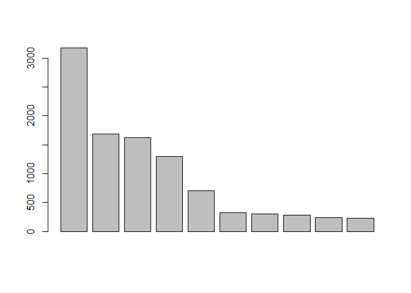<!-- -->

``` r
# Alarga a margem da janela para o gráfico.
par(mar = c(5,10,4,2) + 0.1, family = "serif")

# Gráfico
barplot(head(tab_familia$f, 10), # Selecionamos as 10 famílias de maior frequência. 
        horiz = T, # Argumento para colocar as barras verticais ou horizontais. T e TRUE são equivalentes.
        xlab = "Frequências",  # Colocamos título do eixo x
        names.arg = c(head(tab_familia$Category, 10)), las = 2, # Colocamos os nomes das famílias em cada barra.
        cex = 1.3, cex.lab = 1.5, cex.axis = 1.2, col = heat.colors(10)) # Estabelecemos tamanho das letras
# e cores para as barras.

# Colocamos uma linha no eixo y.
abline(v = 0)
```

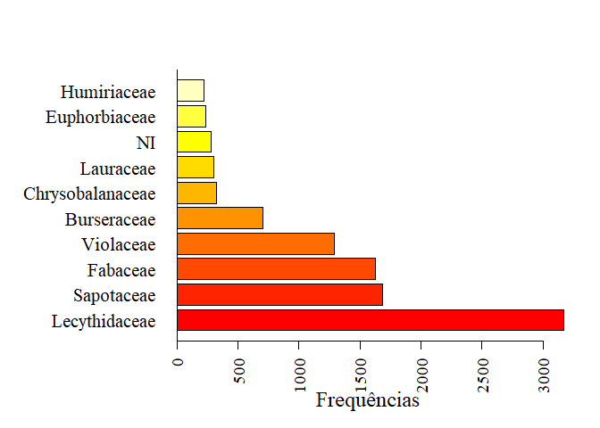<!-- -->

``` r
# Retorna a margem ao normal.
par(mar = c(5,4,4,2) + 0.1)
```

``` r
### Histograma para as classes de diâmetro

# O mais simples
hist(dados_pp$dbh)
```

<!-- -->

``` r
# Gráfico
plot(tab_diametro, xlab = "Classes de diâmetro",ylab = "Frequências", # Determina a base de dados e títulos dos eixos 
     cex.axis = 0.9, cex.lab = 1.1, # Edita o tamanho das letras 
     col = c(rainbow(15))) # Edita as cores
```

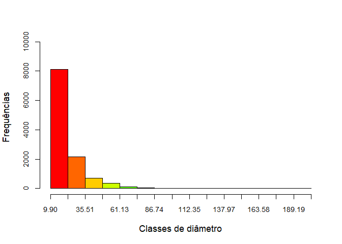<!-- -->

### Prática

``` r
# Faça o mesmo gráfico de barras para as 10 principais espécies
# Alarga a margem da janela para o gráfico.
par(mar = c(5,12,4,2) + 0.1, family = "serif")

# Gráfico
barplot(head(tab_especie$f, 10), # Selecionamos as 10 famílias de maior frequência. 
        horiz = T, # Argumento para colocar as barras verticais ou horizontais. T e TRUE são equivalentes.
        xlab = "Frequências",  # Colocamos título do eixo x
        names.arg = c(head(tab_especie$Category, 10)), las = 2, # Colocamos os nomes das famílias em cada barra.
        cex = 1.3, cex.lab = 1.5, cex.axis = 1.2, col = heat.colors(10)) # Estabelecemos tamanho das letras
# e cores para as barras.

# Colocamos uma linha no eixo y.
abline(v = 0)
```

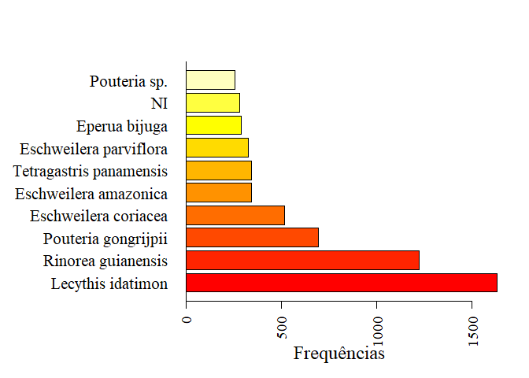<!-- -->

``` r
# Retorna a margem ao normal.
par(mar = c(5,4,4,2) + 0.1)
```

``` r
# Faça o histograma do diâmetro para Lecythis idatimon. Compare com o geral.

# Tabela para Lecythis
tab_dia_lecy <- fdt(dados_lecythis$dbh)

# Gráfico
plot(tab_dia_lecy, xlab = "Classes de diâmetro",ylab = "Frequências", # Determina a base de dados e títulos dos eixos 
     cex.axis = 0.9, cex.lab = 1.1, # Edita o tamanho das letras 
     col = c(rainbow(15))) # Edita as cores
```

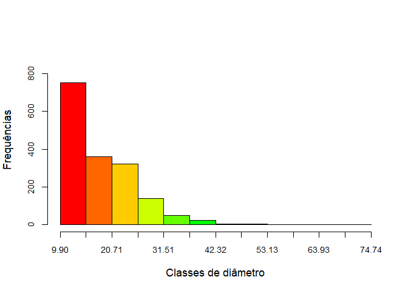<!-- -->
A amplitude entre o diâmetro máximo e mínimo é consideralvemente menor
para a espécie estudada em comparação com o total de árvores amostradas.
Por consequência, os intervalos de classes são menores. A distribuição
também está concentrada nos menores valores, mas com menos intensidade.

### Avaliando graficamente a tendência central e dispersão - boxplot

``` r
# O mais simples
boxplot(dados_pp$dbh)
```

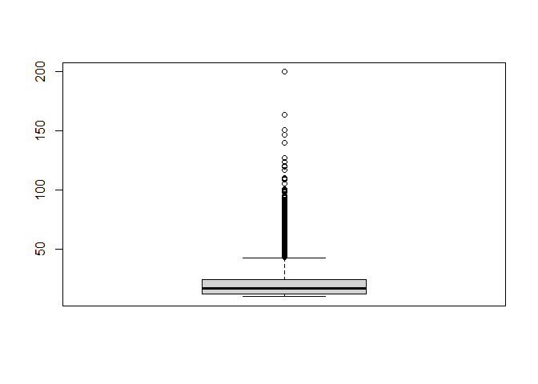<!-- -->

``` r
# Plotando os dados de diâmetro por transecto 
boxplot(data = dados_pp, dbh ~ transect, xlab = "Transecto", ylab = "Diâmetro (cm)",
        col = terrain.colors(22))
```

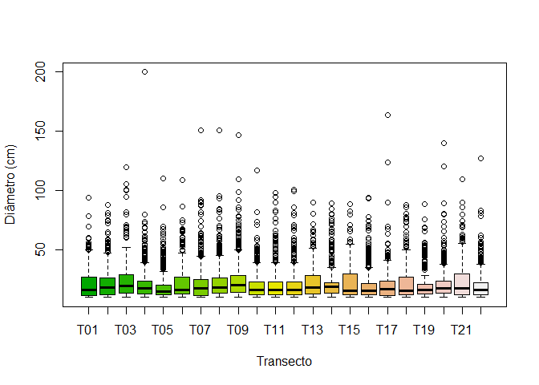<!-- -->

### Prática II

``` r
# Faça o boxplot para a altura nos transectos.
boxplot(data = dados_pp, Htot ~ transect, xlab = "Transecto", ylab = "Altura (m)",
        col = terrain.colors(22))
```

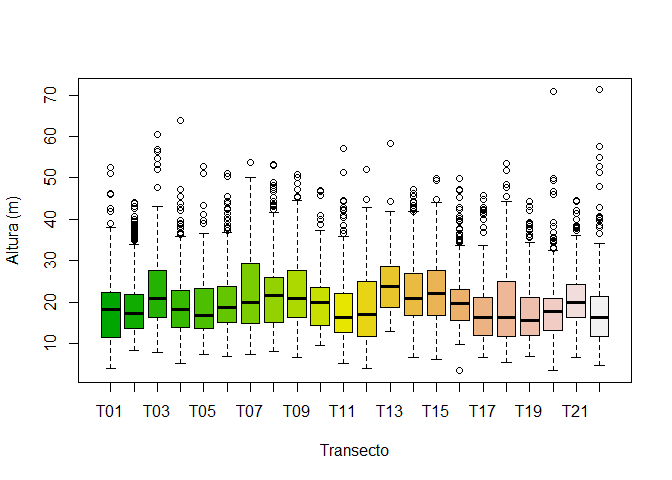<!-- -->

``` r
# Faça o boxplot do diâmetro para Lecythis idatimon nos transectos. Compare com o geral.
boxplot(data = dados_lecythis, dbh ~ transect, xlab = "Transecto", ylab = "Diâmetro (cm)",
        col = terrain.colors(22))
```

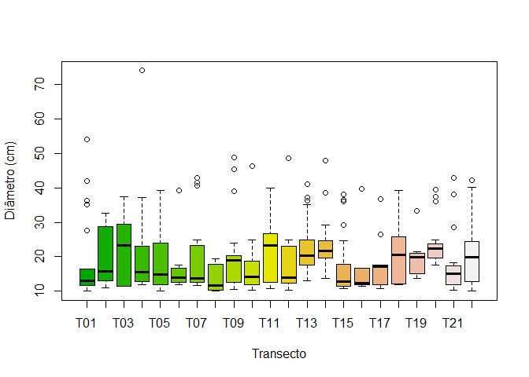<!-- -->
Há uma variação muito maior nos transectos para o diâmetro da espécie
estudada em relação ao diâmetro para todas as árvores amostradas. A
maioria dos transectos apresentou mediana em torno de 15 cm e parte
deles valores maiores que 20 cm. Esse resultado demonstra que existe uma
certa variação entre transectos e na distribuição espacial da espécie
considerada.

## 7) Associação entre variáveis

``` r
# Vamos explorar a associação entre diâmetro e altura

### Correlação linear
cor.test(dados_pp$dbh, dados_pp$Htot)
```

    ## 
    ##  Pearson's product-moment correlation
    ## 
    ## data:  dados_pp$dbh and dados_pp$Htot
    ## t = 103.1, df = 11549, p-value < 2.2e-16
    ## alternative hypothesis: true correlation is not equal to 0
    ## 95 percent confidence interval:
    ##  0.6826708 0.7016669
    ## sample estimates:
    ##       cor 
    ## 0.6922888

Existe uma correlação linear positiva de moderada a forte entre as
variáveis altura e diâmetro. Ou seja, árvores com maiores diâmetros tem
tendência de apresentar maiores alturas. Esse padrão pode ser observado
nos gráficos abaixo.

``` r
### Representação gráfica

# O mais simples
plot(data = dados_pp, Htot ~ dbh)
```

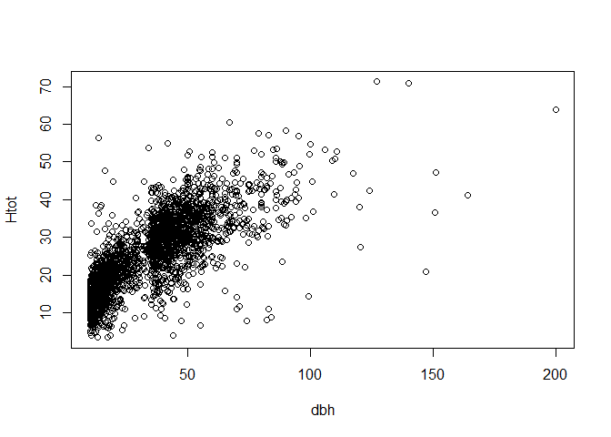<!-- -->

``` r
# Editando o gráfico
plot(data = dados_pp, Htot ~ dbh, xlab = "Diâmetro (cm)", ylab = "Altura (m)")

# Adicionando linha de tendência
abline(lm(data = dados_pp, Htot ~ dbh), col="darkred", lwd=3.5)
```

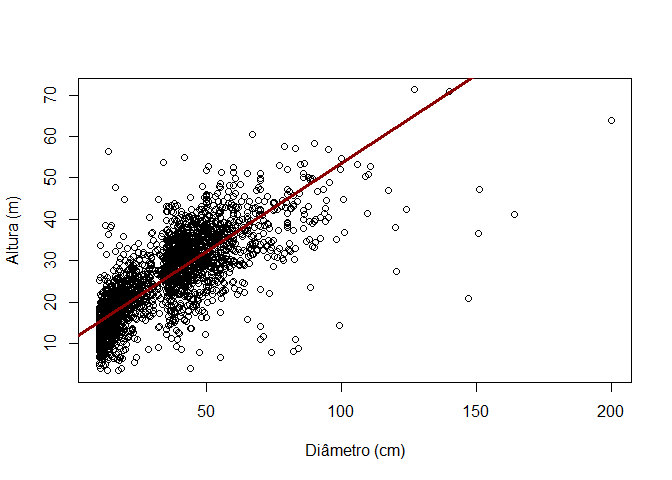<!-- -->

### Prática

``` r
# Avalie a associação entre o diâmetro e o volume.

## Correlação linear
cor.test(dados_pp$dbh, dados_pp$vol)
```

    ## 
    ##  Pearson's product-moment correlation
    ## 
    ## data:  dados_pp$dbh and dados_pp$vol
    ## t = 603.79, df = 11549, p-value < 2.2e-16
    ## alternative hypothesis: true correlation is not equal to 0
    ## 95 percent confidence interval:
    ##  0.9839569 0.9850772
    ## sample estimates:
    ##       cor 
    ## 0.9845271

``` r
# Plotando o gráfico
plot(data = dados_pp, vol ~ dbh, xlab = "Volume (m³)", ylab = "Diâmetro (cm)")

# Adicionando linha de tendência
abline(lm(data = dados_pp, vol ~ dbh), col="darkred", lwd=3.5)
```

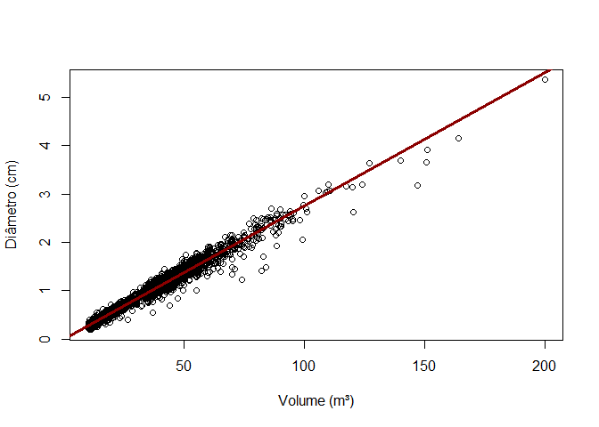<!-- -->
Os resultados demonstram um correlação linear positiva bastante forte
entre o diâmetro e o volume. Como é uma prática comum utilizar o
diâmetro (com ou sem outras variáveis) para estimar o volume, esses
resultados sugerem que no atual conjunto de dados o diâmetro pode ter
sido estimado.
