Curso de Introdução ao R
================
Jorge Alonso
2024-11-10

# 1. Introdução

**Objetivo do curso:** Apresentar o software R aos participantes,
demonstrar sua aplicação para análises estatísticas de dados de
inventário florestal e implementar a adaptação de códigos para realizar
análises semelhantes às apresentadas.

**Conteúdo do curso:** 1) Primeiros passos; 2) Operações básicas; 3)
Pacotes, funções e argumentos; 4) Noções de análise exploratória; 5)
Estatística descritiva; 6) Tabelas e gráficos; 7) Noções sobre
associação entre variáveis.

## 1.1. Primeiras observações

``` r
# No R o hashtag é utilizado para identificar uma linha de texto.
# Se começarmos a linha sem o "#" essa será uma linha de código.
# Rode o código abaixo como exemplo (pressione crtl + enter na linha abaixo):
print("Hello, World")
```

    ## [1] "Hello, World"

``` r
# Agora tente rodar o código dessa maneira:
# print("Hello, World")
```

``` r
# E dessa: 
# Hello, World 
# Erro: ',' inesperado em "Hello," 

# OBS: trecho adaptado para ser possível rodar o relatório final
```

``` r
# E mais essa:
"Hello, World"
```

    ## [1] "Hello, World"

O que aconteceu de diferente em cada caso?

``` r
# OBS: Quando queremos que o R leia texto ou caracteres, devemos colocar eles entre aspas.

# Podemos utilizar o "#" após um código para incluir observações:
print("Hello, World") # É uma tradição utilizar esse código como boas-vindas a uma linguagem de programação.
```

    ## [1] "Hello, World"

# 2. Operações básicas

## 2.1. De cálculo

``` r
1 + 2 # Adição
```

    ## [1] 3

``` r
4 - 2 # Subtração
```

    ## [1] 2

``` r
3 * 5 # Multiplicação
```

    ## [1] 15

``` r
10 / 2 # Divisão
```

    ## [1] 5

``` r
3 ^ 2 # Exponencial
```

    ## [1] 9

``` r
# Podemos combinar essas operações para fazer cálculos mais complexos.
# Utilize parênteses para que o cálculo seja feito na sequência correta.
# Exemplo:
(2 * (45 + 57)) / (4^3)
```

    ## [1] 3.1875

## 2.2. Operadores lógicos

``` r
1 == 1 # Igual
```

    ## [1] TRUE

``` r
1 == 2
```

    ## [1] FALSE

``` r
1 != 1 # Diferente
```

    ## [1] FALSE

``` r
1 > 3 # Maior
```

    ## [1] FALSE

``` r
1 < 3 # Menor
```

    ## [1] TRUE

``` r
1 <= 1 # Menor ou igual
```

    ## [1] TRUE

``` r
1 >= 3 # Maior ou igual
```

    ## [1] FALSE

``` r
# Podemos combinar as operação de cálculo com as lógicas:
(2 * (45 + 57)) / (4^3) > 3
```

    ## [1] TRUE

2.3. Prática:

``` r
# Um carro percorreu uma distância de 120 km em 90 minutos. Calcule sua velocidade em km/h.
120/(90/60)
```

    ## [1] 80

``` r
# Sabendo que o limite de velocidade dessa rodovia é de 90 km/h, demonstre com um operador 
# lógico se o limite foi ou não respeitado.
120/(90/60) <= 90
```

    ## [1] TRUE

``` r
80 <= 90
```

    ## [1] TRUE

# 3. Pacotes, funções e argumentos

``` r
# Instalando pacotes
# install.packages("forestmangr")

# OBS: código adaptado para rodar o realtório sem reinstalar o pacote
```

No R utilizamos funções para realizar as tarefas que desejamos. Por
exemplo, a função install.packages é utilizada para instalar pacotes. Os
pacotes são como “expansões” do R contendo novas funções, bases de
dados, etc.

``` r
### Carregando um pacote
library(forestmangr)
```

Após a instalação de um pacote e sempre que se desejarmos utilizar suas
funcionalidades temos que carregá-lo. A função library ou a função
require podem ser utilizadas para essa finalidade. Neste caso, estamos
carregando o pacote “forestmangr” que contém dados de inventários
florestais, além de algumas funções específicas para análise desse tipo
de dado.

``` r
# Pedindo ajuda:
help(package = "forestmangr")
# Vemos as funções que existem dentro pacote, bases de dados etc.
```

``` r
### Carregando um conjunto de dados do pacote
data("exfm20")
# O conjunto de dados "exfm20" é disponibilizado no pacote forestmangr. 
# Ele contém dados de um inventário em floresta nativa.
# Utilizamos a função data para carregar os dados.
```

``` r
# Para entender melhor nosso conjunto de dados:
help(exfm20)
```

    ## starting httpd help server ... done

``` r
# Equivalente a:
?exfm20
```

Neste curso faremos as demonstrações e práticas a partir de um conjunto
de dados disponibilizado em um pacote do R. Na prática, para fazer
análises em dados de um experimento nosso, precisariámos utilizar
funções que carreguem e leiam planilhas no Excel ou outros tipos de
arquivo.

Antes de proceder é importante conhecer alguns termos:

Observações: são os seus indivíduos ou unidades experimentais. Devem ser
colocados na linha das tabelas de dados.

Variáveis: são as medidas ou informações que você coletou de cada
observação. Devem ser colocadas nas colunas das tabelas de dados.

Células: o cruzamento de uma coluna com uma linha. Ou seja, onde eu
terei o valor ou categoria de uma variável “x” para uma observação “n”.

Data frame: tabela estruturada com observações nas linhas e variáveis
nas colunas.

``` r
# Vamos ver esses conceitos nos dados que acabamos de carregar:
View(exfm20)
# Temos 12.295 linhas correspondentes às árvores amostradas (observações) e...
# 18 colunas que são as variáveis mensuradas ou informações coletadas.
```

# 4. Criando objetos

``` r
# No R utilizamos objetos (ou vetores) para armazenar dados.
# Vamos ver um exemplo com os cálculos que fizemos antes:
conta <- (2 * (45 + 57)) / (4^3)
resultado <- 3.1875
conta == resultado
```

    ## [1] TRUE

``` r
## Para deixar o código mais claro utilizamos a seta (<-).
# Ela pode ser formada digitando "<" e depois "-" ou pelo atalho alt + -.
# Poderiámos ter utilizado o sinal de igual (=) ao invés da seta.
conta2 = (2 * (45 + 57)) / (4^3)
resultado2 = 3.1875
conta2 == resultado2
```

    ## [1] TRUE

``` r
# Veja como o R processa de forma diferente "=" e "==". 
# Mais adiante veremos porque é mais claro utilizar "<-" do que "=" para criar objetos.
```

``` r
# Podemos ainda reescrever objetos:
conta <- c((2+2), (2+3), (2+4), (2+5))
```

``` r
# Utilizamos a função "c" para passar ao R um conjunto de valores dentre de um objeto.
# Olha o que aconteceria se a gente não tivesse feito isso:
# conta <- ((2+2), (2+3), (2+4), (2+5))
# conta <- (4, 5, 6, 7)
# Erro: ',' inesperado em "conta <- ((2+2),"

# OBS: código modificado para que o erro não impedir a geração do relatório.
```

``` r
# Vamos criar mais um objeto para vermos novos exemplos:
exemplo <- c(1, 3, 5, 7)
```

``` r
# Por fim, conseguimos fazer operações também com objetos com mais de um valor e entre eles:
2 * conta
```

    ## [1]  8 10 12 14

``` r
conta > 5
```

    ## [1] FALSE FALSE  TRUE  TRUE

``` r
conta + exemplo
```

    ## [1]  5  8 11 14

``` r
conta >= exemplo
```

    ## [1] TRUE TRUE TRUE TRUE

``` r
# Com o código abaixo, criamos um objeto como nome mais fácil para trabalhar os nossos dados.
dados <- exfm20
# Daqui para frente iremos digitar várias vezes o nome do nosso objeto e "dados" é mais fácil de lembrar e digitar do que "exfm20".
```

## 4.1. Prática

``` r
# Crie um objeto contendo os valores 2, 4, 6 e 8 e outro contendo a, b, c e d.
# Dica: lembre de usar aspas para caracteres.
objeto1 <- c(2, 4, 6, 8)
objeto2 <- c("a", "b", "c", "d")
```

``` r
# Some os dois objetos. O que aconteceu?
# objeto1 + objeto2
# Error in objeto1 + objeto2 : argumento não-numérico para operador binário

# OBS: código modificado para que o erro não impedir a geração do relatório.
```

# 5. Resumindo o conjunto de dados

``` r
# Resumindo o conjunto de dados
summary(dados)
```

    ##       cod           transect         tree                 common.name  
    ##  CAU_A01:12295   T02    : 678   Min.   :  1.00   jatereu        :1651  
    ##                  T05    : 645   1st Qu.: 33.00   capueiro       :1242  
    ##                  T22    : 641   Median : 68.00   abiurana       : 695  
    ##                  T04    : 628   Mean   : 71.53   matamata       : 671  
    ##                  T19    : 624   3rd Qu.:104.00   morta          : 650  
    ##                  T14    : 623   Max.   :204.00   matamata branco: 463  
    ##                  (Other):8456                    (Other)        :6923  
    ##               scientific.name           family          dbh         canopy.pos 
    ##  Lecythis idatimon    :1651   Lecythidaceae:3192   Min.   : 10.00   C   :1483  
    ##  Rinorea guianensis   :1242   Sapotaceae   :1708   1st Qu.: 12.60   E   : 389  
    ##  Pouteria gongrijpii  : 695   Fabaceae     :1626   Median : 17.30   S   :9721  
    ##  Eschweilera coriacea : 516   Violaceae    :1312   Mean   : 21.48   NA's: 702  
    ##  Eschweilera amazonica: 344   Burseraceae  : 706   3rd Qu.: 24.80              
    ##  (Other)              :7197   (Other)      :3101   Max.   :200.00              
    ##  NA's                 : 650   NA's         : 650                               
    ##      light          dead              Hcom            Htot      
    ##  Min.   :1.000   Mode :logical   Min.   : 1.62   Min.   : 1.31  
    ##  1st Qu.:2.000   FALSE:11645     1st Qu.: 8.61   1st Qu.:13.40  
    ##  Median :2.000   TRUE :650       Median :11.95   Median :18.50  
    ##  Mean   :1.952                   Mean   :12.85   Mean   :19.33  
    ##  3rd Qu.:2.000                   3rd Qu.:16.10   3rd Qu.:24.12  
    ##  Max.   :3.000                   Max.   :42.24   Max.   :71.22  
    ##  NA's   :702                     NA's   :722                    
    ##       date             utm.east        utm.north            vol        
    ##  Min.   :20120127   Min.   :777973   Min.   :9583583   Min.   :0.1891  
    ##  1st Qu.:20120203   1st Qu.:779042   1st Qu.:9584571   1st Qu.:0.3466  
    ##  Median :20120211   Median :779721   Median :9585348   Median :0.4780  
    ##  Mean   :20120252   Mean   :779664   Mean   :9585455   Mean   :0.5936  
    ##  3rd Qu.:20120316   3rd Qu.:780342   3rd Qu.:9586494   3rd Qu.:0.7028  
    ##  Max.   :20120326   Max.   :780844   Max.   :9587278   Max.   :5.3567  
    ##                                                        NA's   :722     
    ##    plot.area       total.area
    ##  Min.   :10000   Min.   :50  
    ##  1st Qu.:10000   1st Qu.:50  
    ##  Median :10000   Median :50  
    ##  Mean   :10000   Mean   :50  
    ##  3rd Qu.:10000   3rd Qu.:50  
    ##  Max.   :10000   Max.   :50  
    ## 

``` r
# Com a função summary conseguimos ter uma visão geral dos dados.
# O que vocês conseguem observar?
```

``` r
# Aprofundando a questão das classes (ou tipos) de variáveis e objetos:
class(dados) # Veja que o R lê o objeto que contém nossos dados como um data frame.
```

    ## [1] "tbl_df"     "tbl"        "data.frame"

``` r
class(conta) # Esse objeto ele leu como numeric.
```

    ## [1] "numeric"

``` r
class("a") # Agora como character
```

    ## [1] "character"

``` r
class(as.list(c("a", "b", "c"))) # Por fim, como uma lista.
```

    ## [1] "list"

Sobre combinar funções:

É muito comum aninhar funções (nesting), ou seja, combinar elas. Essa
técnica pode ser muito útil para resolvermos inúmeros problemas práticos
que surgem ao analisar dados.

No exemplo acima, demos à função “class” uma lista criada com a função
“as.list” a partir de um conjunto de categorias criado com a função “c”.

``` r
# Vamos dividir em passos o que foi feito:
c("a", "b", "c") # Criamos um conjunto com as categorias a, b e c
```

    ## [1] "a" "b" "c"

``` r
as.list(c("a", "b", "c")) # Criamos uma lista com três objetos a, b e c
```

    ## [[1]]
    ## [1] "a"
    ## 
    ## [[2]]
    ## [1] "b"
    ## 
    ## [[3]]
    ## [1] "c"

``` r
lista <- as.list(c("a", "b", "c")) # Uma outra abordagem seria criar um objeto para essa lista
```

``` r
class(lista) # Chegamos ao mesmo resultado! Note como pode ser prático aninhar funções.
```

    ## [1] "list"

``` r
# Podemos ainda querer conhecer as classes de cada uma das nossas variáveis
str(exfm20)
```

    ## Classes 'tbl_df', 'tbl' and 'data.frame':    12295 obs. of  18 variables:
    ##  $ cod            : Factor w/ 1 level "CAU_A01": 1 1 1 1 1 1 1 1 1 1 ...
    ##  $ transect       : Factor w/ 22 levels "T01","T02","T03",..: 1 1 1 1 1 1 1 1 1 1 ...
    ##  $ tree           : int  2 5 6 7 9 10 12 13 14 15 ...
    ##  $ common.name    : Factor w/ 187 levels "abiu canelado",..: 121 45 38 28 28 42 45 103 103 146 ...
    ##  $ scientific.name: Factor w/ 172 levels "Abarema cochleata",..: 87 86 6 130 130 123 86 82 82 91 ...
    ##  $ family         : Factor w/ 43 levels "Anacardiaceae",..: 11 11 1 8 8 39 11 22 22 39 ...
    ##  $ dbh            : num  10.3 14.6 78.8 14.7 10.6 27.1 15.1 16.5 12 38.4 ...
    ##  $ canopy.pos     : Factor w/ 3 levels "C","E","S": 3 3 2 3 2 1 2 3 3 1 ...
    ##  $ light          : int  2 2 1 2 3 2 2 2 1 2 ...
    ##  $ dead           : logi  FALSE FALSE FALSE FALSE FALSE FALSE ...
    ##  $ Hcom           : num  4.59 9.16 21.06 7.35 4.9 ...
    ##  $ Htot           : num  7.83 10.27 31.65 11.54 6.91 ...
    ##  $ date           : int  20120127 20120127 20120127 20120127 20120127 20120127 20120127 20120127 20120127 20120127 ...
    ##  $ utm.east       : num  778460 778444 778444 778443 778436 ...
    ##  $ utm.north      : num  9586872 9586870 9586872 9586870 9586869 ...
    ##  $ vol            : num  0.24 0.393 2.048 0.371 0.251 ...
    ##  $ plot.area      : int  10000 10000 10000 10000 10000 10000 10000 10000 10000 10000 ...
    ##  $ total.area     : int  50 50 50 50 50 50 50 50 50 50 ...

Algumas definições antes de prosseguir:

Classe “Factor”: atribuída a variáveis qualitativas nominais ou
ordinais;

Classe “int” (integer): atribuída a variáveis quantitativas discretas;

Classe “num” (numeric): atribuída a variáveis quantitativas contínuas;

Classe “logi” (logical): atribuída a uma variável contendo respostas
lógicas (TRUE ou FALSE).

Níveis (levels): são os valores ou categorias distintas que uma variável
pode assumir.

OBS: é válido saber que existem outras classes de variáveis e objetos,
além das que observamos.

``` r
# Podemos converter alguns objetos e variáveis para outras classes:
fator <- factor(conta) # Transformamos o objeto numérico conta em fator
class(fator) # Verificamos se deu certo
```

    ## [1] "factor"

``` r
numerico <- as.numeric(fator) # Transformamos ele de novo em numérico
class(numerico) # Verificamos se deu certo
```

    ## [1] "numeric"

OBS: podemos usar, por exemplo, “factor” ou “as.factor” para fazer a
primeira tarefa. A função “factor” em geral é utilizada para converter
dados brutos à classe. A função “as.factor” em geral é utilizada para
converter um objeto já existente.

## 5.1. Prática

``` r
# Identifique a classe dos objetos que você criou na prática anterior
class(objeto1)
```

    ## [1] "numeric"

``` r
class(objeto2)
```

    ## [1] "character"

``` r
# Ou
str(objeto1)
```

    ##  num [1:4] 2 4 6 8

``` r
str(objeto2)
```

    ##  chr [1:4] "a" "b" "c" "d"

``` r
# Crie um novo objeto contendo 1, 2, 3 e d. Identifique a classe dele.
objeto3 <- c(1, 2, 3, "d")
class(objeto3)
```

    ## [1] "character"

``` r
# Coverta ele em fator e verifique. 
# Use a função "levels" depois a "unique" para identificar seus níveis. Compare as duas.
objeto3 <- factor(objeto3)
class(objeto3)
```

    ## [1] "factor"

``` r
levels(objeto3)
```

    ## [1] "1" "2" "3" "d"

``` r
unique(objeto3)
```

    ## [1] 1 2 3 d
    ## Levels: 1 2 3 d

# 6. Estabelecendo argumentos dentro de funções

``` r
# Vamos utilizar como exemplo a função do R que cria dados aleatórios com distribuição normal.
# Primeiro vamos rodar ela e ver o que acontece:
rnorm(n = 10, mean = 5, sd = 1)
```

    ##  [1] 5.403484 4.754229 4.010255 7.294423 4.490696 5.235335 5.249779 5.245446
    ##  [9] 4.663675 3.900689

``` r
# Geramos 10 valores de uma distribuição normal com média 5 e desvio padrão 1.
```

``` r
# Agora vamos entender os argumentos dessa função:
help(rnorm)
# O argumento "n" corresponde ao número de observações;
# "mean corresponde a média da distribuição;
# "sd" corresponde ao desvio padrão.
```

``` r
# Podemos mudar esses argumentos para que a função nos retorne outro resultado.
# vamos agora gerar 20 observações com média 10 e desvio 2 (população fictícia com essa média e desvio).
# Vamos utilizar a função "set.seed" para garantir que os valores gerados sejam sempre iguais
set.seed(555)
rnorm(n = 20, mean = 10, sd = 2)
```

    ##  [1]  9.340279 11.007293 10.748739 13.777240  6.440195 11.771262  9.686455
    ##  [8] 12.729110 10.073274 11.237060  9.442605  8.665583  8.001641  8.295560
    ## [15]  8.649394  9.836924 10.521232  8.461130  7.112171 11.021578

``` r
# Se colocarmos os argumentos na posição certa, não precisamos identificar eles na função:
set.seed(555)
rnorm(20, 10, 2)
```

    ##  [1]  9.340279 11.007293 10.748739 13.777240  6.440195 11.771262  9.686455
    ##  [8] 12.729110 10.073274 11.237060  9.442605  8.665583  8.001641  8.295560
    ## [15]  8.649394  9.836924 10.521232  8.461130  7.112171 11.021578

``` r
# No entanto, se colocarmos fora de ordem...
set.seed(555)
rnorm(2, 20, 10)
```

    ## [1] 16.70140 25.03646

``` r
# Geramos um resultado diferente do desejado.
# Temos duas observações a partir de uma população fictícia com média 20 e do desvio 10.
```

``` r
# Identificando os argumentos na função, podemos alterar sua ordem e teremos o resultado desejado:
set.seed(555)
rnorm(sd = 2, n = 20, mean = 10)
```

    ##  [1]  9.340279 11.007293 10.748739 13.777240  6.440195 11.771262  9.686455
    ##  [8] 12.729110 10.073274 11.237060  9.442605  8.665583  8.001641  8.295560
    ## [15]  8.649394  9.836924 10.521232  8.461130  7.112171 11.021578

## 6.1. Prática

``` r
# Rode o código rnorm(20, 10, 2) duas vezes sem utilizar a função "set.seed" antes.
# Primeira
rnorm(20, 10, 2)
```

    ##  [1] 11.393738 10.920011  7.678826 12.553879  7.883538 10.084389 11.347003
    ##  [8]  9.814259  9.605948 12.882534  9.587659  9.400104 10.529555  9.499996
    ## [15]  9.403469 10.356606  9.104056 11.128479  8.811007  8.056626

``` r
# Segunda
rnorm(20, 10, 2)
```

    ##  [1] 14.428804 12.841221 11.773470  9.263975  8.186597 10.661314 10.783955
    ##  [8]  9.327724 14.516056  3.748997 12.296513 10.178190 10.569097  9.556986
    ## [15]  9.667386  8.090982 12.196638  8.687570  7.775807 10.137471

``` r
# Agora rode duas vezes com o código set.seed(555) na linha anterior.
# Primeira
set.seed(555)
rnorm(20, 10, 2)
```

    ##  [1]  9.340279 11.007293 10.748739 13.777240  6.440195 11.771262  9.686455
    ##  [8] 12.729110 10.073274 11.237060  9.442605  8.665583  8.001641  8.295560
    ## [15]  8.649394  9.836924 10.521232  8.461130  7.112171 11.021578

``` r
# Segunda
set.seed(555)
rnorm(20, 10, 2)
```

    ##  [1]  9.340279 11.007293 10.748739 13.777240  6.440195 11.771262  9.686455
    ##  [8] 12.729110 10.073274 11.237060  9.442605  8.665583  8.001641  8.295560
    ## [15]  8.649394  9.836924 10.521232  8.461130  7.112171 11.021578

``` r
# O que aconteceu?
```

# 7. Filtrando dados

``` r
# Filtrando dados
dados_lecythis <- subset(x = dados, subset = scientific.name == "Lecythis idatimon")

# Verificando
head(dados_lecythis)
```

    ##        cod transect tree common.name   scientific.name        family  dbh
    ## 8  CAU_A01      T01   13     jatereu Lecythis idatimon Lecythidaceae 16.5
    ## 9  CAU_A01      T01   14     jatereu Lecythis idatimon Lecythidaceae 12.0
    ## 17 CAU_A01      T01   23     jatereu Lecythis idatimon Lecythidaceae 35.2
    ## 31 CAU_A01      T01   46     jatereu Lecythis idatimon Lecythidaceae 10.0
    ## 38 CAU_A01      T01   61     jatereu Lecythis idatimon Lecythidaceae 13.0
    ## 53 CAU_A01      T01   92     jatereu Lecythis idatimon Lecythidaceae 42.0
    ##    canopy.pos light  dead  Hcom  Htot     date utm.east utm.north       vol
    ## 8           S     2 FALSE  7.61 11.46 20120127 778423.2   9586868 0.4124726
    ## 9           S     1 FALSE  8.41 12.26 20120127 778417.2   9586868 0.3253269
    ## 17          C     1 FALSE 20.19 37.54 20120127 778313.5   9586864 1.0312581
    ## 31          S     1 FALSE  6.97  9.03 20120127 778134.6   9586848 0.2645263
    ## 38          S     3 FALSE  9.44 15.63 20120127 778051.8   9586838 0.3596914
    ## 53          E     1 FALSE 19.95 32.47 20120127 778101.2   9586842 1.1912642
    ##    plot.area total.area
    ## 8      10000         50
    ## 9      10000         50
    ## 17     10000         50
    ## 31     10000         50
    ## 38     10000         50
    ## 53     10000         50

``` r
# Utilizamos a função subset para filtrar os dados
# Dentro das funções no R podemos utilizar argumentos para especificar o que queremos fazer
# O argumento subset foi utilizado para filtrar os dados pela coluna scientific.name
# E para células com o nível "Lecythis idatimon" dentro dessa coluna
```

``` r
# Outros tipos de filtros
dados$dbh # Coluna
```

    ##     [1]  10.3  14.6  78.8  14.7  10.6  27.1  15.1  16.5  12.0  38.4  48.5  50.3
    ##    [13]  41.9  11.4  15.0  15.5  35.2  59.3  11.0  52.0  52.2  40.2  40.6  36.1
    ##    [25]  10.3  27.0  46.0  15.7  19.1  17.0  10.0  43.5  38.5  15.7  46.0  36.5
    ##    [37]  22.0  13.0  70.0  10.6  18.6  24.2  17.0  33.1  40.9  20.2  36.4  44.0
    ##    [49]  26.8  46.6  35.6  10.0  42.0  33.1  12.0  11.7  17.9  26.4  11.6  20.6
    ##    [61]  36.5  53.0  41.2  46.9  28.1  39.1  35.4  10.9  60.0  52.8  48.4  27.8
    ##    [73]  59.6  22.4  10.3  36.6  36.6  36.3  14.9  27.7  53.2  22.5  11.0  71.2
    ##    [85]  40.0  35.4  38.0  50.6  50.0  55.0  56.0  39.0  41.0  40.0  49.6  44.5
    ##    [97]  50.0  55.0  42.7  38.0  35.5  49.8  52.1  35.3  35.3  48.5  46.4  93.9
    ##   [109]  37.0  50.5  41.3  39.1  56.0  43.5  36.8  54.0  24.5  72.5  10.3  10.6
    ##   [121]  15.5  23.9  26.4  14.4  12.5  44.5  50.0  12.2  55.4  37.9  74.5  55.3
    ##   [133]  10.9  22.8  17.4  88.0  10.3  58.2  40.8  20.4  18.8  27.2  43.4  35.0
    ##   [145]  12.6  10.4  15.8  40.8  17.5  24.0  58.9  39.8  48.6  10.6  32.7  17.1
    ##   [157]  34.5  11.3  23.5  11.1  20.8  21.0  42.0  10.4  25.3  12.8  32.0  54.3
    ##   [169]  36.7  28.8  47.2  28.9  88.3  26.5  46.0  42.0  36.8  50.2  15.7  63.8
    ##   [181]  10.9  10.8  51.4  31.7  13.1  18.3  58.7  10.0  18.2  65.0  28.7  21.0
    ##   [193]  37.0  41.3  37.7  17.5  38.0  16.7  40.5  40.8  45.0  56.8  11.0  25.0
    ##   [205]  14.0  43.2  52.0  15.4  29.3  22.5  20.4  79.4  10.2  11.0  19.0  12.0
    ##   [217]  54.5  41.0  50.0  39.9  37.4  53.4  75.0  43.1  52.1  35.8  48.1  45.3
    ##   [229]  53.3  46.4  53.0  46.0  57.8  52.0  38.4  43.7  53.3  44.8  42.0  48.9
    ##   [241]  40.1  50.0  48.0  36.9  81.0  41.4  52.9  45.0  35.9  43.0  37.8  52.4
    ##   [253]  36.4  56.3  49.3  49.0 105.7  11.4  18.0  14.0  32.5  37.4 100.0  11.3
    ##   [265]  37.0  24.6  60.0  14.4  60.9  45.5  69.8  12.8  35.9  16.5  49.0  67.0
    ##   [277] 101.1  38.7  17.9  60.2  60.6  47.3  27.1  13.6  20.8  63.3  30.9  67.0
    ##   [289]  16.5  38.8  10.4  36.0  39.7  41.6  23.4  45.4 120.0  13.5  65.0  12.8
    ##   [301]  82.0  28.4  71.0  13.0  68.7  80.0  36.7  12.0  29.5  22.2  20.4  14.1
    ##   [313]  11.4  12.0  36.5  44.5  15.4  69.3  32.9  29.4  63.3  49.8  19.9  20.7
    ##   [325]  95.0  10.9  51.6  38.0  40.4  36.1  37.3  36.5  36.5  35.6  48.5  42.2
    ##   [337]  41.1  52.5  52.2  45.7  43.9  50.0  46.5  46.5  44.0  17.3  20.6  35.6
    ##   [349]  17.3  14.7  10.0  15.6  54.0 200.0  19.0  28.9  14.5  11.6  30.1  31.9
    ##   [361]  12.5  20.1  51.5  13.6  28.5  10.2  40.4  17.6  15.7  55.0  65.0  30.0
    ##   [373]  16.7  72.5  23.1  16.8  12.0  29.4  16.4  50.6  72.7  40.7  40.8  14.0
    ##   [385]  80.0  19.0  46.3  10.1  51.9  16.2  58.1  39.9  33.8  37.1  21.1  51.8
    ##   [397]  17.7  22.2  39.1  57.6  18.4  20.4  13.1  61.7  10.6  48.7  11.8  45.6
    ##   [409]  74.0  46.9  12.8  18.9  18.4  39.9  16.6  60.0  24.4  41.0  55.1  10.8
    ##   [421]  27.5  18.5  50.0  39.5  69.2  60.0  11.1  17.7  21.1  38.2  60.5  30.0
    ##   [433]  15.5  11.5  43.0  23.7  46.8  36.5  36.1  42.6  59.2  54.9  40.0  45.7
    ##   [445]  45.5  40.7  68.1  37.3  10.5  40.4  41.2  48.9  36.7  39.5  10.7  41.1
    ##   [457]  43.5  35.5  45.0  36.6  38.1  42.2  41.1  46.6  39.9  42.9  50.4  54.4
    ##   [469]  46.6  10.4  35.8  47.7  10.2  13.5  86.3  21.5  23.3  16.3  20.4  13.4
    ##   [481]  15.5  44.2  16.8  12.0  16.2  34.0  77.8  19.8  12.5  10.0  34.9  32.2
    ##   [493]  24.5  40.5  11.7  11.8  19.0  45.5  27.5  15.0  14.1  23.5  18.8  19.6
    ##   [505]  86.0  13.7  14.0  11.4  62.0  36.7  22.6  39.2  69.5  10.1  16.6  13.8
    ##   [517]  15.2  12.0  80.8  23.9  39.3  15.7  10.6  11.0  18.0  50.0  50.5  21.5
    ##   [529]  15.7  65.3  24.4  63.5  46.0  14.9 110.5  11.9  45.8  13.7  10.6  13.5
    ##   [541]  10.6  13.1  15.9  43.0  11.3  59.8  12.9  17.2  15.8  55.5  11.5  56.8
    ##   [553]  43.8  38.6  11.6  36.9  55.0  52.3  41.3  38.9  54.9  49.0  56.8  42.9
    ##   [565]  35.8  40.8  68.0  43.0  39.1  39.0  47.9  36.6  40.2  37.0  35.0  36.0
    ##   [577]  41.7  40.4  35.6  59.5  46.8  35.4  38.3  42.9  49.9  65.0  13.6  31.4
    ##   [589]  35.3  16.6  60.2  67.0  15.5  50.4  36.5  50.0  13.9  47.1  31.7 108.8
    ##   [601]  57.1  10.7  29.6  37.8  40.0  31.8  11.7  35.0  23.5  37.8  49.7  12.5
    ##   [613]  27.2  67.4  50.1  13.6  19.4  50.0  28.5  16.2  66.2  52.6  13.1  66.2
    ##   [625]  17.6  23.5  11.1  42.0  10.1  14.0  20.5  55.1  11.6  13.7  14.3  14.1
    ##   [637]  11.8  16.4  11.7  16.7  33.5  16.9  20.3  28.0  10.3  36.8  14.2  86.8
    ##   [649]  45.0  65.5  11.1  14.8  12.8  21.6  58.0  32.4  10.6  12.0  56.4  46.2
    ##   [661]  75.0  50.5  20.2  18.2  40.0  54.5  10.9  56.0  10.3  32.5  22.1  17.7
    ##   [673]  38.5  15.7  36.5  42.0  56.0  55.4  35.0  35.3  44.0  40.5  42.0  38.6
    ##   [685]  39.3  45.0  41.0  60.7  43.8  41.5  49.9  37.3  44.4  45.0  37.5  43.9
    ##   [697]  73.3  55.0  56.0  39.8  37.5  50.0  43.0  33.8  33.7  55.0  15.5  10.8
    ##   [709]  23.2  10.8  20.2  18.9  11.0  26.5  22.4  92.1  74.7  42.3  40.2  12.3
    ##   [721]  87.6  17.5  24.9  38.9  36.7  11.1  55.0  37.2  16.0  14.5  11.5  58.8
    ##   [733]  89.8  24.5  47.0  70.0  18.7  42.5  14.6  39.8  10.2  10.1  64.2  54.1
    ##   [745]  22.2  49.4  82.2 150.7  21.5  10.3  31.8  12.5  11.7  17.8  21.8  49.5
    ##   [757]  37.8  80.0  24.8  35.8  23.3  15.6  40.5  54.8  41.2  33.5  43.6  47.9
    ##   [769]  91.0  62.4  82.1  46.1  87.8  44.1  55.0  11.7  13.7  19.9  64.6  35.5
    ##   [781]  10.1  14.2  13.7  11.8  11.1  14.5  56.4  12.8  23.1  46.1  61.5  56.6
    ##   [793]  60.5  36.6  13.1  42.3  47.4  39.0  35.5  43.0  35.7  43.0  36.3  40.5
    ##   [805]  39.6  50.0  45.5  45.4  41.6  38.0  57.5  41.5  58.7  44.7  64.0  60.5
    ##   [817]  37.7  36.5  36.5  42.6  44.5  40.0  51.5  52.0  42.0  46.8  45.2  37.4
    ##   [829]  75.3  33.0  15.8  11.4  27.8  24.2  55.0  11.7  41.6  60.6  18.1  58.4
    ##   [841]  58.0  50.0  52.5  14.2 151.0  17.9  11.5  20.3  55.0  12.5  24.7  10.2
    ##   [853]  22.0  35.6  17.2  28.7  33.2  41.7  11.9  13.9  83.7  76.8  60.3  44.5
    ##   [865]  13.5  59.5  29.0  26.4  35.0  18.4  51.0  28.1  48.0  11.0  14.8  53.2
    ##   [877]  23.5  32.3  38.6  55.0  44.2  14.9  70.6  36.7  10.0  37.2  10.7  13.4
    ##   [889]  49.3  50.2  17.8  82.0  60.0  19.1  36.8  14.6  62.6  51.5  69.0  19.5
    ##   [901]  35.3  48.5  51.0  17.8  38.1  41.0  18.0  93.6  57.5  84.7  13.6  54.1
    ##   [913]  25.6  33.5  11.7  95.6  13.3  21.7  26.1  17.9  50.2  47.3  52.3  39.8
    ##   [925]  46.5  54.0  61.8  43.8  66.8  42.3  35.0  45.3  37.5  54.3  53.7  53.0
    ##   [937]  50.0  38.0  41.5  40.8  36.8  38.4  27.2  42.4  47.9  48.6  63.7  57.0
    ##   [949]  20.3  10.9  75.0  51.2  52.7  19.0  36.2  10.5  41.8  51.7  19.0  35.8
    ##   [961]  92.0  44.7  59.8  12.5  45.0  20.8  58.4  99.0  24.0  24.6 109.8  14.4
    ##   [973]  14.3  51.1  50.4  18.5  11.5  13.3  40.0  84.0  54.6  85.8  17.0  43.9
    ##   [985]  69.9  11.0  49.7  78.5  20.2  12.5  65.3  21.1  20.3  38.4  38.5  15.3
    ##   [997]  44.6  70.0  71.0  55.0  15.0  62.0  13.2  50.2  55.0  41.7 147.0  14.1
    ##  [1009]  57.1  12.0  51.0  24.0  51.4  50.8  43.2  26.3  28.6  41.0  10.5  60.8
    ##  [1021]  44.2  46.1  13.3  72.5  10.3  33.7  21.5  31.0  10.6  30.2  19.1  67.1
    ##  [1033]  24.5  16.6  19.9  14.2  38.4  32.5  12.5  43.1  64.1  54.5  44.9  48.4
    ##  [1045]  55.2  52.7  41.3  41.3  42.0  39.0  41.6  36.3  78.0  49.6  40.3  45.0
    ##  [1057]  36.5  48.8  50.0  38.4  45.9  38.3  60.7  36.0  63.8  45.4  56.3  35.7
    ##  [1069]  57.3  38.2  53.0  68.0  37.9  56.5  39.7  37.5  40.5  52.3  46.9  41.7
    ##  [1081]  45.9  11.1  15.2  10.5  17.6  14.7  45.2  11.6  20.6  13.8  71.0  13.4
    ##  [1093]  13.9  18.8  16.7  10.4  11.3 117.2  24.8  51.1  58.0  26.7  22.7  10.9
    ##  [1105]  20.0  40.7  43.7  25.2  45.6  11.8  46.3  45.1  45.4  11.4  16.6  17.2
    ##  [1117]  21.3  82.2  50.9  23.3  35.9  44.1  35.9  73.9  60.0  23.1  40.0  18.5
    ##  [1129]  10.1  44.0  37.8  24.9  12.2  22.9  52.6  13.5  26.4  15.6  17.5  10.2
    ##  [1141]  48.6  16.4  14.1  11.3  35.2  29.8  40.2  16.5  11.4  60.0  14.8  21.5
    ##  [1153]  40.0  41.2  46.0  37.9  39.1  70.0  44.0  37.9  44.0  36.5  49.8  36.5
    ##  [1165]  41.4  42.0  41.9  50.0  42.8  36.1  45.3  42.5  46.9  51.7  38.6  45.7
    ##  [1177]  49.6  53.5  48.2  37.8  37.7  46.6  50.8  38.2  53.0  39.4  16.4  12.5
    ##  [1189]  22.6  55.3  28.2  23.1  11.8  12.0  47.3  35.2  82.0  50.4  10.9  16.3
    ##  [1201]  10.3  14.0  11.2  19.5  54.2  63.8  98.0  10.8  16.9  97.1  11.7  16.1
    ##  [1213]  10.4  18.3  18.2  19.8  12.6  91.5  21.5  55.8  10.8  14.1  40.3  41.6
    ##  [1225]  60.0  33.2  36.0  76.2  50.7  13.4  54.5  32.9  73.2  26.7  12.6  42.0
    ##  [1237]  38.8  10.4  90.1  61.8  62.3  14.9  10.8  94.5  42.1  12.8  83.0  23.3
    ##  [1249]  24.9  38.5  46.1  39.6  19.2  40.7  29.6  14.6  19.0  13.0  20.2  13.9
    ##  [1261]  22.0  11.5  11.1  32.0  40.0  35.7  16.0  23.4  14.7  95.0  57.4  59.4
    ##  [1273]  43.5  40.0  36.0  47.7  39.0  44.9  45.1  41.9  66.7  35.2  39.4  58.9
    ##  [1285]  46.4  41.2  40.6  36.5  45.6  37.9  57.5  35.0  42.2  42.2  48.7  38.2
    ##  [1297]  41.7  55.9  10.3  12.3  50.0  18.3  57.9  41.8  46.5  20.9  53.3  47.6
    ##  [1309]  10.7  28.7  12.3  15.0  60.0  13.2  43.4  50.6  28.8  20.6  52.3  45.0
    ##  [1321]  22.9  13.9  51.7  58.5  53.7  13.8  20.2  40.0  38.0  25.0  60.0  10.2
    ##  [1333]  16.2  81.3  23.1  11.8  12.1  86.0  14.3  28.0  56.1  35.2  40.6  10.9
    ##  [1345]  35.3  38.3  48.5  70.8  48.5  35.5  51.3  79.2  54.4  99.6  12.6  49.0
    ##  [1357]  41.0  12.3  20.4  43.5  13.0  54.8  35.9  25.0  10.1  36.5 100.7  15.4
    ##  [1369]  38.0  39.0  55.1  42.7  58.2  20.8  36.9  36.2  35.0  47.3  35.2  68.6
    ##  [1381]  35.5  12.7  11.5  17.5  13.0  42.7  66.4  12.2  23.0  70.0  10.9  37.6
    ##  [1393]  46.2  19.1  48.5  12.2  17.6  44.7  36.4  58.0  37.9  10.5  37.1  20.2
    ##  [1405]  17.7  42.0  37.9  28.7  65.0  17.8  51.7  58.7  66.0  53.4  45.5  35.0
    ##  [1417]  37.1  10.3  36.2  24.8  48.0  48.1  10.4  45.8  53.2  55.0  65.8  35.3
    ##  [1429]  40.0  39.3  45.0  10.7  16.5  33.6  10.1  48.9  42.0  16.0  35.0  47.5
    ##  [1441]  52.8  17.0  11.5  29.1  36.8  45.9  13.0  37.0  11.4  29.4  14.8  35.4
    ##  [1453]  48.1  14.3  22.6  80.5  38.7  47.0  36.2  37.2  64.9  37.8  37.5  56.4
    ##  [1465]  10.5  20.1  38.9  48.3  90.0  13.0  43.5  15.7  42.7  50.7  14.1  62.1
    ##  [1477]  34.3  44.0  22.4  36.5  23.3  45.0  37.8  37.0  38.9  16.9  38.6  12.5
    ##  [1489]  36.7  42.7  37.7  35.2  18.1  14.9  10.4  20.5  20.6  67.0  42.3  13.1
    ##  [1501]  33.3  37.4  51.3  20.6  10.8  30.1  18.8  18.4  17.8  42.0  55.1  37.5
    ##  [1513]  15.0  10.1  40.4  48.4  38.1  41.0  43.5  36.1  42.5  42.9  22.0  36.5
    ##  [1525]  20.3  72.0  38.7  53.0  42.1  58.4  50.3  72.4  71.2  22.2  15.4  19.8
    ##  [1537]  13.1  17.1  42.4  10.0  19.1  11.5  48.3  21.0  53.4  15.0  22.5  80.0
    ##  [1549]  42.7  24.2  39.6  19.9  19.7  24.7  52.2  17.6  15.6  17.1  37.9  28.8
    ##  [1561]  18.2  57.2  48.0  45.3  11.0  26.4  37.0  39.2  38.6  29.2  12.5  11.2
    ##  [1573]  14.1  53.1  76.4  36.0  49.0  21.1  21.8  35.1  18.8  14.0  41.0  43.0
    ##  [1585]  89.3  84.4  41.1  41.6  13.2  22.0  42.7  40.1  21.0  36.0  10.2  19.2
    ##  [1597]  40.7  29.8  22.1  11.0  17.9  11.7  55.0  41.0  39.2  52.2  23.5  40.7
    ##  [1609]  67.5  59.1  18.0  16.6  18.8  49.3  39.5  63.3  50.3  59.0  20.2  35.0
    ##  [1621]  10.0  16.4  38.9  80.5  35.0  74.6  35.4  57.0  12.5  65.0  39.1  43.4
    ##  [1633]  13.3  48.3  17.4  13.3  10.3  19.5  13.3  50.0  40.3  43.0  25.2  54.3
    ##  [1645]  40.8  65.8  48.3  13.8  13.6  37.0  14.5  31.9  12.4  31.8  35.3  12.0
    ##  [1657]  16.2  52.2  50.1  12.9  41.7  12.0  13.9  35.4  50.0  10.3  29.6  11.5
    ##  [1669]  17.9  39.2  21.9  43.3  30.1  43.4  12.4  50.1  38.3  12.7  45.4  88.5
    ##  [1681]  23.1  58.9  44.1  11.0  68.0  38.8  16.8  55.0  41.8  15.3  37.6  21.2
    ##  [1693]  43.0  35.2  49.0  88.4  42.1  86.3  52.0  70.0  53.6  58.6  50.0  30.3
    ##  [1705]  99.9  24.6  33.8  13.2  38.2  82.8  41.9  12.2  49.4  47.8  82.5  39.4
    ##  [1717]  42.5  47.9  12.5  36.6  36.0  39.3  16.9  15.8  20.2  43.1  42.3  45.3
    ##  [1729]  50.0  42.2  40.0  11.4  50.0  71.4  44.5  11.5  57.0  37.8  52.0  50.5
    ##  [1741]  38.0  11.7  24.5  66.0  35.4  21.9  13.5  10.8  15.3  51.2  10.6  42.8
    ##  [1753]  29.3  52.9  14.8  10.9  43.0  80.0  50.0  32.1  39.5  56.0  14.3  17.0
    ##  [1765]  15.6  12.8  15.9  12.5  20.3  10.2  58.7  10.2  49.0  50.0  35.0  43.0
    ##  [1777]  60.0  40.1  20.8  39.8  12.5  13.7  93.9  46.4  50.0  53.7  37.5  13.6
    ##  [1789]  43.9  47.6  43.3  22.5  11.3  16.7  40.0  24.1  21.6  41.9  12.4  34.7
    ##  [1801]  19.0  50.0  71.0  93.4  42.5  78.1  39.7  39.7  39.3  40.0  16.5  74.5
    ##  [1813]  51.5  46.8  26.2  43.4  13.3  35.4  29.1  35.5  48.3  55.0  56.3  41.6
    ##  [1825]  45.0  50.0  66.4  17.7  11.7  10.0  39.6  70.0  60.0  10.5  23.8  68.3
    ##  [1837]  48.0  11.9  36.6  20.0  36.0  40.0  37.6  36.6  68.4  16.6  51.7  13.7
    ##  [1849]  15.3  49.2  12.8  20.7  46.5  17.3  20.8  36.1  21.0  12.7  16.0  18.5
    ##  [1861]  46.7  37.9  14.6  46.1  35.0  55.9  48.7  26.6  55.0  42.4  11.5  39.9
    ##  [1873]  13.6  70.0  10.3  26.4  11.9  15.6  14.5  34.1  10.5  40.8  10.8  19.2
    ##  [1885]  18.3  22.7  10.1  17.2  35.4  17.9  35.0  36.0  23.8  43.0 164.0  45.3
    ##  [1897]  33.8  28.1  17.5  39.8  37.5  12.8  38.7  10.1  28.6  10.8  38.2 124.0
    ##  [1909]  49.9  55.6  19.5  27.1  47.9  47.4  39.0  16.1  40.0  41.5  12.2  18.0
    ##  [1921]  10.9  46.1  11.7  11.9  54.8  42.8  32.2  40.0  13.5  54.7  44.0  11.0
    ##  [1933]  11.6  11.2  14.2  40.0  12.2  47.3  16.2  12.5  21.0  67.7  35.5  23.1
    ##  [1945]  45.1  24.0  30.5  50.0  26.1  10.5  10.3  17.7  10.2  22.5  63.7  26.5
    ##  [1957]  16.1  45.5  35.0  46.2  50.0  10.5  36.7  17.5  29.0  37.7  59.5  16.6
    ##  [1969]  36.0  10.3  70.0  17.1  30.8  45.0  90.3  48.0  11.8  36.8  17.9  17.1
    ##  [1981]  17.2  12.9  53.5  10.2  88.0  52.3  35.7  57.8  41.4  12.2  37.3  39.6
    ##  [1993]  41.1  30.0  28.7  50.0  35.0  35.1  16.9  28.9  28.0  37.4  40.8  49.9
    ##  [2005]  49.7  40.7  39.5  17.4  73.5  25.8  14.2  11.7  86.3  11.7  59.5  18.9
    ##  [2017]  43.6  54.7  39.6  39.4  38.9  15.0  56.0  13.5  27.4  12.0  32.3  41.4
    ##  [2029]  50.0  13.5  42.1  77.8  37.7  10.8  12.2  73.0  40.0  29.6  57.7  35.8
    ##  [2041]  12.3  55.0  65.0  37.6  62.4  12.2  39.2  44.7  53.0  26.2  42.0  37.0
    ##  [2053]  47.3  12.3  69.9  16.0  35.0  48.6  47.9  36.7  20.1  35.9  13.5  20.8
    ##  [2065]  14.7  39.7  11.1  10.0  11.4  77.0  41.0  14.9  16.4  56.3  19.5  56.0
    ##  [2077]  10.7  11.4  10.5  20.6  38.9  10.5  37.2  76.0  11.8  49.9  44.2  39.2
    ##  [2089]  12.6  10.5  34.0  11.8  15.8  40.4  28.2  80.4  23.2  15.7  40.8  42.9
    ##  [2101]  43.4  69.1  20.8  53.8  12.0  16.5  37.5  52.1  14.1  52.2  17.6  19.5
    ##  [2113]  10.9  47.0  34.7  12.0  13.0  14.8  18.9  54.5  14.1  14.0  12.2  47.8
    ##  [2125]  20.9  16.8  44.3  37.8  55.5  28.1  25.8  65.9  10.8  46.0  11.4  35.0
    ##  [2137]  48.8  33.3 111.7  49.1  45.0  16.4  17.8  11.9  16.4  21.4 110.0  12.4
    ##  [2149]  55.9  39.7  45.3  17.0  17.9  47.4  16.2  55.6  68.3  37.8  36.6  47.1
    ##  [2161]  48.1  28.2  11.1  35.2  10.5  18.3  36.9  40.6  41.5  12.4  19.8  15.3
    ##  [2173]  70.0  56.1  19.5  35.3  50.0  47.7  24.2  14.8  53.0  17.2  54.3  13.8
    ##  [2185]  47.2  12.9  14.6  36.6  20.9  40.0  40.7  17.7  18.1  55.7  16.0  37.8
    ##  [2197]  76.0  38.3  10.1  23.1  11.7  10.6  89.0  45.8  44.2  50.0  33.4  15.0
    ##  [2209]  20.4  16.1  40.5  35.6  16.0  10.4  49.2  42.0  20.0  10.3  47.5  24.2
    ##  [2221]  18.7  18.7  18.0  36.2  23.2  39.8  24.8  17.5  16.9  80.0  21.8  37.2
    ##  [2233]  80.0  41.1  15.2  26.4  16.6  74.1  45.2  24.8  36.0  17.0 140.0  60.0
    ##  [2245]  11.9  48.2  60.3  36.2  21.8  17.4  19.7  37.8  39.4  48.0  41.5  14.2
    ##  [2257]  33.9 120.3  57.3  53.3  12.9  13.6  80.5  42.8  15.1  55.3  11.3  36.5
    ##  [2269]  50.0  11.3  12.5  70.0  14.3  89.2  65.6  45.7  54.4  36.2  20.1  16.9
    ##  [2281]  36.2  46.2  43.0  13.8  46.5  40.2  45.6  37.4  45.0  38.9  23.7  10.9
    ##  [2293]  24.2  14.1  13.5  40.9  22.4  38.3  37.0  10.9  27.1  49.7  35.8  38.6
    ##  [2305]  21.9  69.8  43.0  38.0  58.3  79.9  40.7  69.0  15.0  74.7  19.5  47.0
    ##  [2317]  40.8  35.9  53.0  43.0  15.7  62.8  35.9  36.6  15.6  39.9  28.9  11.6
    ##  [2329]  42.3  12.3  24.2  60.7  47.7  41.7  12.0  46.6  60.5  10.8  13.5  38.9
    ##  [2341]  54.1 109.7  85.9  28.6  35.9  29.7  90.0  40.6  42.8  53.4  10.2  42.8
    ##  [2353]  42.2  56.9  39.5  39.7  37.7  61.5  50.4  43.4  16.6  51.1  19.1  59.7
    ##  [2365]  36.7  53.1  47.5  24.5  10.3  47.0  79.7  10.4  70.8  18.3  32.6  36.9
    ##  [2377]  45.9  63.2  31.3  51.0  16.2  23.3  55.6  39.0  51.6  43.0  12.5  38.3
    ##  [2389]  85.7  11.9  37.8  50.3  40.7  34.4  14.6  11.9  44.0  17.4  12.5  39.7
    ##  [2401]  44.7  60.0  22.8  10.8  36.7  63.1  44.4  36.2  12.0  38.1  47.9  10.9
    ##  [2413]  55.5  48.2  17.6  42.6  29.5  36.2  41.2  16.3  39.4  21.2  11.7  10.2
    ##  [2425]  22.0  19.3  11.0  52.1  27.7  22.6  45.8  19.2  19.8  22.1  27.0  10.3
    ##  [2437]  17.0  78.8  48.8  51.0  41.7  38.1  23.5  40.2  83.0  14.5  13.7  81.0
    ##  [2449]  35.1  11.8  19.8  57.2  34.9  20.0  29.6  44.0  53.0  39.3  24.4  60.5
    ##  [2461]  37.1  12.6  42.8 127.0  14.6  10.0  30.2  17.4  42.2  70.6  43.3  40.0
    ##  [2473]  10.7  36.3  55.0  20.5  12.5  15.9  12.3  46.5  13.6  16.4  11.2  14.1
    ##  [2485]  40.1  30.3  10.5  10.8  16.5  11.8  40.4  12.2  12.7  10.7  25.5  41.7
    ##  [2497]  14.2  17.4  10.1  12.9  22.6  42.3  15.5  41.4  53.2  36.2  62.2  50.7
    ##  [2509]  17.7  18.0  10.4  21.1  10.3  14.6  14.7  10.6  27.1  15.1  16.5  12.0
    ##  [2521]  11.4  15.0  15.5  11.0  10.3  27.0  15.7  19.1  17.0  10.0  15.7  22.0
    ##  [2533]  13.0  10.6  18.6  24.2  17.0  33.1  20.2  26.8  10.0  33.1  12.0  11.7
    ##  [2545]  17.9  26.4  11.6  20.6  28.1  10.9  27.8  22.4  10.3  14.9  27.7  22.5
    ##  [2557]  11.0  24.5  10.3  10.6  15.5  23.9  26.4  14.4  12.5  12.2  10.9  22.8
    ##  [2569]  17.4  10.3  20.4  18.8  27.2  12.6  10.4  15.8  17.5  24.0  10.6  32.7
    ##  [2581]  17.1  34.5  11.3  23.5  11.1  20.8  21.0  10.4  25.3  12.8  32.0  28.8
    ##  [2593]  28.9  26.5  15.7  10.9  10.8  31.7  13.1  18.3  10.0  18.2  28.7  21.0
    ##  [2605]  17.5  16.7  11.0  25.0  14.0  15.4  29.3  22.5  20.4  10.2  11.0  19.0
    ##  [2617]  12.0  11.4  18.0  14.0  32.5  11.3  24.6  14.4  12.8  16.5  17.9  27.1
    ##  [2629]  13.6  20.8  30.9  16.5  10.4  23.4  13.5  12.8  28.4  13.0  12.0  29.5
    ##  [2641]  22.2  20.4  14.1  11.4  12.0  15.4  32.9  29.4  19.9  20.7  10.9  17.3
    ##  [2653]  20.6  17.3  14.7  10.0  15.6  19.0  28.9  14.5  11.6  30.1  31.9  12.5
    ##  [2665]  20.1  13.6  28.5  10.2  17.6  15.7  30.0  16.7  23.1  16.8  12.0  29.4
    ##  [2677]  16.4  14.0  19.0  10.1  16.2  33.8  21.1  17.7  22.2  18.4  20.4  13.1
    ##  [2689]  10.6  11.8  12.8  18.9  18.4  16.6  24.4  10.8  27.5  18.5  11.1  17.7
    ##  [2701]  21.1  30.0  15.5  11.5  23.7  10.5  10.7  10.4  10.2  13.5  21.5  23.3
    ##  [2713]  16.3  20.4  13.4  15.5  16.8  12.0  16.2  34.0  19.8  12.5  10.0  34.9
    ##  [2725]  32.2  24.5  11.7  11.8  19.0  27.5  15.0  14.1  23.5  18.8  19.6  13.7
    ##  [2737]  14.0  11.4  22.6  10.1  16.6  13.8  15.2  12.0  23.9  15.7  10.6  11.0
    ##  [2749]  18.0  21.5  15.7  24.4  14.9  11.9  13.7  10.6  13.5  10.6  13.1  15.9
    ##  [2761]  11.3  12.9  17.2  15.8  11.5  11.6  13.6  31.4  16.6  15.5  13.9  31.7
    ##  [2773]  10.7  29.6  31.8  11.7  23.5  12.5  27.2  13.6  19.4  28.5  16.2  13.1
    ##  [2785]  17.6  23.5  11.1  10.1  14.0  20.5  11.6  13.7  14.3  14.1  11.8  16.4
    ##  [2797]  11.7  16.7  33.5  16.9  20.3  28.0  10.3  14.2  11.1  14.8  12.8  21.6
    ##  [2809]  32.4  10.6  12.0  20.2  18.2  10.9  10.3  32.5  22.1  17.7  15.7  33.8
    ##  [2821]  33.7  15.5  10.8  23.2  10.8  20.2  18.9  11.0  26.5  22.4  12.3  17.5
    ##  [2833]  24.9  11.1  16.0  14.5  11.5  24.5  18.7  14.6  10.2  10.1  22.2  21.5
    ##  [2845]  10.3  31.8  12.5  11.7  17.8  21.8  24.8  23.3  15.6  33.5  11.7  13.7
    ##  [2857]  19.9  10.1  14.2  13.7  11.8  11.1  14.5  12.8  23.1  13.1  33.0  15.8
    ##  [2869]  11.4  27.8  24.2  11.7  18.1  14.2  17.9  11.5  20.3  12.5  24.7  10.2
    ##  [2881]  22.0  17.2  28.7  33.2  11.9  13.9  13.5  29.0  26.4  18.4  28.1  11.0
    ##  [2893]  14.8  23.5  32.3  14.9  10.0  10.7  13.4  17.8  19.1  14.6  19.5  17.8
    ##  [2905]  18.0  13.6  25.6  33.5  11.7  13.3  21.7  26.1  17.9  27.2  20.3  10.9
    ##  [2917]  19.0  10.5  19.0  12.5  20.8  24.0  24.6  14.4  14.3  18.5  11.5  13.3
    ##  [2929]  17.0  11.0  20.2  12.5  21.1  20.3  15.3  15.0  13.2  14.1  12.0  24.0
    ##  [2941]  26.3  28.6  10.5  13.3  10.3  33.7  21.5  31.0  10.6  30.2  19.1  24.5
    ##  [2953]  16.6  19.9  14.2  32.5  12.5  11.1  15.2  10.5  17.6  14.7  11.6  20.6
    ##  [2965]  13.8  13.4  13.9  18.8  16.7  10.4  11.3  24.8  26.7  22.7  10.9  20.0
    ##  [2977]  25.2  11.8  11.4  16.6  17.2  21.3  23.3  23.1  18.5  10.1  24.9  12.2
    ##  [2989]  22.9  13.5  26.4  15.6  17.5  10.2  16.4  14.1  11.3  29.8  16.5  11.4
    ##  [3001]  14.8  21.5  16.4  12.5  22.6  28.2  23.1  11.8  12.0  10.9  16.3  10.3
    ##  [3013]  14.0  11.2  19.5  10.8  16.9  11.7  16.1  10.4  18.3  18.2  19.8  12.6
    ##  [3025]  21.5  10.8  14.1  33.2  13.4  32.9  26.7  12.6  10.4  14.9  10.8  12.8
    ##  [3037]  23.3  24.9  19.2  29.6  14.6  19.0  13.0  20.2  13.9  22.0  11.5  11.1
    ##  [3049]  32.0  16.0  23.4  14.7  10.3  12.3  18.3  20.9  10.7  28.7  12.3  15.0
    ##  [3061]  13.2  28.8  20.6  22.9  13.9  13.8  20.2  25.0  10.2  16.2  23.1  11.8
    ##  [3073]  12.1  14.3  28.0  10.9  12.6  12.3  20.4  13.0  25.0  10.1  15.4  20.8
    ##  [3085]  12.7  11.5  17.5  13.0  12.2  23.0  10.9  19.1  12.2  17.6  10.5  20.2
    ##  [3097]  17.7  28.7  17.8  10.3  24.8  10.4  10.7  16.5  33.6  10.1  16.0  17.0
    ##  [3109]  11.5  29.1  13.0  11.4  29.4  14.8  14.3  22.6  10.5  20.1  13.0  15.7
    ##  [3121]  14.1  34.3  22.4  23.3  16.9  12.5  18.1  14.9  10.4  20.5  20.6  13.1
    ##  [3133]  33.3  20.6  10.8  30.1  18.8  18.4  17.8  15.0  10.1  22.0  20.3  22.2
    ##  [3145]  15.4  19.8  13.1  17.1  10.0  19.1  11.5  21.0  15.0  22.5  24.2  19.9
    ##  [3157]  19.7  24.7  17.6  15.6  17.1  28.8  18.2  11.0  26.4  29.2  12.5  11.2
    ##  [3169]  14.1  21.1  21.8  18.8  14.0  13.2  22.0  21.0  10.2  19.2  29.8  22.1
    ##  [3181]  11.0  17.9  11.7  23.5  18.0  16.6  18.8  20.2  10.0  16.4  12.5  13.3
    ##  [3193]  17.4  13.3  10.3  19.5  13.3  25.2  13.8  13.6  14.5  31.9  12.4  31.8
    ##  [3205]  12.0  16.2  12.9  12.0  13.9  10.3  29.6  11.5  17.9  21.9  30.1  12.4
    ##  [3217]  12.7  23.1  11.0  16.8  15.3  21.2  30.3  24.6  33.8  13.2  12.2  12.5
    ##  [3229]  16.9  15.8  20.2  11.4  11.5  11.7  24.5  21.9  13.5  10.8  15.3  10.6
    ##  [3241]  29.3  14.8  10.9  32.1  14.3  17.0  15.6  12.8  15.9  12.5  20.3  10.2
    ##  [3253]  10.2  20.8  12.5  13.7  13.6  22.5  11.3  16.7  24.1  21.6  12.4  34.7
    ##  [3265]  19.0  16.5  26.2  13.3  29.1  17.7  11.7  10.0  10.5  23.8  11.9  20.0
    ##  [3277]  16.6  13.7  15.3  12.8  20.7  17.3  20.8  21.0  12.7  16.0  18.5  14.6
    ##  [3289]  26.6  11.5  13.6  10.3  26.4  11.9  15.6  14.5  34.1  10.5  10.8  19.2
    ##  [3301]  18.3  22.7  10.1  17.2  17.9  23.8  33.8  28.1  17.5  12.8  10.1  28.6
    ##  [3313]  10.8  19.5  27.1  16.1  12.2  18.0  10.9  11.7  11.9  32.2  13.5  11.0
    ##  [3325]  11.6  11.2  14.2  12.2  16.2  12.5  21.0  23.1  24.0  30.5  26.1  10.5
    ##  [3337]  10.3  17.7  10.2  22.5  26.5  16.1  10.5  17.5  29.0  16.6  10.3  17.1
    ##  [3349]  30.8  11.8  17.9  17.1  17.2  12.9  10.2  12.2  30.0  28.7  16.9  28.9
    ##  [3361]  28.0  17.4  25.8  14.2  11.7  11.7  18.9  15.0  13.5  27.4  12.0  32.3
    ##  [3373]  13.5  10.8  12.2  29.6  12.3  12.2  26.2  12.3  16.0  20.1  13.5  20.8
    ##  [3385]  14.7  11.1  10.0  11.4  14.9  16.4  19.5  10.7  11.4  10.5  20.6  10.5
    ##  [3397]  11.8  12.6  10.5  34.0  11.8  15.8  28.2  23.2  15.7  20.8  12.0  16.5
    ##  [3409]  14.1  17.6  19.5  10.9  34.7  12.0  13.0  14.8  18.9  14.1  14.0  12.2
    ##  [3421]  20.9  16.8  28.1  25.8  10.8  11.4  33.3  16.4  17.8  11.9  16.4  21.4
    ##  [3433]  12.4  17.0  17.9  16.2  28.2  11.1  10.5  18.3  12.4  19.8  15.3  19.5
    ##  [3445]  24.2  14.8  17.2  13.8  12.9  14.6  20.9  17.7  18.1  16.0  10.1  23.1
    ##  [3457]  11.7  10.6  33.4  15.0  20.4  16.1  16.0  10.4  20.0  10.3  24.2  18.7
    ##  [3469]  18.7  18.0  23.2  24.8  17.5  16.9  21.8  15.2  26.4  16.6  24.8  17.0
    ##  [3481]  11.9  21.8  17.4  19.7  14.2  33.9  12.9  13.6  15.1  11.3  11.3  12.5
    ##  [3493]  14.3  20.1  16.9  13.8  23.7  10.9  24.2  14.1  13.5  22.4  10.9  27.1
    ##  [3505]  21.9  15.0  19.5  15.7  15.6  28.9  11.6  12.3  24.2  12.0  10.8  13.5
    ##  [3517]  28.6  29.7  10.2  16.6  19.1  24.5  10.3  10.4  18.3  32.6  31.3  16.2
    ##  [3529]  23.3  12.5  11.9  34.4  14.6  11.9  17.4  12.5  22.8  10.8  12.0  10.9
    ##  [3541]  17.6  29.5  16.3  21.2  11.7  10.2  22.0  19.3  11.0  27.7  22.6  19.2
    ##  [3553]  19.8  22.1  27.0  10.3  17.0  23.5  14.5  13.7  11.8  19.8  34.9  20.0
    ##  [3565]  29.6  24.4  12.6  14.6  10.0  30.2  17.4  10.7  20.5  12.5  15.9  12.3
    ##  [3577]  13.6  16.4  11.2  14.1  30.3  10.5  10.8  16.5  11.8  12.2  12.7  10.7
    ##  [3589]  25.5  14.2  17.4  10.1  12.9  22.6  15.5  17.7  18.0  10.4  21.1  10.3
    ##  [3601]  14.6  14.7  10.6  27.1  15.1  16.5  12.0  11.4  15.0  15.5  11.0  10.3
    ##  [3613]  27.0  15.7  19.1  17.0  10.0  15.7  22.0  13.0  10.6  18.6  24.2  17.0
    ##  [3625]  33.1  20.2  26.8  10.0  33.1  12.0  11.7  17.9  26.4  11.6  20.6  28.1
    ##  [3637]  10.9  27.8  22.4  10.3  14.9  27.7  22.5  11.0  24.5  10.3  10.6  15.5
    ##  [3649]  23.9  26.4  14.4  12.5  12.2  10.9  22.8  17.4  10.3  20.4  18.8  27.2
    ##  [3661]  12.6  10.4  15.8  17.5  24.0  10.6  32.7  17.1  34.5  11.3  23.5  11.1
    ##  [3673]  20.8  21.0  10.4  25.3  12.8  32.0  28.8  28.9  26.5  15.7  10.9  10.8
    ##  [3685]  31.7  13.1  18.3  10.0  18.2  28.7  21.0  17.5  16.7  11.0  25.0  14.0
    ##  [3697]  15.4  29.3  22.5  20.4  10.2  11.0  19.0  12.0  11.4  18.0  14.0  32.5
    ##  [3709]  11.3  24.6  14.4  12.8  16.5  17.9  27.1  13.6  20.8  30.9  16.5  10.4
    ##  [3721]  23.4  13.5  12.8  28.4  13.0  12.0  29.5  22.2  20.4  14.1  11.4  12.0
    ##  [3733]  15.4  32.9  29.4  19.9  20.7  10.9  17.3  20.6  17.3  14.7  10.0  15.6
    ##  [3745]  19.0  28.9  14.5  11.6  30.1  31.9  12.5  20.1  13.6  28.5  10.2  17.6
    ##  [3757]  15.7  30.0  16.7  23.1  16.8  12.0  29.4  16.4  14.0  19.0  10.1  16.2
    ##  [3769]  33.8  21.1  17.7  22.2  18.4  20.4  13.1  10.6  11.8  12.8  18.9  18.4
    ##  [3781]  16.6  24.4  10.8  27.5  18.5  11.1  17.7  21.1  30.0  15.5  11.5  23.7
    ##  [3793]  10.5  10.7  10.4  10.2  13.5  21.5  23.3  16.3  20.4  13.4  15.5  16.8
    ##  [3805]  12.0  16.2  34.0  19.8  12.5  10.0  34.9  32.2  24.5  11.7  11.8  19.0
    ##  [3817]  27.5  15.0  14.1  23.5  18.8  19.6  13.7  14.0  11.4  22.6  10.1  16.6
    ##  [3829]  13.8  15.2  12.0  23.9  15.7  10.6  11.0  18.0  21.5  15.7  24.4  14.9
    ##  [3841]  11.9  13.7  10.6  13.5  10.6  13.1  15.9  11.3  12.9  17.2  15.8  11.5
    ##  [3853]  11.6  13.6  31.4  16.6  15.5  13.9  31.7  10.7  29.6  31.8  11.7  23.5
    ##  [3865]  12.5  27.2  13.6  19.4  28.5  16.2  13.1  17.6  23.5  11.1  10.1  14.0
    ##  [3877]  20.5  11.6  13.7  14.3  14.1  11.8  16.4  11.7  16.7  33.5  16.9  20.3
    ##  [3889]  28.0  10.3  14.2  11.1  14.8  12.8  21.6  32.4  10.6  12.0  20.2  18.2
    ##  [3901]  10.9  10.3  32.5  22.1  17.7  15.7  33.8  33.7  15.5  10.8  23.2  10.8
    ##  [3913]  20.2  18.9  11.0  26.5  22.4  12.3  17.5  24.9  11.1  16.0  14.5  11.5
    ##  [3925]  24.5  18.7  14.6  10.2  10.1  22.2  21.5  10.3  31.8  12.5  11.7  17.8
    ##  [3937]  21.8  24.8  23.3  15.6  33.5  11.7  13.7  19.9  10.1  14.2  13.7  11.8
    ##  [3949]  11.1  14.5  12.8  23.1  13.1  33.0  15.8  11.4  27.8  24.2  11.7  18.1
    ##  [3961]  14.2  17.9  11.5  20.3  12.5  24.7  10.2  22.0  17.2  28.7  33.2  11.9
    ##  [3973]  13.9  13.5  29.0  26.4  18.4  28.1  11.0  14.8  23.5  32.3  14.9  10.0
    ##  [3985]  10.7  13.4  17.8  19.1  14.6  19.5  17.8  18.0  13.6  25.6  33.5  11.7
    ##  [3997]  13.3  21.7  26.1  17.9  27.2  20.3  10.9  19.0  10.5  19.0  12.5  20.8
    ##  [4009]  24.0  24.6  14.4  14.3  18.5  11.5  13.3  17.0  11.0  20.2  12.5  21.1
    ##  [4021]  20.3  15.3  15.0  13.2  14.1  12.0  24.0  26.3  28.6  10.5  13.3  10.3
    ##  [4033]  33.7  21.5  31.0  10.6  30.2  19.1  24.5  16.6  19.9  14.2  32.5  12.5
    ##  [4045]  11.1  15.2  10.5  17.6  14.7  11.6  20.6  13.8  13.4  13.9  18.8  16.7
    ##  [4057]  10.4  11.3  24.8  26.7  22.7  10.9  20.0  25.2  11.8  11.4  16.6  17.2
    ##  [4069]  21.3  23.3  23.1  18.5  10.1  24.9  12.2  22.9  13.5  26.4  15.6  17.5
    ##  [4081]  10.2  16.4  14.1  11.3  29.8  16.5  11.4  14.8  21.5  16.4  12.5  22.6
    ##  [4093]  28.2  23.1  11.8  12.0  10.9  16.3  10.3  14.0  11.2  19.5  10.8  16.9
    ##  [4105]  11.7  16.1  10.4  18.3  18.2  19.8  12.6  21.5  10.8  14.1  33.2  13.4
    ##  [4117]  32.9  26.7  12.6  10.4  14.9  10.8  12.8  23.3  24.9  19.2  29.6  14.6
    ##  [4129]  19.0  13.0  20.2  13.9  22.0  11.5  11.1  32.0  16.0  23.4  14.7  10.3
    ##  [4141]  12.3  18.3  20.9  10.7  28.7  12.3  15.0  13.2  28.8  20.6  22.9  13.9
    ##  [4153]  13.8  20.2  25.0  10.2  16.2  23.1  11.8  12.1  14.3  28.0  10.9  12.6
    ##  [4165]  12.3  20.4  13.0  25.0  10.1  15.4  20.8  12.7  11.5  17.5  13.0  12.2
    ##  [4177]  23.0  10.9  19.1  12.2  17.6  10.5  20.2  17.7  28.7  17.8  10.3  24.8
    ##  [4189]  10.4  10.7  16.5  33.6  10.1  16.0  17.0  11.5  29.1  13.0  11.4  29.4
    ##  [4201]  14.8  14.3  22.6  10.5  20.1  13.0  15.7  14.1  34.3  22.4  23.3  16.9
    ##  [4213]  12.5  18.1  14.9  10.4  20.5  20.6  13.1  33.3  20.6  10.8  30.1  18.8
    ##  [4225]  18.4  17.8  15.0  10.1  22.0  20.3  22.2  15.4  19.8  13.1  17.1  10.0
    ##  [4237]  19.1  11.5  21.0  15.0  22.5  24.2  19.9  19.7  24.7  17.6  15.6  17.1
    ##  [4249]  28.8  18.2  11.0  26.4  29.2  12.5  11.2  14.1  21.1  21.8  18.8  14.0
    ##  [4261]  13.2  22.0  21.0  10.2  19.2  29.8  22.1  11.0  17.9  11.7  23.5  18.0
    ##  [4273]  16.6  18.8  20.2  10.0  16.4  12.5  13.3  17.4  13.3  10.3  19.5  13.3
    ##  [4285]  25.2  13.8  13.6  14.5  31.9  12.4  31.8  12.0  16.2  12.9  12.0  13.9
    ##  [4297]  10.3  29.6  11.5  17.9  21.9  30.1  12.4  12.7  23.1  11.0  16.8  15.3
    ##  [4309]  21.2  30.3  24.6  33.8  13.2  12.2  12.5  16.9  15.8  20.2  11.4  11.5
    ##  [4321]  11.7  24.5  21.9  13.5  10.8  15.3  10.6  29.3  14.8  10.9  32.1  14.3
    ##  [4333]  17.0  15.6  12.8  15.9  12.5  20.3  10.2  10.2  20.8  12.5  13.7  13.6
    ##  [4345]  22.5  11.3  16.7  24.1  21.6  12.4  34.7  19.0  16.5  26.2  13.3  29.1
    ##  [4357]  17.7  11.7  10.0  10.5  23.8  11.9  20.0  16.6  13.7  15.3  12.8  20.7
    ##  [4369]  17.3  20.8  21.0  12.7  16.0  18.5  14.6  26.6  11.5  13.6  10.3  26.4
    ##  [4381]  11.9  15.6  14.5  34.1  10.5  10.8  19.2  18.3  22.7  10.1  17.2  17.9
    ##  [4393]  23.8  33.8  28.1  17.5  12.8  10.1  28.6  10.8  19.5  27.1  16.1  12.2
    ##  [4405]  18.0  10.9  11.7  11.9  32.2  13.5  11.0  11.6  11.2  14.2  12.2  16.2
    ##  [4417]  12.5  21.0  23.1  24.0  30.5  26.1  10.5  10.3  17.7  10.2  22.5  26.5
    ##  [4429]  16.1  10.5  17.5  29.0  16.6  10.3  17.1  30.8  11.8  17.9  17.1  17.2
    ##  [4441]  12.9  10.2  12.2  30.0  28.7  16.9  28.9  28.0  17.4  25.8  14.2  11.7
    ##  [4453]  11.7  18.9  15.0  13.5  27.4  12.0  32.3  13.5  10.8  12.2  29.6  12.3
    ##  [4465]  12.2  26.2  12.3  16.0  20.1  13.5  20.8  14.7  11.1  10.0  11.4  14.9
    ##  [4477]  16.4  19.5  10.7  11.4  10.5  20.6  10.5  11.8  12.6  10.5  34.0  11.8
    ##  [4489]  15.8  28.2  23.2  15.7  20.8  12.0  16.5  14.1  17.6  19.5  10.9  34.7
    ##  [4501]  12.0  13.0  14.8  18.9  14.1  14.0  12.2  20.9  16.8  28.1  25.8  10.8
    ##  [4513]  11.4  33.3  16.4  17.8  11.9  16.4  21.4  12.4  17.0  17.9  16.2  28.2
    ##  [4525]  11.1  10.5  18.3  12.4  19.8  15.3  19.5  24.2  14.8  17.2  13.8  12.9
    ##  [4537]  14.6  20.9  17.7  18.1  16.0  10.1  23.1  11.7  10.6  33.4  15.0  20.4
    ##  [4549]  16.1  16.0  10.4  20.0  10.3  24.2  18.7  18.7  18.0  23.2  24.8  17.5
    ##  [4561]  16.9  21.8  15.2  26.4  16.6  24.8  17.0  11.9  21.8  17.4  19.7  14.2
    ##  [4573]  33.9  12.9  13.6  15.1  11.3  11.3  12.5  14.3  20.1  16.9  13.8  23.7
    ##  [4585]  10.9  24.2  14.1  13.5  22.4  10.9  27.1  21.9  15.0  19.5  15.7  15.6
    ##  [4597]  28.9  11.6  12.3  24.2  12.0  10.8  13.5  28.6  29.7  10.2  16.6  19.1
    ##  [4609]  24.5  10.3  10.4  18.3  32.6  31.3  16.2  23.3  12.5  11.9  34.4  14.6
    ##  [4621]  11.9  17.4  12.5  22.8  10.8  12.0  10.9  17.6  29.5  16.3  21.2  11.7
    ##  [4633]  10.2  22.0  19.3  11.0  27.7  22.6  19.2  19.8  22.1  27.0  10.3  17.0
    ##  [4645]  23.5  14.5  13.7  11.8  19.8  34.9  20.0  29.6  24.4  12.6  14.6  10.0
    ##  [4657]  30.2  17.4  10.7  20.5  12.5  15.9  12.3  13.6  16.4  11.2  14.1  30.3
    ##  [4669]  10.5  10.8  16.5  11.8  12.2  12.7  10.7  25.5  14.2  17.4  10.1  12.9
    ##  [4681]  22.6  15.5  17.7  18.0  10.4  21.1  10.3  14.6  14.7  10.6  27.1  15.1
    ##  [4693]  16.5  12.0  11.4  15.0  15.5  11.0  10.3  27.0  15.7  19.1  17.0  10.0
    ##  [4705]  15.7  22.0  13.0  10.6  18.6  24.2  17.0  33.1  20.2  26.8  10.0  33.1
    ##  [4717]  12.0  11.7  17.9  26.4  11.6  20.6  28.1  10.9  27.8  22.4  10.3  14.9
    ##  [4729]  27.7  22.5  11.0  24.5  10.3  10.6  15.5  23.9  26.4  14.4  12.5  12.2
    ##  [4741]  10.9  22.8  17.4  10.3  20.4  18.8  27.2  12.6  10.4  15.8  17.5  24.0
    ##  [4753]  10.6  32.7  17.1  34.5  11.3  23.5  11.1  20.8  21.0  10.4  25.3  12.8
    ##  [4765]  32.0  28.8  28.9  26.5  15.7  10.9  10.8  31.7  13.1  18.3  10.0  18.2
    ##  [4777]  28.7  21.0  17.5  16.7  11.0  25.0  14.0  15.4  29.3  22.5  20.4  10.2
    ##  [4789]  11.0  19.0  12.0  11.4  18.0  14.0  32.5  11.3  24.6  14.4  12.8  16.5
    ##  [4801]  17.9  27.1  13.6  20.8  30.9  16.5  10.4  23.4  13.5  12.8  28.4  13.0
    ##  [4813]  12.0  29.5  22.2  20.4  14.1  11.4  12.0  15.4  32.9  29.4  19.9  20.7
    ##  [4825]  10.9  17.3  20.6  17.3  14.7  10.0  15.6  19.0  28.9  14.5  11.6  30.1
    ##  [4837]  31.9  12.5  20.1  13.6  28.5  10.2  17.6  15.7  30.0  16.7  23.1  16.8
    ##  [4849]  12.0  29.4  16.4  14.0  19.0  10.1  16.2  33.8  21.1  17.7  22.2  18.4
    ##  [4861]  20.4  13.1  10.6  11.8  12.8  18.9  18.4  16.6  24.4  10.8  27.5  18.5
    ##  [4873]  11.1  17.7  21.1  30.0  15.5  11.5  23.7  10.5  10.7  10.4  10.2  13.5
    ##  [4885]  21.5  23.3  16.3  20.4  13.4  15.5  16.8  12.0  16.2  34.0  19.8  12.5
    ##  [4897]  10.0  34.9  32.2  24.5  11.7  11.8  19.0  27.5  15.0  14.1  23.5  18.8
    ##  [4909]  19.6  13.7  14.0  11.4  22.6  10.1  16.6  13.8  15.2  12.0  23.9  15.7
    ##  [4921]  10.6  11.0  18.0  21.5  15.7  24.4  14.9  11.9  13.7  10.6  13.5  10.6
    ##  [4933]  13.1  15.9  11.3  12.9  17.2  15.8  11.5  11.6  13.6  31.4  16.6  15.5
    ##  [4945]  13.9  31.7  10.7  29.6  31.8  11.7  23.5  12.5  27.2  13.6  19.4  28.5
    ##  [4957]  16.2  13.1  17.6  23.5  11.1  10.1  14.0  20.5  11.6  13.7  14.3  14.1
    ##  [4969]  11.8  16.4  11.7  16.7  33.5  16.9  20.3  28.0  10.3  14.2  11.1  14.8
    ##  [4981]  12.8  21.6  32.4  10.6  12.0  20.2  18.2  10.9  10.3  32.5  22.1  17.7
    ##  [4993]  15.7  33.8  33.7  15.5  10.8  23.2  10.8  20.2  18.9  11.0  26.5  22.4
    ##  [5005]  12.3  17.5  24.9  11.1  16.0  14.5  11.5  24.5  18.7  14.6  10.2  10.1
    ##  [5017]  22.2  21.5  10.3  31.8  12.5  11.7  17.8  21.8  24.8  23.3  15.6  33.5
    ##  [5029]  11.7  13.7  19.9  10.1  14.2  13.7  11.8  11.1  14.5  12.8  23.1  13.1
    ##  [5041]  33.0  15.8  11.4  27.8  24.2  11.7  18.1  14.2  17.9  11.5  20.3  12.5
    ##  [5053]  24.7  10.2  22.0  17.2  28.7  33.2  11.9  13.9  13.5  29.0  26.4  18.4
    ##  [5065]  28.1  11.0  14.8  23.5  32.3  14.9  10.0  10.7  13.4  17.8  19.1  14.6
    ##  [5077]  19.5  17.8  18.0  13.6  25.6  33.5  11.7  13.3  21.7  26.1  17.9  27.2
    ##  [5089]  20.3  10.9  19.0  10.5  19.0  12.5  20.8  24.0  24.6  14.4  14.3  18.5
    ##  [5101]  11.5  13.3  17.0  11.0  20.2  12.5  21.1  20.3  15.3  15.0  13.2  14.1
    ##  [5113]  12.0  24.0  26.3  28.6  10.5  13.3  10.3  33.7  21.5  31.0  10.6  30.2
    ##  [5125]  19.1  24.5  16.6  19.9  14.2  32.5  12.5  11.1  15.2  10.5  17.6  14.7
    ##  [5137]  11.6  20.6  13.8  13.4  13.9  18.8  16.7  10.4  11.3  24.8  26.7  22.7
    ##  [5149]  10.9  20.0  25.2  11.8  11.4  16.6  17.2  21.3  23.3  23.1  18.5  10.1
    ##  [5161]  24.9  12.2  22.9  13.5  26.4  15.6  17.5  10.2  16.4  14.1  11.3  29.8
    ##  [5173]  16.5  11.4  14.8  21.5  16.4  12.5  22.6  28.2  23.1  11.8  12.0  10.9
    ##  [5185]  16.3  10.3  14.0  11.2  19.5  10.8  16.9  11.7  16.1  10.4  18.3  18.2
    ##  [5197]  19.8  12.6  21.5  10.8  14.1  33.2  13.4  32.9  26.7  12.6  10.4  14.9
    ##  [5209]  10.8  12.8  23.3  24.9  19.2  29.6  14.6  19.0  13.0  20.2  13.9  22.0
    ##  [5221]  11.5  11.1  32.0  16.0  23.4  14.7  10.3  12.3  18.3  20.9  10.7  28.7
    ##  [5233]  12.3  15.0  13.2  28.8  20.6  22.9  13.9  13.8  20.2  25.0  10.2  16.2
    ##  [5245]  23.1  11.8  12.1  14.3  28.0  10.9  12.6  12.3  20.4  13.0  25.0  10.1
    ##  [5257]  15.4  20.8  12.7  11.5  17.5  13.0  12.2  23.0  10.9  19.1  12.2  17.6
    ##  [5269]  10.5  20.2  17.7  28.7  17.8  10.3  24.8  10.4  10.7  16.5  33.6  10.1
    ##  [5281]  16.0  17.0  11.5  29.1  13.0  11.4  29.4  14.8  14.3  22.6  10.5  20.1
    ##  [5293]  13.0  15.7  14.1  34.3  22.4  23.3  16.9  12.5  18.1  14.9  10.4  20.5
    ##  [5305]  20.6  13.1  33.3  20.6  10.8  30.1  18.8  18.4  17.8  15.0  10.1  22.0
    ##  [5317]  20.3  22.2  15.4  19.8  13.1  17.1  10.0  19.1  11.5  21.0  15.0  22.5
    ##  [5329]  24.2  19.9  19.7  24.7  17.6  15.6  17.1  28.8  18.2  11.0  26.4  29.2
    ##  [5341]  12.5  11.2  14.1  21.1  21.8  18.8  14.0  13.2  22.0  21.0  10.2  19.2
    ##  [5353]  29.8  22.1  11.0  17.9  11.7  23.5  18.0  16.6  18.8  20.2  10.0  16.4
    ##  [5365]  12.5  13.3  17.4  13.3  10.3  19.5  13.3  25.2  13.8  13.6  14.5  31.9
    ##  [5377]  12.4  31.8  12.0  16.2  12.9  12.0  13.9  10.3  29.6  11.5  17.9  21.9
    ##  [5389]  30.1  12.4  12.7  23.1  11.0  16.8  15.3  21.2  30.3  24.6  33.8  13.2
    ##  [5401]  12.2  12.5  16.9  15.8  20.2  11.4  11.5  11.7  24.5  21.9  13.5  10.8
    ##  [5413]  15.3  10.6  29.3  14.8  10.9  32.1  14.3  17.0  15.6  12.8  15.9  12.5
    ##  [5425]  20.3  10.2  10.2  20.8  12.5  13.7  13.6  22.5  11.3  16.7  24.1  21.6
    ##  [5437]  12.4  34.7  19.0  16.5  26.2  13.3  29.1  17.7  11.7  10.0  10.5  23.8
    ##  [5449]  11.9  20.0  16.6  13.7  15.3  12.8  20.7  17.3  20.8  21.0  12.7  16.0
    ##  [5461]  18.5  14.6  26.6  11.5  13.6  10.3  26.4  11.9  15.6  14.5  34.1  10.5
    ##  [5473]  10.8  19.2  18.3  22.7  10.1  17.2  17.9  23.8  33.8  28.1  17.5  12.8
    ##  [5485]  10.1  28.6  10.8  19.5  27.1  16.1  12.2  18.0  10.9  11.7  11.9  32.2
    ##  [5497]  13.5  11.0  11.6  11.2  14.2  12.2  16.2  12.5  21.0  23.1  24.0  30.5
    ##  [5509]  26.1  10.5  10.3  17.7  10.2  22.5  26.5  16.1  10.5  17.5  29.0  16.6
    ##  [5521]  10.3  17.1  30.8  11.8  17.9  17.1  17.2  12.9  10.2  12.2  30.0  28.7
    ##  [5533]  16.9  28.9  28.0  17.4  25.8  14.2  11.7  11.7  18.9  15.0  13.5  27.4
    ##  [5545]  12.0  32.3  13.5  10.8  12.2  29.6  12.3  12.2  26.2  12.3  16.0  20.1
    ##  [5557]  13.5  20.8  14.7  11.1  10.0  11.4  14.9  16.4  19.5  10.7  11.4  10.5
    ##  [5569]  20.6  10.5  11.8  12.6  10.5  34.0  11.8  15.8  28.2  23.2  15.7  20.8
    ##  [5581]  12.0  16.5  14.1  17.6  19.5  10.9  34.7  12.0  13.0  14.8  18.9  14.1
    ##  [5593]  14.0  12.2  20.9  16.8  28.1  25.8  10.8  11.4  33.3  16.4  17.8  11.9
    ##  [5605]  16.4  21.4  12.4  17.0  17.9  16.2  28.2  11.1  10.5  18.3  12.4  19.8
    ##  [5617]  15.3  19.5  24.2  14.8  17.2  13.8  12.9  14.6  20.9  17.7  18.1  16.0
    ##  [5629]  10.1  23.1  11.7  10.6  33.4  15.0  20.4  16.1  16.0  10.4  20.0  10.3
    ##  [5641]  24.2  18.7  18.7  18.0  23.2  24.8  17.5  16.9  21.8  15.2  26.4  16.6
    ##  [5653]  24.8  17.0  11.9  21.8  17.4  19.7  14.2  33.9  12.9  13.6  15.1  11.3
    ##  [5665]  11.3  12.5  14.3  20.1  16.9  13.8  23.7  10.9  24.2  14.1  13.5  22.4
    ##  [5677]  10.9  27.1  21.9  15.0  19.5  15.7  15.6  28.9  11.6  12.3  24.2  12.0
    ##  [5689]  10.8  13.5  28.6  29.7  10.2  16.6  19.1  24.5  10.3  10.4  18.3  32.6
    ##  [5701]  31.3  16.2  23.3  12.5  11.9  34.4  14.6  11.9  17.4  12.5  22.8  10.8
    ##  [5713]  12.0  10.9  17.6  29.5  16.3  21.2  11.7  10.2  22.0  19.3  11.0  27.7
    ##  [5725]  22.6  19.2  19.8  22.1  27.0  10.3  17.0  23.5  14.5  13.7  11.8  19.8
    ##  [5737]  34.9  20.0  29.6  24.4  12.6  14.6  10.0  30.2  17.4  10.7  20.5  12.5
    ##  [5749]  15.9  12.3  13.6  16.4  11.2  14.1  30.3  10.5  10.8  16.5  11.8  12.2
    ##  [5761]  12.7  10.7  25.5  14.2  17.4  10.1  12.9  22.6  15.5  17.7  18.0  10.4
    ##  [5773]  21.1  10.3  14.6  14.7  10.6  27.1  15.1  16.5  12.0  11.4  15.0  15.5
    ##  [5785]  11.0  10.3  27.0  15.7  19.1  17.0  10.0  15.7  22.0  13.0  10.6  18.6
    ##  [5797]  24.2  17.0  33.1  20.2  26.8  10.0  33.1  12.0  11.7  17.9  26.4  11.6
    ##  [5809]  20.6  28.1  10.9  27.8  22.4  10.3  14.9  27.7  22.5  11.0  24.5  10.3
    ##  [5821]  10.6  15.5  23.9  26.4  14.4  12.5  12.2  10.9  22.8  17.4  10.3  20.4
    ##  [5833]  18.8  27.2  12.6  10.4  15.8  17.5  24.0  10.6  32.7  17.1  34.5  11.3
    ##  [5845]  23.5  11.1  20.8  21.0  10.4  25.3  12.8  32.0  28.8  28.9  26.5  15.7
    ##  [5857]  10.9  10.8  31.7  13.1  18.3  10.0  18.2  28.7  21.0  17.5  16.7  11.0
    ##  [5869]  25.0  14.0  15.4  29.3  22.5  20.4  10.2  11.0  19.0  12.0  11.4  18.0
    ##  [5881]  14.0  32.5  11.3  24.6  14.4  12.8  16.5  17.9  27.1  13.6  20.8  30.9
    ##  [5893]  16.5  10.4  23.4  13.5  12.8  28.4  13.0  12.0  29.5  22.2  20.4  14.1
    ##  [5905]  11.4  12.0  15.4  32.9  29.4  19.9  20.7  10.9  17.3  20.6  17.3  14.7
    ##  [5917]  10.0  15.6  19.0  28.9  14.5  11.6  30.1  31.9  12.5  20.1  13.6  28.5
    ##  [5929]  10.2  17.6  15.7  30.0  16.7  23.1  16.8  12.0  29.4  16.4  14.0  19.0
    ##  [5941]  10.1  16.2  33.8  21.1  17.7  22.2  18.4  20.4  13.1  10.6  11.8  12.8
    ##  [5953]  18.9  18.4  16.6  24.4  10.8  27.5  18.5  11.1  17.7  21.1  30.0  15.5
    ##  [5965]  11.5  23.7  10.5  10.7  10.4  10.2  13.5  21.5  23.3  16.3  20.4  13.4
    ##  [5977]  15.5  16.8  12.0  16.2  34.0  19.8  12.5  10.0  34.9  32.2  24.5  11.7
    ##  [5989]  11.8  19.0  27.5  15.0  14.1  23.5  18.8  19.6  13.7  14.0  11.4  22.6
    ##  [6001]  10.1  16.6  13.8  15.2  12.0  23.9  15.7  10.6  11.0  18.0  21.5  15.7
    ##  [6013]  24.4  14.9  11.9  13.7  10.6  13.5  10.6  13.1  15.9  11.3  12.9  17.2
    ##  [6025]  15.8  11.5  11.6  13.6  31.4  16.6  15.5  13.9  31.7  10.7  29.6  31.8
    ##  [6037]  11.7  23.5  12.5  27.2  13.6  19.4  28.5  16.2  13.1  17.6  23.5  11.1
    ##  [6049]  10.1  14.0  20.5  11.6  13.7  14.3  14.1  11.8  16.4  11.7  16.7  33.5
    ##  [6061]  16.9  20.3  28.0  10.3  14.2  11.1  14.8  12.8  21.6  32.4  10.6  12.0
    ##  [6073]  20.2  18.2  10.9  10.3  32.5  22.1  17.7  15.7  33.8  33.7  15.5  10.8
    ##  [6085]  23.2  10.8  20.2  18.9  11.0  26.5  22.4  12.3  17.5  24.9  11.1  16.0
    ##  [6097]  14.5  11.5  24.5  18.7  14.6  10.2  10.1  22.2  21.5  10.3  31.8  12.5
    ##  [6109]  11.7  17.8  21.8  24.8  23.3  15.6  33.5  11.7  13.7  19.9  10.1  14.2
    ##  [6121]  13.7  11.8  11.1  14.5  12.8  23.1  13.1  33.0  15.8  11.4  27.8  24.2
    ##  [6133]  11.7  18.1  14.2  17.9  11.5  20.3  12.5  24.7  10.2  22.0  17.2  28.7
    ##  [6145]  33.2  11.9  13.9  13.5  29.0  26.4  18.4  28.1  11.0  14.8  23.5  32.3
    ##  [6157]  14.9  10.0  10.7  13.4  17.8  19.1  14.6  19.5  17.8  18.0  13.6  25.6
    ##  [6169]  33.5  11.7  13.3  21.7  26.1  17.9  27.2  20.3  10.9  19.0  10.5  19.0
    ##  [6181]  12.5  20.8  24.0  24.6  14.4  14.3  18.5  11.5  13.3  17.0  11.0  20.2
    ##  [6193]  12.5  21.1  20.3  15.3  15.0  13.2  14.1  12.0  24.0  26.3  28.6  10.5
    ##  [6205]  13.3  10.3  33.7  21.5  31.0  10.6  30.2  19.1  24.5  16.6  19.9  14.2
    ##  [6217]  32.5  12.5  11.1  15.2  10.5  17.6  14.7  11.6  20.6  13.8  13.4  13.9
    ##  [6229]  18.8  16.7  10.4  11.3  24.8  26.7  22.7  10.9  20.0  25.2  11.8  11.4
    ##  [6241]  16.6  17.2  21.3  23.3  23.1  18.5  10.1  24.9  12.2  22.9  13.5  26.4
    ##  [6253]  15.6  17.5  10.2  16.4  14.1  11.3  29.8  16.5  11.4  14.8  21.5  16.4
    ##  [6265]  12.5  22.6  28.2  23.1  11.8  12.0  10.9  16.3  10.3  14.0  11.2  19.5
    ##  [6277]  10.8  16.9  11.7  16.1  10.4  18.3  18.2  19.8  12.6  21.5  10.8  14.1
    ##  [6289]  33.2  13.4  32.9  26.7  12.6  10.4  14.9  10.8  12.8  23.3  24.9  19.2
    ##  [6301]  29.6  14.6  19.0  13.0  20.2  13.9  22.0  11.5  11.1  32.0  16.0  23.4
    ##  [6313]  14.7  10.3  12.3  18.3  20.9  10.7  28.7  12.3  15.0  13.2  28.8  20.6
    ##  [6325]  22.9  13.9  13.8  20.2  25.0  10.2  16.2  23.1  11.8  12.1  14.3  28.0
    ##  [6337]  10.9  12.6  12.3  20.4  13.0  25.0  10.1  15.4  20.8  12.7  11.5  17.5
    ##  [6349]  13.0  12.2  23.0  10.9  19.1  12.2  17.6  10.5  20.2  17.7  28.7  17.8
    ##  [6361]  10.3  24.8  10.4  10.7  16.5  33.6  10.1  16.0  17.0  11.5  29.1  13.0
    ##  [6373]  11.4  29.4  14.8  14.3  22.6  10.5  20.1  13.0  15.7  14.1  34.3  22.4
    ##  [6385]  23.3  16.9  12.5  18.1  14.9  10.4  20.5  20.6  13.1  33.3  20.6  10.8
    ##  [6397]  30.1  18.8  18.4  17.8  15.0  10.1  22.0  20.3  22.2  15.4  19.8  13.1
    ##  [6409]  17.1  10.0  19.1  11.5  21.0  15.0  22.5  24.2  19.9  19.7  24.7  17.6
    ##  [6421]  15.6  17.1  28.8  18.2  11.0  26.4  29.2  12.5  11.2  14.1  21.1  21.8
    ##  [6433]  18.8  14.0  13.2  22.0  21.0  10.2  19.2  29.8  22.1  11.0  17.9  11.7
    ##  [6445]  23.5  18.0  16.6  18.8  20.2  10.0  16.4  12.5  13.3  17.4  13.3  10.3
    ##  [6457]  19.5  13.3  25.2  13.8  13.6  14.5  31.9  12.4  31.8  12.0  16.2  12.9
    ##  [6469]  12.0  13.9  10.3  29.6  11.5  17.9  21.9  30.1  12.4  12.7  23.1  11.0
    ##  [6481]  16.8  15.3  21.2  30.3  24.6  33.8  13.2  12.2  12.5  16.9  15.8  20.2
    ##  [6493]  11.4  11.5  11.7  24.5  21.9  13.5  10.8  15.3  10.6  29.3  14.8  10.9
    ##  [6505]  32.1  14.3  17.0  15.6  12.8  15.9  12.5  20.3  10.2  10.2  20.8  12.5
    ##  [6517]  13.7  13.6  22.5  11.3  16.7  24.1  21.6  12.4  34.7  19.0  16.5  26.2
    ##  [6529]  13.3  29.1  17.7  11.7  10.0  10.5  23.8  11.9  20.0  16.6  13.7  15.3
    ##  [6541]  12.8  20.7  17.3  20.8  21.0  12.7  16.0  18.5  14.6  26.6  11.5  13.6
    ##  [6553]  10.3  26.4  11.9  15.6  14.5  34.1  10.5  10.8  19.2  18.3  22.7  10.1
    ##  [6565]  17.2  17.9  23.8  33.8  28.1  17.5  12.8  10.1  28.6  10.8  19.5  27.1
    ##  [6577]  16.1  12.2  18.0  10.9  11.7  11.9  32.2  13.5  11.0  11.6  11.2  14.2
    ##  [6589]  12.2  16.2  12.5  21.0  23.1  24.0  30.5  26.1  10.5  10.3  17.7  10.2
    ##  [6601]  22.5  26.5  16.1  10.5  17.5  29.0  16.6  10.3  17.1  30.8  11.8  17.9
    ##  [6613]  17.1  17.2  12.9  10.2  12.2  30.0  28.7  16.9  28.9  28.0  17.4  25.8
    ##  [6625]  14.2  11.7  11.7  18.9  15.0  13.5  27.4  12.0  32.3  13.5  10.8  12.2
    ##  [6637]  29.6  12.3  12.2  26.2  12.3  16.0  20.1  13.5  20.8  14.7  11.1  10.0
    ##  [6649]  11.4  14.9  16.4  19.5  10.7  11.4  10.5  20.6  10.5  11.8  12.6  10.5
    ##  [6661]  34.0  11.8  15.8  28.2  23.2  15.7  20.8  12.0  16.5  14.1  17.6  19.5
    ##  [6673]  10.9  34.7  12.0  13.0  14.8  18.9  14.1  14.0  12.2  20.9  16.8  28.1
    ##  [6685]  25.8  10.8  11.4  33.3  16.4  17.8  11.9  16.4  21.4  12.4  17.0  17.9
    ##  [6697]  16.2  28.2  11.1  10.5  18.3  12.4  19.8  15.3  19.5  24.2  14.8  17.2
    ##  [6709]  13.8  12.9  14.6  20.9  17.7  18.1  16.0  10.1  23.1  11.7  10.6  33.4
    ##  [6721]  15.0  20.4  16.1  16.0  10.4  20.0  10.3  24.2  18.7  18.7  18.0  23.2
    ##  [6733]  24.8  17.5  16.9  21.8  15.2  26.4  16.6  24.8  17.0  11.9  21.8  17.4
    ##  [6745]  19.7  14.2  33.9  12.9  13.6  15.1  11.3  11.3  12.5  14.3  20.1  16.9
    ##  [6757]  13.8  23.7  10.9  24.2  14.1  13.5  22.4  10.9  27.1  21.9  15.0  19.5
    ##  [6769]  15.7  15.6  28.9  11.6  12.3  24.2  12.0  10.8  13.5  28.6  29.7  10.2
    ##  [6781]  16.6  19.1  24.5  10.3  10.4  18.3  32.6  31.3  16.2  23.3  12.5  11.9
    ##  [6793]  34.4  14.6  11.9  17.4  12.5  22.8  10.8  12.0  10.9  17.6  29.5  16.3
    ##  [6805]  21.2  11.7  10.2  22.0  19.3  11.0  27.7  22.6  19.2  19.8  22.1  27.0
    ##  [6817]  10.3  17.0  23.5  14.5  13.7  11.8  19.8  34.9  20.0  29.6  24.4  12.6
    ##  [6829]  14.6  10.0  30.2  17.4  10.7  20.5  12.5  15.9  12.3  13.6  16.4  11.2
    ##  [6841]  14.1  30.3  10.5  10.8  16.5  11.8  12.2  12.7  10.7  25.5  14.2  17.4
    ##  [6853]  10.1  12.9  22.6  15.5  17.7  18.0  10.4  21.1  10.3  14.6  14.7  10.6
    ##  [6865]  27.1  15.1  16.5  12.0  11.4  15.0  15.5  11.0  10.3  27.0  15.7  19.1
    ##  [6877]  17.0  10.0  15.7  22.0  13.0  10.6  18.6  24.2  17.0  33.1  20.2  26.8
    ##  [6889]  10.0  33.1  12.0  11.7  17.9  26.4  11.6  20.6  28.1  10.9  27.8  22.4
    ##  [6901]  10.3  14.9  27.7  22.5  11.0  24.5  10.3  10.6  15.5  23.9  26.4  14.4
    ##  [6913]  12.5  12.2  10.9  22.8  17.4  10.3  20.4  18.8  27.2  12.6  10.4  15.8
    ##  [6925]  17.5  24.0  10.6  32.7  17.1  34.5  11.3  23.5  11.1  20.8  21.0  10.4
    ##  [6937]  25.3  12.8  32.0  28.8  28.9  26.5  15.7  10.9  10.8  31.7  13.1  18.3
    ##  [6949]  10.0  18.2  28.7  21.0  17.5  16.7  11.0  25.0  14.0  15.4  29.3  22.5
    ##  [6961]  20.4  10.2  11.0  19.0  12.0  11.4  18.0  14.0  32.5  11.3  24.6  14.4
    ##  [6973]  12.8  16.5  17.9  27.1  13.6  20.8  30.9  16.5  10.4  23.4  13.5  12.8
    ##  [6985]  28.4  13.0  12.0  29.5  22.2  20.4  14.1  11.4  12.0  15.4  32.9  29.4
    ##  [6997]  19.9  20.7  10.9  17.3  20.6  17.3  14.7  10.0  15.6  19.0  28.9  14.5
    ##  [7009]  11.6  30.1  31.9  12.5  20.1  13.6  28.5  10.2  17.6  15.7  30.0  16.7
    ##  [7021]  23.1  16.8  12.0  29.4  16.4  14.0  19.0  10.1  16.2  33.8  21.1  17.7
    ##  [7033]  22.2  18.4  20.4  13.1  10.6  11.8  12.8  18.9  18.4  16.6  24.4  10.8
    ##  [7045]  27.5  18.5  11.1  17.7  21.1  30.0  15.5  11.5  23.7  10.5  10.7  10.4
    ##  [7057]  10.2  13.5  21.5  23.3  16.3  20.4  13.4  15.5  16.8  12.0  16.2  34.0
    ##  [7069]  19.8  12.5  10.0  34.9  32.2  24.5  11.7  11.8  19.0  27.5  15.0  14.1
    ##  [7081]  23.5  18.8  19.6  13.7  14.0  11.4  22.6  10.1  16.6  13.8  15.2  12.0
    ##  [7093]  23.9  15.7  10.6  11.0  18.0  21.5  15.7  24.4  14.9  11.9  13.7  10.6
    ##  [7105]  13.5  10.6  13.1  15.9  11.3  12.9  17.2  15.8  11.5  11.6  13.6  31.4
    ##  [7117]  16.6  15.5  13.9  31.7  10.7  29.6  31.8  11.7  23.5  12.5  27.2  13.6
    ##  [7129]  19.4  28.5  16.2  13.1  17.6  23.5  11.1  10.1  14.0  20.5  11.6  13.7
    ##  [7141]  14.3  14.1  11.8  16.4  11.7  16.7  33.5  16.9  20.3  28.0  10.3  14.2
    ##  [7153]  11.1  14.8  12.8  21.6  32.4  10.6  12.0  20.2  18.2  10.9  10.3  32.5
    ##  [7165]  22.1  17.7  15.7  33.8  33.7  15.5  10.8  23.2  10.8  20.2  18.9  11.0
    ##  [7177]  26.5  22.4  12.3  17.5  24.9  11.1  16.0  14.5  11.5  24.5  18.7  14.6
    ##  [7189]  10.2  10.1  22.2  21.5  10.3  31.8  12.5  11.7  17.8  21.8  24.8  23.3
    ##  [7201]  15.6  33.5  11.7  13.7  19.9  10.1  14.2  13.7  11.8  11.1  14.5  12.8
    ##  [7213]  23.1  13.1  33.0  15.8  11.4  27.8  24.2  11.7  18.1  14.2  17.9  11.5
    ##  [7225]  20.3  12.5  24.7  10.2  22.0  17.2  28.7  33.2  11.9  13.9  13.5  29.0
    ##  [7237]  26.4  18.4  28.1  11.0  14.8  23.5  32.3  14.9  10.0  10.7  13.4  17.8
    ##  [7249]  19.1  14.6  19.5  17.8  18.0  13.6  25.6  33.5  11.7  13.3  21.7  26.1
    ##  [7261]  17.9  27.2  20.3  10.9  19.0  10.5  19.0  12.5  20.8  24.0  24.6  14.4
    ##  [7273]  14.3  18.5  11.5  13.3  17.0  11.0  20.2  12.5  21.1  20.3  15.3  15.0
    ##  [7285]  13.2  14.1  12.0  24.0  26.3  28.6  10.5  13.3  10.3  33.7  21.5  31.0
    ##  [7297]  10.6  30.2  19.1  24.5  16.6  19.9  14.2  32.5  12.5  11.1  15.2  10.5
    ##  [7309]  17.6  14.7  11.6  20.6  13.8  13.4  13.9  18.8  16.7  10.4  11.3  24.8
    ##  [7321]  26.7  22.7  10.9  20.0  25.2  11.8  11.4  16.6  17.2  21.3  23.3  23.1
    ##  [7333]  18.5  10.1  24.9  12.2  22.9  13.5  26.4  15.6  17.5  10.2  16.4  14.1
    ##  [7345]  11.3  29.8  16.5  11.4  14.8  21.5  16.4  12.5  22.6  28.2  23.1  11.8
    ##  [7357]  12.0  10.9  16.3  10.3  14.0  11.2  19.5  10.8  16.9  11.7  16.1  10.4
    ##  [7369]  18.3  18.2  19.8  12.6  21.5  10.8  14.1  33.2  13.4  32.9  26.7  12.6
    ##  [7381]  10.4  14.9  10.8  12.8  23.3  24.9  19.2  29.6  14.6  19.0  13.0  20.2
    ##  [7393]  13.9  22.0  11.5  11.1  32.0  16.0  23.4  14.7  10.3  12.3  18.3  20.9
    ##  [7405]  10.7  28.7  12.3  15.0  13.2  28.8  20.6  22.9  13.9  13.8  20.2  25.0
    ##  [7417]  10.2  16.2  23.1  11.8  12.1  14.3  28.0  10.9  12.6  12.3  20.4  13.0
    ##  [7429]  25.0  10.1  15.4  20.8  12.7  11.5  17.5  13.0  12.2  23.0  10.9  19.1
    ##  [7441]  12.2  17.6  10.5  20.2  17.7  28.7  17.8  10.3  24.8  10.4  10.7  16.5
    ##  [7453]  33.6  10.1  16.0  17.0  11.5  29.1  13.0  11.4  29.4  14.8  14.3  22.6
    ##  [7465]  10.5  20.1  13.0  15.7  14.1  34.3  22.4  23.3  16.9  12.5  18.1  14.9
    ##  [7477]  10.4  20.5  20.6  13.1  33.3  20.6  10.8  30.1  18.8  18.4  17.8  15.0
    ##  [7489]  10.1  22.0  20.3  22.2  15.4  19.8  13.1  17.1  10.0  19.1  11.5  21.0
    ##  [7501]  15.0  22.5  24.2  19.9  19.7  24.7  17.6  15.6  17.1  28.8  18.2  11.0
    ##  [7513]  26.4  29.2  12.5  11.2  14.1  21.1  21.8  18.8  14.0  13.2  22.0  21.0
    ##  [7525]  10.2  19.2  29.8  22.1  11.0  17.9  11.7  23.5  18.0  16.6  18.8  20.2
    ##  [7537]  10.0  16.4  12.5  13.3  17.4  13.3  10.3  19.5  13.3  25.2  13.8  13.6
    ##  [7549]  14.5  31.9  12.4  31.8  12.0  16.2  12.9  12.0  13.9  10.3  29.6  11.5
    ##  [7561]  17.9  21.9  30.1  12.4  12.7  23.1  11.0  16.8  15.3  21.2  30.3  24.6
    ##  [7573]  33.8  13.2  12.2  12.5  16.9  15.8  20.2  11.4  11.5  11.7  24.5  21.9
    ##  [7585]  13.5  10.8  15.3  10.6  29.3  14.8  10.9  32.1  14.3  17.0  15.6  12.8
    ##  [7597]  15.9  12.5  20.3  10.2  10.2  20.8  12.5  13.7  13.6  22.5  11.3  16.7
    ##  [7609]  24.1  21.6  12.4  34.7  19.0  16.5  26.2  13.3  29.1  17.7  11.7  10.0
    ##  [7621]  10.5  23.8  11.9  20.0  16.6  13.7  15.3  12.8  20.7  17.3  20.8  21.0
    ##  [7633]  12.7  16.0  18.5  14.6  26.6  11.5  13.6  10.3  26.4  11.9  15.6  14.5
    ##  [7645]  34.1  10.5  10.8  19.2  18.3  22.7  10.1  17.2  17.9  23.8  33.8  28.1
    ##  [7657]  17.5  12.8  10.1  28.6  10.8  19.5  27.1  16.1  12.2  18.0  10.9  11.7
    ##  [7669]  11.9  32.2  13.5  11.0  11.6  11.2  14.2  12.2  16.2  12.5  21.0  23.1
    ##  [7681]  24.0  30.5  26.1  10.5  10.3  17.7  10.2  22.5  26.5  16.1  10.5  17.5
    ##  [7693]  29.0  16.6  10.3  17.1  30.8  11.8  17.9  17.1  17.2  12.9  10.2  12.2
    ##  [7705]  30.0  28.7  16.9  28.9  28.0  17.4  25.8  14.2  11.7  11.7  18.9  15.0
    ##  [7717]  13.5  27.4  12.0  32.3  13.5  10.8  12.2  29.6  12.3  12.2  26.2  12.3
    ##  [7729]  16.0  20.1  13.5  20.8  14.7  11.1  10.0  11.4  14.9  16.4  19.5  10.7
    ##  [7741]  11.4  10.5  20.6  10.5  11.8  12.6  10.5  34.0  11.8  15.8  28.2  23.2
    ##  [7753]  15.7  20.8  12.0  16.5  14.1  17.6  19.5  10.9  34.7  12.0  13.0  14.8
    ##  [7765]  18.9  14.1  14.0  12.2  20.9  16.8  28.1  25.8  10.8  11.4  33.3  16.4
    ##  [7777]  17.8  11.9  16.4  21.4  12.4  17.0  17.9  16.2  28.2  11.1  10.5  18.3
    ##  [7789]  12.4  19.8  15.3  19.5  24.2  14.8  17.2  13.8  12.9  14.6  20.9  17.7
    ##  [7801]  18.1  16.0  10.1  23.1  11.7  10.6  33.4  15.0  20.4  16.1  16.0  10.4
    ##  [7813]  20.0  10.3  24.2  18.7  18.7  18.0  23.2  24.8  17.5  16.9  21.8  15.2
    ##  [7825]  26.4  16.6  24.8  17.0  11.9  21.8  17.4  19.7  14.2  33.9  12.9  13.6
    ##  [7837]  15.1  11.3  11.3  12.5  14.3  20.1  16.9  13.8  23.7  10.9  24.2  14.1
    ##  [7849]  13.5  22.4  10.9  27.1  21.9  15.0  19.5  15.7  15.6  28.9  11.6  12.3
    ##  [7861]  24.2  12.0  10.8  13.5  28.6  29.7  10.2  16.6  19.1  24.5  10.3  10.4
    ##  [7873]  18.3  32.6  31.3  16.2  23.3  12.5  11.9  34.4  14.6  11.9  17.4  12.5
    ##  [7885]  22.8  10.8  12.0  10.9  17.6  29.5  16.3  21.2  11.7  10.2  22.0  19.3
    ##  [7897]  11.0  27.7  22.6  19.2  19.8  22.1  27.0  10.3  17.0  23.5  14.5  13.7
    ##  [7909]  11.8  19.8  34.9  20.0  29.6  24.4  12.6  14.6  10.0  30.2  17.4  10.7
    ##  [7921]  20.5  12.5  15.9  12.3  13.6  16.4  11.2  14.1  30.3  10.5  10.8  16.5
    ##  [7933]  11.8  12.2  12.7  10.7  25.5  14.2  17.4  10.1  12.9  22.6  15.5  17.7
    ##  [7945]  18.0  10.4  21.1  10.3  14.6  14.7  10.6  27.1  15.1  16.5  12.0  11.4
    ##  [7957]  15.0  15.5  11.0  10.3  27.0  15.7  19.1  17.0  10.0  15.7  22.0  13.0
    ##  [7969]  10.6  18.6  24.2  17.0  33.1  20.2  26.8  10.0  33.1  12.0  11.7  17.9
    ##  [7981]  26.4  11.6  20.6  28.1  10.9  27.8  22.4  10.3  14.9  27.7  22.5  11.0
    ##  [7993]  24.5  10.3  10.6  15.5  23.9  26.4  14.4  12.5  12.2  10.9  22.8  17.4
    ##  [8005]  10.3  20.4  18.8  27.2  12.6  10.4  15.8  17.5  24.0  10.6  32.7  17.1
    ##  [8017]  34.5  11.3  23.5  11.1  20.8  21.0  10.4  25.3  12.8  32.0  28.8  28.9
    ##  [8029]  26.5  15.7  10.9  10.8  31.7  13.1  18.3  10.0  18.2  28.7  21.0  17.5
    ##  [8041]  16.7  11.0  25.0  14.0  15.4  29.3  22.5  20.4  10.2  11.0  19.0  12.0
    ##  [8053]  11.4  18.0  14.0  32.5  11.3  24.6  14.4  12.8  16.5  17.9  27.1  13.6
    ##  [8065]  20.8  30.9  16.5  10.4  23.4  13.5  12.8  28.4  13.0  12.0  29.5  22.2
    ##  [8077]  20.4  14.1  11.4  12.0  15.4  32.9  29.4  19.9  20.7  10.9  17.3  20.6
    ##  [8089]  17.3  14.7  10.0  15.6  19.0  28.9  14.5  11.6  30.1  31.9  12.5  20.1
    ##  [8101]  13.6  28.5  10.2  17.6  15.7  30.0  16.7  23.1  16.8  12.0  29.4  16.4
    ##  [8113]  14.0  19.0  10.1  16.2  33.8  21.1  17.7  22.2  18.4  20.4  13.1  10.6
    ##  [8125]  11.8  12.8  18.9  18.4  16.6  24.4  10.8  27.5  18.5  11.1  17.7  21.1
    ##  [8137]  30.0  15.5  11.5  23.7  10.5  10.7  10.4  10.2  13.5  21.5  23.3  16.3
    ##  [8149]  20.4  13.4  15.5  16.8  12.0  16.2  34.0  19.8  12.5  10.0  34.9  32.2
    ##  [8161]  24.5  11.7  11.8  19.0  27.5  15.0  14.1  23.5  18.8  19.6  13.7  14.0
    ##  [8173]  11.4  22.6  10.1  16.6  13.8  15.2  12.0  23.9  15.7  10.6  11.0  18.0
    ##  [8185]  21.5  15.7  24.4  14.9  11.9  13.7  10.6  13.5  10.6  13.1  15.9  11.3
    ##  [8197]  12.9  17.2  15.8  11.5  11.6  13.6  31.4  16.6  15.5  13.9  31.7  10.7
    ##  [8209]  29.6  31.8  11.7  23.5  12.5  27.2  13.6  19.4  28.5  16.2  13.1  17.6
    ##  [8221]  23.5  11.1  10.1  14.0  20.5  11.6  13.7  14.3  14.1  11.8  16.4  11.7
    ##  [8233]  16.7  33.5  16.9  20.3  28.0  10.3  14.2  11.1  14.8  12.8  21.6  32.4
    ##  [8245]  10.6  12.0  20.2  18.2  10.9  10.3  32.5  22.1  17.7  15.7  33.8  33.7
    ##  [8257]  15.5  10.8  23.2  10.8  20.2  18.9  11.0  26.5  22.4  12.3  17.5  24.9
    ##  [8269]  11.1  16.0  14.5  11.5  24.5  18.7  14.6  10.2  10.1  22.2  21.5  10.3
    ##  [8281]  31.8  12.5  11.7  17.8  21.8  24.8  23.3  15.6  33.5  11.7  13.7  19.9
    ##  [8293]  10.1  14.2  13.7  11.8  11.1  14.5  12.8  23.1  13.1  33.0  15.8  11.4
    ##  [8305]  27.8  24.2  11.7  18.1  14.2  17.9  11.5  20.3  12.5  24.7  10.2  22.0
    ##  [8317]  17.2  28.7  33.2  11.9  13.9  13.5  29.0  26.4  18.4  28.1  11.0  14.8
    ##  [8329]  23.5  32.3  14.9  10.0  10.7  13.4  17.8  19.1  14.6  19.5  17.8  18.0
    ##  [8341]  13.6  25.6  33.5  11.7  13.3  21.7  26.1  17.9  27.2  20.3  10.9  19.0
    ##  [8353]  10.5  19.0  12.5  20.8  24.0  24.6  14.4  14.3  18.5  11.5  13.3  17.0
    ##  [8365]  11.0  20.2  12.5  21.1  20.3  15.3  15.0  13.2  14.1  12.0  24.0  26.3
    ##  [8377]  28.6  10.5  13.3  10.3  33.7  21.5  31.0  10.6  30.2  19.1  24.5  16.6
    ##  [8389]  19.9  14.2  32.5  12.5  11.1  15.2  10.5  17.6  14.7  11.6  20.6  13.8
    ##  [8401]  13.4  13.9  18.8  16.7  10.4  11.3  24.8  26.7  22.7  10.9  20.0  25.2
    ##  [8413]  11.8  11.4  16.6  17.2  21.3  23.3  23.1  18.5  10.1  24.9  12.2  22.9
    ##  [8425]  13.5  26.4  15.6  17.5  10.2  16.4  14.1  11.3  29.8  16.5  11.4  14.8
    ##  [8437]  21.5  16.4  12.5  22.6  28.2  23.1  11.8  12.0  10.9  16.3  10.3  14.0
    ##  [8449]  11.2  19.5  10.8  16.9  11.7  16.1  10.4  18.3  18.2  19.8  12.6  21.5
    ##  [8461]  10.8  14.1  33.2  13.4  32.9  26.7  12.6  10.4  14.9  10.8  12.8  23.3
    ##  [8473]  24.9  19.2  29.6  14.6  19.0  13.0  20.2  13.9  22.0  11.5  11.1  32.0
    ##  [8485]  16.0  23.4  14.7  10.3  12.3  18.3  20.9  10.7  28.7  12.3  15.0  13.2
    ##  [8497]  28.8  20.6  22.9  13.9  13.8  20.2  25.0  10.2  16.2  23.1  11.8  12.1
    ##  [8509]  14.3  28.0  10.9  12.6  12.3  20.4  13.0  25.0  10.1  15.4  20.8  12.7
    ##  [8521]  11.5  17.5  13.0  12.2  23.0  10.9  19.1  12.2  17.6  10.5  20.2  17.7
    ##  [8533]  28.7  17.8  10.3  24.8  10.4  10.7  16.5  33.6  10.1  16.0  17.0  11.5
    ##  [8545]  29.1  13.0  11.4  29.4  14.8  14.3  22.6  10.5  20.1  13.0  15.7  14.1
    ##  [8557]  34.3  22.4  23.3  16.9  12.5  18.1  14.9  10.4  20.5  20.6  13.1  33.3
    ##  [8569]  20.6  10.8  30.1  18.8  18.4  17.8  15.0  10.1  22.0  20.3  22.2  15.4
    ##  [8581]  19.8  13.1  17.1  10.0  19.1  11.5  21.0  15.0  22.5  24.2  19.9  19.7
    ##  [8593]  24.7  17.6  15.6  17.1  28.8  18.2  11.0  26.4  29.2  12.5  11.2  14.1
    ##  [8605]  21.1  21.8  18.8  14.0  13.2  22.0  21.0  10.2  19.2  29.8  22.1  11.0
    ##  [8617]  17.9  11.7  23.5  18.0  16.6  18.8  20.2  10.0  16.4  12.5  13.3  17.4
    ##  [8629]  13.3  10.3  19.5  13.3  25.2  13.8  13.6  14.5  31.9  12.4  31.8  12.0
    ##  [8641]  16.2  12.9  12.0  13.9  10.3  29.6  11.5  17.9  21.9  30.1  12.4  12.7
    ##  [8653]  23.1  11.0  16.8  15.3  21.2  30.3  24.6  33.8  13.2  12.2  12.5  16.9
    ##  [8665]  15.8  20.2  11.4  11.5  11.7  24.5  21.9  13.5  10.8  15.3  10.6  29.3
    ##  [8677]  14.8  10.9  32.1  14.3  17.0  15.6  12.8  15.9  12.5  20.3  10.2  10.2
    ##  [8689]  20.8  12.5  13.7  13.6  22.5  11.3  16.7  24.1  21.6  12.4  34.7  19.0
    ##  [8701]  16.5  26.2  13.3  29.1  17.7  11.7  10.0  10.5  23.8  11.9  20.0  16.6
    ##  [8713]  13.7  15.3  12.8  20.7  17.3  20.8  21.0  12.7  16.0  18.5  14.6  26.6
    ##  [8725]  11.5  13.6  10.3  26.4  11.9  15.6  14.5  34.1  10.5  10.8  19.2  18.3
    ##  [8737]  22.7  10.1  17.2  17.9  23.8  33.8  28.1  17.5  12.8  10.1  28.6  10.8
    ##  [8749]  19.5  27.1  16.1  12.2  18.0  10.9  11.7  11.9  32.2  13.5  11.0  11.6
    ##  [8761]  11.2  14.2  12.2  16.2  12.5  21.0  23.1  24.0  30.5  26.1  10.5  10.3
    ##  [8773]  17.7  10.2  22.5  26.5  16.1  10.5  17.5  29.0  16.6  10.3  17.1  30.8
    ##  [8785]  11.8  17.9  17.1  17.2  12.9  10.2  12.2  30.0  28.7  16.9  28.9  28.0
    ##  [8797]  17.4  25.8  14.2  11.7  11.7  18.9  15.0  13.5  27.4  12.0  32.3  13.5
    ##  [8809]  10.8  12.2  29.6  12.3  12.2  26.2  12.3  16.0  20.1  13.5  20.8  14.7
    ##  [8821]  11.1  10.0  11.4  14.9  16.4  19.5  10.7  11.4  10.5  20.6  10.5  11.8
    ##  [8833]  12.6  10.5  34.0  11.8  15.8  28.2  23.2  15.7  20.8  12.0  16.5  14.1
    ##  [8845]  17.6  19.5  10.9  34.7  12.0  13.0  14.8  18.9  14.1  14.0  12.2  20.9
    ##  [8857]  16.8  28.1  25.8  10.8  11.4  33.3  16.4  17.8  11.9  16.4  21.4  12.4
    ##  [8869]  17.0  17.9  16.2  28.2  11.1  10.5  18.3  12.4  19.8  15.3  19.5  24.2
    ##  [8881]  14.8  17.2  13.8  12.9  14.6  20.9  17.7  18.1  16.0  10.1  23.1  11.7
    ##  [8893]  10.6  33.4  15.0  20.4  16.1  16.0  10.4  20.0  10.3  24.2  18.7  18.7
    ##  [8905]  18.0  23.2  24.8  17.5  16.9  21.8  15.2  26.4  16.6  24.8  17.0  11.9
    ##  [8917]  21.8  17.4  19.7  14.2  33.9  12.9  13.6  15.1  11.3  11.3  12.5  14.3
    ##  [8929]  20.1  16.9  13.8  23.7  10.9  24.2  14.1  13.5  22.4  10.9  27.1  21.9
    ##  [8941]  15.0  19.5  15.7  15.6  28.9  11.6  12.3  24.2  12.0  10.8  13.5  28.6
    ##  [8953]  29.7  10.2  16.6  19.1  24.5  10.3  10.4  18.3  32.6  31.3  16.2  23.3
    ##  [8965]  12.5  11.9  34.4  14.6  11.9  17.4  12.5  22.8  10.8  12.0  10.9  17.6
    ##  [8977]  29.5  16.3  21.2  11.7  10.2  22.0  19.3  11.0  27.7  22.6  19.2  19.8
    ##  [8989]  22.1  27.0  10.3  17.0  23.5  14.5  13.7  11.8  19.8  34.9  20.0  29.6
    ##  [9001]  24.4  12.6  14.6  10.0  30.2  17.4  10.7  20.5  12.5  15.9  12.3  13.6
    ##  [9013]  16.4  11.2  14.1  30.3  10.5  10.8  16.5  11.8  12.2  12.7  10.7  25.5
    ##  [9025]  14.2  17.4  10.1  12.9  22.6  15.5  17.7  18.0  10.4  21.1  10.3  14.6
    ##  [9037]  14.7  10.6  27.1  15.1  16.5  12.0  11.4  15.0  15.5  11.0  10.3  27.0
    ##  [9049]  15.7  19.1  17.0  10.0  15.7  22.0  13.0  10.6  18.6  24.2  17.0  33.1
    ##  [9061]  20.2  26.8  10.0  33.1  12.0  11.7  17.9  26.4  11.6  20.6  28.1  10.9
    ##  [9073]  27.8  22.4  10.3  14.9  27.7  22.5  11.0  24.5  10.3  10.6  15.5  23.9
    ##  [9085]  26.4  14.4  12.5  12.2  10.9  22.8  17.4  10.3  20.4  18.8  27.2  12.6
    ##  [9097]  10.4  15.8  17.5  24.0  10.6  32.7  17.1  34.5  11.3  23.5  11.1  20.8
    ##  [9109]  21.0  10.4  25.3  12.8  32.0  28.8  28.9  26.5  15.7  10.9  10.8  31.7
    ##  [9121]  13.1  18.3  10.0  18.2  28.7  21.0  17.5  16.7  11.0  25.0  14.0  15.4
    ##  [9133]  29.3  22.5  20.4  10.2  11.0  19.0  12.0  11.4  18.0  14.0  32.5  11.3
    ##  [9145]  24.6  14.4  12.8  16.5  17.9  27.1  13.6  20.8  30.9  16.5  10.4  23.4
    ##  [9157]  13.5  12.8  28.4  13.0  12.0  29.5  22.2  20.4  14.1  11.4  12.0  15.4
    ##  [9169]  32.9  29.4  19.9  20.7  10.9  17.3  20.6  17.3  14.7  10.0  15.6  19.0
    ##  [9181]  28.9  14.5  11.6  30.1  31.9  12.5  20.1  13.6  28.5  10.2  17.6  15.7
    ##  [9193]  30.0  16.7  23.1  16.8  12.0  29.4  16.4  14.0  19.0  10.1  16.2  33.8
    ##  [9205]  21.1  17.7  22.2  18.4  20.4  13.1  10.6  11.8  12.8  18.9  18.4  16.6
    ##  [9217]  24.4  10.8  27.5  18.5  11.1  17.7  21.1  30.0  15.5  11.5  23.7  10.5
    ##  [9229]  10.7  10.4  10.2  13.5  21.5  23.3  16.3  20.4  13.4  15.5  16.8  12.0
    ##  [9241]  16.2  34.0  19.8  12.5  10.0  34.9  32.2  24.5  11.7  11.8  19.0  27.5
    ##  [9253]  15.0  14.1  23.5  18.8  19.6  13.7  14.0  11.4  22.6  10.1  16.6  13.8
    ##  [9265]  15.2  12.0  23.9  15.7  10.6  11.0  18.0  21.5  15.7  24.4  14.9  11.9
    ##  [9277]  13.7  10.6  13.5  10.6  13.1  15.9  11.3  12.9  17.2  15.8  11.5  11.6
    ##  [9289]  13.6  31.4  16.6  15.5  13.9  31.7  10.7  29.6  31.8  11.7  23.5  12.5
    ##  [9301]  27.2  13.6  19.4  28.5  16.2  13.1  17.6  23.5  11.1  10.1  14.0  20.5
    ##  [9313]  11.6  13.7  14.3  14.1  11.8  16.4  11.7  16.7  33.5  16.9  20.3  28.0
    ##  [9325]  10.3  14.2  11.1  14.8  12.8  21.6  32.4  10.6  12.0  20.2  18.2  10.9
    ##  [9337]  10.3  32.5  22.1  17.7  15.7  33.8  33.7  15.5  10.8  23.2  10.8  20.2
    ##  [9349]  18.9  11.0  26.5  22.4  12.3  17.5  24.9  11.1  16.0  14.5  11.5  24.5
    ##  [9361]  18.7  14.6  10.2  10.1  22.2  21.5  10.3  31.8  12.5  11.7  17.8  21.8
    ##  [9373]  24.8  23.3  15.6  33.5  11.7  13.7  19.9  10.1  14.2  13.7  11.8  11.1
    ##  [9385]  14.5  12.8  23.1  13.1  33.0  15.8  11.4  27.8  24.2  11.7  18.1  14.2
    ##  [9397]  17.9  11.5  20.3  12.5  24.7  10.2  22.0  17.2  28.7  33.2  11.9  13.9
    ##  [9409]  13.5  29.0  26.4  18.4  28.1  11.0  14.8  23.5  32.3  14.9  10.0  10.7
    ##  [9421]  13.4  17.8  19.1  14.6  19.5  17.8  18.0  13.6  25.6  33.5  11.7  13.3
    ##  [9433]  21.7  26.1  17.9  27.2  20.3  10.9  19.0  10.5  19.0  12.5  20.8  24.0
    ##  [9445]  24.6  14.4  14.3  18.5  11.5  13.3  17.0  11.0  20.2  12.5  21.1  20.3
    ##  [9457]  15.3  15.0  13.2  14.1  12.0  24.0  26.3  28.6  10.5  13.3  10.3  33.7
    ##  [9469]  21.5  31.0  10.6  30.2  19.1  24.5  16.6  19.9  14.2  32.5  12.5  11.1
    ##  [9481]  15.2  10.5  17.6  14.7  11.6  20.6  13.8  13.4  13.9  18.8  16.7  10.4
    ##  [9493]  11.3  24.8  26.7  22.7  10.9  20.0  25.2  11.8  11.4  16.6  17.2  21.3
    ##  [9505]  23.3  23.1  18.5  10.1  24.9  12.2  22.9  13.5  26.4  15.6  17.5  10.2
    ##  [9517]  16.4  14.1  11.3  29.8  16.5  11.4  14.8  21.5  16.4  12.5  22.6  28.2
    ##  [9529]  23.1  11.8  12.0  10.9  16.3  10.3  14.0  11.2  19.5  10.8  16.9  11.7
    ##  [9541]  16.1  10.4  18.3  18.2  19.8  12.6  21.5  10.8  14.1  33.2  13.4  32.9
    ##  [9553]  26.7  12.6  10.4  14.9  10.8  12.8  23.3  24.9  19.2  29.6  14.6  19.0
    ##  [9565]  13.0  20.2  13.9  22.0  11.5  11.1  32.0  16.0  23.4  14.7  10.3  12.3
    ##  [9577]  18.3  20.9  10.7  28.7  12.3  15.0  13.2  28.8  20.6  22.9  13.9  13.8
    ##  [9589]  20.2  25.0  10.2  16.2  23.1  11.8  12.1  14.3  28.0  10.9  12.6  12.3
    ##  [9601]  20.4  13.0  25.0  10.1  15.4  20.8  12.7  11.5  17.5  13.0  12.2  23.0
    ##  [9613]  10.9  19.1  12.2  17.6  10.5  20.2  17.7  28.7  17.8  10.3  24.8  10.4
    ##  [9625]  10.7  16.5  33.6  10.1  16.0  17.0  11.5  29.1  13.0  11.4  29.4  14.8
    ##  [9637]  14.3  22.6  10.5  20.1  13.0  15.7  14.1  34.3  22.4  23.3  16.9  12.5
    ##  [9649]  18.1  14.9  10.4  20.5  20.6  13.1  33.3  20.6  10.8  30.1  18.8  18.4
    ##  [9661]  17.8  15.0  10.1  22.0  20.3  22.2  15.4  19.8  13.1  17.1  10.0  19.1
    ##  [9673]  11.5  21.0  15.0  22.5  24.2  19.9  19.7  24.7  17.6  15.6  17.1  28.8
    ##  [9685]  18.2  11.0  26.4  29.2  12.5  11.2  14.1  21.1  21.8  18.8  14.0  13.2
    ##  [9697]  22.0  21.0  10.2  19.2  29.8  22.1  11.0  17.9  11.7  23.5  18.0  16.6
    ##  [9709]  18.8  20.2  10.0  16.4  12.5  13.3  17.4  13.3  10.3  19.5  13.3  25.2
    ##  [9721]  13.8  13.6  14.5  31.9  12.4  31.8  12.0  16.2  12.9  12.0  13.9  10.3
    ##  [9733]  29.6  11.5  17.9  21.9  30.1  12.4  12.7  23.1  11.0  16.8  15.3  21.2
    ##  [9745]  30.3  24.6  33.8  13.2  12.2  12.5  16.9  15.8  20.2  11.4  11.5  11.7
    ##  [9757]  24.5  21.9  13.5  10.8  15.3  10.6  29.3  14.8  10.9  32.1  14.3  17.0
    ##  [9769]  15.6  12.8  15.9  12.5  20.3  10.2  10.2  20.8  12.5  13.7  13.6  22.5
    ##  [9781]  11.3  16.7  24.1  21.6  12.4  34.7  19.0  16.5  26.2  13.3  29.1  17.7
    ##  [9793]  11.7  10.0  10.5  23.8  11.9  20.0  16.6  13.7  15.3  12.8  20.7  17.3
    ##  [9805]  20.8  21.0  12.7  16.0  18.5  14.6  26.6  11.5  13.6  10.3  26.4  11.9
    ##  [9817]  15.6  14.5  34.1  10.5  10.8  19.2  18.3  22.7  10.1  17.2  17.9  23.8
    ##  [9829]  33.8  28.1  17.5  12.8  10.1  28.6  10.8  19.5  27.1  16.1  12.2  18.0
    ##  [9841]  10.9  11.7  11.9  32.2  13.5  11.0  11.6  11.2  14.2  12.2  16.2  12.5
    ##  [9853]  21.0  23.1  24.0  30.5  26.1  10.5  10.3  17.7  10.2  22.5  26.5  16.1
    ##  [9865]  10.5  17.5  29.0  16.6  10.3  17.1  30.8  11.8  17.9  17.1  17.2  12.9
    ##  [9877]  10.2  12.2  30.0  28.7  16.9  28.9  28.0  17.4  25.8  14.2  11.7  11.7
    ##  [9889]  18.9  15.0  13.5  27.4  12.0  32.3  13.5  10.8  12.2  29.6  12.3  12.2
    ##  [9901]  26.2  12.3  16.0  20.1  13.5  20.8  14.7  11.1  10.0  11.4  14.9  16.4
    ##  [9913]  19.5  10.7  11.4  10.5  20.6  10.5  11.8  12.6  10.5  34.0  11.8  15.8
    ##  [9925]  28.2  23.2  15.7  20.8  12.0  16.5  14.1  17.6  19.5  10.9  34.7  12.0
    ##  [9937]  13.0  14.8  18.9  14.1  14.0  12.2  20.9  16.8  28.1  25.8  10.8  11.4
    ##  [9949]  33.3  16.4  17.8  11.9  16.4  21.4  12.4  17.0  17.9  16.2  28.2  11.1
    ##  [9961]  10.5  18.3  12.4  19.8  15.3  19.5  24.2  14.8  17.2  13.8  12.9  14.6
    ##  [9973]  20.9  17.7  18.1  16.0  10.1  23.1  11.7  10.6  33.4  15.0  20.4  16.1
    ##  [9985]  16.0  10.4  20.0  10.3  24.2  18.7  18.7  18.0  23.2  24.8  17.5  16.9
    ##  [9997]  21.8  15.2  26.4  16.6  24.8  17.0  11.9  21.8  17.4  19.7  14.2  33.9
    ## [10009]  12.9  13.6  15.1  11.3  11.3  12.5  14.3  20.1  16.9  13.8  23.7  10.9
    ## [10021]  24.2  14.1  13.5  22.4  10.9  27.1  21.9  15.0  19.5  15.7  15.6  28.9
    ## [10033]  11.6  12.3  24.2  12.0  10.8  13.5  28.6  29.7  10.2  16.6  19.1  24.5
    ## [10045]  10.3  10.4  18.3  32.6  31.3  16.2  23.3  12.5  11.9  34.4  14.6  11.9
    ## [10057]  17.4  12.5  22.8  10.8  12.0  10.9  17.6  29.5  16.3  21.2  11.7  10.2
    ## [10069]  22.0  19.3  11.0  27.7  22.6  19.2  19.8  22.1  27.0  10.3  17.0  23.5
    ## [10081]  14.5  13.7  11.8  19.8  34.9  20.0  29.6  24.4  12.6  14.6  10.0  30.2
    ## [10093]  17.4  10.7  20.5  12.5  15.9  12.3  13.6  16.4  11.2  14.1  30.3  10.5
    ## [10105]  10.8  16.5  11.8  12.2  12.7  10.7  25.5  14.2  17.4  10.1  12.9  22.6
    ## [10117]  15.5  17.7  18.0  10.4  21.1  10.3  14.6  14.7  10.6  27.1  15.1  16.5
    ## [10129]  12.0  11.4  15.0  15.5  11.0  10.3  27.0  15.7  19.1  17.0  10.0  15.7
    ## [10141]  22.0  13.0  10.6  18.6  24.2  17.0  33.1  20.2  26.8  10.0  33.1  12.0
    ## [10153]  11.7  17.9  26.4  11.6  20.6  28.1  10.9  27.8  22.4  10.3  14.9  27.7
    ## [10165]  22.5  11.0  24.5  10.3  10.6  15.5  23.9  26.4  14.4  12.5  12.2  10.9
    ## [10177]  22.8  17.4  10.3  20.4  18.8  27.2  12.6  10.4  15.8  17.5  24.0  10.6
    ## [10189]  32.7  17.1  34.5  11.3  23.5  11.1  20.8  21.0  10.4  25.3  12.8  32.0
    ## [10201]  28.8  28.9  26.5  15.7  10.9  10.8  31.7  13.1  18.3  10.0  18.2  28.7
    ## [10213]  21.0  17.5  16.7  11.0  25.0  14.0  15.4  29.3  22.5  20.4  10.2  11.0
    ## [10225]  19.0  12.0  11.4  18.0  14.0  32.5  11.3  24.6  14.4  12.8  16.5  17.9
    ## [10237]  27.1  13.6  20.8  30.9  16.5  10.4  23.4  13.5  12.8  28.4  13.0  12.0
    ## [10249]  29.5  22.2  20.4  14.1  11.4  12.0  15.4  32.9  29.4  19.9  20.7  10.9
    ## [10261]  17.3  20.6  17.3  14.7  10.0  15.6  19.0  28.9  14.5  11.6  30.1  31.9
    ## [10273]  12.5  20.1  13.6  28.5  10.2  17.6  15.7  30.0  16.7  23.1  16.8  12.0
    ## [10285]  29.4  16.4  14.0  19.0  10.1  16.2  33.8  21.1  17.7  22.2  18.4  20.4
    ## [10297]  13.1  10.6  11.8  12.8  18.9  18.4  16.6  24.4  10.8  27.5  18.5  11.1
    ## [10309]  17.7  21.1  30.0  15.5  11.5  23.7  10.5  10.7  10.4  10.2  13.5  21.5
    ## [10321]  23.3  16.3  20.4  13.4  15.5  16.8  12.0  16.2  34.0  19.8  12.5  10.0
    ## [10333]  34.9  32.2  24.5  11.7  11.8  19.0  27.5  15.0  14.1  23.5  18.8  19.6
    ## [10345]  13.7  14.0  11.4  22.6  10.1  16.6  13.8  15.2  12.0  23.9  15.7  10.6
    ## [10357]  11.0  18.0  21.5  15.7  24.4  14.9  11.9  13.7  10.6  13.5  10.6  13.1
    ## [10369]  15.9  11.3  12.9  17.2  15.8  11.5  11.6  13.6  31.4  16.6  15.5  13.9
    ## [10381]  31.7  10.7  29.6  31.8  11.7  23.5  12.5  27.2  13.6  19.4  28.5  16.2
    ## [10393]  13.1  17.6  23.5  11.1  10.1  14.0  20.5  11.6  13.7  14.3  14.1  11.8
    ## [10405]  16.4  11.7  16.7  33.5  16.9  20.3  28.0  10.3  14.2  11.1  14.8  12.8
    ## [10417]  21.6  32.4  10.6  12.0  20.2  18.2  10.9  10.3  32.5  22.1  17.7  15.7
    ## [10429]  33.8  33.7  15.5  10.8  23.2  10.8  20.2  18.9  11.0  26.5  22.4  12.3
    ## [10441]  17.5  24.9  11.1  16.0  14.5  11.5  24.5  18.7  14.6  10.2  10.1  22.2
    ## [10453]  21.5  10.3  31.8  12.5  11.7  17.8  21.8  24.8  23.3  15.6  33.5  11.7
    ## [10465]  13.7  19.9  10.1  14.2  13.7  11.8  11.1  14.5  12.8  23.1  13.1  33.0
    ## [10477]  15.8  11.4  27.8  24.2  11.7  18.1  14.2  17.9  11.5  20.3  12.5  24.7
    ## [10489]  10.2  22.0  17.2  28.7  33.2  11.9  13.9  13.5  29.0  26.4  18.4  28.1
    ## [10501]  11.0  14.8  23.5  32.3  14.9  10.0  10.7  13.4  17.8  19.1  14.6  19.5
    ## [10513]  17.8  18.0  13.6  25.6  33.5  11.7  13.3  21.7  26.1  17.9  27.2  20.3
    ## [10525]  10.9  19.0  10.5  19.0  12.5  20.8  24.0  24.6  14.4  14.3  18.5  11.5
    ## [10537]  13.3  17.0  11.0  20.2  12.5  21.1  20.3  15.3  15.0  13.2  14.1  12.0
    ## [10549]  24.0  26.3  28.6  10.5  13.3  10.3  33.7  21.5  31.0  10.6  30.2  19.1
    ## [10561]  24.5  16.6  19.9  14.2  32.5  12.5  11.1  15.2  10.5  17.6  14.7  11.6
    ## [10573]  20.6  13.8  13.4  13.9  18.8  16.7  10.4  11.3  24.8  26.7  22.7  10.9
    ## [10585]  20.0  25.2  11.8  11.4  16.6  17.2  21.3  23.3  23.1  18.5  10.1  24.9
    ## [10597]  12.2  22.9  13.5  26.4  15.6  17.5  10.2  16.4  14.1  11.3  29.8  16.5
    ## [10609]  11.4  14.8  21.5  16.4  12.5  22.6  28.2  23.1  11.8  12.0  10.9  16.3
    ## [10621]  10.3  14.0  11.2  19.5  10.8  16.9  11.7  16.1  10.4  18.3  18.2  19.8
    ## [10633]  12.6  21.5  10.8  14.1  33.2  13.4  32.9  26.7  12.6  10.4  14.9  10.8
    ## [10645]  12.8  23.3  24.9  19.2  29.6  14.6  19.0  13.0  20.2  13.9  22.0  11.5
    ## [10657]  11.1  32.0  16.0  23.4  14.7  10.3  12.3  18.3  20.9  10.7  28.7  12.3
    ## [10669]  15.0  13.2  28.8  20.6  22.9  13.9  13.8  20.2  25.0  10.2  16.2  23.1
    ## [10681]  11.8  12.1  14.3  28.0  10.9  12.6  12.3  20.4  13.0  25.0  10.1  15.4
    ## [10693]  20.8  12.7  11.5  17.5  13.0  12.2  23.0  10.9  19.1  12.2  17.6  10.5
    ## [10705]  20.2  17.7  28.7  17.8  10.3  24.8  10.4  10.7  16.5  33.6  10.1  16.0
    ## [10717]  17.0  11.5  29.1  13.0  11.4  29.4  14.8  14.3  22.6  10.5  20.1  13.0
    ## [10729]  15.7  14.1  34.3  22.4  23.3  16.9  12.5  18.1  14.9  10.4  20.5  20.6
    ## [10741]  13.1  33.3  20.6  10.8  30.1  18.8  18.4  17.8  15.0  10.1  22.0  20.3
    ## [10753]  22.2  15.4  19.8  13.1  17.1  10.0  19.1  11.5  21.0  15.0  22.5  24.2
    ## [10765]  19.9  19.7  24.7  17.6  15.6  17.1  28.8  18.2  11.0  26.4  29.2  12.5
    ## [10777]  11.2  14.1  21.1  21.8  18.8  14.0  13.2  22.0  21.0  10.2  19.2  29.8
    ## [10789]  22.1  11.0  17.9  11.7  23.5  18.0  16.6  18.8  20.2  10.0  16.4  12.5
    ## [10801]  13.3  17.4  13.3  10.3  19.5  13.3  25.2  13.8  13.6  14.5  31.9  12.4
    ## [10813]  31.8  12.0  16.2  12.9  12.0  13.9  10.3  29.6  11.5  17.9  21.9  30.1
    ## [10825]  12.4  12.7  23.1  11.0  16.8  15.3  21.2  30.3  24.6  33.8  13.2  12.2
    ## [10837]  12.5  16.9  15.8  20.2  11.4  11.5  11.7  24.5  21.9  13.5  10.8  15.3
    ## [10849]  10.6  29.3  14.8  10.9  32.1  14.3  17.0  15.6  12.8  15.9  12.5  20.3
    ## [10861]  10.2  10.2  20.8  12.5  13.7  13.6  22.5  11.3  16.7  24.1  21.6  12.4
    ## [10873]  34.7  19.0  16.5  26.2  13.3  29.1  17.7  11.7  10.0  10.5  23.8  11.9
    ## [10885]  20.0  16.6  13.7  15.3  12.8  20.7  17.3  20.8  21.0  12.7  16.0  18.5
    ## [10897]  14.6  26.6  11.5  13.6  10.3  26.4  11.9  15.6  14.5  34.1  10.5  10.8
    ## [10909]  19.2  18.3  22.7  10.1  17.2  17.9  23.8  33.8  28.1  17.5  12.8  10.1
    ## [10921]  28.6  10.8  19.5  27.1  16.1  12.2  18.0  10.9  11.7  11.9  32.2  13.5
    ## [10933]  11.0  11.6  11.2  14.2  12.2  16.2  12.5  21.0  23.1  24.0  30.5  26.1
    ## [10945]  10.5  10.3  17.7  10.2  22.5  26.5  16.1  10.5  17.5  29.0  16.6  10.3
    ## [10957]  17.1  30.8  11.8  17.9  17.1  17.2  12.9  10.2  12.2  30.0  28.7  16.9
    ## [10969]  28.9  28.0  17.4  25.8  14.2  11.7  11.7  18.9  15.0  13.5  27.4  12.0
    ## [10981]  32.3  13.5  10.8  12.2  29.6  12.3  12.2  26.2  12.3  16.0  20.1  13.5
    ## [10993]  20.8  14.7  11.1  10.0  11.4  14.9  16.4  19.5  10.7  11.4  10.5  20.6
    ## [11005]  10.5  11.8  12.6  10.5  34.0  11.8  15.8  28.2  23.2  15.7  20.8  12.0
    ## [11017]  16.5  14.1  17.6  19.5  10.9  34.7  12.0  13.0  14.8  18.9  14.1  14.0
    ## [11029]  12.2  20.9  16.8  28.1  25.8  10.8  11.4  33.3  16.4  17.8  11.9  16.4
    ## [11041]  21.4  12.4  17.0  17.9  16.2  28.2  11.1  10.5  18.3  12.4  19.8  15.3
    ## [11053]  19.5  24.2  14.8  17.2  13.8  12.9  14.6  20.9  17.7  18.1  16.0  10.1
    ## [11065]  23.1  11.7  10.6  33.4  15.0  20.4  16.1  16.0  10.4  20.0  10.3  24.2
    ## [11077]  18.7  18.7  18.0  23.2  24.8  17.5  16.9  21.8  15.2  26.4  16.6  24.8
    ## [11089]  17.0  11.9  21.8  17.4  19.7  14.2  33.9  12.9  13.6  15.1  11.3  11.3
    ## [11101]  12.5  14.3  20.1  16.9  13.8  23.7  10.9  24.2  14.1  13.5  22.4  10.9
    ## [11113]  27.1  21.9  15.0  19.5  15.7  15.6  28.9  11.6  12.3  24.2  12.0  10.8
    ## [11125]  13.5  28.6  29.7  10.2  16.6  19.1  24.5  10.3  10.4  18.3  32.6  31.3
    ## [11137]  16.2  23.3  12.5  11.9  34.4  14.6  11.9  17.4  12.5  22.8  10.8  12.0
    ## [11149]  10.9  17.6  29.5  16.3  21.2  11.7  10.2  22.0  19.3  11.0  27.7  22.6
    ## [11161]  19.2  19.8  22.1  27.0  10.3  17.0  23.5  14.5  13.7  11.8  19.8  34.9
    ## [11173]  20.0  29.6  24.4  12.6  14.6  10.0  30.2  17.4  10.7  20.5  12.5  15.9
    ## [11185]  12.3  13.6  16.4  11.2  14.1  30.3  10.5  10.8  16.5  11.8  12.2  12.7
    ## [11197]  10.7  25.5  14.2  17.4  10.1  12.9  22.6  15.5  17.7  18.0  10.4  21.1
    ## [11209]  10.3  14.6  14.7  10.6  27.1  15.1  16.5  12.0  11.4  15.0  15.5  11.0
    ## [11221]  10.3  27.0  15.7  19.1  17.0  10.0  15.7  22.0  13.0  10.6  18.6  24.2
    ## [11233]  17.0  33.1  20.2  26.8  10.0  33.1  12.0  11.7  17.9  26.4  11.6  20.6
    ## [11245]  28.1  10.9  27.8  22.4  10.3  14.9  27.7  22.5  11.0  24.5  10.3  10.6
    ## [11257]  15.5  23.9  26.4  14.4  12.5  12.2  10.9  22.8  17.4  10.3  20.4  18.8
    ## [11269]  27.2  12.6  10.4  15.8  17.5  24.0  10.6  32.7  17.1  34.5  11.3  23.5
    ## [11281]  11.1  20.8  21.0  10.4  25.3  12.8  32.0  28.8  28.9  26.5  15.7  10.9
    ## [11293]  10.8  31.7  13.1  18.3  10.0  18.2  28.7  21.0  17.5  16.7  11.0  25.0
    ## [11305]  14.0  15.4  29.3  22.5  20.4  10.2  11.0  19.0  12.0  11.4  18.0  14.0
    ## [11317]  32.5  11.3  24.6  14.4  12.8  16.5  17.9  27.1  13.6  20.8  30.9  16.5
    ## [11329]  10.4  23.4  13.5  12.8  28.4  13.0  12.0  29.5  22.2  20.4  14.1  11.4
    ## [11341]  12.0  15.4  32.9  29.4  19.9  20.7  10.9  17.3  20.6  17.3  14.7  10.0
    ## [11353]  15.6  19.0  28.9  14.5  11.6  30.1  31.9  12.5  20.1  13.6  28.5  10.2
    ## [11365]  17.6  15.7  30.0  16.7  23.1  16.8  12.0  29.4  16.4  14.0  19.0  10.1
    ## [11377]  16.2  33.8  21.1  17.7  22.2  18.4  20.4  13.1  10.6  11.8  12.8  18.9
    ## [11389]  18.4  16.6  24.4  10.8  27.5  18.5  11.1  17.7  21.1  30.0  15.5  11.5
    ## [11401]  23.7  10.5  10.7  10.4  10.2  13.5  21.5  23.3  16.3  20.4  13.4  15.5
    ## [11413]  16.8  12.0  16.2  34.0  19.8  12.5  10.0  34.9  32.2  24.5  11.7  11.8
    ## [11425]  19.0  27.5  15.0  14.1  23.5  18.8  19.6  13.7  14.0  11.4  22.6  10.1
    ## [11437]  16.6  13.8  15.2  12.0  23.9  15.7  10.6  11.0  18.0  21.5  15.7  24.4
    ## [11449]  14.9  11.9  13.7  10.6  13.5  10.6  13.1  15.9  11.3  12.9  17.2  15.8
    ## [11461]  11.5  11.6  13.6  31.4  16.6  15.5  13.9  31.7  10.7  29.6  31.8  11.7
    ## [11473]  23.5  12.5  27.2  13.6  19.4  28.5  16.2  13.1  17.6  23.5  11.1  10.1
    ## [11485]  14.0  20.5  11.6  13.7  14.3  14.1  11.8  16.4  11.7  16.7  33.5  16.9
    ## [11497]  20.3  28.0  10.3  14.2  11.1  14.8  12.8  21.6  32.4  10.6  12.0  20.2
    ## [11509]  18.2  10.9  10.3  32.5  22.1  17.7  15.7  33.8  33.7  15.5  10.8  23.2
    ## [11521]  10.8  20.2  18.9  11.0  26.5  22.4  12.3  17.5  24.9  11.1  16.0  14.5
    ## [11533]  11.5  24.5  18.7  14.6  10.2  10.1  22.2  21.5  10.3  31.8  12.5  11.7
    ## [11545]  17.8  21.8  24.8  23.3  15.6  33.5  11.7  13.7  19.9  10.1  14.2  13.7
    ## [11557]  11.8  11.1  14.5  12.8  23.1  13.1  33.0  15.8  11.4  27.8  24.2  11.7
    ## [11569]  18.1  14.2  17.9  11.5  20.3  12.5  24.7  10.2  22.0  17.2  28.7  33.2
    ## [11581]  11.9  13.9  13.5  29.0  26.4  18.4  28.1  11.0  14.8  23.5  32.3  14.9
    ## [11593]  10.0  10.7  13.4  17.8  19.1  14.6  19.5  17.8  18.0  13.6  25.6  33.5
    ## [11605]  11.7  13.3  21.7  26.1  17.9  27.2  20.3  10.9  19.0  10.5  19.0  12.5
    ## [11617]  20.8  24.0  24.6  14.4  14.3  18.5  11.5  13.3  17.0  11.0  20.2  12.5
    ## [11629]  21.1  20.3  15.3  15.0  13.2  14.1  12.0  24.0  26.3  28.6  10.5  13.3
    ## [11641]  10.3  33.7  21.5  31.0  10.6  30.2  19.1  24.5  16.6  19.9  14.2  32.5
    ## [11653]  12.5  11.1  15.2  10.5  17.6  14.7  11.6  20.6  13.8  13.4  13.9  18.8
    ## [11665]  16.7  10.4  11.3  24.8  26.7  22.7  10.9  20.0  25.2  11.8  11.4  16.6
    ## [11677]  17.2  21.3  23.3  23.1  18.5  10.1  24.9  12.2  22.9  13.5  26.4  15.6
    ## [11689]  17.5  10.2  16.4  14.1  11.3  29.8  16.5  11.4  14.8  21.5  16.4  12.5
    ## [11701]  22.6  28.2  23.1  11.8  12.0  10.9  16.3  10.3  14.0  11.2  19.5  10.8
    ## [11713]  16.9  11.7  16.1  10.4  18.3  18.2  19.8  12.6  21.5  10.8  14.1  33.2
    ## [11725]  13.4  32.9  26.7  12.6  10.4  14.9  10.8  12.8  23.3  24.9  19.2  29.6
    ## [11737]  14.6  19.0  13.0  20.2  13.9  22.0  11.5  11.1  32.0  16.0  23.4  14.7
    ## [11749]  10.3  12.3  18.3  20.9  10.7  28.7  12.3  15.0  13.2  28.8  20.6  22.9
    ## [11761]  13.9  13.8  20.2  25.0  10.2  16.2  23.1  11.8  12.1  14.3  28.0  10.9
    ## [11773]  12.6  12.3  20.4  13.0  25.0  10.1  15.4  20.8  12.7  11.5  17.5  13.0
    ## [11785]  12.2  23.0  10.9  19.1  12.2  17.6  10.5  20.2  17.7  28.7  17.8  10.3
    ## [11797]  24.8  10.4  10.7  16.5  33.6  10.1  16.0  17.0  11.5  29.1  13.0  11.4
    ## [11809]  29.4  14.8  14.3  22.6  10.5  20.1  13.0  15.7  14.1  34.3  22.4  23.3
    ## [11821]  16.9  12.5  18.1  14.9  10.4  20.5  20.6  13.1  33.3  20.6  10.8  30.1
    ## [11833]  18.8  18.4  17.8  15.0  10.1  22.0  20.3  22.2  15.4  19.8  13.1  17.1
    ## [11845]  10.0  19.1  11.5  21.0  15.0  22.5  24.2  19.9  19.7  24.7  17.6  15.6
    ## [11857]  17.1  28.8  18.2  11.0  26.4  29.2  12.5  11.2  14.1  21.1  21.8  18.8
    ## [11869]  14.0  13.2  22.0  21.0  10.2  19.2  29.8  22.1  11.0  17.9  11.7  23.5
    ## [11881]  18.0  16.6  18.8  20.2  10.0  16.4  12.5  13.3  17.4  13.3  10.3  19.5
    ## [11893]  13.3  25.2  13.8  13.6  14.5  31.9  12.4  31.8  12.0  16.2  12.9  12.0
    ## [11905]  13.9  10.3  29.6  11.5  17.9  21.9  30.1  12.4  12.7  23.1  11.0  16.8
    ## [11917]  15.3  21.2  30.3  24.6  33.8  13.2  12.2  12.5  16.9  15.8  20.2  11.4
    ## [11929]  11.5  11.7  24.5  21.9  13.5  10.8  15.3  10.6  29.3  14.8  10.9  32.1
    ## [11941]  14.3  17.0  15.6  12.8  15.9  12.5  20.3  10.2  10.2  20.8  12.5  13.7
    ## [11953]  13.6  22.5  11.3  16.7  24.1  21.6  12.4  34.7  19.0  16.5  26.2  13.3
    ## [11965]  29.1  17.7  11.7  10.0  10.5  23.8  11.9  20.0  16.6  13.7  15.3  12.8
    ## [11977]  20.7  17.3  20.8  21.0  12.7  16.0  18.5  14.6  26.6  11.5  13.6  10.3
    ## [11989]  26.4  11.9  15.6  14.5  34.1  10.5  10.8  19.2  18.3  22.7  10.1  17.2
    ## [12001]  17.9  23.8  33.8  28.1  17.5  12.8  10.1  28.6  10.8  19.5  27.1  16.1
    ## [12013]  12.2  18.0  10.9  11.7  11.9  32.2  13.5  11.0  11.6  11.2  14.2  12.2
    ## [12025]  16.2  12.5  21.0  23.1  24.0  30.5  26.1  10.5  10.3  17.7  10.2  22.5
    ## [12037]  26.5  16.1  10.5  17.5  29.0  16.6  10.3  17.1  30.8  11.8  17.9  17.1
    ## [12049]  17.2  12.9  10.2  12.2  30.0  28.7  16.9  28.9  28.0  17.4  25.8  14.2
    ## [12061]  11.7  11.7  18.9  15.0  13.5  27.4  12.0  32.3  13.5  10.8  12.2  29.6
    ## [12073]  12.3  12.2  26.2  12.3  16.0  20.1  13.5  20.8  14.7  11.1  10.0  11.4
    ## [12085]  14.9  16.4  19.5  10.7  11.4  10.5  20.6  10.5  11.8  12.6  10.5  34.0
    ## [12097]  11.8  15.8  28.2  23.2  15.7  20.8  12.0  16.5  14.1  17.6  19.5  10.9
    ## [12109]  34.7  12.0  13.0  14.8  18.9  14.1  14.0  12.2  20.9  16.8  28.1  25.8
    ## [12121]  10.8  11.4  33.3  16.4  17.8  11.9  16.4  21.4  12.4  17.0  17.9  16.2
    ## [12133]  28.2  11.1  10.5  18.3  12.4  19.8  15.3  19.5  24.2  14.8  17.2  13.8
    ## [12145]  12.9  14.6  20.9  17.7  18.1  16.0  10.1  23.1  11.7  10.6  33.4  15.0
    ## [12157]  20.4  16.1  16.0  10.4  20.0  10.3  24.2  18.7  18.7  18.0  23.2  24.8
    ## [12169]  17.5  16.9  21.8  15.2  26.4  16.6  24.8  17.0  11.9  21.8  17.4  19.7
    ## [12181]  14.2  33.9  12.9  13.6  15.1  11.3  11.3  12.5  14.3  20.1  16.9  13.8
    ## [12193]  23.7  10.9  24.2  14.1  13.5  22.4  10.9  27.1  21.9  15.0  19.5  15.7
    ## [12205]  15.6  28.9  11.6  12.3  24.2  12.0  10.8  13.5  28.6  29.7  10.2  16.6
    ## [12217]  19.1  24.5  10.3  10.4  18.3  32.6  31.3  16.2  23.3  12.5  11.9  34.4
    ## [12229]  14.6  11.9  17.4  12.5  22.8  10.8  12.0  10.9  17.6  29.5  16.3  21.2
    ## [12241]  11.7  10.2  22.0  19.3  11.0  27.7  22.6  19.2  19.8  22.1  27.0  10.3
    ## [12253]  17.0  23.5  14.5  13.7  11.8  19.8  34.9  20.0  29.6  24.4  12.6  14.6
    ## [12265]  10.0  30.2  17.4  10.7  20.5  12.5  15.9  12.3  13.6  16.4  11.2  14.1
    ## [12277]  30.3  10.5  10.8  16.5  11.8  12.2  12.7  10.7  25.5  14.2  17.4  10.1
    ## [12289]  12.9  22.6  15.5  17.7  18.0  10.4  21.1

``` r
dados[,7] # A mesma coisa pela lógica de matriz - selecionando coluna 7
```

    ##     [1]  10.3  14.6  78.8  14.7  10.6  27.1  15.1  16.5  12.0  38.4  48.5  50.3
    ##    [13]  41.9  11.4  15.0  15.5  35.2  59.3  11.0  52.0  52.2  40.2  40.6  36.1
    ##    [25]  10.3  27.0  46.0  15.7  19.1  17.0  10.0  43.5  38.5  15.7  46.0  36.5
    ##    [37]  22.0  13.0  70.0  10.6  18.6  24.2  17.0  33.1  40.9  20.2  36.4  44.0
    ##    [49]  26.8  46.6  35.6  10.0  42.0  33.1  12.0  11.7  17.9  26.4  11.6  20.6
    ##    [61]  36.5  53.0  41.2  46.9  28.1  39.1  35.4  10.9  60.0  52.8  48.4  27.8
    ##    [73]  59.6  22.4  10.3  36.6  36.6  36.3  14.9  27.7  53.2  22.5  11.0  71.2
    ##    [85]  40.0  35.4  38.0  50.6  50.0  55.0  56.0  39.0  41.0  40.0  49.6  44.5
    ##    [97]  50.0  55.0  42.7  38.0  35.5  49.8  52.1  35.3  35.3  48.5  46.4  93.9
    ##   [109]  37.0  50.5  41.3  39.1  56.0  43.5  36.8  54.0  24.5  72.5  10.3  10.6
    ##   [121]  15.5  23.9  26.4  14.4  12.5  44.5  50.0  12.2  55.4  37.9  74.5  55.3
    ##   [133]  10.9  22.8  17.4  88.0  10.3  58.2  40.8  20.4  18.8  27.2  43.4  35.0
    ##   [145]  12.6  10.4  15.8  40.8  17.5  24.0  58.9  39.8  48.6  10.6  32.7  17.1
    ##   [157]  34.5  11.3  23.5  11.1  20.8  21.0  42.0  10.4  25.3  12.8  32.0  54.3
    ##   [169]  36.7  28.8  47.2  28.9  88.3  26.5  46.0  42.0  36.8  50.2  15.7  63.8
    ##   [181]  10.9  10.8  51.4  31.7  13.1  18.3  58.7  10.0  18.2  65.0  28.7  21.0
    ##   [193]  37.0  41.3  37.7  17.5  38.0  16.7  40.5  40.8  45.0  56.8  11.0  25.0
    ##   [205]  14.0  43.2  52.0  15.4  29.3  22.5  20.4  79.4  10.2  11.0  19.0  12.0
    ##   [217]  54.5  41.0  50.0  39.9  37.4  53.4  75.0  43.1  52.1  35.8  48.1  45.3
    ##   [229]  53.3  46.4  53.0  46.0  57.8  52.0  38.4  43.7  53.3  44.8  42.0  48.9
    ##   [241]  40.1  50.0  48.0  36.9  81.0  41.4  52.9  45.0  35.9  43.0  37.8  52.4
    ##   [253]  36.4  56.3  49.3  49.0 105.7  11.4  18.0  14.0  32.5  37.4 100.0  11.3
    ##   [265]  37.0  24.6  60.0  14.4  60.9  45.5  69.8  12.8  35.9  16.5  49.0  67.0
    ##   [277] 101.1  38.7  17.9  60.2  60.6  47.3  27.1  13.6  20.8  63.3  30.9  67.0
    ##   [289]  16.5  38.8  10.4  36.0  39.7  41.6  23.4  45.4 120.0  13.5  65.0  12.8
    ##   [301]  82.0  28.4  71.0  13.0  68.7  80.0  36.7  12.0  29.5  22.2  20.4  14.1
    ##   [313]  11.4  12.0  36.5  44.5  15.4  69.3  32.9  29.4  63.3  49.8  19.9  20.7
    ##   [325]  95.0  10.9  51.6  38.0  40.4  36.1  37.3  36.5  36.5  35.6  48.5  42.2
    ##   [337]  41.1  52.5  52.2  45.7  43.9  50.0  46.5  46.5  44.0  17.3  20.6  35.6
    ##   [349]  17.3  14.7  10.0  15.6  54.0 200.0  19.0  28.9  14.5  11.6  30.1  31.9
    ##   [361]  12.5  20.1  51.5  13.6  28.5  10.2  40.4  17.6  15.7  55.0  65.0  30.0
    ##   [373]  16.7  72.5  23.1  16.8  12.0  29.4  16.4  50.6  72.7  40.7  40.8  14.0
    ##   [385]  80.0  19.0  46.3  10.1  51.9  16.2  58.1  39.9  33.8  37.1  21.1  51.8
    ##   [397]  17.7  22.2  39.1  57.6  18.4  20.4  13.1  61.7  10.6  48.7  11.8  45.6
    ##   [409]  74.0  46.9  12.8  18.9  18.4  39.9  16.6  60.0  24.4  41.0  55.1  10.8
    ##   [421]  27.5  18.5  50.0  39.5  69.2  60.0  11.1  17.7  21.1  38.2  60.5  30.0
    ##   [433]  15.5  11.5  43.0  23.7  46.8  36.5  36.1  42.6  59.2  54.9  40.0  45.7
    ##   [445]  45.5  40.7  68.1  37.3  10.5  40.4  41.2  48.9  36.7  39.5  10.7  41.1
    ##   [457]  43.5  35.5  45.0  36.6  38.1  42.2  41.1  46.6  39.9  42.9  50.4  54.4
    ##   [469]  46.6  10.4  35.8  47.7  10.2  13.5  86.3  21.5  23.3  16.3  20.4  13.4
    ##   [481]  15.5  44.2  16.8  12.0  16.2  34.0  77.8  19.8  12.5  10.0  34.9  32.2
    ##   [493]  24.5  40.5  11.7  11.8  19.0  45.5  27.5  15.0  14.1  23.5  18.8  19.6
    ##   [505]  86.0  13.7  14.0  11.4  62.0  36.7  22.6  39.2  69.5  10.1  16.6  13.8
    ##   [517]  15.2  12.0  80.8  23.9  39.3  15.7  10.6  11.0  18.0  50.0  50.5  21.5
    ##   [529]  15.7  65.3  24.4  63.5  46.0  14.9 110.5  11.9  45.8  13.7  10.6  13.5
    ##   [541]  10.6  13.1  15.9  43.0  11.3  59.8  12.9  17.2  15.8  55.5  11.5  56.8
    ##   [553]  43.8  38.6  11.6  36.9  55.0  52.3  41.3  38.9  54.9  49.0  56.8  42.9
    ##   [565]  35.8  40.8  68.0  43.0  39.1  39.0  47.9  36.6  40.2  37.0  35.0  36.0
    ##   [577]  41.7  40.4  35.6  59.5  46.8  35.4  38.3  42.9  49.9  65.0  13.6  31.4
    ##   [589]  35.3  16.6  60.2  67.0  15.5  50.4  36.5  50.0  13.9  47.1  31.7 108.8
    ##   [601]  57.1  10.7  29.6  37.8  40.0  31.8  11.7  35.0  23.5  37.8  49.7  12.5
    ##   [613]  27.2  67.4  50.1  13.6  19.4  50.0  28.5  16.2  66.2  52.6  13.1  66.2
    ##   [625]  17.6  23.5  11.1  42.0  10.1  14.0  20.5  55.1  11.6  13.7  14.3  14.1
    ##   [637]  11.8  16.4  11.7  16.7  33.5  16.9  20.3  28.0  10.3  36.8  14.2  86.8
    ##   [649]  45.0  65.5  11.1  14.8  12.8  21.6  58.0  32.4  10.6  12.0  56.4  46.2
    ##   [661]  75.0  50.5  20.2  18.2  40.0  54.5  10.9  56.0  10.3  32.5  22.1  17.7
    ##   [673]  38.5  15.7  36.5  42.0  56.0  55.4  35.0  35.3  44.0  40.5  42.0  38.6
    ##   [685]  39.3  45.0  41.0  60.7  43.8  41.5  49.9  37.3  44.4  45.0  37.5  43.9
    ##   [697]  73.3  55.0  56.0  39.8  37.5  50.0  43.0  33.8  33.7  55.0  15.5  10.8
    ##   [709]  23.2  10.8  20.2  18.9  11.0  26.5  22.4  92.1  74.7  42.3  40.2  12.3
    ##   [721]  87.6  17.5  24.9  38.9  36.7  11.1  55.0  37.2  16.0  14.5  11.5  58.8
    ##   [733]  89.8  24.5  47.0  70.0  18.7  42.5  14.6  39.8  10.2  10.1  64.2  54.1
    ##   [745]  22.2  49.4  82.2 150.7  21.5  10.3  31.8  12.5  11.7  17.8  21.8  49.5
    ##   [757]  37.8  80.0  24.8  35.8  23.3  15.6  40.5  54.8  41.2  33.5  43.6  47.9
    ##   [769]  91.0  62.4  82.1  46.1  87.8  44.1  55.0  11.7  13.7  19.9  64.6  35.5
    ##   [781]  10.1  14.2  13.7  11.8  11.1  14.5  56.4  12.8  23.1  46.1  61.5  56.6
    ##   [793]  60.5  36.6  13.1  42.3  47.4  39.0  35.5  43.0  35.7  43.0  36.3  40.5
    ##   [805]  39.6  50.0  45.5  45.4  41.6  38.0  57.5  41.5  58.7  44.7  64.0  60.5
    ##   [817]  37.7  36.5  36.5  42.6  44.5  40.0  51.5  52.0  42.0  46.8  45.2  37.4
    ##   [829]  75.3  33.0  15.8  11.4  27.8  24.2  55.0  11.7  41.6  60.6  18.1  58.4
    ##   [841]  58.0  50.0  52.5  14.2 151.0  17.9  11.5  20.3  55.0  12.5  24.7  10.2
    ##   [853]  22.0  35.6  17.2  28.7  33.2  41.7  11.9  13.9  83.7  76.8  60.3  44.5
    ##   [865]  13.5  59.5  29.0  26.4  35.0  18.4  51.0  28.1  48.0  11.0  14.8  53.2
    ##   [877]  23.5  32.3  38.6  55.0  44.2  14.9  70.6  36.7  10.0  37.2  10.7  13.4
    ##   [889]  49.3  50.2  17.8  82.0  60.0  19.1  36.8  14.6  62.6  51.5  69.0  19.5
    ##   [901]  35.3  48.5  51.0  17.8  38.1  41.0  18.0  93.6  57.5  84.7  13.6  54.1
    ##   [913]  25.6  33.5  11.7  95.6  13.3  21.7  26.1  17.9  50.2  47.3  52.3  39.8
    ##   [925]  46.5  54.0  61.8  43.8  66.8  42.3  35.0  45.3  37.5  54.3  53.7  53.0
    ##   [937]  50.0  38.0  41.5  40.8  36.8  38.4  27.2  42.4  47.9  48.6  63.7  57.0
    ##   [949]  20.3  10.9  75.0  51.2  52.7  19.0  36.2  10.5  41.8  51.7  19.0  35.8
    ##   [961]  92.0  44.7  59.8  12.5  45.0  20.8  58.4  99.0  24.0  24.6 109.8  14.4
    ##   [973]  14.3  51.1  50.4  18.5  11.5  13.3  40.0  84.0  54.6  85.8  17.0  43.9
    ##   [985]  69.9  11.0  49.7  78.5  20.2  12.5  65.3  21.1  20.3  38.4  38.5  15.3
    ##   [997]  44.6  70.0  71.0  55.0  15.0  62.0  13.2  50.2  55.0  41.7 147.0  14.1
    ##  [1009]  57.1  12.0  51.0  24.0  51.4  50.8  43.2  26.3  28.6  41.0  10.5  60.8
    ##  [1021]  44.2  46.1  13.3  72.5  10.3  33.7  21.5  31.0  10.6  30.2  19.1  67.1
    ##  [1033]  24.5  16.6  19.9  14.2  38.4  32.5  12.5  43.1  64.1  54.5  44.9  48.4
    ##  [1045]  55.2  52.7  41.3  41.3  42.0  39.0  41.6  36.3  78.0  49.6  40.3  45.0
    ##  [1057]  36.5  48.8  50.0  38.4  45.9  38.3  60.7  36.0  63.8  45.4  56.3  35.7
    ##  [1069]  57.3  38.2  53.0  68.0  37.9  56.5  39.7  37.5  40.5  52.3  46.9  41.7
    ##  [1081]  45.9  11.1  15.2  10.5  17.6  14.7  45.2  11.6  20.6  13.8  71.0  13.4
    ##  [1093]  13.9  18.8  16.7  10.4  11.3 117.2  24.8  51.1  58.0  26.7  22.7  10.9
    ##  [1105]  20.0  40.7  43.7  25.2  45.6  11.8  46.3  45.1  45.4  11.4  16.6  17.2
    ##  [1117]  21.3  82.2  50.9  23.3  35.9  44.1  35.9  73.9  60.0  23.1  40.0  18.5
    ##  [1129]  10.1  44.0  37.8  24.9  12.2  22.9  52.6  13.5  26.4  15.6  17.5  10.2
    ##  [1141]  48.6  16.4  14.1  11.3  35.2  29.8  40.2  16.5  11.4  60.0  14.8  21.5
    ##  [1153]  40.0  41.2  46.0  37.9  39.1  70.0  44.0  37.9  44.0  36.5  49.8  36.5
    ##  [1165]  41.4  42.0  41.9  50.0  42.8  36.1  45.3  42.5  46.9  51.7  38.6  45.7
    ##  [1177]  49.6  53.5  48.2  37.8  37.7  46.6  50.8  38.2  53.0  39.4  16.4  12.5
    ##  [1189]  22.6  55.3  28.2  23.1  11.8  12.0  47.3  35.2  82.0  50.4  10.9  16.3
    ##  [1201]  10.3  14.0  11.2  19.5  54.2  63.8  98.0  10.8  16.9  97.1  11.7  16.1
    ##  [1213]  10.4  18.3  18.2  19.8  12.6  91.5  21.5  55.8  10.8  14.1  40.3  41.6
    ##  [1225]  60.0  33.2  36.0  76.2  50.7  13.4  54.5  32.9  73.2  26.7  12.6  42.0
    ##  [1237]  38.8  10.4  90.1  61.8  62.3  14.9  10.8  94.5  42.1  12.8  83.0  23.3
    ##  [1249]  24.9  38.5  46.1  39.6  19.2  40.7  29.6  14.6  19.0  13.0  20.2  13.9
    ##  [1261]  22.0  11.5  11.1  32.0  40.0  35.7  16.0  23.4  14.7  95.0  57.4  59.4
    ##  [1273]  43.5  40.0  36.0  47.7  39.0  44.9  45.1  41.9  66.7  35.2  39.4  58.9
    ##  [1285]  46.4  41.2  40.6  36.5  45.6  37.9  57.5  35.0  42.2  42.2  48.7  38.2
    ##  [1297]  41.7  55.9  10.3  12.3  50.0  18.3  57.9  41.8  46.5  20.9  53.3  47.6
    ##  [1309]  10.7  28.7  12.3  15.0  60.0  13.2  43.4  50.6  28.8  20.6  52.3  45.0
    ##  [1321]  22.9  13.9  51.7  58.5  53.7  13.8  20.2  40.0  38.0  25.0  60.0  10.2
    ##  [1333]  16.2  81.3  23.1  11.8  12.1  86.0  14.3  28.0  56.1  35.2  40.6  10.9
    ##  [1345]  35.3  38.3  48.5  70.8  48.5  35.5  51.3  79.2  54.4  99.6  12.6  49.0
    ##  [1357]  41.0  12.3  20.4  43.5  13.0  54.8  35.9  25.0  10.1  36.5 100.7  15.4
    ##  [1369]  38.0  39.0  55.1  42.7  58.2  20.8  36.9  36.2  35.0  47.3  35.2  68.6
    ##  [1381]  35.5  12.7  11.5  17.5  13.0  42.7  66.4  12.2  23.0  70.0  10.9  37.6
    ##  [1393]  46.2  19.1  48.5  12.2  17.6  44.7  36.4  58.0  37.9  10.5  37.1  20.2
    ##  [1405]  17.7  42.0  37.9  28.7  65.0  17.8  51.7  58.7  66.0  53.4  45.5  35.0
    ##  [1417]  37.1  10.3  36.2  24.8  48.0  48.1  10.4  45.8  53.2  55.0  65.8  35.3
    ##  [1429]  40.0  39.3  45.0  10.7  16.5  33.6  10.1  48.9  42.0  16.0  35.0  47.5
    ##  [1441]  52.8  17.0  11.5  29.1  36.8  45.9  13.0  37.0  11.4  29.4  14.8  35.4
    ##  [1453]  48.1  14.3  22.6  80.5  38.7  47.0  36.2  37.2  64.9  37.8  37.5  56.4
    ##  [1465]  10.5  20.1  38.9  48.3  90.0  13.0  43.5  15.7  42.7  50.7  14.1  62.1
    ##  [1477]  34.3  44.0  22.4  36.5  23.3  45.0  37.8  37.0  38.9  16.9  38.6  12.5
    ##  [1489]  36.7  42.7  37.7  35.2  18.1  14.9  10.4  20.5  20.6  67.0  42.3  13.1
    ##  [1501]  33.3  37.4  51.3  20.6  10.8  30.1  18.8  18.4  17.8  42.0  55.1  37.5
    ##  [1513]  15.0  10.1  40.4  48.4  38.1  41.0  43.5  36.1  42.5  42.9  22.0  36.5
    ##  [1525]  20.3  72.0  38.7  53.0  42.1  58.4  50.3  72.4  71.2  22.2  15.4  19.8
    ##  [1537]  13.1  17.1  42.4  10.0  19.1  11.5  48.3  21.0  53.4  15.0  22.5  80.0
    ##  [1549]  42.7  24.2  39.6  19.9  19.7  24.7  52.2  17.6  15.6  17.1  37.9  28.8
    ##  [1561]  18.2  57.2  48.0  45.3  11.0  26.4  37.0  39.2  38.6  29.2  12.5  11.2
    ##  [1573]  14.1  53.1  76.4  36.0  49.0  21.1  21.8  35.1  18.8  14.0  41.0  43.0
    ##  [1585]  89.3  84.4  41.1  41.6  13.2  22.0  42.7  40.1  21.0  36.0  10.2  19.2
    ##  [1597]  40.7  29.8  22.1  11.0  17.9  11.7  55.0  41.0  39.2  52.2  23.5  40.7
    ##  [1609]  67.5  59.1  18.0  16.6  18.8  49.3  39.5  63.3  50.3  59.0  20.2  35.0
    ##  [1621]  10.0  16.4  38.9  80.5  35.0  74.6  35.4  57.0  12.5  65.0  39.1  43.4
    ##  [1633]  13.3  48.3  17.4  13.3  10.3  19.5  13.3  50.0  40.3  43.0  25.2  54.3
    ##  [1645]  40.8  65.8  48.3  13.8  13.6  37.0  14.5  31.9  12.4  31.8  35.3  12.0
    ##  [1657]  16.2  52.2  50.1  12.9  41.7  12.0  13.9  35.4  50.0  10.3  29.6  11.5
    ##  [1669]  17.9  39.2  21.9  43.3  30.1  43.4  12.4  50.1  38.3  12.7  45.4  88.5
    ##  [1681]  23.1  58.9  44.1  11.0  68.0  38.8  16.8  55.0  41.8  15.3  37.6  21.2
    ##  [1693]  43.0  35.2  49.0  88.4  42.1  86.3  52.0  70.0  53.6  58.6  50.0  30.3
    ##  [1705]  99.9  24.6  33.8  13.2  38.2  82.8  41.9  12.2  49.4  47.8  82.5  39.4
    ##  [1717]  42.5  47.9  12.5  36.6  36.0  39.3  16.9  15.8  20.2  43.1  42.3  45.3
    ##  [1729]  50.0  42.2  40.0  11.4  50.0  71.4  44.5  11.5  57.0  37.8  52.0  50.5
    ##  [1741]  38.0  11.7  24.5  66.0  35.4  21.9  13.5  10.8  15.3  51.2  10.6  42.8
    ##  [1753]  29.3  52.9  14.8  10.9  43.0  80.0  50.0  32.1  39.5  56.0  14.3  17.0
    ##  [1765]  15.6  12.8  15.9  12.5  20.3  10.2  58.7  10.2  49.0  50.0  35.0  43.0
    ##  [1777]  60.0  40.1  20.8  39.8  12.5  13.7  93.9  46.4  50.0  53.7  37.5  13.6
    ##  [1789]  43.9  47.6  43.3  22.5  11.3  16.7  40.0  24.1  21.6  41.9  12.4  34.7
    ##  [1801]  19.0  50.0  71.0  93.4  42.5  78.1  39.7  39.7  39.3  40.0  16.5  74.5
    ##  [1813]  51.5  46.8  26.2  43.4  13.3  35.4  29.1  35.5  48.3  55.0  56.3  41.6
    ##  [1825]  45.0  50.0  66.4  17.7  11.7  10.0  39.6  70.0  60.0  10.5  23.8  68.3
    ##  [1837]  48.0  11.9  36.6  20.0  36.0  40.0  37.6  36.6  68.4  16.6  51.7  13.7
    ##  [1849]  15.3  49.2  12.8  20.7  46.5  17.3  20.8  36.1  21.0  12.7  16.0  18.5
    ##  [1861]  46.7  37.9  14.6  46.1  35.0  55.9  48.7  26.6  55.0  42.4  11.5  39.9
    ##  [1873]  13.6  70.0  10.3  26.4  11.9  15.6  14.5  34.1  10.5  40.8  10.8  19.2
    ##  [1885]  18.3  22.7  10.1  17.2  35.4  17.9  35.0  36.0  23.8  43.0 164.0  45.3
    ##  [1897]  33.8  28.1  17.5  39.8  37.5  12.8  38.7  10.1  28.6  10.8  38.2 124.0
    ##  [1909]  49.9  55.6  19.5  27.1  47.9  47.4  39.0  16.1  40.0  41.5  12.2  18.0
    ##  [1921]  10.9  46.1  11.7  11.9  54.8  42.8  32.2  40.0  13.5  54.7  44.0  11.0
    ##  [1933]  11.6  11.2  14.2  40.0  12.2  47.3  16.2  12.5  21.0  67.7  35.5  23.1
    ##  [1945]  45.1  24.0  30.5  50.0  26.1  10.5  10.3  17.7  10.2  22.5  63.7  26.5
    ##  [1957]  16.1  45.5  35.0  46.2  50.0  10.5  36.7  17.5  29.0  37.7  59.5  16.6
    ##  [1969]  36.0  10.3  70.0  17.1  30.8  45.0  90.3  48.0  11.8  36.8  17.9  17.1
    ##  [1981]  17.2  12.9  53.5  10.2  88.0  52.3  35.7  57.8  41.4  12.2  37.3  39.6
    ##  [1993]  41.1  30.0  28.7  50.0  35.0  35.1  16.9  28.9  28.0  37.4  40.8  49.9
    ##  [2005]  49.7  40.7  39.5  17.4  73.5  25.8  14.2  11.7  86.3  11.7  59.5  18.9
    ##  [2017]  43.6  54.7  39.6  39.4  38.9  15.0  56.0  13.5  27.4  12.0  32.3  41.4
    ##  [2029]  50.0  13.5  42.1  77.8  37.7  10.8  12.2  73.0  40.0  29.6  57.7  35.8
    ##  [2041]  12.3  55.0  65.0  37.6  62.4  12.2  39.2  44.7  53.0  26.2  42.0  37.0
    ##  [2053]  47.3  12.3  69.9  16.0  35.0  48.6  47.9  36.7  20.1  35.9  13.5  20.8
    ##  [2065]  14.7  39.7  11.1  10.0  11.4  77.0  41.0  14.9  16.4  56.3  19.5  56.0
    ##  [2077]  10.7  11.4  10.5  20.6  38.9  10.5  37.2  76.0  11.8  49.9  44.2  39.2
    ##  [2089]  12.6  10.5  34.0  11.8  15.8  40.4  28.2  80.4  23.2  15.7  40.8  42.9
    ##  [2101]  43.4  69.1  20.8  53.8  12.0  16.5  37.5  52.1  14.1  52.2  17.6  19.5
    ##  [2113]  10.9  47.0  34.7  12.0  13.0  14.8  18.9  54.5  14.1  14.0  12.2  47.8
    ##  [2125]  20.9  16.8  44.3  37.8  55.5  28.1  25.8  65.9  10.8  46.0  11.4  35.0
    ##  [2137]  48.8  33.3 111.7  49.1  45.0  16.4  17.8  11.9  16.4  21.4 110.0  12.4
    ##  [2149]  55.9  39.7  45.3  17.0  17.9  47.4  16.2  55.6  68.3  37.8  36.6  47.1
    ##  [2161]  48.1  28.2  11.1  35.2  10.5  18.3  36.9  40.6  41.5  12.4  19.8  15.3
    ##  [2173]  70.0  56.1  19.5  35.3  50.0  47.7  24.2  14.8  53.0  17.2  54.3  13.8
    ##  [2185]  47.2  12.9  14.6  36.6  20.9  40.0  40.7  17.7  18.1  55.7  16.0  37.8
    ##  [2197]  76.0  38.3  10.1  23.1  11.7  10.6  89.0  45.8  44.2  50.0  33.4  15.0
    ##  [2209]  20.4  16.1  40.5  35.6  16.0  10.4  49.2  42.0  20.0  10.3  47.5  24.2
    ##  [2221]  18.7  18.7  18.0  36.2  23.2  39.8  24.8  17.5  16.9  80.0  21.8  37.2
    ##  [2233]  80.0  41.1  15.2  26.4  16.6  74.1  45.2  24.8  36.0  17.0 140.0  60.0
    ##  [2245]  11.9  48.2  60.3  36.2  21.8  17.4  19.7  37.8  39.4  48.0  41.5  14.2
    ##  [2257]  33.9 120.3  57.3  53.3  12.9  13.6  80.5  42.8  15.1  55.3  11.3  36.5
    ##  [2269]  50.0  11.3  12.5  70.0  14.3  89.2  65.6  45.7  54.4  36.2  20.1  16.9
    ##  [2281]  36.2  46.2  43.0  13.8  46.5  40.2  45.6  37.4  45.0  38.9  23.7  10.9
    ##  [2293]  24.2  14.1  13.5  40.9  22.4  38.3  37.0  10.9  27.1  49.7  35.8  38.6
    ##  [2305]  21.9  69.8  43.0  38.0  58.3  79.9  40.7  69.0  15.0  74.7  19.5  47.0
    ##  [2317]  40.8  35.9  53.0  43.0  15.7  62.8  35.9  36.6  15.6  39.9  28.9  11.6
    ##  [2329]  42.3  12.3  24.2  60.7  47.7  41.7  12.0  46.6  60.5  10.8  13.5  38.9
    ##  [2341]  54.1 109.7  85.9  28.6  35.9  29.7  90.0  40.6  42.8  53.4  10.2  42.8
    ##  [2353]  42.2  56.9  39.5  39.7  37.7  61.5  50.4  43.4  16.6  51.1  19.1  59.7
    ##  [2365]  36.7  53.1  47.5  24.5  10.3  47.0  79.7  10.4  70.8  18.3  32.6  36.9
    ##  [2377]  45.9  63.2  31.3  51.0  16.2  23.3  55.6  39.0  51.6  43.0  12.5  38.3
    ##  [2389]  85.7  11.9  37.8  50.3  40.7  34.4  14.6  11.9  44.0  17.4  12.5  39.7
    ##  [2401]  44.7  60.0  22.8  10.8  36.7  63.1  44.4  36.2  12.0  38.1  47.9  10.9
    ##  [2413]  55.5  48.2  17.6  42.6  29.5  36.2  41.2  16.3  39.4  21.2  11.7  10.2
    ##  [2425]  22.0  19.3  11.0  52.1  27.7  22.6  45.8  19.2  19.8  22.1  27.0  10.3
    ##  [2437]  17.0  78.8  48.8  51.0  41.7  38.1  23.5  40.2  83.0  14.5  13.7  81.0
    ##  [2449]  35.1  11.8  19.8  57.2  34.9  20.0  29.6  44.0  53.0  39.3  24.4  60.5
    ##  [2461]  37.1  12.6  42.8 127.0  14.6  10.0  30.2  17.4  42.2  70.6  43.3  40.0
    ##  [2473]  10.7  36.3  55.0  20.5  12.5  15.9  12.3  46.5  13.6  16.4  11.2  14.1
    ##  [2485]  40.1  30.3  10.5  10.8  16.5  11.8  40.4  12.2  12.7  10.7  25.5  41.7
    ##  [2497]  14.2  17.4  10.1  12.9  22.6  42.3  15.5  41.4  53.2  36.2  62.2  50.7
    ##  [2509]  17.7  18.0  10.4  21.1  10.3  14.6  14.7  10.6  27.1  15.1  16.5  12.0
    ##  [2521]  11.4  15.0  15.5  11.0  10.3  27.0  15.7  19.1  17.0  10.0  15.7  22.0
    ##  [2533]  13.0  10.6  18.6  24.2  17.0  33.1  20.2  26.8  10.0  33.1  12.0  11.7
    ##  [2545]  17.9  26.4  11.6  20.6  28.1  10.9  27.8  22.4  10.3  14.9  27.7  22.5
    ##  [2557]  11.0  24.5  10.3  10.6  15.5  23.9  26.4  14.4  12.5  12.2  10.9  22.8
    ##  [2569]  17.4  10.3  20.4  18.8  27.2  12.6  10.4  15.8  17.5  24.0  10.6  32.7
    ##  [2581]  17.1  34.5  11.3  23.5  11.1  20.8  21.0  10.4  25.3  12.8  32.0  28.8
    ##  [2593]  28.9  26.5  15.7  10.9  10.8  31.7  13.1  18.3  10.0  18.2  28.7  21.0
    ##  [2605]  17.5  16.7  11.0  25.0  14.0  15.4  29.3  22.5  20.4  10.2  11.0  19.0
    ##  [2617]  12.0  11.4  18.0  14.0  32.5  11.3  24.6  14.4  12.8  16.5  17.9  27.1
    ##  [2629]  13.6  20.8  30.9  16.5  10.4  23.4  13.5  12.8  28.4  13.0  12.0  29.5
    ##  [2641]  22.2  20.4  14.1  11.4  12.0  15.4  32.9  29.4  19.9  20.7  10.9  17.3
    ##  [2653]  20.6  17.3  14.7  10.0  15.6  19.0  28.9  14.5  11.6  30.1  31.9  12.5
    ##  [2665]  20.1  13.6  28.5  10.2  17.6  15.7  30.0  16.7  23.1  16.8  12.0  29.4
    ##  [2677]  16.4  14.0  19.0  10.1  16.2  33.8  21.1  17.7  22.2  18.4  20.4  13.1
    ##  [2689]  10.6  11.8  12.8  18.9  18.4  16.6  24.4  10.8  27.5  18.5  11.1  17.7
    ##  [2701]  21.1  30.0  15.5  11.5  23.7  10.5  10.7  10.4  10.2  13.5  21.5  23.3
    ##  [2713]  16.3  20.4  13.4  15.5  16.8  12.0  16.2  34.0  19.8  12.5  10.0  34.9
    ##  [2725]  32.2  24.5  11.7  11.8  19.0  27.5  15.0  14.1  23.5  18.8  19.6  13.7
    ##  [2737]  14.0  11.4  22.6  10.1  16.6  13.8  15.2  12.0  23.9  15.7  10.6  11.0
    ##  [2749]  18.0  21.5  15.7  24.4  14.9  11.9  13.7  10.6  13.5  10.6  13.1  15.9
    ##  [2761]  11.3  12.9  17.2  15.8  11.5  11.6  13.6  31.4  16.6  15.5  13.9  31.7
    ##  [2773]  10.7  29.6  31.8  11.7  23.5  12.5  27.2  13.6  19.4  28.5  16.2  13.1
    ##  [2785]  17.6  23.5  11.1  10.1  14.0  20.5  11.6  13.7  14.3  14.1  11.8  16.4
    ##  [2797]  11.7  16.7  33.5  16.9  20.3  28.0  10.3  14.2  11.1  14.8  12.8  21.6
    ##  [2809]  32.4  10.6  12.0  20.2  18.2  10.9  10.3  32.5  22.1  17.7  15.7  33.8
    ##  [2821]  33.7  15.5  10.8  23.2  10.8  20.2  18.9  11.0  26.5  22.4  12.3  17.5
    ##  [2833]  24.9  11.1  16.0  14.5  11.5  24.5  18.7  14.6  10.2  10.1  22.2  21.5
    ##  [2845]  10.3  31.8  12.5  11.7  17.8  21.8  24.8  23.3  15.6  33.5  11.7  13.7
    ##  [2857]  19.9  10.1  14.2  13.7  11.8  11.1  14.5  12.8  23.1  13.1  33.0  15.8
    ##  [2869]  11.4  27.8  24.2  11.7  18.1  14.2  17.9  11.5  20.3  12.5  24.7  10.2
    ##  [2881]  22.0  17.2  28.7  33.2  11.9  13.9  13.5  29.0  26.4  18.4  28.1  11.0
    ##  [2893]  14.8  23.5  32.3  14.9  10.0  10.7  13.4  17.8  19.1  14.6  19.5  17.8
    ##  [2905]  18.0  13.6  25.6  33.5  11.7  13.3  21.7  26.1  17.9  27.2  20.3  10.9
    ##  [2917]  19.0  10.5  19.0  12.5  20.8  24.0  24.6  14.4  14.3  18.5  11.5  13.3
    ##  [2929]  17.0  11.0  20.2  12.5  21.1  20.3  15.3  15.0  13.2  14.1  12.0  24.0
    ##  [2941]  26.3  28.6  10.5  13.3  10.3  33.7  21.5  31.0  10.6  30.2  19.1  24.5
    ##  [2953]  16.6  19.9  14.2  32.5  12.5  11.1  15.2  10.5  17.6  14.7  11.6  20.6
    ##  [2965]  13.8  13.4  13.9  18.8  16.7  10.4  11.3  24.8  26.7  22.7  10.9  20.0
    ##  [2977]  25.2  11.8  11.4  16.6  17.2  21.3  23.3  23.1  18.5  10.1  24.9  12.2
    ##  [2989]  22.9  13.5  26.4  15.6  17.5  10.2  16.4  14.1  11.3  29.8  16.5  11.4
    ##  [3001]  14.8  21.5  16.4  12.5  22.6  28.2  23.1  11.8  12.0  10.9  16.3  10.3
    ##  [3013]  14.0  11.2  19.5  10.8  16.9  11.7  16.1  10.4  18.3  18.2  19.8  12.6
    ##  [3025]  21.5  10.8  14.1  33.2  13.4  32.9  26.7  12.6  10.4  14.9  10.8  12.8
    ##  [3037]  23.3  24.9  19.2  29.6  14.6  19.0  13.0  20.2  13.9  22.0  11.5  11.1
    ##  [3049]  32.0  16.0  23.4  14.7  10.3  12.3  18.3  20.9  10.7  28.7  12.3  15.0
    ##  [3061]  13.2  28.8  20.6  22.9  13.9  13.8  20.2  25.0  10.2  16.2  23.1  11.8
    ##  [3073]  12.1  14.3  28.0  10.9  12.6  12.3  20.4  13.0  25.0  10.1  15.4  20.8
    ##  [3085]  12.7  11.5  17.5  13.0  12.2  23.0  10.9  19.1  12.2  17.6  10.5  20.2
    ##  [3097]  17.7  28.7  17.8  10.3  24.8  10.4  10.7  16.5  33.6  10.1  16.0  17.0
    ##  [3109]  11.5  29.1  13.0  11.4  29.4  14.8  14.3  22.6  10.5  20.1  13.0  15.7
    ##  [3121]  14.1  34.3  22.4  23.3  16.9  12.5  18.1  14.9  10.4  20.5  20.6  13.1
    ##  [3133]  33.3  20.6  10.8  30.1  18.8  18.4  17.8  15.0  10.1  22.0  20.3  22.2
    ##  [3145]  15.4  19.8  13.1  17.1  10.0  19.1  11.5  21.0  15.0  22.5  24.2  19.9
    ##  [3157]  19.7  24.7  17.6  15.6  17.1  28.8  18.2  11.0  26.4  29.2  12.5  11.2
    ##  [3169]  14.1  21.1  21.8  18.8  14.0  13.2  22.0  21.0  10.2  19.2  29.8  22.1
    ##  [3181]  11.0  17.9  11.7  23.5  18.0  16.6  18.8  20.2  10.0  16.4  12.5  13.3
    ##  [3193]  17.4  13.3  10.3  19.5  13.3  25.2  13.8  13.6  14.5  31.9  12.4  31.8
    ##  [3205]  12.0  16.2  12.9  12.0  13.9  10.3  29.6  11.5  17.9  21.9  30.1  12.4
    ##  [3217]  12.7  23.1  11.0  16.8  15.3  21.2  30.3  24.6  33.8  13.2  12.2  12.5
    ##  [3229]  16.9  15.8  20.2  11.4  11.5  11.7  24.5  21.9  13.5  10.8  15.3  10.6
    ##  [3241]  29.3  14.8  10.9  32.1  14.3  17.0  15.6  12.8  15.9  12.5  20.3  10.2
    ##  [3253]  10.2  20.8  12.5  13.7  13.6  22.5  11.3  16.7  24.1  21.6  12.4  34.7
    ##  [3265]  19.0  16.5  26.2  13.3  29.1  17.7  11.7  10.0  10.5  23.8  11.9  20.0
    ##  [3277]  16.6  13.7  15.3  12.8  20.7  17.3  20.8  21.0  12.7  16.0  18.5  14.6
    ##  [3289]  26.6  11.5  13.6  10.3  26.4  11.9  15.6  14.5  34.1  10.5  10.8  19.2
    ##  [3301]  18.3  22.7  10.1  17.2  17.9  23.8  33.8  28.1  17.5  12.8  10.1  28.6
    ##  [3313]  10.8  19.5  27.1  16.1  12.2  18.0  10.9  11.7  11.9  32.2  13.5  11.0
    ##  [3325]  11.6  11.2  14.2  12.2  16.2  12.5  21.0  23.1  24.0  30.5  26.1  10.5
    ##  [3337]  10.3  17.7  10.2  22.5  26.5  16.1  10.5  17.5  29.0  16.6  10.3  17.1
    ##  [3349]  30.8  11.8  17.9  17.1  17.2  12.9  10.2  12.2  30.0  28.7  16.9  28.9
    ##  [3361]  28.0  17.4  25.8  14.2  11.7  11.7  18.9  15.0  13.5  27.4  12.0  32.3
    ##  [3373]  13.5  10.8  12.2  29.6  12.3  12.2  26.2  12.3  16.0  20.1  13.5  20.8
    ##  [3385]  14.7  11.1  10.0  11.4  14.9  16.4  19.5  10.7  11.4  10.5  20.6  10.5
    ##  [3397]  11.8  12.6  10.5  34.0  11.8  15.8  28.2  23.2  15.7  20.8  12.0  16.5
    ##  [3409]  14.1  17.6  19.5  10.9  34.7  12.0  13.0  14.8  18.9  14.1  14.0  12.2
    ##  [3421]  20.9  16.8  28.1  25.8  10.8  11.4  33.3  16.4  17.8  11.9  16.4  21.4
    ##  [3433]  12.4  17.0  17.9  16.2  28.2  11.1  10.5  18.3  12.4  19.8  15.3  19.5
    ##  [3445]  24.2  14.8  17.2  13.8  12.9  14.6  20.9  17.7  18.1  16.0  10.1  23.1
    ##  [3457]  11.7  10.6  33.4  15.0  20.4  16.1  16.0  10.4  20.0  10.3  24.2  18.7
    ##  [3469]  18.7  18.0  23.2  24.8  17.5  16.9  21.8  15.2  26.4  16.6  24.8  17.0
    ##  [3481]  11.9  21.8  17.4  19.7  14.2  33.9  12.9  13.6  15.1  11.3  11.3  12.5
    ##  [3493]  14.3  20.1  16.9  13.8  23.7  10.9  24.2  14.1  13.5  22.4  10.9  27.1
    ##  [3505]  21.9  15.0  19.5  15.7  15.6  28.9  11.6  12.3  24.2  12.0  10.8  13.5
    ##  [3517]  28.6  29.7  10.2  16.6  19.1  24.5  10.3  10.4  18.3  32.6  31.3  16.2
    ##  [3529]  23.3  12.5  11.9  34.4  14.6  11.9  17.4  12.5  22.8  10.8  12.0  10.9
    ##  [3541]  17.6  29.5  16.3  21.2  11.7  10.2  22.0  19.3  11.0  27.7  22.6  19.2
    ##  [3553]  19.8  22.1  27.0  10.3  17.0  23.5  14.5  13.7  11.8  19.8  34.9  20.0
    ##  [3565]  29.6  24.4  12.6  14.6  10.0  30.2  17.4  10.7  20.5  12.5  15.9  12.3
    ##  [3577]  13.6  16.4  11.2  14.1  30.3  10.5  10.8  16.5  11.8  12.2  12.7  10.7
    ##  [3589]  25.5  14.2  17.4  10.1  12.9  22.6  15.5  17.7  18.0  10.4  21.1  10.3
    ##  [3601]  14.6  14.7  10.6  27.1  15.1  16.5  12.0  11.4  15.0  15.5  11.0  10.3
    ##  [3613]  27.0  15.7  19.1  17.0  10.0  15.7  22.0  13.0  10.6  18.6  24.2  17.0
    ##  [3625]  33.1  20.2  26.8  10.0  33.1  12.0  11.7  17.9  26.4  11.6  20.6  28.1
    ##  [3637]  10.9  27.8  22.4  10.3  14.9  27.7  22.5  11.0  24.5  10.3  10.6  15.5
    ##  [3649]  23.9  26.4  14.4  12.5  12.2  10.9  22.8  17.4  10.3  20.4  18.8  27.2
    ##  [3661]  12.6  10.4  15.8  17.5  24.0  10.6  32.7  17.1  34.5  11.3  23.5  11.1
    ##  [3673]  20.8  21.0  10.4  25.3  12.8  32.0  28.8  28.9  26.5  15.7  10.9  10.8
    ##  [3685]  31.7  13.1  18.3  10.0  18.2  28.7  21.0  17.5  16.7  11.0  25.0  14.0
    ##  [3697]  15.4  29.3  22.5  20.4  10.2  11.0  19.0  12.0  11.4  18.0  14.0  32.5
    ##  [3709]  11.3  24.6  14.4  12.8  16.5  17.9  27.1  13.6  20.8  30.9  16.5  10.4
    ##  [3721]  23.4  13.5  12.8  28.4  13.0  12.0  29.5  22.2  20.4  14.1  11.4  12.0
    ##  [3733]  15.4  32.9  29.4  19.9  20.7  10.9  17.3  20.6  17.3  14.7  10.0  15.6
    ##  [3745]  19.0  28.9  14.5  11.6  30.1  31.9  12.5  20.1  13.6  28.5  10.2  17.6
    ##  [3757]  15.7  30.0  16.7  23.1  16.8  12.0  29.4  16.4  14.0  19.0  10.1  16.2
    ##  [3769]  33.8  21.1  17.7  22.2  18.4  20.4  13.1  10.6  11.8  12.8  18.9  18.4
    ##  [3781]  16.6  24.4  10.8  27.5  18.5  11.1  17.7  21.1  30.0  15.5  11.5  23.7
    ##  [3793]  10.5  10.7  10.4  10.2  13.5  21.5  23.3  16.3  20.4  13.4  15.5  16.8
    ##  [3805]  12.0  16.2  34.0  19.8  12.5  10.0  34.9  32.2  24.5  11.7  11.8  19.0
    ##  [3817]  27.5  15.0  14.1  23.5  18.8  19.6  13.7  14.0  11.4  22.6  10.1  16.6
    ##  [3829]  13.8  15.2  12.0  23.9  15.7  10.6  11.0  18.0  21.5  15.7  24.4  14.9
    ##  [3841]  11.9  13.7  10.6  13.5  10.6  13.1  15.9  11.3  12.9  17.2  15.8  11.5
    ##  [3853]  11.6  13.6  31.4  16.6  15.5  13.9  31.7  10.7  29.6  31.8  11.7  23.5
    ##  [3865]  12.5  27.2  13.6  19.4  28.5  16.2  13.1  17.6  23.5  11.1  10.1  14.0
    ##  [3877]  20.5  11.6  13.7  14.3  14.1  11.8  16.4  11.7  16.7  33.5  16.9  20.3
    ##  [3889]  28.0  10.3  14.2  11.1  14.8  12.8  21.6  32.4  10.6  12.0  20.2  18.2
    ##  [3901]  10.9  10.3  32.5  22.1  17.7  15.7  33.8  33.7  15.5  10.8  23.2  10.8
    ##  [3913]  20.2  18.9  11.0  26.5  22.4  12.3  17.5  24.9  11.1  16.0  14.5  11.5
    ##  [3925]  24.5  18.7  14.6  10.2  10.1  22.2  21.5  10.3  31.8  12.5  11.7  17.8
    ##  [3937]  21.8  24.8  23.3  15.6  33.5  11.7  13.7  19.9  10.1  14.2  13.7  11.8
    ##  [3949]  11.1  14.5  12.8  23.1  13.1  33.0  15.8  11.4  27.8  24.2  11.7  18.1
    ##  [3961]  14.2  17.9  11.5  20.3  12.5  24.7  10.2  22.0  17.2  28.7  33.2  11.9
    ##  [3973]  13.9  13.5  29.0  26.4  18.4  28.1  11.0  14.8  23.5  32.3  14.9  10.0
    ##  [3985]  10.7  13.4  17.8  19.1  14.6  19.5  17.8  18.0  13.6  25.6  33.5  11.7
    ##  [3997]  13.3  21.7  26.1  17.9  27.2  20.3  10.9  19.0  10.5  19.0  12.5  20.8
    ##  [4009]  24.0  24.6  14.4  14.3  18.5  11.5  13.3  17.0  11.0  20.2  12.5  21.1
    ##  [4021]  20.3  15.3  15.0  13.2  14.1  12.0  24.0  26.3  28.6  10.5  13.3  10.3
    ##  [4033]  33.7  21.5  31.0  10.6  30.2  19.1  24.5  16.6  19.9  14.2  32.5  12.5
    ##  [4045]  11.1  15.2  10.5  17.6  14.7  11.6  20.6  13.8  13.4  13.9  18.8  16.7
    ##  [4057]  10.4  11.3  24.8  26.7  22.7  10.9  20.0  25.2  11.8  11.4  16.6  17.2
    ##  [4069]  21.3  23.3  23.1  18.5  10.1  24.9  12.2  22.9  13.5  26.4  15.6  17.5
    ##  [4081]  10.2  16.4  14.1  11.3  29.8  16.5  11.4  14.8  21.5  16.4  12.5  22.6
    ##  [4093]  28.2  23.1  11.8  12.0  10.9  16.3  10.3  14.0  11.2  19.5  10.8  16.9
    ##  [4105]  11.7  16.1  10.4  18.3  18.2  19.8  12.6  21.5  10.8  14.1  33.2  13.4
    ##  [4117]  32.9  26.7  12.6  10.4  14.9  10.8  12.8  23.3  24.9  19.2  29.6  14.6
    ##  [4129]  19.0  13.0  20.2  13.9  22.0  11.5  11.1  32.0  16.0  23.4  14.7  10.3
    ##  [4141]  12.3  18.3  20.9  10.7  28.7  12.3  15.0  13.2  28.8  20.6  22.9  13.9
    ##  [4153]  13.8  20.2  25.0  10.2  16.2  23.1  11.8  12.1  14.3  28.0  10.9  12.6
    ##  [4165]  12.3  20.4  13.0  25.0  10.1  15.4  20.8  12.7  11.5  17.5  13.0  12.2
    ##  [4177]  23.0  10.9  19.1  12.2  17.6  10.5  20.2  17.7  28.7  17.8  10.3  24.8
    ##  [4189]  10.4  10.7  16.5  33.6  10.1  16.0  17.0  11.5  29.1  13.0  11.4  29.4
    ##  [4201]  14.8  14.3  22.6  10.5  20.1  13.0  15.7  14.1  34.3  22.4  23.3  16.9
    ##  [4213]  12.5  18.1  14.9  10.4  20.5  20.6  13.1  33.3  20.6  10.8  30.1  18.8
    ##  [4225]  18.4  17.8  15.0  10.1  22.0  20.3  22.2  15.4  19.8  13.1  17.1  10.0
    ##  [4237]  19.1  11.5  21.0  15.0  22.5  24.2  19.9  19.7  24.7  17.6  15.6  17.1
    ##  [4249]  28.8  18.2  11.0  26.4  29.2  12.5  11.2  14.1  21.1  21.8  18.8  14.0
    ##  [4261]  13.2  22.0  21.0  10.2  19.2  29.8  22.1  11.0  17.9  11.7  23.5  18.0
    ##  [4273]  16.6  18.8  20.2  10.0  16.4  12.5  13.3  17.4  13.3  10.3  19.5  13.3
    ##  [4285]  25.2  13.8  13.6  14.5  31.9  12.4  31.8  12.0  16.2  12.9  12.0  13.9
    ##  [4297]  10.3  29.6  11.5  17.9  21.9  30.1  12.4  12.7  23.1  11.0  16.8  15.3
    ##  [4309]  21.2  30.3  24.6  33.8  13.2  12.2  12.5  16.9  15.8  20.2  11.4  11.5
    ##  [4321]  11.7  24.5  21.9  13.5  10.8  15.3  10.6  29.3  14.8  10.9  32.1  14.3
    ##  [4333]  17.0  15.6  12.8  15.9  12.5  20.3  10.2  10.2  20.8  12.5  13.7  13.6
    ##  [4345]  22.5  11.3  16.7  24.1  21.6  12.4  34.7  19.0  16.5  26.2  13.3  29.1
    ##  [4357]  17.7  11.7  10.0  10.5  23.8  11.9  20.0  16.6  13.7  15.3  12.8  20.7
    ##  [4369]  17.3  20.8  21.0  12.7  16.0  18.5  14.6  26.6  11.5  13.6  10.3  26.4
    ##  [4381]  11.9  15.6  14.5  34.1  10.5  10.8  19.2  18.3  22.7  10.1  17.2  17.9
    ##  [4393]  23.8  33.8  28.1  17.5  12.8  10.1  28.6  10.8  19.5  27.1  16.1  12.2
    ##  [4405]  18.0  10.9  11.7  11.9  32.2  13.5  11.0  11.6  11.2  14.2  12.2  16.2
    ##  [4417]  12.5  21.0  23.1  24.0  30.5  26.1  10.5  10.3  17.7  10.2  22.5  26.5
    ##  [4429]  16.1  10.5  17.5  29.0  16.6  10.3  17.1  30.8  11.8  17.9  17.1  17.2
    ##  [4441]  12.9  10.2  12.2  30.0  28.7  16.9  28.9  28.0  17.4  25.8  14.2  11.7
    ##  [4453]  11.7  18.9  15.0  13.5  27.4  12.0  32.3  13.5  10.8  12.2  29.6  12.3
    ##  [4465]  12.2  26.2  12.3  16.0  20.1  13.5  20.8  14.7  11.1  10.0  11.4  14.9
    ##  [4477]  16.4  19.5  10.7  11.4  10.5  20.6  10.5  11.8  12.6  10.5  34.0  11.8
    ##  [4489]  15.8  28.2  23.2  15.7  20.8  12.0  16.5  14.1  17.6  19.5  10.9  34.7
    ##  [4501]  12.0  13.0  14.8  18.9  14.1  14.0  12.2  20.9  16.8  28.1  25.8  10.8
    ##  [4513]  11.4  33.3  16.4  17.8  11.9  16.4  21.4  12.4  17.0  17.9  16.2  28.2
    ##  [4525]  11.1  10.5  18.3  12.4  19.8  15.3  19.5  24.2  14.8  17.2  13.8  12.9
    ##  [4537]  14.6  20.9  17.7  18.1  16.0  10.1  23.1  11.7  10.6  33.4  15.0  20.4
    ##  [4549]  16.1  16.0  10.4  20.0  10.3  24.2  18.7  18.7  18.0  23.2  24.8  17.5
    ##  [4561]  16.9  21.8  15.2  26.4  16.6  24.8  17.0  11.9  21.8  17.4  19.7  14.2
    ##  [4573]  33.9  12.9  13.6  15.1  11.3  11.3  12.5  14.3  20.1  16.9  13.8  23.7
    ##  [4585]  10.9  24.2  14.1  13.5  22.4  10.9  27.1  21.9  15.0  19.5  15.7  15.6
    ##  [4597]  28.9  11.6  12.3  24.2  12.0  10.8  13.5  28.6  29.7  10.2  16.6  19.1
    ##  [4609]  24.5  10.3  10.4  18.3  32.6  31.3  16.2  23.3  12.5  11.9  34.4  14.6
    ##  [4621]  11.9  17.4  12.5  22.8  10.8  12.0  10.9  17.6  29.5  16.3  21.2  11.7
    ##  [4633]  10.2  22.0  19.3  11.0  27.7  22.6  19.2  19.8  22.1  27.0  10.3  17.0
    ##  [4645]  23.5  14.5  13.7  11.8  19.8  34.9  20.0  29.6  24.4  12.6  14.6  10.0
    ##  [4657]  30.2  17.4  10.7  20.5  12.5  15.9  12.3  13.6  16.4  11.2  14.1  30.3
    ##  [4669]  10.5  10.8  16.5  11.8  12.2  12.7  10.7  25.5  14.2  17.4  10.1  12.9
    ##  [4681]  22.6  15.5  17.7  18.0  10.4  21.1  10.3  14.6  14.7  10.6  27.1  15.1
    ##  [4693]  16.5  12.0  11.4  15.0  15.5  11.0  10.3  27.0  15.7  19.1  17.0  10.0
    ##  [4705]  15.7  22.0  13.0  10.6  18.6  24.2  17.0  33.1  20.2  26.8  10.0  33.1
    ##  [4717]  12.0  11.7  17.9  26.4  11.6  20.6  28.1  10.9  27.8  22.4  10.3  14.9
    ##  [4729]  27.7  22.5  11.0  24.5  10.3  10.6  15.5  23.9  26.4  14.4  12.5  12.2
    ##  [4741]  10.9  22.8  17.4  10.3  20.4  18.8  27.2  12.6  10.4  15.8  17.5  24.0
    ##  [4753]  10.6  32.7  17.1  34.5  11.3  23.5  11.1  20.8  21.0  10.4  25.3  12.8
    ##  [4765]  32.0  28.8  28.9  26.5  15.7  10.9  10.8  31.7  13.1  18.3  10.0  18.2
    ##  [4777]  28.7  21.0  17.5  16.7  11.0  25.0  14.0  15.4  29.3  22.5  20.4  10.2
    ##  [4789]  11.0  19.0  12.0  11.4  18.0  14.0  32.5  11.3  24.6  14.4  12.8  16.5
    ##  [4801]  17.9  27.1  13.6  20.8  30.9  16.5  10.4  23.4  13.5  12.8  28.4  13.0
    ##  [4813]  12.0  29.5  22.2  20.4  14.1  11.4  12.0  15.4  32.9  29.4  19.9  20.7
    ##  [4825]  10.9  17.3  20.6  17.3  14.7  10.0  15.6  19.0  28.9  14.5  11.6  30.1
    ##  [4837]  31.9  12.5  20.1  13.6  28.5  10.2  17.6  15.7  30.0  16.7  23.1  16.8
    ##  [4849]  12.0  29.4  16.4  14.0  19.0  10.1  16.2  33.8  21.1  17.7  22.2  18.4
    ##  [4861]  20.4  13.1  10.6  11.8  12.8  18.9  18.4  16.6  24.4  10.8  27.5  18.5
    ##  [4873]  11.1  17.7  21.1  30.0  15.5  11.5  23.7  10.5  10.7  10.4  10.2  13.5
    ##  [4885]  21.5  23.3  16.3  20.4  13.4  15.5  16.8  12.0  16.2  34.0  19.8  12.5
    ##  [4897]  10.0  34.9  32.2  24.5  11.7  11.8  19.0  27.5  15.0  14.1  23.5  18.8
    ##  [4909]  19.6  13.7  14.0  11.4  22.6  10.1  16.6  13.8  15.2  12.0  23.9  15.7
    ##  [4921]  10.6  11.0  18.0  21.5  15.7  24.4  14.9  11.9  13.7  10.6  13.5  10.6
    ##  [4933]  13.1  15.9  11.3  12.9  17.2  15.8  11.5  11.6  13.6  31.4  16.6  15.5
    ##  [4945]  13.9  31.7  10.7  29.6  31.8  11.7  23.5  12.5  27.2  13.6  19.4  28.5
    ##  [4957]  16.2  13.1  17.6  23.5  11.1  10.1  14.0  20.5  11.6  13.7  14.3  14.1
    ##  [4969]  11.8  16.4  11.7  16.7  33.5  16.9  20.3  28.0  10.3  14.2  11.1  14.8
    ##  [4981]  12.8  21.6  32.4  10.6  12.0  20.2  18.2  10.9  10.3  32.5  22.1  17.7
    ##  [4993]  15.7  33.8  33.7  15.5  10.8  23.2  10.8  20.2  18.9  11.0  26.5  22.4
    ##  [5005]  12.3  17.5  24.9  11.1  16.0  14.5  11.5  24.5  18.7  14.6  10.2  10.1
    ##  [5017]  22.2  21.5  10.3  31.8  12.5  11.7  17.8  21.8  24.8  23.3  15.6  33.5
    ##  [5029]  11.7  13.7  19.9  10.1  14.2  13.7  11.8  11.1  14.5  12.8  23.1  13.1
    ##  [5041]  33.0  15.8  11.4  27.8  24.2  11.7  18.1  14.2  17.9  11.5  20.3  12.5
    ##  [5053]  24.7  10.2  22.0  17.2  28.7  33.2  11.9  13.9  13.5  29.0  26.4  18.4
    ##  [5065]  28.1  11.0  14.8  23.5  32.3  14.9  10.0  10.7  13.4  17.8  19.1  14.6
    ##  [5077]  19.5  17.8  18.0  13.6  25.6  33.5  11.7  13.3  21.7  26.1  17.9  27.2
    ##  [5089]  20.3  10.9  19.0  10.5  19.0  12.5  20.8  24.0  24.6  14.4  14.3  18.5
    ##  [5101]  11.5  13.3  17.0  11.0  20.2  12.5  21.1  20.3  15.3  15.0  13.2  14.1
    ##  [5113]  12.0  24.0  26.3  28.6  10.5  13.3  10.3  33.7  21.5  31.0  10.6  30.2
    ##  [5125]  19.1  24.5  16.6  19.9  14.2  32.5  12.5  11.1  15.2  10.5  17.6  14.7
    ##  [5137]  11.6  20.6  13.8  13.4  13.9  18.8  16.7  10.4  11.3  24.8  26.7  22.7
    ##  [5149]  10.9  20.0  25.2  11.8  11.4  16.6  17.2  21.3  23.3  23.1  18.5  10.1
    ##  [5161]  24.9  12.2  22.9  13.5  26.4  15.6  17.5  10.2  16.4  14.1  11.3  29.8
    ##  [5173]  16.5  11.4  14.8  21.5  16.4  12.5  22.6  28.2  23.1  11.8  12.0  10.9
    ##  [5185]  16.3  10.3  14.0  11.2  19.5  10.8  16.9  11.7  16.1  10.4  18.3  18.2
    ##  [5197]  19.8  12.6  21.5  10.8  14.1  33.2  13.4  32.9  26.7  12.6  10.4  14.9
    ##  [5209]  10.8  12.8  23.3  24.9  19.2  29.6  14.6  19.0  13.0  20.2  13.9  22.0
    ##  [5221]  11.5  11.1  32.0  16.0  23.4  14.7  10.3  12.3  18.3  20.9  10.7  28.7
    ##  [5233]  12.3  15.0  13.2  28.8  20.6  22.9  13.9  13.8  20.2  25.0  10.2  16.2
    ##  [5245]  23.1  11.8  12.1  14.3  28.0  10.9  12.6  12.3  20.4  13.0  25.0  10.1
    ##  [5257]  15.4  20.8  12.7  11.5  17.5  13.0  12.2  23.0  10.9  19.1  12.2  17.6
    ##  [5269]  10.5  20.2  17.7  28.7  17.8  10.3  24.8  10.4  10.7  16.5  33.6  10.1
    ##  [5281]  16.0  17.0  11.5  29.1  13.0  11.4  29.4  14.8  14.3  22.6  10.5  20.1
    ##  [5293]  13.0  15.7  14.1  34.3  22.4  23.3  16.9  12.5  18.1  14.9  10.4  20.5
    ##  [5305]  20.6  13.1  33.3  20.6  10.8  30.1  18.8  18.4  17.8  15.0  10.1  22.0
    ##  [5317]  20.3  22.2  15.4  19.8  13.1  17.1  10.0  19.1  11.5  21.0  15.0  22.5
    ##  [5329]  24.2  19.9  19.7  24.7  17.6  15.6  17.1  28.8  18.2  11.0  26.4  29.2
    ##  [5341]  12.5  11.2  14.1  21.1  21.8  18.8  14.0  13.2  22.0  21.0  10.2  19.2
    ##  [5353]  29.8  22.1  11.0  17.9  11.7  23.5  18.0  16.6  18.8  20.2  10.0  16.4
    ##  [5365]  12.5  13.3  17.4  13.3  10.3  19.5  13.3  25.2  13.8  13.6  14.5  31.9
    ##  [5377]  12.4  31.8  12.0  16.2  12.9  12.0  13.9  10.3  29.6  11.5  17.9  21.9
    ##  [5389]  30.1  12.4  12.7  23.1  11.0  16.8  15.3  21.2  30.3  24.6  33.8  13.2
    ##  [5401]  12.2  12.5  16.9  15.8  20.2  11.4  11.5  11.7  24.5  21.9  13.5  10.8
    ##  [5413]  15.3  10.6  29.3  14.8  10.9  32.1  14.3  17.0  15.6  12.8  15.9  12.5
    ##  [5425]  20.3  10.2  10.2  20.8  12.5  13.7  13.6  22.5  11.3  16.7  24.1  21.6
    ##  [5437]  12.4  34.7  19.0  16.5  26.2  13.3  29.1  17.7  11.7  10.0  10.5  23.8
    ##  [5449]  11.9  20.0  16.6  13.7  15.3  12.8  20.7  17.3  20.8  21.0  12.7  16.0
    ##  [5461]  18.5  14.6  26.6  11.5  13.6  10.3  26.4  11.9  15.6  14.5  34.1  10.5
    ##  [5473]  10.8  19.2  18.3  22.7  10.1  17.2  17.9  23.8  33.8  28.1  17.5  12.8
    ##  [5485]  10.1  28.6  10.8  19.5  27.1  16.1  12.2  18.0  10.9  11.7  11.9  32.2
    ##  [5497]  13.5  11.0  11.6  11.2  14.2  12.2  16.2  12.5  21.0  23.1  24.0  30.5
    ##  [5509]  26.1  10.5  10.3  17.7  10.2  22.5  26.5  16.1  10.5  17.5  29.0  16.6
    ##  [5521]  10.3  17.1  30.8  11.8  17.9  17.1  17.2  12.9  10.2  12.2  30.0  28.7
    ##  [5533]  16.9  28.9  28.0  17.4  25.8  14.2  11.7  11.7  18.9  15.0  13.5  27.4
    ##  [5545]  12.0  32.3  13.5  10.8  12.2  29.6  12.3  12.2  26.2  12.3  16.0  20.1
    ##  [5557]  13.5  20.8  14.7  11.1  10.0  11.4  14.9  16.4  19.5  10.7  11.4  10.5
    ##  [5569]  20.6  10.5  11.8  12.6  10.5  34.0  11.8  15.8  28.2  23.2  15.7  20.8
    ##  [5581]  12.0  16.5  14.1  17.6  19.5  10.9  34.7  12.0  13.0  14.8  18.9  14.1
    ##  [5593]  14.0  12.2  20.9  16.8  28.1  25.8  10.8  11.4  33.3  16.4  17.8  11.9
    ##  [5605]  16.4  21.4  12.4  17.0  17.9  16.2  28.2  11.1  10.5  18.3  12.4  19.8
    ##  [5617]  15.3  19.5  24.2  14.8  17.2  13.8  12.9  14.6  20.9  17.7  18.1  16.0
    ##  [5629]  10.1  23.1  11.7  10.6  33.4  15.0  20.4  16.1  16.0  10.4  20.0  10.3
    ##  [5641]  24.2  18.7  18.7  18.0  23.2  24.8  17.5  16.9  21.8  15.2  26.4  16.6
    ##  [5653]  24.8  17.0  11.9  21.8  17.4  19.7  14.2  33.9  12.9  13.6  15.1  11.3
    ##  [5665]  11.3  12.5  14.3  20.1  16.9  13.8  23.7  10.9  24.2  14.1  13.5  22.4
    ##  [5677]  10.9  27.1  21.9  15.0  19.5  15.7  15.6  28.9  11.6  12.3  24.2  12.0
    ##  [5689]  10.8  13.5  28.6  29.7  10.2  16.6  19.1  24.5  10.3  10.4  18.3  32.6
    ##  [5701]  31.3  16.2  23.3  12.5  11.9  34.4  14.6  11.9  17.4  12.5  22.8  10.8
    ##  [5713]  12.0  10.9  17.6  29.5  16.3  21.2  11.7  10.2  22.0  19.3  11.0  27.7
    ##  [5725]  22.6  19.2  19.8  22.1  27.0  10.3  17.0  23.5  14.5  13.7  11.8  19.8
    ##  [5737]  34.9  20.0  29.6  24.4  12.6  14.6  10.0  30.2  17.4  10.7  20.5  12.5
    ##  [5749]  15.9  12.3  13.6  16.4  11.2  14.1  30.3  10.5  10.8  16.5  11.8  12.2
    ##  [5761]  12.7  10.7  25.5  14.2  17.4  10.1  12.9  22.6  15.5  17.7  18.0  10.4
    ##  [5773]  21.1  10.3  14.6  14.7  10.6  27.1  15.1  16.5  12.0  11.4  15.0  15.5
    ##  [5785]  11.0  10.3  27.0  15.7  19.1  17.0  10.0  15.7  22.0  13.0  10.6  18.6
    ##  [5797]  24.2  17.0  33.1  20.2  26.8  10.0  33.1  12.0  11.7  17.9  26.4  11.6
    ##  [5809]  20.6  28.1  10.9  27.8  22.4  10.3  14.9  27.7  22.5  11.0  24.5  10.3
    ##  [5821]  10.6  15.5  23.9  26.4  14.4  12.5  12.2  10.9  22.8  17.4  10.3  20.4
    ##  [5833]  18.8  27.2  12.6  10.4  15.8  17.5  24.0  10.6  32.7  17.1  34.5  11.3
    ##  [5845]  23.5  11.1  20.8  21.0  10.4  25.3  12.8  32.0  28.8  28.9  26.5  15.7
    ##  [5857]  10.9  10.8  31.7  13.1  18.3  10.0  18.2  28.7  21.0  17.5  16.7  11.0
    ##  [5869]  25.0  14.0  15.4  29.3  22.5  20.4  10.2  11.0  19.0  12.0  11.4  18.0
    ##  [5881]  14.0  32.5  11.3  24.6  14.4  12.8  16.5  17.9  27.1  13.6  20.8  30.9
    ##  [5893]  16.5  10.4  23.4  13.5  12.8  28.4  13.0  12.0  29.5  22.2  20.4  14.1
    ##  [5905]  11.4  12.0  15.4  32.9  29.4  19.9  20.7  10.9  17.3  20.6  17.3  14.7
    ##  [5917]  10.0  15.6  19.0  28.9  14.5  11.6  30.1  31.9  12.5  20.1  13.6  28.5
    ##  [5929]  10.2  17.6  15.7  30.0  16.7  23.1  16.8  12.0  29.4  16.4  14.0  19.0
    ##  [5941]  10.1  16.2  33.8  21.1  17.7  22.2  18.4  20.4  13.1  10.6  11.8  12.8
    ##  [5953]  18.9  18.4  16.6  24.4  10.8  27.5  18.5  11.1  17.7  21.1  30.0  15.5
    ##  [5965]  11.5  23.7  10.5  10.7  10.4  10.2  13.5  21.5  23.3  16.3  20.4  13.4
    ##  [5977]  15.5  16.8  12.0  16.2  34.0  19.8  12.5  10.0  34.9  32.2  24.5  11.7
    ##  [5989]  11.8  19.0  27.5  15.0  14.1  23.5  18.8  19.6  13.7  14.0  11.4  22.6
    ##  [6001]  10.1  16.6  13.8  15.2  12.0  23.9  15.7  10.6  11.0  18.0  21.5  15.7
    ##  [6013]  24.4  14.9  11.9  13.7  10.6  13.5  10.6  13.1  15.9  11.3  12.9  17.2
    ##  [6025]  15.8  11.5  11.6  13.6  31.4  16.6  15.5  13.9  31.7  10.7  29.6  31.8
    ##  [6037]  11.7  23.5  12.5  27.2  13.6  19.4  28.5  16.2  13.1  17.6  23.5  11.1
    ##  [6049]  10.1  14.0  20.5  11.6  13.7  14.3  14.1  11.8  16.4  11.7  16.7  33.5
    ##  [6061]  16.9  20.3  28.0  10.3  14.2  11.1  14.8  12.8  21.6  32.4  10.6  12.0
    ##  [6073]  20.2  18.2  10.9  10.3  32.5  22.1  17.7  15.7  33.8  33.7  15.5  10.8
    ##  [6085]  23.2  10.8  20.2  18.9  11.0  26.5  22.4  12.3  17.5  24.9  11.1  16.0
    ##  [6097]  14.5  11.5  24.5  18.7  14.6  10.2  10.1  22.2  21.5  10.3  31.8  12.5
    ##  [6109]  11.7  17.8  21.8  24.8  23.3  15.6  33.5  11.7  13.7  19.9  10.1  14.2
    ##  [6121]  13.7  11.8  11.1  14.5  12.8  23.1  13.1  33.0  15.8  11.4  27.8  24.2
    ##  [6133]  11.7  18.1  14.2  17.9  11.5  20.3  12.5  24.7  10.2  22.0  17.2  28.7
    ##  [6145]  33.2  11.9  13.9  13.5  29.0  26.4  18.4  28.1  11.0  14.8  23.5  32.3
    ##  [6157]  14.9  10.0  10.7  13.4  17.8  19.1  14.6  19.5  17.8  18.0  13.6  25.6
    ##  [6169]  33.5  11.7  13.3  21.7  26.1  17.9  27.2  20.3  10.9  19.0  10.5  19.0
    ##  [6181]  12.5  20.8  24.0  24.6  14.4  14.3  18.5  11.5  13.3  17.0  11.0  20.2
    ##  [6193]  12.5  21.1  20.3  15.3  15.0  13.2  14.1  12.0  24.0  26.3  28.6  10.5
    ##  [6205]  13.3  10.3  33.7  21.5  31.0  10.6  30.2  19.1  24.5  16.6  19.9  14.2
    ##  [6217]  32.5  12.5  11.1  15.2  10.5  17.6  14.7  11.6  20.6  13.8  13.4  13.9
    ##  [6229]  18.8  16.7  10.4  11.3  24.8  26.7  22.7  10.9  20.0  25.2  11.8  11.4
    ##  [6241]  16.6  17.2  21.3  23.3  23.1  18.5  10.1  24.9  12.2  22.9  13.5  26.4
    ##  [6253]  15.6  17.5  10.2  16.4  14.1  11.3  29.8  16.5  11.4  14.8  21.5  16.4
    ##  [6265]  12.5  22.6  28.2  23.1  11.8  12.0  10.9  16.3  10.3  14.0  11.2  19.5
    ##  [6277]  10.8  16.9  11.7  16.1  10.4  18.3  18.2  19.8  12.6  21.5  10.8  14.1
    ##  [6289]  33.2  13.4  32.9  26.7  12.6  10.4  14.9  10.8  12.8  23.3  24.9  19.2
    ##  [6301]  29.6  14.6  19.0  13.0  20.2  13.9  22.0  11.5  11.1  32.0  16.0  23.4
    ##  [6313]  14.7  10.3  12.3  18.3  20.9  10.7  28.7  12.3  15.0  13.2  28.8  20.6
    ##  [6325]  22.9  13.9  13.8  20.2  25.0  10.2  16.2  23.1  11.8  12.1  14.3  28.0
    ##  [6337]  10.9  12.6  12.3  20.4  13.0  25.0  10.1  15.4  20.8  12.7  11.5  17.5
    ##  [6349]  13.0  12.2  23.0  10.9  19.1  12.2  17.6  10.5  20.2  17.7  28.7  17.8
    ##  [6361]  10.3  24.8  10.4  10.7  16.5  33.6  10.1  16.0  17.0  11.5  29.1  13.0
    ##  [6373]  11.4  29.4  14.8  14.3  22.6  10.5  20.1  13.0  15.7  14.1  34.3  22.4
    ##  [6385]  23.3  16.9  12.5  18.1  14.9  10.4  20.5  20.6  13.1  33.3  20.6  10.8
    ##  [6397]  30.1  18.8  18.4  17.8  15.0  10.1  22.0  20.3  22.2  15.4  19.8  13.1
    ##  [6409]  17.1  10.0  19.1  11.5  21.0  15.0  22.5  24.2  19.9  19.7  24.7  17.6
    ##  [6421]  15.6  17.1  28.8  18.2  11.0  26.4  29.2  12.5  11.2  14.1  21.1  21.8
    ##  [6433]  18.8  14.0  13.2  22.0  21.0  10.2  19.2  29.8  22.1  11.0  17.9  11.7
    ##  [6445]  23.5  18.0  16.6  18.8  20.2  10.0  16.4  12.5  13.3  17.4  13.3  10.3
    ##  [6457]  19.5  13.3  25.2  13.8  13.6  14.5  31.9  12.4  31.8  12.0  16.2  12.9
    ##  [6469]  12.0  13.9  10.3  29.6  11.5  17.9  21.9  30.1  12.4  12.7  23.1  11.0
    ##  [6481]  16.8  15.3  21.2  30.3  24.6  33.8  13.2  12.2  12.5  16.9  15.8  20.2
    ##  [6493]  11.4  11.5  11.7  24.5  21.9  13.5  10.8  15.3  10.6  29.3  14.8  10.9
    ##  [6505]  32.1  14.3  17.0  15.6  12.8  15.9  12.5  20.3  10.2  10.2  20.8  12.5
    ##  [6517]  13.7  13.6  22.5  11.3  16.7  24.1  21.6  12.4  34.7  19.0  16.5  26.2
    ##  [6529]  13.3  29.1  17.7  11.7  10.0  10.5  23.8  11.9  20.0  16.6  13.7  15.3
    ##  [6541]  12.8  20.7  17.3  20.8  21.0  12.7  16.0  18.5  14.6  26.6  11.5  13.6
    ##  [6553]  10.3  26.4  11.9  15.6  14.5  34.1  10.5  10.8  19.2  18.3  22.7  10.1
    ##  [6565]  17.2  17.9  23.8  33.8  28.1  17.5  12.8  10.1  28.6  10.8  19.5  27.1
    ##  [6577]  16.1  12.2  18.0  10.9  11.7  11.9  32.2  13.5  11.0  11.6  11.2  14.2
    ##  [6589]  12.2  16.2  12.5  21.0  23.1  24.0  30.5  26.1  10.5  10.3  17.7  10.2
    ##  [6601]  22.5  26.5  16.1  10.5  17.5  29.0  16.6  10.3  17.1  30.8  11.8  17.9
    ##  [6613]  17.1  17.2  12.9  10.2  12.2  30.0  28.7  16.9  28.9  28.0  17.4  25.8
    ##  [6625]  14.2  11.7  11.7  18.9  15.0  13.5  27.4  12.0  32.3  13.5  10.8  12.2
    ##  [6637]  29.6  12.3  12.2  26.2  12.3  16.0  20.1  13.5  20.8  14.7  11.1  10.0
    ##  [6649]  11.4  14.9  16.4  19.5  10.7  11.4  10.5  20.6  10.5  11.8  12.6  10.5
    ##  [6661]  34.0  11.8  15.8  28.2  23.2  15.7  20.8  12.0  16.5  14.1  17.6  19.5
    ##  [6673]  10.9  34.7  12.0  13.0  14.8  18.9  14.1  14.0  12.2  20.9  16.8  28.1
    ##  [6685]  25.8  10.8  11.4  33.3  16.4  17.8  11.9  16.4  21.4  12.4  17.0  17.9
    ##  [6697]  16.2  28.2  11.1  10.5  18.3  12.4  19.8  15.3  19.5  24.2  14.8  17.2
    ##  [6709]  13.8  12.9  14.6  20.9  17.7  18.1  16.0  10.1  23.1  11.7  10.6  33.4
    ##  [6721]  15.0  20.4  16.1  16.0  10.4  20.0  10.3  24.2  18.7  18.7  18.0  23.2
    ##  [6733]  24.8  17.5  16.9  21.8  15.2  26.4  16.6  24.8  17.0  11.9  21.8  17.4
    ##  [6745]  19.7  14.2  33.9  12.9  13.6  15.1  11.3  11.3  12.5  14.3  20.1  16.9
    ##  [6757]  13.8  23.7  10.9  24.2  14.1  13.5  22.4  10.9  27.1  21.9  15.0  19.5
    ##  [6769]  15.7  15.6  28.9  11.6  12.3  24.2  12.0  10.8  13.5  28.6  29.7  10.2
    ##  [6781]  16.6  19.1  24.5  10.3  10.4  18.3  32.6  31.3  16.2  23.3  12.5  11.9
    ##  [6793]  34.4  14.6  11.9  17.4  12.5  22.8  10.8  12.0  10.9  17.6  29.5  16.3
    ##  [6805]  21.2  11.7  10.2  22.0  19.3  11.0  27.7  22.6  19.2  19.8  22.1  27.0
    ##  [6817]  10.3  17.0  23.5  14.5  13.7  11.8  19.8  34.9  20.0  29.6  24.4  12.6
    ##  [6829]  14.6  10.0  30.2  17.4  10.7  20.5  12.5  15.9  12.3  13.6  16.4  11.2
    ##  [6841]  14.1  30.3  10.5  10.8  16.5  11.8  12.2  12.7  10.7  25.5  14.2  17.4
    ##  [6853]  10.1  12.9  22.6  15.5  17.7  18.0  10.4  21.1  10.3  14.6  14.7  10.6
    ##  [6865]  27.1  15.1  16.5  12.0  11.4  15.0  15.5  11.0  10.3  27.0  15.7  19.1
    ##  [6877]  17.0  10.0  15.7  22.0  13.0  10.6  18.6  24.2  17.0  33.1  20.2  26.8
    ##  [6889]  10.0  33.1  12.0  11.7  17.9  26.4  11.6  20.6  28.1  10.9  27.8  22.4
    ##  [6901]  10.3  14.9  27.7  22.5  11.0  24.5  10.3  10.6  15.5  23.9  26.4  14.4
    ##  [6913]  12.5  12.2  10.9  22.8  17.4  10.3  20.4  18.8  27.2  12.6  10.4  15.8
    ##  [6925]  17.5  24.0  10.6  32.7  17.1  34.5  11.3  23.5  11.1  20.8  21.0  10.4
    ##  [6937]  25.3  12.8  32.0  28.8  28.9  26.5  15.7  10.9  10.8  31.7  13.1  18.3
    ##  [6949]  10.0  18.2  28.7  21.0  17.5  16.7  11.0  25.0  14.0  15.4  29.3  22.5
    ##  [6961]  20.4  10.2  11.0  19.0  12.0  11.4  18.0  14.0  32.5  11.3  24.6  14.4
    ##  [6973]  12.8  16.5  17.9  27.1  13.6  20.8  30.9  16.5  10.4  23.4  13.5  12.8
    ##  [6985]  28.4  13.0  12.0  29.5  22.2  20.4  14.1  11.4  12.0  15.4  32.9  29.4
    ##  [6997]  19.9  20.7  10.9  17.3  20.6  17.3  14.7  10.0  15.6  19.0  28.9  14.5
    ##  [7009]  11.6  30.1  31.9  12.5  20.1  13.6  28.5  10.2  17.6  15.7  30.0  16.7
    ##  [7021]  23.1  16.8  12.0  29.4  16.4  14.0  19.0  10.1  16.2  33.8  21.1  17.7
    ##  [7033]  22.2  18.4  20.4  13.1  10.6  11.8  12.8  18.9  18.4  16.6  24.4  10.8
    ##  [7045]  27.5  18.5  11.1  17.7  21.1  30.0  15.5  11.5  23.7  10.5  10.7  10.4
    ##  [7057]  10.2  13.5  21.5  23.3  16.3  20.4  13.4  15.5  16.8  12.0  16.2  34.0
    ##  [7069]  19.8  12.5  10.0  34.9  32.2  24.5  11.7  11.8  19.0  27.5  15.0  14.1
    ##  [7081]  23.5  18.8  19.6  13.7  14.0  11.4  22.6  10.1  16.6  13.8  15.2  12.0
    ##  [7093]  23.9  15.7  10.6  11.0  18.0  21.5  15.7  24.4  14.9  11.9  13.7  10.6
    ##  [7105]  13.5  10.6  13.1  15.9  11.3  12.9  17.2  15.8  11.5  11.6  13.6  31.4
    ##  [7117]  16.6  15.5  13.9  31.7  10.7  29.6  31.8  11.7  23.5  12.5  27.2  13.6
    ##  [7129]  19.4  28.5  16.2  13.1  17.6  23.5  11.1  10.1  14.0  20.5  11.6  13.7
    ##  [7141]  14.3  14.1  11.8  16.4  11.7  16.7  33.5  16.9  20.3  28.0  10.3  14.2
    ##  [7153]  11.1  14.8  12.8  21.6  32.4  10.6  12.0  20.2  18.2  10.9  10.3  32.5
    ##  [7165]  22.1  17.7  15.7  33.8  33.7  15.5  10.8  23.2  10.8  20.2  18.9  11.0
    ##  [7177]  26.5  22.4  12.3  17.5  24.9  11.1  16.0  14.5  11.5  24.5  18.7  14.6
    ##  [7189]  10.2  10.1  22.2  21.5  10.3  31.8  12.5  11.7  17.8  21.8  24.8  23.3
    ##  [7201]  15.6  33.5  11.7  13.7  19.9  10.1  14.2  13.7  11.8  11.1  14.5  12.8
    ##  [7213]  23.1  13.1  33.0  15.8  11.4  27.8  24.2  11.7  18.1  14.2  17.9  11.5
    ##  [7225]  20.3  12.5  24.7  10.2  22.0  17.2  28.7  33.2  11.9  13.9  13.5  29.0
    ##  [7237]  26.4  18.4  28.1  11.0  14.8  23.5  32.3  14.9  10.0  10.7  13.4  17.8
    ##  [7249]  19.1  14.6  19.5  17.8  18.0  13.6  25.6  33.5  11.7  13.3  21.7  26.1
    ##  [7261]  17.9  27.2  20.3  10.9  19.0  10.5  19.0  12.5  20.8  24.0  24.6  14.4
    ##  [7273]  14.3  18.5  11.5  13.3  17.0  11.0  20.2  12.5  21.1  20.3  15.3  15.0
    ##  [7285]  13.2  14.1  12.0  24.0  26.3  28.6  10.5  13.3  10.3  33.7  21.5  31.0
    ##  [7297]  10.6  30.2  19.1  24.5  16.6  19.9  14.2  32.5  12.5  11.1  15.2  10.5
    ##  [7309]  17.6  14.7  11.6  20.6  13.8  13.4  13.9  18.8  16.7  10.4  11.3  24.8
    ##  [7321]  26.7  22.7  10.9  20.0  25.2  11.8  11.4  16.6  17.2  21.3  23.3  23.1
    ##  [7333]  18.5  10.1  24.9  12.2  22.9  13.5  26.4  15.6  17.5  10.2  16.4  14.1
    ##  [7345]  11.3  29.8  16.5  11.4  14.8  21.5  16.4  12.5  22.6  28.2  23.1  11.8
    ##  [7357]  12.0  10.9  16.3  10.3  14.0  11.2  19.5  10.8  16.9  11.7  16.1  10.4
    ##  [7369]  18.3  18.2  19.8  12.6  21.5  10.8  14.1  33.2  13.4  32.9  26.7  12.6
    ##  [7381]  10.4  14.9  10.8  12.8  23.3  24.9  19.2  29.6  14.6  19.0  13.0  20.2
    ##  [7393]  13.9  22.0  11.5  11.1  32.0  16.0  23.4  14.7  10.3  12.3  18.3  20.9
    ##  [7405]  10.7  28.7  12.3  15.0  13.2  28.8  20.6  22.9  13.9  13.8  20.2  25.0
    ##  [7417]  10.2  16.2  23.1  11.8  12.1  14.3  28.0  10.9  12.6  12.3  20.4  13.0
    ##  [7429]  25.0  10.1  15.4  20.8  12.7  11.5  17.5  13.0  12.2  23.0  10.9  19.1
    ##  [7441]  12.2  17.6  10.5  20.2  17.7  28.7  17.8  10.3  24.8  10.4  10.7  16.5
    ##  [7453]  33.6  10.1  16.0  17.0  11.5  29.1  13.0  11.4  29.4  14.8  14.3  22.6
    ##  [7465]  10.5  20.1  13.0  15.7  14.1  34.3  22.4  23.3  16.9  12.5  18.1  14.9
    ##  [7477]  10.4  20.5  20.6  13.1  33.3  20.6  10.8  30.1  18.8  18.4  17.8  15.0
    ##  [7489]  10.1  22.0  20.3  22.2  15.4  19.8  13.1  17.1  10.0  19.1  11.5  21.0
    ##  [7501]  15.0  22.5  24.2  19.9  19.7  24.7  17.6  15.6  17.1  28.8  18.2  11.0
    ##  [7513]  26.4  29.2  12.5  11.2  14.1  21.1  21.8  18.8  14.0  13.2  22.0  21.0
    ##  [7525]  10.2  19.2  29.8  22.1  11.0  17.9  11.7  23.5  18.0  16.6  18.8  20.2
    ##  [7537]  10.0  16.4  12.5  13.3  17.4  13.3  10.3  19.5  13.3  25.2  13.8  13.6
    ##  [7549]  14.5  31.9  12.4  31.8  12.0  16.2  12.9  12.0  13.9  10.3  29.6  11.5
    ##  [7561]  17.9  21.9  30.1  12.4  12.7  23.1  11.0  16.8  15.3  21.2  30.3  24.6
    ##  [7573]  33.8  13.2  12.2  12.5  16.9  15.8  20.2  11.4  11.5  11.7  24.5  21.9
    ##  [7585]  13.5  10.8  15.3  10.6  29.3  14.8  10.9  32.1  14.3  17.0  15.6  12.8
    ##  [7597]  15.9  12.5  20.3  10.2  10.2  20.8  12.5  13.7  13.6  22.5  11.3  16.7
    ##  [7609]  24.1  21.6  12.4  34.7  19.0  16.5  26.2  13.3  29.1  17.7  11.7  10.0
    ##  [7621]  10.5  23.8  11.9  20.0  16.6  13.7  15.3  12.8  20.7  17.3  20.8  21.0
    ##  [7633]  12.7  16.0  18.5  14.6  26.6  11.5  13.6  10.3  26.4  11.9  15.6  14.5
    ##  [7645]  34.1  10.5  10.8  19.2  18.3  22.7  10.1  17.2  17.9  23.8  33.8  28.1
    ##  [7657]  17.5  12.8  10.1  28.6  10.8  19.5  27.1  16.1  12.2  18.0  10.9  11.7
    ##  [7669]  11.9  32.2  13.5  11.0  11.6  11.2  14.2  12.2  16.2  12.5  21.0  23.1
    ##  [7681]  24.0  30.5  26.1  10.5  10.3  17.7  10.2  22.5  26.5  16.1  10.5  17.5
    ##  [7693]  29.0  16.6  10.3  17.1  30.8  11.8  17.9  17.1  17.2  12.9  10.2  12.2
    ##  [7705]  30.0  28.7  16.9  28.9  28.0  17.4  25.8  14.2  11.7  11.7  18.9  15.0
    ##  [7717]  13.5  27.4  12.0  32.3  13.5  10.8  12.2  29.6  12.3  12.2  26.2  12.3
    ##  [7729]  16.0  20.1  13.5  20.8  14.7  11.1  10.0  11.4  14.9  16.4  19.5  10.7
    ##  [7741]  11.4  10.5  20.6  10.5  11.8  12.6  10.5  34.0  11.8  15.8  28.2  23.2
    ##  [7753]  15.7  20.8  12.0  16.5  14.1  17.6  19.5  10.9  34.7  12.0  13.0  14.8
    ##  [7765]  18.9  14.1  14.0  12.2  20.9  16.8  28.1  25.8  10.8  11.4  33.3  16.4
    ##  [7777]  17.8  11.9  16.4  21.4  12.4  17.0  17.9  16.2  28.2  11.1  10.5  18.3
    ##  [7789]  12.4  19.8  15.3  19.5  24.2  14.8  17.2  13.8  12.9  14.6  20.9  17.7
    ##  [7801]  18.1  16.0  10.1  23.1  11.7  10.6  33.4  15.0  20.4  16.1  16.0  10.4
    ##  [7813]  20.0  10.3  24.2  18.7  18.7  18.0  23.2  24.8  17.5  16.9  21.8  15.2
    ##  [7825]  26.4  16.6  24.8  17.0  11.9  21.8  17.4  19.7  14.2  33.9  12.9  13.6
    ##  [7837]  15.1  11.3  11.3  12.5  14.3  20.1  16.9  13.8  23.7  10.9  24.2  14.1
    ##  [7849]  13.5  22.4  10.9  27.1  21.9  15.0  19.5  15.7  15.6  28.9  11.6  12.3
    ##  [7861]  24.2  12.0  10.8  13.5  28.6  29.7  10.2  16.6  19.1  24.5  10.3  10.4
    ##  [7873]  18.3  32.6  31.3  16.2  23.3  12.5  11.9  34.4  14.6  11.9  17.4  12.5
    ##  [7885]  22.8  10.8  12.0  10.9  17.6  29.5  16.3  21.2  11.7  10.2  22.0  19.3
    ##  [7897]  11.0  27.7  22.6  19.2  19.8  22.1  27.0  10.3  17.0  23.5  14.5  13.7
    ##  [7909]  11.8  19.8  34.9  20.0  29.6  24.4  12.6  14.6  10.0  30.2  17.4  10.7
    ##  [7921]  20.5  12.5  15.9  12.3  13.6  16.4  11.2  14.1  30.3  10.5  10.8  16.5
    ##  [7933]  11.8  12.2  12.7  10.7  25.5  14.2  17.4  10.1  12.9  22.6  15.5  17.7
    ##  [7945]  18.0  10.4  21.1  10.3  14.6  14.7  10.6  27.1  15.1  16.5  12.0  11.4
    ##  [7957]  15.0  15.5  11.0  10.3  27.0  15.7  19.1  17.0  10.0  15.7  22.0  13.0
    ##  [7969]  10.6  18.6  24.2  17.0  33.1  20.2  26.8  10.0  33.1  12.0  11.7  17.9
    ##  [7981]  26.4  11.6  20.6  28.1  10.9  27.8  22.4  10.3  14.9  27.7  22.5  11.0
    ##  [7993]  24.5  10.3  10.6  15.5  23.9  26.4  14.4  12.5  12.2  10.9  22.8  17.4
    ##  [8005]  10.3  20.4  18.8  27.2  12.6  10.4  15.8  17.5  24.0  10.6  32.7  17.1
    ##  [8017]  34.5  11.3  23.5  11.1  20.8  21.0  10.4  25.3  12.8  32.0  28.8  28.9
    ##  [8029]  26.5  15.7  10.9  10.8  31.7  13.1  18.3  10.0  18.2  28.7  21.0  17.5
    ##  [8041]  16.7  11.0  25.0  14.0  15.4  29.3  22.5  20.4  10.2  11.0  19.0  12.0
    ##  [8053]  11.4  18.0  14.0  32.5  11.3  24.6  14.4  12.8  16.5  17.9  27.1  13.6
    ##  [8065]  20.8  30.9  16.5  10.4  23.4  13.5  12.8  28.4  13.0  12.0  29.5  22.2
    ##  [8077]  20.4  14.1  11.4  12.0  15.4  32.9  29.4  19.9  20.7  10.9  17.3  20.6
    ##  [8089]  17.3  14.7  10.0  15.6  19.0  28.9  14.5  11.6  30.1  31.9  12.5  20.1
    ##  [8101]  13.6  28.5  10.2  17.6  15.7  30.0  16.7  23.1  16.8  12.0  29.4  16.4
    ##  [8113]  14.0  19.0  10.1  16.2  33.8  21.1  17.7  22.2  18.4  20.4  13.1  10.6
    ##  [8125]  11.8  12.8  18.9  18.4  16.6  24.4  10.8  27.5  18.5  11.1  17.7  21.1
    ##  [8137]  30.0  15.5  11.5  23.7  10.5  10.7  10.4  10.2  13.5  21.5  23.3  16.3
    ##  [8149]  20.4  13.4  15.5  16.8  12.0  16.2  34.0  19.8  12.5  10.0  34.9  32.2
    ##  [8161]  24.5  11.7  11.8  19.0  27.5  15.0  14.1  23.5  18.8  19.6  13.7  14.0
    ##  [8173]  11.4  22.6  10.1  16.6  13.8  15.2  12.0  23.9  15.7  10.6  11.0  18.0
    ##  [8185]  21.5  15.7  24.4  14.9  11.9  13.7  10.6  13.5  10.6  13.1  15.9  11.3
    ##  [8197]  12.9  17.2  15.8  11.5  11.6  13.6  31.4  16.6  15.5  13.9  31.7  10.7
    ##  [8209]  29.6  31.8  11.7  23.5  12.5  27.2  13.6  19.4  28.5  16.2  13.1  17.6
    ##  [8221]  23.5  11.1  10.1  14.0  20.5  11.6  13.7  14.3  14.1  11.8  16.4  11.7
    ##  [8233]  16.7  33.5  16.9  20.3  28.0  10.3  14.2  11.1  14.8  12.8  21.6  32.4
    ##  [8245]  10.6  12.0  20.2  18.2  10.9  10.3  32.5  22.1  17.7  15.7  33.8  33.7
    ##  [8257]  15.5  10.8  23.2  10.8  20.2  18.9  11.0  26.5  22.4  12.3  17.5  24.9
    ##  [8269]  11.1  16.0  14.5  11.5  24.5  18.7  14.6  10.2  10.1  22.2  21.5  10.3
    ##  [8281]  31.8  12.5  11.7  17.8  21.8  24.8  23.3  15.6  33.5  11.7  13.7  19.9
    ##  [8293]  10.1  14.2  13.7  11.8  11.1  14.5  12.8  23.1  13.1  33.0  15.8  11.4
    ##  [8305]  27.8  24.2  11.7  18.1  14.2  17.9  11.5  20.3  12.5  24.7  10.2  22.0
    ##  [8317]  17.2  28.7  33.2  11.9  13.9  13.5  29.0  26.4  18.4  28.1  11.0  14.8
    ##  [8329]  23.5  32.3  14.9  10.0  10.7  13.4  17.8  19.1  14.6  19.5  17.8  18.0
    ##  [8341]  13.6  25.6  33.5  11.7  13.3  21.7  26.1  17.9  27.2  20.3  10.9  19.0
    ##  [8353]  10.5  19.0  12.5  20.8  24.0  24.6  14.4  14.3  18.5  11.5  13.3  17.0
    ##  [8365]  11.0  20.2  12.5  21.1  20.3  15.3  15.0  13.2  14.1  12.0  24.0  26.3
    ##  [8377]  28.6  10.5  13.3  10.3  33.7  21.5  31.0  10.6  30.2  19.1  24.5  16.6
    ##  [8389]  19.9  14.2  32.5  12.5  11.1  15.2  10.5  17.6  14.7  11.6  20.6  13.8
    ##  [8401]  13.4  13.9  18.8  16.7  10.4  11.3  24.8  26.7  22.7  10.9  20.0  25.2
    ##  [8413]  11.8  11.4  16.6  17.2  21.3  23.3  23.1  18.5  10.1  24.9  12.2  22.9
    ##  [8425]  13.5  26.4  15.6  17.5  10.2  16.4  14.1  11.3  29.8  16.5  11.4  14.8
    ##  [8437]  21.5  16.4  12.5  22.6  28.2  23.1  11.8  12.0  10.9  16.3  10.3  14.0
    ##  [8449]  11.2  19.5  10.8  16.9  11.7  16.1  10.4  18.3  18.2  19.8  12.6  21.5
    ##  [8461]  10.8  14.1  33.2  13.4  32.9  26.7  12.6  10.4  14.9  10.8  12.8  23.3
    ##  [8473]  24.9  19.2  29.6  14.6  19.0  13.0  20.2  13.9  22.0  11.5  11.1  32.0
    ##  [8485]  16.0  23.4  14.7  10.3  12.3  18.3  20.9  10.7  28.7  12.3  15.0  13.2
    ##  [8497]  28.8  20.6  22.9  13.9  13.8  20.2  25.0  10.2  16.2  23.1  11.8  12.1
    ##  [8509]  14.3  28.0  10.9  12.6  12.3  20.4  13.0  25.0  10.1  15.4  20.8  12.7
    ##  [8521]  11.5  17.5  13.0  12.2  23.0  10.9  19.1  12.2  17.6  10.5  20.2  17.7
    ##  [8533]  28.7  17.8  10.3  24.8  10.4  10.7  16.5  33.6  10.1  16.0  17.0  11.5
    ##  [8545]  29.1  13.0  11.4  29.4  14.8  14.3  22.6  10.5  20.1  13.0  15.7  14.1
    ##  [8557]  34.3  22.4  23.3  16.9  12.5  18.1  14.9  10.4  20.5  20.6  13.1  33.3
    ##  [8569]  20.6  10.8  30.1  18.8  18.4  17.8  15.0  10.1  22.0  20.3  22.2  15.4
    ##  [8581]  19.8  13.1  17.1  10.0  19.1  11.5  21.0  15.0  22.5  24.2  19.9  19.7
    ##  [8593]  24.7  17.6  15.6  17.1  28.8  18.2  11.0  26.4  29.2  12.5  11.2  14.1
    ##  [8605]  21.1  21.8  18.8  14.0  13.2  22.0  21.0  10.2  19.2  29.8  22.1  11.0
    ##  [8617]  17.9  11.7  23.5  18.0  16.6  18.8  20.2  10.0  16.4  12.5  13.3  17.4
    ##  [8629]  13.3  10.3  19.5  13.3  25.2  13.8  13.6  14.5  31.9  12.4  31.8  12.0
    ##  [8641]  16.2  12.9  12.0  13.9  10.3  29.6  11.5  17.9  21.9  30.1  12.4  12.7
    ##  [8653]  23.1  11.0  16.8  15.3  21.2  30.3  24.6  33.8  13.2  12.2  12.5  16.9
    ##  [8665]  15.8  20.2  11.4  11.5  11.7  24.5  21.9  13.5  10.8  15.3  10.6  29.3
    ##  [8677]  14.8  10.9  32.1  14.3  17.0  15.6  12.8  15.9  12.5  20.3  10.2  10.2
    ##  [8689]  20.8  12.5  13.7  13.6  22.5  11.3  16.7  24.1  21.6  12.4  34.7  19.0
    ##  [8701]  16.5  26.2  13.3  29.1  17.7  11.7  10.0  10.5  23.8  11.9  20.0  16.6
    ##  [8713]  13.7  15.3  12.8  20.7  17.3  20.8  21.0  12.7  16.0  18.5  14.6  26.6
    ##  [8725]  11.5  13.6  10.3  26.4  11.9  15.6  14.5  34.1  10.5  10.8  19.2  18.3
    ##  [8737]  22.7  10.1  17.2  17.9  23.8  33.8  28.1  17.5  12.8  10.1  28.6  10.8
    ##  [8749]  19.5  27.1  16.1  12.2  18.0  10.9  11.7  11.9  32.2  13.5  11.0  11.6
    ##  [8761]  11.2  14.2  12.2  16.2  12.5  21.0  23.1  24.0  30.5  26.1  10.5  10.3
    ##  [8773]  17.7  10.2  22.5  26.5  16.1  10.5  17.5  29.0  16.6  10.3  17.1  30.8
    ##  [8785]  11.8  17.9  17.1  17.2  12.9  10.2  12.2  30.0  28.7  16.9  28.9  28.0
    ##  [8797]  17.4  25.8  14.2  11.7  11.7  18.9  15.0  13.5  27.4  12.0  32.3  13.5
    ##  [8809]  10.8  12.2  29.6  12.3  12.2  26.2  12.3  16.0  20.1  13.5  20.8  14.7
    ##  [8821]  11.1  10.0  11.4  14.9  16.4  19.5  10.7  11.4  10.5  20.6  10.5  11.8
    ##  [8833]  12.6  10.5  34.0  11.8  15.8  28.2  23.2  15.7  20.8  12.0  16.5  14.1
    ##  [8845]  17.6  19.5  10.9  34.7  12.0  13.0  14.8  18.9  14.1  14.0  12.2  20.9
    ##  [8857]  16.8  28.1  25.8  10.8  11.4  33.3  16.4  17.8  11.9  16.4  21.4  12.4
    ##  [8869]  17.0  17.9  16.2  28.2  11.1  10.5  18.3  12.4  19.8  15.3  19.5  24.2
    ##  [8881]  14.8  17.2  13.8  12.9  14.6  20.9  17.7  18.1  16.0  10.1  23.1  11.7
    ##  [8893]  10.6  33.4  15.0  20.4  16.1  16.0  10.4  20.0  10.3  24.2  18.7  18.7
    ##  [8905]  18.0  23.2  24.8  17.5  16.9  21.8  15.2  26.4  16.6  24.8  17.0  11.9
    ##  [8917]  21.8  17.4  19.7  14.2  33.9  12.9  13.6  15.1  11.3  11.3  12.5  14.3
    ##  [8929]  20.1  16.9  13.8  23.7  10.9  24.2  14.1  13.5  22.4  10.9  27.1  21.9
    ##  [8941]  15.0  19.5  15.7  15.6  28.9  11.6  12.3  24.2  12.0  10.8  13.5  28.6
    ##  [8953]  29.7  10.2  16.6  19.1  24.5  10.3  10.4  18.3  32.6  31.3  16.2  23.3
    ##  [8965]  12.5  11.9  34.4  14.6  11.9  17.4  12.5  22.8  10.8  12.0  10.9  17.6
    ##  [8977]  29.5  16.3  21.2  11.7  10.2  22.0  19.3  11.0  27.7  22.6  19.2  19.8
    ##  [8989]  22.1  27.0  10.3  17.0  23.5  14.5  13.7  11.8  19.8  34.9  20.0  29.6
    ##  [9001]  24.4  12.6  14.6  10.0  30.2  17.4  10.7  20.5  12.5  15.9  12.3  13.6
    ##  [9013]  16.4  11.2  14.1  30.3  10.5  10.8  16.5  11.8  12.2  12.7  10.7  25.5
    ##  [9025]  14.2  17.4  10.1  12.9  22.6  15.5  17.7  18.0  10.4  21.1  10.3  14.6
    ##  [9037]  14.7  10.6  27.1  15.1  16.5  12.0  11.4  15.0  15.5  11.0  10.3  27.0
    ##  [9049]  15.7  19.1  17.0  10.0  15.7  22.0  13.0  10.6  18.6  24.2  17.0  33.1
    ##  [9061]  20.2  26.8  10.0  33.1  12.0  11.7  17.9  26.4  11.6  20.6  28.1  10.9
    ##  [9073]  27.8  22.4  10.3  14.9  27.7  22.5  11.0  24.5  10.3  10.6  15.5  23.9
    ##  [9085]  26.4  14.4  12.5  12.2  10.9  22.8  17.4  10.3  20.4  18.8  27.2  12.6
    ##  [9097]  10.4  15.8  17.5  24.0  10.6  32.7  17.1  34.5  11.3  23.5  11.1  20.8
    ##  [9109]  21.0  10.4  25.3  12.8  32.0  28.8  28.9  26.5  15.7  10.9  10.8  31.7
    ##  [9121]  13.1  18.3  10.0  18.2  28.7  21.0  17.5  16.7  11.0  25.0  14.0  15.4
    ##  [9133]  29.3  22.5  20.4  10.2  11.0  19.0  12.0  11.4  18.0  14.0  32.5  11.3
    ##  [9145]  24.6  14.4  12.8  16.5  17.9  27.1  13.6  20.8  30.9  16.5  10.4  23.4
    ##  [9157]  13.5  12.8  28.4  13.0  12.0  29.5  22.2  20.4  14.1  11.4  12.0  15.4
    ##  [9169]  32.9  29.4  19.9  20.7  10.9  17.3  20.6  17.3  14.7  10.0  15.6  19.0
    ##  [9181]  28.9  14.5  11.6  30.1  31.9  12.5  20.1  13.6  28.5  10.2  17.6  15.7
    ##  [9193]  30.0  16.7  23.1  16.8  12.0  29.4  16.4  14.0  19.0  10.1  16.2  33.8
    ##  [9205]  21.1  17.7  22.2  18.4  20.4  13.1  10.6  11.8  12.8  18.9  18.4  16.6
    ##  [9217]  24.4  10.8  27.5  18.5  11.1  17.7  21.1  30.0  15.5  11.5  23.7  10.5
    ##  [9229]  10.7  10.4  10.2  13.5  21.5  23.3  16.3  20.4  13.4  15.5  16.8  12.0
    ##  [9241]  16.2  34.0  19.8  12.5  10.0  34.9  32.2  24.5  11.7  11.8  19.0  27.5
    ##  [9253]  15.0  14.1  23.5  18.8  19.6  13.7  14.0  11.4  22.6  10.1  16.6  13.8
    ##  [9265]  15.2  12.0  23.9  15.7  10.6  11.0  18.0  21.5  15.7  24.4  14.9  11.9
    ##  [9277]  13.7  10.6  13.5  10.6  13.1  15.9  11.3  12.9  17.2  15.8  11.5  11.6
    ##  [9289]  13.6  31.4  16.6  15.5  13.9  31.7  10.7  29.6  31.8  11.7  23.5  12.5
    ##  [9301]  27.2  13.6  19.4  28.5  16.2  13.1  17.6  23.5  11.1  10.1  14.0  20.5
    ##  [9313]  11.6  13.7  14.3  14.1  11.8  16.4  11.7  16.7  33.5  16.9  20.3  28.0
    ##  [9325]  10.3  14.2  11.1  14.8  12.8  21.6  32.4  10.6  12.0  20.2  18.2  10.9
    ##  [9337]  10.3  32.5  22.1  17.7  15.7  33.8  33.7  15.5  10.8  23.2  10.8  20.2
    ##  [9349]  18.9  11.0  26.5  22.4  12.3  17.5  24.9  11.1  16.0  14.5  11.5  24.5
    ##  [9361]  18.7  14.6  10.2  10.1  22.2  21.5  10.3  31.8  12.5  11.7  17.8  21.8
    ##  [9373]  24.8  23.3  15.6  33.5  11.7  13.7  19.9  10.1  14.2  13.7  11.8  11.1
    ##  [9385]  14.5  12.8  23.1  13.1  33.0  15.8  11.4  27.8  24.2  11.7  18.1  14.2
    ##  [9397]  17.9  11.5  20.3  12.5  24.7  10.2  22.0  17.2  28.7  33.2  11.9  13.9
    ##  [9409]  13.5  29.0  26.4  18.4  28.1  11.0  14.8  23.5  32.3  14.9  10.0  10.7
    ##  [9421]  13.4  17.8  19.1  14.6  19.5  17.8  18.0  13.6  25.6  33.5  11.7  13.3
    ##  [9433]  21.7  26.1  17.9  27.2  20.3  10.9  19.0  10.5  19.0  12.5  20.8  24.0
    ##  [9445]  24.6  14.4  14.3  18.5  11.5  13.3  17.0  11.0  20.2  12.5  21.1  20.3
    ##  [9457]  15.3  15.0  13.2  14.1  12.0  24.0  26.3  28.6  10.5  13.3  10.3  33.7
    ##  [9469]  21.5  31.0  10.6  30.2  19.1  24.5  16.6  19.9  14.2  32.5  12.5  11.1
    ##  [9481]  15.2  10.5  17.6  14.7  11.6  20.6  13.8  13.4  13.9  18.8  16.7  10.4
    ##  [9493]  11.3  24.8  26.7  22.7  10.9  20.0  25.2  11.8  11.4  16.6  17.2  21.3
    ##  [9505]  23.3  23.1  18.5  10.1  24.9  12.2  22.9  13.5  26.4  15.6  17.5  10.2
    ##  [9517]  16.4  14.1  11.3  29.8  16.5  11.4  14.8  21.5  16.4  12.5  22.6  28.2
    ##  [9529]  23.1  11.8  12.0  10.9  16.3  10.3  14.0  11.2  19.5  10.8  16.9  11.7
    ##  [9541]  16.1  10.4  18.3  18.2  19.8  12.6  21.5  10.8  14.1  33.2  13.4  32.9
    ##  [9553]  26.7  12.6  10.4  14.9  10.8  12.8  23.3  24.9  19.2  29.6  14.6  19.0
    ##  [9565]  13.0  20.2  13.9  22.0  11.5  11.1  32.0  16.0  23.4  14.7  10.3  12.3
    ##  [9577]  18.3  20.9  10.7  28.7  12.3  15.0  13.2  28.8  20.6  22.9  13.9  13.8
    ##  [9589]  20.2  25.0  10.2  16.2  23.1  11.8  12.1  14.3  28.0  10.9  12.6  12.3
    ##  [9601]  20.4  13.0  25.0  10.1  15.4  20.8  12.7  11.5  17.5  13.0  12.2  23.0
    ##  [9613]  10.9  19.1  12.2  17.6  10.5  20.2  17.7  28.7  17.8  10.3  24.8  10.4
    ##  [9625]  10.7  16.5  33.6  10.1  16.0  17.0  11.5  29.1  13.0  11.4  29.4  14.8
    ##  [9637]  14.3  22.6  10.5  20.1  13.0  15.7  14.1  34.3  22.4  23.3  16.9  12.5
    ##  [9649]  18.1  14.9  10.4  20.5  20.6  13.1  33.3  20.6  10.8  30.1  18.8  18.4
    ##  [9661]  17.8  15.0  10.1  22.0  20.3  22.2  15.4  19.8  13.1  17.1  10.0  19.1
    ##  [9673]  11.5  21.0  15.0  22.5  24.2  19.9  19.7  24.7  17.6  15.6  17.1  28.8
    ##  [9685]  18.2  11.0  26.4  29.2  12.5  11.2  14.1  21.1  21.8  18.8  14.0  13.2
    ##  [9697]  22.0  21.0  10.2  19.2  29.8  22.1  11.0  17.9  11.7  23.5  18.0  16.6
    ##  [9709]  18.8  20.2  10.0  16.4  12.5  13.3  17.4  13.3  10.3  19.5  13.3  25.2
    ##  [9721]  13.8  13.6  14.5  31.9  12.4  31.8  12.0  16.2  12.9  12.0  13.9  10.3
    ##  [9733]  29.6  11.5  17.9  21.9  30.1  12.4  12.7  23.1  11.0  16.8  15.3  21.2
    ##  [9745]  30.3  24.6  33.8  13.2  12.2  12.5  16.9  15.8  20.2  11.4  11.5  11.7
    ##  [9757]  24.5  21.9  13.5  10.8  15.3  10.6  29.3  14.8  10.9  32.1  14.3  17.0
    ##  [9769]  15.6  12.8  15.9  12.5  20.3  10.2  10.2  20.8  12.5  13.7  13.6  22.5
    ##  [9781]  11.3  16.7  24.1  21.6  12.4  34.7  19.0  16.5  26.2  13.3  29.1  17.7
    ##  [9793]  11.7  10.0  10.5  23.8  11.9  20.0  16.6  13.7  15.3  12.8  20.7  17.3
    ##  [9805]  20.8  21.0  12.7  16.0  18.5  14.6  26.6  11.5  13.6  10.3  26.4  11.9
    ##  [9817]  15.6  14.5  34.1  10.5  10.8  19.2  18.3  22.7  10.1  17.2  17.9  23.8
    ##  [9829]  33.8  28.1  17.5  12.8  10.1  28.6  10.8  19.5  27.1  16.1  12.2  18.0
    ##  [9841]  10.9  11.7  11.9  32.2  13.5  11.0  11.6  11.2  14.2  12.2  16.2  12.5
    ##  [9853]  21.0  23.1  24.0  30.5  26.1  10.5  10.3  17.7  10.2  22.5  26.5  16.1
    ##  [9865]  10.5  17.5  29.0  16.6  10.3  17.1  30.8  11.8  17.9  17.1  17.2  12.9
    ##  [9877]  10.2  12.2  30.0  28.7  16.9  28.9  28.0  17.4  25.8  14.2  11.7  11.7
    ##  [9889]  18.9  15.0  13.5  27.4  12.0  32.3  13.5  10.8  12.2  29.6  12.3  12.2
    ##  [9901]  26.2  12.3  16.0  20.1  13.5  20.8  14.7  11.1  10.0  11.4  14.9  16.4
    ##  [9913]  19.5  10.7  11.4  10.5  20.6  10.5  11.8  12.6  10.5  34.0  11.8  15.8
    ##  [9925]  28.2  23.2  15.7  20.8  12.0  16.5  14.1  17.6  19.5  10.9  34.7  12.0
    ##  [9937]  13.0  14.8  18.9  14.1  14.0  12.2  20.9  16.8  28.1  25.8  10.8  11.4
    ##  [9949]  33.3  16.4  17.8  11.9  16.4  21.4  12.4  17.0  17.9  16.2  28.2  11.1
    ##  [9961]  10.5  18.3  12.4  19.8  15.3  19.5  24.2  14.8  17.2  13.8  12.9  14.6
    ##  [9973]  20.9  17.7  18.1  16.0  10.1  23.1  11.7  10.6  33.4  15.0  20.4  16.1
    ##  [9985]  16.0  10.4  20.0  10.3  24.2  18.7  18.7  18.0  23.2  24.8  17.5  16.9
    ##  [9997]  21.8  15.2  26.4  16.6  24.8  17.0  11.9  21.8  17.4  19.7  14.2  33.9
    ## [10009]  12.9  13.6  15.1  11.3  11.3  12.5  14.3  20.1  16.9  13.8  23.7  10.9
    ## [10021]  24.2  14.1  13.5  22.4  10.9  27.1  21.9  15.0  19.5  15.7  15.6  28.9
    ## [10033]  11.6  12.3  24.2  12.0  10.8  13.5  28.6  29.7  10.2  16.6  19.1  24.5
    ## [10045]  10.3  10.4  18.3  32.6  31.3  16.2  23.3  12.5  11.9  34.4  14.6  11.9
    ## [10057]  17.4  12.5  22.8  10.8  12.0  10.9  17.6  29.5  16.3  21.2  11.7  10.2
    ## [10069]  22.0  19.3  11.0  27.7  22.6  19.2  19.8  22.1  27.0  10.3  17.0  23.5
    ## [10081]  14.5  13.7  11.8  19.8  34.9  20.0  29.6  24.4  12.6  14.6  10.0  30.2
    ## [10093]  17.4  10.7  20.5  12.5  15.9  12.3  13.6  16.4  11.2  14.1  30.3  10.5
    ## [10105]  10.8  16.5  11.8  12.2  12.7  10.7  25.5  14.2  17.4  10.1  12.9  22.6
    ## [10117]  15.5  17.7  18.0  10.4  21.1  10.3  14.6  14.7  10.6  27.1  15.1  16.5
    ## [10129]  12.0  11.4  15.0  15.5  11.0  10.3  27.0  15.7  19.1  17.0  10.0  15.7
    ## [10141]  22.0  13.0  10.6  18.6  24.2  17.0  33.1  20.2  26.8  10.0  33.1  12.0
    ## [10153]  11.7  17.9  26.4  11.6  20.6  28.1  10.9  27.8  22.4  10.3  14.9  27.7
    ## [10165]  22.5  11.0  24.5  10.3  10.6  15.5  23.9  26.4  14.4  12.5  12.2  10.9
    ## [10177]  22.8  17.4  10.3  20.4  18.8  27.2  12.6  10.4  15.8  17.5  24.0  10.6
    ## [10189]  32.7  17.1  34.5  11.3  23.5  11.1  20.8  21.0  10.4  25.3  12.8  32.0
    ## [10201]  28.8  28.9  26.5  15.7  10.9  10.8  31.7  13.1  18.3  10.0  18.2  28.7
    ## [10213]  21.0  17.5  16.7  11.0  25.0  14.0  15.4  29.3  22.5  20.4  10.2  11.0
    ## [10225]  19.0  12.0  11.4  18.0  14.0  32.5  11.3  24.6  14.4  12.8  16.5  17.9
    ## [10237]  27.1  13.6  20.8  30.9  16.5  10.4  23.4  13.5  12.8  28.4  13.0  12.0
    ## [10249]  29.5  22.2  20.4  14.1  11.4  12.0  15.4  32.9  29.4  19.9  20.7  10.9
    ## [10261]  17.3  20.6  17.3  14.7  10.0  15.6  19.0  28.9  14.5  11.6  30.1  31.9
    ## [10273]  12.5  20.1  13.6  28.5  10.2  17.6  15.7  30.0  16.7  23.1  16.8  12.0
    ## [10285]  29.4  16.4  14.0  19.0  10.1  16.2  33.8  21.1  17.7  22.2  18.4  20.4
    ## [10297]  13.1  10.6  11.8  12.8  18.9  18.4  16.6  24.4  10.8  27.5  18.5  11.1
    ## [10309]  17.7  21.1  30.0  15.5  11.5  23.7  10.5  10.7  10.4  10.2  13.5  21.5
    ## [10321]  23.3  16.3  20.4  13.4  15.5  16.8  12.0  16.2  34.0  19.8  12.5  10.0
    ## [10333]  34.9  32.2  24.5  11.7  11.8  19.0  27.5  15.0  14.1  23.5  18.8  19.6
    ## [10345]  13.7  14.0  11.4  22.6  10.1  16.6  13.8  15.2  12.0  23.9  15.7  10.6
    ## [10357]  11.0  18.0  21.5  15.7  24.4  14.9  11.9  13.7  10.6  13.5  10.6  13.1
    ## [10369]  15.9  11.3  12.9  17.2  15.8  11.5  11.6  13.6  31.4  16.6  15.5  13.9
    ## [10381]  31.7  10.7  29.6  31.8  11.7  23.5  12.5  27.2  13.6  19.4  28.5  16.2
    ## [10393]  13.1  17.6  23.5  11.1  10.1  14.0  20.5  11.6  13.7  14.3  14.1  11.8
    ## [10405]  16.4  11.7  16.7  33.5  16.9  20.3  28.0  10.3  14.2  11.1  14.8  12.8
    ## [10417]  21.6  32.4  10.6  12.0  20.2  18.2  10.9  10.3  32.5  22.1  17.7  15.7
    ## [10429]  33.8  33.7  15.5  10.8  23.2  10.8  20.2  18.9  11.0  26.5  22.4  12.3
    ## [10441]  17.5  24.9  11.1  16.0  14.5  11.5  24.5  18.7  14.6  10.2  10.1  22.2
    ## [10453]  21.5  10.3  31.8  12.5  11.7  17.8  21.8  24.8  23.3  15.6  33.5  11.7
    ## [10465]  13.7  19.9  10.1  14.2  13.7  11.8  11.1  14.5  12.8  23.1  13.1  33.0
    ## [10477]  15.8  11.4  27.8  24.2  11.7  18.1  14.2  17.9  11.5  20.3  12.5  24.7
    ## [10489]  10.2  22.0  17.2  28.7  33.2  11.9  13.9  13.5  29.0  26.4  18.4  28.1
    ## [10501]  11.0  14.8  23.5  32.3  14.9  10.0  10.7  13.4  17.8  19.1  14.6  19.5
    ## [10513]  17.8  18.0  13.6  25.6  33.5  11.7  13.3  21.7  26.1  17.9  27.2  20.3
    ## [10525]  10.9  19.0  10.5  19.0  12.5  20.8  24.0  24.6  14.4  14.3  18.5  11.5
    ## [10537]  13.3  17.0  11.0  20.2  12.5  21.1  20.3  15.3  15.0  13.2  14.1  12.0
    ## [10549]  24.0  26.3  28.6  10.5  13.3  10.3  33.7  21.5  31.0  10.6  30.2  19.1
    ## [10561]  24.5  16.6  19.9  14.2  32.5  12.5  11.1  15.2  10.5  17.6  14.7  11.6
    ## [10573]  20.6  13.8  13.4  13.9  18.8  16.7  10.4  11.3  24.8  26.7  22.7  10.9
    ## [10585]  20.0  25.2  11.8  11.4  16.6  17.2  21.3  23.3  23.1  18.5  10.1  24.9
    ## [10597]  12.2  22.9  13.5  26.4  15.6  17.5  10.2  16.4  14.1  11.3  29.8  16.5
    ## [10609]  11.4  14.8  21.5  16.4  12.5  22.6  28.2  23.1  11.8  12.0  10.9  16.3
    ## [10621]  10.3  14.0  11.2  19.5  10.8  16.9  11.7  16.1  10.4  18.3  18.2  19.8
    ## [10633]  12.6  21.5  10.8  14.1  33.2  13.4  32.9  26.7  12.6  10.4  14.9  10.8
    ## [10645]  12.8  23.3  24.9  19.2  29.6  14.6  19.0  13.0  20.2  13.9  22.0  11.5
    ## [10657]  11.1  32.0  16.0  23.4  14.7  10.3  12.3  18.3  20.9  10.7  28.7  12.3
    ## [10669]  15.0  13.2  28.8  20.6  22.9  13.9  13.8  20.2  25.0  10.2  16.2  23.1
    ## [10681]  11.8  12.1  14.3  28.0  10.9  12.6  12.3  20.4  13.0  25.0  10.1  15.4
    ## [10693]  20.8  12.7  11.5  17.5  13.0  12.2  23.0  10.9  19.1  12.2  17.6  10.5
    ## [10705]  20.2  17.7  28.7  17.8  10.3  24.8  10.4  10.7  16.5  33.6  10.1  16.0
    ## [10717]  17.0  11.5  29.1  13.0  11.4  29.4  14.8  14.3  22.6  10.5  20.1  13.0
    ## [10729]  15.7  14.1  34.3  22.4  23.3  16.9  12.5  18.1  14.9  10.4  20.5  20.6
    ## [10741]  13.1  33.3  20.6  10.8  30.1  18.8  18.4  17.8  15.0  10.1  22.0  20.3
    ## [10753]  22.2  15.4  19.8  13.1  17.1  10.0  19.1  11.5  21.0  15.0  22.5  24.2
    ## [10765]  19.9  19.7  24.7  17.6  15.6  17.1  28.8  18.2  11.0  26.4  29.2  12.5
    ## [10777]  11.2  14.1  21.1  21.8  18.8  14.0  13.2  22.0  21.0  10.2  19.2  29.8
    ## [10789]  22.1  11.0  17.9  11.7  23.5  18.0  16.6  18.8  20.2  10.0  16.4  12.5
    ## [10801]  13.3  17.4  13.3  10.3  19.5  13.3  25.2  13.8  13.6  14.5  31.9  12.4
    ## [10813]  31.8  12.0  16.2  12.9  12.0  13.9  10.3  29.6  11.5  17.9  21.9  30.1
    ## [10825]  12.4  12.7  23.1  11.0  16.8  15.3  21.2  30.3  24.6  33.8  13.2  12.2
    ## [10837]  12.5  16.9  15.8  20.2  11.4  11.5  11.7  24.5  21.9  13.5  10.8  15.3
    ## [10849]  10.6  29.3  14.8  10.9  32.1  14.3  17.0  15.6  12.8  15.9  12.5  20.3
    ## [10861]  10.2  10.2  20.8  12.5  13.7  13.6  22.5  11.3  16.7  24.1  21.6  12.4
    ## [10873]  34.7  19.0  16.5  26.2  13.3  29.1  17.7  11.7  10.0  10.5  23.8  11.9
    ## [10885]  20.0  16.6  13.7  15.3  12.8  20.7  17.3  20.8  21.0  12.7  16.0  18.5
    ## [10897]  14.6  26.6  11.5  13.6  10.3  26.4  11.9  15.6  14.5  34.1  10.5  10.8
    ## [10909]  19.2  18.3  22.7  10.1  17.2  17.9  23.8  33.8  28.1  17.5  12.8  10.1
    ## [10921]  28.6  10.8  19.5  27.1  16.1  12.2  18.0  10.9  11.7  11.9  32.2  13.5
    ## [10933]  11.0  11.6  11.2  14.2  12.2  16.2  12.5  21.0  23.1  24.0  30.5  26.1
    ## [10945]  10.5  10.3  17.7  10.2  22.5  26.5  16.1  10.5  17.5  29.0  16.6  10.3
    ## [10957]  17.1  30.8  11.8  17.9  17.1  17.2  12.9  10.2  12.2  30.0  28.7  16.9
    ## [10969]  28.9  28.0  17.4  25.8  14.2  11.7  11.7  18.9  15.0  13.5  27.4  12.0
    ## [10981]  32.3  13.5  10.8  12.2  29.6  12.3  12.2  26.2  12.3  16.0  20.1  13.5
    ## [10993]  20.8  14.7  11.1  10.0  11.4  14.9  16.4  19.5  10.7  11.4  10.5  20.6
    ## [11005]  10.5  11.8  12.6  10.5  34.0  11.8  15.8  28.2  23.2  15.7  20.8  12.0
    ## [11017]  16.5  14.1  17.6  19.5  10.9  34.7  12.0  13.0  14.8  18.9  14.1  14.0
    ## [11029]  12.2  20.9  16.8  28.1  25.8  10.8  11.4  33.3  16.4  17.8  11.9  16.4
    ## [11041]  21.4  12.4  17.0  17.9  16.2  28.2  11.1  10.5  18.3  12.4  19.8  15.3
    ## [11053]  19.5  24.2  14.8  17.2  13.8  12.9  14.6  20.9  17.7  18.1  16.0  10.1
    ## [11065]  23.1  11.7  10.6  33.4  15.0  20.4  16.1  16.0  10.4  20.0  10.3  24.2
    ## [11077]  18.7  18.7  18.0  23.2  24.8  17.5  16.9  21.8  15.2  26.4  16.6  24.8
    ## [11089]  17.0  11.9  21.8  17.4  19.7  14.2  33.9  12.9  13.6  15.1  11.3  11.3
    ## [11101]  12.5  14.3  20.1  16.9  13.8  23.7  10.9  24.2  14.1  13.5  22.4  10.9
    ## [11113]  27.1  21.9  15.0  19.5  15.7  15.6  28.9  11.6  12.3  24.2  12.0  10.8
    ## [11125]  13.5  28.6  29.7  10.2  16.6  19.1  24.5  10.3  10.4  18.3  32.6  31.3
    ## [11137]  16.2  23.3  12.5  11.9  34.4  14.6  11.9  17.4  12.5  22.8  10.8  12.0
    ## [11149]  10.9  17.6  29.5  16.3  21.2  11.7  10.2  22.0  19.3  11.0  27.7  22.6
    ## [11161]  19.2  19.8  22.1  27.0  10.3  17.0  23.5  14.5  13.7  11.8  19.8  34.9
    ## [11173]  20.0  29.6  24.4  12.6  14.6  10.0  30.2  17.4  10.7  20.5  12.5  15.9
    ## [11185]  12.3  13.6  16.4  11.2  14.1  30.3  10.5  10.8  16.5  11.8  12.2  12.7
    ## [11197]  10.7  25.5  14.2  17.4  10.1  12.9  22.6  15.5  17.7  18.0  10.4  21.1
    ## [11209]  10.3  14.6  14.7  10.6  27.1  15.1  16.5  12.0  11.4  15.0  15.5  11.0
    ## [11221]  10.3  27.0  15.7  19.1  17.0  10.0  15.7  22.0  13.0  10.6  18.6  24.2
    ## [11233]  17.0  33.1  20.2  26.8  10.0  33.1  12.0  11.7  17.9  26.4  11.6  20.6
    ## [11245]  28.1  10.9  27.8  22.4  10.3  14.9  27.7  22.5  11.0  24.5  10.3  10.6
    ## [11257]  15.5  23.9  26.4  14.4  12.5  12.2  10.9  22.8  17.4  10.3  20.4  18.8
    ## [11269]  27.2  12.6  10.4  15.8  17.5  24.0  10.6  32.7  17.1  34.5  11.3  23.5
    ## [11281]  11.1  20.8  21.0  10.4  25.3  12.8  32.0  28.8  28.9  26.5  15.7  10.9
    ## [11293]  10.8  31.7  13.1  18.3  10.0  18.2  28.7  21.0  17.5  16.7  11.0  25.0
    ## [11305]  14.0  15.4  29.3  22.5  20.4  10.2  11.0  19.0  12.0  11.4  18.0  14.0
    ## [11317]  32.5  11.3  24.6  14.4  12.8  16.5  17.9  27.1  13.6  20.8  30.9  16.5
    ## [11329]  10.4  23.4  13.5  12.8  28.4  13.0  12.0  29.5  22.2  20.4  14.1  11.4
    ## [11341]  12.0  15.4  32.9  29.4  19.9  20.7  10.9  17.3  20.6  17.3  14.7  10.0
    ## [11353]  15.6  19.0  28.9  14.5  11.6  30.1  31.9  12.5  20.1  13.6  28.5  10.2
    ## [11365]  17.6  15.7  30.0  16.7  23.1  16.8  12.0  29.4  16.4  14.0  19.0  10.1
    ## [11377]  16.2  33.8  21.1  17.7  22.2  18.4  20.4  13.1  10.6  11.8  12.8  18.9
    ## [11389]  18.4  16.6  24.4  10.8  27.5  18.5  11.1  17.7  21.1  30.0  15.5  11.5
    ## [11401]  23.7  10.5  10.7  10.4  10.2  13.5  21.5  23.3  16.3  20.4  13.4  15.5
    ## [11413]  16.8  12.0  16.2  34.0  19.8  12.5  10.0  34.9  32.2  24.5  11.7  11.8
    ## [11425]  19.0  27.5  15.0  14.1  23.5  18.8  19.6  13.7  14.0  11.4  22.6  10.1
    ## [11437]  16.6  13.8  15.2  12.0  23.9  15.7  10.6  11.0  18.0  21.5  15.7  24.4
    ## [11449]  14.9  11.9  13.7  10.6  13.5  10.6  13.1  15.9  11.3  12.9  17.2  15.8
    ## [11461]  11.5  11.6  13.6  31.4  16.6  15.5  13.9  31.7  10.7  29.6  31.8  11.7
    ## [11473]  23.5  12.5  27.2  13.6  19.4  28.5  16.2  13.1  17.6  23.5  11.1  10.1
    ## [11485]  14.0  20.5  11.6  13.7  14.3  14.1  11.8  16.4  11.7  16.7  33.5  16.9
    ## [11497]  20.3  28.0  10.3  14.2  11.1  14.8  12.8  21.6  32.4  10.6  12.0  20.2
    ## [11509]  18.2  10.9  10.3  32.5  22.1  17.7  15.7  33.8  33.7  15.5  10.8  23.2
    ## [11521]  10.8  20.2  18.9  11.0  26.5  22.4  12.3  17.5  24.9  11.1  16.0  14.5
    ## [11533]  11.5  24.5  18.7  14.6  10.2  10.1  22.2  21.5  10.3  31.8  12.5  11.7
    ## [11545]  17.8  21.8  24.8  23.3  15.6  33.5  11.7  13.7  19.9  10.1  14.2  13.7
    ## [11557]  11.8  11.1  14.5  12.8  23.1  13.1  33.0  15.8  11.4  27.8  24.2  11.7
    ## [11569]  18.1  14.2  17.9  11.5  20.3  12.5  24.7  10.2  22.0  17.2  28.7  33.2
    ## [11581]  11.9  13.9  13.5  29.0  26.4  18.4  28.1  11.0  14.8  23.5  32.3  14.9
    ## [11593]  10.0  10.7  13.4  17.8  19.1  14.6  19.5  17.8  18.0  13.6  25.6  33.5
    ## [11605]  11.7  13.3  21.7  26.1  17.9  27.2  20.3  10.9  19.0  10.5  19.0  12.5
    ## [11617]  20.8  24.0  24.6  14.4  14.3  18.5  11.5  13.3  17.0  11.0  20.2  12.5
    ## [11629]  21.1  20.3  15.3  15.0  13.2  14.1  12.0  24.0  26.3  28.6  10.5  13.3
    ## [11641]  10.3  33.7  21.5  31.0  10.6  30.2  19.1  24.5  16.6  19.9  14.2  32.5
    ## [11653]  12.5  11.1  15.2  10.5  17.6  14.7  11.6  20.6  13.8  13.4  13.9  18.8
    ## [11665]  16.7  10.4  11.3  24.8  26.7  22.7  10.9  20.0  25.2  11.8  11.4  16.6
    ## [11677]  17.2  21.3  23.3  23.1  18.5  10.1  24.9  12.2  22.9  13.5  26.4  15.6
    ## [11689]  17.5  10.2  16.4  14.1  11.3  29.8  16.5  11.4  14.8  21.5  16.4  12.5
    ## [11701]  22.6  28.2  23.1  11.8  12.0  10.9  16.3  10.3  14.0  11.2  19.5  10.8
    ## [11713]  16.9  11.7  16.1  10.4  18.3  18.2  19.8  12.6  21.5  10.8  14.1  33.2
    ## [11725]  13.4  32.9  26.7  12.6  10.4  14.9  10.8  12.8  23.3  24.9  19.2  29.6
    ## [11737]  14.6  19.0  13.0  20.2  13.9  22.0  11.5  11.1  32.0  16.0  23.4  14.7
    ## [11749]  10.3  12.3  18.3  20.9  10.7  28.7  12.3  15.0  13.2  28.8  20.6  22.9
    ## [11761]  13.9  13.8  20.2  25.0  10.2  16.2  23.1  11.8  12.1  14.3  28.0  10.9
    ## [11773]  12.6  12.3  20.4  13.0  25.0  10.1  15.4  20.8  12.7  11.5  17.5  13.0
    ## [11785]  12.2  23.0  10.9  19.1  12.2  17.6  10.5  20.2  17.7  28.7  17.8  10.3
    ## [11797]  24.8  10.4  10.7  16.5  33.6  10.1  16.0  17.0  11.5  29.1  13.0  11.4
    ## [11809]  29.4  14.8  14.3  22.6  10.5  20.1  13.0  15.7  14.1  34.3  22.4  23.3
    ## [11821]  16.9  12.5  18.1  14.9  10.4  20.5  20.6  13.1  33.3  20.6  10.8  30.1
    ## [11833]  18.8  18.4  17.8  15.0  10.1  22.0  20.3  22.2  15.4  19.8  13.1  17.1
    ## [11845]  10.0  19.1  11.5  21.0  15.0  22.5  24.2  19.9  19.7  24.7  17.6  15.6
    ## [11857]  17.1  28.8  18.2  11.0  26.4  29.2  12.5  11.2  14.1  21.1  21.8  18.8
    ## [11869]  14.0  13.2  22.0  21.0  10.2  19.2  29.8  22.1  11.0  17.9  11.7  23.5
    ## [11881]  18.0  16.6  18.8  20.2  10.0  16.4  12.5  13.3  17.4  13.3  10.3  19.5
    ## [11893]  13.3  25.2  13.8  13.6  14.5  31.9  12.4  31.8  12.0  16.2  12.9  12.0
    ## [11905]  13.9  10.3  29.6  11.5  17.9  21.9  30.1  12.4  12.7  23.1  11.0  16.8
    ## [11917]  15.3  21.2  30.3  24.6  33.8  13.2  12.2  12.5  16.9  15.8  20.2  11.4
    ## [11929]  11.5  11.7  24.5  21.9  13.5  10.8  15.3  10.6  29.3  14.8  10.9  32.1
    ## [11941]  14.3  17.0  15.6  12.8  15.9  12.5  20.3  10.2  10.2  20.8  12.5  13.7
    ## [11953]  13.6  22.5  11.3  16.7  24.1  21.6  12.4  34.7  19.0  16.5  26.2  13.3
    ## [11965]  29.1  17.7  11.7  10.0  10.5  23.8  11.9  20.0  16.6  13.7  15.3  12.8
    ## [11977]  20.7  17.3  20.8  21.0  12.7  16.0  18.5  14.6  26.6  11.5  13.6  10.3
    ## [11989]  26.4  11.9  15.6  14.5  34.1  10.5  10.8  19.2  18.3  22.7  10.1  17.2
    ## [12001]  17.9  23.8  33.8  28.1  17.5  12.8  10.1  28.6  10.8  19.5  27.1  16.1
    ## [12013]  12.2  18.0  10.9  11.7  11.9  32.2  13.5  11.0  11.6  11.2  14.2  12.2
    ## [12025]  16.2  12.5  21.0  23.1  24.0  30.5  26.1  10.5  10.3  17.7  10.2  22.5
    ## [12037]  26.5  16.1  10.5  17.5  29.0  16.6  10.3  17.1  30.8  11.8  17.9  17.1
    ## [12049]  17.2  12.9  10.2  12.2  30.0  28.7  16.9  28.9  28.0  17.4  25.8  14.2
    ## [12061]  11.7  11.7  18.9  15.0  13.5  27.4  12.0  32.3  13.5  10.8  12.2  29.6
    ## [12073]  12.3  12.2  26.2  12.3  16.0  20.1  13.5  20.8  14.7  11.1  10.0  11.4
    ## [12085]  14.9  16.4  19.5  10.7  11.4  10.5  20.6  10.5  11.8  12.6  10.5  34.0
    ## [12097]  11.8  15.8  28.2  23.2  15.7  20.8  12.0  16.5  14.1  17.6  19.5  10.9
    ## [12109]  34.7  12.0  13.0  14.8  18.9  14.1  14.0  12.2  20.9  16.8  28.1  25.8
    ## [12121]  10.8  11.4  33.3  16.4  17.8  11.9  16.4  21.4  12.4  17.0  17.9  16.2
    ## [12133]  28.2  11.1  10.5  18.3  12.4  19.8  15.3  19.5  24.2  14.8  17.2  13.8
    ## [12145]  12.9  14.6  20.9  17.7  18.1  16.0  10.1  23.1  11.7  10.6  33.4  15.0
    ## [12157]  20.4  16.1  16.0  10.4  20.0  10.3  24.2  18.7  18.7  18.0  23.2  24.8
    ## [12169]  17.5  16.9  21.8  15.2  26.4  16.6  24.8  17.0  11.9  21.8  17.4  19.7
    ## [12181]  14.2  33.9  12.9  13.6  15.1  11.3  11.3  12.5  14.3  20.1  16.9  13.8
    ## [12193]  23.7  10.9  24.2  14.1  13.5  22.4  10.9  27.1  21.9  15.0  19.5  15.7
    ## [12205]  15.6  28.9  11.6  12.3  24.2  12.0  10.8  13.5  28.6  29.7  10.2  16.6
    ## [12217]  19.1  24.5  10.3  10.4  18.3  32.6  31.3  16.2  23.3  12.5  11.9  34.4
    ## [12229]  14.6  11.9  17.4  12.5  22.8  10.8  12.0  10.9  17.6  29.5  16.3  21.2
    ## [12241]  11.7  10.2  22.0  19.3  11.0  27.7  22.6  19.2  19.8  22.1  27.0  10.3
    ## [12253]  17.0  23.5  14.5  13.7  11.8  19.8  34.9  20.0  29.6  24.4  12.6  14.6
    ## [12265]  10.0  30.2  17.4  10.7  20.5  12.5  15.9  12.3  13.6  16.4  11.2  14.1
    ## [12277]  30.3  10.5  10.8  16.5  11.8  12.2  12.7  10.7  25.5  14.2  17.4  10.1
    ## [12289]  12.9  22.6  15.5  17.7  18.0  10.4  21.1

``` r
dados[7,] # Linha - selecionando linha 7
```

    ##       cod transect tree common.name   scientific.name           family  dbh
    ## 7 CAU_A01      T01   12  casca seca Licania canescens Chrysobalanaceae 15.1
    ##   canopy.pos light  dead Hcom  Htot     date utm.east utm.north       vol
    ## 7          E     2 FALSE 7.44 12.09 20120127 778427.2   9586869 0.3804963
    ##   plot.area total.area
    ## 7     10000         50

``` r
dados[7, 7] # Célula - selecionando o valor na linha 7 da coluna 7
```

    ## [1] 15.1

``` r
## Entendendo os filtros pela lógica de matriz:
# Imagine a seguinte estrutura: dados[linhas, colunas]. A tabela inteira poderia ser...
# ilustrada da seguinte forma:
dados[1:12295, 1:18]
```

    ##          cod transect tree           common.name               scientific.name
    ## 1    CAU_A01      T01    2                macucu            Licania guianensis
    ## 2    CAU_A01      T01    5            casca seca             Licania canescens
    ## 3    CAU_A01      T01    6               cajuacu         Anacardium spruceanum
    ## 4    CAU_A01      T01    7           breu branco           Protium paniculatum
    ## 5    CAU_A01      T01    9           breu branco           Protium paniculatum
    ## 6    CAU_A01      T01   10              caramuxi              Pouteria hispida
    ## 7    CAU_A01      T01   12            casca seca             Licania canescens
    ## 8    CAU_A01      T01   13               jatereu             Lecythis idatimon
    ## 9    CAU_A01      T01   14               jatereu             Lecythis idatimon
    ## 10   CAU_A01      T01   15              parajuba           Manilkara bidentata
    ## 11   CAU_A01      T01   16        guajara branco                  Pouteria sp.
    ## 12   CAU_A01      T01   17           seringueira            Hevea brasiliensis
    ## 13   CAU_A01      T01   18        guajara branco                  Pouteria sp.
    ## 14   CAU_A01      T01   19              capueiro            Rinorea guianensis
    ## 15   CAU_A01      T01   20            casca seca             Licania canescens
    ## 16   CAU_A01      T01   22              matamata         Eschweilera amazonica
    ## 17   CAU_A01      T01   23               jatereu             Lecythis idatimon
    ## 18   CAU_A01      T01   24        guajara branco                  Pouteria sp.
    ## 19   CAU_A01      T01   25                macucu            Licania guianensis
    ## 20   CAU_A01      T01   27              abiurana           Pouteria gongrijpii
    ## 21   CAU_A01      T01   28        guajara branco                  Pouteria sp.
    ## 22   CAU_A01      T01   29                 morta                          <NA>
    ## 23   CAU_A01      T01   33               ucurana            Sloanea guianensis
    ## 24   CAU_A01      T01   36               cajuacu         Anacardium spruceanum
    ## 25   CAU_A01      T01   37           macaranduba              Manilkara huberi
    ## 26   CAU_A01      T01   38              matamata         Eschweilera amazonica
    ## 27   CAU_A01      T01   41              caramuxi              Pouteria hispida
    ## 28   CAU_A01      T01   42              abiurana           Pouteria gongrijpii
    ## 29   CAU_A01      T01   43                 morta                          <NA>
    ## 30   CAU_A01      T01   45              sucupira               Diplotropis sp.
    ## 31   CAU_A01      T01   46               jatereu             Lecythis idatimon
    ## 32   CAU_A01      T01   47              matamata        Eschweilera parviflora
    ## 33   CAU_A01      T01   48              abiurana           Pouteria gongrijpii
    ## 34   CAU_A01      T01   52              abiurana           Pouteria gongrijpii
    ## 35   CAU_A01      T01   53              matamata         Eschweilera amazonica
    ## 36   CAU_A01      T01   54              matamata         Eschweilera amazonica
    ## 37   CAU_A01      T01   59              matamata         Eschweilera amazonica
    ## 38   CAU_A01      T01   61               jatereu             Lecythis idatimon
    ## 39   CAU_A01      T01   63        guajara branco                  Pouteria sp.
    ## 40   CAU_A01      T01   65              capueiro            Rinorea guianensis
    ## 41   CAU_A01      T01   66               cajuacu         Anacardium spruceanum
    ## 42   CAU_A01      T01   68              abiurana           Pouteria gongrijpii
    ## 43   CAU_A01      T01   70                  inga                Inga marginata
    ## 44   CAU_A01      T01   73              matamata        Eschweilera parviflora
    ## 45   CAU_A01      T01   74              sucupira               Diplotropis sp.
    ## 46   CAU_A01      T01   77                 morta                          <NA>
    ## 47   CAU_A01      T01   78                inhare              Helicostylis sp.
    ## 48   CAU_A01      T01   80         papo-de-mutum            Lacunaria jenmanii
    ## 49   CAU_A01      T01   82         breu vermelho             Protium hebetatum
    ## 50   CAU_A01      T01   84              caramuxi              Pouteria hispida
    ## 51   CAU_A01      T01   89                 morta                          <NA>
    ## 52   CAU_A01      T01   90            acariquara         Minquartia guianensis
    ## 53   CAU_A01      T01   92               jatereu             Lecythis idatimon
    ## 54   CAU_A01      T01   94            casca seca             Licania canescens
    ## 55   CAU_A01      T01   95              matamata        Eschweilera parviflora
    ## 56   CAU_A01      T01   96               jatereu             Lecythis idatimon
    ## 57   CAU_A01      T01   98           abiu cutite                            NI
    ## 58   CAU_A01      T01  105                macucu            Licania guianensis
    ## 59   CAU_A01      T01  106                 caqui          Diospyros guianensis
    ## 60   CAU_A01      T01  107            pintadinho             Poeppigia procera
    ## 61   CAU_A01      T01  108              matamata        Eschweilera parviflora
    ## 62   CAU_A01      T01  109            breu manga        Tetragastris altissima
    ## 63   CAU_A01      T01  110              sucupira               Diplotropis sp.
    ## 64   CAU_A01      T01  113           seringarana               Micrandra minor
    ## 65   CAU_A01      T01  115              matamata        Eschweilera parviflora
    ## 66   CAU_A01      T01  116            pintadinho             Poeppigia procera
    ## 67   CAU_A01      T01  117              tanibuca           Terminalia amazonia
    ## 68   CAU_A01      T01  118                macucu            Licania guianensis
    ## 69   CAU_A01      T01  119           tachi preto        Tachigali myrmecophila
    ## 70   CAU_A01      T01  120              parajuba           Manilkara bidentata
    ## 71   CAU_A01      T01  123             timborana   Pseudopiptadenia suaveolens
    ## 72   CAU_A01      T01  126               uxirana        Sacoglottis guianensis
    ## 73   CAU_A01      T01  129                 jutai           Hymenaea parvifolia
    ## 74   CAU_A01      T01  131              matamata        Eschweilera parviflora
    ## 75   CAU_A01      T01  135               ucurana            Sloanea guianensis
    ## 76   CAU_A01      T01  136              parajuba           Manilkara bidentata
    ## 77   CAU_A01      T01  138                 morta                          <NA>
    ## 78   CAU_A01      T01  142               jatereu             Lecythis idatimon
    ## 79   CAU_A01      T01  143            casca seca             Licania canescens
    ## 80   CAU_A01      T01  144               jatereu             Lecythis idatimon
    ## 81   CAU_A01      T01  145        guajara branco                  Pouteria sp.
    ## 82   CAU_A01      T01  147                  mato                            NI
    ## 83   CAU_A01      T01  148              matamata        Eschweilera parviflora
    ## 84   CAU_A01      T01  150                 morta                          <NA>
    ## 85   CAU_A01      T01  152                tauari            Couratari stellata
    ## 86   CAU_A01      T01  153          tatapiririca           Tapirira guianensis
    ## 87   CAU_A01      T01  154              matamata         Eschweilera amazonica
    ## 88   CAU_A01      T01  156               copaiba          Copaifera reticulata
    ## 89   CAU_A01      T01  157             timborana   Pseudopiptadenia suaveolens
    ## 90   CAU_A01      T01  159                 axixa            Sterculia pruriens
    ## 91   CAU_A01      T01  160       matamata branco          Eschweilera coriacea
    ## 92   CAU_A01      T01  161              parajuba           Manilkara bidentata
    ## 93   CAU_A01      T01  162          breu barrote       Tetragastris panamensis
    ## 94   CAU_A01      T01  163             timborana   Pseudopiptadenia suaveolens
    ## 95   CAU_A01      T01  164              abiurana           Pouteria gongrijpii
    ## 96   CAU_A01      T01  165        matamata preto             Eschweilera ovata
    ## 97   CAU_A01      T01  167                tauari            Couratari stellata
    ## 98   CAU_A01      T01  168              matamata        Eschweilera parviflora
    ## 99   CAU_A01      T01  169               uxirana        Sacoglottis guianensis
    ## 100  CAU_A01      T01  170           seringarana               Micrandra minor
    ## 101  CAU_A01      T01  171        matamata preto             Eschweilera ovata
    ## 102  CAU_A01      T01  172           louro preto                 Ocotea cernua
    ## 103  CAU_A01      T01  173        sucupira tento               Ormosia nobilis
    ## 104  CAU_A01      T01  175                inhare              Helicostylis sp.
    ## 105  CAU_A01      T01  176        matamata preto             Eschweilera ovata
    ## 106  CAU_A01      T01  178              abiurana           Pouteria gongrijpii
    ## 107  CAU_A01      T01  179            casca seca             Licania canescens
    ## 108  CAU_A01      T01  180               cajuacu         Anacardium spruceanum
    ## 109  CAU_A01      T01  181              parajuba           Manilkara bidentata
    ## 110  CAU_A01      T01  182           tachi preto        Tachigali myrmecophila
    ## 111  CAU_A01      T01  183           louro preto                 Ocotea cernua
    ## 112  CAU_A01      T01  184       matamata branco          Eschweilera coriacea
    ## 113  CAU_A01      T01  185          muirapiranga            Brosimum rubescens
    ## 114  CAU_A01      T01  186     matamata vermelho          Eschweilera coriacea
    ## 115  CAU_A01      T01  187       matamata branco          Eschweilera coriacea
    ## 116  CAU_A01      T01  188               jatereu             Lecythis idatimon
    ## 117  CAU_A01      T02    1              abiurana           Pouteria gongrijpii
    ## 118  CAU_A01      T02    2            casca seca             Licania canescens
    ## 119  CAU_A01      T02    4             timborana   Pseudopiptadenia suaveolens
    ## 120  CAU_A01      T02    6                  inga                Inga marginata
    ## 121  CAU_A01      T02    8               jatereu             Lecythis idatimon
    ## 122  CAU_A01      T02   11           maracatiara          Astronium graveolens
    ## 123  CAU_A01      T02   13              parajuba           Manilkara bidentata
    ## 124  CAU_A01      T02   14                  inga                Inga marginata
    ## 125  CAU_A01      T02   16                 louro           Ocotea canaliculata
    ## 126  CAU_A01      T02   17           breu branco           Protium paniculatum
    ## 127  CAU_A01      T02   18                 tento              Ormosia coccinea
    ## 128  CAU_A01      T02   19                macucu            Licania guianensis
    ## 129  CAU_A01      T02   20        guajara branco                  Pouteria sp.
    ## 130  CAU_A01      T02   22            casca seca             Licania canescens
    ## 131  CAU_A01      T02   23          muirapiranga            Brosimum rubescens
    ## 132  CAU_A01      T02   24              abiurana           Pouteria gongrijpii
    ## 133  CAU_A01      T02   25         papo-de-mutum            Lacunaria jenmanii
    ## 134  CAU_A01      T02   26               uxirana        Sacoglottis guianensis
    ## 135  CAU_A01      T02   27                 tento              Ormosia coccinea
    ## 136  CAU_A01      T02   29                piquia             Caryocar villosum
    ## 137  CAU_A01      T02   31              preciosa               Aniba canelilla
    ## 138  CAU_A01      T02   33            mapatirana                Pourouma minor
    ## 139  CAU_A01      T02   35              abiurana           Pouteria gongrijpii
    ## 140  CAU_A01      T02   36            casca seca             Licania canescens
    ## 141  CAU_A01      T02   37              abiurana           Pouteria gongrijpii
    ## 142  CAU_A01      T02   38              capueiro            Rinorea guianensis
    ## 143  CAU_A01      T02   41              coco-pau               Couepia robusta
    ## 144  CAU_A01      T02   42              matamata        Eschweilera parviflora
    ## 145  CAU_A01      T02   43              abiurana           Pouteria gongrijpii
    ## 146  CAU_A01      T02   45              matamata         Eschweilera amazonica
    ## 147  CAU_A01      T02   46               jatereu             Lecythis idatimon
    ## 148  CAU_A01      T02   47                  fava                    Parkia sp.
    ## 149  CAU_A01      T02   49            casca seca             Licania canescens
    ## 150  CAU_A01      T02   50              matamata         Eschweilera amazonica
    ## 151  CAU_A01      T02   51                 morta                          <NA>
    ## 152  CAU_A01      T02   52              parajuba           Manilkara bidentata
    ## 153  CAU_A01      T02   55        amapa amargoso            Brosimum guianense
    ## 154  CAU_A01      T02   56            manguerana                  Tovomita sp.
    ## 155  CAU_A01      T02   57               jatereu             Lecythis idatimon
    ## 156  CAU_A01      T02   58          breu barrote       Tetragastris panamensis
    ## 157  CAU_A01      T02   59              ingarana                      Inga sp.
    ## 158  CAU_A01      T02   60              matamata        Eschweilera parviflora
    ## 159  CAU_A01      T02   61         fava vermelha  Stryphnodendron pulcherrimum
    ## 160  CAU_A01      T02   62              parapara              Jacaranda copaia
    ## 161  CAU_A01      T02   64               cajuacu         Anacardium spruceanum
    ## 162  CAU_A01      T02   65           abiu cutite                            NI
    ## 163  CAU_A01      T02   66           abiu cutite                            NI
    ## 164  CAU_A01      T02   67            casca seca             Licania canescens
    ## 165  CAU_A01      T02   69               embauba            Cecropia ficifolia
    ## 166  CAU_A01      T02   72           breu branco           Protium paniculatum
    ## 167  CAU_A01      T02   74           tamanqueira        Zanthoxylum rhoifolium
    ## 168  CAU_A01      T02   75           breu branco           Protium paniculatum
    ## 169  CAU_A01      T02   77                macucu            Licania guianensis
    ## 170  CAU_A01      T02   78               jatereu             Lecythis idatimon
    ## 171  CAU_A01      T02   79           abiu cutite                            NI
    ## 172  CAU_A01      T02   83               ucurana            Sloanea guianensis
    ## 173  CAU_A01      T02   84             fava-core                 Parkia nitida
    ## 174  CAU_A01      T02   85           abiu cutite                            NI
    ## 175  CAU_A01      T02   87              abiurana           Pouteria gongrijpii
    ## 176  CAU_A01      T02   90             coquirana  Chrysophyllum sanguinolentum
    ## 177  CAU_A01      T02   92            casca seca             Licania canescens
    ## 178  CAU_A01      T02   94        guajara branco                  Pouteria sp.
    ## 179  CAU_A01      T02   97           breu branco           Protium paniculatum
    ## 180  CAU_A01      T02   98               cupiuba                 Goupia glabra
    ## 181  CAU_A01      T02   99                 morta                          <NA>
    ## 182  CAU_A01      T02  100                  inga                Inga marginata
    ## 183  CAU_A01      T02  102              sucupira               Diplotropis sp.
    ## 184  CAU_A01      T02  106        angelim rajado                Zygia racemosa
    ## 185  CAU_A01      T02  107               jatereu             Lecythis idatimon
    ## 186  CAU_A01      T02  109              capueiro            Rinorea guianensis
    ## 187  CAU_A01      T02  110           abiu cutite                            NI
    ## 188  CAU_A01      T02  111                  inga                Inga marginata
    ## 189  CAU_A01      T02  112              capueiro            Rinorea guianensis
    ## 190  CAU_A01      T02  113         fava vermelha  Stryphnodendron pulcherrimum
    ## 191  CAU_A01      T02  114               uxirana        Sacoglottis guianensis
    ## 192  CAU_A01      T02  115              matamata         Eschweilera amazonica
    ## 193  CAU_A01      T02  116                macucu            Licania guianensis
    ## 194  CAU_A01      T02  117                 morta                          <NA>
    ## 195  CAU_A01      T02  120            pintadinho             Poeppigia procera
    ## 196  CAU_A01      T02  121              capueiro            Rinorea guianensis
    ## 197  CAU_A01      T02  122            casca seca             Licania canescens
    ## 198  CAU_A01      T02  123              matamata        Eschweilera parviflora
    ## 199  CAU_A01      T02  125         freijo branco            Cordia scabrifolia
    ## 200  CAU_A01      T02  127                 morta                          <NA>
    ## 201  CAU_A01      T02  128              matamata         Eschweilera amazonica
    ## 202  CAU_A01      T02  130     matamata vermelho          Eschweilera coriacea
    ## 203  CAU_A01      T02  131               jatereu             Lecythis idatimon
    ## 204  CAU_A01      T02  132               merauba            Mouriri collocarpa
    ## 205  CAU_A01      T02  133              matamata         Eschweilera amazonica
    ## 206  CAU_A01      T02  136           tachi preto        Tachigali myrmecophila
    ## 207  CAU_A01      T02  137             joao-mole            Neea oppositifolia
    ## 208  CAU_A01      T02  139                inhare              Helicostylis sp.
    ## 209  CAU_A01      T02  140          envira preta      Guatteria schomburgkiana
    ## 210  CAU_A01      T02  141               jatereu             Lecythis idatimon
    ## 211  CAU_A01      T02  142              matamata        Eschweilera parviflora
    ## 212  CAU_A01      T02  143        louro vermelho                Sextonia rubra
    ## 213  CAU_A01      T02  144          breu barrote       Tetragastris panamensis
    ## 214  CAU_A01      T02  145             coquirana  Chrysophyllum sanguinolentum
    ## 215  CAU_A01      T02  146                  mato                            NI
    ## 216  CAU_A01      T02  149              parapara              Jacaranda copaia
    ## 217  CAU_A01      T02  151            araracanga       Aspidosperma spruceanum
    ## 218  CAU_A01      T02  152               embauba            Cecropia ficifolia
    ## 219  CAU_A01      T02  153       guajara-bolacha        Pouteria oppositifolia
    ## 220  CAU_A01      T02  154               embauba            Cecropia ficifolia
    ## 221  CAU_A01      T02  155        matamata preto             Eschweilera ovata
    ## 222  CAU_A01      T02  156            pau-jacare                Laetia procera
    ## 223  CAU_A01      T02  157           tachi preto        Tachigali myrmecophila
    ## 224  CAU_A01      T02  158            casca seca             Licania canescens
    ## 225  CAU_A01      T02  159        guajara branco                  Pouteria sp.
    ## 226  CAU_A01      T02  160           macaranduba              Manilkara huberi
    ## 227  CAU_A01      T02  161            casca seca             Licania canescens
    ## 228  CAU_A01      T02  162            casca seca             Licania canescens
    ## 229  CAU_A01      T02  163                 morta                          <NA>
    ## 230  CAU_A01      T02  164                 morta                          <NA>
    ## 231  CAU_A01      T02  165           macaranduba              Manilkara huberi
    ## 232  CAU_A01      T02  166                 morta                          <NA>
    ## 233  CAU_A01      T02  167                 morta                          <NA>
    ## 234  CAU_A01      T02  168         fava-saboeiro             Abarema cochleata
    ## 235  CAU_A01      T02  169               roxinho           Peltogyne lecointei
    ## 236  CAU_A01      T02  170               embauba            Cecropia ficifolia
    ## 237  CAU_A01      T02  171       matamata branco          Eschweilera coriacea
    ## 238  CAU_A01      T02  172            pintadinho             Poeppigia procera
    ## 239  CAU_A01      T02  173       matamata branco          Eschweilera coriacea
    ## 240  CAU_A01      T02  174              abiurana           Pouteria gongrijpii
    ## 241  CAU_A01      T02  175                ucuuba               Virola michelii
    ## 242  CAU_A01      T02  176                 morta                          <NA>
    ## 243  CAU_A01      T02  177            pintadinho             Poeppigia procera
    ## 244  CAU_A01      T02  178               uxirana        Sacoglottis guianensis
    ## 245  CAU_A01      T02  179               copaiba          Copaifera reticulata
    ## 246  CAU_A01      T02  180        matamata preto             Eschweilera ovata
    ## 247  CAU_A01      T02  181                macucu            Licania guianensis
    ## 248  CAU_A01      T02  182            casca seca             Licania canescens
    ## 249  CAU_A01      T02  183                 morta                          <NA>
    ## 250  CAU_A01      T02  184   abiurana casca fina           Pouteria retinervis
    ## 251  CAU_A01      T02  185              capueiro            Rinorea guianensis
    ## 252  CAU_A01      T02  186              abiurana           Pouteria gongrijpii
    ## 253  CAU_A01      T02  187       matamata branco          Eschweilera coriacea
    ## 254  CAU_A01      T02  188        louro canelado           Ocotea canaliculata
    ## 255  CAU_A01      T03    2              caramuxi              Pouteria hispida
    ## 256  CAU_A01      T03    3              parajuba           Manilkara bidentata
    ## 257  CAU_A01      T03    5                jatoba            Hymenaea courbaril
    ## 258  CAU_A01      T03    7              abiurana           Pouteria gongrijpii
    ## 259  CAU_A01      T03    8                inhare              Helicostylis sp.
    ## 260  CAU_A01      T03   10              arataciu              Sagotia racemosa
    ## 261  CAU_A01      T03   11                  mato                            NI
    ## 262  CAU_A01      T03   18               jatereu             Lecythis idatimon
    ## 263  CAU_A01      T03   19           maracatiara          Astronium graveolens
    ## 264  CAU_A01      T03   21          angelim rosa         Hymenolobium modestum
    ## 265  CAU_A01      T03   24                 morta                          <NA>
    ## 266  CAU_A01      T03   25            casca seca             Licania canescens
    ## 267  CAU_A01      T03   26              matamata        Eschweilera parviflora
    ## 268  CAU_A01      T03   29           louro preto           Nectandra cuspidata
    ## 269  CAU_A01      T03   31                 tachi        Tachigali myrmecophila
    ## 270  CAU_A01      T03   35                 tachi        Tachigali myrmecophila
    ## 271  CAU_A01      T03   42              matamata        Eschweilera parviflora
    ## 272  CAU_A01      T03   47              cabreuva          Myrocarpus frondosus
    ## 273  CAU_A01      T03   49                 morta                          <NA>
    ## 274  CAU_A01      T03   55                bacaba             Oenocarpus bacaba
    ## 275  CAU_A01      T03   56        guajara branco                  Pouteria sp.
    ## 276  CAU_A01      T03   57           pau amarelo         Euxylophora paraensis
    ## 277  CAU_A01      T03   59           pau amarelo         Euxylophora paraensis
    ## 278  CAU_A01      T03   68           seringueira            Hevea brasiliensis
    ## 279  CAU_A01      T03   69              capueiro            Rinorea guianensis
    ## 280  CAU_A01      T03   72                envira                   Xylopia sp.
    ## 281  CAU_A01      T03   76        louro vermelho                Sextonia rubra
    ## 282  CAU_A01      T03   78              capueiro            Rinorea guianensis
    ## 283  CAU_A01      T03   79                  inga                Inga marginata
    ## 284  CAU_A01      T03   81          tatapiririca           Tapirira guianensis
    ## 285  CAU_A01      T03   83              capueiro            Rinorea guianensis
    ## 286  CAU_A01      T03   85                inhare              Helicostylis sp.
    ## 287  CAU_A01      T03   86              matamata         Eschweilera amazonica
    ## 288  CAU_A01      T03   87           macaranduba              Manilkara huberi
    ## 289  CAU_A01      T03   89      coracao-de-negro            Swartzia corrugata
    ## 290  CAU_A01      T03   91           louro preto                 Ocotea cernua
    ## 291  CAU_A01      T03   92          inga amarelo                      Inga sp.
    ## 292  CAU_A01      T03   95                 morta                          <NA>
    ## 293  CAU_A01      T03   97           breu branco           Protium paniculatum
    ## 294  CAU_A01      T03   98              matamata        Eschweilera parviflora
    ## 295  CAU_A01      T03  100               jatereu             Lecythis idatimon
    ## 296  CAU_A01      T03  102              abiurana           Pouteria gongrijpii
    ## 297  CAU_A01      T03  103           pau amarelo         Euxylophora paraensis
    ## 298  CAU_A01      T03  106               merauba            Mouriri collocarpa
    ## 299  CAU_A01      T03  107             timborana   Pseudopiptadenia suaveolens
    ## 300  CAU_A01      T03  108                 morta                          <NA>
    ## 301  CAU_A01      T03  109           macaranduba              Manilkara huberi
    ## 302  CAU_A01      T03  110              matamata        Eschweilera parviflora
    ## 303  CAU_A01      T03  111              parajuba           Manilkara bidentata
    ## 304  CAU_A01      T03  113        tachi vermelho          Tachigali paniculata
    ## 305  CAU_A01      T03  116          taperebarana                  Spondias sp.
    ## 306  CAU_A01      T03  119              parajuba           Manilkara bidentata
    ## 307  CAU_A01      T03  120         breu vermelho             Protium hebetatum
    ## 308  CAU_A01      T03  123              abiurana           Pouteria gongrijpii
    ## 309  CAU_A01      T03  125               jatereu             Lecythis idatimon
    ## 310  CAU_A01      T03  130              abiurana           Pouteria gongrijpii
    ## 311  CAU_A01      T03  132                 morta                          <NA>
    ## 312  CAU_A01      T03  137                 morta                          <NA>
    ## 313  CAU_A01      T03  138               jatereu             Lecythis idatimon
    ## 314  CAU_A01      T03  140               uxirana        Sacoglottis guianensis
    ## 315  CAU_A01      T03  143              caramuxi              Pouteria hispida
    ## 316  CAU_A01      T03  146               uxirana        Sacoglottis guianensis
    ## 317  CAU_A01      T03  147              arataciu              Sagotia racemosa
    ## 318  CAU_A01      T03  148               copaiba          Copaifera reticulata
    ## 319  CAU_A01      T03  152              matamata         Eschweilera amazonica
    ## 320  CAU_A01      T03  155              matamata         Eschweilera amazonica
    ## 321  CAU_A01      T03  156              abiurana           Pouteria gongrijpii
    ## 322  CAU_A01      T03  157                 morta                          <NA>
    ## 323  CAU_A01      T03  159              capueiro            Rinorea guianensis
    ## 324  CAU_A01      T03  160              capueiro            Rinorea guianensis
    ## 325  CAU_A01      T03  161            fava-atana           Parkia gigantocarpa
    ## 326  CAU_A01      T03  167              arataciu              Sagotia racemosa
    ## 327  CAU_A01      T03  169                inhare              Helicostylis sp.
    ## 328  CAU_A01      T03  170                  inga                Inga marginata
    ## 329  CAU_A01      T03  171            mapatirana              Pourouma villosa
    ## 330  CAU_A01      T03  172         breu vermelho             Protium hebetatum
    ## 331  CAU_A01      T03  173               jatereu             Lecythis idatimon
    ## 332  CAU_A01      T03  174               iperana                 Eperua bijuga
    ## 333  CAU_A01      T03  175               iperana                 Eperua bijuga
    ## 334  CAU_A01      T03  177        matamata preto             Eschweilera ovata
    ## 335  CAU_A01      T03  178         breu vermelho             Protium hebetatum
    ## 336  CAU_A01      T03  179       pente-de-macaco                Apeiba petoumo
    ## 337  CAU_A01      T03  180            mapatirana                Pourouma minor
    ## 338  CAU_A01      T03  181               barrote        Tetragastris altissima
    ## 339  CAU_A01      T03  182        matamata preto             Eschweilera ovata
    ## 340  CAU_A01      T03  183              abiurana           Pouteria gongrijpii
    ## 341  CAU_A01      T03  184              abiurana           Pouteria gongrijpii
    ## 342  CAU_A01      T03  185                tauari            Couratari stellata
    ## 343  CAU_A01      T03  186                 axixa            Sterculia pruriens
    ## 344  CAU_A01      T03  187       matamata branco          Eschweilera coriacea
    ## 345  CAU_A01      T03  188              matamata         Eschweilera amazonica
    ## 346  CAU_A01      T04    2           breu branco           Protium paniculatum
    ## 347  CAU_A01      T04    3                 morta                          <NA>
    ## 348  CAU_A01      T04    4          andirobarana               Guarea guidonia
    ## 349  CAU_A01      T04    5        matamata preto             Eschweilera ovata
    ## 350  CAU_A01      T04    8              caramuxi              Pouteria hispida
    ## 351  CAU_A01      T04   10            mapatirana              Pourouma villosa
    ## 352  CAU_A01      T04   11              capueiro            Rinorea guianensis
    ## 353  CAU_A01      T04   12            piquiarana              Caryocar glabrum
    ## 354  CAU_A01      T04   13      angelim vermelho               Dinizia excelsa
    ## 355  CAU_A01      T04   14       matamata branco          Eschweilera coriacea
    ## 356  CAU_A01      T04   17                 morta                          <NA>
    ## 357  CAU_A01      T04   18              matamata         Eschweilera amazonica
    ## 358  CAU_A01      T04   19           breu branco           Protium paniculatum
    ## 359  CAU_A01      T04   22               ucurana            Sloanea guianensis
    ## 360  CAU_A01      T04   25            pau-jacare                Laetia procera
    ## 361  CAU_A01      T04   27        angelim rajado                Zygia racemosa
    ## 362  CAU_A01      T04   29               barrote        Tetragastris altissima
    ## 363  CAU_A01      T04   30                 morta                          <NA>
    ## 364  CAU_A01      T04   31       matamata branco          Eschweilera coriacea
    ## 365  CAU_A01      T04   32                 morta                          <NA>
    ## 366  CAU_A01      T04   34     canela-de-jacamim             Rinorea pubiflora
    ## 367  CAU_A01      T04   35                 anani         Symphonia globulifera
    ## 368  CAU_A01      T04   36              abiurana           Pouteria gongrijpii
    ## 369  CAU_A01      T04   41              abiurana           Pouteria gongrijpii
    ## 370  CAU_A01      T04   42          muirapiranga            Brosimum rubescens
    ## 371  CAU_A01      T04   44           louro preto                 Ocotea cernua
    ## 372  CAU_A01      T04   45               jatereu             Lecythis idatimon
    ## 373  CAU_A01      T04   46       matamata branco          Eschweilera coriacea
    ## 374  CAU_A01      T04   47               cajuacu         Anacardium spruceanum
    ## 375  CAU_A01      T04   50               jatereu             Lecythis idatimon
    ## 376  CAU_A01      T04   52           abiu cutite                            NI
    ## 377  CAU_A01      T04   53           abiu cutite                            NI
    ## 378  CAU_A01      T04   56              abiurana           Pouteria gongrijpii
    ## 379  CAU_A01      T04   57               iperana                 Eperua bijuga
    ## 380  CAU_A01      T04   58               uxirana        Sacoglottis guianensis
    ## 381  CAU_A01      T04   60        tachi vermelho          Tachigali paniculata
    ## 382  CAU_A01      T04   62            casca seca             Licania canescens
    ## 383  CAU_A01      T04   63              matamata         Eschweilera amazonica
    ## 384  CAU_A01      T04   66           breu branco           Protium paniculatum
    ## 385  CAU_A01      T04   67       guajara-bolacha        Pouteria oppositifolia
    ## 386  CAU_A01      T04   68                ucuuba               Virola michelii
    ## 387  CAU_A01      T04   69              caramuxi              Pouteria hispida
    ## 388  CAU_A01      T04   70               iperana                 Eperua bijuga
    ## 389  CAU_A01      T04   71               barrote        Tetragastris altissima
    ## 390  CAU_A01      T04   73              abiurana           Pouteria gongrijpii
    ## 391  CAU_A01      T04   74               iperana                 Eperua bijuga
    ## 392  CAU_A01      T04   75              abiurana           Pouteria gongrijpii
    ## 393  CAU_A01      T04   78              abiurana           Pouteria gongrijpii
    ## 394  CAU_A01      T04   79               jatereu             Lecythis idatimon
    ## 395  CAU_A01      T04   80              capueiro            Rinorea guianensis
    ## 396  CAU_A01      T04   83        matamata preto             Eschweilera ovata
    ## 397  CAU_A01      T04   85               iperana                 Eperua bijuga
    ## 398  CAU_A01      T04   86          muirapiranga            Brosimum rubescens
    ## 399  CAU_A01      T04   87       matamata branco          Eschweilera coriacea
    ## 400  CAU_A01      T04   89           seringarana               Micrandra minor
    ## 401  CAU_A01      T04   90              abiurana           Pouteria gongrijpii
    ## 402  CAU_A01      T04   91              matamata         Eschweilera amazonica
    ## 403  CAU_A01      T04   93                macucu            Licania guianensis
    ## 404  CAU_A01      T04   94       matamata branco          Eschweilera coriacea
    ## 405  CAU_A01      T04   95            casca seca             Licania canescens
    ## 406  CAU_A01      T04   96               copaiba          Copaifera reticulata
    ## 407  CAU_A01      T04   97               jatereu             Lecythis idatimon
    ## 408  CAU_A01      T04   99               barrote        Tetragastris altissima
    ## 409  CAU_A01      T04  100               jatereu             Lecythis idatimon
    ## 410  CAU_A01      T04  102         breu vermelho             Protium hebetatum
    ## 411  CAU_A01      T04  103               jatereu             Lecythis idatimon
    ## 412  CAU_A01      T04  104           macaranduba              Manilkara huberi
    ## 413  CAU_A01      T04  107                macucu            Licania guianensis
    ## 414  CAU_A01      T04  108              abiurana           Pouteria gongrijpii
    ## 415  CAU_A01      T04  109              abiurana           Pouteria gongrijpii
    ## 416  CAU_A01      T04  111           tachi preto        Tachigali myrmecophila
    ## 417  CAU_A01      T04  114                macucu            Licania guianensis
    ## 418  CAU_A01      T04  117         fava vermelha  Stryphnodendron pulcherrimum
    ## 419  CAU_A01      T04  118           seringarana               Micrandra minor
    ## 420  CAU_A01      T04  119              matamata        Eschweilera parviflora
    ## 421  CAU_A01      T04  122              abiurana           Pouteria gongrijpii
    ## 422  CAU_A01      T04  123                bacaba             Oenocarpus bacaba
    ## 423  CAU_A01      T04  124                 morta                          <NA>
    ## 424  CAU_A01      T04  125              abiurana           Pouteria gongrijpii
    ## 425  CAU_A01      T04  127             pau santo           Zollernia paraensis
    ## 426  CAU_A01      T04  128          fava-bolacha           Vatairea guianensis
    ## 427  CAU_A01      T04  129              abiurana           Pouteria gongrijpii
    ## 428  CAU_A01      T04  131              abiurana           Pouteria gongrijpii
    ## 429  CAU_A01      T04  135              capueiro            Rinorea guianensis
    ## 430  CAU_A01      T04  137            pintadinho             Poeppigia procera
    ## 431  CAU_A01      T04  138               barrote        Tetragastris altissima
    ## 432  CAU_A01      T04  140       matamata branco          Eschweilera coriacea
    ## 433  CAU_A01      T04  141               jatereu             Lecythis idatimon
    ## 434  CAU_A01      T04  142              capueiro            Rinorea guianensis
    ## 435  CAU_A01      T04  143        matamata preto             Eschweilera ovata
    ## 436  CAU_A01      T04  144       matamata branco          Eschweilera coriacea
    ## 437  CAU_A01      T04  146                 morta                          <NA>
    ## 438  CAU_A01      T04  147                 morta                          <NA>
    ## 439  CAU_A01      T04  148           macaranduba              Manilkara huberi
    ## 440  CAU_A01      T04  149               ucurana            Sloanea guianensis
    ## 441  CAU_A01      T04  150                   uxi               Endopleura uchi
    ## 442  CAU_A01      T04  151              abiurana           Pouteria gongrijpii
    ## 443  CAU_A01      T04  152             timborana   Pseudopiptadenia suaveolens
    ## 444  CAU_A01      T04  153       matamata branco          Eschweilera coriacea
    ## 445  CAU_A01      T04  154              abiurana           Pouteria gongrijpii
    ## 446  CAU_A01      T04  155                ucuuba               Virola michelii
    ## 447  CAU_A01      T04  156           maracatiara          Astronium graveolens
    ## 448  CAU_A01      T04  157           macaranduba              Manilkara huberi
    ## 449  CAU_A01      T04  158            casca seca             Licania canescens
    ## 450  CAU_A01      T04  159            muiratinga              Maquira coriacea
    ## 451  CAU_A01      T04  160         breu vermelho             Protium hebetatum
    ## 452  CAU_A01      T04  161          breu barrote       Tetragastris panamensis
    ## 453  CAU_A01      T04  162               jatereu             Lecythis idatimon
    ## 454  CAU_A01      T04  163                 morta                          <NA>
    ## 455  CAU_A01      T04  164         fava-paricana     Dimorphandra macrostachya
    ## 456  CAU_A01      T04  165               cupiuba                 Goupia glabra
    ## 457  CAU_A01      T04  166               iperana                 Eperua bijuga
    ## 458  CAU_A01      T04  167                 morta                          <NA>
    ## 459  CAU_A01      T04  168              caramuxi              Pouteria hispida
    ## 460  CAU_A01      T04  169              caramuxi              Pouteria hispida
    ## 461  CAU_A01      T04  170                 morta                          <NA>
    ## 462  CAU_A01      T04  171       matamata branco          Eschweilera coriacea
    ## 463  CAU_A01      T04  172               iperana                 Eperua bijuga
    ## 464  CAU_A01      T04  173           louro preto                 Ocotea cernua
    ## 465  CAU_A01      T04  174              abiurana           Pouteria gongrijpii
    ## 466  CAU_A01      T04  175            casca seca             Licania canescens
    ## 467  CAU_A01      T04  176       guajara-bolacha        Pouteria oppositifolia
    ## 468  CAU_A01      T04  177              abiurana           Pouteria gongrijpii
    ## 469  CAU_A01      T04  178            casca seca             Licania canescens
    ## 470  CAU_A01      T05    3                 murta          Strychnos subcordata
    ## 471  CAU_A01      T05    5         freijo branco            Cordia scabrifolia
    ## 472  CAU_A01      T05    6                ucuuba               Virola michelii
    ## 473  CAU_A01      T05    7               jatereu             Lecythis idatimon
    ## 474  CAU_A01      T05    9               jatereu             Lecythis idatimon
    ## 475  CAU_A01      T05   10             tachirana   Stryphnodendron paniculatum
    ## 476  CAU_A01      T05   11                macucu            Licania guianensis
    ## 477  CAU_A01      T05   13              abiurana           Pouteria gongrijpii
    ## 478  CAU_A01      T05   18             burangica            Galipea trifoliata
    ## 479  CAU_A01      T05   23            pau branco              Rinorea racemosa
    ## 480  CAU_A01      T05   25                jatoba            Hymenaea courbaril
    ## 481  CAU_A01      T05   27             joao-mole            Neea oppositifolia
    ## 482  CAU_A01      T05   29        guajara branco                  Pouteria sp.
    ## 483  CAU_A01      T05   31                  inga                Inga marginata
    ## 484  CAU_A01      T05   33               jatereu             Lecythis idatimon
    ## 485  CAU_A01      T05   34           breu branco           Protium paniculatum
    ## 486  CAU_A01      T05   35               jatereu             Lecythis idatimon
    ## 487  CAU_A01      T05   36                 morta                          <NA>
    ## 488  CAU_A01      T05   37          cucutitiriba                  Pouteria sp.
    ## 489  CAU_A01      T05   38                 morta                          <NA>
    ## 490  CAU_A01      T05   39          cucutitiriba                  Pouteria sp.
    ## 491  CAU_A01      T05   43           louro preto           Nectandra cuspidata
    ## 492  CAU_A01      T05   46                 murta          Strychnos subcordata
    ## 493  CAU_A01      T05   47          cucutitiriba                  Pouteria sp.
    ## 494  CAU_A01      T05   49          breu barrote       Tetragastris panamensis
    ## 495  CAU_A01      T05   52              andiroba             Carapa guianensis
    ## 496  CAU_A01      T05   54                  inga                Inga marginata
    ## 497  CAU_A01      T05   55                   uxi               Endopleura uchi
    ## 498  CAU_A01      T05   56               barrote        Tetragastris altissima
    ## 499  CAU_A01      T05   57                 morta                          <NA>
    ## 500  CAU_A01      T05   60           tachi preto        Tachigali myrmecophila
    ## 501  CAU_A01      T05   62          cucutitiriba                  Pouteria sp.
    ## 502  CAU_A01      T05   63               jatereu             Lecythis idatimon
    ## 503  CAU_A01      T05   64              matamata        Eschweilera parviflora
    ## 504  CAU_A01      T05   65                 morta                          <NA>
    ## 505  CAU_A01      T05   66           macaranduba              Manilkara huberi
    ## 506  CAU_A01      T05   68              matamata         Eschweilera amazonica
    ## 507  CAU_A01      T05   73         papo-de-mutum            Lacunaria jenmanii
    ## 508  CAU_A01      T05   74              caramuxi              Pouteria hispida
    ## 509  CAU_A01      T05   75              abiurana           Pouteria gongrijpii
    ## 510  CAU_A01      T05   76                  inga                Inga marginata
    ## 511  CAU_A01      T05   78          envira preta      Guatteria schomburgkiana
    ## 512  CAU_A01      T05   81               jatereu             Lecythis idatimon
    ## 513  CAU_A01      T05   83              abiurana           Pouteria gongrijpii
    ## 514  CAU_A01      T05   87               jatereu             Lecythis idatimon
    ## 515  CAU_A01      T05   88              capueiro            Rinorea guianensis
    ## 516  CAU_A01      T05   90              matamata         Eschweilera amazonica
    ## 517  CAU_A01      T05   92           breu branco           Protium paniculatum
    ## 518  CAU_A01      T05   95           breu branco           Protium paniculatum
    ## 519  CAU_A01      T05   96                 morta                          <NA>
    ## 520  CAU_A01      T05   97               jatereu             Lecythis idatimon
    ## 521  CAU_A01      T05   99             timborana   Pseudopiptadenia suaveolens
    ## 522  CAU_A01      T05  103              matamata         Eschweilera amazonica
    ## 523  CAU_A01      T05  105                  mato                            NI
    ## 524  CAU_A01      T05  109              abiurana           Pouteria gongrijpii
    ## 525  CAU_A01      T05  110                 morta                          <NA>
    ## 526  CAU_A01      T05  113         acoita-cavalo               Luehea speciosa
    ## 527  CAU_A01      T05  114              caramuxi              Pouteria hispida
    ## 528  CAU_A01      T05  116                 morta                          <NA>
    ## 529  CAU_A01      T05  123              matamata        Eschweilera parviflora
    ## 530  CAU_A01      T05  124               goiabao           Pradosia cochlearia
    ## 531  CAU_A01      T05  127              matamata         Eschweilera amazonica
    ## 532  CAU_A01      T05  128         guajara-mirim                  Pouteria sp.
    ## 533  CAU_A01      T05  129                 morta                          <NA>
    ## 534  CAU_A01      T05  130               jatereu             Lecythis idatimon
    ## 535  CAU_A01      T05  134           maracatiara          Astronium graveolens
    ## 536  CAU_A01      T05  135              matamata         Eschweilera amazonica
    ## 537  CAU_A01      T05  137                 morta                          <NA>
    ## 538  CAU_A01      T05  139           pau-de-remo          Chimarrhis turbinata
    ## 539  CAU_A01      T05  140           pau-de-remo          Chimarrhis turbinata
    ## 540  CAU_A01      T05  145           louro preto           Nectandra cuspidata
    ## 541  CAU_A01      T05  147           tachi preto        Tachigali myrmecophila
    ## 542  CAU_A01      T05  149          cucutitiriba                  Pouteria sp.
    ## 543  CAU_A01      T05  150               goiabao           Pradosia cochlearia
    ## 544  CAU_A01      T05  151           louro preto           Nectandra cuspidata
    ## 545  CAU_A01      T05  152             burangica            Galipea trifoliata
    ## 546  CAU_A01      T05  153              abiurana           Pouteria gongrijpii
    ## 547  CAU_A01      T05  155           gema-de-ovo      Aspidosperma parvifolium
    ## 548  CAU_A01      T05  156               uxirana        Sacoglottis guianensis
    ## 549  CAU_A01      T05  158                 tento              Ormosia coccinea
    ## 550  CAU_A01      T05  160               barrote        Tetragastris altissima
    ## 551  CAU_A01      T05  161               balsamo          Myroxylon peruiferum
    ## 552  CAU_A01      T05  165               barrote        Tetragastris altissima
    ## 553  CAU_A01      T05  169           seringueira            Hevea brasiliensis
    ## 554  CAU_A01      T05  170                jarana               Lecythis lurida
    ## 555  CAU_A01      T05  171           louro preto                 Ocotea cernua
    ## 556  CAU_A01      T05  172           macaranduba              Manilkara huberi
    ## 557  CAU_A01      T05  173          breu barrote       Tetragastris panamensis
    ## 558  CAU_A01      T05  174          breu barrote       Tetragastris panamensis
    ## 559  CAU_A01      T05  175       matamata branco          Eschweilera coriacea
    ## 560  CAU_A01      T05  176        matamata preto             Eschweilera ovata
    ## 561  CAU_A01      T05  177              abiurana           Pouteria gongrijpii
    ## 562  CAU_A01      T05  178         embauba toren           Cecropia engleriana
    ## 563  CAU_A01      T05  179         fava-saboeiro               Abarema jupunba
    ## 564  CAU_A01      T05  180           pau-de-remo          Chimarrhis turbinata
    ## 565  CAU_A01      T05  181           inga branco              Inga thibaudiana
    ## 566  CAU_A01      T05  182              abiurana           Pouteria gongrijpii
    ## 567  CAU_A01      T05  183     castanha-sapucaia              Lecythis pisonis
    ## 568  CAU_A01      T05  184                jarana               Lecythis lurida
    ## 569  CAU_A01      T05  185                 axixa            Sterculia pruriens
    ## 570  CAU_A01      T05  186       matamata branco          Eschweilera coriacea
    ## 571  CAU_A01      T05  187                 morta                          <NA>
    ## 572  CAU_A01      T05  188          abiu cramuri                            NI
    ## 573  CAU_A01      T05  189        matamata preto             Eschweilera ovata
    ## 574  CAU_A01      T05  190        matamata preto             Eschweilera ovata
    ## 575  CAU_A01      T05  191            araracanga       Aspidosperma spruceanum
    ## 576  CAU_A01      T05  192               jatereu             Lecythis idatimon
    ## 577  CAU_A01      T05  193         pau-de-macaco            Apeiba membranacea
    ## 578  CAU_A01      T05  194           maracatiara          Astronium graveolens
    ## 579  CAU_A01      T05  195         pau-de-macaco            Apeiba membranacea
    ## 580  CAU_A01      T05  196         breu vermelho             Protium hebetatum
    ## 581  CAU_A01      T05  197       matamata branco          Eschweilera coriacea
    ## 582  CAU_A01      T05  198        matamata preto             Eschweilera ovata
    ## 583  CAU_A01      T05  200                 morta                          <NA>
    ## 584  CAU_A01      T06    3              parajuba           Manilkara bidentata
    ## 585  CAU_A01      T06    7                 jutai           Hymenaea parvifolia
    ## 586  CAU_A01      T06    8                tauari            Couratari stellata
    ## 587  CAU_A01      T06   10              abiurana           Pouteria gongrijpii
    ## 588  CAU_A01      T06   12              abiurana           Pouteria gongrijpii
    ## 589  CAU_A01      T06   13               iperana                 Eperua bijuga
    ## 590  CAU_A01      T06   14               jatereu             Lecythis idatimon
    ## 591  CAU_A01      T06   15              matamata         Eschweilera amazonica
    ## 592  CAU_A01      T06   17              matamata         Eschweilera amazonica
    ## 593  CAU_A01      T06   22              matamata        Eschweilera parviflora
    ## 594  CAU_A01      T06   23              matamata        Eschweilera parviflora
    ## 595  CAU_A01      T06   25              matamata        Eschweilera parviflora
    ## 596  CAU_A01      T06   26              matamata        Eschweilera parviflora
    ## 597  CAU_A01      T06   27           breu branco           Protium paniculatum
    ## 598  CAU_A01      T06   28              matamata         Eschweilera amazonica
    ## 599  CAU_A01      T06   31               barrote        Tetragastris altissima
    ## 600  CAU_A01      T06   33              parajuba           Manilkara bidentata
    ## 601  CAU_A01      T06   35               barrote        Tetragastris altissima
    ## 602  CAU_A01      T06   36              capueiro            Rinorea guianensis
    ## 603  CAU_A01      T06   37              matamata        Eschweilera parviflora
    ## 604  CAU_A01      T06   38                ucuuba               Virola michelii
    ## 605  CAU_A01      T06   39                 morta                          <NA>
    ## 606  CAU_A01      T06   41               iperana                 Eperua bijuga
    ## 607  CAU_A01      T06   42              abiurana           Pouteria gongrijpii
    ## 608  CAU_A01      T06   44              abiurana           Pouteria gongrijpii
    ## 609  CAU_A01      T06   47             pau santo           Zollernia paraensis
    ## 610  CAU_A01      T06   49              abiurana           Pouteria gongrijpii
    ## 611  CAU_A01      T06   50             tachirana   Stryphnodendron paniculatum
    ## 612  CAU_A01      T06   51               jatereu             Lecythis idatimon
    ## 613  CAU_A01      T06   53           louro preto                 Ocotea cernua
    ## 614  CAU_A01      T06   56               guajara                  Pouteria sp.
    ## 615  CAU_A01      T06   59           louro preto           Nectandra cuspidata
    ## 616  CAU_A01      T06   60               jatereu             Lecythis idatimon
    ## 617  CAU_A01      T06   61               goiabao           Pradosia cochlearia
    ## 618  CAU_A01      T06   62              matamata        Eschweilera parviflora
    ## 619  CAU_A01      T06   63              matamata        Eschweilera parviflora
    ## 620  CAU_A01      T06   64              caramuxi              Pouteria hispida
    ## 621  CAU_A01      T06   65               barrote        Tetragastris altissima
    ## 622  CAU_A01      T06   66               barrote        Tetragastris altissima
    ## 623  CAU_A01      T06   69               iperana                 Eperua bijuga
    ## 624  CAU_A01      T06   70      barrote vermelho              Tetragastris sp.
    ## 625  CAU_A01      T06   71               jatereu             Lecythis idatimon
    ## 626  CAU_A01      T06   73           louro preto           Nectandra cuspidata
    ## 627  CAU_A01      T06   75          inga amarelo                      Inga sp.
    ## 628  CAU_A01      T06   76               guajara                  Pouteria sp.
    ## 629  CAU_A01      T06   78              matamata        Eschweilera parviflora
    ## 630  CAU_A01      T06   80               jatereu             Lecythis idatimon
    ## 631  CAU_A01      T06   88           macaranduba              Manilkara huberi
    ## 632  CAU_A01      T06   90              abiurana           Pouteria gongrijpii
    ## 633  CAU_A01      T06   91              abiurana           Pouteria gongrijpii
    ## 634  CAU_A01      T06   95              arataciu              Sagotia racemosa
    ## 635  CAU_A01      T06   96               jatereu             Lecythis idatimon
    ## 636  CAU_A01      T06   99     canela-de-jacamim             Rinorea pubiflora
    ## 637  CAU_A01      T06  100                 morta                          <NA>
    ## 638  CAU_A01      T06  101              matamata         Eschweilera amazonica
    ## 639  CAU_A01      T06  102          breu barrote       Tetragastris panamensis
    ## 640  CAU_A01      T06  103     canela-de-jacamim             Rinorea pubiflora
    ## 641  CAU_A01      T06  107              abiurana           Pouteria gongrijpii
    ## 642  CAU_A01      T06  110          envira preta      Guatteria schomburgkiana
    ## 643  CAU_A01      T06  112              matamata        Eschweilera parviflora
    ## 644  CAU_A01      T06  113          andirobarana               Guarea guidonia
    ## 645  CAU_A01      T06  114                 tento                Ormosia grossa
    ## 646  CAU_A01      T06  115              matamata        Eschweilera parviflora
    ## 647  CAU_A01      T06  120             burangica            Galipea trifoliata
    ## 648  CAU_A01      T06  121                jarana               Lecythis lurida
    ## 649  CAU_A01      T06  125              abiurana           Pouteria gongrijpii
    ## 650  CAU_A01      T06  129               barrote        Tetragastris altissima
    ## 651  CAU_A01      T06  131          cucutitiriba                  Pouteria sp.
    ## 652  CAU_A01      T06  132             goiabinha              Myrcia splendens
    ## 653  CAU_A01      T06  133                envira                   Xylopia sp.
    ## 654  CAU_A01      T06  134              matamata        Eschweilera parviflora
    ## 655  CAU_A01      T06  136           macaranduba              Manilkara huberi
    ## 656  CAU_A01      T06  137              matamata        Eschweilera parviflora
    ## 657  CAU_A01      T06  138               iperana                 Eperua bijuga
    ## 658  CAU_A01      T06  141               jatereu             Lecythis idatimon
    ## 659  CAU_A01      T06  142                 axixa            Sterculia pruriens
    ## 660  CAU_A01      T06  144                jarana               Lecythis lurida
    ## 661  CAU_A01      T06  146              abiurana           Pouteria gongrijpii
    ## 662  CAU_A01      T06  147                 morta                          <NA>
    ## 663  CAU_A01      T06  150          cucutitiriba                  Pouteria sp.
    ## 664  CAU_A01      T06  151               iperana                 Eperua bijuga
    ## 665  CAU_A01      T06  153               goiabao           Pradosia cochlearia
    ## 666  CAU_A01      T06  154               goiabao           Pradosia cochlearia
    ## 667  CAU_A01      T06  155             burangica            Galipea trifoliata
    ## 668  CAU_A01      T06  156              matamata         Eschweilera amazonica
    ## 669  CAU_A01      T06  157                 axixa            Sterculia pruriens
    ## 670  CAU_A01      T06  158                 morta                          <NA>
    ## 671  CAU_A01      T06  159               iperana                 Eperua bijuga
    ## 672  CAU_A01      T06  162               iperana                 Eperua bijuga
    ## 673  CAU_A01      T06  163               goiabao           Pradosia cochlearia
    ## 674  CAU_A01      T06  164                 tento              Ormosia coccinea
    ## 675  CAU_A01      T06  165              abiurana           Pouteria gongrijpii
    ## 676  CAU_A01      T06  166              tanibuca           Terminalia amazonia
    ## 677  CAU_A01      T06  167              parajuba           Manilkara bidentata
    ## 678  CAU_A01      T06  168              parajuba           Manilkara bidentata
    ## 679  CAU_A01      T06  169   abiurana casca fina           Pouteria retinervis
    ## 680  CAU_A01      T06  170               iperana                 Eperua bijuga
    ## 681  CAU_A01      T06  171               goiabao           Pradosia cochlearia
    ## 682  CAU_A01      T06  172           jutai-mirim           Hymenaea parvifolia
    ## 683  CAU_A01      T06  173        jutai-pororoca             Dialium guianense
    ## 684  CAU_A01      T06  174                jatoba            Hymenaea courbaril
    ## 685  CAU_A01      T06  175               jatereu             Lecythis idatimon
    ## 686  CAU_A01      T06  176               barrote        Tetragastris altissima
    ## 687  CAU_A01      T06  177           seringarana               Micrandra minor
    ## 688  CAU_A01      T06  178              abiurana           Pouteria gongrijpii
    ## 689  CAU_A01      T06  179                  mato                            NI
    ## 690  CAU_A01      T06  180               iperana                 Eperua bijuga
    ## 691  CAU_A01      T06  181       abiurana branca           Pouteria guianensis
    ## 692  CAU_A01      T06  182              abiurana           Pouteria gongrijpii
    ## 693  CAU_A01      T06  183                ucuuba               Virola michelii
    ## 694  CAU_A01      T06  184          breu barrote       Tetragastris panamensis
    ## 695  CAU_A01      T06  185            pau-jacare                Laetia procera
    ## 696  CAU_A01      T06  186          breu barrote       Tetragastris panamensis
    ## 697  CAU_A01      T06  187 fava orelha-de-macaco     Enterolobium schomburgkii
    ## 698  CAU_A01      T06  188                tauari            Couratari stellata
    ## 699  CAU_A01      T06  189              abiurana           Pouteria gongrijpii
    ## 700  CAU_A01      T06  190              parajuba           Manilkara bidentata
    ## 701  CAU_A01      T06  191                   uxi               Endopleura uchi
    ## 702  CAU_A01      T07    1             timborana   Pseudopiptadenia suaveolens
    ## 703  CAU_A01      T07    2            casca seca             Licania canescens
    ## 704  CAU_A01      T07    3               uxirana        Sacoglottis guianensis
    ## 705  CAU_A01      T07    5                ucuuba               Virola michelii
    ## 706  CAU_A01      T07    6              tanibuca           Terminalia amazonia
    ## 707  CAU_A01      T07    7              capueiro            Rinorea guianensis
    ## 708  CAU_A01      T07    8              capueiro            Rinorea guianensis
    ## 709  CAU_A01      T07   10              capueiro            Rinorea guianensis
    ## 710  CAU_A01      T07   15              capueiro            Rinorea guianensis
    ## 711  CAU_A01      T07   16                  inga                Inga marginata
    ## 712  CAU_A01      T07   18              capueiro            Rinorea guianensis
    ## 713  CAU_A01      T07   19              capueiro            Rinorea guianensis
    ## 714  CAU_A01      T07   22              matamata         Eschweilera amazonica
    ## 715  CAU_A01      T07   23              capueiro            Rinorea guianensis
    ## 716  CAU_A01      T07   24           carapanauba         Aspidosperma excelsum
    ## 717  CAU_A01      T07   25                   uxi               Endopleura uchi
    ## 718  CAU_A01      T07   26              abiurana           Pouteria gongrijpii
    ## 719  CAU_A01      T07   27                 louro           Ocotea canaliculata
    ## 720  CAU_A01      T07   28              capueiro            Rinorea guianensis
    ## 721  CAU_A01      T07   30        louro vermelho                Sextonia rubra
    ## 722  CAU_A01      T07   32               jatereu             Lecythis idatimon
    ## 723  CAU_A01      T07   33              capueiro            Rinorea guianensis
    ## 724  CAU_A01      T07   34              matamata        Eschweilera parviflora
    ## 725  CAU_A01      T07   37              matamata         Eschweilera amazonica
    ## 726  CAU_A01      T07   39              capueiro            Rinorea guianensis
    ## 727  CAU_A01      T07   40             joao-mole            Neea oppositifolia
    ## 728  CAU_A01      T07   42          tachi branco          Tachigali paniculata
    ## 729  CAU_A01      T07   46           tachi preto        Tachigali myrmecophila
    ## 730  CAU_A01      T07   47                 morta                          <NA>
    ## 731  CAU_A01      T07   49           breu branco           Protium paniculatum
    ## 732  CAU_A01      T07   51              matamata        Eschweilera parviflora
    ## 733  CAU_A01      T07   53                   uxi               Endopleura uchi
    ## 734  CAU_A01      T07   58         papo-de-mutum            Lacunaria jenmanii
    ## 735  CAU_A01      T07   60               barrote        Tetragastris altissima
    ## 736  CAU_A01      T07   62               ucurana            Sloanea guianensis
    ## 737  CAU_A01      T07   63              capueiro            Rinorea guianensis
    ## 738  CAU_A01      T07   65               uxirana        Sacoglottis guianensis
    ## 739  CAU_A01      T07   66              capueiro            Rinorea guianensis
    ## 740  CAU_A01      T07   67            mapatirana                Pourouma minor
    ## 741  CAU_A01      T07   68                   uxi               Endopleura uchi
    ## 742  CAU_A01      T07   69              capueiro            Rinorea guianensis
    ## 743  CAU_A01      T07   72            pau-jacare                Laetia procera
    ## 744  CAU_A01      T07   73              caramuxi              Pouteria hispida
    ## 745  CAU_A01      T07   74                 morta                          <NA>
    ## 746  CAU_A01      T07   75              matamata        Eschweilera parviflora
    ## 747  CAU_A01      T07   76           macaranduba              Manilkara huberi
    ## 748  CAU_A01      T07   77                piquia             Caryocar villosum
    ## 749  CAU_A01      T07   80              abiurana           Pouteria gongrijpii
    ## 750  CAU_A01      T07   83               molongo               Ambelania acida
    ## 751  CAU_A01      T07   84              capueiro            Rinorea guianensis
    ## 752  CAU_A01      T07   86               jatereu             Lecythis idatimon
    ## 753  CAU_A01      T07   87                  inga                Inga marginata
    ## 754  CAU_A01      T07   89                 morta                          <NA>
    ## 755  CAU_A01      T07   90               uxirana        Sacoglottis guianensis
    ## 756  CAU_A01      T07   92              matamata         Eschweilera amazonica
    ## 757  CAU_A01      T07   93                macucu            Licania guianensis
    ## 758  CAU_A01      T07   94                  inga                Inga marginata
    ## 759  CAU_A01      T07   95               jatereu             Lecythis idatimon
    ## 760  CAU_A01      T07   96              abiurana           Pouteria gongrijpii
    ## 761  CAU_A01      T07   99               jatereu             Lecythis idatimon
    ## 762  CAU_A01      T07  105              capueiro            Rinorea guianensis
    ## 763  CAU_A01      T07  106               jatereu             Lecythis idatimon
    ## 764  CAU_A01      T07  107               guajara                  Pouteria sp.
    ## 765  CAU_A01      T07  109               merauba            Mouriri collocarpa
    ## 766  CAU_A01      T07  111              abiurana           Pouteria gongrijpii
    ## 767  CAU_A01      T07  113            muiratinga              Maquira coriacea
    ## 768  CAU_A01      T07  114              abiurana           Pouteria gongrijpii
    ## 769  CAU_A01      T07  115           carapanauba         Aspidosperma excelsum
    ## 770  CAU_A01      T07  119            casca seca             Licania canescens
    ## 771  CAU_A01      T07  120                 morta                          <NA>
    ## 772  CAU_A01      T07  121                 anani         Symphonia globulifera
    ## 773  CAU_A01      T07  122           macaranduba              Manilkara huberi
    ## 774  CAU_A01      T07  125                  inga                Inga marginata
    ## 775  CAU_A01      T07  126       angelim amarelo     Hymenolobium heterocarpum
    ## 776  CAU_A01      T07  128               jatereu             Lecythis idatimon
    ## 777  CAU_A01      T07  129                 caqui          Diospyros guianensis
    ## 778  CAU_A01      T07  131                 araca          Myrciaria floribunda
    ## 779  CAU_A01      T07  132           seringueira            Hevea brasiliensis
    ## 780  CAU_A01      T07  133              matamata        Eschweilera parviflora
    ## 781  CAU_A01      T07  134              capueiro            Rinorea guianensis
    ## 782  CAU_A01      T07  135           abiu cutite                            NI
    ## 783  CAU_A01      T07  136               jatereu             Lecythis idatimon
    ## 784  CAU_A01      T07  137              capueiro            Rinorea guianensis
    ## 785  CAU_A01      T07  138              capueiro            Rinorea guianensis
    ## 786  CAU_A01      T07  139              capueiro            Rinorea guianensis
    ## 787  CAU_A01      T07  142              parajuba           Manilkara bidentata
    ## 788  CAU_A01      T07  144              capueiro            Rinorea guianensis
    ## 789  CAU_A01      T07  145              matamata        Eschweilera parviflora
    ## 790  CAU_A01      T07  146          muirapiranga            Brosimum rubescens
    ## 791  CAU_A01      T07  147                piquia             Caryocar villosum
    ## 792  CAU_A01      T07  148              matamata         Eschweilera amazonica
    ## 793  CAU_A01      T07  149           maracatiara          Astronium graveolens
    ## 794  CAU_A01      T07  151              abiurana           Pouteria gongrijpii
    ## 795  CAU_A01      T07  152               jatereu             Lecythis idatimon
    ## 796  CAU_A01      T07  153               copaiba          Copaifera reticulata
    ## 797  CAU_A01      T07  154            casca seca             Licania canescens
    ## 798  CAU_A01      T07  155                macucu            Licania guianensis
    ## 799  CAU_A01      T07  156       guajara-bolacha        Pouteria oppositifolia
    ## 800  CAU_A01      T07  157        matamata preto             Eschweilera ovata
    ## 801  CAU_A01      T07  158       abiurana branca           Pouteria guianensis
    ## 802  CAU_A01      T07  159               jatereu             Lecythis idatimon
    ## 803  CAU_A01      T07  160                 morta                          <NA>
    ## 804  CAU_A01      T07  161              caramuxi              Pouteria hispida
    ## 805  CAU_A01      T07  162            manguerana                  Tovomita sp.
    ## 806  CAU_A01      T07  163       matamata branco          Eschweilera coriacea
    ## 807  CAU_A01      T07  164              caramuxi              Pouteria hispida
    ## 808  CAU_A01      T07  165            pau-jacare                Laetia procera
    ## 809  CAU_A01      T07  166               jatereu             Lecythis idatimon
    ## 810  CAU_A01      T07  167              jaranucu                  Lecythis sp.
    ## 811  CAU_A01      T07  168              parajuba           Manilkara bidentata
    ## 812  CAU_A01      T07  169              caramuxi              Pouteria hispida
    ## 813  CAU_A01      T07  170                 morta                          <NA>
    ## 814  CAU_A01      T07  171        matamata preto             Eschweilera ovata
    ## 815  CAU_A01      T07  172           macaranduba              Manilkara huberi
    ## 816  CAU_A01      T07  173           jutai-mirim           Hymenaea parvifolia
    ## 817  CAU_A01      T07  174          breu barrote       Tetragastris panamensis
    ## 818  CAU_A01      T07  175   abiurana casca fina           Pouteria retinervis
    ## 819  CAU_A01      T07  176              parajuba           Manilkara bidentata
    ## 820  CAU_A01      T07  177           envira-cana                Xylopia nitida
    ## 821  CAU_A01      T07  178       matamata branco          Eschweilera coriacea
    ## 822  CAU_A01      T07  179          breu barrote       Tetragastris panamensis
    ## 823  CAU_A01      T07  180                 morta                          <NA>
    ## 824  CAU_A01      T07  181               roxinho           Peltogyne lecointei
    ## 825  CAU_A01      T07  182       matamata branco          Eschweilera coriacea
    ## 826  CAU_A01      T07  183         freijo branco            Cordia scabrifolia
    ## 827  CAU_A01      T07  184       matamata branco          Eschweilera coriacea
    ## 828  CAU_A01      T07  185                 caqui          Diospyros guianensis
    ## 829  CAU_A01      T07  186                 morta                          <NA>
    ## 830  CAU_A01      T08    1                 morta                          <NA>
    ## 831  CAU_A01      T08    2                 morta                          <NA>
    ## 832  CAU_A01      T08    3           abiu cutite                            NI
    ## 833  CAU_A01      T08    5         freijo branco            Cordia scabrifolia
    ## 834  CAU_A01      T08   10           abiu cutite                            NI
    ## 835  CAU_A01      T08   13           tachi preto        Tachigali myrmecophila
    ## 836  CAU_A01      T08   15               jatereu             Lecythis idatimon
    ## 837  CAU_A01      T08   17              caramuxi              Pouteria hispida
    ## 838  CAU_A01      T08   18              matamata        Eschweilera parviflora
    ## 839  CAU_A01      T08   20                papuda                            NI
    ## 840  CAU_A01      T08   21               goiabao           Pradosia cochlearia
    ## 841  CAU_A01      T08   24               guajara                  Pouteria sp.
    ## 842  CAU_A01      T08   25              abiurana           Pouteria gongrijpii
    ## 843  CAU_A01      T08   26           macaranduba              Manilkara huberi
    ## 844  CAU_A01      T08   30              arataciu              Sagotia racemosa
    ## 845  CAU_A01      T08   31      angelim vermelho               Dinizia excelsa
    ## 846  CAU_A01      T08   32               jatereu             Lecythis idatimon
    ## 847  CAU_A01      T08   33           seringueira            Hevea brasiliensis
    ## 848  CAU_A01      T08   34              matamata         Eschweilera amazonica
    ## 849  CAU_A01      T08   40 fava orelha-de-macaco     Enterolobium schomburgkii
    ## 850  CAU_A01      T08   41              capueiro            Rinorea guianensis
    ## 851  CAU_A01      T08   43         breu vermelho             Protium hebetatum
    ## 852  CAU_A01      T08   44               jatereu             Lecythis idatimon
    ## 853  CAU_A01      T08   45            pintadinho             Poeppigia procera
    ## 854  CAU_A01      T08   46              matamata         Eschweilera amazonica
    ## 855  CAU_A01      T08   49                 morta                          <NA>
    ## 856  CAU_A01      T08   53              matamata         Eschweilera amazonica
    ## 857  CAU_A01      T08   60              abiurana           Pouteria gongrijpii
    ## 858  CAU_A01      T08   63              matamata         Eschweilera amazonica
    ## 859  CAU_A01      T08   64                  inga                Inga marginata
    ## 860  CAU_A01      T08   66          cucutitiriba                  Pouteria sp.
    ## 861  CAU_A01      T08   71                jarana               Lecythis lurida
    ## 862  CAU_A01      T08   72           seringueira            Hevea brasiliensis
    ## 863  CAU_A01      T08   73              abiurana           Pouteria gongrijpii
    ## 864  CAU_A01      T08   75           envira-cana                Xylopia nitida
    ## 865  CAU_A01      T08   76             burangica            Galipea trifoliata
    ## 866  CAU_A01      T08   77              matamata         Eschweilera amazonica
    ## 867  CAU_A01      T08   78                 axixa            Sterculia pruriens
    ## 868  CAU_A01      T08   79              matamata         Eschweilera amazonica
    ## 869  CAU_A01      T08   80              matamata        Eschweilera parviflora
    ## 870  CAU_A01      T08   81              matamata        Eschweilera parviflora
    ## 871  CAU_A01      T08   83                 morta                          <NA>
    ## 872  CAU_A01      T08   85                 morta                          <NA>
    ## 873  CAU_A01      T08   86              abiurana           Pouteria gongrijpii
    ## 874  CAU_A01      T08   87               jatereu             Lecythis idatimon
    ## 875  CAU_A01      T08   88                 morta                          <NA>
    ## 876  CAU_A01      T08   90                   uxi               Endopleura uchi
    ## 877  CAU_A01      T08   92              matamata        Eschweilera parviflora
    ## 878  CAU_A01      T08   93                 morta                          <NA>
    ## 879  CAU_A01      T08   94          andirobarana               Guarea guidonia
    ## 880  CAU_A01      T08   96              abiurana           Pouteria gongrijpii
    ## 881  CAU_A01      T08   97                inhare              Helicostylis sp.
    ## 882  CAU_A01      T08   98          inga amarelo                      Inga sp.
    ## 883  CAU_A01      T08  100                   uxi               Endopleura uchi
    ## 884  CAU_A01      T08  102                 morta                          <NA>
    ## 885  CAU_A01      T08  106               jatereu             Lecythis idatimon
    ## 886  CAU_A01      T08  107           breu branco           Protium paniculatum
    ## 887  CAU_A01      T08  108             ata preta                    Annona sp.
    ## 888  CAU_A01      T08  110               jatereu             Lecythis idatimon
    ## 889  CAU_A01      T08  112               barrote        Tetragastris altissima
    ## 890  CAU_A01      T08  114           abiu cutite                            NI
    ## 891  CAU_A01      T08  115              matamata         Eschweilera amazonica
    ## 892  CAU_A01      T08  117      escorrega-macaco          Capirona decorticans
    ## 893  CAU_A01      T08  120                 tachi        Tachigali myrmecophila
    ## 894  CAU_A01      T08  122              matamata         Eschweilera amazonica
    ## 895  CAU_A01      T08  124              matamata         Eschweilera amazonica
    ## 896  CAU_A01      T08  125              matamata         Eschweilera amazonica
    ## 897  CAU_A01      T08  126               cupiuba                 Goupia glabra
    ## 898  CAU_A01      T08  133              abiurana           Pouteria gongrijpii
    ## 899  CAU_A01      T08  134           seringarana               Micrandra minor
    ## 900  CAU_A01      T08  135               jatereu             Lecythis idatimon
    ## 901  CAU_A01      T08  139              matamata         Eschweilera amazonica
    ## 902  CAU_A01      T08  140              matamata        Eschweilera parviflora
    ## 903  CAU_A01      T08  141              matamata        Eschweilera parviflora
    ## 904  CAU_A01      T08  142              capueiro            Rinorea guianensis
    ## 905  CAU_A01      T08  145              matamata         Eschweilera amazonica
    ## 906  CAU_A01      T08  147              ingarana                      Inga sp.
    ## 907  CAU_A01      T08  149              matamata         Eschweilera amazonica
    ## 908  CAU_A01      T08  150                 tachi        Tachigali myrmecophila
    ## 909  CAU_A01      T08  153              matamata        Eschweilera parviflora
    ## 910  CAU_A01      T08  156             tachirana   Stryphnodendron paniculatum
    ## 911  CAU_A01      T08  157              matamata        Eschweilera parviflora
    ## 912  CAU_A01      T08  158              matamata         Eschweilera amazonica
    ## 913  CAU_A01      T08  160               uxirana        Sacoglottis guianensis
    ## 914  CAU_A01      T08  164         freijo branco            Cordia scabrifolia
    ## 915  CAU_A01      T08  165   abiurana casca fina           Pouteria retinervis
    ## 916  CAU_A01      T08  167           tachi preto        Tachigali myrmecophila
    ## 917  CAU_A01      T08  168               balsamo          Myroxylon peruiferum
    ## 918  CAU_A01      T08  169              capueiro            Rinorea guianensis
    ## 919  CAU_A01      T08  170              matamata         Eschweilera amazonica
    ## 920  CAU_A01      T08  177              parajuba           Manilkara bidentata
    ## 921  CAU_A01      T08  183                jatoba            Hymenaea courbaril
    ## 922  CAU_A01      T08  184       matamata branco          Eschweilera coriacea
    ## 923  CAU_A01      T08  185            mapatirana                Pourouma minor
    ## 924  CAU_A01      T08  186          envira preta      Guatteria schomburgkiana
    ## 925  CAU_A01      T08  187      macucu-de-sangue          Licania heteromorpha
    ## 926  CAU_A01      T08  188              abiurana           Pouteria gongrijpii
    ## 927  CAU_A01      T08  189       guajara-bolacha        Pouteria oppositifolia
    ## 928  CAU_A01      T08  190                ucuuba               Virola michelii
    ## 929  CAU_A01      T08  191                   uxi               Endopleura uchi
    ## 930  CAU_A01      T08  192                 morta                          <NA>
    ## 931  CAU_A01      T08  193   abiurana casca fina           Pouteria retinervis
    ## 932  CAU_A01      T08  194          breu barrote       Tetragastris panamensis
    ## 933  CAU_A01      T08  195   abiurana casca fina           Pouteria retinervis
    ## 934  CAU_A01      T08  196           macaranduba              Manilkara huberi
    ## 935  CAU_A01      T08  197       matamata branco          Eschweilera coriacea
    ## 936  CAU_A01      T08  198        matamata preto             Eschweilera ovata
    ## 937  CAU_A01      T08  199               ucurana            Sloanea guianensis
    ## 938  CAU_A01      T08  200       matamata branco          Eschweilera coriacea
    ## 939  CAU_A01      T08  201           tachi preto        Tachigali myrmecophila
    ## 940  CAU_A01      T08  202              caramuxi              Pouteria hispida
    ## 941  CAU_A01      T08  203        matamata preto             Eschweilera ovata
    ## 942  CAU_A01      T08  204          breu barrote       Tetragastris panamensis
    ## 943  CAU_A01      T09    3                  inga                Inga marginata
    ## 944  CAU_A01      T09    4               barrote        Tetragastris altissima
    ## 945  CAU_A01      T09    6              abiurana           Pouteria gongrijpii
    ## 946  CAU_A01      T09    7                 morta                          <NA>
    ## 947  CAU_A01      T09    8         breu vermelho             Protium hebetatum
    ## 948  CAU_A01      T09   10                 tento              Ormosia coccinea
    ## 949  CAU_A01      T09   11                jarana               Lecythis lurida
    ## 950  CAU_A01      T09   12                 morta                          <NA>
    ## 951  CAU_A01      T09   13              abiurana           Pouteria gongrijpii
    ## 952  CAU_A01      T09   14               iperana                 Eperua bijuga
    ## 953  CAU_A01      T09   15               uxirana        Sacoglottis guianensis
    ## 954  CAU_A01      T09   20              andiroba             Carapa guianensis
    ## 955  CAU_A01      T09   23              matamata        Eschweilera parviflora
    ## 956  CAU_A01      T09   24              arataciu              Sagotia racemosa
    ## 957  CAU_A01      T09   25                 morta                          <NA>
    ## 958  CAU_A01      T09   26              abiurana           Pouteria gongrijpii
    ## 959  CAU_A01      T09   28               jatereu             Lecythis idatimon
    ## 960  CAU_A01      T09   30              abiurana           Pouteria gongrijpii
    ## 961  CAU_A01      T09   31                jarana               Lecythis lurida
    ## 962  CAU_A01      T09   32              abiurana           Pouteria gongrijpii
    ## 963  CAU_A01      T09   34               barrote        Tetragastris altissima
    ## 964  CAU_A01      T09   36               jatereu             Lecythis idatimon
    ## 965  CAU_A01      T09   37              matamata         Eschweilera amazonica
    ## 966  CAU_A01      T09   39              matamata        Eschweilera parviflora
    ## 967  CAU_A01      T09   40           abiu cutite                            NI
    ## 968  CAU_A01      T09   41              abiurana           Pouteria gongrijpii
    ## 969  CAU_A01      T09   42               jatereu             Lecythis idatimon
    ## 970  CAU_A01      T09   43                 morta                          <NA>
    ## 971  CAU_A01      T09   44     castanha-sapucaia              Lecythis pisonis
    ## 972  CAU_A01      T09   45                   uxi               Endopleura uchi
    ## 973  CAU_A01      T09   46              matamata        Eschweilera parviflora
    ## 974  CAU_A01      T09   49              caramuxi              Pouteria hispida
    ## 975  CAU_A01      T09   50           abiu cutite                            NI
    ## 976  CAU_A01      T09   52              ingarana                      Inga sp.
    ## 977  CAU_A01      T09   57              capueiro            Rinorea guianensis
    ## 978  CAU_A01      T09   58             joao-mole            Neea oppositifolia
    ## 979  CAU_A01      T09   59                 murta          Strychnos subcordata
    ## 980  CAU_A01      T09   60                itauba             Mezilaurus itauba
    ## 981  CAU_A01      T09   62           seringueira            Hevea brasiliensis
    ## 982  CAU_A01      T09   63              abiurana           Pouteria gongrijpii
    ## 983  CAU_A01      T09   64          muirapiranga            Brosimum rubescens
    ## 984  CAU_A01      T09   65               uxirana        Sacoglottis guianensis
    ## 985  CAU_A01      T09   66              abiurana           Pouteria gongrijpii
    ## 986  CAU_A01      T09   67              capueiro            Rinorea guianensis
    ## 987  CAU_A01      T09   68              abiurana           Pouteria gongrijpii
    ## 988  CAU_A01      T09   69           macaranduba              Manilkara huberi
    ## 989  CAU_A01      T09   71           macaranduba              Manilkara huberi
    ## 990  CAU_A01      T09   72              capueiro            Rinorea guianensis
    ## 991  CAU_A01      T09   73              coco-pau               Couepia robusta
    ## 992  CAU_A01      T09   74              capueiro            Rinorea guianensis
    ## 993  CAU_A01      T09   76               jatereu             Lecythis idatimon
    ## 994  CAU_A01      T09   77              ingarana                      Inga sp.
    ## 995  CAU_A01      T09   79              abiurana           Pouteria gongrijpii
    ## 996  CAU_A01      T09   80              capueiro            Rinorea guianensis
    ## 997  CAU_A01      T09   81                 morta                          <NA>
    ## 998  CAU_A01      T09   83               guajara                  Pouteria sp.
    ## 999  CAU_A01      T09   85               uxirana        Sacoglottis guianensis
    ## 1000 CAU_A01      T09   89               guajara                  Pouteria sp.
    ## 1001 CAU_A01      T09   90      angelim vermelho               Dinizia excelsa
    ## 1002 CAU_A01      T09   92        guajara peludo                  Pouteria sp.
    ## 1003 CAU_A01      T09   95               jatereu             Lecythis idatimon
    ## 1004 CAU_A01      T09   96            mapatirana                Pourouma minor
    ## 1005 CAU_A01      T09   98              caramuxi              Pouteria hispida
    ## 1006 CAU_A01      T09  100                jarana               Lecythis lurida
    ## 1007 CAU_A01      T09  101                  mato                            NI
    ## 1008 CAU_A01      T09  102                 murta          Strychnos subcordata
    ## 1009 CAU_A01      T09  105              matamata        Eschweilera parviflora
    ## 1010 CAU_A01      T09  106           breu branco           Protium paniculatum
    ## 1011 CAU_A01      T09  109               barrote        Tetragastris altissima
    ## 1012 CAU_A01      T09  111               barrote        Tetragastris altissima
    ## 1013 CAU_A01      T09  112              parajuba           Manilkara bidentata
    ## 1014 CAU_A01      T09  113               barrote        Tetragastris altissima
    ## 1015 CAU_A01      T09  114               barrote        Tetragastris altissima
    ## 1016 CAU_A01      T09  115                envira                   Xylopia sp.
    ## 1017 CAU_A01      T09  117                   uxi               Endopleura uchi
    ## 1018 CAU_A01      T09  119           seringueira            Hevea brasiliensis
    ## 1019 CAU_A01      T09  120                 morta                          <NA>
    ## 1020 CAU_A01      T09  123                 morta                          <NA>
    ## 1021 CAU_A01      T09  125               barrote        Tetragastris altissima
    ## 1022 CAU_A01      T09  129              abiurana           Pouteria gongrijpii
    ## 1023 CAU_A01      T09  131              abiurana           Pouteria gongrijpii
    ## 1024 CAU_A01      T09  133                envira                   Xylopia sp.
    ## 1025 CAU_A01      T09  134        angelim rajado                Zygia racemosa
    ## 1026 CAU_A01      T09  135               barrote        Tetragastris altissima
    ## 1027 CAU_A01      T09  136              abiurana           Pouteria gongrijpii
    ## 1028 CAU_A01      T09  137               barrote        Tetragastris altissima
    ## 1029 CAU_A01      T09  139               jatereu             Lecythis idatimon
    ## 1030 CAU_A01      T09  141                 tento              Ormosia coccinea
    ## 1031 CAU_A01      T09  142                 morta                          <NA>
    ## 1032 CAU_A01      T09  143             timborana   Pseudopiptadenia suaveolens
    ## 1033 CAU_A01      T09  144               iperana                 Eperua bijuga
    ## 1034 CAU_A01      T09  147          andirobarana               Guarea guidonia
    ## 1035 CAU_A01      T09  148               jatereu             Lecythis idatimon
    ## 1036 CAU_A01      T09  150                jarana               Lecythis lurida
    ## 1037 CAU_A01      T09  152              caramuxi              Pouteria hispida
    ## 1038 CAU_A01      T09  153                 morta                          <NA>
    ## 1039 CAU_A01      T09  161               jatereu             Lecythis idatimon
    ## 1040 CAU_A01      T09  162                 morta                          <NA>
    ## 1041 CAU_A01      T09  164              caramuxi              Pouteria hispida
    ## 1042 CAU_A01      T09  165                 morta                          <NA>
    ## 1043 CAU_A01      T09  166                jarana               Lecythis lurida
    ## 1044 CAU_A01      T09  167       envira-surucucu         Duguetia surinamensis
    ## 1045 CAU_A01      T09  168                ucuuba               Virola michelii
    ## 1046 CAU_A01      T09  169          breu barrote       Tetragastris panamensis
    ## 1047 CAU_A01      T09  170        tachi vermelho          Tachigali paniculata
    ## 1048 CAU_A01      T09  171       matamata branco          Eschweilera coriacea
    ## 1049 CAU_A01      T09  172             timborana   Pseudopiptadenia suaveolens
    ## 1050 CAU_A01      T09  173               jatereu             Lecythis idatimon
    ## 1051 CAU_A01      T09  174              parapara              Jacaranda copaia
    ## 1052 CAU_A01      T09  175          breu barrote       Tetragastris panamensis
    ## 1053 CAU_A01      T09  176            pau-jacare                Laetia procera
    ## 1054 CAU_A01      T09  177       guajara-bolacha        Pouteria oppositifolia
    ## 1055 CAU_A01      T09  178          breu barrote       Tetragastris panamensis
    ## 1056 CAU_A01      T09  179       matamata branco          Eschweilera coriacea
    ## 1057 CAU_A01      T09  180               iperana                 Eperua bijuga
    ## 1058 CAU_A01      T09  181               jatereu             Lecythis idatimon
    ## 1059 CAU_A01      T09  182                tauari            Couratari stellata
    ## 1060 CAU_A01      T09  183               iperana                 Eperua bijuga
    ## 1061 CAU_A01      T09  184        angelim rajado                Zygia racemosa
    ## 1062 CAU_A01      T09  185              abiurana           Pouteria gongrijpii
    ## 1063 CAU_A01      T09  186               goiabao           Pradosia cochlearia
    ## 1064 CAU_A01      T09  187               iperana                 Eperua bijuga
    ## 1065 CAU_A01      T09  188           seringueira            Hevea brasiliensis
    ## 1066 CAU_A01      T09  189               jatereu             Lecythis idatimon
    ## 1067 CAU_A01      T09  190       matamata branco          Eschweilera coriacea
    ## 1068 CAU_A01      T09  191              abiurana           Pouteria gongrijpii
    ## 1069 CAU_A01      T09  192       matamata branco          Eschweilera coriacea
    ## 1070 CAU_A01      T09  193          breu barrote       Tetragastris panamensis
    ## 1071 CAU_A01      T09  194       matamata branco          Eschweilera coriacea
    ## 1072 CAU_A01      T09  195                 axixa            Sterculia pruriens
    ## 1073 CAU_A01      T09  196          breu barrote       Tetragastris panamensis
    ## 1074 CAU_A01      T09  197              ingarana                      Inga sp.
    ## 1075 CAU_A01      T09  198          breu barrote       Tetragastris panamensis
    ## 1076 CAU_A01      T09  199                ucuuba               Virola michelii
    ## 1077 CAU_A01      T09  200          breu barrote       Tetragastris panamensis
    ## 1078 CAU_A01      T09  201            pintadinho             Poeppigia procera
    ## 1079 CAU_A01      T09  202           seringarana               Micrandra minor
    ## 1080 CAU_A01      T09  203              abiurana           Pouteria gongrijpii
    ## 1081 CAU_A01      T10    3           louro preto           Nectandra cuspidata
    ## 1082 CAU_A01      T10    4               jatereu             Lecythis idatimon
    ## 1083 CAU_A01      T10    5               jatereu             Lecythis idatimon
    ## 1084 CAU_A01      T10    6              capueiro            Rinorea guianensis
    ## 1085 CAU_A01      T10    7              abiurana           Pouteria gongrijpii
    ## 1086 CAU_A01      T10    8                macucu            Licania guianensis
    ## 1087 CAU_A01      T10   14              matamata         Eschweilera amazonica
    ## 1088 CAU_A01      T10   15              abiurana           Pouteria gongrijpii
    ## 1089 CAU_A01      T10   16                jarana               Lecythis lurida
    ## 1090 CAU_A01      T10   17                inhare              Helicostylis sp.
    ## 1091 CAU_A01      T10   20            pau-jacare                Laetia procera
    ## 1092 CAU_A01      T10   21               jatereu             Lecythis idatimon
    ## 1093 CAU_A01      T10   25              capueiro            Rinorea guianensis
    ## 1094 CAU_A01      T10   27               jatereu             Lecythis idatimon
    ## 1095 CAU_A01      T10   31              matamata        Eschweilera parviflora
    ## 1096 CAU_A01      T10   33               jatereu             Lecythis idatimon
    ## 1097 CAU_A01      T10   35              abiurana           Pouteria gongrijpii
    ## 1098 CAU_A01      T10   36                jatoba            Hymenaea courbaril
    ## 1099 CAU_A01      T10   39               jatereu             Lecythis idatimon
    ## 1100 CAU_A01      T10   40           maracatiara          Astronium graveolens
    ## 1101 CAU_A01      T10   41             timborana   Pseudopiptadenia suaveolens
    ## 1102 CAU_A01      T10   44                ucuuba               Virola michelii
    ## 1103 CAU_A01      T10   45               goiabao           Pradosia cochlearia
    ## 1104 CAU_A01      T10   47               iperana                 Eperua bijuga
    ## 1105 CAU_A01      T10   55          cucutitiriba                  Pouteria sp.
    ## 1106 CAU_A01      T10   56              ingarana                      Inga sp.
    ## 1107 CAU_A01      T10   57              matamata        Eschweilera parviflora
    ## 1108 CAU_A01      T10   66              matamata        Eschweilera parviflora
    ## 1109 CAU_A01      T10   67               iperana                 Eperua bijuga
    ## 1110 CAU_A01      T10   68               jatereu             Lecythis idatimon
    ## 1111 CAU_A01      T10   72               jatereu             Lecythis idatimon
    ## 1112 CAU_A01      T10   73                 morta                          <NA>
    ## 1113 CAU_A01      T10   74              matamata         Eschweilera amazonica
    ## 1114 CAU_A01      T10   76        angelim rajado                Zygia racemosa
    ## 1115 CAU_A01      T10   78                  inga                Inga marginata
    ## 1116 CAU_A01      T10   79           breu branco           Protium paniculatum
    ## 1117 CAU_A01      T10   81                macucu            Licania guianensis
    ## 1118 CAU_A01      T10   83           macaranduba              Manilkara huberi
    ## 1119 CAU_A01      T10   84           louro preto           Nectandra cuspidata
    ## 1120 CAU_A01      T10   86              capueiro            Rinorea guianensis
    ## 1121 CAU_A01      T10   87                 morta                          <NA>
    ## 1122 CAU_A01      T10   89              matamata         Eschweilera amazonica
    ## 1123 CAU_A01      T10   90          tachi branco          Tachigali paniculata
    ## 1124 CAU_A01      T10   91             pau santo           Zollernia paraensis
    ## 1125 CAU_A01      T10   95              tanibuca           Terminalia amazonia
    ## 1126 CAU_A01      T10   97              matamata        Eschweilera parviflora
    ## 1127 CAU_A01      T10   98         breu sucuruba    Trattinnickia burserifolia
    ## 1128 CAU_A01      T10   99              abiurana           Pouteria gongrijpii
    ## 1129 CAU_A01      T10  100                 tento                Ormosia grossa
    ## 1130 CAU_A01      T10  101           macaranduba              Manilkara huberi
    ## 1131 CAU_A01      T10  102                inhare              Helicostylis sp.
    ## 1132 CAU_A01      T10  103               jatereu             Lecythis idatimon
    ## 1133 CAU_A01      T10  104               jatereu             Lecythis idatimon
    ## 1134 CAU_A01      T10  107                 axixa            Sterculia pruriens
    ## 1135 CAU_A01      T10  108             timborana   Pseudopiptadenia suaveolens
    ## 1136 CAU_A01      T10  109              capueiro            Rinorea guianensis
    ## 1137 CAU_A01      T10  110            pintadinho             Poeppigia procera
    ## 1138 CAU_A01      T10  111          cucutitiriba                  Pouteria sp.
    ## 1139 CAU_A01      T10  112                jarana               Lecythis lurida
    ## 1140 CAU_A01      T10  115              capueiro            Rinorea guianensis
    ## 1141 CAU_A01      T10  116            pau-jacare                Laetia procera
    ## 1142 CAU_A01      T10  117              capueiro            Rinorea guianensis
    ## 1143 CAU_A01      T10  120               jatereu             Lecythis idatimon
    ## 1144 CAU_A01      T10  123               jatereu             Lecythis idatimon
    ## 1145 CAU_A01      T10  127               iperana                 Eperua bijuga
    ## 1146 CAU_A01      T10  129              matamata         Eschweilera amazonica
    ## 1147 CAU_A01      T10  130               barrote        Tetragastris altissima
    ## 1148 CAU_A01      T10  132         papo-de-mutum            Lacunaria jenmanii
    ## 1149 CAU_A01      T10  134              capueiro            Rinorea guianensis
    ## 1150 CAU_A01      T10  136               goiabao           Pradosia cochlearia
    ## 1151 CAU_A01      T10  139               jatereu             Lecythis idatimon
    ## 1152 CAU_A01      T10  140                bacaba             Oenocarpus bacaba
    ## 1153 CAU_A01      T10  141                inhare              Helicostylis sp.
    ## 1154 CAU_A01      T10  142            pau-jacare                Laetia procera
    ## 1155 CAU_A01      T10  143                itauba             Mezilaurus itauba
    ## 1156 CAU_A01      T10  144        matamata preto             Eschweilera ovata
    ## 1157 CAU_A01      T10  145       matamata branco          Eschweilera coriacea
    ## 1158 CAU_A01      T10  146                 morta                          <NA>
    ## 1159 CAU_A01      T10  147            piquiarana              Caryocar glabrum
    ## 1160 CAU_A01      T10  148       matamata branco          Eschweilera coriacea
    ## 1161 CAU_A01      T10  149                   uxi               Endopleura uchi
    ## 1162 CAU_A01      T10  150           seringueira            Hevea brasiliensis
    ## 1163 CAU_A01      T10  151              parapara              Jacaranda copaia
    ## 1164 CAU_A01      T10  152           jutai-mirim           Hymenaea parvifolia
    ## 1165 CAU_A01      T10  153              caramuxi              Pouteria hispida
    ## 1166 CAU_A01      T10  154       matamata branco          Eschweilera coriacea
    ## 1167 CAU_A01      T10  155          fava amarela                    Parkia sp.
    ## 1168 CAU_A01      T10  156             timborana   Pseudopiptadenia suaveolens
    ## 1169 CAU_A01      T10  157           inga branco              Inga thibaudiana
    ## 1170 CAU_A01      T10  158          breu barrote       Tetragastris panamensis
    ## 1171 CAU_A01      T10  159                 morta                          <NA>
    ## 1172 CAU_A01      T10  160                   uxi               Endopleura uchi
    ## 1173 CAU_A01      T10  161        jutai-pororoca             Dialium guianense
    ## 1174 CAU_A01      T10  162       matamata branco          Eschweilera coriacea
    ## 1175 CAU_A01      T10  163               iperana                 Eperua bijuga
    ## 1176 CAU_A01      T10  164                 caqui          Diospyros guianensis
    ## 1177 CAU_A01      T10  165                inhare              Helicostylis sp.
    ## 1178 CAU_A01      T10  166       matamata branco          Eschweilera coriacea
    ## 1179 CAU_A01      T10  167               iperana                 Eperua bijuga
    ## 1180 CAU_A01      T10  168       matamata branco          Eschweilera coriacea
    ## 1181 CAU_A01      T10  169           macaranduba              Manilkara huberi
    ## 1182 CAU_A01      T10  170           inga branco              Inga thibaudiana
    ## 1183 CAU_A01      T10  171                 morta                          <NA>
    ## 1184 CAU_A01      T10  172       matamata branco          Eschweilera coriacea
    ## 1185 CAU_A01      T11    3                 louro           Ocotea canaliculata
    ## 1186 CAU_A01      T11    6           abiu cutite                            NI
    ## 1187 CAU_A01      T11    7            acariquara         Minquartia guianensis
    ## 1188 CAU_A01      T11   10           abiu cutite                            NI
    ## 1189 CAU_A01      T11   12              capueiro            Rinorea guianensis
    ## 1190 CAU_A01      T11   20             timborana   Pseudopiptadenia suaveolens
    ## 1191 CAU_A01      T11   26               jatereu             Lecythis idatimon
    ## 1192 CAU_A01      T11   27                 louro           Ocotea canaliculata
    ## 1193 CAU_A01      T11   30              matamata         Eschweilera amazonica
    ## 1194 CAU_A01      T11   31               jatereu             Lecythis idatimon
    ## 1195 CAU_A01      T11   33              parajuba           Manilkara bidentata
    ## 1196 CAU_A01      T11   34                envira                   Xylopia sp.
    ## 1197 CAU_A01      T11   35         papo-de-mutum            Lacunaria jenmanii
    ## 1198 CAU_A01      T11   38               iperana                 Eperua bijuga
    ## 1199 CAU_A01      T11   39               iperana                 Eperua bijuga
    ## 1200 CAU_A01      T11   43                 tento              Ormosia coccinea
    ## 1201 CAU_A01      T11   44           breu branco           Protium paniculatum
    ## 1202 CAU_A01      T11   47               catuaba             Abuta grandifolia
    ## 1203 CAU_A01      T11   50           breu branco           Protium paniculatum
    ## 1204 CAU_A01      T11   51                 louro           Ocotea canaliculata
    ## 1205 CAU_A01      T11   52              caramuxi              Pouteria hispida
    ## 1206 CAU_A01      T11   53              abiurana           Pouteria gongrijpii
    ## 1207 CAU_A01      T11   56         louro-abacate              Ocotea glomerata
    ## 1208 CAU_A01      T11   59                 tento              Ormosia coccinea
    ## 1209 CAU_A01      T11   60                 tento                Ormosia grossa
    ## 1210 CAU_A01      T11   61                 morta                          <NA>
    ## 1211 CAU_A01      T11   62              abiurana           Pouteria gongrijpii
    ## 1212 CAU_A01      T11   63              capueiro            Rinorea guianensis
    ## 1213 CAU_A01      T11   65            inga preto                  Inga nobilis
    ## 1214 CAU_A01      T11   66               jatereu             Lecythis idatimon
    ## 1215 CAU_A01      T11   67                 morta                          <NA>
    ## 1216 CAU_A01      T11   68              matamata         Eschweilera amazonica
    ## 1217 CAU_A01      T11   71               jatereu             Lecythis idatimon
    ## 1218 CAU_A01      T11   74                 morta                          <NA>
    ## 1219 CAU_A01      T11   75              matamata        Eschweilera parviflora
    ## 1220 CAU_A01      T11   76               guajara                  Pouteria sp.
    ## 1221 CAU_A01      T11   78               catuaba             Abuta grandifolia
    ## 1222 CAU_A01      T11   79         papo-de-mutum            Lacunaria jenmanii
    ## 1223 CAU_A01      T11   82           abiu cutite                            NI
    ## 1224 CAU_A01      T11   84               iperana                 Eperua bijuga
    ## 1225 CAU_A01      T11   87                tauari            Couratari stellata
    ## 1226 CAU_A01      T11   88               jatereu             Lecythis idatimon
    ## 1227 CAU_A01      T11   90           macaranduba              Manilkara huberi
    ## 1228 CAU_A01      T11   92           tachi preto        Tachigali myrmecophila
    ## 1229 CAU_A01      T11   95                ucuuba               Virola michelii
    ## 1230 CAU_A01      T11   96              capueiro            Rinorea guianensis
    ## 1231 CAU_A01      T11   97           tachi preto        Tachigali myrmecophila
    ## 1232 CAU_A01      T11  101               embauba            Cecropia ficifolia
    ## 1233 CAU_A01      T11  102          breu barrote       Tetragastris panamensis
    ## 1234 CAU_A01      T11  104               jatereu             Lecythis idatimon
    ## 1235 CAU_A01      T11  105              abiurana           Pouteria gongrijpii
    ## 1236 CAU_A01      T11  110               iperana                 Eperua bijuga
    ## 1237 CAU_A01      T11  112        matamata preto             Eschweilera ovata
    ## 1238 CAU_A01      T11  114              capueiro            Rinorea guianensis
    ## 1239 CAU_A01      T11  117              abiurana           Pouteria gongrijpii
    ## 1240 CAU_A01      T11  118               uxirana        Sacoglottis guianensis
    ## 1241 CAU_A01      T11  120             timborana   Pseudopiptadenia suaveolens
    ## 1242 CAU_A01      T11  122               iperana                 Eperua bijuga
    ## 1243 CAU_A01      T11  124               jatereu             Lecythis idatimon
    ## 1244 CAU_A01      T11  125          muirapiranga            Brosimum rubescens
    ## 1245 CAU_A01      T11  128              parajuba           Manilkara bidentata
    ## 1246 CAU_A01      T11  129              capueiro            Rinorea guianensis
    ## 1247 CAU_A01      T11  130      angelim vermelho               Dinizia excelsa
    ## 1248 CAU_A01      T11  131               jatereu             Lecythis idatimon
    ## 1249 CAU_A01      T11  133               jatereu             Lecythis idatimon
    ## 1250 CAU_A01      T11  134                 morta                          <NA>
    ## 1251 CAU_A01      T11  136         fava vermelha  Stryphnodendron pulcherrimum
    ## 1252 CAU_A01      T11  138       matamata branco          Eschweilera coriacea
    ## 1253 CAU_A01      T11  139               jatereu             Lecythis idatimon
    ## 1254 CAU_A01      T11  140           seringueira            Hevea brasiliensis
    ## 1255 CAU_A01      T11  141            piquiarana              Caryocar glabrum
    ## 1256 CAU_A01      T11  142              capueiro            Rinorea guianensis
    ## 1257 CAU_A01      T11  143              capueiro            Rinorea guianensis
    ## 1258 CAU_A01      T11  145                 axixa            Sterculia pruriens
    ## 1259 CAU_A01      T11  147   abiurana casca fina           Pouteria retinervis
    ## 1260 CAU_A01      T11  149         inga amargoso                      Inga sp.
    ## 1261 CAU_A01      T11  151              parajuba           Manilkara bidentata
    ## 1262 CAU_A01      T11  152              capueiro            Rinorea guianensis
    ## 1263 CAU_A01      T11  155                envira                   Xylopia sp.
    ## 1264 CAU_A01      T11  156              ingarana                      Inga sp.
    ## 1265 CAU_A01      T11  157              ingarana                      Inga sp.
    ## 1266 CAU_A01      T11  158              ingarana                      Inga sp.
    ## 1267 CAU_A01      T11  159      angelim vermelho               Dinizia excelsa
    ## 1268 CAU_A01      T11  161              abiurana           Pouteria gongrijpii
    ## 1269 CAU_A01      T11  162       matamata branco          Eschweilera coriacea
    ## 1270 CAU_A01      T11  164            piquiarana              Caryocar glabrum
    ## 1271 CAU_A01      T11  168               cupiuba                 Goupia glabra
    ## 1272 CAU_A01      T11  170        matamata preto             Eschweilera ovata
    ## 1273 CAU_A01      T11  171        tachi vermelho          Tachigali paniculata
    ## 1274 CAU_A01      T11  172               jatereu             Lecythis idatimon
    ## 1275 CAU_A01      T11  173              parajuba           Manilkara bidentata
    ## 1276 CAU_A01      T11  174           inga branco              Inga thibaudiana
    ## 1277 CAU_A01      T11  175       matamata branco          Eschweilera coriacea
    ## 1278 CAU_A01      T11  176                ucuuba               Virola michelii
    ## 1279 CAU_A01      T11  177            mapatirana                Pourouma minor
    ## 1280 CAU_A01      T11  178        jutai-pororoca             Dialium guianense
    ## 1281 CAU_A01      T11  179        matamata preto             Eschweilera ovata
    ## 1282 CAU_A01      T11  180              abiurana           Pouteria gongrijpii
    ## 1283 CAU_A01      T11  181             timborana   Pseudopiptadenia suaveolens
    ## 1284 CAU_A01      T11  182         breu vermelho             Protium hebetatum
    ## 1285 CAU_A01      T11  183        matamata preto             Eschweilera ovata
    ## 1286 CAU_A01      T11  184              caramuxi              Pouteria hispida
    ## 1287 CAU_A01      T11  185                 morta                          <NA>
    ## 1288 CAU_A01      T11  186       matamata branco          Eschweilera coriacea
    ## 1289 CAU_A01      T11  187          breu barrote       Tetragastris panamensis
    ## 1290 CAU_A01      T11  188              abiurana           Pouteria gongrijpii
    ## 1291 CAU_A01      T11  189              parajuba           Manilkara bidentata
    ## 1292 CAU_A01      T11  190            mapatirana                Pourouma minor
    ## 1293 CAU_A01      T11  191          breu barrote       Tetragastris panamensis
    ## 1294 CAU_A01      T11  192          breu barrote       Tetragastris panamensis
    ## 1295 CAU_A01      T11  193         fava-saboeiro             Abarema cochleata
    ## 1296 CAU_A01      T11  194       matamata branco          Eschweilera coriacea
    ## 1297 CAU_A01      T11  195               iperana                 Eperua bijuga
    ## 1298 CAU_A01      T12    1                jarana               Lecythis lurida
    ## 1299 CAU_A01      T12    2               jatereu             Lecythis idatimon
    ## 1300 CAU_A01      T12    3                 morta                          <NA>
    ## 1301 CAU_A01      T12    4       matamata branco          Eschweilera coriacea
    ## 1302 CAU_A01      T12    5          breu barrote       Tetragastris panamensis
    ## 1303 CAU_A01      T12    6       matamata branco          Eschweilera coriacea
    ## 1304 CAU_A01      T12    7            casca seca             Licania canescens
    ## 1305 CAU_A01      T12    8       matamata branco          Eschweilera coriacea
    ## 1306 CAU_A01      T12    9             tamaquare           Caraipa grandifolia
    ## 1307 CAU_A01      T12   10                 anani         Symphonia globulifera
    ## 1308 CAU_A01      T12   11                 axixa            Sterculia pruriens
    ## 1309 CAU_A01      T12   12             burangica            Galipea trifoliata
    ## 1310 CAU_A01      T12   13       matamata branco          Eschweilera coriacea
    ## 1311 CAU_A01      T12   14               jatereu             Lecythis idatimon
    ## 1312 CAU_A01      T12   15                 morta                          <NA>
    ## 1313 CAU_A01      T12   16                tauari            Couratari stellata
    ## 1314 CAU_A01      T12   17       matamata branco          Eschweilera coriacea
    ## 1315 CAU_A01      T12   18       matamata branco          Eschweilera coriacea
    ## 1316 CAU_A01      T12   19          breu barrote       Tetragastris panamensis
    ## 1317 CAU_A01      T12   20       matamata branco          Eschweilera coriacea
    ## 1318 CAU_A01      T12   21                 morta                          <NA>
    ## 1319 CAU_A01      T12   22       guajara-bolacha        Pouteria oppositifolia
    ## 1320 CAU_A01      T12   23              abiurana           Pouteria gongrijpii
    ## 1321 CAU_A01      T12   24                 morta                          <NA>
    ## 1322 CAU_A01      T12   25               jatereu             Lecythis idatimon
    ## 1323 CAU_A01      T12   26                  mato                            NI
    ## 1324 CAU_A01      T12   27       matamata branco          Eschweilera coriacea
    ## 1325 CAU_A01      T12   28            casca seca             Licania canescens
    ## 1326 CAU_A01      T12   29              arataciu              Sagotia racemosa
    ## 1327 CAU_A01      T12   30       matamata branco          Eschweilera coriacea
    ## 1328 CAU_A01      T12   31              caramuxi              Pouteria hispida
    ## 1329 CAU_A01      T12   32                   uxi               Endopleura uchi
    ## 1330 CAU_A01      T12   33               jatereu             Lecythis idatimon
    ## 1331 CAU_A01      T12   34          tachi branco          Tachigali paniculata
    ## 1332 CAU_A01      T12   35           gema-de-ovo      Aspidosperma parvifolium
    ## 1333 CAU_A01      T12   36       matamata branco          Eschweilera coriacea
    ## 1334 CAU_A01      T12   37     castanha-sapucaia              Lecythis pisonis
    ## 1335 CAU_A01      T12   38           louro preto           Nectandra cuspidata
    ## 1336 CAU_A01      T12   39              caramuxi              Pouteria hispida
    ## 1337 CAU_A01      T12   40               uxirana        Sacoglottis guianensis
    ## 1338 CAU_A01      T12   41                jarana               Lecythis lurida
    ## 1339 CAU_A01      T12   42            casca seca             Licania canescens
    ## 1340 CAU_A01      T12   43           seringueira            Hevea brasiliensis
    ## 1341 CAU_A01      T12   44               uxirana        Sacoglottis guianensis
    ## 1342 CAU_A01      T12   45              abiurana           Pouteria gongrijpii
    ## 1343 CAU_A01      T12   46               uxirana        Sacoglottis guianensis
    ## 1344 CAU_A01      T12   47         pau-para-tudo                 Simaba cedron
    ## 1345 CAU_A01      T12   48       matamata branco          Eschweilera coriacea
    ## 1346 CAU_A01      T12   49           macaranduba              Manilkara huberi
    ## 1347 CAU_A01      T12   50               jatereu             Lecythis idatimon
    ## 1348 CAU_A01      T12   51              caramuxi              Pouteria hispida
    ## 1349 CAU_A01      T12   52                 morta                          <NA>
    ## 1350 CAU_A01      T12   53       matamata branco          Eschweilera coriacea
    ## 1351 CAU_A01      T12   54       matamata branco          Eschweilera coriacea
    ## 1352 CAU_A01      T12   55              parajuba           Manilkara bidentata
    ## 1353 CAU_A01      T12   56                 morta                          <NA>
    ## 1354 CAU_A01      T12   57           maracatiara          Astronium graveolens
    ## 1355 CAU_A01      T12   58                 murta          Strychnos subcordata
    ## 1356 CAU_A01      T12   59            casca seca             Licania canescens
    ## 1357 CAU_A01      T12   60              abiurana           Pouteria gongrijpii
    ## 1358 CAU_A01      T12   61               jatereu             Lecythis idatimon
    ## 1359 CAU_A01      T12   62       abiurana branca           Pouteria guianensis
    ## 1360 CAU_A01      T12   63            casca seca             Licania canescens
    ## 1361 CAU_A01      T12   64               uxirana        Sacoglottis guianensis
    ## 1362 CAU_A01      T12   65       matamata branco          Eschweilera coriacea
    ## 1363 CAU_A01      T12   66                macucu            Licania guianensis
    ## 1364 CAU_A01      T12   67        jutai-pororoca             Dialium guianense
    ## 1365 CAU_A01      T12   68             ata preta                    Annona sp.
    ## 1366 CAU_A01      T12   69            casca seca             Licania canescens
    ## 1367 CAU_A01      T12   70              abiurana           Pouteria gongrijpii
    ## 1368 CAU_A01      T12   71             burangica            Galipea trifoliata
    ## 1369 CAU_A01      T12   72                 morta                          <NA>
    ## 1370 CAU_A01      T12   73       matamata branco          Eschweilera coriacea
    ## 1371 CAU_A01      T12   74              tanibuca           Terminalia amazonia
    ## 1372 CAU_A01      T12   75           macaranduba              Manilkara huberi
    ## 1373 CAU_A01      T12   76        matamata preto             Eschweilera ovata
    ## 1374 CAU_A01      T12   77                  mato                            NI
    ## 1375 CAU_A01      T12   78            casca seca             Licania canescens
    ## 1376 CAU_A01      T12   79              abiurana           Pouteria gongrijpii
    ## 1377 CAU_A01      T12   80                murure          Brosimum acutifolium
    ## 1378 CAU_A01      T12   81        sucupira tento               Ormosia nobilis
    ## 1379 CAU_A01      T12   82       matamata branco          Eschweilera coriacea
    ## 1380 CAU_A01      T12   83               cajuacu         Anacardium spruceanum
    ## 1381 CAU_A01      T12   84       envira-surucucu         Duguetia surinamensis
    ## 1382 CAU_A01      T12   85        jutai-pororoca             Dialium guianense
    ## 1383 CAU_A01      T12   86          tatapiririca           Tapirira guianensis
    ## 1384 CAU_A01      T12   87        jutai-pororoca             Dialium guianense
    ## 1385 CAU_A01      T12   88           louro preto           Nectandra cuspidata
    ## 1386 CAU_A01      T12   89        matamata preto             Eschweilera ovata
    ## 1387 CAU_A01      T12   90           macaranduba              Manilkara huberi
    ## 1388 CAU_A01      T12   91       matamata branco          Eschweilera coriacea
    ## 1389 CAU_A01      T12   92               jatereu             Lecythis idatimon
    ## 1390 CAU_A01      T12   93           tachi preto        Tachigali myrmecophila
    ## 1391 CAU_A01      T12   94              abiurana           Pouteria gongrijpii
    ## 1392 CAU_A01      T12   95                 jutai           Hymenaea parvifolia
    ## 1393 CAU_A01      T12   96       matamata branco          Eschweilera coriacea
    ## 1394 CAU_A01      T12   97            casca seca             Licania canescens
    ## 1395 CAU_A01      T12   98           maracatiara          Astronium graveolens
    ## 1396 CAU_A01      T12   99              arataciu              Sagotia racemosa
    ## 1397 CAU_A01      T12  100        matamata preto             Eschweilera ovata
    ## 1398 CAU_A01      T12  101             tachirana   Stryphnodendron paniculatum
    ## 1399 CAU_A01      T13    1       matamata branco          Eschweilera coriacea
    ## 1400 CAU_A01      T13    2         lacre-da-mata             Vismia floribunda
    ## 1401 CAU_A01      T13    3       matamata branco          Eschweilera coriacea
    ## 1402 CAU_A01      T13    4              arataciu              Sagotia racemosa
    ## 1403 CAU_A01      T13    5            casca seca             Licania canescens
    ## 1404 CAU_A01      T13    6              abiurana           Pouteria gongrijpii
    ## 1405 CAU_A01      T13    7               jatereu             Lecythis idatimon
    ## 1406 CAU_A01      T13    8                 morta                          <NA>
    ## 1407 CAU_A01      T13    9        abiu rosadinho           Pouteria reticulata
    ## 1408 CAU_A01      T13   10        matamata preto             Eschweilera ovata
    ## 1409 CAU_A01      T13   11            casca seca             Licania canescens
    ## 1410 CAU_A01      T13   12              abiurana           Pouteria gongrijpii
    ## 1411 CAU_A01      T13   13              parajuba           Manilkara bidentata
    ## 1412 CAU_A01      T13   14        guajara branco                  Pouteria sp.
    ## 1413 CAU_A01      T13   15           seringarana               Micrandra minor
    ## 1414 CAU_A01      T13   16                macucu            Licania guianensis
    ## 1415 CAU_A01      T13   17       abiurana branca           Pouteria guianensis
    ## 1416 CAU_A01      T13   18       abiurana branca           Pouteria guianensis
    ## 1417 CAU_A01      T13   19               jatereu             Lecythis idatimon
    ## 1418 CAU_A01      T13   20              capueiro            Rinorea guianensis
    ## 1419 CAU_A01      T13   21               jatereu             Lecythis idatimon
    ## 1420 CAU_A01      T13   22               jatereu             Lecythis idatimon
    ## 1421 CAU_A01      T13   23                papuda                            NI
    ## 1422 CAU_A01      T13   24              abiurana           Pouteria gongrijpii
    ## 1423 CAU_A01      T13   25              capueiro            Rinorea guianensis
    ## 1424 CAU_A01      T13   26       abiurana branca           Pouteria guianensis
    ## 1425 CAU_A01      T13   28        guajara peludo                  Pouteria sp.
    ## 1426 CAU_A01      T13   29                 morta                          <NA>
    ## 1427 CAU_A01      T13   30         fava vermelha  Stryphnodendron pulcherrimum
    ## 1428 CAU_A01      T13   31       abiurana branca           Pouteria guianensis
    ## 1429 CAU_A01      T13   32       matamata branco          Eschweilera coriacea
    ## 1430 CAU_A01      T13   33            casca seca             Licania canescens
    ## 1431 CAU_A01      T13   34       matamata branco          Eschweilera coriacea
    ## 1432 CAU_A01      T13   35              abiurana           Pouteria gongrijpii
    ## 1433 CAU_A01      T13   36              capueiro            Rinorea guianensis
    ## 1434 CAU_A01      T13   37                 axixa            Sterculia pruriens
    ## 1435 CAU_A01      T13   38            araracanga       Aspidosperma spruceanum
    ## 1436 CAU_A01      T13   39              caramuxi              Pouteria hispida
    ## 1437 CAU_A01      T13   40        matamata preto             Eschweilera ovata
    ## 1438 CAU_A01      T13   41            casca seca             Licania canescens
    ## 1439 CAU_A01      T13   42       matamata branco          Eschweilera coriacea
    ## 1440 CAU_A01      T13   43            casca seca             Licania canescens
    ## 1441 CAU_A01      T13   44                macucu            Licania guianensis
    ## 1442 CAU_A01      T13   45   abiurana casca fina           Pouteria retinervis
    ## 1443 CAU_A01      T13   46              capueiro            Rinorea guianensis
    ## 1444 CAU_A01      T13   47        matamata preto             Eschweilera ovata
    ## 1445 CAU_A01      T13   48       matamata branco          Eschweilera coriacea
    ## 1446 CAU_A01      T13   49       guajara-bolacha        Pouteria oppositifolia
    ## 1447 CAU_A01      T13   50              arataciu              Sagotia racemosa
    ## 1448 CAU_A01      T13   51          breu barrote       Tetragastris panamensis
    ## 1449 CAU_A01      T13   52        matamata preto             Eschweilera ovata
    ## 1450 CAU_A01      T13   53           inga branco              Inga thibaudiana
    ## 1451 CAU_A01      T13   54          breu barrote       Tetragastris panamensis
    ## 1452 CAU_A01      T13   55        matamata preto             Eschweilera ovata
    ## 1453 CAU_A01      T13   56               uxirana        Sacoglottis guianensis
    ## 1454 CAU_A01      T13   57          breu barrote       Tetragastris panamensis
    ## 1455 CAU_A01      T13   58               uxirana        Sacoglottis guianensis
    ## 1456 CAU_A01      T13   59        louro vermelho                Sextonia rubra
    ## 1457 CAU_A01      T13   60             timborana   Pseudopiptadenia suaveolens
    ## 1458 CAU_A01      T13   61     castanha-sapucaia              Lecythis pisonis
    ## 1459 CAU_A01      T13   62              abiurana           Pouteria gongrijpii
    ## 1460 CAU_A01      T13   63               jatereu             Lecythis idatimon
    ## 1461 CAU_A01      T13   64        matamata preto             Eschweilera ovata
    ## 1462 CAU_A01      T13   65          breu barrote       Tetragastris panamensis
    ## 1463 CAU_A01      T13   66              abiurana           Pouteria gongrijpii
    ## 1464 CAU_A01      T13   67       matamata branco          Eschweilera coriacea
    ## 1465 CAU_A01      T13   68            casca seca             Licania canescens
    ## 1466 CAU_A01      T13   69        guajara branco                  Pouteria sp.
    ## 1467 CAU_A01      T13   70           macaranduba              Manilkara huberi
    ## 1468 CAU_A01      T13   71         fava-saboeiro               Abarema jupunba
    ## 1469 CAU_A01      T13   72                jarana               Lecythis lurida
    ## 1470 CAU_A01      T13   73             coquirana  Chrysophyllum sanguinolentum
    ## 1471 CAU_A01      T13   74              abiurana           Pouteria gongrijpii
    ## 1472 CAU_A01      T13   75          breu barrote       Tetragastris panamensis
    ## 1473 CAU_A01      T13   76                inhare              Helicostylis sp.
    ## 1474 CAU_A01      T13   77              matamata        Eschweilera parviflora
    ## 1475 CAU_A01      T13   78                inhare              Helicostylis sp.
    ## 1476 CAU_A01      T13   79                buiucu                 Ormosia flava
    ## 1477 CAU_A01      T13   80            pintadinho             Poeppigia procera
    ## 1478 CAU_A01      T13   81        guajara branco                  Pouteria sp.
    ## 1479 CAU_A01      T13   82               jatereu             Lecythis idatimon
    ## 1480 CAU_A01      T13   83                macucu            Licania guianensis
    ## 1481 CAU_A01      T13   84            pintadinho             Poeppigia procera
    ## 1482 CAU_A01      T13   85              pau doce       Glycydendron amazonicum
    ## 1483 CAU_A01      T13   86            pintadinho             Poeppigia procera
    ## 1484 CAU_A01      T13   87              abiurana           Pouteria gongrijpii
    ## 1485 CAU_A01      T13   88                macucu            Licania guianensis
    ## 1486 CAU_A01      T13   89        envira amarela                   Xylopia sp.
    ## 1487 CAU_A01      T13   90        matamata preto             Eschweilera ovata
    ## 1488 CAU_A01      T13   92            pintadinho             Poeppigia procera
    ## 1489 CAU_A01      T13   93            piquiarana              Caryocar glabrum
    ## 1490 CAU_A01      T13   94              caramuxi              Pouteria hispida
    ## 1491 CAU_A01      T13   95        matamata preto             Eschweilera ovata
    ## 1492 CAU_A01      T13   96               jatereu             Lecythis idatimon
    ## 1493 CAU_A01      T13   97       abiurana branca           Pouteria guianensis
    ## 1494 CAU_A01      T13   98           louro preto           Nectandra cuspidata
    ## 1495 CAU_A01      T13   99              arataciu              Sagotia racemosa
    ## 1496 CAU_A01      T13  100        matamata preto             Eschweilera ovata
    ## 1497 CAU_A01      T13  101               copaiba          Copaifera reticulata
    ## 1498 CAU_A01      T13  102            casca seca             Licania canescens
    ## 1499 CAU_A01      T13  103                 morta                          <NA>
    ## 1500 CAU_A01      T13  104               jatereu             Lecythis idatimon
    ## 1501 CAU_A01      T13  105           seringarana               Micrandra minor
    ## 1502 CAU_A01      T13  106         fava amargosa         Vataireopsis speciosa
    ## 1503 CAU_A01      T13  107       matamata branco          Eschweilera coriacea
    ## 1504 CAU_A01      T13  108          breu barrote       Tetragastris panamensis
    ## 1505 CAU_A01      T13  109              ingarana                      Inga sp.
    ## 1506 CAU_A01      T13  110                 axixa            Sterculia pruriens
    ## 1507 CAU_A01      T13  111              ingarana                      Inga sp.
    ## 1508 CAU_A01      T13  112           tachi preto        Tachigali myrmecophila
    ## 1509 CAU_A01      T13  113              capueiro            Rinorea guianensis
    ## 1510 CAU_A01      T13  114       matamata branco          Eschweilera coriacea
    ## 1511 CAU_A01      T13  115              caramuxi              Pouteria hispida
    ## 1512 CAU_A01      T13  116       matamata branco          Eschweilera coriacea
    ## 1513 CAU_A01      T13  117        matamata preto             Eschweilera ovata
    ## 1514 CAU_A01      T13  118   abiurana casca fina           Pouteria retinervis
    ## 1515 CAU_A01      T13  119           macaranduba              Manilkara huberi
    ## 1516 CAU_A01      T13  120             joao-mole            Neea oppositifolia
    ## 1517 CAU_A01      T13  121            piquiarana              Caryocar glabrum
    ## 1518 CAU_A01      T13  122               jatereu             Lecythis idatimon
    ## 1519 CAU_A01      T13  123              caramuxi              Pouteria hispida
    ## 1520 CAU_A01      T13  124             coquirana  Chrysophyllum sanguinolentum
    ## 1521 CAU_A01      T13  125                 jutai           Hymenaea parvifolia
    ## 1522 CAU_A01      T13  126       abiurana branca           Pouteria guianensis
    ## 1523 CAU_A01      T13  127             tamaquare           Caraipa grandifolia
    ## 1524 CAU_A01      T13  128            pintadinho             Poeppigia procera
    ## 1525 CAU_A01      T13  129               jatereu             Lecythis idatimon
    ## 1526 CAU_A01      T13  130        tachi vermelho          Tachigali paniculata
    ## 1527 CAU_A01      T13  131         guajara cinza                  Pouteria sp.
    ## 1528 CAU_A01      T13  132           macaranduba              Manilkara huberi
    ## 1529 CAU_A01      T13  133              parajuba           Manilkara bidentata
    ## 1530 CAU_A01      T14    1       matamata branco          Eschweilera coriacea
    ## 1531 CAU_A01      T14    2        angelim rajado                Zygia racemosa
    ## 1532 CAU_A01      T14    3                jarana               Lecythis lurida
    ## 1533 CAU_A01      T14    4       guajara-bolacha        Pouteria oppositifolia
    ## 1534 CAU_A01      T14    5               jatereu             Lecythis idatimon
    ## 1535 CAU_A01      T14    6           tachi preto        Tachigali myrmecophila
    ## 1536 CAU_A01      T14    7             tachirana   Stryphnodendron paniculatum
    ## 1537 CAU_A01      T14    8           macaranduba              Manilkara huberi
    ## 1538 CAU_A01      T14    9                  mato                            NI
    ## 1539 CAU_A01      T14   10           louro preto           Nectandra cuspidata
    ## 1540 CAU_A01      T14   11              caramuxi              Pouteria hispida
    ## 1541 CAU_A01      T14   12       abiurana branca           Pouteria guianensis
    ## 1542 CAU_A01      T14   13          taperebarana                  Spondias sp.
    ## 1543 CAU_A01      T14   14              ingarana                      Inga sp.
    ## 1544 CAU_A01      T14   15               jatereu             Lecythis idatimon
    ## 1545 CAU_A01      T14   16              abiurana           Pouteria gongrijpii
    ## 1546 CAU_A01      T14   17         breu vermelho             Protium hebetatum
    ## 1547 CAU_A01      T14   18               jatereu             Lecythis idatimon
    ## 1548 CAU_A01      T14   19       matamata branco          Eschweilera coriacea
    ## 1549 CAU_A01      T14   20       matamata branco          Eschweilera coriacea
    ## 1550 CAU_A01      T14   21          andirobarana               Guarea guidonia
    ## 1551 CAU_A01      T14   22                 axixa            Sterculia pruriens
    ## 1552 CAU_A01      T14   23       abiurana branca           Pouteria guianensis
    ## 1553 CAU_A01      T14   24               jatereu             Lecythis idatimon
    ## 1554 CAU_A01      T14   25               jatereu             Lecythis idatimon
    ## 1555 CAU_A01      T14   26              caramuxi              Pouteria hispida
    ## 1556 CAU_A01      T14   27           inga branco              Inga thibaudiana
    ## 1557 CAU_A01      T14   28           louro preto           Nectandra cuspidata
    ## 1558 CAU_A01      T14   29       matamata branco          Eschweilera coriacea
    ## 1559 CAU_A01      T14   30                 morta                          <NA>
    ## 1560 CAU_A01      T14   31          cucutitiriba                  Pouteria sp.
    ## 1561 CAU_A01      T14   32          breu barrote       Tetragastris panamensis
    ## 1562 CAU_A01      T14   33              abiurana           Pouteria gongrijpii
    ## 1563 CAU_A01      T14   34               jatereu             Lecythis idatimon
    ## 1564 CAU_A01      T14   35                jarana               Lecythis lurida
    ## 1565 CAU_A01      T14   37       abiurana branca           Pouteria guianensis
    ## 1566 CAU_A01      T14   38               jatereu             Lecythis idatimon
    ## 1567 CAU_A01      T14   39              abiurana           Pouteria gongrijpii
    ## 1568 CAU_A01      T14   40     matamata vermelho          Eschweilera coriacea
    ## 1569 CAU_A01      T14   41               jatereu             Lecythis idatimon
    ## 1570 CAU_A01      T14   42               jatereu             Lecythis idatimon
    ## 1571 CAU_A01      T14   43       matamata branco          Eschweilera coriacea
    ## 1572 CAU_A01      T14   44              arataciu              Sagotia racemosa
    ## 1573 CAU_A01      T14   45              ingarana                      Inga sp.
    ## 1574 CAU_A01      T14   46       matamata branco          Eschweilera coriacea
    ## 1575 CAU_A01      T14   47            piquiarana              Caryocar glabrum
    ## 1576 CAU_A01      T14   48       matamata branco          Eschweilera coriacea
    ## 1577 CAU_A01      T14   49       matamata branco          Eschweilera coriacea
    ## 1578 CAU_A01      T14   50               jatereu             Lecythis idatimon
    ## 1579 CAU_A01      T14   51               jatereu             Lecythis idatimon
    ## 1580 CAU_A01      T14   53         inga vermelho                     Inga alba
    ## 1581 CAU_A01      T14   54                 axixa            Sterculia pruriens
    ## 1582 CAU_A01      T14   55                macucu            Licania guianensis
    ## 1583 CAU_A01      T14   56         freijo branco            Cordia scabrifolia
    ## 1584 CAU_A01      T14   57       matamata branco          Eschweilera coriacea
    ## 1585 CAU_A01      T14   58             pau santo           Zollernia paraensis
    ## 1586 CAU_A01      T14   59 fava orelha-de-macaco     Enterolobium schomburgkii
    ## 1587 CAU_A01      T14   60            mapatirana                Pourouma minor
    ## 1588 CAU_A01      T14   61                 axixa            Sterculia pruriens
    ## 1589 CAU_A01      T14   62              capueiro            Rinorea guianensis
    ## 1590 CAU_A01      T14   63              capueiro            Rinorea guianensis
    ## 1591 CAU_A01      T14   64          abiu cramuri                            NI
    ## 1592 CAU_A01      T14   65             tachirana   Stryphnodendron paniculatum
    ## 1593 CAU_A01      T14   66              capueiro            Rinorea guianensis
    ## 1594 CAU_A01      T14   67          breu barrote       Tetragastris panamensis
    ## 1595 CAU_A01      T14   68              capueiro            Rinorea guianensis
    ## 1596 CAU_A01      T14   69     matamata vermelho          Eschweilera coriacea
    ## 1597 CAU_A01      T14   70              abiurana           Pouteria gongrijpii
    ## 1598 CAU_A01      T14   71              parajuba           Manilkara bidentata
    ## 1599 CAU_A01      T14   72      coracao-de-negro       Chamaecrista xinguensis
    ## 1600 CAU_A01      T14   73              capueiro            Rinorea guianensis
    ## 1601 CAU_A01      T14   74        matamata preto             Eschweilera ovata
    ## 1602 CAU_A01      T14   75              capueiro            Rinorea guianensis
    ## 1603 CAU_A01      T14   76                tauari            Couratari stellata
    ## 1604 CAU_A01      T14   77       matamata branco          Eschweilera coriacea
    ## 1605 CAU_A01      T14   78              abiurana           Pouteria gongrijpii
    ## 1606 CAU_A01      T14   79                 morta                          <NA>
    ## 1607 CAU_A01      T14   80              capueiro            Rinorea guianensis
    ## 1608 CAU_A01      T14   81              abiurana           Pouteria gongrijpii
    ## 1609 CAU_A01      T14   82              abiurana           Pouteria gongrijpii
    ## 1610 CAU_A01      T14   83               goiabao           Pradosia cochlearia
    ## 1611 CAU_A01      T14   84                 morta                          <NA>
    ## 1612 CAU_A01      T14   85              capueiro            Rinorea guianensis
    ## 1613 CAU_A01      T14   86               jatereu             Lecythis idatimon
    ## 1614 CAU_A01      T14   87              tanibuca           Terminalia amazonia
    ## 1615 CAU_A01      T14   88              abiurana           Pouteria gongrijpii
    ## 1616 CAU_A01      T14   89               cajuacu         Anacardium spruceanum
    ## 1617 CAU_A01      T14   90                jarana               Lecythis lurida
    ## 1618 CAU_A01      T14   91              abiurana           Pouteria gongrijpii
    ## 1619 CAU_A01      T14   92               uxirana        Sacoglottis guianensis
    ## 1620 CAU_A01      T14   93       matamata branco          Eschweilera coriacea
    ## 1621 CAU_A01      T14   94              capueiro            Rinorea guianensis
    ## 1622 CAU_A01      T14   95              abiurana           Pouteria gongrijpii
    ## 1623 CAU_A01      T14   96              abiurana           Pouteria gongrijpii
    ## 1624 CAU_A01      T14   97 fava orelha-de-macaco     Enterolobium schomburgkii
    ## 1625 CAU_A01      T14   98      coracao-de-negro            Swartzia corrugata
    ## 1626 CAU_A01      T14   99           macaranduba              Manilkara huberi
    ## 1627 CAU_A01      T14  100              abiurana           Pouteria gongrijpii
    ## 1628 CAU_A01      T14  101                tauari            Couratari stellata
    ## 1629 CAU_A01      T14  102          andirobarana               Guarea guidonia
    ## 1630 CAU_A01      T14  103       guajara-bolacha        Pouteria oppositifolia
    ## 1631 CAU_A01      T14  104              abiurana           Pouteria gongrijpii
    ## 1632 CAU_A01      T14  105           seringarana               Micrandra minor
    ## 1633 CAU_A01      T14  106              ingarana                      Inga sp.
    ## 1634 CAU_A01      T14  107             tachirana   Stryphnodendron paniculatum
    ## 1635 CAU_A01      T14  108           louro preto                 Ocotea cernua
    ## 1636 CAU_A01      T14  109              capueiro            Rinorea guianensis
    ## 1637 CAU_A01      T14  110                bacaba             Oenocarpus bacaba
    ## 1638 CAU_A01      T14  111             burangica            Galipea trifoliata
    ## 1639 CAU_A01      T14  112              abiurana           Pouteria gongrijpii
    ## 1640 CAU_A01      T14  113       guajara-bolacha        Pouteria oppositifolia
    ## 1641 CAU_A01      T14  114        jutai-pororoca             Dialium guianense
    ## 1642 CAU_A01      T14  115       abiurana branca           Pouteria guianensis
    ## 1643 CAU_A01      T14  116              capueiro            Rinorea guianensis
    ## 1644 CAU_A01      T14  117                jarana               Lecythis lurida
    ## 1645 CAU_A01      T14  118       matamata branco          Eschweilera coriacea
    ## 1646 CAU_A01      T14  119        sucupira preta              Bowdichia nitida
    ## 1647 CAU_A01      T14  120                 morta                          <NA>
    ## 1648 CAU_A01      T14  121               jatereu             Lecythis idatimon
    ## 1649 CAU_A01      T15    1                 tento              Ormosia coccinea
    ## 1650 CAU_A01      T15    2       abiurana branca           Pouteria guianensis
    ## 1651 CAU_A01      T15    3              parajuba           Manilkara bidentata
    ## 1652 CAU_A01      T15    4              matamata        Eschweilera parviflora
    ## 1653 CAU_A01      T15    5              capueiro            Rinorea guianensis
    ## 1654 CAU_A01      T15    6              matamata         Eschweilera amazonica
    ## 1655 CAU_A01      T15    7                 axixa            Sterculia pruriens
    ## 1656 CAU_A01      T15    9              capueiro            Rinorea guianensis
    ## 1657 CAU_A01      T15   10               jatereu             Lecythis idatimon
    ## 1658 CAU_A01      T15   11            casca seca             Licania canescens
    ## 1659 CAU_A01      T15   12                 morta                          <NA>
    ## 1660 CAU_A01      T15   13            pintadinho             Poeppigia procera
    ## 1661 CAU_A01      T15   14           macaranduba              Manilkara huberi
    ## 1662 CAU_A01      T15   15               jatereu             Lecythis idatimon
    ## 1663 CAU_A01      T15   16             timborana   Pseudopiptadenia suaveolens
    ## 1664 CAU_A01      T15   17       matamata branco          Eschweilera coriacea
    ## 1665 CAU_A01      T15   18              abiurana           Pouteria gongrijpii
    ## 1666 CAU_A01      T15   19              capueiro            Rinorea guianensis
    ## 1667 CAU_A01      T15   20       matamata branco          Eschweilera coriacea
    ## 1668 CAU_A01      T15   22               jatereu             Lecythis idatimon
    ## 1669 CAU_A01      T15   23               jatereu             Lecythis idatimon
    ## 1670 CAU_A01      T15   24       guajara-bolacha        Pouteria oppositifolia
    ## 1671 CAU_A01      T15   25              parajuba           Manilkara bidentata
    ## 1672 CAU_A01      T15   26         freijo branco            Cordia scabrifolia
    ## 1673 CAU_A01      T15   27            fava vique                  Swartzia sp.
    ## 1674 CAU_A01      T15   29              caramuxi              Pouteria hispida
    ## 1675 CAU_A01      T15   30               jatereu             Lecythis idatimon
    ## 1676 CAU_A01      T15   31              matamata        Eschweilera parviflora
    ## 1677 CAU_A01      T15   32              caramuxi              Pouteria hispida
    ## 1678 CAU_A01      T15   33               jatereu             Lecythis idatimon
    ## 1679 CAU_A01      T15   34       matamata branco          Eschweilera coriacea
    ## 1680 CAU_A01      T15   36           macaranduba              Manilkara huberi
    ## 1681 CAU_A01      T15   37          breu barrote       Tetragastris panamensis
    ## 1682 CAU_A01      T15   38          muirapiranga            Brosimum rubescens
    ## 1683 CAU_A01      T15   39           louro preto                 Ocotea cernua
    ## 1684 CAU_A01      T15   40          breu barrote       Tetragastris panamensis
    ## 1685 CAU_A01      T15   41              abiurana           Pouteria gongrijpii
    ## 1686 CAU_A01      T15   42       matamata branco          Eschweilera coriacea
    ## 1687 CAU_A01      T15   43              capueiro            Rinorea guianensis
    ## 1688 CAU_A01      T15   44          tachi branco          Tachigali paniculata
    ## 1689 CAU_A01      T15   45              caramuxi              Pouteria hispida
    ## 1690 CAU_A01      T15   46              capueiro            Rinorea guianensis
    ## 1691 CAU_A01      T15   47       matamata branco          Eschweilera coriacea
    ## 1692 CAU_A01      T15   48              capueiro            Rinorea guianensis
    ## 1693 CAU_A01      T15   49         breu vermelho             Protium hebetatum
    ## 1694 CAU_A01      T15   50         inga vermelho                     Inga alba
    ## 1695 CAU_A01      T15   51               goiabao           Pradosia cochlearia
    ## 1696 CAU_A01      T15   52           maracatiara          Astronium graveolens
    ## 1697 CAU_A01      T15   53       matamata branco          Eschweilera coriacea
    ## 1698 CAU_A01      T15   54                 morta                          <NA>
    ## 1699 CAU_A01      T15   55         breu vermelho             Protium hebetatum
    ## 1700 CAU_A01      T15   56                 morta                          <NA>
    ## 1701 CAU_A01      T15   57           tachi preto        Tachigali myrmecophila
    ## 1702 CAU_A01      T15   58       matamata branco          Eschweilera coriacea
    ## 1703 CAU_A01      T15   59              abiurana           Pouteria gongrijpii
    ## 1704 CAU_A01      T15   60          cucutitiriba                  Pouteria sp.
    ## 1705 CAU_A01      T15   61                 morta                          <NA>
    ## 1706 CAU_A01      T15   63               jatereu             Lecythis idatimon
    ## 1707 CAU_A01      T15   64        matamata preto             Eschweilera ovata
    ## 1708 CAU_A01      T15   65             pau santo           Zollernia paraensis
    ## 1709 CAU_A01      T15   66              caramuxi              Pouteria hispida
    ## 1710 CAU_A01      T15   67     castanha-sapucaia              Lecythis pisonis
    ## 1711 CAU_A01      T15   68                tauari            Couratari stellata
    ## 1712 CAU_A01      T15   69                inhare              Helicostylis sp.
    ## 1713 CAU_A01      T15   70       matamata branco          Eschweilera coriacea
    ## 1714 CAU_A01      T15   71                ucuuba               Virola michelii
    ## 1715 CAU_A01      T15   72         louro-abacate              Ocotea glomerata
    ## 1716 CAU_A01      T15   73       abiurana branca           Pouteria guianensis
    ## 1717 CAU_A01      T15   74       matamata branco          Eschweilera coriacea
    ## 1718 CAU_A01      T15   75                 morta                          <NA>
    ## 1719 CAU_A01      T15   76             goiabinha              Myrcia splendens
    ## 1720 CAU_A01      T15   77               jatereu             Lecythis idatimon
    ## 1721 CAU_A01      T15   78               jatereu             Lecythis idatimon
    ## 1722 CAU_A01      T15   79                 morta                          <NA>
    ## 1723 CAU_A01      T15   80          cucutitiriba                  Pouteria sp.
    ## 1724 CAU_A01      T15   81           inga branco              Inga thibaudiana
    ## 1725 CAU_A01      T15   82       matamata branco          Eschweilera coriacea
    ## 1726 CAU_A01      T15   83             timborana   Pseudopiptadenia suaveolens
    ## 1727 CAU_A01      T15   84              abiurana           Pouteria gongrijpii
    ## 1728 CAU_A01      T15   86               goiabao           Pradosia cochlearia
    ## 1729 CAU_A01      T15   87              abiurana           Pouteria gongrijpii
    ## 1730 CAU_A01      T15   88       abiurana branca           Pouteria guianensis
    ## 1731 CAU_A01      T15   89               ucurana            Sloanea guianensis
    ## 1732 CAU_A01      T15   90               jatereu             Lecythis idatimon
    ## 1733 CAU_A01      T15   91              abiurana           Pouteria gongrijpii
    ## 1734 CAU_A01      T15   92              parajuba           Manilkara bidentata
    ## 1735 CAU_A01      T15   93              caramuxi              Pouteria hispida
    ## 1736 CAU_A01      T15   94              arataciu              Sagotia racemosa
    ## 1737 CAU_A01      T15   95               goiabao           Pradosia cochlearia
    ## 1738 CAU_A01      T15   96          muirapiranga            Brosimum rubescens
    ## 1739 CAU_A01      T15   97          breu barrote       Tetragastris panamensis
    ## 1740 CAU_A01      T15   98       matamata branco          Eschweilera coriacea
    ## 1741 CAU_A01      T15  100               jatereu             Lecythis idatimon
    ## 1742 CAU_A01      T15  101                  mato                            NI
    ## 1743 CAU_A01      T15  102        matamata preto             Eschweilera ovata
    ## 1744 CAU_A01      T15  103              parajuba           Manilkara bidentata
    ## 1745 CAU_A01      T15  104       matamata branco          Eschweilera coriacea
    ## 1746 CAU_A01      T15  105       matamata branco          Eschweilera coriacea
    ## 1747 CAU_A01      T15  106              abiurana           Pouteria gongrijpii
    ## 1748 CAU_A01      T15  107               jatereu             Lecythis idatimon
    ## 1749 CAU_A01      T15  108               iperana                 Eperua bijuga
    ## 1750 CAU_A01      T15  109           maracatiara          Astronium graveolens
    ## 1751 CAU_A01      T15  110                inhare              Helicostylis sp.
    ## 1752 CAU_A01      T15  111              abiurana           Pouteria gongrijpii
    ## 1753 CAU_A01      T15  112               jatereu             Lecythis idatimon
    ## 1754 CAU_A01      T15  113              parajuba           Manilkara bidentata
    ## 1755 CAU_A01      T15  114          cucutitiriba                  Pouteria sp.
    ## 1756 CAU_A01      T15  115              capueiro            Rinorea guianensis
    ## 1757 CAU_A01      T15  116               iperana                 Eperua bijuga
    ## 1758 CAU_A01      T15  117            piquiarana              Caryocar glabrum
    ## 1759 CAU_A01      T15  118          tatapiririca           Tapirira guianensis
    ## 1760 CAU_A01      T15  119         breu vermelho             Protium hebetatum
    ## 1761 CAU_A01      T15  120            casca seca             Licania canescens
    ## 1762 CAU_A01      T15  121          breu barrote       Tetragastris panamensis
    ## 1763 CAU_A01      T15  122              abiurana           Pouteria gongrijpii
    ## 1764 CAU_A01      T16    1       matamata branco          Eschweilera coriacea
    ## 1765 CAU_A01      T16    2           tachi preto        Tachigali myrmecophila
    ## 1766 CAU_A01      T16    3         freijo branco            Cordia scabrifolia
    ## 1767 CAU_A01      T16    4           tachi preto        Tachigali myrmecophila
    ## 1768 CAU_A01      T16    5                  inga                Inga marginata
    ## 1769 CAU_A01      T16    6           tachi preto        Tachigali myrmecophila
    ## 1770 CAU_A01      T16    7            mapatirana                Pourouma minor
    ## 1771 CAU_A01      T16    8                 anani         Symphonia globulifera
    ## 1772 CAU_A01      T16    9       matamata branco          Eschweilera coriacea
    ## 1773 CAU_A01      T16   10               uxirana        Sacoglottis guianensis
    ## 1774 CAU_A01      T16   11       guajara-bolacha        Pouteria oppositifolia
    ## 1775 CAU_A01      T16   12       matamata branco          Eschweilera coriacea
    ## 1776 CAU_A01      T16   13          breu barrote       Tetragastris panamensis
    ## 1777 CAU_A01      T16   14                  mato                            NI
    ## 1778 CAU_A01      T16   15           inga branco              Inga thibaudiana
    ## 1779 CAU_A01      T16   16       abiurana branca           Pouteria guianensis
    ## 1780 CAU_A01      T16   17               jatereu             Lecythis idatimon
    ## 1781 CAU_A01      T16   18                 morta                          <NA>
    ## 1782 CAU_A01      T16   19              arataciu              Sagotia racemosa
    ## 1783 CAU_A01      T16   20              tatajuba            Bagassa guianensis
    ## 1784 CAU_A01      T16   21          breu barrote       Tetragastris panamensis
    ## 1785 CAU_A01      T16   22               ucurana            Sloanea guianensis
    ## 1786 CAU_A01      T16   23                ucuuba               Virola michelii
    ## 1787 CAU_A01      T16   24           louro preto           Nectandra cuspidata
    ## 1788 CAU_A01      T16   25          breu barrote       Tetragastris panamensis
    ## 1789 CAU_A01      T16   26                  mato                            NI
    ## 1790 CAU_A01      T16   27       guajara-bolacha        Pouteria oppositifolia
    ## 1791 CAU_A01      T16   29           macaranduba              Manilkara huberi
    ## 1792 CAU_A01      T16   30                 morta                          <NA>
    ## 1793 CAU_A01      T16   31                  mato                            NI
    ## 1794 CAU_A01      T16   32       abiurana branca           Pouteria guianensis
    ## 1795 CAU_A01      T16   33                 morta                          <NA>
    ## 1796 CAU_A01      T16   34           inga branco              Inga thibaudiana
    ## 1797 CAU_A01      T16   35       matamata branco          Eschweilera coriacea
    ## 1798 CAU_A01      T16   36            piquiarana              Caryocar glabrum
    ## 1799 CAU_A01      T16   37               jatereu             Lecythis idatimon
    ## 1800 CAU_A01      T16   38       guajara-bolacha        Pouteria oppositifolia
    ## 1801 CAU_A01      T16   39       matamata branco          Eschweilera coriacea
    ## 1802 CAU_A01      T16   40          breu barrote       Tetragastris panamensis
    ## 1803 CAU_A01      T16   41              tatajuba            Bagassa guianensis
    ## 1804 CAU_A01      T16   42          mandioqueira              Qualea paraensis
    ## 1805 CAU_A01      T16   43         guajara cinza                  Pouteria sp.
    ## 1806 CAU_A01      T16   44                jatoba            Hymenaea courbaril
    ## 1807 CAU_A01      T16   45                 axixa            Sterculia pruriens
    ## 1808 CAU_A01      T16   46       matamata branco          Eschweilera coriacea
    ## 1809 CAU_A01      T16   47       matamata branco          Eschweilera coriacea
    ## 1810 CAU_A01      T16   48       matamata branco          Eschweilera coriacea
    ## 1811 CAU_A01      T16   49       abiurana branca           Pouteria guianensis
    ## 1812 CAU_A01      T16   50               goiabao           Pradosia cochlearia
    ## 1813 CAU_A01      T16   51       matamata branco          Eschweilera coriacea
    ## 1814 CAU_A01      T16   52        matamata preto             Eschweilera ovata
    ## 1815 CAU_A01      T16   53             timborana   Pseudopiptadenia suaveolens
    ## 1816 CAU_A01      T16   54       matamata branco          Eschweilera coriacea
    ## 1817 CAU_A01      T16   55          inga amarelo                      Inga sp.
    ## 1818 CAU_A01      T16   56        matamata preto             Eschweilera ovata
    ## 1819 CAU_A01      T16   57                jarana               Lecythis lurida
    ## 1820 CAU_A01      T16   58       matamata branco          Eschweilera coriacea
    ## 1821 CAU_A01      T16   59       abiurana branca           Pouteria guianensis
    ## 1822 CAU_A01      T16   60                 morta                          <NA>
    ## 1823 CAU_A01      T16   61                 axixa            Sterculia pruriens
    ## 1824 CAU_A01      T16   62           envira-cana                Xylopia nitida
    ## 1825 CAU_A01      T16   63          breu barrote       Tetragastris panamensis
    ## 1826 CAU_A01      T16   64               guajara                  Pouteria sp.
    ## 1827 CAU_A01      T16   65                 axixa            Sterculia pruriens
    ## 1828 CAU_A01      T16   66             burangica            Galipea trifoliata
    ## 1829 CAU_A01      T16   67           gema-de-ovo      Aspidosperma parvifolium
    ## 1830 CAU_A01      T16   68           breu branco           Protium paniculatum
    ## 1831 CAU_A01      T16   69             pau santo           Zollernia paraensis
    ## 1832 CAU_A01      T16   70                 morta                          <NA>
    ## 1833 CAU_A01      T16   71          breu barrote       Tetragastris panamensis
    ## 1834 CAU_A01      T16   72           macaranduba              Manilkara huberi
    ## 1835 CAU_A01      T16   73                 morta                          <NA>
    ## 1836 CAU_A01      T16   74                 tento                Ormosia grossa
    ## 1837 CAU_A01      T16   75         louro-pimenta           Ocotea canaliculata
    ## 1838 CAU_A01      T16   76               jatereu             Lecythis idatimon
    ## 1839 CAU_A01      T16   77               goiabao           Pradosia cochlearia
    ## 1840 CAU_A01      T16   78                  mato                            NI
    ## 1841 CAU_A01      T16   79              abiurana           Pouteria gongrijpii
    ## 1842 CAU_A01      T16   80                 morta                          <NA>
    ## 1843 CAU_A01      T16   81       matamata branco          Eschweilera coriacea
    ## 1844 CAU_A01      T16   82          cucutitiriba                  Pouteria sp.
    ## 1845 CAU_A01      T16   83                 morta                          <NA>
    ## 1846 CAU_A01      T16   84               jatereu             Lecythis idatimon
    ## 1847 CAU_A01      T16   85       abiurana branca           Pouteria guianensis
    ## 1848 CAU_A01      T16   86           louro preto                 Ocotea cernua
    ## 1849 CAU_A01      T16   87          andirobarana               Guarea guidonia
    ## 1850 CAU_A01      T16   88          freijo cinza              Cordia goeldiana
    ## 1851 CAU_A01      T16   89            mapatirana              Pourouma villosa
    ## 1852 CAU_A01      T16   90            sucubarana        Himatanthus attenuatus
    ## 1853 CAU_A01      T16   91       matamata branco          Eschweilera coriacea
    ## 1854 CAU_A01      T16   92       pente-de-macaco                Apeiba petoumo
    ## 1855 CAU_A01      T16   93            pau-jacare                Laetia procera
    ## 1856 CAU_A01      T16   94            fava-atana           Parkia gigantocarpa
    ## 1857 CAU_A01      T16   95            fava-atana           Parkia gigantocarpa
    ## 1858 CAU_A01      T16   96             timborana   Pseudopiptadenia suaveolens
    ## 1859 CAU_A01      T16   97                 morta                          <NA>
    ## 1860 CAU_A01      T16   98           inga branco              Inga thibaudiana
    ## 1861 CAU_A01      T16   99              ingarana                      Inga sp.
    ## 1862 CAU_A01      T16  100                 morta                          <NA>
    ## 1863 CAU_A01      T16  101             joao-mole            Neea oppositifolia
    ## 1864 CAU_A01      T16  102               goiabao           Pradosia cochlearia
    ## 1865 CAU_A01      T16  104                 morta                          <NA>
    ## 1866 CAU_A01      T16  105           macaranduba              Manilkara huberi
    ## 1867 CAU_A01      T16  106             joao-mole            Neea oppositifolia
    ## 1868 CAU_A01      T16  107             joao-mole            Neea oppositifolia
    ## 1869 CAU_A01      T16  108          breu barrote       Tetragastris panamensis
    ## 1870 CAU_A01      T16  109                ucuuba               Virola michelii
    ## 1871 CAU_A01      T16  110               jatereu             Lecythis idatimon
    ## 1872 CAU_A01      T16  111       matamata branco          Eschweilera coriacea
    ## 1873 CAU_A01      T16  112                jarana               Lecythis lurida
    ## 1874 CAU_A01      T16  113             timborana   Pseudopiptadenia suaveolens
    ## 1875 CAU_A01      T16  114   abiurana casca fina           Pouteria retinervis
    ## 1876 CAU_A01      T16  115           macaranduba              Manilkara huberi
    ## 1877 CAU_A01      T16  116       matamata branco          Eschweilera coriacea
    ## 1878 CAU_A01      T16  117       abiurana branca           Pouteria guianensis
    ## 1879 CAU_A01      T16  118           abiu cutite                            NI
    ## 1880 CAU_A01      T16  119               uxirana        Sacoglottis guianensis
    ## 1881 CAU_A01      T16  120               uxirana        Sacoglottis guianensis
    ## 1882 CAU_A01      T16  121        matamata preto             Eschweilera ovata
    ## 1883 CAU_A01      T16  122                ucuuba               Virola michelii
    ## 1884 CAU_A01      T17    2                 louro           Ocotea canaliculata
    ## 1885 CAU_A01      T17    3       matamata branco          Eschweilera coriacea
    ## 1886 CAU_A01      T17    4              guariuba             Clarisia racemosa
    ## 1887 CAU_A01      T17    5                jarana               Lecythis lurida
    ## 1888 CAU_A01      T17    6                 morta                          <NA>
    ## 1889 CAU_A01      T17    7                piquia             Caryocar villosum
    ## 1890 CAU_A01      T17    8                 louro           Ocotea canaliculata
    ## 1891 CAU_A01      T17    9                tauari            Couratari stellata
    ## 1892 CAU_A01      T17   10       guajara-bolacha        Pouteria oppositifolia
    ## 1893 CAU_A01      T17   11        louro cunauaru               Endlicheria sp.
    ## 1894 CAU_A01      T17   12           abiu cutite                            NI
    ## 1895 CAU_A01      T17   13                piquia             Caryocar villosum
    ## 1896 CAU_A01      T17   14       matamata branco          Eschweilera coriacea
    ## 1897 CAU_A01      T17   15              capueiro            Rinorea guianensis
    ## 1898 CAU_A01      T17   16              capueiro            Rinorea guianensis
    ## 1899 CAU_A01      T17   17          breu barrote       Tetragastris panamensis
    ## 1900 CAU_A01      T17   18           seringueira            Hevea brasiliensis
    ## 1901 CAU_A01      T17   19           inga branco              Inga thibaudiana
    ## 1902 CAU_A01      T17   20                 louro           Ocotea canaliculata
    ## 1903 CAU_A01      T17   21                ucuuba               Virola michelii
    ## 1904 CAU_A01      T17   22             timborana   Pseudopiptadenia suaveolens
    ## 1905 CAU_A01      T17   23              capueiro            Rinorea guianensis
    ## 1906 CAU_A01      T17   24               jatereu             Lecythis idatimon
    ## 1907 CAU_A01      T17   25              abiurana           Pouteria gongrijpii
    ## 1908 CAU_A01      T17   26           carapanauba         Aspidosperma excelsum
    ## 1909 CAU_A01      T17   27                 morta                          <NA>
    ## 1910 CAU_A01      T17   28                jarana               Lecythis lurida
    ## 1911 CAU_A01      T17   29              capueiro            Rinorea guianensis
    ## 1912 CAU_A01      T17   32              capueiro            Rinorea guianensis
    ## 1913 CAU_A01      T17   33            mapatirana                Pourouma minor
    ## 1914 CAU_A01      T17   34               goiabao           Pradosia cochlearia
    ## 1915 CAU_A01      T17   35                jarana               Lecythis lurida
    ## 1916 CAU_A01      T17   36              abiurana           Pouteria gongrijpii
    ## 1917 CAU_A01      T17   37            pau-jacare                Laetia procera
    ## 1918 CAU_A01      T17   38           maria preta                  Ziziphus sp.
    ## 1919 CAU_A01      T17   39        matamata preto             Eschweilera ovata
    ## 1920 CAU_A01      T17   40       abiurana branca           Pouteria guianensis
    ## 1921 CAU_A01      T17   41                inhare              Helicostylis sp.
    ## 1922 CAU_A01      T17   42           inga branco              Inga thibaudiana
    ## 1923 CAU_A01      T17   43                  mato                            NI
    ## 1924 CAU_A01      T17   44              abiurana           Pouteria gongrijpii
    ## 1925 CAU_A01      T17   45                 morta                          <NA>
    ## 1926 CAU_A01      T17   46           macaranduba              Manilkara huberi
    ## 1927 CAU_A01      T17   47          louro-chumbo                    Aiouea sp.
    ## 1928 CAU_A01      T17   48                 morta                          <NA>
    ## 1929 CAU_A01      T17   49              matamata         Eschweilera amazonica
    ## 1930 CAU_A01      T17   50            pau-jacare                Laetia procera
    ## 1931 CAU_A01      T17   51          envira preta      Guatteria schomburgkiana
    ## 1932 CAU_A01      T17   52           louro preto           Nectandra cuspidata
    ## 1933 CAU_A01      T17   53         louro amarelo              Aniba parviflora
    ## 1934 CAU_A01      T17   54             gameleira                  Ficus maxima
    ## 1935 CAU_A01      T17   55               jatereu             Lecythis idatimon
    ## 1936 CAU_A01      T17   56             timborana   Pseudopiptadenia suaveolens
    ## 1937 CAU_A01      T17   57              abiurana           Pouteria gongrijpii
    ## 1938 CAU_A01      T17   58            araracanga       Aspidosperma spruceanum
    ## 1939 CAU_A01      T17   59           breu branco           Protium paniculatum
    ## 1940 CAU_A01      T17   60           breu branco           Protium paniculatum
    ## 1941 CAU_A01      T17   61           inga peludo                  Inga grandis
    ## 1942 CAU_A01      T17   62       guajara-bolacha        Pouteria oppositifolia
    ## 1943 CAU_A01      T17   63        matamata preto             Eschweilera ovata
    ## 1944 CAU_A01      T17   64           louro preto                 Ocotea cernua
    ## 1945 CAU_A01      T17   65        guajara branco                  Pouteria sp.
    ## 1946 CAU_A01      T17   66                 morta                          <NA>
    ## 1947 CAU_A01      T17   68                 morta                          <NA>
    ## 1948 CAU_A01      T17   69                mututi               Pterocarpus sp.
    ## 1949 CAU_A01      T17   70       matamata branco          Eschweilera coriacea
    ## 1950 CAU_A01      T17   71          inga amarelo                      Inga sp.
    ## 1951 CAU_A01      T17   72           gema-de-ovo      Aspidosperma parvifolium
    ## 1952 CAU_A01      T17   73            araracanga       Aspidosperma spruceanum
    ## 1953 CAU_A01      T17   74             ata preta                    Annona sp.
    ## 1954 CAU_A01      T17   75              abiurana           Pouteria gongrijpii
    ## 1955 CAU_A01      T17   76           carapanauba         Aspidosperma excelsum
    ## 1956 CAU_A01      T17   77               jatereu             Lecythis idatimon
    ## 1957 CAU_A01      T17   78        matamata preto             Eschweilera ovata
    ## 1958 CAU_A01      T17   79            mapatirana              Pourouma villosa
    ## 1959 CAU_A01      T17   80           inga branco              Inga thibaudiana
    ## 1960 CAU_A01      T17   81          freijo cinza              Cordia goeldiana
    ## 1961 CAU_A01      T17   82       guajara-bolacha        Pouteria oppositifolia
    ## 1962 CAU_A01      T17   83              arataciu              Sagotia racemosa
    ## 1963 CAU_A01      T17   84           seringueira            Hevea brasiliensis
    ## 1964 CAU_A01      T17   85               jatereu             Lecythis idatimon
    ## 1965 CAU_A01      T17   86                 cacau             Theobroma glaucum
    ## 1966 CAU_A01      T17   87        abiu rosadinho           Pouteria reticulata
    ## 1967 CAU_A01      T17   88                 morta                          <NA>
    ## 1968 CAU_A01      T17   89        matamata preto             Eschweilera ovata
    ## 1969 CAU_A01      T17   90          tatapiririca           Tapirira guianensis
    ## 1970 CAU_A01      T17   91                ucuuba               Virola michelii
    ## 1971 CAU_A01      T17   92        tachi vermelho          Tachigali paniculata
    ## 1972 CAU_A01      T17   93               jatereu             Lecythis idatimon
    ## 1973 CAU_A01      T17   94                 morta                          <NA>
    ## 1974 CAU_A01      T17   95       guajara-bolacha        Pouteria oppositifolia
    ## 1975 CAU_A01      T17   96                jarana               Lecythis lurida
    ## 1976 CAU_A01      T17   97                 morta                          <NA>
    ## 1977 CAU_A01      T17   98               jatereu             Lecythis idatimon
    ## 1978 CAU_A01      T17   99               jatereu             Lecythis idatimon
    ## 1979 CAU_A01      T18    1               jatereu             Lecythis idatimon
    ## 1980 CAU_A01      T18    2       matamata branco          Eschweilera coriacea
    ## 1981 CAU_A01      T18    3       matamata branco          Eschweilera coriacea
    ## 1982 CAU_A01      T18    4       matamata branco          Eschweilera coriacea
    ## 1983 CAU_A01      T18    5               copaiba          Copaifera reticulata
    ## 1984 CAU_A01      T18    6          cucutitiriba                  Pouteria sp.
    ## 1985 CAU_A01      T18    8               roxinho           Peltogyne lecointei
    ## 1986 CAU_A01      T18    9              parajuba           Manilkara bidentata
    ## 1987 CAU_A01      T18   10       envira-cunauaru                Annona ambotay
    ## 1988 CAU_A01      T18   11                inhare              Helicostylis sp.
    ## 1989 CAU_A01      T18   13              matamata        Eschweilera parviflora
    ## 1990 CAU_A01      T18   14         pau-para-tudo                 Simaba cedron
    ## 1991 CAU_A01      T18   15       matamata-jiboia               Eschweilera sp.
    ## 1992 CAU_A01      T18   16         inga vermelho                     Inga alba
    ## 1993 CAU_A01      T18   17              parapara              Jacaranda copaia
    ## 1994 CAU_A01      T18   18                   uxi               Endopleura uchi
    ## 1995 CAU_A01      T18   19                jatoba            Hymenaea courbaril
    ## 1996 CAU_A01      T18   20           tachi preto        Tachigali myrmecophila
    ## 1997 CAU_A01      T18   21           seringueira            Hevea brasiliensis
    ## 1998 CAU_A01      T18   22              morototo         Schefflera morototoni
    ## 1999 CAU_A01      T18   23              capueiro            Rinorea guianensis
    ## 2000 CAU_A01      T18   24              abiurana           Pouteria gongrijpii
    ## 2001 CAU_A01      T18   25         inga vermelho                     Inga alba
    ## 2002 CAU_A01      T18   26                  mato                            NI
    ## 2003 CAU_A01      T18   27            mapatirana              Pourouma villosa
    ## 2004 CAU_A01      T18   28          tachi branco          Tachigali paniculata
    ## 2005 CAU_A01      T18   29       matamata branco          Eschweilera coriacea
    ## 2006 CAU_A01      T18   30        embauba branca              Cecropia palmata
    ## 2007 CAU_A01      T18   31            mapatirana              Pourouma villosa
    ## 2008 CAU_A01      T18   32                 morta                          <NA>
    ## 2009 CAU_A01      T18   33               copaiba          Copaifera reticulata
    ## 2010 CAU_A01      T18   34               jatereu             Lecythis idatimon
    ## 2011 CAU_A01      T18   35           inga peludo                  Inga grandis
    ## 2012 CAU_A01      T18   36              capueiro            Rinorea guianensis
    ## 2013 CAU_A01      T18   37           macaranduba              Manilkara huberi
    ## 2014 CAU_A01      T18   38              arataciu              Sagotia racemosa
    ## 2015 CAU_A01      T18   39           seringueira            Hevea brasiliensis
    ## 2016 CAU_A01      T18   40               iperana                 Eperua bijuga
    ## 2017 CAU_A01      T18   41       matamata branco          Eschweilera coriacea
    ## 2018 CAU_A01      T18   42                jarana               Lecythis lurida
    ## 2019 CAU_A01      T18   43              abiurana           Pouteria gongrijpii
    ## 2020 CAU_A01      T18   44              caramuxi              Pouteria hispida
    ## 2021 CAU_A01      T18   45        embauba branca              Cecropia palmata
    ## 2022 CAU_A01      T18   46               goiabao           Pradosia cochlearia
    ## 2023 CAU_A01      T18   47          breu barrote       Tetragastris panamensis
    ## 2024 CAU_A01      T18   48               goiabao           Pradosia cochlearia
    ## 2025 CAU_A01      T18   50               jatereu             Lecythis idatimon
    ## 2026 CAU_A01      T18   51              capueiro            Rinorea guianensis
    ## 2027 CAU_A01      T18   52           louro preto           Nectandra cuspidata
    ## 2028 CAU_A01      T18   53                 axixa            Sterculia pruriens
    ## 2029 CAU_A01      T18   54               roxinho           Peltogyne lecointei
    ## 2030 CAU_A01      T18   55          fava amarela                    Parkia sp.
    ## 2031 CAU_A01      T18   56         breu vermelho             Protium hebetatum
    ## 2032 CAU_A01      T18   58              parajuba           Manilkara bidentata
    ## 2033 CAU_A01      T18   59        embauba branca              Cecropia palmata
    ## 2034 CAU_A01      T18   60            pau-jacare                Laetia procera
    ## 2035 CAU_A01      T18   61               jatereu             Lecythis idatimon
    ## 2036 CAU_A01      T18   62          breu barrote       Tetragastris panamensis
    ## 2037 CAU_A01      T18   63       matamata branco          Eschweilera coriacea
    ## 2038 CAU_A01      T18   64          andirobarana               Guarea guidonia
    ## 2039 CAU_A01      T18   65          abiu cramuri                            NI
    ## 2040 CAU_A01      T18   66              caferana                Quiina florida
    ## 2041 CAU_A01      T18   67               jatereu             Lecythis idatimon
    ## 2042 CAU_A01      T18   68          breu barrote       Tetragastris panamensis
    ## 2043 CAU_A01      T18   69       matamata branco          Eschweilera coriacea
    ## 2044 CAU_A01      T18   70           tachi preto        Tachigali myrmecophila
    ## 2045 CAU_A01      T18   71         abiu canelado Micropholis crassipedicellata
    ## 2046 CAU_A01      T18   72               jatereu             Lecythis idatimon
    ## 2047 CAU_A01      T18   73               jatereu             Lecythis idatimon
    ## 2048 CAU_A01      T18   74                jarana               Lecythis lurida
    ## 2049 CAU_A01      T18   75       abiurana branca           Pouteria guianensis
    ## 2050 CAU_A01      T18   76               jatereu             Lecythis idatimon
    ## 2051 CAU_A01      T18   77              abiurana           Pouteria gongrijpii
    ## 2052 CAU_A01      T18   78             tachirana   Stryphnodendron paniculatum
    ## 2053 CAU_A01      T18   79       matamata branco          Eschweilera coriacea
    ## 2054 CAU_A01      T18   80       sucupira babona               Diplotropis sp.
    ## 2055 CAU_A01      T18   81             tachirana   Stryphnodendron paniculatum
    ## 2056 CAU_A01      T18   82              guariuba             Clarisia racemosa
    ## 2057 CAU_A01      T18   83              abiurana           Pouteria gongrijpii
    ## 2058 CAU_A01      T18   84            pau-jacare                Laetia procera
    ## 2059 CAU_A01      T18   85                jarana               Lecythis lurida
    ## 2060 CAU_A01      T18   86       matamata branco          Eschweilera coriacea
    ## 2061 CAU_A01      T18   87          cucutitiriba                  Pouteria sp.
    ## 2062 CAU_A01      T18   88         freijo branco            Cordia scabrifolia
    ## 2063 CAU_A01      T18   89       matamata branco          Eschweilera coriacea
    ## 2064 CAU_A01      T18   90               jatereu             Lecythis idatimon
    ## 2065 CAU_A01      T18   91          tachi branco          Tachigali paniculata
    ## 2066 CAU_A01      T18   92         freijo branco            Cordia scabrifolia
    ## 2067 CAU_A01      T18   93                inhare              Helicostylis sp.
    ## 2068 CAU_A01      T18   94       matamata branco          Eschweilera coriacea
    ## 2069 CAU_A01      T18   95       matamata branco          Eschweilera coriacea
    ## 2070 CAU_A01      T18   96          tachi branco          Tachigali paniculata
    ## 2071 CAU_A01      T18   97               goiabao           Pradosia cochlearia
    ## 2072 CAU_A01      T18   98              capueiro            Rinorea guianensis
    ## 2073 CAU_A01      T18   99       matamata branco          Eschweilera coriacea
    ## 2074 CAU_A01      T18  100                 morta                          <NA>
    ## 2075 CAU_A01      T18  101              capueiro            Rinorea guianensis
    ## 2076 CAU_A01      T18  102       guajara-bolacha        Pouteria oppositifolia
    ## 2077 CAU_A01      T18  103              capueiro            Rinorea guianensis
    ## 2078 CAU_A01      T18  104              parajuba           Manilkara bidentata
    ## 2079 CAU_A01      T18  105              capueiro            Rinorea guianensis
    ## 2080 CAU_A01      T18  106               jatereu             Lecythis idatimon
    ## 2081 CAU_A01      T18  107       matamata branco          Eschweilera coriacea
    ## 2082 CAU_A01      T18  108              capueiro            Rinorea guianensis
    ## 2083 CAU_A01      T18  109       matamata branco          Eschweilera coriacea
    ## 2084 CAU_A01      T18  110                tauari            Couratari stellata
    ## 2085 CAU_A01      T18  111                 axixa            Sterculia pruriens
    ## 2086 CAU_A01      T18  112           louro preto           Nectandra cuspidata
    ## 2087 CAU_A01      T18  113       matamata branco          Eschweilera coriacea
    ## 2088 CAU_A01      T18  115       matamata branco          Eschweilera coriacea
    ## 2089 CAU_A01      T18  116       abiurana branca           Pouteria guianensis
    ## 2090 CAU_A01      T18  117     matamata vermelho          Eschweilera coriacea
    ## 2091 CAU_A01      T18  118         acoita-cavalo               Luehea speciosa
    ## 2092 CAU_A01      T18  119               jatereu             Lecythis idatimon
    ## 2093 CAU_A01      T18  120        matamata preto             Eschweilera ovata
    ## 2094 CAU_A01      T18  121              abiurana           Pouteria gongrijpii
    ## 2095 CAU_A01      T18  122        angelim rajado                Zygia racemosa
    ## 2096 CAU_A01      T18  123              parajuba           Manilkara bidentata
    ## 2097 CAU_A01      T18  124               jatereu             Lecythis idatimon
    ## 2098 CAU_A01      T18  125     canela-de-jacamim             Rinorea pubiflora
    ## 2099 CAU_A01      T18  126          breu barrote       Tetragastris panamensis
    ## 2100 CAU_A01      T18  127       matamata branco          Eschweilera coriacea
    ## 2101 CAU_A01      T18  128        guajara branco                  Pouteria sp.
    ## 2102 CAU_A01      T19    1           macaranduba              Manilkara huberi
    ## 2103 CAU_A01      T19    2               jatereu             Lecythis idatimon
    ## 2104 CAU_A01      T19    3         fava-saboeiro               Abarema jupunba
    ## 2105 CAU_A01      T19    4              abiurana           Pouteria gongrijpii
    ## 2106 CAU_A01      T19    5                 morta                          <NA>
    ## 2107 CAU_A01      T19    6          breu barrote       Tetragastris panamensis
    ## 2108 CAU_A01      T19    8                macucu            Licania guianensis
    ## 2109 CAU_A01      T19    9             joao-mole            Neea oppositifolia
    ## 2110 CAU_A01      T19   10           macaranduba              Manilkara huberi
    ## 2111 CAU_A01      T19   11         breu vermelho             Protium hebetatum
    ## 2112 CAU_A01      T19   12               jatereu             Lecythis idatimon
    ## 2113 CAU_A01      T19   13     matamata vermelho          Eschweilera coriacea
    ## 2114 CAU_A01      T19   14         breu vermelho             Protium hebetatum
    ## 2115 CAU_A01      T19   15           tachi preto        Tachigali myrmecophila
    ## 2116 CAU_A01      T19   16              capueiro            Rinorea guianensis
    ## 2117 CAU_A01      T19   17              abiurana           Pouteria gongrijpii
    ## 2118 CAU_A01      T19   18              abiurana           Pouteria gongrijpii
    ## 2119 CAU_A01      T19   19              capueiro            Rinorea guianensis
    ## 2120 CAU_A01      T19   20                 morta                          <NA>
    ## 2121 CAU_A01      T19   21               jatereu             Lecythis idatimon
    ## 2122 CAU_A01      T19   22          taperebarana                  Spondias sp.
    ## 2123 CAU_A01      T19   23                 axixa            Sterculia pruriens
    ## 2124 CAU_A01      T19   24          tachi branco          Tachigali paniculata
    ## 2125 CAU_A01      T19   25          breu barrote       Tetragastris panamensis
    ## 2126 CAU_A01      T19   26       abiurana branca           Pouteria guianensis
    ## 2127 CAU_A01      T19   27       abiurana branca           Pouteria guianensis
    ## 2128 CAU_A01      T19   28                 morta                          <NA>
    ## 2129 CAU_A01      T19   29          breu barrote       Tetragastris panamensis
    ## 2130 CAU_A01      T19   30           inga branco              Inga thibaudiana
    ## 2131 CAU_A01      T19   31            casca seca             Licania canescens
    ## 2132 CAU_A01      T19   32                   uxi               Endopleura uchi
    ## 2133 CAU_A01      T19   33          breu barrote       Tetragastris panamensis
    ## 2134 CAU_A01      T19   34               roxinho           Peltogyne lecointei
    ## 2135 CAU_A01      T19   35       matamata branco          Eschweilera coriacea
    ## 2136 CAU_A01      T19   36              abiurana           Pouteria gongrijpii
    ## 2137 CAU_A01      T19   37           maria preta                  Ziziphus sp.
    ## 2138 CAU_A01      T19   38       abiurana branca           Pouteria guianensis
    ## 2139 CAU_A01      T19   39                 morta                          <NA>
    ## 2140 CAU_A01      T19   40              abiurana           Pouteria gongrijpii
    ## 2141 CAU_A01      T19   41          breu barrote       Tetragastris panamensis
    ## 2142 CAU_A01      T19   42       abiurana branca           Pouteria guianensis
    ## 2143 CAU_A01      T19   43                  mato                            NI
    ## 2144 CAU_A01      T19   44              capueiro            Rinorea guianensis
    ## 2145 CAU_A01      T19   45     matamata vermelho          Eschweilera coriacea
    ## 2146 CAU_A01      T19   46               jatereu             Lecythis idatimon
    ## 2147 CAU_A01      T19   47                 morta                          <NA>
    ## 2148 CAU_A01      T19   48              capueiro            Rinorea guianensis
    ## 2149 CAU_A01      T19   49              caramuxi              Pouteria hispida
    ## 2150 CAU_A01      T19   50              abiurana           Pouteria gongrijpii
    ## 2151 CAU_A01      T19   51         guajara cinza                  Pouteria sp.
    ## 2152 CAU_A01      T19   52              capueiro            Rinorea guianensis
    ## 2153 CAU_A01      T19   53              capueiro            Rinorea guianensis
    ## 2154 CAU_A01      T19   54              parajuba           Manilkara bidentata
    ## 2155 CAU_A01      T19   55     canela-de-jacamim             Rinorea pubiflora
    ## 2156 CAU_A01      T19   56          breu barrote       Tetragastris panamensis
    ## 2157 CAU_A01      T19   57           seringarana               Micrandra minor
    ## 2158 CAU_A01      T19   58          breu barrote       Tetragastris panamensis
    ## 2159 CAU_A01      T19   59         louro-abacate              Ocotea glomerata
    ## 2160 CAU_A01      T19   60              parapara              Jacaranda copaia
    ## 2161 CAU_A01      T19   61              parajuba           Manilkara bidentata
    ## 2162 CAU_A01      T19   62          inga amarelo                      Inga sp.
    ## 2163 CAU_A01      T19   63                 cacau             Theobroma glaucum
    ## 2164 CAU_A01      T19   64                  mato                            NI
    ## 2165 CAU_A01      T19   65                 tento              Ormosia coccinea
    ## 2166 CAU_A01      T19   66            casca doce         Coussarea brevicaulis
    ## 2167 CAU_A01      T19   67               goiabao           Pradosia cochlearia
    ## 2168 CAU_A01      T19   68                 morta                          <NA>
    ## 2169 CAU_A01      T19   69         freijo branco            Cordia scabrifolia
    ## 2170 CAU_A01      T19   70           inga branco              Inga thibaudiana
    ## 2171 CAU_A01      T19   71                 morta                          <NA>
    ## 2172 CAU_A01      T19   72              capueiro            Rinorea guianensis
    ## 2173 CAU_A01      T19   73                 morta                          <NA>
    ## 2174 CAU_A01      T19   74                   uxi               Endopleura uchi
    ## 2175 CAU_A01      T19   75                 morta                          <NA>
    ## 2176 CAU_A01      T19   76              abiurana           Pouteria gongrijpii
    ## 2177 CAU_A01      T19   77          breu barrote       Tetragastris panamensis
    ## 2178 CAU_A01      T19   78       abiurana branca           Pouteria guianensis
    ## 2179 CAU_A01      T19   79          cucutitiriba                  Pouteria sp.
    ## 2180 CAU_A01      T19   80           inga branco              Inga thibaudiana
    ## 2181 CAU_A01      T19   81         fava-paricana     Dimorphandra macrostachya
    ## 2182 CAU_A01      T19   82                  inga                Inga marginata
    ## 2183 CAU_A01      T19   85          breu barrote       Tetragastris panamensis
    ## 2184 CAU_A01      T19   86               jatereu             Lecythis idatimon
    ## 2185 CAU_A01      T19   87           macaranduba              Manilkara huberi
    ## 2186 CAU_A01      T19   88              capueiro            Rinorea guianensis
    ## 2187 CAU_A01      T19   89             coquirana  Chrysophyllum sanguinolentum
    ## 2188 CAU_A01      T19   90              caramuxi              Pouteria hispida
    ## 2189 CAU_A01      T19   91              abiurana           Pouteria gongrijpii
    ## 2190 CAU_A01      T19   92          breu barrote       Tetragastris panamensis
    ## 2191 CAU_A01      T19   93          breu barrote       Tetragastris panamensis
    ## 2192 CAU_A01      T19   94              capueiro            Rinorea guianensis
    ## 2193 CAU_A01      T19   95                 cacau             Theobroma glaucum
    ## 2194 CAU_A01      T19   96           tachi preto        Tachigali myrmecophila
    ## 2195 CAU_A01      T19   98        matamata preto             Eschweilera ovata
    ## 2196 CAU_A01      T19   99            pau-jacare                Laetia procera
    ## 2197 CAU_A01      T19  100              abiurana           Pouteria gongrijpii
    ## 2198 CAU_A01      T19  101                   uxi               Endopleura uchi
    ## 2199 CAU_A01      T19  102           gema-de-ovo      Aspidosperma parvifolium
    ## 2200 CAU_A01      T19  103          breu barrote       Tetragastris panamensis
    ## 2201 CAU_A01      T19  104       abiurana branca           Pouteria guianensis
    ## 2202 CAU_A01      T19  105        jutai-pororoca             Dialium guianense
    ## 2203 CAU_A01      T19  106           macaranduba              Manilkara huberi
    ## 2204 CAU_A01      T19  107               ripeira         Eschweilera micrantha
    ## 2205 CAU_A01      T19  108        matamata preto             Eschweilera ovata
    ## 2206 CAU_A01      T19  109               guajara                  Pouteria sp.
    ## 2207 CAU_A01      T19  110               jatereu             Lecythis idatimon
    ## 2208 CAU_A01      T19  111        jutai-pororoca             Dialium guianense
    ## 2209 CAU_A01      T19  112               jatereu             Lecythis idatimon
    ## 2210 CAU_A01      T19  113               jatereu             Lecythis idatimon
    ## 2211 CAU_A01      T19  114          envira preta      Guatteria schomburgkiana
    ## 2212 CAU_A01      T19  115               uxirana        Sacoglottis guianensis
    ## 2213 CAU_A01      T20    1              abiurana           Pouteria gongrijpii
    ## 2214 CAU_A01      T20    2                 morta                          <NA>
    ## 2215 CAU_A01      T20    3              caramuxi              Pouteria hispida
    ## 2216 CAU_A01      T20    5          breu barrote       Tetragastris panamensis
    ## 2217 CAU_A01      T20    6              capueiro            Rinorea guianensis
    ## 2218 CAU_A01      T20    7     canela-de-jacamim             Rinorea pubiflora
    ## 2219 CAU_A01      T20    8       matamata branco          Eschweilera coriacea
    ## 2220 CAU_A01      T20    9                 morta                          <NA>
    ## 2221 CAU_A01      T20   10   abiurana casca fina           Pouteria retinervis
    ## 2222 CAU_A01      T20   11               iperana                 Eperua bijuga
    ## 2223 CAU_A01      T20   12          inga amarelo                      Inga sp.
    ## 2224 CAU_A01      T20   13           abiu cutite                            NI
    ## 2225 CAU_A01      T20   14                 morta                          <NA>
    ## 2226 CAU_A01      T20   15             timborana   Pseudopiptadenia suaveolens
    ## 2227 CAU_A01      T20   16              capueiro            Rinorea guianensis
    ## 2228 CAU_A01      T20   18               jatereu             Lecythis idatimon
    ## 2229 CAU_A01      T20   19         guajara cinza                  Pouteria sp.
    ## 2230 CAU_A01      T20   20       abiurana branca           Pouteria guianensis
    ## 2231 CAU_A01      T20   21              capueiro            Rinorea guianensis
    ## 2232 CAU_A01      T20   22               uxirana        Sacoglottis guianensis
    ## 2233 CAU_A01      T20   23           tachi preto        Tachigali myrmecophila
    ## 2234 CAU_A01      T20   24            piquiarana              Caryocar glabrum
    ## 2235 CAU_A01      T20   25              capueiro            Rinorea guianensis
    ## 2236 CAU_A01      T20   26                 morta                          <NA>
    ## 2237 CAU_A01      T20   27              capueiro            Rinorea guianensis
    ## 2238 CAU_A01      T20   28             joao-mole            Neea oppositifolia
    ## 2239 CAU_A01      T20   29         fava-saboeiro             Abarema cochleata
    ## 2240 CAU_A01      T20   30               jatereu             Lecythis idatimon
    ## 2241 CAU_A01      T20   31               jatereu             Lecythis idatimon
    ## 2242 CAU_A01      T20   32              abiurana           Pouteria gongrijpii
    ## 2243 CAU_A01      T20   33      angelim vermelho               Dinizia excelsa
    ## 2244 CAU_A01      T20   34         breu vermelho             Protium hebetatum
    ## 2245 CAU_A01      T20   35               catuaba             Abuta grandifolia
    ## 2246 CAU_A01      T20   36              parajuba           Manilkara bidentata
    ## 2247 CAU_A01      T20   37                 morta                          <NA>
    ## 2248 CAU_A01      T20   38               uxirana        Sacoglottis guianensis
    ## 2249 CAU_A01      T20   39          breu barrote       Tetragastris panamensis
    ## 2250 CAU_A01      T20   40           inga branco              Inga thibaudiana
    ## 2251 CAU_A01      T20   41               jatereu             Lecythis idatimon
    ## 2252 CAU_A01      T20   42                 morta                          <NA>
    ## 2253 CAU_A01      T20   43               jatereu             Lecythis idatimon
    ## 2254 CAU_A01      T20   44          breu barrote       Tetragastris panamensis
    ## 2255 CAU_A01      T20   45         guajara cinza                  Pouteria sp.
    ## 2256 CAU_A01      T20   46              capueiro            Rinorea guianensis
    ## 2257 CAU_A01      T20   47       abiurana branca           Pouteria guianensis
    ## 2258 CAU_A01      T20   48            piquiarana              Caryocar glabrum
    ## 2259 CAU_A01      T20   49         breu vermelho             Protium hebetatum
    ## 2260 CAU_A01      T20   50        matamata preto             Eschweilera ovata
    ## 2261 CAU_A01      T20   51          taperebarana                  Spondias sp.
    ## 2262 CAU_A01      T20   52          breu barrote       Tetragastris panamensis
    ## 2263 CAU_A01      T20   53              ipe roxo    Handroanthus impetiginosus
    ## 2264 CAU_A01      T20   54          andirobarana               Guarea guidonia
    ## 2265 CAU_A01      T20   55          breu barrote       Tetragastris panamensis
    ## 2266 CAU_A01      T20   56              caramuxi              Pouteria hispida
    ## 2267 CAU_A01      T20   57           gema-de-ovo      Aspidosperma parvifolium
    ## 2268 CAU_A01      T20   58              caramuxi              Pouteria hispida
    ## 2269 CAU_A01      T20   59       matamata branco          Eschweilera coriacea
    ## 2270 CAU_A01      T20   60          breu barrote       Tetragastris panamensis
    ## 2271 CAU_A01      T20   61           gema-de-ovo      Aspidosperma parvifolium
    ## 2272 CAU_A01      T20   62       guajara-bolacha        Pouteria oppositifolia
    ## 2273 CAU_A01      T20   63                 axixa            Sterculia pruriens
    ## 2274 CAU_A01      T20   64         guajara cinza                  Pouteria sp.
    ## 2275 CAU_A01      T20   65              caramuxi              Pouteria hispida
    ## 2276 CAU_A01      T20   66               goiabao           Pradosia cochlearia
    ## 2277 CAU_A01      T20   67                jarana               Lecythis lurida
    ## 2278 CAU_A01      T20   68                ucuuba               Virola michelii
    ## 2279 CAU_A01      T20   69        matamata preto             Eschweilera ovata
    ## 2280 CAU_A01      T20   70              arataciu              Sagotia racemosa
    ## 2281 CAU_A01      T20   71        guajara branco                  Pouteria sp.
    ## 2282 CAU_A01      T20   72               goiabao           Pradosia cochlearia
    ## 2283 CAU_A01      T20   73                 axixa            Sterculia pruriens
    ## 2284 CAU_A01      T20   74                  mato                            NI
    ## 2285 CAU_A01      T20   75       matamata branco          Eschweilera coriacea
    ## 2286 CAU_A01      T20   76          breu barrote       Tetragastris panamensis
    ## 2287 CAU_A01      T20   77              caramuxi              Pouteria hispida
    ## 2288 CAU_A01      T20   78               jatereu             Lecythis idatimon
    ## 2289 CAU_A01      T20   79                inhare              Helicostylis sp.
    ## 2290 CAU_A01      T20   80       matamata branco          Eschweilera coriacea
    ## 2291 CAU_A01      T20   81               jatereu             Lecythis idatimon
    ## 2292 CAU_A01      T20   82          louro-chumbo                    Aiouea sp.
    ## 2293 CAU_A01      T20   84          louro rajado                   Licaria sp.
    ## 2294 CAU_A01      T20   85        guajara branco                  Pouteria sp.
    ## 2295 CAU_A01      T20   86       matamata branco          Eschweilera coriacea
    ## 2296 CAU_A01      T20   87       abiurana branca           Pouteria guianensis
    ## 2297 CAU_A01      T20   88               jatereu             Lecythis idatimon
    ## 2298 CAU_A01      T20   89        embauba branca              Cecropia palmata
    ## 2299 CAU_A01      T20   90        embauba branca              Cecropia palmata
    ## 2300 CAU_A01      T20   91           tachi preto        Tachigali myrmecophila
    ## 2301 CAU_A01      T20   92             mamoninha          Esenbeckia febrifuga
    ## 2302 CAU_A01      T20   93              parajuba           Manilkara bidentata
    ## 2303 CAU_A01      T20   95           louro preto                 Ocotea cernua
    ## 2304 CAU_A01      T20   96                 morta                          <NA>
    ## 2305 CAU_A01      T21    1               iperana                 Eperua bijuga
    ## 2306 CAU_A01      T21    2        matamata preto             Eschweilera ovata
    ## 2307 CAU_A01      T21    3              abiurana           Pouteria gongrijpii
    ## 2308 CAU_A01      T21    4               jatereu             Lecythis idatimon
    ## 2309 CAU_A01      T21    5        matamata preto             Eschweilera ovata
    ## 2310 CAU_A01      T21    6               cajuacu         Anacardium spruceanum
    ## 2311 CAU_A01      T21    7              caramuxi              Pouteria hispida
    ## 2312 CAU_A01      T21    8              abiurana           Pouteria gongrijpii
    ## 2313 CAU_A01      T21    9               jatereu             Lecythis idatimon
    ## 2314 CAU_A01      T21   10              abiurana           Pouteria gongrijpii
    ## 2315 CAU_A01      T21   11               iperana                 Eperua bijuga
    ## 2316 CAU_A01      T21   12       abiurana branca           Pouteria guianensis
    ## 2317 CAU_A01      T21   13         breu vermelho             Protium hebetatum
    ## 2318 CAU_A01      T21   14       matamata branco          Eschweilera coriacea
    ## 2319 CAU_A01      T21   15       abiurana branca           Pouteria guianensis
    ## 2320 CAU_A01      T21   16               jatereu             Lecythis idatimon
    ## 2321 CAU_A01      T21   17               jatereu             Lecythis idatimon
    ## 2322 CAU_A01      T21   18           tachi preto        Tachigali myrmecophila
    ## 2323 CAU_A01      T21   19               iperana                 Eperua bijuga
    ## 2324 CAU_A01      T21   20               iperana                 Eperua bijuga
    ## 2325 CAU_A01      T21   21              capueiro            Rinorea guianensis
    ## 2326 CAU_A01      T21   22                 morta                          <NA>
    ## 2327 CAU_A01      T21   23                 morta                          <NA>
    ## 2328 CAU_A01      T21   24       envira-surucucu         Duguetia surinamensis
    ## 2329 CAU_A01      T21   25       abiurana branca           Pouteria guianensis
    ## 2330 CAU_A01      T21   26               iperana                 Eperua bijuga
    ## 2331 CAU_A01      T21   27              caramuxi              Pouteria hispida
    ## 2332 CAU_A01      T21   28                 morta                          <NA>
    ## 2333 CAU_A01      T21   29         breu vermelho             Protium hebetatum
    ## 2334 CAU_A01      T21   30               iperana                 Eperua bijuga
    ## 2335 CAU_A01      T21   31                 tento                Ormosia grossa
    ## 2336 CAU_A01      T21   32         louro-abacate              Ocotea glomerata
    ## 2337 CAU_A01      T21   33        matamata preto             Eschweilera ovata
    ## 2338 CAU_A01      T21   34               iperana                 Eperua bijuga
    ## 2339 CAU_A01      T21   35              capueiro            Rinorea guianensis
    ## 2340 CAU_A01      T21   36                 morta                          <NA>
    ## 2341 CAU_A01      T21   37         fava-saboeiro             Abarema cochleata
    ## 2342 CAU_A01      T21   38           macaranduba              Manilkara huberi
    ## 2343 CAU_A01      T21   39           seringueira            Hevea brasiliensis
    ## 2344 CAU_A01      T21   40               jatereu             Lecythis idatimon
    ## 2345 CAU_A01      T21   41               iperana                 Eperua bijuga
    ## 2346 CAU_A01      T21   42               iperana                 Eperua bijuga
    ## 2347 CAU_A01      T21   43               roxinho           Peltogyne lecointei
    ## 2348 CAU_A01      T21   44           seringarana               Micrandra minor
    ## 2349 CAU_A01      T21   45       matamata branco          Eschweilera coriacea
    ## 2350 CAU_A01      T21   46               uxirana        Sacoglottis guianensis
    ## 2351 CAU_A01      T21   47     matamata vermelho          Eschweilera coriacea
    ## 2352 CAU_A01      T21   48                 morta                          <NA>
    ## 2353 CAU_A01      T21   49            mapatirana                Pourouma minor
    ## 2354 CAU_A01      T21   50          breu barrote       Tetragastris panamensis
    ## 2355 CAU_A01      T21   51                   uxi               Endopleura uchi
    ## 2356 CAU_A01      T21   52              caramuxi              Pouteria hispida
    ## 2357 CAU_A01      T21   53        matamata preto             Eschweilera ovata
    ## 2358 CAU_A01      T21   54         freijo branco            Cordia scabrifolia
    ## 2359 CAU_A01      T21   55                   uxi               Endopleura uchi
    ## 2360 CAU_A01      T21   56           abiu cutite                            NI
    ## 2361 CAU_A01      T21   57   abiurana casca fina           Pouteria retinervis
    ## 2362 CAU_A01      T21   58           carapanauba         Aspidosperma excelsum
    ## 2363 CAU_A01      T21   59              capueiro            Rinorea guianensis
    ## 2364 CAU_A01      T21   60            mapatirana                Pourouma minor
    ## 2365 CAU_A01      T21   61                  inga                Inga marginata
    ## 2366 CAU_A01      T21   62       guajara-bolacha        Pouteria oppositifolia
    ## 2367 CAU_A01      T21   63                ucuuba               Virola michelii
    ## 2368 CAU_A01      T21   64           inga branco              Inga thibaudiana
    ## 2369 CAU_A01      T21   65              capueiro            Rinorea guianensis
    ## 2370 CAU_A01      T21   66       matamata branco          Eschweilera coriacea
    ## 2371 CAU_A01      T21   67              parajuba           Manilkara bidentata
    ## 2372 CAU_A01      T21   68               jatereu             Lecythis idatimon
    ## 2373 CAU_A01      T21   69         guajara cinza                  Pouteria sp.
    ## 2374 CAU_A01      T21   70               jatereu             Lecythis idatimon
    ## 2375 CAU_A01      T21   71       abiurana branca           Pouteria guianensis
    ## 2376 CAU_A01      T21   72               iperana                 Eperua bijuga
    ## 2377 CAU_A01      T21   73               iperana                 Eperua bijuga
    ## 2378 CAU_A01      T21   74                macucu            Licania guianensis
    ## 2379 CAU_A01      T21   75          breu barrote       Tetragastris panamensis
    ## 2380 CAU_A01      T21   76          breu barrote       Tetragastris panamensis
    ## 2381 CAU_A01      T21   77              capueiro            Rinorea guianensis
    ## 2382 CAU_A01      T21   78         breu vermelho             Protium hebetatum
    ## 2383 CAU_A01      T21   79       matamata branco          Eschweilera coriacea
    ## 2384 CAU_A01      T21   80                 morta                          <NA>
    ## 2385 CAU_A01      T21   81          breu barrote       Tetragastris panamensis
    ## 2386 CAU_A01      T21   82                tauari            Couratari stellata
    ## 2387 CAU_A01      T21   83               iperana                 Eperua bijuga
    ## 2388 CAU_A01      T21   84            araracanga       Aspidosperma spruceanum
    ## 2389 CAU_A01      T21   85           macaranduba              Manilkara huberi
    ## 2390 CAU_A01      T21   86          cucutitiriba                  Pouteria sp.
    ## 2391 CAU_A01      T21   87               iperana                 Eperua bijuga
    ## 2392 CAU_A01      T21   88       matamata branco          Eschweilera coriacea
    ## 2393 CAU_A01      T21   90            mapatirana                Pourouma minor
    ## 2394 CAU_A01      T21   91           inga-xixica             Inga heterophylla
    ## 2395 CAU_A01      T21   92           seringarana               Micrandra minor
    ## 2396 CAU_A01      T21   93         breu vermelho             Protium hebetatum
    ## 2397 CAU_A01      T21   94       matamata branco          Eschweilera coriacea
    ## 2398 CAU_A01      T21   95               jatereu             Lecythis idatimon
    ## 2399 CAU_A01      T21   96               jatereu             Lecythis idatimon
    ## 2400 CAU_A01      T21   97              caramuxi              Pouteria hispida
    ## 2401 CAU_A01      T21   98           seringarana               Micrandra minor
    ## 2402 CAU_A01      T21   99                 morta                          <NA>
    ## 2403 CAU_A01      T21  100               ucurana            Sloanea guianensis
    ## 2404 CAU_A01      T21  101               jatereu             Lecythis idatimon
    ## 2405 CAU_A01      T21  102          breu barrote       Tetragastris panamensis
    ## 2406 CAU_A01      T21  103               iperana                 Eperua bijuga
    ## 2407 CAU_A01      T21  104        jutai-pororoca             Dialium guianense
    ## 2408 CAU_A01      T21  105                  mato                            NI
    ## 2409 CAU_A01      T21  106               jatereu             Lecythis idatimon
    ## 2410 CAU_A01      T21  107                 morta                          <NA>
    ## 2411 CAU_A01      T21  108              caramuxi              Pouteria hispida
    ## 2412 CAU_A01      T22    1           breu branco           Protium paniculatum
    ## 2413 CAU_A01      T22    2           tachi preto        Tachigali myrmecophila
    ## 2414 CAU_A01      T22    3           tachi preto        Tachigali myrmecophila
    ## 2415 CAU_A01      T22    4               iperana                 Eperua bijuga
    ## 2416 CAU_A01      T22    5                   uxi               Endopleura uchi
    ## 2417 CAU_A01      T22    7                  mato                            NI
    ## 2418 CAU_A01      T22    8              caramuxi              Pouteria hispida
    ## 2419 CAU_A01      T22    9       matamata branco          Eschweilera coriacea
    ## 2420 CAU_A01      T22   10         freijo branco            Cordia scabrifolia
    ## 2421 CAU_A01      T22   11                 louro           Ocotea canaliculata
    ## 2422 CAU_A01      T22   12          inga amarelo                      Inga sp.
    ## 2423 CAU_A01      T22   13           gema-de-ovo      Aspidosperma parvifolium
    ## 2424 CAU_A01      T22   14          cucutitiriba                  Pouteria sp.
    ## 2425 CAU_A01      T22   15                 morta                          <NA>
    ## 2426 CAU_A01      T22   16          breu barrote       Tetragastris panamensis
    ## 2427 CAU_A01      T22   18       matamata branco          Eschweilera coriacea
    ## 2428 CAU_A01      T22   19              tanibuca           Terminalia amazonia
    ## 2429 CAU_A01      T22   20               iperana                 Eperua bijuga
    ## 2430 CAU_A01      T22   21        matamata preto             Eschweilera ovata
    ## 2431 CAU_A01      T22   22          breu barrote       Tetragastris panamensis
    ## 2432 CAU_A01      T22   23              capueiro            Rinorea guianensis
    ## 2433 CAU_A01      T22   24               jatereu             Lecythis idatimon
    ## 2434 CAU_A01      T22   25          breu barrote       Tetragastris panamensis
    ## 2435 CAU_A01      T22   26        matamata preto             Eschweilera ovata
    ## 2436 CAU_A01      T22   27          breu barrote       Tetragastris panamensis
    ## 2437 CAU_A01      T22   28              capueiro            Rinorea guianensis
    ## 2438 CAU_A01      T22   29           macaranduba              Manilkara huberi
    ## 2439 CAU_A01      T22   30                 axixa            Sterculia pruriens
    ## 2440 CAU_A01      T22   31       guajara-bolacha        Pouteria oppositifolia
    ## 2441 CAU_A01      T22   32          breu barrote       Tetragastris panamensis
    ## 2442 CAU_A01      T22   33          taperebarana                  Spondias sp.
    ## 2443 CAU_A01      T22   34              capueiro            Rinorea guianensis
    ## 2444 CAU_A01      T22   35               jatereu             Lecythis idatimon
    ## 2445 CAU_A01      T22   36                itauba             Mezilaurus itauba
    ## 2446 CAU_A01      T22   37          andirobarana               Guarea guidonia
    ## 2447 CAU_A01      T22   38        matamata preto             Eschweilera ovata
    ## 2448 CAU_A01      T22   39        matamata preto             Eschweilera ovata
    ## 2449 CAU_A01      T22   40          breu barrote       Tetragastris panamensis
    ## 2450 CAU_A01      T22   41               iperana                 Eperua bijuga
    ## 2451 CAU_A01      T22   42               iperana                 Eperua bijuga
    ## 2452 CAU_A01      T22   44               uxirana        Sacoglottis guianensis
    ## 2453 CAU_A01      T22   45             joao-mole            Neea oppositifolia
    ## 2454 CAU_A01      T22   46                envira                   Xylopia sp.
    ## 2455 CAU_A01      T22   47               jatereu             Lecythis idatimon
    ## 2456 CAU_A01      T22   48         guajara cinza                  Pouteria sp.
    ## 2457 CAU_A01      T22   49       matamata branco          Eschweilera coriacea
    ## 2458 CAU_A01      T22   50               iperana                 Eperua bijuga
    ## 2459 CAU_A01      T22   51               jatereu             Lecythis idatimon
    ## 2460 CAU_A01      T22   52        louro cunauaru               Endlicheria sp.
    ## 2461 CAU_A01      T22   53           seringueira            Hevea brasiliensis
    ## 2462 CAU_A01      T22   54              capueiro            Rinorea guianensis
    ## 2463 CAU_A01      T22   55              preciosa               Aniba canelilla
    ## 2464 CAU_A01      T22   56      angelim vermelho               Dinizia excelsa
    ## 2465 CAU_A01      T22   57                inhare              Helicostylis sp.
    ## 2466 CAU_A01      T22   58               jatereu             Lecythis idatimon
    ## 2467 CAU_A01      T22   59          breu barrote       Tetragastris panamensis
    ## 2468 CAU_A01      T22   60               jatereu             Lecythis idatimon
    ## 2469 CAU_A01      T22   61               jatereu             Lecythis idatimon
    ## 2470 CAU_A01      T22   62                 morta                          <NA>
    ## 2471 CAU_A01      T22   63            pintadinho             Poeppigia procera
    ## 2472 CAU_A01      T22   64          breu barrote       Tetragastris panamensis
    ## 2473 CAU_A01      T22   65             burangica            Galipea trifoliata
    ## 2474 CAU_A01      T22   66             tachirana   Stryphnodendron paniculatum
    ## 2475 CAU_A01      T22   67           tachi preto        Tachigali myrmecophila
    ## 2476 CAU_A01      T22   68                 morta                          <NA>
    ## 2477 CAU_A01      T22   69              capueiro            Rinorea guianensis
    ## 2478 CAU_A01      T22   70                 axixa            Sterculia pruriens
    ## 2479 CAU_A01      T22   71              capueiro            Rinorea guianensis
    ## 2480 CAU_A01      T22   72          breu barrote       Tetragastris panamensis
    ## 2481 CAU_A01      T22   73       abiurana branca           Pouteria guianensis
    ## 2482 CAU_A01      T22   74          breu barrote       Tetragastris panamensis
    ## 2483 CAU_A01      T22   75         breu de leite         Thyrsodium spruceanum
    ## 2484 CAU_A01      T22   76            muiratinga              Maquira coriacea
    ## 2485 CAU_A01      T22   77          envira preta      Guatteria schomburgkiana
    ## 2486 CAU_A01      T22   79                  inga                Inga marginata
    ## 2487 CAU_A01      T22   80          breu barrote       Tetragastris panamensis
    ## 2488 CAU_A01      T22   81             pau santo           Zollernia paraensis
    ## 2489 CAU_A01      T22   82          breu barrote       Tetragastris panamensis
    ## 2490 CAU_A01      T22   83           gema-de-ovo      Aspidosperma parvifolium
    ## 2491 CAU_A01      T22   84          breu barrote       Tetragastris panamensis
    ## 2492 CAU_A01      T22   85        matamata preto             Eschweilera ovata
    ## 2493 CAU_A01      T22   86               jatereu             Lecythis idatimon
    ## 2494 CAU_A01      T22   87              guariuba             Clarisia racemosa
    ## 2495 CAU_A01      T22   88          cucutitiriba                  Pouteria sp.
    ## 2496 CAU_A01      T22   89        angelim rajado                Zygia racemosa
    ## 2497 CAU_A01      T22   90                  mato                            NI
    ## 2498 CAU_A01      T22   91           seringueira            Hevea brasiliensis
    ## 2499 CAU_A01      T22   92              capueiro            Rinorea guianensis
    ## 2500 CAU_A01      T22   93          fava amarela                    Parkia sp.
    ## 2501 CAU_A01      T22   94       matamata branco          Eschweilera coriacea
    ## 2502 CAU_A01      T22   95                 anani         Symphonia globulifera
    ## 2503 CAU_A01      T22   96              capueiro            Rinorea guianensis
    ## 2504 CAU_A01      T22   97          breu barrote       Tetragastris panamensis
    ## 2505 CAU_A01      T22   98         abiu canelado Micropholis crassipedicellata
    ## 2506 CAU_A01      T22   99       abiurana branca           Pouteria guianensis
    ## 2507 CAU_A01      T22  100           macaranduba              Manilkara huberi
    ## 2508 CAU_A01      T22  101            pau-jacare                Laetia procera
    ## 2509 CAU_A01      T22  102              capueiro            Rinorea guianensis
    ## 2510 CAU_A01      T22  103              abiurana           Pouteria gongrijpii
    ## 2511 CAU_A01      T22  104              abiurana           Pouteria gongrijpii
    ## 2512 CAU_A01      T22  105                  mato                            NI
    ## 2513 CAU_A01      T01    2                macucu            Licania guianensis
    ## 2514 CAU_A01      T01    5            casca seca             Licania canescens
    ## 2515 CAU_A01      T01    7           breu branco           Protium paniculatum
    ## 2516 CAU_A01      T01    9           breu branco           Protium paniculatum
    ## 2517 CAU_A01      T01   10              caramuxi              Pouteria hispida
    ## 2518 CAU_A01      T01   12            casca seca             Licania canescens
    ## 2519 CAU_A01      T01   13               jatereu             Lecythis idatimon
    ## 2520 CAU_A01      T01   14               jatereu             Lecythis idatimon
    ## 2521 CAU_A01      T01   19              capueiro            Rinorea guianensis
    ## 2522 CAU_A01      T01   20            casca seca             Licania canescens
    ## 2523 CAU_A01      T01   22              matamata         Eschweilera amazonica
    ## 2524 CAU_A01      T01   25                macucu            Licania guianensis
    ## 2525 CAU_A01      T01   37           macaranduba              Manilkara huberi
    ## 2526 CAU_A01      T01   38              matamata         Eschweilera amazonica
    ## 2527 CAU_A01      T01   42              abiurana           Pouteria gongrijpii
    ## 2528 CAU_A01      T01   43                 morta                          <NA>
    ## 2529 CAU_A01      T01   45              sucupira               Diplotropis sp.
    ## 2530 CAU_A01      T01   46               jatereu             Lecythis idatimon
    ## 2531 CAU_A01      T01   52              abiurana           Pouteria gongrijpii
    ## 2532 CAU_A01      T01   59              matamata         Eschweilera amazonica
    ## 2533 CAU_A01      T01   61               jatereu             Lecythis idatimon
    ## 2534 CAU_A01      T01   65              capueiro            Rinorea guianensis
    ## 2535 CAU_A01      T01   66               cajuacu         Anacardium spruceanum
    ## 2536 CAU_A01      T01   68              abiurana           Pouteria gongrijpii
    ## 2537 CAU_A01      T01   70                  inga                Inga marginata
    ## 2538 CAU_A01      T01   73              matamata        Eschweilera parviflora
    ## 2539 CAU_A01      T01   77                 morta                          <NA>
    ## 2540 CAU_A01      T01   82         breu vermelho             Protium hebetatum
    ## 2541 CAU_A01      T01   90            acariquara         Minquartia guianensis
    ## 2542 CAU_A01      T01   94            casca seca             Licania canescens
    ## 2543 CAU_A01      T01   95              matamata        Eschweilera parviflora
    ## 2544 CAU_A01      T01   96               jatereu             Lecythis idatimon
    ## 2545 CAU_A01      T01   98           abiu cutite                            NI
    ## 2546 CAU_A01      T01  105                macucu            Licania guianensis
    ## 2547 CAU_A01      T01  106                 caqui          Diospyros guianensis
    ## 2548 CAU_A01      T01  107            pintadinho             Poeppigia procera
    ## 2549 CAU_A01      T01  115              matamata        Eschweilera parviflora
    ## 2550 CAU_A01      T01  118                macucu            Licania guianensis
    ## 2551 CAU_A01      T01  126               uxirana        Sacoglottis guianensis
    ## 2552 CAU_A01      T01  131              matamata        Eschweilera parviflora
    ## 2553 CAU_A01      T01  135               ucurana            Sloanea guianensis
    ## 2554 CAU_A01      T01  143            casca seca             Licania canescens
    ## 2555 CAU_A01      T01  144               jatereu             Lecythis idatimon
    ## 2556 CAU_A01      T01  147                  mato                            NI
    ## 2557 CAU_A01      T01  148              matamata        Eschweilera parviflora
    ## 2558 CAU_A01      T02    1              abiurana           Pouteria gongrijpii
    ## 2559 CAU_A01      T02    4             timborana   Pseudopiptadenia suaveolens
    ## 2560 CAU_A01      T02    6                  inga                Inga marginata
    ## 2561 CAU_A01      T02    8               jatereu             Lecythis idatimon
    ## 2562 CAU_A01      T02   11           maracatiara          Astronium graveolens
    ## 2563 CAU_A01      T02   13              parajuba           Manilkara bidentata
    ## 2564 CAU_A01      T02   14                  inga                Inga marginata
    ## 2565 CAU_A01      T02   16                 louro           Ocotea canaliculata
    ## 2566 CAU_A01      T02   19                macucu            Licania guianensis
    ## 2567 CAU_A01      T02   25         papo-de-mutum            Lacunaria jenmanii
    ## 2568 CAU_A01      T02   26               uxirana        Sacoglottis guianensis
    ## 2569 CAU_A01      T02   27                 tento              Ormosia coccinea
    ## 2570 CAU_A01      T02   31              preciosa               Aniba canelilla
    ## 2571 CAU_A01      T02   36            casca seca             Licania canescens
    ## 2572 CAU_A01      T02   37              abiurana           Pouteria gongrijpii
    ## 2573 CAU_A01      T02   38              capueiro            Rinorea guianensis
    ## 2574 CAU_A01      T02   43              abiurana           Pouteria gongrijpii
    ## 2575 CAU_A01      T02   45              matamata         Eschweilera amazonica
    ## 2576 CAU_A01      T02   46               jatereu             Lecythis idatimon
    ## 2577 CAU_A01      T02   49            casca seca             Licania canescens
    ## 2578 CAU_A01      T02   50              matamata         Eschweilera amazonica
    ## 2579 CAU_A01      T02   56            manguerana                  Tovomita sp.
    ## 2580 CAU_A01      T02   57               jatereu             Lecythis idatimon
    ## 2581 CAU_A01      T02   58          breu barrote       Tetragastris panamensis
    ## 2582 CAU_A01      T02   59              ingarana                      Inga sp.
    ## 2583 CAU_A01      T02   60              matamata        Eschweilera parviflora
    ## 2584 CAU_A01      T02   61         fava vermelha  Stryphnodendron pulcherrimum
    ## 2585 CAU_A01      T02   62              parapara              Jacaranda copaia
    ## 2586 CAU_A01      T02   64               cajuacu         Anacardium spruceanum
    ## 2587 CAU_A01      T02   65           abiu cutite                            NI
    ## 2588 CAU_A01      T02   67            casca seca             Licania canescens
    ## 2589 CAU_A01      T02   69               embauba            Cecropia ficifolia
    ## 2590 CAU_A01      T02   72           breu branco           Protium paniculatum
    ## 2591 CAU_A01      T02   74           tamanqueira        Zanthoxylum rhoifolium
    ## 2592 CAU_A01      T02   78               jatereu             Lecythis idatimon
    ## 2593 CAU_A01      T02   83               ucurana            Sloanea guianensis
    ## 2594 CAU_A01      T02   85           abiu cutite                            NI
    ## 2595 CAU_A01      T02   97           breu branco           Protium paniculatum
    ## 2596 CAU_A01      T02   99                 morta                          <NA>
    ## 2597 CAU_A01      T02  100                  inga                Inga marginata
    ## 2598 CAU_A01      T02  106        angelim rajado                Zygia racemosa
    ## 2599 CAU_A01      T02  107               jatereu             Lecythis idatimon
    ## 2600 CAU_A01      T02  109              capueiro            Rinorea guianensis
    ## 2601 CAU_A01      T02  111                  inga                Inga marginata
    ## 2602 CAU_A01      T02  112              capueiro            Rinorea guianensis
    ## 2603 CAU_A01      T02  114               uxirana        Sacoglottis guianensis
    ## 2604 CAU_A01      T02  115              matamata         Eschweilera amazonica
    ## 2605 CAU_A01      T02  121              capueiro            Rinorea guianensis
    ## 2606 CAU_A01      T02  123              matamata        Eschweilera parviflora
    ## 2607 CAU_A01      T02  131               jatereu             Lecythis idatimon
    ## 2608 CAU_A01      T02  132               merauba            Mouriri collocarpa
    ## 2609 CAU_A01      T02  133              matamata         Eschweilera amazonica
    ## 2610 CAU_A01      T02  139                inhare              Helicostylis sp.
    ## 2611 CAU_A01      T02  140          envira preta      Guatteria schomburgkiana
    ## 2612 CAU_A01      T02  141               jatereu             Lecythis idatimon
    ## 2613 CAU_A01      T02  142              matamata        Eschweilera parviflora
    ## 2614 CAU_A01      T02  144          breu barrote       Tetragastris panamensis
    ## 2615 CAU_A01      T02  145             coquirana  Chrysophyllum sanguinolentum
    ## 2616 CAU_A01      T02  146                  mato                            NI
    ## 2617 CAU_A01      T02  149              parapara              Jacaranda copaia
    ## 2618 CAU_A01      T03    7              abiurana           Pouteria gongrijpii
    ## 2619 CAU_A01      T03    8                inhare              Helicostylis sp.
    ## 2620 CAU_A01      T03   10              arataciu              Sagotia racemosa
    ## 2621 CAU_A01      T03   11                  mato                            NI
    ## 2622 CAU_A01      T03   21          angelim rosa         Hymenolobium modestum
    ## 2623 CAU_A01      T03   25            casca seca             Licania canescens
    ## 2624 CAU_A01      T03   29           louro preto           Nectandra cuspidata
    ## 2625 CAU_A01      T03   47              cabreuva          Myrocarpus frondosus
    ## 2626 CAU_A01      T03   55                bacaba             Oenocarpus bacaba
    ## 2627 CAU_A01      T03   69              capueiro            Rinorea guianensis
    ## 2628 CAU_A01      T03   79                  inga                Inga marginata
    ## 2629 CAU_A01      T03   81          tatapiririca           Tapirira guianensis
    ## 2630 CAU_A01      T03   83              capueiro            Rinorea guianensis
    ## 2631 CAU_A01      T03   86              matamata         Eschweilera amazonica
    ## 2632 CAU_A01      T03   89      coracao-de-negro            Swartzia corrugata
    ## 2633 CAU_A01      T03   92          inga amarelo                      Inga sp.
    ## 2634 CAU_A01      T03  100               jatereu             Lecythis idatimon
    ## 2635 CAU_A01      T03  106               merauba            Mouriri collocarpa
    ## 2636 CAU_A01      T03  108                 morta                          <NA>
    ## 2637 CAU_A01      T03  110              matamata        Eschweilera parviflora
    ## 2638 CAU_A01      T03  113        tachi vermelho          Tachigali paniculata
    ## 2639 CAU_A01      T03  123              abiurana           Pouteria gongrijpii
    ## 2640 CAU_A01      T03  125               jatereu             Lecythis idatimon
    ## 2641 CAU_A01      T03  130              abiurana           Pouteria gongrijpii
    ## 2642 CAU_A01      T03  132                 morta                          <NA>
    ## 2643 CAU_A01      T03  137                 morta                          <NA>
    ## 2644 CAU_A01      T03  138               jatereu             Lecythis idatimon
    ## 2645 CAU_A01      T03  140               uxirana        Sacoglottis guianensis
    ## 2646 CAU_A01      T03  147              arataciu              Sagotia racemosa
    ## 2647 CAU_A01      T03  152              matamata         Eschweilera amazonica
    ## 2648 CAU_A01      T03  155              matamata         Eschweilera amazonica
    ## 2649 CAU_A01      T03  159              capueiro            Rinorea guianensis
    ## 2650 CAU_A01      T03  160              capueiro            Rinorea guianensis
    ## 2651 CAU_A01      T03  167              arataciu              Sagotia racemosa
    ## 2652 CAU_A01      T04    2           breu branco           Protium paniculatum
    ## 2653 CAU_A01      T04    3                 morta                          <NA>
    ## 2654 CAU_A01      T04    5        matamata preto             Eschweilera ovata
    ## 2655 CAU_A01      T04    8              caramuxi              Pouteria hispida
    ## 2656 CAU_A01      T04   10            mapatirana              Pourouma villosa
    ## 2657 CAU_A01      T04   11              capueiro            Rinorea guianensis
    ## 2658 CAU_A01      T04   14       matamata branco          Eschweilera coriacea
    ## 2659 CAU_A01      T04   17                 morta                          <NA>
    ## 2660 CAU_A01      T04   18              matamata         Eschweilera amazonica
    ## 2661 CAU_A01      T04   19           breu branco           Protium paniculatum
    ## 2662 CAU_A01      T04   22               ucurana            Sloanea guianensis
    ## 2663 CAU_A01      T04   25            pau-jacare                Laetia procera
    ## 2664 CAU_A01      T04   27        angelim rajado                Zygia racemosa
    ## 2665 CAU_A01      T04   29               barrote        Tetragastris altissima
    ## 2666 CAU_A01      T04   31       matamata branco          Eschweilera coriacea
    ## 2667 CAU_A01      T04   32                 morta                          <NA>
    ## 2668 CAU_A01      T04   34     canela-de-jacamim             Rinorea pubiflora
    ## 2669 CAU_A01      T04   36              abiurana           Pouteria gongrijpii
    ## 2670 CAU_A01      T04   41              abiurana           Pouteria gongrijpii
    ## 2671 CAU_A01      T04   45               jatereu             Lecythis idatimon
    ## 2672 CAU_A01      T04   46       matamata branco          Eschweilera coriacea
    ## 2673 CAU_A01      T04   50               jatereu             Lecythis idatimon
    ## 2674 CAU_A01      T04   52           abiu cutite                            NI
    ## 2675 CAU_A01      T04   53           abiu cutite                            NI
    ## 2676 CAU_A01      T04   56              abiurana           Pouteria gongrijpii
    ## 2677 CAU_A01      T04   57               iperana                 Eperua bijuga
    ## 2678 CAU_A01      T04   66           breu branco           Protium paniculatum
    ## 2679 CAU_A01      T04   68                ucuuba               Virola michelii
    ## 2680 CAU_A01      T04   70               iperana                 Eperua bijuga
    ## 2681 CAU_A01      T04   73              abiurana           Pouteria gongrijpii
    ## 2682 CAU_A01      T04   78              abiurana           Pouteria gongrijpii
    ## 2683 CAU_A01      T04   80              capueiro            Rinorea guianensis
    ## 2684 CAU_A01      T04   85               iperana                 Eperua bijuga
    ## 2685 CAU_A01      T04   86          muirapiranga            Brosimum rubescens
    ## 2686 CAU_A01      T04   90              abiurana           Pouteria gongrijpii
    ## 2687 CAU_A01      T04   91              matamata         Eschweilera amazonica
    ## 2688 CAU_A01      T04   93                macucu            Licania guianensis
    ## 2689 CAU_A01      T04   95            casca seca             Licania canescens
    ## 2690 CAU_A01      T04   97               jatereu             Lecythis idatimon
    ## 2691 CAU_A01      T04  103               jatereu             Lecythis idatimon
    ## 2692 CAU_A01      T04  104           macaranduba              Manilkara huberi
    ## 2693 CAU_A01      T04  107                macucu            Licania guianensis
    ## 2694 CAU_A01      T04  109              abiurana           Pouteria gongrijpii
    ## 2695 CAU_A01      T04  114                macucu            Licania guianensis
    ## 2696 CAU_A01      T04  119              matamata        Eschweilera parviflora
    ## 2697 CAU_A01      T04  122              abiurana           Pouteria gongrijpii
    ## 2698 CAU_A01      T04  123                bacaba             Oenocarpus bacaba
    ## 2699 CAU_A01      T04  129              abiurana           Pouteria gongrijpii
    ## 2700 CAU_A01      T04  131              abiurana           Pouteria gongrijpii
    ## 2701 CAU_A01      T04  135              capueiro            Rinorea guianensis
    ## 2702 CAU_A01      T04  140       matamata branco          Eschweilera coriacea
    ## 2703 CAU_A01      T04  141               jatereu             Lecythis idatimon
    ## 2704 CAU_A01      T04  142              capueiro            Rinorea guianensis
    ## 2705 CAU_A01      T04  144       matamata branco          Eschweilera coriacea
    ## 2706 CAU_A01      T04  158            casca seca             Licania canescens
    ## 2707 CAU_A01      T04  164         fava-paricana     Dimorphandra macrostachya
    ## 2708 CAU_A01      T05    3                 murta          Strychnos subcordata
    ## 2709 CAU_A01      T05    7               jatereu             Lecythis idatimon
    ## 2710 CAU_A01      T05    9               jatereu             Lecythis idatimon
    ## 2711 CAU_A01      T05   11                macucu            Licania guianensis
    ## 2712 CAU_A01      T05   13              abiurana           Pouteria gongrijpii
    ## 2713 CAU_A01      T05   18             burangica            Galipea trifoliata
    ## 2714 CAU_A01      T05   23            pau branco              Rinorea racemosa
    ## 2715 CAU_A01      T05   25                jatoba            Hymenaea courbaril
    ## 2716 CAU_A01      T05   27             joao-mole            Neea oppositifolia
    ## 2717 CAU_A01      T05   31                  inga                Inga marginata
    ## 2718 CAU_A01      T05   33               jatereu             Lecythis idatimon
    ## 2719 CAU_A01      T05   34           breu branco           Protium paniculatum
    ## 2720 CAU_A01      T05   35               jatereu             Lecythis idatimon
    ## 2721 CAU_A01      T05   37          cucutitiriba                  Pouteria sp.
    ## 2722 CAU_A01      T05   38                 morta                          <NA>
    ## 2723 CAU_A01      T05   39          cucutitiriba                  Pouteria sp.
    ## 2724 CAU_A01      T05   43           louro preto           Nectandra cuspidata
    ## 2725 CAU_A01      T05   46                 murta          Strychnos subcordata
    ## 2726 CAU_A01      T05   47          cucutitiriba                  Pouteria sp.
    ## 2727 CAU_A01      T05   52              andiroba             Carapa guianensis
    ## 2728 CAU_A01      T05   54                  inga                Inga marginata
    ## 2729 CAU_A01      T05   55                   uxi               Endopleura uchi
    ## 2730 CAU_A01      T05   57                 morta                          <NA>
    ## 2731 CAU_A01      T05   60           tachi preto        Tachigali myrmecophila
    ## 2732 CAU_A01      T05   62          cucutitiriba                  Pouteria sp.
    ## 2733 CAU_A01      T05   63               jatereu             Lecythis idatimon
    ## 2734 CAU_A01      T05   64              matamata        Eschweilera parviflora
    ## 2735 CAU_A01      T05   65                 morta                          <NA>
    ## 2736 CAU_A01      T05   68              matamata         Eschweilera amazonica
    ## 2737 CAU_A01      T05   73         papo-de-mutum            Lacunaria jenmanii
    ## 2738 CAU_A01      T05   74              caramuxi              Pouteria hispida
    ## 2739 CAU_A01      T05   78          envira preta      Guatteria schomburgkiana
    ## 2740 CAU_A01      T05   87               jatereu             Lecythis idatimon
    ## 2741 CAU_A01      T05   88              capueiro            Rinorea guianensis
    ## 2742 CAU_A01      T05   90              matamata         Eschweilera amazonica
    ## 2743 CAU_A01      T05   92           breu branco           Protium paniculatum
    ## 2744 CAU_A01      T05   95           breu branco           Protium paniculatum
    ## 2745 CAU_A01      T05   97               jatereu             Lecythis idatimon
    ## 2746 CAU_A01      T05  103              matamata         Eschweilera amazonica
    ## 2747 CAU_A01      T05  105                  mato                            NI
    ## 2748 CAU_A01      T05  109              abiurana           Pouteria gongrijpii
    ## 2749 CAU_A01      T05  110                 morta                          <NA>
    ## 2750 CAU_A01      T05  116                 morta                          <NA>
    ## 2751 CAU_A01      T05  123              matamata        Eschweilera parviflora
    ## 2752 CAU_A01      T05  127              matamata         Eschweilera amazonica
    ## 2753 CAU_A01      T05  130               jatereu             Lecythis idatimon
    ## 2754 CAU_A01      T05  135              matamata         Eschweilera amazonica
    ## 2755 CAU_A01      T05  139           pau-de-remo          Chimarrhis turbinata
    ## 2756 CAU_A01      T05  140           pau-de-remo          Chimarrhis turbinata
    ## 2757 CAU_A01      T05  145           louro preto           Nectandra cuspidata
    ## 2758 CAU_A01      T05  147           tachi preto        Tachigali myrmecophila
    ## 2759 CAU_A01      T05  149          cucutitiriba                  Pouteria sp.
    ## 2760 CAU_A01      T05  150               goiabao           Pradosia cochlearia
    ## 2761 CAU_A01      T05  152             burangica            Galipea trifoliata
    ## 2762 CAU_A01      T05  155           gema-de-ovo      Aspidosperma parvifolium
    ## 2763 CAU_A01      T05  156               uxirana        Sacoglottis guianensis
    ## 2764 CAU_A01      T05  158                 tento              Ormosia coccinea
    ## 2765 CAU_A01      T05  161               balsamo          Myroxylon peruiferum
    ## 2766 CAU_A01      T05  171           louro preto                 Ocotea cernua
    ## 2767 CAU_A01      T06   10              abiurana           Pouteria gongrijpii
    ## 2768 CAU_A01      T06   12              abiurana           Pouteria gongrijpii
    ## 2769 CAU_A01      T06   14               jatereu             Lecythis idatimon
    ## 2770 CAU_A01      T06   22              matamata        Eschweilera parviflora
    ## 2771 CAU_A01      T06   27           breu branco           Protium paniculatum
    ## 2772 CAU_A01      T06   31               barrote        Tetragastris altissima
    ## 2773 CAU_A01      T06   36              capueiro            Rinorea guianensis
    ## 2774 CAU_A01      T06   37              matamata        Eschweilera parviflora
    ## 2775 CAU_A01      T06   41               iperana                 Eperua bijuga
    ## 2776 CAU_A01      T06   42              abiurana           Pouteria gongrijpii
    ## 2777 CAU_A01      T06   47             pau santo           Zollernia paraensis
    ## 2778 CAU_A01      T06   51               jatereu             Lecythis idatimon
    ## 2779 CAU_A01      T06   53           louro preto                 Ocotea cernua
    ## 2780 CAU_A01      T06   60               jatereu             Lecythis idatimon
    ## 2781 CAU_A01      T06   61               goiabao           Pradosia cochlearia
    ## 2782 CAU_A01      T06   63              matamata        Eschweilera parviflora
    ## 2783 CAU_A01      T06   64              caramuxi              Pouteria hispida
    ## 2784 CAU_A01      T06   69               iperana                 Eperua bijuga
    ## 2785 CAU_A01      T06   71               jatereu             Lecythis idatimon
    ## 2786 CAU_A01      T06   73           louro preto           Nectandra cuspidata
    ## 2787 CAU_A01      T06   75          inga amarelo                      Inga sp.
    ## 2788 CAU_A01      T06   78              matamata        Eschweilera parviflora
    ## 2789 CAU_A01      T06   80               jatereu             Lecythis idatimon
    ## 2790 CAU_A01      T06   88           macaranduba              Manilkara huberi
    ## 2791 CAU_A01      T06   91              abiurana           Pouteria gongrijpii
    ## 2792 CAU_A01      T06   95              arataciu              Sagotia racemosa
    ## 2793 CAU_A01      T06   96               jatereu             Lecythis idatimon
    ## 2794 CAU_A01      T06   99     canela-de-jacamim             Rinorea pubiflora
    ## 2795 CAU_A01      T06  100                 morta                          <NA>
    ## 2796 CAU_A01      T06  101              matamata         Eschweilera amazonica
    ## 2797 CAU_A01      T06  102          breu barrote       Tetragastris panamensis
    ## 2798 CAU_A01      T06  103     canela-de-jacamim             Rinorea pubiflora
    ## 2799 CAU_A01      T06  107              abiurana           Pouteria gongrijpii
    ## 2800 CAU_A01      T06  110          envira preta      Guatteria schomburgkiana
    ## 2801 CAU_A01      T06  112              matamata        Eschweilera parviflora
    ## 2802 CAU_A01      T06  113          andirobarana               Guarea guidonia
    ## 2803 CAU_A01      T06  114                 tento                Ormosia grossa
    ## 2804 CAU_A01      T06  120             burangica            Galipea trifoliata
    ## 2805 CAU_A01      T06  131          cucutitiriba                  Pouteria sp.
    ## 2806 CAU_A01      T06  132             goiabinha              Myrcia splendens
    ## 2807 CAU_A01      T06  133                envira                   Xylopia sp.
    ## 2808 CAU_A01      T06  134              matamata        Eschweilera parviflora
    ## 2809 CAU_A01      T06  137              matamata        Eschweilera parviflora
    ## 2810 CAU_A01      T06  138               iperana                 Eperua bijuga
    ## 2811 CAU_A01      T06  141               jatereu             Lecythis idatimon
    ## 2812 CAU_A01      T06  150          cucutitiriba                  Pouteria sp.
    ## 2813 CAU_A01      T06  151               iperana                 Eperua bijuga
    ## 2814 CAU_A01      T06  155             burangica            Galipea trifoliata
    ## 2815 CAU_A01      T06  157                 axixa            Sterculia pruriens
    ## 2816 CAU_A01      T06  158                 morta                          <NA>
    ## 2817 CAU_A01      T06  159               iperana                 Eperua bijuga
    ## 2818 CAU_A01      T06  162               iperana                 Eperua bijuga
    ## 2819 CAU_A01      T06  164                 tento              Ormosia coccinea
    ## 2820 CAU_A01      T07    3               uxirana        Sacoglottis guianensis
    ## 2821 CAU_A01      T07    5                ucuuba               Virola michelii
    ## 2822 CAU_A01      T07    7              capueiro            Rinorea guianensis
    ## 2823 CAU_A01      T07    8              capueiro            Rinorea guianensis
    ## 2824 CAU_A01      T07   10              capueiro            Rinorea guianensis
    ## 2825 CAU_A01      T07   15              capueiro            Rinorea guianensis
    ## 2826 CAU_A01      T07   16                  inga                Inga marginata
    ## 2827 CAU_A01      T07   18              capueiro            Rinorea guianensis
    ## 2828 CAU_A01      T07   19              capueiro            Rinorea guianensis
    ## 2829 CAU_A01      T07   22              matamata         Eschweilera amazonica
    ## 2830 CAU_A01      T07   23              capueiro            Rinorea guianensis
    ## 2831 CAU_A01      T07   28              capueiro            Rinorea guianensis
    ## 2832 CAU_A01      T07   32               jatereu             Lecythis idatimon
    ## 2833 CAU_A01      T07   33              capueiro            Rinorea guianensis
    ## 2834 CAU_A01      T07   39              capueiro            Rinorea guianensis
    ## 2835 CAU_A01      T07   46           tachi preto        Tachigali myrmecophila
    ## 2836 CAU_A01      T07   47                 morta                          <NA>
    ## 2837 CAU_A01      T07   49           breu branco           Protium paniculatum
    ## 2838 CAU_A01      T07   58         papo-de-mutum            Lacunaria jenmanii
    ## 2839 CAU_A01      T07   63              capueiro            Rinorea guianensis
    ## 2840 CAU_A01      T07   66              capueiro            Rinorea guianensis
    ## 2841 CAU_A01      T07   68                   uxi               Endopleura uchi
    ## 2842 CAU_A01      T07   69              capueiro            Rinorea guianensis
    ## 2843 CAU_A01      T07   74                 morta                          <NA>
    ## 2844 CAU_A01      T07   80              abiurana           Pouteria gongrijpii
    ## 2845 CAU_A01      T07   83               molongo               Ambelania acida
    ## 2846 CAU_A01      T07   84              capueiro            Rinorea guianensis
    ## 2847 CAU_A01      T07   86               jatereu             Lecythis idatimon
    ## 2848 CAU_A01      T07   87                  inga                Inga marginata
    ## 2849 CAU_A01      T07   89                 morta                          <NA>
    ## 2850 CAU_A01      T07   90               uxirana        Sacoglottis guianensis
    ## 2851 CAU_A01      T07   95               jatereu             Lecythis idatimon
    ## 2852 CAU_A01      T07   99               jatereu             Lecythis idatimon
    ## 2853 CAU_A01      T07  105              capueiro            Rinorea guianensis
    ## 2854 CAU_A01      T07  111              abiurana           Pouteria gongrijpii
    ## 2855 CAU_A01      T07  128               jatereu             Lecythis idatimon
    ## 2856 CAU_A01      T07  129                 caqui          Diospyros guianensis
    ## 2857 CAU_A01      T07  131                 araca          Myrciaria floribunda
    ## 2858 CAU_A01      T07  134              capueiro            Rinorea guianensis
    ## 2859 CAU_A01      T07  135           abiu cutite                            NI
    ## 2860 CAU_A01      T07  136               jatereu             Lecythis idatimon
    ## 2861 CAU_A01      T07  137              capueiro            Rinorea guianensis
    ## 2862 CAU_A01      T07  138              capueiro            Rinorea guianensis
    ## 2863 CAU_A01      T07  139              capueiro            Rinorea guianensis
    ## 2864 CAU_A01      T07  144              capueiro            Rinorea guianensis
    ## 2865 CAU_A01      T07  145              matamata        Eschweilera parviflora
    ## 2866 CAU_A01      T07  152               jatereu             Lecythis idatimon
    ## 2867 CAU_A01      T08    1                 morta                          <NA>
    ## 2868 CAU_A01      T08    2                 morta                          <NA>
    ## 2869 CAU_A01      T08    3           abiu cutite                            NI
    ## 2870 CAU_A01      T08    5         freijo branco            Cordia scabrifolia
    ## 2871 CAU_A01      T08   10           abiu cutite                            NI
    ## 2872 CAU_A01      T08   15               jatereu             Lecythis idatimon
    ## 2873 CAU_A01      T08   20                papuda                            NI
    ## 2874 CAU_A01      T08   30              arataciu              Sagotia racemosa
    ## 2875 CAU_A01      T08   32               jatereu             Lecythis idatimon
    ## 2876 CAU_A01      T08   33           seringueira            Hevea brasiliensis
    ## 2877 CAU_A01      T08   34              matamata         Eschweilera amazonica
    ## 2878 CAU_A01      T08   41              capueiro            Rinorea guianensis
    ## 2879 CAU_A01      T08   43         breu vermelho             Protium hebetatum
    ## 2880 CAU_A01      T08   44               jatereu             Lecythis idatimon
    ## 2881 CAU_A01      T08   45            pintadinho             Poeppigia procera
    ## 2882 CAU_A01      T08   49                 morta                          <NA>
    ## 2883 CAU_A01      T08   53              matamata         Eschweilera amazonica
    ## 2884 CAU_A01      T08   60              abiurana           Pouteria gongrijpii
    ## 2885 CAU_A01      T08   64                  inga                Inga marginata
    ## 2886 CAU_A01      T08   66          cucutitiriba                  Pouteria sp.
    ## 2887 CAU_A01      T08   76             burangica            Galipea trifoliata
    ## 2888 CAU_A01      T08   78                 axixa            Sterculia pruriens
    ## 2889 CAU_A01      T08   79              matamata         Eschweilera amazonica
    ## 2890 CAU_A01      T08   81              matamata        Eschweilera parviflora
    ## 2891 CAU_A01      T08   85                 morta                          <NA>
    ## 2892 CAU_A01      T08   87               jatereu             Lecythis idatimon
    ## 2893 CAU_A01      T08   88                 morta                          <NA>
    ## 2894 CAU_A01      T08   92              matamata        Eschweilera parviflora
    ## 2895 CAU_A01      T08   93                 morta                          <NA>
    ## 2896 CAU_A01      T08   98          inga amarelo                      Inga sp.
    ## 2897 CAU_A01      T08  106               jatereu             Lecythis idatimon
    ## 2898 CAU_A01      T08  108             ata preta                    Annona sp.
    ## 2899 CAU_A01      T08  110               jatereu             Lecythis idatimon
    ## 2900 CAU_A01      T08  115              matamata         Eschweilera amazonica
    ## 2901 CAU_A01      T08  122              matamata         Eschweilera amazonica
    ## 2902 CAU_A01      T08  125              matamata         Eschweilera amazonica
    ## 2903 CAU_A01      T08  135               jatereu             Lecythis idatimon
    ## 2904 CAU_A01      T08  142              capueiro            Rinorea guianensis
    ## 2905 CAU_A01      T08  149              matamata         Eschweilera amazonica
    ## 2906 CAU_A01      T08  157              matamata        Eschweilera parviflora
    ## 2907 CAU_A01      T08  160               uxirana        Sacoglottis guianensis
    ## 2908 CAU_A01      T08  164         freijo branco            Cordia scabrifolia
    ## 2909 CAU_A01      T08  165   abiurana casca fina           Pouteria retinervis
    ## 2910 CAU_A01      T08  168               balsamo          Myroxylon peruiferum
    ## 2911 CAU_A01      T08  169              capueiro            Rinorea guianensis
    ## 2912 CAU_A01      T08  170              matamata         Eschweilera amazonica
    ## 2913 CAU_A01      T08  177              parajuba           Manilkara bidentata
    ## 2914 CAU_A01      T09    3                  inga                Inga marginata
    ## 2915 CAU_A01      T09   11                jarana               Lecythis lurida
    ## 2916 CAU_A01      T09   12                 morta                          <NA>
    ## 2917 CAU_A01      T09   20              andiroba             Carapa guianensis
    ## 2918 CAU_A01      T09   24              arataciu              Sagotia racemosa
    ## 2919 CAU_A01      T09   28               jatereu             Lecythis idatimon
    ## 2920 CAU_A01      T09   36               jatereu             Lecythis idatimon
    ## 2921 CAU_A01      T09   39              matamata        Eschweilera parviflora
    ## 2922 CAU_A01      T09   42               jatereu             Lecythis idatimon
    ## 2923 CAU_A01      T09   43                 morta                          <NA>
    ## 2924 CAU_A01      T09   45                   uxi               Endopleura uchi
    ## 2925 CAU_A01      T09   46              matamata        Eschweilera parviflora
    ## 2926 CAU_A01      T09   52              ingarana                      Inga sp.
    ## 2927 CAU_A01      T09   57              capueiro            Rinorea guianensis
    ## 2928 CAU_A01      T09   58             joao-mole            Neea oppositifolia
    ## 2929 CAU_A01      T09   64          muirapiranga            Brosimum rubescens
    ## 2930 CAU_A01      T09   67              capueiro            Rinorea guianensis
    ## 2931 CAU_A01      T09   71           macaranduba              Manilkara huberi
    ## 2932 CAU_A01      T09   72              capueiro            Rinorea guianensis
    ## 2933 CAU_A01      T09   74              capueiro            Rinorea guianensis
    ## 2934 CAU_A01      T09   76               jatereu             Lecythis idatimon
    ## 2935 CAU_A01      T09   80              capueiro            Rinorea guianensis
    ## 2936 CAU_A01      T09   90      angelim vermelho               Dinizia excelsa
    ## 2937 CAU_A01      T09   95               jatereu             Lecythis idatimon
    ## 2938 CAU_A01      T09  102                 murta          Strychnos subcordata
    ## 2939 CAU_A01      T09  106           breu branco           Protium paniculatum
    ## 2940 CAU_A01      T09  111               barrote        Tetragastris altissima
    ## 2941 CAU_A01      T09  115                envira                   Xylopia sp.
    ## 2942 CAU_A01      T09  117                   uxi               Endopleura uchi
    ## 2943 CAU_A01      T09  120                 morta                          <NA>
    ## 2944 CAU_A01      T09  131              abiurana           Pouteria gongrijpii
    ## 2945 CAU_A01      T09  134        angelim rajado                Zygia racemosa
    ## 2946 CAU_A01      T09  135               barrote        Tetragastris altissima
    ## 2947 CAU_A01      T09  136              abiurana           Pouteria gongrijpii
    ## 2948 CAU_A01      T09  137               barrote        Tetragastris altissima
    ## 2949 CAU_A01      T09  139               jatereu             Lecythis idatimon
    ## 2950 CAU_A01      T09  141                 tento              Ormosia coccinea
    ## 2951 CAU_A01      T09  142                 morta                          <NA>
    ## 2952 CAU_A01      T09  144               iperana                 Eperua bijuga
    ## 2953 CAU_A01      T09  147          andirobarana               Guarea guidonia
    ## 2954 CAU_A01      T09  148               jatereu             Lecythis idatimon
    ## 2955 CAU_A01      T09  150                jarana               Lecythis lurida
    ## 2956 CAU_A01      T09  153                 morta                          <NA>
    ## 2957 CAU_A01      T09  161               jatereu             Lecythis idatimon
    ## 2958 CAU_A01      T10    4               jatereu             Lecythis idatimon
    ## 2959 CAU_A01      T10    5               jatereu             Lecythis idatimon
    ## 2960 CAU_A01      T10    6              capueiro            Rinorea guianensis
    ## 2961 CAU_A01      T10    7              abiurana           Pouteria gongrijpii
    ## 2962 CAU_A01      T10    8                macucu            Licania guianensis
    ## 2963 CAU_A01      T10   15              abiurana           Pouteria gongrijpii
    ## 2964 CAU_A01      T10   16                jarana               Lecythis lurida
    ## 2965 CAU_A01      T10   17                inhare              Helicostylis sp.
    ## 2966 CAU_A01      T10   21               jatereu             Lecythis idatimon
    ## 2967 CAU_A01      T10   25              capueiro            Rinorea guianensis
    ## 2968 CAU_A01      T10   27               jatereu             Lecythis idatimon
    ## 2969 CAU_A01      T10   31              matamata        Eschweilera parviflora
    ## 2970 CAU_A01      T10   33               jatereu             Lecythis idatimon
    ## 2971 CAU_A01      T10   35              abiurana           Pouteria gongrijpii
    ## 2972 CAU_A01      T10   39               jatereu             Lecythis idatimon
    ## 2973 CAU_A01      T10   44                ucuuba               Virola michelii
    ## 2974 CAU_A01      T10   45               goiabao           Pradosia cochlearia
    ## 2975 CAU_A01      T10   47               iperana                 Eperua bijuga
    ## 2976 CAU_A01      T10   55          cucutitiriba                  Pouteria sp.
    ## 2977 CAU_A01      T10   66              matamata        Eschweilera parviflora
    ## 2978 CAU_A01      T10   68               jatereu             Lecythis idatimon
    ## 2979 CAU_A01      T10   76        angelim rajado                Zygia racemosa
    ## 2980 CAU_A01      T10   78                  inga                Inga marginata
    ## 2981 CAU_A01      T10   79           breu branco           Protium paniculatum
    ## 2982 CAU_A01      T10   81                macucu            Licania guianensis
    ## 2983 CAU_A01      T10   86              capueiro            Rinorea guianensis
    ## 2984 CAU_A01      T10   97              matamata        Eschweilera parviflora
    ## 2985 CAU_A01      T10   99              abiurana           Pouteria gongrijpii
    ## 2986 CAU_A01      T10  100                 tento                Ormosia grossa
    ## 2987 CAU_A01      T10  103               jatereu             Lecythis idatimon
    ## 2988 CAU_A01      T10  104               jatereu             Lecythis idatimon
    ## 2989 CAU_A01      T10  107                 axixa            Sterculia pruriens
    ## 2990 CAU_A01      T10  109              capueiro            Rinorea guianensis
    ## 2991 CAU_A01      T10  110            pintadinho             Poeppigia procera
    ## 2992 CAU_A01      T10  111          cucutitiriba                  Pouteria sp.
    ## 2993 CAU_A01      T10  112                jarana               Lecythis lurida
    ## 2994 CAU_A01      T10  115              capueiro            Rinorea guianensis
    ## 2995 CAU_A01      T10  117              capueiro            Rinorea guianensis
    ## 2996 CAU_A01      T10  120               jatereu             Lecythis idatimon
    ## 2997 CAU_A01      T10  123               jatereu             Lecythis idatimon
    ## 2998 CAU_A01      T10  129              matamata         Eschweilera amazonica
    ## 2999 CAU_A01      T10  132         papo-de-mutum            Lacunaria jenmanii
    ## 3000 CAU_A01      T10  134              capueiro            Rinorea guianensis
    ## 3001 CAU_A01      T10  139               jatereu             Lecythis idatimon
    ## 3002 CAU_A01      T10  140                bacaba             Oenocarpus bacaba
    ## 3003 CAU_A01      T11    7            acariquara         Minquartia guianensis
    ## 3004 CAU_A01      T11   10           abiu cutite                            NI
    ## 3005 CAU_A01      T11   12              capueiro            Rinorea guianensis
    ## 3006 CAU_A01      T11   26               jatereu             Lecythis idatimon
    ## 3007 CAU_A01      T11   27                 louro           Ocotea canaliculata
    ## 3008 CAU_A01      T11   30              matamata         Eschweilera amazonica
    ## 3009 CAU_A01      T11   31               jatereu             Lecythis idatimon
    ## 3010 CAU_A01      T11   39               iperana                 Eperua bijuga
    ## 3011 CAU_A01      T11   43                 tento              Ormosia coccinea
    ## 3012 CAU_A01      T11   44           breu branco           Protium paniculatum
    ## 3013 CAU_A01      T11   47               catuaba             Abuta grandifolia
    ## 3014 CAU_A01      T11   50           breu branco           Protium paniculatum
    ## 3015 CAU_A01      T11   51                 louro           Ocotea canaliculata
    ## 3016 CAU_A01      T11   59                 tento              Ormosia coccinea
    ## 3017 CAU_A01      T11   60                 tento                Ormosia grossa
    ## 3018 CAU_A01      T11   62              abiurana           Pouteria gongrijpii
    ## 3019 CAU_A01      T11   63              capueiro            Rinorea guianensis
    ## 3020 CAU_A01      T11   65            inga preto                  Inga nobilis
    ## 3021 CAU_A01      T11   66               jatereu             Lecythis idatimon
    ## 3022 CAU_A01      T11   67                 morta                          <NA>
    ## 3023 CAU_A01      T11   68              matamata         Eschweilera amazonica
    ## 3024 CAU_A01      T11   71               jatereu             Lecythis idatimon
    ## 3025 CAU_A01      T11   75              matamata        Eschweilera parviflora
    ## 3026 CAU_A01      T11   78               catuaba             Abuta grandifolia
    ## 3027 CAU_A01      T11   79         papo-de-mutum            Lacunaria jenmanii
    ## 3028 CAU_A01      T11   88               jatereu             Lecythis idatimon
    ## 3029 CAU_A01      T11   96              capueiro            Rinorea guianensis
    ## 3030 CAU_A01      T11  101               embauba            Cecropia ficifolia
    ## 3031 CAU_A01      T11  104               jatereu             Lecythis idatimon
    ## 3032 CAU_A01      T11  105              abiurana           Pouteria gongrijpii
    ## 3033 CAU_A01      T11  114              capueiro            Rinorea guianensis
    ## 3034 CAU_A01      T11  122               iperana                 Eperua bijuga
    ## 3035 CAU_A01      T11  124               jatereu             Lecythis idatimon
    ## 3036 CAU_A01      T11  129              capueiro            Rinorea guianensis
    ## 3037 CAU_A01      T11  131               jatereu             Lecythis idatimon
    ## 3038 CAU_A01      T11  133               jatereu             Lecythis idatimon
    ## 3039 CAU_A01      T11  139               jatereu             Lecythis idatimon
    ## 3040 CAU_A01      T11  141            piquiarana              Caryocar glabrum
    ## 3041 CAU_A01      T11  142              capueiro            Rinorea guianensis
    ## 3042 CAU_A01      T11  143              capueiro            Rinorea guianensis
    ## 3043 CAU_A01      T11  145                 axixa            Sterculia pruriens
    ## 3044 CAU_A01      T11  147   abiurana casca fina           Pouteria retinervis
    ## 3045 CAU_A01      T11  149         inga amargoso                      Inga sp.
    ## 3046 CAU_A01      T11  151              parajuba           Manilkara bidentata
    ## 3047 CAU_A01      T11  152              capueiro            Rinorea guianensis
    ## 3048 CAU_A01      T11  155                envira                   Xylopia sp.
    ## 3049 CAU_A01      T11  156              ingarana                      Inga sp.
    ## 3050 CAU_A01      T11  159      angelim vermelho               Dinizia excelsa
    ## 3051 CAU_A01      T11  161              abiurana           Pouteria gongrijpii
    ## 3052 CAU_A01      T11  162       matamata branco          Eschweilera coriacea
    ## 3053 CAU_A01      T12    2               jatereu             Lecythis idatimon
    ## 3054 CAU_A01      T12    3                 morta                          <NA>
    ## 3055 CAU_A01      T12    5          breu barrote       Tetragastris panamensis
    ## 3056 CAU_A01      T12    9             tamaquare           Caraipa grandifolia
    ## 3057 CAU_A01      T12   12             burangica            Galipea trifoliata
    ## 3058 CAU_A01      T12   13       matamata branco          Eschweilera coriacea
    ## 3059 CAU_A01      T12   14               jatereu             Lecythis idatimon
    ## 3060 CAU_A01      T12   15                 morta                          <NA>
    ## 3061 CAU_A01      T12   17       matamata branco          Eschweilera coriacea
    ## 3062 CAU_A01      T12   20       matamata branco          Eschweilera coriacea
    ## 3063 CAU_A01      T12   21                 morta                          <NA>
    ## 3064 CAU_A01      T12   24                 morta                          <NA>
    ## 3065 CAU_A01      T12   25               jatereu             Lecythis idatimon
    ## 3066 CAU_A01      T12   29              arataciu              Sagotia racemosa
    ## 3067 CAU_A01      T12   30       matamata branco          Eschweilera coriacea
    ## 3068 CAU_A01      T12   33               jatereu             Lecythis idatimon
    ## 3069 CAU_A01      T12   35           gema-de-ovo      Aspidosperma parvifolium
    ## 3070 CAU_A01      T12   36       matamata branco          Eschweilera coriacea
    ## 3071 CAU_A01      T12   38           louro preto           Nectandra cuspidata
    ## 3072 CAU_A01      T12   39              caramuxi              Pouteria hispida
    ## 3073 CAU_A01      T12   40               uxirana        Sacoglottis guianensis
    ## 3074 CAU_A01      T12   42            casca seca             Licania canescens
    ## 3075 CAU_A01      T12   43           seringueira            Hevea brasiliensis
    ## 3076 CAU_A01      T12   47         pau-para-tudo                 Simaba cedron
    ## 3077 CAU_A01      T12   58                 murta          Strychnos subcordata
    ## 3078 CAU_A01      T12   61               jatereu             Lecythis idatimon
    ## 3079 CAU_A01      T12   62       abiurana branca           Pouteria guianensis
    ## 3080 CAU_A01      T12   64               uxirana        Sacoglottis guianensis
    ## 3081 CAU_A01      T12   67        jutai-pororoca             Dialium guianense
    ## 3082 CAU_A01      T12   68             ata preta                    Annona sp.
    ## 3083 CAU_A01      T12   71             burangica            Galipea trifoliata
    ## 3084 CAU_A01      T12   77                  mato                            NI
    ## 3085 CAU_A01      T12   85        jutai-pororoca             Dialium guianense
    ## 3086 CAU_A01      T12   86          tatapiririca           Tapirira guianensis
    ## 3087 CAU_A01      T12   87        jutai-pororoca             Dialium guianense
    ## 3088 CAU_A01      T12   88           louro preto           Nectandra cuspidata
    ## 3089 CAU_A01      T12   91       matamata branco          Eschweilera coriacea
    ## 3090 CAU_A01      T12   92               jatereu             Lecythis idatimon
    ## 3091 CAU_A01      T12   94              abiurana           Pouteria gongrijpii
    ## 3092 CAU_A01      T12   97            casca seca             Licania canescens
    ## 3093 CAU_A01      T12   99              arataciu              Sagotia racemosa
    ## 3094 CAU_A01      T12  100        matamata preto             Eschweilera ovata
    ## 3095 CAU_A01      T13    4              arataciu              Sagotia racemosa
    ## 3096 CAU_A01      T13    6              abiurana           Pouteria gongrijpii
    ## 3097 CAU_A01      T13    7               jatereu             Lecythis idatimon
    ## 3098 CAU_A01      T13   10        matamata preto             Eschweilera ovata
    ## 3099 CAU_A01      T13   12              abiurana           Pouteria gongrijpii
    ## 3100 CAU_A01      T13   20              capueiro            Rinorea guianensis
    ## 3101 CAU_A01      T13   22               jatereu             Lecythis idatimon
    ## 3102 CAU_A01      T13   25              capueiro            Rinorea guianensis
    ## 3103 CAU_A01      T13   35              abiurana           Pouteria gongrijpii
    ## 3104 CAU_A01      T13   36              capueiro            Rinorea guianensis
    ## 3105 CAU_A01      T13   37                 axixa            Sterculia pruriens
    ## 3106 CAU_A01      T13   38            araracanga       Aspidosperma spruceanum
    ## 3107 CAU_A01      T13   41            casca seca             Licania canescens
    ## 3108 CAU_A01      T13   45   abiurana casca fina           Pouteria retinervis
    ## 3109 CAU_A01      T13   46              capueiro            Rinorea guianensis
    ## 3110 CAU_A01      T13   47        matamata preto             Eschweilera ovata
    ## 3111 CAU_A01      T13   50              arataciu              Sagotia racemosa
    ## 3112 CAU_A01      T13   52        matamata preto             Eschweilera ovata
    ## 3113 CAU_A01      T13   53           inga branco              Inga thibaudiana
    ## 3114 CAU_A01      T13   54          breu barrote       Tetragastris panamensis
    ## 3115 CAU_A01      T13   57          breu barrote       Tetragastris panamensis
    ## 3116 CAU_A01      T13   58               uxirana        Sacoglottis guianensis
    ## 3117 CAU_A01      T13   68            casca seca             Licania canescens
    ## 3118 CAU_A01      T13   69        guajara branco                  Pouteria sp.
    ## 3119 CAU_A01      T13   73             coquirana  Chrysophyllum sanguinolentum
    ## 3120 CAU_A01      T13   75          breu barrote       Tetragastris panamensis
    ## 3121 CAU_A01      T13   78                inhare              Helicostylis sp.
    ## 3122 CAU_A01      T13   80            pintadinho             Poeppigia procera
    ## 3123 CAU_A01      T13   82               jatereu             Lecythis idatimon
    ## 3124 CAU_A01      T13   84            pintadinho             Poeppigia procera
    ## 3125 CAU_A01      T13   89        envira amarela                   Xylopia sp.
    ## 3126 CAU_A01      T13   92            pintadinho             Poeppigia procera
    ## 3127 CAU_A01      T13   97       abiurana branca           Pouteria guianensis
    ## 3128 CAU_A01      T13   98           louro preto           Nectandra cuspidata
    ## 3129 CAU_A01      T13   99              arataciu              Sagotia racemosa
    ## 3130 CAU_A01      T13  100        matamata preto             Eschweilera ovata
    ## 3131 CAU_A01      T13  101               copaiba          Copaifera reticulata
    ## 3132 CAU_A01      T13  104               jatereu             Lecythis idatimon
    ## 3133 CAU_A01      T13  105           seringarana               Micrandra minor
    ## 3134 CAU_A01      T13  108          breu barrote       Tetragastris panamensis
    ## 3135 CAU_A01      T13  109              ingarana                      Inga sp.
    ## 3136 CAU_A01      T13  110                 axixa            Sterculia pruriens
    ## 3137 CAU_A01      T13  111              ingarana                      Inga sp.
    ## 3138 CAU_A01      T13  112           tachi preto        Tachigali myrmecophila
    ## 3139 CAU_A01      T13  113              capueiro            Rinorea guianensis
    ## 3140 CAU_A01      T13  117        matamata preto             Eschweilera ovata
    ## 3141 CAU_A01      T13  118   abiurana casca fina           Pouteria retinervis
    ## 3142 CAU_A01      T13  127             tamaquare           Caraipa grandifolia
    ## 3143 CAU_A01      T13  129               jatereu             Lecythis idatimon
    ## 3144 CAU_A01      T14    5               jatereu             Lecythis idatimon
    ## 3145 CAU_A01      T14    6           tachi preto        Tachigali myrmecophila
    ## 3146 CAU_A01      T14    7             tachirana   Stryphnodendron paniculatum
    ## 3147 CAU_A01      T14    8           macaranduba              Manilkara huberi
    ## 3148 CAU_A01      T14    9                  mato                            NI
    ## 3149 CAU_A01      T14   11              caramuxi              Pouteria hispida
    ## 3150 CAU_A01      T14   12       abiurana branca           Pouteria guianensis
    ## 3151 CAU_A01      T14   13          taperebarana                  Spondias sp.
    ## 3152 CAU_A01      T14   15               jatereu             Lecythis idatimon
    ## 3153 CAU_A01      T14   17         breu vermelho             Protium hebetatum
    ## 3154 CAU_A01      T14   18               jatereu             Lecythis idatimon
    ## 3155 CAU_A01      T14   21          andirobarana               Guarea guidonia
    ## 3156 CAU_A01      T14   23       abiurana branca           Pouteria guianensis
    ## 3157 CAU_A01      T14   24               jatereu             Lecythis idatimon
    ## 3158 CAU_A01      T14   25               jatereu             Lecythis idatimon
    ## 3159 CAU_A01      T14   27           inga branco              Inga thibaudiana
    ## 3160 CAU_A01      T14   28           louro preto           Nectandra cuspidata
    ## 3161 CAU_A01      T14   29       matamata branco          Eschweilera coriacea
    ## 3162 CAU_A01      T14   31          cucutitiriba                  Pouteria sp.
    ## 3163 CAU_A01      T14   32          breu barrote       Tetragastris panamensis
    ## 3164 CAU_A01      T14   37       abiurana branca           Pouteria guianensis
    ## 3165 CAU_A01      T14   38               jatereu             Lecythis idatimon
    ## 3166 CAU_A01      T14   42               jatereu             Lecythis idatimon
    ## 3167 CAU_A01      T14   43       matamata branco          Eschweilera coriacea
    ## 3168 CAU_A01      T14   44              arataciu              Sagotia racemosa
    ## 3169 CAU_A01      T14   45              ingarana                      Inga sp.
    ## 3170 CAU_A01      T14   50               jatereu             Lecythis idatimon
    ## 3171 CAU_A01      T14   51               jatereu             Lecythis idatimon
    ## 3172 CAU_A01      T14   54                 axixa            Sterculia pruriens
    ## 3173 CAU_A01      T14   55                macucu            Licania guianensis
    ## 3174 CAU_A01      T14   62              capueiro            Rinorea guianensis
    ## 3175 CAU_A01      T14   63              capueiro            Rinorea guianensis
    ## 3176 CAU_A01      T14   66              capueiro            Rinorea guianensis
    ## 3177 CAU_A01      T14   68              capueiro            Rinorea guianensis
    ## 3178 CAU_A01      T14   69     matamata vermelho          Eschweilera coriacea
    ## 3179 CAU_A01      T14   71              parajuba           Manilkara bidentata
    ## 3180 CAU_A01      T14   72      coracao-de-negro       Chamaecrista xinguensis
    ## 3181 CAU_A01      T14   73              capueiro            Rinorea guianensis
    ## 3182 CAU_A01      T14   74        matamata preto             Eschweilera ovata
    ## 3183 CAU_A01      T14   75              capueiro            Rinorea guianensis
    ## 3184 CAU_A01      T14   80              capueiro            Rinorea guianensis
    ## 3185 CAU_A01      T14   84                 morta                          <NA>
    ## 3186 CAU_A01      T14   85              capueiro            Rinorea guianensis
    ## 3187 CAU_A01      T14   86               jatereu             Lecythis idatimon
    ## 3188 CAU_A01      T14   92               uxirana        Sacoglottis guianensis
    ## 3189 CAU_A01      T14   94              capueiro            Rinorea guianensis
    ## 3190 CAU_A01      T14   95              abiurana           Pouteria gongrijpii
    ## 3191 CAU_A01      T14  102          andirobarana               Guarea guidonia
    ## 3192 CAU_A01      T14  106              ingarana                      Inga sp.
    ## 3193 CAU_A01      T14  108           louro preto                 Ocotea cernua
    ## 3194 CAU_A01      T14  109              capueiro            Rinorea guianensis
    ## 3195 CAU_A01      T14  110                bacaba             Oenocarpus bacaba
    ## 3196 CAU_A01      T14  111             burangica            Galipea trifoliata
    ## 3197 CAU_A01      T14  112              abiurana           Pouteria gongrijpii
    ## 3198 CAU_A01      T14  116              capueiro            Rinorea guianensis
    ## 3199 CAU_A01      T14  121               jatereu             Lecythis idatimon
    ## 3200 CAU_A01      T15    1                 tento              Ormosia coccinea
    ## 3201 CAU_A01      T15    3              parajuba           Manilkara bidentata
    ## 3202 CAU_A01      T15    4              matamata        Eschweilera parviflora
    ## 3203 CAU_A01      T15    5              capueiro            Rinorea guianensis
    ## 3204 CAU_A01      T15    6              matamata         Eschweilera amazonica
    ## 3205 CAU_A01      T15    9              capueiro            Rinorea guianensis
    ## 3206 CAU_A01      T15   10               jatereu             Lecythis idatimon
    ## 3207 CAU_A01      T15   13            pintadinho             Poeppigia procera
    ## 3208 CAU_A01      T15   15               jatereu             Lecythis idatimon
    ## 3209 CAU_A01      T15   16             timborana   Pseudopiptadenia suaveolens
    ## 3210 CAU_A01      T15   19              capueiro            Rinorea guianensis
    ## 3211 CAU_A01      T15   20       matamata branco          Eschweilera coriacea
    ## 3212 CAU_A01      T15   22               jatereu             Lecythis idatimon
    ## 3213 CAU_A01      T15   23               jatereu             Lecythis idatimon
    ## 3214 CAU_A01      T15   25              parajuba           Manilkara bidentata
    ## 3215 CAU_A01      T15   27            fava vique                  Swartzia sp.
    ## 3216 CAU_A01      T15   30               jatereu             Lecythis idatimon
    ## 3217 CAU_A01      T15   33               jatereu             Lecythis idatimon
    ## 3218 CAU_A01      T15   37          breu barrote       Tetragastris panamensis
    ## 3219 CAU_A01      T15   40          breu barrote       Tetragastris panamensis
    ## 3220 CAU_A01      T15   43              capueiro            Rinorea guianensis
    ## 3221 CAU_A01      T15   46              capueiro            Rinorea guianensis
    ## 3222 CAU_A01      T15   48              capueiro            Rinorea guianensis
    ## 3223 CAU_A01      T15   60          cucutitiriba                  Pouteria sp.
    ## 3224 CAU_A01      T15   63               jatereu             Lecythis idatimon
    ## 3225 CAU_A01      T15   64        matamata preto             Eschweilera ovata
    ## 3226 CAU_A01      T15   65             pau santo           Zollernia paraensis
    ## 3227 CAU_A01      T15   69                inhare              Helicostylis sp.
    ## 3228 CAU_A01      T15   76             goiabinha              Myrcia splendens
    ## 3229 CAU_A01      T15   80          cucutitiriba                  Pouteria sp.
    ## 3230 CAU_A01      T15   81           inga branco              Inga thibaudiana
    ## 3231 CAU_A01      T15   82       matamata branco          Eschweilera coriacea
    ## 3232 CAU_A01      T15   90               jatereu             Lecythis idatimon
    ## 3233 CAU_A01      T15   94              arataciu              Sagotia racemosa
    ## 3234 CAU_A01      T15  101                  mato                            NI
    ## 3235 CAU_A01      T15  102        matamata preto             Eschweilera ovata
    ## 3236 CAU_A01      T15  105       matamata branco          Eschweilera coriacea
    ## 3237 CAU_A01      T15  106              abiurana           Pouteria gongrijpii
    ## 3238 CAU_A01      T15  107               jatereu             Lecythis idatimon
    ## 3239 CAU_A01      T15  108               iperana                 Eperua bijuga
    ## 3240 CAU_A01      T15  110                inhare              Helicostylis sp.
    ## 3241 CAU_A01      T15  112               jatereu             Lecythis idatimon
    ## 3242 CAU_A01      T15  114          cucutitiriba                  Pouteria sp.
    ## 3243 CAU_A01      T15  115              capueiro            Rinorea guianensis
    ## 3244 CAU_A01      T15  119         breu vermelho             Protium hebetatum
    ## 3245 CAU_A01      T15  122              abiurana           Pouteria gongrijpii
    ## 3246 CAU_A01      T16    1       matamata branco          Eschweilera coriacea
    ## 3247 CAU_A01      T16    2           tachi preto        Tachigali myrmecophila
    ## 3248 CAU_A01      T16    3         freijo branco            Cordia scabrifolia
    ## 3249 CAU_A01      T16    4           tachi preto        Tachigali myrmecophila
    ## 3250 CAU_A01      T16    5                  inga                Inga marginata
    ## 3251 CAU_A01      T16    6           tachi preto        Tachigali myrmecophila
    ## 3252 CAU_A01      T16    7            mapatirana                Pourouma minor
    ## 3253 CAU_A01      T16    9       matamata branco          Eschweilera coriacea
    ## 3254 CAU_A01      T16   16       abiurana branca           Pouteria guianensis
    ## 3255 CAU_A01      T16   18                 morta                          <NA>
    ## 3256 CAU_A01      T16   19              arataciu              Sagotia racemosa
    ## 3257 CAU_A01      T16   25          breu barrote       Tetragastris panamensis
    ## 3258 CAU_A01      T16   30                 morta                          <NA>
    ## 3259 CAU_A01      T16   31                  mato                            NI
    ## 3260 CAU_A01      T16   32       abiurana branca           Pouteria guianensis
    ## 3261 CAU_A01      T16   34           inga branco              Inga thibaudiana
    ## 3262 CAU_A01      T16   35       matamata branco          Eschweilera coriacea
    ## 3263 CAU_A01      T16   37               jatereu             Lecythis idatimon
    ## 3264 CAU_A01      T16   38       guajara-bolacha        Pouteria oppositifolia
    ## 3265 CAU_A01      T16   39       matamata branco          Eschweilera coriacea
    ## 3266 CAU_A01      T16   49       abiurana branca           Pouteria guianensis
    ## 3267 CAU_A01      T16   53             timborana   Pseudopiptadenia suaveolens
    ## 3268 CAU_A01      T16   55          inga amarelo                      Inga sp.
    ## 3269 CAU_A01      T16   57                jarana               Lecythis lurida
    ## 3270 CAU_A01      T16   66             burangica            Galipea trifoliata
    ## 3271 CAU_A01      T16   67           gema-de-ovo      Aspidosperma parvifolium
    ## 3272 CAU_A01      T16   68           breu branco           Protium paniculatum
    ## 3273 CAU_A01      T16   72           macaranduba              Manilkara huberi
    ## 3274 CAU_A01      T16   73                 morta                          <NA>
    ## 3275 CAU_A01      T16   76               jatereu             Lecythis idatimon
    ## 3276 CAU_A01      T16   78                  mato                            NI
    ## 3277 CAU_A01      T16   84               jatereu             Lecythis idatimon
    ## 3278 CAU_A01      T16   86           louro preto                 Ocotea cernua
    ## 3279 CAU_A01      T16   87          andirobarana               Guarea guidonia
    ## 3280 CAU_A01      T16   89            mapatirana              Pourouma villosa
    ## 3281 CAU_A01      T16   90            sucubarana        Himatanthus attenuatus
    ## 3282 CAU_A01      T16   92       pente-de-macaco                Apeiba petoumo
    ## 3283 CAU_A01      T16   93            pau-jacare                Laetia procera
    ## 3284 CAU_A01      T16   95            fava-atana           Parkia gigantocarpa
    ## 3285 CAU_A01      T16   96             timborana   Pseudopiptadenia suaveolens
    ## 3286 CAU_A01      T16   97                 morta                          <NA>
    ## 3287 CAU_A01      T16   98           inga branco              Inga thibaudiana
    ## 3288 CAU_A01      T16  101             joao-mole            Neea oppositifolia
    ## 3289 CAU_A01      T16  107             joao-mole            Neea oppositifolia
    ## 3290 CAU_A01      T16  110               jatereu             Lecythis idatimon
    ## 3291 CAU_A01      T16  112                jarana               Lecythis lurida
    ## 3292 CAU_A01      T16  114   abiurana casca fina           Pouteria retinervis
    ## 3293 CAU_A01      T16  115           macaranduba              Manilkara huberi
    ## 3294 CAU_A01      T16  116       matamata branco          Eschweilera coriacea
    ## 3295 CAU_A01      T16  117       abiurana branca           Pouteria guianensis
    ## 3296 CAU_A01      T16  118           abiu cutite                            NI
    ## 3297 CAU_A01      T16  119               uxirana        Sacoglottis guianensis
    ## 3298 CAU_A01      T16  120               uxirana        Sacoglottis guianensis
    ## 3299 CAU_A01      T16  122                ucuuba               Virola michelii
    ## 3300 CAU_A01      T17    2                 louro           Ocotea canaliculata
    ## 3301 CAU_A01      T17    3       matamata branco          Eschweilera coriacea
    ## 3302 CAU_A01      T17    4              guariuba             Clarisia racemosa
    ## 3303 CAU_A01      T17    5                jarana               Lecythis lurida
    ## 3304 CAU_A01      T17    6                 morta                          <NA>
    ## 3305 CAU_A01      T17    8                 louro           Ocotea canaliculata
    ## 3306 CAU_A01      T17   11        louro cunauaru               Endlicheria sp.
    ## 3307 CAU_A01      T17   15              capueiro            Rinorea guianensis
    ## 3308 CAU_A01      T17   16              capueiro            Rinorea guianensis
    ## 3309 CAU_A01      T17   17          breu barrote       Tetragastris panamensis
    ## 3310 CAU_A01      T17   20                 louro           Ocotea canaliculata
    ## 3311 CAU_A01      T17   22             timborana   Pseudopiptadenia suaveolens
    ## 3312 CAU_A01      T17   23              capueiro            Rinorea guianensis
    ## 3313 CAU_A01      T17   24               jatereu             Lecythis idatimon
    ## 3314 CAU_A01      T17   29              capueiro            Rinorea guianensis
    ## 3315 CAU_A01      T17   32              capueiro            Rinorea guianensis
    ## 3316 CAU_A01      T17   36              abiurana           Pouteria gongrijpii
    ## 3317 CAU_A01      T17   39        matamata preto             Eschweilera ovata
    ## 3318 CAU_A01      T17   40       abiurana branca           Pouteria guianensis
    ## 3319 CAU_A01      T17   41                inhare              Helicostylis sp.
    ## 3320 CAU_A01      T17   43                  mato                            NI
    ## 3321 CAU_A01      T17   44              abiurana           Pouteria gongrijpii
    ## 3322 CAU_A01      T17   47          louro-chumbo                    Aiouea sp.
    ## 3323 CAU_A01      T17   49              matamata         Eschweilera amazonica
    ## 3324 CAU_A01      T17   52           louro preto           Nectandra cuspidata
    ## 3325 CAU_A01      T17   53         louro amarelo              Aniba parviflora
    ## 3326 CAU_A01      T17   54             gameleira                  Ficus maxima
    ## 3327 CAU_A01      T17   55               jatereu             Lecythis idatimon
    ## 3328 CAU_A01      T17   57              abiurana           Pouteria gongrijpii
    ## 3329 CAU_A01      T17   59           breu branco           Protium paniculatum
    ## 3330 CAU_A01      T17   60           breu branco           Protium paniculatum
    ## 3331 CAU_A01      T17   61           inga peludo                  Inga grandis
    ## 3332 CAU_A01      T17   64           louro preto                 Ocotea cernua
    ## 3333 CAU_A01      T17   66                 morta                          <NA>
    ## 3334 CAU_A01      T17   68                 morta                          <NA>
    ## 3335 CAU_A01      T17   70       matamata branco          Eschweilera coriacea
    ## 3336 CAU_A01      T17   71          inga amarelo                      Inga sp.
    ## 3337 CAU_A01      T17   72           gema-de-ovo      Aspidosperma parvifolium
    ## 3338 CAU_A01      T17   73            araracanga       Aspidosperma spruceanum
    ## 3339 CAU_A01      T17   74             ata preta                    Annona sp.
    ## 3340 CAU_A01      T17   75              abiurana           Pouteria gongrijpii
    ## 3341 CAU_A01      T17   77               jatereu             Lecythis idatimon
    ## 3342 CAU_A01      T17   78        matamata preto             Eschweilera ovata
    ## 3343 CAU_A01      T17   83              arataciu              Sagotia racemosa
    ## 3344 CAU_A01      T17   85               jatereu             Lecythis idatimon
    ## 3345 CAU_A01      T17   86                 cacau             Theobroma glaucum
    ## 3346 CAU_A01      T17   89        matamata preto             Eschweilera ovata
    ## 3347 CAU_A01      T17   91                ucuuba               Virola michelii
    ## 3348 CAU_A01      T17   93               jatereu             Lecythis idatimon
    ## 3349 CAU_A01      T17   94                 morta                          <NA>
    ## 3350 CAU_A01      T17   98               jatereu             Lecythis idatimon
    ## 3351 CAU_A01      T18    1               jatereu             Lecythis idatimon
    ## 3352 CAU_A01      T18    2       matamata branco          Eschweilera coriacea
    ## 3353 CAU_A01      T18    3       matamata branco          Eschweilera coriacea
    ## 3354 CAU_A01      T18    4       matamata branco          Eschweilera coriacea
    ## 3355 CAU_A01      T18    6          cucutitiriba                  Pouteria sp.
    ## 3356 CAU_A01      T18   14         pau-para-tudo                 Simaba cedron
    ## 3357 CAU_A01      T18   18                   uxi               Endopleura uchi
    ## 3358 CAU_A01      T18   19                jatoba            Hymenaea courbaril
    ## 3359 CAU_A01      T18   23              capueiro            Rinorea guianensis
    ## 3360 CAU_A01      T18   24              abiurana           Pouteria gongrijpii
    ## 3361 CAU_A01      T18   25         inga vermelho                     Inga alba
    ## 3362 CAU_A01      T18   32                 morta                          <NA>
    ## 3363 CAU_A01      T18   34               jatereu             Lecythis idatimon
    ## 3364 CAU_A01      T18   35           inga peludo                  Inga grandis
    ## 3365 CAU_A01      T18   36              capueiro            Rinorea guianensis
    ## 3366 CAU_A01      T18   38              arataciu              Sagotia racemosa
    ## 3367 CAU_A01      T18   40               iperana                 Eperua bijuga
    ## 3368 CAU_A01      T18   46               goiabao           Pradosia cochlearia
    ## 3369 CAU_A01      T18   48               goiabao           Pradosia cochlearia
    ## 3370 CAU_A01      T18   50               jatereu             Lecythis idatimon
    ## 3371 CAU_A01      T18   51              capueiro            Rinorea guianensis
    ## 3372 CAU_A01      T18   52           louro preto           Nectandra cuspidata
    ## 3373 CAU_A01      T18   55          fava amarela                    Parkia sp.
    ## 3374 CAU_A01      T18   60            pau-jacare                Laetia procera
    ## 3375 CAU_A01      T18   61               jatereu             Lecythis idatimon
    ## 3376 CAU_A01      T18   64          andirobarana               Guarea guidonia
    ## 3377 CAU_A01      T18   67               jatereu             Lecythis idatimon
    ## 3378 CAU_A01      T18   72               jatereu             Lecythis idatimon
    ## 3379 CAU_A01      T18   76               jatereu             Lecythis idatimon
    ## 3380 CAU_A01      T18   80       sucupira babona               Diplotropis sp.
    ## 3381 CAU_A01      T18   82              guariuba             Clarisia racemosa
    ## 3382 CAU_A01      T18   87          cucutitiriba                  Pouteria sp.
    ## 3383 CAU_A01      T18   89       matamata branco          Eschweilera coriacea
    ## 3384 CAU_A01      T18   90               jatereu             Lecythis idatimon
    ## 3385 CAU_A01      T18   91          tachi branco          Tachigali paniculata
    ## 3386 CAU_A01      T18   93                inhare              Helicostylis sp.
    ## 3387 CAU_A01      T18   94       matamata branco          Eschweilera coriacea
    ## 3388 CAU_A01      T18   95       matamata branco          Eschweilera coriacea
    ## 3389 CAU_A01      T18   98              capueiro            Rinorea guianensis
    ## 3390 CAU_A01      T18   99       matamata branco          Eschweilera coriacea
    ## 3391 CAU_A01      T18  101              capueiro            Rinorea guianensis
    ## 3392 CAU_A01      T18  103              capueiro            Rinorea guianensis
    ## 3393 CAU_A01      T18  104              parajuba           Manilkara bidentata
    ## 3394 CAU_A01      T18  105              capueiro            Rinorea guianensis
    ## 3395 CAU_A01      T18  106               jatereu             Lecythis idatimon
    ## 3396 CAU_A01      T18  108              capueiro            Rinorea guianensis
    ## 3397 CAU_A01      T18  111                 axixa            Sterculia pruriens
    ## 3398 CAU_A01      T18  116       abiurana branca           Pouteria guianensis
    ## 3399 CAU_A01      T18  117     matamata vermelho          Eschweilera coriacea
    ## 3400 CAU_A01      T18  118         acoita-cavalo               Luehea speciosa
    ## 3401 CAU_A01      T18  119               jatereu             Lecythis idatimon
    ## 3402 CAU_A01      T18  120        matamata preto             Eschweilera ovata
    ## 3403 CAU_A01      T18  122        angelim rajado                Zygia racemosa
    ## 3404 CAU_A01      T18  124               jatereu             Lecythis idatimon
    ## 3405 CAU_A01      T18  125     canela-de-jacamim             Rinorea pubiflora
    ## 3406 CAU_A01      T19    2               jatereu             Lecythis idatimon
    ## 3407 CAU_A01      T19    4              abiurana           Pouteria gongrijpii
    ## 3408 CAU_A01      T19    5                 morta                          <NA>
    ## 3409 CAU_A01      T19    9             joao-mole            Neea oppositifolia
    ## 3410 CAU_A01      T19   11         breu vermelho             Protium hebetatum
    ## 3411 CAU_A01      T19   12               jatereu             Lecythis idatimon
    ## 3412 CAU_A01      T19   13     matamata vermelho          Eschweilera coriacea
    ## 3413 CAU_A01      T19   15           tachi preto        Tachigali myrmecophila
    ## 3414 CAU_A01      T19   16              capueiro            Rinorea guianensis
    ## 3415 CAU_A01      T19   17              abiurana           Pouteria gongrijpii
    ## 3416 CAU_A01      T19   18              abiurana           Pouteria gongrijpii
    ## 3417 CAU_A01      T19   19              capueiro            Rinorea guianensis
    ## 3418 CAU_A01      T19   21               jatereu             Lecythis idatimon
    ## 3419 CAU_A01      T19   22          taperebarana                  Spondias sp.
    ## 3420 CAU_A01      T19   23                 axixa            Sterculia pruriens
    ## 3421 CAU_A01      T19   25          breu barrote       Tetragastris panamensis
    ## 3422 CAU_A01      T19   26       abiurana branca           Pouteria guianensis
    ## 3423 CAU_A01      T19   30           inga branco              Inga thibaudiana
    ## 3424 CAU_A01      T19   31            casca seca             Licania canescens
    ## 3425 CAU_A01      T19   33          breu barrote       Tetragastris panamensis
    ## 3426 CAU_A01      T19   35       matamata branco          Eschweilera coriacea
    ## 3427 CAU_A01      T19   38       abiurana branca           Pouteria guianensis
    ## 3428 CAU_A01      T19   42       abiurana branca           Pouteria guianensis
    ## 3429 CAU_A01      T19   43                  mato                            NI
    ## 3430 CAU_A01      T19   44              capueiro            Rinorea guianensis
    ## 3431 CAU_A01      T19   45     matamata vermelho          Eschweilera coriacea
    ## 3432 CAU_A01      T19   46               jatereu             Lecythis idatimon
    ## 3433 CAU_A01      T19   48              capueiro            Rinorea guianensis
    ## 3434 CAU_A01      T19   52              capueiro            Rinorea guianensis
    ## 3435 CAU_A01      T19   53              capueiro            Rinorea guianensis
    ## 3436 CAU_A01      T19   55     canela-de-jacamim             Rinorea pubiflora
    ## 3437 CAU_A01      T19   62          inga amarelo                      Inga sp.
    ## 3438 CAU_A01      T19   63                 cacau             Theobroma glaucum
    ## 3439 CAU_A01      T19   65                 tento              Ormosia coccinea
    ## 3440 CAU_A01      T19   66            casca doce         Coussarea brevicaulis
    ## 3441 CAU_A01      T19   70           inga branco              Inga thibaudiana
    ## 3442 CAU_A01      T19   71                 morta                          <NA>
    ## 3443 CAU_A01      T19   72              capueiro            Rinorea guianensis
    ## 3444 CAU_A01      T19   75                 morta                          <NA>
    ## 3445 CAU_A01      T19   79          cucutitiriba                  Pouteria sp.
    ## 3446 CAU_A01      T19   80           inga branco              Inga thibaudiana
    ## 3447 CAU_A01      T19   82                  inga                Inga marginata
    ## 3448 CAU_A01      T19   86               jatereu             Lecythis idatimon
    ## 3449 CAU_A01      T19   88              capueiro            Rinorea guianensis
    ## 3450 CAU_A01      T19   89             coquirana  Chrysophyllum sanguinolentum
    ## 3451 CAU_A01      T19   91              abiurana           Pouteria gongrijpii
    ## 3452 CAU_A01      T19   94              capueiro            Rinorea guianensis
    ## 3453 CAU_A01      T19   95                 cacau             Theobroma glaucum
    ## 3454 CAU_A01      T19   98        matamata preto             Eschweilera ovata
    ## 3455 CAU_A01      T19  102           gema-de-ovo      Aspidosperma parvifolium
    ## 3456 CAU_A01      T19  103          breu barrote       Tetragastris panamensis
    ## 3457 CAU_A01      T19  104       abiurana branca           Pouteria guianensis
    ## 3458 CAU_A01      T19  105        jutai-pororoca             Dialium guianense
    ## 3459 CAU_A01      T19  110               jatereu             Lecythis idatimon
    ## 3460 CAU_A01      T19  111        jutai-pororoca             Dialium guianense
    ## 3461 CAU_A01      T19  112               jatereu             Lecythis idatimon
    ## 3462 CAU_A01      T19  113               jatereu             Lecythis idatimon
    ## 3463 CAU_A01      T20    1              abiurana           Pouteria gongrijpii
    ## 3464 CAU_A01      T20    2                 morta                          <NA>
    ## 3465 CAU_A01      T20    6              capueiro            Rinorea guianensis
    ## 3466 CAU_A01      T20    7     canela-de-jacamim             Rinorea pubiflora
    ## 3467 CAU_A01      T20    9                 morta                          <NA>
    ## 3468 CAU_A01      T20   10   abiurana casca fina           Pouteria retinervis
    ## 3469 CAU_A01      T20   11               iperana                 Eperua bijuga
    ## 3470 CAU_A01      T20   12          inga amarelo                      Inga sp.
    ## 3471 CAU_A01      T20   14                 morta                          <NA>
    ## 3472 CAU_A01      T20   16              capueiro            Rinorea guianensis
    ## 3473 CAU_A01      T20   18               jatereu             Lecythis idatimon
    ## 3474 CAU_A01      T20   19         guajara cinza                  Pouteria sp.
    ## 3475 CAU_A01      T20   21              capueiro            Rinorea guianensis
    ## 3476 CAU_A01      T20   25              capueiro            Rinorea guianensis
    ## 3477 CAU_A01      T20   26                 morta                          <NA>
    ## 3478 CAU_A01      T20   27              capueiro            Rinorea guianensis
    ## 3479 CAU_A01      T20   30               jatereu             Lecythis idatimon
    ## 3480 CAU_A01      T20   32              abiurana           Pouteria gongrijpii
    ## 3481 CAU_A01      T20   35               catuaba             Abuta grandifolia
    ## 3482 CAU_A01      T20   39          breu barrote       Tetragastris panamensis
    ## 3483 CAU_A01      T20   40           inga branco              Inga thibaudiana
    ## 3484 CAU_A01      T20   41               jatereu             Lecythis idatimon
    ## 3485 CAU_A01      T20   46              capueiro            Rinorea guianensis
    ## 3486 CAU_A01      T20   47       abiurana branca           Pouteria guianensis
    ## 3487 CAU_A01      T20   51          taperebarana                  Spondias sp.
    ## 3488 CAU_A01      T20   52          breu barrote       Tetragastris panamensis
    ## 3489 CAU_A01      T20   55          breu barrote       Tetragastris panamensis
    ## 3490 CAU_A01      T20   57           gema-de-ovo      Aspidosperma parvifolium
    ## 3491 CAU_A01      T20   60          breu barrote       Tetragastris panamensis
    ## 3492 CAU_A01      T20   61           gema-de-ovo      Aspidosperma parvifolium
    ## 3493 CAU_A01      T20   63                 axixa            Sterculia pruriens
    ## 3494 CAU_A01      T20   69        matamata preto             Eschweilera ovata
    ## 3495 CAU_A01      T20   70              arataciu              Sagotia racemosa
    ## 3496 CAU_A01      T20   74                  mato                            NI
    ## 3497 CAU_A01      T20   81               jatereu             Lecythis idatimon
    ## 3498 CAU_A01      T20   82          louro-chumbo                    Aiouea sp.
    ## 3499 CAU_A01      T20   84          louro rajado                   Licaria sp.
    ## 3500 CAU_A01      T20   85        guajara branco                  Pouteria sp.
    ## 3501 CAU_A01      T20   86       matamata branco          Eschweilera coriacea
    ## 3502 CAU_A01      T20   88               jatereu             Lecythis idatimon
    ## 3503 CAU_A01      T20   91           tachi preto        Tachigali myrmecophila
    ## 3504 CAU_A01      T20   92             mamoninha          Esenbeckia febrifuga
    ## 3505 CAU_A01      T21    1               iperana                 Eperua bijuga
    ## 3506 CAU_A01      T21    9               jatereu             Lecythis idatimon
    ## 3507 CAU_A01      T21   11               iperana                 Eperua bijuga
    ## 3508 CAU_A01      T21   17               jatereu             Lecythis idatimon
    ## 3509 CAU_A01      T21   21              capueiro            Rinorea guianensis
    ## 3510 CAU_A01      T21   23                 morta                          <NA>
    ## 3511 CAU_A01      T21   24       envira-surucucu         Duguetia surinamensis
    ## 3512 CAU_A01      T21   26               iperana                 Eperua bijuga
    ## 3513 CAU_A01      T21   27              caramuxi              Pouteria hispida
    ## 3514 CAU_A01      T21   31                 tento                Ormosia grossa
    ## 3515 CAU_A01      T21   34               iperana                 Eperua bijuga
    ## 3516 CAU_A01      T21   35              capueiro            Rinorea guianensis
    ## 3517 CAU_A01      T21   40               jatereu             Lecythis idatimon
    ## 3518 CAU_A01      T21   42               iperana                 Eperua bijuga
    ## 3519 CAU_A01      T21   47     matamata vermelho          Eschweilera coriacea
    ## 3520 CAU_A01      T21   57   abiurana casca fina           Pouteria retinervis
    ## 3521 CAU_A01      T21   59              capueiro            Rinorea guianensis
    ## 3522 CAU_A01      T21   64           inga branco              Inga thibaudiana
    ## 3523 CAU_A01      T21   65              capueiro            Rinorea guianensis
    ## 3524 CAU_A01      T21   68               jatereu             Lecythis idatimon
    ## 3525 CAU_A01      T21   70               jatereu             Lecythis idatimon
    ## 3526 CAU_A01      T21   71       abiurana branca           Pouteria guianensis
    ## 3527 CAU_A01      T21   75          breu barrote       Tetragastris panamensis
    ## 3528 CAU_A01      T21   77              capueiro            Rinorea guianensis
    ## 3529 CAU_A01      T21   78         breu vermelho             Protium hebetatum
    ## 3530 CAU_A01      T21   83               iperana                 Eperua bijuga
    ## 3531 CAU_A01      T21   86          cucutitiriba                  Pouteria sp.
    ## 3532 CAU_A01      T21   91           inga-xixica             Inga heterophylla
    ## 3533 CAU_A01      T21   92           seringarana               Micrandra minor
    ## 3534 CAU_A01      T21   93         breu vermelho             Protium hebetatum
    ## 3535 CAU_A01      T21   95               jatereu             Lecythis idatimon
    ## 3536 CAU_A01      T21   96               jatereu             Lecythis idatimon
    ## 3537 CAU_A01      T21  100               ucurana            Sloanea guianensis
    ## 3538 CAU_A01      T21  101               jatereu             Lecythis idatimon
    ## 3539 CAU_A01      T21  106               jatereu             Lecythis idatimon
    ## 3540 CAU_A01      T22    1           breu branco           Protium paniculatum
    ## 3541 CAU_A01      T22    4               iperana                 Eperua bijuga
    ## 3542 CAU_A01      T22    7                  mato                            NI
    ## 3543 CAU_A01      T22   10         freijo branco            Cordia scabrifolia
    ## 3544 CAU_A01      T22   12          inga amarelo                      Inga sp.
    ## 3545 CAU_A01      T22   13           gema-de-ovo      Aspidosperma parvifolium
    ## 3546 CAU_A01      T22   14          cucutitiriba                  Pouteria sp.
    ## 3547 CAU_A01      T22   15                 morta                          <NA>
    ## 3548 CAU_A01      T22   16          breu barrote       Tetragastris panamensis
    ## 3549 CAU_A01      T22   18       matamata branco          Eschweilera coriacea
    ## 3550 CAU_A01      T22   20               iperana                 Eperua bijuga
    ## 3551 CAU_A01      T22   21        matamata preto             Eschweilera ovata
    ## 3552 CAU_A01      T22   23              capueiro            Rinorea guianensis
    ## 3553 CAU_A01      T22   24               jatereu             Lecythis idatimon
    ## 3554 CAU_A01      T22   25          breu barrote       Tetragastris panamensis
    ## 3555 CAU_A01      T22   26        matamata preto             Eschweilera ovata
    ## 3556 CAU_A01      T22   27          breu barrote       Tetragastris panamensis
    ## 3557 CAU_A01      T22   28              capueiro            Rinorea guianensis
    ## 3558 CAU_A01      T22   34              capueiro            Rinorea guianensis
    ## 3559 CAU_A01      T22   37          andirobarana               Guarea guidonia
    ## 3560 CAU_A01      T22   38        matamata preto             Eschweilera ovata
    ## 3561 CAU_A01      T22   41               iperana                 Eperua bijuga
    ## 3562 CAU_A01      T22   42               iperana                 Eperua bijuga
    ## 3563 CAU_A01      T22   45             joao-mole            Neea oppositifolia
    ## 3564 CAU_A01      T22   46                envira                   Xylopia sp.
    ## 3565 CAU_A01      T22   47               jatereu             Lecythis idatimon
    ## 3566 CAU_A01      T22   51               jatereu             Lecythis idatimon
    ## 3567 CAU_A01      T22   54              capueiro            Rinorea guianensis
    ## 3568 CAU_A01      T22   57                inhare              Helicostylis sp.
    ## 3569 CAU_A01      T22   58               jatereu             Lecythis idatimon
    ## 3570 CAU_A01      T22   59          breu barrote       Tetragastris panamensis
    ## 3571 CAU_A01      T22   60               jatereu             Lecythis idatimon
    ## 3572 CAU_A01      T22   65             burangica            Galipea trifoliata
    ## 3573 CAU_A01      T22   68                 morta                          <NA>
    ## 3574 CAU_A01      T22   69              capueiro            Rinorea guianensis
    ## 3575 CAU_A01      T22   70                 axixa            Sterculia pruriens
    ## 3576 CAU_A01      T22   71              capueiro            Rinorea guianensis
    ## 3577 CAU_A01      T22   73       abiurana branca           Pouteria guianensis
    ## 3578 CAU_A01      T22   74          breu barrote       Tetragastris panamensis
    ## 3579 CAU_A01      T22   75         breu de leite         Thyrsodium spruceanum
    ## 3580 CAU_A01      T22   76            muiratinga              Maquira coriacea
    ## 3581 CAU_A01      T22   79                  inga                Inga marginata
    ## 3582 CAU_A01      T22   80          breu barrote       Tetragastris panamensis
    ## 3583 CAU_A01      T22   81             pau santo           Zollernia paraensis
    ## 3584 CAU_A01      T22   82          breu barrote       Tetragastris panamensis
    ## 3585 CAU_A01      T22   83           gema-de-ovo      Aspidosperma parvifolium
    ## 3586 CAU_A01      T22   85        matamata preto             Eschweilera ovata
    ## 3587 CAU_A01      T22   86               jatereu             Lecythis idatimon
    ## 3588 CAU_A01      T22   87              guariuba             Clarisia racemosa
    ## 3589 CAU_A01      T22   88          cucutitiriba                  Pouteria sp.
    ## 3590 CAU_A01      T22   90                  mato                            NI
    ## 3591 CAU_A01      T22   91           seringueira            Hevea brasiliensis
    ## 3592 CAU_A01      T22   92              capueiro            Rinorea guianensis
    ## 3593 CAU_A01      T22   93          fava amarela                    Parkia sp.
    ## 3594 CAU_A01      T22   94       matamata branco          Eschweilera coriacea
    ## 3595 CAU_A01      T22   96              capueiro            Rinorea guianensis
    ## 3596 CAU_A01      T22  102              capueiro            Rinorea guianensis
    ## 3597 CAU_A01      T22  103              abiurana           Pouteria gongrijpii
    ## 3598 CAU_A01      T22  104              abiurana           Pouteria gongrijpii
    ## 3599 CAU_A01      T22  105                  mato                            NI
    ## 3600 CAU_A01      T01    2                macucu            Licania guianensis
    ## 3601 CAU_A01      T01    5            casca seca             Licania canescens
    ## 3602 CAU_A01      T01    7           breu branco           Protium paniculatum
    ## 3603 CAU_A01      T01    9           breu branco           Protium paniculatum
    ## 3604 CAU_A01      T01   10              caramuxi              Pouteria hispida
    ## 3605 CAU_A01      T01   12            casca seca             Licania canescens
    ## 3606 CAU_A01      T01   13               jatereu             Lecythis idatimon
    ## 3607 CAU_A01      T01   14               jatereu             Lecythis idatimon
    ## 3608 CAU_A01      T01   19              capueiro            Rinorea guianensis
    ## 3609 CAU_A01      T01   20            casca seca             Licania canescens
    ## 3610 CAU_A01      T01   22              matamata         Eschweilera amazonica
    ## 3611 CAU_A01      T01   25                macucu            Licania guianensis
    ## 3612 CAU_A01      T01   37           macaranduba              Manilkara huberi
    ## 3613 CAU_A01      T01   38              matamata         Eschweilera amazonica
    ## 3614 CAU_A01      T01   42              abiurana           Pouteria gongrijpii
    ## 3615 CAU_A01      T01   43                 morta                          <NA>
    ## 3616 CAU_A01      T01   45              sucupira               Diplotropis sp.
    ## 3617 CAU_A01      T01   46               jatereu             Lecythis idatimon
    ## 3618 CAU_A01      T01   52              abiurana           Pouteria gongrijpii
    ## 3619 CAU_A01      T01   59              matamata         Eschweilera amazonica
    ## 3620 CAU_A01      T01   61               jatereu             Lecythis idatimon
    ## 3621 CAU_A01      T01   65              capueiro            Rinorea guianensis
    ## 3622 CAU_A01      T01   66               cajuacu         Anacardium spruceanum
    ## 3623 CAU_A01      T01   68              abiurana           Pouteria gongrijpii
    ## 3624 CAU_A01      T01   70                  inga                Inga marginata
    ## 3625 CAU_A01      T01   73              matamata        Eschweilera parviflora
    ## 3626 CAU_A01      T01   77                 morta                          <NA>
    ## 3627 CAU_A01      T01   82         breu vermelho             Protium hebetatum
    ## 3628 CAU_A01      T01   90            acariquara         Minquartia guianensis
    ## 3629 CAU_A01      T01   94            casca seca             Licania canescens
    ## 3630 CAU_A01      T01   95              matamata        Eschweilera parviflora
    ## 3631 CAU_A01      T01   96               jatereu             Lecythis idatimon
    ## 3632 CAU_A01      T01   98           abiu cutite                            NI
    ## 3633 CAU_A01      T01  105                macucu            Licania guianensis
    ## 3634 CAU_A01      T01  106                 caqui          Diospyros guianensis
    ## 3635 CAU_A01      T01  107            pintadinho             Poeppigia procera
    ## 3636 CAU_A01      T01  115              matamata        Eschweilera parviflora
    ## 3637 CAU_A01      T01  118                macucu            Licania guianensis
    ## 3638 CAU_A01      T01  126               uxirana        Sacoglottis guianensis
    ## 3639 CAU_A01      T01  131              matamata        Eschweilera parviflora
    ## 3640 CAU_A01      T01  135               ucurana            Sloanea guianensis
    ## 3641 CAU_A01      T01  143            casca seca             Licania canescens
    ## 3642 CAU_A01      T01  144               jatereu             Lecythis idatimon
    ## 3643 CAU_A01      T01  147                  mato                            NI
    ## 3644 CAU_A01      T01  148              matamata        Eschweilera parviflora
    ## 3645 CAU_A01      T02    1              abiurana           Pouteria gongrijpii
    ## 3646 CAU_A01      T02    4             timborana   Pseudopiptadenia suaveolens
    ## 3647 CAU_A01      T02    6                  inga                Inga marginata
    ## 3648 CAU_A01      T02    8               jatereu             Lecythis idatimon
    ## 3649 CAU_A01      T02   11           maracatiara          Astronium graveolens
    ## 3650 CAU_A01      T02   13              parajuba           Manilkara bidentata
    ## 3651 CAU_A01      T02   14                  inga                Inga marginata
    ## 3652 CAU_A01      T02   16                 louro           Ocotea canaliculata
    ## 3653 CAU_A01      T02   19                macucu            Licania guianensis
    ## 3654 CAU_A01      T02   25         papo-de-mutum            Lacunaria jenmanii
    ## 3655 CAU_A01      T02   26               uxirana        Sacoglottis guianensis
    ## 3656 CAU_A01      T02   27                 tento              Ormosia coccinea
    ## 3657 CAU_A01      T02   31              preciosa               Aniba canelilla
    ## 3658 CAU_A01      T02   36            casca seca             Licania canescens
    ## 3659 CAU_A01      T02   37              abiurana           Pouteria gongrijpii
    ## 3660 CAU_A01      T02   38              capueiro            Rinorea guianensis
    ## 3661 CAU_A01      T02   43              abiurana           Pouteria gongrijpii
    ## 3662 CAU_A01      T02   45              matamata         Eschweilera amazonica
    ## 3663 CAU_A01      T02   46               jatereu             Lecythis idatimon
    ## 3664 CAU_A01      T02   49            casca seca             Licania canescens
    ## 3665 CAU_A01      T02   50              matamata         Eschweilera amazonica
    ## 3666 CAU_A01      T02   56            manguerana                  Tovomita sp.
    ## 3667 CAU_A01      T02   57               jatereu             Lecythis idatimon
    ## 3668 CAU_A01      T02   58          breu barrote       Tetragastris panamensis
    ## 3669 CAU_A01      T02   59              ingarana                      Inga sp.
    ## 3670 CAU_A01      T02   60              matamata        Eschweilera parviflora
    ## 3671 CAU_A01      T02   61         fava vermelha  Stryphnodendron pulcherrimum
    ## 3672 CAU_A01      T02   62              parapara              Jacaranda copaia
    ## 3673 CAU_A01      T02   64               cajuacu         Anacardium spruceanum
    ## 3674 CAU_A01      T02   65           abiu cutite                            NI
    ## 3675 CAU_A01      T02   67            casca seca             Licania canescens
    ## 3676 CAU_A01      T02   69               embauba            Cecropia ficifolia
    ## 3677 CAU_A01      T02   72           breu branco           Protium paniculatum
    ## 3678 CAU_A01      T02   74           tamanqueira        Zanthoxylum rhoifolium
    ## 3679 CAU_A01      T02   78               jatereu             Lecythis idatimon
    ## 3680 CAU_A01      T02   83               ucurana            Sloanea guianensis
    ## 3681 CAU_A01      T02   85           abiu cutite                            NI
    ## 3682 CAU_A01      T02   97           breu branco           Protium paniculatum
    ## 3683 CAU_A01      T02   99                 morta                          <NA>
    ## 3684 CAU_A01      T02  100                  inga                Inga marginata
    ## 3685 CAU_A01      T02  106        angelim rajado                Zygia racemosa
    ## 3686 CAU_A01      T02  107               jatereu             Lecythis idatimon
    ## 3687 CAU_A01      T02  109              capueiro            Rinorea guianensis
    ## 3688 CAU_A01      T02  111                  inga                Inga marginata
    ## 3689 CAU_A01      T02  112              capueiro            Rinorea guianensis
    ## 3690 CAU_A01      T02  114               uxirana        Sacoglottis guianensis
    ## 3691 CAU_A01      T02  115              matamata         Eschweilera amazonica
    ## 3692 CAU_A01      T02  121              capueiro            Rinorea guianensis
    ## 3693 CAU_A01      T02  123              matamata        Eschweilera parviflora
    ## 3694 CAU_A01      T02  131               jatereu             Lecythis idatimon
    ## 3695 CAU_A01      T02  132               merauba            Mouriri collocarpa
    ## 3696 CAU_A01      T02  133              matamata         Eschweilera amazonica
    ## 3697 CAU_A01      T02  139                inhare              Helicostylis sp.
    ## 3698 CAU_A01      T02  140          envira preta      Guatteria schomburgkiana
    ## 3699 CAU_A01      T02  141               jatereu             Lecythis idatimon
    ## 3700 CAU_A01      T02  142              matamata        Eschweilera parviflora
    ## 3701 CAU_A01      T02  144          breu barrote       Tetragastris panamensis
    ## 3702 CAU_A01      T02  145             coquirana  Chrysophyllum sanguinolentum
    ## 3703 CAU_A01      T02  146                  mato                            NI
    ## 3704 CAU_A01      T02  149              parapara              Jacaranda copaia
    ## 3705 CAU_A01      T03    7              abiurana           Pouteria gongrijpii
    ## 3706 CAU_A01      T03    8                inhare              Helicostylis sp.
    ## 3707 CAU_A01      T03   10              arataciu              Sagotia racemosa
    ## 3708 CAU_A01      T03   11                  mato                            NI
    ## 3709 CAU_A01      T03   21          angelim rosa         Hymenolobium modestum
    ## 3710 CAU_A01      T03   25            casca seca             Licania canescens
    ## 3711 CAU_A01      T03   29           louro preto           Nectandra cuspidata
    ## 3712 CAU_A01      T03   47              cabreuva          Myrocarpus frondosus
    ## 3713 CAU_A01      T03   55                bacaba             Oenocarpus bacaba
    ## 3714 CAU_A01      T03   69              capueiro            Rinorea guianensis
    ## 3715 CAU_A01      T03   79                  inga                Inga marginata
    ## 3716 CAU_A01      T03   81          tatapiririca           Tapirira guianensis
    ## 3717 CAU_A01      T03   83              capueiro            Rinorea guianensis
    ## 3718 CAU_A01      T03   86              matamata         Eschweilera amazonica
    ## 3719 CAU_A01      T03   89      coracao-de-negro            Swartzia corrugata
    ## 3720 CAU_A01      T03   92          inga amarelo                      Inga sp.
    ## 3721 CAU_A01      T03  100               jatereu             Lecythis idatimon
    ## 3722 CAU_A01      T03  106               merauba            Mouriri collocarpa
    ## 3723 CAU_A01      T03  108                 morta                          <NA>
    ## 3724 CAU_A01      T03  110              matamata        Eschweilera parviflora
    ## 3725 CAU_A01      T03  113        tachi vermelho          Tachigali paniculata
    ## 3726 CAU_A01      T03  123              abiurana           Pouteria gongrijpii
    ## 3727 CAU_A01      T03  125               jatereu             Lecythis idatimon
    ## 3728 CAU_A01      T03  130              abiurana           Pouteria gongrijpii
    ## 3729 CAU_A01      T03  132                 morta                          <NA>
    ## 3730 CAU_A01      T03  137                 morta                          <NA>
    ## 3731 CAU_A01      T03  138               jatereu             Lecythis idatimon
    ## 3732 CAU_A01      T03  140               uxirana        Sacoglottis guianensis
    ## 3733 CAU_A01      T03  147              arataciu              Sagotia racemosa
    ## 3734 CAU_A01      T03  152              matamata         Eschweilera amazonica
    ## 3735 CAU_A01      T03  155              matamata         Eschweilera amazonica
    ## 3736 CAU_A01      T03  159              capueiro            Rinorea guianensis
    ## 3737 CAU_A01      T03  160              capueiro            Rinorea guianensis
    ## 3738 CAU_A01      T03  167              arataciu              Sagotia racemosa
    ## 3739 CAU_A01      T04    2           breu branco           Protium paniculatum
    ## 3740 CAU_A01      T04    3                 morta                          <NA>
    ## 3741 CAU_A01      T04    5        matamata preto             Eschweilera ovata
    ## 3742 CAU_A01      T04    8              caramuxi              Pouteria hispida
    ## 3743 CAU_A01      T04   10            mapatirana              Pourouma villosa
    ## 3744 CAU_A01      T04   11              capueiro            Rinorea guianensis
    ## 3745 CAU_A01      T04   14       matamata branco          Eschweilera coriacea
    ## 3746 CAU_A01      T04   17                 morta                          <NA>
    ## 3747 CAU_A01      T04   18              matamata         Eschweilera amazonica
    ## 3748 CAU_A01      T04   19           breu branco           Protium paniculatum
    ## 3749 CAU_A01      T04   22               ucurana            Sloanea guianensis
    ## 3750 CAU_A01      T04   25            pau-jacare                Laetia procera
    ## 3751 CAU_A01      T04   27        angelim rajado                Zygia racemosa
    ## 3752 CAU_A01      T04   29               barrote        Tetragastris altissima
    ## 3753 CAU_A01      T04   31       matamata branco          Eschweilera coriacea
    ## 3754 CAU_A01      T04   32                 morta                          <NA>
    ## 3755 CAU_A01      T04   34     canela-de-jacamim             Rinorea pubiflora
    ## 3756 CAU_A01      T04   36              abiurana           Pouteria gongrijpii
    ## 3757 CAU_A01      T04   41              abiurana           Pouteria gongrijpii
    ## 3758 CAU_A01      T04   45               jatereu             Lecythis idatimon
    ## 3759 CAU_A01      T04   46       matamata branco          Eschweilera coriacea
    ## 3760 CAU_A01      T04   50               jatereu             Lecythis idatimon
    ## 3761 CAU_A01      T04   52           abiu cutite                            NI
    ## 3762 CAU_A01      T04   53           abiu cutite                            NI
    ## 3763 CAU_A01      T04   56              abiurana           Pouteria gongrijpii
    ## 3764 CAU_A01      T04   57               iperana                 Eperua bijuga
    ## 3765 CAU_A01      T04   66           breu branco           Protium paniculatum
    ## 3766 CAU_A01      T04   68                ucuuba               Virola michelii
    ## 3767 CAU_A01      T04   70               iperana                 Eperua bijuga
    ## 3768 CAU_A01      T04   73              abiurana           Pouteria gongrijpii
    ## 3769 CAU_A01      T04   78              abiurana           Pouteria gongrijpii
    ## 3770 CAU_A01      T04   80              capueiro            Rinorea guianensis
    ## 3771 CAU_A01      T04   85               iperana                 Eperua bijuga
    ## 3772 CAU_A01      T04   86          muirapiranga            Brosimum rubescens
    ## 3773 CAU_A01      T04   90              abiurana           Pouteria gongrijpii
    ## 3774 CAU_A01      T04   91              matamata         Eschweilera amazonica
    ## 3775 CAU_A01      T04   93                macucu            Licania guianensis
    ## 3776 CAU_A01      T04   95            casca seca             Licania canescens
    ## 3777 CAU_A01      T04   97               jatereu             Lecythis idatimon
    ## 3778 CAU_A01      T04  103               jatereu             Lecythis idatimon
    ## 3779 CAU_A01      T04  104           macaranduba              Manilkara huberi
    ## 3780 CAU_A01      T04  107                macucu            Licania guianensis
    ## 3781 CAU_A01      T04  109              abiurana           Pouteria gongrijpii
    ## 3782 CAU_A01      T04  114                macucu            Licania guianensis
    ## 3783 CAU_A01      T04  119              matamata        Eschweilera parviflora
    ## 3784 CAU_A01      T04  122              abiurana           Pouteria gongrijpii
    ## 3785 CAU_A01      T04  123                bacaba             Oenocarpus bacaba
    ## 3786 CAU_A01      T04  129              abiurana           Pouteria gongrijpii
    ## 3787 CAU_A01      T04  131              abiurana           Pouteria gongrijpii
    ## 3788 CAU_A01      T04  135              capueiro            Rinorea guianensis
    ## 3789 CAU_A01      T04  140       matamata branco          Eschweilera coriacea
    ## 3790 CAU_A01      T04  141               jatereu             Lecythis idatimon
    ## 3791 CAU_A01      T04  142              capueiro            Rinorea guianensis
    ## 3792 CAU_A01      T04  144       matamata branco          Eschweilera coriacea
    ## 3793 CAU_A01      T04  158            casca seca             Licania canescens
    ## 3794 CAU_A01      T04  164         fava-paricana     Dimorphandra macrostachya
    ## 3795 CAU_A01      T05    3                 murta          Strychnos subcordata
    ## 3796 CAU_A01      T05    7               jatereu             Lecythis idatimon
    ## 3797 CAU_A01      T05    9               jatereu             Lecythis idatimon
    ## 3798 CAU_A01      T05   11                macucu            Licania guianensis
    ## 3799 CAU_A01      T05   13              abiurana           Pouteria gongrijpii
    ## 3800 CAU_A01      T05   18             burangica            Galipea trifoliata
    ## 3801 CAU_A01      T05   23            pau branco              Rinorea racemosa
    ## 3802 CAU_A01      T05   25                jatoba            Hymenaea courbaril
    ## 3803 CAU_A01      T05   27             joao-mole            Neea oppositifolia
    ## 3804 CAU_A01      T05   31                  inga                Inga marginata
    ## 3805 CAU_A01      T05   33               jatereu             Lecythis idatimon
    ## 3806 CAU_A01      T05   34           breu branco           Protium paniculatum
    ## 3807 CAU_A01      T05   35               jatereu             Lecythis idatimon
    ## 3808 CAU_A01      T05   37          cucutitiriba                  Pouteria sp.
    ## 3809 CAU_A01      T05   38                 morta                          <NA>
    ## 3810 CAU_A01      T05   39          cucutitiriba                  Pouteria sp.
    ## 3811 CAU_A01      T05   43           louro preto           Nectandra cuspidata
    ## 3812 CAU_A01      T05   46                 murta          Strychnos subcordata
    ## 3813 CAU_A01      T05   47          cucutitiriba                  Pouteria sp.
    ## 3814 CAU_A01      T05   52              andiroba             Carapa guianensis
    ## 3815 CAU_A01      T05   54                  inga                Inga marginata
    ## 3816 CAU_A01      T05   55                   uxi               Endopleura uchi
    ## 3817 CAU_A01      T05   57                 morta                          <NA>
    ## 3818 CAU_A01      T05   60           tachi preto        Tachigali myrmecophila
    ## 3819 CAU_A01      T05   62          cucutitiriba                  Pouteria sp.
    ## 3820 CAU_A01      T05   63               jatereu             Lecythis idatimon
    ## 3821 CAU_A01      T05   64              matamata        Eschweilera parviflora
    ## 3822 CAU_A01      T05   65                 morta                          <NA>
    ## 3823 CAU_A01      T05   68              matamata         Eschweilera amazonica
    ## 3824 CAU_A01      T05   73         papo-de-mutum            Lacunaria jenmanii
    ## 3825 CAU_A01      T05   74              caramuxi              Pouteria hispida
    ## 3826 CAU_A01      T05   78          envira preta      Guatteria schomburgkiana
    ## 3827 CAU_A01      T05   87               jatereu             Lecythis idatimon
    ## 3828 CAU_A01      T05   88              capueiro            Rinorea guianensis
    ## 3829 CAU_A01      T05   90              matamata         Eschweilera amazonica
    ## 3830 CAU_A01      T05   92           breu branco           Protium paniculatum
    ## 3831 CAU_A01      T05   95           breu branco           Protium paniculatum
    ## 3832 CAU_A01      T05   97               jatereu             Lecythis idatimon
    ## 3833 CAU_A01      T05  103              matamata         Eschweilera amazonica
    ## 3834 CAU_A01      T05  105                  mato                            NI
    ## 3835 CAU_A01      T05  109              abiurana           Pouteria gongrijpii
    ## 3836 CAU_A01      T05  110                 morta                          <NA>
    ## 3837 CAU_A01      T05  116                 morta                          <NA>
    ## 3838 CAU_A01      T05  123              matamata        Eschweilera parviflora
    ## 3839 CAU_A01      T05  127              matamata         Eschweilera amazonica
    ## 3840 CAU_A01      T05  130               jatereu             Lecythis idatimon
    ## 3841 CAU_A01      T05  135              matamata         Eschweilera amazonica
    ## 3842 CAU_A01      T05  139           pau-de-remo          Chimarrhis turbinata
    ## 3843 CAU_A01      T05  140           pau-de-remo          Chimarrhis turbinata
    ## 3844 CAU_A01      T05  145           louro preto           Nectandra cuspidata
    ## 3845 CAU_A01      T05  147           tachi preto        Tachigali myrmecophila
    ## 3846 CAU_A01      T05  149          cucutitiriba                  Pouteria sp.
    ## 3847 CAU_A01      T05  150               goiabao           Pradosia cochlearia
    ## 3848 CAU_A01      T05  152             burangica            Galipea trifoliata
    ## 3849 CAU_A01      T05  155           gema-de-ovo      Aspidosperma parvifolium
    ## 3850 CAU_A01      T05  156               uxirana        Sacoglottis guianensis
    ## 3851 CAU_A01      T05  158                 tento              Ormosia coccinea
    ## 3852 CAU_A01      T05  161               balsamo          Myroxylon peruiferum
    ## 3853 CAU_A01      T05  171           louro preto                 Ocotea cernua
    ## 3854 CAU_A01      T06   10              abiurana           Pouteria gongrijpii
    ## 3855 CAU_A01      T06   12              abiurana           Pouteria gongrijpii
    ## 3856 CAU_A01      T06   14               jatereu             Lecythis idatimon
    ## 3857 CAU_A01      T06   22              matamata        Eschweilera parviflora
    ## 3858 CAU_A01      T06   27           breu branco           Protium paniculatum
    ## 3859 CAU_A01      T06   31               barrote        Tetragastris altissima
    ## 3860 CAU_A01      T06   36              capueiro            Rinorea guianensis
    ## 3861 CAU_A01      T06   37              matamata        Eschweilera parviflora
    ## 3862 CAU_A01      T06   41               iperana                 Eperua bijuga
    ## 3863 CAU_A01      T06   42              abiurana           Pouteria gongrijpii
    ## 3864 CAU_A01      T06   47             pau santo           Zollernia paraensis
    ## 3865 CAU_A01      T06   51               jatereu             Lecythis idatimon
    ## 3866 CAU_A01      T06   53           louro preto                 Ocotea cernua
    ## 3867 CAU_A01      T06   60               jatereu             Lecythis idatimon
    ## 3868 CAU_A01      T06   61               goiabao           Pradosia cochlearia
    ## 3869 CAU_A01      T06   63              matamata        Eschweilera parviflora
    ## 3870 CAU_A01      T06   64              caramuxi              Pouteria hispida
    ## 3871 CAU_A01      T06   69               iperana                 Eperua bijuga
    ## 3872 CAU_A01      T06   71               jatereu             Lecythis idatimon
    ## 3873 CAU_A01      T06   73           louro preto           Nectandra cuspidata
    ## 3874 CAU_A01      T06   75          inga amarelo                      Inga sp.
    ## 3875 CAU_A01      T06   78              matamata        Eschweilera parviflora
    ## 3876 CAU_A01      T06   80               jatereu             Lecythis idatimon
    ## 3877 CAU_A01      T06   88           macaranduba              Manilkara huberi
    ## 3878 CAU_A01      T06   91              abiurana           Pouteria gongrijpii
    ## 3879 CAU_A01      T06   95              arataciu              Sagotia racemosa
    ## 3880 CAU_A01      T06   96               jatereu             Lecythis idatimon
    ## 3881 CAU_A01      T06   99     canela-de-jacamim             Rinorea pubiflora
    ## 3882 CAU_A01      T06  100                 morta                          <NA>
    ## 3883 CAU_A01      T06  101              matamata         Eschweilera amazonica
    ## 3884 CAU_A01      T06  102          breu barrote       Tetragastris panamensis
    ## 3885 CAU_A01      T06  103     canela-de-jacamim             Rinorea pubiflora
    ## 3886 CAU_A01      T06  107              abiurana           Pouteria gongrijpii
    ## 3887 CAU_A01      T06  110          envira preta      Guatteria schomburgkiana
    ## 3888 CAU_A01      T06  112              matamata        Eschweilera parviflora
    ## 3889 CAU_A01      T06  113          andirobarana               Guarea guidonia
    ## 3890 CAU_A01      T06  114                 tento                Ormosia grossa
    ## 3891 CAU_A01      T06  120             burangica            Galipea trifoliata
    ## 3892 CAU_A01      T06  131          cucutitiriba                  Pouteria sp.
    ## 3893 CAU_A01      T06  132             goiabinha              Myrcia splendens
    ## 3894 CAU_A01      T06  133                envira                   Xylopia sp.
    ## 3895 CAU_A01      T06  134              matamata        Eschweilera parviflora
    ## 3896 CAU_A01      T06  137              matamata        Eschweilera parviflora
    ## 3897 CAU_A01      T06  138               iperana                 Eperua bijuga
    ## 3898 CAU_A01      T06  141               jatereu             Lecythis idatimon
    ## 3899 CAU_A01      T06  150          cucutitiriba                  Pouteria sp.
    ## 3900 CAU_A01      T06  151               iperana                 Eperua bijuga
    ## 3901 CAU_A01      T06  155             burangica            Galipea trifoliata
    ## 3902 CAU_A01      T06  157                 axixa            Sterculia pruriens
    ## 3903 CAU_A01      T06  158                 morta                          <NA>
    ## 3904 CAU_A01      T06  159               iperana                 Eperua bijuga
    ## 3905 CAU_A01      T06  162               iperana                 Eperua bijuga
    ## 3906 CAU_A01      T06  164                 tento              Ormosia coccinea
    ## 3907 CAU_A01      T07    3               uxirana        Sacoglottis guianensis
    ## 3908 CAU_A01      T07    5                ucuuba               Virola michelii
    ## 3909 CAU_A01      T07    7              capueiro            Rinorea guianensis
    ## 3910 CAU_A01      T07    8              capueiro            Rinorea guianensis
    ## 3911 CAU_A01      T07   10              capueiro            Rinorea guianensis
    ## 3912 CAU_A01      T07   15              capueiro            Rinorea guianensis
    ## 3913 CAU_A01      T07   16                  inga                Inga marginata
    ## 3914 CAU_A01      T07   18              capueiro            Rinorea guianensis
    ## 3915 CAU_A01      T07   19              capueiro            Rinorea guianensis
    ## 3916 CAU_A01      T07   22              matamata         Eschweilera amazonica
    ## 3917 CAU_A01      T07   23              capueiro            Rinorea guianensis
    ## 3918 CAU_A01      T07   28              capueiro            Rinorea guianensis
    ## 3919 CAU_A01      T07   32               jatereu             Lecythis idatimon
    ## 3920 CAU_A01      T07   33              capueiro            Rinorea guianensis
    ## 3921 CAU_A01      T07   39              capueiro            Rinorea guianensis
    ## 3922 CAU_A01      T07   46           tachi preto        Tachigali myrmecophila
    ## 3923 CAU_A01      T07   47                 morta                          <NA>
    ## 3924 CAU_A01      T07   49           breu branco           Protium paniculatum
    ## 3925 CAU_A01      T07   58         papo-de-mutum            Lacunaria jenmanii
    ## 3926 CAU_A01      T07   63              capueiro            Rinorea guianensis
    ## 3927 CAU_A01      T07   66              capueiro            Rinorea guianensis
    ## 3928 CAU_A01      T07   68                   uxi               Endopleura uchi
    ## 3929 CAU_A01      T07   69              capueiro            Rinorea guianensis
    ## 3930 CAU_A01      T07   74                 morta                          <NA>
    ## 3931 CAU_A01      T07   80              abiurana           Pouteria gongrijpii
    ## 3932 CAU_A01      T07   83               molongo               Ambelania acida
    ## 3933 CAU_A01      T07   84              capueiro            Rinorea guianensis
    ## 3934 CAU_A01      T07   86               jatereu             Lecythis idatimon
    ## 3935 CAU_A01      T07   87                  inga                Inga marginata
    ## 3936 CAU_A01      T07   89                 morta                          <NA>
    ## 3937 CAU_A01      T07   90               uxirana        Sacoglottis guianensis
    ## 3938 CAU_A01      T07   95               jatereu             Lecythis idatimon
    ## 3939 CAU_A01      T07   99               jatereu             Lecythis idatimon
    ## 3940 CAU_A01      T07  105              capueiro            Rinorea guianensis
    ## 3941 CAU_A01      T07  111              abiurana           Pouteria gongrijpii
    ## 3942 CAU_A01      T07  128               jatereu             Lecythis idatimon
    ## 3943 CAU_A01      T07  129                 caqui          Diospyros guianensis
    ## 3944 CAU_A01      T07  131                 araca          Myrciaria floribunda
    ## 3945 CAU_A01      T07  134              capueiro            Rinorea guianensis
    ## 3946 CAU_A01      T07  135           abiu cutite                            NI
    ## 3947 CAU_A01      T07  136               jatereu             Lecythis idatimon
    ## 3948 CAU_A01      T07  137              capueiro            Rinorea guianensis
    ## 3949 CAU_A01      T07  138              capueiro            Rinorea guianensis
    ## 3950 CAU_A01      T07  139              capueiro            Rinorea guianensis
    ## 3951 CAU_A01      T07  144              capueiro            Rinorea guianensis
    ## 3952 CAU_A01      T07  145              matamata        Eschweilera parviflora
    ## 3953 CAU_A01      T07  152               jatereu             Lecythis idatimon
    ## 3954 CAU_A01      T08    1                 morta                          <NA>
    ## 3955 CAU_A01      T08    2                 morta                          <NA>
    ## 3956 CAU_A01      T08    3           abiu cutite                            NI
    ## 3957 CAU_A01      T08    5         freijo branco            Cordia scabrifolia
    ## 3958 CAU_A01      T08   10           abiu cutite                            NI
    ## 3959 CAU_A01      T08   15               jatereu             Lecythis idatimon
    ## 3960 CAU_A01      T08   20                papuda                            NI
    ## 3961 CAU_A01      T08   30              arataciu              Sagotia racemosa
    ## 3962 CAU_A01      T08   32               jatereu             Lecythis idatimon
    ## 3963 CAU_A01      T08   33           seringueira            Hevea brasiliensis
    ## 3964 CAU_A01      T08   34              matamata         Eschweilera amazonica
    ## 3965 CAU_A01      T08   41              capueiro            Rinorea guianensis
    ## 3966 CAU_A01      T08   43         breu vermelho             Protium hebetatum
    ## 3967 CAU_A01      T08   44               jatereu             Lecythis idatimon
    ## 3968 CAU_A01      T08   45            pintadinho             Poeppigia procera
    ## 3969 CAU_A01      T08   49                 morta                          <NA>
    ## 3970 CAU_A01      T08   53              matamata         Eschweilera amazonica
    ## 3971 CAU_A01      T08   60              abiurana           Pouteria gongrijpii
    ## 3972 CAU_A01      T08   64                  inga                Inga marginata
    ## 3973 CAU_A01      T08   66          cucutitiriba                  Pouteria sp.
    ## 3974 CAU_A01      T08   76             burangica            Galipea trifoliata
    ## 3975 CAU_A01      T08   78                 axixa            Sterculia pruriens
    ## 3976 CAU_A01      T08   79              matamata         Eschweilera amazonica
    ## 3977 CAU_A01      T08   81              matamata        Eschweilera parviflora
    ## 3978 CAU_A01      T08   85                 morta                          <NA>
    ## 3979 CAU_A01      T08   87               jatereu             Lecythis idatimon
    ## 3980 CAU_A01      T08   88                 morta                          <NA>
    ## 3981 CAU_A01      T08   92              matamata        Eschweilera parviflora
    ## 3982 CAU_A01      T08   93                 morta                          <NA>
    ## 3983 CAU_A01      T08   98          inga amarelo                      Inga sp.
    ## 3984 CAU_A01      T08  106               jatereu             Lecythis idatimon
    ## 3985 CAU_A01      T08  108             ata preta                    Annona sp.
    ## 3986 CAU_A01      T08  110               jatereu             Lecythis idatimon
    ## 3987 CAU_A01      T08  115              matamata         Eschweilera amazonica
    ## 3988 CAU_A01      T08  122              matamata         Eschweilera amazonica
    ## 3989 CAU_A01      T08  125              matamata         Eschweilera amazonica
    ## 3990 CAU_A01      T08  135               jatereu             Lecythis idatimon
    ## 3991 CAU_A01      T08  142              capueiro            Rinorea guianensis
    ## 3992 CAU_A01      T08  149              matamata         Eschweilera amazonica
    ## 3993 CAU_A01      T08  157              matamata        Eschweilera parviflora
    ## 3994 CAU_A01      T08  160               uxirana        Sacoglottis guianensis
    ## 3995 CAU_A01      T08  164         freijo branco            Cordia scabrifolia
    ## 3996 CAU_A01      T08  165   abiurana casca fina           Pouteria retinervis
    ## 3997 CAU_A01      T08  168               balsamo          Myroxylon peruiferum
    ## 3998 CAU_A01      T08  169              capueiro            Rinorea guianensis
    ## 3999 CAU_A01      T08  170              matamata         Eschweilera amazonica
    ## 4000 CAU_A01      T08  177              parajuba           Manilkara bidentata
    ## 4001 CAU_A01      T09    3                  inga                Inga marginata
    ## 4002 CAU_A01      T09   11                jarana               Lecythis lurida
    ## 4003 CAU_A01      T09   12                 morta                          <NA>
    ## 4004 CAU_A01      T09   20              andiroba             Carapa guianensis
    ## 4005 CAU_A01      T09   24              arataciu              Sagotia racemosa
    ## 4006 CAU_A01      T09   28               jatereu             Lecythis idatimon
    ## 4007 CAU_A01      T09   36               jatereu             Lecythis idatimon
    ## 4008 CAU_A01      T09   39              matamata        Eschweilera parviflora
    ## 4009 CAU_A01      T09   42               jatereu             Lecythis idatimon
    ## 4010 CAU_A01      T09   43                 morta                          <NA>
    ## 4011 CAU_A01      T09   45                   uxi               Endopleura uchi
    ## 4012 CAU_A01      T09   46              matamata        Eschweilera parviflora
    ## 4013 CAU_A01      T09   52              ingarana                      Inga sp.
    ## 4014 CAU_A01      T09   57              capueiro            Rinorea guianensis
    ## 4015 CAU_A01      T09   58             joao-mole            Neea oppositifolia
    ## 4016 CAU_A01      T09   64          muirapiranga            Brosimum rubescens
    ## 4017 CAU_A01      T09   67              capueiro            Rinorea guianensis
    ## 4018 CAU_A01      T09   71           macaranduba              Manilkara huberi
    ## 4019 CAU_A01      T09   72              capueiro            Rinorea guianensis
    ## 4020 CAU_A01      T09   74              capueiro            Rinorea guianensis
    ## 4021 CAU_A01      T09   76               jatereu             Lecythis idatimon
    ## 4022 CAU_A01      T09   80              capueiro            Rinorea guianensis
    ## 4023 CAU_A01      T09   90      angelim vermelho               Dinizia excelsa
    ## 4024 CAU_A01      T09   95               jatereu             Lecythis idatimon
    ## 4025 CAU_A01      T09  102                 murta          Strychnos subcordata
    ## 4026 CAU_A01      T09  106           breu branco           Protium paniculatum
    ## 4027 CAU_A01      T09  111               barrote        Tetragastris altissima
    ## 4028 CAU_A01      T09  115                envira                   Xylopia sp.
    ## 4029 CAU_A01      T09  117                   uxi               Endopleura uchi
    ## 4030 CAU_A01      T09  120                 morta                          <NA>
    ## 4031 CAU_A01      T09  131              abiurana           Pouteria gongrijpii
    ## 4032 CAU_A01      T09  134        angelim rajado                Zygia racemosa
    ## 4033 CAU_A01      T09  135               barrote        Tetragastris altissima
    ## 4034 CAU_A01      T09  136              abiurana           Pouteria gongrijpii
    ## 4035 CAU_A01      T09  137               barrote        Tetragastris altissima
    ## 4036 CAU_A01      T09  139               jatereu             Lecythis idatimon
    ## 4037 CAU_A01      T09  141                 tento              Ormosia coccinea
    ## 4038 CAU_A01      T09  142                 morta                          <NA>
    ## 4039 CAU_A01      T09  144               iperana                 Eperua bijuga
    ## 4040 CAU_A01      T09  147          andirobarana               Guarea guidonia
    ## 4041 CAU_A01      T09  148               jatereu             Lecythis idatimon
    ## 4042 CAU_A01      T09  150                jarana               Lecythis lurida
    ## 4043 CAU_A01      T09  153                 morta                          <NA>
    ## 4044 CAU_A01      T09  161               jatereu             Lecythis idatimon
    ## 4045 CAU_A01      T10    4               jatereu             Lecythis idatimon
    ## 4046 CAU_A01      T10    5               jatereu             Lecythis idatimon
    ## 4047 CAU_A01      T10    6              capueiro            Rinorea guianensis
    ## 4048 CAU_A01      T10    7              abiurana           Pouteria gongrijpii
    ## 4049 CAU_A01      T10    8                macucu            Licania guianensis
    ## 4050 CAU_A01      T10   15              abiurana           Pouteria gongrijpii
    ## 4051 CAU_A01      T10   16                jarana               Lecythis lurida
    ## 4052 CAU_A01      T10   17                inhare              Helicostylis sp.
    ## 4053 CAU_A01      T10   21               jatereu             Lecythis idatimon
    ## 4054 CAU_A01      T10   25              capueiro            Rinorea guianensis
    ## 4055 CAU_A01      T10   27               jatereu             Lecythis idatimon
    ## 4056 CAU_A01      T10   31              matamata        Eschweilera parviflora
    ## 4057 CAU_A01      T10   33               jatereu             Lecythis idatimon
    ## 4058 CAU_A01      T10   35              abiurana           Pouteria gongrijpii
    ## 4059 CAU_A01      T10   39               jatereu             Lecythis idatimon
    ## 4060 CAU_A01      T10   44                ucuuba               Virola michelii
    ## 4061 CAU_A01      T10   45               goiabao           Pradosia cochlearia
    ## 4062 CAU_A01      T10   47               iperana                 Eperua bijuga
    ## 4063 CAU_A01      T10   55          cucutitiriba                  Pouteria sp.
    ## 4064 CAU_A01      T10   66              matamata        Eschweilera parviflora
    ## 4065 CAU_A01      T10   68               jatereu             Lecythis idatimon
    ## 4066 CAU_A01      T10   76        angelim rajado                Zygia racemosa
    ## 4067 CAU_A01      T10   78                  inga                Inga marginata
    ## 4068 CAU_A01      T10   79           breu branco           Protium paniculatum
    ## 4069 CAU_A01      T10   81                macucu            Licania guianensis
    ## 4070 CAU_A01      T10   86              capueiro            Rinorea guianensis
    ## 4071 CAU_A01      T10   97              matamata        Eschweilera parviflora
    ## 4072 CAU_A01      T10   99              abiurana           Pouteria gongrijpii
    ## 4073 CAU_A01      T10  100                 tento                Ormosia grossa
    ## 4074 CAU_A01      T10  103               jatereu             Lecythis idatimon
    ## 4075 CAU_A01      T10  104               jatereu             Lecythis idatimon
    ## 4076 CAU_A01      T10  107                 axixa            Sterculia pruriens
    ## 4077 CAU_A01      T10  109              capueiro            Rinorea guianensis
    ## 4078 CAU_A01      T10  110            pintadinho             Poeppigia procera
    ## 4079 CAU_A01      T10  111          cucutitiriba                  Pouteria sp.
    ## 4080 CAU_A01      T10  112                jarana               Lecythis lurida
    ## 4081 CAU_A01      T10  115              capueiro            Rinorea guianensis
    ## 4082 CAU_A01      T10  117              capueiro            Rinorea guianensis
    ## 4083 CAU_A01      T10  120               jatereu             Lecythis idatimon
    ## 4084 CAU_A01      T10  123               jatereu             Lecythis idatimon
    ## 4085 CAU_A01      T10  129              matamata         Eschweilera amazonica
    ## 4086 CAU_A01      T10  132         papo-de-mutum            Lacunaria jenmanii
    ## 4087 CAU_A01      T10  134              capueiro            Rinorea guianensis
    ## 4088 CAU_A01      T10  139               jatereu             Lecythis idatimon
    ## 4089 CAU_A01      T10  140                bacaba             Oenocarpus bacaba
    ## 4090 CAU_A01      T11    7            acariquara         Minquartia guianensis
    ## 4091 CAU_A01      T11   10           abiu cutite                            NI
    ## 4092 CAU_A01      T11   12              capueiro            Rinorea guianensis
    ## 4093 CAU_A01      T11   26               jatereu             Lecythis idatimon
    ## 4094 CAU_A01      T11   27                 louro           Ocotea canaliculata
    ## 4095 CAU_A01      T11   30              matamata         Eschweilera amazonica
    ## 4096 CAU_A01      T11   31               jatereu             Lecythis idatimon
    ## 4097 CAU_A01      T11   39               iperana                 Eperua bijuga
    ## 4098 CAU_A01      T11   43                 tento              Ormosia coccinea
    ## 4099 CAU_A01      T11   44           breu branco           Protium paniculatum
    ## 4100 CAU_A01      T11   47               catuaba             Abuta grandifolia
    ## 4101 CAU_A01      T11   50           breu branco           Protium paniculatum
    ## 4102 CAU_A01      T11   51                 louro           Ocotea canaliculata
    ## 4103 CAU_A01      T11   59                 tento              Ormosia coccinea
    ## 4104 CAU_A01      T11   60                 tento                Ormosia grossa
    ## 4105 CAU_A01      T11   62              abiurana           Pouteria gongrijpii
    ## 4106 CAU_A01      T11   63              capueiro            Rinorea guianensis
    ## 4107 CAU_A01      T11   65            inga preto                  Inga nobilis
    ## 4108 CAU_A01      T11   66               jatereu             Lecythis idatimon
    ## 4109 CAU_A01      T11   67                 morta                          <NA>
    ## 4110 CAU_A01      T11   68              matamata         Eschweilera amazonica
    ## 4111 CAU_A01      T11   71               jatereu             Lecythis idatimon
    ## 4112 CAU_A01      T11   75              matamata        Eschweilera parviflora
    ## 4113 CAU_A01      T11   78               catuaba             Abuta grandifolia
    ## 4114 CAU_A01      T11   79         papo-de-mutum            Lacunaria jenmanii
    ## 4115 CAU_A01      T11   88               jatereu             Lecythis idatimon
    ## 4116 CAU_A01      T11   96              capueiro            Rinorea guianensis
    ## 4117 CAU_A01      T11  101               embauba            Cecropia ficifolia
    ## 4118 CAU_A01      T11  104               jatereu             Lecythis idatimon
    ## 4119 CAU_A01      T11  105              abiurana           Pouteria gongrijpii
    ## 4120 CAU_A01      T11  114              capueiro            Rinorea guianensis
    ## 4121 CAU_A01      T11  122               iperana                 Eperua bijuga
    ## 4122 CAU_A01      T11  124               jatereu             Lecythis idatimon
    ## 4123 CAU_A01      T11  129              capueiro            Rinorea guianensis
    ## 4124 CAU_A01      T11  131               jatereu             Lecythis idatimon
    ## 4125 CAU_A01      T11  133               jatereu             Lecythis idatimon
    ## 4126 CAU_A01      T11  139               jatereu             Lecythis idatimon
    ## 4127 CAU_A01      T11  141            piquiarana              Caryocar glabrum
    ## 4128 CAU_A01      T11  142              capueiro            Rinorea guianensis
    ## 4129 CAU_A01      T11  143              capueiro            Rinorea guianensis
    ## 4130 CAU_A01      T11  145                 axixa            Sterculia pruriens
    ## 4131 CAU_A01      T11  147   abiurana casca fina           Pouteria retinervis
    ## 4132 CAU_A01      T11  149         inga amargoso                      Inga sp.
    ## 4133 CAU_A01      T11  151              parajuba           Manilkara bidentata
    ## 4134 CAU_A01      T11  152              capueiro            Rinorea guianensis
    ## 4135 CAU_A01      T11  155                envira                   Xylopia sp.
    ## 4136 CAU_A01      T11  156              ingarana                      Inga sp.
    ## 4137 CAU_A01      T11  159      angelim vermelho               Dinizia excelsa
    ## 4138 CAU_A01      T11  161              abiurana           Pouteria gongrijpii
    ## 4139 CAU_A01      T11  162       matamata branco          Eschweilera coriacea
    ## 4140 CAU_A01      T12    2               jatereu             Lecythis idatimon
    ## 4141 CAU_A01      T12    3                 morta                          <NA>
    ## 4142 CAU_A01      T12    5          breu barrote       Tetragastris panamensis
    ## 4143 CAU_A01      T12    9             tamaquare           Caraipa grandifolia
    ## 4144 CAU_A01      T12   12             burangica            Galipea trifoliata
    ## 4145 CAU_A01      T12   13       matamata branco          Eschweilera coriacea
    ## 4146 CAU_A01      T12   14               jatereu             Lecythis idatimon
    ## 4147 CAU_A01      T12   15                 morta                          <NA>
    ## 4148 CAU_A01      T12   17       matamata branco          Eschweilera coriacea
    ## 4149 CAU_A01      T12   20       matamata branco          Eschweilera coriacea
    ## 4150 CAU_A01      T12   21                 morta                          <NA>
    ## 4151 CAU_A01      T12   24                 morta                          <NA>
    ## 4152 CAU_A01      T12   25               jatereu             Lecythis idatimon
    ## 4153 CAU_A01      T12   29              arataciu              Sagotia racemosa
    ## 4154 CAU_A01      T12   30       matamata branco          Eschweilera coriacea
    ## 4155 CAU_A01      T12   33               jatereu             Lecythis idatimon
    ## 4156 CAU_A01      T12   35           gema-de-ovo      Aspidosperma parvifolium
    ## 4157 CAU_A01      T12   36       matamata branco          Eschweilera coriacea
    ## 4158 CAU_A01      T12   38           louro preto           Nectandra cuspidata
    ## 4159 CAU_A01      T12   39              caramuxi              Pouteria hispida
    ## 4160 CAU_A01      T12   40               uxirana        Sacoglottis guianensis
    ## 4161 CAU_A01      T12   42            casca seca             Licania canescens
    ## 4162 CAU_A01      T12   43           seringueira            Hevea brasiliensis
    ## 4163 CAU_A01      T12   47         pau-para-tudo                 Simaba cedron
    ## 4164 CAU_A01      T12   58                 murta          Strychnos subcordata
    ## 4165 CAU_A01      T12   61               jatereu             Lecythis idatimon
    ## 4166 CAU_A01      T12   62       abiurana branca           Pouteria guianensis
    ## 4167 CAU_A01      T12   64               uxirana        Sacoglottis guianensis
    ## 4168 CAU_A01      T12   67        jutai-pororoca             Dialium guianense
    ## 4169 CAU_A01      T12   68             ata preta                    Annona sp.
    ## 4170 CAU_A01      T12   71             burangica            Galipea trifoliata
    ## 4171 CAU_A01      T12   77                  mato                            NI
    ## 4172 CAU_A01      T12   85        jutai-pororoca             Dialium guianense
    ## 4173 CAU_A01      T12   86          tatapiririca           Tapirira guianensis
    ## 4174 CAU_A01      T12   87        jutai-pororoca             Dialium guianense
    ## 4175 CAU_A01      T12   88           louro preto           Nectandra cuspidata
    ## 4176 CAU_A01      T12   91       matamata branco          Eschweilera coriacea
    ## 4177 CAU_A01      T12   92               jatereu             Lecythis idatimon
    ## 4178 CAU_A01      T12   94              abiurana           Pouteria gongrijpii
    ## 4179 CAU_A01      T12   97            casca seca             Licania canescens
    ## 4180 CAU_A01      T12   99              arataciu              Sagotia racemosa
    ## 4181 CAU_A01      T12  100        matamata preto             Eschweilera ovata
    ## 4182 CAU_A01      T13    4              arataciu              Sagotia racemosa
    ## 4183 CAU_A01      T13    6              abiurana           Pouteria gongrijpii
    ## 4184 CAU_A01      T13    7               jatereu             Lecythis idatimon
    ## 4185 CAU_A01      T13   10        matamata preto             Eschweilera ovata
    ## 4186 CAU_A01      T13   12              abiurana           Pouteria gongrijpii
    ## 4187 CAU_A01      T13   20              capueiro            Rinorea guianensis
    ## 4188 CAU_A01      T13   22               jatereu             Lecythis idatimon
    ## 4189 CAU_A01      T13   25              capueiro            Rinorea guianensis
    ## 4190 CAU_A01      T13   35              abiurana           Pouteria gongrijpii
    ## 4191 CAU_A01      T13   36              capueiro            Rinorea guianensis
    ## 4192 CAU_A01      T13   37                 axixa            Sterculia pruriens
    ## 4193 CAU_A01      T13   38            araracanga       Aspidosperma spruceanum
    ## 4194 CAU_A01      T13   41            casca seca             Licania canescens
    ## 4195 CAU_A01      T13   45   abiurana casca fina           Pouteria retinervis
    ## 4196 CAU_A01      T13   46              capueiro            Rinorea guianensis
    ## 4197 CAU_A01      T13   47        matamata preto             Eschweilera ovata
    ## 4198 CAU_A01      T13   50              arataciu              Sagotia racemosa
    ## 4199 CAU_A01      T13   52        matamata preto             Eschweilera ovata
    ## 4200 CAU_A01      T13   53           inga branco              Inga thibaudiana
    ## 4201 CAU_A01      T13   54          breu barrote       Tetragastris panamensis
    ## 4202 CAU_A01      T13   57          breu barrote       Tetragastris panamensis
    ## 4203 CAU_A01      T13   58               uxirana        Sacoglottis guianensis
    ## 4204 CAU_A01      T13   68            casca seca             Licania canescens
    ## 4205 CAU_A01      T13   69        guajara branco                  Pouteria sp.
    ## 4206 CAU_A01      T13   73             coquirana  Chrysophyllum sanguinolentum
    ## 4207 CAU_A01      T13   75          breu barrote       Tetragastris panamensis
    ## 4208 CAU_A01      T13   78                inhare              Helicostylis sp.
    ## 4209 CAU_A01      T13   80            pintadinho             Poeppigia procera
    ## 4210 CAU_A01      T13   82               jatereu             Lecythis idatimon
    ## 4211 CAU_A01      T13   84            pintadinho             Poeppigia procera
    ## 4212 CAU_A01      T13   89        envira amarela                   Xylopia sp.
    ## 4213 CAU_A01      T13   92            pintadinho             Poeppigia procera
    ## 4214 CAU_A01      T13   97       abiurana branca           Pouteria guianensis
    ## 4215 CAU_A01      T13   98           louro preto           Nectandra cuspidata
    ## 4216 CAU_A01      T13   99              arataciu              Sagotia racemosa
    ## 4217 CAU_A01      T13  100        matamata preto             Eschweilera ovata
    ## 4218 CAU_A01      T13  101               copaiba          Copaifera reticulata
    ## 4219 CAU_A01      T13  104               jatereu             Lecythis idatimon
    ## 4220 CAU_A01      T13  105           seringarana               Micrandra minor
    ## 4221 CAU_A01      T13  108          breu barrote       Tetragastris panamensis
    ## 4222 CAU_A01      T13  109              ingarana                      Inga sp.
    ## 4223 CAU_A01      T13  110                 axixa            Sterculia pruriens
    ## 4224 CAU_A01      T13  111              ingarana                      Inga sp.
    ## 4225 CAU_A01      T13  112           tachi preto        Tachigali myrmecophila
    ## 4226 CAU_A01      T13  113              capueiro            Rinorea guianensis
    ## 4227 CAU_A01      T13  117        matamata preto             Eschweilera ovata
    ## 4228 CAU_A01      T13  118   abiurana casca fina           Pouteria retinervis
    ## 4229 CAU_A01      T13  127             tamaquare           Caraipa grandifolia
    ## 4230 CAU_A01      T13  129               jatereu             Lecythis idatimon
    ## 4231 CAU_A01      T14    5               jatereu             Lecythis idatimon
    ## 4232 CAU_A01      T14    6           tachi preto        Tachigali myrmecophila
    ## 4233 CAU_A01      T14    7             tachirana   Stryphnodendron paniculatum
    ## 4234 CAU_A01      T14    8           macaranduba              Manilkara huberi
    ## 4235 CAU_A01      T14    9                  mato                            NI
    ## 4236 CAU_A01      T14   11              caramuxi              Pouteria hispida
    ## 4237 CAU_A01      T14   12       abiurana branca           Pouteria guianensis
    ## 4238 CAU_A01      T14   13          taperebarana                  Spondias sp.
    ## 4239 CAU_A01      T14   15               jatereu             Lecythis idatimon
    ## 4240 CAU_A01      T14   17         breu vermelho             Protium hebetatum
    ## 4241 CAU_A01      T14   18               jatereu             Lecythis idatimon
    ## 4242 CAU_A01      T14   21          andirobarana               Guarea guidonia
    ## 4243 CAU_A01      T14   23       abiurana branca           Pouteria guianensis
    ## 4244 CAU_A01      T14   24               jatereu             Lecythis idatimon
    ## 4245 CAU_A01      T14   25               jatereu             Lecythis idatimon
    ## 4246 CAU_A01      T14   27           inga branco              Inga thibaudiana
    ## 4247 CAU_A01      T14   28           louro preto           Nectandra cuspidata
    ## 4248 CAU_A01      T14   29       matamata branco          Eschweilera coriacea
    ## 4249 CAU_A01      T14   31          cucutitiriba                  Pouteria sp.
    ## 4250 CAU_A01      T14   32          breu barrote       Tetragastris panamensis
    ## 4251 CAU_A01      T14   37       abiurana branca           Pouteria guianensis
    ## 4252 CAU_A01      T14   38               jatereu             Lecythis idatimon
    ## 4253 CAU_A01      T14   42               jatereu             Lecythis idatimon
    ## 4254 CAU_A01      T14   43       matamata branco          Eschweilera coriacea
    ## 4255 CAU_A01      T14   44              arataciu              Sagotia racemosa
    ## 4256 CAU_A01      T14   45              ingarana                      Inga sp.
    ## 4257 CAU_A01      T14   50               jatereu             Lecythis idatimon
    ## 4258 CAU_A01      T14   51               jatereu             Lecythis idatimon
    ## 4259 CAU_A01      T14   54                 axixa            Sterculia pruriens
    ## 4260 CAU_A01      T14   55                macucu            Licania guianensis
    ## 4261 CAU_A01      T14   62              capueiro            Rinorea guianensis
    ## 4262 CAU_A01      T14   63              capueiro            Rinorea guianensis
    ## 4263 CAU_A01      T14   66              capueiro            Rinorea guianensis
    ## 4264 CAU_A01      T14   68              capueiro            Rinorea guianensis
    ## 4265 CAU_A01      T14   69     matamata vermelho          Eschweilera coriacea
    ## 4266 CAU_A01      T14   71              parajuba           Manilkara bidentata
    ## 4267 CAU_A01      T14   72      coracao-de-negro       Chamaecrista xinguensis
    ## 4268 CAU_A01      T14   73              capueiro            Rinorea guianensis
    ## 4269 CAU_A01      T14   74        matamata preto             Eschweilera ovata
    ## 4270 CAU_A01      T14   75              capueiro            Rinorea guianensis
    ## 4271 CAU_A01      T14   80              capueiro            Rinorea guianensis
    ## 4272 CAU_A01      T14   84                 morta                          <NA>
    ## 4273 CAU_A01      T14   85              capueiro            Rinorea guianensis
    ## 4274 CAU_A01      T14   86               jatereu             Lecythis idatimon
    ## 4275 CAU_A01      T14   92               uxirana        Sacoglottis guianensis
    ## 4276 CAU_A01      T14   94              capueiro            Rinorea guianensis
    ## 4277 CAU_A01      T14   95              abiurana           Pouteria gongrijpii
    ## 4278 CAU_A01      T14  102          andirobarana               Guarea guidonia
    ## 4279 CAU_A01      T14  106              ingarana                      Inga sp.
    ## 4280 CAU_A01      T14  108           louro preto                 Ocotea cernua
    ## 4281 CAU_A01      T14  109              capueiro            Rinorea guianensis
    ## 4282 CAU_A01      T14  110                bacaba             Oenocarpus bacaba
    ## 4283 CAU_A01      T14  111             burangica            Galipea trifoliata
    ## 4284 CAU_A01      T14  112              abiurana           Pouteria gongrijpii
    ## 4285 CAU_A01      T14  116              capueiro            Rinorea guianensis
    ## 4286 CAU_A01      T14  121               jatereu             Lecythis idatimon
    ## 4287 CAU_A01      T15    1                 tento              Ormosia coccinea
    ## 4288 CAU_A01      T15    3              parajuba           Manilkara bidentata
    ## 4289 CAU_A01      T15    4              matamata        Eschweilera parviflora
    ## 4290 CAU_A01      T15    5              capueiro            Rinorea guianensis
    ## 4291 CAU_A01      T15    6              matamata         Eschweilera amazonica
    ## 4292 CAU_A01      T15    9              capueiro            Rinorea guianensis
    ## 4293 CAU_A01      T15   10               jatereu             Lecythis idatimon
    ## 4294 CAU_A01      T15   13            pintadinho             Poeppigia procera
    ## 4295 CAU_A01      T15   15               jatereu             Lecythis idatimon
    ## 4296 CAU_A01      T15   16             timborana   Pseudopiptadenia suaveolens
    ## 4297 CAU_A01      T15   19              capueiro            Rinorea guianensis
    ## 4298 CAU_A01      T15   20       matamata branco          Eschweilera coriacea
    ## 4299 CAU_A01      T15   22               jatereu             Lecythis idatimon
    ## 4300 CAU_A01      T15   23               jatereu             Lecythis idatimon
    ## 4301 CAU_A01      T15   25              parajuba           Manilkara bidentata
    ## 4302 CAU_A01      T15   27            fava vique                  Swartzia sp.
    ## 4303 CAU_A01      T15   30               jatereu             Lecythis idatimon
    ## 4304 CAU_A01      T15   33               jatereu             Lecythis idatimon
    ## 4305 CAU_A01      T15   37          breu barrote       Tetragastris panamensis
    ## 4306 CAU_A01      T15   40          breu barrote       Tetragastris panamensis
    ## 4307 CAU_A01      T15   43              capueiro            Rinorea guianensis
    ## 4308 CAU_A01      T15   46              capueiro            Rinorea guianensis
    ## 4309 CAU_A01      T15   48              capueiro            Rinorea guianensis
    ## 4310 CAU_A01      T15   60          cucutitiriba                  Pouteria sp.
    ## 4311 CAU_A01      T15   63               jatereu             Lecythis idatimon
    ## 4312 CAU_A01      T15   64        matamata preto             Eschweilera ovata
    ## 4313 CAU_A01      T15   65             pau santo           Zollernia paraensis
    ## 4314 CAU_A01      T15   69                inhare              Helicostylis sp.
    ## 4315 CAU_A01      T15   76             goiabinha              Myrcia splendens
    ## 4316 CAU_A01      T15   80          cucutitiriba                  Pouteria sp.
    ## 4317 CAU_A01      T15   81           inga branco              Inga thibaudiana
    ## 4318 CAU_A01      T15   82       matamata branco          Eschweilera coriacea
    ## 4319 CAU_A01      T15   90               jatereu             Lecythis idatimon
    ## 4320 CAU_A01      T15   94              arataciu              Sagotia racemosa
    ## 4321 CAU_A01      T15  101                  mato                            NI
    ## 4322 CAU_A01      T15  102        matamata preto             Eschweilera ovata
    ## 4323 CAU_A01      T15  105       matamata branco          Eschweilera coriacea
    ## 4324 CAU_A01      T15  106              abiurana           Pouteria gongrijpii
    ## 4325 CAU_A01      T15  107               jatereu             Lecythis idatimon
    ## 4326 CAU_A01      T15  108               iperana                 Eperua bijuga
    ## 4327 CAU_A01      T15  110                inhare              Helicostylis sp.
    ## 4328 CAU_A01      T15  112               jatereu             Lecythis idatimon
    ## 4329 CAU_A01      T15  114          cucutitiriba                  Pouteria sp.
    ## 4330 CAU_A01      T15  115              capueiro            Rinorea guianensis
    ## 4331 CAU_A01      T15  119         breu vermelho             Protium hebetatum
    ## 4332 CAU_A01      T15  122              abiurana           Pouteria gongrijpii
    ## 4333 CAU_A01      T16    1       matamata branco          Eschweilera coriacea
    ## 4334 CAU_A01      T16    2           tachi preto        Tachigali myrmecophila
    ## 4335 CAU_A01      T16    3         freijo branco            Cordia scabrifolia
    ## 4336 CAU_A01      T16    4           tachi preto        Tachigali myrmecophila
    ## 4337 CAU_A01      T16    5                  inga                Inga marginata
    ## 4338 CAU_A01      T16    6           tachi preto        Tachigali myrmecophila
    ## 4339 CAU_A01      T16    7            mapatirana                Pourouma minor
    ## 4340 CAU_A01      T16    9       matamata branco          Eschweilera coriacea
    ## 4341 CAU_A01      T16   16       abiurana branca           Pouteria guianensis
    ## 4342 CAU_A01      T16   18                 morta                          <NA>
    ## 4343 CAU_A01      T16   19              arataciu              Sagotia racemosa
    ## 4344 CAU_A01      T16   25          breu barrote       Tetragastris panamensis
    ## 4345 CAU_A01      T16   30                 morta                          <NA>
    ## 4346 CAU_A01      T16   31                  mato                            NI
    ## 4347 CAU_A01      T16   32       abiurana branca           Pouteria guianensis
    ## 4348 CAU_A01      T16   34           inga branco              Inga thibaudiana
    ## 4349 CAU_A01      T16   35       matamata branco          Eschweilera coriacea
    ## 4350 CAU_A01      T16   37               jatereu             Lecythis idatimon
    ## 4351 CAU_A01      T16   38       guajara-bolacha        Pouteria oppositifolia
    ## 4352 CAU_A01      T16   39       matamata branco          Eschweilera coriacea
    ## 4353 CAU_A01      T16   49       abiurana branca           Pouteria guianensis
    ## 4354 CAU_A01      T16   53             timborana   Pseudopiptadenia suaveolens
    ## 4355 CAU_A01      T16   55          inga amarelo                      Inga sp.
    ## 4356 CAU_A01      T16   57                jarana               Lecythis lurida
    ## 4357 CAU_A01      T16   66             burangica            Galipea trifoliata
    ## 4358 CAU_A01      T16   67           gema-de-ovo      Aspidosperma parvifolium
    ## 4359 CAU_A01      T16   68           breu branco           Protium paniculatum
    ## 4360 CAU_A01      T16   72           macaranduba              Manilkara huberi
    ## 4361 CAU_A01      T16   73                 morta                          <NA>
    ## 4362 CAU_A01      T16   76               jatereu             Lecythis idatimon
    ## 4363 CAU_A01      T16   78                  mato                            NI
    ## 4364 CAU_A01      T16   84               jatereu             Lecythis idatimon
    ## 4365 CAU_A01      T16   86           louro preto                 Ocotea cernua
    ## 4366 CAU_A01      T16   87          andirobarana               Guarea guidonia
    ## 4367 CAU_A01      T16   89            mapatirana              Pourouma villosa
    ## 4368 CAU_A01      T16   90            sucubarana        Himatanthus attenuatus
    ## 4369 CAU_A01      T16   92       pente-de-macaco                Apeiba petoumo
    ## 4370 CAU_A01      T16   93            pau-jacare                Laetia procera
    ## 4371 CAU_A01      T16   95            fava-atana           Parkia gigantocarpa
    ## 4372 CAU_A01      T16   96             timborana   Pseudopiptadenia suaveolens
    ## 4373 CAU_A01      T16   97                 morta                          <NA>
    ## 4374 CAU_A01      T16   98           inga branco              Inga thibaudiana
    ## 4375 CAU_A01      T16  101             joao-mole            Neea oppositifolia
    ## 4376 CAU_A01      T16  107             joao-mole            Neea oppositifolia
    ## 4377 CAU_A01      T16  110               jatereu             Lecythis idatimon
    ## 4378 CAU_A01      T16  112                jarana               Lecythis lurida
    ## 4379 CAU_A01      T16  114   abiurana casca fina           Pouteria retinervis
    ## 4380 CAU_A01      T16  115           macaranduba              Manilkara huberi
    ## 4381 CAU_A01      T16  116       matamata branco          Eschweilera coriacea
    ## 4382 CAU_A01      T16  117       abiurana branca           Pouteria guianensis
    ## 4383 CAU_A01      T16  118           abiu cutite                            NI
    ## 4384 CAU_A01      T16  119               uxirana        Sacoglottis guianensis
    ## 4385 CAU_A01      T16  120               uxirana        Sacoglottis guianensis
    ## 4386 CAU_A01      T16  122                ucuuba               Virola michelii
    ## 4387 CAU_A01      T17    2                 louro           Ocotea canaliculata
    ## 4388 CAU_A01      T17    3       matamata branco          Eschweilera coriacea
    ## 4389 CAU_A01      T17    4              guariuba             Clarisia racemosa
    ## 4390 CAU_A01      T17    5                jarana               Lecythis lurida
    ## 4391 CAU_A01      T17    6                 morta                          <NA>
    ## 4392 CAU_A01      T17    8                 louro           Ocotea canaliculata
    ## 4393 CAU_A01      T17   11        louro cunauaru               Endlicheria sp.
    ## 4394 CAU_A01      T17   15              capueiro            Rinorea guianensis
    ## 4395 CAU_A01      T17   16              capueiro            Rinorea guianensis
    ## 4396 CAU_A01      T17   17          breu barrote       Tetragastris panamensis
    ## 4397 CAU_A01      T17   20                 louro           Ocotea canaliculata
    ## 4398 CAU_A01      T17   22             timborana   Pseudopiptadenia suaveolens
    ## 4399 CAU_A01      T17   23              capueiro            Rinorea guianensis
    ## 4400 CAU_A01      T17   24               jatereu             Lecythis idatimon
    ## 4401 CAU_A01      T17   29              capueiro            Rinorea guianensis
    ## 4402 CAU_A01      T17   32              capueiro            Rinorea guianensis
    ## 4403 CAU_A01      T17   36              abiurana           Pouteria gongrijpii
    ## 4404 CAU_A01      T17   39        matamata preto             Eschweilera ovata
    ## 4405 CAU_A01      T17   40       abiurana branca           Pouteria guianensis
    ## 4406 CAU_A01      T17   41                inhare              Helicostylis sp.
    ## 4407 CAU_A01      T17   43                  mato                            NI
    ## 4408 CAU_A01      T17   44              abiurana           Pouteria gongrijpii
    ## 4409 CAU_A01      T17   47          louro-chumbo                    Aiouea sp.
    ## 4410 CAU_A01      T17   49              matamata         Eschweilera amazonica
    ## 4411 CAU_A01      T17   52           louro preto           Nectandra cuspidata
    ## 4412 CAU_A01      T17   53         louro amarelo              Aniba parviflora
    ## 4413 CAU_A01      T17   54             gameleira                  Ficus maxima
    ## 4414 CAU_A01      T17   55               jatereu             Lecythis idatimon
    ## 4415 CAU_A01      T17   57              abiurana           Pouteria gongrijpii
    ## 4416 CAU_A01      T17   59           breu branco           Protium paniculatum
    ## 4417 CAU_A01      T17   60           breu branco           Protium paniculatum
    ## 4418 CAU_A01      T17   61           inga peludo                  Inga grandis
    ## 4419 CAU_A01      T17   64           louro preto                 Ocotea cernua
    ## 4420 CAU_A01      T17   66                 morta                          <NA>
    ## 4421 CAU_A01      T17   68                 morta                          <NA>
    ## 4422 CAU_A01      T17   70       matamata branco          Eschweilera coriacea
    ## 4423 CAU_A01      T17   71          inga amarelo                      Inga sp.
    ## 4424 CAU_A01      T17   72           gema-de-ovo      Aspidosperma parvifolium
    ## 4425 CAU_A01      T17   73            araracanga       Aspidosperma spruceanum
    ## 4426 CAU_A01      T17   74             ata preta                    Annona sp.
    ## 4427 CAU_A01      T17   75              abiurana           Pouteria gongrijpii
    ## 4428 CAU_A01      T17   77               jatereu             Lecythis idatimon
    ## 4429 CAU_A01      T17   78        matamata preto             Eschweilera ovata
    ## 4430 CAU_A01      T17   83              arataciu              Sagotia racemosa
    ## 4431 CAU_A01      T17   85               jatereu             Lecythis idatimon
    ## 4432 CAU_A01      T17   86                 cacau             Theobroma glaucum
    ## 4433 CAU_A01      T17   89        matamata preto             Eschweilera ovata
    ## 4434 CAU_A01      T17   91                ucuuba               Virola michelii
    ## 4435 CAU_A01      T17   93               jatereu             Lecythis idatimon
    ## 4436 CAU_A01      T17   94                 morta                          <NA>
    ## 4437 CAU_A01      T17   98               jatereu             Lecythis idatimon
    ## 4438 CAU_A01      T18    1               jatereu             Lecythis idatimon
    ## 4439 CAU_A01      T18    2       matamata branco          Eschweilera coriacea
    ## 4440 CAU_A01      T18    3       matamata branco          Eschweilera coriacea
    ## 4441 CAU_A01      T18    4       matamata branco          Eschweilera coriacea
    ## 4442 CAU_A01      T18    6          cucutitiriba                  Pouteria sp.
    ## 4443 CAU_A01      T18   14         pau-para-tudo                 Simaba cedron
    ## 4444 CAU_A01      T18   18                   uxi               Endopleura uchi
    ## 4445 CAU_A01      T18   19                jatoba            Hymenaea courbaril
    ## 4446 CAU_A01      T18   23              capueiro            Rinorea guianensis
    ## 4447 CAU_A01      T18   24              abiurana           Pouteria gongrijpii
    ## 4448 CAU_A01      T18   25         inga vermelho                     Inga alba
    ## 4449 CAU_A01      T18   32                 morta                          <NA>
    ## 4450 CAU_A01      T18   34               jatereu             Lecythis idatimon
    ## 4451 CAU_A01      T18   35           inga peludo                  Inga grandis
    ## 4452 CAU_A01      T18   36              capueiro            Rinorea guianensis
    ## 4453 CAU_A01      T18   38              arataciu              Sagotia racemosa
    ## 4454 CAU_A01      T18   40               iperana                 Eperua bijuga
    ## 4455 CAU_A01      T18   46               goiabao           Pradosia cochlearia
    ## 4456 CAU_A01      T18   48               goiabao           Pradosia cochlearia
    ## 4457 CAU_A01      T18   50               jatereu             Lecythis idatimon
    ## 4458 CAU_A01      T18   51              capueiro            Rinorea guianensis
    ## 4459 CAU_A01      T18   52           louro preto           Nectandra cuspidata
    ## 4460 CAU_A01      T18   55          fava amarela                    Parkia sp.
    ## 4461 CAU_A01      T18   60            pau-jacare                Laetia procera
    ## 4462 CAU_A01      T18   61               jatereu             Lecythis idatimon
    ## 4463 CAU_A01      T18   64          andirobarana               Guarea guidonia
    ## 4464 CAU_A01      T18   67               jatereu             Lecythis idatimon
    ## 4465 CAU_A01      T18   72               jatereu             Lecythis idatimon
    ## 4466 CAU_A01      T18   76               jatereu             Lecythis idatimon
    ## 4467 CAU_A01      T18   80       sucupira babona               Diplotropis sp.
    ## 4468 CAU_A01      T18   82              guariuba             Clarisia racemosa
    ## 4469 CAU_A01      T18   87          cucutitiriba                  Pouteria sp.
    ## 4470 CAU_A01      T18   89       matamata branco          Eschweilera coriacea
    ## 4471 CAU_A01      T18   90               jatereu             Lecythis idatimon
    ## 4472 CAU_A01      T18   91          tachi branco          Tachigali paniculata
    ## 4473 CAU_A01      T18   93                inhare              Helicostylis sp.
    ## 4474 CAU_A01      T18   94       matamata branco          Eschweilera coriacea
    ## 4475 CAU_A01      T18   95       matamata branco          Eschweilera coriacea
    ## 4476 CAU_A01      T18   98              capueiro            Rinorea guianensis
    ## 4477 CAU_A01      T18   99       matamata branco          Eschweilera coriacea
    ## 4478 CAU_A01      T18  101              capueiro            Rinorea guianensis
    ## 4479 CAU_A01      T18  103              capueiro            Rinorea guianensis
    ## 4480 CAU_A01      T18  104              parajuba           Manilkara bidentata
    ## 4481 CAU_A01      T18  105              capueiro            Rinorea guianensis
    ## 4482 CAU_A01      T18  106               jatereu             Lecythis idatimon
    ## 4483 CAU_A01      T18  108              capueiro            Rinorea guianensis
    ## 4484 CAU_A01      T18  111                 axixa            Sterculia pruriens
    ## 4485 CAU_A01      T18  116       abiurana branca           Pouteria guianensis
    ## 4486 CAU_A01      T18  117     matamata vermelho          Eschweilera coriacea
    ## 4487 CAU_A01      T18  118         acoita-cavalo               Luehea speciosa
    ## 4488 CAU_A01      T18  119               jatereu             Lecythis idatimon
    ## 4489 CAU_A01      T18  120        matamata preto             Eschweilera ovata
    ## 4490 CAU_A01      T18  122        angelim rajado                Zygia racemosa
    ## 4491 CAU_A01      T18  124               jatereu             Lecythis idatimon
    ## 4492 CAU_A01      T18  125     canela-de-jacamim             Rinorea pubiflora
    ## 4493 CAU_A01      T19    2               jatereu             Lecythis idatimon
    ## 4494 CAU_A01      T19    4              abiurana           Pouteria gongrijpii
    ## 4495 CAU_A01      T19    5                 morta                          <NA>
    ## 4496 CAU_A01      T19    9             joao-mole            Neea oppositifolia
    ## 4497 CAU_A01      T19   11         breu vermelho             Protium hebetatum
    ## 4498 CAU_A01      T19   12               jatereu             Lecythis idatimon
    ## 4499 CAU_A01      T19   13     matamata vermelho          Eschweilera coriacea
    ## 4500 CAU_A01      T19   15           tachi preto        Tachigali myrmecophila
    ## 4501 CAU_A01      T19   16              capueiro            Rinorea guianensis
    ## 4502 CAU_A01      T19   17              abiurana           Pouteria gongrijpii
    ## 4503 CAU_A01      T19   18              abiurana           Pouteria gongrijpii
    ## 4504 CAU_A01      T19   19              capueiro            Rinorea guianensis
    ## 4505 CAU_A01      T19   21               jatereu             Lecythis idatimon
    ## 4506 CAU_A01      T19   22          taperebarana                  Spondias sp.
    ## 4507 CAU_A01      T19   23                 axixa            Sterculia pruriens
    ## 4508 CAU_A01      T19   25          breu barrote       Tetragastris panamensis
    ## 4509 CAU_A01      T19   26       abiurana branca           Pouteria guianensis
    ## 4510 CAU_A01      T19   30           inga branco              Inga thibaudiana
    ## 4511 CAU_A01      T19   31            casca seca             Licania canescens
    ## 4512 CAU_A01      T19   33          breu barrote       Tetragastris panamensis
    ## 4513 CAU_A01      T19   35       matamata branco          Eschweilera coriacea
    ## 4514 CAU_A01      T19   38       abiurana branca           Pouteria guianensis
    ## 4515 CAU_A01      T19   42       abiurana branca           Pouteria guianensis
    ## 4516 CAU_A01      T19   43                  mato                            NI
    ## 4517 CAU_A01      T19   44              capueiro            Rinorea guianensis
    ## 4518 CAU_A01      T19   45     matamata vermelho          Eschweilera coriacea
    ## 4519 CAU_A01      T19   46               jatereu             Lecythis idatimon
    ## 4520 CAU_A01      T19   48              capueiro            Rinorea guianensis
    ## 4521 CAU_A01      T19   52              capueiro            Rinorea guianensis
    ## 4522 CAU_A01      T19   53              capueiro            Rinorea guianensis
    ## 4523 CAU_A01      T19   55     canela-de-jacamim             Rinorea pubiflora
    ## 4524 CAU_A01      T19   62          inga amarelo                      Inga sp.
    ## 4525 CAU_A01      T19   63                 cacau             Theobroma glaucum
    ## 4526 CAU_A01      T19   65                 tento              Ormosia coccinea
    ## 4527 CAU_A01      T19   66            casca doce         Coussarea brevicaulis
    ## 4528 CAU_A01      T19   70           inga branco              Inga thibaudiana
    ## 4529 CAU_A01      T19   71                 morta                          <NA>
    ## 4530 CAU_A01      T19   72              capueiro            Rinorea guianensis
    ## 4531 CAU_A01      T19   75                 morta                          <NA>
    ## 4532 CAU_A01      T19   79          cucutitiriba                  Pouteria sp.
    ## 4533 CAU_A01      T19   80           inga branco              Inga thibaudiana
    ## 4534 CAU_A01      T19   82                  inga                Inga marginata
    ## 4535 CAU_A01      T19   86               jatereu             Lecythis idatimon
    ## 4536 CAU_A01      T19   88              capueiro            Rinorea guianensis
    ## 4537 CAU_A01      T19   89             coquirana  Chrysophyllum sanguinolentum
    ## 4538 CAU_A01      T19   91              abiurana           Pouteria gongrijpii
    ## 4539 CAU_A01      T19   94              capueiro            Rinorea guianensis
    ## 4540 CAU_A01      T19   95                 cacau             Theobroma glaucum
    ## 4541 CAU_A01      T19   98        matamata preto             Eschweilera ovata
    ## 4542 CAU_A01      T19  102           gema-de-ovo      Aspidosperma parvifolium
    ## 4543 CAU_A01      T19  103          breu barrote       Tetragastris panamensis
    ## 4544 CAU_A01      T19  104       abiurana branca           Pouteria guianensis
    ## 4545 CAU_A01      T19  105        jutai-pororoca             Dialium guianense
    ## 4546 CAU_A01      T19  110               jatereu             Lecythis idatimon
    ## 4547 CAU_A01      T19  111        jutai-pororoca             Dialium guianense
    ## 4548 CAU_A01      T19  112               jatereu             Lecythis idatimon
    ## 4549 CAU_A01      T19  113               jatereu             Lecythis idatimon
    ## 4550 CAU_A01      T20    1              abiurana           Pouteria gongrijpii
    ## 4551 CAU_A01      T20    2                 morta                          <NA>
    ## 4552 CAU_A01      T20    6              capueiro            Rinorea guianensis
    ## 4553 CAU_A01      T20    7     canela-de-jacamim             Rinorea pubiflora
    ## 4554 CAU_A01      T20    9                 morta                          <NA>
    ## 4555 CAU_A01      T20   10   abiurana casca fina           Pouteria retinervis
    ## 4556 CAU_A01      T20   11               iperana                 Eperua bijuga
    ## 4557 CAU_A01      T20   12          inga amarelo                      Inga sp.
    ## 4558 CAU_A01      T20   14                 morta                          <NA>
    ## 4559 CAU_A01      T20   16              capueiro            Rinorea guianensis
    ## 4560 CAU_A01      T20   18               jatereu             Lecythis idatimon
    ## 4561 CAU_A01      T20   19         guajara cinza                  Pouteria sp.
    ## 4562 CAU_A01      T20   21              capueiro            Rinorea guianensis
    ## 4563 CAU_A01      T20   25              capueiro            Rinorea guianensis
    ## 4564 CAU_A01      T20   26                 morta                          <NA>
    ## 4565 CAU_A01      T20   27              capueiro            Rinorea guianensis
    ## 4566 CAU_A01      T20   30               jatereu             Lecythis idatimon
    ## 4567 CAU_A01      T20   32              abiurana           Pouteria gongrijpii
    ## 4568 CAU_A01      T20   35               catuaba             Abuta grandifolia
    ## 4569 CAU_A01      T20   39          breu barrote       Tetragastris panamensis
    ## 4570 CAU_A01      T20   40           inga branco              Inga thibaudiana
    ## 4571 CAU_A01      T20   41               jatereu             Lecythis idatimon
    ## 4572 CAU_A01      T20   46              capueiro            Rinorea guianensis
    ## 4573 CAU_A01      T20   47       abiurana branca           Pouteria guianensis
    ## 4574 CAU_A01      T20   51          taperebarana                  Spondias sp.
    ## 4575 CAU_A01      T20   52          breu barrote       Tetragastris panamensis
    ## 4576 CAU_A01      T20   55          breu barrote       Tetragastris panamensis
    ## 4577 CAU_A01      T20   57           gema-de-ovo      Aspidosperma parvifolium
    ## 4578 CAU_A01      T20   60          breu barrote       Tetragastris panamensis
    ## 4579 CAU_A01      T20   61           gema-de-ovo      Aspidosperma parvifolium
    ## 4580 CAU_A01      T20   63                 axixa            Sterculia pruriens
    ## 4581 CAU_A01      T20   69        matamata preto             Eschweilera ovata
    ## 4582 CAU_A01      T20   70              arataciu              Sagotia racemosa
    ## 4583 CAU_A01      T20   74                  mato                            NI
    ## 4584 CAU_A01      T20   81               jatereu             Lecythis idatimon
    ## 4585 CAU_A01      T20   82          louro-chumbo                    Aiouea sp.
    ## 4586 CAU_A01      T20   84          louro rajado                   Licaria sp.
    ## 4587 CAU_A01      T20   85        guajara branco                  Pouteria sp.
    ## 4588 CAU_A01      T20   86       matamata branco          Eschweilera coriacea
    ## 4589 CAU_A01      T20   88               jatereu             Lecythis idatimon
    ## 4590 CAU_A01      T20   91           tachi preto        Tachigali myrmecophila
    ## 4591 CAU_A01      T20   92             mamoninha          Esenbeckia febrifuga
    ## 4592 CAU_A01      T21    1               iperana                 Eperua bijuga
    ## 4593 CAU_A01      T21    9               jatereu             Lecythis idatimon
    ## 4594 CAU_A01      T21   11               iperana                 Eperua bijuga
    ## 4595 CAU_A01      T21   17               jatereu             Lecythis idatimon
    ## 4596 CAU_A01      T21   21              capueiro            Rinorea guianensis
    ## 4597 CAU_A01      T21   23                 morta                          <NA>
    ## 4598 CAU_A01      T21   24       envira-surucucu         Duguetia surinamensis
    ## 4599 CAU_A01      T21   26               iperana                 Eperua bijuga
    ## 4600 CAU_A01      T21   27              caramuxi              Pouteria hispida
    ## 4601 CAU_A01      T21   31                 tento                Ormosia grossa
    ## 4602 CAU_A01      T21   34               iperana                 Eperua bijuga
    ## 4603 CAU_A01      T21   35              capueiro            Rinorea guianensis
    ## 4604 CAU_A01      T21   40               jatereu             Lecythis idatimon
    ## 4605 CAU_A01      T21   42               iperana                 Eperua bijuga
    ## 4606 CAU_A01      T21   47     matamata vermelho          Eschweilera coriacea
    ## 4607 CAU_A01      T21   57   abiurana casca fina           Pouteria retinervis
    ## 4608 CAU_A01      T21   59              capueiro            Rinorea guianensis
    ## 4609 CAU_A01      T21   64           inga branco              Inga thibaudiana
    ## 4610 CAU_A01      T21   65              capueiro            Rinorea guianensis
    ## 4611 CAU_A01      T21   68               jatereu             Lecythis idatimon
    ## 4612 CAU_A01      T21   70               jatereu             Lecythis idatimon
    ## 4613 CAU_A01      T21   71       abiurana branca           Pouteria guianensis
    ## 4614 CAU_A01      T21   75          breu barrote       Tetragastris panamensis
    ## 4615 CAU_A01      T21   77              capueiro            Rinorea guianensis
    ## 4616 CAU_A01      T21   78         breu vermelho             Protium hebetatum
    ## 4617 CAU_A01      T21   83               iperana                 Eperua bijuga
    ## 4618 CAU_A01      T21   86          cucutitiriba                  Pouteria sp.
    ## 4619 CAU_A01      T21   91           inga-xixica             Inga heterophylla
    ## 4620 CAU_A01      T21   92           seringarana               Micrandra minor
    ## 4621 CAU_A01      T21   93         breu vermelho             Protium hebetatum
    ## 4622 CAU_A01      T21   95               jatereu             Lecythis idatimon
    ## 4623 CAU_A01      T21   96               jatereu             Lecythis idatimon
    ## 4624 CAU_A01      T21  100               ucurana            Sloanea guianensis
    ## 4625 CAU_A01      T21  101               jatereu             Lecythis idatimon
    ## 4626 CAU_A01      T21  106               jatereu             Lecythis idatimon
    ## 4627 CAU_A01      T22    1           breu branco           Protium paniculatum
    ## 4628 CAU_A01      T22    4               iperana                 Eperua bijuga
    ## 4629 CAU_A01      T22    7                  mato                            NI
    ## 4630 CAU_A01      T22   10         freijo branco            Cordia scabrifolia
    ## 4631 CAU_A01      T22   12          inga amarelo                      Inga sp.
    ## 4632 CAU_A01      T22   13           gema-de-ovo      Aspidosperma parvifolium
    ## 4633 CAU_A01      T22   14          cucutitiriba                  Pouteria sp.
    ## 4634 CAU_A01      T22   15                 morta                          <NA>
    ## 4635 CAU_A01      T22   16          breu barrote       Tetragastris panamensis
    ## 4636 CAU_A01      T22   18       matamata branco          Eschweilera coriacea
    ## 4637 CAU_A01      T22   20               iperana                 Eperua bijuga
    ## 4638 CAU_A01      T22   21        matamata preto             Eschweilera ovata
    ## 4639 CAU_A01      T22   23              capueiro            Rinorea guianensis
    ## 4640 CAU_A01      T22   24               jatereu             Lecythis idatimon
    ## 4641 CAU_A01      T22   25          breu barrote       Tetragastris panamensis
    ## 4642 CAU_A01      T22   26        matamata preto             Eschweilera ovata
    ## 4643 CAU_A01      T22   27          breu barrote       Tetragastris panamensis
    ## 4644 CAU_A01      T22   28              capueiro            Rinorea guianensis
    ## 4645 CAU_A01      T22   34              capueiro            Rinorea guianensis
    ## 4646 CAU_A01      T22   37          andirobarana               Guarea guidonia
    ## 4647 CAU_A01      T22   38        matamata preto             Eschweilera ovata
    ## 4648 CAU_A01      T22   41               iperana                 Eperua bijuga
    ## 4649 CAU_A01      T22   42               iperana                 Eperua bijuga
    ## 4650 CAU_A01      T22   45             joao-mole            Neea oppositifolia
    ## 4651 CAU_A01      T22   46                envira                   Xylopia sp.
    ## 4652 CAU_A01      T22   47               jatereu             Lecythis idatimon
    ## 4653 CAU_A01      T22   51               jatereu             Lecythis idatimon
    ## 4654 CAU_A01      T22   54              capueiro            Rinorea guianensis
    ## 4655 CAU_A01      T22   57                inhare              Helicostylis sp.
    ## 4656 CAU_A01      T22   58               jatereu             Lecythis idatimon
    ## 4657 CAU_A01      T22   59          breu barrote       Tetragastris panamensis
    ## 4658 CAU_A01      T22   60               jatereu             Lecythis idatimon
    ## 4659 CAU_A01      T22   65             burangica            Galipea trifoliata
    ## 4660 CAU_A01      T22   68                 morta                          <NA>
    ## 4661 CAU_A01      T22   69              capueiro            Rinorea guianensis
    ## 4662 CAU_A01      T22   70                 axixa            Sterculia pruriens
    ## 4663 CAU_A01      T22   71              capueiro            Rinorea guianensis
    ## 4664 CAU_A01      T22   73       abiurana branca           Pouteria guianensis
    ## 4665 CAU_A01      T22   74          breu barrote       Tetragastris panamensis
    ## 4666 CAU_A01      T22   75         breu de leite         Thyrsodium spruceanum
    ## 4667 CAU_A01      T22   76            muiratinga              Maquira coriacea
    ## 4668 CAU_A01      T22   79                  inga                Inga marginata
    ## 4669 CAU_A01      T22   80          breu barrote       Tetragastris panamensis
    ## 4670 CAU_A01      T22   81             pau santo           Zollernia paraensis
    ## 4671 CAU_A01      T22   82          breu barrote       Tetragastris panamensis
    ## 4672 CAU_A01      T22   83           gema-de-ovo      Aspidosperma parvifolium
    ## 4673 CAU_A01      T22   85        matamata preto             Eschweilera ovata
    ## 4674 CAU_A01      T22   86               jatereu             Lecythis idatimon
    ## 4675 CAU_A01      T22   87              guariuba             Clarisia racemosa
    ## 4676 CAU_A01      T22   88          cucutitiriba                  Pouteria sp.
    ## 4677 CAU_A01      T22   90                  mato                            NI
    ## 4678 CAU_A01      T22   91           seringueira            Hevea brasiliensis
    ## 4679 CAU_A01      T22   92              capueiro            Rinorea guianensis
    ## 4680 CAU_A01      T22   93          fava amarela                    Parkia sp.
    ## 4681 CAU_A01      T22   94       matamata branco          Eschweilera coriacea
    ## 4682 CAU_A01      T22   96              capueiro            Rinorea guianensis
    ## 4683 CAU_A01      T22  102              capueiro            Rinorea guianensis
    ## 4684 CAU_A01      T22  103              abiurana           Pouteria gongrijpii
    ## 4685 CAU_A01      T22  104              abiurana           Pouteria gongrijpii
    ## 4686 CAU_A01      T22  105                  mato                            NI
    ## 4687 CAU_A01      T01    2                macucu            Licania guianensis
    ## 4688 CAU_A01      T01    5            casca seca             Licania canescens
    ## 4689 CAU_A01      T01    7           breu branco           Protium paniculatum
    ## 4690 CAU_A01      T01    9           breu branco           Protium paniculatum
    ## 4691 CAU_A01      T01   10              caramuxi              Pouteria hispida
    ## 4692 CAU_A01      T01   12            casca seca             Licania canescens
    ## 4693 CAU_A01      T01   13               jatereu             Lecythis idatimon
    ## 4694 CAU_A01      T01   14               jatereu             Lecythis idatimon
    ## 4695 CAU_A01      T01   19              capueiro            Rinorea guianensis
    ## 4696 CAU_A01      T01   20            casca seca             Licania canescens
    ## 4697 CAU_A01      T01   22              matamata         Eschweilera amazonica
    ## 4698 CAU_A01      T01   25                macucu            Licania guianensis
    ## 4699 CAU_A01      T01   37           macaranduba              Manilkara huberi
    ## 4700 CAU_A01      T01   38              matamata         Eschweilera amazonica
    ## 4701 CAU_A01      T01   42              abiurana           Pouteria gongrijpii
    ## 4702 CAU_A01      T01   43                 morta                          <NA>
    ## 4703 CAU_A01      T01   45              sucupira               Diplotropis sp.
    ## 4704 CAU_A01      T01   46               jatereu             Lecythis idatimon
    ## 4705 CAU_A01      T01   52              abiurana           Pouteria gongrijpii
    ## 4706 CAU_A01      T01   59              matamata         Eschweilera amazonica
    ## 4707 CAU_A01      T01   61               jatereu             Lecythis idatimon
    ## 4708 CAU_A01      T01   65              capueiro            Rinorea guianensis
    ## 4709 CAU_A01      T01   66               cajuacu         Anacardium spruceanum
    ## 4710 CAU_A01      T01   68              abiurana           Pouteria gongrijpii
    ## 4711 CAU_A01      T01   70                  inga                Inga marginata
    ## 4712 CAU_A01      T01   73              matamata        Eschweilera parviflora
    ## 4713 CAU_A01      T01   77                 morta                          <NA>
    ## 4714 CAU_A01      T01   82         breu vermelho             Protium hebetatum
    ## 4715 CAU_A01      T01   90            acariquara         Minquartia guianensis
    ## 4716 CAU_A01      T01   94            casca seca             Licania canescens
    ## 4717 CAU_A01      T01   95              matamata        Eschweilera parviflora
    ## 4718 CAU_A01      T01   96               jatereu             Lecythis idatimon
    ## 4719 CAU_A01      T01   98           abiu cutite                            NI
    ## 4720 CAU_A01      T01  105                macucu            Licania guianensis
    ## 4721 CAU_A01      T01  106                 caqui          Diospyros guianensis
    ## 4722 CAU_A01      T01  107            pintadinho             Poeppigia procera
    ## 4723 CAU_A01      T01  115              matamata        Eschweilera parviflora
    ## 4724 CAU_A01      T01  118                macucu            Licania guianensis
    ## 4725 CAU_A01      T01  126               uxirana        Sacoglottis guianensis
    ## 4726 CAU_A01      T01  131              matamata        Eschweilera parviflora
    ## 4727 CAU_A01      T01  135               ucurana            Sloanea guianensis
    ## 4728 CAU_A01      T01  143            casca seca             Licania canescens
    ## 4729 CAU_A01      T01  144               jatereu             Lecythis idatimon
    ## 4730 CAU_A01      T01  147                  mato                            NI
    ## 4731 CAU_A01      T01  148              matamata        Eschweilera parviflora
    ## 4732 CAU_A01      T02    1              abiurana           Pouteria gongrijpii
    ## 4733 CAU_A01      T02    4             timborana   Pseudopiptadenia suaveolens
    ## 4734 CAU_A01      T02    6                  inga                Inga marginata
    ## 4735 CAU_A01      T02    8               jatereu             Lecythis idatimon
    ## 4736 CAU_A01      T02   11           maracatiara          Astronium graveolens
    ## 4737 CAU_A01      T02   13              parajuba           Manilkara bidentata
    ## 4738 CAU_A01      T02   14                  inga                Inga marginata
    ## 4739 CAU_A01      T02   16                 louro           Ocotea canaliculata
    ## 4740 CAU_A01      T02   19                macucu            Licania guianensis
    ## 4741 CAU_A01      T02   25         papo-de-mutum            Lacunaria jenmanii
    ## 4742 CAU_A01      T02   26               uxirana        Sacoglottis guianensis
    ## 4743 CAU_A01      T02   27                 tento              Ormosia coccinea
    ## 4744 CAU_A01      T02   31              preciosa               Aniba canelilla
    ## 4745 CAU_A01      T02   36            casca seca             Licania canescens
    ## 4746 CAU_A01      T02   37              abiurana           Pouteria gongrijpii
    ## 4747 CAU_A01      T02   38              capueiro            Rinorea guianensis
    ## 4748 CAU_A01      T02   43              abiurana           Pouteria gongrijpii
    ## 4749 CAU_A01      T02   45              matamata         Eschweilera amazonica
    ## 4750 CAU_A01      T02   46               jatereu             Lecythis idatimon
    ## 4751 CAU_A01      T02   49            casca seca             Licania canescens
    ## 4752 CAU_A01      T02   50              matamata         Eschweilera amazonica
    ## 4753 CAU_A01      T02   56            manguerana                  Tovomita sp.
    ## 4754 CAU_A01      T02   57               jatereu             Lecythis idatimon
    ## 4755 CAU_A01      T02   58          breu barrote       Tetragastris panamensis
    ## 4756 CAU_A01      T02   59              ingarana                      Inga sp.
    ## 4757 CAU_A01      T02   60              matamata        Eschweilera parviflora
    ## 4758 CAU_A01      T02   61         fava vermelha  Stryphnodendron pulcherrimum
    ## 4759 CAU_A01      T02   62              parapara              Jacaranda copaia
    ## 4760 CAU_A01      T02   64               cajuacu         Anacardium spruceanum
    ## 4761 CAU_A01      T02   65           abiu cutite                            NI
    ## 4762 CAU_A01      T02   67            casca seca             Licania canescens
    ## 4763 CAU_A01      T02   69               embauba            Cecropia ficifolia
    ## 4764 CAU_A01      T02   72           breu branco           Protium paniculatum
    ## 4765 CAU_A01      T02   74           tamanqueira        Zanthoxylum rhoifolium
    ## 4766 CAU_A01      T02   78               jatereu             Lecythis idatimon
    ## 4767 CAU_A01      T02   83               ucurana            Sloanea guianensis
    ## 4768 CAU_A01      T02   85           abiu cutite                            NI
    ## 4769 CAU_A01      T02   97           breu branco           Protium paniculatum
    ## 4770 CAU_A01      T02   99                 morta                          <NA>
    ## 4771 CAU_A01      T02  100                  inga                Inga marginata
    ## 4772 CAU_A01      T02  106        angelim rajado                Zygia racemosa
    ## 4773 CAU_A01      T02  107               jatereu             Lecythis idatimon
    ## 4774 CAU_A01      T02  109              capueiro            Rinorea guianensis
    ## 4775 CAU_A01      T02  111                  inga                Inga marginata
    ## 4776 CAU_A01      T02  112              capueiro            Rinorea guianensis
    ## 4777 CAU_A01      T02  114               uxirana        Sacoglottis guianensis
    ## 4778 CAU_A01      T02  115              matamata         Eschweilera amazonica
    ## 4779 CAU_A01      T02  121              capueiro            Rinorea guianensis
    ## 4780 CAU_A01      T02  123              matamata        Eschweilera parviflora
    ## 4781 CAU_A01      T02  131               jatereu             Lecythis idatimon
    ## 4782 CAU_A01      T02  132               merauba            Mouriri collocarpa
    ## 4783 CAU_A01      T02  133              matamata         Eschweilera amazonica
    ## 4784 CAU_A01      T02  139                inhare              Helicostylis sp.
    ## 4785 CAU_A01      T02  140          envira preta      Guatteria schomburgkiana
    ## 4786 CAU_A01      T02  141               jatereu             Lecythis idatimon
    ## 4787 CAU_A01      T02  142              matamata        Eschweilera parviflora
    ## 4788 CAU_A01      T02  144          breu barrote       Tetragastris panamensis
    ## 4789 CAU_A01      T02  145             coquirana  Chrysophyllum sanguinolentum
    ## 4790 CAU_A01      T02  146                  mato                            NI
    ## 4791 CAU_A01      T02  149              parapara              Jacaranda copaia
    ## 4792 CAU_A01      T03    7              abiurana           Pouteria gongrijpii
    ## 4793 CAU_A01      T03    8                inhare              Helicostylis sp.
    ## 4794 CAU_A01      T03   10              arataciu              Sagotia racemosa
    ## 4795 CAU_A01      T03   11                  mato                            NI
    ## 4796 CAU_A01      T03   21          angelim rosa         Hymenolobium modestum
    ## 4797 CAU_A01      T03   25            casca seca             Licania canescens
    ## 4798 CAU_A01      T03   29           louro preto           Nectandra cuspidata
    ## 4799 CAU_A01      T03   47              cabreuva          Myrocarpus frondosus
    ## 4800 CAU_A01      T03   55                bacaba             Oenocarpus bacaba
    ## 4801 CAU_A01      T03   69              capueiro            Rinorea guianensis
    ## 4802 CAU_A01      T03   79                  inga                Inga marginata
    ## 4803 CAU_A01      T03   81          tatapiririca           Tapirira guianensis
    ## 4804 CAU_A01      T03   83              capueiro            Rinorea guianensis
    ## 4805 CAU_A01      T03   86              matamata         Eschweilera amazonica
    ## 4806 CAU_A01      T03   89      coracao-de-negro            Swartzia corrugata
    ## 4807 CAU_A01      T03   92          inga amarelo                      Inga sp.
    ## 4808 CAU_A01      T03  100               jatereu             Lecythis idatimon
    ## 4809 CAU_A01      T03  106               merauba            Mouriri collocarpa
    ## 4810 CAU_A01      T03  108                 morta                          <NA>
    ## 4811 CAU_A01      T03  110              matamata        Eschweilera parviflora
    ## 4812 CAU_A01      T03  113        tachi vermelho          Tachigali paniculata
    ## 4813 CAU_A01      T03  123              abiurana           Pouteria gongrijpii
    ## 4814 CAU_A01      T03  125               jatereu             Lecythis idatimon
    ## 4815 CAU_A01      T03  130              abiurana           Pouteria gongrijpii
    ## 4816 CAU_A01      T03  132                 morta                          <NA>
    ## 4817 CAU_A01      T03  137                 morta                          <NA>
    ## 4818 CAU_A01      T03  138               jatereu             Lecythis idatimon
    ## 4819 CAU_A01      T03  140               uxirana        Sacoglottis guianensis
    ## 4820 CAU_A01      T03  147              arataciu              Sagotia racemosa
    ## 4821 CAU_A01      T03  152              matamata         Eschweilera amazonica
    ## 4822 CAU_A01      T03  155              matamata         Eschweilera amazonica
    ## 4823 CAU_A01      T03  159              capueiro            Rinorea guianensis
    ## 4824 CAU_A01      T03  160              capueiro            Rinorea guianensis
    ## 4825 CAU_A01      T03  167              arataciu              Sagotia racemosa
    ## 4826 CAU_A01      T04    2           breu branco           Protium paniculatum
    ## 4827 CAU_A01      T04    3                 morta                          <NA>
    ## 4828 CAU_A01      T04    5        matamata preto             Eschweilera ovata
    ## 4829 CAU_A01      T04    8              caramuxi              Pouteria hispida
    ## 4830 CAU_A01      T04   10            mapatirana              Pourouma villosa
    ## 4831 CAU_A01      T04   11              capueiro            Rinorea guianensis
    ## 4832 CAU_A01      T04   14       matamata branco          Eschweilera coriacea
    ## 4833 CAU_A01      T04   17                 morta                          <NA>
    ## 4834 CAU_A01      T04   18              matamata         Eschweilera amazonica
    ## 4835 CAU_A01      T04   19           breu branco           Protium paniculatum
    ## 4836 CAU_A01      T04   22               ucurana            Sloanea guianensis
    ## 4837 CAU_A01      T04   25            pau-jacare                Laetia procera
    ## 4838 CAU_A01      T04   27        angelim rajado                Zygia racemosa
    ## 4839 CAU_A01      T04   29               barrote        Tetragastris altissima
    ## 4840 CAU_A01      T04   31       matamata branco          Eschweilera coriacea
    ## 4841 CAU_A01      T04   32                 morta                          <NA>
    ## 4842 CAU_A01      T04   34     canela-de-jacamim             Rinorea pubiflora
    ## 4843 CAU_A01      T04   36              abiurana           Pouteria gongrijpii
    ## 4844 CAU_A01      T04   41              abiurana           Pouteria gongrijpii
    ## 4845 CAU_A01      T04   45               jatereu             Lecythis idatimon
    ## 4846 CAU_A01      T04   46       matamata branco          Eschweilera coriacea
    ## 4847 CAU_A01      T04   50               jatereu             Lecythis idatimon
    ## 4848 CAU_A01      T04   52           abiu cutite                            NI
    ## 4849 CAU_A01      T04   53           abiu cutite                            NI
    ## 4850 CAU_A01      T04   56              abiurana           Pouteria gongrijpii
    ## 4851 CAU_A01      T04   57               iperana                 Eperua bijuga
    ## 4852 CAU_A01      T04   66           breu branco           Protium paniculatum
    ## 4853 CAU_A01      T04   68                ucuuba               Virola michelii
    ## 4854 CAU_A01      T04   70               iperana                 Eperua bijuga
    ## 4855 CAU_A01      T04   73              abiurana           Pouteria gongrijpii
    ## 4856 CAU_A01      T04   78              abiurana           Pouteria gongrijpii
    ## 4857 CAU_A01      T04   80              capueiro            Rinorea guianensis
    ## 4858 CAU_A01      T04   85               iperana                 Eperua bijuga
    ## 4859 CAU_A01      T04   86          muirapiranga            Brosimum rubescens
    ## 4860 CAU_A01      T04   90              abiurana           Pouteria gongrijpii
    ## 4861 CAU_A01      T04   91              matamata         Eschweilera amazonica
    ## 4862 CAU_A01      T04   93                macucu            Licania guianensis
    ## 4863 CAU_A01      T04   95            casca seca             Licania canescens
    ## 4864 CAU_A01      T04   97               jatereu             Lecythis idatimon
    ## 4865 CAU_A01      T04  103               jatereu             Lecythis idatimon
    ## 4866 CAU_A01      T04  104           macaranduba              Manilkara huberi
    ## 4867 CAU_A01      T04  107                macucu            Licania guianensis
    ## 4868 CAU_A01      T04  109              abiurana           Pouteria gongrijpii
    ## 4869 CAU_A01      T04  114                macucu            Licania guianensis
    ## 4870 CAU_A01      T04  119              matamata        Eschweilera parviflora
    ## 4871 CAU_A01      T04  122              abiurana           Pouteria gongrijpii
    ## 4872 CAU_A01      T04  123                bacaba             Oenocarpus bacaba
    ## 4873 CAU_A01      T04  129              abiurana           Pouteria gongrijpii
    ## 4874 CAU_A01      T04  131              abiurana           Pouteria gongrijpii
    ## 4875 CAU_A01      T04  135              capueiro            Rinorea guianensis
    ## 4876 CAU_A01      T04  140       matamata branco          Eschweilera coriacea
    ## 4877 CAU_A01      T04  141               jatereu             Lecythis idatimon
    ## 4878 CAU_A01      T04  142              capueiro            Rinorea guianensis
    ## 4879 CAU_A01      T04  144       matamata branco          Eschweilera coriacea
    ## 4880 CAU_A01      T04  158            casca seca             Licania canescens
    ## 4881 CAU_A01      T04  164         fava-paricana     Dimorphandra macrostachya
    ## 4882 CAU_A01      T05    3                 murta          Strychnos subcordata
    ## 4883 CAU_A01      T05    7               jatereu             Lecythis idatimon
    ## 4884 CAU_A01      T05    9               jatereu             Lecythis idatimon
    ## 4885 CAU_A01      T05   11                macucu            Licania guianensis
    ## 4886 CAU_A01      T05   13              abiurana           Pouteria gongrijpii
    ## 4887 CAU_A01      T05   18             burangica            Galipea trifoliata
    ## 4888 CAU_A01      T05   23            pau branco              Rinorea racemosa
    ## 4889 CAU_A01      T05   25                jatoba            Hymenaea courbaril
    ## 4890 CAU_A01      T05   27             joao-mole            Neea oppositifolia
    ## 4891 CAU_A01      T05   31                  inga                Inga marginata
    ## 4892 CAU_A01      T05   33               jatereu             Lecythis idatimon
    ## 4893 CAU_A01      T05   34           breu branco           Protium paniculatum
    ## 4894 CAU_A01      T05   35               jatereu             Lecythis idatimon
    ## 4895 CAU_A01      T05   37          cucutitiriba                  Pouteria sp.
    ## 4896 CAU_A01      T05   38                 morta                          <NA>
    ## 4897 CAU_A01      T05   39          cucutitiriba                  Pouteria sp.
    ## 4898 CAU_A01      T05   43           louro preto           Nectandra cuspidata
    ## 4899 CAU_A01      T05   46                 murta          Strychnos subcordata
    ## 4900 CAU_A01      T05   47          cucutitiriba                  Pouteria sp.
    ## 4901 CAU_A01      T05   52              andiroba             Carapa guianensis
    ## 4902 CAU_A01      T05   54                  inga                Inga marginata
    ## 4903 CAU_A01      T05   55                   uxi               Endopleura uchi
    ## 4904 CAU_A01      T05   57                 morta                          <NA>
    ## 4905 CAU_A01      T05   60           tachi preto        Tachigali myrmecophila
    ## 4906 CAU_A01      T05   62          cucutitiriba                  Pouteria sp.
    ## 4907 CAU_A01      T05   63               jatereu             Lecythis idatimon
    ## 4908 CAU_A01      T05   64              matamata        Eschweilera parviflora
    ## 4909 CAU_A01      T05   65                 morta                          <NA>
    ## 4910 CAU_A01      T05   68              matamata         Eschweilera amazonica
    ## 4911 CAU_A01      T05   73         papo-de-mutum            Lacunaria jenmanii
    ## 4912 CAU_A01      T05   74              caramuxi              Pouteria hispida
    ## 4913 CAU_A01      T05   78          envira preta      Guatteria schomburgkiana
    ## 4914 CAU_A01      T05   87               jatereu             Lecythis idatimon
    ## 4915 CAU_A01      T05   88              capueiro            Rinorea guianensis
    ## 4916 CAU_A01      T05   90              matamata         Eschweilera amazonica
    ## 4917 CAU_A01      T05   92           breu branco           Protium paniculatum
    ## 4918 CAU_A01      T05   95           breu branco           Protium paniculatum
    ## 4919 CAU_A01      T05   97               jatereu             Lecythis idatimon
    ## 4920 CAU_A01      T05  103              matamata         Eschweilera amazonica
    ## 4921 CAU_A01      T05  105                  mato                            NI
    ## 4922 CAU_A01      T05  109              abiurana           Pouteria gongrijpii
    ## 4923 CAU_A01      T05  110                 morta                          <NA>
    ## 4924 CAU_A01      T05  116                 morta                          <NA>
    ## 4925 CAU_A01      T05  123              matamata        Eschweilera parviflora
    ## 4926 CAU_A01      T05  127              matamata         Eschweilera amazonica
    ## 4927 CAU_A01      T05  130               jatereu             Lecythis idatimon
    ## 4928 CAU_A01      T05  135              matamata         Eschweilera amazonica
    ## 4929 CAU_A01      T05  139           pau-de-remo          Chimarrhis turbinata
    ## 4930 CAU_A01      T05  140           pau-de-remo          Chimarrhis turbinata
    ## 4931 CAU_A01      T05  145           louro preto           Nectandra cuspidata
    ## 4932 CAU_A01      T05  147           tachi preto        Tachigali myrmecophila
    ## 4933 CAU_A01      T05  149          cucutitiriba                  Pouteria sp.
    ## 4934 CAU_A01      T05  150               goiabao           Pradosia cochlearia
    ## 4935 CAU_A01      T05  152             burangica            Galipea trifoliata
    ## 4936 CAU_A01      T05  155           gema-de-ovo      Aspidosperma parvifolium
    ## 4937 CAU_A01      T05  156               uxirana        Sacoglottis guianensis
    ## 4938 CAU_A01      T05  158                 tento              Ormosia coccinea
    ## 4939 CAU_A01      T05  161               balsamo          Myroxylon peruiferum
    ## 4940 CAU_A01      T05  171           louro preto                 Ocotea cernua
    ## 4941 CAU_A01      T06   10              abiurana           Pouteria gongrijpii
    ## 4942 CAU_A01      T06   12              abiurana           Pouteria gongrijpii
    ## 4943 CAU_A01      T06   14               jatereu             Lecythis idatimon
    ## 4944 CAU_A01      T06   22              matamata        Eschweilera parviflora
    ## 4945 CAU_A01      T06   27           breu branco           Protium paniculatum
    ## 4946 CAU_A01      T06   31               barrote        Tetragastris altissima
    ## 4947 CAU_A01      T06   36              capueiro            Rinorea guianensis
    ## 4948 CAU_A01      T06   37              matamata        Eschweilera parviflora
    ## 4949 CAU_A01      T06   41               iperana                 Eperua bijuga
    ## 4950 CAU_A01      T06   42              abiurana           Pouteria gongrijpii
    ## 4951 CAU_A01      T06   47             pau santo           Zollernia paraensis
    ## 4952 CAU_A01      T06   51               jatereu             Lecythis idatimon
    ## 4953 CAU_A01      T06   53           louro preto                 Ocotea cernua
    ## 4954 CAU_A01      T06   60               jatereu             Lecythis idatimon
    ## 4955 CAU_A01      T06   61               goiabao           Pradosia cochlearia
    ## 4956 CAU_A01      T06   63              matamata        Eschweilera parviflora
    ## 4957 CAU_A01      T06   64              caramuxi              Pouteria hispida
    ## 4958 CAU_A01      T06   69               iperana                 Eperua bijuga
    ## 4959 CAU_A01      T06   71               jatereu             Lecythis idatimon
    ## 4960 CAU_A01      T06   73           louro preto           Nectandra cuspidata
    ## 4961 CAU_A01      T06   75          inga amarelo                      Inga sp.
    ## 4962 CAU_A01      T06   78              matamata        Eschweilera parviflora
    ## 4963 CAU_A01      T06   80               jatereu             Lecythis idatimon
    ## 4964 CAU_A01      T06   88           macaranduba              Manilkara huberi
    ## 4965 CAU_A01      T06   91              abiurana           Pouteria gongrijpii
    ## 4966 CAU_A01      T06   95              arataciu              Sagotia racemosa
    ## 4967 CAU_A01      T06   96               jatereu             Lecythis idatimon
    ## 4968 CAU_A01      T06   99     canela-de-jacamim             Rinorea pubiflora
    ## 4969 CAU_A01      T06  100                 morta                          <NA>
    ## 4970 CAU_A01      T06  101              matamata         Eschweilera amazonica
    ## 4971 CAU_A01      T06  102          breu barrote       Tetragastris panamensis
    ## 4972 CAU_A01      T06  103     canela-de-jacamim             Rinorea pubiflora
    ## 4973 CAU_A01      T06  107              abiurana           Pouteria gongrijpii
    ## 4974 CAU_A01      T06  110          envira preta      Guatteria schomburgkiana
    ## 4975 CAU_A01      T06  112              matamata        Eschweilera parviflora
    ## 4976 CAU_A01      T06  113          andirobarana               Guarea guidonia
    ## 4977 CAU_A01      T06  114                 tento                Ormosia grossa
    ## 4978 CAU_A01      T06  120             burangica            Galipea trifoliata
    ## 4979 CAU_A01      T06  131          cucutitiriba                  Pouteria sp.
    ## 4980 CAU_A01      T06  132             goiabinha              Myrcia splendens
    ## 4981 CAU_A01      T06  133                envira                   Xylopia sp.
    ## 4982 CAU_A01      T06  134              matamata        Eschweilera parviflora
    ## 4983 CAU_A01      T06  137              matamata        Eschweilera parviflora
    ## 4984 CAU_A01      T06  138               iperana                 Eperua bijuga
    ## 4985 CAU_A01      T06  141               jatereu             Lecythis idatimon
    ## 4986 CAU_A01      T06  150          cucutitiriba                  Pouteria sp.
    ## 4987 CAU_A01      T06  151               iperana                 Eperua bijuga
    ## 4988 CAU_A01      T06  155             burangica            Galipea trifoliata
    ## 4989 CAU_A01      T06  157                 axixa            Sterculia pruriens
    ## 4990 CAU_A01      T06  158                 morta                          <NA>
    ## 4991 CAU_A01      T06  159               iperana                 Eperua bijuga
    ## 4992 CAU_A01      T06  162               iperana                 Eperua bijuga
    ## 4993 CAU_A01      T06  164                 tento              Ormosia coccinea
    ## 4994 CAU_A01      T07    3               uxirana        Sacoglottis guianensis
    ## 4995 CAU_A01      T07    5                ucuuba               Virola michelii
    ## 4996 CAU_A01      T07    7              capueiro            Rinorea guianensis
    ## 4997 CAU_A01      T07    8              capueiro            Rinorea guianensis
    ## 4998 CAU_A01      T07   10              capueiro            Rinorea guianensis
    ## 4999 CAU_A01      T07   15              capueiro            Rinorea guianensis
    ## 5000 CAU_A01      T07   16                  inga                Inga marginata
    ## 5001 CAU_A01      T07   18              capueiro            Rinorea guianensis
    ## 5002 CAU_A01      T07   19              capueiro            Rinorea guianensis
    ## 5003 CAU_A01      T07   22              matamata         Eschweilera amazonica
    ## 5004 CAU_A01      T07   23              capueiro            Rinorea guianensis
    ## 5005 CAU_A01      T07   28              capueiro            Rinorea guianensis
    ## 5006 CAU_A01      T07   32               jatereu             Lecythis idatimon
    ## 5007 CAU_A01      T07   33              capueiro            Rinorea guianensis
    ## 5008 CAU_A01      T07   39              capueiro            Rinorea guianensis
    ## 5009 CAU_A01      T07   46           tachi preto        Tachigali myrmecophila
    ## 5010 CAU_A01      T07   47                 morta                          <NA>
    ## 5011 CAU_A01      T07   49           breu branco           Protium paniculatum
    ## 5012 CAU_A01      T07   58         papo-de-mutum            Lacunaria jenmanii
    ## 5013 CAU_A01      T07   63              capueiro            Rinorea guianensis
    ## 5014 CAU_A01      T07   66              capueiro            Rinorea guianensis
    ## 5015 CAU_A01      T07   68                   uxi               Endopleura uchi
    ## 5016 CAU_A01      T07   69              capueiro            Rinorea guianensis
    ## 5017 CAU_A01      T07   74                 morta                          <NA>
    ## 5018 CAU_A01      T07   80              abiurana           Pouteria gongrijpii
    ## 5019 CAU_A01      T07   83               molongo               Ambelania acida
    ## 5020 CAU_A01      T07   84              capueiro            Rinorea guianensis
    ## 5021 CAU_A01      T07   86               jatereu             Lecythis idatimon
    ## 5022 CAU_A01      T07   87                  inga                Inga marginata
    ## 5023 CAU_A01      T07   89                 morta                          <NA>
    ## 5024 CAU_A01      T07   90               uxirana        Sacoglottis guianensis
    ## 5025 CAU_A01      T07   95               jatereu             Lecythis idatimon
    ## 5026 CAU_A01      T07   99               jatereu             Lecythis idatimon
    ## 5027 CAU_A01      T07  105              capueiro            Rinorea guianensis
    ## 5028 CAU_A01      T07  111              abiurana           Pouteria gongrijpii
    ## 5029 CAU_A01      T07  128               jatereu             Lecythis idatimon
    ## 5030 CAU_A01      T07  129                 caqui          Diospyros guianensis
    ## 5031 CAU_A01      T07  131                 araca          Myrciaria floribunda
    ## 5032 CAU_A01      T07  134              capueiro            Rinorea guianensis
    ## 5033 CAU_A01      T07  135           abiu cutite                            NI
    ## 5034 CAU_A01      T07  136               jatereu             Lecythis idatimon
    ## 5035 CAU_A01      T07  137              capueiro            Rinorea guianensis
    ## 5036 CAU_A01      T07  138              capueiro            Rinorea guianensis
    ## 5037 CAU_A01      T07  139              capueiro            Rinorea guianensis
    ## 5038 CAU_A01      T07  144              capueiro            Rinorea guianensis
    ## 5039 CAU_A01      T07  145              matamata        Eschweilera parviflora
    ## 5040 CAU_A01      T07  152               jatereu             Lecythis idatimon
    ## 5041 CAU_A01      T08    1                 morta                          <NA>
    ## 5042 CAU_A01      T08    2                 morta                          <NA>
    ## 5043 CAU_A01      T08    3           abiu cutite                            NI
    ## 5044 CAU_A01      T08    5         freijo branco            Cordia scabrifolia
    ## 5045 CAU_A01      T08   10           abiu cutite                            NI
    ## 5046 CAU_A01      T08   15               jatereu             Lecythis idatimon
    ## 5047 CAU_A01      T08   20                papuda                            NI
    ## 5048 CAU_A01      T08   30              arataciu              Sagotia racemosa
    ## 5049 CAU_A01      T08   32               jatereu             Lecythis idatimon
    ## 5050 CAU_A01      T08   33           seringueira            Hevea brasiliensis
    ## 5051 CAU_A01      T08   34              matamata         Eschweilera amazonica
    ## 5052 CAU_A01      T08   41              capueiro            Rinorea guianensis
    ## 5053 CAU_A01      T08   43         breu vermelho             Protium hebetatum
    ## 5054 CAU_A01      T08   44               jatereu             Lecythis idatimon
    ## 5055 CAU_A01      T08   45            pintadinho             Poeppigia procera
    ## 5056 CAU_A01      T08   49                 morta                          <NA>
    ## 5057 CAU_A01      T08   53              matamata         Eschweilera amazonica
    ## 5058 CAU_A01      T08   60              abiurana           Pouteria gongrijpii
    ## 5059 CAU_A01      T08   64                  inga                Inga marginata
    ## 5060 CAU_A01      T08   66          cucutitiriba                  Pouteria sp.
    ## 5061 CAU_A01      T08   76             burangica            Galipea trifoliata
    ## 5062 CAU_A01      T08   78                 axixa            Sterculia pruriens
    ## 5063 CAU_A01      T08   79              matamata         Eschweilera amazonica
    ## 5064 CAU_A01      T08   81              matamata        Eschweilera parviflora
    ## 5065 CAU_A01      T08   85                 morta                          <NA>
    ## 5066 CAU_A01      T08   87               jatereu             Lecythis idatimon
    ## 5067 CAU_A01      T08   88                 morta                          <NA>
    ## 5068 CAU_A01      T08   92              matamata        Eschweilera parviflora
    ## 5069 CAU_A01      T08   93                 morta                          <NA>
    ## 5070 CAU_A01      T08   98          inga amarelo                      Inga sp.
    ## 5071 CAU_A01      T08  106               jatereu             Lecythis idatimon
    ## 5072 CAU_A01      T08  108             ata preta                    Annona sp.
    ## 5073 CAU_A01      T08  110               jatereu             Lecythis idatimon
    ## 5074 CAU_A01      T08  115              matamata         Eschweilera amazonica
    ## 5075 CAU_A01      T08  122              matamata         Eschweilera amazonica
    ## 5076 CAU_A01      T08  125              matamata         Eschweilera amazonica
    ## 5077 CAU_A01      T08  135               jatereu             Lecythis idatimon
    ## 5078 CAU_A01      T08  142              capueiro            Rinorea guianensis
    ## 5079 CAU_A01      T08  149              matamata         Eschweilera amazonica
    ## 5080 CAU_A01      T08  157              matamata        Eschweilera parviflora
    ## 5081 CAU_A01      T08  160               uxirana        Sacoglottis guianensis
    ## 5082 CAU_A01      T08  164         freijo branco            Cordia scabrifolia
    ## 5083 CAU_A01      T08  165   abiurana casca fina           Pouteria retinervis
    ## 5084 CAU_A01      T08  168               balsamo          Myroxylon peruiferum
    ## 5085 CAU_A01      T08  169              capueiro            Rinorea guianensis
    ## 5086 CAU_A01      T08  170              matamata         Eschweilera amazonica
    ## 5087 CAU_A01      T08  177              parajuba           Manilkara bidentata
    ## 5088 CAU_A01      T09    3                  inga                Inga marginata
    ## 5089 CAU_A01      T09   11                jarana               Lecythis lurida
    ## 5090 CAU_A01      T09   12                 morta                          <NA>
    ## 5091 CAU_A01      T09   20              andiroba             Carapa guianensis
    ## 5092 CAU_A01      T09   24              arataciu              Sagotia racemosa
    ## 5093 CAU_A01      T09   28               jatereu             Lecythis idatimon
    ## 5094 CAU_A01      T09   36               jatereu             Lecythis idatimon
    ## 5095 CAU_A01      T09   39              matamata        Eschweilera parviflora
    ## 5096 CAU_A01      T09   42               jatereu             Lecythis idatimon
    ## 5097 CAU_A01      T09   43                 morta                          <NA>
    ## 5098 CAU_A01      T09   45                   uxi               Endopleura uchi
    ## 5099 CAU_A01      T09   46              matamata        Eschweilera parviflora
    ## 5100 CAU_A01      T09   52              ingarana                      Inga sp.
    ## 5101 CAU_A01      T09   57              capueiro            Rinorea guianensis
    ## 5102 CAU_A01      T09   58             joao-mole            Neea oppositifolia
    ## 5103 CAU_A01      T09   64          muirapiranga            Brosimum rubescens
    ## 5104 CAU_A01      T09   67              capueiro            Rinorea guianensis
    ## 5105 CAU_A01      T09   71           macaranduba              Manilkara huberi
    ## 5106 CAU_A01      T09   72              capueiro            Rinorea guianensis
    ## 5107 CAU_A01      T09   74              capueiro            Rinorea guianensis
    ## 5108 CAU_A01      T09   76               jatereu             Lecythis idatimon
    ## 5109 CAU_A01      T09   80              capueiro            Rinorea guianensis
    ## 5110 CAU_A01      T09   90      angelim vermelho               Dinizia excelsa
    ## 5111 CAU_A01      T09   95               jatereu             Lecythis idatimon
    ## 5112 CAU_A01      T09  102                 murta          Strychnos subcordata
    ## 5113 CAU_A01      T09  106           breu branco           Protium paniculatum
    ## 5114 CAU_A01      T09  111               barrote        Tetragastris altissima
    ## 5115 CAU_A01      T09  115                envira                   Xylopia sp.
    ## 5116 CAU_A01      T09  117                   uxi               Endopleura uchi
    ## 5117 CAU_A01      T09  120                 morta                          <NA>
    ## 5118 CAU_A01      T09  131              abiurana           Pouteria gongrijpii
    ## 5119 CAU_A01      T09  134        angelim rajado                Zygia racemosa
    ## 5120 CAU_A01      T09  135               barrote        Tetragastris altissima
    ## 5121 CAU_A01      T09  136              abiurana           Pouteria gongrijpii
    ## 5122 CAU_A01      T09  137               barrote        Tetragastris altissima
    ## 5123 CAU_A01      T09  139               jatereu             Lecythis idatimon
    ## 5124 CAU_A01      T09  141                 tento              Ormosia coccinea
    ## 5125 CAU_A01      T09  142                 morta                          <NA>
    ## 5126 CAU_A01      T09  144               iperana                 Eperua bijuga
    ## 5127 CAU_A01      T09  147          andirobarana               Guarea guidonia
    ## 5128 CAU_A01      T09  148               jatereu             Lecythis idatimon
    ## 5129 CAU_A01      T09  150                jarana               Lecythis lurida
    ## 5130 CAU_A01      T09  153                 morta                          <NA>
    ## 5131 CAU_A01      T09  161               jatereu             Lecythis idatimon
    ## 5132 CAU_A01      T10    4               jatereu             Lecythis idatimon
    ## 5133 CAU_A01      T10    5               jatereu             Lecythis idatimon
    ## 5134 CAU_A01      T10    6              capueiro            Rinorea guianensis
    ## 5135 CAU_A01      T10    7              abiurana           Pouteria gongrijpii
    ## 5136 CAU_A01      T10    8                macucu            Licania guianensis
    ## 5137 CAU_A01      T10   15              abiurana           Pouteria gongrijpii
    ## 5138 CAU_A01      T10   16                jarana               Lecythis lurida
    ## 5139 CAU_A01      T10   17                inhare              Helicostylis sp.
    ## 5140 CAU_A01      T10   21               jatereu             Lecythis idatimon
    ## 5141 CAU_A01      T10   25              capueiro            Rinorea guianensis
    ## 5142 CAU_A01      T10   27               jatereu             Lecythis idatimon
    ## 5143 CAU_A01      T10   31              matamata        Eschweilera parviflora
    ## 5144 CAU_A01      T10   33               jatereu             Lecythis idatimon
    ## 5145 CAU_A01      T10   35              abiurana           Pouteria gongrijpii
    ## 5146 CAU_A01      T10   39               jatereu             Lecythis idatimon
    ## 5147 CAU_A01      T10   44                ucuuba               Virola michelii
    ## 5148 CAU_A01      T10   45               goiabao           Pradosia cochlearia
    ## 5149 CAU_A01      T10   47               iperana                 Eperua bijuga
    ## 5150 CAU_A01      T10   55          cucutitiriba                  Pouteria sp.
    ## 5151 CAU_A01      T10   66              matamata        Eschweilera parviflora
    ## 5152 CAU_A01      T10   68               jatereu             Lecythis idatimon
    ## 5153 CAU_A01      T10   76        angelim rajado                Zygia racemosa
    ## 5154 CAU_A01      T10   78                  inga                Inga marginata
    ## 5155 CAU_A01      T10   79           breu branco           Protium paniculatum
    ## 5156 CAU_A01      T10   81                macucu            Licania guianensis
    ## 5157 CAU_A01      T10   86              capueiro            Rinorea guianensis
    ## 5158 CAU_A01      T10   97              matamata        Eschweilera parviflora
    ## 5159 CAU_A01      T10   99              abiurana           Pouteria gongrijpii
    ## 5160 CAU_A01      T10  100                 tento                Ormosia grossa
    ## 5161 CAU_A01      T10  103               jatereu             Lecythis idatimon
    ## 5162 CAU_A01      T10  104               jatereu             Lecythis idatimon
    ## 5163 CAU_A01      T10  107                 axixa            Sterculia pruriens
    ## 5164 CAU_A01      T10  109              capueiro            Rinorea guianensis
    ## 5165 CAU_A01      T10  110            pintadinho             Poeppigia procera
    ## 5166 CAU_A01      T10  111          cucutitiriba                  Pouteria sp.
    ## 5167 CAU_A01      T10  112                jarana               Lecythis lurida
    ## 5168 CAU_A01      T10  115              capueiro            Rinorea guianensis
    ## 5169 CAU_A01      T10  117              capueiro            Rinorea guianensis
    ## 5170 CAU_A01      T10  120               jatereu             Lecythis idatimon
    ## 5171 CAU_A01      T10  123               jatereu             Lecythis idatimon
    ## 5172 CAU_A01      T10  129              matamata         Eschweilera amazonica
    ## 5173 CAU_A01      T10  132         papo-de-mutum            Lacunaria jenmanii
    ## 5174 CAU_A01      T10  134              capueiro            Rinorea guianensis
    ## 5175 CAU_A01      T10  139               jatereu             Lecythis idatimon
    ## 5176 CAU_A01      T10  140                bacaba             Oenocarpus bacaba
    ## 5177 CAU_A01      T11    7            acariquara         Minquartia guianensis
    ## 5178 CAU_A01      T11   10           abiu cutite                            NI
    ## 5179 CAU_A01      T11   12              capueiro            Rinorea guianensis
    ## 5180 CAU_A01      T11   26               jatereu             Lecythis idatimon
    ## 5181 CAU_A01      T11   27                 louro           Ocotea canaliculata
    ## 5182 CAU_A01      T11   30              matamata         Eschweilera amazonica
    ## 5183 CAU_A01      T11   31               jatereu             Lecythis idatimon
    ## 5184 CAU_A01      T11   39               iperana                 Eperua bijuga
    ## 5185 CAU_A01      T11   43                 tento              Ormosia coccinea
    ## 5186 CAU_A01      T11   44           breu branco           Protium paniculatum
    ## 5187 CAU_A01      T11   47               catuaba             Abuta grandifolia
    ## 5188 CAU_A01      T11   50           breu branco           Protium paniculatum
    ## 5189 CAU_A01      T11   51                 louro           Ocotea canaliculata
    ## 5190 CAU_A01      T11   59                 tento              Ormosia coccinea
    ## 5191 CAU_A01      T11   60                 tento                Ormosia grossa
    ## 5192 CAU_A01      T11   62              abiurana           Pouteria gongrijpii
    ## 5193 CAU_A01      T11   63              capueiro            Rinorea guianensis
    ## 5194 CAU_A01      T11   65            inga preto                  Inga nobilis
    ## 5195 CAU_A01      T11   66               jatereu             Lecythis idatimon
    ## 5196 CAU_A01      T11   67                 morta                          <NA>
    ## 5197 CAU_A01      T11   68              matamata         Eschweilera amazonica
    ## 5198 CAU_A01      T11   71               jatereu             Lecythis idatimon
    ## 5199 CAU_A01      T11   75              matamata        Eschweilera parviflora
    ## 5200 CAU_A01      T11   78               catuaba             Abuta grandifolia
    ## 5201 CAU_A01      T11   79         papo-de-mutum            Lacunaria jenmanii
    ## 5202 CAU_A01      T11   88               jatereu             Lecythis idatimon
    ## 5203 CAU_A01      T11   96              capueiro            Rinorea guianensis
    ## 5204 CAU_A01      T11  101               embauba            Cecropia ficifolia
    ## 5205 CAU_A01      T11  104               jatereu             Lecythis idatimon
    ## 5206 CAU_A01      T11  105              abiurana           Pouteria gongrijpii
    ## 5207 CAU_A01      T11  114              capueiro            Rinorea guianensis
    ## 5208 CAU_A01      T11  122               iperana                 Eperua bijuga
    ## 5209 CAU_A01      T11  124               jatereu             Lecythis idatimon
    ## 5210 CAU_A01      T11  129              capueiro            Rinorea guianensis
    ## 5211 CAU_A01      T11  131               jatereu             Lecythis idatimon
    ## 5212 CAU_A01      T11  133               jatereu             Lecythis idatimon
    ## 5213 CAU_A01      T11  139               jatereu             Lecythis idatimon
    ## 5214 CAU_A01      T11  141            piquiarana              Caryocar glabrum
    ## 5215 CAU_A01      T11  142              capueiro            Rinorea guianensis
    ## 5216 CAU_A01      T11  143              capueiro            Rinorea guianensis
    ## 5217 CAU_A01      T11  145                 axixa            Sterculia pruriens
    ## 5218 CAU_A01      T11  147   abiurana casca fina           Pouteria retinervis
    ## 5219 CAU_A01      T11  149         inga amargoso                      Inga sp.
    ## 5220 CAU_A01      T11  151              parajuba           Manilkara bidentata
    ## 5221 CAU_A01      T11  152              capueiro            Rinorea guianensis
    ## 5222 CAU_A01      T11  155                envira                   Xylopia sp.
    ## 5223 CAU_A01      T11  156              ingarana                      Inga sp.
    ## 5224 CAU_A01      T11  159      angelim vermelho               Dinizia excelsa
    ## 5225 CAU_A01      T11  161              abiurana           Pouteria gongrijpii
    ## 5226 CAU_A01      T11  162       matamata branco          Eschweilera coriacea
    ## 5227 CAU_A01      T12    2               jatereu             Lecythis idatimon
    ## 5228 CAU_A01      T12    3                 morta                          <NA>
    ## 5229 CAU_A01      T12    5          breu barrote       Tetragastris panamensis
    ## 5230 CAU_A01      T12    9             tamaquare           Caraipa grandifolia
    ## 5231 CAU_A01      T12   12             burangica            Galipea trifoliata
    ## 5232 CAU_A01      T12   13       matamata branco          Eschweilera coriacea
    ## 5233 CAU_A01      T12   14               jatereu             Lecythis idatimon
    ## 5234 CAU_A01      T12   15                 morta                          <NA>
    ## 5235 CAU_A01      T12   17       matamata branco          Eschweilera coriacea
    ## 5236 CAU_A01      T12   20       matamata branco          Eschweilera coriacea
    ## 5237 CAU_A01      T12   21                 morta                          <NA>
    ## 5238 CAU_A01      T12   24                 morta                          <NA>
    ## 5239 CAU_A01      T12   25               jatereu             Lecythis idatimon
    ## 5240 CAU_A01      T12   29              arataciu              Sagotia racemosa
    ## 5241 CAU_A01      T12   30       matamata branco          Eschweilera coriacea
    ## 5242 CAU_A01      T12   33               jatereu             Lecythis idatimon
    ## 5243 CAU_A01      T12   35           gema-de-ovo      Aspidosperma parvifolium
    ## 5244 CAU_A01      T12   36       matamata branco          Eschweilera coriacea
    ## 5245 CAU_A01      T12   38           louro preto           Nectandra cuspidata
    ## 5246 CAU_A01      T12   39              caramuxi              Pouteria hispida
    ## 5247 CAU_A01      T12   40               uxirana        Sacoglottis guianensis
    ## 5248 CAU_A01      T12   42            casca seca             Licania canescens
    ## 5249 CAU_A01      T12   43           seringueira            Hevea brasiliensis
    ## 5250 CAU_A01      T12   47         pau-para-tudo                 Simaba cedron
    ## 5251 CAU_A01      T12   58                 murta          Strychnos subcordata
    ## 5252 CAU_A01      T12   61               jatereu             Lecythis idatimon
    ## 5253 CAU_A01      T12   62       abiurana branca           Pouteria guianensis
    ## 5254 CAU_A01      T12   64               uxirana        Sacoglottis guianensis
    ## 5255 CAU_A01      T12   67        jutai-pororoca             Dialium guianense
    ## 5256 CAU_A01      T12   68             ata preta                    Annona sp.
    ## 5257 CAU_A01      T12   71             burangica            Galipea trifoliata
    ## 5258 CAU_A01      T12   77                  mato                            NI
    ## 5259 CAU_A01      T12   85        jutai-pororoca             Dialium guianense
    ## 5260 CAU_A01      T12   86          tatapiririca           Tapirira guianensis
    ## 5261 CAU_A01      T12   87        jutai-pororoca             Dialium guianense
    ## 5262 CAU_A01      T12   88           louro preto           Nectandra cuspidata
    ## 5263 CAU_A01      T12   91       matamata branco          Eschweilera coriacea
    ## 5264 CAU_A01      T12   92               jatereu             Lecythis idatimon
    ## 5265 CAU_A01      T12   94              abiurana           Pouteria gongrijpii
    ## 5266 CAU_A01      T12   97            casca seca             Licania canescens
    ## 5267 CAU_A01      T12   99              arataciu              Sagotia racemosa
    ## 5268 CAU_A01      T12  100        matamata preto             Eschweilera ovata
    ## 5269 CAU_A01      T13    4              arataciu              Sagotia racemosa
    ## 5270 CAU_A01      T13    6              abiurana           Pouteria gongrijpii
    ## 5271 CAU_A01      T13    7               jatereu             Lecythis idatimon
    ## 5272 CAU_A01      T13   10        matamata preto             Eschweilera ovata
    ## 5273 CAU_A01      T13   12              abiurana           Pouteria gongrijpii
    ## 5274 CAU_A01      T13   20              capueiro            Rinorea guianensis
    ## 5275 CAU_A01      T13   22               jatereu             Lecythis idatimon
    ## 5276 CAU_A01      T13   25              capueiro            Rinorea guianensis
    ## 5277 CAU_A01      T13   35              abiurana           Pouteria gongrijpii
    ## 5278 CAU_A01      T13   36              capueiro            Rinorea guianensis
    ## 5279 CAU_A01      T13   37                 axixa            Sterculia pruriens
    ## 5280 CAU_A01      T13   38            araracanga       Aspidosperma spruceanum
    ## 5281 CAU_A01      T13   41            casca seca             Licania canescens
    ## 5282 CAU_A01      T13   45   abiurana casca fina           Pouteria retinervis
    ## 5283 CAU_A01      T13   46              capueiro            Rinorea guianensis
    ## 5284 CAU_A01      T13   47        matamata preto             Eschweilera ovata
    ## 5285 CAU_A01      T13   50              arataciu              Sagotia racemosa
    ## 5286 CAU_A01      T13   52        matamata preto             Eschweilera ovata
    ## 5287 CAU_A01      T13   53           inga branco              Inga thibaudiana
    ## 5288 CAU_A01      T13   54          breu barrote       Tetragastris panamensis
    ## 5289 CAU_A01      T13   57          breu barrote       Tetragastris panamensis
    ## 5290 CAU_A01      T13   58               uxirana        Sacoglottis guianensis
    ## 5291 CAU_A01      T13   68            casca seca             Licania canescens
    ## 5292 CAU_A01      T13   69        guajara branco                  Pouteria sp.
    ## 5293 CAU_A01      T13   73             coquirana  Chrysophyllum sanguinolentum
    ## 5294 CAU_A01      T13   75          breu barrote       Tetragastris panamensis
    ## 5295 CAU_A01      T13   78                inhare              Helicostylis sp.
    ## 5296 CAU_A01      T13   80            pintadinho             Poeppigia procera
    ## 5297 CAU_A01      T13   82               jatereu             Lecythis idatimon
    ## 5298 CAU_A01      T13   84            pintadinho             Poeppigia procera
    ## 5299 CAU_A01      T13   89        envira amarela                   Xylopia sp.
    ## 5300 CAU_A01      T13   92            pintadinho             Poeppigia procera
    ## 5301 CAU_A01      T13   97       abiurana branca           Pouteria guianensis
    ## 5302 CAU_A01      T13   98           louro preto           Nectandra cuspidata
    ## 5303 CAU_A01      T13   99              arataciu              Sagotia racemosa
    ## 5304 CAU_A01      T13  100        matamata preto             Eschweilera ovata
    ## 5305 CAU_A01      T13  101               copaiba          Copaifera reticulata
    ## 5306 CAU_A01      T13  104               jatereu             Lecythis idatimon
    ## 5307 CAU_A01      T13  105           seringarana               Micrandra minor
    ## 5308 CAU_A01      T13  108          breu barrote       Tetragastris panamensis
    ## 5309 CAU_A01      T13  109              ingarana                      Inga sp.
    ## 5310 CAU_A01      T13  110                 axixa            Sterculia pruriens
    ## 5311 CAU_A01      T13  111              ingarana                      Inga sp.
    ## 5312 CAU_A01      T13  112           tachi preto        Tachigali myrmecophila
    ## 5313 CAU_A01      T13  113              capueiro            Rinorea guianensis
    ## 5314 CAU_A01      T13  117        matamata preto             Eschweilera ovata
    ## 5315 CAU_A01      T13  118   abiurana casca fina           Pouteria retinervis
    ## 5316 CAU_A01      T13  127             tamaquare           Caraipa grandifolia
    ## 5317 CAU_A01      T13  129               jatereu             Lecythis idatimon
    ## 5318 CAU_A01      T14    5               jatereu             Lecythis idatimon
    ## 5319 CAU_A01      T14    6           tachi preto        Tachigali myrmecophila
    ## 5320 CAU_A01      T14    7             tachirana   Stryphnodendron paniculatum
    ## 5321 CAU_A01      T14    8           macaranduba              Manilkara huberi
    ## 5322 CAU_A01      T14    9                  mato                            NI
    ## 5323 CAU_A01      T14   11              caramuxi              Pouteria hispida
    ## 5324 CAU_A01      T14   12       abiurana branca           Pouteria guianensis
    ## 5325 CAU_A01      T14   13          taperebarana                  Spondias sp.
    ## 5326 CAU_A01      T14   15               jatereu             Lecythis idatimon
    ## 5327 CAU_A01      T14   17         breu vermelho             Protium hebetatum
    ## 5328 CAU_A01      T14   18               jatereu             Lecythis idatimon
    ## 5329 CAU_A01      T14   21          andirobarana               Guarea guidonia
    ## 5330 CAU_A01      T14   23       abiurana branca           Pouteria guianensis
    ## 5331 CAU_A01      T14   24               jatereu             Lecythis idatimon
    ## 5332 CAU_A01      T14   25               jatereu             Lecythis idatimon
    ## 5333 CAU_A01      T14   27           inga branco              Inga thibaudiana
    ## 5334 CAU_A01      T14   28           louro preto           Nectandra cuspidata
    ## 5335 CAU_A01      T14   29       matamata branco          Eschweilera coriacea
    ## 5336 CAU_A01      T14   31          cucutitiriba                  Pouteria sp.
    ## 5337 CAU_A01      T14   32          breu barrote       Tetragastris panamensis
    ## 5338 CAU_A01      T14   37       abiurana branca           Pouteria guianensis
    ## 5339 CAU_A01      T14   38               jatereu             Lecythis idatimon
    ## 5340 CAU_A01      T14   42               jatereu             Lecythis idatimon
    ## 5341 CAU_A01      T14   43       matamata branco          Eschweilera coriacea
    ## 5342 CAU_A01      T14   44              arataciu              Sagotia racemosa
    ## 5343 CAU_A01      T14   45              ingarana                      Inga sp.
    ## 5344 CAU_A01      T14   50               jatereu             Lecythis idatimon
    ## 5345 CAU_A01      T14   51               jatereu             Lecythis idatimon
    ## 5346 CAU_A01      T14   54                 axixa            Sterculia pruriens
    ## 5347 CAU_A01      T14   55                macucu            Licania guianensis
    ## 5348 CAU_A01      T14   62              capueiro            Rinorea guianensis
    ## 5349 CAU_A01      T14   63              capueiro            Rinorea guianensis
    ## 5350 CAU_A01      T14   66              capueiro            Rinorea guianensis
    ## 5351 CAU_A01      T14   68              capueiro            Rinorea guianensis
    ## 5352 CAU_A01      T14   69     matamata vermelho          Eschweilera coriacea
    ## 5353 CAU_A01      T14   71              parajuba           Manilkara bidentata
    ## 5354 CAU_A01      T14   72      coracao-de-negro       Chamaecrista xinguensis
    ## 5355 CAU_A01      T14   73              capueiro            Rinorea guianensis
    ## 5356 CAU_A01      T14   74        matamata preto             Eschweilera ovata
    ## 5357 CAU_A01      T14   75              capueiro            Rinorea guianensis
    ## 5358 CAU_A01      T14   80              capueiro            Rinorea guianensis
    ## 5359 CAU_A01      T14   84                 morta                          <NA>
    ## 5360 CAU_A01      T14   85              capueiro            Rinorea guianensis
    ## 5361 CAU_A01      T14   86               jatereu             Lecythis idatimon
    ## 5362 CAU_A01      T14   92               uxirana        Sacoglottis guianensis
    ## 5363 CAU_A01      T14   94              capueiro            Rinorea guianensis
    ## 5364 CAU_A01      T14   95              abiurana           Pouteria gongrijpii
    ## 5365 CAU_A01      T14  102          andirobarana               Guarea guidonia
    ## 5366 CAU_A01      T14  106              ingarana                      Inga sp.
    ## 5367 CAU_A01      T14  108           louro preto                 Ocotea cernua
    ## 5368 CAU_A01      T14  109              capueiro            Rinorea guianensis
    ## 5369 CAU_A01      T14  110                bacaba             Oenocarpus bacaba
    ## 5370 CAU_A01      T14  111             burangica            Galipea trifoliata
    ## 5371 CAU_A01      T14  112              abiurana           Pouteria gongrijpii
    ## 5372 CAU_A01      T14  116              capueiro            Rinorea guianensis
    ## 5373 CAU_A01      T14  121               jatereu             Lecythis idatimon
    ## 5374 CAU_A01      T15    1                 tento              Ormosia coccinea
    ## 5375 CAU_A01      T15    3              parajuba           Manilkara bidentata
    ## 5376 CAU_A01      T15    4              matamata        Eschweilera parviflora
    ## 5377 CAU_A01      T15    5              capueiro            Rinorea guianensis
    ## 5378 CAU_A01      T15    6              matamata         Eschweilera amazonica
    ## 5379 CAU_A01      T15    9              capueiro            Rinorea guianensis
    ## 5380 CAU_A01      T15   10               jatereu             Lecythis idatimon
    ## 5381 CAU_A01      T15   13            pintadinho             Poeppigia procera
    ## 5382 CAU_A01      T15   15               jatereu             Lecythis idatimon
    ## 5383 CAU_A01      T15   16             timborana   Pseudopiptadenia suaveolens
    ## 5384 CAU_A01      T15   19              capueiro            Rinorea guianensis
    ## 5385 CAU_A01      T15   20       matamata branco          Eschweilera coriacea
    ## 5386 CAU_A01      T15   22               jatereu             Lecythis idatimon
    ## 5387 CAU_A01      T15   23               jatereu             Lecythis idatimon
    ## 5388 CAU_A01      T15   25              parajuba           Manilkara bidentata
    ## 5389 CAU_A01      T15   27            fava vique                  Swartzia sp.
    ## 5390 CAU_A01      T15   30               jatereu             Lecythis idatimon
    ## 5391 CAU_A01      T15   33               jatereu             Lecythis idatimon
    ## 5392 CAU_A01      T15   37          breu barrote       Tetragastris panamensis
    ## 5393 CAU_A01      T15   40          breu barrote       Tetragastris panamensis
    ## 5394 CAU_A01      T15   43              capueiro            Rinorea guianensis
    ## 5395 CAU_A01      T15   46              capueiro            Rinorea guianensis
    ## 5396 CAU_A01      T15   48              capueiro            Rinorea guianensis
    ## 5397 CAU_A01      T15   60          cucutitiriba                  Pouteria sp.
    ## 5398 CAU_A01      T15   63               jatereu             Lecythis idatimon
    ## 5399 CAU_A01      T15   64        matamata preto             Eschweilera ovata
    ## 5400 CAU_A01      T15   65             pau santo           Zollernia paraensis
    ## 5401 CAU_A01      T15   69                inhare              Helicostylis sp.
    ## 5402 CAU_A01      T15   76             goiabinha              Myrcia splendens
    ## 5403 CAU_A01      T15   80          cucutitiriba                  Pouteria sp.
    ## 5404 CAU_A01      T15   81           inga branco              Inga thibaudiana
    ## 5405 CAU_A01      T15   82       matamata branco          Eschweilera coriacea
    ## 5406 CAU_A01      T15   90               jatereu             Lecythis idatimon
    ## 5407 CAU_A01      T15   94              arataciu              Sagotia racemosa
    ## 5408 CAU_A01      T15  101                  mato                            NI
    ## 5409 CAU_A01      T15  102        matamata preto             Eschweilera ovata
    ## 5410 CAU_A01      T15  105       matamata branco          Eschweilera coriacea
    ## 5411 CAU_A01      T15  106              abiurana           Pouteria gongrijpii
    ## 5412 CAU_A01      T15  107               jatereu             Lecythis idatimon
    ## 5413 CAU_A01      T15  108               iperana                 Eperua bijuga
    ## 5414 CAU_A01      T15  110                inhare              Helicostylis sp.
    ## 5415 CAU_A01      T15  112               jatereu             Lecythis idatimon
    ## 5416 CAU_A01      T15  114          cucutitiriba                  Pouteria sp.
    ## 5417 CAU_A01      T15  115              capueiro            Rinorea guianensis
    ## 5418 CAU_A01      T15  119         breu vermelho             Protium hebetatum
    ## 5419 CAU_A01      T15  122              abiurana           Pouteria gongrijpii
    ## 5420 CAU_A01      T16    1       matamata branco          Eschweilera coriacea
    ## 5421 CAU_A01      T16    2           tachi preto        Tachigali myrmecophila
    ## 5422 CAU_A01      T16    3         freijo branco            Cordia scabrifolia
    ## 5423 CAU_A01      T16    4           tachi preto        Tachigali myrmecophila
    ## 5424 CAU_A01      T16    5                  inga                Inga marginata
    ## 5425 CAU_A01      T16    6           tachi preto        Tachigali myrmecophila
    ## 5426 CAU_A01      T16    7            mapatirana                Pourouma minor
    ## 5427 CAU_A01      T16    9       matamata branco          Eschweilera coriacea
    ## 5428 CAU_A01      T16   16       abiurana branca           Pouteria guianensis
    ## 5429 CAU_A01      T16   18                 morta                          <NA>
    ## 5430 CAU_A01      T16   19              arataciu              Sagotia racemosa
    ## 5431 CAU_A01      T16   25          breu barrote       Tetragastris panamensis
    ## 5432 CAU_A01      T16   30                 morta                          <NA>
    ## 5433 CAU_A01      T16   31                  mato                            NI
    ## 5434 CAU_A01      T16   32       abiurana branca           Pouteria guianensis
    ## 5435 CAU_A01      T16   34           inga branco              Inga thibaudiana
    ## 5436 CAU_A01      T16   35       matamata branco          Eschweilera coriacea
    ## 5437 CAU_A01      T16   37               jatereu             Lecythis idatimon
    ## 5438 CAU_A01      T16   38       guajara-bolacha        Pouteria oppositifolia
    ## 5439 CAU_A01      T16   39       matamata branco          Eschweilera coriacea
    ## 5440 CAU_A01      T16   49       abiurana branca           Pouteria guianensis
    ## 5441 CAU_A01      T16   53             timborana   Pseudopiptadenia suaveolens
    ## 5442 CAU_A01      T16   55          inga amarelo                      Inga sp.
    ## 5443 CAU_A01      T16   57                jarana               Lecythis lurida
    ## 5444 CAU_A01      T16   66             burangica            Galipea trifoliata
    ## 5445 CAU_A01      T16   67           gema-de-ovo      Aspidosperma parvifolium
    ## 5446 CAU_A01      T16   68           breu branco           Protium paniculatum
    ## 5447 CAU_A01      T16   72           macaranduba              Manilkara huberi
    ## 5448 CAU_A01      T16   73                 morta                          <NA>
    ## 5449 CAU_A01      T16   76               jatereu             Lecythis idatimon
    ## 5450 CAU_A01      T16   78                  mato                            NI
    ## 5451 CAU_A01      T16   84               jatereu             Lecythis idatimon
    ## 5452 CAU_A01      T16   86           louro preto                 Ocotea cernua
    ## 5453 CAU_A01      T16   87          andirobarana               Guarea guidonia
    ## 5454 CAU_A01      T16   89            mapatirana              Pourouma villosa
    ## 5455 CAU_A01      T16   90            sucubarana        Himatanthus attenuatus
    ## 5456 CAU_A01      T16   92       pente-de-macaco                Apeiba petoumo
    ## 5457 CAU_A01      T16   93            pau-jacare                Laetia procera
    ## 5458 CAU_A01      T16   95            fava-atana           Parkia gigantocarpa
    ## 5459 CAU_A01      T16   96             timborana   Pseudopiptadenia suaveolens
    ## 5460 CAU_A01      T16   97                 morta                          <NA>
    ## 5461 CAU_A01      T16   98           inga branco              Inga thibaudiana
    ## 5462 CAU_A01      T16  101             joao-mole            Neea oppositifolia
    ## 5463 CAU_A01      T16  107             joao-mole            Neea oppositifolia
    ## 5464 CAU_A01      T16  110               jatereu             Lecythis idatimon
    ## 5465 CAU_A01      T16  112                jarana               Lecythis lurida
    ## 5466 CAU_A01      T16  114   abiurana casca fina           Pouteria retinervis
    ## 5467 CAU_A01      T16  115           macaranduba              Manilkara huberi
    ## 5468 CAU_A01      T16  116       matamata branco          Eschweilera coriacea
    ## 5469 CAU_A01      T16  117       abiurana branca           Pouteria guianensis
    ## 5470 CAU_A01      T16  118           abiu cutite                            NI
    ## 5471 CAU_A01      T16  119               uxirana        Sacoglottis guianensis
    ## 5472 CAU_A01      T16  120               uxirana        Sacoglottis guianensis
    ## 5473 CAU_A01      T16  122                ucuuba               Virola michelii
    ## 5474 CAU_A01      T17    2                 louro           Ocotea canaliculata
    ## 5475 CAU_A01      T17    3       matamata branco          Eschweilera coriacea
    ## 5476 CAU_A01      T17    4              guariuba             Clarisia racemosa
    ## 5477 CAU_A01      T17    5                jarana               Lecythis lurida
    ## 5478 CAU_A01      T17    6                 morta                          <NA>
    ## 5479 CAU_A01      T17    8                 louro           Ocotea canaliculata
    ## 5480 CAU_A01      T17   11        louro cunauaru               Endlicheria sp.
    ## 5481 CAU_A01      T17   15              capueiro            Rinorea guianensis
    ## 5482 CAU_A01      T17   16              capueiro            Rinorea guianensis
    ## 5483 CAU_A01      T17   17          breu barrote       Tetragastris panamensis
    ## 5484 CAU_A01      T17   20                 louro           Ocotea canaliculata
    ## 5485 CAU_A01      T17   22             timborana   Pseudopiptadenia suaveolens
    ## 5486 CAU_A01      T17   23              capueiro            Rinorea guianensis
    ## 5487 CAU_A01      T17   24               jatereu             Lecythis idatimon
    ## 5488 CAU_A01      T17   29              capueiro            Rinorea guianensis
    ## 5489 CAU_A01      T17   32              capueiro            Rinorea guianensis
    ## 5490 CAU_A01      T17   36              abiurana           Pouteria gongrijpii
    ## 5491 CAU_A01      T17   39        matamata preto             Eschweilera ovata
    ## 5492 CAU_A01      T17   40       abiurana branca           Pouteria guianensis
    ## 5493 CAU_A01      T17   41                inhare              Helicostylis sp.
    ## 5494 CAU_A01      T17   43                  mato                            NI
    ## 5495 CAU_A01      T17   44              abiurana           Pouteria gongrijpii
    ## 5496 CAU_A01      T17   47          louro-chumbo                    Aiouea sp.
    ## 5497 CAU_A01      T17   49              matamata         Eschweilera amazonica
    ## 5498 CAU_A01      T17   52           louro preto           Nectandra cuspidata
    ## 5499 CAU_A01      T17   53         louro amarelo              Aniba parviflora
    ## 5500 CAU_A01      T17   54             gameleira                  Ficus maxima
    ## 5501 CAU_A01      T17   55               jatereu             Lecythis idatimon
    ## 5502 CAU_A01      T17   57              abiurana           Pouteria gongrijpii
    ## 5503 CAU_A01      T17   59           breu branco           Protium paniculatum
    ## 5504 CAU_A01      T17   60           breu branco           Protium paniculatum
    ## 5505 CAU_A01      T17   61           inga peludo                  Inga grandis
    ## 5506 CAU_A01      T17   64           louro preto                 Ocotea cernua
    ## 5507 CAU_A01      T17   66                 morta                          <NA>
    ## 5508 CAU_A01      T17   68                 morta                          <NA>
    ## 5509 CAU_A01      T17   70       matamata branco          Eschweilera coriacea
    ## 5510 CAU_A01      T17   71          inga amarelo                      Inga sp.
    ## 5511 CAU_A01      T17   72           gema-de-ovo      Aspidosperma parvifolium
    ## 5512 CAU_A01      T17   73            araracanga       Aspidosperma spruceanum
    ## 5513 CAU_A01      T17   74             ata preta                    Annona sp.
    ## 5514 CAU_A01      T17   75              abiurana           Pouteria gongrijpii
    ## 5515 CAU_A01      T17   77               jatereu             Lecythis idatimon
    ## 5516 CAU_A01      T17   78        matamata preto             Eschweilera ovata
    ## 5517 CAU_A01      T17   83              arataciu              Sagotia racemosa
    ## 5518 CAU_A01      T17   85               jatereu             Lecythis idatimon
    ## 5519 CAU_A01      T17   86                 cacau             Theobroma glaucum
    ## 5520 CAU_A01      T17   89        matamata preto             Eschweilera ovata
    ## 5521 CAU_A01      T17   91                ucuuba               Virola michelii
    ## 5522 CAU_A01      T17   93               jatereu             Lecythis idatimon
    ## 5523 CAU_A01      T17   94                 morta                          <NA>
    ## 5524 CAU_A01      T17   98               jatereu             Lecythis idatimon
    ## 5525 CAU_A01      T18    1               jatereu             Lecythis idatimon
    ## 5526 CAU_A01      T18    2       matamata branco          Eschweilera coriacea
    ## 5527 CAU_A01      T18    3       matamata branco          Eschweilera coriacea
    ## 5528 CAU_A01      T18    4       matamata branco          Eschweilera coriacea
    ## 5529 CAU_A01      T18    6          cucutitiriba                  Pouteria sp.
    ## 5530 CAU_A01      T18   14         pau-para-tudo                 Simaba cedron
    ## 5531 CAU_A01      T18   18                   uxi               Endopleura uchi
    ## 5532 CAU_A01      T18   19                jatoba            Hymenaea courbaril
    ## 5533 CAU_A01      T18   23              capueiro            Rinorea guianensis
    ## 5534 CAU_A01      T18   24              abiurana           Pouteria gongrijpii
    ## 5535 CAU_A01      T18   25         inga vermelho                     Inga alba
    ## 5536 CAU_A01      T18   32                 morta                          <NA>
    ## 5537 CAU_A01      T18   34               jatereu             Lecythis idatimon
    ## 5538 CAU_A01      T18   35           inga peludo                  Inga grandis
    ## 5539 CAU_A01      T18   36              capueiro            Rinorea guianensis
    ## 5540 CAU_A01      T18   38              arataciu              Sagotia racemosa
    ## 5541 CAU_A01      T18   40               iperana                 Eperua bijuga
    ## 5542 CAU_A01      T18   46               goiabao           Pradosia cochlearia
    ## 5543 CAU_A01      T18   48               goiabao           Pradosia cochlearia
    ## 5544 CAU_A01      T18   50               jatereu             Lecythis idatimon
    ## 5545 CAU_A01      T18   51              capueiro            Rinorea guianensis
    ## 5546 CAU_A01      T18   52           louro preto           Nectandra cuspidata
    ## 5547 CAU_A01      T18   55          fava amarela                    Parkia sp.
    ## 5548 CAU_A01      T18   60            pau-jacare                Laetia procera
    ## 5549 CAU_A01      T18   61               jatereu             Lecythis idatimon
    ## 5550 CAU_A01      T18   64          andirobarana               Guarea guidonia
    ## 5551 CAU_A01      T18   67               jatereu             Lecythis idatimon
    ## 5552 CAU_A01      T18   72               jatereu             Lecythis idatimon
    ## 5553 CAU_A01      T18   76               jatereu             Lecythis idatimon
    ## 5554 CAU_A01      T18   80       sucupira babona               Diplotropis sp.
    ## 5555 CAU_A01      T18   82              guariuba             Clarisia racemosa
    ##                family   dbh canopy.pos light  dead  Hcom  Htot     date
    ## 1    Chrysobalanaceae  10.3          S     2 FALSE  4.59  7.83 20120127
    ## 2    Chrysobalanaceae  14.6          S     2 FALSE  9.16 10.27 20120127
    ## 3       Anacardiaceae  78.8          E     1 FALSE 21.06 31.65 20120127
    ## 4         Burseraceae  14.7          S     2 FALSE  7.35 11.54 20120127
    ## 5         Burseraceae  10.6          E     3 FALSE  4.90  6.91 20120127
    ## 6          Sapotaceae  27.1          C     2 FALSE 13.53 19.83 20120127
    ## 7    Chrysobalanaceae  15.1          E     2 FALSE  7.44 12.09 20120127
    ## 8       Lecythidaceae  16.5          S     2 FALSE  7.61 11.46 20120127
    ## 9       Lecythidaceae  12.0          S     1 FALSE  8.41 12.26 20120127
    ## 10         Sapotaceae  38.4          C     2 FALSE 31.19 32.29 20120127
    ## 11         Sapotaceae  48.5          C     2 FALSE 20.84 31.10 20120127
    ## 12      Euphorbiaceae  50.3          E     1 FALSE 24.50 33.43 20120127
    ## 13         Sapotaceae  41.9          C     2 FALSE 18.70 28.84 20120127
    ## 14          Violaceae  11.4          S     2 FALSE  7.49 10.57 20120127
    ## 15   Chrysobalanaceae  15.0          S     2 FALSE  9.49 14.79 20120127
    ## 16      Lecythidaceae  15.5          S     1 FALSE  7.07 10.20 20120127
    ## 17      Lecythidaceae  35.2          C     1 FALSE 20.19 37.54 20120127
    ## 18         Sapotaceae  59.3          C     1 FALSE 10.17 24.67 20120127
    ## 19   Chrysobalanaceae  11.0          S     2 FALSE  6.72 11.57 20120127
    ## 20         Sapotaceae  52.0          C     2 FALSE 18.97 36.95 20120127
    ## 21         Sapotaceae  52.2          C     1 FALSE 24.58 33.93 20120127
    ## 22               <NA>  40.2       <NA>    NA  TRUE    NA  6.30 20120127
    ## 23     Elaeocarpaceae  40.6          C     2 FALSE 17.53 26.17 20120127
    ## 24      Anacardiaceae  36.1          C     1 FALSE 16.38 29.42 20120127
    ## 25         Sapotaceae  10.3          S     3 FALSE 13.37 15.97 20120127
    ## 26      Lecythidaceae  27.0          S     2 FALSE 17.45 22.52 20120127
    ## 27         Sapotaceae  46.0          C     2 FALSE 20.35 31.98 20120127
    ## 28         Sapotaceae  15.7          S     1 FALSE 17.24 22.02 20120127
    ## 29               <NA>  19.1       <NA>    NA  TRUE    NA 18.40 20120127
    ## 30           Fabaceae  17.0          S     1 FALSE  2.52  7.85 20120127
    ## 31      Lecythidaceae  10.0          S     1 FALSE  6.97  9.03 20120127
    ## 32      Lecythidaceae  43.5          C     1 FALSE 22.08 34.35 20120127
    ## 33         Sapotaceae  38.5          C     2 FALSE 22.27 29.33 20120127
    ## 34         Sapotaceae  15.7          S     3 FALSE 11.67 17.81 20120127
    ## 35      Lecythidaceae  46.0          E     1 FALSE 29.30 34.83 20120127
    ## 36      Lecythidaceae  36.5          S     1 FALSE 19.43 28.60 20120127
    ## 37      Lecythidaceae  22.0          S     2 FALSE 11.02 19.12 20120127
    ## 38      Lecythidaceae  13.0          S     3 FALSE  9.44 15.63 20120127
    ## 39         Sapotaceae  70.0          E     1 FALSE 30.63 50.97 20120127
    ## 40          Violaceae  10.6          S     1 FALSE  9.04 15.24 20120127
    ## 41      Anacardiaceae  18.6          S     2 FALSE 11.61 18.21 20120127
    ## 42         Sapotaceae  24.2          S     3 FALSE 14.18 19.46 20120127
    ## 43           Fabaceae  17.0          S     2 FALSE 16.27 21.32 20120127
    ## 44      Lecythidaceae  33.1          S     2 FALSE 13.08 27.87 20120127
    ## 45           Fabaceae  40.9          E     2 FALSE 21.18 30.19 20120127
    ## 46               <NA>  20.2       <NA>    NA  TRUE    NA 10.70 20120127
    ## 47           Moraceae  36.4          S     2 FALSE 18.62 25.25 20120127
    ## 48          Ochnaceae  44.0          S     2 FALSE  2.58  4.05 20120127
    ## 49        Burseraceae  26.8          C     2 FALSE 21.84 28.77 20120127
    ## 50         Sapotaceae  46.6          C     2 FALSE 16.36 25.24 20120127
    ## 51               <NA>  35.6       <NA>    NA  TRUE    NA  5.61 20120127
    ## 52          Olacaceae  10.0          S     3 FALSE  8.04 10.34 20120127
    ## 53      Lecythidaceae  42.0          E     1 FALSE 19.95 32.47 20120127
    ## 54   Chrysobalanaceae  33.1          C     1 FALSE 13.70 26.45 20120127
    ## 55      Lecythidaceae  12.0          S     1 FALSE  7.24  8.99 20120127
    ## 56      Lecythidaceae  11.7          S     1 FALSE 15.67 19.39 20120127
    ## 57                 NI  17.9          C     2 FALSE 16.95 21.82 20120127
    ## 58   Chrysobalanaceae  26.4          S     2 FALSE 19.79 32.05 20120127
    ## 59          Ebenaceae  11.6          S     1 FALSE  9.20 20.21 20120127
    ## 60           Fabaceae  20.6          S     2 FALSE 15.04 21.10 20120127
    ## 61      Lecythidaceae  36.5          S     2 FALSE 12.37 17.99 20120127
    ## 62        Burseraceae  53.0          E     1 FALSE 21.02 27.67 20120127
    ## 63           Fabaceae  41.2          E     1 FALSE 25.88 35.53 20120127
    ## 64      Euphorbiaceae  46.9          C     1 FALSE 26.22 35.57 20120127
    ## 65      Lecythidaceae  28.1          S     2 FALSE 15.94 27.44 20120127
    ## 66           Fabaceae  39.1          S     2 FALSE 18.02 25.88 20120127
    ## 67       Combretaceae  35.4          S     2 FALSE 12.66 18.18 20120127
    ## 68   Chrysobalanaceae  10.9          S     2 FALSE 10.47 15.11 20120127
    ## 69           Fabaceae  60.0          E     1 FALSE 36.15 52.50 20120127
    ## 70         Sapotaceae  52.8          C     2 FALSE 16.00 24.43 20120127
    ## 71           Fabaceae  48.4          C     1 FALSE 10.41 17.87 20120127
    ## 72        Humiriaceae  27.8          C     1 FALSE 12.36 19.61 20120127
    ## 73           Fabaceae  59.6          E     1 FALSE 21.08 32.62 20120127
    ## 74      Lecythidaceae  22.4          S     2 FALSE 15.18 22.21 20120127
    ## 75     Elaeocarpaceae  10.3          S     2 FALSE  6.60  9.31 20120127
    ## 76         Sapotaceae  36.6          C     2 FALSE  9.17 14.62 20120127
    ## 77               <NA>  36.6       <NA>    NA  TRUE    NA  2.51 20120127
    ## 78      Lecythidaceae  36.3          C     2 FALSE 13.53 26.12 20120127
    ## 79   Chrysobalanaceae  14.9          S     3 FALSE  8.67 12.41 20120127
    ## 80      Lecythidaceae  27.7          C     1 FALSE 13.47 20.58 20120127
    ## 81         Sapotaceae  53.2          E     1 FALSE 20.28 30.71 20120127
    ## 82                 NI  22.5          S     2 FALSE 10.71 16.74 20120127
    ## 83      Lecythidaceae  11.0          E     2 FALSE  7.04 10.59 20120127
    ## 84               <NA>  71.2       <NA>    NA  TRUE    NA  9.42 20120127
    ## 85      Lecythidaceae  40.0          C     1 FALSE 23.32 29.83 20120127
    ## 86      Anacardiaceae  35.4          S     2 FALSE 23.63 30.60 20120127
    ## 87      Lecythidaceae  38.0          C     1 FALSE 17.19 28.91 20120127
    ## 88           Fabaceae  50.6          E     1 FALSE 27.61 38.00 20120127
    ## 89           Fabaceae  50.0          E     1 FALSE 26.35 45.89 20120127
    ## 90          Malvaceae  55.0          E     1 FALSE 26.06 34.79 20120127
    ## 91      Lecythidaceae  56.0          C     1 FALSE 19.90 32.65 20120127
    ## 92         Sapotaceae  39.0          E     1 FALSE 15.89 27.95 20120127
    ## 93        Burseraceae  41.0          S     2 FALSE 17.42 30.84 20120127
    ## 94           Fabaceae  40.0          E     1 FALSE 28.26 39.02 20120127
    ## 95         Sapotaceae  49.6          E     1 FALSE 19.03 31.46 20120127
    ## 96      Lecythidaceae  44.5          E     1 FALSE 17.22 24.42 20120127
    ## 97      Lecythidaceae  50.0          E     1 FALSE 26.53 37.42 20120127
    ## 98      Lecythidaceae  55.0          C     1 FALSE 19.20 28.16 20120127
    ## 99        Humiriaceae  42.7          C     1 FALSE 23.65 36.10 20120127
    ## 100     Euphorbiaceae  38.0          C     2 FALSE 23.16 31.97 20120127
    ## 101     Lecythidaceae  35.5          C     2 FALSE 19.01 26.08 20120127
    ## 102         Lauraceae  49.8          C     1 FALSE 22.11 37.04 20120127
    ## 103          Fabaceae  52.1          C     1 FALSE 19.53 31.48 20120127
    ## 104          Moraceae  35.3          C     1 FALSE 13.26 19.20 20120127
    ## 105     Lecythidaceae  35.3          C     1 FALSE  9.93 18.11 20120127
    ## 106        Sapotaceae  48.5          C     1 FALSE 15.04 26.54 20120127
    ## 107  Chrysobalanaceae  46.4          E     1 FALSE 13.95 20.39 20120127
    ## 108     Anacardiaceae  93.9          E     1 FALSE 30.83 42.56 20120127
    ## 109        Sapotaceae  37.0          C     2 FALSE 15.09 23.73 20120127
    ## 110          Fabaceae  50.5          E     1 FALSE 26.23 37.25 20120127
    ## 111         Lauraceae  41.3          S     2 FALSE 14.75 24.36 20120127
    ## 112     Lecythidaceae  39.1          C     1 FALSE 18.51 28.87 20120127
    ## 113          Moraceae  56.0          E     1 FALSE 24.80 37.88 20120127
    ## 114     Lecythidaceae  43.5          C     2 FALSE 22.66 30.86 20120127
    ## 115     Lecythidaceae  36.8          C     2 FALSE 24.16 41.80 20120127
    ## 116     Lecythidaceae  54.0          C     2 FALSE 25.23 46.18 20120127
    ## 117        Sapotaceae  24.5          S     2 FALSE 13.18 22.99 20120209
    ## 118  Chrysobalanaceae  72.5          C     1 FALSE 19.63 33.58 20120209
    ## 119          Fabaceae  10.3          S     2 FALSE  4.77  9.34 20120209
    ## 120          Fabaceae  10.6          S     2 FALSE  6.40 10.59 20120209
    ## 121     Lecythidaceae  15.5          S     2 FALSE 10.01 16.03 20120209
    ## 122     Anacardiaceae  23.9          C     1 FALSE 14.60 15.84 20120209
    ## 123        Sapotaceae  26.4          C     1 FALSE 12.72 18.86 20120209
    ## 124          Fabaceae  14.4          S     2 FALSE  4.80 10.57 20120209
    ## 125         Lauraceae  12.5          S     2 FALSE  8.54 14.23 20120209
    ## 126       Burseraceae  44.5          S     2 FALSE 10.18 18.86 20120209
    ## 127          Fabaceae  50.0          S     1 FALSE 20.71 34.88 20120209
    ## 128  Chrysobalanaceae  12.2          S     2 FALSE 11.72 16.66 20120209
    ## 129        Sapotaceae  55.4          C     1 FALSE 20.91 36.12 20120209
    ## 130  Chrysobalanaceae  37.9          C     2 FALSE 20.21 35.23 20120209
    ## 131          Moraceae  74.5          C     1 FALSE 28.64 43.72 20120209
    ## 132        Sapotaceae  55.3          C     1 FALSE 13.26 25.51 20120209
    ## 133         Ochnaceae  10.9          C     1 FALSE  4.80 10.14 20120209
    ## 134       Humiriaceae  22.8          S     2 FALSE 11.44 20.45 20120209
    ## 135          Fabaceae  17.4          S     2 FALSE 11.24 13.34 20120209
    ## 136     Caryocaraceae  88.0          E     1 FALSE 22.01 35.15 20120209
    ## 137         Lauraceae  10.3          S     2 FALSE  5.79 11.39 20120209
    ## 138        Urticaceae  58.2          E     1 FALSE 13.39 27.06 20120209
    ## 139        Sapotaceae  40.8          C     1 FALSE 20.70 31.01 20120209
    ## 140  Chrysobalanaceae  20.4          S     2 FALSE 14.77 24.54 20120209
    ## 141        Sapotaceae  18.8          S     2 FALSE 14.13 24.36 20120209
    ## 142         Violaceae  27.2          S     2 FALSE 12.45 22.94 20120209
    ## 143  Chrysobalanaceae  43.4          C     1 FALSE 26.53 35.38 20120209
    ## 144     Lecythidaceae  35.0          C     1 FALSE 16.82 30.76 20120209
    ## 145        Sapotaceae  12.6          S     3 FALSE 10.08 16.00 20120209
    ## 146     Lecythidaceae  10.4          S     2 FALSE  6.40 11.91 20120209
    ## 147     Lecythidaceae  15.8          S     2 FALSE  9.63 14.28 20120209
    ## 148          Fabaceae  40.8          S     1 FALSE 12.56 22.84 20120209
    ## 149  Chrysobalanaceae  17.5          S     2 FALSE 17.15 27.97 20120209
    ## 150     Lecythidaceae  24.0          S     2 FALSE 16.75 27.47 20120209
    ## 151              <NA>  58.9       <NA>    NA  TRUE    NA  5.27 20120209
    ## 152        Sapotaceae  39.8          S     2 FALSE 19.95 28.26 20120209
    ## 153          Moraceae  48.6          E     1 FALSE 20.24 30.26 20120209
    ## 154        Clusiaceae  10.6          S     2 FALSE  4.79  8.31 20120209
    ## 155     Lecythidaceae  32.7          E     1 FALSE 14.91 20.84 20120209
    ## 156       Burseraceae  17.1          S     2 FALSE  6.92 13.23 20120209
    ## 157          Fabaceae  34.5          S     1 FALSE  8.35 20.00 20120209
    ## 158     Lecythidaceae  11.3          S     1 FALSE  6.66 14.72 20120209
    ## 159          Fabaceae  23.5          E     1 FALSE 10.46 17.12 20120209
    ## 160      Bignoniaceae  11.1          S     1 FALSE 10.55 11.58 20120209
    ## 161     Anacardiaceae  20.8          S     2 FALSE 11.10 15.98 20120209
    ## 162                NI  21.0          S     2 FALSE  8.33 18.05 20120209
    ## 163                NI  42.0          C     1 FALSE 14.22 21.94 20120209
    ## 164  Chrysobalanaceae  10.4          S     2 FALSE  7.14 12.09 20120209
    ## 165        Urticaceae  25.3          S     1 FALSE 13.28 20.13 20120209
    ## 166       Burseraceae  12.8          S     2 FALSE 10.96 15.91 20120209
    ## 167          Rutaceae  32.0          S     2 FALSE 15.09 21.69 20120209
    ## 168       Burseraceae  54.3          S     1 FALSE 23.59 35.56 20120209
    ## 169  Chrysobalanaceae  36.7          C     1 FALSE  6.48 11.14 20120209
    ## 170     Lecythidaceae  28.8          S     2 FALSE 12.24 18.14 20120209
    ## 171                NI  47.2          S     2 FALSE 14.51 21.53 20120209
    ## 172    Elaeocarpaceae  28.9          S     2 FALSE 13.64 21.84 20120209
    ## 173          Fabaceae  88.3          E     1 FALSE 12.43 23.56 20120209
    ## 174                NI  26.5          S     2 FALSE 10.89 16.97 20120209
    ## 175        Sapotaceae  46.0          C     1 FALSE 20.40 30.42 20120209
    ## 176        Sapotaceae  42.0          C     1 FALSE 21.12 31.48 20120209
    ## 177  Chrysobalanaceae  36.8          C     2 FALSE 22.14 39.35 20120209
    ## 178        Sapotaceae  50.2          S     2 FALSE 13.32 19.84 20120209
    ## 179       Burseraceae  15.7          S     2 FALSE 11.16 18.88 20120209
    ## 180        Goupiaceae  63.8          E     1 FALSE 16.61 24.42 20120209
    ## 181              <NA>  10.9       <NA>    NA  TRUE    NA  5.23 20120209
    ## 182          Fabaceae  10.8          S     2 FALSE  9.34 13.55 20120209
    ## 183          Fabaceae  51.4          E     1 FALSE 25.18 30.97 20120209
    ## 184          Fabaceae  31.7          S     1 FALSE 14.97 21.71 20120209
    ## 185     Lecythidaceae  13.1          S     2 FALSE  7.07 11.66 20120209
    ## 186         Violaceae  18.3          S     2 FALSE  8.70 15.36 20120209
    ## 187                NI  58.7          E     1 FALSE 18.14 27.99 20120209
    ## 188          Fabaceae  10.0          S     3 FALSE  6.33 14.00 20120209
    ## 189         Violaceae  18.2          S     2 FALSE 10.52 17.27 20120209
    ## 190          Fabaceae  65.0          E     1 FALSE 29.07 39.82 20120209
    ## 191       Humiriaceae  28.7          C     2 FALSE 16.70 27.83 20120209
    ## 192     Lecythidaceae  21.0          S     1 FALSE 13.10 21.53 20120209
    ## 193  Chrysobalanaceae  37.0          C     1 FALSE 13.66 23.00 20120209
    ## 194              <NA>  41.3       <NA>    NA  TRUE    NA 31.44 20120209
    ## 195          Fabaceae  37.7          C     2 FALSE 22.25 25.64 20120209
    ## 196         Violaceae  17.5          C     2 FALSE 13.24 21.20 20120209
    ## 197  Chrysobalanaceae  38.0          S     2 FALSE 11.44 17.60 20120209
    ## 198     Lecythidaceae  16.7          S     1 FALSE 10.56 17.37 20120209
    ## 199      Boraginaceae  40.5          C     2 FALSE 16.86 26.30 20120209
    ## 200              <NA>  40.8       <NA>    NA  TRUE    NA 18.74 20120209
    ## 201     Lecythidaceae  45.0          S     2 FALSE 20.10 27.84 20120209
    ## 202     Lecythidaceae  56.8          C     1 FALSE 22.68 38.02 20120209
    ## 203     Lecythidaceae  11.0          S     2 FALSE  9.98 15.29 20120209
    ## 204   Melastomataceae  25.0          S     2 FALSE 16.70 27.78 20120209
    ## 205     Lecythidaceae  14.0          S     2 FALSE 11.26 18.00 20120209
    ## 206          Fabaceae  43.2          E     1 FALSE 25.72 31.88 20120209
    ## 207     Nyctaginaceae  52.0          E     1 FALSE 29.19 36.96 20120209
    ## 208          Moraceae  15.4          S     1 FALSE  5.93  8.46 20120209
    ## 209        Annonaceae  29.3          C     1 FALSE 21.61 28.86 20120209
    ## 210     Lecythidaceae  22.5          C     1 FALSE  8.34 13.16 20120209
    ## 211     Lecythidaceae  20.4          S     2 FALSE 23.17 33.00 20120209
    ## 212         Lauraceae  79.4          E     1 FALSE 33.52 43.94 20120209
    ## 213       Burseraceae  10.2          S     1 FALSE 12.61 16.82 20120209
    ## 214        Sapotaceae  11.0          S     2 FALSE  9.67 12.49 20120209
    ## 215                NI  19.0          S     1 FALSE  2.64  8.39 20120209
    ## 216      Bignoniaceae  12.0          S     2 FALSE 11.37 13.97 20120209
    ## 217       Apocynaceae  54.5          C     2 FALSE 26.78 37.79 20120209
    ## 218        Urticaceae  41.0          C     2 FALSE 18.06 23.88 20120209
    ## 219        Sapotaceae  50.0          C     2 FALSE 20.00 38.36 20120209
    ## 220        Urticaceae  39.9          C     2 FALSE 21.87 29.20 20120209
    ## 221     Lecythidaceae  37.4          C     2 FALSE 14.95 24.84 20120209
    ## 222        Salicaceae  53.4          C     2 FALSE 23.17 36.22 20120209
    ## 223          Fabaceae  75.0          C     2 FALSE 28.21 44.04 20120209
    ## 224  Chrysobalanaceae  43.1          C     2 FALSE 27.69 40.70 20120209
    ## 225        Sapotaceae  52.1          C     2 FALSE 24.80 36.89 20120209
    ## 226        Sapotaceae  35.8          C     2 FALSE 24.63 35.00 20120209
    ## 227  Chrysobalanaceae  48.1          C     2 FALSE 27.79 37.51 20120209
    ## 228  Chrysobalanaceae  45.3          C     2 FALSE 24.03 33.04 20120209
    ## 229              <NA>  53.3       <NA>    NA  TRUE    NA 10.24 20120209
    ## 230              <NA>  46.4       <NA>    NA  TRUE    NA  5.13 20120209
    ## 231        Sapotaceae  53.0          S     2 FALSE 23.31 36.18 20120209
    ## 232              <NA>  46.0       <NA>    NA  TRUE    NA 14.68 20120209
    ## 233              <NA>  57.8       <NA>    NA  TRUE    NA  3.27 20120209
    ## 234          Fabaceae  52.0          C     2 FALSE 15.84 22.71 20120209
    ## 235          Fabaceae  38.4          C     2 FALSE 27.98 42.97 20120209
    ## 236        Urticaceae  43.7          C     2 FALSE 23.12 31.05 20120209
    ## 237     Lecythidaceae  53.3          C     2 FALSE 21.26 35.85 20120209
    ## 238          Fabaceae  44.8          C     2 FALSE 22.73 36.62 20120209
    ## 239     Lecythidaceae  42.0          C     2 FALSE 17.45 32.63 20120209
    ## 240        Sapotaceae  48.9          C     2 FALSE 26.05 38.84 20120209
    ## 241     Myristicaceae  40.1          C     2 FALSE 18.51 16.57 20120209
    ## 242              <NA>  50.0       <NA>    NA  TRUE    NA  8.67 20120209
    ## 243          Fabaceae  48.0          C     2 FALSE 20.35 32.68 20120209
    ## 244       Humiriaceae  36.9          C     2 FALSE 20.84 30.29 20120209
    ## 245          Fabaceae  81.0          C     2 FALSE 27.12 42.54 20120209
    ## 246     Lecythidaceae  41.4          C     2 FALSE 13.43 28.06 20120209
    ## 247  Chrysobalanaceae  52.9          C     2 FALSE 21.83 35.41 20120209
    ## 248  Chrysobalanaceae  45.0          C     2 FALSE 25.19 35.34 20120209
    ## 249              <NA>  35.9       <NA>    NA  TRUE    NA  5.18 20120209
    ## 250        Sapotaceae  43.0          C     2 FALSE 17.61 27.63 20120209
    ## 251         Violaceae  37.8          C     2 FALSE 14.84 29.54 20120209
    ## 252        Sapotaceae  52.4          C     2 FALSE 15.87 29.57 20120209
    ## 253     Lecythidaceae  36.4          C     2 FALSE 16.89 34.88 20120209
    ## 254         Lauraceae  56.3          C     2 FALSE 28.53 33.96 20120209
    ## 255        Sapotaceae  49.3          C     2 FALSE  7.14 12.25 20120128
    ## 256        Sapotaceae  49.0          C     2 FALSE 17.94 30.23 20120128
    ## 257          Fabaceae 105.7          E     1 FALSE 36.40 53.21 20120128
    ## 258        Sapotaceae  11.4          S     2 FALSE  5.59 11.22 20120128
    ## 259          Moraceae  18.0          S     3 FALSE 16.81 27.28 20120128
    ## 260     Euphorbiaceae  14.0          S     2 FALSE  6.17  9.68 20120128
    ## 261                NI  32.5          S     2 FALSE 15.83 23.29 20120128
    ## 262     Lecythidaceae  37.4          C     2 FALSE 17.79 29.69 20120128
    ## 263     Anacardiaceae 100.0          E     1 FALSE 37.32 54.76 20120128
    ## 264          Fabaceae  11.3          S     2 FALSE  2.29 18.67 20120128
    ## 265              <NA>  37.0       <NA>    NA  TRUE    NA  4.32 20120128
    ## 266  Chrysobalanaceae  24.6          S     2 FALSE 20.88 34.15 20120128
    ## 267     Lecythidaceae  60.0          C     2 FALSE 27.64 41.30 20120128
    ## 268         Lauraceae  14.4          S     2 FALSE 12.06 22.29 20120128
    ## 269          Fabaceae  60.9          C     2 FALSE 25.89 42.80 20120128
    ## 270          Fabaceae  45.5          C     2 FALSE 18.55 30.52 20120128
    ## 271     Lecythidaceae  69.8          S     1 FALSE  9.72 14.18 20120128
    ## 272          Fabaceae  12.8          S     2 FALSE 13.48 20.66 20120128
    ## 273              <NA>  35.9       <NA>    NA  TRUE    NA 19.01 20120128
    ## 274         Arecaceae  16.5          C     2 FALSE 14.74 18.86 20120128
    ## 275        Sapotaceae  49.0          C     2 FALSE 18.54 28.63 20120128
    ## 276          Rutaceae  67.0          C     2 FALSE 20.44 34.10 20120128
    ## 277          Rutaceae 101.1          E     1 FALSE 24.22 36.85 20120128
    ## 278     Euphorbiaceae  38.7          E     1 FALSE 17.71 26.50 20120128
    ## 279         Violaceae  17.9          S     3 FALSE  7.27 19.78 20120128
    ## 280        Annonaceae  60.2          C     1 FALSE 22.27 36.43 20120128
    ## 281         Lauraceae  60.6          S     2 FALSE 16.42 29.44 20120128
    ## 282         Violaceae  47.3          S     2 FALSE  4.38  7.78 20120128
    ## 283          Fabaceae  27.1          S     2 FALSE 13.84 15.47 20120128
    ## 284     Anacardiaceae  13.6          S     2 FALSE  9.59 14.82 20120128
    ## 285         Violaceae  20.8          S     3 FALSE 12.38 25.53 20120128
    ## 286          Moraceae  63.3          C     2 FALSE 26.49 39.84 20120128
    ## 287     Lecythidaceae  30.9          S     2 FALSE 17.98 32.21 20120128
    ## 288        Sapotaceae  67.0          E     1 FALSE 36.64 60.44 20120128
    ## 289          Fabaceae  16.5          S     3 FALSE 15.08 19.19 20120128
    ## 290         Lauraceae  38.8          C     2 FALSE 21.41 35.78 20120128
    ## 291          Fabaceae  10.4          S     3 FALSE  4.99  9.28 20120128
    ## 292              <NA>  36.0       <NA>    NA  TRUE    NA  2.29 20120128
    ## 293       Burseraceae  39.7          C     2 FALSE 25.34 31.05 20120128
    ## 294     Lecythidaceae  41.6          C     2 FALSE 14.27 30.55 20120128
    ## 295     Lecythidaceae  23.4          S     2 FALSE 12.94 24.56 20120128
    ## 296        Sapotaceae  45.4          C     1 FALSE 22.50 32.89 20120128
    ## 297          Rutaceae 120.0          E     1 FALSE 27.09 38.03 20120128
    ## 298   Melastomataceae  13.5          S     2 FALSE 35.88 56.40 20120128
    ## 299          Fabaceae  65.0          E     1 FALSE  9.51 15.69 20120128
    ## 300              <NA>  12.8       <NA>    NA  TRUE    NA 11.61 20120128
    ## 301        Sapotaceae  82.0          E     1 FALSE 31.73 43.03 20120128
    ## 302     Lecythidaceae  28.4          S     2 FALSE 12.85 24.54 20120128
    ## 303        Sapotaceae  71.0          S     1 FALSE 28.17 39.61 20120128
    ## 304          Fabaceae  13.0          S     2 FALSE 10.97 18.60 20120128
    ## 305     Anacardiaceae  68.7          C     1 FALSE 18.38 32.55 20120128
    ## 306        Sapotaceae  80.0          E     1 FALSE 37.94 51.89 20120128
    ## 307       Burseraceae  36.7          S     1 FALSE 25.75 36.40 20120128
    ## 308        Sapotaceae  12.0          S     2 FALSE 14.56 20.49 20120128
    ## 309     Lecythidaceae  29.5          S     1 FALSE 22.35 29.32 20120128
    ## 310        Sapotaceae  22.2          S     2 FALSE  9.10 13.70 20120128
    ## 311              <NA>  20.4       <NA>    NA  TRUE    NA  5.01 20120128
    ## 312              <NA>  14.1       <NA>    NA  TRUE    NA  1.83 20120128
    ## 313     Lecythidaceae  11.4          S     3 FALSE 11.81 16.20 20120128
    ## 314       Humiriaceae  12.0          S     3 FALSE 14.64 21.93 20120128
    ## 315        Sapotaceae  36.5          S     2 FALSE 22.27 34.77 20120128
    ## 316       Humiriaceae  44.5          C     2 FALSE 23.45 41.00 20120128
    ## 317     Euphorbiaceae  15.4          S     2 FALSE 10.15 14.30 20120128
    ## 318          Fabaceae  69.3          E     1 FALSE 28.79 47.58 20120128
    ## 319     Lecythidaceae  32.9          S     3 FALSE 19.01 27.60 20120128
    ## 320     Lecythidaceae  29.4          S     2 FALSE 16.51 26.59 20120128
    ## 321        Sapotaceae  63.3          C     1 FALSE 26.06 35.79 20120128
    ## 322              <NA>  49.8       <NA>    NA  TRUE    NA  2.88 20120128
    ## 323         Violaceae  19.9          S     3 FALSE 13.00 20.29 20120128
    ## 324         Violaceae  20.7          S     3 FALSE 15.06 20.88 20120128
    ## 325          Fabaceae  95.0          E     1 FALSE 22.74 56.83 20120128
    ## 326     Euphorbiaceae  10.9          S     2 FALSE  6.40 12.38 20120128
    ## 327          Moraceae  51.6          C     1 FALSE 20.22 28.13 20120128
    ## 328          Fabaceae  38.0          C     2 FALSE 15.96 24.65 20120128
    ## 329        Urticaceae  40.4          C     2 FALSE 17.38 29.89 20120128
    ## 330       Burseraceae  36.1          C     2 FALSE 24.08 33.68 20120128
    ## 331     Lecythidaceae  37.3          C     2 FALSE 20.70 28.94 20120128
    ## 332          Fabaceae  36.5          C     2 FALSE 20.79 31.64 20120128
    ## 333          Fabaceae  36.5          C     2 FALSE 20.56 29.21 20120128
    ## 334     Lecythidaceae  35.6          C     1 FALSE 21.22 29.68 20120128
    ## 335       Burseraceae  48.5          C     1 FALSE 22.05 29.02 20120128
    ## 336         Malvaceae  42.2          S     2 FALSE 24.14 29.47 20120128
    ## 337        Urticaceae  41.1          C     1 FALSE 21.50 28.89 20120128
    ## 338       Burseraceae  52.5          C     2 FALSE 18.53 28.73 20120128
    ## 339     Lecythidaceae  52.2          C     1 FALSE 19.30 32.52 20120128
    ## 340        Sapotaceae  45.7          S     1 FALSE 12.13 19.41 20120128
    ## 341        Sapotaceae  43.9          C     2 FALSE 19.45 30.01 20120128
    ## 342     Lecythidaceae  50.0          C     1 FALSE 24.09 37.17 20120128
    ## 343         Malvaceae  46.5          C     1 FALSE 19.15 28.55 20120128
    ## 344     Lecythidaceae  46.5          S     2 FALSE 24.53 35.72 20120128
    ## 345     Lecythidaceae  44.0          S     1 FALSE 11.02 13.63 20120128
    ## 346       Burseraceae  17.3          S     3 FALSE 11.84 19.23 20120211
    ## 347              <NA>  20.6       <NA>    NA  TRUE    NA  8.44 20120211
    ## 348         Meliaceae  35.6          C     2 FALSE 13.65 25.09 20120211
    ## 349     Lecythidaceae  17.3          S     2 FALSE  7.62 14.99 20120211
    ## 350        Sapotaceae  14.7          S     3 FALSE 10.07 17.87 20120211
    ## 351        Urticaceae  10.0          S     3 FALSE  8.72 13.03 20120211
    ## 352         Violaceae  15.6          S     2 FALSE  8.47 17.12 20120211
    ## 353     Caryocaraceae  54.0          S     2 FALSE 14.53 24.79 20120211
    ## 354          Fabaceae 200.0          S     1 FALSE 39.54 63.85 20120211
    ## 355     Lecythidaceae  19.0          S     2 FALSE 14.16 22.76 20120211
    ## 356              <NA>  28.9       <NA>    NA  TRUE    NA 18.44 20120211
    ## 357     Lecythidaceae  14.5          S     2 FALSE  8.35 14.17 20120211
    ## 358       Burseraceae  11.6          S     2 FALSE  6.94 10.65 20120211
    ## 359    Elaeocarpaceae  30.1          C     2 FALSE 12.37 21.82 20120211
    ## 360        Salicaceae  31.9          S     2 FALSE  6.22  8.93 20120211
    ## 361          Fabaceae  12.5          S     2 FALSE  8.44 15.46 20120211
    ## 362       Burseraceae  20.1          S     2 FALSE 10.09 18.60 20120211
    ## 363              <NA>  51.5       <NA>    NA  TRUE    NA 11.30 20120211
    ## 364     Lecythidaceae  13.6          S     2 FALSE  5.72 11.80 20120211
    ## 365              <NA>  28.5       <NA>    NA  TRUE    NA  8.16 20120211
    ## 366         Violaceae  10.2          S     3 FALSE  3.34  5.07 20120211
    ## 367        Clusiaceae  40.4          C     2 FALSE 20.10 29.97 20120211
    ## 368        Sapotaceae  17.6          S     3 FALSE  4.59  6.72 20120211
    ## 369        Sapotaceae  15.7          S     3 FALSE  7.75 16.29 20120211
    ## 370          Moraceae  55.0          C     2 FALSE 17.85 27.84 20120211
    ## 371         Lauraceae  65.0          C     2 FALSE 22.11 37.80 20120211
    ## 372     Lecythidaceae  30.0          S     3 FALSE 11.56 21.90 20120211
    ## 373     Lecythidaceae  16.7          S     2 FALSE 15.55 23.70 20120211
    ## 374     Anacardiaceae  72.5          C     2 FALSE 24.54 38.87 20120211
    ## 375     Lecythidaceae  23.1          C     2 FALSE 19.07 23.52 20120211
    ## 376                NI  16.8          S     3 FALSE  9.71 13.94 20120211
    ## 377                NI  12.0          S     3 FALSE 10.81 13.85 20120211
    ## 378        Sapotaceae  29.4          C     2 FALSE 19.85 30.79 20120211
    ## 379          Fabaceae  16.4          S     3 FALSE 17.35 25.63 20120211
    ## 380       Humiriaceae  50.6          C     2 FALSE 22.53 35.62 20120211
    ## 381          Fabaceae  72.7          S     2 FALSE 22.19 38.64 20120211
    ## 382  Chrysobalanaceae  40.7          C     2 FALSE 11.59 24.15 20120211
    ## 383     Lecythidaceae  40.8          C     2 FALSE 19.53 31.40 20120211
    ## 384       Burseraceae  14.0          S     3 FALSE  2.33 24.55 20120211
    ## 385        Sapotaceae  80.0          C     2 FALSE 27.39 47.29 20120211
    ## 386     Myristicaceae  19.0          S     3 FALSE 19.33 22.49 20120211
    ## 387        Sapotaceae  46.3          C     2 FALSE 21.42 28.14 20120211
    ## 388          Fabaceae  10.1          S     3 FALSE 13.31 17.04 20120211
    ## 389       Burseraceae  51.9          C     2 FALSE 26.67 38.20 20120211
    ## 390        Sapotaceae  16.2          S     2 FALSE  7.13 12.69 20120211
    ## 391          Fabaceae  58.1          C     2 FALSE 19.93 32.91 20120211
    ## 392        Sapotaceae  39.9          S     2 FALSE 23.34 36.40 20120211
    ## 393        Sapotaceae  33.8          C     2 FALSE 11.60 25.65 20120211
    ## 394     Lecythidaceae  37.1          C     2 FALSE 14.82 24.23 20120211
    ## 395         Violaceae  21.1          S     2 FALSE 13.29 18.08 20120211
    ## 396     Lecythidaceae  51.8          C     2 FALSE 19.29 25.71 20120211
    ## 397          Fabaceae  17.7          C     2 FALSE 15.84 19.93 20120211
    ## 398          Moraceae  22.2          C     2 FALSE 15.86 21.41 20120211
    ## 399     Lecythidaceae  39.1          C     2 FALSE 19.80 28.91 20120211
    ## 400     Euphorbiaceae  57.6          C     2 FALSE 21.73 35.67 20120211
    ## 401        Sapotaceae  18.4          S     3 FALSE 15.59 22.88 20120211
    ## 402     Lecythidaceae  20.4          S     3 FALSE 14.57 21.31 20120211
    ## 403  Chrysobalanaceae  13.1          S     3 FALSE  8.81 15.87 20120211
    ## 404     Lecythidaceae  61.7          C     2 FALSE 22.30 32.70 20120211
    ## 405  Chrysobalanaceae  10.6          S     3 FALSE  8.52 13.32 20120211
    ## 406          Fabaceae  48.7          C     2 FALSE 17.17 29.63 20120211
    ## 407     Lecythidaceae  11.8          S     2 FALSE  6.72 14.13 20120211
    ## 408       Burseraceae  45.6          C     2 FALSE 19.21 30.84 20120211
    ## 409     Lecythidaceae  74.0          S     3 FALSE  4.32  7.77 20120211
    ## 410       Burseraceae  46.9          C     2 FALSE 11.43 18.01 20120211
    ## 411     Lecythidaceae  12.8          S     2 FALSE  6.45 14.43 20120211
    ## 412        Sapotaceae  18.9          S     2 FALSE  7.84 12.85 20120211
    ## 413  Chrysobalanaceae  18.4          S     2 FALSE  7.14 11.13 20120211
    ## 414        Sapotaceae  39.9          C     2 FALSE 14.53 21.73 20120211
    ## 415        Sapotaceae  16.6          S     2 FALSE  7.90 12.26 20120211
    ## 416          Fabaceae  60.0          E     1 FALSE 19.74 45.45 20120211
    ## 417  Chrysobalanaceae  24.4          C     2 FALSE  9.63 24.46 20120211
    ## 418          Fabaceae  41.0          C     2 FALSE 12.74 30.94 20120211
    ## 419     Euphorbiaceae  55.1          C     2 FALSE 14.41 31.89 20120211
    ## 420     Lecythidaceae  10.8          S     3 FALSE  7.58 12.25 20120211
    ## 421        Sapotaceae  27.5          C     2 FALSE 15.43 24.38 20120211
    ## 422         Arecaceae  18.5          S     2 FALSE  9.97 19.04 20120211
    ## 423              <NA>  50.0       <NA>    NA  TRUE    NA 22.13 20120211
    ## 424        Sapotaceae  39.5          C     2 FALSE 22.67 32.09 20120211
    ## 425          Fabaceae  69.2          C     2 FALSE 17.33 35.88 20120211
    ## 426          Fabaceae  60.0          S     2 FALSE 22.65 32.34 20120211
    ## 427        Sapotaceae  11.1          S     3 FALSE  9.70 19.43 20120211
    ## 428        Sapotaceae  17.7          S     3 FALSE 11.40 29.53 20120211
    ## 429         Violaceae  21.1          S     2 FALSE 11.13 22.61 20120211
    ## 430          Fabaceae  38.2          C     2 FALSE 12.77 19.46 20120211
    ## 431       Burseraceae  60.5          S     2 FALSE 11.89 29.60 20120211
    ## 432     Lecythidaceae  30.0          S     2 FALSE 10.27 18.06 20120211
    ## 433     Lecythidaceae  15.5          S     2 FALSE  9.07 13.89 20120211
    ## 434         Violaceae  11.5          S     3 FALSE  7.66 13.85 20120211
    ## 435     Lecythidaceae  43.0          C     2 FALSE 11.94 23.68 20120211
    ## 436     Lecythidaceae  23.7          S     2 FALSE 13.74 21.41 20120211
    ## 437              <NA>  46.8       <NA>    NA  TRUE    NA 34.77 20120211
    ## 438              <NA>  36.5       <NA>    NA  TRUE    NA 27.64 20120211
    ## 439        Sapotaceae  36.1          C     2 FALSE 19.78 28.27 20120211
    ## 440    Elaeocarpaceae  42.6          C     2 FALSE 31.77 36.57 20120211
    ## 441       Humiriaceae  59.2          C     2 FALSE 31.83 43.70 20120211
    ## 442        Sapotaceae  54.9          C     2 FALSE 21.76 17.41 20120211
    ## 443          Fabaceae  40.0          C     2 FALSE 22.87 34.75 20120211
    ## 444     Lecythidaceae  45.7          C     2 FALSE 17.59 39.64 20120211
    ## 445        Sapotaceae  45.5          C     2 FALSE 16.06 27.34 20120211
    ## 446     Myristicaceae  40.7          C     2 FALSE 22.42 33.15 20120211
    ## 447     Anacardiaceae  68.1          E     1 FALSE 31.09 42.92 20120211
    ## 448        Sapotaceae  37.3          C     2 FALSE 21.46 29.40 20120211
    ## 449  Chrysobalanaceae  10.5          S     3 FALSE  9.57 16.13 20120211
    ## 450          Moraceae  40.4          C     2 FALSE 16.61 26.07 20120211
    ## 451       Burseraceae  41.2          C     2 FALSE 20.75 33.35 20120211
    ## 452       Burseraceae  48.9          C     2 FALSE 18.27 29.00 20120211
    ## 453     Lecythidaceae  36.7          C     2 FALSE 19.20 22.94 20120211
    ## 454              <NA>  39.5       <NA>    NA  TRUE    NA  3.78 20120211
    ## 455          Fabaceae  10.7          S     2 FALSE 10.35 15.12 20120211
    ## 456        Goupiaceae  41.1          C     2 FALSE 19.15 28.69 20120211
    ## 457          Fabaceae  43.5          C     2 FALSE 18.50 28.11 20120211
    ## 458              <NA>  35.5       <NA>    NA  TRUE    NA 28.11 20120211
    ## 459        Sapotaceae  45.0          C     2 FALSE 23.69 35.51 20120211
    ## 460        Sapotaceae  36.6          C     2 FALSE 18.95 28.42 20120211
    ## 461              <NA>  38.1       <NA>    NA  TRUE    NA 25.82 20120211
    ## 462     Lecythidaceae  42.2          C     2 FALSE 18.22 27.56 20120211
    ## 463          Fabaceae  41.1          C     2 FALSE 14.09 30.82 20120211
    ## 464         Lauraceae  46.6          C     2 FALSE 26.60 35.07 20120211
    ## 465        Sapotaceae  39.9          C     2 FALSE 17.51 24.76 20120211
    ## 466  Chrysobalanaceae  42.9          S     2 FALSE 29.74 36.81 20120211
    ## 467        Sapotaceae  50.4          C     2 FALSE 28.32 42.20 20120211
    ## 468        Sapotaceae  54.4          C     2 FALSE 22.10 29.08 20120211
    ## 469  Chrysobalanaceae  46.6          C     2 FALSE 28.60 37.86 20120211
    ## 470       Loganiaceae  10.4       <NA>    NA FALSE    NA 13.20 20120131
    ## 471      Boraginaceae  35.8          S     1 FALSE 19.52 26.10 20120131
    ## 472     Myristicaceae  47.7          C     2 FALSE 20.79 28.89 20120131
    ## 473     Lecythidaceae  10.2          S     3 FALSE  6.75 18.78 20120131
    ## 474     Lecythidaceae  13.5          S     3 FALSE 10.64 16.60 20120131
    ## 475          Fabaceae  86.3          E     1 FALSE 29.42 41.06 20120131
    ## 476  Chrysobalanaceae  21.5          S     2 FALSE 10.65 20.28 20120131
    ## 477        Sapotaceae  23.3          S     1 FALSE 16.85 26.20 20120131
    ## 478          Rutaceae  16.3          S     3 FALSE  4.22  7.22 20120131
    ## 479         Violaceae  20.4          S     2 FALSE  8.68 20.85 20120131
    ## 480          Fabaceae  13.4          S     2 FALSE 11.97 16.03 20120131
    ## 481     Nyctaginaceae  15.5          S     3 FALSE  9.32 12.07 20120131
    ## 482        Sapotaceae  44.2          C     2 FALSE 16.51 26.38 20120131
    ## 483          Fabaceae  16.8          S     3 FALSE  6.97 12.48 20120131
    ## 484     Lecythidaceae  12.0          S     3 FALSE  4.77  8.20 20120131
    ## 485       Burseraceae  16.2          S     3 FALSE  7.04 10.97 20120131
    ## 486     Lecythidaceae  34.0          C     2 FALSE 17.01 26.83 20120131
    ## 487              <NA>  77.8       <NA>    NA  TRUE    NA 31.17 20120131
    ## 488        Sapotaceae  19.8          S     2 FALSE 11.21 16.65 20120131
    ## 489              <NA>  12.5       <NA>    NA  TRUE    NA  9.09 20120131
    ## 490        Sapotaceae  10.0          S     3 FALSE  9.77 14.52 20120131
    ## 491         Lauraceae  34.9          C     2 FALSE 16.30 25.42 20120131
    ## 492       Loganiaceae  32.2          S     2 FALSE 12.83 17.32 20120131
    ## 493        Sapotaceae  24.5       <NA>    NA FALSE 12.95 23.61 20120131
    ## 494       Burseraceae  40.5          C     1 FALSE 16.06 31.54 20120131
    ## 495         Meliaceae  11.7          S     3 FALSE 10.46 15.10 20120131
    ## 496          Fabaceae  11.8          S     3 FALSE 10.01 14.63 20120131
    ## 497       Humiriaceae  19.0          C     2 FALSE 13.92 23.26 20120131
    ## 498       Burseraceae  45.5          C     1 FALSE 22.52 38.86 20120131
    ## 499              <NA>  27.5       <NA>    NA  TRUE    NA  2.11 20120131
    ## 500          Fabaceae  15.0          S     2 FALSE 17.98 24.01 20120131
    ## 501        Sapotaceae  14.1          S     3 FALSE 12.54 14.73 20120131
    ## 502     Lecythidaceae  23.5          S     2 FALSE 17.30 25.05 20120131
    ## 503     Lecythidaceae  18.8          S     1 FALSE 15.54 23.11 20120131
    ## 504              <NA>  19.6       <NA>    NA  TRUE    NA  6.90 20120131
    ## 505        Sapotaceae  86.0          E     1 FALSE 33.04 51.01 20120131
    ## 506     Lecythidaceae  13.7          S     2 FALSE  9.26 16.09 20120131
    ## 507         Ochnaceae  14.0          S     1 FALSE 12.60 18.61 20120131
    ## 508        Sapotaceae  11.4          S     2 FALSE 11.78 16.67 20120131
    ## 509        Sapotaceae  62.0          S     1 FALSE 19.20 29.10 20120131
    ## 510          Fabaceae  36.7          S     2 FALSE  9.95 19.09 20120131
    ## 511        Annonaceae  22.6          S     1 FALSE  7.47 12.63 20120131
    ## 512     Lecythidaceae  39.2          C     1 FALSE 19.93 30.51 20120131
    ## 513        Sapotaceae  69.5          E     1 FALSE 29.68 41.11 20120131
    ## 514     Lecythidaceae  10.1          S     3 FALSE 10.47 15.11 20120131
    ## 515         Violaceae  16.6          S     2 FALSE 14.12 23.86 20120131
    ## 516     Lecythidaceae  13.8          S     2 FALSE  8.57 16.26 20120131
    ## 517       Burseraceae  15.2          S     3 FALSE  9.16 18.56 20120131
    ## 518       Burseraceae  12.0          S     2 FALSE  7.81 13.63 20120131
    ## 519              <NA>  80.8       <NA>    NA  TRUE    NA 11.34 20120131
    ## 520     Lecythidaceae  23.9          E     2 FALSE 14.73 22.61 20120131
    ## 521          Fabaceae  39.3          E     1 FALSE 20.63 31.81 20120131
    ## 522     Lecythidaceae  15.7          S     1 FALSE 13.25 25.14 20120131
    ## 523                NI  10.6          S     2 FALSE  4.24  7.26 20120131
    ## 524        Sapotaceae  11.0          S     2 FALSE 10.63 14.96 20120131
    ## 525              <NA>  18.0       <NA>    NA  TRUE    NA  4.66 20120131
    ## 526         Malvaceae  50.0          C     1 FALSE 13.37 22.82 20120131
    ## 527        Sapotaceae  50.5          C     1 FALSE 19.78 33.43 20120131
    ## 528              <NA>  21.5       <NA>    NA  TRUE    NA  6.77 20120131
    ## 529     Lecythidaceae  15.7          S     1 FALSE 11.70 21.75 20120131
    ## 530        Sapotaceae  65.3          S     1 FALSE 21.85 36.52 20120131
    ## 531     Lecythidaceae  24.4          C     1 FALSE 20.85 32.01 20120131
    ## 532        Sapotaceae  63.5          C     1 FALSE 22.70 32.55 20120131
    ## 533              <NA>  46.0       <NA>    NA  TRUE    NA 16.64 20120131
    ## 534     Lecythidaceae  14.9          S     2 FALSE  9.14 13.90 20120131
    ## 535     Anacardiaceae 110.5          C     1 FALSE 31.61 52.75 20120131
    ## 536     Lecythidaceae  11.9          S     2 FALSE  8.48 12.39 20120131
    ## 537              <NA>  45.8       <NA>    NA  TRUE    NA 25.63 20120131
    ## 538         Rubiaceae  13.7          S     2 FALSE  7.20 12.84 20120131
    ## 539         Rubiaceae  10.6          S     2 FALSE  7.20 12.84 20120131
    ## 540         Lauraceae  13.5          S     2 FALSE  5.70 16.86 20120131
    ## 541          Fabaceae  10.6          S     1 FALSE 14.24 16.94 20120131
    ## 542        Sapotaceae  13.1          S     1 FALSE  6.64 10.70 20120131
    ## 543        Sapotaceae  15.9          S     1 FALSE 10.44 15.43 20120131
    ## 544         Lauraceae  43.0          C     1 FALSE 18.61 30.51 20120131
    ## 545          Rutaceae  11.3          S     3 FALSE  2.99  8.07 20120131
    ## 546        Sapotaceae  59.8          C     2 FALSE 31.27 43.40 20120131
    ## 547       Apocynaceae  12.9          S     3 FALSE  8.74 18.23 20120131
    ## 548       Humiriaceae  17.2          S     3 FALSE 18.90 25.25 20120131
    ## 549          Fabaceae  15.8          S     3 FALSE  7.19 13.35 20120131
    ## 550       Burseraceae  55.5          S     3 FALSE 13.18 29.74 20120131
    ## 551          Fabaceae  11.5          S     3 FALSE 10.39 16.12 20120131
    ## 552       Burseraceae  56.8          S     2 FALSE 13.10 22.80 20120131
    ## 553     Euphorbiaceae  43.8          C     2 FALSE 25.74 35.02 20120131
    ## 554     Lecythidaceae  38.6          C     2 FALSE 22.47 30.73 20120131
    ## 555         Lauraceae  11.6          C     2 FALSE  7.28 10.58 20120131
    ## 556        Sapotaceae  36.9          C     2 FALSE 19.34 23.99 20120131
    ## 557       Burseraceae  55.0          C     2 FALSE 12.49 26.75 20120131
    ## 558       Burseraceae  52.3          C     2 FALSE 16.81 30.87 20120131
    ## 559     Lecythidaceae  41.3          C     2 FALSE 27.40 34.90 20120131
    ## 560     Lecythidaceae  38.9          C     2 FALSE 22.61 33.09 20120131
    ## 561        Sapotaceae  54.9          C     2 FALSE 21.41 31.92 20120131
    ## 562        Urticaceae  49.0          C     2 FALSE 25.30 32.30 20120131
    ## 563          Fabaceae  56.8          C     2 FALSE 20.82 35.19 20120131
    ## 564         Rubiaceae  42.9          S     2 FALSE 15.06 23.99 20120131
    ## 565          Fabaceae  35.8          C     2 FALSE 13.36 25.32 20120131
    ## 566        Sapotaceae  40.8          C     2 FALSE 18.55 32.34 20120131
    ## 567     Lecythidaceae  68.0          C     2 FALSE 23.79 34.26 20120131
    ## 568     Lecythidaceae  43.0          C     2 FALSE 18.37 29.02 20120131
    ## 569         Malvaceae  39.1          C     2 FALSE 17.95 29.83 20120131
    ## 570     Lecythidaceae  39.0          C     2 FALSE 15.59 30.61 20120131
    ## 571              <NA>  47.9       <NA>    NA  TRUE    NA 30.87 20120131
    ## 572                NI  36.6          C     2 FALSE 15.16 25.35 20120131
    ## 573     Lecythidaceae  40.2          C     2 FALSE 17.17 28.36 20120131
    ## 574     Lecythidaceae  37.0          C     2 FALSE 14.15 26.60 20120131
    ## 575       Apocynaceae  35.0          C     2 FALSE 28.04 39.75 20120131
    ## 576     Lecythidaceae  36.0          C     2 FALSE 26.17 33.18 20120131
    ## 577         Malvaceae  41.7          S     2 FALSE  8.24 15.54 20120131
    ## 578     Anacardiaceae  40.4          C     2 FALSE 34.77 41.04 20120131
    ## 579         Malvaceae  35.6          C     2 FALSE 18.44 25.64 20120131
    ## 580       Burseraceae  59.5          C     2 FALSE 23.27 34.36 20120131
    ## 581     Lecythidaceae  46.8          C     2 FALSE 15.87 28.98 20120131
    ## 582     Lecythidaceae  35.4          C     2 FALSE 23.16 31.44 20120131
    ## 583              <NA>  38.3       <NA>    NA  TRUE    NA 28.27 20120131
    ## 584        Sapotaceae  42.9          C     1 FALSE 19.38 32.65 20120201
    ## 585          Fabaceae  49.9          E     1 FALSE 34.93 45.42 20120201
    ## 586     Lecythidaceae  65.0          E     1 FALSE 31.19 51.10 20120201
    ## 587        Sapotaceae  13.6          S     2 FALSE 12.32 19.52 20120201
    ## 588        Sapotaceae  31.4          C     2 FALSE 21.06 33.96 20120201
    ## 589          Fabaceae  35.3          S     1 FALSE 16.25 25.66 20120201
    ## 590     Lecythidaceae  16.6          S     2 FALSE 10.65 16.60 20120201
    ## 591     Lecythidaceae  60.2          C     2 FALSE 21.21 37.26 20120201
    ## 592     Lecythidaceae  67.0          C     1 FALSE 26.46 42.67 20120201
    ## 593     Lecythidaceae  15.5          S     2 FALSE 13.01 21.71 20120201
    ## 594     Lecythidaceae  50.4          C     1 FALSE 19.59 33.12 20120201
    ## 595     Lecythidaceae  36.5          S     2 FALSE 19.56 27.18 20120201
    ## 596     Lecythidaceae  50.0          C     2 FALSE 23.78 36.70 20120201
    ## 597       Burseraceae  13.9          S     2 FALSE 10.10 18.74 20120201
    ## 598     Lecythidaceae  47.1          C     2 FALSE 16.42 37.95 20120201
    ## 599       Burseraceae  31.7          S     2 FALSE 16.39 23.87 20120201
    ## 600        Sapotaceae 108.8          E     1 FALSE 32.07 50.30 20120201
    ## 601       Burseraceae  57.1          C     1 FALSE 23.52 37.93 20120201
    ## 602         Violaceae  10.7          S     2 FALSE  6.34 15.00 20120201
    ## 603     Lecythidaceae  29.6          S     2 FALSE 22.64 27.74 20120201
    ## 604     Myristicaceae  37.8          S     1 FALSE 22.98 33.37 20120201
    ## 605              <NA>  40.0       <NA>    NA  TRUE    NA 14.88 20120201
    ## 606          Fabaceae  31.8          S     1 FALSE 16.29 26.64 20120201
    ## 607        Sapotaceae  11.7          S     1 FALSE  8.37 14.86 20120201
    ## 608        Sapotaceae  35.0          S     1 FALSE    NA 12.34 20120201
    ## 609          Fabaceae  23.5          S     3 FALSE 10.57 23.73 20120201
    ## 610        Sapotaceae  37.8          S     2 FALSE 16.47 29.49 20120201
    ## 611          Fabaceae  49.7          E     1 FALSE 20.74 30.58 20120201
    ## 612     Lecythidaceae  12.5          S     1 FALSE 12.21 18.95 20120201
    ## 613         Lauraceae  27.2          S     3 FALSE 16.89 24.77 20120201
    ## 614        Sapotaceae  67.4          C     1 FALSE 19.74 31.59 20120201
    ## 615         Lauraceae  50.1          S     1 FALSE 20.07 32.10 20120201
    ## 616     Lecythidaceae  13.6          S     3 FALSE  8.71 10.69 20120201
    ## 617        Sapotaceae  19.4          S     3 FALSE 15.42 22.13 20120201
    ## 618     Lecythidaceae  50.0          S     1 FALSE 17.96 33.17 20120201
    ## 619     Lecythidaceae  28.5          S     3 FALSE 14.85 27.77 20120201
    ## 620        Sapotaceae  16.2          S     3 FALSE 13.45 20.95 20120201
    ## 621       Burseraceae  66.2          C     2 FALSE 13.56 31.26 20120201
    ## 622       Burseraceae  52.6          C     2 FALSE 18.52 36.35 20120201
    ## 623          Fabaceae  13.1          S     3 FALSE 10.00 16.44 20120201
    ## 624       Burseraceae  66.2          C     2 FALSE 20.97 33.90 20120201
    ## 625     Lecythidaceae  17.6          S     3 FALSE 13.72 18.65 20120201
    ## 626         Lauraceae  23.5          S     1 FALSE 13.89 19.44 20120201
    ## 627          Fabaceae  11.1          S     1 FALSE  4.60  6.81 20120201
    ## 628        Sapotaceae  42.0          C     1 FALSE 18.93 34.78 20120201
    ## 629     Lecythidaceae  10.1          S     3 FALSE  7.28 12.28 20120201
    ## 630     Lecythidaceae  14.0          S     3 FALSE 10.47 15.11 20120201
    ## 631        Sapotaceae  20.5          C     1 FALSE 17.84 27.54 20120201
    ## 632        Sapotaceae  55.1          S     1 FALSE 20.94 33.09 20120201
    ## 633        Sapotaceae  11.6          S     3 FALSE  7.59 13.20 20120201
    ## 634     Euphorbiaceae  13.7          S     2 FALSE 11.63 17.29 20120201
    ## 635     Lecythidaceae  14.3          S     3 FALSE  9.80 17.49 20120201
    ## 636         Violaceae  14.1          S     3 FALSE  4.64 14.33 20120201
    ## 637              <NA>  11.8       <NA>    NA  TRUE    NA  6.43 20120201
    ## 638     Lecythidaceae  16.4          S     3 FALSE 16.11 19.87 20120201
    ## 639       Burseraceae  11.7          S     3 FALSE  8.72 12.76 20120201
    ## 640         Violaceae  16.7          S     3 FALSE  3.95 14.81 20120201
    ## 641        Sapotaceae  33.5          S     1 FALSE 15.72 19.30 20120201
    ## 642        Annonaceae  16.9          S     1 FALSE 11.77 18.64 20120201
    ## 643     Lecythidaceae  20.3          S     3 FALSE 14.99 18.59 20120201
    ## 644         Meliaceae  28.0          S     2 FALSE 10.24 24.44 20120201
    ## 645          Fabaceae  10.3          S     3 FALSE  9.48 15.58 20120201
    ## 646     Lecythidaceae  36.8          S     2 FALSE 16.24 24.21 20120201
    ## 647          Rutaceae  14.2          S     2 FALSE  7.99 12.00 20120201
    ## 648     Lecythidaceae  86.8          C     1 FALSE 21.10 34.57 20120201
    ## 649        Sapotaceae  45.0          C     1 FALSE 23.23 38.76 20120201
    ## 650       Burseraceae  65.5          C     1 FALSE 22.87 31.04 20120201
    ## 651        Sapotaceae  11.1          S     2 FALSE  8.79 20.01 20120201
    ## 652         Myrtaceae  14.8          S     3 FALSE 10.89 14.22 20120201
    ## 653        Annonaceae  12.8          S     3 FALSE 10.87 14.94 20120201
    ## 654     Lecythidaceae  21.6          S     2 FALSE 12.19 22.09 20120201
    ## 655        Sapotaceae  58.0          E     1 FALSE 26.96 43.88 20120201
    ## 656     Lecythidaceae  32.4          C     1 FALSE 16.08 31.44 20120201
    ## 657          Fabaceae  10.6          S     1 FALSE 11.28 16.17 20120201
    ## 658     Lecythidaceae  12.0          S     1 FALSE  8.64 16.84 20120201
    ## 659         Malvaceae  56.4          E     1 FALSE 25.84 36.63 20120201
    ## 660     Lecythidaceae  46.2          C     1 FALSE 25.00 32.62 20120201
    ## 661        Sapotaceae  75.0          E     1 FALSE 23.03 42.30 20120201
    ## 662              <NA>  50.5       <NA>    NA  TRUE    NA 32.20 20120201
    ## 663        Sapotaceae  20.2          S     2 FALSE 12.84 16.09 20120201
    ## 664          Fabaceae  18.2          S     2 FALSE  9.32 15.41 20120201
    ## 665        Sapotaceae  40.0          E     1 FALSE 21.37 31.54 20120201
    ## 666        Sapotaceae  54.5          E     1 FALSE 26.72 41.29 20120201
    ## 667          Rutaceae  10.9          S     2 FALSE  2.57  8.14 20120201
    ## 668     Lecythidaceae  56.0          E     1 FALSE 21.69 35.58 20120201
    ## 669         Malvaceae  10.3          S     1 FALSE  4.44 11.22 20120201
    ## 670              <NA>  32.5       <NA>    NA  TRUE    NA 16.64 20120201
    ## 671          Fabaceae  22.1          S     2 FALSE 14.69 20.63 20120201
    ## 672          Fabaceae  17.7          S     2 FALSE  8.28 18.87 20120201
    ## 673        Sapotaceae  38.5          C     2 FALSE 23.69 31.24 20120201
    ## 674          Fabaceae  15.7          S     2 FALSE  9.97 14.32 20120201
    ## 675        Sapotaceae  36.5          C     2 FALSE 19.33 33.07 20120201
    ## 676      Combretaceae  42.0          C     2 FALSE 20.40 30.29 20120201
    ## 677        Sapotaceae  56.0          C     2 FALSE 22.89 34.83 20120201
    ## 678        Sapotaceae  55.4          C     2 FALSE 19.21 30.04 20120201
    ## 679        Sapotaceae  35.0          S     2 FALSE 17.63 24.96 20120201
    ## 680          Fabaceae  35.3          C     2 FALSE 16.51 27.65 20120201
    ## 681        Sapotaceae  44.0          C     2 FALSE 21.53 29.49 20120201
    ## 682          Fabaceae  40.5          C     2 FALSE 25.12 32.13 20120201
    ## 683          Fabaceae  42.0          C     2 FALSE 20.93 30.53 20120201
    ## 684          Fabaceae  38.6          C     2 FALSE 25.05 39.68 20120201
    ## 685     Lecythidaceae  39.3          S     2 FALSE 17.76 26.22 20120201
    ## 686       Burseraceae  45.0          S     2 FALSE 21.50 27.27 20120201
    ## 687     Euphorbiaceae  41.0          C     2 FALSE 27.98 33.68 20120201
    ## 688        Sapotaceae  60.7          C     2 FALSE 31.32 38.09 20120201
    ## 689                NI  43.8          C     2 FALSE 24.78 29.55 20120201
    ## 690          Fabaceae  41.5          C     2 FALSE 15.34 21.22 20120201
    ## 691        Sapotaceae  49.9          C     2 FALSE 25.12 30.45 20120201
    ## 692        Sapotaceae  37.3          C     2 FALSE 23.01 31.18 20120201
    ## 693     Myristicaceae  44.4          C     2 FALSE 26.49 34.48 20120201
    ## 694       Burseraceae  45.0          S     2 FALSE 20.10 28.89 20120201
    ## 695        Salicaceae  37.5          C     2 FALSE 23.63 29.72 20120201
    ## 696       Burseraceae  43.9          S     2 FALSE 21.07 29.72 20120201
    ## 697          Fabaceae  73.3          C     2 FALSE 24.46 37.66 20120201
    ## 698     Lecythidaceae  55.0          C     2 FALSE 35.26 40.36 20120201
    ## 699        Sapotaceae  56.0          C     2 FALSE 31.69 44.39 20120201
    ## 700        Sapotaceae  39.8          S     2 FALSE 26.63 31.35 20120201
    ## 701       Humiriaceae  37.5          S     2 FALSE 23.62 29.66 20120201
    ## 702          Fabaceae  50.0          E     1 FALSE 25.53 39.00 20120209
    ## 703  Chrysobalanaceae  43.0          S     2 FALSE 18.53 32.61 20120209
    ## 704       Humiriaceae  33.8          S     2 FALSE 18.91 30.72 20120209
    ## 705     Myristicaceae  33.7          S     1 FALSE 30.34 53.70 20120209
    ## 706      Combretaceae  55.0          E     1 FALSE 36.23 43.06 20120209
    ## 707         Violaceae  15.5          S     2 FALSE 10.71 21.60 20120209
    ## 708         Violaceae  10.8          S     2 FALSE  7.76 14.93 20120209
    ## 709         Violaceae  23.2          S     2 FALSE  8.99 19.27 20120209
    ## 710         Violaceae  10.8          S     2 FALSE  6.42 10.94 20120209
    ## 711          Fabaceae  20.2          S     2 FALSE 14.35 22.38 20120209
    ## 712         Violaceae  18.9          S     3 FALSE 14.33 21.26 20120209
    ## 713         Violaceae  11.0          S     3 FALSE  4.93  7.28 20120209
    ## 714     Lecythidaceae  26.5          S     3 FALSE 17.61 25.35 20120209
    ## 715         Violaceae  22.4          S     2 FALSE  7.94 13.40 20120209
    ## 716       Apocynaceae  92.1          E     1 FALSE 29.29 40.44 20120209
    ## 717       Humiriaceae  74.7          E     1 FALSE 27.36 42.22 20120209
    ## 718        Sapotaceae  42.3          S     2 FALSE 21.13 35.91 20120209
    ## 719         Lauraceae  40.2          C     2 FALSE 20.80 36.83 20120209
    ## 720         Violaceae  12.3          S     2 FALSE  9.13 11.92 20120209
    ## 721         Lauraceae  87.6          E     1 FALSE 30.34 50.14 20120209
    ## 722     Lecythidaceae  17.5          E     1 FALSE 10.97 13.95 20120209
    ## 723         Violaceae  24.9          S     2 FALSE 14.20 20.76 20120209
    ## 724     Lecythidaceae  38.9          S     1 FALSE 18.12 29.42 20120209
    ## 725     Lecythidaceae  36.7          C     1 FALSE 10.65 20.33 20120209
    ## 726         Violaceae  11.1          S     2 FALSE  8.85 15.66 20120209
    ## 727     Nyctaginaceae  55.0          E     1 FALSE 25.59 41.59 20120209
    ## 728          Fabaceae  37.2          E     1 FALSE 17.23 29.00 20120209
    ## 729          Fabaceae  16.0          S     2 FALSE 10.37 17.47 20120209
    ## 730              <NA>  14.5       <NA>    NA  TRUE    NA  8.46 20120209
    ## 731       Burseraceae  11.5          S     2 FALSE  8.62 15.63 20120209
    ## 732     Lecythidaceae  58.8          C     1 FALSE 17.67 30.22 20120209
    ## 733       Humiriaceae  89.8          E     1 FALSE 28.68 39.47 20120209
    ## 734         Ochnaceae  24.5          S     2 FALSE 16.15 23.65 20120209
    ## 735       Burseraceae  47.0          C     1 FALSE 13.08 31.86 20120209
    ## 736    Elaeocarpaceae  70.0          E     1 FALSE 13.98 23.11 20120209
    ## 737         Violaceae  18.7          S     3 FALSE 14.79 21.03 20120209
    ## 738       Humiriaceae  42.5          C     1 FALSE 12.07 15.27 20120209
    ## 739         Violaceae  14.6          S     3 FALSE 12.98 18.31 20120209
    ## 740        Urticaceae  39.8          C     1 FALSE 15.95 27.41 20120209
    ## 741       Humiriaceae  10.2          S     2 FALSE  8.04 15.14 20120209
    ## 742         Violaceae  10.1          S     2 FALSE  9.72 17.04 20120209
    ## 743        Salicaceae  64.2          E     1 FALSE 29.35 37.16 20120209
    ## 744        Sapotaceae  54.1          E     1 FALSE 23.84 35.95 20120209
    ## 745              <NA>  22.2       <NA>    NA  TRUE    NA 11.27 20120209
    ## 746     Lecythidaceae  49.4          C     1 FALSE 18.69 29.42 20120209
    ## 747        Sapotaceae  82.2          E     1 FALSE 36.88 45.73 20120209
    ## 748     Caryocaraceae 150.7          C     1 FALSE 24.01 36.63 20120209
    ## 749        Sapotaceae  21.5          C     2 FALSE 19.59 26.84 20120209
    ## 750       Apocynaceae  10.3          S     2 FALSE  6.27  9.02 20120209
    ## 751         Violaceae  31.8          S     1 FALSE 18.75 23.23 20120209
    ## 752     Lecythidaceae  12.5          S     2 FALSE 11.33 13.37 20120209
    ## 753          Fabaceae  11.7          S     2 FALSE 14.33 19.14 20120209
    ## 754              <NA>  17.8       <NA>    NA  TRUE    NA  4.31 20120209
    ## 755       Humiriaceae  21.8          S     2 FALSE 18.29 30.19 20120209
    ## 756     Lecythidaceae  49.5          C     1 FALSE 15.96 29.26 20120209
    ## 757  Chrysobalanaceae  37.8          C     1 FALSE 30.34 43.68 20120209
    ## 758          Fabaceae  80.0          E     1 FALSE 22.40 39.01 20120209
    ## 759     Lecythidaceae  24.8          S     1 FALSE 10.57 18.70 20120209
    ## 760        Sapotaceae  35.8          S     1 FALSE  8.77 16.51 20120209
    ## 761     Lecythidaceae  23.3          S     2 FALSE 15.49 26.08 20120209
    ## 762         Violaceae  15.6          S     1 FALSE 11.52 19.86 20120209
    ## 763     Lecythidaceae  40.5          S     1 FALSE 32.68 37.78 20120209
    ## 764        Sapotaceae  54.8          E     1 FALSE 31.28 47.88 20120209
    ## 765   Melastomataceae  41.2          S     1 FALSE 22.30 33.41 20120209
    ## 766        Sapotaceae  33.5          S     2 FALSE 20.47 36.60 20120209
    ## 767          Moraceae  43.6          C     1 FALSE 24.67 40.74 20120209
    ## 768        Sapotaceae  47.9          C     1 FALSE 25.16 43.02 20120209
    ## 769       Apocynaceae  91.0          E     1 FALSE 30.22 46.63 20120209
    ## 770  Chrysobalanaceae  62.4          C     1 FALSE 16.86 31.95 20120209
    ## 771              <NA>  82.1       <NA>    NA  TRUE    NA  9.70 20120209
    ## 772        Clusiaceae  46.1          C     1 FALSE 19.14 35.00 20120209
    ## 773        Sapotaceae  87.8          E     1 FALSE 29.06 43.14 20120209
    ## 774          Fabaceae  44.1          E     1 FALSE 19.74 38.76 20120209
    ## 775          Fabaceae  55.0          E     1 FALSE 15.98 30.07 20120209
    ## 776     Lecythidaceae  11.7          S     3 FALSE 11.24 16.38 20120209
    ## 777         Ebenaceae  13.7          S     3 FALSE 12.68 18.02 20120209
    ## 778         Myrtaceae  19.9          E     1 FALSE 14.38 30.11 20120209
    ## 779     Euphorbiaceae  64.6          E     1 FALSE 20.70 32.29 20120209
    ## 780     Lecythidaceae  35.5          S     2 FALSE 14.12 29.14 20120209
    ## 781         Violaceae  10.1          S     2 FALSE 10.28 13.46 20120209
    ## 782                NI  14.2          S     2 FALSE 10.32 18.53 20120209
    ## 783     Lecythidaceae  13.7          S     2 FALSE  5.07 11.03 20120209
    ## 784         Violaceae  11.8          S     2 FALSE  6.21 13.73 20120209
    ## 785         Violaceae  11.1          S     2 FALSE  7.52 13.22 20120209
    ## 786         Violaceae  14.5          S     1 FALSE  9.01 14.91 20120209
    ## 787        Sapotaceae  56.4          S     1 FALSE 23.49 35.03 20120209
    ## 788         Violaceae  12.8          S     2 FALSE 11.30 31.51 20120209
    ## 789     Lecythidaceae  23.1          S     2 FALSE 24.79 33.06 20120209
    ## 790          Moraceae  46.1          E     1 FALSE 25.29 39.96 20120209
    ## 791     Caryocaraceae  61.5          S     1 FALSE 26.77 41.13 20120209
    ## 792     Lecythidaceae  56.6          C     1 FALSE 30.58 39.26 20120209
    ## 793     Anacardiaceae  60.5          C     1 FALSE 33.91 49.86 20120209
    ## 794        Sapotaceae  36.6          C     1 FALSE 15.87 24.74 20120209
    ## 795     Lecythidaceae  13.1          S     3 FALSE 11.87 22.68 20120209
    ## 796          Fabaceae  42.3          C     2 FALSE 17.01 24.65 20120209
    ## 797  Chrysobalanaceae  47.4          C     2 FALSE 19.96 29.33 20120209
    ## 798  Chrysobalanaceae  39.0          C     2 FALSE 24.08 36.76 20120209
    ## 799        Sapotaceae  35.5          C     2 FALSE 15.89 21.04 20120209
    ## 800     Lecythidaceae  43.0          C     2 FALSE 15.84 20.98 20120209
    ## 801        Sapotaceae  35.7          C     2 FALSE 14.67 29.44 20120209
    ## 802     Lecythidaceae  43.0          C     2 FALSE 18.50 32.10 20120209
    ## 803              <NA>  36.3       <NA>    NA  TRUE    NA  4.41 20120209
    ## 804        Sapotaceae  40.5          C     2 FALSE 19.15 31.11 20120209
    ## 805        Clusiaceae  39.6          S     2 FALSE 18.45 35.70 20120209
    ## 806     Lecythidaceae  50.0          C     2 FALSE 15.79 34.49 20120209
    ## 807        Sapotaceae  45.5          C     2 FALSE 23.88 31.64 20120209
    ## 808        Salicaceae  45.4          C     2 FALSE 21.51 33.53 20120209
    ## 809     Lecythidaceae  41.6          C     2 FALSE 19.15 28.97 20120209
    ## 810     Lecythidaceae  38.0          C     2 FALSE 22.94 32.58 20120209
    ## 811        Sapotaceae  57.5          C     2 FALSE 26.64 37.71 20120209
    ## 812        Sapotaceae  41.5          C     2 FALSE 24.34 34.79 20120209
    ## 813              <NA>  58.7       <NA>    NA  TRUE    NA 23.70 20120209
    ## 814     Lecythidaceae  44.7          C     2 FALSE 27.37 38.70 20120209
    ## 815        Sapotaceae  64.0          C     2 FALSE 24.64 37.26 20120209
    ## 816          Fabaceae  60.5          C     2 FALSE 34.97 46.11 20120209
    ## 817       Burseraceae  37.7          C     2 FALSE 16.79 30.35 20120209
    ## 818        Sapotaceae  36.5          C     2 FALSE 21.04 31.20 20120209
    ## 819        Sapotaceae  36.5          C     2 FALSE 22.61 29.76 20120209
    ## 820        Annonaceae  42.6          C     2 FALSE 28.84 37.88 20120209
    ## 821     Lecythidaceae  44.5          C     2 FALSE 19.18 28.04 20120209
    ## 822       Burseraceae  40.0          C     2 FALSE 18.48 29.67 20120209
    ## 823              <NA>  51.5       <NA>    NA  TRUE    NA  2.80 20120209
    ## 824          Fabaceae  52.0          C     2 FALSE 24.33 40.21 20120209
    ## 825     Lecythidaceae  42.0          C     2 FALSE 16.12 23.73 20120209
    ## 826      Boraginaceae  46.8          C     2 FALSE 26.41 34.77 20120209
    ## 827     Lecythidaceae  45.2          C     2 FALSE 19.04 31.34 20120209
    ## 828         Ebenaceae  37.4          C     2 FALSE  8.93 15.57 20120209
    ## 829              <NA>  75.3       <NA>    NA  TRUE    NA 11.84 20120209
    ## 830              <NA>  33.0       <NA>    NA  TRUE    NA  2.08 20120206
    ## 831              <NA>  15.8       <NA>    NA  TRUE    NA 13.01 20120206
    ## 832                NI  11.4          S     3 FALSE  6.98 10.68 20120206
    ## 833      Boraginaceae  27.8          S     2 FALSE 14.87 22.17 20120206
    ## 834                NI  24.2          S     2 FALSE 12.29 18.90 20120206
    ## 835          Fabaceae  55.0          E     1 FALSE 24.39 41.72 20120206
    ## 836     Lecythidaceae  11.7          S     2 FALSE  7.97 14.21 20120206
    ## 837        Sapotaceae  41.6          C     1 FALSE 21.00 34.62 20120206
    ## 838     Lecythidaceae  60.6          C     1 FALSE 30.93 43.02 20120206
    ## 839                NI  18.1          S     2 FALSE 18.11 24.98 20120206
    ## 840        Sapotaceae  58.4          S     1 FALSE 23.95 48.23 20120206
    ## 841        Sapotaceae  58.0          C     1 FALSE 30.34 46.81 20120206
    ## 842        Sapotaceae  50.0          C     1 FALSE 21.92 37.32 20120206
    ## 843        Sapotaceae  52.5          C     1 FALSE 19.87 35.52 20120206
    ## 844     Euphorbiaceae  14.2          S     2 FALSE  8.14 14.75 20120206
    ## 845          Fabaceae 151.0          E     1 FALSE 30.20 47.11 20120206
    ## 846     Lecythidaceae  17.9          S     2 FALSE 14.27 21.95 20120206
    ## 847     Euphorbiaceae  11.5          S     2 FALSE  5.46  8.07 20120206
    ## 848     Lecythidaceae  20.3          S     2 FALSE  9.54 15.73 20120206
    ## 849          Fabaceae  55.0          E     1 FALSE 30.93 47.73 20120206
    ## 850         Violaceae  12.5          S     1 FALSE 24.19 38.55 20120206
    ## 851       Burseraceae  24.7          S     1 FALSE 15.58 26.10 20120206
    ## 852     Lecythidaceae  10.2          S     2 FALSE  6.88 11.97 20120206
    ## 853          Fabaceae  22.0          S     2 FALSE 15.09 24.77 20120206
    ## 854     Lecythidaceae  35.6          S     1 FALSE 16.62 26.98 20120206
    ## 855              <NA>  17.2       <NA>    NA  TRUE    NA  9.17 20120206
    ## 856     Lecythidaceae  28.7          S     2 FALSE 11.51 25.85 20120206
    ## 857        Sapotaceae  33.2          S     2 FALSE 15.04 26.76 20120206
    ## 858     Lecythidaceae  41.7          C     2 FALSE 20.36 31.17 20120206
    ## 859          Fabaceae  11.9          S     3 FALSE 12.24 18.16 20120206
    ## 860        Sapotaceae  13.9          S     3 FALSE 13.90 20.71 20120206
    ## 861     Lecythidaceae  83.7          E     1 FALSE 32.81 44.39 20120206
    ## 862     Euphorbiaceae  76.8          E     1 FALSE 38.20 53.07 20120206
    ## 863        Sapotaceae  60.3          C     1 FALSE 17.30 23.27 20120206
    ## 864        Annonaceae  44.5          C     1 FALSE 18.84 36.67 20120206
    ## 865          Rutaceae  13.5          S     2 FALSE  7.95 13.20 20120206
    ## 866     Lecythidaceae  59.5          E     1 FALSE 20.71 34.19 20120206
    ## 867         Malvaceae  29.0          C     1 FALSE 20.43 33.66 20120206
    ## 868     Lecythidaceae  26.4          S     2 FALSE 17.55 20.12 20120206
    ## 869     Lecythidaceae  35.0          S     1 FALSE 16.35 26.55 20120206
    ## 870     Lecythidaceae  18.4          S     2 FALSE 11.46 21.64 20120206
    ## 871              <NA>  51.0       <NA>    NA  TRUE    NA  5.78 20120206
    ## 872              <NA>  28.1       <NA>    NA  TRUE    NA  6.90 20120206
    ## 873        Sapotaceae  48.0          E     1 FALSE 29.52 41.14 20120206
    ## 874     Lecythidaceae  11.0          S     3 FALSE  7.12 11.22 20120206
    ## 875              <NA>  14.8       <NA>    NA  TRUE    NA  6.67 20120206
    ## 876       Humiriaceae  53.2          S     1 FALSE 18.78 28.29 20120206
    ## 877     Lecythidaceae  23.5          S     1 FALSE 13.50 25.64 20120206
    ## 878              <NA>  32.3       <NA>    NA  TRUE    NA 18.18 20120206
    ## 879         Meliaceae  38.6          S     2 FALSE 11.45 24.52 20120206
    ## 880        Sapotaceae  55.0          C     2 FALSE 25.58 40.37 20120206
    ## 881          Moraceae  44.2          C     2 FALSE 26.50 42.26 20120206
    ## 882          Fabaceae  14.9          S     2 FALSE 11.93 23.13 20120206
    ## 883       Humiriaceae  70.6          E     1 FALSE 25.09 40.91 20120206
    ## 884              <NA>  36.7       <NA>    NA  TRUE    NA 35.39 20120206
    ## 885     Lecythidaceae  10.0          S     2 FALSE 10.43 13.90 20120206
    ## 886       Burseraceae  37.2          S     2 FALSE 19.27 27.31 20120206
    ## 887        Annonaceae  10.7          S     2 FALSE  8.92 15.07 20120206
    ## 888     Lecythidaceae  13.4          S     2 FALSE 15.00 20.41 20120206
    ## 889       Burseraceae  49.3          S     2 FALSE 27.92 38.24 20120206
    ## 890                NI  50.2          S     1 FALSE 20.22 33.43 20120206
    ## 891     Lecythidaceae  17.8          S     3 FALSE 14.90 18.80 20120206
    ## 892         Rubiaceae  82.0          E     1 FALSE 29.26 43.63 20120206
    ## 893          Fabaceae  60.0          E     1 FALSE 30.45 48.23 20120206
    ## 894     Lecythidaceae  19.1          S     2 FALSE 14.79 23.10 20120206
    ## 895     Lecythidaceae  36.8          S     1 FALSE 14.61 25.51 20120206
    ## 896     Lecythidaceae  14.6          S     2 FALSE  4.68  9.49 20120206
    ## 897        Goupiaceae  62.6          E     1 FALSE 16.19 29.98 20120206
    ## 898        Sapotaceae  51.5          C     1 FALSE 24.71 37.23 20120206
    ## 899     Euphorbiaceae  69.0          C     1 FALSE 26.77 38.54 20120206
    ## 900     Lecythidaceae  19.5          S     3 FALSE 11.31 17.17 20120206
    ## 901     Lecythidaceae  35.3          C     1 FALSE 15.92 26.91 20120206
    ## 902     Lecythidaceae  48.5          S     2 FALSE 17.74 33.37 20120206
    ## 903     Lecythidaceae  51.0          S     3 FALSE 16.80 35.56 20120206
    ## 904         Violaceae  17.8          S     3 FALSE 15.13 23.34 20120206
    ## 905     Lecythidaceae  38.1          C     1 FALSE 21.51 39.99 20120206
    ## 906          Fabaceae  41.0          S     3 FALSE 12.67 22.98 20120206
    ## 907     Lecythidaceae  18.0          E     1 FALSE  8.67 14.40 20120206
    ## 908          Fabaceae  93.6          S     2 FALSE 27.98 41.32 20120206
    ## 909     Lecythidaceae  57.5          C     1 FALSE 27.52 45.28 20120206
    ## 910          Fabaceae  84.7          E     1 FALSE 34.50 53.24 20120206
    ## 911     Lecythidaceae  13.6          S     2 FALSE 11.66 18.88 20120206
    ## 912     Lecythidaceae  54.1          S     3 FALSE 19.73 41.50 20120206
    ## 913       Humiriaceae  25.6          S     2 FALSE 11.89 19.04 20120206
    ## 914      Boraginaceae  33.5          C     2 FALSE 22.16 33.92 20120206
    ## 915        Sapotaceae  11.7          S     3 FALSE 11.84 20.14 20120206
    ## 916          Fabaceae  95.6          E     1 FALSE 27.44 48.84 20120206
    ## 917          Fabaceae  13.3          S     3 FALSE  7.57 12.86 20120206
    ## 918         Violaceae  21.7          S     2 FALSE 16.34 22.46 20120206
    ## 919     Lecythidaceae  26.1          S     1 FALSE 13.39 24.32 20120206
    ## 920        Sapotaceae  17.9          S     3 FALSE 14.16 22.61 20120206
    ## 921          Fabaceae  50.2          C     2 FALSE 17.59 26.63 20120206
    ## 922     Lecythidaceae  47.3          C     2 FALSE 20.97 42.40 20120206
    ## 923        Urticaceae  52.3          C     2 FALSE 31.57 43.37 20120206
    ## 924        Annonaceae  39.8          C     2 FALSE 23.54 36.94 20120206
    ## 925  Chrysobalanaceae  46.5          C     2 FALSE 25.25 31.77 20120206
    ## 926        Sapotaceae  54.0          C     2 FALSE 24.30 33.61 20120206
    ## 927        Sapotaceae  61.8          C     2 FALSE 27.43 39.17 20120206
    ## 928     Myristicaceae  43.8          S     2 FALSE 16.14 27.44 20120206
    ## 929       Humiriaceae  66.8          C     2 FALSE 17.99 33.67 20120206
    ## 930              <NA>  42.3       <NA>    NA  TRUE    NA  5.68 20120206
    ## 931        Sapotaceae  35.0          C     2 FALSE 22.35 32.54 20120206
    ## 932       Burseraceae  45.3          C     2 FALSE 19.54 27.53 20120206
    ## 933        Sapotaceae  37.5          C     2 FALSE 24.34 33.81 20120206
    ## 934        Sapotaceae  54.3          C     2 FALSE 26.26 36.68 20120206
    ## 935     Lecythidaceae  53.7          C     2 FALSE 27.16 37.35 20120206
    ## 936     Lecythidaceae  53.0          C     2 FALSE 29.69 39.45 20120206
    ## 937    Elaeocarpaceae  50.0          C     2 FALSE 22.56 31.77 20120206
    ## 938     Lecythidaceae  38.0          C     2 FALSE 22.45 29.88 20120206
    ## 939          Fabaceae  41.5          C     2 FALSE 17.90 31.80 20120206
    ## 940        Sapotaceae  40.8          C     2 FALSE 21.21 37.26 20120206
    ## 941     Lecythidaceae  36.8          C     2 FALSE 26.83 35.52 20120206
    ## 942       Burseraceae  38.4          C     2 FALSE 18.60 31.43 20120206
    ## 943          Fabaceae  27.2          S     1 FALSE 11.82 20.85 20120203
    ## 944       Burseraceae  42.4          C     2 FALSE 23.62 32.65 20120203
    ## 945        Sapotaceae  47.9          C     1 FALSE 21.15 27.12 20120203
    ## 946              <NA>  48.6       <NA>    NA  TRUE    NA  2.14 20120203
    ## 947       Burseraceae  63.7          C     1 FALSE 26.40 38.09 20120203
    ## 948          Fabaceae  57.0       <NA>    NA FALSE  3.89  5.79 20120203
    ## 949     Lecythidaceae  20.3          S     2 FALSE 13.86 23.75 20120203
    ## 950              <NA>  10.9       <NA>    NA  TRUE    NA 12.32 20120203
    ## 951        Sapotaceae  75.0          E     1 FALSE 18.44 31.04 20120203
    ## 952          Fabaceae  51.2          C     1 FALSE 20.45 31.87 20120203
    ## 953       Humiriaceae  52.7          C     1 FALSE 19.90 34.52 20120203
    ## 954         Meliaceae  19.0          S     2 FALSE 12.56 19.70 20120203
    ## 955     Lecythidaceae  36.2          S     2 FALSE 10.82 15.63 20120203
    ## 956     Euphorbiaceae  10.5          S     2 FALSE  9.35 13.82 20120203
    ## 957              <NA>  41.8       <NA>    NA  TRUE    NA 18.33 20120203
    ## 958        Sapotaceae  51.7          C     1 FALSE 22.48 34.41 20120203
    ## 959     Lecythidaceae  19.0          S     3 FALSE 19.29 31.52 20120203
    ## 960        Sapotaceae  35.8          C     1 FALSE 22.56 31.35 20120203
    ## 961     Lecythidaceae  92.0          S     1 FALSE 25.97 35.29 20120203
    ## 962        Sapotaceae  44.7          C     1 FALSE 17.09 35.99 20120203
    ## 963       Burseraceae  59.8          C     1 FALSE 27.18 36.95 20120203
    ## 964     Lecythidaceae  12.5          S     2 FALSE 13.14 17.86 20120203
    ## 965     Lecythidaceae  45.0          S     2 FALSE 19.86 28.97 20120203
    ## 966     Lecythidaceae  20.8          S     2 FALSE 15.17 23.04 20120203
    ## 967                NI  58.4          C     1 FALSE 24.43 36.95 20120203
    ## 968        Sapotaceae  99.0          S     3 FALSE 11.15 14.39 20120203
    ## 969     Lecythidaceae  24.0          C     1 FALSE 22.94 29.18 20120203
    ## 970              <NA>  24.6       <NA>    NA  TRUE    NA  4.31 20120203
    ## 971     Lecythidaceae 109.8          E     1 FALSE 37.20 50.87 20120203
    ## 972       Humiriaceae  14.4          C     2 FALSE 10.20 20.73 20120203
    ## 973     Lecythidaceae  14.3          S     2 FALSE  7.81  9.30 20120203
    ## 974        Sapotaceae  51.1          E     1 FALSE 33.17 40.80 20120203
    ## 975                NI  50.4          C     1 FALSE 21.64 30.06 20120203
    ## 976          Fabaceae  18.5          S     2 FALSE 10.30 13.52 20120203
    ## 977         Violaceae  11.5          S     1 FALSE  7.99 12.01 20120203
    ## 978     Nyctaginaceae  13.3          S     3 FALSE  6.41  9.44 20120203
    ## 979       Loganiaceae  40.0          S     2 FALSE 18.89 31.57 20120203
    ## 980         Lauraceae  84.0          S     2 FALSE  5.78  8.85 20120203
    ## 981     Euphorbiaceae  54.6          E     1 FALSE 28.37 37.58 20120203
    ## 982        Sapotaceae  85.8          E     1 FALSE 30.61 50.03 20120203
    ## 983          Moraceae  17.0          S     2 FALSE 10.88 17.17 20120203
    ## 984       Humiriaceae  43.9          C     1 FALSE 28.01 45.22 20120203
    ## 985        Sapotaceae  69.9          C     1 FALSE 28.58 42.27 20120203
    ## 986         Violaceae  11.0          S     2 FALSE  7.72 12.07 20120203
    ## 987        Sapotaceae  49.7          S     2 FALSE 26.76 37.89 20120203
    ## 988        Sapotaceae  78.5          E     1 FALSE 17.55 30.01 20120203
    ## 989        Sapotaceae  20.2          S     2 FALSE 16.07 20.93 20120203
    ## 990         Violaceae  12.5          S     2 FALSE    NA  9.66 20120203
    ## 991  Chrysobalanaceae  65.3          C     1 FALSE 31.14 38.54 20120203
    ## 992         Violaceae  21.1          S     2 FALSE 14.94 20.21 20120203
    ## 993     Lecythidaceae  20.3          S     2 FALSE 14.41 22.27 20120203
    ## 994          Fabaceae  38.4          S     2 FALSE 17.89 31.20 20120203
    ## 995        Sapotaceae  38.5          S     3 FALSE 17.99 28.79 20120203
    ## 996         Violaceae  15.3          S     3 FALSE 11.16 17.92 20120203
    ## 997              <NA>  44.6       <NA>    NA  TRUE    NA 20.07 20120203
    ## 998        Sapotaceae  70.0          E     1 FALSE 31.21 47.19 20120203
    ## 999       Humiriaceae  71.0          S     2 FALSE  8.42 11.62 20120203
    ## 1000       Sapotaceae  55.0          E     1 FALSE 31.52 48.65 20120203
    ## 1001         Fabaceae  15.0          S     2 FALSE 10.25 15.35 20120203
    ## 1002       Sapotaceae  62.0          E     1 FALSE 12.73 22.87 20120203
    ## 1003    Lecythidaceae  13.2          S     2 FALSE  6.50 10.75 20120203
    ## 1004       Urticaceae  50.2          E     1 FALSE 15.26 24.84 20120203
    ## 1005       Sapotaceae  55.0          S     2 FALSE  5.07  6.56 20120203
    ## 1006    Lecythidaceae  41.7          C     1 FALSE 13.66 22.49 20120203
    ## 1007               NI 147.0          S     2 FALSE 15.81 20.93 20120203
    ## 1008      Loganiaceae  14.1          S     1 FALSE  8.49 13.40 20120203
    ## 1009    Lecythidaceae  57.1          C     1 FALSE 20.50 31.29 20120203
    ## 1010      Burseraceae  12.0          S     2 FALSE 13.57 17.45 20120203
    ## 1011      Burseraceae  51.0          S     2 FALSE 21.64 35.61 20120203
    ## 1012      Burseraceae  24.0          S     2 FALSE 16.24 25.06 20120203
    ## 1013       Sapotaceae  51.4          C     1 FALSE 21.44 33.25 20120203
    ## 1014      Burseraceae  50.8          C     1 FALSE 20.99 36.41 20120203
    ## 1015      Burseraceae  43.2       <NA>    NA FALSE 12.66 23.68 20120203
    ## 1016       Annonaceae  26.3          S     2 FALSE 18.01 24.66 20120203
    ## 1017      Humiriaceae  28.6          C     1 FALSE 22.59 29.52 20120203
    ## 1018    Euphorbiaceae  41.0          C     1 FALSE 23.00 26.20 20120203
    ## 1019             <NA>  10.5       <NA>    NA  TRUE    NA  1.90 20120203
    ## 1020             <NA>  60.8       <NA>    NA  TRUE    NA 21.41 20120203
    ## 1021      Burseraceae  44.2          S     2 FALSE 20.12 30.07 20120203
    ## 1022       Sapotaceae  46.1          S     3 FALSE 19.79 31.56 20120203
    ## 1023       Sapotaceae  13.3          S     3 FALSE 12.71 16.59 20120203
    ## 1024       Annonaceae  72.5          S     3 FALSE 22.15 30.86 20120203
    ## 1025         Fabaceae  10.3          S     3 FALSE 11.93 17.62 20120203
    ## 1026      Burseraceae  33.7          S     3 FALSE 22.05 25.34 20120203
    ## 1027       Sapotaceae  21.5          C     2 FALSE 20.55 29.37 20120203
    ## 1028      Burseraceae  31.0          C     2 FALSE 21.67 27.72 20120203
    ## 1029    Lecythidaceae  10.6          S     2 FALSE 12.80 16.33 20120203
    ## 1030         Fabaceae  30.2          S     2 FALSE 12.86 24.23 20120203
    ## 1031             <NA>  19.1       <NA>    NA  TRUE    NA  9.83 20120203
    ## 1032         Fabaceae  67.1          C     2 FALSE 20.12 36.01 20120203
    ## 1033         Fabaceae  24.5          S     3 FALSE 18.35 24.54 20120203
    ## 1034        Meliaceae  16.6          S     3 FALSE  9.34 12.03 20120203
    ## 1035    Lecythidaceae  19.9          S     3 FALSE 18.15 20.90 20120203
    ## 1036    Lecythidaceae  14.2          S     3 FALSE 15.42 20.16 20120203
    ## 1037       Sapotaceae  38.4          C     2 FALSE 10.82 15.63 20120203
    ## 1038             <NA>  32.5       <NA>    NA  TRUE    NA 12.19 20120203
    ## 1039    Lecythidaceae  12.5          S     2 FALSE  7.91 10.98 20120203
    ## 1040             <NA>  43.1       <NA>    NA  TRUE    NA  3.57 20120203
    ## 1041       Sapotaceae  64.1          C     1 FALSE 11.98 22.35 20120203
    ## 1042             <NA>  54.5       <NA>    NA  TRUE    NA  8.31 20120203
    ## 1043    Lecythidaceae  44.9          C     2 FALSE 19.43 30.27 20120203
    ## 1044       Annonaceae  48.4          C     2 FALSE 18.83 28.22 20120203
    ## 1045    Myristicaceae  55.2          C     2 FALSE 25.35 36.18 20120203
    ## 1046      Burseraceae  52.7          C     2 FALSE 17.03 31.39 20120203
    ## 1047         Fabaceae  41.3          C     2 FALSE 16.53 29.35 20120203
    ## 1048    Lecythidaceae  41.3          C     2 FALSE 20.82 37.23 20120203
    ## 1049         Fabaceae  42.0          C     2 FALSE 18.36 29.87 20120203
    ## 1050    Lecythidaceae  39.0          S     2 FALSE 19.29 30.88 20120203
    ## 1051     Bignoniaceae  41.6          C     2 FALSE 17.12 27.67 20120203
    ## 1052      Burseraceae  36.3          C     2 FALSE 16.36 25.67 20120203
    ## 1053       Salicaceae  78.0          C     2 FALSE 24.93 44.61 20120203
    ## 1054       Sapotaceae  49.6          S     2 FALSE 22.46 38.60 20120203
    ## 1055      Burseraceae  40.3          C     2 FALSE 16.23 33.49 20120203
    ## 1056    Lecythidaceae  45.0          C     2 FALSE 19.51 34.45 20120203
    ## 1057         Fabaceae  36.5          S     2 FALSE 20.96 30.21 20120203
    ## 1058    Lecythidaceae  48.8          C     2 FALSE 24.90 37.39 20120203
    ## 1059    Lecythidaceae  50.0          E     1 FALSE 29.02 42.86 20120203
    ## 1060         Fabaceae  38.4          S     2 FALSE 19.41 32.80 20120203
    ## 1061         Fabaceae  45.9          C     2 FALSE 19.45 31.67 20120203
    ## 1062       Sapotaceae  38.3          C     2 FALSE 20.38 35.26 20120203
    ## 1063       Sapotaceae  60.7          C     2 FALSE 19.08 32.24 20120203
    ## 1064         Fabaceae  36.0          C     2 FALSE 15.58 30.72 20120203
    ## 1065    Euphorbiaceae  63.8          E     1 FALSE 32.18 45.56 20120203
    ## 1066    Lecythidaceae  45.4          C     2 FALSE 22.72 34.70 20120203
    ## 1067    Lecythidaceae  56.3          C     2 FALSE 19.61 24.70 20120203
    ## 1068       Sapotaceae  35.7          C     2 FALSE 16.27 36.74 20120203
    ## 1069    Lecythidaceae  57.3          C     2 FALSE 19.99 34.10 20120203
    ## 1070      Burseraceae  38.2          C     2 FALSE 16.34 30.49 20120203
    ## 1071    Lecythidaceae  53.0          C     2 FALSE 20.55 34.63 20120203
    ## 1072        Malvaceae  68.0          C     2 FALSE 19.25 34.09 20120203
    ## 1073      Burseraceae  37.9          S     2 FALSE 11.91 22.28 20120203
    ## 1074         Fabaceae  56.5          C     2 FALSE 15.13 24.50 20120203
    ## 1075      Burseraceae  39.7          C     2 FALSE 12.36 27.75 20120203
    ## 1076    Myristicaceae  37.5          C     2 FALSE 24.54 32.51 20120203
    ## 1077      Burseraceae  40.5          S     2 FALSE 12.31 24.16 20120203
    ## 1078         Fabaceae  52.3          C     2 FALSE 26.59 40.85 20120203
    ## 1079    Euphorbiaceae  46.9          C     2 FALSE 20.94 35.81 20120203
    ## 1080       Sapotaceae  41.7          C     2 FALSE 20.12 33.20 20120203
    ## 1081        Lauraceae  45.9          C     2 FALSE 22.47 38.64 20120207
    ## 1082    Lecythidaceae  11.1          S     2 FALSE  7.52 14.22 20120207
    ## 1083    Lecythidaceae  15.2          S     2 FALSE 11.05 22.35 20120207
    ## 1084        Violaceae  10.5          S     2 FALSE 13.92 19.78 20120207
    ## 1085       Sapotaceae  17.6          S     2 FALSE 12.60 20.85 20120207
    ## 1086 Chrysobalanaceae  14.7          S     1 FALSE  8.81 16.58 20120207
    ## 1087    Lecythidaceae  45.2          C     2 FALSE 13.78 30.43 20120207
    ## 1088       Sapotaceae  11.6          S     2 FALSE  6.15 10.88 20120207
    ## 1089    Lecythidaceae  20.6          S     2 FALSE 11.16 24.18 20120207
    ## 1090         Moraceae  13.8          S     2 FALSE 16.47 17.84 20120207
    ## 1091       Salicaceae  71.0          E     1 FALSE 20.87 32.55 20120207
    ## 1092    Lecythidaceae  13.4          S     2 FALSE 10.80 17.89 20120207
    ## 1093        Violaceae  13.9          S     2 FALSE  7.36 13.54 20120207
    ## 1094    Lecythidaceae  18.8          S     1 FALSE 12.52 19.43 20120207
    ## 1095    Lecythidaceae  16.7          S     3 FALSE 13.65 19.96 20120207
    ## 1096    Lecythidaceae  10.4          S     3 FALSE  9.41 26.02 20120207
    ## 1097       Sapotaceae  11.3          S     1 FALSE  6.82 11.00 20120207
    ## 1098         Fabaceae 117.2          E     1 FALSE 29.68 47.01 20120207
    ## 1099    Lecythidaceae  24.8          S     2 FALSE 12.53 19.04 20120207
    ## 1100    Anacardiaceae  51.1          E     1 FALSE 31.01 45.72 20120207
    ## 1101         Fabaceae  58.0          E     1 FALSE 25.26 46.80 20120207
    ## 1102    Myristicaceae  26.7          S     2 FALSE 12.48 21.22 20120207
    ## 1103       Sapotaceae  22.7          S     2 FALSE 13.19 20.45 20120207
    ## 1104         Fabaceae  10.9          S     2 FALSE  6.56 14.43 20120207
    ## 1105       Sapotaceae  20.0          S     2 FALSE 13.81 22.10 20120207
    ## 1106         Fabaceae  40.7          E     1 FALSE 19.44 31.21 20120207
    ## 1107    Lecythidaceae  43.7          C     1 FALSE 23.61 28.18 20120207
    ## 1108    Lecythidaceae  25.2          S     1 FALSE 14.45 23.12 20120207
    ## 1109         Fabaceae  45.6          E     1 FALSE 14.40 29.11 20120207
    ## 1110    Lecythidaceae  11.8          S     2 FALSE  7.51 11.60 20120207
    ## 1111    Lecythidaceae  46.3          C     1 FALSE 18.05 36.76 20120207
    ## 1112             <NA>  45.1       <NA>    NA  TRUE    NA  8.85 20120207
    ## 1113    Lecythidaceae  45.4          E     1 FALSE 20.70 29.81 20120207
    ## 1114         Fabaceae  11.4          S     3 FALSE  7.04 14.10 20120207
    ## 1115         Fabaceae  16.6          S     2 FALSE  9.02 14.25 20120207
    ## 1116      Burseraceae  17.2          S     2 FALSE  8.80 13.42 20120207
    ## 1117 Chrysobalanaceae  21.3          C     1 FALSE 18.26 29.52 20120207
    ## 1118       Sapotaceae  82.2          C     1 FALSE 25.92 37.39 20120207
    ## 1119        Lauraceae  50.9          C     1 FALSE 17.06 31.67 20120207
    ## 1120        Violaceae  23.3          S     2 FALSE 14.69 22.30 20120207
    ## 1121             <NA>  35.9       <NA>    NA  TRUE    NA 27.88 20120207
    ## 1122    Lecythidaceae  44.1          S     1 FALSE 18.67 33.43 20120207
    ## 1123         Fabaceae  35.9          E     1 FALSE 23.57 33.65 20120207
    ## 1124         Fabaceae  73.9          E     1 FALSE 20.76 33.23 20120207
    ## 1125     Combretaceae  60.0          E     1 FALSE 18.62 29.04 20120207
    ## 1126    Lecythidaceae  23.1          S     2 FALSE 12.55 19.65 20120207
    ## 1127      Burseraceae  40.0          C     1 FALSE 12.01 22.61 20120207
    ## 1128       Sapotaceae  18.5          S     1 FALSE 10.62 20.76 20120207
    ## 1129         Fabaceae  10.1          S     2 FALSE  7.30  9.61 20120207
    ## 1130       Sapotaceae  44.0          C     1 FALSE 16.07 29.99 20120207
    ## 1131         Moraceae  37.8          C     2 FALSE 21.89 33.63 20120207
    ## 1132    Lecythidaceae  24.9          S     2 FALSE 20.28 30.24 20120207
    ## 1133    Lecythidaceae  12.2          S     2 FALSE  5.89 11.60 20120207
    ## 1134        Malvaceae  22.9          S     2 FALSE 13.20 25.74 20120207
    ## 1135         Fabaceae  52.6          E     1 FALSE 29.12 30.15 20120207
    ## 1136        Violaceae  13.5          S     2 FALSE  9.86 15.53 20120207
    ## 1137         Fabaceae  26.4          S     2 FALSE  1.74 17.04 20120207
    ## 1138       Sapotaceae  15.6          S     3 FALSE  8.10 13.26 20120207
    ## 1139    Lecythidaceae  17.5          S     2 FALSE 16.82 23.30 20120207
    ## 1140        Violaceae  10.2          S     3 FALSE 15.10 25.15 20120207
    ## 1141       Salicaceae  48.6          C     2 FALSE 13.54 27.37 20120207
    ## 1142        Violaceae  16.4          S     3 FALSE  8.88 21.15 20120207
    ## 1143    Lecythidaceae  14.1          S     2 FALSE  3.61 10.01 20120207
    ## 1144    Lecythidaceae  11.3          S     2 FALSE  8.75 12.07 20120207
    ## 1145         Fabaceae  35.2          S     1 FALSE 14.96 25.81 20120207
    ## 1146    Lecythidaceae  29.8          S     1 FALSE 14.28 23.62 20120207
    ## 1147      Burseraceae  40.2          C     1 FALSE 16.53 24.51 20120207
    ## 1148        Ochnaceae  16.5          S     2 FALSE 11.19 19.42 20120207
    ## 1149        Violaceae  11.4          S     2 FALSE 15.09 20.60 20120207
    ## 1150       Sapotaceae  60.0          E     1 FALSE 24.79 40.80 20120207
    ## 1151    Lecythidaceae  14.8          S     1 FALSE 11.47 23.68 20120207
    ## 1152        Arecaceae  21.5       <NA>    NA FALSE 17.13 21.07 20120207
    ## 1153         Moraceae  40.0          C     2 FALSE 25.16 37.32 20120207
    ## 1154       Salicaceae  41.2          C     2 FALSE 19.19 28.54 20120207
    ## 1155        Lauraceae  46.0          C     2 FALSE 20.53 31.28 20120207
    ## 1156    Lecythidaceae  37.9          C     2 FALSE 17.73 24.74 20120207
    ## 1157    Lecythidaceae  39.1          C     2 FALSE 27.17 35.90 20120207
    ## 1158             <NA>  70.0       <NA>    NA  TRUE    NA 16.18 20120207
    ## 1159    Caryocaraceae  44.0          C     2 FALSE 22.52 31.61 20120207
    ## 1160    Lecythidaceae  37.9          C     2 FALSE 18.68 34.00 20120207
    ## 1161      Humiriaceae  44.0          C     2 FALSE 22.50 33.57 20120207
    ## 1162    Euphorbiaceae  36.5          C     2 FALSE 18.04 25.72 20120207
    ## 1163     Bignoniaceae  49.8          E     2 FALSE 21.17 30.46 20120207
    ## 1164         Fabaceae  36.5          S     2 FALSE 23.87 32.68 20120207
    ## 1165       Sapotaceae  41.4          S     2 FALSE 20.75 30.49 20120207
    ## 1166    Lecythidaceae  42.0          C     2 FALSE 17.02 24.18 20120207
    ## 1167         Fabaceae  41.9          C     2 FALSE 20.05 30.46 20120207
    ## 1168         Fabaceae  50.0          C     2 FALSE 14.66 30.59 20120207
    ## 1169         Fabaceae  42.8          C     2 FALSE 14.70 25.80 20120207
    ## 1170      Burseraceae  36.1          S     2 FALSE 13.35 21.48 20120207
    ## 1171             <NA>  45.3       <NA>    NA  TRUE    NA 19.66 20120207
    ## 1172      Humiriaceae  42.5          C     2 FALSE 18.98 30.29 20120207
    ## 1173         Fabaceae  46.9          C     2 FALSE 17.15 28.37 20120207
    ## 1174    Lecythidaceae  51.7          C     2 FALSE 18.73 27.17 20120207
    ## 1175         Fabaceae  38.6          C     2 FALSE 18.36 25.55 20120207
    ## 1176        Ebenaceae  45.7          C     2 FALSE 26.64 29.64 20120207
    ## 1177         Moraceae  49.6          C     2 FALSE 28.81 40.02 20120207
    ## 1178    Lecythidaceae  53.5          C     2 FALSE 19.20 29.22 20120207
    ## 1179         Fabaceae  48.2          C     2 FALSE 16.36 21.34 20120207
    ## 1180    Lecythidaceae  37.8          C     2 FALSE 17.13 29.68 20120207
    ## 1181       Sapotaceae  37.7          S     2 FALSE 18.85 26.01 20120207
    ## 1182         Fabaceae  46.6          C     2 FALSE 19.49 32.64 20120207
    ## 1183             <NA>  50.8       <NA>    NA  TRUE    NA 19.72 20120207
    ## 1184    Lecythidaceae  38.2          C     2 FALSE 21.89 30.44 20120207
    ## 1185        Lauraceae  53.0          E     1 FALSE 21.35 34.10 20120203
    ## 1186               NI  39.4          S     2 FALSE 18.73 29.21 20120203
    ## 1187        Olacaceae  16.4          C     2 FALSE 13.60 20.33 20120203
    ## 1188               NI  12.5          S     1 FALSE 12.48 20.00 20120203
    ## 1189        Violaceae  22.6          S     2 FALSE 14.50 22.24 20120203
    ## 1190         Fabaceae  55.3          C     1 FALSE 19.42 31.95 20120203
    ## 1191    Lecythidaceae  28.2          S     3 FALSE 14.53 24.34 20120203
    ## 1192        Lauraceae  23.1          S     1 FALSE 13.31 19.99 20120203
    ## 1193    Lecythidaceae  11.8          S     3 FALSE 12.88 15.51 20120203
    ## 1194    Lecythidaceae  12.0          S     3 FALSE  8.94 12.75 20120203
    ## 1195       Sapotaceae  47.3          C     1 FALSE 26.57 34.97 20120203
    ## 1196       Annonaceae  35.2          S     2 FALSE 23.50 30.94 20120203
    ## 1197        Ochnaceae  82.0          S     3 FALSE  5.21  8.05 20120203
    ## 1198         Fabaceae  50.4          C     1 FALSE 15.92 23.51 20120203
    ## 1199         Fabaceae  10.9          S     2 FALSE  4.44  6.94 20120203
    ## 1200         Fabaceae  16.3          S     3 FALSE  9.16 13.96 20120203
    ## 1201      Burseraceae  10.3          S     3 FALSE  4.42  7.60 20120203
    ## 1202   Menispermaceae  14.0          S     3 FALSE  5.21  8.16 20120203
    ## 1203      Burseraceae  11.2          S     3 FALSE 10.44 14.89 20120203
    ## 1204        Lauraceae  19.5          C     2 FALSE 13.02 21.49 20120203
    ## 1205       Sapotaceae  54.2          C     1 FALSE 16.69 30.59 20120203
    ## 1206       Sapotaceae  63.8          E     1 FALSE 19.27 28.87 20120203
    ## 1207        Lauraceae  98.0          E     1 FALSE 21.16 35.15 20120203
    ## 1208         Fabaceae  10.8          S     2 FALSE  3.09  5.06 20120203
    ## 1209         Fabaceae  16.9          S     2 FALSE  9.06 13.58 20120203
    ## 1210             <NA>  97.1       <NA>    NA  TRUE    NA 35.20 20120203
    ## 1211       Sapotaceae  11.7          S     2 FALSE 10.27 15.23 20120203
    ## 1212        Violaceae  16.1          C     1 FALSE  8.59 11.86 20120203
    ## 1213         Fabaceae  10.4          S     2 FALSE  7.26 11.91 20120203
    ## 1214    Lecythidaceae  18.3          S     2 FALSE  9.35 14.53 20120203
    ## 1215             <NA>  18.2       <NA>    NA  TRUE    NA 10.91 20120203
    ## 1216    Lecythidaceae  19.8          S     3 FALSE 12.07  8.58 20120203
    ## 1217    Lecythidaceae  12.6          S     2 FALSE 12.76 22.70 20120203
    ## 1218             <NA>  91.5       <NA>    NA  TRUE    NA  4.69 20120203
    ## 1219    Lecythidaceae  21.5          S     3 FALSE 14.57 19.88 20120203
    ## 1220       Sapotaceae  55.8          C     2 FALSE 14.88 22.30 20120203
    ## 1221   Menispermaceae  10.8          S     3 FALSE  5.88  9.24 20120203
    ## 1222        Ochnaceae  14.1          S     3 FALSE  7.83  9.63 20120203
    ## 1223               NI  40.3          S     2 FALSE 20.82 31.80 20120203
    ## 1224         Fabaceae  41.6          E     1 FALSE 14.22 23.82 20120203
    ## 1225    Lecythidaceae  60.0          E     1 FALSE 33.31 51.40 20120203
    ## 1226    Lecythidaceae  33.2          S     2 FALSE 25.89 35.74 20120203
    ## 1227       Sapotaceae  36.0          S     2 FALSE 21.89 29.55 20120203
    ## 1228         Fabaceae  76.2          C     1 FALSE 23.85 42.23 20120203
    ## 1229    Myristicaceae  50.7          C     1 FALSE 25.93 44.36 20120203
    ## 1230        Violaceae  13.4          S     3 FALSE  9.61 16.35 20120203
    ## 1231         Fabaceae  54.5          E     1 FALSE 24.68 42.22 20120203
    ## 1232       Urticaceae  32.9          E     1 FALSE 17.00 26.22 20120203
    ## 1233      Burseraceae  73.2          C     1 FALSE 15.61 22.18 20120203
    ## 1234    Lecythidaceae  26.7          S     2 FALSE 11.49 20.77 20120203
    ## 1235       Sapotaceae  12.6          S     2 FALSE 17.42 23.95 20120203
    ## 1236         Fabaceae  42.0          C     1 FALSE 22.42 32.70 20120203
    ## 1237    Lecythidaceae  38.8          C     1 FALSE 18.09 26.83 20120203
    ## 1238        Violaceae  10.4          S     2 FALSE  7.53 10.35 20120203
    ## 1239       Sapotaceae  90.1          E     1 FALSE 22.08 34.31 20120203
    ## 1240      Humiriaceae  61.8          E     1 FALSE 26.98 42.73 20120203
    ## 1241         Fabaceae  62.3          E     1 FALSE 21.41 36.63 20120203
    ## 1242         Fabaceae  14.9          S     1 FALSE  9.11 16.17 20120203
    ## 1243    Lecythidaceae  10.8          S     1 FALSE  7.74 12.28 20120203
    ## 1244         Moraceae  94.5          E     1 FALSE 27.77 44.58 20120203
    ## 1245       Sapotaceae  42.1          S     2 FALSE 24.01 40.81 20120203
    ## 1246        Violaceae  12.8          S     3 FALSE  7.35 11.26 20120203
    ## 1247         Fabaceae  83.0          E     1 FALSE 34.50 57.02 20120203
    ## 1248    Lecythidaceae  23.3          S     2 FALSE 15.09 21.89 20120203
    ## 1249    Lecythidaceae  24.9          S     1 FALSE 11.56 24.12 20120203
    ## 1250             <NA>  38.5       <NA>    NA  TRUE    NA  3.61 20120203
    ## 1251         Fabaceae  46.1          E     1 FALSE 15.59 28.12 20120203
    ## 1252    Lecythidaceae  39.6          S     2 FALSE  8.77 12.71 20120203
    ## 1253    Lecythidaceae  19.2          S     3 FALSE 13.70 19.10 20120203
    ## 1254    Euphorbiaceae  40.7          E     1 FALSE 14.58 22.54 20120203
    ## 1255    Caryocaraceae  29.6          S     1 FALSE 14.62 22.09 20120203
    ## 1256        Violaceae  14.6          S     2 FALSE  8.27 14.50 20120203
    ## 1257        Violaceae  19.0          S     2 FALSE 10.74 15.07 20120203
    ## 1258        Malvaceae  13.0          S     3 FALSE  7.17 10.46 20120203
    ## 1259       Sapotaceae  20.2          S     2 FALSE 12.60 21.36 20120203
    ## 1260         Fabaceae  13.9          S     2 FALSE  8.37 13.29 20120203
    ## 1261       Sapotaceae  22.0          C     1 FALSE 14.52 21.81 20120203
    ## 1262        Violaceae  11.5          S     2 FALSE 11.83 19.55 20120203
    ## 1263       Annonaceae  11.1          S     2 FALSE  1.62 14.15 20120203
    ## 1264         Fabaceae  32.0          S     1 FALSE 15.79 27.53 20120203
    ## 1265         Fabaceae  40.0          S     1 FALSE 14.74 26.93 20120203
    ## 1266         Fabaceae  35.7          S     1 FALSE 13.61 25.63 20120203
    ## 1267         Fabaceae  16.0          S     2 FALSE 11.95 20.14 20120203
    ## 1268       Sapotaceae  23.4          S     3 FALSE 12.38 16.07 20120203
    ## 1269    Lecythidaceae  14.7          S     2 FALSE 10.25 14.80 20120203
    ## 1270    Caryocaraceae  95.0          E     1 FALSE 23.94 40.47 20120203
    ## 1271       Goupiaceae  57.4          E     1 FALSE 18.61 29.18 20120203
    ## 1272    Lecythidaceae  59.4          C     2 FALSE 25.42 37.35 20120203
    ## 1273         Fabaceae  43.5          C     2 FALSE 23.86 30.95 20120203
    ## 1274    Lecythidaceae  40.0          S     2 FALSE 20.55 29.09 20120203
    ## 1275       Sapotaceae  36.0          C     2 FALSE 18.02 27.02 20120203
    ## 1276         Fabaceae  47.7          C     2 FALSE 20.63 31.85 20120203
    ## 1277    Lecythidaceae  39.0          C     2 FALSE 22.75 33.43 20120203
    ## 1278    Myristicaceae  44.9          C     2 FALSE 18.63 29.40 20120203
    ## 1279       Urticaceae  45.1          C     2 FALSE 23.05 32.63 20120203
    ## 1280         Fabaceae  41.9          C     2 FALSE 13.61 28.03 20120203
    ## 1281    Lecythidaceae  66.7          C     2 FALSE 24.16 35.83 20120203
    ## 1282       Sapotaceae  35.2          C     2 FALSE 20.73 26.29 20120203
    ## 1283         Fabaceae  39.4          C     2 FALSE 12.29 22.08 20120203
    ## 1284      Burseraceae  58.9          C     2 FALSE 23.12 35.39 20120203
    ## 1285    Lecythidaceae  46.4          C     2 FALSE 22.48 38.46 20120203
    ## 1286       Sapotaceae  41.2          C     2 FALSE 15.98 28.70 20120203
    ## 1287             <NA>  40.6       <NA>    NA  TRUE    NA 14.50 20120203
    ## 1288    Lecythidaceae  36.5          C     2 FALSE 18.52 27.94 20120203
    ## 1289      Burseraceae  45.6          C     2 FALSE 19.31 27.02 20120203
    ## 1290       Sapotaceae  37.9          C     2 FALSE 16.86 26.98 20120203
    ## 1291       Sapotaceae  57.5          S     2 FALSE 21.89 30.32 20120203
    ## 1292       Urticaceae  35.0          C     2 FALSE 10.82 22.58 20120203
    ## 1293      Burseraceae  42.2          S     2 FALSE 22.39 33.21 20120203
    ## 1294      Burseraceae  42.2          S     2 FALSE 19.15 28.55 20120203
    ## 1295         Fabaceae  48.7          C     2 FALSE 21.22 30.04 20120203
    ## 1296    Lecythidaceae  38.2          C     2 FALSE 22.62 30.93 20120203
    ## 1297         Fabaceae  41.7          C     2 FALSE 11.24 15.81 20120203
    ## 1298    Lecythidaceae  55.9          E     1 FALSE 17.60 34.04 20120309
    ## 1299    Lecythidaceae  10.3          S     1 FALSE  2.28  3.94 20120309
    ## 1300             <NA>  12.3       <NA>    NA  TRUE    NA  2.47 20120309
    ## 1301    Lecythidaceae  50.0          C     1 FALSE 14.56 23.79 20120309
    ## 1302      Burseraceae  18.3          S     1 FALSE  4.66  3.87 20120309
    ## 1303    Lecythidaceae  57.9          C     1 FALSE 22.74 38.78 20120309
    ## 1304 Chrysobalanaceae  41.8          C     1 FALSE 23.59 33.10 20120309
    ## 1305    Lecythidaceae  46.5          C     1 FALSE 24.00 31.69 20120309
    ## 1306   Calophyllaceae  20.9          S     2 FALSE 20.52 27.74 20120309
    ## 1307       Clusiaceae  53.3          E     1 FALSE 27.26 37.92 20120309
    ## 1308        Malvaceae  47.6          C     2 FALSE 19.97 28.24 20120309
    ## 1309         Rutaceae  10.7          S     2 FALSE 11.96 18.03 20120309
    ## 1310    Lecythidaceae  28.7          S     2 FALSE 19.00 27.99 20120309
    ## 1311    Lecythidaceae  12.3          S     1 FALSE 13.83 16.71 20120309
    ## 1312             <NA>  15.0       <NA>    NA  TRUE    NA 11.30 20120309
    ## 1313    Lecythidaceae  60.0          E     1 FALSE 31.23 39.16 20120309
    ## 1314    Lecythidaceae  13.2          S     2 FALSE 12.42 20.58 20120309
    ## 1315    Lecythidaceae  43.4          E     1 FALSE 23.06 33.64 20120309
    ## 1316      Burseraceae  50.6          C     1 FALSE 20.97 31.82 20120309
    ## 1317    Lecythidaceae  28.8          S     1 FALSE 13.22 16.70 20120309
    ## 1318             <NA>  20.6       <NA>    NA  TRUE    NA 20.36 20120309
    ## 1319       Sapotaceae  52.3          E     1 FALSE 28.01 38.48 20120309
    ## 1320       Sapotaceae  45.0          E     1 FALSE 30.28 40.18 20120309
    ## 1321             <NA>  22.9       <NA>    NA  TRUE    NA 10.56 20120309
    ## 1322    Lecythidaceae  13.9          S     2 FALSE 10.76 14.37 20120309
    ## 1323               NI  51.7          C     1 FALSE 19.93 26.76 20120309
    ## 1324    Lecythidaceae  58.5          C     1 FALSE 19.41 28.66 20120309
    ## 1325 Chrysobalanaceae  53.7          C     1 FALSE 25.90 34.93 20120309
    ## 1326    Euphorbiaceae  13.8          S     3 FALSE  5.26  8.68 20120309
    ## 1327    Lecythidaceae  20.2          S     2 FALSE 16.72 19.46 20120309
    ## 1328       Sapotaceae  40.0          C     1 FALSE 20.21 33.09 20120309
    ## 1329      Humiriaceae  38.0          C     1 FALSE 22.31 32.12 20120309
    ## 1330    Lecythidaceae  25.0          S     2 FALSE 16.16 20.65 20120309
    ## 1331         Fabaceae  60.0          E     1 FALSE 19.51 30.11 20120309
    ## 1332      Apocynaceae  10.2          S     2 FALSE  5.43  7.99 20120309
    ## 1333    Lecythidaceae  16.2          S     1 FALSE  7.30  9.49 20120309
    ## 1334    Lecythidaceae  81.3          C     1 FALSE 28.36 42.49 20120309
    ## 1335        Lauraceae  23.1          S     2 FALSE 15.51 26.36 20120309
    ## 1336       Sapotaceae  11.8          S     3 FALSE 12.42 21.04 20120309
    ## 1337      Humiriaceae  12.1          S     3 FALSE 17.10 25.34 20120309
    ## 1338    Lecythidaceae  86.0          E     1 FALSE 29.07 39.82 20120309
    ## 1339 Chrysobalanaceae  14.3          S     2 FALSE 11.47 16.40 20120309
    ## 1340    Euphorbiaceae  28.0          S     2 FALSE 15.87 23.65 20120309
    ## 1341      Humiriaceae  56.1          C     1 FALSE 15.92 22.61 20120309
    ## 1342       Sapotaceae  35.2          C     1 FALSE 16.06 21.57 20120309
    ## 1343      Humiriaceae  40.6          C     1 FALSE 20.32 34.74 20120309
    ## 1344    Simaroubaceae  10.9          S     2 FALSE  6.93  9.93 20120309
    ## 1345    Lecythidaceae  35.3          C     2 FALSE 18.30 25.60 20120309
    ## 1346       Sapotaceae  38.3          C     2 FALSE 18.74 29.07 20120309
    ## 1347    Lecythidaceae  48.5          C     2 FALSE 24.09 39.78 20120309
    ## 1348       Sapotaceae  70.8          C     1 FALSE 21.34 32.35 20120309
    ## 1349             <NA>  48.5       <NA>    NA  TRUE    NA 36.16 20120309
    ## 1350    Lecythidaceae  35.5          S     2 FALSE 24.30 33.66 20120309
    ## 1351    Lecythidaceae  51.3          S     2 FALSE 16.87 32.21 20120309
    ## 1352       Sapotaceae  79.2          E     1 FALSE 29.74 42.83 20120309
    ## 1353             <NA>  54.4       <NA>    NA  TRUE    NA 29.49 20120309
    ## 1354    Anacardiaceae  99.6          E     1 FALSE 30.34 51.89 20120309
    ## 1355      Loganiaceae  12.6          S     2 FALSE  6.63 14.41 20120309
    ## 1356 Chrysobalanaceae  49.0          C     1 FALSE 33.50 37.17 20120309
    ## 1357       Sapotaceae  41.0          S     2 FALSE 20.94 34.61 20120309
    ## 1358    Lecythidaceae  12.3          S     2 FALSE 11.81 16.96 20120309
    ## 1359       Sapotaceae  20.4          S     2 FALSE 11.37 19.50 20120309
    ## 1360 Chrysobalanaceae  43.5          C     1 FALSE 17.85 27.45 20120309
    ## 1361      Humiriaceae  13.0          S     2 FALSE 12.22 17.93 20120309
    ## 1362    Lecythidaceae  54.8          C     1 FALSE 23.20 35.80 20120309
    ## 1363 Chrysobalanaceae  35.9          C     2 FALSE 17.79 27.44 20120309
    ## 1364         Fabaceae  25.0          S     2 FALSE 14.53 25.98 20120309
    ## 1365       Annonaceae  10.1          S     2 FALSE  8.45 11.07 20120309
    ## 1366 Chrysobalanaceae  36.5          C     2 FALSE 26.97 31.08 20120309
    ## 1367       Sapotaceae 100.7          E     1 FALSE 27.06 44.73 20120309
    ## 1368         Rutaceae  15.4          S     1 FALSE  4.48  6.33 20120309
    ## 1369             <NA>  38.0       <NA>    NA  TRUE    NA  6.20 20120309
    ## 1370    Lecythidaceae  39.0          S     2 FALSE 22.53 35.62 20120309
    ## 1371     Combretaceae  55.1          C     2 FALSE 23.43 37.26 20120309
    ## 1372       Sapotaceae  42.7          E     1 FALSE 24.21 37.36 20120309
    ## 1373    Lecythidaceae  58.2          C     1 FALSE 15.91 33.31 20120309
    ## 1374               NI  20.8          S     2 FALSE 18.47 24.86 20120309
    ## 1375 Chrysobalanaceae  36.9          C     2 FALSE 21.85 30.02 20120309
    ## 1376       Sapotaceae  36.2          S     2 FALSE 18.43 33.96 20120309
    ## 1377         Moraceae  35.0          S     2 FALSE 23.97 33.35 20120309
    ## 1378         Fabaceae  47.3          E     1 FALSE 25.16 37.51 20120309
    ## 1379    Lecythidaceae  35.2          S     2 FALSE 20.53 30.59 20120309
    ## 1380    Anacardiaceae  68.6          E     1 FALSE 21.05 32.65 20120309
    ## 1381       Annonaceae  35.5          S     2 FALSE 21.71 31.26 20120309
    ## 1382         Fabaceae  12.7          S     3 FALSE 11.39 14.75 20120309
    ## 1383    Anacardiaceae  11.5          S     3 FALSE 10.60 15.79 20120309
    ## 1384         Fabaceae  17.5          S     3 FALSE  6.92 11.69 20120309
    ## 1385        Lauraceae  13.0          S     3 FALSE  9.32 16.44 20120309
    ## 1386    Lecythidaceae  42.7          S     2 FALSE 20.15 28.76 20120309
    ## 1387       Sapotaceae  66.4          C     2 FALSE 21.18 32.86 20120309
    ## 1388    Lecythidaceae  12.2          S     2 FALSE  8.17 11.83 20120309
    ## 1389    Lecythidaceae  23.0          S     2 FALSE  9.80 11.27 20120309
    ## 1390         Fabaceae  70.0          E     1 FALSE 20.56 33.95 20120309
    ## 1391       Sapotaceae  10.9          S     3 FALSE  6.44 15.94 20120309
    ## 1392         Fabaceae  37.6          C     2 FALSE 19.57 30.20 20120309
    ## 1393    Lecythidaceae  46.2          C     2 FALSE 13.23 25.98 20120309
    ## 1394 Chrysobalanaceae  19.1          S     2 FALSE 15.54 21.44 20120309
    ## 1395    Anacardiaceae  48.5          E     1 FALSE 21.41 31.92 20120309
    ## 1396    Euphorbiaceae  12.2          S     1 FALSE    NA  2.31 20120309
    ## 1397    Lecythidaceae  17.6          S     1 FALSE  3.71  5.90 20120309
    ## 1398         Fabaceae  44.7          S     1 FALSE 16.93 25.12 20120309
    ## 1399    Lecythidaceae  36.4          S     2 FALSE 21.73 30.13 20120326
    ## 1400     Hypericaceae  58.0          E     1 FALSE 19.40 39.08 20120326
    ## 1401    Lecythidaceae  37.9          C     2 FALSE 11.59 17.37 20120326
    ## 1402    Euphorbiaceae  10.5          S     2 FALSE 23.28 33.58 20120326
    ## 1403 Chrysobalanaceae  37.1          C     2 FALSE 23.34 31.35 20120326
    ## 1404       Sapotaceae  20.2          S     2 FALSE 16.10 24.85 20120326
    ## 1405    Lecythidaceae  17.7          S     2 FALSE 14.60 23.04 20120326
    ## 1406             <NA>  42.0       <NA>    NA  TRUE    NA  4.63 20120326
    ## 1407       Sapotaceae  37.9          S     1 FALSE 23.68 32.44 20120326
    ## 1408    Lecythidaceae  28.7          S     1 FALSE 19.60 18.20 20120326
    ## 1409 Chrysobalanaceae  65.0          C     1 FALSE 17.29 37.26 20120326
    ## 1410       Sapotaceae  17.8          C     2 FALSE 23.37 30.54 20120326
    ## 1411       Sapotaceae  51.7          E     1 FALSE 18.16 35.63 20120326
    ## 1412       Sapotaceae  58.7          E     1 FALSE 25.48 39.71 20120326
    ## 1413    Euphorbiaceae  66.0          C     1 FALSE 23.20 39.68 20120326
    ## 1414 Chrysobalanaceae  53.4          C     1 FALSE 24.16 38.02 20120326
    ## 1415       Sapotaceae  45.5          C     1 FALSE 17.77 31.80 20120326
    ## 1416       Sapotaceae  35.0          C     1 FALSE 19.41 29.65 20120326
    ## 1417    Lecythidaceae  37.1          S     2 FALSE 22.60 30.85 20120326
    ## 1418        Violaceae  10.3          S     2 FALSE 13.30 21.82 20120326
    ## 1419    Lecythidaceae  36.2          C     2 FALSE 18.13 32.02 20120326
    ## 1420    Lecythidaceae  24.8          C     2 FALSE 23.09 30.15 20120326
    ## 1421               NI  48.0          E     1 FALSE 16.83 33.63 20120326
    ## 1422       Sapotaceae  48.1          C     2 FALSE 19.63 33.58 20120326
    ## 1423        Violaceae  10.4          S     3 FALSE  8.07 14.27 20120326
    ## 1424       Sapotaceae  45.8          S     2 FALSE 23.41 29.84 20120326
    ## 1425       Sapotaceae  53.2          E     1 FALSE 23.88 39.02 20120326
    ## 1426             <NA>  55.0       <NA>    NA  TRUE    NA 30.52 20120326
    ## 1427         Fabaceae  65.8          E     1 FALSE 27.12 44.33 20120326
    ## 1428       Sapotaceae  35.3          S     2 FALSE 22.30 34.66 20120326
    ## 1429    Lecythidaceae  40.0          S     2 FALSE 22.99 34.78 20120326
    ## 1430 Chrysobalanaceae  39.3          S     2 FALSE 23.06 38.69 20120326
    ## 1431    Lecythidaceae  45.0          C     2 FALSE 21.90 32.02 20120326
    ## 1432       Sapotaceae  10.7          S     2 FALSE 10.95 21.40 20120326
    ## 1433        Violaceae  16.5          S     2 FALSE 16.84 23.64 20120326
    ## 1434        Malvaceae  33.6          C     1 FALSE 23.10 31.07 20120326
    ## 1435      Apocynaceae  10.1          S     2 FALSE 16.09 18.73 20120326
    ## 1436       Sapotaceae  48.9          E     1 FALSE 26.65 36.22 20120326
    ## 1437    Lecythidaceae  42.0          E     1 FALSE 25.43 36.17 20120326
    ## 1438 Chrysobalanaceae  16.0          S     2 FALSE 16.59 19.52 20120326
    ## 1439    Lecythidaceae  35.0          C     2 FALSE 24.14 37.39 20120326
    ## 1440 Chrysobalanaceae  47.5          C     1 FALSE 28.60 35.02 20120326
    ## 1441 Chrysobalanaceae  52.8          C     2 FALSE 20.75 34.49 20120326
    ## 1442       Sapotaceae  17.0          S     2 FALSE 11.51 18.03 20120326
    ## 1443        Violaceae  11.5          S     2 FALSE 12.02 16.87 20120326
    ## 1444    Lecythidaceae  29.1          S     2 FALSE 11.78 16.59 20120326
    ## 1445    Lecythidaceae  36.8          C     2 FALSE 18.81 28.43 20120326
    ## 1446       Sapotaceae  45.9          E     1 FALSE 20.98 31.76 20120326
    ## 1447    Euphorbiaceae  13.0          S     2 FALSE 10.91 16.36 20120326
    ## 1448      Burseraceae  37.0          S     2 FALSE 20.71 25.05 20120326
    ## 1449    Lecythidaceae  11.4          S     2 FALSE 15.68 22.24 20120326
    ## 1450         Fabaceae  29.4          S     2 FALSE 24.26 30.55 20120326
    ## 1451      Burseraceae  14.8          S     2 FALSE 14.06 19.95 20120326
    ## 1452    Lecythidaceae  35.4          S     1 FALSE 27.86 41.93 20120326
    ## 1453      Humiriaceae  48.1          S     1 FALSE 27.39 40.30 20120326
    ## 1454      Burseraceae  14.3          S     2 FALSE 12.90 15.39 20120326
    ## 1455      Humiriaceae  22.6          C     2 FALSE 17.02 30.99 20120326
    ## 1456        Lauraceae  80.5          C     2 FALSE 30.71 34.23 20120326
    ## 1457         Fabaceae  38.7          E     1 FALSE 21.07 29.00 20120326
    ## 1458    Lecythidaceae  47.0          E     1 FALSE 20.71 28.50 20120326
    ## 1459       Sapotaceae  36.2          E     1 FALSE 16.45 28.50 20120326
    ## 1460    Lecythidaceae  37.2          C     2 FALSE 20.29 27.25 20120326
    ## 1461    Lecythidaceae  64.9          C     2 FALSE 14.82 40.65 20120326
    ## 1462      Burseraceae  37.8          S     2 FALSE 17.80 21.58 20120326
    ## 1463       Sapotaceae  37.5          C     1 FALSE 20.08 29.61 20120326
    ## 1464    Lecythidaceae  56.4          C     2 FALSE 20.95 28.63 20120326
    ## 1465 Chrysobalanaceae  10.5          S     2 FALSE 11.02 18.67 20120326
    ## 1466       Sapotaceae  20.1          S     2 FALSE 19.24 26.57 20120326
    ## 1467       Sapotaceae  38.9          C     2 FALSE 22.03 32.64 20120326
    ## 1468         Fabaceae  48.3          C     2 FALSE 17.93 37.00 20120326
    ## 1469    Lecythidaceae  90.0          C     1 FALSE 36.56 58.23 20120326
    ## 1470       Sapotaceae  13.0          S     2 FALSE 18.01 25.85 20120326
    ## 1471       Sapotaceae  43.5          E     1 FALSE 23.56 30.42 20120326
    ## 1472      Burseraceae  15.7          S     2 FALSE 17.08 24.84 20120326
    ## 1473         Moraceae  42.7          C     1 FALSE 19.34 30.41 20120326
    ## 1474    Lecythidaceae  50.7          C     1 FALSE 19.14 28.63 20120326
    ## 1475         Moraceae  14.1          S     2 FALSE 17.37 21.46 20120326
    ## 1476         Fabaceae  62.1          C     1 FALSE 18.11 28.89 20120326
    ## 1477         Fabaceae  34.3          C     1 FALSE 23.06 29.96 20120326
    ## 1478       Sapotaceae  44.0          E     1 FALSE 21.09 28.67 20120326
    ## 1479    Lecythidaceae  22.4          S     2 FALSE 17.94 25.44 20120326
    ## 1480 Chrysobalanaceae  36.5          C     2 FALSE 22.13 30.88 20120326
    ## 1481         Fabaceae  23.3          S     2 FALSE 19.29 29.38 20120326
    ## 1482    Euphorbiaceae  45.0          E     1 FALSE 15.73 28.83 20120326
    ## 1483         Fabaceae  37.8          E     1 FALSE 11.63 17.20 20120326
    ## 1484       Sapotaceae  37.0          C     2 FALSE 25.12 34.65 20120326
    ## 1485 Chrysobalanaceae  38.9          C     2 FALSE 24.65 38.33 20120326
    ## 1486       Annonaceae  16.9          S     2 FALSE 14.62 23.65 20120326
    ## 1487    Lecythidaceae  38.6          C     2 FALSE 11.92 29.53 20120326
    ## 1488         Fabaceae  12.5          S     2 FALSE  8.89 19.69 20120326
    ## 1489    Caryocaraceae  36.7          S     2 FALSE 16.66 22.28 20120326
    ## 1490       Sapotaceae  42.7          C     2 FALSE 16.33 26.31 20120326
    ## 1491    Lecythidaceae  37.7          C     2 FALSE 15.14 20.17 20120326
    ## 1492    Lecythidaceae  35.2          C     2 FALSE 16.36 21.68 20120326
    ## 1493       Sapotaceae  18.1          S     2 FALSE 18.02 24.59 20120326
    ## 1494        Lauraceae  14.9          S     2 FALSE 13.77 16.75 20120326
    ## 1495    Euphorbiaceae  10.4          S     2 FALSE 10.16 13.23 20120326
    ## 1496    Lecythidaceae  20.5          S     2 FALSE 14.25 19.61 20120326
    ## 1497         Fabaceae  20.6          S     2 FALSE 19.33 25.53 20120326
    ## 1498 Chrysobalanaceae  67.0          C     1 FALSE 19.08 31.38 20120326
    ## 1499             <NA>  42.3       <NA>    NA  TRUE    NA  5.12 20120326
    ## 1500    Lecythidaceae  13.1          S     2 FALSE 12.74 14.86 20120326
    ## 1501    Euphorbiaceae  33.3          C     2 FALSE 18.19 26.78 20120326
    ## 1502         Fabaceae  37.4          C     2 FALSE 18.04 28.39 20120326
    ## 1503    Lecythidaceae  51.3          C     2 FALSE 19.28 28.45 20120326
    ## 1504      Burseraceae  20.6          S     2 FALSE 16.62 23.87 20120326
    ## 1505         Fabaceae  10.8          S     2 FALSE 13.67 17.31 20120326
    ## 1506        Malvaceae  30.1          S     2 FALSE 16.62 23.87 20120326
    ## 1507         Fabaceae  18.8          S     2 FALSE 16.33 21.70 20120326
    ## 1508         Fabaceae  18.4          S     2 FALSE 14.63 24.38 20120326
    ## 1509        Violaceae  17.8          S     2 FALSE 16.45 18.97 20120326
    ## 1510    Lecythidaceae  42.0          S     2 FALSE 19.63 27.08 20120326
    ## 1511       Sapotaceae  55.1          E     1 FALSE 20.03 33.85 20120326
    ## 1512    Lecythidaceae  37.5          C     2 FALSE 16.02 23.06 20120326
    ## 1513    Lecythidaceae  15.0          S     2 FALSE  8.43 12.81 20120326
    ## 1514       Sapotaceae  10.1          S     2 FALSE 12.18 17.57 20120326
    ## 1515       Sapotaceae  40.4          E     1 FALSE 22.86 26.38 20120326
    ## 1516    Nyctaginaceae  48.4          E     1 FALSE 22.53 33.53 20120326
    ## 1517    Caryocaraceae  38.1          C     2 FALSE 21.71 26.83 20120326
    ## 1518    Lecythidaceae  41.0          C     2 FALSE 14.93 33.08 20120326
    ## 1519       Sapotaceae  43.5          C     2 FALSE 21.29 32.33 20120326
    ## 1520       Sapotaceae  36.1          C     2 FALSE 23.74 30.70 20120326
    ## 1521         Fabaceae  42.5          E     1 FALSE 23.12 30.40 20120326
    ## 1522       Sapotaceae  42.9          C     2 FALSE 23.71 31.18 20120326
    ## 1523   Calophyllaceae  22.0          S     2 FALSE 19.86 28.47 20120326
    ## 1524         Fabaceae  36.5          S     2 FALSE 16.77 27.53 20120326
    ## 1525    Lecythidaceae  20.3          S     2 FALSE 19.07 25.72 20120326
    ## 1526         Fabaceae  72.0          E     1 FALSE 24.56 33.35 20120326
    ## 1527       Sapotaceae  38.7          C     2 FALSE 25.18 29.79 20120326
    ## 1528       Sapotaceae  53.0          C     2 FALSE 22.58 27.88 20120326
    ## 1529       Sapotaceae  42.1          C     2 FALSE 17.96 28.69 20120326
    ## 1530    Lecythidaceae  58.4          C     2 FALSE 22.36 36.97 20120310
    ## 1531         Fabaceae  50.3          C     2 FALSE 24.13 37.42 20120310
    ## 1532    Lecythidaceae  72.4          E     1 FALSE 29.50 45.53 20120310
    ## 1533       Sapotaceae  71.2          E     1 FALSE 27.66 44.17 20120310
    ## 1534    Lecythidaceae  22.2          S     2 FALSE 12.23 22.08 20120310
    ## 1535         Fabaceae  15.4          S     2 FALSE 11.80 21.31 20120310
    ## 1536         Fabaceae  19.8          S     2 FALSE 14.42 25.21 20120310
    ## 1537       Sapotaceae  13.1          S     2 FALSE 13.19 20.78 20120310
    ## 1538               NI  17.1          S     2 FALSE 15.34 20.88 20120310
    ## 1539        Lauraceae  42.4          C     2 FALSE 25.44 38.12 20120310
    ## 1540       Sapotaceae  10.0          S     2 FALSE  9.36 14.73 20120310
    ## 1541       Sapotaceae  19.1          S     2 FALSE 11.45 20.70 20120310
    ## 1542    Anacardiaceae  11.5          S     2 FALSE  6.92 11.20 20120310
    ## 1543         Fabaceae  48.3          C     1 FALSE 20.06 33.60 20120310
    ## 1544    Lecythidaceae  21.0          S     2 FALSE 17.70 27.60 20120310
    ## 1545       Sapotaceae  53.4          S     1 FALSE 18.27 34.38 20120310
    ## 1546      Burseraceae  15.0          S     2 FALSE 10.10 15.40 20120310
    ## 1547    Lecythidaceae  22.5          S     2 FALSE 15.02 21.33 20120310
    ## 1548    Lecythidaceae  80.0          E     1 FALSE 30.63 47.27 20120310
    ## 1549    Lecythidaceae  42.7          C     2 FALSE 13.96 27.96 20120310
    ## 1550        Meliaceae  24.2          S     2 FALSE 16.55 24.85 20120310
    ## 1551        Malvaceae  39.6          S     2 FALSE 18.39 32.70 20120310
    ## 1552       Sapotaceae  19.9          S     2 FALSE 11.45 18.10 20120310
    ## 1553    Lecythidaceae  19.7          S     2 FALSE  9.84 16.29 20120310
    ## 1554    Lecythidaceae  24.7          S     2 FALSE 12.40 20.10 20120310
    ## 1555       Sapotaceae  52.2          C     1 FALSE 22.02 34.35 20120310
    ## 1556         Fabaceae  17.6          S     1 FALSE 15.48 24.67 20120310
    ## 1557        Lauraceae  15.6          S     2 FALSE  9.53 15.79 20120310
    ## 1558    Lecythidaceae  17.1          S     2 FALSE 12.75 17.41 20120310
    ## 1559             <NA>  37.9       <NA>    NA  TRUE    NA  2.87 20120310
    ## 1560       Sapotaceae  28.8          C     2 FALSE 16.94 27.59 20120310
    ## 1561      Burseraceae  18.2          S     2 FALSE  9.81 16.86 20120310
    ## 1562       Sapotaceae  57.2          S     1 FALSE 22.93 34.02 20120310
    ## 1563    Lecythidaceae  48.0          S     2 FALSE 10.15 16.25 20120310
    ## 1564    Lecythidaceae  45.3          C     1 FALSE 20.03 31.92 20120310
    ## 1565       Sapotaceae  11.0          S     2 FALSE 11.89 18.25 20120310
    ## 1566    Lecythidaceae  26.4          C     1 FALSE 17.20 31.46 20120310
    ## 1567       Sapotaceae  37.0          C     2 FALSE 25.28 43.24 20120310
    ## 1568    Lecythidaceae  39.2          C     2 FALSE 22.19 34.60 20120310
    ## 1569    Lecythidaceae  38.6          C     2 FALSE 28.78  9.22 20120310
    ## 1570    Lecythidaceae  29.2          S     2 FALSE 16.95 31.24 20120310
    ## 1571    Lecythidaceae  12.5          S     2 FALSE 14.30 23.08 20120310
    ## 1572    Euphorbiaceae  11.2          S     2 FALSE 13.48 20.69 20120310
    ## 1573         Fabaceae  14.1          S     2 FALSE 13.87 20.97 20120310
    ## 1574    Lecythidaceae  53.1          C     2 FALSE 25.58 42.28 20120310
    ## 1575    Caryocaraceae  76.4          C     2 FALSE 24.09 37.17 20120310
    ## 1576    Lecythidaceae  36.0          C     2 FALSE 22.64 35.11 20120310
    ## 1577    Lecythidaceae  49.0          C     2 FALSE 25.28 41.78 20120310
    ## 1578    Lecythidaceae  21.1          S     2 FALSE 17.69 26.53 20120310
    ## 1579    Lecythidaceae  21.8          S     2 FALSE 12.82 23.18 20120310
    ## 1580         Fabaceae  35.1          S     2 FALSE 13.73 24.16 20120310
    ## 1581        Malvaceae  18.8          S     2 FALSE 14.24 20.00 20120310
    ## 1582 Chrysobalanaceae  14.0          S     2 FALSE 11.24 17.41 20120310
    ## 1583     Boraginaceae  41.0          C     2 FALSE 18.74 31.67 20120310
    ## 1584    Lecythidaceae  43.0          C     2 FALSE 13.20 24.33 20120310
    ## 1585         Fabaceae  89.3          C     1 FALSE 18.66 33.51 20120310
    ## 1586         Fabaceae  84.4          E     1 FALSE 33.47 46.20 20120310
    ## 1587       Urticaceae  41.1          E     1 FALSE 16.48 31.00 20120310
    ## 1588        Malvaceae  41.6          C     2 FALSE 16.71 40.20 20120310
    ## 1589        Violaceae  13.2          S     2 FALSE  7.73 14.59 20120310
    ## 1590        Violaceae  22.0          C     2 FALSE 15.12 24.86 20120310
    ## 1591               NI  42.7          C     2 FALSE 24.98 34.74 20120310
    ## 1592         Fabaceae  40.1          C     2 FALSE 17.91 32.77 20120310
    ## 1593        Violaceae  21.0          C     2 FALSE 19.83 29.42 20120310
    ## 1594      Burseraceae  36.0          S     2 FALSE 17.55 36.74 20120310
    ## 1595        Violaceae  10.2          S     2 FALSE  8.92 14.16 20120310
    ## 1596    Lecythidaceae  19.2          S     2 FALSE 17.09 35.78 20120310
    ## 1597       Sapotaceae  40.7          E     1 FALSE 22.83 41.85 20120310
    ## 1598       Sapotaceae  29.8          C     1 FALSE 22.67 36.82 20120310
    ## 1599         Fabaceae  22.1          S     2 FALSE 12.57 19.29 20120310
    ## 1600        Violaceae  11.0          S     1 FALSE 11.09 15.75 20120310
    ## 1601    Lecythidaceae  17.9          S     1 FALSE  4.22  6.58 20120310
    ## 1602        Violaceae  11.7          S     1 FALSE  8.02 11.18 20120310
    ## 1603    Lecythidaceae  55.0          E     1 FALSE 24.39 38.95 20120310
    ## 1604    Lecythidaceae  41.0          C     2 FALSE 21.42 33.41 20120310
    ## 1605       Sapotaceae  39.2          C     1 FALSE 19.06 32.59 20120310
    ## 1606             <NA>  52.2       <NA>    NA  TRUE    NA  1.85 20120310
    ## 1607        Violaceae  23.5          S     2 FALSE 16.49 26.85 20120310
    ## 1608       Sapotaceae  40.7          S     1 FALSE 19.66 30.50 20120310
    ## 1609       Sapotaceae  67.5          E     1 FALSE 26.71 42.65 20120310
    ## 1610       Sapotaceae  59.1          C     1 FALSE 27.93 38.04 20120310
    ## 1611             <NA>  18.0       <NA>    NA  TRUE    NA  7.99 20120310
    ## 1612        Violaceae  16.6          S     1 FALSE 18.33 25.46 20120310
    ## 1613    Lecythidaceae  18.8          S     2 FALSE 17.35 21.41 20120310
    ## 1614     Combretaceae  49.3          C     1 FALSE 26.33 41.60 20120310
    ## 1615       Sapotaceae  39.5          C     1 FALSE 29.65 40.11 20120310
    ## 1616    Anacardiaceae  63.3          C     1 FALSE 22.47 36.32 20120310
    ## 1617    Lecythidaceae  50.3          C     1 FALSE 25.34 31.61 20120310
    ## 1618       Sapotaceae  59.0          C     1 FALSE 27.69 34.55 20120310
    ## 1619      Humiriaceae  20.2          S     2 FALSE 17.15 25.07 20120310
    ## 1620    Lecythidaceae  35.0          S     2 FALSE 20.91 31.36 20120310
    ## 1621        Violaceae  10.0          S     2 FALSE 11.66 18.16 20120310
    ## 1622       Sapotaceae  16.4          S     2 FALSE 19.49 28.23 20120310
    ## 1623       Sapotaceae  38.9          C     2 FALSE 26.21 38.32 20120310
    ## 1624         Fabaceae  80.5          E     1 FALSE 24.35 32.35 20120310
    ## 1625         Fabaceae  35.0          C     1 FALSE 29.77 41.91 20120310
    ## 1626       Sapotaceae  74.6          E     1 FALSE 32.01 44.06 20120310
    ## 1627       Sapotaceae  35.4          C     2 FALSE 20.87 34.88 20120310
    ## 1628    Lecythidaceae  57.0          E     1 FALSE 28.45 42.76 20120310
    ## 1629        Meliaceae  12.5          S     2 FALSE 11.67 19.83 20120310
    ## 1630       Sapotaceae  65.0          E     1 FALSE 30.86 41.74 20120310
    ## 1631       Sapotaceae  39.1          S     2 FALSE 20.68 30.83 20120310
    ## 1632    Euphorbiaceae  43.4          C     1 FALSE 25.05 35.80 20120310
    ## 1633         Fabaceae  13.3          S     2 FALSE 11.14 14.60 20120310
    ## 1634         Fabaceae  48.3          E     1 FALSE 23.68 29.26 20120310
    ## 1635        Lauraceae  17.4          S     1 FALSE 13.95 17.92 20120310
    ## 1636        Violaceae  13.3          S     2 FALSE  3.45 14.98 20120310
    ## 1637        Arecaceae  10.3          S     2 FALSE  5.41 11.91 20120310
    ## 1638         Rutaceae  19.5          S     2 FALSE 13.10 16.58 20120310
    ## 1639       Sapotaceae  13.3          S     1 FALSE 25.73 36.22 20120310
    ## 1640       Sapotaceae  50.0          E     1 FALSE  9.65 16.36 20120310
    ## 1641         Fabaceae  40.3          S     2 FALSE 13.85 19.61 20120310
    ## 1642       Sapotaceae  43.0          C     2 FALSE 23.57 36.62 20120310
    ## 1643        Violaceae  25.2          S     2 FALSE 12.89 18.51 20120310
    ## 1644    Lecythidaceae  54.3          C     1 FALSE 20.93 26.27 20120310
    ## 1645    Lecythidaceae  40.8          C     1 FALSE 23.77 33.96 20120310
    ## 1646         Fabaceae  65.8          C     1 FALSE 21.78 29.41 20120310
    ## 1647             <NA>  48.3       <NA>    NA  TRUE    NA  6.76 20120310
    ## 1648    Lecythidaceae  13.8          S     2 FALSE 14.52 21.64 20120310
    ## 1649         Fabaceae  13.6          S     2 FALSE 10.37 17.83 20120324
    ## 1650       Sapotaceae  37.0          C     2 FALSE 12.32 17.12 20120324
    ## 1651       Sapotaceae  14.5          S     2 FALSE 27.72 38.52 20120324
    ## 1652    Lecythidaceae  31.9          S     2 FALSE 10.85 13.96 20120324
    ## 1653        Violaceae  12.4          S     2 FALSE  4.25  6.85 20120324
    ## 1654    Lecythidaceae  31.8          C     2 FALSE 30.49 32.58 20120324
    ## 1655        Malvaceae  35.3          C     2 FALSE 21.53 28.50 20120324
    ## 1656        Violaceae  12.0          S     2 FALSE 11.87 17.87 20120324
    ## 1657    Lecythidaceae  16.2          S     2 FALSE 19.48 32.20 20120324
    ## 1658 Chrysobalanaceae  52.2          C     2 FALSE 26.02 38.26 20120324
    ## 1659             <NA>  50.1       <NA>    NA  TRUE    NA  3.53 20120324
    ## 1660         Fabaceae  12.9          S     2 FALSE 18.94 25.00 20120324
    ## 1661       Sapotaceae  41.7          C     1 FALSE 20.90 32.58 20120324
    ## 1662    Lecythidaceae  12.0          S     2 FALSE 12.97 18.82 20120324
    ## 1663         Fabaceae  13.9          S     1 FALSE  9.19 20.34 20120324
    ## 1664    Lecythidaceae  35.4          S     2 FALSE 19.75 28.42 20120324
    ## 1665       Sapotaceae  50.0          C     2 FALSE 29.93 40.02 20120324
    ## 1666        Violaceae  10.3          S     2 FALSE 11.28 18.55 20120324
    ## 1667    Lecythidaceae  29.6          S     2 FALSE 18.95 28.15 20120324
    ## 1668    Lecythidaceae  11.5       <NA>    NA FALSE    NA 11.30 20120324
    ## 1669    Lecythidaceae  17.9       <NA>    NA FALSE    NA  7.58 20120324
    ## 1670       Sapotaceae  39.2          C     2 FALSE 18.62 26.65 20120324
    ## 1671       Sapotaceae  21.9          C     2 FALSE 21.15 28.16 20120324
    ## 1672     Boraginaceae  43.3          S     2 FALSE 17.84 26.60 20120324
    ## 1673         Fabaceae  30.1          S     1 FALSE 11.80 20.95 20120324
    ## 1674       Sapotaceae  43.4          C     2 FALSE 20.25 30.53 20120324
    ## 1675    Lecythidaceae  12.4          S     2 FALSE 10.34 19.33 20120324
    ## 1676    Lecythidaceae  50.1          C     2 FALSE 23.95 35.02 20120324
    ## 1677       Sapotaceae  38.3          C     2 FALSE 25.53 34.89 20120324
    ## 1678    Lecythidaceae  12.7          S     2 FALSE 15.27 22.04 20120324
    ## 1679    Lecythidaceae  45.4          S     2 FALSE 29.35 39.71 20120324
    ## 1680       Sapotaceae  88.5          E     1 FALSE 32.15 49.40 20120324
    ## 1681      Burseraceae  23.1          S     2 FALSE 17.90 28.11 20120324
    ## 1682         Moraceae  58.9          C     2 FALSE 28.87 36.24 20120324
    ## 1683        Lauraceae  44.1          S     2 FALSE 12.84 21.77 20120324
    ## 1684      Burseraceae  11.0          S     2 FALSE  2.96  6.14 20120324
    ## 1685       Sapotaceae  68.0          C     2 FALSE 28.90 41.30 20120324
    ## 1686    Lecythidaceae  38.8          S     2 FALSE 15.91 35.54 20120324
    ## 1687        Violaceae  16.8          S     2 FALSE 16.68 21.53 20120324
    ## 1688         Fabaceae  55.0          E     1 FALSE 29.43 43.03 20120324
    ## 1689       Sapotaceae  41.8          C     2 FALSE 26.07 35.83 20120324
    ## 1690        Violaceae  15.3          S     2 FALSE 15.75 27.64 20120324
    ## 1691    Lecythidaceae  37.6          C     2 FALSE 22.89 36.02 20120324
    ## 1692        Violaceae  21.2          C     2 FALSE 18.16 25.44 20120324
    ## 1693      Burseraceae  43.0          E     1 FALSE 21.13 37.55 20120324
    ## 1694         Fabaceae  35.2          C     2 FALSE 21.84 35.46 20120324
    ## 1695       Sapotaceae  49.0          C     2 FALSE 27.71 29.80 20120324
    ## 1696    Anacardiaceae  88.4          E     1 FALSE 33.91 49.86 20120324
    ## 1697    Lecythidaceae  42.1          S     2 FALSE 24.08 35.31 20120324
    ## 1698             <NA>  86.3       <NA>    NA  TRUE    NA  3.78 20120324
    ## 1699      Burseraceae  52.0          E     1 FALSE 25.16 29.34 20120324
    ## 1700             <NA>  70.0       <NA>    NA  TRUE    NA  8.44 20120324
    ## 1701         Fabaceae  53.6          E     1 FALSE 23.60 31.61 20120324
    ## 1702    Lecythidaceae  58.6          C     2 FALSE 25.06 32.99 20120324
    ## 1703       Sapotaceae  50.0          C     1 FALSE 26.02 43.98 20120324
    ## 1704       Sapotaceae  30.3          S     1 FALSE 16.68 23.27 20120324
    ## 1705             <NA>  99.9       <NA>    NA  TRUE    NA 22.35 20120324
    ## 1706    Lecythidaceae  24.6          S     1 FALSE 19.11 24.72 20120324
    ## 1707    Lecythidaceae  33.8          S     1 FALSE 19.27 24.12 20120324
    ## 1708         Fabaceae  13.2          S     2 FALSE 12.94 16.68 20120324
    ## 1709       Sapotaceae  38.2          C     1 FALSE 21.53 27.93 20120324
    ## 1710    Lecythidaceae  82.8          C     2 FALSE 26.78 33.04 20120324
    ## 1711    Lecythidaceae  41.9          C     2 FALSE 18.55 32.34 20120324
    ## 1712         Moraceae  12.2          S     2 FALSE 11.49 16.11 20120324
    ## 1713    Lecythidaceae  49.4          C     2 FALSE 14.83 31.34 20120324
    ## 1714    Myristicaceae  47.8          C     2 FALSE 24.60 33.43 20120324
    ## 1715        Lauraceae  82.5          C     1 FALSE 19.63 30.29 20120324
    ## 1716       Sapotaceae  39.4          S     2 FALSE 18.86 26.12 20120324
    ## 1717    Lecythidaceae  42.5          S     1 FALSE 18.14 24.36 20120324
    ## 1718             <NA>  47.9       <NA>    NA  TRUE    NA 20.13 20120324
    ## 1719        Myrtaceae  12.5          S     2 FALSE  9.99 15.47 20120324
    ## 1720    Lecythidaceae  36.6          C     2 FALSE 15.08 22.89 20120324
    ## 1721    Lecythidaceae  36.0          C     2 FALSE 19.83 24.87 20120324
    ## 1722             <NA>  39.3       <NA>    NA  TRUE    NA  8.12 20120324
    ## 1723       Sapotaceae  16.9          S     2 FALSE  3.92  6.20 20120324
    ## 1724         Fabaceae  15.8          S     2 FALSE 11.97 17.00 20120324
    ## 1725    Lecythidaceae  20.2          S     2 FALSE 12.47 17.28 20120324
    ## 1726         Fabaceae  43.1          E     1 FALSE 23.93 31.51 20120324
    ## 1727       Sapotaceae  42.3          S     2 FALSE 16.98 26.98 20120324
    ## 1728       Sapotaceae  45.3          E     1 FALSE 22.83 34.22 20120324
    ## 1729       Sapotaceae  50.0          E     1 FALSE 19.02 37.66 20120324
    ## 1730       Sapotaceae  42.2          C     2 FALSE 19.96 32.41 20120324
    ## 1731   Elaeocarpaceae  40.0          C     2 FALSE 19.87 27.66 20120324
    ## 1732    Lecythidaceae  11.4          S     2 FALSE 11.65 14.92 20120324
    ## 1733       Sapotaceae  50.0          C     1 FALSE 17.22 30.04 20120324
    ## 1734       Sapotaceae  71.4          E     1 FALSE 25.73 38.54 20120324
    ## 1735       Sapotaceae  44.5          S     2 FALSE 16.78 29.34 20120324
    ## 1736    Euphorbiaceae  11.5          S     2 FALSE 15.64 22.52 20120324
    ## 1737       Sapotaceae  57.0          C     2 FALSE 19.40 30.43 20120324
    ## 1738         Moraceae  37.8          C     2 FALSE 22.39 31.02 20120324
    ## 1739      Burseraceae  52.0          S     2 FALSE 12.02 25.91 20120324
    ## 1740    Lecythidaceae  50.5          C     2 FALSE 18.90 23.71 20120324
    ## 1741    Lecythidaceae  38.0          S     2 FALSE 13.91 26.36 20120324
    ## 1742               NI  11.7          S     2 FALSE  7.65 12.91 20120324
    ## 1743    Lecythidaceae  24.5          S     2 FALSE 13.35 25.81 20120324
    ## 1744       Sapotaceae  66.0          C     2 FALSE 18.69 32.68 20120324
    ## 1745    Lecythidaceae  35.4          C     2 FALSE 16.24 31.43 20120324
    ## 1746    Lecythidaceae  21.9          S     2 FALSE 15.36 23.57 20120324
    ## 1747       Sapotaceae  13.5          S     2 FALSE 11.85 18.41 20120324
    ## 1748    Lecythidaceae  10.8          S     2 FALSE  9.62 15.47 20120324
    ## 1749         Fabaceae  15.3          S     2 FALSE 12.11 15.96 20120324
    ## 1750    Anacardiaceae  51.2          E     1 FALSE 24.56 38.64 20120324
    ## 1751         Moraceae  10.6          S     2 FALSE  9.17 11.37 20120324
    ## 1752       Sapotaceae  42.8          C     2 FALSE 21.77 32.29 20120324
    ## 1753    Lecythidaceae  29.3          S     2 FALSE 13.78 24.77 20120324
    ## 1754       Sapotaceae  52.9          C     2 FALSE 23.34 35.16 20120324
    ## 1755       Sapotaceae  14.8          S     2 FALSE 12.04 22.96 20120324
    ## 1756        Violaceae  10.9          S     2 FALSE 11.37 15.17 20120324
    ## 1757         Fabaceae  43.0          S     2 FALSE 14.38 30.14 20120324
    ## 1758    Caryocaraceae  80.0          C     2 FALSE 19.89 41.30 20120324
    ## 1759    Anacardiaceae  50.0          C     2 FALSE 18.54 34.37 20120324
    ## 1760      Burseraceae  32.1          S     2 FALSE 21.75 44.65 20120324
    ## 1761 Chrysobalanaceae  39.5          C     2 FALSE 19.89 37.23 20120324
    ## 1762      Burseraceae  56.0          C     2 FALSE 17.45 37.55 20120324
    ## 1763       Sapotaceae  14.3          S     2 FALSE 11.11 22.20 20120324
    ## 1764    Lecythidaceae  17.0          S     2 FALSE  2.51  3.38 20120312
    ## 1765         Fabaceae  15.6          S     1 FALSE 10.12 14.33 20120312
    ## 1766     Boraginaceae  12.8          S     1 FALSE  6.47 10.48 20120312
    ## 1767         Fabaceae  15.9          S     2 FALSE 11.27 15.22 20120312
    ## 1768         Fabaceae  12.5          S     1 FALSE  8.42 15.51 20120312
    ## 1769         Fabaceae  20.3          S     2 FALSE 17.79 23.96 20120312
    ## 1770       Urticaceae  10.2          S     2 FALSE  5.98  9.75 20120312
    ## 1771       Clusiaceae  58.7          E     1 FALSE 22.54 42.86 20120312
    ## 1772    Lecythidaceae  10.2          S     3 FALSE  6.48 11.18 20120312
    ## 1773      Humiriaceae  49.0          C     1 FALSE 11.58 17.59 20120312
    ## 1774       Sapotaceae  50.0          E     1 FALSE 18.38 42.87 20120312
    ## 1775    Lecythidaceae  35.0          S     2 FALSE 16.99 25.10 20120312
    ## 1776      Burseraceae  43.0          S     3 FALSE 21.97 40.70 20120312
    ## 1777               NI  60.0          E     1 FALSE 22.30 34.58 20120312
    ## 1778         Fabaceae  40.1          S     2 FALSE 14.75 29.37 20120312
    ## 1779       Sapotaceae  20.8          S     2 FALSE 11.87 18.70 20120312
    ## 1780    Lecythidaceae  39.8          S     1 FALSE 15.64 27.96 20120312
    ## 1781             <NA>  12.5       <NA>    NA  TRUE    NA  2.05 20120312
    ## 1782    Euphorbiaceae  13.7          S     2 FALSE  9.76 15.91 20120312
    ## 1783         Moraceae  93.9          E     1 FALSE 25.64 39.56 20120312
    ## 1784      Burseraceae  46.4          S     2 FALSE 19.69 30.38 20120312
    ## 1785   Elaeocarpaceae  50.0          C     2 FALSE 22.26 36.63 20120312
    ## 1786    Myristicaceae  53.7          C     1 FALSE 27.34 34.97 20120312
    ## 1787        Lauraceae  37.5          S     3 FALSE 18.58 29.61 20120312
    ## 1788      Burseraceae  13.6          S     3 FALSE  9.91 17.45 20120312
    ## 1789               NI  43.9          S     2 FALSE 13.69 25.76 20120312
    ## 1790       Sapotaceae  47.6          C     2 FALSE 20.04 33.13 20120312
    ## 1791       Sapotaceae  43.3          C     2 FALSE 12.59 23.68 20120312
    ## 1792             <NA>  22.5       <NA>    NA  TRUE    NA 10.39 20120312
    ## 1793               NI  11.3          S     2 FALSE  8.92 12.94 20120312
    ## 1794       Sapotaceae  16.7          S     3 FALSE    NA  6.21 20120312
    ## 1795             <NA>  40.0       <NA>    NA  TRUE    NA 12.47 20120312
    ## 1796         Fabaceae  24.1          S     2 FALSE  9.79 20.86 20120312
    ## 1797    Lecythidaceae  21.6          S     2 FALSE 11.49 18.14 20120312
    ## 1798    Caryocaraceae  41.9          C     2 FALSE 11.52 21.67 20120312
    ## 1799    Lecythidaceae  12.4          S     2 FALSE  9.05 13.83 20120312
    ## 1800       Sapotaceae  34.7          S     2 FALSE 12.78 26.76 20120312
    ## 1801    Lecythidaceae  19.0          S     2 FALSE 17.48 19.51 20120312
    ## 1802      Burseraceae  50.0          S     2 FALSE 14.12 29.71 20120312
    ## 1803         Moraceae  71.0          E     1 FALSE 20.29 36.57 20120312
    ## 1804     Vochysiaceae  93.4          E     1 FALSE 23.66 47.23 20120312
    ## 1805       Sapotaceae  42.5          S     2 FALSE  9.45 26.35 20120312
    ## 1806         Fabaceae  78.1          E     1 FALSE 16.21 30.50 20120312
    ## 1807        Malvaceae  39.7          S     2 FALSE 16.21 27.30 20120312
    ## 1808    Lecythidaceae  39.7          S     2 FALSE 17.91 28.34 20120312
    ## 1809    Lecythidaceae  39.3          S     2 FALSE 15.95 28.33 20120312
    ## 1810    Lecythidaceae  40.0          S     2 FALSE 19.07 35.88 20120312
    ## 1811       Sapotaceae  16.5          S     2 FALSE 12.66 19.75 20120312
    ## 1812       Sapotaceae  74.5          E     1 FALSE 13.21 28.63 20120312
    ## 1813    Lecythidaceae  51.5          C     1 FALSE 17.05 39.64 20120312
    ## 1814    Lecythidaceae  46.8          C     1 FALSE 16.40 30.86 20120312
    ## 1815         Fabaceae  26.2          S     2 FALSE 13.52 23.32 20120312
    ## 1816    Lecythidaceae  43.4          S     2 FALSE 21.21 31.78 20120312
    ## 1817         Fabaceae  13.3          S     2 FALSE  9.90 16.87 20120312
    ## 1818    Lecythidaceae  35.4          S     2 FALSE 17.14 25.32 20120312
    ## 1819    Lecythidaceae  29.1          S     2 FALSE 14.16 24.11 20120312
    ## 1820    Lecythidaceae  35.5          C     2 FALSE 15.80 26.19 20120312
    ## 1821       Sapotaceae  48.3          C     2 FALSE 19.33 25.96 20120312
    ## 1822             <NA>  55.0       <NA>    NA  TRUE    NA 19.01 20120312
    ## 1823        Malvaceae  56.3          C     2 FALSE 21.00 30.24 20120312
    ## 1824       Annonaceae  41.6          E     1 FALSE 26.55 36.38 20120312
    ## 1825      Burseraceae  45.0          S     2 FALSE 17.55 33.01 20120312
    ## 1826       Sapotaceae  50.0          C     2 FALSE 22.74 37.54 20120312
    ## 1827        Malvaceae  66.4          S     2 FALSE 24.67 32.76 20120312
    ## 1828         Rutaceae  17.7          S     2 FALSE 14.88 18.98 20120312
    ## 1829      Apocynaceae  11.7          S     2 FALSE 15.48 20.63 20120312
    ## 1830      Burseraceae  10.0          S     2 FALSE  8.42 13.93 20120312
    ## 1831         Fabaceae  39.6          C     2 FALSE 27.57 40.14 20120312
    ## 1832             <NA>  70.0       <NA>    NA  TRUE    NA  6.40 20120312
    ## 1833      Burseraceae  60.0          S     2 FALSE 11.66 24.96 20120312
    ## 1834       Sapotaceae  10.5          S     2 FALSE 13.53 19.85 20120312
    ## 1835             <NA>  23.8       <NA>    NA  TRUE    NA  5.16 20120312
    ## 1836         Fabaceae  68.3          E     1 FALSE 33.34 47.03 20120312
    ## 1837        Lauraceae  48.0          C     2 FALSE 31.22 42.43 20120312
    ## 1838    Lecythidaceae  11.9          S     2 FALSE 19.34 26.29 20120312
    ## 1839       Sapotaceae  36.6          C     2 FALSE 20.36 31.17 20120312
    ## 1840               NI  20.0          S     2 FALSE 13.04 22.63 20120312
    ## 1841       Sapotaceae  36.0          C     1 FALSE 22.04 27.02 20120312
    ## 1842             <NA>  40.0       <NA>    NA  TRUE    NA  6.44 20120312
    ## 1843    Lecythidaceae  37.6          C     2 FALSE 26.12 32.02 20120312
    ## 1844       Sapotaceae  36.6          E     1 FALSE 24.99 35.19 20120312
    ## 1845             <NA>  68.4       <NA>    NA  TRUE    NA 33.12 20120312
    ## 1846    Lecythidaceae  16.6          S     2 FALSE 15.78 20.77 20120312
    ## 1847       Sapotaceae  51.7          S     2 FALSE 20.10 29.73 20120312
    ## 1848        Lauraceae  13.7          S     2 FALSE 10.72 20.71 20120312
    ## 1849        Meliaceae  15.3          S     2 FALSE 12.00 13.69 20120312
    ## 1850     Boraginaceae  49.2          S     2 FALSE 38.37 45.31 20120312
    ## 1851       Urticaceae  12.8          S     2 FALSE 19.25 22.73 20120312
    ## 1852      Apocynaceae  20.7          S     2 FALSE 17.56 22.12 20120312
    ## 1853    Lecythidaceae  46.5          S     2 FALSE 17.96 27.09 20120312
    ## 1854        Malvaceae  17.3          S     2 FALSE 14.14 19.68 20120312
    ## 1855       Salicaceae  20.8          S     2 FALSE 17.26 21.78 20120312
    ## 1856         Fabaceae  36.1          S     2 FALSE 19.87 26.88 20120312
    ## 1857         Fabaceae  21.0          S     1 FALSE 11.68 18.44 20120312
    ## 1858         Fabaceae  12.7          S     2 FALSE  8.22 14.60 20120312
    ## 1859             <NA>  16.0       <NA>    NA  TRUE    NA 11.98 20120312
    ## 1860         Fabaceae  18.5          S     2 FALSE 16.59 22.42 20120312
    ## 1861         Fabaceae  46.7          S     2 FALSE 13.88 24.51 20120312
    ## 1862             <NA>  37.9       <NA>    NA  TRUE    NA  8.22 20120312
    ## 1863    Nyctaginaceae  14.6          S     2 FALSE  9.52 17.23 20120312
    ## 1864       Sapotaceae  46.1          E     1 FALSE 26.34 34.47 20120312
    ## 1865             <NA>  35.0       <NA>    NA  TRUE    NA 18.38 20120312
    ## 1866       Sapotaceae  55.9          C     2 FALSE 24.17 37.67 20120312
    ## 1867    Nyctaginaceae  48.7          S     2 FALSE 16.20 22.26 20120312
    ## 1868    Nyctaginaceae  26.6          S     2 FALSE 20.12 26.58 20120312
    ## 1869      Burseraceae  55.0          C     2 FALSE 15.46 25.68 20120312
    ## 1870    Myristicaceae  42.4          C     2 FALSE 22.38 30.59 20120312
    ## 1871    Lecythidaceae  11.5          S     2 FALSE  9.55 16.48 20120312
    ## 1872    Lecythidaceae  39.9          C     2 FALSE 18.03 28.10 20120312
    ## 1873    Lecythidaceae  13.6          S     2 FALSE 11.39 17.22 20120312
    ## 1874         Fabaceae  70.0          E     1 FALSE 35.31 49.92 20120312
    ## 1875       Sapotaceae  10.3          S     1 FALSE  7.03 15.06 20120312
    ## 1876       Sapotaceae  26.4          S     2 FALSE 18.11 26.27 20120312
    ## 1877    Lecythidaceae  11.9          S     1 FALSE 14.24 21.23 20120312
    ## 1878       Sapotaceae  15.6          S     2 FALSE 17.54 22.95 20120312
    ## 1879               NI  14.5          S     2 FALSE 14.37 16.94 20120312
    ## 1880      Humiriaceae  34.1          S     2 FALSE 19.44 28.36 20120312
    ## 1881      Humiriaceae  10.5          S     2 FALSE 11.00 18.19 20120312
    ## 1882    Lecythidaceae  40.8          S     1 FALSE 20.15 33.68 20120312
    ## 1883    Myristicaceae  10.8          S     2 FALSE  3.40 10.78 20120312
    ## 1884        Lauraceae  19.2          S     2 FALSE  8.27 13.47 20120314
    ## 1885    Lecythidaceae  18.3          S     2 FALSE  6.58 12.13 20120314
    ## 1886         Moraceae  22.7          S     2 FALSE 11.79 17.57 20120314
    ## 1887    Lecythidaceae  10.1          S     2 FALSE  6.94  9.27 20120314
    ## 1888             <NA>  17.2       <NA>    NA  TRUE    NA  6.10 20120314
    ## 1889    Caryocaraceae  35.4          S     1 FALSE 15.15 23.50 20120314
    ## 1890        Lauraceae  17.9          S     2 FALSE  4.93  8.68 20120314
    ## 1891    Lecythidaceae  35.0          C     2 FALSE 15.00 28.45 20120314
    ## 1892       Sapotaceae  36.0          C     2 FALSE 15.93 24.84 20120314
    ## 1893        Lauraceae  23.8          S     2 FALSE  4.06  6.60 20120314
    ## 1894               NI  43.0          S     1 FALSE 10.64 16.51 20120314
    ## 1895    Caryocaraceae 164.0          C     1 FALSE 29.07 41.21 20120314
    ## 1896    Lecythidaceae  45.3          C     2 FALSE 25.84 37.91 20120314
    ## 1897        Violaceae  33.8          C     2 FALSE 18.89 30.50 20120314
    ## 1898        Violaceae  28.1          C     2 FALSE 19.39 26.97 20120314
    ## 1899      Burseraceae  17.5          S     3 FALSE 11.15 16.66 20120314
    ## 1900    Euphorbiaceae  39.8          C     1 FALSE 12.34 18.73 20120314
    ## 1901         Fabaceae  37.5          C     1 FALSE 20.22 29.12 20120314
    ## 1902        Lauraceae  12.8          S     2 FALSE  8.21 14.28 20120314
    ## 1903    Myristicaceae  38.7          C     1 FALSE  8.57 13.22 20120314
    ## 1904         Fabaceae  10.1          S     2 FALSE  6.06  6.96 20120314
    ## 1905        Violaceae  28.6          S     2 FALSE 11.52 18.86 20120314
    ## 1906    Lecythidaceae  10.8          S     2 FALSE 11.34 19.89 20120314
    ## 1907       Sapotaceae  38.2          S     2 FALSE 26.34 33.63 20120314
    ## 1908      Apocynaceae 124.0          E     1 FALSE 26.59 42.46 20120314
    ## 1909             <NA>  49.9       <NA>    NA  TRUE    NA 36.62 20120314
    ## 1910    Lecythidaceae  55.6          C     2 FALSE 27.94 42.77 20120314
    ## 1911        Violaceae  19.5          S     2 FALSE 29.41 44.75 20120314
    ## 1912        Violaceae  27.1          S     2 FALSE 12.13 17.46 20120314
    ## 1913       Urticaceae  47.9          C     1 FALSE 18.33 31.22 20120314
    ## 1914       Sapotaceae  47.4          C     2 FALSE 17.67 30.51 20120314
    ## 1915    Lecythidaceae  39.0          S     2 FALSE 15.33 25.82 20120314
    ## 1916       Sapotaceae  16.1          S     2 FALSE 10.58 17.32 20120314
    ## 1917       Salicaceae  40.0          E     1 FALSE 21.59 33.32 20120314
    ## 1918       Rhamnaceae  41.5          C     1 FALSE 12.60 24.21 20120314
    ## 1919    Lecythidaceae  12.2          S     2 FALSE  6.27  8.68 20120314
    ## 1920       Sapotaceae  18.0          S     2 FALSE  9.27 13.74 20120314
    ## 1921         Moraceae  10.9          S     2 FALSE  8.19 10.83 20120314
    ## 1922         Fabaceae  46.1          C     2 FALSE 12.38 19.05 20120314
    ## 1923               NI  11.7          S     2 FALSE 10.01 13.64 20120314
    ## 1924       Sapotaceae  11.9          S     2 FALSE 11.30 15.72 20120314
    ## 1925             <NA>  54.8       <NA>    NA  TRUE    NA 10.00 20120314
    ## 1926       Sapotaceae  42.8          C     2 FALSE 17.90 26.97 20120314
    ## 1927        Lauraceae  32.2          S     2 FALSE  6.36 13.99 20120314
    ## 1928             <NA>  40.0       <NA>    NA  TRUE    NA 16.69 20120314
    ## 1929    Lecythidaceae  13.5          S     2 FALSE  7.18  9.80 20120314
    ## 1930       Salicaceae  54.7          E     1 FALSE 16.19 27.96 20120314
    ## 1931       Annonaceae  44.0          S     2 FALSE 18.01 23.54 20120314
    ## 1932        Lauraceae  11.0          S     2 FALSE  6.74  9.18 20120314
    ## 1933        Lauraceae  11.6          S     2 FALSE  7.17  8.67 20120314
    ## 1934         Moraceae  11.2          S     2 FALSE  8.24 12.92 20120314
    ## 1935    Lecythidaceae  14.2          S     2 FALSE  9.92 14.91 20120314
    ## 1936         Fabaceae  40.0          E     1 FALSE 12.05 28.12 20120314
    ## 1937       Sapotaceae  12.2          S     3 FALSE  8.00 10.55 20120314
    ## 1938      Apocynaceae  47.3          C     2 FALSE 20.37 36.82 20120314
    ## 1939      Burseraceae  16.2          S     3 FALSE 12.14 17.38 20120314
    ## 1940      Burseraceae  12.5          S     2 FALSE 10.04 17.38 20120314
    ## 1941         Fabaceae  21.0          S     2 FALSE  8.08 16.18 20120314
    ## 1942       Sapotaceae  67.7          C     1 FALSE 21.82 38.00 20120314
    ## 1943    Lecythidaceae  35.5          C     2 FALSE 15.85 31.43 20120314
    ## 1944        Lauraceae  23.1          S     1 FALSE 18.17 26.65 20120314
    ## 1945       Sapotaceae  45.1          C     2 FALSE 11.80 19.37 20120314
    ## 1946             <NA>  24.0       <NA>    NA  TRUE    NA 12.70 20120314
    ## 1947             <NA>  30.5       <NA>    NA  TRUE    NA  7.67 20120314
    ## 1948         Fabaceae  50.0          E     1 FALSE 29.03 44.79 20120314
    ## 1949    Lecythidaceae  26.1          S     1 FALSE 10.99 16.06 20120314
    ## 1950         Fabaceae  10.5          S     2 FALSE  8.37 11.51 20120314
    ## 1951      Apocynaceae  10.3          S     2 FALSE  5.88  8.57 20120314
    ## 1952      Apocynaceae  17.7          S     2 FALSE 18.60 21.18 20120314
    ## 1953       Annonaceae  10.2          S     2 FALSE 10.02 13.39 20120314
    ## 1954       Sapotaceae  22.5          S     2 FALSE 22.29 27.55 20120314
    ## 1955      Apocynaceae  63.7          C     2 FALSE 18.35 29.07 20120314
    ## 1956    Lecythidaceae  26.5          S     2 FALSE 16.94 22.78 20120314
    ## 1957    Lecythidaceae  16.1          S     2 FALSE  7.89 20.56 20120314
    ## 1958       Urticaceae  45.5          C     2 FALSE 23.60 30.85 20120314
    ## 1959         Fabaceae  35.0          C     1 FALSE 18.89 28.58 20120314
    ## 1960     Boraginaceae  46.2          C     1 FALSE 29.35 41.54 20120314
    ## 1961       Sapotaceae  50.0          C     1 FALSE 26.68 45.83 20120314
    ## 1962    Euphorbiaceae  10.5          S     2 FALSE  9.06 13.62 20120314
    ## 1963    Euphorbiaceae  36.7          C     1 FALSE 18.10 31.03 20120314
    ## 1964    Lecythidaceae  17.5          C     1 FALSE 15.26 25.52 20120314
    ## 1965        Malvaceae  29.0          C     1 FALSE 21.22 25.95 20120314
    ## 1966       Sapotaceae  37.7          C     1 FALSE 16.65 28.07 20120314
    ## 1967             <NA>  59.5       <NA>    NA  TRUE    NA 18.56 20120314
    ## 1968    Lecythidaceae  16.6          S     3 FALSE  6.99 12.03 20120314
    ## 1969    Anacardiaceae  36.0          S     2 FALSE 20.34 32.88 20120314
    ## 1970    Myristicaceae  10.3          S     2 FALSE 13.05 16.83 20120314
    ## 1971         Fabaceae  70.0          E     1 FALSE 29.80 42.03 20120314
    ## 1972    Lecythidaceae  17.1          S     2 FALSE 22.42 27.36 20120314
    ## 1973             <NA>  30.8       <NA>    NA  TRUE    NA 11.05 20120314
    ## 1974       Sapotaceae  45.0          S     1 FALSE 20.45 30.75 20120314
    ## 1975    Lecythidaceae  90.3          C     1 FALSE 23.93 39.99 20120314
    ## 1976             <NA>  48.0       <NA>    NA  TRUE    NA  7.02 20120314
    ## 1977    Lecythidaceae  11.8          S     2 FALSE 13.08 18.77 20120314
    ## 1978    Lecythidaceae  36.8          C     1 FALSE  1.87 25.91 20120314
    ## 1979    Lecythidaceae  17.9          S     1 FALSE 14.86 21.04 20120322
    ## 1980    Lecythidaceae  17.1          S     1 FALSE 14.87 22.16 20120322
    ## 1981    Lecythidaceae  17.2          S     1 FALSE 14.35 22.16 20120322
    ## 1982    Lecythidaceae  12.9          S     1 FALSE 13.36 22.16 20120322
    ## 1983         Fabaceae  53.5          S     1 FALSE 31.02 39.33 20120322
    ## 1984       Sapotaceae  10.2          S     2 FALSE 10.98 15.44 20120322
    ## 1985         Fabaceae  88.0          E     1 FALSE 17.82 39.40 20120322
    ## 1986       Sapotaceae  52.3          C     1 FALSE 25.02 34.22 20120322
    ## 1987       Annonaceae  35.7          C     2 FALSE 30.05 43.08 20120322
    ## 1988         Moraceae  57.8          E     1 FALSE 16.33 29.75 20120322
    ## 1989    Lecythidaceae  41.4          S     2 FALSE 25.06 31.79 20120322
    ## 1990    Simaroubaceae  12.2          S     3 FALSE 10.83 13.23 20120322
    ## 1991    Lecythidaceae  37.3          C     2 FALSE 22.13 30.14 20120322
    ## 1992         Fabaceae  39.6          S     2 FALSE 14.50 18.77 20120322
    ## 1993     Bignoniaceae  41.1          C     2 FALSE 19.68 29.23 20120322
    ## 1994      Humiriaceae  30.0          S     2 FALSE 25.57 34.75 20120322
    ## 1995         Fabaceae  28.7          S     2 FALSE 28.84 40.39 20120322
    ## 1996         Fabaceae  50.0          E     1 FALSE 25.90 51.68 20120322
    ## 1997    Euphorbiaceae  35.0          S     2 FALSE 21.27 34.80 20120322
    ## 1998       Araliaceae  35.1          S     2 FALSE 26.78 30.51 20120322
    ## 1999        Violaceae  16.9          S     2 FALSE 21.01 25.73 20120322
    ## 2000       Sapotaceae  28.9          S     2 FALSE 22.43 29.39 20120322
    ## 2001         Fabaceae  28.0          S     2 FALSE 21.63 31.23 20120322
    ## 2002               NI  37.4          S     2 FALSE 18.77 30.57 20120322
    ## 2003       Urticaceae  40.8          C     2 FALSE 24.49 33.31 20120322
    ## 2004         Fabaceae  49.9          S     2 FALSE 25.97 33.98 20120322
    ## 2005    Lecythidaceae  49.7          C     2 FALSE 24.17 32.99 20120322
    ## 2006       Urticaceae  40.7          C     1 FALSE 23.40 28.91 20120322
    ## 2007       Urticaceae  39.5          C     2 FALSE 21.11 29.93 20120322
    ## 2008             <NA>  17.4       <NA>    NA  TRUE    NA  6.21 20120322
    ## 2009         Fabaceae  73.5          E     1 FALSE 25.59 32.40 20120322
    ## 2010    Lecythidaceae  25.8          S     2 FALSE  9.33 21.32 20120322
    ## 2011         Fabaceae  14.2          S     2 FALSE 13.59 23.51 20120322
    ## 2012        Violaceae  11.7          S     2 FALSE  6.82 10.05 20120322
    ## 2013       Sapotaceae  86.3          E     1 FALSE 42.24 53.52 20120322
    ## 2014    Euphorbiaceae  11.7          S     2 FALSE 11.38 15.68 20120322
    ## 2015    Euphorbiaceae  59.5          C     2 FALSE 29.09 42.43 20120322
    ## 2016         Fabaceae  18.9          S     2 FALSE 14.92 24.99 20120322
    ## 2017    Lecythidaceae  43.6          C     2 FALSE 25.07 35.54 20120322
    ## 2018    Lecythidaceae  54.7          C     2 FALSE 24.60 36.87 20120322
    ## 2019       Sapotaceae  39.6          S     2 FALSE 20.63 29.47 20120322
    ## 2020       Sapotaceae  39.4          C     2 FALSE 22.65 36.25 20120322
    ## 2021       Urticaceae  38.9          E     1 FALSE 29.76 39.33 20120322
    ## 2022       Sapotaceae  15.0          S     3 FALSE 14.39 20.02 20120322
    ## 2023      Burseraceae  56.0          S     2 FALSE 15.40 26.43 20120322
    ## 2024       Sapotaceae  13.5          S     1 FALSE 11.67 21.36 20120322
    ## 2025    Lecythidaceae  27.4          C     2 FALSE 12.81 25.85 20120322
    ## 2026        Violaceae  12.0          S     3 FALSE  9.29 12.65 20120322
    ## 2027        Lauraceae  32.3          S     1 FALSE 20.78 31.44 20120322
    ## 2028        Malvaceae  41.4          C     2 FALSE 25.50 39.33 20120322
    ## 2029         Fabaceae  50.0          C     2 FALSE 24.67 43.68 20120322
    ## 2030         Fabaceae  13.5          S     2 FALSE  8.42 13.65 20120322
    ## 2031      Burseraceae  42.1          S     2 FALSE 27.34 38.88 20120322
    ## 2032       Sapotaceae  77.8          E     1 FALSE 31.34 43.14 20120322
    ## 2033       Urticaceae  37.7          E     1 FALSE 29.99 41.54 20120322
    ## 2034       Salicaceae  10.8          S     2 FALSE  8.00 12.68 20120322
    ## 2035    Lecythidaceae  12.2          S     2 FALSE  7.57 10.81 20120322
    ## 2036      Burseraceae  73.0          S     2 FALSE 22.49 34.88 20120322
    ## 2037    Lecythidaceae  40.0          S     2 FALSE 24.59 38.13 20120322
    ## 2038        Meliaceae  29.6          S     2 FALSE 13.80 23.45 20120322
    ## 2039               NI  57.7          C     2 FALSE 23.91 36.90 20120322
    ## 2040        Ochnaceae  35.8          E     1 FALSE 16.21 26.76 20120322
    ## 2041    Lecythidaceae  12.3          S     2 FALSE  8.42 16.20 20120322
    ## 2042      Burseraceae  55.0          S     2 FALSE 11.61 22.03 20120322
    ## 2043    Lecythidaceae  65.0          S     2 FALSE 23.51 43.10 20120322
    ## 2044         Fabaceae  37.6          E     1 FALSE 20.07 38.55 20120322
    ## 2045       Sapotaceae  62.4          C     2 FALSE 30.34 48.45 20120322
    ## 2046    Lecythidaceae  12.2          S     2 FALSE  6.60 12.60 20120322
    ## 2047    Lecythidaceae  39.2          C     2 FALSE 25.77 43.36 20120322
    ## 2048    Lecythidaceae  44.7          C     2 FALSE 20.53 40.29 20120322
    ## 2049       Sapotaceae  53.0          C     2 FALSE 29.68 45.42 20120322
    ## 2050    Lecythidaceae  26.2          S     1 FALSE 17.24 29.03 20120322
    ## 2051       Sapotaceae  42.0          C     1 FALSE 17.15 35.10 20120322
    ## 2052         Fabaceae  37.0          C     2 FALSE 14.53 25.87 20120322
    ## 2053    Lecythidaceae  47.3          C     2 FALSE 20.84 35.66 20120322
    ## 2054         Fabaceae  12.3          S     2 FALSE 12.69 19.97 20120322
    ## 2055         Fabaceae  69.9          E     1 FALSE  6.78 10.96 20120322
    ## 2056         Moraceae  16.0          S     2 FALSE 32.57 47.62 20120322
    ## 2057       Sapotaceae  35.0          C     2 FALSE 22.62 33.10 20120322
    ## 2058       Salicaceae  48.6          E     1 FALSE 20.67 38.05 20120322
    ## 2059    Lecythidaceae  47.9          S     2 FALSE 18.89 29.47 20120322
    ## 2060    Lecythidaceae  36.7          S     2 FALSE 13.30 19.03 20120322
    ## 2061       Sapotaceae  20.1          S     2 FALSE  5.41  9.71 20120322
    ## 2062     Boraginaceae  35.9          S     2 FALSE  7.20 14.23 20120322
    ## 2063    Lecythidaceae  13.5          S     2 FALSE  4.06  6.01 20120322
    ## 2064    Lecythidaceae  20.8          S     2 FALSE  7.16 11.61 20120322
    ## 2065         Fabaceae  14.7          S     2 FALSE  5.77  9.77 20120322
    ## 2066     Boraginaceae  39.7          S     2 FALSE  7.28 12.34 20120322
    ## 2067         Moraceae  11.1          S     2 FALSE  4.95  7.45 20120322
    ## 2068    Lecythidaceae  10.0          S     2 FALSE  4.28  6.54 20120322
    ## 2069    Lecythidaceae  11.4          S     2 FALSE  6.06 10.00 20120322
    ## 2070         Fabaceae  77.0          E     1 FALSE 17.32 32.86 20120322
    ## 2071       Sapotaceae  41.0          C     2 FALSE 14.58 18.23 20120322
    ## 2072        Violaceae  14.9          S     1 FALSE  7.93 11.72 20120322
    ## 2073    Lecythidaceae  16.4          S     2 FALSE  9.77 11.26 20120322
    ## 2074             <NA>  56.3       <NA>    NA  TRUE    NA  9.85 20120322
    ## 2075        Violaceae  19.5          S     2 FALSE  8.48 19.08 20120322
    ## 2076       Sapotaceae  56.0          C     2 FALSE 25.93 44.36 20120322
    ## 2077        Violaceae  10.7          S     2 FALSE  7.26 12.02 20120322
    ## 2078       Sapotaceae  11.4          S     2 FALSE  6.12 12.18 20120322
    ## 2079        Violaceae  10.5          S     2 FALSE  7.13 12.58 20120322
    ## 2080    Lecythidaceae  20.6          S     2 FALSE 10.66 12.91 20120322
    ## 2081    Lecythidaceae  38.9          C     1 FALSE  9.47 10.92 20120322
    ## 2082        Violaceae  10.5          S     2 FALSE  7.62 12.01 20120322
    ## 2083    Lecythidaceae  37.2          C     2 FALSE 11.60 15.36 20120322
    ## 2084    Lecythidaceae  76.0          C     2 FALSE 20.01 32.13 20120322
    ## 2085        Malvaceae  11.8          S     2 FALSE  4.19  7.04 20120322
    ## 2086        Lauraceae  49.9          C     2 FALSE 13.53 22.21 20120322
    ## 2087    Lecythidaceae  44.2          C     2 FALSE  8.67 13.66 20120322
    ## 2088    Lecythidaceae  39.2          C     2 FALSE 13.65 22.31 20120322
    ## 2089       Sapotaceae  12.6          S     2 FALSE  4.36 11.63 20120322
    ## 2090    Lecythidaceae  10.5          S     2 FALSE  4.95  7.49 20120322
    ## 2091        Malvaceae  34.0          E     1 FALSE 13.96 26.27 20120322
    ## 2092    Lecythidaceae  11.8          S     2 FALSE 10.36 17.27 20120322
    ## 2093    Lecythidaceae  15.8          S     2 FALSE  8.73 13.48 20120322
    ## 2094       Sapotaceae  40.4          C     2 FALSE 12.90 17.50 20120322
    ## 2095         Fabaceae  28.2          S     2 FALSE  5.45  8.64 20120322
    ## 2096       Sapotaceae  80.4          E     1 FALSE 21.39 32.74 20120322
    ## 2097    Lecythidaceae  23.2          S     2 FALSE  3.30  5.34 20120322
    ## 2098        Violaceae  15.7          S     2 FALSE  9.34 16.93 20120322
    ## 2099      Burseraceae  40.8          S     2 FALSE 15.96 22.83 20120322
    ## 2100    Lecythidaceae  42.9          C     2 FALSE 12.29 21.32 20120322
    ## 2101       Sapotaceae  43.4          C     2 FALSE 14.16 21.22 20120322
    ## 2102       Sapotaceae  69.1          E     1 FALSE 24.68 42.22 20120316
    ## 2103    Lecythidaceae  20.8          S     2 FALSE 12.04 19.27 20120316
    ## 2104         Fabaceae  53.8          S     2 FALSE 16.48 27.06 20120316
    ## 2105       Sapotaceae  12.0          S     2 FALSE  8.50 13.39 20120316
    ## 2106             <NA>  16.5       <NA>    NA  TRUE    NA 13.71 20120316
    ## 2107      Burseraceae  37.5          C     2 FALSE 24.05 31.71 20120316
    ## 2108 Chrysobalanaceae  52.1          C     1 FALSE 12.05 20.30 20120316
    ## 2109    Nyctaginaceae  14.1          S     2 FALSE  4.75  9.94 20120316
    ## 2110       Sapotaceae  52.2          E     1 FALSE 10.96 21.75 20120316
    ## 2111      Burseraceae  17.6          S     1 FALSE 11.84 19.23 20120316
    ## 2112    Lecythidaceae  19.5          S     2 FALSE 13.74 21.13 20120316
    ## 2113    Lecythidaceae  10.9          S     2 FALSE  5.94 12.59 20120316
    ## 2114      Burseraceae  47.0          C     2 FALSE 20.13 30.15 20120316
    ## 2115         Fabaceae  34.7          S     2 FALSE 13.01 24.41 20120316
    ## 2116        Violaceae  12.0          S     2 FALSE  6.76 11.62 20120316
    ## 2117       Sapotaceae  13.0          S     2 FALSE  9.80 15.44 20120316
    ## 2118       Sapotaceae  14.8          S     2 FALSE  8.82 14.58 20120316
    ## 2119        Violaceae  18.9          S     2 FALSE  6.71 10.39 20120316
    ## 2120             <NA>  54.5       <NA>    NA  TRUE    NA  3.35 20120316
    ## 2121    Lecythidaceae  14.1          S     3 FALSE  5.21  7.16 20120316
    ## 2122    Anacardiaceae  14.0          S     2 FALSE  4.52  7.26 20120316
    ## 2123        Malvaceae  12.2          S     2 FALSE  5.92  9.62 20120316
    ## 2124         Fabaceae  47.8          E     1 FALSE 18.70 30.01 20120316
    ## 2125      Burseraceae  20.9          S     2 FALSE  5.26 11.45 20120316
    ## 2126       Sapotaceae  16.8          S     2 FALSE  5.69 10.43 20120316
    ## 2127       Sapotaceae  44.3          S     2 FALSE 14.09 25.19 20120316
    ## 2128             <NA>  37.8       <NA>    NA  TRUE    NA 14.69 20120316
    ## 2129      Burseraceae  55.5          C     2 FALSE 17.70 30.14 20120316
    ## 2130         Fabaceae  28.1          C     2 FALSE  8.86 16.95 20120316
    ## 2131 Chrysobalanaceae  25.8          C     2 FALSE 16.22 26.34 20120316
    ## 2132      Humiriaceae  65.9          E     1 FALSE 24.05 38.84 20120316
    ## 2133      Burseraceae  10.8          S     2 FALSE  4.54  8.58 20120316
    ## 2134         Fabaceae  46.0          E     1 FALSE 18.27 38.26 20120316
    ## 2135    Lecythidaceae  11.4          S     1 FALSE  4.83  8.73 20120316
    ## 2136       Sapotaceae  35.0          E     2 FALSE 24.99 42.96 20120316
    ## 2137       Rhamnaceae  48.8          C     2 FALSE 20.55 31.01 20120316
    ## 2138       Sapotaceae  33.3          C     2 FALSE 19.78 27.64 20120316
    ## 2139             <NA> 111.7       <NA>    NA  TRUE    NA 37.06 20120316
    ## 2140       Sapotaceae  49.1          E     2 FALSE 23.22 34.45 20120316
    ## 2141      Burseraceae  45.0          S     2 FALSE 11.55 18.96 20120316
    ## 2142       Sapotaceae  16.4          S     2 FALSE  6.59 13.21 20120316
    ## 2143               NI  17.8          S     2 FALSE  7.50 14.37 20120316
    ## 2144        Violaceae  11.9          S     2 FALSE  7.34 12.89 20120316
    ## 2145    Lecythidaceae  16.4          S     2 FALSE  8.08 15.54 20120316
    ## 2146    Lecythidaceae  21.4          S     2 FALSE 11.37 19.14 20120316
    ## 2147             <NA> 110.0       <NA>    NA  TRUE    NA  6.18 20120316
    ## 2148        Violaceae  12.4          S     2 FALSE  7.57 10.97 20120316
    ## 2149       Sapotaceae  55.9          E     1 FALSE 12.68 22.68 20120316
    ## 2150       Sapotaceae  39.7          E     1 FALSE 10.53 26.68 20120316
    ## 2151       Sapotaceae  45.3          C     2 FALSE  9.65 25.15 20120316
    ## 2152        Violaceae  17.0          S     2 FALSE 10.92 15.27 20120316
    ## 2153        Violaceae  17.9          S     2 FALSE 13.70 23.90 20120316
    ## 2154       Sapotaceae  47.4          C     2 FALSE 18.18 28.54 20120316
    ## 2155        Violaceae  16.2          S     2 FALSE  8.21 15.01 20120316
    ## 2156      Burseraceae  55.6          C     2 FALSE 18.67 35.59 20120316
    ## 2157    Euphorbiaceae  68.3          E     1 FALSE 22.97 32.56 20120316
    ## 2158      Burseraceae  37.8          C     2 FALSE 17.97 25.94 20120316
    ## 2159        Lauraceae  36.6          S     2 FALSE 16.09 20.12 20120316
    ## 2160     Bignoniaceae  47.1          E     1 FALSE 24.11 33.49 20120316
    ## 2161       Sapotaceae  48.1          E     1 FALSE 26.65 35.83 20120316
    ## 2162         Fabaceae  28.2          S     2 FALSE 16.89 25.09 20120316
    ## 2163        Malvaceae  11.1          S     2 FALSE 11.82 15.60 20120316
    ## 2164               NI  35.2          C     1 FALSE 13.73 18.12 20120316
    ## 2165         Fabaceae  10.5          S     2 FALSE  9.56 14.60 20120316
    ## 2166        Rubiaceae  18.3          S     1 FALSE  9.43 13.17 20120316
    ## 2167       Sapotaceae  36.9          S     1 FALSE 14.61 17.96 20120316
    ## 2168             <NA>  40.6       <NA>    NA  TRUE    NA 22.37 20120316
    ## 2169     Boraginaceae  41.5          S     1 FALSE 17.48 27.96 20120316
    ## 2170         Fabaceae  12.4          S     1 FALSE  9.45 19.19 20120316
    ## 2171             <NA>  19.8       <NA>    NA  TRUE    NA 20.32 20120316
    ## 2172        Violaceae  15.3          S     1 FALSE 12.89 17.87 20120316
    ## 2173             <NA>  70.0       <NA>    NA  TRUE    NA 22.04 20120316
    ## 2174      Humiriaceae  56.1          E     1 FALSE 28.36 39.15 20120316
    ## 2175             <NA>  19.5       <NA>    NA  TRUE    NA  5.07 20120316
    ## 2176       Sapotaceae  35.3          S     2 FALSE 21.85 26.06 20120316
    ## 2177      Burseraceae  50.0          C     2 FALSE 19.38 35.70 20120316
    ## 2178       Sapotaceae  47.7          C     2 FALSE 23.30 37.28 20120316
    ## 2179       Sapotaceae  24.2          C     2 FALSE 21.00 22.43 20120316
    ## 2180         Fabaceae  14.8          S     2 FALSE 14.01 19.43 20120316
    ## 2181         Fabaceae  53.0          E     1 FALSE 18.44 36.21 20120316
    ## 2182         Fabaceae  17.2          S     2 FALSE 10.28 15.79 20120316
    ## 2183      Burseraceae  54.3          C     1 FALSE 26.45 44.20 20120316
    ## 2184    Lecythidaceae  13.8          S     2 FALSE 13.49 17.61 20120316
    ## 2185       Sapotaceae  47.2          E     1 FALSE 16.75 22.27 20120316
    ## 2186        Violaceae  12.9          S     2 FALSE 13.98 18.42 20120316
    ## 2187       Sapotaceae  14.6          S     3 FALSE 12.46 21.07 20120316
    ## 2188       Sapotaceae  36.6          E     1 FALSE 29.28 31.18 20120316
    ## 2189       Sapotaceae  20.9          S     2 FALSE 12.64 15.52 20120316
    ## 2190      Burseraceae  40.0          C     2 FALSE 18.77 30.03 20120316
    ## 2191      Burseraceae  40.7          C     2 FALSE 24.32 37.45 20120316
    ## 2192        Violaceae  17.7          S     2 FALSE 14.21 18.39 20120316
    ## 2193        Malvaceae  18.1          S     2 FALSE 13.74 20.16 20120316
    ## 2194         Fabaceae  55.7          E     1 FALSE 22.08 30.87 20120316
    ## 2195    Lecythidaceae  16.0          S     2 FALSE  9.19 11.45 20120316
    ## 2196       Salicaceae  37.8          S     2 FALSE 20.23 24.16 20120316
    ## 2197       Sapotaceae  76.0          C     1 FALSE 23.10 30.77 20120316
    ## 2198      Humiriaceae  38.3          C     1 FALSE 23.89 32.02 20120316
    ## 2199      Apocynaceae  10.1          S     1 FALSE  7.64 11.91 20120316
    ## 2200      Burseraceae  23.1          S     1 FALSE 11.96 21.34 20120316
    ## 2201       Sapotaceae  11.7          S     1 FALSE  9.49 15.29 20120316
    ## 2202         Fabaceae  10.6          S     1 FALSE  4.39  8.28 20120316
    ## 2203       Sapotaceae  89.0          E     1 FALSE 23.56 38.95 20120316
    ## 2204    Lecythidaceae  45.8          S     1 FALSE 22.42 32.10 20120316
    ## 2205    Lecythidaceae  44.2          S     1 FALSE 22.55 30.94 20120316
    ## 2206       Sapotaceae  50.0          C     1 FALSE 29.11 38.68 20120316
    ## 2207    Lecythidaceae  33.4          C     2 FALSE 23.60 31.85 20120316
    ## 2208         Fabaceae  15.0          S     2 FALSE  4.79  6.81 20120316
    ## 2209    Lecythidaceae  20.4          S     2 FALSE 15.42 21.34 20120316
    ## 2210    Lecythidaceae  16.1          S     2 FALSE 17.74 26.14 20120316
    ## 2211       Annonaceae  40.5          S     2 FALSE 23.87 32.56 20120316
    ## 2212      Humiriaceae  35.6          E     1 FALSE 25.21 33.52 20120316
    ## 2213       Sapotaceae  16.0          S     2 FALSE  9.42 20.15 20120315
    ## 2214             <NA>  10.4       <NA>    NA  TRUE    NA  1.31 20120315
    ## 2215       Sapotaceae  49.2          C     1 FALSE 14.62 24.96 20120315
    ## 2216      Burseraceae  42.0          S     2 FALSE 19.51 31.16 20120315
    ## 2217        Violaceae  20.0          S     2 FALSE  9.33 17.09 20120315
    ## 2218        Violaceae  10.3          S     2 FALSE  7.24 13.01 20120315
    ## 2219    Lecythidaceae  47.5          S     2 FALSE 16.12 26.39 20120315
    ## 2220             <NA>  24.2       <NA>    NA  TRUE    NA  1.87 20120315
    ## 2221       Sapotaceae  18.7          S     2 FALSE  7.66 12.68 20120315
    ## 2222         Fabaceae  18.7          S     2 FALSE  4.71  6.47 20120315
    ## 2223         Fabaceae  18.0          S     2 FALSE  8.18 18.67 20120315
    ## 2224               NI  36.2          S     1 FALSE 13.84 22.05 20120315
    ## 2225             <NA>  23.2       <NA>    NA  TRUE    NA  7.37 20120315
    ## 2226         Fabaceae  39.8          C     1 FALSE 14.49 26.29 20120315
    ## 2227        Violaceae  24.8          S     2 FALSE  8.88 18.76 20120315
    ## 2228    Lecythidaceae  17.5          S     2 FALSE  8.07 18.43 20120315
    ## 2229       Sapotaceae  16.9          S     2 FALSE  6.49 15.50 20120315
    ## 2230       Sapotaceae  80.0          C     1 FALSE 19.45 39.32 20120315
    ## 2231        Violaceae  21.8          S     2 FALSE  6.75 12.19 20120315
    ## 2232      Humiriaceae  37.2          C     2 FALSE 16.66 25.84 20120315
    ## 2233         Fabaceae  80.0          E     1 FALSE 28.65 45.98 20120315
    ## 2234    Caryocaraceae  41.1          C     2 FALSE 17.46 25.87 20120315
    ## 2235        Violaceae  15.2          S     2 FALSE    NA 10.75 20120315
    ## 2236             <NA>  26.4       <NA>    NA  TRUE    NA 16.56 20120315
    ## 2237        Violaceae  16.6          S     2 FALSE  5.47  9.82 20120315
    ## 2238    Nyctaginaceae  74.1          E     2 FALSE 22.02 34.35 20120315
    ## 2239         Fabaceae  45.2          C     2 FALSE 11.10 22.24 20120315
    ## 2240    Lecythidaceae  24.8          S     2 FALSE 14.49 23.50 20120315
    ## 2241    Lecythidaceae  36.0          C     2 FALSE 16.56 27.60 20120315
    ## 2242       Sapotaceae  17.0          S     1 FALSE 11.17 17.14 20120315
    ## 2243         Fabaceae 140.0          E     1 FALSE 30.35 70.79 20120315
    ## 2244      Burseraceae  60.0          C     2 FALSE 22.11 35.24 20120315
    ## 2245   Menispermaceae  11.9          S     2 FALSE  5.64  7.82 20120315
    ## 2246       Sapotaceae  48.2          C     1 FALSE 21.95 35.47 20120315
    ## 2247             <NA>  60.3       <NA>    NA  TRUE    NA 25.73 20120315
    ## 2248      Humiriaceae  36.2          C     2 FALSE 14.26 22.90 20120315
    ## 2249      Burseraceae  21.8          S     2 FALSE  8.74 13.22 20120315
    ## 2250         Fabaceae  17.4          S     2 FALSE 10.36 19.00 20120315
    ## 2251    Lecythidaceae  19.7          S     2 FALSE 12.35 18.12 20120315
    ## 2252             <NA>  37.8       <NA>    NA  TRUE    NA  2.86 20120315
    ## 2253    Lecythidaceae  39.4          C     2 FALSE 12.35 24.24 20120315
    ## 2254      Burseraceae  48.0          S     2 FALSE 17.13 29.83 20120315
    ## 2255       Sapotaceae  41.5          C     2 FALSE 16.01 28.62 20120315
    ## 2256        Violaceae  14.2          S     2 FALSE 11.76 18.82 20120315
    ## 2257       Sapotaceae  33.9          C     2 FALSE 13.71 29.22 20120315
    ## 2258    Caryocaraceae 120.3          C     1 FALSE 14.53 27.34 20120315
    ## 2259      Burseraceae  57.3          E     1 FALSE 19.64 32.43 20120315
    ## 2260    Lecythidaceae  53.3          C     2 FALSE 14.75 25.23 20120315
    ## 2261    Anacardiaceae  12.9          S     2 FALSE  2.70  3.57 20120315
    ## 2262      Burseraceae  13.6          S     2 FALSE  3.50  6.07 20120315
    ## 2263     Bignoniaceae  80.5          E     1 FALSE 30.34 46.81 20120315
    ## 2264        Meliaceae  42.8          S     1 FALSE 11.96 19.14 20120315
    ## 2265      Burseraceae  15.1          S     2 FALSE  8.34 12.31 20120315
    ## 2266       Sapotaceae  55.3          S     2 FALSE 15.28 20.81 20120315
    ## 2267      Apocynaceae  11.3          S     2 FALSE 10.47 15.64 20120315
    ## 2268       Sapotaceae  36.5          C     2 FALSE 14.75 25.23 20120315
    ## 2269    Lecythidaceae  50.0          C     1 FALSE 23.61 38.13 20120315
    ## 2270      Burseraceae  11.3          S     2 FALSE  7.20 15.73 20120315
    ## 2271      Apocynaceae  12.5          S     2 FALSE 10.10 18.66 20120315
    ## 2272       Sapotaceae  70.0          C     1 FALSE 29.92 49.45 20120315
    ## 2273        Malvaceae  14.3          S     2 FALSE 11.13 17.71 20120315
    ## 2274       Sapotaceae  89.2          E     1 FALSE 28.02 49.86 20120315
    ## 2275       Sapotaceae  65.6          C     2 FALSE 22.39 33.21 20120315
    ## 2276       Sapotaceae  45.7          C     2 FALSE 15.80 34.83 20120315
    ## 2277    Lecythidaceae  54.4          C     2 FALSE 23.36 32.01 20120315
    ## 2278    Myristicaceae  36.2          C     2 FALSE 25.44 34.47 20120315
    ## 2279    Lecythidaceae  20.1          S     2 FALSE 14.64 25.64 20120315
    ## 2280    Euphorbiaceae  16.9          S     2 FALSE  7.94 16.04 20120315
    ## 2281       Sapotaceae  36.2          C     2 FALSE 24.06 32.94 20120315
    ## 2282       Sapotaceae  46.2          C     2 FALSE 25.44 36.83 20120315
    ## 2283        Malvaceae  43.0          C     2 FALSE 17.82 32.50 20120315
    ## 2284               NI  13.8          S     2 FALSE 11.30 14.21 20120315
    ## 2285    Lecythidaceae  46.5          C     2 FALSE 23.68 34.62 20120315
    ## 2286      Burseraceae  40.2          C     2 FALSE 20.93 31.80 20120315
    ## 2287       Sapotaceae  45.6          S     2 FALSE 19.66 26.81 20120315
    ## 2288    Lecythidaceae  37.4          C     2 FALSE 19.05 27.56 20120315
    ## 2289         Moraceae  45.0          S     1 FALSE 17.17 20.61 20120315
    ## 2290    Lecythidaceae  38.9          C     2 FALSE 25.19 27.75 20120315
    ## 2291    Lecythidaceae  23.7          S     1 FALSE 19.96 27.59 20120315
    ## 2292        Lauraceae  10.9          S     2 FALSE  8.72 12.94 20120315
    ## 2293        Lauraceae  24.2          S     2 FALSE 15.87 21.29 20120315
    ## 2294       Sapotaceae  14.1          S     2 FALSE 10.43 15.13 20120315
    ## 2295    Lecythidaceae  13.5          S     2 FALSE  7.56 10.77 20120315
    ## 2296       Sapotaceae  40.9          C     2 FALSE 17.16 29.09 20120315
    ## 2297    Lecythidaceae  22.4          S     2 FALSE 13.08 22.34 20120315
    ## 2298       Urticaceae  38.3          E     1 FALSE 23.33 31.56 20120315
    ## 2299       Urticaceae  37.0          E     1 FALSE 15.17 21.55 20120315
    ## 2300         Fabaceae  10.9          S     2 FALSE 12.30 18.44 20120315
    ## 2301         Rutaceae  27.1          S     1 FALSE 11.30 20.15 20120315
    ## 2302       Sapotaceae  49.7          C     1 FALSE 21.26 31.69 20120315
    ## 2303        Lauraceae  35.8          C     2 FALSE 23.10 31.07 20120315
    ## 2304             <NA>  38.6       <NA>    NA  TRUE    NA 14.97 20120315
    ## 2305         Fabaceae  21.9          S     2 FALSE 11.93 23.04 20120323
    ## 2306    Lecythidaceae  69.8          C     2 FALSE 23.68 38.28 20120323
    ## 2307       Sapotaceae  43.0          E     1 FALSE 21.37 29.64 20120323
    ## 2308    Lecythidaceae  38.0          S     2 FALSE 18.67 28.04 20120323
    ## 2309    Lecythidaceae  58.3          S     2 FALSE 20.52 36.02 20120323
    ## 2310    Anacardiaceae  79.9          E     1 FALSE 22.67 37.89 20120323
    ## 2311       Sapotaceae  40.7          C     2 FALSE 22.01 32.99 20120323
    ## 2312       Sapotaceae  69.0          C     2 FALSE 36.79 44.59 20120323
    ## 2313    Lecythidaceae  15.0          S     2 FALSE  6.65  9.36 20120323
    ## 2314       Sapotaceae  74.7          C     2 FALSE 19.06 34.75 20120323
    ## 2315         Fabaceae  19.5          S     2 FALSE 18.55 24.15 20120323
    ## 2316       Sapotaceae  47.0          S     2 FALSE 25.99 40.02 20120323
    ## 2317      Burseraceae  40.8          C     2 FALSE 25.80 35.84 20120323
    ## 2318    Lecythidaceae  35.9          S     2 FALSE 16.69 34.67 20120323
    ## 2319       Sapotaceae  53.0          C     1 FALSE 24.57 35.31 20120323
    ## 2320    Lecythidaceae  43.0          E     1 FALSE 15.29 17.97 20120323
    ## 2321    Lecythidaceae  15.7          S     2 FALSE 15.96 17.19 20120323
    ## 2322         Fabaceae  62.8          E     1 FALSE 26.77 44.24 20120323
    ## 2323         Fabaceae  35.9          S     2 FALSE 15.61 28.51 20120323
    ## 2324         Fabaceae  36.6          S     2 FALSE 17.16 29.09 20120323
    ## 2325        Violaceae  15.6          S     1 FALSE 12.54 19.79 20120323
    ## 2326             <NA>  39.9       <NA>    NA  TRUE    NA  5.01 20120323
    ## 2327             <NA>  28.9       <NA>    NA  TRUE    NA 13.86 20120323
    ## 2328       Annonaceae  11.6          S     2 FALSE 12.09 16.26 20120323
    ## 2329       Sapotaceae  42.3          S     2 FALSE 20.90 30.49 20120323
    ## 2330         Fabaceae  12.3          S     1 FALSE  4.20  9.02 20120323
    ## 2331       Sapotaceae  24.2          S     1 FALSE  8.33 10.89 20120323
    ## 2332             <NA>  60.7       <NA>    NA  TRUE    NA 25.17 20120323
    ## 2333      Burseraceae  47.7          C     2 FALSE 16.44 33.95 20120323
    ## 2334         Fabaceae  41.7          C     2 FALSE 19.72 26.28 20120323
    ## 2335         Fabaceae  12.0          S     2 FALSE 10.72 18.78 20120323
    ## 2336        Lauraceae  46.6          C     2 FALSE 25.85 30.52 20120323
    ## 2337    Lecythidaceae  60.5          C     2 FALSE 23.62 34.20 20120323
    ## 2338         Fabaceae  10.8          S     2 FALSE  5.26  6.61 20120323
    ## 2339        Violaceae  13.5          S     2 FALSE 13.70 18.44 20120323
    ## 2340             <NA>  38.9       <NA>    NA  TRUE    NA 11.88 20120323
    ## 2341         Fabaceae  54.1          C     1 FALSE 21.32 26.22 20120323
    ## 2342       Sapotaceae 109.7          E     1 FALSE 32.21 41.42 20120323
    ## 2343    Euphorbiaceae  85.9          E     1 FALSE 33.26 42.01 20120323
    ## 2344    Lecythidaceae  28.6          C     2 FALSE 17.95 26.18 20120323
    ## 2345         Fabaceae  35.9          C     2 FALSE 13.40 22.82 20120323
    ## 2346         Fabaceae  29.7          C     2 FALSE 16.62 23.08 20120323
    ## 2347         Fabaceae  90.0          E     1 FALSE 22.19 33.06 20120323
    ## 2348    Euphorbiaceae  40.6          S     2 FALSE 29.42 24.39 20120323
    ## 2349    Lecythidaceae  42.8          C     2 FALSE 15.64 25.41 20120323
    ## 2350      Humiriaceae  53.4          C     1 FALSE 16.98 22.67 20120323
    ## 2351    Lecythidaceae  10.2          S     2 FALSE  6.46  8.49 20120323
    ## 2352             <NA>  42.8       <NA>    NA  TRUE    NA 19.90 20120323
    ## 2353       Urticaceae  42.2          S     2 FALSE 14.60 25.63 20120323
    ## 2354      Burseraceae  56.9          C     2 FALSE 16.23 28.18 20120323
    ## 2355      Humiriaceae  39.5          S     2 FALSE 15.85 21.93 20120323
    ## 2356       Sapotaceae  39.7          E     1 FALSE 17.32 23.97 20120323
    ## 2357    Lecythidaceae  37.7          S     2 FALSE 18.08 25.37 20120323
    ## 2358     Boraginaceae  61.5          C     2 FALSE 16.54 21.77 20120323
    ## 2359      Humiriaceae  50.4          C     2 FALSE 15.78 24.65 20120323
    ## 2360               NI  43.4          E     1 FALSE 13.90 19.48 20120323
    ## 2361       Sapotaceae  16.6          S     2 FALSE 10.19 14.89 20120323
    ## 2362      Apocynaceae  51.1          E     1 FALSE 21.26 28.56 20120323
    ## 2363        Violaceae  19.1          S     2 FALSE 14.78 20.31 20120323
    ## 2364       Urticaceae  59.7          E     1 FALSE 19.77 29.69 20120323
    ## 2365         Fabaceae  36.7          S     2 FALSE 10.91 14.84 20120323
    ## 2366       Sapotaceae  53.1          C     2 FALSE 21.22 28.25 20120323
    ## 2367    Myristicaceae  47.5          C     2 FALSE 29.07 37.17 20120323
    ## 2368         Fabaceae  24.5          S     2 FALSE 16.50 21.12 20120323
    ## 2369        Violaceae  10.3          S     2 FALSE  3.80  7.58 20120323
    ## 2370    Lecythidaceae  47.0          C     2 FALSE 11.43 20.30 20120323
    ## 2371       Sapotaceae  79.7          E     1 FALSE 25.16 38.40 20120323
    ## 2372    Lecythidaceae  10.4          S     2 FALSE  8.85 12.63 20120323
    ## 2373       Sapotaceae  70.8          C     2 FALSE 21.72 34.35 20120323
    ## 2374    Lecythidaceae  18.3          S     2 FALSE 14.54 22.77 20120323
    ## 2375       Sapotaceae  32.6          S     2 FALSE 22.67 31.21 20120323
    ## 2376         Fabaceae  36.9          S     2 FALSE 19.59 24.37 20120323
    ## 2377         Fabaceae  45.9          S     1 FALSE 16.45 21.84 20120323
    ## 2378 Chrysobalanaceae  63.2          C     1 FALSE 19.83 29.42 20120323
    ## 2379      Burseraceae  31.3          S     2 FALSE 18.25 26.87 20120323
    ## 2380      Burseraceae  51.0          C     1 FALSE 18.12 29.42 20120323
    ## 2381        Violaceae  16.2          S     2 FALSE 14.75 20.82 20120323
    ## 2382      Burseraceae  23.3          S     2 FALSE 17.68 25.12 20120323
    ## 2383    Lecythidaceae  55.6          C     2 FALSE 19.43 30.14 20120323
    ## 2384             <NA>  39.0       <NA>    NA  TRUE    NA  2.84 20120323
    ## 2385      Burseraceae  51.6          S     2 FALSE 20.03 28.27 20120323
    ## 2386    Lecythidaceae  43.0          C     2 FALSE 18.05 33.31 20120323
    ## 2387         Fabaceae  12.5          S     2 FALSE  8.51 16.35 20120323
    ## 2388      Apocynaceae  38.3          E     1 FALSE 23.50 36.10 20120323
    ## 2389       Sapotaceae  85.7          E     1 FALSE 26.24 37.82 20120323
    ## 2390       Sapotaceae  11.9          S     2 FALSE 10.53 16.56 20120323
    ## 2391         Fabaceae  37.8          S     1 FALSE 15.40 22.78 20120323
    ## 2392    Lecythidaceae  50.3          S     2 FALSE 15.03 22.67 20120323
    ## 2393       Urticaceae  40.7          S     2 FALSE 15.35 34.22 20120323
    ## 2394         Fabaceae  34.4          C     1 FALSE 20.20 27.61 20120323
    ## 2395    Euphorbiaceae  14.6          S     2 FALSE 15.38 21.59 20120323
    ## 2396      Burseraceae  11.9          S     2 FALSE 13.55 20.83 20120323
    ## 2397    Lecythidaceae  44.0          C     2 FALSE 13.17 29.03 20120323
    ## 2398    Lecythidaceae  17.4          S     2 FALSE 11.18 18.16 20120323
    ## 2399    Lecythidaceae  12.5          S     2 FALSE  8.78 18.58 20120323
    ## 2400       Sapotaceae  39.7          S     2 FALSE 18.37 25.34 20120323
    ## 2401    Euphorbiaceae  44.7          E     1 FALSE 20.35 30.46 20120323
    ## 2402             <NA>  60.0       <NA>    NA  TRUE    NA 43.59 20120323
    ## 2403   Elaeocarpaceae  22.8          S     2 FALSE 16.98 19.57 20120323
    ## 2404    Lecythidaceae  10.8          S     2 FALSE 10.97 15.03 20120323
    ## 2405      Burseraceae  36.7          S     2 FALSE 12.68 22.60 20120323
    ## 2406         Fabaceae  63.1          C     1 FALSE 16.06 24.78 20120323
    ## 2407         Fabaceae  44.4          C     1 FALSE 16.67 25.44 20120323
    ## 2408               NI  36.2          S     2 FALSE 17.31 26.60 20120323
    ## 2409    Lecythidaceae  12.0          S     2 FALSE 15.22 18.20 20120323
    ## 2410             <NA>  38.1       <NA>    NA  TRUE    NA 16.91 20120323
    ## 2411       Sapotaceae  47.9          S     1 FALSE    NA 23.36 20120323
    ## 2412      Burseraceae  10.9          S     3 FALSE  5.79  9.99 20120319
    ## 2413         Fabaceae  55.5          C     1 FALSE 28.82 51.28 20120319
    ## 2414         Fabaceae  48.2          C     2 FALSE 23.74 47.82 20120319
    ## 2415         Fabaceae  17.6          S     2 FALSE 22.17 33.62 20120319
    ## 2416      Humiriaceae  42.6          C     2 FALSE 23.13 33.74 20120319
    ## 2417               NI  29.5          S     2 FALSE 23.12 36.63 20120319
    ## 2418       Sapotaceae  36.2          C     2 FALSE 20.98 33.02 20120319
    ## 2419    Lecythidaceae  41.2          C     2 FALSE 20.77 31.15 20120319
    ## 2420     Boraginaceae  16.3          S     2 FALSE 14.23 19.49 20120319
    ## 2421        Lauraceae  39.4          S     1 FALSE 20.57 30.01 20120319
    ## 2422         Fabaceae  21.2          S     2 FALSE 12.79 18.01 20120319
    ## 2423      Apocynaceae  11.7          S     2 FALSE  3.43  4.61 20120319
    ## 2424       Sapotaceae  10.2          S     2 FALSE  3.60  4.78 20120319
    ## 2425             <NA>  22.0       <NA>    NA  TRUE    NA  2.90 20120319
    ## 2426      Burseraceae  19.3          S     2 FALSE  7.66 11.28 20120319
    ## 2427    Lecythidaceae  11.0          S     2 FALSE  7.05 11.41 20120319
    ## 2428     Combretaceae  52.1          S     1 FALSE 15.85 25.07 20120319
    ## 2429         Fabaceae  27.7          S     2 FALSE 15.92 21.27 20120319
    ## 2430    Lecythidaceae  22.6          S     2 FALSE  6.84 16.24 20120319
    ## 2431      Burseraceae  45.8          C     2 FALSE 11.94 17.45 20120319
    ## 2432        Violaceae  19.2          S     2 FALSE  8.39 13.88 20120319
    ## 2433    Lecythidaceae  19.8          S     2 FALSE  9.52 17.44 20120319
    ## 2434      Burseraceae  22.1          S     2 FALSE 10.72 16.89 20120319
    ## 2435    Lecythidaceae  27.0          S     1 FALSE 15.33 22.98 20120319
    ## 2436      Burseraceae  10.3          S     2 FALSE  5.35  8.62 20120319
    ## 2437        Violaceae  17.0          S     2 FALSE 14.79 20.88 20120319
    ## 2438       Sapotaceae  78.8          E     1 FALSE 41.75 57.64 20120319
    ## 2439        Malvaceae  48.8          S     1 FALSE 16.86 25.59 20120319
    ## 2440       Sapotaceae  51.0          C     1 FALSE 22.54 40.74 20120319
    ## 2441      Burseraceae  41.7          S     1 FALSE 17.01 27.63 20120319
    ## 2442    Anacardiaceae  38.1          S     1 FALSE 10.25 15.13 20120319
    ## 2443        Violaceae  23.5          S     1 FALSE 14.20 24.19 20120319
    ## 2444    Lecythidaceae  40.2          S     1 FALSE 15.96 24.55 20120319
    ## 2445        Lauraceae  83.0          S     1 FALSE  9.62 10.89 20120319
    ## 2446        Meliaceae  14.5          S     2 FALSE 11.95 17.26 20120319
    ## 2447    Lecythidaceae  13.7          S     2 FALSE  9.77 16.28 20120319
    ## 2448    Lecythidaceae  81.0          E     1 FALSE 20.36 32.29 20120319
    ## 2449      Burseraceae  35.1          S     2 FALSE  6.56 12.12 20120319
    ## 2450         Fabaceae  11.8          S     2 FALSE  4.09  6.17 20120319
    ## 2451         Fabaceae  19.8          S     2 FALSE  7.42 14.40 20120319
    ## 2452      Humiriaceae  57.2          E     1 FALSE 18.74 29.07 20120319
    ## 2453    Nyctaginaceae  34.9          S     2 FALSE  7.72 13.33 20120319
    ## 2454       Annonaceae  20.0          S     2 FALSE  8.56 17.15 20120319
    ## 2455    Lecythidaceae  29.6          S     2 FALSE 12.64 20.23 20120319
    ## 2456       Sapotaceae  44.0          C     1 FALSE 15.20 26.52 20120319
    ## 2457    Lecythidaceae  53.0          E     1 FALSE 16.23 27.63 20120319
    ## 2458         Fabaceae  39.3          S     1 FALSE 13.88 22.13 20120319
    ## 2459    Lecythidaceae  24.4          S     1 FALSE 13.60 21.87 20120319
    ## 2460        Lauraceae  60.5          E     1 FALSE 25.04 38.47 20120319
    ## 2461    Euphorbiaceae  37.1          S     2 FALSE 16.57 27.13 20120319
    ## 2462        Violaceae  12.6          S     2 FALSE  7.44 15.87 20120319
    ## 2463        Lauraceae  42.8          C     1 FALSE 17.24 28.82 20120319
    ## 2464         Fabaceae 127.0          E     1 FALSE 38.44 71.22 20120319
    ## 2465         Moraceae  14.6          S     2 FALSE  8.24 12.34 20120319
    ## 2466    Lecythidaceae  10.0          S     2 FALSE  7.62 12.35 20120319
    ## 2467      Burseraceae  30.2          S     2 FALSE  9.66 19.16 20120319
    ## 2468    Lecythidaceae  17.4          S     2 FALSE 16.83 27.80 20120319
    ## 2469    Lecythidaceae  42.2          S     2 FALSE 21.14 34.14 20120319
    ## 2470             <NA>  70.6       <NA>    NA  TRUE    NA 27.31 20120319
    ## 2471         Fabaceae  43.3          S     2 FALSE 10.35 17.70 20120319
    ## 2472      Burseraceae  40.0          C     2 FALSE 11.78 19.18 20120319
    ## 2473         Rutaceae  10.7          S     2 FALSE  5.26 10.03 20120319
    ## 2474         Fabaceae  36.3          C     2 FALSE 13.43 21.76 20120319
    ## 2475         Fabaceae  55.0          E     1 FALSE 15.19 28.24 20120319
    ## 2476             <NA>  20.5       <NA>    NA  TRUE    NA  3.93 20120319
    ## 2477        Violaceae  12.5          S     2 FALSE  3.58  4.80 20120319
    ## 2478        Malvaceae  15.9          S     2 FALSE 12.42 18.50 20120319
    ## 2479        Violaceae  12.3          S     2 FALSE 10.66 16.33 20120319
    ## 2480      Burseraceae  46.5          C     2 FALSE 13.87 20.86 20120319
    ## 2481       Sapotaceae  13.6          S     2 FALSE  4.67  6.64 20120319
    ## 2482      Burseraceae  16.4          S     2 FALSE  9.00 14.65 20120319
    ## 2483    Anacardiaceae  11.2          S     2 FALSE  4.52  9.30 20120319
    ## 2484         Moraceae  14.1          S     2 FALSE  7.07 12.43 20120319
    ## 2485       Annonaceae  40.1          S     2 FALSE 17.56 25.32 20120319
    ## 2486         Fabaceae  30.3          S     2 FALSE  8.61 17.18 20120319
    ## 2487      Burseraceae  10.5          S     2 FALSE  8.06 12.16 20120319
    ## 2488         Fabaceae  10.8          S     2 FALSE  7.15 12.40 20120319
    ## 2489      Burseraceae  16.5          S     2 FALSE 10.41 13.35 20120319
    ## 2490      Apocynaceae  11.8          S     2 FALSE  6.74  9.32 20120319
    ## 2491      Burseraceae  40.4          S     2 FALSE  6.21  8.58 20120319
    ## 2492    Lecythidaceae  12.2          S     2 FALSE  4.26  7.67 20120319
    ## 2493    Lecythidaceae  12.7          S     2 FALSE  6.37 10.80 20120319
    ## 2494         Moraceae  10.7          S     2 FALSE  6.23  8.76 20120319
    ## 2495       Sapotaceae  25.5          S     2 FALSE 13.88 16.90 20120319
    ## 2496         Fabaceae  41.7          S     2 FALSE 40.33 55.02 20120319
    ## 2497               NI  14.2          S     2 FALSE 27.57 38.06 20120319
    ## 2498    Euphorbiaceae  17.4          S     2 FALSE 15.17 20.78 20120319
    ## 2499        Violaceae  10.1          S     2 FALSE  9.47 16.21 20120319
    ## 2500         Fabaceae  12.9          S     2 FALSE 11.79 15.11 20120319
    ## 2501    Lecythidaceae  22.6          S     2 FALSE 18.44 28.80 20120319
    ## 2502       Clusiaceae  42.3          C     2 FALSE 26.79 40.07 20120319
    ## 2503        Violaceae  15.5          C     2 FALSE 18.01 22.86 20120319
    ## 2504      Burseraceae  41.4          C     2 FALSE 22.04 26.46 20120319
    ## 2505       Sapotaceae  53.2          C     2 FALSE 32.12 40.39 20120319
    ## 2506       Sapotaceae  36.2          C     2 FALSE 33.60 42.81 20120319
    ## 2507       Sapotaceae  62.2          C     2 FALSE 30.52 39.78 20120319
    ## 2508       Salicaceae  50.7          E     1 FALSE 42.14 52.74 20120319
    ## 2509        Violaceae  17.7          S     2 FALSE 19.61 24.81 20120319
    ## 2510       Sapotaceae  18.0          S     2 FALSE 18.53 25.61 20120319
    ## 2511       Sapotaceae  10.4          S     2 FALSE  7.82 11.61 20120319
    ## 2512               NI  21.1          S     2 FALSE 20.37 28.08 20120319
    ## 2513 Chrysobalanaceae  10.3          S     2 FALSE  4.59  7.83 20120127
    ## 2514 Chrysobalanaceae  14.6          S     2 FALSE  9.16 10.27 20120127
    ## 2515      Burseraceae  14.7          S     2 FALSE  7.35 11.54 20120127
    ## 2516      Burseraceae  10.6          E     3 FALSE  4.90  6.91 20120127
    ## 2517       Sapotaceae  27.1          C     2 FALSE 13.53 19.83 20120127
    ## 2518 Chrysobalanaceae  15.1          E     2 FALSE  7.44 12.09 20120127
    ## 2519    Lecythidaceae  16.5          S     2 FALSE  7.61 11.46 20120127
    ## 2520    Lecythidaceae  12.0          S     1 FALSE  8.41 12.26 20120127
    ## 2521        Violaceae  11.4          S     2 FALSE  7.49 10.57 20120127
    ## 2522 Chrysobalanaceae  15.0          S     2 FALSE  9.49 14.79 20120127
    ## 2523    Lecythidaceae  15.5          S     1 FALSE  7.07 10.20 20120127
    ## 2524 Chrysobalanaceae  11.0          S     2 FALSE  6.72 11.57 20120127
    ## 2525       Sapotaceae  10.3          S     3 FALSE 13.37 15.97 20120127
    ## 2526    Lecythidaceae  27.0          S     2 FALSE 17.45 22.52 20120127
    ## 2527       Sapotaceae  15.7          S     1 FALSE 17.24 22.02 20120127
    ## 2528             <NA>  19.1       <NA>    NA  TRUE    NA 18.40 20120127
    ## 2529         Fabaceae  17.0          S     1 FALSE  2.52  7.85 20120127
    ## 2530    Lecythidaceae  10.0          S     1 FALSE  6.97  9.03 20120127
    ## 2531       Sapotaceae  15.7          S     3 FALSE 11.67 17.81 20120127
    ## 2532    Lecythidaceae  22.0          S     2 FALSE 11.02 19.12 20120127
    ## 2533    Lecythidaceae  13.0          S     3 FALSE  9.44 15.63 20120127
    ## 2534        Violaceae  10.6          S     1 FALSE  9.04 15.24 20120127
    ## 2535    Anacardiaceae  18.6          S     2 FALSE 11.61 18.21 20120127
    ## 2536       Sapotaceae  24.2          S     3 FALSE 14.18 19.46 20120127
    ## 2537         Fabaceae  17.0          S     2 FALSE 16.27 21.32 20120127
    ## 2538    Lecythidaceae  33.1          S     2 FALSE 13.08 27.87 20120127
    ## 2539             <NA>  20.2       <NA>    NA  TRUE    NA 10.70 20120127
    ## 2540      Burseraceae  26.8          C     2 FALSE 21.84 28.77 20120127
    ## 2541        Olacaceae  10.0          S     3 FALSE  8.04 10.34 20120127
    ## 2542 Chrysobalanaceae  33.1          C     1 FALSE 13.70 26.45 20120127
    ## 2543    Lecythidaceae  12.0          S     1 FALSE  7.24  8.99 20120127
    ## 2544    Lecythidaceae  11.7          S     1 FALSE 15.67 19.39 20120127
    ## 2545               NI  17.9          C     2 FALSE 16.95 21.82 20120127
    ## 2546 Chrysobalanaceae  26.4          S     2 FALSE 19.79 32.05 20120127
    ## 2547        Ebenaceae  11.6          S     1 FALSE  9.20 20.21 20120127
    ## 2548         Fabaceae  20.6          S     2 FALSE 15.04 21.10 20120127
    ## 2549    Lecythidaceae  28.1          S     2 FALSE 15.94 27.44 20120127
    ## 2550 Chrysobalanaceae  10.9          S     2 FALSE 10.47 15.11 20120127
    ## 2551      Humiriaceae  27.8          C     1 FALSE 12.36 19.61 20120127
    ## 2552    Lecythidaceae  22.4          S     2 FALSE 15.18 22.21 20120127
    ## 2553   Elaeocarpaceae  10.3          S     2 FALSE  6.60  9.31 20120127
    ## 2554 Chrysobalanaceae  14.9          S     3 FALSE  8.67 12.41 20120127
    ## 2555    Lecythidaceae  27.7          C     1 FALSE 13.47 20.58 20120127
    ## 2556               NI  22.5          S     2 FALSE 10.71 16.74 20120127
    ## 2557    Lecythidaceae  11.0          E     2 FALSE  7.04 10.59 20120127
    ## 2558       Sapotaceae  24.5          S     2 FALSE 13.18 22.99 20120209
    ## 2559         Fabaceae  10.3          S     2 FALSE  4.77  9.34 20120209
    ## 2560         Fabaceae  10.6          S     2 FALSE  6.40 10.59 20120209
    ## 2561    Lecythidaceae  15.5          S     2 FALSE 10.01 16.03 20120209
    ## 2562    Anacardiaceae  23.9          C     1 FALSE 14.60 15.84 20120209
    ## 2563       Sapotaceae  26.4          C     1 FALSE 12.72 18.86 20120209
    ## 2564         Fabaceae  14.4          S     2 FALSE  4.80 10.57 20120209
    ## 2565        Lauraceae  12.5          S     2 FALSE  8.54 14.23 20120209
    ## 2566 Chrysobalanaceae  12.2          S     2 FALSE 11.72 16.66 20120209
    ## 2567        Ochnaceae  10.9          C     1 FALSE  4.80 10.14 20120209
    ## 2568      Humiriaceae  22.8          S     2 FALSE 11.44 20.45 20120209
    ## 2569         Fabaceae  17.4          S     2 FALSE 11.24 13.34 20120209
    ## 2570        Lauraceae  10.3          S     2 FALSE  5.79 11.39 20120209
    ## 2571 Chrysobalanaceae  20.4          S     2 FALSE 14.77 24.54 20120209
    ## 2572       Sapotaceae  18.8          S     2 FALSE 14.13 24.36 20120209
    ## 2573        Violaceae  27.2          S     2 FALSE 12.45 22.94 20120209
    ## 2574       Sapotaceae  12.6          S     3 FALSE 10.08 16.00 20120209
    ## 2575    Lecythidaceae  10.4          S     2 FALSE  6.40 11.91 20120209
    ## 2576    Lecythidaceae  15.8          S     2 FALSE  9.63 14.28 20120209
    ## 2577 Chrysobalanaceae  17.5          S     2 FALSE 17.15 27.97 20120209
    ## 2578    Lecythidaceae  24.0          S     2 FALSE 16.75 27.47 20120209
    ## 2579       Clusiaceae  10.6          S     2 FALSE  4.79  8.31 20120209
    ## 2580    Lecythidaceae  32.7          E     1 FALSE 14.91 20.84 20120209
    ## 2581      Burseraceae  17.1          S     2 FALSE  6.92 13.23 20120209
    ## 2582         Fabaceae  34.5          S     1 FALSE  8.35 20.00 20120209
    ## 2583    Lecythidaceae  11.3          S     1 FALSE  6.66 14.72 20120209
    ## 2584         Fabaceae  23.5          E     1 FALSE 10.46 17.12 20120209
    ## 2585     Bignoniaceae  11.1          S     1 FALSE 10.55 11.58 20120209
    ## 2586    Anacardiaceae  20.8          S     2 FALSE 11.10 15.98 20120209
    ## 2587               NI  21.0          S     2 FALSE  8.33 18.05 20120209
    ## 2588 Chrysobalanaceae  10.4          S     2 FALSE  7.14 12.09 20120209
    ## 2589       Urticaceae  25.3          S     1 FALSE 13.28 20.13 20120209
    ## 2590      Burseraceae  12.8          S     2 FALSE 10.96 15.91 20120209
    ## 2591         Rutaceae  32.0          S     2 FALSE 15.09 21.69 20120209
    ## 2592    Lecythidaceae  28.8          S     2 FALSE 12.24 18.14 20120209
    ## 2593   Elaeocarpaceae  28.9          S     2 FALSE 13.64 21.84 20120209
    ## 2594               NI  26.5          S     2 FALSE 10.89 16.97 20120209
    ## 2595      Burseraceae  15.7          S     2 FALSE 11.16 18.88 20120209
    ## 2596             <NA>  10.9       <NA>    NA  TRUE    NA  5.23 20120209
    ## 2597         Fabaceae  10.8          S     2 FALSE  9.34 13.55 20120209
    ## 2598         Fabaceae  31.7          S     1 FALSE 14.97 21.71 20120209
    ## 2599    Lecythidaceae  13.1          S     2 FALSE  7.07 11.66 20120209
    ## 2600        Violaceae  18.3          S     2 FALSE  8.70 15.36 20120209
    ## 2601         Fabaceae  10.0          S     3 FALSE  6.33 14.00 20120209
    ## 2602        Violaceae  18.2          S     2 FALSE 10.52 17.27 20120209
    ## 2603      Humiriaceae  28.7          C     2 FALSE 16.70 27.83 20120209
    ## 2604    Lecythidaceae  21.0          S     1 FALSE 13.10 21.53 20120209
    ## 2605        Violaceae  17.5          C     2 FALSE 13.24 21.20 20120209
    ## 2606    Lecythidaceae  16.7          S     1 FALSE 10.56 17.37 20120209
    ## 2607    Lecythidaceae  11.0          S     2 FALSE  9.98 15.29 20120209
    ## 2608  Melastomataceae  25.0          S     2 FALSE 16.70 27.78 20120209
    ## 2609    Lecythidaceae  14.0          S     2 FALSE 11.26 18.00 20120209
    ## 2610         Moraceae  15.4          S     1 FALSE  5.93  8.46 20120209
    ## 2611       Annonaceae  29.3          C     1 FALSE 21.61 28.86 20120209
    ## 2612    Lecythidaceae  22.5          C     1 FALSE  8.34 13.16 20120209
    ## 2613    Lecythidaceae  20.4          S     2 FALSE 23.17 33.00 20120209
    ## 2614      Burseraceae  10.2          S     1 FALSE 12.61 16.82 20120209
    ## 2615       Sapotaceae  11.0          S     2 FALSE  9.67 12.49 20120209
    ## 2616               NI  19.0          S     1 FALSE  2.64  8.39 20120209
    ## 2617     Bignoniaceae  12.0          S     2 FALSE 11.37 13.97 20120209
    ## 2618       Sapotaceae  11.4          S     2 FALSE  5.59 11.22 20120128
    ## 2619         Moraceae  18.0          S     3 FALSE 16.81 27.28 20120128
    ## 2620    Euphorbiaceae  14.0          S     2 FALSE  6.17  9.68 20120128
    ## 2621               NI  32.5          S     2 FALSE 15.83 23.29 20120128
    ## 2622         Fabaceae  11.3          S     2 FALSE  2.29 18.67 20120128
    ## 2623 Chrysobalanaceae  24.6          S     2 FALSE 20.88 34.15 20120128
    ## 2624        Lauraceae  14.4          S     2 FALSE 12.06 22.29 20120128
    ## 2625         Fabaceae  12.8          S     2 FALSE 13.48 20.66 20120128
    ## 2626        Arecaceae  16.5          C     2 FALSE 14.74 18.86 20120128
    ## 2627        Violaceae  17.9          S     3 FALSE  7.27 19.78 20120128
    ## 2628         Fabaceae  27.1          S     2 FALSE 13.84 15.47 20120128
    ## 2629    Anacardiaceae  13.6          S     2 FALSE  9.59 14.82 20120128
    ## 2630        Violaceae  20.8          S     3 FALSE 12.38 25.53 20120128
    ## 2631    Lecythidaceae  30.9          S     2 FALSE 17.98 32.21 20120128
    ## 2632         Fabaceae  16.5          S     3 FALSE 15.08 19.19 20120128
    ## 2633         Fabaceae  10.4          S     3 FALSE  4.99  9.28 20120128
    ## 2634    Lecythidaceae  23.4          S     2 FALSE 12.94 24.56 20120128
    ## 2635  Melastomataceae  13.5          S     2 FALSE 35.88 56.40 20120128
    ## 2636             <NA>  12.8       <NA>    NA  TRUE    NA 11.61 20120128
    ## 2637    Lecythidaceae  28.4          S     2 FALSE 12.85 24.54 20120128
    ## 2638         Fabaceae  13.0          S     2 FALSE 10.97 18.60 20120128
    ## 2639       Sapotaceae  12.0          S     2 FALSE 14.56 20.49 20120128
    ## 2640    Lecythidaceae  29.5          S     1 FALSE 22.35 29.32 20120128
    ## 2641       Sapotaceae  22.2          S     2 FALSE  9.10 13.70 20120128
    ## 2642             <NA>  20.4       <NA>    NA  TRUE    NA  5.01 20120128
    ## 2643             <NA>  14.1       <NA>    NA  TRUE    NA  1.83 20120128
    ## 2644    Lecythidaceae  11.4          S     3 FALSE 11.81 16.20 20120128
    ## 2645      Humiriaceae  12.0          S     3 FALSE 14.64 21.93 20120128
    ## 2646    Euphorbiaceae  15.4          S     2 FALSE 10.15 14.30 20120128
    ## 2647    Lecythidaceae  32.9          S     3 FALSE 19.01 27.60 20120128
    ## 2648    Lecythidaceae  29.4          S     2 FALSE 16.51 26.59 20120128
    ## 2649        Violaceae  19.9          S     3 FALSE 13.00 20.29 20120128
    ## 2650        Violaceae  20.7          S     3 FALSE 15.06 20.88 20120128
    ## 2651    Euphorbiaceae  10.9          S     2 FALSE  6.40 12.38 20120128
    ## 2652      Burseraceae  17.3          S     3 FALSE 11.84 19.23 20120211
    ## 2653             <NA>  20.6       <NA>    NA  TRUE    NA  8.44 20120211
    ## 2654    Lecythidaceae  17.3          S     2 FALSE  7.62 14.99 20120211
    ## 2655       Sapotaceae  14.7          S     3 FALSE 10.07 17.87 20120211
    ## 2656       Urticaceae  10.0          S     3 FALSE  8.72 13.03 20120211
    ## 2657        Violaceae  15.6          S     2 FALSE  8.47 17.12 20120211
    ## 2658    Lecythidaceae  19.0          S     2 FALSE 14.16 22.76 20120211
    ## 2659             <NA>  28.9       <NA>    NA  TRUE    NA 18.44 20120211
    ## 2660    Lecythidaceae  14.5          S     2 FALSE  8.35 14.17 20120211
    ## 2661      Burseraceae  11.6          S     2 FALSE  6.94 10.65 20120211
    ## 2662   Elaeocarpaceae  30.1          C     2 FALSE 12.37 21.82 20120211
    ## 2663       Salicaceae  31.9          S     2 FALSE  6.22  8.93 20120211
    ## 2664         Fabaceae  12.5          S     2 FALSE  8.44 15.46 20120211
    ## 2665      Burseraceae  20.1          S     2 FALSE 10.09 18.60 20120211
    ## 2666    Lecythidaceae  13.6          S     2 FALSE  5.72 11.80 20120211
    ## 2667             <NA>  28.5       <NA>    NA  TRUE    NA  8.16 20120211
    ## 2668        Violaceae  10.2          S     3 FALSE  3.34  5.07 20120211
    ## 2669       Sapotaceae  17.6          S     3 FALSE  4.59  6.72 20120211
    ## 2670       Sapotaceae  15.7          S     3 FALSE  7.75 16.29 20120211
    ## 2671    Lecythidaceae  30.0          S     3 FALSE 11.56 21.90 20120211
    ## 2672    Lecythidaceae  16.7          S     2 FALSE 15.55 23.70 20120211
    ## 2673    Lecythidaceae  23.1          C     2 FALSE 19.07 23.52 20120211
    ## 2674               NI  16.8          S     3 FALSE  9.71 13.94 20120211
    ## 2675               NI  12.0          S     3 FALSE 10.81 13.85 20120211
    ## 2676       Sapotaceae  29.4          C     2 FALSE 19.85 30.79 20120211
    ## 2677         Fabaceae  16.4          S     3 FALSE 17.35 25.63 20120211
    ## 2678      Burseraceae  14.0          S     3 FALSE  2.33 24.55 20120211
    ## 2679    Myristicaceae  19.0          S     3 FALSE 19.33 22.49 20120211
    ## 2680         Fabaceae  10.1          S     3 FALSE 13.31 17.04 20120211
    ## 2681       Sapotaceae  16.2          S     2 FALSE  7.13 12.69 20120211
    ## 2682       Sapotaceae  33.8          C     2 FALSE 11.60 25.65 20120211
    ## 2683        Violaceae  21.1          S     2 FALSE 13.29 18.08 20120211
    ## 2684         Fabaceae  17.7          C     2 FALSE 15.84 19.93 20120211
    ## 2685         Moraceae  22.2          C     2 FALSE 15.86 21.41 20120211
    ## 2686       Sapotaceae  18.4          S     3 FALSE 15.59 22.88 20120211
    ## 2687    Lecythidaceae  20.4          S     3 FALSE 14.57 21.31 20120211
    ## 2688 Chrysobalanaceae  13.1          S     3 FALSE  8.81 15.87 20120211
    ## 2689 Chrysobalanaceae  10.6          S     3 FALSE  8.52 13.32 20120211
    ## 2690    Lecythidaceae  11.8          S     2 FALSE  6.72 14.13 20120211
    ## 2691    Lecythidaceae  12.8          S     2 FALSE  6.45 14.43 20120211
    ## 2692       Sapotaceae  18.9          S     2 FALSE  7.84 12.85 20120211
    ## 2693 Chrysobalanaceae  18.4          S     2 FALSE  7.14 11.13 20120211
    ## 2694       Sapotaceae  16.6          S     2 FALSE  7.90 12.26 20120211
    ## 2695 Chrysobalanaceae  24.4          C     2 FALSE  9.63 24.46 20120211
    ## 2696    Lecythidaceae  10.8          S     3 FALSE  7.58 12.25 20120211
    ## 2697       Sapotaceae  27.5          C     2 FALSE 15.43 24.38 20120211
    ## 2698        Arecaceae  18.5          S     2 FALSE  9.97 19.04 20120211
    ## 2699       Sapotaceae  11.1          S     3 FALSE  9.70 19.43 20120211
    ## 2700       Sapotaceae  17.7          S     3 FALSE 11.40 29.53 20120211
    ## 2701        Violaceae  21.1          S     2 FALSE 11.13 22.61 20120211
    ## 2702    Lecythidaceae  30.0          S     2 FALSE 10.27 18.06 20120211
    ## 2703    Lecythidaceae  15.5          S     2 FALSE  9.07 13.89 20120211
    ## 2704        Violaceae  11.5          S     3 FALSE  7.66 13.85 20120211
    ## 2705    Lecythidaceae  23.7          S     2 FALSE 13.74 21.41 20120211
    ## 2706 Chrysobalanaceae  10.5          S     3 FALSE  9.57 16.13 20120211
    ## 2707         Fabaceae  10.7          S     2 FALSE 10.35 15.12 20120211
    ## 2708      Loganiaceae  10.4       <NA>    NA FALSE    NA 13.20 20120131
    ## 2709    Lecythidaceae  10.2          S     3 FALSE  6.75 18.78 20120131
    ## 2710    Lecythidaceae  13.5          S     3 FALSE 10.64 16.60 20120131
    ## 2711 Chrysobalanaceae  21.5          S     2 FALSE 10.65 20.28 20120131
    ## 2712       Sapotaceae  23.3          S     1 FALSE 16.85 26.20 20120131
    ## 2713         Rutaceae  16.3          S     3 FALSE  4.22  7.22 20120131
    ## 2714        Violaceae  20.4          S     2 FALSE  8.68 20.85 20120131
    ## 2715         Fabaceae  13.4          S     2 FALSE 11.97 16.03 20120131
    ## 2716    Nyctaginaceae  15.5          S     3 FALSE  9.32 12.07 20120131
    ## 2717         Fabaceae  16.8          S     3 FALSE  6.97 12.48 20120131
    ## 2718    Lecythidaceae  12.0          S     3 FALSE  4.77  8.20 20120131
    ## 2719      Burseraceae  16.2          S     3 FALSE  7.04 10.97 20120131
    ## 2720    Lecythidaceae  34.0          C     2 FALSE 17.01 26.83 20120131
    ## 2721       Sapotaceae  19.8          S     2 FALSE 11.21 16.65 20120131
    ## 2722             <NA>  12.5       <NA>    NA  TRUE    NA  9.09 20120131
    ## 2723       Sapotaceae  10.0          S     3 FALSE  9.77 14.52 20120131
    ## 2724        Lauraceae  34.9          C     2 FALSE 16.30 25.42 20120131
    ## 2725      Loganiaceae  32.2          S     2 FALSE 12.83 17.32 20120131
    ## 2726       Sapotaceae  24.5       <NA>    NA FALSE 12.95 23.61 20120131
    ## 2727        Meliaceae  11.7          S     3 FALSE 10.46 15.10 20120131
    ## 2728         Fabaceae  11.8          S     3 FALSE 10.01 14.63 20120131
    ## 2729      Humiriaceae  19.0          C     2 FALSE 13.92 23.26 20120131
    ## 2730             <NA>  27.5       <NA>    NA  TRUE    NA  2.11 20120131
    ## 2731         Fabaceae  15.0          S     2 FALSE 17.98 24.01 20120131
    ## 2732       Sapotaceae  14.1          S     3 FALSE 12.54 14.73 20120131
    ## 2733    Lecythidaceae  23.5          S     2 FALSE 17.30 25.05 20120131
    ## 2734    Lecythidaceae  18.8          S     1 FALSE 15.54 23.11 20120131
    ## 2735             <NA>  19.6       <NA>    NA  TRUE    NA  6.90 20120131
    ## 2736    Lecythidaceae  13.7          S     2 FALSE  9.26 16.09 20120131
    ## 2737        Ochnaceae  14.0          S     1 FALSE 12.60 18.61 20120131
    ## 2738       Sapotaceae  11.4          S     2 FALSE 11.78 16.67 20120131
    ## 2739       Annonaceae  22.6          S     1 FALSE  7.47 12.63 20120131
    ## 2740    Lecythidaceae  10.1          S     3 FALSE 10.47 15.11 20120131
    ## 2741        Violaceae  16.6          S     2 FALSE 14.12 23.86 20120131
    ## 2742    Lecythidaceae  13.8          S     2 FALSE  8.57 16.26 20120131
    ## 2743      Burseraceae  15.2          S     3 FALSE  9.16 18.56 20120131
    ## 2744      Burseraceae  12.0          S     2 FALSE  7.81 13.63 20120131
    ## 2745    Lecythidaceae  23.9          E     2 FALSE 14.73 22.61 20120131
    ## 2746    Lecythidaceae  15.7          S     1 FALSE 13.25 25.14 20120131
    ## 2747               NI  10.6          S     2 FALSE  4.24  7.26 20120131
    ## 2748       Sapotaceae  11.0          S     2 FALSE 10.63 14.96 20120131
    ## 2749             <NA>  18.0       <NA>    NA  TRUE    NA  4.66 20120131
    ## 2750             <NA>  21.5       <NA>    NA  TRUE    NA  6.77 20120131
    ## 2751    Lecythidaceae  15.7          S     1 FALSE 11.70 21.75 20120131
    ## 2752    Lecythidaceae  24.4          C     1 FALSE 20.85 32.01 20120131
    ## 2753    Lecythidaceae  14.9          S     2 FALSE  9.14 13.90 20120131
    ## 2754    Lecythidaceae  11.9          S     2 FALSE  8.48 12.39 20120131
    ## 2755        Rubiaceae  13.7          S     2 FALSE  7.20 12.84 20120131
    ## 2756        Rubiaceae  10.6          S     2 FALSE  7.20 12.84 20120131
    ## 2757        Lauraceae  13.5          S     2 FALSE  5.70 16.86 20120131
    ## 2758         Fabaceae  10.6          S     1 FALSE 14.24 16.94 20120131
    ## 2759       Sapotaceae  13.1          S     1 FALSE  6.64 10.70 20120131
    ## 2760       Sapotaceae  15.9          S     1 FALSE 10.44 15.43 20120131
    ## 2761         Rutaceae  11.3          S     3 FALSE  2.99  8.07 20120131
    ## 2762      Apocynaceae  12.9          S     3 FALSE  8.74 18.23 20120131
    ## 2763      Humiriaceae  17.2          S     3 FALSE 18.90 25.25 20120131
    ## 2764         Fabaceae  15.8          S     3 FALSE  7.19 13.35 20120131
    ## 2765         Fabaceae  11.5          S     3 FALSE 10.39 16.12 20120131
    ## 2766        Lauraceae  11.6          C     2 FALSE  7.28 10.58 20120131
    ## 2767       Sapotaceae  13.6          S     2 FALSE 12.32 19.52 20120201
    ## 2768       Sapotaceae  31.4          C     2 FALSE 21.06 33.96 20120201
    ## 2769    Lecythidaceae  16.6          S     2 FALSE 10.65 16.60 20120201
    ## 2770    Lecythidaceae  15.5          S     2 FALSE 13.01 21.71 20120201
    ## 2771      Burseraceae  13.9          S     2 FALSE 10.10 18.74 20120201
    ## 2772      Burseraceae  31.7          S     2 FALSE 16.39 23.87 20120201
    ## 2773        Violaceae  10.7          S     2 FALSE  6.34 15.00 20120201
    ## 2774    Lecythidaceae  29.6          S     2 FALSE 22.64 27.74 20120201
    ## 2775         Fabaceae  31.8          S     1 FALSE 16.29 26.64 20120201
    ## 2776       Sapotaceae  11.7          S     1 FALSE  8.37 14.86 20120201
    ## 2777         Fabaceae  23.5          S     3 FALSE 10.57 23.73 20120201
    ## 2778    Lecythidaceae  12.5          S     1 FALSE 12.21 18.95 20120201
    ## 2779        Lauraceae  27.2          S     3 FALSE 16.89 24.77 20120201
    ## 2780    Lecythidaceae  13.6          S     3 FALSE  8.71 10.69 20120201
    ## 2781       Sapotaceae  19.4          S     3 FALSE 15.42 22.13 20120201
    ## 2782    Lecythidaceae  28.5          S     3 FALSE 14.85 27.77 20120201
    ## 2783       Sapotaceae  16.2          S     3 FALSE 13.45 20.95 20120201
    ## 2784         Fabaceae  13.1          S     3 FALSE 10.00 16.44 20120201
    ## 2785    Lecythidaceae  17.6          S     3 FALSE 13.72 18.65 20120201
    ## 2786        Lauraceae  23.5          S     1 FALSE 13.89 19.44 20120201
    ## 2787         Fabaceae  11.1          S     1 FALSE  4.60  6.81 20120201
    ## 2788    Lecythidaceae  10.1          S     3 FALSE  7.28 12.28 20120201
    ## 2789    Lecythidaceae  14.0          S     3 FALSE 10.47 15.11 20120201
    ## 2790       Sapotaceae  20.5          C     1 FALSE 17.84 27.54 20120201
    ## 2791       Sapotaceae  11.6          S     3 FALSE  7.59 13.20 20120201
    ## 2792    Euphorbiaceae  13.7          S     2 FALSE 11.63 17.29 20120201
    ## 2793    Lecythidaceae  14.3          S     3 FALSE  9.80 17.49 20120201
    ## 2794        Violaceae  14.1          S     3 FALSE  4.64 14.33 20120201
    ## 2795             <NA>  11.8       <NA>    NA  TRUE    NA  6.43 20120201
    ## 2796    Lecythidaceae  16.4          S     3 FALSE 16.11 19.87 20120201
    ## 2797      Burseraceae  11.7          S     3 FALSE  8.72 12.76 20120201
    ## 2798        Violaceae  16.7          S     3 FALSE  3.95 14.81 20120201
    ## 2799       Sapotaceae  33.5          S     1 FALSE 15.72 19.30 20120201
    ## 2800       Annonaceae  16.9          S     1 FALSE 11.77 18.64 20120201
    ## 2801    Lecythidaceae  20.3          S     3 FALSE 14.99 18.59 20120201
    ## 2802        Meliaceae  28.0          S     2 FALSE 10.24 24.44 20120201
    ## 2803         Fabaceae  10.3          S     3 FALSE  9.48 15.58 20120201
    ## 2804         Rutaceae  14.2          S     2 FALSE  7.99 12.00 20120201
    ## 2805       Sapotaceae  11.1          S     2 FALSE  8.79 20.01 20120201
    ## 2806        Myrtaceae  14.8          S     3 FALSE 10.89 14.22 20120201
    ## 2807       Annonaceae  12.8          S     3 FALSE 10.87 14.94 20120201
    ## 2808    Lecythidaceae  21.6          S     2 FALSE 12.19 22.09 20120201
    ## 2809    Lecythidaceae  32.4          C     1 FALSE 16.08 31.44 20120201
    ## 2810         Fabaceae  10.6          S     1 FALSE 11.28 16.17 20120201
    ## 2811    Lecythidaceae  12.0          S     1 FALSE  8.64 16.84 20120201
    ## 2812       Sapotaceae  20.2          S     2 FALSE 12.84 16.09 20120201
    ## 2813         Fabaceae  18.2          S     2 FALSE  9.32 15.41 20120201
    ## 2814         Rutaceae  10.9          S     2 FALSE  2.57  8.14 20120201
    ## 2815        Malvaceae  10.3          S     1 FALSE  4.44 11.22 20120201
    ## 2816             <NA>  32.5       <NA>    NA  TRUE    NA 16.64 20120201
    ## 2817         Fabaceae  22.1          S     2 FALSE 14.69 20.63 20120201
    ## 2818         Fabaceae  17.7          S     2 FALSE  8.28 18.87 20120201
    ## 2819         Fabaceae  15.7          S     2 FALSE  9.97 14.32 20120201
    ## 2820      Humiriaceae  33.8          S     2 FALSE 18.91 30.72 20120209
    ## 2821    Myristicaceae  33.7          S     1 FALSE 30.34 53.70 20120209
    ## 2822        Violaceae  15.5          S     2 FALSE 10.71 21.60 20120209
    ## 2823        Violaceae  10.8          S     2 FALSE  7.76 14.93 20120209
    ## 2824        Violaceae  23.2          S     2 FALSE  8.99 19.27 20120209
    ## 2825        Violaceae  10.8          S     2 FALSE  6.42 10.94 20120209
    ## 2826         Fabaceae  20.2          S     2 FALSE 14.35 22.38 20120209
    ## 2827        Violaceae  18.9          S     3 FALSE 14.33 21.26 20120209
    ## 2828        Violaceae  11.0          S     3 FALSE  4.93  7.28 20120209
    ## 2829    Lecythidaceae  26.5          S     3 FALSE 17.61 25.35 20120209
    ## 2830        Violaceae  22.4          S     2 FALSE  7.94 13.40 20120209
    ## 2831        Violaceae  12.3          S     2 FALSE  9.13 11.92 20120209
    ## 2832    Lecythidaceae  17.5          E     1 FALSE 10.97 13.95 20120209
    ## 2833        Violaceae  24.9          S     2 FALSE 14.20 20.76 20120209
    ## 2834        Violaceae  11.1          S     2 FALSE  8.85 15.66 20120209
    ## 2835         Fabaceae  16.0          S     2 FALSE 10.37 17.47 20120209
    ## 2836             <NA>  14.5       <NA>    NA  TRUE    NA  8.46 20120209
    ## 2837      Burseraceae  11.5          S     2 FALSE  8.62 15.63 20120209
    ## 2838        Ochnaceae  24.5          S     2 FALSE 16.15 23.65 20120209
    ## 2839        Violaceae  18.7          S     3 FALSE 14.79 21.03 20120209
    ## 2840        Violaceae  14.6          S     3 FALSE 12.98 18.31 20120209
    ## 2841      Humiriaceae  10.2          S     2 FALSE  8.04 15.14 20120209
    ## 2842        Violaceae  10.1          S     2 FALSE  9.72 17.04 20120209
    ## 2843             <NA>  22.2       <NA>    NA  TRUE    NA 11.27 20120209
    ## 2844       Sapotaceae  21.5          C     2 FALSE 19.59 26.84 20120209
    ## 2845      Apocynaceae  10.3          S     2 FALSE  6.27  9.02 20120209
    ## 2846        Violaceae  31.8          S     1 FALSE 18.75 23.23 20120209
    ## 2847    Lecythidaceae  12.5          S     2 FALSE 11.33 13.37 20120209
    ## 2848         Fabaceae  11.7          S     2 FALSE 14.33 19.14 20120209
    ## 2849             <NA>  17.8       <NA>    NA  TRUE    NA  4.31 20120209
    ## 2850      Humiriaceae  21.8          S     2 FALSE 18.29 30.19 20120209
    ## 2851    Lecythidaceae  24.8          S     1 FALSE 10.57 18.70 20120209
    ## 2852    Lecythidaceae  23.3          S     2 FALSE 15.49 26.08 20120209
    ## 2853        Violaceae  15.6          S     1 FALSE 11.52 19.86 20120209
    ## 2854       Sapotaceae  33.5          S     2 FALSE 20.47 36.60 20120209
    ## 2855    Lecythidaceae  11.7          S     3 FALSE 11.24 16.38 20120209
    ## 2856        Ebenaceae  13.7          S     3 FALSE 12.68 18.02 20120209
    ## 2857        Myrtaceae  19.9          E     1 FALSE 14.38 30.11 20120209
    ## 2858        Violaceae  10.1          S     2 FALSE 10.28 13.46 20120209
    ## 2859               NI  14.2          S     2 FALSE 10.32 18.53 20120209
    ## 2860    Lecythidaceae  13.7          S     2 FALSE  5.07 11.03 20120209
    ## 2861        Violaceae  11.8          S     2 FALSE  6.21 13.73 20120209
    ## 2862        Violaceae  11.1          S     2 FALSE  7.52 13.22 20120209
    ## 2863        Violaceae  14.5          S     1 FALSE  9.01 14.91 20120209
    ## 2864        Violaceae  12.8          S     2 FALSE 11.30 31.51 20120209
    ## 2865    Lecythidaceae  23.1          S     2 FALSE 24.79 33.06 20120209
    ## 2866    Lecythidaceae  13.1          S     3 FALSE 11.87 22.68 20120209
    ## 2867             <NA>  33.0       <NA>    NA  TRUE    NA  2.08 20120206
    ## 2868             <NA>  15.8       <NA>    NA  TRUE    NA 13.01 20120206
    ## 2869               NI  11.4          S     3 FALSE  6.98 10.68 20120206
    ## 2870     Boraginaceae  27.8          S     2 FALSE 14.87 22.17 20120206
    ## 2871               NI  24.2          S     2 FALSE 12.29 18.90 20120206
    ## 2872    Lecythidaceae  11.7          S     2 FALSE  7.97 14.21 20120206
    ## 2873               NI  18.1          S     2 FALSE 18.11 24.98 20120206
    ## 2874    Euphorbiaceae  14.2          S     2 FALSE  8.14 14.75 20120206
    ## 2875    Lecythidaceae  17.9          S     2 FALSE 14.27 21.95 20120206
    ## 2876    Euphorbiaceae  11.5          S     2 FALSE  5.46  8.07 20120206
    ## 2877    Lecythidaceae  20.3          S     2 FALSE  9.54 15.73 20120206
    ## 2878        Violaceae  12.5          S     1 FALSE 24.19 38.55 20120206
    ## 2879      Burseraceae  24.7          S     1 FALSE 15.58 26.10 20120206
    ## 2880    Lecythidaceae  10.2          S     2 FALSE  6.88 11.97 20120206
    ## 2881         Fabaceae  22.0          S     2 FALSE 15.09 24.77 20120206
    ## 2882             <NA>  17.2       <NA>    NA  TRUE    NA  9.17 20120206
    ## 2883    Lecythidaceae  28.7          S     2 FALSE 11.51 25.85 20120206
    ## 2884       Sapotaceae  33.2          S     2 FALSE 15.04 26.76 20120206
    ## 2885         Fabaceae  11.9          S     3 FALSE 12.24 18.16 20120206
    ## 2886       Sapotaceae  13.9          S     3 FALSE 13.90 20.71 20120206
    ## 2887         Rutaceae  13.5          S     2 FALSE  7.95 13.20 20120206
    ## 2888        Malvaceae  29.0          C     1 FALSE 20.43 33.66 20120206
    ## 2889    Lecythidaceae  26.4          S     2 FALSE 17.55 20.12 20120206
    ## 2890    Lecythidaceae  18.4          S     2 FALSE 11.46 21.64 20120206
    ## 2891             <NA>  28.1       <NA>    NA  TRUE    NA  6.90 20120206
    ## 2892    Lecythidaceae  11.0          S     3 FALSE  7.12 11.22 20120206
    ## 2893             <NA>  14.8       <NA>    NA  TRUE    NA  6.67 20120206
    ## 2894    Lecythidaceae  23.5          S     1 FALSE 13.50 25.64 20120206
    ## 2895             <NA>  32.3       <NA>    NA  TRUE    NA 18.18 20120206
    ## 2896         Fabaceae  14.9          S     2 FALSE 11.93 23.13 20120206
    ## 2897    Lecythidaceae  10.0          S     2 FALSE 10.43 13.90 20120206
    ## 2898       Annonaceae  10.7          S     2 FALSE  8.92 15.07 20120206
    ## 2899    Lecythidaceae  13.4          S     2 FALSE 15.00 20.41 20120206
    ## 2900    Lecythidaceae  17.8          S     3 FALSE 14.90 18.80 20120206
    ## 2901    Lecythidaceae  19.1          S     2 FALSE 14.79 23.10 20120206
    ## 2902    Lecythidaceae  14.6          S     2 FALSE  4.68  9.49 20120206
    ## 2903    Lecythidaceae  19.5          S     3 FALSE 11.31 17.17 20120206
    ## 2904        Violaceae  17.8          S     3 FALSE 15.13 23.34 20120206
    ## 2905    Lecythidaceae  18.0          E     1 FALSE  8.67 14.40 20120206
    ## 2906    Lecythidaceae  13.6          S     2 FALSE 11.66 18.88 20120206
    ## 2907      Humiriaceae  25.6          S     2 FALSE 11.89 19.04 20120206
    ## 2908     Boraginaceae  33.5          C     2 FALSE 22.16 33.92 20120206
    ## 2909       Sapotaceae  11.7          S     3 FALSE 11.84 20.14 20120206
    ## 2910         Fabaceae  13.3          S     3 FALSE  7.57 12.86 20120206
    ## 2911        Violaceae  21.7          S     2 FALSE 16.34 22.46 20120206
    ## 2912    Lecythidaceae  26.1          S     1 FALSE 13.39 24.32 20120206
    ## 2913       Sapotaceae  17.9          S     3 FALSE 14.16 22.61 20120206
    ## 2914         Fabaceae  27.2          S     1 FALSE 11.82 20.85 20120203
    ## 2915    Lecythidaceae  20.3          S     2 FALSE 13.86 23.75 20120203
    ## 2916             <NA>  10.9       <NA>    NA  TRUE    NA 12.32 20120203
    ## 2917        Meliaceae  19.0          S     2 FALSE 12.56 19.70 20120203
    ## 2918    Euphorbiaceae  10.5          S     2 FALSE  9.35 13.82 20120203
    ## 2919    Lecythidaceae  19.0          S     3 FALSE 19.29 31.52 20120203
    ## 2920    Lecythidaceae  12.5          S     2 FALSE 13.14 17.86 20120203
    ## 2921    Lecythidaceae  20.8          S     2 FALSE 15.17 23.04 20120203
    ## 2922    Lecythidaceae  24.0          C     1 FALSE 22.94 29.18 20120203
    ## 2923             <NA>  24.6       <NA>    NA  TRUE    NA  4.31 20120203
    ## 2924      Humiriaceae  14.4          C     2 FALSE 10.20 20.73 20120203
    ## 2925    Lecythidaceae  14.3          S     2 FALSE  7.81  9.30 20120203
    ## 2926         Fabaceae  18.5          S     2 FALSE 10.30 13.52 20120203
    ## 2927        Violaceae  11.5          S     1 FALSE  7.99 12.01 20120203
    ## 2928    Nyctaginaceae  13.3          S     3 FALSE  6.41  9.44 20120203
    ## 2929         Moraceae  17.0          S     2 FALSE 10.88 17.17 20120203
    ## 2930        Violaceae  11.0          S     2 FALSE  7.72 12.07 20120203
    ## 2931       Sapotaceae  20.2          S     2 FALSE 16.07 20.93 20120203
    ## 2932        Violaceae  12.5          S     2 FALSE    NA  9.66 20120203
    ## 2933        Violaceae  21.1          S     2 FALSE 14.94 20.21 20120203
    ## 2934    Lecythidaceae  20.3          S     2 FALSE 14.41 22.27 20120203
    ## 2935        Violaceae  15.3          S     3 FALSE 11.16 17.92 20120203
    ## 2936         Fabaceae  15.0          S     2 FALSE 10.25 15.35 20120203
    ## 2937    Lecythidaceae  13.2          S     2 FALSE  6.50 10.75 20120203
    ## 2938      Loganiaceae  14.1          S     1 FALSE  8.49 13.40 20120203
    ## 2939      Burseraceae  12.0          S     2 FALSE 13.57 17.45 20120203
    ## 2940      Burseraceae  24.0          S     2 FALSE 16.24 25.06 20120203
    ## 2941       Annonaceae  26.3          S     2 FALSE 18.01 24.66 20120203
    ## 2942      Humiriaceae  28.6          C     1 FALSE 22.59 29.52 20120203
    ## 2943             <NA>  10.5       <NA>    NA  TRUE    NA  1.90 20120203
    ## 2944       Sapotaceae  13.3          S     3 FALSE 12.71 16.59 20120203
    ## 2945         Fabaceae  10.3          S     3 FALSE 11.93 17.62 20120203
    ## 2946      Burseraceae  33.7          S     3 FALSE 22.05 25.34 20120203
    ## 2947       Sapotaceae  21.5          C     2 FALSE 20.55 29.37 20120203
    ## 2948      Burseraceae  31.0          C     2 FALSE 21.67 27.72 20120203
    ## 2949    Lecythidaceae  10.6          S     2 FALSE 12.80 16.33 20120203
    ## 2950         Fabaceae  30.2          S     2 FALSE 12.86 24.23 20120203
    ## 2951             <NA>  19.1       <NA>    NA  TRUE    NA  9.83 20120203
    ## 2952         Fabaceae  24.5          S     3 FALSE 18.35 24.54 20120203
    ## 2953        Meliaceae  16.6          S     3 FALSE  9.34 12.03 20120203
    ## 2954    Lecythidaceae  19.9          S     3 FALSE 18.15 20.90 20120203
    ## 2955    Lecythidaceae  14.2          S     3 FALSE 15.42 20.16 20120203
    ## 2956             <NA>  32.5       <NA>    NA  TRUE    NA 12.19 20120203
    ## 2957    Lecythidaceae  12.5          S     2 FALSE  7.91 10.98 20120203
    ## 2958    Lecythidaceae  11.1          S     2 FALSE  7.52 14.22 20120207
    ## 2959    Lecythidaceae  15.2          S     2 FALSE 11.05 22.35 20120207
    ## 2960        Violaceae  10.5          S     2 FALSE 13.92 19.78 20120207
    ## 2961       Sapotaceae  17.6          S     2 FALSE 12.60 20.85 20120207
    ## 2962 Chrysobalanaceae  14.7          S     1 FALSE  8.81 16.58 20120207
    ## 2963       Sapotaceae  11.6          S     2 FALSE  6.15 10.88 20120207
    ## 2964    Lecythidaceae  20.6          S     2 FALSE 11.16 24.18 20120207
    ## 2965         Moraceae  13.8          S     2 FALSE 16.47 17.84 20120207
    ## 2966    Lecythidaceae  13.4          S     2 FALSE 10.80 17.89 20120207
    ## 2967        Violaceae  13.9          S     2 FALSE  7.36 13.54 20120207
    ## 2968    Lecythidaceae  18.8          S     1 FALSE 12.52 19.43 20120207
    ## 2969    Lecythidaceae  16.7          S     3 FALSE 13.65 19.96 20120207
    ## 2970    Lecythidaceae  10.4          S     3 FALSE  9.41 26.02 20120207
    ## 2971       Sapotaceae  11.3          S     1 FALSE  6.82 11.00 20120207
    ## 2972    Lecythidaceae  24.8          S     2 FALSE 12.53 19.04 20120207
    ## 2973    Myristicaceae  26.7          S     2 FALSE 12.48 21.22 20120207
    ## 2974       Sapotaceae  22.7          S     2 FALSE 13.19 20.45 20120207
    ## 2975         Fabaceae  10.9          S     2 FALSE  6.56 14.43 20120207
    ## 2976       Sapotaceae  20.0          S     2 FALSE 13.81 22.10 20120207
    ## 2977    Lecythidaceae  25.2          S     1 FALSE 14.45 23.12 20120207
    ## 2978    Lecythidaceae  11.8          S     2 FALSE  7.51 11.60 20120207
    ## 2979         Fabaceae  11.4          S     3 FALSE  7.04 14.10 20120207
    ## 2980         Fabaceae  16.6          S     2 FALSE  9.02 14.25 20120207
    ## 2981      Burseraceae  17.2          S     2 FALSE  8.80 13.42 20120207
    ## 2982 Chrysobalanaceae  21.3          C     1 FALSE 18.26 29.52 20120207
    ## 2983        Violaceae  23.3          S     2 FALSE 14.69 22.30 20120207
    ## 2984    Lecythidaceae  23.1          S     2 FALSE 12.55 19.65 20120207
    ## 2985       Sapotaceae  18.5          S     1 FALSE 10.62 20.76 20120207
    ## 2986         Fabaceae  10.1          S     2 FALSE  7.30  9.61 20120207
    ## 2987    Lecythidaceae  24.9          S     2 FALSE 20.28 30.24 20120207
    ## 2988    Lecythidaceae  12.2          S     2 FALSE  5.89 11.60 20120207
    ## 2989        Malvaceae  22.9          S     2 FALSE 13.20 25.74 20120207
    ## 2990        Violaceae  13.5          S     2 FALSE  9.86 15.53 20120207
    ## 2991         Fabaceae  26.4          S     2 FALSE  1.74 17.04 20120207
    ## 2992       Sapotaceae  15.6          S     3 FALSE  8.10 13.26 20120207
    ## 2993    Lecythidaceae  17.5          S     2 FALSE 16.82 23.30 20120207
    ## 2994        Violaceae  10.2          S     3 FALSE 15.10 25.15 20120207
    ## 2995        Violaceae  16.4          S     3 FALSE  8.88 21.15 20120207
    ## 2996    Lecythidaceae  14.1          S     2 FALSE  3.61 10.01 20120207
    ## 2997    Lecythidaceae  11.3          S     2 FALSE  8.75 12.07 20120207
    ## 2998    Lecythidaceae  29.8          S     1 FALSE 14.28 23.62 20120207
    ## 2999        Ochnaceae  16.5          S     2 FALSE 11.19 19.42 20120207
    ## 3000        Violaceae  11.4          S     2 FALSE 15.09 20.60 20120207
    ## 3001    Lecythidaceae  14.8          S     1 FALSE 11.47 23.68 20120207
    ## 3002        Arecaceae  21.5       <NA>    NA FALSE 17.13 21.07 20120207
    ## 3003        Olacaceae  16.4          C     2 FALSE 13.60 20.33 20120203
    ## 3004               NI  12.5          S     1 FALSE 12.48 20.00 20120203
    ## 3005        Violaceae  22.6          S     2 FALSE 14.50 22.24 20120203
    ## 3006    Lecythidaceae  28.2          S     3 FALSE 14.53 24.34 20120203
    ## 3007        Lauraceae  23.1          S     1 FALSE 13.31 19.99 20120203
    ## 3008    Lecythidaceae  11.8          S     3 FALSE 12.88 15.51 20120203
    ## 3009    Lecythidaceae  12.0          S     3 FALSE  8.94 12.75 20120203
    ## 3010         Fabaceae  10.9          S     2 FALSE  4.44  6.94 20120203
    ## 3011         Fabaceae  16.3          S     3 FALSE  9.16 13.96 20120203
    ## 3012      Burseraceae  10.3          S     3 FALSE  4.42  7.60 20120203
    ## 3013   Menispermaceae  14.0          S     3 FALSE  5.21  8.16 20120203
    ## 3014      Burseraceae  11.2          S     3 FALSE 10.44 14.89 20120203
    ## 3015        Lauraceae  19.5          C     2 FALSE 13.02 21.49 20120203
    ## 3016         Fabaceae  10.8          S     2 FALSE  3.09  5.06 20120203
    ## 3017         Fabaceae  16.9          S     2 FALSE  9.06 13.58 20120203
    ## 3018       Sapotaceae  11.7          S     2 FALSE 10.27 15.23 20120203
    ## 3019        Violaceae  16.1          C     1 FALSE  8.59 11.86 20120203
    ## 3020         Fabaceae  10.4          S     2 FALSE  7.26 11.91 20120203
    ## 3021    Lecythidaceae  18.3          S     2 FALSE  9.35 14.53 20120203
    ## 3022             <NA>  18.2       <NA>    NA  TRUE    NA 10.91 20120203
    ## 3023    Lecythidaceae  19.8          S     3 FALSE 12.07  8.58 20120203
    ## 3024    Lecythidaceae  12.6          S     2 FALSE 12.76 22.70 20120203
    ## 3025    Lecythidaceae  21.5          S     3 FALSE 14.57 19.88 20120203
    ## 3026   Menispermaceae  10.8          S     3 FALSE  5.88  9.24 20120203
    ## 3027        Ochnaceae  14.1          S     3 FALSE  7.83  9.63 20120203
    ## 3028    Lecythidaceae  33.2          S     2 FALSE 25.89 35.74 20120203
    ## 3029        Violaceae  13.4          S     3 FALSE  9.61 16.35 20120203
    ## 3030       Urticaceae  32.9          E     1 FALSE 17.00 26.22 20120203
    ## 3031    Lecythidaceae  26.7          S     2 FALSE 11.49 20.77 20120203
    ## 3032       Sapotaceae  12.6          S     2 FALSE 17.42 23.95 20120203
    ## 3033        Violaceae  10.4          S     2 FALSE  7.53 10.35 20120203
    ## 3034         Fabaceae  14.9          S     1 FALSE  9.11 16.17 20120203
    ## 3035    Lecythidaceae  10.8          S     1 FALSE  7.74 12.28 20120203
    ## 3036        Violaceae  12.8          S     3 FALSE  7.35 11.26 20120203
    ## 3037    Lecythidaceae  23.3          S     2 FALSE 15.09 21.89 20120203
    ## 3038    Lecythidaceae  24.9          S     1 FALSE 11.56 24.12 20120203
    ## 3039    Lecythidaceae  19.2          S     3 FALSE 13.70 19.10 20120203
    ## 3040    Caryocaraceae  29.6          S     1 FALSE 14.62 22.09 20120203
    ## 3041        Violaceae  14.6          S     2 FALSE  8.27 14.50 20120203
    ## 3042        Violaceae  19.0          S     2 FALSE 10.74 15.07 20120203
    ## 3043        Malvaceae  13.0          S     3 FALSE  7.17 10.46 20120203
    ## 3044       Sapotaceae  20.2          S     2 FALSE 12.60 21.36 20120203
    ## 3045         Fabaceae  13.9          S     2 FALSE  8.37 13.29 20120203
    ## 3046       Sapotaceae  22.0          C     1 FALSE 14.52 21.81 20120203
    ## 3047        Violaceae  11.5          S     2 FALSE 11.83 19.55 20120203
    ## 3048       Annonaceae  11.1          S     2 FALSE  1.62 14.15 20120203
    ## 3049         Fabaceae  32.0          S     1 FALSE 15.79 27.53 20120203
    ## 3050         Fabaceae  16.0          S     2 FALSE 11.95 20.14 20120203
    ## 3051       Sapotaceae  23.4          S     3 FALSE 12.38 16.07 20120203
    ## 3052    Lecythidaceae  14.7          S     2 FALSE 10.25 14.80 20120203
    ## 3053    Lecythidaceae  10.3          S     1 FALSE  2.28  3.94 20120309
    ## 3054             <NA>  12.3       <NA>    NA  TRUE    NA  2.47 20120309
    ## 3055      Burseraceae  18.3          S     1 FALSE  4.66  3.87 20120309
    ## 3056   Calophyllaceae  20.9          S     2 FALSE 20.52 27.74 20120309
    ## 3057         Rutaceae  10.7          S     2 FALSE 11.96 18.03 20120309
    ## 3058    Lecythidaceae  28.7          S     2 FALSE 19.00 27.99 20120309
    ## 3059    Lecythidaceae  12.3          S     1 FALSE 13.83 16.71 20120309
    ## 3060             <NA>  15.0       <NA>    NA  TRUE    NA 11.30 20120309
    ## 3061    Lecythidaceae  13.2          S     2 FALSE 12.42 20.58 20120309
    ## 3062    Lecythidaceae  28.8          S     1 FALSE 13.22 16.70 20120309
    ## 3063             <NA>  20.6       <NA>    NA  TRUE    NA 20.36 20120309
    ## 3064             <NA>  22.9       <NA>    NA  TRUE    NA 10.56 20120309
    ## 3065    Lecythidaceae  13.9          S     2 FALSE 10.76 14.37 20120309
    ## 3066    Euphorbiaceae  13.8          S     3 FALSE  5.26  8.68 20120309
    ## 3067    Lecythidaceae  20.2          S     2 FALSE 16.72 19.46 20120309
    ## 3068    Lecythidaceae  25.0          S     2 FALSE 16.16 20.65 20120309
    ## 3069      Apocynaceae  10.2          S     2 FALSE  5.43  7.99 20120309
    ## 3070    Lecythidaceae  16.2          S     1 FALSE  7.30  9.49 20120309
    ## 3071        Lauraceae  23.1          S     2 FALSE 15.51 26.36 20120309
    ## 3072       Sapotaceae  11.8          S     3 FALSE 12.42 21.04 20120309
    ## 3073      Humiriaceae  12.1          S     3 FALSE 17.10 25.34 20120309
    ## 3074 Chrysobalanaceae  14.3          S     2 FALSE 11.47 16.40 20120309
    ## 3075    Euphorbiaceae  28.0          S     2 FALSE 15.87 23.65 20120309
    ## 3076    Simaroubaceae  10.9          S     2 FALSE  6.93  9.93 20120309
    ## 3077      Loganiaceae  12.6          S     2 FALSE  6.63 14.41 20120309
    ## 3078    Lecythidaceae  12.3          S     2 FALSE 11.81 16.96 20120309
    ## 3079       Sapotaceae  20.4          S     2 FALSE 11.37 19.50 20120309
    ## 3080      Humiriaceae  13.0          S     2 FALSE 12.22 17.93 20120309
    ## 3081         Fabaceae  25.0          S     2 FALSE 14.53 25.98 20120309
    ## 3082       Annonaceae  10.1          S     2 FALSE  8.45 11.07 20120309
    ## 3083         Rutaceae  15.4          S     1 FALSE  4.48  6.33 20120309
    ## 3084               NI  20.8          S     2 FALSE 18.47 24.86 20120309
    ## 3085         Fabaceae  12.7          S     3 FALSE 11.39 14.75 20120309
    ## 3086    Anacardiaceae  11.5          S     3 FALSE 10.60 15.79 20120309
    ## 3087         Fabaceae  17.5          S     3 FALSE  6.92 11.69 20120309
    ## 3088        Lauraceae  13.0          S     3 FALSE  9.32 16.44 20120309
    ## 3089    Lecythidaceae  12.2          S     2 FALSE  8.17 11.83 20120309
    ## 3090    Lecythidaceae  23.0          S     2 FALSE  9.80 11.27 20120309
    ## 3091       Sapotaceae  10.9          S     3 FALSE  6.44 15.94 20120309
    ## 3092 Chrysobalanaceae  19.1          S     2 FALSE 15.54 21.44 20120309
    ## 3093    Euphorbiaceae  12.2          S     1 FALSE    NA  2.31 20120309
    ## 3094    Lecythidaceae  17.6          S     1 FALSE  3.71  5.90 20120309
    ## 3095    Euphorbiaceae  10.5          S     2 FALSE 23.28 33.58 20120326
    ## 3096       Sapotaceae  20.2          S     2 FALSE 16.10 24.85 20120326
    ## 3097    Lecythidaceae  17.7          S     2 FALSE 14.60 23.04 20120326
    ## 3098    Lecythidaceae  28.7          S     1 FALSE 19.60 18.20 20120326
    ## 3099       Sapotaceae  17.8          C     2 FALSE 23.37 30.54 20120326
    ## 3100        Violaceae  10.3          S     2 FALSE 13.30 21.82 20120326
    ## 3101    Lecythidaceae  24.8          C     2 FALSE 23.09 30.15 20120326
    ## 3102        Violaceae  10.4          S     3 FALSE  8.07 14.27 20120326
    ## 3103       Sapotaceae  10.7          S     2 FALSE 10.95 21.40 20120326
    ## 3104        Violaceae  16.5          S     2 FALSE 16.84 23.64 20120326
    ## 3105        Malvaceae  33.6          C     1 FALSE 23.10 31.07 20120326
    ## 3106      Apocynaceae  10.1          S     2 FALSE 16.09 18.73 20120326
    ## 3107 Chrysobalanaceae  16.0          S     2 FALSE 16.59 19.52 20120326
    ## 3108       Sapotaceae  17.0          S     2 FALSE 11.51 18.03 20120326
    ## 3109        Violaceae  11.5          S     2 FALSE 12.02 16.87 20120326
    ## 3110    Lecythidaceae  29.1          S     2 FALSE 11.78 16.59 20120326
    ## 3111    Euphorbiaceae  13.0          S     2 FALSE 10.91 16.36 20120326
    ## 3112    Lecythidaceae  11.4          S     2 FALSE 15.68 22.24 20120326
    ## 3113         Fabaceae  29.4          S     2 FALSE 24.26 30.55 20120326
    ## 3114      Burseraceae  14.8          S     2 FALSE 14.06 19.95 20120326
    ## 3115      Burseraceae  14.3          S     2 FALSE 12.90 15.39 20120326
    ## 3116      Humiriaceae  22.6          C     2 FALSE 17.02 30.99 20120326
    ## 3117 Chrysobalanaceae  10.5          S     2 FALSE 11.02 18.67 20120326
    ## 3118       Sapotaceae  20.1          S     2 FALSE 19.24 26.57 20120326
    ## 3119       Sapotaceae  13.0          S     2 FALSE 18.01 25.85 20120326
    ## 3120      Burseraceae  15.7          S     2 FALSE 17.08 24.84 20120326
    ## 3121         Moraceae  14.1          S     2 FALSE 17.37 21.46 20120326
    ## 3122         Fabaceae  34.3          C     1 FALSE 23.06 29.96 20120326
    ## 3123    Lecythidaceae  22.4          S     2 FALSE 17.94 25.44 20120326
    ## 3124         Fabaceae  23.3          S     2 FALSE 19.29 29.38 20120326
    ## 3125       Annonaceae  16.9          S     2 FALSE 14.62 23.65 20120326
    ## 3126         Fabaceae  12.5          S     2 FALSE  8.89 19.69 20120326
    ## 3127       Sapotaceae  18.1          S     2 FALSE 18.02 24.59 20120326
    ## 3128        Lauraceae  14.9          S     2 FALSE 13.77 16.75 20120326
    ## 3129    Euphorbiaceae  10.4          S     2 FALSE 10.16 13.23 20120326
    ## 3130    Lecythidaceae  20.5          S     2 FALSE 14.25 19.61 20120326
    ## 3131         Fabaceae  20.6          S     2 FALSE 19.33 25.53 20120326
    ## 3132    Lecythidaceae  13.1          S     2 FALSE 12.74 14.86 20120326
    ## 3133    Euphorbiaceae  33.3          C     2 FALSE 18.19 26.78 20120326
    ## 3134      Burseraceae  20.6          S     2 FALSE 16.62 23.87 20120326
    ## 3135         Fabaceae  10.8          S     2 FALSE 13.67 17.31 20120326
    ## 3136        Malvaceae  30.1          S     2 FALSE 16.62 23.87 20120326
    ## 3137         Fabaceae  18.8          S     2 FALSE 16.33 21.70 20120326
    ## 3138         Fabaceae  18.4          S     2 FALSE 14.63 24.38 20120326
    ## 3139        Violaceae  17.8          S     2 FALSE 16.45 18.97 20120326
    ## 3140    Lecythidaceae  15.0          S     2 FALSE  8.43 12.81 20120326
    ## 3141       Sapotaceae  10.1          S     2 FALSE 12.18 17.57 20120326
    ## 3142   Calophyllaceae  22.0          S     2 FALSE 19.86 28.47 20120326
    ## 3143    Lecythidaceae  20.3          S     2 FALSE 19.07 25.72 20120326
    ## 3144    Lecythidaceae  22.2          S     2 FALSE 12.23 22.08 20120310
    ## 3145         Fabaceae  15.4          S     2 FALSE 11.80 21.31 20120310
    ## 3146         Fabaceae  19.8          S     2 FALSE 14.42 25.21 20120310
    ## 3147       Sapotaceae  13.1          S     2 FALSE 13.19 20.78 20120310
    ## 3148               NI  17.1          S     2 FALSE 15.34 20.88 20120310
    ## 3149       Sapotaceae  10.0          S     2 FALSE  9.36 14.73 20120310
    ## 3150       Sapotaceae  19.1          S     2 FALSE 11.45 20.70 20120310
    ## 3151    Anacardiaceae  11.5          S     2 FALSE  6.92 11.20 20120310
    ## 3152    Lecythidaceae  21.0          S     2 FALSE 17.70 27.60 20120310
    ## 3153      Burseraceae  15.0          S     2 FALSE 10.10 15.40 20120310
    ## 3154    Lecythidaceae  22.5          S     2 FALSE 15.02 21.33 20120310
    ## 3155        Meliaceae  24.2          S     2 FALSE 16.55 24.85 20120310
    ## 3156       Sapotaceae  19.9          S     2 FALSE 11.45 18.10 20120310
    ## 3157    Lecythidaceae  19.7          S     2 FALSE  9.84 16.29 20120310
    ## 3158    Lecythidaceae  24.7          S     2 FALSE 12.40 20.10 20120310
    ## 3159         Fabaceae  17.6          S     1 FALSE 15.48 24.67 20120310
    ## 3160        Lauraceae  15.6          S     2 FALSE  9.53 15.79 20120310
    ## 3161    Lecythidaceae  17.1          S     2 FALSE 12.75 17.41 20120310
    ## 3162       Sapotaceae  28.8          C     2 FALSE 16.94 27.59 20120310
    ## 3163      Burseraceae  18.2          S     2 FALSE  9.81 16.86 20120310
    ## 3164       Sapotaceae  11.0          S     2 FALSE 11.89 18.25 20120310
    ## 3165    Lecythidaceae  26.4          C     1 FALSE 17.20 31.46 20120310
    ## 3166    Lecythidaceae  29.2          S     2 FALSE 16.95 31.24 20120310
    ## 3167    Lecythidaceae  12.5          S     2 FALSE 14.30 23.08 20120310
    ## 3168    Euphorbiaceae  11.2          S     2 FALSE 13.48 20.69 20120310
    ## 3169         Fabaceae  14.1          S     2 FALSE 13.87 20.97 20120310
    ## 3170    Lecythidaceae  21.1          S     2 FALSE 17.69 26.53 20120310
    ## 3171    Lecythidaceae  21.8          S     2 FALSE 12.82 23.18 20120310
    ## 3172        Malvaceae  18.8          S     2 FALSE 14.24 20.00 20120310
    ## 3173 Chrysobalanaceae  14.0          S     2 FALSE 11.24 17.41 20120310
    ## 3174        Violaceae  13.2          S     2 FALSE  7.73 14.59 20120310
    ## 3175        Violaceae  22.0          C     2 FALSE 15.12 24.86 20120310
    ## 3176        Violaceae  21.0          C     2 FALSE 19.83 29.42 20120310
    ## 3177        Violaceae  10.2          S     2 FALSE  8.92 14.16 20120310
    ## 3178    Lecythidaceae  19.2          S     2 FALSE 17.09 35.78 20120310
    ## 3179       Sapotaceae  29.8          C     1 FALSE 22.67 36.82 20120310
    ## 3180         Fabaceae  22.1          S     2 FALSE 12.57 19.29 20120310
    ## 3181        Violaceae  11.0          S     1 FALSE 11.09 15.75 20120310
    ## 3182    Lecythidaceae  17.9          S     1 FALSE  4.22  6.58 20120310
    ## 3183        Violaceae  11.7          S     1 FALSE  8.02 11.18 20120310
    ## 3184        Violaceae  23.5          S     2 FALSE 16.49 26.85 20120310
    ## 3185             <NA>  18.0       <NA>    NA  TRUE    NA  7.99 20120310
    ## 3186        Violaceae  16.6          S     1 FALSE 18.33 25.46 20120310
    ## 3187    Lecythidaceae  18.8          S     2 FALSE 17.35 21.41 20120310
    ## 3188      Humiriaceae  20.2          S     2 FALSE 17.15 25.07 20120310
    ## 3189        Violaceae  10.0          S     2 FALSE 11.66 18.16 20120310
    ## 3190       Sapotaceae  16.4          S     2 FALSE 19.49 28.23 20120310
    ## 3191        Meliaceae  12.5          S     2 FALSE 11.67 19.83 20120310
    ## 3192         Fabaceae  13.3          S     2 FALSE 11.14 14.60 20120310
    ## 3193        Lauraceae  17.4          S     1 FALSE 13.95 17.92 20120310
    ## 3194        Violaceae  13.3          S     2 FALSE  3.45 14.98 20120310
    ## 3195        Arecaceae  10.3          S     2 FALSE  5.41 11.91 20120310
    ## 3196         Rutaceae  19.5          S     2 FALSE 13.10 16.58 20120310
    ## 3197       Sapotaceae  13.3          S     1 FALSE 25.73 36.22 20120310
    ## 3198        Violaceae  25.2          S     2 FALSE 12.89 18.51 20120310
    ## 3199    Lecythidaceae  13.8          S     2 FALSE 14.52 21.64 20120310
    ## 3200         Fabaceae  13.6          S     2 FALSE 10.37 17.83 20120324
    ## 3201       Sapotaceae  14.5          S     2 FALSE 27.72 38.52 20120324
    ## 3202    Lecythidaceae  31.9          S     2 FALSE 10.85 13.96 20120324
    ## 3203        Violaceae  12.4          S     2 FALSE  4.25  6.85 20120324
    ## 3204    Lecythidaceae  31.8          C     2 FALSE 30.49 32.58 20120324
    ## 3205        Violaceae  12.0          S     2 FALSE 11.87 17.87 20120324
    ## 3206    Lecythidaceae  16.2          S     2 FALSE 19.48 32.20 20120324
    ## 3207         Fabaceae  12.9          S     2 FALSE 18.94 25.00 20120324
    ## 3208    Lecythidaceae  12.0          S     2 FALSE 12.97 18.82 20120324
    ## 3209         Fabaceae  13.9          S     1 FALSE  9.19 20.34 20120324
    ## 3210        Violaceae  10.3          S     2 FALSE 11.28 18.55 20120324
    ## 3211    Lecythidaceae  29.6          S     2 FALSE 18.95 28.15 20120324
    ## 3212    Lecythidaceae  11.5       <NA>    NA FALSE    NA 11.30 20120324
    ## 3213    Lecythidaceae  17.9       <NA>    NA FALSE    NA  7.58 20120324
    ## 3214       Sapotaceae  21.9          C     2 FALSE 21.15 28.16 20120324
    ## 3215         Fabaceae  30.1          S     1 FALSE 11.80 20.95 20120324
    ## 3216    Lecythidaceae  12.4          S     2 FALSE 10.34 19.33 20120324
    ## 3217    Lecythidaceae  12.7          S     2 FALSE 15.27 22.04 20120324
    ## 3218      Burseraceae  23.1          S     2 FALSE 17.90 28.11 20120324
    ## 3219      Burseraceae  11.0          S     2 FALSE  2.96  6.14 20120324
    ## 3220        Violaceae  16.8          S     2 FALSE 16.68 21.53 20120324
    ## 3221        Violaceae  15.3          S     2 FALSE 15.75 27.64 20120324
    ## 3222        Violaceae  21.2          C     2 FALSE 18.16 25.44 20120324
    ## 3223       Sapotaceae  30.3          S     1 FALSE 16.68 23.27 20120324
    ## 3224    Lecythidaceae  24.6          S     1 FALSE 19.11 24.72 20120324
    ## 3225    Lecythidaceae  33.8          S     1 FALSE 19.27 24.12 20120324
    ## 3226         Fabaceae  13.2          S     2 FALSE 12.94 16.68 20120324
    ## 3227         Moraceae  12.2          S     2 FALSE 11.49 16.11 20120324
    ## 3228        Myrtaceae  12.5          S     2 FALSE  9.99 15.47 20120324
    ## 3229       Sapotaceae  16.9          S     2 FALSE  3.92  6.20 20120324
    ## 3230         Fabaceae  15.8          S     2 FALSE 11.97 17.00 20120324
    ## 3231    Lecythidaceae  20.2          S     2 FALSE 12.47 17.28 20120324
    ## 3232    Lecythidaceae  11.4          S     2 FALSE 11.65 14.92 20120324
    ## 3233    Euphorbiaceae  11.5          S     2 FALSE 15.64 22.52 20120324
    ## 3234               NI  11.7          S     2 FALSE  7.65 12.91 20120324
    ## 3235    Lecythidaceae  24.5          S     2 FALSE 13.35 25.81 20120324
    ## 3236    Lecythidaceae  21.9          S     2 FALSE 15.36 23.57 20120324
    ## 3237       Sapotaceae  13.5          S     2 FALSE 11.85 18.41 20120324
    ## 3238    Lecythidaceae  10.8          S     2 FALSE  9.62 15.47 20120324
    ## 3239         Fabaceae  15.3          S     2 FALSE 12.11 15.96 20120324
    ## 3240         Moraceae  10.6          S     2 FALSE  9.17 11.37 20120324
    ## 3241    Lecythidaceae  29.3          S     2 FALSE 13.78 24.77 20120324
    ## 3242       Sapotaceae  14.8          S     2 FALSE 12.04 22.96 20120324
    ## 3243        Violaceae  10.9          S     2 FALSE 11.37 15.17 20120324
    ## 3244      Burseraceae  32.1          S     2 FALSE 21.75 44.65 20120324
    ## 3245       Sapotaceae  14.3          S     2 FALSE 11.11 22.20 20120324
    ## 3246    Lecythidaceae  17.0          S     2 FALSE  2.51  3.38 20120312
    ## 3247         Fabaceae  15.6          S     1 FALSE 10.12 14.33 20120312
    ## 3248     Boraginaceae  12.8          S     1 FALSE  6.47 10.48 20120312
    ## 3249         Fabaceae  15.9          S     2 FALSE 11.27 15.22 20120312
    ## 3250         Fabaceae  12.5          S     1 FALSE  8.42 15.51 20120312
    ## 3251         Fabaceae  20.3          S     2 FALSE 17.79 23.96 20120312
    ## 3252       Urticaceae  10.2          S     2 FALSE  5.98  9.75 20120312
    ## 3253    Lecythidaceae  10.2          S     3 FALSE  6.48 11.18 20120312
    ## 3254       Sapotaceae  20.8          S     2 FALSE 11.87 18.70 20120312
    ## 3255             <NA>  12.5       <NA>    NA  TRUE    NA  2.05 20120312
    ## 3256    Euphorbiaceae  13.7          S     2 FALSE  9.76 15.91 20120312
    ## 3257      Burseraceae  13.6          S     3 FALSE  9.91 17.45 20120312
    ## 3258             <NA>  22.5       <NA>    NA  TRUE    NA 10.39 20120312
    ## 3259               NI  11.3          S     2 FALSE  8.92 12.94 20120312
    ## 3260       Sapotaceae  16.7          S     3 FALSE    NA  6.21 20120312
    ## 3261         Fabaceae  24.1          S     2 FALSE  9.79 20.86 20120312
    ## 3262    Lecythidaceae  21.6          S     2 FALSE 11.49 18.14 20120312
    ## 3263    Lecythidaceae  12.4          S     2 FALSE  9.05 13.83 20120312
    ## 3264       Sapotaceae  34.7          S     2 FALSE 12.78 26.76 20120312
    ## 3265    Lecythidaceae  19.0          S     2 FALSE 17.48 19.51 20120312
    ## 3266       Sapotaceae  16.5          S     2 FALSE 12.66 19.75 20120312
    ## 3267         Fabaceae  26.2          S     2 FALSE 13.52 23.32 20120312
    ## 3268         Fabaceae  13.3          S     2 FALSE  9.90 16.87 20120312
    ## 3269    Lecythidaceae  29.1          S     2 FALSE 14.16 24.11 20120312
    ## 3270         Rutaceae  17.7          S     2 FALSE 14.88 18.98 20120312
    ## 3271      Apocynaceae  11.7          S     2 FALSE 15.48 20.63 20120312
    ## 3272      Burseraceae  10.0          S     2 FALSE  8.42 13.93 20120312
    ## 3273       Sapotaceae  10.5          S     2 FALSE 13.53 19.85 20120312
    ## 3274             <NA>  23.8       <NA>    NA  TRUE    NA  5.16 20120312
    ## 3275    Lecythidaceae  11.9          S     2 FALSE 19.34 26.29 20120312
    ## 3276               NI  20.0          S     2 FALSE 13.04 22.63 20120312
    ## 3277    Lecythidaceae  16.6          S     2 FALSE 15.78 20.77 20120312
    ## 3278        Lauraceae  13.7          S     2 FALSE 10.72 20.71 20120312
    ## 3279        Meliaceae  15.3          S     2 FALSE 12.00 13.69 20120312
    ## 3280       Urticaceae  12.8          S     2 FALSE 19.25 22.73 20120312
    ## 3281      Apocynaceae  20.7          S     2 FALSE 17.56 22.12 20120312
    ## 3282        Malvaceae  17.3          S     2 FALSE 14.14 19.68 20120312
    ## 3283       Salicaceae  20.8          S     2 FALSE 17.26 21.78 20120312
    ## 3284         Fabaceae  21.0          S     1 FALSE 11.68 18.44 20120312
    ## 3285         Fabaceae  12.7          S     2 FALSE  8.22 14.60 20120312
    ## 3286             <NA>  16.0       <NA>    NA  TRUE    NA 11.98 20120312
    ## 3287         Fabaceae  18.5          S     2 FALSE 16.59 22.42 20120312
    ## 3288    Nyctaginaceae  14.6          S     2 FALSE  9.52 17.23 20120312
    ## 3289    Nyctaginaceae  26.6          S     2 FALSE 20.12 26.58 20120312
    ## 3290    Lecythidaceae  11.5          S     2 FALSE  9.55 16.48 20120312
    ## 3291    Lecythidaceae  13.6          S     2 FALSE 11.39 17.22 20120312
    ## 3292       Sapotaceae  10.3          S     1 FALSE  7.03 15.06 20120312
    ## 3293       Sapotaceae  26.4          S     2 FALSE 18.11 26.27 20120312
    ## 3294    Lecythidaceae  11.9          S     1 FALSE 14.24 21.23 20120312
    ## 3295       Sapotaceae  15.6          S     2 FALSE 17.54 22.95 20120312
    ## 3296               NI  14.5          S     2 FALSE 14.37 16.94 20120312
    ## 3297      Humiriaceae  34.1          S     2 FALSE 19.44 28.36 20120312
    ## 3298      Humiriaceae  10.5          S     2 FALSE 11.00 18.19 20120312
    ## 3299    Myristicaceae  10.8          S     2 FALSE  3.40 10.78 20120312
    ## 3300        Lauraceae  19.2          S     2 FALSE  8.27 13.47 20120314
    ## 3301    Lecythidaceae  18.3          S     2 FALSE  6.58 12.13 20120314
    ## 3302         Moraceae  22.7          S     2 FALSE 11.79 17.57 20120314
    ## 3303    Lecythidaceae  10.1          S     2 FALSE  6.94  9.27 20120314
    ## 3304             <NA>  17.2       <NA>    NA  TRUE    NA  6.10 20120314
    ## 3305        Lauraceae  17.9          S     2 FALSE  4.93  8.68 20120314
    ## 3306        Lauraceae  23.8          S     2 FALSE  4.06  6.60 20120314
    ## 3307        Violaceae  33.8          C     2 FALSE 18.89 30.50 20120314
    ## 3308        Violaceae  28.1          C     2 FALSE 19.39 26.97 20120314
    ## 3309      Burseraceae  17.5          S     3 FALSE 11.15 16.66 20120314
    ## 3310        Lauraceae  12.8          S     2 FALSE  8.21 14.28 20120314
    ## 3311         Fabaceae  10.1          S     2 FALSE  6.06  6.96 20120314
    ## 3312        Violaceae  28.6          S     2 FALSE 11.52 18.86 20120314
    ## 3313    Lecythidaceae  10.8          S     2 FALSE 11.34 19.89 20120314
    ## 3314        Violaceae  19.5          S     2 FALSE 29.41 44.75 20120314
    ## 3315        Violaceae  27.1          S     2 FALSE 12.13 17.46 20120314
    ## 3316       Sapotaceae  16.1          S     2 FALSE 10.58 17.32 20120314
    ## 3317    Lecythidaceae  12.2          S     2 FALSE  6.27  8.68 20120314
    ## 3318       Sapotaceae  18.0          S     2 FALSE  9.27 13.74 20120314
    ## 3319         Moraceae  10.9          S     2 FALSE  8.19 10.83 20120314
    ## 3320               NI  11.7          S     2 FALSE 10.01 13.64 20120314
    ## 3321       Sapotaceae  11.9          S     2 FALSE 11.30 15.72 20120314
    ## 3322        Lauraceae  32.2          S     2 FALSE  6.36 13.99 20120314
    ## 3323    Lecythidaceae  13.5          S     2 FALSE  7.18  9.80 20120314
    ## 3324        Lauraceae  11.0          S     2 FALSE  6.74  9.18 20120314
    ## 3325        Lauraceae  11.6          S     2 FALSE  7.17  8.67 20120314
    ## 3326         Moraceae  11.2          S     2 FALSE  8.24 12.92 20120314
    ## 3327    Lecythidaceae  14.2          S     2 FALSE  9.92 14.91 20120314
    ## 3328       Sapotaceae  12.2          S     3 FALSE  8.00 10.55 20120314
    ## 3329      Burseraceae  16.2          S     3 FALSE 12.14 17.38 20120314
    ## 3330      Burseraceae  12.5          S     2 FALSE 10.04 17.38 20120314
    ## 3331         Fabaceae  21.0          S     2 FALSE  8.08 16.18 20120314
    ## 3332        Lauraceae  23.1          S     1 FALSE 18.17 26.65 20120314
    ## 3333             <NA>  24.0       <NA>    NA  TRUE    NA 12.70 20120314
    ## 3334             <NA>  30.5       <NA>    NA  TRUE    NA  7.67 20120314
    ## 3335    Lecythidaceae  26.1          S     1 FALSE 10.99 16.06 20120314
    ## 3336         Fabaceae  10.5          S     2 FALSE  8.37 11.51 20120314
    ## 3337      Apocynaceae  10.3          S     2 FALSE  5.88  8.57 20120314
    ## 3338      Apocynaceae  17.7          S     2 FALSE 18.60 21.18 20120314
    ## 3339       Annonaceae  10.2          S     2 FALSE 10.02 13.39 20120314
    ## 3340       Sapotaceae  22.5          S     2 FALSE 22.29 27.55 20120314
    ## 3341    Lecythidaceae  26.5          S     2 FALSE 16.94 22.78 20120314
    ## 3342    Lecythidaceae  16.1          S     2 FALSE  7.89 20.56 20120314
    ## 3343    Euphorbiaceae  10.5          S     2 FALSE  9.06 13.62 20120314
    ## 3344    Lecythidaceae  17.5          C     1 FALSE 15.26 25.52 20120314
    ## 3345        Malvaceae  29.0          C     1 FALSE 21.22 25.95 20120314
    ## 3346    Lecythidaceae  16.6          S     3 FALSE  6.99 12.03 20120314
    ## 3347    Myristicaceae  10.3          S     2 FALSE 13.05 16.83 20120314
    ## 3348    Lecythidaceae  17.1          S     2 FALSE 22.42 27.36 20120314
    ## 3349             <NA>  30.8       <NA>    NA  TRUE    NA 11.05 20120314
    ## 3350    Lecythidaceae  11.8          S     2 FALSE 13.08 18.77 20120314
    ## 3351    Lecythidaceae  17.9          S     1 FALSE 14.86 21.04 20120322
    ## 3352    Lecythidaceae  17.1          S     1 FALSE 14.87 22.16 20120322
    ## 3353    Lecythidaceae  17.2          S     1 FALSE 14.35 22.16 20120322
    ## 3354    Lecythidaceae  12.9          S     1 FALSE 13.36 22.16 20120322
    ## 3355       Sapotaceae  10.2          S     2 FALSE 10.98 15.44 20120322
    ## 3356    Simaroubaceae  12.2          S     3 FALSE 10.83 13.23 20120322
    ## 3357      Humiriaceae  30.0          S     2 FALSE 25.57 34.75 20120322
    ## 3358         Fabaceae  28.7          S     2 FALSE 28.84 40.39 20120322
    ## 3359        Violaceae  16.9          S     2 FALSE 21.01 25.73 20120322
    ## 3360       Sapotaceae  28.9          S     2 FALSE 22.43 29.39 20120322
    ## 3361         Fabaceae  28.0          S     2 FALSE 21.63 31.23 20120322
    ## 3362             <NA>  17.4       <NA>    NA  TRUE    NA  6.21 20120322
    ## 3363    Lecythidaceae  25.8          S     2 FALSE  9.33 21.32 20120322
    ## 3364         Fabaceae  14.2          S     2 FALSE 13.59 23.51 20120322
    ## 3365        Violaceae  11.7          S     2 FALSE  6.82 10.05 20120322
    ## 3366    Euphorbiaceae  11.7          S     2 FALSE 11.38 15.68 20120322
    ## 3367         Fabaceae  18.9          S     2 FALSE 14.92 24.99 20120322
    ## 3368       Sapotaceae  15.0          S     3 FALSE 14.39 20.02 20120322
    ## 3369       Sapotaceae  13.5          S     1 FALSE 11.67 21.36 20120322
    ## 3370    Lecythidaceae  27.4          C     2 FALSE 12.81 25.85 20120322
    ## 3371        Violaceae  12.0          S     3 FALSE  9.29 12.65 20120322
    ## 3372        Lauraceae  32.3          S     1 FALSE 20.78 31.44 20120322
    ## 3373         Fabaceae  13.5          S     2 FALSE  8.42 13.65 20120322
    ## 3374       Salicaceae  10.8          S     2 FALSE  8.00 12.68 20120322
    ## 3375    Lecythidaceae  12.2          S     2 FALSE  7.57 10.81 20120322
    ## 3376        Meliaceae  29.6          S     2 FALSE 13.80 23.45 20120322
    ## 3377    Lecythidaceae  12.3          S     2 FALSE  8.42 16.20 20120322
    ## 3378    Lecythidaceae  12.2          S     2 FALSE  6.60 12.60 20120322
    ## 3379    Lecythidaceae  26.2          S     1 FALSE 17.24 29.03 20120322
    ## 3380         Fabaceae  12.3          S     2 FALSE 12.69 19.97 20120322
    ## 3381         Moraceae  16.0          S     2 FALSE 32.57 47.62 20120322
    ## 3382       Sapotaceae  20.1          S     2 FALSE  5.41  9.71 20120322
    ## 3383    Lecythidaceae  13.5          S     2 FALSE  4.06  6.01 20120322
    ## 3384    Lecythidaceae  20.8          S     2 FALSE  7.16 11.61 20120322
    ## 3385         Fabaceae  14.7          S     2 FALSE  5.77  9.77 20120322
    ## 3386         Moraceae  11.1          S     2 FALSE  4.95  7.45 20120322
    ## 3387    Lecythidaceae  10.0          S     2 FALSE  4.28  6.54 20120322
    ## 3388    Lecythidaceae  11.4          S     2 FALSE  6.06 10.00 20120322
    ## 3389        Violaceae  14.9          S     1 FALSE  7.93 11.72 20120322
    ## 3390    Lecythidaceae  16.4          S     2 FALSE  9.77 11.26 20120322
    ## 3391        Violaceae  19.5          S     2 FALSE  8.48 19.08 20120322
    ## 3392        Violaceae  10.7          S     2 FALSE  7.26 12.02 20120322
    ## 3393       Sapotaceae  11.4          S     2 FALSE  6.12 12.18 20120322
    ## 3394        Violaceae  10.5          S     2 FALSE  7.13 12.58 20120322
    ## 3395    Lecythidaceae  20.6          S     2 FALSE 10.66 12.91 20120322
    ## 3396        Violaceae  10.5          S     2 FALSE  7.62 12.01 20120322
    ## 3397        Malvaceae  11.8          S     2 FALSE  4.19  7.04 20120322
    ## 3398       Sapotaceae  12.6          S     2 FALSE  4.36 11.63 20120322
    ## 3399    Lecythidaceae  10.5          S     2 FALSE  4.95  7.49 20120322
    ## 3400        Malvaceae  34.0          E     1 FALSE 13.96 26.27 20120322
    ## 3401    Lecythidaceae  11.8          S     2 FALSE 10.36 17.27 20120322
    ## 3402    Lecythidaceae  15.8          S     2 FALSE  8.73 13.48 20120322
    ## 3403         Fabaceae  28.2          S     2 FALSE  5.45  8.64 20120322
    ## 3404    Lecythidaceae  23.2          S     2 FALSE  3.30  5.34 20120322
    ## 3405        Violaceae  15.7          S     2 FALSE  9.34 16.93 20120322
    ## 3406    Lecythidaceae  20.8          S     2 FALSE 12.04 19.27 20120316
    ## 3407       Sapotaceae  12.0          S     2 FALSE  8.50 13.39 20120316
    ## 3408             <NA>  16.5       <NA>    NA  TRUE    NA 13.71 20120316
    ## 3409    Nyctaginaceae  14.1          S     2 FALSE  4.75  9.94 20120316
    ## 3410      Burseraceae  17.6          S     1 FALSE 11.84 19.23 20120316
    ## 3411    Lecythidaceae  19.5          S     2 FALSE 13.74 21.13 20120316
    ## 3412    Lecythidaceae  10.9          S     2 FALSE  5.94 12.59 20120316
    ## 3413         Fabaceae  34.7          S     2 FALSE 13.01 24.41 20120316
    ## 3414        Violaceae  12.0          S     2 FALSE  6.76 11.62 20120316
    ## 3415       Sapotaceae  13.0          S     2 FALSE  9.80 15.44 20120316
    ## 3416       Sapotaceae  14.8          S     2 FALSE  8.82 14.58 20120316
    ## 3417        Violaceae  18.9          S     2 FALSE  6.71 10.39 20120316
    ## 3418    Lecythidaceae  14.1          S     3 FALSE  5.21  7.16 20120316
    ## 3419    Anacardiaceae  14.0          S     2 FALSE  4.52  7.26 20120316
    ## 3420        Malvaceae  12.2          S     2 FALSE  5.92  9.62 20120316
    ## 3421      Burseraceae  20.9          S     2 FALSE  5.26 11.45 20120316
    ## 3422       Sapotaceae  16.8          S     2 FALSE  5.69 10.43 20120316
    ## 3423         Fabaceae  28.1          C     2 FALSE  8.86 16.95 20120316
    ## 3424 Chrysobalanaceae  25.8          C     2 FALSE 16.22 26.34 20120316
    ## 3425      Burseraceae  10.8          S     2 FALSE  4.54  8.58 20120316
    ## 3426    Lecythidaceae  11.4          S     1 FALSE  4.83  8.73 20120316
    ## 3427       Sapotaceae  33.3          C     2 FALSE 19.78 27.64 20120316
    ## 3428       Sapotaceae  16.4          S     2 FALSE  6.59 13.21 20120316
    ## 3429               NI  17.8          S     2 FALSE  7.50 14.37 20120316
    ## 3430        Violaceae  11.9          S     2 FALSE  7.34 12.89 20120316
    ## 3431    Lecythidaceae  16.4          S     2 FALSE  8.08 15.54 20120316
    ## 3432    Lecythidaceae  21.4          S     2 FALSE 11.37 19.14 20120316
    ## 3433        Violaceae  12.4          S     2 FALSE  7.57 10.97 20120316
    ## 3434        Violaceae  17.0          S     2 FALSE 10.92 15.27 20120316
    ## 3435        Violaceae  17.9          S     2 FALSE 13.70 23.90 20120316
    ## 3436        Violaceae  16.2          S     2 FALSE  8.21 15.01 20120316
    ## 3437         Fabaceae  28.2          S     2 FALSE 16.89 25.09 20120316
    ## 3438        Malvaceae  11.1          S     2 FALSE 11.82 15.60 20120316
    ## 3439         Fabaceae  10.5          S     2 FALSE  9.56 14.60 20120316
    ## 3440        Rubiaceae  18.3          S     1 FALSE  9.43 13.17 20120316
    ## 3441         Fabaceae  12.4          S     1 FALSE  9.45 19.19 20120316
    ## 3442             <NA>  19.8       <NA>    NA  TRUE    NA 20.32 20120316
    ## 3443        Violaceae  15.3          S     1 FALSE 12.89 17.87 20120316
    ## 3444             <NA>  19.5       <NA>    NA  TRUE    NA  5.07 20120316
    ## 3445       Sapotaceae  24.2          C     2 FALSE 21.00 22.43 20120316
    ## 3446         Fabaceae  14.8          S     2 FALSE 14.01 19.43 20120316
    ## 3447         Fabaceae  17.2          S     2 FALSE 10.28 15.79 20120316
    ## 3448    Lecythidaceae  13.8          S     2 FALSE 13.49 17.61 20120316
    ## 3449        Violaceae  12.9          S     2 FALSE 13.98 18.42 20120316
    ## 3450       Sapotaceae  14.6          S     3 FALSE 12.46 21.07 20120316
    ## 3451       Sapotaceae  20.9          S     2 FALSE 12.64 15.52 20120316
    ## 3452        Violaceae  17.7          S     2 FALSE 14.21 18.39 20120316
    ## 3453        Malvaceae  18.1          S     2 FALSE 13.74 20.16 20120316
    ## 3454    Lecythidaceae  16.0          S     2 FALSE  9.19 11.45 20120316
    ## 3455      Apocynaceae  10.1          S     1 FALSE  7.64 11.91 20120316
    ## 3456      Burseraceae  23.1          S     1 FALSE 11.96 21.34 20120316
    ## 3457       Sapotaceae  11.7          S     1 FALSE  9.49 15.29 20120316
    ## 3458         Fabaceae  10.6          S     1 FALSE  4.39  8.28 20120316
    ## 3459    Lecythidaceae  33.4          C     2 FALSE 23.60 31.85 20120316
    ## 3460         Fabaceae  15.0          S     2 FALSE  4.79  6.81 20120316
    ## 3461    Lecythidaceae  20.4          S     2 FALSE 15.42 21.34 20120316
    ## 3462    Lecythidaceae  16.1          S     2 FALSE 17.74 26.14 20120316
    ## 3463       Sapotaceae  16.0          S     2 FALSE  9.42 20.15 20120315
    ## 3464             <NA>  10.4       <NA>    NA  TRUE    NA  1.31 20120315
    ## 3465        Violaceae  20.0          S     2 FALSE  9.33 17.09 20120315
    ## 3466        Violaceae  10.3          S     2 FALSE  7.24 13.01 20120315
    ## 3467             <NA>  24.2       <NA>    NA  TRUE    NA  1.87 20120315
    ## 3468       Sapotaceae  18.7          S     2 FALSE  7.66 12.68 20120315
    ## 3469         Fabaceae  18.7          S     2 FALSE  4.71  6.47 20120315
    ## 3470         Fabaceae  18.0          S     2 FALSE  8.18 18.67 20120315
    ## 3471             <NA>  23.2       <NA>    NA  TRUE    NA  7.37 20120315
    ## 3472        Violaceae  24.8          S     2 FALSE  8.88 18.76 20120315
    ## 3473    Lecythidaceae  17.5          S     2 FALSE  8.07 18.43 20120315
    ## 3474       Sapotaceae  16.9          S     2 FALSE  6.49 15.50 20120315
    ## 3475        Violaceae  21.8          S     2 FALSE  6.75 12.19 20120315
    ## 3476        Violaceae  15.2          S     2 FALSE    NA 10.75 20120315
    ## 3477             <NA>  26.4       <NA>    NA  TRUE    NA 16.56 20120315
    ## 3478        Violaceae  16.6          S     2 FALSE  5.47  9.82 20120315
    ## 3479    Lecythidaceae  24.8          S     2 FALSE 14.49 23.50 20120315
    ## 3480       Sapotaceae  17.0          S     1 FALSE 11.17 17.14 20120315
    ## 3481   Menispermaceae  11.9          S     2 FALSE  5.64  7.82 20120315
    ## 3482      Burseraceae  21.8          S     2 FALSE  8.74 13.22 20120315
    ## 3483         Fabaceae  17.4          S     2 FALSE 10.36 19.00 20120315
    ## 3484    Lecythidaceae  19.7          S     2 FALSE 12.35 18.12 20120315
    ## 3485        Violaceae  14.2          S     2 FALSE 11.76 18.82 20120315
    ## 3486       Sapotaceae  33.9          C     2 FALSE 13.71 29.22 20120315
    ## 3487    Anacardiaceae  12.9          S     2 FALSE  2.70  3.57 20120315
    ## 3488      Burseraceae  13.6          S     2 FALSE  3.50  6.07 20120315
    ## 3489      Burseraceae  15.1          S     2 FALSE  8.34 12.31 20120315
    ## 3490      Apocynaceae  11.3          S     2 FALSE 10.47 15.64 20120315
    ## 3491      Burseraceae  11.3          S     2 FALSE  7.20 15.73 20120315
    ## 3492      Apocynaceae  12.5          S     2 FALSE 10.10 18.66 20120315
    ## 3493        Malvaceae  14.3          S     2 FALSE 11.13 17.71 20120315
    ## 3494    Lecythidaceae  20.1          S     2 FALSE 14.64 25.64 20120315
    ## 3495    Euphorbiaceae  16.9          S     2 FALSE  7.94 16.04 20120315
    ## 3496               NI  13.8          S     2 FALSE 11.30 14.21 20120315
    ## 3497    Lecythidaceae  23.7          S     1 FALSE 19.96 27.59 20120315
    ## 3498        Lauraceae  10.9          S     2 FALSE  8.72 12.94 20120315
    ## 3499        Lauraceae  24.2          S     2 FALSE 15.87 21.29 20120315
    ## 3500       Sapotaceae  14.1          S     2 FALSE 10.43 15.13 20120315
    ## 3501    Lecythidaceae  13.5          S     2 FALSE  7.56 10.77 20120315
    ## 3502    Lecythidaceae  22.4          S     2 FALSE 13.08 22.34 20120315
    ## 3503         Fabaceae  10.9          S     2 FALSE 12.30 18.44 20120315
    ## 3504         Rutaceae  27.1          S     1 FALSE 11.30 20.15 20120315
    ## 3505         Fabaceae  21.9          S     2 FALSE 11.93 23.04 20120323
    ## 3506    Lecythidaceae  15.0          S     2 FALSE  6.65  9.36 20120323
    ## 3507         Fabaceae  19.5          S     2 FALSE 18.55 24.15 20120323
    ## 3508    Lecythidaceae  15.7          S     2 FALSE 15.96 17.19 20120323
    ## 3509        Violaceae  15.6          S     1 FALSE 12.54 19.79 20120323
    ## 3510             <NA>  28.9       <NA>    NA  TRUE    NA 13.86 20120323
    ## 3511       Annonaceae  11.6          S     2 FALSE 12.09 16.26 20120323
    ## 3512         Fabaceae  12.3          S     1 FALSE  4.20  9.02 20120323
    ## 3513       Sapotaceae  24.2          S     1 FALSE  8.33 10.89 20120323
    ## 3514         Fabaceae  12.0          S     2 FALSE 10.72 18.78 20120323
    ## 3515         Fabaceae  10.8          S     2 FALSE  5.26  6.61 20120323
    ## 3516        Violaceae  13.5          S     2 FALSE 13.70 18.44 20120323
    ## 3517    Lecythidaceae  28.6          C     2 FALSE 17.95 26.18 20120323
    ## 3518         Fabaceae  29.7          C     2 FALSE 16.62 23.08 20120323
    ## 3519    Lecythidaceae  10.2          S     2 FALSE  6.46  8.49 20120323
    ## 3520       Sapotaceae  16.6          S     2 FALSE 10.19 14.89 20120323
    ## 3521        Violaceae  19.1          S     2 FALSE 14.78 20.31 20120323
    ## 3522         Fabaceae  24.5          S     2 FALSE 16.50 21.12 20120323
    ## 3523        Violaceae  10.3          S     2 FALSE  3.80  7.58 20120323
    ## 3524    Lecythidaceae  10.4          S     2 FALSE  8.85 12.63 20120323
    ## 3525    Lecythidaceae  18.3          S     2 FALSE 14.54 22.77 20120323
    ## 3526       Sapotaceae  32.6          S     2 FALSE 22.67 31.21 20120323
    ## 3527      Burseraceae  31.3          S     2 FALSE 18.25 26.87 20120323
    ## 3528        Violaceae  16.2          S     2 FALSE 14.75 20.82 20120323
    ## 3529      Burseraceae  23.3          S     2 FALSE 17.68 25.12 20120323
    ## 3530         Fabaceae  12.5          S     2 FALSE  8.51 16.35 20120323
    ## 3531       Sapotaceae  11.9          S     2 FALSE 10.53 16.56 20120323
    ## 3532         Fabaceae  34.4          C     1 FALSE 20.20 27.61 20120323
    ## 3533    Euphorbiaceae  14.6          S     2 FALSE 15.38 21.59 20120323
    ## 3534      Burseraceae  11.9          S     2 FALSE 13.55 20.83 20120323
    ## 3535    Lecythidaceae  17.4          S     2 FALSE 11.18 18.16 20120323
    ## 3536    Lecythidaceae  12.5          S     2 FALSE  8.78 18.58 20120323
    ## 3537   Elaeocarpaceae  22.8          S     2 FALSE 16.98 19.57 20120323
    ## 3538    Lecythidaceae  10.8          S     2 FALSE 10.97 15.03 20120323
    ## 3539    Lecythidaceae  12.0          S     2 FALSE 15.22 18.20 20120323
    ## 3540      Burseraceae  10.9          S     3 FALSE  5.79  9.99 20120319
    ## 3541         Fabaceae  17.6          S     2 FALSE 22.17 33.62 20120319
    ## 3542               NI  29.5          S     2 FALSE 23.12 36.63 20120319
    ## 3543     Boraginaceae  16.3          S     2 FALSE 14.23 19.49 20120319
    ## 3544         Fabaceae  21.2          S     2 FALSE 12.79 18.01 20120319
    ## 3545      Apocynaceae  11.7          S     2 FALSE  3.43  4.61 20120319
    ## 3546       Sapotaceae  10.2          S     2 FALSE  3.60  4.78 20120319
    ## 3547             <NA>  22.0       <NA>    NA  TRUE    NA  2.90 20120319
    ## 3548      Burseraceae  19.3          S     2 FALSE  7.66 11.28 20120319
    ## 3549    Lecythidaceae  11.0          S     2 FALSE  7.05 11.41 20120319
    ## 3550         Fabaceae  27.7          S     2 FALSE 15.92 21.27 20120319
    ## 3551    Lecythidaceae  22.6          S     2 FALSE  6.84 16.24 20120319
    ## 3552        Violaceae  19.2          S     2 FALSE  8.39 13.88 20120319
    ## 3553    Lecythidaceae  19.8          S     2 FALSE  9.52 17.44 20120319
    ## 3554      Burseraceae  22.1          S     2 FALSE 10.72 16.89 20120319
    ## 3555    Lecythidaceae  27.0          S     1 FALSE 15.33 22.98 20120319
    ## 3556      Burseraceae  10.3          S     2 FALSE  5.35  8.62 20120319
    ## 3557        Violaceae  17.0          S     2 FALSE 14.79 20.88 20120319
    ## 3558        Violaceae  23.5          S     1 FALSE 14.20 24.19 20120319
    ## 3559        Meliaceae  14.5          S     2 FALSE 11.95 17.26 20120319
    ## 3560    Lecythidaceae  13.7          S     2 FALSE  9.77 16.28 20120319
    ## 3561         Fabaceae  11.8          S     2 FALSE  4.09  6.17 20120319
    ## 3562         Fabaceae  19.8          S     2 FALSE  7.42 14.40 20120319
    ## 3563    Nyctaginaceae  34.9          S     2 FALSE  7.72 13.33 20120319
    ## 3564       Annonaceae  20.0          S     2 FALSE  8.56 17.15 20120319
    ## 3565    Lecythidaceae  29.6          S     2 FALSE 12.64 20.23 20120319
    ## 3566    Lecythidaceae  24.4          S     1 FALSE 13.60 21.87 20120319
    ## 3567        Violaceae  12.6          S     2 FALSE  7.44 15.87 20120319
    ## 3568         Moraceae  14.6          S     2 FALSE  8.24 12.34 20120319
    ## 3569    Lecythidaceae  10.0          S     2 FALSE  7.62 12.35 20120319
    ## 3570      Burseraceae  30.2          S     2 FALSE  9.66 19.16 20120319
    ## 3571    Lecythidaceae  17.4          S     2 FALSE 16.83 27.80 20120319
    ## 3572         Rutaceae  10.7          S     2 FALSE  5.26 10.03 20120319
    ## 3573             <NA>  20.5       <NA>    NA  TRUE    NA  3.93 20120319
    ## 3574        Violaceae  12.5          S     2 FALSE  3.58  4.80 20120319
    ## 3575        Malvaceae  15.9          S     2 FALSE 12.42 18.50 20120319
    ## 3576        Violaceae  12.3          S     2 FALSE 10.66 16.33 20120319
    ## 3577       Sapotaceae  13.6          S     2 FALSE  4.67  6.64 20120319
    ## 3578      Burseraceae  16.4          S     2 FALSE  9.00 14.65 20120319
    ## 3579    Anacardiaceae  11.2          S     2 FALSE  4.52  9.30 20120319
    ## 3580         Moraceae  14.1          S     2 FALSE  7.07 12.43 20120319
    ## 3581         Fabaceae  30.3          S     2 FALSE  8.61 17.18 20120319
    ## 3582      Burseraceae  10.5          S     2 FALSE  8.06 12.16 20120319
    ## 3583         Fabaceae  10.8          S     2 FALSE  7.15 12.40 20120319
    ## 3584      Burseraceae  16.5          S     2 FALSE 10.41 13.35 20120319
    ## 3585      Apocynaceae  11.8          S     2 FALSE  6.74  9.32 20120319
    ## 3586    Lecythidaceae  12.2          S     2 FALSE  4.26  7.67 20120319
    ## 3587    Lecythidaceae  12.7          S     2 FALSE  6.37 10.80 20120319
    ## 3588         Moraceae  10.7          S     2 FALSE  6.23  8.76 20120319
    ## 3589       Sapotaceae  25.5          S     2 FALSE 13.88 16.90 20120319
    ## 3590               NI  14.2          S     2 FALSE 27.57 38.06 20120319
    ## 3591    Euphorbiaceae  17.4          S     2 FALSE 15.17 20.78 20120319
    ## 3592        Violaceae  10.1          S     2 FALSE  9.47 16.21 20120319
    ## 3593         Fabaceae  12.9          S     2 FALSE 11.79 15.11 20120319
    ## 3594    Lecythidaceae  22.6          S     2 FALSE 18.44 28.80 20120319
    ## 3595        Violaceae  15.5          C     2 FALSE 18.01 22.86 20120319
    ## 3596        Violaceae  17.7          S     2 FALSE 19.61 24.81 20120319
    ## 3597       Sapotaceae  18.0          S     2 FALSE 18.53 25.61 20120319
    ## 3598       Sapotaceae  10.4          S     2 FALSE  7.82 11.61 20120319
    ## 3599               NI  21.1          S     2 FALSE 20.37 28.08 20120319
    ## 3600 Chrysobalanaceae  10.3          S     2 FALSE  4.59  7.83 20120127
    ## 3601 Chrysobalanaceae  14.6          S     2 FALSE  9.16 10.27 20120127
    ## 3602      Burseraceae  14.7          S     2 FALSE  7.35 11.54 20120127
    ## 3603      Burseraceae  10.6          E     3 FALSE  4.90  6.91 20120127
    ## 3604       Sapotaceae  27.1          C     2 FALSE 13.53 19.83 20120127
    ## 3605 Chrysobalanaceae  15.1          E     2 FALSE  7.44 12.09 20120127
    ## 3606    Lecythidaceae  16.5          S     2 FALSE  7.61 11.46 20120127
    ## 3607    Lecythidaceae  12.0          S     1 FALSE  8.41 12.26 20120127
    ## 3608        Violaceae  11.4          S     2 FALSE  7.49 10.57 20120127
    ## 3609 Chrysobalanaceae  15.0          S     2 FALSE  9.49 14.79 20120127
    ## 3610    Lecythidaceae  15.5          S     1 FALSE  7.07 10.20 20120127
    ## 3611 Chrysobalanaceae  11.0          S     2 FALSE  6.72 11.57 20120127
    ## 3612       Sapotaceae  10.3          S     3 FALSE 13.37 15.97 20120127
    ## 3613    Lecythidaceae  27.0          S     2 FALSE 17.45 22.52 20120127
    ## 3614       Sapotaceae  15.7          S     1 FALSE 17.24 22.02 20120127
    ## 3615             <NA>  19.1       <NA>    NA  TRUE    NA 18.40 20120127
    ## 3616         Fabaceae  17.0          S     1 FALSE  2.52  7.85 20120127
    ## 3617    Lecythidaceae  10.0          S     1 FALSE  6.97  9.03 20120127
    ## 3618       Sapotaceae  15.7          S     3 FALSE 11.67 17.81 20120127
    ## 3619    Lecythidaceae  22.0          S     2 FALSE 11.02 19.12 20120127
    ## 3620    Lecythidaceae  13.0          S     3 FALSE  9.44 15.63 20120127
    ## 3621        Violaceae  10.6          S     1 FALSE  9.04 15.24 20120127
    ## 3622    Anacardiaceae  18.6          S     2 FALSE 11.61 18.21 20120127
    ## 3623       Sapotaceae  24.2          S     3 FALSE 14.18 19.46 20120127
    ## 3624         Fabaceae  17.0          S     2 FALSE 16.27 21.32 20120127
    ## 3625    Lecythidaceae  33.1          S     2 FALSE 13.08 27.87 20120127
    ## 3626             <NA>  20.2       <NA>    NA  TRUE    NA 10.70 20120127
    ## 3627      Burseraceae  26.8          C     2 FALSE 21.84 28.77 20120127
    ## 3628        Olacaceae  10.0          S     3 FALSE  8.04 10.34 20120127
    ## 3629 Chrysobalanaceae  33.1          C     1 FALSE 13.70 26.45 20120127
    ## 3630    Lecythidaceae  12.0          S     1 FALSE  7.24  8.99 20120127
    ## 3631    Lecythidaceae  11.7          S     1 FALSE 15.67 19.39 20120127
    ## 3632               NI  17.9          C     2 FALSE 16.95 21.82 20120127
    ## 3633 Chrysobalanaceae  26.4          S     2 FALSE 19.79 32.05 20120127
    ## 3634        Ebenaceae  11.6          S     1 FALSE  9.20 20.21 20120127
    ## 3635         Fabaceae  20.6          S     2 FALSE 15.04 21.10 20120127
    ## 3636    Lecythidaceae  28.1          S     2 FALSE 15.94 27.44 20120127
    ## 3637 Chrysobalanaceae  10.9          S     2 FALSE 10.47 15.11 20120127
    ## 3638      Humiriaceae  27.8          C     1 FALSE 12.36 19.61 20120127
    ## 3639    Lecythidaceae  22.4          S     2 FALSE 15.18 22.21 20120127
    ## 3640   Elaeocarpaceae  10.3          S     2 FALSE  6.60  9.31 20120127
    ## 3641 Chrysobalanaceae  14.9          S     3 FALSE  8.67 12.41 20120127
    ## 3642    Lecythidaceae  27.7          C     1 FALSE 13.47 20.58 20120127
    ## 3643               NI  22.5          S     2 FALSE 10.71 16.74 20120127
    ## 3644    Lecythidaceae  11.0          E     2 FALSE  7.04 10.59 20120127
    ## 3645       Sapotaceae  24.5          S     2 FALSE 13.18 22.99 20120209
    ## 3646         Fabaceae  10.3          S     2 FALSE  4.77  9.34 20120209
    ## 3647         Fabaceae  10.6          S     2 FALSE  6.40 10.59 20120209
    ## 3648    Lecythidaceae  15.5          S     2 FALSE 10.01 16.03 20120209
    ## 3649    Anacardiaceae  23.9          C     1 FALSE 14.60 15.84 20120209
    ## 3650       Sapotaceae  26.4          C     1 FALSE 12.72 18.86 20120209
    ## 3651         Fabaceae  14.4          S     2 FALSE  4.80 10.57 20120209
    ## 3652        Lauraceae  12.5          S     2 FALSE  8.54 14.23 20120209
    ## 3653 Chrysobalanaceae  12.2          S     2 FALSE 11.72 16.66 20120209
    ## 3654        Ochnaceae  10.9          C     1 FALSE  4.80 10.14 20120209
    ## 3655      Humiriaceae  22.8          S     2 FALSE 11.44 20.45 20120209
    ## 3656         Fabaceae  17.4          S     2 FALSE 11.24 13.34 20120209
    ## 3657        Lauraceae  10.3          S     2 FALSE  5.79 11.39 20120209
    ## 3658 Chrysobalanaceae  20.4          S     2 FALSE 14.77 24.54 20120209
    ## 3659       Sapotaceae  18.8          S     2 FALSE 14.13 24.36 20120209
    ## 3660        Violaceae  27.2          S     2 FALSE 12.45 22.94 20120209
    ## 3661       Sapotaceae  12.6          S     3 FALSE 10.08 16.00 20120209
    ## 3662    Lecythidaceae  10.4          S     2 FALSE  6.40 11.91 20120209
    ## 3663    Lecythidaceae  15.8          S     2 FALSE  9.63 14.28 20120209
    ## 3664 Chrysobalanaceae  17.5          S     2 FALSE 17.15 27.97 20120209
    ## 3665    Lecythidaceae  24.0          S     2 FALSE 16.75 27.47 20120209
    ## 3666       Clusiaceae  10.6          S     2 FALSE  4.79  8.31 20120209
    ## 3667    Lecythidaceae  32.7          E     1 FALSE 14.91 20.84 20120209
    ## 3668      Burseraceae  17.1          S     2 FALSE  6.92 13.23 20120209
    ## 3669         Fabaceae  34.5          S     1 FALSE  8.35 20.00 20120209
    ## 3670    Lecythidaceae  11.3          S     1 FALSE  6.66 14.72 20120209
    ## 3671         Fabaceae  23.5          E     1 FALSE 10.46 17.12 20120209
    ## 3672     Bignoniaceae  11.1          S     1 FALSE 10.55 11.58 20120209
    ## 3673    Anacardiaceae  20.8          S     2 FALSE 11.10 15.98 20120209
    ## 3674               NI  21.0          S     2 FALSE  8.33 18.05 20120209
    ## 3675 Chrysobalanaceae  10.4          S     2 FALSE  7.14 12.09 20120209
    ## 3676       Urticaceae  25.3          S     1 FALSE 13.28 20.13 20120209
    ## 3677      Burseraceae  12.8          S     2 FALSE 10.96 15.91 20120209
    ## 3678         Rutaceae  32.0          S     2 FALSE 15.09 21.69 20120209
    ## 3679    Lecythidaceae  28.8          S     2 FALSE 12.24 18.14 20120209
    ## 3680   Elaeocarpaceae  28.9          S     2 FALSE 13.64 21.84 20120209
    ## 3681               NI  26.5          S     2 FALSE 10.89 16.97 20120209
    ## 3682      Burseraceae  15.7          S     2 FALSE 11.16 18.88 20120209
    ## 3683             <NA>  10.9       <NA>    NA  TRUE    NA  5.23 20120209
    ## 3684         Fabaceae  10.8          S     2 FALSE  9.34 13.55 20120209
    ## 3685         Fabaceae  31.7          S     1 FALSE 14.97 21.71 20120209
    ## 3686    Lecythidaceae  13.1          S     2 FALSE  7.07 11.66 20120209
    ## 3687        Violaceae  18.3          S     2 FALSE  8.70 15.36 20120209
    ## 3688         Fabaceae  10.0          S     3 FALSE  6.33 14.00 20120209
    ## 3689        Violaceae  18.2          S     2 FALSE 10.52 17.27 20120209
    ## 3690      Humiriaceae  28.7          C     2 FALSE 16.70 27.83 20120209
    ## 3691    Lecythidaceae  21.0          S     1 FALSE 13.10 21.53 20120209
    ## 3692        Violaceae  17.5          C     2 FALSE 13.24 21.20 20120209
    ## 3693    Lecythidaceae  16.7          S     1 FALSE 10.56 17.37 20120209
    ## 3694    Lecythidaceae  11.0          S     2 FALSE  9.98 15.29 20120209
    ## 3695  Melastomataceae  25.0          S     2 FALSE 16.70 27.78 20120209
    ## 3696    Lecythidaceae  14.0          S     2 FALSE 11.26 18.00 20120209
    ## 3697         Moraceae  15.4          S     1 FALSE  5.93  8.46 20120209
    ## 3698       Annonaceae  29.3          C     1 FALSE 21.61 28.86 20120209
    ## 3699    Lecythidaceae  22.5          C     1 FALSE  8.34 13.16 20120209
    ## 3700    Lecythidaceae  20.4          S     2 FALSE 23.17 33.00 20120209
    ## 3701      Burseraceae  10.2          S     1 FALSE 12.61 16.82 20120209
    ## 3702       Sapotaceae  11.0          S     2 FALSE  9.67 12.49 20120209
    ## 3703               NI  19.0          S     1 FALSE  2.64  8.39 20120209
    ## 3704     Bignoniaceae  12.0          S     2 FALSE 11.37 13.97 20120209
    ## 3705       Sapotaceae  11.4          S     2 FALSE  5.59 11.22 20120128
    ## 3706         Moraceae  18.0          S     3 FALSE 16.81 27.28 20120128
    ## 3707    Euphorbiaceae  14.0          S     2 FALSE  6.17  9.68 20120128
    ## 3708               NI  32.5          S     2 FALSE 15.83 23.29 20120128
    ## 3709         Fabaceae  11.3          S     2 FALSE  2.29 18.67 20120128
    ## 3710 Chrysobalanaceae  24.6          S     2 FALSE 20.88 34.15 20120128
    ## 3711        Lauraceae  14.4          S     2 FALSE 12.06 22.29 20120128
    ## 3712         Fabaceae  12.8          S     2 FALSE 13.48 20.66 20120128
    ## 3713        Arecaceae  16.5          C     2 FALSE 14.74 18.86 20120128
    ## 3714        Violaceae  17.9          S     3 FALSE  7.27 19.78 20120128
    ## 3715         Fabaceae  27.1          S     2 FALSE 13.84 15.47 20120128
    ## 3716    Anacardiaceae  13.6          S     2 FALSE  9.59 14.82 20120128
    ## 3717        Violaceae  20.8          S     3 FALSE 12.38 25.53 20120128
    ## 3718    Lecythidaceae  30.9          S     2 FALSE 17.98 32.21 20120128
    ## 3719         Fabaceae  16.5          S     3 FALSE 15.08 19.19 20120128
    ## 3720         Fabaceae  10.4          S     3 FALSE  4.99  9.28 20120128
    ## 3721    Lecythidaceae  23.4          S     2 FALSE 12.94 24.56 20120128
    ## 3722  Melastomataceae  13.5          S     2 FALSE 35.88 56.40 20120128
    ## 3723             <NA>  12.8       <NA>    NA  TRUE    NA 11.61 20120128
    ## 3724    Lecythidaceae  28.4          S     2 FALSE 12.85 24.54 20120128
    ## 3725         Fabaceae  13.0          S     2 FALSE 10.97 18.60 20120128
    ## 3726       Sapotaceae  12.0          S     2 FALSE 14.56 20.49 20120128
    ## 3727    Lecythidaceae  29.5          S     1 FALSE 22.35 29.32 20120128
    ## 3728       Sapotaceae  22.2          S     2 FALSE  9.10 13.70 20120128
    ## 3729             <NA>  20.4       <NA>    NA  TRUE    NA  5.01 20120128
    ## 3730             <NA>  14.1       <NA>    NA  TRUE    NA  1.83 20120128
    ## 3731    Lecythidaceae  11.4          S     3 FALSE 11.81 16.20 20120128
    ## 3732      Humiriaceae  12.0          S     3 FALSE 14.64 21.93 20120128
    ## 3733    Euphorbiaceae  15.4          S     2 FALSE 10.15 14.30 20120128
    ## 3734    Lecythidaceae  32.9          S     3 FALSE 19.01 27.60 20120128
    ## 3735    Lecythidaceae  29.4          S     2 FALSE 16.51 26.59 20120128
    ## 3736        Violaceae  19.9          S     3 FALSE 13.00 20.29 20120128
    ## 3737        Violaceae  20.7          S     3 FALSE 15.06 20.88 20120128
    ## 3738    Euphorbiaceae  10.9          S     2 FALSE  6.40 12.38 20120128
    ## 3739      Burseraceae  17.3          S     3 FALSE 11.84 19.23 20120211
    ## 3740             <NA>  20.6       <NA>    NA  TRUE    NA  8.44 20120211
    ## 3741    Lecythidaceae  17.3          S     2 FALSE  7.62 14.99 20120211
    ## 3742       Sapotaceae  14.7          S     3 FALSE 10.07 17.87 20120211
    ## 3743       Urticaceae  10.0          S     3 FALSE  8.72 13.03 20120211
    ## 3744        Violaceae  15.6          S     2 FALSE  8.47 17.12 20120211
    ## 3745    Lecythidaceae  19.0          S     2 FALSE 14.16 22.76 20120211
    ## 3746             <NA>  28.9       <NA>    NA  TRUE    NA 18.44 20120211
    ## 3747    Lecythidaceae  14.5          S     2 FALSE  8.35 14.17 20120211
    ## 3748      Burseraceae  11.6          S     2 FALSE  6.94 10.65 20120211
    ## 3749   Elaeocarpaceae  30.1          C     2 FALSE 12.37 21.82 20120211
    ## 3750       Salicaceae  31.9          S     2 FALSE  6.22  8.93 20120211
    ## 3751         Fabaceae  12.5          S     2 FALSE  8.44 15.46 20120211
    ## 3752      Burseraceae  20.1          S     2 FALSE 10.09 18.60 20120211
    ## 3753    Lecythidaceae  13.6          S     2 FALSE  5.72 11.80 20120211
    ## 3754             <NA>  28.5       <NA>    NA  TRUE    NA  8.16 20120211
    ## 3755        Violaceae  10.2          S     3 FALSE  3.34  5.07 20120211
    ## 3756       Sapotaceae  17.6          S     3 FALSE  4.59  6.72 20120211
    ## 3757       Sapotaceae  15.7          S     3 FALSE  7.75 16.29 20120211
    ## 3758    Lecythidaceae  30.0          S     3 FALSE 11.56 21.90 20120211
    ## 3759    Lecythidaceae  16.7          S     2 FALSE 15.55 23.70 20120211
    ## 3760    Lecythidaceae  23.1          C     2 FALSE 19.07 23.52 20120211
    ## 3761               NI  16.8          S     3 FALSE  9.71 13.94 20120211
    ## 3762               NI  12.0          S     3 FALSE 10.81 13.85 20120211
    ## 3763       Sapotaceae  29.4          C     2 FALSE 19.85 30.79 20120211
    ## 3764         Fabaceae  16.4          S     3 FALSE 17.35 25.63 20120211
    ## 3765      Burseraceae  14.0          S     3 FALSE  2.33 24.55 20120211
    ## 3766    Myristicaceae  19.0          S     3 FALSE 19.33 22.49 20120211
    ## 3767         Fabaceae  10.1          S     3 FALSE 13.31 17.04 20120211
    ## 3768       Sapotaceae  16.2          S     2 FALSE  7.13 12.69 20120211
    ## 3769       Sapotaceae  33.8          C     2 FALSE 11.60 25.65 20120211
    ## 3770        Violaceae  21.1          S     2 FALSE 13.29 18.08 20120211
    ## 3771         Fabaceae  17.7          C     2 FALSE 15.84 19.93 20120211
    ## 3772         Moraceae  22.2          C     2 FALSE 15.86 21.41 20120211
    ## 3773       Sapotaceae  18.4          S     3 FALSE 15.59 22.88 20120211
    ## 3774    Lecythidaceae  20.4          S     3 FALSE 14.57 21.31 20120211
    ## 3775 Chrysobalanaceae  13.1          S     3 FALSE  8.81 15.87 20120211
    ## 3776 Chrysobalanaceae  10.6          S     3 FALSE  8.52 13.32 20120211
    ## 3777    Lecythidaceae  11.8          S     2 FALSE  6.72 14.13 20120211
    ## 3778    Lecythidaceae  12.8          S     2 FALSE  6.45 14.43 20120211
    ## 3779       Sapotaceae  18.9          S     2 FALSE  7.84 12.85 20120211
    ## 3780 Chrysobalanaceae  18.4          S     2 FALSE  7.14 11.13 20120211
    ## 3781       Sapotaceae  16.6          S     2 FALSE  7.90 12.26 20120211
    ## 3782 Chrysobalanaceae  24.4          C     2 FALSE  9.63 24.46 20120211
    ## 3783    Lecythidaceae  10.8          S     3 FALSE  7.58 12.25 20120211
    ## 3784       Sapotaceae  27.5          C     2 FALSE 15.43 24.38 20120211
    ## 3785        Arecaceae  18.5          S     2 FALSE  9.97 19.04 20120211
    ## 3786       Sapotaceae  11.1          S     3 FALSE  9.70 19.43 20120211
    ## 3787       Sapotaceae  17.7          S     3 FALSE 11.40 29.53 20120211
    ## 3788        Violaceae  21.1          S     2 FALSE 11.13 22.61 20120211
    ## 3789    Lecythidaceae  30.0          S     2 FALSE 10.27 18.06 20120211
    ## 3790    Lecythidaceae  15.5          S     2 FALSE  9.07 13.89 20120211
    ## 3791        Violaceae  11.5          S     3 FALSE  7.66 13.85 20120211
    ## 3792    Lecythidaceae  23.7          S     2 FALSE 13.74 21.41 20120211
    ## 3793 Chrysobalanaceae  10.5          S     3 FALSE  9.57 16.13 20120211
    ## 3794         Fabaceae  10.7          S     2 FALSE 10.35 15.12 20120211
    ## 3795      Loganiaceae  10.4       <NA>    NA FALSE    NA 13.20 20120131
    ## 3796    Lecythidaceae  10.2          S     3 FALSE  6.75 18.78 20120131
    ## 3797    Lecythidaceae  13.5          S     3 FALSE 10.64 16.60 20120131
    ## 3798 Chrysobalanaceae  21.5          S     2 FALSE 10.65 20.28 20120131
    ## 3799       Sapotaceae  23.3          S     1 FALSE 16.85 26.20 20120131
    ## 3800         Rutaceae  16.3          S     3 FALSE  4.22  7.22 20120131
    ## 3801        Violaceae  20.4          S     2 FALSE  8.68 20.85 20120131
    ## 3802         Fabaceae  13.4          S     2 FALSE 11.97 16.03 20120131
    ## 3803    Nyctaginaceae  15.5          S     3 FALSE  9.32 12.07 20120131
    ## 3804         Fabaceae  16.8          S     3 FALSE  6.97 12.48 20120131
    ## 3805    Lecythidaceae  12.0          S     3 FALSE  4.77  8.20 20120131
    ## 3806      Burseraceae  16.2          S     3 FALSE  7.04 10.97 20120131
    ## 3807    Lecythidaceae  34.0          C     2 FALSE 17.01 26.83 20120131
    ## 3808       Sapotaceae  19.8          S     2 FALSE 11.21 16.65 20120131
    ## 3809             <NA>  12.5       <NA>    NA  TRUE    NA  9.09 20120131
    ## 3810       Sapotaceae  10.0          S     3 FALSE  9.77 14.52 20120131
    ## 3811        Lauraceae  34.9          C     2 FALSE 16.30 25.42 20120131
    ## 3812      Loganiaceae  32.2          S     2 FALSE 12.83 17.32 20120131
    ## 3813       Sapotaceae  24.5       <NA>    NA FALSE 12.95 23.61 20120131
    ## 3814        Meliaceae  11.7          S     3 FALSE 10.46 15.10 20120131
    ## 3815         Fabaceae  11.8          S     3 FALSE 10.01 14.63 20120131
    ## 3816      Humiriaceae  19.0          C     2 FALSE 13.92 23.26 20120131
    ## 3817             <NA>  27.5       <NA>    NA  TRUE    NA  2.11 20120131
    ## 3818         Fabaceae  15.0          S     2 FALSE 17.98 24.01 20120131
    ## 3819       Sapotaceae  14.1          S     3 FALSE 12.54 14.73 20120131
    ## 3820    Lecythidaceae  23.5          S     2 FALSE 17.30 25.05 20120131
    ## 3821    Lecythidaceae  18.8          S     1 FALSE 15.54 23.11 20120131
    ## 3822             <NA>  19.6       <NA>    NA  TRUE    NA  6.90 20120131
    ## 3823    Lecythidaceae  13.7          S     2 FALSE  9.26 16.09 20120131
    ## 3824        Ochnaceae  14.0          S     1 FALSE 12.60 18.61 20120131
    ## 3825       Sapotaceae  11.4          S     2 FALSE 11.78 16.67 20120131
    ## 3826       Annonaceae  22.6          S     1 FALSE  7.47 12.63 20120131
    ## 3827    Lecythidaceae  10.1          S     3 FALSE 10.47 15.11 20120131
    ## 3828        Violaceae  16.6          S     2 FALSE 14.12 23.86 20120131
    ## 3829    Lecythidaceae  13.8          S     2 FALSE  8.57 16.26 20120131
    ## 3830      Burseraceae  15.2          S     3 FALSE  9.16 18.56 20120131
    ## 3831      Burseraceae  12.0          S     2 FALSE  7.81 13.63 20120131
    ## 3832    Lecythidaceae  23.9          E     2 FALSE 14.73 22.61 20120131
    ## 3833    Lecythidaceae  15.7          S     1 FALSE 13.25 25.14 20120131
    ## 3834               NI  10.6          S     2 FALSE  4.24  7.26 20120131
    ## 3835       Sapotaceae  11.0          S     2 FALSE 10.63 14.96 20120131
    ## 3836             <NA>  18.0       <NA>    NA  TRUE    NA  4.66 20120131
    ## 3837             <NA>  21.5       <NA>    NA  TRUE    NA  6.77 20120131
    ## 3838    Lecythidaceae  15.7          S     1 FALSE 11.70 21.75 20120131
    ## 3839    Lecythidaceae  24.4          C     1 FALSE 20.85 32.01 20120131
    ## 3840    Lecythidaceae  14.9          S     2 FALSE  9.14 13.90 20120131
    ## 3841    Lecythidaceae  11.9          S     2 FALSE  8.48 12.39 20120131
    ## 3842        Rubiaceae  13.7          S     2 FALSE  7.20 12.84 20120131
    ## 3843        Rubiaceae  10.6          S     2 FALSE  7.20 12.84 20120131
    ## 3844        Lauraceae  13.5          S     2 FALSE  5.70 16.86 20120131
    ## 3845         Fabaceae  10.6          S     1 FALSE 14.24 16.94 20120131
    ## 3846       Sapotaceae  13.1          S     1 FALSE  6.64 10.70 20120131
    ## 3847       Sapotaceae  15.9          S     1 FALSE 10.44 15.43 20120131
    ## 3848         Rutaceae  11.3          S     3 FALSE  2.99  8.07 20120131
    ## 3849      Apocynaceae  12.9          S     3 FALSE  8.74 18.23 20120131
    ## 3850      Humiriaceae  17.2          S     3 FALSE 18.90 25.25 20120131
    ## 3851         Fabaceae  15.8          S     3 FALSE  7.19 13.35 20120131
    ## 3852         Fabaceae  11.5          S     3 FALSE 10.39 16.12 20120131
    ## 3853        Lauraceae  11.6          C     2 FALSE  7.28 10.58 20120131
    ## 3854       Sapotaceae  13.6          S     2 FALSE 12.32 19.52 20120201
    ## 3855       Sapotaceae  31.4          C     2 FALSE 21.06 33.96 20120201
    ## 3856    Lecythidaceae  16.6          S     2 FALSE 10.65 16.60 20120201
    ## 3857    Lecythidaceae  15.5          S     2 FALSE 13.01 21.71 20120201
    ## 3858      Burseraceae  13.9          S     2 FALSE 10.10 18.74 20120201
    ## 3859      Burseraceae  31.7          S     2 FALSE 16.39 23.87 20120201
    ## 3860        Violaceae  10.7          S     2 FALSE  6.34 15.00 20120201
    ## 3861    Lecythidaceae  29.6          S     2 FALSE 22.64 27.74 20120201
    ## 3862         Fabaceae  31.8          S     1 FALSE 16.29 26.64 20120201
    ## 3863       Sapotaceae  11.7          S     1 FALSE  8.37 14.86 20120201
    ## 3864         Fabaceae  23.5          S     3 FALSE 10.57 23.73 20120201
    ## 3865    Lecythidaceae  12.5          S     1 FALSE 12.21 18.95 20120201
    ## 3866        Lauraceae  27.2          S     3 FALSE 16.89 24.77 20120201
    ## 3867    Lecythidaceae  13.6          S     3 FALSE  8.71 10.69 20120201
    ## 3868       Sapotaceae  19.4          S     3 FALSE 15.42 22.13 20120201
    ## 3869    Lecythidaceae  28.5          S     3 FALSE 14.85 27.77 20120201
    ## 3870       Sapotaceae  16.2          S     3 FALSE 13.45 20.95 20120201
    ## 3871         Fabaceae  13.1          S     3 FALSE 10.00 16.44 20120201
    ## 3872    Lecythidaceae  17.6          S     3 FALSE 13.72 18.65 20120201
    ## 3873        Lauraceae  23.5          S     1 FALSE 13.89 19.44 20120201
    ## 3874         Fabaceae  11.1          S     1 FALSE  4.60  6.81 20120201
    ## 3875    Lecythidaceae  10.1          S     3 FALSE  7.28 12.28 20120201
    ## 3876    Lecythidaceae  14.0          S     3 FALSE 10.47 15.11 20120201
    ## 3877       Sapotaceae  20.5          C     1 FALSE 17.84 27.54 20120201
    ## 3878       Sapotaceae  11.6          S     3 FALSE  7.59 13.20 20120201
    ## 3879    Euphorbiaceae  13.7          S     2 FALSE 11.63 17.29 20120201
    ## 3880    Lecythidaceae  14.3          S     3 FALSE  9.80 17.49 20120201
    ## 3881        Violaceae  14.1          S     3 FALSE  4.64 14.33 20120201
    ## 3882             <NA>  11.8       <NA>    NA  TRUE    NA  6.43 20120201
    ## 3883    Lecythidaceae  16.4          S     3 FALSE 16.11 19.87 20120201
    ## 3884      Burseraceae  11.7          S     3 FALSE  8.72 12.76 20120201
    ## 3885        Violaceae  16.7          S     3 FALSE  3.95 14.81 20120201
    ## 3886       Sapotaceae  33.5          S     1 FALSE 15.72 19.30 20120201
    ## 3887       Annonaceae  16.9          S     1 FALSE 11.77 18.64 20120201
    ## 3888    Lecythidaceae  20.3          S     3 FALSE 14.99 18.59 20120201
    ## 3889        Meliaceae  28.0          S     2 FALSE 10.24 24.44 20120201
    ## 3890         Fabaceae  10.3          S     3 FALSE  9.48 15.58 20120201
    ## 3891         Rutaceae  14.2          S     2 FALSE  7.99 12.00 20120201
    ## 3892       Sapotaceae  11.1          S     2 FALSE  8.79 20.01 20120201
    ## 3893        Myrtaceae  14.8          S     3 FALSE 10.89 14.22 20120201
    ## 3894       Annonaceae  12.8          S     3 FALSE 10.87 14.94 20120201
    ## 3895    Lecythidaceae  21.6          S     2 FALSE 12.19 22.09 20120201
    ## 3896    Lecythidaceae  32.4          C     1 FALSE 16.08 31.44 20120201
    ## 3897         Fabaceae  10.6          S     1 FALSE 11.28 16.17 20120201
    ## 3898    Lecythidaceae  12.0          S     1 FALSE  8.64 16.84 20120201
    ## 3899       Sapotaceae  20.2          S     2 FALSE 12.84 16.09 20120201
    ## 3900         Fabaceae  18.2          S     2 FALSE  9.32 15.41 20120201
    ## 3901         Rutaceae  10.9          S     2 FALSE  2.57  8.14 20120201
    ## 3902        Malvaceae  10.3          S     1 FALSE  4.44 11.22 20120201
    ## 3903             <NA>  32.5       <NA>    NA  TRUE    NA 16.64 20120201
    ## 3904         Fabaceae  22.1          S     2 FALSE 14.69 20.63 20120201
    ## 3905         Fabaceae  17.7          S     2 FALSE  8.28 18.87 20120201
    ## 3906         Fabaceae  15.7          S     2 FALSE  9.97 14.32 20120201
    ## 3907      Humiriaceae  33.8          S     2 FALSE 18.91 30.72 20120209
    ## 3908    Myristicaceae  33.7          S     1 FALSE 30.34 53.70 20120209
    ## 3909        Violaceae  15.5          S     2 FALSE 10.71 21.60 20120209
    ## 3910        Violaceae  10.8          S     2 FALSE  7.76 14.93 20120209
    ## 3911        Violaceae  23.2          S     2 FALSE  8.99 19.27 20120209
    ## 3912        Violaceae  10.8          S     2 FALSE  6.42 10.94 20120209
    ## 3913         Fabaceae  20.2          S     2 FALSE 14.35 22.38 20120209
    ## 3914        Violaceae  18.9          S     3 FALSE 14.33 21.26 20120209
    ## 3915        Violaceae  11.0          S     3 FALSE  4.93  7.28 20120209
    ## 3916    Lecythidaceae  26.5          S     3 FALSE 17.61 25.35 20120209
    ## 3917        Violaceae  22.4          S     2 FALSE  7.94 13.40 20120209
    ## 3918        Violaceae  12.3          S     2 FALSE  9.13 11.92 20120209
    ## 3919    Lecythidaceae  17.5          E     1 FALSE 10.97 13.95 20120209
    ## 3920        Violaceae  24.9          S     2 FALSE 14.20 20.76 20120209
    ## 3921        Violaceae  11.1          S     2 FALSE  8.85 15.66 20120209
    ## 3922         Fabaceae  16.0          S     2 FALSE 10.37 17.47 20120209
    ## 3923             <NA>  14.5       <NA>    NA  TRUE    NA  8.46 20120209
    ## 3924      Burseraceae  11.5          S     2 FALSE  8.62 15.63 20120209
    ## 3925        Ochnaceae  24.5          S     2 FALSE 16.15 23.65 20120209
    ## 3926        Violaceae  18.7          S     3 FALSE 14.79 21.03 20120209
    ## 3927        Violaceae  14.6          S     3 FALSE 12.98 18.31 20120209
    ## 3928      Humiriaceae  10.2          S     2 FALSE  8.04 15.14 20120209
    ## 3929        Violaceae  10.1          S     2 FALSE  9.72 17.04 20120209
    ## 3930             <NA>  22.2       <NA>    NA  TRUE    NA 11.27 20120209
    ## 3931       Sapotaceae  21.5          C     2 FALSE 19.59 26.84 20120209
    ## 3932      Apocynaceae  10.3          S     2 FALSE  6.27  9.02 20120209
    ## 3933        Violaceae  31.8          S     1 FALSE 18.75 23.23 20120209
    ## 3934    Lecythidaceae  12.5          S     2 FALSE 11.33 13.37 20120209
    ## 3935         Fabaceae  11.7          S     2 FALSE 14.33 19.14 20120209
    ## 3936             <NA>  17.8       <NA>    NA  TRUE    NA  4.31 20120209
    ## 3937      Humiriaceae  21.8          S     2 FALSE 18.29 30.19 20120209
    ## 3938    Lecythidaceae  24.8          S     1 FALSE 10.57 18.70 20120209
    ## 3939    Lecythidaceae  23.3          S     2 FALSE 15.49 26.08 20120209
    ## 3940        Violaceae  15.6          S     1 FALSE 11.52 19.86 20120209
    ## 3941       Sapotaceae  33.5          S     2 FALSE 20.47 36.60 20120209
    ## 3942    Lecythidaceae  11.7          S     3 FALSE 11.24 16.38 20120209
    ## 3943        Ebenaceae  13.7          S     3 FALSE 12.68 18.02 20120209
    ## 3944        Myrtaceae  19.9          E     1 FALSE 14.38 30.11 20120209
    ## 3945        Violaceae  10.1          S     2 FALSE 10.28 13.46 20120209
    ## 3946               NI  14.2          S     2 FALSE 10.32 18.53 20120209
    ## 3947    Lecythidaceae  13.7          S     2 FALSE  5.07 11.03 20120209
    ## 3948        Violaceae  11.8          S     2 FALSE  6.21 13.73 20120209
    ## 3949        Violaceae  11.1          S     2 FALSE  7.52 13.22 20120209
    ## 3950        Violaceae  14.5          S     1 FALSE  9.01 14.91 20120209
    ## 3951        Violaceae  12.8          S     2 FALSE 11.30 31.51 20120209
    ## 3952    Lecythidaceae  23.1          S     2 FALSE 24.79 33.06 20120209
    ## 3953    Lecythidaceae  13.1          S     3 FALSE 11.87 22.68 20120209
    ## 3954             <NA>  33.0       <NA>    NA  TRUE    NA  2.08 20120206
    ## 3955             <NA>  15.8       <NA>    NA  TRUE    NA 13.01 20120206
    ## 3956               NI  11.4          S     3 FALSE  6.98 10.68 20120206
    ## 3957     Boraginaceae  27.8          S     2 FALSE 14.87 22.17 20120206
    ## 3958               NI  24.2          S     2 FALSE 12.29 18.90 20120206
    ## 3959    Lecythidaceae  11.7          S     2 FALSE  7.97 14.21 20120206
    ## 3960               NI  18.1          S     2 FALSE 18.11 24.98 20120206
    ## 3961    Euphorbiaceae  14.2          S     2 FALSE  8.14 14.75 20120206
    ## 3962    Lecythidaceae  17.9          S     2 FALSE 14.27 21.95 20120206
    ## 3963    Euphorbiaceae  11.5          S     2 FALSE  5.46  8.07 20120206
    ## 3964    Lecythidaceae  20.3          S     2 FALSE  9.54 15.73 20120206
    ## 3965        Violaceae  12.5          S     1 FALSE 24.19 38.55 20120206
    ## 3966      Burseraceae  24.7          S     1 FALSE 15.58 26.10 20120206
    ## 3967    Lecythidaceae  10.2          S     2 FALSE  6.88 11.97 20120206
    ## 3968         Fabaceae  22.0          S     2 FALSE 15.09 24.77 20120206
    ## 3969             <NA>  17.2       <NA>    NA  TRUE    NA  9.17 20120206
    ## 3970    Lecythidaceae  28.7          S     2 FALSE 11.51 25.85 20120206
    ## 3971       Sapotaceae  33.2          S     2 FALSE 15.04 26.76 20120206
    ## 3972         Fabaceae  11.9          S     3 FALSE 12.24 18.16 20120206
    ## 3973       Sapotaceae  13.9          S     3 FALSE 13.90 20.71 20120206
    ## 3974         Rutaceae  13.5          S     2 FALSE  7.95 13.20 20120206
    ## 3975        Malvaceae  29.0          C     1 FALSE 20.43 33.66 20120206
    ## 3976    Lecythidaceae  26.4          S     2 FALSE 17.55 20.12 20120206
    ## 3977    Lecythidaceae  18.4          S     2 FALSE 11.46 21.64 20120206
    ## 3978             <NA>  28.1       <NA>    NA  TRUE    NA  6.90 20120206
    ## 3979    Lecythidaceae  11.0          S     3 FALSE  7.12 11.22 20120206
    ## 3980             <NA>  14.8       <NA>    NA  TRUE    NA  6.67 20120206
    ## 3981    Lecythidaceae  23.5          S     1 FALSE 13.50 25.64 20120206
    ## 3982             <NA>  32.3       <NA>    NA  TRUE    NA 18.18 20120206
    ## 3983         Fabaceae  14.9          S     2 FALSE 11.93 23.13 20120206
    ## 3984    Lecythidaceae  10.0          S     2 FALSE 10.43 13.90 20120206
    ## 3985       Annonaceae  10.7          S     2 FALSE  8.92 15.07 20120206
    ## 3986    Lecythidaceae  13.4          S     2 FALSE 15.00 20.41 20120206
    ## 3987    Lecythidaceae  17.8          S     3 FALSE 14.90 18.80 20120206
    ## 3988    Lecythidaceae  19.1          S     2 FALSE 14.79 23.10 20120206
    ## 3989    Lecythidaceae  14.6          S     2 FALSE  4.68  9.49 20120206
    ## 3990    Lecythidaceae  19.5          S     3 FALSE 11.31 17.17 20120206
    ## 3991        Violaceae  17.8          S     3 FALSE 15.13 23.34 20120206
    ## 3992    Lecythidaceae  18.0          E     1 FALSE  8.67 14.40 20120206
    ## 3993    Lecythidaceae  13.6          S     2 FALSE 11.66 18.88 20120206
    ## 3994      Humiriaceae  25.6          S     2 FALSE 11.89 19.04 20120206
    ## 3995     Boraginaceae  33.5          C     2 FALSE 22.16 33.92 20120206
    ## 3996       Sapotaceae  11.7          S     3 FALSE 11.84 20.14 20120206
    ## 3997         Fabaceae  13.3          S     3 FALSE  7.57 12.86 20120206
    ## 3998        Violaceae  21.7          S     2 FALSE 16.34 22.46 20120206
    ## 3999    Lecythidaceae  26.1          S     1 FALSE 13.39 24.32 20120206
    ## 4000       Sapotaceae  17.9          S     3 FALSE 14.16 22.61 20120206
    ## 4001         Fabaceae  27.2          S     1 FALSE 11.82 20.85 20120203
    ## 4002    Lecythidaceae  20.3          S     2 FALSE 13.86 23.75 20120203
    ## 4003             <NA>  10.9       <NA>    NA  TRUE    NA 12.32 20120203
    ## 4004        Meliaceae  19.0          S     2 FALSE 12.56 19.70 20120203
    ## 4005    Euphorbiaceae  10.5          S     2 FALSE  9.35 13.82 20120203
    ## 4006    Lecythidaceae  19.0          S     3 FALSE 19.29 31.52 20120203
    ## 4007    Lecythidaceae  12.5          S     2 FALSE 13.14 17.86 20120203
    ## 4008    Lecythidaceae  20.8          S     2 FALSE 15.17 23.04 20120203
    ## 4009    Lecythidaceae  24.0          C     1 FALSE 22.94 29.18 20120203
    ## 4010             <NA>  24.6       <NA>    NA  TRUE    NA  4.31 20120203
    ## 4011      Humiriaceae  14.4          C     2 FALSE 10.20 20.73 20120203
    ## 4012    Lecythidaceae  14.3          S     2 FALSE  7.81  9.30 20120203
    ## 4013         Fabaceae  18.5          S     2 FALSE 10.30 13.52 20120203
    ## 4014        Violaceae  11.5          S     1 FALSE  7.99 12.01 20120203
    ## 4015    Nyctaginaceae  13.3          S     3 FALSE  6.41  9.44 20120203
    ## 4016         Moraceae  17.0          S     2 FALSE 10.88 17.17 20120203
    ## 4017        Violaceae  11.0          S     2 FALSE  7.72 12.07 20120203
    ## 4018       Sapotaceae  20.2          S     2 FALSE 16.07 20.93 20120203
    ## 4019        Violaceae  12.5          S     2 FALSE    NA  9.66 20120203
    ## 4020        Violaceae  21.1          S     2 FALSE 14.94 20.21 20120203
    ## 4021    Lecythidaceae  20.3          S     2 FALSE 14.41 22.27 20120203
    ## 4022        Violaceae  15.3          S     3 FALSE 11.16 17.92 20120203
    ## 4023         Fabaceae  15.0          S     2 FALSE 10.25 15.35 20120203
    ## 4024    Lecythidaceae  13.2          S     2 FALSE  6.50 10.75 20120203
    ## 4025      Loganiaceae  14.1          S     1 FALSE  8.49 13.40 20120203
    ## 4026      Burseraceae  12.0          S     2 FALSE 13.57 17.45 20120203
    ## 4027      Burseraceae  24.0          S     2 FALSE 16.24 25.06 20120203
    ## 4028       Annonaceae  26.3          S     2 FALSE 18.01 24.66 20120203
    ## 4029      Humiriaceae  28.6          C     1 FALSE 22.59 29.52 20120203
    ## 4030             <NA>  10.5       <NA>    NA  TRUE    NA  1.90 20120203
    ## 4031       Sapotaceae  13.3          S     3 FALSE 12.71 16.59 20120203
    ## 4032         Fabaceae  10.3          S     3 FALSE 11.93 17.62 20120203
    ## 4033      Burseraceae  33.7          S     3 FALSE 22.05 25.34 20120203
    ## 4034       Sapotaceae  21.5          C     2 FALSE 20.55 29.37 20120203
    ## 4035      Burseraceae  31.0          C     2 FALSE 21.67 27.72 20120203
    ## 4036    Lecythidaceae  10.6          S     2 FALSE 12.80 16.33 20120203
    ## 4037         Fabaceae  30.2          S     2 FALSE 12.86 24.23 20120203
    ## 4038             <NA>  19.1       <NA>    NA  TRUE    NA  9.83 20120203
    ## 4039         Fabaceae  24.5          S     3 FALSE 18.35 24.54 20120203
    ## 4040        Meliaceae  16.6          S     3 FALSE  9.34 12.03 20120203
    ## 4041    Lecythidaceae  19.9          S     3 FALSE 18.15 20.90 20120203
    ## 4042    Lecythidaceae  14.2          S     3 FALSE 15.42 20.16 20120203
    ## 4043             <NA>  32.5       <NA>    NA  TRUE    NA 12.19 20120203
    ## 4044    Lecythidaceae  12.5          S     2 FALSE  7.91 10.98 20120203
    ## 4045    Lecythidaceae  11.1          S     2 FALSE  7.52 14.22 20120207
    ## 4046    Lecythidaceae  15.2          S     2 FALSE 11.05 22.35 20120207
    ## 4047        Violaceae  10.5          S     2 FALSE 13.92 19.78 20120207
    ## 4048       Sapotaceae  17.6          S     2 FALSE 12.60 20.85 20120207
    ## 4049 Chrysobalanaceae  14.7          S     1 FALSE  8.81 16.58 20120207
    ## 4050       Sapotaceae  11.6          S     2 FALSE  6.15 10.88 20120207
    ## 4051    Lecythidaceae  20.6          S     2 FALSE 11.16 24.18 20120207
    ## 4052         Moraceae  13.8          S     2 FALSE 16.47 17.84 20120207
    ## 4053    Lecythidaceae  13.4          S     2 FALSE 10.80 17.89 20120207
    ## 4054        Violaceae  13.9          S     2 FALSE  7.36 13.54 20120207
    ## 4055    Lecythidaceae  18.8          S     1 FALSE 12.52 19.43 20120207
    ## 4056    Lecythidaceae  16.7          S     3 FALSE 13.65 19.96 20120207
    ## 4057    Lecythidaceae  10.4          S     3 FALSE  9.41 26.02 20120207
    ## 4058       Sapotaceae  11.3          S     1 FALSE  6.82 11.00 20120207
    ## 4059    Lecythidaceae  24.8          S     2 FALSE 12.53 19.04 20120207
    ## 4060    Myristicaceae  26.7          S     2 FALSE 12.48 21.22 20120207
    ## 4061       Sapotaceae  22.7          S     2 FALSE 13.19 20.45 20120207
    ## 4062         Fabaceae  10.9          S     2 FALSE  6.56 14.43 20120207
    ## 4063       Sapotaceae  20.0          S     2 FALSE 13.81 22.10 20120207
    ## 4064    Lecythidaceae  25.2          S     1 FALSE 14.45 23.12 20120207
    ## 4065    Lecythidaceae  11.8          S     2 FALSE  7.51 11.60 20120207
    ## 4066         Fabaceae  11.4          S     3 FALSE  7.04 14.10 20120207
    ## 4067         Fabaceae  16.6          S     2 FALSE  9.02 14.25 20120207
    ## 4068      Burseraceae  17.2          S     2 FALSE  8.80 13.42 20120207
    ## 4069 Chrysobalanaceae  21.3          C     1 FALSE 18.26 29.52 20120207
    ## 4070        Violaceae  23.3          S     2 FALSE 14.69 22.30 20120207
    ## 4071    Lecythidaceae  23.1          S     2 FALSE 12.55 19.65 20120207
    ## 4072       Sapotaceae  18.5          S     1 FALSE 10.62 20.76 20120207
    ## 4073         Fabaceae  10.1          S     2 FALSE  7.30  9.61 20120207
    ## 4074    Lecythidaceae  24.9          S     2 FALSE 20.28 30.24 20120207
    ## 4075    Lecythidaceae  12.2          S     2 FALSE  5.89 11.60 20120207
    ## 4076        Malvaceae  22.9          S     2 FALSE 13.20 25.74 20120207
    ## 4077        Violaceae  13.5          S     2 FALSE  9.86 15.53 20120207
    ## 4078         Fabaceae  26.4          S     2 FALSE  1.74 17.04 20120207
    ## 4079       Sapotaceae  15.6          S     3 FALSE  8.10 13.26 20120207
    ## 4080    Lecythidaceae  17.5          S     2 FALSE 16.82 23.30 20120207
    ## 4081        Violaceae  10.2          S     3 FALSE 15.10 25.15 20120207
    ## 4082        Violaceae  16.4          S     3 FALSE  8.88 21.15 20120207
    ## 4083    Lecythidaceae  14.1          S     2 FALSE  3.61 10.01 20120207
    ## 4084    Lecythidaceae  11.3          S     2 FALSE  8.75 12.07 20120207
    ## 4085    Lecythidaceae  29.8          S     1 FALSE 14.28 23.62 20120207
    ## 4086        Ochnaceae  16.5          S     2 FALSE 11.19 19.42 20120207
    ## 4087        Violaceae  11.4          S     2 FALSE 15.09 20.60 20120207
    ## 4088    Lecythidaceae  14.8          S     1 FALSE 11.47 23.68 20120207
    ## 4089        Arecaceae  21.5       <NA>    NA FALSE 17.13 21.07 20120207
    ## 4090        Olacaceae  16.4          C     2 FALSE 13.60 20.33 20120203
    ## 4091               NI  12.5          S     1 FALSE 12.48 20.00 20120203
    ## 4092        Violaceae  22.6          S     2 FALSE 14.50 22.24 20120203
    ## 4093    Lecythidaceae  28.2          S     3 FALSE 14.53 24.34 20120203
    ## 4094        Lauraceae  23.1          S     1 FALSE 13.31 19.99 20120203
    ## 4095    Lecythidaceae  11.8          S     3 FALSE 12.88 15.51 20120203
    ## 4096    Lecythidaceae  12.0          S     3 FALSE  8.94 12.75 20120203
    ## 4097         Fabaceae  10.9          S     2 FALSE  4.44  6.94 20120203
    ## 4098         Fabaceae  16.3          S     3 FALSE  9.16 13.96 20120203
    ## 4099      Burseraceae  10.3          S     3 FALSE  4.42  7.60 20120203
    ## 4100   Menispermaceae  14.0          S     3 FALSE  5.21  8.16 20120203
    ## 4101      Burseraceae  11.2          S     3 FALSE 10.44 14.89 20120203
    ## 4102        Lauraceae  19.5          C     2 FALSE 13.02 21.49 20120203
    ## 4103         Fabaceae  10.8          S     2 FALSE  3.09  5.06 20120203
    ## 4104         Fabaceae  16.9          S     2 FALSE  9.06 13.58 20120203
    ## 4105       Sapotaceae  11.7          S     2 FALSE 10.27 15.23 20120203
    ## 4106        Violaceae  16.1          C     1 FALSE  8.59 11.86 20120203
    ## 4107         Fabaceae  10.4          S     2 FALSE  7.26 11.91 20120203
    ## 4108    Lecythidaceae  18.3          S     2 FALSE  9.35 14.53 20120203
    ## 4109             <NA>  18.2       <NA>    NA  TRUE    NA 10.91 20120203
    ## 4110    Lecythidaceae  19.8          S     3 FALSE 12.07  8.58 20120203
    ## 4111    Lecythidaceae  12.6          S     2 FALSE 12.76 22.70 20120203
    ## 4112    Lecythidaceae  21.5          S     3 FALSE 14.57 19.88 20120203
    ## 4113   Menispermaceae  10.8          S     3 FALSE  5.88  9.24 20120203
    ## 4114        Ochnaceae  14.1          S     3 FALSE  7.83  9.63 20120203
    ## 4115    Lecythidaceae  33.2          S     2 FALSE 25.89 35.74 20120203
    ## 4116        Violaceae  13.4          S     3 FALSE  9.61 16.35 20120203
    ## 4117       Urticaceae  32.9          E     1 FALSE 17.00 26.22 20120203
    ## 4118    Lecythidaceae  26.7          S     2 FALSE 11.49 20.77 20120203
    ## 4119       Sapotaceae  12.6          S     2 FALSE 17.42 23.95 20120203
    ## 4120        Violaceae  10.4          S     2 FALSE  7.53 10.35 20120203
    ## 4121         Fabaceae  14.9          S     1 FALSE  9.11 16.17 20120203
    ## 4122    Lecythidaceae  10.8          S     1 FALSE  7.74 12.28 20120203
    ## 4123        Violaceae  12.8          S     3 FALSE  7.35 11.26 20120203
    ## 4124    Lecythidaceae  23.3          S     2 FALSE 15.09 21.89 20120203
    ## 4125    Lecythidaceae  24.9          S     1 FALSE 11.56 24.12 20120203
    ## 4126    Lecythidaceae  19.2          S     3 FALSE 13.70 19.10 20120203
    ## 4127    Caryocaraceae  29.6          S     1 FALSE 14.62 22.09 20120203
    ## 4128        Violaceae  14.6          S     2 FALSE  8.27 14.50 20120203
    ## 4129        Violaceae  19.0          S     2 FALSE 10.74 15.07 20120203
    ## 4130        Malvaceae  13.0          S     3 FALSE  7.17 10.46 20120203
    ## 4131       Sapotaceae  20.2          S     2 FALSE 12.60 21.36 20120203
    ## 4132         Fabaceae  13.9          S     2 FALSE  8.37 13.29 20120203
    ## 4133       Sapotaceae  22.0          C     1 FALSE 14.52 21.81 20120203
    ## 4134        Violaceae  11.5          S     2 FALSE 11.83 19.55 20120203
    ## 4135       Annonaceae  11.1          S     2 FALSE  1.62 14.15 20120203
    ## 4136         Fabaceae  32.0          S     1 FALSE 15.79 27.53 20120203
    ## 4137         Fabaceae  16.0          S     2 FALSE 11.95 20.14 20120203
    ## 4138       Sapotaceae  23.4          S     3 FALSE 12.38 16.07 20120203
    ## 4139    Lecythidaceae  14.7          S     2 FALSE 10.25 14.80 20120203
    ## 4140    Lecythidaceae  10.3          S     1 FALSE  2.28  3.94 20120309
    ## 4141             <NA>  12.3       <NA>    NA  TRUE    NA  2.47 20120309
    ## 4142      Burseraceae  18.3          S     1 FALSE  4.66  3.87 20120309
    ## 4143   Calophyllaceae  20.9          S     2 FALSE 20.52 27.74 20120309
    ## 4144         Rutaceae  10.7          S     2 FALSE 11.96 18.03 20120309
    ## 4145    Lecythidaceae  28.7          S     2 FALSE 19.00 27.99 20120309
    ## 4146    Lecythidaceae  12.3          S     1 FALSE 13.83 16.71 20120309
    ## 4147             <NA>  15.0       <NA>    NA  TRUE    NA 11.30 20120309
    ## 4148    Lecythidaceae  13.2          S     2 FALSE 12.42 20.58 20120309
    ## 4149    Lecythidaceae  28.8          S     1 FALSE 13.22 16.70 20120309
    ## 4150             <NA>  20.6       <NA>    NA  TRUE    NA 20.36 20120309
    ## 4151             <NA>  22.9       <NA>    NA  TRUE    NA 10.56 20120309
    ## 4152    Lecythidaceae  13.9          S     2 FALSE 10.76 14.37 20120309
    ## 4153    Euphorbiaceae  13.8          S     3 FALSE  5.26  8.68 20120309
    ## 4154    Lecythidaceae  20.2          S     2 FALSE 16.72 19.46 20120309
    ## 4155    Lecythidaceae  25.0          S     2 FALSE 16.16 20.65 20120309
    ## 4156      Apocynaceae  10.2          S     2 FALSE  5.43  7.99 20120309
    ## 4157    Lecythidaceae  16.2          S     1 FALSE  7.30  9.49 20120309
    ## 4158        Lauraceae  23.1          S     2 FALSE 15.51 26.36 20120309
    ## 4159       Sapotaceae  11.8          S     3 FALSE 12.42 21.04 20120309
    ## 4160      Humiriaceae  12.1          S     3 FALSE 17.10 25.34 20120309
    ## 4161 Chrysobalanaceae  14.3          S     2 FALSE 11.47 16.40 20120309
    ## 4162    Euphorbiaceae  28.0          S     2 FALSE 15.87 23.65 20120309
    ## 4163    Simaroubaceae  10.9          S     2 FALSE  6.93  9.93 20120309
    ## 4164      Loganiaceae  12.6          S     2 FALSE  6.63 14.41 20120309
    ## 4165    Lecythidaceae  12.3          S     2 FALSE 11.81 16.96 20120309
    ## 4166       Sapotaceae  20.4          S     2 FALSE 11.37 19.50 20120309
    ## 4167      Humiriaceae  13.0          S     2 FALSE 12.22 17.93 20120309
    ## 4168         Fabaceae  25.0          S     2 FALSE 14.53 25.98 20120309
    ## 4169       Annonaceae  10.1          S     2 FALSE  8.45 11.07 20120309
    ## 4170         Rutaceae  15.4          S     1 FALSE  4.48  6.33 20120309
    ## 4171               NI  20.8          S     2 FALSE 18.47 24.86 20120309
    ## 4172         Fabaceae  12.7          S     3 FALSE 11.39 14.75 20120309
    ## 4173    Anacardiaceae  11.5          S     3 FALSE 10.60 15.79 20120309
    ## 4174         Fabaceae  17.5          S     3 FALSE  6.92 11.69 20120309
    ## 4175        Lauraceae  13.0          S     3 FALSE  9.32 16.44 20120309
    ## 4176    Lecythidaceae  12.2          S     2 FALSE  8.17 11.83 20120309
    ## 4177    Lecythidaceae  23.0          S     2 FALSE  9.80 11.27 20120309
    ## 4178       Sapotaceae  10.9          S     3 FALSE  6.44 15.94 20120309
    ## 4179 Chrysobalanaceae  19.1          S     2 FALSE 15.54 21.44 20120309
    ## 4180    Euphorbiaceae  12.2          S     1 FALSE    NA  2.31 20120309
    ## 4181    Lecythidaceae  17.6          S     1 FALSE  3.71  5.90 20120309
    ## 4182    Euphorbiaceae  10.5          S     2 FALSE 23.28 33.58 20120326
    ## 4183       Sapotaceae  20.2          S     2 FALSE 16.10 24.85 20120326
    ## 4184    Lecythidaceae  17.7          S     2 FALSE 14.60 23.04 20120326
    ## 4185    Lecythidaceae  28.7          S     1 FALSE 19.60 18.20 20120326
    ## 4186       Sapotaceae  17.8          C     2 FALSE 23.37 30.54 20120326
    ## 4187        Violaceae  10.3          S     2 FALSE 13.30 21.82 20120326
    ## 4188    Lecythidaceae  24.8          C     2 FALSE 23.09 30.15 20120326
    ## 4189        Violaceae  10.4          S     3 FALSE  8.07 14.27 20120326
    ## 4190       Sapotaceae  10.7          S     2 FALSE 10.95 21.40 20120326
    ## 4191        Violaceae  16.5          S     2 FALSE 16.84 23.64 20120326
    ## 4192        Malvaceae  33.6          C     1 FALSE 23.10 31.07 20120326
    ## 4193      Apocynaceae  10.1          S     2 FALSE 16.09 18.73 20120326
    ## 4194 Chrysobalanaceae  16.0          S     2 FALSE 16.59 19.52 20120326
    ## 4195       Sapotaceae  17.0          S     2 FALSE 11.51 18.03 20120326
    ## 4196        Violaceae  11.5          S     2 FALSE 12.02 16.87 20120326
    ## 4197    Lecythidaceae  29.1          S     2 FALSE 11.78 16.59 20120326
    ## 4198    Euphorbiaceae  13.0          S     2 FALSE 10.91 16.36 20120326
    ## 4199    Lecythidaceae  11.4          S     2 FALSE 15.68 22.24 20120326
    ## 4200         Fabaceae  29.4          S     2 FALSE 24.26 30.55 20120326
    ## 4201      Burseraceae  14.8          S     2 FALSE 14.06 19.95 20120326
    ## 4202      Burseraceae  14.3          S     2 FALSE 12.90 15.39 20120326
    ## 4203      Humiriaceae  22.6          C     2 FALSE 17.02 30.99 20120326
    ## 4204 Chrysobalanaceae  10.5          S     2 FALSE 11.02 18.67 20120326
    ## 4205       Sapotaceae  20.1          S     2 FALSE 19.24 26.57 20120326
    ## 4206       Sapotaceae  13.0          S     2 FALSE 18.01 25.85 20120326
    ## 4207      Burseraceae  15.7          S     2 FALSE 17.08 24.84 20120326
    ## 4208         Moraceae  14.1          S     2 FALSE 17.37 21.46 20120326
    ## 4209         Fabaceae  34.3          C     1 FALSE 23.06 29.96 20120326
    ## 4210    Lecythidaceae  22.4          S     2 FALSE 17.94 25.44 20120326
    ## 4211         Fabaceae  23.3          S     2 FALSE 19.29 29.38 20120326
    ## 4212       Annonaceae  16.9          S     2 FALSE 14.62 23.65 20120326
    ## 4213         Fabaceae  12.5          S     2 FALSE  8.89 19.69 20120326
    ## 4214       Sapotaceae  18.1          S     2 FALSE 18.02 24.59 20120326
    ## 4215        Lauraceae  14.9          S     2 FALSE 13.77 16.75 20120326
    ## 4216    Euphorbiaceae  10.4          S     2 FALSE 10.16 13.23 20120326
    ## 4217    Lecythidaceae  20.5          S     2 FALSE 14.25 19.61 20120326
    ## 4218         Fabaceae  20.6          S     2 FALSE 19.33 25.53 20120326
    ## 4219    Lecythidaceae  13.1          S     2 FALSE 12.74 14.86 20120326
    ## 4220    Euphorbiaceae  33.3          C     2 FALSE 18.19 26.78 20120326
    ## 4221      Burseraceae  20.6          S     2 FALSE 16.62 23.87 20120326
    ## 4222         Fabaceae  10.8          S     2 FALSE 13.67 17.31 20120326
    ## 4223        Malvaceae  30.1          S     2 FALSE 16.62 23.87 20120326
    ## 4224         Fabaceae  18.8          S     2 FALSE 16.33 21.70 20120326
    ## 4225         Fabaceae  18.4          S     2 FALSE 14.63 24.38 20120326
    ## 4226        Violaceae  17.8          S     2 FALSE 16.45 18.97 20120326
    ## 4227    Lecythidaceae  15.0          S     2 FALSE  8.43 12.81 20120326
    ## 4228       Sapotaceae  10.1          S     2 FALSE 12.18 17.57 20120326
    ## 4229   Calophyllaceae  22.0          S     2 FALSE 19.86 28.47 20120326
    ## 4230    Lecythidaceae  20.3          S     2 FALSE 19.07 25.72 20120326
    ## 4231    Lecythidaceae  22.2          S     2 FALSE 12.23 22.08 20120310
    ## 4232         Fabaceae  15.4          S     2 FALSE 11.80 21.31 20120310
    ## 4233         Fabaceae  19.8          S     2 FALSE 14.42 25.21 20120310
    ## 4234       Sapotaceae  13.1          S     2 FALSE 13.19 20.78 20120310
    ## 4235               NI  17.1          S     2 FALSE 15.34 20.88 20120310
    ## 4236       Sapotaceae  10.0          S     2 FALSE  9.36 14.73 20120310
    ## 4237       Sapotaceae  19.1          S     2 FALSE 11.45 20.70 20120310
    ## 4238    Anacardiaceae  11.5          S     2 FALSE  6.92 11.20 20120310
    ## 4239    Lecythidaceae  21.0          S     2 FALSE 17.70 27.60 20120310
    ## 4240      Burseraceae  15.0          S     2 FALSE 10.10 15.40 20120310
    ## 4241    Lecythidaceae  22.5          S     2 FALSE 15.02 21.33 20120310
    ## 4242        Meliaceae  24.2          S     2 FALSE 16.55 24.85 20120310
    ## 4243       Sapotaceae  19.9          S     2 FALSE 11.45 18.10 20120310
    ## 4244    Lecythidaceae  19.7          S     2 FALSE  9.84 16.29 20120310
    ## 4245    Lecythidaceae  24.7          S     2 FALSE 12.40 20.10 20120310
    ## 4246         Fabaceae  17.6          S     1 FALSE 15.48 24.67 20120310
    ## 4247        Lauraceae  15.6          S     2 FALSE  9.53 15.79 20120310
    ## 4248    Lecythidaceae  17.1          S     2 FALSE 12.75 17.41 20120310
    ## 4249       Sapotaceae  28.8          C     2 FALSE 16.94 27.59 20120310
    ## 4250      Burseraceae  18.2          S     2 FALSE  9.81 16.86 20120310
    ## 4251       Sapotaceae  11.0          S     2 FALSE 11.89 18.25 20120310
    ## 4252    Lecythidaceae  26.4          C     1 FALSE 17.20 31.46 20120310
    ## 4253    Lecythidaceae  29.2          S     2 FALSE 16.95 31.24 20120310
    ## 4254    Lecythidaceae  12.5          S     2 FALSE 14.30 23.08 20120310
    ## 4255    Euphorbiaceae  11.2          S     2 FALSE 13.48 20.69 20120310
    ## 4256         Fabaceae  14.1          S     2 FALSE 13.87 20.97 20120310
    ## 4257    Lecythidaceae  21.1          S     2 FALSE 17.69 26.53 20120310
    ## 4258    Lecythidaceae  21.8          S     2 FALSE 12.82 23.18 20120310
    ## 4259        Malvaceae  18.8          S     2 FALSE 14.24 20.00 20120310
    ## 4260 Chrysobalanaceae  14.0          S     2 FALSE 11.24 17.41 20120310
    ## 4261        Violaceae  13.2          S     2 FALSE  7.73 14.59 20120310
    ## 4262        Violaceae  22.0          C     2 FALSE 15.12 24.86 20120310
    ## 4263        Violaceae  21.0          C     2 FALSE 19.83 29.42 20120310
    ## 4264        Violaceae  10.2          S     2 FALSE  8.92 14.16 20120310
    ## 4265    Lecythidaceae  19.2          S     2 FALSE 17.09 35.78 20120310
    ## 4266       Sapotaceae  29.8          C     1 FALSE 22.67 36.82 20120310
    ## 4267         Fabaceae  22.1          S     2 FALSE 12.57 19.29 20120310
    ## 4268        Violaceae  11.0          S     1 FALSE 11.09 15.75 20120310
    ## 4269    Lecythidaceae  17.9          S     1 FALSE  4.22  6.58 20120310
    ## 4270        Violaceae  11.7          S     1 FALSE  8.02 11.18 20120310
    ## 4271        Violaceae  23.5          S     2 FALSE 16.49 26.85 20120310
    ## 4272             <NA>  18.0       <NA>    NA  TRUE    NA  7.99 20120310
    ## 4273        Violaceae  16.6          S     1 FALSE 18.33 25.46 20120310
    ## 4274    Lecythidaceae  18.8          S     2 FALSE 17.35 21.41 20120310
    ## 4275      Humiriaceae  20.2          S     2 FALSE 17.15 25.07 20120310
    ## 4276        Violaceae  10.0          S     2 FALSE 11.66 18.16 20120310
    ## 4277       Sapotaceae  16.4          S     2 FALSE 19.49 28.23 20120310
    ## 4278        Meliaceae  12.5          S     2 FALSE 11.67 19.83 20120310
    ## 4279         Fabaceae  13.3          S     2 FALSE 11.14 14.60 20120310
    ## 4280        Lauraceae  17.4          S     1 FALSE 13.95 17.92 20120310
    ## 4281        Violaceae  13.3          S     2 FALSE  3.45 14.98 20120310
    ## 4282        Arecaceae  10.3          S     2 FALSE  5.41 11.91 20120310
    ## 4283         Rutaceae  19.5          S     2 FALSE 13.10 16.58 20120310
    ## 4284       Sapotaceae  13.3          S     1 FALSE 25.73 36.22 20120310
    ## 4285        Violaceae  25.2          S     2 FALSE 12.89 18.51 20120310
    ## 4286    Lecythidaceae  13.8          S     2 FALSE 14.52 21.64 20120310
    ## 4287         Fabaceae  13.6          S     2 FALSE 10.37 17.83 20120324
    ## 4288       Sapotaceae  14.5          S     2 FALSE 27.72 38.52 20120324
    ## 4289    Lecythidaceae  31.9          S     2 FALSE 10.85 13.96 20120324
    ## 4290        Violaceae  12.4          S     2 FALSE  4.25  6.85 20120324
    ## 4291    Lecythidaceae  31.8          C     2 FALSE 30.49 32.58 20120324
    ## 4292        Violaceae  12.0          S     2 FALSE 11.87 17.87 20120324
    ## 4293    Lecythidaceae  16.2          S     2 FALSE 19.48 32.20 20120324
    ## 4294         Fabaceae  12.9          S     2 FALSE 18.94 25.00 20120324
    ## 4295    Lecythidaceae  12.0          S     2 FALSE 12.97 18.82 20120324
    ## 4296         Fabaceae  13.9          S     1 FALSE  9.19 20.34 20120324
    ## 4297        Violaceae  10.3          S     2 FALSE 11.28 18.55 20120324
    ## 4298    Lecythidaceae  29.6          S     2 FALSE 18.95 28.15 20120324
    ## 4299    Lecythidaceae  11.5       <NA>    NA FALSE    NA 11.30 20120324
    ## 4300    Lecythidaceae  17.9       <NA>    NA FALSE    NA  7.58 20120324
    ## 4301       Sapotaceae  21.9          C     2 FALSE 21.15 28.16 20120324
    ## 4302         Fabaceae  30.1          S     1 FALSE 11.80 20.95 20120324
    ## 4303    Lecythidaceae  12.4          S     2 FALSE 10.34 19.33 20120324
    ## 4304    Lecythidaceae  12.7          S     2 FALSE 15.27 22.04 20120324
    ## 4305      Burseraceae  23.1          S     2 FALSE 17.90 28.11 20120324
    ## 4306      Burseraceae  11.0          S     2 FALSE  2.96  6.14 20120324
    ## 4307        Violaceae  16.8          S     2 FALSE 16.68 21.53 20120324
    ## 4308        Violaceae  15.3          S     2 FALSE 15.75 27.64 20120324
    ## 4309        Violaceae  21.2          C     2 FALSE 18.16 25.44 20120324
    ## 4310       Sapotaceae  30.3          S     1 FALSE 16.68 23.27 20120324
    ## 4311    Lecythidaceae  24.6          S     1 FALSE 19.11 24.72 20120324
    ## 4312    Lecythidaceae  33.8          S     1 FALSE 19.27 24.12 20120324
    ## 4313         Fabaceae  13.2          S     2 FALSE 12.94 16.68 20120324
    ## 4314         Moraceae  12.2          S     2 FALSE 11.49 16.11 20120324
    ## 4315        Myrtaceae  12.5          S     2 FALSE  9.99 15.47 20120324
    ## 4316       Sapotaceae  16.9          S     2 FALSE  3.92  6.20 20120324
    ## 4317         Fabaceae  15.8          S     2 FALSE 11.97 17.00 20120324
    ## 4318    Lecythidaceae  20.2          S     2 FALSE 12.47 17.28 20120324
    ## 4319    Lecythidaceae  11.4          S     2 FALSE 11.65 14.92 20120324
    ## 4320    Euphorbiaceae  11.5          S     2 FALSE 15.64 22.52 20120324
    ## 4321               NI  11.7          S     2 FALSE  7.65 12.91 20120324
    ## 4322    Lecythidaceae  24.5          S     2 FALSE 13.35 25.81 20120324
    ## 4323    Lecythidaceae  21.9          S     2 FALSE 15.36 23.57 20120324
    ## 4324       Sapotaceae  13.5          S     2 FALSE 11.85 18.41 20120324
    ## 4325    Lecythidaceae  10.8          S     2 FALSE  9.62 15.47 20120324
    ## 4326         Fabaceae  15.3          S     2 FALSE 12.11 15.96 20120324
    ## 4327         Moraceae  10.6          S     2 FALSE  9.17 11.37 20120324
    ## 4328    Lecythidaceae  29.3          S     2 FALSE 13.78 24.77 20120324
    ## 4329       Sapotaceae  14.8          S     2 FALSE 12.04 22.96 20120324
    ## 4330        Violaceae  10.9          S     2 FALSE 11.37 15.17 20120324
    ## 4331      Burseraceae  32.1          S     2 FALSE 21.75 44.65 20120324
    ## 4332       Sapotaceae  14.3          S     2 FALSE 11.11 22.20 20120324
    ## 4333    Lecythidaceae  17.0          S     2 FALSE  2.51  3.38 20120312
    ## 4334         Fabaceae  15.6          S     1 FALSE 10.12 14.33 20120312
    ## 4335     Boraginaceae  12.8          S     1 FALSE  6.47 10.48 20120312
    ## 4336         Fabaceae  15.9          S     2 FALSE 11.27 15.22 20120312
    ## 4337         Fabaceae  12.5          S     1 FALSE  8.42 15.51 20120312
    ## 4338         Fabaceae  20.3          S     2 FALSE 17.79 23.96 20120312
    ## 4339       Urticaceae  10.2          S     2 FALSE  5.98  9.75 20120312
    ## 4340    Lecythidaceae  10.2          S     3 FALSE  6.48 11.18 20120312
    ## 4341       Sapotaceae  20.8          S     2 FALSE 11.87 18.70 20120312
    ## 4342             <NA>  12.5       <NA>    NA  TRUE    NA  2.05 20120312
    ## 4343    Euphorbiaceae  13.7          S     2 FALSE  9.76 15.91 20120312
    ## 4344      Burseraceae  13.6          S     3 FALSE  9.91 17.45 20120312
    ## 4345             <NA>  22.5       <NA>    NA  TRUE    NA 10.39 20120312
    ## 4346               NI  11.3          S     2 FALSE  8.92 12.94 20120312
    ## 4347       Sapotaceae  16.7          S     3 FALSE    NA  6.21 20120312
    ## 4348         Fabaceae  24.1          S     2 FALSE  9.79 20.86 20120312
    ## 4349    Lecythidaceae  21.6          S     2 FALSE 11.49 18.14 20120312
    ## 4350    Lecythidaceae  12.4          S     2 FALSE  9.05 13.83 20120312
    ## 4351       Sapotaceae  34.7          S     2 FALSE 12.78 26.76 20120312
    ## 4352    Lecythidaceae  19.0          S     2 FALSE 17.48 19.51 20120312
    ## 4353       Sapotaceae  16.5          S     2 FALSE 12.66 19.75 20120312
    ## 4354         Fabaceae  26.2          S     2 FALSE 13.52 23.32 20120312
    ## 4355         Fabaceae  13.3          S     2 FALSE  9.90 16.87 20120312
    ## 4356    Lecythidaceae  29.1          S     2 FALSE 14.16 24.11 20120312
    ## 4357         Rutaceae  17.7          S     2 FALSE 14.88 18.98 20120312
    ## 4358      Apocynaceae  11.7          S     2 FALSE 15.48 20.63 20120312
    ## 4359      Burseraceae  10.0          S     2 FALSE  8.42 13.93 20120312
    ## 4360       Sapotaceae  10.5          S     2 FALSE 13.53 19.85 20120312
    ## 4361             <NA>  23.8       <NA>    NA  TRUE    NA  5.16 20120312
    ## 4362    Lecythidaceae  11.9          S     2 FALSE 19.34 26.29 20120312
    ## 4363               NI  20.0          S     2 FALSE 13.04 22.63 20120312
    ## 4364    Lecythidaceae  16.6          S     2 FALSE 15.78 20.77 20120312
    ## 4365        Lauraceae  13.7          S     2 FALSE 10.72 20.71 20120312
    ## 4366        Meliaceae  15.3          S     2 FALSE 12.00 13.69 20120312
    ## 4367       Urticaceae  12.8          S     2 FALSE 19.25 22.73 20120312
    ## 4368      Apocynaceae  20.7          S     2 FALSE 17.56 22.12 20120312
    ## 4369        Malvaceae  17.3          S     2 FALSE 14.14 19.68 20120312
    ## 4370       Salicaceae  20.8          S     2 FALSE 17.26 21.78 20120312
    ## 4371         Fabaceae  21.0          S     1 FALSE 11.68 18.44 20120312
    ## 4372         Fabaceae  12.7          S     2 FALSE  8.22 14.60 20120312
    ## 4373             <NA>  16.0       <NA>    NA  TRUE    NA 11.98 20120312
    ## 4374         Fabaceae  18.5          S     2 FALSE 16.59 22.42 20120312
    ## 4375    Nyctaginaceae  14.6          S     2 FALSE  9.52 17.23 20120312
    ## 4376    Nyctaginaceae  26.6          S     2 FALSE 20.12 26.58 20120312
    ## 4377    Lecythidaceae  11.5          S     2 FALSE  9.55 16.48 20120312
    ## 4378    Lecythidaceae  13.6          S     2 FALSE 11.39 17.22 20120312
    ## 4379       Sapotaceae  10.3          S     1 FALSE  7.03 15.06 20120312
    ## 4380       Sapotaceae  26.4          S     2 FALSE 18.11 26.27 20120312
    ## 4381    Lecythidaceae  11.9          S     1 FALSE 14.24 21.23 20120312
    ## 4382       Sapotaceae  15.6          S     2 FALSE 17.54 22.95 20120312
    ## 4383               NI  14.5          S     2 FALSE 14.37 16.94 20120312
    ## 4384      Humiriaceae  34.1          S     2 FALSE 19.44 28.36 20120312
    ## 4385      Humiriaceae  10.5          S     2 FALSE 11.00 18.19 20120312
    ## 4386    Myristicaceae  10.8          S     2 FALSE  3.40 10.78 20120312
    ## 4387        Lauraceae  19.2          S     2 FALSE  8.27 13.47 20120314
    ## 4388    Lecythidaceae  18.3          S     2 FALSE  6.58 12.13 20120314
    ## 4389         Moraceae  22.7          S     2 FALSE 11.79 17.57 20120314
    ## 4390    Lecythidaceae  10.1          S     2 FALSE  6.94  9.27 20120314
    ## 4391             <NA>  17.2       <NA>    NA  TRUE    NA  6.10 20120314
    ## 4392        Lauraceae  17.9          S     2 FALSE  4.93  8.68 20120314
    ## 4393        Lauraceae  23.8          S     2 FALSE  4.06  6.60 20120314
    ## 4394        Violaceae  33.8          C     2 FALSE 18.89 30.50 20120314
    ## 4395        Violaceae  28.1          C     2 FALSE 19.39 26.97 20120314
    ## 4396      Burseraceae  17.5          S     3 FALSE 11.15 16.66 20120314
    ## 4397        Lauraceae  12.8          S     2 FALSE  8.21 14.28 20120314
    ## 4398         Fabaceae  10.1          S     2 FALSE  6.06  6.96 20120314
    ## 4399        Violaceae  28.6          S     2 FALSE 11.52 18.86 20120314
    ## 4400    Lecythidaceae  10.8          S     2 FALSE 11.34 19.89 20120314
    ## 4401        Violaceae  19.5          S     2 FALSE 29.41 44.75 20120314
    ## 4402        Violaceae  27.1          S     2 FALSE 12.13 17.46 20120314
    ## 4403       Sapotaceae  16.1          S     2 FALSE 10.58 17.32 20120314
    ## 4404    Lecythidaceae  12.2          S     2 FALSE  6.27  8.68 20120314
    ## 4405       Sapotaceae  18.0          S     2 FALSE  9.27 13.74 20120314
    ## 4406         Moraceae  10.9          S     2 FALSE  8.19 10.83 20120314
    ## 4407               NI  11.7          S     2 FALSE 10.01 13.64 20120314
    ## 4408       Sapotaceae  11.9          S     2 FALSE 11.30 15.72 20120314
    ## 4409        Lauraceae  32.2          S     2 FALSE  6.36 13.99 20120314
    ## 4410    Lecythidaceae  13.5          S     2 FALSE  7.18  9.80 20120314
    ## 4411        Lauraceae  11.0          S     2 FALSE  6.74  9.18 20120314
    ## 4412        Lauraceae  11.6          S     2 FALSE  7.17  8.67 20120314
    ## 4413         Moraceae  11.2          S     2 FALSE  8.24 12.92 20120314
    ## 4414    Lecythidaceae  14.2          S     2 FALSE  9.92 14.91 20120314
    ## 4415       Sapotaceae  12.2          S     3 FALSE  8.00 10.55 20120314
    ## 4416      Burseraceae  16.2          S     3 FALSE 12.14 17.38 20120314
    ## 4417      Burseraceae  12.5          S     2 FALSE 10.04 17.38 20120314
    ## 4418         Fabaceae  21.0          S     2 FALSE  8.08 16.18 20120314
    ## 4419        Lauraceae  23.1          S     1 FALSE 18.17 26.65 20120314
    ## 4420             <NA>  24.0       <NA>    NA  TRUE    NA 12.70 20120314
    ## 4421             <NA>  30.5       <NA>    NA  TRUE    NA  7.67 20120314
    ## 4422    Lecythidaceae  26.1          S     1 FALSE 10.99 16.06 20120314
    ## 4423         Fabaceae  10.5          S     2 FALSE  8.37 11.51 20120314
    ## 4424      Apocynaceae  10.3          S     2 FALSE  5.88  8.57 20120314
    ## 4425      Apocynaceae  17.7          S     2 FALSE 18.60 21.18 20120314
    ## 4426       Annonaceae  10.2          S     2 FALSE 10.02 13.39 20120314
    ## 4427       Sapotaceae  22.5          S     2 FALSE 22.29 27.55 20120314
    ## 4428    Lecythidaceae  26.5          S     2 FALSE 16.94 22.78 20120314
    ## 4429    Lecythidaceae  16.1          S     2 FALSE  7.89 20.56 20120314
    ## 4430    Euphorbiaceae  10.5          S     2 FALSE  9.06 13.62 20120314
    ## 4431    Lecythidaceae  17.5          C     1 FALSE 15.26 25.52 20120314
    ## 4432        Malvaceae  29.0          C     1 FALSE 21.22 25.95 20120314
    ## 4433    Lecythidaceae  16.6          S     3 FALSE  6.99 12.03 20120314
    ## 4434    Myristicaceae  10.3          S     2 FALSE 13.05 16.83 20120314
    ## 4435    Lecythidaceae  17.1          S     2 FALSE 22.42 27.36 20120314
    ## 4436             <NA>  30.8       <NA>    NA  TRUE    NA 11.05 20120314
    ## 4437    Lecythidaceae  11.8          S     2 FALSE 13.08 18.77 20120314
    ## 4438    Lecythidaceae  17.9          S     1 FALSE 14.86 21.04 20120322
    ## 4439    Lecythidaceae  17.1          S     1 FALSE 14.87 22.16 20120322
    ## 4440    Lecythidaceae  17.2          S     1 FALSE 14.35 22.16 20120322
    ## 4441    Lecythidaceae  12.9          S     1 FALSE 13.36 22.16 20120322
    ## 4442       Sapotaceae  10.2          S     2 FALSE 10.98 15.44 20120322
    ## 4443    Simaroubaceae  12.2          S     3 FALSE 10.83 13.23 20120322
    ## 4444      Humiriaceae  30.0          S     2 FALSE 25.57 34.75 20120322
    ## 4445         Fabaceae  28.7          S     2 FALSE 28.84 40.39 20120322
    ## 4446        Violaceae  16.9          S     2 FALSE 21.01 25.73 20120322
    ## 4447       Sapotaceae  28.9          S     2 FALSE 22.43 29.39 20120322
    ## 4448         Fabaceae  28.0          S     2 FALSE 21.63 31.23 20120322
    ## 4449             <NA>  17.4       <NA>    NA  TRUE    NA  6.21 20120322
    ## 4450    Lecythidaceae  25.8          S     2 FALSE  9.33 21.32 20120322
    ## 4451         Fabaceae  14.2          S     2 FALSE 13.59 23.51 20120322
    ## 4452        Violaceae  11.7          S     2 FALSE  6.82 10.05 20120322
    ## 4453    Euphorbiaceae  11.7          S     2 FALSE 11.38 15.68 20120322
    ## 4454         Fabaceae  18.9          S     2 FALSE 14.92 24.99 20120322
    ## 4455       Sapotaceae  15.0          S     3 FALSE 14.39 20.02 20120322
    ## 4456       Sapotaceae  13.5          S     1 FALSE 11.67 21.36 20120322
    ## 4457    Lecythidaceae  27.4          C     2 FALSE 12.81 25.85 20120322
    ## 4458        Violaceae  12.0          S     3 FALSE  9.29 12.65 20120322
    ## 4459        Lauraceae  32.3          S     1 FALSE 20.78 31.44 20120322
    ## 4460         Fabaceae  13.5          S     2 FALSE  8.42 13.65 20120322
    ## 4461       Salicaceae  10.8          S     2 FALSE  8.00 12.68 20120322
    ## 4462    Lecythidaceae  12.2          S     2 FALSE  7.57 10.81 20120322
    ## 4463        Meliaceae  29.6          S     2 FALSE 13.80 23.45 20120322
    ## 4464    Lecythidaceae  12.3          S     2 FALSE  8.42 16.20 20120322
    ## 4465    Lecythidaceae  12.2          S     2 FALSE  6.60 12.60 20120322
    ## 4466    Lecythidaceae  26.2          S     1 FALSE 17.24 29.03 20120322
    ## 4467         Fabaceae  12.3          S     2 FALSE 12.69 19.97 20120322
    ## 4468         Moraceae  16.0          S     2 FALSE 32.57 47.62 20120322
    ## 4469       Sapotaceae  20.1          S     2 FALSE  5.41  9.71 20120322
    ## 4470    Lecythidaceae  13.5          S     2 FALSE  4.06  6.01 20120322
    ## 4471    Lecythidaceae  20.8          S     2 FALSE  7.16 11.61 20120322
    ## 4472         Fabaceae  14.7          S     2 FALSE  5.77  9.77 20120322
    ## 4473         Moraceae  11.1          S     2 FALSE  4.95  7.45 20120322
    ## 4474    Lecythidaceae  10.0          S     2 FALSE  4.28  6.54 20120322
    ## 4475    Lecythidaceae  11.4          S     2 FALSE  6.06 10.00 20120322
    ## 4476        Violaceae  14.9          S     1 FALSE  7.93 11.72 20120322
    ## 4477    Lecythidaceae  16.4          S     2 FALSE  9.77 11.26 20120322
    ## 4478        Violaceae  19.5          S     2 FALSE  8.48 19.08 20120322
    ## 4479        Violaceae  10.7          S     2 FALSE  7.26 12.02 20120322
    ## 4480       Sapotaceae  11.4          S     2 FALSE  6.12 12.18 20120322
    ## 4481        Violaceae  10.5          S     2 FALSE  7.13 12.58 20120322
    ## 4482    Lecythidaceae  20.6          S     2 FALSE 10.66 12.91 20120322
    ## 4483        Violaceae  10.5          S     2 FALSE  7.62 12.01 20120322
    ## 4484        Malvaceae  11.8          S     2 FALSE  4.19  7.04 20120322
    ## 4485       Sapotaceae  12.6          S     2 FALSE  4.36 11.63 20120322
    ## 4486    Lecythidaceae  10.5          S     2 FALSE  4.95  7.49 20120322
    ## 4487        Malvaceae  34.0          E     1 FALSE 13.96 26.27 20120322
    ## 4488    Lecythidaceae  11.8          S     2 FALSE 10.36 17.27 20120322
    ## 4489    Lecythidaceae  15.8          S     2 FALSE  8.73 13.48 20120322
    ## 4490         Fabaceae  28.2          S     2 FALSE  5.45  8.64 20120322
    ## 4491    Lecythidaceae  23.2          S     2 FALSE  3.30  5.34 20120322
    ## 4492        Violaceae  15.7          S     2 FALSE  9.34 16.93 20120322
    ## 4493    Lecythidaceae  20.8          S     2 FALSE 12.04 19.27 20120316
    ## 4494       Sapotaceae  12.0          S     2 FALSE  8.50 13.39 20120316
    ## 4495             <NA>  16.5       <NA>    NA  TRUE    NA 13.71 20120316
    ## 4496    Nyctaginaceae  14.1          S     2 FALSE  4.75  9.94 20120316
    ## 4497      Burseraceae  17.6          S     1 FALSE 11.84 19.23 20120316
    ## 4498    Lecythidaceae  19.5          S     2 FALSE 13.74 21.13 20120316
    ## 4499    Lecythidaceae  10.9          S     2 FALSE  5.94 12.59 20120316
    ## 4500         Fabaceae  34.7          S     2 FALSE 13.01 24.41 20120316
    ## 4501        Violaceae  12.0          S     2 FALSE  6.76 11.62 20120316
    ## 4502       Sapotaceae  13.0          S     2 FALSE  9.80 15.44 20120316
    ## 4503       Sapotaceae  14.8          S     2 FALSE  8.82 14.58 20120316
    ## 4504        Violaceae  18.9          S     2 FALSE  6.71 10.39 20120316
    ## 4505    Lecythidaceae  14.1          S     3 FALSE  5.21  7.16 20120316
    ## 4506    Anacardiaceae  14.0          S     2 FALSE  4.52  7.26 20120316
    ## 4507        Malvaceae  12.2          S     2 FALSE  5.92  9.62 20120316
    ## 4508      Burseraceae  20.9          S     2 FALSE  5.26 11.45 20120316
    ## 4509       Sapotaceae  16.8          S     2 FALSE  5.69 10.43 20120316
    ## 4510         Fabaceae  28.1          C     2 FALSE  8.86 16.95 20120316
    ## 4511 Chrysobalanaceae  25.8          C     2 FALSE 16.22 26.34 20120316
    ## 4512      Burseraceae  10.8          S     2 FALSE  4.54  8.58 20120316
    ## 4513    Lecythidaceae  11.4          S     1 FALSE  4.83  8.73 20120316
    ## 4514       Sapotaceae  33.3          C     2 FALSE 19.78 27.64 20120316
    ## 4515       Sapotaceae  16.4          S     2 FALSE  6.59 13.21 20120316
    ## 4516               NI  17.8          S     2 FALSE  7.50 14.37 20120316
    ## 4517        Violaceae  11.9          S     2 FALSE  7.34 12.89 20120316
    ## 4518    Lecythidaceae  16.4          S     2 FALSE  8.08 15.54 20120316
    ## 4519    Lecythidaceae  21.4          S     2 FALSE 11.37 19.14 20120316
    ## 4520        Violaceae  12.4          S     2 FALSE  7.57 10.97 20120316
    ## 4521        Violaceae  17.0          S     2 FALSE 10.92 15.27 20120316
    ## 4522        Violaceae  17.9          S     2 FALSE 13.70 23.90 20120316
    ## 4523        Violaceae  16.2          S     2 FALSE  8.21 15.01 20120316
    ## 4524         Fabaceae  28.2          S     2 FALSE 16.89 25.09 20120316
    ## 4525        Malvaceae  11.1          S     2 FALSE 11.82 15.60 20120316
    ## 4526         Fabaceae  10.5          S     2 FALSE  9.56 14.60 20120316
    ## 4527        Rubiaceae  18.3          S     1 FALSE  9.43 13.17 20120316
    ## 4528         Fabaceae  12.4          S     1 FALSE  9.45 19.19 20120316
    ## 4529             <NA>  19.8       <NA>    NA  TRUE    NA 20.32 20120316
    ## 4530        Violaceae  15.3          S     1 FALSE 12.89 17.87 20120316
    ## 4531             <NA>  19.5       <NA>    NA  TRUE    NA  5.07 20120316
    ## 4532       Sapotaceae  24.2          C     2 FALSE 21.00 22.43 20120316
    ## 4533         Fabaceae  14.8          S     2 FALSE 14.01 19.43 20120316
    ## 4534         Fabaceae  17.2          S     2 FALSE 10.28 15.79 20120316
    ## 4535    Lecythidaceae  13.8          S     2 FALSE 13.49 17.61 20120316
    ## 4536        Violaceae  12.9          S     2 FALSE 13.98 18.42 20120316
    ## 4537       Sapotaceae  14.6          S     3 FALSE 12.46 21.07 20120316
    ## 4538       Sapotaceae  20.9          S     2 FALSE 12.64 15.52 20120316
    ## 4539        Violaceae  17.7          S     2 FALSE 14.21 18.39 20120316
    ## 4540        Malvaceae  18.1          S     2 FALSE 13.74 20.16 20120316
    ## 4541    Lecythidaceae  16.0          S     2 FALSE  9.19 11.45 20120316
    ## 4542      Apocynaceae  10.1          S     1 FALSE  7.64 11.91 20120316
    ## 4543      Burseraceae  23.1          S     1 FALSE 11.96 21.34 20120316
    ## 4544       Sapotaceae  11.7          S     1 FALSE  9.49 15.29 20120316
    ## 4545         Fabaceae  10.6          S     1 FALSE  4.39  8.28 20120316
    ## 4546    Lecythidaceae  33.4          C     2 FALSE 23.60 31.85 20120316
    ## 4547         Fabaceae  15.0          S     2 FALSE  4.79  6.81 20120316
    ## 4548    Lecythidaceae  20.4          S     2 FALSE 15.42 21.34 20120316
    ## 4549    Lecythidaceae  16.1          S     2 FALSE 17.74 26.14 20120316
    ## 4550       Sapotaceae  16.0          S     2 FALSE  9.42 20.15 20120315
    ## 4551             <NA>  10.4       <NA>    NA  TRUE    NA  1.31 20120315
    ## 4552        Violaceae  20.0          S     2 FALSE  9.33 17.09 20120315
    ## 4553        Violaceae  10.3          S     2 FALSE  7.24 13.01 20120315
    ## 4554             <NA>  24.2       <NA>    NA  TRUE    NA  1.87 20120315
    ## 4555       Sapotaceae  18.7          S     2 FALSE  7.66 12.68 20120315
    ## 4556         Fabaceae  18.7          S     2 FALSE  4.71  6.47 20120315
    ## 4557         Fabaceae  18.0          S     2 FALSE  8.18 18.67 20120315
    ## 4558             <NA>  23.2       <NA>    NA  TRUE    NA  7.37 20120315
    ## 4559        Violaceae  24.8          S     2 FALSE  8.88 18.76 20120315
    ## 4560    Lecythidaceae  17.5          S     2 FALSE  8.07 18.43 20120315
    ## 4561       Sapotaceae  16.9          S     2 FALSE  6.49 15.50 20120315
    ## 4562        Violaceae  21.8          S     2 FALSE  6.75 12.19 20120315
    ## 4563        Violaceae  15.2          S     2 FALSE    NA 10.75 20120315
    ## 4564             <NA>  26.4       <NA>    NA  TRUE    NA 16.56 20120315
    ## 4565        Violaceae  16.6          S     2 FALSE  5.47  9.82 20120315
    ## 4566    Lecythidaceae  24.8          S     2 FALSE 14.49 23.50 20120315
    ## 4567       Sapotaceae  17.0          S     1 FALSE 11.17 17.14 20120315
    ## 4568   Menispermaceae  11.9          S     2 FALSE  5.64  7.82 20120315
    ## 4569      Burseraceae  21.8          S     2 FALSE  8.74 13.22 20120315
    ## 4570         Fabaceae  17.4          S     2 FALSE 10.36 19.00 20120315
    ## 4571    Lecythidaceae  19.7          S     2 FALSE 12.35 18.12 20120315
    ## 4572        Violaceae  14.2          S     2 FALSE 11.76 18.82 20120315
    ## 4573       Sapotaceae  33.9          C     2 FALSE 13.71 29.22 20120315
    ## 4574    Anacardiaceae  12.9          S     2 FALSE  2.70  3.57 20120315
    ## 4575      Burseraceae  13.6          S     2 FALSE  3.50  6.07 20120315
    ## 4576      Burseraceae  15.1          S     2 FALSE  8.34 12.31 20120315
    ## 4577      Apocynaceae  11.3          S     2 FALSE 10.47 15.64 20120315
    ## 4578      Burseraceae  11.3          S     2 FALSE  7.20 15.73 20120315
    ## 4579      Apocynaceae  12.5          S     2 FALSE 10.10 18.66 20120315
    ## 4580        Malvaceae  14.3          S     2 FALSE 11.13 17.71 20120315
    ## 4581    Lecythidaceae  20.1          S     2 FALSE 14.64 25.64 20120315
    ## 4582    Euphorbiaceae  16.9          S     2 FALSE  7.94 16.04 20120315
    ## 4583               NI  13.8          S     2 FALSE 11.30 14.21 20120315
    ## 4584    Lecythidaceae  23.7          S     1 FALSE 19.96 27.59 20120315
    ## 4585        Lauraceae  10.9          S     2 FALSE  8.72 12.94 20120315
    ## 4586        Lauraceae  24.2          S     2 FALSE 15.87 21.29 20120315
    ## 4587       Sapotaceae  14.1          S     2 FALSE 10.43 15.13 20120315
    ## 4588    Lecythidaceae  13.5          S     2 FALSE  7.56 10.77 20120315
    ## 4589    Lecythidaceae  22.4          S     2 FALSE 13.08 22.34 20120315
    ## 4590         Fabaceae  10.9          S     2 FALSE 12.30 18.44 20120315
    ## 4591         Rutaceae  27.1          S     1 FALSE 11.30 20.15 20120315
    ## 4592         Fabaceae  21.9          S     2 FALSE 11.93 23.04 20120323
    ## 4593    Lecythidaceae  15.0          S     2 FALSE  6.65  9.36 20120323
    ## 4594         Fabaceae  19.5          S     2 FALSE 18.55 24.15 20120323
    ## 4595    Lecythidaceae  15.7          S     2 FALSE 15.96 17.19 20120323
    ## 4596        Violaceae  15.6          S     1 FALSE 12.54 19.79 20120323
    ## 4597             <NA>  28.9       <NA>    NA  TRUE    NA 13.86 20120323
    ## 4598       Annonaceae  11.6          S     2 FALSE 12.09 16.26 20120323
    ## 4599         Fabaceae  12.3          S     1 FALSE  4.20  9.02 20120323
    ## 4600       Sapotaceae  24.2          S     1 FALSE  8.33 10.89 20120323
    ## 4601         Fabaceae  12.0          S     2 FALSE 10.72 18.78 20120323
    ## 4602         Fabaceae  10.8          S     2 FALSE  5.26  6.61 20120323
    ## 4603        Violaceae  13.5          S     2 FALSE 13.70 18.44 20120323
    ## 4604    Lecythidaceae  28.6          C     2 FALSE 17.95 26.18 20120323
    ## 4605         Fabaceae  29.7          C     2 FALSE 16.62 23.08 20120323
    ## 4606    Lecythidaceae  10.2          S     2 FALSE  6.46  8.49 20120323
    ## 4607       Sapotaceae  16.6          S     2 FALSE 10.19 14.89 20120323
    ## 4608        Violaceae  19.1          S     2 FALSE 14.78 20.31 20120323
    ## 4609         Fabaceae  24.5          S     2 FALSE 16.50 21.12 20120323
    ## 4610        Violaceae  10.3          S     2 FALSE  3.80  7.58 20120323
    ## 4611    Lecythidaceae  10.4          S     2 FALSE  8.85 12.63 20120323
    ## 4612    Lecythidaceae  18.3          S     2 FALSE 14.54 22.77 20120323
    ## 4613       Sapotaceae  32.6          S     2 FALSE 22.67 31.21 20120323
    ## 4614      Burseraceae  31.3          S     2 FALSE 18.25 26.87 20120323
    ## 4615        Violaceae  16.2          S     2 FALSE 14.75 20.82 20120323
    ## 4616      Burseraceae  23.3          S     2 FALSE 17.68 25.12 20120323
    ## 4617         Fabaceae  12.5          S     2 FALSE  8.51 16.35 20120323
    ## 4618       Sapotaceae  11.9          S     2 FALSE 10.53 16.56 20120323
    ## 4619         Fabaceae  34.4          C     1 FALSE 20.20 27.61 20120323
    ## 4620    Euphorbiaceae  14.6          S     2 FALSE 15.38 21.59 20120323
    ## 4621      Burseraceae  11.9          S     2 FALSE 13.55 20.83 20120323
    ## 4622    Lecythidaceae  17.4          S     2 FALSE 11.18 18.16 20120323
    ## 4623    Lecythidaceae  12.5          S     2 FALSE  8.78 18.58 20120323
    ## 4624   Elaeocarpaceae  22.8          S     2 FALSE 16.98 19.57 20120323
    ## 4625    Lecythidaceae  10.8          S     2 FALSE 10.97 15.03 20120323
    ## 4626    Lecythidaceae  12.0          S     2 FALSE 15.22 18.20 20120323
    ## 4627      Burseraceae  10.9          S     3 FALSE  5.79  9.99 20120319
    ## 4628         Fabaceae  17.6          S     2 FALSE 22.17 33.62 20120319
    ## 4629               NI  29.5          S     2 FALSE 23.12 36.63 20120319
    ## 4630     Boraginaceae  16.3          S     2 FALSE 14.23 19.49 20120319
    ## 4631         Fabaceae  21.2          S     2 FALSE 12.79 18.01 20120319
    ## 4632      Apocynaceae  11.7          S     2 FALSE  3.43  4.61 20120319
    ## 4633       Sapotaceae  10.2          S     2 FALSE  3.60  4.78 20120319
    ## 4634             <NA>  22.0       <NA>    NA  TRUE    NA  2.90 20120319
    ## 4635      Burseraceae  19.3          S     2 FALSE  7.66 11.28 20120319
    ## 4636    Lecythidaceae  11.0          S     2 FALSE  7.05 11.41 20120319
    ## 4637         Fabaceae  27.7          S     2 FALSE 15.92 21.27 20120319
    ## 4638    Lecythidaceae  22.6          S     2 FALSE  6.84 16.24 20120319
    ## 4639        Violaceae  19.2          S     2 FALSE  8.39 13.88 20120319
    ## 4640    Lecythidaceae  19.8          S     2 FALSE  9.52 17.44 20120319
    ## 4641      Burseraceae  22.1          S     2 FALSE 10.72 16.89 20120319
    ## 4642    Lecythidaceae  27.0          S     1 FALSE 15.33 22.98 20120319
    ## 4643      Burseraceae  10.3          S     2 FALSE  5.35  8.62 20120319
    ## 4644        Violaceae  17.0          S     2 FALSE 14.79 20.88 20120319
    ## 4645        Violaceae  23.5          S     1 FALSE 14.20 24.19 20120319
    ## 4646        Meliaceae  14.5          S     2 FALSE 11.95 17.26 20120319
    ## 4647    Lecythidaceae  13.7          S     2 FALSE  9.77 16.28 20120319
    ## 4648         Fabaceae  11.8          S     2 FALSE  4.09  6.17 20120319
    ## 4649         Fabaceae  19.8          S     2 FALSE  7.42 14.40 20120319
    ## 4650    Nyctaginaceae  34.9          S     2 FALSE  7.72 13.33 20120319
    ## 4651       Annonaceae  20.0          S     2 FALSE  8.56 17.15 20120319
    ## 4652    Lecythidaceae  29.6          S     2 FALSE 12.64 20.23 20120319
    ## 4653    Lecythidaceae  24.4          S     1 FALSE 13.60 21.87 20120319
    ## 4654        Violaceae  12.6          S     2 FALSE  7.44 15.87 20120319
    ## 4655         Moraceae  14.6          S     2 FALSE  8.24 12.34 20120319
    ## 4656    Lecythidaceae  10.0          S     2 FALSE  7.62 12.35 20120319
    ## 4657      Burseraceae  30.2          S     2 FALSE  9.66 19.16 20120319
    ## 4658    Lecythidaceae  17.4          S     2 FALSE 16.83 27.80 20120319
    ## 4659         Rutaceae  10.7          S     2 FALSE  5.26 10.03 20120319
    ## 4660             <NA>  20.5       <NA>    NA  TRUE    NA  3.93 20120319
    ## 4661        Violaceae  12.5          S     2 FALSE  3.58  4.80 20120319
    ## 4662        Malvaceae  15.9          S     2 FALSE 12.42 18.50 20120319
    ## 4663        Violaceae  12.3          S     2 FALSE 10.66 16.33 20120319
    ## 4664       Sapotaceae  13.6          S     2 FALSE  4.67  6.64 20120319
    ## 4665      Burseraceae  16.4          S     2 FALSE  9.00 14.65 20120319
    ## 4666    Anacardiaceae  11.2          S     2 FALSE  4.52  9.30 20120319
    ## 4667         Moraceae  14.1          S     2 FALSE  7.07 12.43 20120319
    ## 4668         Fabaceae  30.3          S     2 FALSE  8.61 17.18 20120319
    ## 4669      Burseraceae  10.5          S     2 FALSE  8.06 12.16 20120319
    ## 4670         Fabaceae  10.8          S     2 FALSE  7.15 12.40 20120319
    ## 4671      Burseraceae  16.5          S     2 FALSE 10.41 13.35 20120319
    ## 4672      Apocynaceae  11.8          S     2 FALSE  6.74  9.32 20120319
    ## 4673    Lecythidaceae  12.2          S     2 FALSE  4.26  7.67 20120319
    ## 4674    Lecythidaceae  12.7          S     2 FALSE  6.37 10.80 20120319
    ## 4675         Moraceae  10.7          S     2 FALSE  6.23  8.76 20120319
    ## 4676       Sapotaceae  25.5          S     2 FALSE 13.88 16.90 20120319
    ## 4677               NI  14.2          S     2 FALSE 27.57 38.06 20120319
    ## 4678    Euphorbiaceae  17.4          S     2 FALSE 15.17 20.78 20120319
    ## 4679        Violaceae  10.1          S     2 FALSE  9.47 16.21 20120319
    ## 4680         Fabaceae  12.9          S     2 FALSE 11.79 15.11 20120319
    ## 4681    Lecythidaceae  22.6          S     2 FALSE 18.44 28.80 20120319
    ## 4682        Violaceae  15.5          C     2 FALSE 18.01 22.86 20120319
    ## 4683        Violaceae  17.7          S     2 FALSE 19.61 24.81 20120319
    ## 4684       Sapotaceae  18.0          S     2 FALSE 18.53 25.61 20120319
    ## 4685       Sapotaceae  10.4          S     2 FALSE  7.82 11.61 20120319
    ## 4686               NI  21.1          S     2 FALSE 20.37 28.08 20120319
    ## 4687 Chrysobalanaceae  10.3          S     2 FALSE  4.59  7.83 20120127
    ## 4688 Chrysobalanaceae  14.6          S     2 FALSE  9.16 10.27 20120127
    ## 4689      Burseraceae  14.7          S     2 FALSE  7.35 11.54 20120127
    ## 4690      Burseraceae  10.6          E     3 FALSE  4.90  6.91 20120127
    ## 4691       Sapotaceae  27.1          C     2 FALSE 13.53 19.83 20120127
    ## 4692 Chrysobalanaceae  15.1          E     2 FALSE  7.44 12.09 20120127
    ## 4693    Lecythidaceae  16.5          S     2 FALSE  7.61 11.46 20120127
    ## 4694    Lecythidaceae  12.0          S     1 FALSE  8.41 12.26 20120127
    ## 4695        Violaceae  11.4          S     2 FALSE  7.49 10.57 20120127
    ## 4696 Chrysobalanaceae  15.0          S     2 FALSE  9.49 14.79 20120127
    ## 4697    Lecythidaceae  15.5          S     1 FALSE  7.07 10.20 20120127
    ## 4698 Chrysobalanaceae  11.0          S     2 FALSE  6.72 11.57 20120127
    ## 4699       Sapotaceae  10.3          S     3 FALSE 13.37 15.97 20120127
    ## 4700    Lecythidaceae  27.0          S     2 FALSE 17.45 22.52 20120127
    ## 4701       Sapotaceae  15.7          S     1 FALSE 17.24 22.02 20120127
    ## 4702             <NA>  19.1       <NA>    NA  TRUE    NA 18.40 20120127
    ## 4703         Fabaceae  17.0          S     1 FALSE  2.52  7.85 20120127
    ## 4704    Lecythidaceae  10.0          S     1 FALSE  6.97  9.03 20120127
    ## 4705       Sapotaceae  15.7          S     3 FALSE 11.67 17.81 20120127
    ## 4706    Lecythidaceae  22.0          S     2 FALSE 11.02 19.12 20120127
    ## 4707    Lecythidaceae  13.0          S     3 FALSE  9.44 15.63 20120127
    ## 4708        Violaceae  10.6          S     1 FALSE  9.04 15.24 20120127
    ## 4709    Anacardiaceae  18.6          S     2 FALSE 11.61 18.21 20120127
    ## 4710       Sapotaceae  24.2          S     3 FALSE 14.18 19.46 20120127
    ## 4711         Fabaceae  17.0          S     2 FALSE 16.27 21.32 20120127
    ## 4712    Lecythidaceae  33.1          S     2 FALSE 13.08 27.87 20120127
    ## 4713             <NA>  20.2       <NA>    NA  TRUE    NA 10.70 20120127
    ## 4714      Burseraceae  26.8          C     2 FALSE 21.84 28.77 20120127
    ## 4715        Olacaceae  10.0          S     3 FALSE  8.04 10.34 20120127
    ## 4716 Chrysobalanaceae  33.1          C     1 FALSE 13.70 26.45 20120127
    ## 4717    Lecythidaceae  12.0          S     1 FALSE  7.24  8.99 20120127
    ## 4718    Lecythidaceae  11.7          S     1 FALSE 15.67 19.39 20120127
    ## 4719               NI  17.9          C     2 FALSE 16.95 21.82 20120127
    ## 4720 Chrysobalanaceae  26.4          S     2 FALSE 19.79 32.05 20120127
    ## 4721        Ebenaceae  11.6          S     1 FALSE  9.20 20.21 20120127
    ## 4722         Fabaceae  20.6          S     2 FALSE 15.04 21.10 20120127
    ## 4723    Lecythidaceae  28.1          S     2 FALSE 15.94 27.44 20120127
    ## 4724 Chrysobalanaceae  10.9          S     2 FALSE 10.47 15.11 20120127
    ## 4725      Humiriaceae  27.8          C     1 FALSE 12.36 19.61 20120127
    ## 4726    Lecythidaceae  22.4          S     2 FALSE 15.18 22.21 20120127
    ## 4727   Elaeocarpaceae  10.3          S     2 FALSE  6.60  9.31 20120127
    ## 4728 Chrysobalanaceae  14.9          S     3 FALSE  8.67 12.41 20120127
    ## 4729    Lecythidaceae  27.7          C     1 FALSE 13.47 20.58 20120127
    ## 4730               NI  22.5          S     2 FALSE 10.71 16.74 20120127
    ## 4731    Lecythidaceae  11.0          E     2 FALSE  7.04 10.59 20120127
    ## 4732       Sapotaceae  24.5          S     2 FALSE 13.18 22.99 20120209
    ## 4733         Fabaceae  10.3          S     2 FALSE  4.77  9.34 20120209
    ## 4734         Fabaceae  10.6          S     2 FALSE  6.40 10.59 20120209
    ## 4735    Lecythidaceae  15.5          S     2 FALSE 10.01 16.03 20120209
    ## 4736    Anacardiaceae  23.9          C     1 FALSE 14.60 15.84 20120209
    ## 4737       Sapotaceae  26.4          C     1 FALSE 12.72 18.86 20120209
    ## 4738         Fabaceae  14.4          S     2 FALSE  4.80 10.57 20120209
    ## 4739        Lauraceae  12.5          S     2 FALSE  8.54 14.23 20120209
    ## 4740 Chrysobalanaceae  12.2          S     2 FALSE 11.72 16.66 20120209
    ## 4741        Ochnaceae  10.9          C     1 FALSE  4.80 10.14 20120209
    ## 4742      Humiriaceae  22.8          S     2 FALSE 11.44 20.45 20120209
    ## 4743         Fabaceae  17.4          S     2 FALSE 11.24 13.34 20120209
    ## 4744        Lauraceae  10.3          S     2 FALSE  5.79 11.39 20120209
    ## 4745 Chrysobalanaceae  20.4          S     2 FALSE 14.77 24.54 20120209
    ## 4746       Sapotaceae  18.8          S     2 FALSE 14.13 24.36 20120209
    ## 4747        Violaceae  27.2          S     2 FALSE 12.45 22.94 20120209
    ## 4748       Sapotaceae  12.6          S     3 FALSE 10.08 16.00 20120209
    ## 4749    Lecythidaceae  10.4          S     2 FALSE  6.40 11.91 20120209
    ## 4750    Lecythidaceae  15.8          S     2 FALSE  9.63 14.28 20120209
    ## 4751 Chrysobalanaceae  17.5          S     2 FALSE 17.15 27.97 20120209
    ## 4752    Lecythidaceae  24.0          S     2 FALSE 16.75 27.47 20120209
    ## 4753       Clusiaceae  10.6          S     2 FALSE  4.79  8.31 20120209
    ## 4754    Lecythidaceae  32.7          E     1 FALSE 14.91 20.84 20120209
    ## 4755      Burseraceae  17.1          S     2 FALSE  6.92 13.23 20120209
    ## 4756         Fabaceae  34.5          S     1 FALSE  8.35 20.00 20120209
    ## 4757    Lecythidaceae  11.3          S     1 FALSE  6.66 14.72 20120209
    ## 4758         Fabaceae  23.5          E     1 FALSE 10.46 17.12 20120209
    ## 4759     Bignoniaceae  11.1          S     1 FALSE 10.55 11.58 20120209
    ## 4760    Anacardiaceae  20.8          S     2 FALSE 11.10 15.98 20120209
    ## 4761               NI  21.0          S     2 FALSE  8.33 18.05 20120209
    ## 4762 Chrysobalanaceae  10.4          S     2 FALSE  7.14 12.09 20120209
    ## 4763       Urticaceae  25.3          S     1 FALSE 13.28 20.13 20120209
    ## 4764      Burseraceae  12.8          S     2 FALSE 10.96 15.91 20120209
    ## 4765         Rutaceae  32.0          S     2 FALSE 15.09 21.69 20120209
    ## 4766    Lecythidaceae  28.8          S     2 FALSE 12.24 18.14 20120209
    ## 4767   Elaeocarpaceae  28.9          S     2 FALSE 13.64 21.84 20120209
    ## 4768               NI  26.5          S     2 FALSE 10.89 16.97 20120209
    ## 4769      Burseraceae  15.7          S     2 FALSE 11.16 18.88 20120209
    ## 4770             <NA>  10.9       <NA>    NA  TRUE    NA  5.23 20120209
    ## 4771         Fabaceae  10.8          S     2 FALSE  9.34 13.55 20120209
    ## 4772         Fabaceae  31.7          S     1 FALSE 14.97 21.71 20120209
    ## 4773    Lecythidaceae  13.1          S     2 FALSE  7.07 11.66 20120209
    ## 4774        Violaceae  18.3          S     2 FALSE  8.70 15.36 20120209
    ## 4775         Fabaceae  10.0          S     3 FALSE  6.33 14.00 20120209
    ## 4776        Violaceae  18.2          S     2 FALSE 10.52 17.27 20120209
    ## 4777      Humiriaceae  28.7          C     2 FALSE 16.70 27.83 20120209
    ## 4778    Lecythidaceae  21.0          S     1 FALSE 13.10 21.53 20120209
    ## 4779        Violaceae  17.5          C     2 FALSE 13.24 21.20 20120209
    ## 4780    Lecythidaceae  16.7          S     1 FALSE 10.56 17.37 20120209
    ## 4781    Lecythidaceae  11.0          S     2 FALSE  9.98 15.29 20120209
    ## 4782  Melastomataceae  25.0          S     2 FALSE 16.70 27.78 20120209
    ## 4783    Lecythidaceae  14.0          S     2 FALSE 11.26 18.00 20120209
    ## 4784         Moraceae  15.4          S     1 FALSE  5.93  8.46 20120209
    ## 4785       Annonaceae  29.3          C     1 FALSE 21.61 28.86 20120209
    ## 4786    Lecythidaceae  22.5          C     1 FALSE  8.34 13.16 20120209
    ## 4787    Lecythidaceae  20.4          S     2 FALSE 23.17 33.00 20120209
    ## 4788      Burseraceae  10.2          S     1 FALSE 12.61 16.82 20120209
    ## 4789       Sapotaceae  11.0          S     2 FALSE  9.67 12.49 20120209
    ## 4790               NI  19.0          S     1 FALSE  2.64  8.39 20120209
    ## 4791     Bignoniaceae  12.0          S     2 FALSE 11.37 13.97 20120209
    ## 4792       Sapotaceae  11.4          S     2 FALSE  5.59 11.22 20120128
    ## 4793         Moraceae  18.0          S     3 FALSE 16.81 27.28 20120128
    ## 4794    Euphorbiaceae  14.0          S     2 FALSE  6.17  9.68 20120128
    ## 4795               NI  32.5          S     2 FALSE 15.83 23.29 20120128
    ## 4796         Fabaceae  11.3          S     2 FALSE  2.29 18.67 20120128
    ## 4797 Chrysobalanaceae  24.6          S     2 FALSE 20.88 34.15 20120128
    ## 4798        Lauraceae  14.4          S     2 FALSE 12.06 22.29 20120128
    ## 4799         Fabaceae  12.8          S     2 FALSE 13.48 20.66 20120128
    ## 4800        Arecaceae  16.5          C     2 FALSE 14.74 18.86 20120128
    ## 4801        Violaceae  17.9          S     3 FALSE  7.27 19.78 20120128
    ## 4802         Fabaceae  27.1          S     2 FALSE 13.84 15.47 20120128
    ## 4803    Anacardiaceae  13.6          S     2 FALSE  9.59 14.82 20120128
    ## 4804        Violaceae  20.8          S     3 FALSE 12.38 25.53 20120128
    ## 4805    Lecythidaceae  30.9          S     2 FALSE 17.98 32.21 20120128
    ## 4806         Fabaceae  16.5          S     3 FALSE 15.08 19.19 20120128
    ## 4807         Fabaceae  10.4          S     3 FALSE  4.99  9.28 20120128
    ## 4808    Lecythidaceae  23.4          S     2 FALSE 12.94 24.56 20120128
    ## 4809  Melastomataceae  13.5          S     2 FALSE 35.88 56.40 20120128
    ## 4810             <NA>  12.8       <NA>    NA  TRUE    NA 11.61 20120128
    ## 4811    Lecythidaceae  28.4          S     2 FALSE 12.85 24.54 20120128
    ## 4812         Fabaceae  13.0          S     2 FALSE 10.97 18.60 20120128
    ## 4813       Sapotaceae  12.0          S     2 FALSE 14.56 20.49 20120128
    ## 4814    Lecythidaceae  29.5          S     1 FALSE 22.35 29.32 20120128
    ## 4815       Sapotaceae  22.2          S     2 FALSE  9.10 13.70 20120128
    ## 4816             <NA>  20.4       <NA>    NA  TRUE    NA  5.01 20120128
    ## 4817             <NA>  14.1       <NA>    NA  TRUE    NA  1.83 20120128
    ## 4818    Lecythidaceae  11.4          S     3 FALSE 11.81 16.20 20120128
    ## 4819      Humiriaceae  12.0          S     3 FALSE 14.64 21.93 20120128
    ## 4820    Euphorbiaceae  15.4          S     2 FALSE 10.15 14.30 20120128
    ## 4821    Lecythidaceae  32.9          S     3 FALSE 19.01 27.60 20120128
    ## 4822    Lecythidaceae  29.4          S     2 FALSE 16.51 26.59 20120128
    ## 4823        Violaceae  19.9          S     3 FALSE 13.00 20.29 20120128
    ## 4824        Violaceae  20.7          S     3 FALSE 15.06 20.88 20120128
    ## 4825    Euphorbiaceae  10.9          S     2 FALSE  6.40 12.38 20120128
    ## 4826      Burseraceae  17.3          S     3 FALSE 11.84 19.23 20120211
    ## 4827             <NA>  20.6       <NA>    NA  TRUE    NA  8.44 20120211
    ## 4828    Lecythidaceae  17.3          S     2 FALSE  7.62 14.99 20120211
    ## 4829       Sapotaceae  14.7          S     3 FALSE 10.07 17.87 20120211
    ## 4830       Urticaceae  10.0          S     3 FALSE  8.72 13.03 20120211
    ## 4831        Violaceae  15.6          S     2 FALSE  8.47 17.12 20120211
    ## 4832    Lecythidaceae  19.0          S     2 FALSE 14.16 22.76 20120211
    ## 4833             <NA>  28.9       <NA>    NA  TRUE    NA 18.44 20120211
    ## 4834    Lecythidaceae  14.5          S     2 FALSE  8.35 14.17 20120211
    ## 4835      Burseraceae  11.6          S     2 FALSE  6.94 10.65 20120211
    ## 4836   Elaeocarpaceae  30.1          C     2 FALSE 12.37 21.82 20120211
    ## 4837       Salicaceae  31.9          S     2 FALSE  6.22  8.93 20120211
    ## 4838         Fabaceae  12.5          S     2 FALSE  8.44 15.46 20120211
    ## 4839      Burseraceae  20.1          S     2 FALSE 10.09 18.60 20120211
    ## 4840    Lecythidaceae  13.6          S     2 FALSE  5.72 11.80 20120211
    ## 4841             <NA>  28.5       <NA>    NA  TRUE    NA  8.16 20120211
    ## 4842        Violaceae  10.2          S     3 FALSE  3.34  5.07 20120211
    ## 4843       Sapotaceae  17.6          S     3 FALSE  4.59  6.72 20120211
    ## 4844       Sapotaceae  15.7          S     3 FALSE  7.75 16.29 20120211
    ## 4845    Lecythidaceae  30.0          S     3 FALSE 11.56 21.90 20120211
    ## 4846    Lecythidaceae  16.7          S     2 FALSE 15.55 23.70 20120211
    ## 4847    Lecythidaceae  23.1          C     2 FALSE 19.07 23.52 20120211
    ## 4848               NI  16.8          S     3 FALSE  9.71 13.94 20120211
    ## 4849               NI  12.0          S     3 FALSE 10.81 13.85 20120211
    ## 4850       Sapotaceae  29.4          C     2 FALSE 19.85 30.79 20120211
    ## 4851         Fabaceae  16.4          S     3 FALSE 17.35 25.63 20120211
    ## 4852      Burseraceae  14.0          S     3 FALSE  2.33 24.55 20120211
    ## 4853    Myristicaceae  19.0          S     3 FALSE 19.33 22.49 20120211
    ## 4854         Fabaceae  10.1          S     3 FALSE 13.31 17.04 20120211
    ## 4855       Sapotaceae  16.2          S     2 FALSE  7.13 12.69 20120211
    ## 4856       Sapotaceae  33.8          C     2 FALSE 11.60 25.65 20120211
    ## 4857        Violaceae  21.1          S     2 FALSE 13.29 18.08 20120211
    ## 4858         Fabaceae  17.7          C     2 FALSE 15.84 19.93 20120211
    ## 4859         Moraceae  22.2          C     2 FALSE 15.86 21.41 20120211
    ## 4860       Sapotaceae  18.4          S     3 FALSE 15.59 22.88 20120211
    ## 4861    Lecythidaceae  20.4          S     3 FALSE 14.57 21.31 20120211
    ## 4862 Chrysobalanaceae  13.1          S     3 FALSE  8.81 15.87 20120211
    ## 4863 Chrysobalanaceae  10.6          S     3 FALSE  8.52 13.32 20120211
    ## 4864    Lecythidaceae  11.8          S     2 FALSE  6.72 14.13 20120211
    ## 4865    Lecythidaceae  12.8          S     2 FALSE  6.45 14.43 20120211
    ## 4866       Sapotaceae  18.9          S     2 FALSE  7.84 12.85 20120211
    ## 4867 Chrysobalanaceae  18.4          S     2 FALSE  7.14 11.13 20120211
    ## 4868       Sapotaceae  16.6          S     2 FALSE  7.90 12.26 20120211
    ## 4869 Chrysobalanaceae  24.4          C     2 FALSE  9.63 24.46 20120211
    ## 4870    Lecythidaceae  10.8          S     3 FALSE  7.58 12.25 20120211
    ## 4871       Sapotaceae  27.5          C     2 FALSE 15.43 24.38 20120211
    ## 4872        Arecaceae  18.5          S     2 FALSE  9.97 19.04 20120211
    ## 4873       Sapotaceae  11.1          S     3 FALSE  9.70 19.43 20120211
    ## 4874       Sapotaceae  17.7          S     3 FALSE 11.40 29.53 20120211
    ## 4875        Violaceae  21.1          S     2 FALSE 11.13 22.61 20120211
    ## 4876    Lecythidaceae  30.0          S     2 FALSE 10.27 18.06 20120211
    ## 4877    Lecythidaceae  15.5          S     2 FALSE  9.07 13.89 20120211
    ## 4878        Violaceae  11.5          S     3 FALSE  7.66 13.85 20120211
    ## 4879    Lecythidaceae  23.7          S     2 FALSE 13.74 21.41 20120211
    ## 4880 Chrysobalanaceae  10.5          S     3 FALSE  9.57 16.13 20120211
    ## 4881         Fabaceae  10.7          S     2 FALSE 10.35 15.12 20120211
    ## 4882      Loganiaceae  10.4       <NA>    NA FALSE    NA 13.20 20120131
    ## 4883    Lecythidaceae  10.2          S     3 FALSE  6.75 18.78 20120131
    ## 4884    Lecythidaceae  13.5          S     3 FALSE 10.64 16.60 20120131
    ## 4885 Chrysobalanaceae  21.5          S     2 FALSE 10.65 20.28 20120131
    ## 4886       Sapotaceae  23.3          S     1 FALSE 16.85 26.20 20120131
    ## 4887         Rutaceae  16.3          S     3 FALSE  4.22  7.22 20120131
    ## 4888        Violaceae  20.4          S     2 FALSE  8.68 20.85 20120131
    ## 4889         Fabaceae  13.4          S     2 FALSE 11.97 16.03 20120131
    ## 4890    Nyctaginaceae  15.5          S     3 FALSE  9.32 12.07 20120131
    ## 4891         Fabaceae  16.8          S     3 FALSE  6.97 12.48 20120131
    ## 4892    Lecythidaceae  12.0          S     3 FALSE  4.77  8.20 20120131
    ## 4893      Burseraceae  16.2          S     3 FALSE  7.04 10.97 20120131
    ## 4894    Lecythidaceae  34.0          C     2 FALSE 17.01 26.83 20120131
    ## 4895       Sapotaceae  19.8          S     2 FALSE 11.21 16.65 20120131
    ## 4896             <NA>  12.5       <NA>    NA  TRUE    NA  9.09 20120131
    ## 4897       Sapotaceae  10.0          S     3 FALSE  9.77 14.52 20120131
    ## 4898        Lauraceae  34.9          C     2 FALSE 16.30 25.42 20120131
    ## 4899      Loganiaceae  32.2          S     2 FALSE 12.83 17.32 20120131
    ## 4900       Sapotaceae  24.5       <NA>    NA FALSE 12.95 23.61 20120131
    ## 4901        Meliaceae  11.7          S     3 FALSE 10.46 15.10 20120131
    ## 4902         Fabaceae  11.8          S     3 FALSE 10.01 14.63 20120131
    ## 4903      Humiriaceae  19.0          C     2 FALSE 13.92 23.26 20120131
    ## 4904             <NA>  27.5       <NA>    NA  TRUE    NA  2.11 20120131
    ## 4905         Fabaceae  15.0          S     2 FALSE 17.98 24.01 20120131
    ## 4906       Sapotaceae  14.1          S     3 FALSE 12.54 14.73 20120131
    ## 4907    Lecythidaceae  23.5          S     2 FALSE 17.30 25.05 20120131
    ## 4908    Lecythidaceae  18.8          S     1 FALSE 15.54 23.11 20120131
    ## 4909             <NA>  19.6       <NA>    NA  TRUE    NA  6.90 20120131
    ## 4910    Lecythidaceae  13.7          S     2 FALSE  9.26 16.09 20120131
    ## 4911        Ochnaceae  14.0          S     1 FALSE 12.60 18.61 20120131
    ## 4912       Sapotaceae  11.4          S     2 FALSE 11.78 16.67 20120131
    ## 4913       Annonaceae  22.6          S     1 FALSE  7.47 12.63 20120131
    ## 4914    Lecythidaceae  10.1          S     3 FALSE 10.47 15.11 20120131
    ## 4915        Violaceae  16.6          S     2 FALSE 14.12 23.86 20120131
    ## 4916    Lecythidaceae  13.8          S     2 FALSE  8.57 16.26 20120131
    ## 4917      Burseraceae  15.2          S     3 FALSE  9.16 18.56 20120131
    ## 4918      Burseraceae  12.0          S     2 FALSE  7.81 13.63 20120131
    ## 4919    Lecythidaceae  23.9          E     2 FALSE 14.73 22.61 20120131
    ## 4920    Lecythidaceae  15.7          S     1 FALSE 13.25 25.14 20120131
    ## 4921               NI  10.6          S     2 FALSE  4.24  7.26 20120131
    ## 4922       Sapotaceae  11.0          S     2 FALSE 10.63 14.96 20120131
    ## 4923             <NA>  18.0       <NA>    NA  TRUE    NA  4.66 20120131
    ## 4924             <NA>  21.5       <NA>    NA  TRUE    NA  6.77 20120131
    ## 4925    Lecythidaceae  15.7          S     1 FALSE 11.70 21.75 20120131
    ## 4926    Lecythidaceae  24.4          C     1 FALSE 20.85 32.01 20120131
    ## 4927    Lecythidaceae  14.9          S     2 FALSE  9.14 13.90 20120131
    ## 4928    Lecythidaceae  11.9          S     2 FALSE  8.48 12.39 20120131
    ## 4929        Rubiaceae  13.7          S     2 FALSE  7.20 12.84 20120131
    ## 4930        Rubiaceae  10.6          S     2 FALSE  7.20 12.84 20120131
    ## 4931        Lauraceae  13.5          S     2 FALSE  5.70 16.86 20120131
    ## 4932         Fabaceae  10.6          S     1 FALSE 14.24 16.94 20120131
    ## 4933       Sapotaceae  13.1          S     1 FALSE  6.64 10.70 20120131
    ## 4934       Sapotaceae  15.9          S     1 FALSE 10.44 15.43 20120131
    ## 4935         Rutaceae  11.3          S     3 FALSE  2.99  8.07 20120131
    ## 4936      Apocynaceae  12.9          S     3 FALSE  8.74 18.23 20120131
    ## 4937      Humiriaceae  17.2          S     3 FALSE 18.90 25.25 20120131
    ## 4938         Fabaceae  15.8          S     3 FALSE  7.19 13.35 20120131
    ## 4939         Fabaceae  11.5          S     3 FALSE 10.39 16.12 20120131
    ## 4940        Lauraceae  11.6          C     2 FALSE  7.28 10.58 20120131
    ## 4941       Sapotaceae  13.6          S     2 FALSE 12.32 19.52 20120201
    ## 4942       Sapotaceae  31.4          C     2 FALSE 21.06 33.96 20120201
    ## 4943    Lecythidaceae  16.6          S     2 FALSE 10.65 16.60 20120201
    ## 4944    Lecythidaceae  15.5          S     2 FALSE 13.01 21.71 20120201
    ## 4945      Burseraceae  13.9          S     2 FALSE 10.10 18.74 20120201
    ## 4946      Burseraceae  31.7          S     2 FALSE 16.39 23.87 20120201
    ## 4947        Violaceae  10.7          S     2 FALSE  6.34 15.00 20120201
    ## 4948    Lecythidaceae  29.6          S     2 FALSE 22.64 27.74 20120201
    ## 4949         Fabaceae  31.8          S     1 FALSE 16.29 26.64 20120201
    ## 4950       Sapotaceae  11.7          S     1 FALSE  8.37 14.86 20120201
    ## 4951         Fabaceae  23.5          S     3 FALSE 10.57 23.73 20120201
    ## 4952    Lecythidaceae  12.5          S     1 FALSE 12.21 18.95 20120201
    ## 4953        Lauraceae  27.2          S     3 FALSE 16.89 24.77 20120201
    ## 4954    Lecythidaceae  13.6          S     3 FALSE  8.71 10.69 20120201
    ## 4955       Sapotaceae  19.4          S     3 FALSE 15.42 22.13 20120201
    ## 4956    Lecythidaceae  28.5          S     3 FALSE 14.85 27.77 20120201
    ## 4957       Sapotaceae  16.2          S     3 FALSE 13.45 20.95 20120201
    ## 4958         Fabaceae  13.1          S     3 FALSE 10.00 16.44 20120201
    ## 4959    Lecythidaceae  17.6          S     3 FALSE 13.72 18.65 20120201
    ## 4960        Lauraceae  23.5          S     1 FALSE 13.89 19.44 20120201
    ## 4961         Fabaceae  11.1          S     1 FALSE  4.60  6.81 20120201
    ## 4962    Lecythidaceae  10.1          S     3 FALSE  7.28 12.28 20120201
    ## 4963    Lecythidaceae  14.0          S     3 FALSE 10.47 15.11 20120201
    ## 4964       Sapotaceae  20.5          C     1 FALSE 17.84 27.54 20120201
    ## 4965       Sapotaceae  11.6          S     3 FALSE  7.59 13.20 20120201
    ## 4966    Euphorbiaceae  13.7          S     2 FALSE 11.63 17.29 20120201
    ## 4967    Lecythidaceae  14.3          S     3 FALSE  9.80 17.49 20120201
    ## 4968        Violaceae  14.1          S     3 FALSE  4.64 14.33 20120201
    ## 4969             <NA>  11.8       <NA>    NA  TRUE    NA  6.43 20120201
    ## 4970    Lecythidaceae  16.4          S     3 FALSE 16.11 19.87 20120201
    ## 4971      Burseraceae  11.7          S     3 FALSE  8.72 12.76 20120201
    ## 4972        Violaceae  16.7          S     3 FALSE  3.95 14.81 20120201
    ## 4973       Sapotaceae  33.5          S     1 FALSE 15.72 19.30 20120201
    ## 4974       Annonaceae  16.9          S     1 FALSE 11.77 18.64 20120201
    ## 4975    Lecythidaceae  20.3          S     3 FALSE 14.99 18.59 20120201
    ## 4976        Meliaceae  28.0          S     2 FALSE 10.24 24.44 20120201
    ## 4977         Fabaceae  10.3          S     3 FALSE  9.48 15.58 20120201
    ## 4978         Rutaceae  14.2          S     2 FALSE  7.99 12.00 20120201
    ## 4979       Sapotaceae  11.1          S     2 FALSE  8.79 20.01 20120201
    ## 4980        Myrtaceae  14.8          S     3 FALSE 10.89 14.22 20120201
    ## 4981       Annonaceae  12.8          S     3 FALSE 10.87 14.94 20120201
    ## 4982    Lecythidaceae  21.6          S     2 FALSE 12.19 22.09 20120201
    ## 4983    Lecythidaceae  32.4          C     1 FALSE 16.08 31.44 20120201
    ## 4984         Fabaceae  10.6          S     1 FALSE 11.28 16.17 20120201
    ## 4985    Lecythidaceae  12.0          S     1 FALSE  8.64 16.84 20120201
    ## 4986       Sapotaceae  20.2          S     2 FALSE 12.84 16.09 20120201
    ## 4987         Fabaceae  18.2          S     2 FALSE  9.32 15.41 20120201
    ## 4988         Rutaceae  10.9          S     2 FALSE  2.57  8.14 20120201
    ## 4989        Malvaceae  10.3          S     1 FALSE  4.44 11.22 20120201
    ## 4990             <NA>  32.5       <NA>    NA  TRUE    NA 16.64 20120201
    ## 4991         Fabaceae  22.1          S     2 FALSE 14.69 20.63 20120201
    ## 4992         Fabaceae  17.7          S     2 FALSE  8.28 18.87 20120201
    ## 4993         Fabaceae  15.7          S     2 FALSE  9.97 14.32 20120201
    ## 4994      Humiriaceae  33.8          S     2 FALSE 18.91 30.72 20120209
    ## 4995    Myristicaceae  33.7          S     1 FALSE 30.34 53.70 20120209
    ## 4996        Violaceae  15.5          S     2 FALSE 10.71 21.60 20120209
    ## 4997        Violaceae  10.8          S     2 FALSE  7.76 14.93 20120209
    ## 4998        Violaceae  23.2          S     2 FALSE  8.99 19.27 20120209
    ## 4999        Violaceae  10.8          S     2 FALSE  6.42 10.94 20120209
    ## 5000         Fabaceae  20.2          S     2 FALSE 14.35 22.38 20120209
    ## 5001        Violaceae  18.9          S     3 FALSE 14.33 21.26 20120209
    ## 5002        Violaceae  11.0          S     3 FALSE  4.93  7.28 20120209
    ## 5003    Lecythidaceae  26.5          S     3 FALSE 17.61 25.35 20120209
    ## 5004        Violaceae  22.4          S     2 FALSE  7.94 13.40 20120209
    ## 5005        Violaceae  12.3          S     2 FALSE  9.13 11.92 20120209
    ## 5006    Lecythidaceae  17.5          E     1 FALSE 10.97 13.95 20120209
    ## 5007        Violaceae  24.9          S     2 FALSE 14.20 20.76 20120209
    ## 5008        Violaceae  11.1          S     2 FALSE  8.85 15.66 20120209
    ## 5009         Fabaceae  16.0          S     2 FALSE 10.37 17.47 20120209
    ## 5010             <NA>  14.5       <NA>    NA  TRUE    NA  8.46 20120209
    ## 5011      Burseraceae  11.5          S     2 FALSE  8.62 15.63 20120209
    ## 5012        Ochnaceae  24.5          S     2 FALSE 16.15 23.65 20120209
    ## 5013        Violaceae  18.7          S     3 FALSE 14.79 21.03 20120209
    ## 5014        Violaceae  14.6          S     3 FALSE 12.98 18.31 20120209
    ## 5015      Humiriaceae  10.2          S     2 FALSE  8.04 15.14 20120209
    ## 5016        Violaceae  10.1          S     2 FALSE  9.72 17.04 20120209
    ## 5017             <NA>  22.2       <NA>    NA  TRUE    NA 11.27 20120209
    ## 5018       Sapotaceae  21.5          C     2 FALSE 19.59 26.84 20120209
    ## 5019      Apocynaceae  10.3          S     2 FALSE  6.27  9.02 20120209
    ## 5020        Violaceae  31.8          S     1 FALSE 18.75 23.23 20120209
    ## 5021    Lecythidaceae  12.5          S     2 FALSE 11.33 13.37 20120209
    ## 5022         Fabaceae  11.7          S     2 FALSE 14.33 19.14 20120209
    ## 5023             <NA>  17.8       <NA>    NA  TRUE    NA  4.31 20120209
    ## 5024      Humiriaceae  21.8          S     2 FALSE 18.29 30.19 20120209
    ## 5025    Lecythidaceae  24.8          S     1 FALSE 10.57 18.70 20120209
    ## 5026    Lecythidaceae  23.3          S     2 FALSE 15.49 26.08 20120209
    ## 5027        Violaceae  15.6          S     1 FALSE 11.52 19.86 20120209
    ## 5028       Sapotaceae  33.5          S     2 FALSE 20.47 36.60 20120209
    ## 5029    Lecythidaceae  11.7          S     3 FALSE 11.24 16.38 20120209
    ## 5030        Ebenaceae  13.7          S     3 FALSE 12.68 18.02 20120209
    ## 5031        Myrtaceae  19.9          E     1 FALSE 14.38 30.11 20120209
    ## 5032        Violaceae  10.1          S     2 FALSE 10.28 13.46 20120209
    ## 5033               NI  14.2          S     2 FALSE 10.32 18.53 20120209
    ## 5034    Lecythidaceae  13.7          S     2 FALSE  5.07 11.03 20120209
    ## 5035        Violaceae  11.8          S     2 FALSE  6.21 13.73 20120209
    ## 5036        Violaceae  11.1          S     2 FALSE  7.52 13.22 20120209
    ## 5037        Violaceae  14.5          S     1 FALSE  9.01 14.91 20120209
    ## 5038        Violaceae  12.8          S     2 FALSE 11.30 31.51 20120209
    ## 5039    Lecythidaceae  23.1          S     2 FALSE 24.79 33.06 20120209
    ## 5040    Lecythidaceae  13.1          S     3 FALSE 11.87 22.68 20120209
    ## 5041             <NA>  33.0       <NA>    NA  TRUE    NA  2.08 20120206
    ## 5042             <NA>  15.8       <NA>    NA  TRUE    NA 13.01 20120206
    ## 5043               NI  11.4          S     3 FALSE  6.98 10.68 20120206
    ## 5044     Boraginaceae  27.8          S     2 FALSE 14.87 22.17 20120206
    ## 5045               NI  24.2          S     2 FALSE 12.29 18.90 20120206
    ## 5046    Lecythidaceae  11.7          S     2 FALSE  7.97 14.21 20120206
    ## 5047               NI  18.1          S     2 FALSE 18.11 24.98 20120206
    ## 5048    Euphorbiaceae  14.2          S     2 FALSE  8.14 14.75 20120206
    ## 5049    Lecythidaceae  17.9          S     2 FALSE 14.27 21.95 20120206
    ## 5050    Euphorbiaceae  11.5          S     2 FALSE  5.46  8.07 20120206
    ## 5051    Lecythidaceae  20.3          S     2 FALSE  9.54 15.73 20120206
    ## 5052        Violaceae  12.5          S     1 FALSE 24.19 38.55 20120206
    ## 5053      Burseraceae  24.7          S     1 FALSE 15.58 26.10 20120206
    ## 5054    Lecythidaceae  10.2          S     2 FALSE  6.88 11.97 20120206
    ## 5055         Fabaceae  22.0          S     2 FALSE 15.09 24.77 20120206
    ## 5056             <NA>  17.2       <NA>    NA  TRUE    NA  9.17 20120206
    ## 5057    Lecythidaceae  28.7          S     2 FALSE 11.51 25.85 20120206
    ## 5058       Sapotaceae  33.2          S     2 FALSE 15.04 26.76 20120206
    ## 5059         Fabaceae  11.9          S     3 FALSE 12.24 18.16 20120206
    ## 5060       Sapotaceae  13.9          S     3 FALSE 13.90 20.71 20120206
    ## 5061         Rutaceae  13.5          S     2 FALSE  7.95 13.20 20120206
    ## 5062        Malvaceae  29.0          C     1 FALSE 20.43 33.66 20120206
    ## 5063    Lecythidaceae  26.4          S     2 FALSE 17.55 20.12 20120206
    ## 5064    Lecythidaceae  18.4          S     2 FALSE 11.46 21.64 20120206
    ## 5065             <NA>  28.1       <NA>    NA  TRUE    NA  6.90 20120206
    ## 5066    Lecythidaceae  11.0          S     3 FALSE  7.12 11.22 20120206
    ## 5067             <NA>  14.8       <NA>    NA  TRUE    NA  6.67 20120206
    ## 5068    Lecythidaceae  23.5          S     1 FALSE 13.50 25.64 20120206
    ## 5069             <NA>  32.3       <NA>    NA  TRUE    NA 18.18 20120206
    ## 5070         Fabaceae  14.9          S     2 FALSE 11.93 23.13 20120206
    ## 5071    Lecythidaceae  10.0          S     2 FALSE 10.43 13.90 20120206
    ## 5072       Annonaceae  10.7          S     2 FALSE  8.92 15.07 20120206
    ## 5073    Lecythidaceae  13.4          S     2 FALSE 15.00 20.41 20120206
    ## 5074    Lecythidaceae  17.8          S     3 FALSE 14.90 18.80 20120206
    ## 5075    Lecythidaceae  19.1          S     2 FALSE 14.79 23.10 20120206
    ## 5076    Lecythidaceae  14.6          S     2 FALSE  4.68  9.49 20120206
    ## 5077    Lecythidaceae  19.5          S     3 FALSE 11.31 17.17 20120206
    ## 5078        Violaceae  17.8          S     3 FALSE 15.13 23.34 20120206
    ## 5079    Lecythidaceae  18.0          E     1 FALSE  8.67 14.40 20120206
    ## 5080    Lecythidaceae  13.6          S     2 FALSE 11.66 18.88 20120206
    ## 5081      Humiriaceae  25.6          S     2 FALSE 11.89 19.04 20120206
    ## 5082     Boraginaceae  33.5          C     2 FALSE 22.16 33.92 20120206
    ## 5083       Sapotaceae  11.7          S     3 FALSE 11.84 20.14 20120206
    ## 5084         Fabaceae  13.3          S     3 FALSE  7.57 12.86 20120206
    ## 5085        Violaceae  21.7          S     2 FALSE 16.34 22.46 20120206
    ## 5086    Lecythidaceae  26.1          S     1 FALSE 13.39 24.32 20120206
    ## 5087       Sapotaceae  17.9          S     3 FALSE 14.16 22.61 20120206
    ## 5088         Fabaceae  27.2          S     1 FALSE 11.82 20.85 20120203
    ## 5089    Lecythidaceae  20.3          S     2 FALSE 13.86 23.75 20120203
    ## 5090             <NA>  10.9       <NA>    NA  TRUE    NA 12.32 20120203
    ## 5091        Meliaceae  19.0          S     2 FALSE 12.56 19.70 20120203
    ## 5092    Euphorbiaceae  10.5          S     2 FALSE  9.35 13.82 20120203
    ## 5093    Lecythidaceae  19.0          S     3 FALSE 19.29 31.52 20120203
    ## 5094    Lecythidaceae  12.5          S     2 FALSE 13.14 17.86 20120203
    ## 5095    Lecythidaceae  20.8          S     2 FALSE 15.17 23.04 20120203
    ## 5096    Lecythidaceae  24.0          C     1 FALSE 22.94 29.18 20120203
    ## 5097             <NA>  24.6       <NA>    NA  TRUE    NA  4.31 20120203
    ## 5098      Humiriaceae  14.4          C     2 FALSE 10.20 20.73 20120203
    ## 5099    Lecythidaceae  14.3          S     2 FALSE  7.81  9.30 20120203
    ## 5100         Fabaceae  18.5          S     2 FALSE 10.30 13.52 20120203
    ## 5101        Violaceae  11.5          S     1 FALSE  7.99 12.01 20120203
    ## 5102    Nyctaginaceae  13.3          S     3 FALSE  6.41  9.44 20120203
    ## 5103         Moraceae  17.0          S     2 FALSE 10.88 17.17 20120203
    ## 5104        Violaceae  11.0          S     2 FALSE  7.72 12.07 20120203
    ## 5105       Sapotaceae  20.2          S     2 FALSE 16.07 20.93 20120203
    ## 5106        Violaceae  12.5          S     2 FALSE    NA  9.66 20120203
    ## 5107        Violaceae  21.1          S     2 FALSE 14.94 20.21 20120203
    ## 5108    Lecythidaceae  20.3          S     2 FALSE 14.41 22.27 20120203
    ## 5109        Violaceae  15.3          S     3 FALSE 11.16 17.92 20120203
    ## 5110         Fabaceae  15.0          S     2 FALSE 10.25 15.35 20120203
    ## 5111    Lecythidaceae  13.2          S     2 FALSE  6.50 10.75 20120203
    ## 5112      Loganiaceae  14.1          S     1 FALSE  8.49 13.40 20120203
    ## 5113      Burseraceae  12.0          S     2 FALSE 13.57 17.45 20120203
    ## 5114      Burseraceae  24.0          S     2 FALSE 16.24 25.06 20120203
    ## 5115       Annonaceae  26.3          S     2 FALSE 18.01 24.66 20120203
    ## 5116      Humiriaceae  28.6          C     1 FALSE 22.59 29.52 20120203
    ## 5117             <NA>  10.5       <NA>    NA  TRUE    NA  1.90 20120203
    ## 5118       Sapotaceae  13.3          S     3 FALSE 12.71 16.59 20120203
    ## 5119         Fabaceae  10.3          S     3 FALSE 11.93 17.62 20120203
    ## 5120      Burseraceae  33.7          S     3 FALSE 22.05 25.34 20120203
    ## 5121       Sapotaceae  21.5          C     2 FALSE 20.55 29.37 20120203
    ## 5122      Burseraceae  31.0          C     2 FALSE 21.67 27.72 20120203
    ## 5123    Lecythidaceae  10.6          S     2 FALSE 12.80 16.33 20120203
    ## 5124         Fabaceae  30.2          S     2 FALSE 12.86 24.23 20120203
    ## 5125             <NA>  19.1       <NA>    NA  TRUE    NA  9.83 20120203
    ## 5126         Fabaceae  24.5          S     3 FALSE 18.35 24.54 20120203
    ## 5127        Meliaceae  16.6          S     3 FALSE  9.34 12.03 20120203
    ## 5128    Lecythidaceae  19.9          S     3 FALSE 18.15 20.90 20120203
    ## 5129    Lecythidaceae  14.2          S     3 FALSE 15.42 20.16 20120203
    ## 5130             <NA>  32.5       <NA>    NA  TRUE    NA 12.19 20120203
    ## 5131    Lecythidaceae  12.5          S     2 FALSE  7.91 10.98 20120203
    ## 5132    Lecythidaceae  11.1          S     2 FALSE  7.52 14.22 20120207
    ## 5133    Lecythidaceae  15.2          S     2 FALSE 11.05 22.35 20120207
    ## 5134        Violaceae  10.5          S     2 FALSE 13.92 19.78 20120207
    ## 5135       Sapotaceae  17.6          S     2 FALSE 12.60 20.85 20120207
    ## 5136 Chrysobalanaceae  14.7          S     1 FALSE  8.81 16.58 20120207
    ## 5137       Sapotaceae  11.6          S     2 FALSE  6.15 10.88 20120207
    ## 5138    Lecythidaceae  20.6          S     2 FALSE 11.16 24.18 20120207
    ## 5139         Moraceae  13.8          S     2 FALSE 16.47 17.84 20120207
    ## 5140    Lecythidaceae  13.4          S     2 FALSE 10.80 17.89 20120207
    ## 5141        Violaceae  13.9          S     2 FALSE  7.36 13.54 20120207
    ## 5142    Lecythidaceae  18.8          S     1 FALSE 12.52 19.43 20120207
    ## 5143    Lecythidaceae  16.7          S     3 FALSE 13.65 19.96 20120207
    ## 5144    Lecythidaceae  10.4          S     3 FALSE  9.41 26.02 20120207
    ## 5145       Sapotaceae  11.3          S     1 FALSE  6.82 11.00 20120207
    ## 5146    Lecythidaceae  24.8          S     2 FALSE 12.53 19.04 20120207
    ## 5147    Myristicaceae  26.7          S     2 FALSE 12.48 21.22 20120207
    ## 5148       Sapotaceae  22.7          S     2 FALSE 13.19 20.45 20120207
    ## 5149         Fabaceae  10.9          S     2 FALSE  6.56 14.43 20120207
    ## 5150       Sapotaceae  20.0          S     2 FALSE 13.81 22.10 20120207
    ## 5151    Lecythidaceae  25.2          S     1 FALSE 14.45 23.12 20120207
    ## 5152    Lecythidaceae  11.8          S     2 FALSE  7.51 11.60 20120207
    ## 5153         Fabaceae  11.4          S     3 FALSE  7.04 14.10 20120207
    ## 5154         Fabaceae  16.6          S     2 FALSE  9.02 14.25 20120207
    ## 5155      Burseraceae  17.2          S     2 FALSE  8.80 13.42 20120207
    ## 5156 Chrysobalanaceae  21.3          C     1 FALSE 18.26 29.52 20120207
    ## 5157        Violaceae  23.3          S     2 FALSE 14.69 22.30 20120207
    ## 5158    Lecythidaceae  23.1          S     2 FALSE 12.55 19.65 20120207
    ## 5159       Sapotaceae  18.5          S     1 FALSE 10.62 20.76 20120207
    ## 5160         Fabaceae  10.1          S     2 FALSE  7.30  9.61 20120207
    ## 5161    Lecythidaceae  24.9          S     2 FALSE 20.28 30.24 20120207
    ## 5162    Lecythidaceae  12.2          S     2 FALSE  5.89 11.60 20120207
    ## 5163        Malvaceae  22.9          S     2 FALSE 13.20 25.74 20120207
    ## 5164        Violaceae  13.5          S     2 FALSE  9.86 15.53 20120207
    ## 5165         Fabaceae  26.4          S     2 FALSE  1.74 17.04 20120207
    ## 5166       Sapotaceae  15.6          S     3 FALSE  8.10 13.26 20120207
    ## 5167    Lecythidaceae  17.5          S     2 FALSE 16.82 23.30 20120207
    ## 5168        Violaceae  10.2          S     3 FALSE 15.10 25.15 20120207
    ## 5169        Violaceae  16.4          S     3 FALSE  8.88 21.15 20120207
    ## 5170    Lecythidaceae  14.1          S     2 FALSE  3.61 10.01 20120207
    ## 5171    Lecythidaceae  11.3          S     2 FALSE  8.75 12.07 20120207
    ## 5172    Lecythidaceae  29.8          S     1 FALSE 14.28 23.62 20120207
    ## 5173        Ochnaceae  16.5          S     2 FALSE 11.19 19.42 20120207
    ## 5174        Violaceae  11.4          S     2 FALSE 15.09 20.60 20120207
    ## 5175    Lecythidaceae  14.8          S     1 FALSE 11.47 23.68 20120207
    ## 5176        Arecaceae  21.5       <NA>    NA FALSE 17.13 21.07 20120207
    ## 5177        Olacaceae  16.4          C     2 FALSE 13.60 20.33 20120203
    ## 5178               NI  12.5          S     1 FALSE 12.48 20.00 20120203
    ## 5179        Violaceae  22.6          S     2 FALSE 14.50 22.24 20120203
    ## 5180    Lecythidaceae  28.2          S     3 FALSE 14.53 24.34 20120203
    ## 5181        Lauraceae  23.1          S     1 FALSE 13.31 19.99 20120203
    ## 5182    Lecythidaceae  11.8          S     3 FALSE 12.88 15.51 20120203
    ## 5183    Lecythidaceae  12.0          S     3 FALSE  8.94 12.75 20120203
    ## 5184         Fabaceae  10.9          S     2 FALSE  4.44  6.94 20120203
    ## 5185         Fabaceae  16.3          S     3 FALSE  9.16 13.96 20120203
    ## 5186      Burseraceae  10.3          S     3 FALSE  4.42  7.60 20120203
    ## 5187   Menispermaceae  14.0          S     3 FALSE  5.21  8.16 20120203
    ## 5188      Burseraceae  11.2          S     3 FALSE 10.44 14.89 20120203
    ## 5189        Lauraceae  19.5          C     2 FALSE 13.02 21.49 20120203
    ## 5190         Fabaceae  10.8          S     2 FALSE  3.09  5.06 20120203
    ## 5191         Fabaceae  16.9          S     2 FALSE  9.06 13.58 20120203
    ## 5192       Sapotaceae  11.7          S     2 FALSE 10.27 15.23 20120203
    ## 5193        Violaceae  16.1          C     1 FALSE  8.59 11.86 20120203
    ## 5194         Fabaceae  10.4          S     2 FALSE  7.26 11.91 20120203
    ## 5195    Lecythidaceae  18.3          S     2 FALSE  9.35 14.53 20120203
    ## 5196             <NA>  18.2       <NA>    NA  TRUE    NA 10.91 20120203
    ## 5197    Lecythidaceae  19.8          S     3 FALSE 12.07  8.58 20120203
    ## 5198    Lecythidaceae  12.6          S     2 FALSE 12.76 22.70 20120203
    ## 5199    Lecythidaceae  21.5          S     3 FALSE 14.57 19.88 20120203
    ## 5200   Menispermaceae  10.8          S     3 FALSE  5.88  9.24 20120203
    ## 5201        Ochnaceae  14.1          S     3 FALSE  7.83  9.63 20120203
    ## 5202    Lecythidaceae  33.2          S     2 FALSE 25.89 35.74 20120203
    ## 5203        Violaceae  13.4          S     3 FALSE  9.61 16.35 20120203
    ## 5204       Urticaceae  32.9          E     1 FALSE 17.00 26.22 20120203
    ## 5205    Lecythidaceae  26.7          S     2 FALSE 11.49 20.77 20120203
    ## 5206       Sapotaceae  12.6          S     2 FALSE 17.42 23.95 20120203
    ## 5207        Violaceae  10.4          S     2 FALSE  7.53 10.35 20120203
    ## 5208         Fabaceae  14.9          S     1 FALSE  9.11 16.17 20120203
    ## 5209    Lecythidaceae  10.8          S     1 FALSE  7.74 12.28 20120203
    ## 5210        Violaceae  12.8          S     3 FALSE  7.35 11.26 20120203
    ## 5211    Lecythidaceae  23.3          S     2 FALSE 15.09 21.89 20120203
    ## 5212    Lecythidaceae  24.9          S     1 FALSE 11.56 24.12 20120203
    ## 5213    Lecythidaceae  19.2          S     3 FALSE 13.70 19.10 20120203
    ## 5214    Caryocaraceae  29.6          S     1 FALSE 14.62 22.09 20120203
    ## 5215        Violaceae  14.6          S     2 FALSE  8.27 14.50 20120203
    ## 5216        Violaceae  19.0          S     2 FALSE 10.74 15.07 20120203
    ## 5217        Malvaceae  13.0          S     3 FALSE  7.17 10.46 20120203
    ## 5218       Sapotaceae  20.2          S     2 FALSE 12.60 21.36 20120203
    ## 5219         Fabaceae  13.9          S     2 FALSE  8.37 13.29 20120203
    ## 5220       Sapotaceae  22.0          C     1 FALSE 14.52 21.81 20120203
    ## 5221        Violaceae  11.5          S     2 FALSE 11.83 19.55 20120203
    ## 5222       Annonaceae  11.1          S     2 FALSE  1.62 14.15 20120203
    ## 5223         Fabaceae  32.0          S     1 FALSE 15.79 27.53 20120203
    ## 5224         Fabaceae  16.0          S     2 FALSE 11.95 20.14 20120203
    ## 5225       Sapotaceae  23.4          S     3 FALSE 12.38 16.07 20120203
    ## 5226    Lecythidaceae  14.7          S     2 FALSE 10.25 14.80 20120203
    ## 5227    Lecythidaceae  10.3          S     1 FALSE  2.28  3.94 20120309
    ## 5228             <NA>  12.3       <NA>    NA  TRUE    NA  2.47 20120309
    ## 5229      Burseraceae  18.3          S     1 FALSE  4.66  3.87 20120309
    ## 5230   Calophyllaceae  20.9          S     2 FALSE 20.52 27.74 20120309
    ## 5231         Rutaceae  10.7          S     2 FALSE 11.96 18.03 20120309
    ## 5232    Lecythidaceae  28.7          S     2 FALSE 19.00 27.99 20120309
    ## 5233    Lecythidaceae  12.3          S     1 FALSE 13.83 16.71 20120309
    ## 5234             <NA>  15.0       <NA>    NA  TRUE    NA 11.30 20120309
    ## 5235    Lecythidaceae  13.2          S     2 FALSE 12.42 20.58 20120309
    ## 5236    Lecythidaceae  28.8          S     1 FALSE 13.22 16.70 20120309
    ## 5237             <NA>  20.6       <NA>    NA  TRUE    NA 20.36 20120309
    ## 5238             <NA>  22.9       <NA>    NA  TRUE    NA 10.56 20120309
    ## 5239    Lecythidaceae  13.9          S     2 FALSE 10.76 14.37 20120309
    ## 5240    Euphorbiaceae  13.8          S     3 FALSE  5.26  8.68 20120309
    ## 5241    Lecythidaceae  20.2          S     2 FALSE 16.72 19.46 20120309
    ## 5242    Lecythidaceae  25.0          S     2 FALSE 16.16 20.65 20120309
    ## 5243      Apocynaceae  10.2          S     2 FALSE  5.43  7.99 20120309
    ## 5244    Lecythidaceae  16.2          S     1 FALSE  7.30  9.49 20120309
    ## 5245        Lauraceae  23.1          S     2 FALSE 15.51 26.36 20120309
    ## 5246       Sapotaceae  11.8          S     3 FALSE 12.42 21.04 20120309
    ## 5247      Humiriaceae  12.1          S     3 FALSE 17.10 25.34 20120309
    ## 5248 Chrysobalanaceae  14.3          S     2 FALSE 11.47 16.40 20120309
    ## 5249    Euphorbiaceae  28.0          S     2 FALSE 15.87 23.65 20120309
    ## 5250    Simaroubaceae  10.9          S     2 FALSE  6.93  9.93 20120309
    ## 5251      Loganiaceae  12.6          S     2 FALSE  6.63 14.41 20120309
    ## 5252    Lecythidaceae  12.3          S     2 FALSE 11.81 16.96 20120309
    ## 5253       Sapotaceae  20.4          S     2 FALSE 11.37 19.50 20120309
    ## 5254      Humiriaceae  13.0          S     2 FALSE 12.22 17.93 20120309
    ## 5255         Fabaceae  25.0          S     2 FALSE 14.53 25.98 20120309
    ## 5256       Annonaceae  10.1          S     2 FALSE  8.45 11.07 20120309
    ## 5257         Rutaceae  15.4          S     1 FALSE  4.48  6.33 20120309
    ## 5258               NI  20.8          S     2 FALSE 18.47 24.86 20120309
    ## 5259         Fabaceae  12.7          S     3 FALSE 11.39 14.75 20120309
    ## 5260    Anacardiaceae  11.5          S     3 FALSE 10.60 15.79 20120309
    ## 5261         Fabaceae  17.5          S     3 FALSE  6.92 11.69 20120309
    ## 5262        Lauraceae  13.0          S     3 FALSE  9.32 16.44 20120309
    ## 5263    Lecythidaceae  12.2          S     2 FALSE  8.17 11.83 20120309
    ## 5264    Lecythidaceae  23.0          S     2 FALSE  9.80 11.27 20120309
    ## 5265       Sapotaceae  10.9          S     3 FALSE  6.44 15.94 20120309
    ## 5266 Chrysobalanaceae  19.1          S     2 FALSE 15.54 21.44 20120309
    ## 5267    Euphorbiaceae  12.2          S     1 FALSE    NA  2.31 20120309
    ## 5268    Lecythidaceae  17.6          S     1 FALSE  3.71  5.90 20120309
    ## 5269    Euphorbiaceae  10.5          S     2 FALSE 23.28 33.58 20120326
    ## 5270       Sapotaceae  20.2          S     2 FALSE 16.10 24.85 20120326
    ## 5271    Lecythidaceae  17.7          S     2 FALSE 14.60 23.04 20120326
    ## 5272    Lecythidaceae  28.7          S     1 FALSE 19.60 18.20 20120326
    ## 5273       Sapotaceae  17.8          C     2 FALSE 23.37 30.54 20120326
    ## 5274        Violaceae  10.3          S     2 FALSE 13.30 21.82 20120326
    ## 5275    Lecythidaceae  24.8          C     2 FALSE 23.09 30.15 20120326
    ## 5276        Violaceae  10.4          S     3 FALSE  8.07 14.27 20120326
    ## 5277       Sapotaceae  10.7          S     2 FALSE 10.95 21.40 20120326
    ## 5278        Violaceae  16.5          S     2 FALSE 16.84 23.64 20120326
    ## 5279        Malvaceae  33.6          C     1 FALSE 23.10 31.07 20120326
    ## 5280      Apocynaceae  10.1          S     2 FALSE 16.09 18.73 20120326
    ## 5281 Chrysobalanaceae  16.0          S     2 FALSE 16.59 19.52 20120326
    ## 5282       Sapotaceae  17.0          S     2 FALSE 11.51 18.03 20120326
    ## 5283        Violaceae  11.5          S     2 FALSE 12.02 16.87 20120326
    ## 5284    Lecythidaceae  29.1          S     2 FALSE 11.78 16.59 20120326
    ## 5285    Euphorbiaceae  13.0          S     2 FALSE 10.91 16.36 20120326
    ## 5286    Lecythidaceae  11.4          S     2 FALSE 15.68 22.24 20120326
    ## 5287         Fabaceae  29.4          S     2 FALSE 24.26 30.55 20120326
    ## 5288      Burseraceae  14.8          S     2 FALSE 14.06 19.95 20120326
    ## 5289      Burseraceae  14.3          S     2 FALSE 12.90 15.39 20120326
    ## 5290      Humiriaceae  22.6          C     2 FALSE 17.02 30.99 20120326
    ## 5291 Chrysobalanaceae  10.5          S     2 FALSE 11.02 18.67 20120326
    ## 5292       Sapotaceae  20.1          S     2 FALSE 19.24 26.57 20120326
    ## 5293       Sapotaceae  13.0          S     2 FALSE 18.01 25.85 20120326
    ## 5294      Burseraceae  15.7          S     2 FALSE 17.08 24.84 20120326
    ## 5295         Moraceae  14.1          S     2 FALSE 17.37 21.46 20120326
    ## 5296         Fabaceae  34.3          C     1 FALSE 23.06 29.96 20120326
    ## 5297    Lecythidaceae  22.4          S     2 FALSE 17.94 25.44 20120326
    ## 5298         Fabaceae  23.3          S     2 FALSE 19.29 29.38 20120326
    ## 5299       Annonaceae  16.9          S     2 FALSE 14.62 23.65 20120326
    ## 5300         Fabaceae  12.5          S     2 FALSE  8.89 19.69 20120326
    ## 5301       Sapotaceae  18.1          S     2 FALSE 18.02 24.59 20120326
    ## 5302        Lauraceae  14.9          S     2 FALSE 13.77 16.75 20120326
    ## 5303    Euphorbiaceae  10.4          S     2 FALSE 10.16 13.23 20120326
    ## 5304    Lecythidaceae  20.5          S     2 FALSE 14.25 19.61 20120326
    ## 5305         Fabaceae  20.6          S     2 FALSE 19.33 25.53 20120326
    ## 5306    Lecythidaceae  13.1          S     2 FALSE 12.74 14.86 20120326
    ## 5307    Euphorbiaceae  33.3          C     2 FALSE 18.19 26.78 20120326
    ## 5308      Burseraceae  20.6          S     2 FALSE 16.62 23.87 20120326
    ## 5309         Fabaceae  10.8          S     2 FALSE 13.67 17.31 20120326
    ## 5310        Malvaceae  30.1          S     2 FALSE 16.62 23.87 20120326
    ## 5311         Fabaceae  18.8          S     2 FALSE 16.33 21.70 20120326
    ## 5312         Fabaceae  18.4          S     2 FALSE 14.63 24.38 20120326
    ## 5313        Violaceae  17.8          S     2 FALSE 16.45 18.97 20120326
    ## 5314    Lecythidaceae  15.0          S     2 FALSE  8.43 12.81 20120326
    ## 5315       Sapotaceae  10.1          S     2 FALSE 12.18 17.57 20120326
    ## 5316   Calophyllaceae  22.0          S     2 FALSE 19.86 28.47 20120326
    ## 5317    Lecythidaceae  20.3          S     2 FALSE 19.07 25.72 20120326
    ## 5318    Lecythidaceae  22.2          S     2 FALSE 12.23 22.08 20120310
    ## 5319         Fabaceae  15.4          S     2 FALSE 11.80 21.31 20120310
    ## 5320         Fabaceae  19.8          S     2 FALSE 14.42 25.21 20120310
    ## 5321       Sapotaceae  13.1          S     2 FALSE 13.19 20.78 20120310
    ## 5322               NI  17.1          S     2 FALSE 15.34 20.88 20120310
    ## 5323       Sapotaceae  10.0          S     2 FALSE  9.36 14.73 20120310
    ## 5324       Sapotaceae  19.1          S     2 FALSE 11.45 20.70 20120310
    ## 5325    Anacardiaceae  11.5          S     2 FALSE  6.92 11.20 20120310
    ## 5326    Lecythidaceae  21.0          S     2 FALSE 17.70 27.60 20120310
    ## 5327      Burseraceae  15.0          S     2 FALSE 10.10 15.40 20120310
    ## 5328    Lecythidaceae  22.5          S     2 FALSE 15.02 21.33 20120310
    ## 5329        Meliaceae  24.2          S     2 FALSE 16.55 24.85 20120310
    ## 5330       Sapotaceae  19.9          S     2 FALSE 11.45 18.10 20120310
    ## 5331    Lecythidaceae  19.7          S     2 FALSE  9.84 16.29 20120310
    ## 5332    Lecythidaceae  24.7          S     2 FALSE 12.40 20.10 20120310
    ## 5333         Fabaceae  17.6          S     1 FALSE 15.48 24.67 20120310
    ## 5334        Lauraceae  15.6          S     2 FALSE  9.53 15.79 20120310
    ## 5335    Lecythidaceae  17.1          S     2 FALSE 12.75 17.41 20120310
    ## 5336       Sapotaceae  28.8          C     2 FALSE 16.94 27.59 20120310
    ## 5337      Burseraceae  18.2          S     2 FALSE  9.81 16.86 20120310
    ## 5338       Sapotaceae  11.0          S     2 FALSE 11.89 18.25 20120310
    ## 5339    Lecythidaceae  26.4          C     1 FALSE 17.20 31.46 20120310
    ## 5340    Lecythidaceae  29.2          S     2 FALSE 16.95 31.24 20120310
    ## 5341    Lecythidaceae  12.5          S     2 FALSE 14.30 23.08 20120310
    ## 5342    Euphorbiaceae  11.2          S     2 FALSE 13.48 20.69 20120310
    ## 5343         Fabaceae  14.1          S     2 FALSE 13.87 20.97 20120310
    ## 5344    Lecythidaceae  21.1          S     2 FALSE 17.69 26.53 20120310
    ## 5345    Lecythidaceae  21.8          S     2 FALSE 12.82 23.18 20120310
    ## 5346        Malvaceae  18.8          S     2 FALSE 14.24 20.00 20120310
    ## 5347 Chrysobalanaceae  14.0          S     2 FALSE 11.24 17.41 20120310
    ## 5348        Violaceae  13.2          S     2 FALSE  7.73 14.59 20120310
    ## 5349        Violaceae  22.0          C     2 FALSE 15.12 24.86 20120310
    ## 5350        Violaceae  21.0          C     2 FALSE 19.83 29.42 20120310
    ## 5351        Violaceae  10.2          S     2 FALSE  8.92 14.16 20120310
    ## 5352    Lecythidaceae  19.2          S     2 FALSE 17.09 35.78 20120310
    ## 5353       Sapotaceae  29.8          C     1 FALSE 22.67 36.82 20120310
    ## 5354         Fabaceae  22.1          S     2 FALSE 12.57 19.29 20120310
    ## 5355        Violaceae  11.0          S     1 FALSE 11.09 15.75 20120310
    ## 5356    Lecythidaceae  17.9          S     1 FALSE  4.22  6.58 20120310
    ## 5357        Violaceae  11.7          S     1 FALSE  8.02 11.18 20120310
    ## 5358        Violaceae  23.5          S     2 FALSE 16.49 26.85 20120310
    ## 5359             <NA>  18.0       <NA>    NA  TRUE    NA  7.99 20120310
    ## 5360        Violaceae  16.6          S     1 FALSE 18.33 25.46 20120310
    ## 5361    Lecythidaceae  18.8          S     2 FALSE 17.35 21.41 20120310
    ## 5362      Humiriaceae  20.2          S     2 FALSE 17.15 25.07 20120310
    ## 5363        Violaceae  10.0          S     2 FALSE 11.66 18.16 20120310
    ## 5364       Sapotaceae  16.4          S     2 FALSE 19.49 28.23 20120310
    ## 5365        Meliaceae  12.5          S     2 FALSE 11.67 19.83 20120310
    ## 5366         Fabaceae  13.3          S     2 FALSE 11.14 14.60 20120310
    ## 5367        Lauraceae  17.4          S     1 FALSE 13.95 17.92 20120310
    ## 5368        Violaceae  13.3          S     2 FALSE  3.45 14.98 20120310
    ## 5369        Arecaceae  10.3          S     2 FALSE  5.41 11.91 20120310
    ## 5370         Rutaceae  19.5          S     2 FALSE 13.10 16.58 20120310
    ## 5371       Sapotaceae  13.3          S     1 FALSE 25.73 36.22 20120310
    ## 5372        Violaceae  25.2          S     2 FALSE 12.89 18.51 20120310
    ## 5373    Lecythidaceae  13.8          S     2 FALSE 14.52 21.64 20120310
    ## 5374         Fabaceae  13.6          S     2 FALSE 10.37 17.83 20120324
    ## 5375       Sapotaceae  14.5          S     2 FALSE 27.72 38.52 20120324
    ## 5376    Lecythidaceae  31.9          S     2 FALSE 10.85 13.96 20120324
    ## 5377        Violaceae  12.4          S     2 FALSE  4.25  6.85 20120324
    ## 5378    Lecythidaceae  31.8          C     2 FALSE 30.49 32.58 20120324
    ## 5379        Violaceae  12.0          S     2 FALSE 11.87 17.87 20120324
    ## 5380    Lecythidaceae  16.2          S     2 FALSE 19.48 32.20 20120324
    ## 5381         Fabaceae  12.9          S     2 FALSE 18.94 25.00 20120324
    ## 5382    Lecythidaceae  12.0          S     2 FALSE 12.97 18.82 20120324
    ## 5383         Fabaceae  13.9          S     1 FALSE  9.19 20.34 20120324
    ## 5384        Violaceae  10.3          S     2 FALSE 11.28 18.55 20120324
    ## 5385    Lecythidaceae  29.6          S     2 FALSE 18.95 28.15 20120324
    ## 5386    Lecythidaceae  11.5       <NA>    NA FALSE    NA 11.30 20120324
    ## 5387    Lecythidaceae  17.9       <NA>    NA FALSE    NA  7.58 20120324
    ## 5388       Sapotaceae  21.9          C     2 FALSE 21.15 28.16 20120324
    ## 5389         Fabaceae  30.1          S     1 FALSE 11.80 20.95 20120324
    ## 5390    Lecythidaceae  12.4          S     2 FALSE 10.34 19.33 20120324
    ## 5391    Lecythidaceae  12.7          S     2 FALSE 15.27 22.04 20120324
    ## 5392      Burseraceae  23.1          S     2 FALSE 17.90 28.11 20120324
    ## 5393      Burseraceae  11.0          S     2 FALSE  2.96  6.14 20120324
    ## 5394        Violaceae  16.8          S     2 FALSE 16.68 21.53 20120324
    ## 5395        Violaceae  15.3          S     2 FALSE 15.75 27.64 20120324
    ## 5396        Violaceae  21.2          C     2 FALSE 18.16 25.44 20120324
    ## 5397       Sapotaceae  30.3          S     1 FALSE 16.68 23.27 20120324
    ## 5398    Lecythidaceae  24.6          S     1 FALSE 19.11 24.72 20120324
    ## 5399    Lecythidaceae  33.8          S     1 FALSE 19.27 24.12 20120324
    ## 5400         Fabaceae  13.2          S     2 FALSE 12.94 16.68 20120324
    ## 5401         Moraceae  12.2          S     2 FALSE 11.49 16.11 20120324
    ## 5402        Myrtaceae  12.5          S     2 FALSE  9.99 15.47 20120324
    ## 5403       Sapotaceae  16.9          S     2 FALSE  3.92  6.20 20120324
    ## 5404         Fabaceae  15.8          S     2 FALSE 11.97 17.00 20120324
    ## 5405    Lecythidaceae  20.2          S     2 FALSE 12.47 17.28 20120324
    ## 5406    Lecythidaceae  11.4          S     2 FALSE 11.65 14.92 20120324
    ## 5407    Euphorbiaceae  11.5          S     2 FALSE 15.64 22.52 20120324
    ## 5408               NI  11.7          S     2 FALSE  7.65 12.91 20120324
    ## 5409    Lecythidaceae  24.5          S     2 FALSE 13.35 25.81 20120324
    ## 5410    Lecythidaceae  21.9          S     2 FALSE 15.36 23.57 20120324
    ## 5411       Sapotaceae  13.5          S     2 FALSE 11.85 18.41 20120324
    ## 5412    Lecythidaceae  10.8          S     2 FALSE  9.62 15.47 20120324
    ## 5413         Fabaceae  15.3          S     2 FALSE 12.11 15.96 20120324
    ## 5414         Moraceae  10.6          S     2 FALSE  9.17 11.37 20120324
    ## 5415    Lecythidaceae  29.3          S     2 FALSE 13.78 24.77 20120324
    ## 5416       Sapotaceae  14.8          S     2 FALSE 12.04 22.96 20120324
    ## 5417        Violaceae  10.9          S     2 FALSE 11.37 15.17 20120324
    ## 5418      Burseraceae  32.1          S     2 FALSE 21.75 44.65 20120324
    ## 5419       Sapotaceae  14.3          S     2 FALSE 11.11 22.20 20120324
    ## 5420    Lecythidaceae  17.0          S     2 FALSE  2.51  3.38 20120312
    ## 5421         Fabaceae  15.6          S     1 FALSE 10.12 14.33 20120312
    ## 5422     Boraginaceae  12.8          S     1 FALSE  6.47 10.48 20120312
    ## 5423         Fabaceae  15.9          S     2 FALSE 11.27 15.22 20120312
    ## 5424         Fabaceae  12.5          S     1 FALSE  8.42 15.51 20120312
    ## 5425         Fabaceae  20.3          S     2 FALSE 17.79 23.96 20120312
    ## 5426       Urticaceae  10.2          S     2 FALSE  5.98  9.75 20120312
    ## 5427    Lecythidaceae  10.2          S     3 FALSE  6.48 11.18 20120312
    ## 5428       Sapotaceae  20.8          S     2 FALSE 11.87 18.70 20120312
    ## 5429             <NA>  12.5       <NA>    NA  TRUE    NA  2.05 20120312
    ## 5430    Euphorbiaceae  13.7          S     2 FALSE  9.76 15.91 20120312
    ## 5431      Burseraceae  13.6          S     3 FALSE  9.91 17.45 20120312
    ## 5432             <NA>  22.5       <NA>    NA  TRUE    NA 10.39 20120312
    ## 5433               NI  11.3          S     2 FALSE  8.92 12.94 20120312
    ## 5434       Sapotaceae  16.7          S     3 FALSE    NA  6.21 20120312
    ## 5435         Fabaceae  24.1          S     2 FALSE  9.79 20.86 20120312
    ## 5436    Lecythidaceae  21.6          S     2 FALSE 11.49 18.14 20120312
    ## 5437    Lecythidaceae  12.4          S     2 FALSE  9.05 13.83 20120312
    ## 5438       Sapotaceae  34.7          S     2 FALSE 12.78 26.76 20120312
    ## 5439    Lecythidaceae  19.0          S     2 FALSE 17.48 19.51 20120312
    ## 5440       Sapotaceae  16.5          S     2 FALSE 12.66 19.75 20120312
    ## 5441         Fabaceae  26.2          S     2 FALSE 13.52 23.32 20120312
    ## 5442         Fabaceae  13.3          S     2 FALSE  9.90 16.87 20120312
    ## 5443    Lecythidaceae  29.1          S     2 FALSE 14.16 24.11 20120312
    ## 5444         Rutaceae  17.7          S     2 FALSE 14.88 18.98 20120312
    ## 5445      Apocynaceae  11.7          S     2 FALSE 15.48 20.63 20120312
    ## 5446      Burseraceae  10.0          S     2 FALSE  8.42 13.93 20120312
    ## 5447       Sapotaceae  10.5          S     2 FALSE 13.53 19.85 20120312
    ## 5448             <NA>  23.8       <NA>    NA  TRUE    NA  5.16 20120312
    ## 5449    Lecythidaceae  11.9          S     2 FALSE 19.34 26.29 20120312
    ## 5450               NI  20.0          S     2 FALSE 13.04 22.63 20120312
    ## 5451    Lecythidaceae  16.6          S     2 FALSE 15.78 20.77 20120312
    ## 5452        Lauraceae  13.7          S     2 FALSE 10.72 20.71 20120312
    ## 5453        Meliaceae  15.3          S     2 FALSE 12.00 13.69 20120312
    ## 5454       Urticaceae  12.8          S     2 FALSE 19.25 22.73 20120312
    ## 5455      Apocynaceae  20.7          S     2 FALSE 17.56 22.12 20120312
    ## 5456        Malvaceae  17.3          S     2 FALSE 14.14 19.68 20120312
    ## 5457       Salicaceae  20.8          S     2 FALSE 17.26 21.78 20120312
    ## 5458         Fabaceae  21.0          S     1 FALSE 11.68 18.44 20120312
    ## 5459         Fabaceae  12.7          S     2 FALSE  8.22 14.60 20120312
    ## 5460             <NA>  16.0       <NA>    NA  TRUE    NA 11.98 20120312
    ## 5461         Fabaceae  18.5          S     2 FALSE 16.59 22.42 20120312
    ## 5462    Nyctaginaceae  14.6          S     2 FALSE  9.52 17.23 20120312
    ## 5463    Nyctaginaceae  26.6          S     2 FALSE 20.12 26.58 20120312
    ## 5464    Lecythidaceae  11.5          S     2 FALSE  9.55 16.48 20120312
    ## 5465    Lecythidaceae  13.6          S     2 FALSE 11.39 17.22 20120312
    ## 5466       Sapotaceae  10.3          S     1 FALSE  7.03 15.06 20120312
    ## 5467       Sapotaceae  26.4          S     2 FALSE 18.11 26.27 20120312
    ## 5468    Lecythidaceae  11.9          S     1 FALSE 14.24 21.23 20120312
    ## 5469       Sapotaceae  15.6          S     2 FALSE 17.54 22.95 20120312
    ## 5470               NI  14.5          S     2 FALSE 14.37 16.94 20120312
    ## 5471      Humiriaceae  34.1          S     2 FALSE 19.44 28.36 20120312
    ## 5472      Humiriaceae  10.5          S     2 FALSE 11.00 18.19 20120312
    ## 5473    Myristicaceae  10.8          S     2 FALSE  3.40 10.78 20120312
    ## 5474        Lauraceae  19.2          S     2 FALSE  8.27 13.47 20120314
    ## 5475    Lecythidaceae  18.3          S     2 FALSE  6.58 12.13 20120314
    ## 5476         Moraceae  22.7          S     2 FALSE 11.79 17.57 20120314
    ## 5477    Lecythidaceae  10.1          S     2 FALSE  6.94  9.27 20120314
    ## 5478             <NA>  17.2       <NA>    NA  TRUE    NA  6.10 20120314
    ## 5479        Lauraceae  17.9          S     2 FALSE  4.93  8.68 20120314
    ## 5480        Lauraceae  23.8          S     2 FALSE  4.06  6.60 20120314
    ## 5481        Violaceae  33.8          C     2 FALSE 18.89 30.50 20120314
    ## 5482        Violaceae  28.1          C     2 FALSE 19.39 26.97 20120314
    ## 5483      Burseraceae  17.5          S     3 FALSE 11.15 16.66 20120314
    ## 5484        Lauraceae  12.8          S     2 FALSE  8.21 14.28 20120314
    ## 5485         Fabaceae  10.1          S     2 FALSE  6.06  6.96 20120314
    ## 5486        Violaceae  28.6          S     2 FALSE 11.52 18.86 20120314
    ## 5487    Lecythidaceae  10.8          S     2 FALSE 11.34 19.89 20120314
    ## 5488        Violaceae  19.5          S     2 FALSE 29.41 44.75 20120314
    ## 5489        Violaceae  27.1          S     2 FALSE 12.13 17.46 20120314
    ## 5490       Sapotaceae  16.1          S     2 FALSE 10.58 17.32 20120314
    ## 5491    Lecythidaceae  12.2          S     2 FALSE  6.27  8.68 20120314
    ## 5492       Sapotaceae  18.0          S     2 FALSE  9.27 13.74 20120314
    ## 5493         Moraceae  10.9          S     2 FALSE  8.19 10.83 20120314
    ## 5494               NI  11.7          S     2 FALSE 10.01 13.64 20120314
    ## 5495       Sapotaceae  11.9          S     2 FALSE 11.30 15.72 20120314
    ## 5496        Lauraceae  32.2          S     2 FALSE  6.36 13.99 20120314
    ## 5497    Lecythidaceae  13.5          S     2 FALSE  7.18  9.80 20120314
    ## 5498        Lauraceae  11.0          S     2 FALSE  6.74  9.18 20120314
    ## 5499        Lauraceae  11.6          S     2 FALSE  7.17  8.67 20120314
    ## 5500         Moraceae  11.2          S     2 FALSE  8.24 12.92 20120314
    ## 5501    Lecythidaceae  14.2          S     2 FALSE  9.92 14.91 20120314
    ## 5502       Sapotaceae  12.2          S     3 FALSE  8.00 10.55 20120314
    ## 5503      Burseraceae  16.2          S     3 FALSE 12.14 17.38 20120314
    ## 5504      Burseraceae  12.5          S     2 FALSE 10.04 17.38 20120314
    ## 5505         Fabaceae  21.0          S     2 FALSE  8.08 16.18 20120314
    ## 5506        Lauraceae  23.1          S     1 FALSE 18.17 26.65 20120314
    ## 5507             <NA>  24.0       <NA>    NA  TRUE    NA 12.70 20120314
    ## 5508             <NA>  30.5       <NA>    NA  TRUE    NA  7.67 20120314
    ## 5509    Lecythidaceae  26.1          S     1 FALSE 10.99 16.06 20120314
    ## 5510         Fabaceae  10.5          S     2 FALSE  8.37 11.51 20120314
    ## 5511      Apocynaceae  10.3          S     2 FALSE  5.88  8.57 20120314
    ## 5512      Apocynaceae  17.7          S     2 FALSE 18.60 21.18 20120314
    ## 5513       Annonaceae  10.2          S     2 FALSE 10.02 13.39 20120314
    ## 5514       Sapotaceae  22.5          S     2 FALSE 22.29 27.55 20120314
    ## 5515    Lecythidaceae  26.5          S     2 FALSE 16.94 22.78 20120314
    ## 5516    Lecythidaceae  16.1          S     2 FALSE  7.89 20.56 20120314
    ## 5517    Euphorbiaceae  10.5          S     2 FALSE  9.06 13.62 20120314
    ## 5518    Lecythidaceae  17.5          C     1 FALSE 15.26 25.52 20120314
    ## 5519        Malvaceae  29.0          C     1 FALSE 21.22 25.95 20120314
    ## 5520    Lecythidaceae  16.6          S     3 FALSE  6.99 12.03 20120314
    ## 5521    Myristicaceae  10.3          S     2 FALSE 13.05 16.83 20120314
    ## 5522    Lecythidaceae  17.1          S     2 FALSE 22.42 27.36 20120314
    ## 5523             <NA>  30.8       <NA>    NA  TRUE    NA 11.05 20120314
    ## 5524    Lecythidaceae  11.8          S     2 FALSE 13.08 18.77 20120314
    ## 5525    Lecythidaceae  17.9          S     1 FALSE 14.86 21.04 20120322
    ## 5526    Lecythidaceae  17.1          S     1 FALSE 14.87 22.16 20120322
    ## 5527    Lecythidaceae  17.2          S     1 FALSE 14.35 22.16 20120322
    ## 5528    Lecythidaceae  12.9          S     1 FALSE 13.36 22.16 20120322
    ## 5529       Sapotaceae  10.2          S     2 FALSE 10.98 15.44 20120322
    ## 5530    Simaroubaceae  12.2          S     3 FALSE 10.83 13.23 20120322
    ## 5531      Humiriaceae  30.0          S     2 FALSE 25.57 34.75 20120322
    ## 5532         Fabaceae  28.7          S     2 FALSE 28.84 40.39 20120322
    ## 5533        Violaceae  16.9          S     2 FALSE 21.01 25.73 20120322
    ## 5534       Sapotaceae  28.9          S     2 FALSE 22.43 29.39 20120322
    ## 5535         Fabaceae  28.0          S     2 FALSE 21.63 31.23 20120322
    ## 5536             <NA>  17.4       <NA>    NA  TRUE    NA  6.21 20120322
    ## 5537    Lecythidaceae  25.8          S     2 FALSE  9.33 21.32 20120322
    ## 5538         Fabaceae  14.2          S     2 FALSE 13.59 23.51 20120322
    ## 5539        Violaceae  11.7          S     2 FALSE  6.82 10.05 20120322
    ## 5540    Euphorbiaceae  11.7          S     2 FALSE 11.38 15.68 20120322
    ## 5541         Fabaceae  18.9          S     2 FALSE 14.92 24.99 20120322
    ## 5542       Sapotaceae  15.0          S     3 FALSE 14.39 20.02 20120322
    ## 5543       Sapotaceae  13.5          S     1 FALSE 11.67 21.36 20120322
    ## 5544    Lecythidaceae  27.4          C     2 FALSE 12.81 25.85 20120322
    ## 5545        Violaceae  12.0          S     3 FALSE  9.29 12.65 20120322
    ## 5546        Lauraceae  32.3          S     1 FALSE 20.78 31.44 20120322
    ## 5547         Fabaceae  13.5          S     2 FALSE  8.42 13.65 20120322
    ## 5548       Salicaceae  10.8          S     2 FALSE  8.00 12.68 20120322
    ## 5549    Lecythidaceae  12.2          S     2 FALSE  7.57 10.81 20120322
    ## 5550        Meliaceae  29.6          S     2 FALSE 13.80 23.45 20120322
    ## 5551    Lecythidaceae  12.3          S     2 FALSE  8.42 16.20 20120322
    ## 5552    Lecythidaceae  12.2          S     2 FALSE  6.60 12.60 20120322
    ## 5553    Lecythidaceae  26.2          S     1 FALSE 17.24 29.03 20120322
    ## 5554         Fabaceae  12.3          S     2 FALSE 12.69 19.97 20120322
    ## 5555         Moraceae  16.0          S     2 FALSE 32.57 47.62 20120322
    ##      utm.east utm.north       vol plot.area total.area
    ## 1    778459.7   9586872 0.2402319     10000         50
    ## 2    778444.2   9586870 0.3929121     10000         50
    ## 3    778443.5   9586872 2.0480927     10000         50
    ## 4    778443.2   9586870 0.3707392     10000         50
    ## 5    778436.2   9586869 0.2507741     10000         50
    ## 6    778433.7   9586869 0.7379311     10000         50
    ## 7    778427.2   9586869 0.3804963     10000         50
    ## 8    778423.2   9586868 0.4124726     10000         50
    ## 9    778417.2   9586868 0.3253269     10000         50
    ## 10   778412.7   9586867 1.2580640     10000         50
    ## 11   778413.9   9586872 1.3606928     10000         50
    ## 12   778412.6   9586869 1.4701364     10000         50
    ## 13   778409.7   9586867 1.1668068     10000         50
    ## 14   778405.6   9586868 0.3013776     10000         50
    ## 15   778351.2   9586863 0.4060373     10000         50
    ## 16   778317.1   9586861 0.3832005     10000         50
    ## 17   778313.5   9586864 1.0312581     10000         50
    ## 18   778312.0   9586863 1.3076282     10000         50
    ## 19   778263.1   9586858 0.2834565     10000         50
    ## 20   778258.9   9586860 1.4035702     10000         50
    ## 21   778256.0   9586859 1.5178665     10000         50
    ## 22   778247.0   9586856        NA     10000         50
    ## 23   778215.7   9586858 1.1153754     10000         50
    ## 24   778197.3   9586855 0.9913278     10000         50
    ## 25   778193.3   9586852 0.3274797     10000         50
    ## 26   778181.3   9586852 0.7919431     10000         50
    ## 27   778168.8   9586850 1.2928418     10000         50
    ## 28   778159.6   9586850 0.5014921     10000         50
    ## 29   778153.6   9586849        NA     10000         50
    ## 30   778141.2   9586848 0.3070038     10000         50
    ## 31   778134.6   9586848 0.2645263     10000         50
    ## 32   778130.8   9586852 1.2633375     10000         50
    ## 33   778130.0   9586846 1.1435437     10000         50
    ## 34   778127.1   9586846 0.4478730     10000         50
    ## 35   778120.7   9586848 1.4368772     10000         50
    ## 36   778112.7   9586846 1.0512586     10000         50
    ## 37   778069.3   9586840 0.5840792     10000         50
    ## 38   778051.8   9586838 0.3596914     10000         50
    ## 39   778040.9   9586842 2.0677025     10000         50
    ## 40   778025.3   9586835 0.2994733     10000         50
    ## 41   778006.3   9586834 0.5153058     10000         50
    ## 42   777996.8   9586833 0.6804816     10000         50
    ## 43   777981.7   9586831 0.5270693     10000         50
    ## 44   777972.9   9586828 0.8637621     10000         50
    ## 45   777982.3   9586825 1.1854933     10000         50
    ## 46   778008.8   9586833        NA     10000         50
    ## 47   778010.1   9586829 1.0359866     10000         50
    ## 48   778024.5   9586834 0.6846653     10000         50
    ## 49   778038.7   9586835 0.8399156     10000         50
    ## 50   778041.3   9586834 1.2268332     10000         50
    ## 51   778064.5   9586836        NA     10000         50
    ## 52   778071.7   9586840 0.2757036     10000         50
    ## 53   778101.2   9586842 1.1912642     10000         50
    ## 54   778130.0   9586846 0.8754323     10000         50
    ## 55   778134.7   9586846 0.3115065     10000         50
    ## 56   778157.0   9586849 0.3814581     10000         50
    ## 57   778168.0   9586849 0.5568730     10000         50
    ## 58   778184.0   9586850 0.8060636     10000         50
    ## 59   778195.9   9586852 0.3245690     10000         50
    ## 60   778213.1   9586853 0.6049685     10000         50
    ## 61   778218.8   9586851 0.9223195     10000         50
    ## 62   778221.5   9586851 1.4691512     10000         50
    ## 63   778234.4   9586855 1.2640838     10000         50
    ## 64   778240.4   9586852 1.4140958     10000         50
    ## 65   778250.5   9586855 0.7976382     10000         50
    ## 66   778255.6   9586857 1.0894784     10000         50
    ## 67   778255.9   9586853 0.9050747     10000         50
    ## 68   778258.2   9586857 0.3198719     10000         50
    ## 69   778264.2   9586857 1.9070297     10000         50
    ## 70   778293.9   9586856 1.3531624     10000         50
    ## 71   778337.4   9586858 1.1108489     10000         50
    ## 72   778354.3   9586862 0.7343363     10000         50
    ## 73   778361.3   9586862 1.6219933     10000         50
    ## 74   778368.3   9586863 0.6506122     10000         50
    ## 75   778387.7   9586865 0.2668943     10000         50
    ## 76   778396.8   9586865 0.8476227     10000         50
    ## 77   778403.7   9586866        NA     10000         50
    ## 78   778424.3   9586867 0.9422513     10000         50
    ## 79   778430.8   9586868 0.3933356     10000         50
    ## 80   778430.8   9586868 0.7506017     10000         50
    ## 81   778433.9   9586867 1.4585587     10000         50
    ## 82   778448.8   9586869 0.5902585     10000         50
    ## 83   778457.8   9586869 0.2873036     10000         50
    ## 84   778459.7   9586870        NA     10000         50
    ## 85   778441.1   9586879 1.1965532     10000         50
    ## 86   778435.6   9586878 1.0844898     10000         50
    ## 87   778436.9   9586859 1.0493500     10000         50
    ## 88   778421.1   9586863 1.5295276     10000         50
    ## 89   778412.4   9586857 1.4939861     10000         50
    ## 90   778352.9   9586853 1.6127546     10000         50
    ## 91   778337.7   9586854 1.5141606     10000         50
    ## 92   778325.6   9586870 1.0482316     10000         50
    ## 93   778277.5   9586853 1.1225080     10000         50
    ## 94   778274.5   9586867 1.2650653     10000         50
    ## 95   778268.8   9586848 1.3504247     10000         50
    ## 96   778262.7   9586849 1.1980822     10000         50
    ## 97   778234.6   9586846 1.4969364     10000         50
    ## 98   778231.5   9586863 1.4761187     10000         50
    ## 99   778200.6   9586844 1.2688873     10000         50
    ## 100  778192.0   9586845 1.1440289     10000         50
    ## 101  778185.2   9586846 1.0206348     10000         50
    ## 102  778157.0   9586858 1.4151794     10000         50
    ## 103  778143.9   9586855 1.4177293     10000         50
    ## 104  778132.8   9586855 0.9151338     10000         50
    ## 105  778124.7   9586856 0.8415675     10000         50
    ## 106  778101.3   9586850 1.2379746     10000         50
    ## 107  778066.2   9586846 1.1672598     10000         50
    ## 108  778060.7   9586849 2.6484094     10000         50
    ## 109  778052.3   9586843 0.9881820     10000         50
    ## 110  778038.4   9586842 1.5044780     10000         50
    ## 111  778014.5   9586829 1.0762131     10000         50
    ## 112  778013.3   9586840 1.0979817     10000         50
    ## 113  777991.7   9586822 1.6138947     10000         50
    ## 114  777984.0   9586841 1.2728659     10000         50
    ## 115  777981.6   9586822 1.1274655     10000         50
    ## 116  777978.8   9586822 1.5733694     10000         50
    ## 117  779061.3   9585320 0.6731115     10000         50
    ## 118  779061.3   9585327 1.8717066     10000         50
    ## 119  779050.0   9585321 0.2429248     10000         50
    ## 120  779046.3   9585322 0.2709527     10000         50
    ## 121  779035.6   9585322 0.4238266     10000         50
    ## 122  779021.6   9585324 0.6791404     10000         50
    ## 123  779014.1   9585324 0.7091566     10000         50
    ## 124  779013.2   9585324 0.3220742     10000         50
    ## 125  778967.4   9585327 0.3381241     10000         50
    ## 126  778959.3   9585332 1.0288035     10000         50
    ## 127  778953.2   9585332 1.3932680     10000         50
    ## 128  778939.4   9585329 0.3631538     10000         50
    ## 129  778934.0   9585332 1.5222657     10000         50
    ## 130  778926.7   9585330 1.0973183     10000         50
    ## 131  778923.3   9585334 2.1362947     10000         50
    ## 132  778922.3   9585333 1.3320218     10000         50
    ## 133  778920.7   9585330 0.2551665     10000         50
    ## 134  778914.7   9585332 0.6083467     10000         50
    ## 135  778909.9   9585331 0.4828009     10000         50
    ## 136  778907.6   9585331 2.2751281     10000         50
    ## 137  778894.1   9585333 0.2569570     10000         50
    ## 138  778881.0   9585339 1.3941261     10000         50
    ## 139  778855.8   9585338 1.1752358     10000         50
    ## 140  778854.6   9585336 0.5969112     10000         50
    ## 141  778836.2   9585339 0.5503907     10000         50
    ## 142  778832.3   9585339 0.7225766     10000         50
    ## 143  778822.2   9585340 1.3298132     10000         50
    ## 144  778820.5   9585342 0.9734527     10000         50
    ## 145  778818.2   9585341 0.3571375     10000         50
    ## 146  778817.8   9585342 0.2666709     10000         50
    ## 147  778815.7   9585341 0.4258725     10000         50
    ## 148  778791.8   9585344 1.0168263     10000         50
    ## 149  778783.6   9585345 0.5483081     10000         50
    ## 150  778779.4   9585345 0.7091943     10000         50
    ## 151  778778.1   9585351        NA     10000         50
    ## 152  778776.6   9585346 1.1388543     10000         50
    ## 153  778759.3   9585348 1.3515482     10000         50
    ## 154  778751.5   9585348 0.2491296     10000         50
    ## 155  778741.3   9585349 0.8880936     10000         50
    ## 156  778739.8   9585349 0.4134330     10000         50
    ## 157  778734.8   9585349 0.7851514     10000         50
    ## 158  778723.2   9585350 0.2891544     10000         50
    ## 159  778716.8   9585351 0.6079425     10000         50
    ## 160  778708.1   9585352 0.3254899     10000         50
    ## 161  778699.3   9585353 0.5584851     10000         50
    ## 162  778699.2   9585352 0.5180324     10000         50
    ## 163  778695.0   9585354 1.0799330     10000         50
    ## 164  778693.4   9585352 0.2752617     10000         50
    ## 165  778684.6   9585353 0.6929592     10000         50
    ## 166  778669.5   9585354 0.3707564     10000         50
    ## 167  778655.3   9585355 0.8752057     10000         50
    ## 168  778653.2   9585359 1.5501870     10000         50
    ## 169  778620.2   9585358 0.7682370     10000         50
    ## 170  778612.9   9585359 0.7542262     10000         50
    ## 171  778613.1   9585362 1.1976481     10000         50
    ## 172  778589.5   9585361 0.7805308     10000         50
    ## 173  778587.4   9585365 1.9334433     10000         50
    ## 174  778571.8   9585360 0.6800900     10000         50
    ## 175  778578.4   9585357 1.2937616     10000         50
    ## 176  778602.0   9585357 1.2111017     10000         50
    ## 177  778641.5   9585354 1.0992962     10000         50
    ## 178  778662.9   9585351 1.2300966     10000         50
    ## 179  778674.3   9585353 0.4421107     10000         50
    ## 180  778694.2   9585350 1.6024604     10000         50
    ## 181  778715.3   9585350        NA     10000         50
    ## 182  778746.5   9585348 0.3070828     10000         50
    ## 183  778769.8   9585344 1.5088975     10000         50
    ## 184  778814.6   9585341 0.8663322     10000         50
    ## 185  778816.7   9585341 0.3329120     10000         50
    ## 186  778824.3   9585340 0.4675687     10000         50
    ## 187  778827.8   9585337 1.5332720     10000         50
    ## 188  778830.6   9585339 0.2572453     10000         50
    ## 189  778833.8   9585338 0.4917698     10000         50
    ## 190  778845.4   9585331 1.9142337     10000         50
    ## 191  778849.1   9585336 0.8228882     10000         50
    ## 192  778850.0   9585336 0.5906589     10000         50
    ## 193  778850.5   9585336 0.9600790     10000         50
    ## 194  778851.7   9585335        NA     10000         50
    ## 195  778861.1   9585334 1.1233463     10000         50
    ## 196  778865.2   9585335 0.5086974     10000         50
    ## 197  778862.1   9585331 0.9325487     10000         50
    ## 198  778874.4   9585333 0.4581435     10000         50
    ## 199  778880.7   9585330 1.1005784     10000         50
    ## 200  778902.0   9585331        NA     10000         50
    ## 201  778907.8   9585327 1.2647581     10000         50
    ## 202  778937.3   9585326 1.5914041     10000         50
    ## 203  778939.3   9585328 0.3178781     10000         50
    ## 204  778943.9   9585327 0.7331868     10000         50
    ## 205  778945.8   9585327 0.4027471     10000         50
    ## 206  778966.2   9585324 1.3128370     10000         50
    ## 207  778968.4   9585322 1.5902767     10000         50
    ## 208  778991.1   9585324 0.3621978     10000         50
    ## 209  779014.4   9585322 0.9021805     10000         50
    ## 210  779015.4   9585322 0.5489902     10000         50
    ## 211  779018.3   9585323 0.6801055     10000         50
    ## 212  779025.6   9585321 2.3582875     10000         50
    ## 213  779036.9   9585320 0.3193566     10000         50
    ## 214  779041.1   9585320 0.3149846     10000         50
    ## 215  779043.0   9585321 0.3415019     10000         50
    ## 216  779056.0   9585319 0.3550355     10000         50
    ## 217  779067.0   9585328 1.6131752     10000         50
    ## 218  779055.2   9585315 1.1343062     10000         50
    ## 219  779042.0   9585314 1.3792543     10000         50
    ## 220  779041.9   9585313 1.1720435     10000         50
    ## 221  779037.4   9585315 0.9944182     10000         50
    ## 222  779025.1   9585332 1.5207339     10000         50
    ## 223  779015.6   9585313 2.1388807     10000         50
    ## 224  779004.4   9585314 1.3386203     10000         50
    ## 225  778959.1   9585317 1.5193527     10000         50
    ## 226  778956.0   9585319 1.1079561     10000         50
    ## 227  778955.0   9585319 1.4688355     10000         50
    ## 228  778912.7   9585337 1.3393555     10000         50
    ## 229  778905.3   9585338        NA     10000         50
    ## 230  778884.5   9585323        NA     10000         50
    ## 231  778872.9   9585325 1.5138426     10000         50
    ## 232  778830.7   9585346        NA     10000         50
    ## 233  778830.7   9585345        NA     10000         50
    ## 234  778830.9   9585347 1.3321105     10000         50
    ## 235  778829.2   9585348 1.2190854     10000         50
    ## 236  778793.3   9585334 1.2852211     10000         50
    ## 237  778759.5   9585357 1.4809665     10000         50
    ## 238  778757.8   9585354 1.3057661     10000         50
    ## 239  778754.5   9585355 1.1459290     10000         50
    ## 240  778751.2   9585358 1.4615927     10000         50
    ## 241  778747.6   9585356 1.1214160     10000         50
    ## 242  778743.1   9585341        NA     10000         50
    ## 243  778733.5   9585357 1.3396831     10000         50
    ## 244  778727.2   9585345 1.0826416     10000         50
    ## 245  778690.3   9585344 2.2551625     10000         50
    ## 246  778686.6   9585347 1.0494883     10000         50
    ## 247  778672.9   9585360 1.4829934     10000         50
    ## 248  778661.3   9585362 1.3502555     10000         50
    ## 249  778649.6   9585364        NA     10000         50
    ## 250  778643.1   9585349 1.1717963     10000         50
    ## 251  778628.8   9585362 1.0011594     10000         50
    ## 252  778618.9   9585367 1.3414095     10000         50
    ## 253  778587.0   9585366 1.0071209     10000         50
    ## 254  778581.4   9585350 1.6882983     10000         50
    ## 255  780189.5   9586546 1.0113299     10000         50
    ## 256  780175.7   9586546 1.3140958     10000         50
    ## 257  780169.0   9586546 3.0681587     10000         50
    ## 258  780153.7   9586543 0.2768775     10000         50
    ## 259  780150.9   9586542 0.5581303     10000         50
    ## 260  780149.9   9586542 0.3383175     10000         50
    ## 261  780148.5   9586542 0.8990132     10000         50
    ## 262  780090.2   9586542 1.0458227     10000         50
    ## 263  780084.8   9586546 2.9504384     10000         50
    ## 264  780066.8   9586540 0.2122136     10000         50
    ## 265  780047.6   9586542        NA     10000         50
    ## 266  780035.3   9586540 0.7717386     10000         50
    ## 267  780034.8   9586542 1.7643181     10000         50
    ## 268  780018.1   9586539 0.4206314     10000         50
    ## 269  780013.6   9586545 1.7528808     10000         50
    ## 270  780001.3   9586542 1.2471561     10000         50
    ## 271  779963.3   9586543 1.4790931     10000         50
    ## 272  779936.7   9586536 0.3936720     10000         50
    ## 273  779916.6   9586539        NA     10000         50
    ## 274  779850.9   9586532 0.4995705     10000         50
    ## 275  779849.0   9586532 1.3266834     10000         50
    ## 276  779826.7   9586532 1.7728586     10000         50
    ## 277  779817.9   9586535 2.6269212     10000         50
    ## 278  779751.8   9586532 1.0747321     10000         50
    ## 279  779749.0   9586528 0.4357326     10000         50
    ## 280  779720.3   9586533 1.6618746     10000         50
    ## 281  779704.9   9586530 1.5298572     10000         50
    ## 282  779720.5   9586528 0.8479152     10000         50
    ## 283  779712.4   9586526 0.7427913     10000         50
    ## 284  779727.8   9586526 0.3752328     10000         50
    ## 285  779738.4   9586527 0.5764304     10000         50
    ## 286  779741.0   9586524 1.8225244     10000         50
    ## 287  779745.7   9586527 0.8942506     10000         50
    ## 288  779754.0   9586526 2.0995578     10000         50
    ## 289  779756.8   9586527 0.5028828     10000         50
    ## 290  779760.8   9586524 1.1379296     10000         50
    ## 291  779769.9   9586527 0.2481164     10000         50
    ## 292  779775.7   9586527        NA     10000         50
    ## 293  779782.0   9586527 1.2180157     10000         50
    ## 294  779782.9   9586528 1.0724157     10000         50
    ## 295  779798.8   9586529 0.6443041     10000         50
    ## 296  779805.1   9586528 1.3164886     10000         50
    ## 297  779807.7   9586524 3.1317188     10000         50
    ## 298  779828.3   9586531 0.5466112     10000         50
    ## 299  779833.8   9586525 1.3847502     10000         50
    ## 300  779844.2   9586531        NA     10000         50
    ## 301  779856.0   9586527 2.3844701     10000         50
    ## 302  779885.7   9586533 0.7560368     10000         50
    ## 303  779880.1   9586528 2.0422217     10000         50
    ## 304  779895.9   9586534 0.3756940     10000         50
    ## 305  779914.1   9586530 1.7555154     10000         50
    ## 306  779929.0   9586533 2.4599114     10000         50
    ## 307  779932.6   9586533 1.1458729     10000         50
    ## 308  779938.1   9586535 0.3814128     10000         50
    ## 309  779956.1   9586536 0.9162237     10000         50
    ## 310  780008.6   9586538 0.5567567     10000         50
    ## 311  779995.2   9586538        NA     10000         50
    ## 312  780042.0   9586538        NA     10000         50
    ## 313  780045.3   9586539 0.3438917     10000         50
    ## 314  780058.2   9586539 0.3820189     10000         50
    ## 315  780064.9   9586539 1.0936509     10000         50
    ## 316  780077.4   9586536 1.3102372     10000         50
    ## 317  780080.2   9586539 0.4232388     10000         50
    ## 318  780080.7   9586540 2.0139151     10000         50
    ## 319  780108.9   9586540 0.9577388     10000         50
    ## 320  780116.5   9586540 0.8368594     10000         50
    ## 321  780119.4   9586540 1.8139014     10000         50
    ## 322  780128.1   9586536        NA     10000         50
    ## 323  780145.2   9586540 0.5634202     10000         50
    ## 324  780150.0   9586540 0.6076573     10000         50
    ## 325  780159.1   9586537 2.4485552     10000         50
    ## 326  780188.7   9586542 0.2773507     10000         50
    ## 327  779707.3   9586532 1.4205639     10000         50
    ## 328  779781.6   9586537 1.0270149     10000         50
    ## 329  779761.9   9586520 1.1080161     10000         50
    ## 330  779762.7   9586537 1.1084370     10000         50
    ## 331  779752.5   9586538 1.0903153     10000         50
    ## 332  779747.7   9586536 1.0720722     10000         50
    ## 333  779841.5   9586537 1.0686216     10000         50
    ## 334  779818.0   9586522 1.0561684     10000         50
    ## 335  779802.9   9586525 1.3831301     10000         50
    ## 336  779793.8   9586521 1.2639391     10000         50
    ## 337  779918.0   9586530 1.1955230     10000         50
    ## 338  779846.9   9586524 1.4052580     10000         50
    ## 339  779925.7   9586542 1.4151380     10000         50
    ## 340  779909.0   9586529 1.1067584     10000         50
    ## 341  779980.8   9586531 1.2271068     10000         50
    ## 342  780120.5   9586533 1.4556640     10000         50
    ## 343  780186.9   9586534 1.2818068     10000         50
    ## 344  780173.9   9586537 1.3771557     10000         50
    ## 345  780165.6   9586548 1.0428147     10000         50
    ## 346  780149.7   9586152 0.4877753     10000         50
    ## 347  780146.9   9586153        NA     10000         50
    ## 348  780133.1   9586154 0.9294076     10000         50
    ## 349  780131.2   9586154 0.4292946     10000         50
    ## 350  780104.6   9586156 0.4061576     10000         50
    ## 351  780082.7   9586158 0.2822672     10000         50
    ## 352  780075.1   9586159 0.4059752     10000         50
    ## 353  780075.3   9586160 1.3408577     10000         50
    ## 354  780067.5   9586160 5.3566617     10000         50
    ## 355  780054.7   9586161 0.5556242     10000         50
    ## 356  780040.9   9586161        NA     10000         50
    ## 357  780020.0   9586163 0.3803184     10000         50
    ## 358  780019.0   9586163 0.2991086     10000         50
    ## 359  780007.1   9586164 0.7849924     10000         50
    ## 360  779974.0   9586168 0.6752034     10000         50
    ## 361  779946.8   9586169 0.3369719     10000         50
    ## 362  779917.3   9586172 0.5279253     10000         50
    ## 363  779915.9   9586172        NA     10000         50
    ## 364  779907.8   9586171 0.3230472     10000         50
    ## 365  779902.7   9586173        NA     10000         50
    ## 366  779890.0   9586173 0.2173090     10000         50
    ## 367  779889.5   9586172 1.1556999     10000         50
    ## 368  779885.8   9586173 0.3760148     10000         50
    ## 369  779844.3   9586175 0.3977769     10000         50
    ## 370  779843.4   9586176 1.4452592     10000         50
    ## 371  779831.0   9586178 1.7682836     10000         50
    ## 372  779828.5   9586176 0.7675977     10000         50
    ## 373  779828.1   9586177 0.5125132     10000         50
    ## 374  779821.3   9586177 1.9967969     10000         50
    ## 375  779791.6   9586179 0.7131971     10000         50
    ## 376  779775.3   9586180 0.4493747     10000         50
    ## 377  779773.8   9586179 0.3498770     10000         50
    ## 378  779734.0   9586182 0.8827533     10000         50
    ## 379  779734.0   9586181 0.5210826     10000         50
    ## 380  779732.6   9586182 1.4420077     10000         50
    ## 381  779725.5   9586186 1.9438631     10000         50
    ## 382  779712.0   9586184 0.9913800     10000         50
    ## 383  779710.7   9586187 1.1555870     10000         50
    ## 384  779685.0   9586184 0.2551320     10000         50
    ## 385  779680.8   9586186 2.2382729     10000         50
    ## 386  779666.8   9586186 0.6080668     10000         50
    ## 387  779663.1   9586187 1.3193362     10000         50
    ## 388  779662.9   9586184 0.3217340     10000         50
    ## 389  779663.3   9586182 1.5467165     10000         50
    ## 390  779709.0   9586182 0.3985948     10000         50
    ## 391  779711.8   9586180 1.5621816     10000         50
    ## 392  779720.8   9586179 1.1943479     10000         50
    ## 393  779731.0   9586180 0.8489502     10000         50
    ## 394  779750.1   9586178 0.9852466     10000         50
    ## 395  779755.5   9586179 0.5954897     10000         50
    ## 396  779773.7   9586177 1.4058529     10000         50
    ## 397  779800.6   9586177 0.5409430     10000         50
    ## 398  779809.8   9586177 0.6540034     10000         50
    ## 399  779813.9   9586173 1.1196285     10000         50
    ## 400  779820.8   9586176 1.5902843     10000         50
    ## 401  779823.7   9586176 0.5562058     10000         50
    ## 402  779825.6   9586175 0.5945575     10000         50
    ## 403  779835.6   9586175 0.3548302     10000         50
    ## 404  779843.3   9586174 1.6970945     10000         50
    ## 405  779843.8   9586175 0.2943759     10000         50
    ## 406  779861.8   9586172 1.2908494     10000         50
    ## 407  779869.0   9586173 0.3005958     10000         50
    ## 408  779889.6   9586171 1.2621707     10000         50
    ## 409  779889.7   9586172 1.2278868     10000         50
    ## 410  779896.7   9586171 1.1116944     10000         50
    ## 411  779900.9   9586171 0.3179544     10000         50
    ## 412  779902.1   9586171 0.4660822     10000         50
    ## 413  779920.7   9586170 0.4435625     10000         50
    ## 414  779924.7   9586168 1.0410759     10000         50
    ## 415  779924.8   9586170 0.4190795     10000         50
    ## 416  779962.9   9586168 1.6003413     10000         50
    ## 417  779981.4   9586165 0.6125009     10000         50
    ## 418  779992.1   9586162 1.0252116     10000         50
    ## 419  779995.4   9586161 1.3603877     10000         50
    ## 420  780002.8   9586164 0.2890535     10000         50
    ## 421  780008.0   9586163 0.7760233     10000         50
    ## 422  780026.6   9586162 0.4908418     10000         50
    ## 423  780036.3   9586159        NA     10000         50
    ## 424  780045.5   9586159 1.1743728     10000         50
    ## 425  780047.0   9586160 1.7363413     10000         50
    ## 426  780061.1   9586157 1.6654018     10000         50
    ## 427  780064.6   9586159 0.3176624     10000         50
    ## 428  780077.9   9586157 0.4917624     10000         50
    ## 429  780086.9   9586156 0.5656555     10000         50
    ## 430  780091.2   9586156 0.9669847     10000         50
    ## 431  780091.6   9586150 1.3913149     10000         50
    ## 432  780107.3   9586154 0.7417239     10000         50
    ## 433  780111.6   9586154 0.4118865     10000         50
    ## 434  780134.9   9586153 0.3055677     10000         50
    ## 435  780145.8   9586151 1.0470057     10000         50
    ## 436  780148.7   9586152 0.6626239     10000         50
    ## 437  780150.6   9586158        NA     10000         50
    ## 438  780136.8   9586158        NA     10000         50
    ## 439  780127.5   9586162 1.0470187     10000         50
    ## 440  780098.8   9586151 1.3794889     10000         50
    ## 441  780078.6   9586149 1.8174627     10000         50
    ## 442  780063.8   9586150 1.5283138     10000         50
    ## 443  780011.0   9586154 1.1898158     10000         50
    ## 444  780012.0   9586170 1.2326108     10000         50
    ## 445  780012.1   9586172 1.1961361     10000         50
    ## 446  779989.2   9586173 1.2002711     10000         50
    ## 447  779978.9   9586175 2.0294115     10000         50
    ## 448  779956.3   9586177 1.1017675     10000         50
    ## 449  779951.9   9586168 0.3020550     10000         50
    ## 450  779937.2   9586160 1.0935610     10000         50
    ## 451  779933.1   9586177 1.1856920     10000         50
    ## 452  779902.0   9586177 1.3188004     10000         50
    ## 453  779873.9   9586182 1.0524355     10000         50
    ## 454  779868.6   9586179        NA     10000         50
    ## 455  779856.9   9586175 0.3139060     10000         50
    ## 456  779828.5   9586167 1.1560867     10000         50
    ## 457  779819.1   9586172 1.2002060     10000         50
    ## 458  779856.7   9586181        NA     10000         50
    ## 459  779790.1   9586186 1.3264452     10000         50
    ## 460  779784.4   9586170 1.0460564     10000         50
    ## 461  779754.6   9586172        NA     10000         50
    ## 462  779748.6   9586175 1.1649771     10000         50
    ## 463  779736.2   9586187 1.0577280     10000         50
    ## 464  779739.1   9586188 1.4124046     10000         50
    ## 465  779689.2   9586190 1.0989074     10000         50
    ## 466  779682.6   9586175 1.3613093     10000         50
    ## 467  779681.6   9586174 1.5357284     10000         50
    ## 468  779677.7   9586191 1.5234948     10000         50
    ## 469  779667.9   9586180 1.4423907     10000         50
    ## 470  780687.1   9587278        NA     10000         50
    ## 471  780684.2   9587260 1.0357584     10000         50
    ## 472  780682.4   9587247 1.3409644     10000         50
    ## 473  780685.4   9587245 0.2664553     10000         50
    ## 474  780685.4   9587238 0.3843232     10000         50
    ## 475  780685.6   9587233 2.4346752     10000         50
    ## 476  780685.7   9587223 0.5673151     10000         50
    ## 477  780685.3   9587217 0.6930493     10000         50
    ## 478  780685.1   9587201 0.3441594     10000         50
    ## 479  780683.2   9587161 0.5116926     10000         50
    ## 480  780683.0   9587152 0.3952026     10000         50
    ## 481  780682.6   9587136 0.4151447     10000         50
    ## 482  780681.1   9587119 1.1768765     10000         50
    ## 483  780682.5   9587104 0.4082095     10000         50
    ## 484  780681.8   9587103 0.2760272     10000         50
    ## 485  780682.2   9587092 0.3971301     10000         50
    ## 486  780682.4   9587086 0.9532371     10000         50
    ## 487  780684.0   9587081        NA     10000         50
    ## 488  780684.6   9587076 0.5374753     10000         50
    ## 489  780683.1   9587085        NA     10000         50
    ## 490  780687.0   9587054 0.2917223     10000         50
    ## 491  780688.1   9587051 0.9623288     10000         50
    ## 492  780689.4   9587043 0.8393706     10000         50
    ## 493  780689.4   9587037 0.6696863     10000         50
    ## 494  780689.5   9587029 1.0851830     10000         50
    ## 495  780694.6   9587004 0.3392957     10000         50
    ## 496  780694.8   9586999 0.3373921     10000         50
    ## 497  780695.4   9586995 0.5528786     10000         50
    ## 498  780695.8   9586987 1.3192527     10000         50
    ## 499  780696.5   9586980        NA     10000         50
    ## 500  780697.2   9586968 0.4886396     10000         50
    ## 501  780698.3   9586964 0.4179915     10000         50
    ## 502  780698.0   9586954 0.7033722     10000         50
    ## 503  780699.0   9586952 0.5657725     10000         50
    ## 504  780699.2   9586942        NA     10000         50
    ## 505  780694.8   9586941 2.5106193     10000         50
    ## 506  780700.4   9586928 0.3737270     10000         50
    ## 507  780700.6   9586914 0.4160862     10000         50
    ## 508  780701.6   9586905 0.3436383     10000         50
    ## 509  780701.6   9586904 1.6316627     10000         50
    ## 510  780700.0   9586885 0.8698964     10000         50
    ## 511  780702.8   9586873 0.5337159     10000         50
    ## 512  780704.4   9586861 1.1241524     10000         50
    ## 513  780699.2   9586854 2.0366642     10000         50
    ## 514  780705.1   9586832 0.3001180     10000         50
    ## 515  780706.5   9586823 0.4958873     10000         50
    ## 516  780707.6   9586806 0.3676633     10000         50
    ## 517  780706.0   9586835 0.4063703     10000         50
    ## 518  780708.2   9586813 0.3184232     10000         50
    ## 519  780707.7   9586822        NA     10000         50
    ## 520  780706.6   9586828 0.6808873     10000         50
    ## 521  780708.3   9586839 1.1378761     10000         50
    ## 522  780704.9   9586861 0.4646599     10000         50
    ## 523  780704.1   9586884 0.2404780     10000         50
    ## 524  780702.0   9586908 0.3237439     10000         50
    ## 525  780702.6   9586910        NA     10000         50
    ## 526  780704.2   9586934 1.2273289     10000         50
    ## 527  780705.0   9586936 1.3863281     10000         50
    ## 528  780699.8   9586945        NA     10000         50
    ## 529  780698.1   9586986 0.4482063     10000         50
    ## 530  780701.1   9586987 1.7690314     10000         50
    ## 531  780697.5   9586994 0.7661690     10000         50
    ## 532  780699.3   9586995 1.7473786     10000         50
    ## 533  780697.2   9587003        NA     10000         50
    ## 534  780694.2   9587017 0.3993993     10000         50
    ## 535  780690.2   9587060 3.0566766     10000         50
    ## 536  780687.5   9587064 0.3238352     10000         50
    ## 537  780685.7   9587084        NA     10000         50
    ## 538  780683.1   9587098 0.3474457     10000         50
    ## 539  780683.1   9587098 0.2803605     10000         50
    ## 540  780684.3   9587126 0.3207339     10000         50
    ## 541  780685.1   9587156 0.3416216     10000         50
    ## 542  780684.8   9587180 0.3269132     10000         50
    ## 543  780685.7   9587195 0.4382632     10000         50
    ## 544  780686.6   9587198 1.1907025     10000         50
    ## 545  780686.1   9587201 0.2292667     10000         50
    ## 546  780688.0   9587224 1.8234503     10000         50
    ## 547  780686.9   9587229 0.3494855     10000         50
    ## 548  780686.3   9587233 0.5558699     10000         50
    ## 549  780687.4   9587249 0.3912968     10000         50
    ## 550  780688.8   9587254 1.3337083     10000         50
    ## 551  780687.6   9587256 0.3337885     10000         50
    ## 552  780687.8   9587278 1.3573860     10000         50
    ## 553  780677.2   9587274 1.3283669     10000         50
    ## 554  780677.1   9587270 1.1490001     10000         50
    ## 555  780685.7   9587260 0.3032831     10000         50
    ## 556  780678.7   9587258 1.0594578     10000         50
    ## 557  780676.5   9587249 1.3031870     10000         50
    ## 558  780676.5   9587246 1.3617884     10000         50
    ## 559  780678.0   9587232 1.2877722     10000         50
    ## 560  780676.8   9587224 1.1585466     10000         50
    ## 561  780675.8   9587221 1.5211491     10000         50
    ## 562  780675.9   9587189 1.4517496     10000         50
    ## 563  780678.2   9587159 1.5524274     10000         50
    ## 564  780678.1   9587157 1.1176866     10000         50
    ## 565  780693.1   9587119 0.9279792     10000         50
    ## 566  780677.1   9587116 1.1384750     10000         50
    ## 567  780672.9   9587106 1.8756661     10000         50
    ## 568  780689.6   9587096 1.1862321     10000         50
    ## 569  780683.5   9587036 1.0882503     10000         50
    ## 570  780677.4   9587072 1.0424577     10000         50
    ## 571  780685.2   9587031        NA     10000         50
    ## 572  780697.8   9587020 0.9805546     10000         50
    ## 573  780704.3   9586966 1.0995469     10000         50
    ## 574  780709.2   9586950 0.9699344     10000         50
    ## 575  780694.5   9586945 1.1288435     10000         50
    ## 576  780710.0   9586903 1.1328662     10000         50
    ## 577  780707.3   9586897 0.9164774     10000         50
    ## 578  780712.7   9586889 1.3546183     10000         50
    ## 579  780693.7   9586875 1.0140530     10000         50
    ## 580  780710.8   9586872 1.6667810     10000         50
    ## 581  780712.8   9586855 1.2204327     10000         50
    ## 582  780703.0   9586799 1.0781943     10000         50
    ## 583  780714.7   9586788        NA     10000         50
    ## 584  780585.8   9585756 1.2024308     10000         50
    ## 585  780571.0   9585715 1.6184327     10000         50
    ## 586  780566.9   9585712 1.9536819     10000         50
    ## 587  780570.6   9585703 0.4034850     10000         50
    ## 588  780564.0   9585685 0.9488294     10000         50
    ## 589  780563.0   9585682 0.9706791     10000         50
    ## 590  780560.3   9585677 0.4569707     10000         50
    ## 591  780551.1   9585661 1.6385537     10000         50
    ## 592  780550.1   9585649 1.9105652     10000         50
    ## 593  780542.5   9585628 0.4572761     10000         50
    ## 594  780543.4   9585628 1.3801663     10000         50
    ## 595  780538.1   9585619 1.0532921     10000         50
    ## 596  780534.1   9585620 1.4502107     10000         50
    ## 597  780538.9   9585616 0.3879235     10000         50
    ## 598  780537.7   9585614 1.2391453     10000         50
    ## 599  780525.0   9585579 0.8893847     10000         50
    ## 600  780517.0   9585552 3.0299606     10000         50
    ## 601  780510.6   9585533 1.6153648     10000         50
    ## 602  780511.7   9585531 0.2723442     10000         50
    ## 603  780510.4   9585527 0.9222593     10000         50
    ## 604  780507.5   9585522 1.1364191     10000         50
    ## 605  780504.4   9585516        NA     10000         50
    ## 606  780503.6   9585507 0.8901502     10000         50
    ## 607  780502.9   9585502 0.3180718     10000         50
    ## 608  780501.2   9585499        NA     10000         50
    ## 609  780494.0   9585476 0.6097883     10000         50
    ## 610  780489.9   9585467 1.0318556     10000         50
    ## 611  780488.1   9585468 1.3868555     10000         50
    ## 612  780490.7   9585466 0.3750316     10000         50
    ## 613  780490.0   9585464 0.7893493     10000         50
    ## 614  780483.7   9585447 1.7638040     10000         50
    ## 615  780479.2   9585438 1.3829602     10000         50
    ## 616  780481.2   9585436 0.3649115     10000         50
    ## 617  780471.8   9585409 0.5795299     10000         50
    ## 618  780470.2   9585404 1.3369169     10000         50
    ## 619  780465.5   9585390 0.7907239     10000         50
    ## 620  780461.6   9585378 0.4790783     10000         50
    ## 621  780459.7   9585391 1.5583511     10000         50
    ## 622  780461.3   9585387 1.4072758     10000         50
    ## 623  780457.3   9585366 0.3681000     10000         50
    ## 624  780453.5   9585355 1.7682077     10000         50
    ## 625  780451.4   9585352 0.5164292     10000         50
    ## 626  780449.4   9585346 0.6600180     10000         50
    ## 627  780445.9   9585336 0.2559003     10000         50
    ## 628  780441.6   9585324 1.1732841     10000         50
    ## 629  780437.7   9585309 0.2701215     10000         50
    ## 630  780435.5   9585304 0.3943460     10000         50
    ## 631  780439.3   9585312 0.6330709     10000         50
    ## 632  780443.0   9585319 1.5159989     10000         50
    ## 633  780441.9   9585320 0.3069704     10000         50
    ## 634  780451.7   9585348 0.3992403     10000         50
    ## 635  780454.7   9585356 0.3937810     10000         50
    ## 636  780466.2   9585390 0.3133598     10000         50
    ## 637  780467.0   9585393        NA     10000         50
    ## 638  780469.0   9585397 0.5100048     10000         50
    ## 639  780468.6   9585398 0.3218702     10000         50
    ## 640  780474.9   9585415 0.3445427     10000         50
    ## 641  780478.4   9585427 0.9202264     10000         50
    ## 642  780481.8   9585434 0.4775048     10000         50
    ## 643  780485.2   9585446 0.5970158     10000         50
    ## 644  780489.5   9585458 0.6995479     10000         50
    ## 645  780492.8   9585468 0.2964234     10000         50
    ## 646  780495.3   9585471 1.0048744     10000         50
    ## 647  780506.2   9585510 0.3689844     10000         50
    ## 648  780511.1   9585511 2.2218020     10000         50
    ## 649  780523.1   9585555 1.3189293     10000         50
    ## 650  780524.6   9585567 1.7971661     10000         50
    ## 651  780525.5   9585576 0.3087223     10000         50
    ## 652  780527.6   9585583 0.4178391     10000         50
    ## 653  780529.5   9585589 0.3698716     10000         50
    ## 654  780531.9   9585595 0.5922524     10000         50
    ## 655  780534.9   9585603 1.7026667     10000         50
    ## 656  780536.0   9585607 0.9007803     10000         50
    ## 657  780541.0   9585619 0.3193144     10000         50
    ## 658  780540.9   9585620 0.3278805     10000         50
    ## 659  780543.6   9585620 1.6429719     10000         50
    ## 660  780552.8   9585639 1.3772758     10000         50
    ## 661  780556.7   9585657 2.0167574     10000         50
    ## 662  780560.9   9585658        NA     10000         50
    ## 663  780556.1   9585662 0.5684706     10000         50
    ## 664  780556.8   9585663 0.4748092     10000         50
    ## 665  780568.6   9585690 1.1666541     10000         50
    ## 666  780574.1   9585699 1.6121270     10000         50
    ## 667  780573.9   9585709 0.2129129     10000         50
    ## 668  780576.0   9585712 1.5524294     10000         50
    ## 669  780577.0   9585719 0.2379300     10000         50
    ## 670  780580.5   9585727        NA     10000         50
    ## 671  780590.2   9585755 0.6372295     10000         50
    ## 672  780593.1   9585764 0.4482406     10000         50
    ## 673  780596.2   9585767 1.1642120     10000         50
    ## 674  780595.5   9585770 0.4278982     10000         50
    ## 675  780586.4   9585767 1.0496879     10000         50
    ## 676  780594.6   9585742 1.1989894     10000         50
    ## 677  780578.4   9585748 1.5768446     10000         50
    ## 678  780563.2   9585709 1.4853149     10000         50
    ## 679  780577.6   9585694 0.9868114     10000         50
    ## 680  780569.8   9585686 0.9751544     10000         50
    ## 681  780561.5   9585660 1.2661799     10000         50
    ## 682  780546.3   9585653 1.2353817     10000         50
    ## 683  780535.8   9585627 1.2079343     10000         50
    ## 684  780547.5   9585610 1.1857671     10000         50
    ## 685  780502.5   9585517 1.0895383     10000         50
    ## 686  780482.8   9585471 1.2896788     10000         50
    ## 687  780480.9   9585465 1.2877381     10000         50
    ## 688  780498.0   9585460 1.8472265     10000         50
    ## 689  780493.7   9585446 1.3138157     10000         50
    ## 690  780478.5   9585452 1.0929211     10000         50
    ## 691  780479.7   9585450 1.4709679     10000         50
    ## 692  780481.9   9585419 1.1242599     10000         50
    ## 693  780482.9   9585419 1.3547961     10000         50
    ## 694  780467.1   9585416 1.2647581     10000         50
    ## 695  780480.4   9585408 1.1380336     10000         50
    ## 696  780456.9   9585391 1.2558883     10000         50
    ## 697  780453.8   9585385 2.0132999     10000         50
    ## 698  780448.7   9585370 1.7604336     10000         50
    ## 699  780449.3   9585318 1.7327225     10000         50
    ## 700  780443.6   9585307 1.2382710     10000         50
    ## 701  780440.6   9585303 1.1378940     10000         50
    ## 702  779050.5   9585210 1.4803617     10000         50
    ## 703  779050.6   9585207 1.1892170     10000         50
    ## 704  779054.7   9585198 0.9781035     10000         50
    ## 705  779054.2   9585180 1.1189457     10000         50
    ## 706  779053.5   9585167 1.7743329     10000         50
    ## 707  779054.8   9585153 0.4322102     10000         50
    ## 708  779054.9   9585150 0.2910261     10000         50
    ## 709  779056.3   9585124 0.5756208     10000         50
    ## 710  779056.1   9585099 0.2754702     10000         50
    ## 711  779056.4   9585086 0.5870849     10000         50
    ## 712  779057.2   9585079 0.5550941     10000         50
    ## 713  779057.4   9585075 0.2591215     10000         50
    ## 714  779057.8   9585053 0.7817252     10000         50
    ## 715  779057.3   9585048 0.5392140     10000         50
    ## 716  779052.6   9585034 2.5674778     10000         50
    ## 717  779053.9   9585021 2.1129078     10000         50
    ## 718  779054.3   9585019 1.2184988     10000         50
    ## 719  779057.8   9585007 1.1623878     10000         50
    ## 720  779058.2   9585000 0.3401151     10000         50
    ## 721  779047.7   9584992 2.4874041     10000         50
    ## 722  779056.1   9584984 0.4817140     10000         50
    ## 723  779056.3   9584972 0.6971879     10000         50
    ## 724  779055.8   9584966 1.0865573     10000         50
    ## 725  779053.3   9584959 0.8872050     10000         50
    ## 726  779052.3   9584924 0.3093315     10000         50
    ## 727  779051.3   9584903 1.6042712     10000         50
    ## 728  779048.3   9584893 1.0315384     10000         50
    ## 729  779050.9   9584881 0.4397089     10000         50
    ## 730  779049.4   9584857        NA     10000         50
    ## 731  779050.1   9584848 0.3162039     10000         50
    ## 732  779048.7   9584839 1.5238198     10000         50
    ## 733  779045.7   9584830 2.4984648     10000         50
    ## 734  779047.7   9584793 0.7139418     10000         50
    ## 735  779038.5   9584782 1.1580555     10000         50
    ## 736  779048.1   9584771 1.6473085     10000         50
    ## 737  779048.1   9584770 0.5552383     10000         50
    ## 738  779044.8   9584758 1.0400739     10000         50
    ## 739  779047.3   9584745 0.4346736     10000         50
    ## 740  779042.4   9584743 1.0673479     10000         50
    ## 741  779046.9   9584732 0.2803072     10000         50
    ## 742  779046.8   9584728 0.2937228     10000         50
    ## 743  779042.7   9584714 1.8997819     10000         50
    ## 744  779046.7   9584714 1.5501391     10000         50
    ## 745  779047.9   9584725        NA     10000         50
    ## 746  779051.0   9584728 1.3388567     10000         50
    ## 747  779054.4   9584741 2.4957768     10000         50
    ## 748  779054.0   9584753 3.6586817     10000         50
    ## 749  779048.1   9584763 0.6769033     10000         50
    ## 750  779049.7   9584792 0.2629565     10000         50
    ## 751  779049.8   9584796 0.9271790     10000         50
    ## 752  779050.0   9584806 0.3669897     10000         50
    ## 753  779049.5   9584824 0.3717033     10000         50
    ## 754  779050.1   9584834        NA     10000         50
    ## 755  779049.8   9584836 0.6713013     10000         50
    ## 756  779052.1   9584846 1.2811382     10000         50
    ## 757  779050.5   9584855 1.2317027     10000         50
    ## 758  779057.5   9584862 2.1115523     10000         50
    ## 759  779051.0   9584876 0.6378723     10000         50
    ## 760  779051.6   9584890 0.8214159     10000         50
    ## 761  779052.2   9584912 0.6763521     10000         50
    ## 762  779055.7   9584955 0.4438192     10000         50
    ## 763  779057.3   9584959 1.3332542     10000         50
    ## 764  779057.4   9584959 1.6952086     10000         50
    ## 765  779061.3   9584973 1.2107051     10000         50
    ## 766  779057.0   9584981 0.9933979     10000         50
    ## 767  779058.5   9584990 1.3071108     10000         50
    ## 768  779060.0   9584996 1.4221568     10000         50
    ## 769  779062.3   9585001 2.5649379     10000         50
    ## 770  779059.7   9585032 1.5798261     10000         50
    ## 771  779064.4   9585042        NA     10000         50
    ## 772  779060.2   9585049 1.2723869     10000         50
    ## 773  779063.2   9585053 2.4612162     10000         50
    ## 774  779057.7   9585080 1.2370743     10000         50
    ## 775  779057.7   9585082 1.3996458     10000         50
    ## 776  779057.4   9585096 0.3464413     10000         50
    ## 777  779058.0   9585101 0.4093671     10000         50
    ## 778  779057.9   9585106 0.5801357     10000         50
    ## 779  779058.5   9585106 1.7259047     10000         50
    ## 780  779057.8   9585111 0.9363648     10000         50
    ## 781  779056.9   9585112 0.2985295     10000         50
    ## 782  779057.3   9585113 0.3973863     10000         50
    ## 783  779057.1   9585114 0.3138667     10000         50
    ## 784  779057.7   9585115 0.2937986     10000         50
    ## 785  779056.3   9585131 0.2950725     10000         50
    ## 786  779057.3   9585133 0.3887956     10000         50
    ## 787  779056.9   9585149 1.5981966     10000         50
    ## 788  779055.9   9585157 0.3740533     10000         50
    ## 789  779056.2   9585158 0.7695270     10000         50
    ## 790  779059.6   9585161 1.3793849     10000         50
    ## 791  779056.5   9585167 1.7845127     10000         50
    ## 792  779056.3   9585175 1.7302634     10000         50
    ## 793  779055.4   9585179 1.8850417     10000         50
    ## 794  779058.9   9585190 0.9936470     10000         50
    ## 795  779055.3   9585198 0.3868483     10000         50
    ## 796  779061.8   9585196 1.1442701     10000         50
    ## 797  779063.8   9585195 1.3182520     10000         50
    ## 798  779047.8   9585195 1.1824242     10000         50
    ## 799  779059.0   9585189 0.9689649     10000         50
    ## 800  779060.5   9585189 1.1363725     10000         50
    ## 801  779046.2   9585157 0.9512498     10000         50
    ## 802  779061.9   9585149 1.1886587     10000         50
    ## 803  779065.8   9585112        NA     10000         50
    ## 804  779064.8   9585110 1.1419563     10000         50
    ## 805  779065.2   9585094 1.1086674     10000         50
    ## 806  779066.1   9585078 1.2879479     10000         50
    ## 807  779049.9   9585064 1.3418615     10000         50
    ## 808  779068.2   9585049 1.2994335     10000         50
    ## 809  779064.3   9585048 1.1678363     10000         50
    ## 810  779052.3   9585047 1.1408690     10000         50
    ## 811  779050.6   9585035 1.6845445     10000         50
    ## 812  779051.9   9584995 1.2493662     10000         50
    ## 813  779062.9   9584982        NA     10000         50
    ## 814  779047.7   9584965 1.3754110     10000         50
    ## 815  779046.0   9584942 1.8011762     10000         50
    ## 816  779059.4   9584933 1.9019312     10000         50
    ## 817  779057.8   9584925 1.0353297     10000         50
    ## 818  779044.2   9584917 1.0757922     10000         50
    ## 819  779061.0   9584913 1.0984635     10000         50
    ## 820  779045.1   9584906 1.3413459     10000         50
    ## 821  779045.1   9584904 1.2360987     10000         50
    ## 822  779060.0   9584883 1.1185510     10000         50
    ## 823  779042.8   9584837        NA     10000         50
    ## 824  779058.6   9584828 1.5085261     10000         50
    ## 825  779057.0   9584805 1.1199025     10000         50
    ## 826  779055.2   9584773 1.4145305     10000         50
    ## 827  779038.8   9584757 1.2496822     10000         50
    ## 828  779041.3   9584738 0.8564808     10000         50
    ## 829  779039.6   9584713        NA     10000         50
    ## 830  779536.2   9585150        NA     10000         50
    ## 831  779536.7   9585137        NA     10000         50
    ## 832  779535.9   9585136 0.2952812     10000         50
    ## 833  779535.7   9585124 0.7747521     10000         50
    ## 834  779535.1   9585095 0.6528502     10000         50
    ## 835  779529.7   9585078 1.5820975     10000         50
    ## 836  779534.7   9585079 0.3135900     10000         50
    ## 837  779531.3   9585059 1.1994664     10000         50
    ## 838  779534.0   9585046 1.8379952     10000         50
    ## 839  779534.1   9585031 0.5729576     10000         50
    ## 840  779529.9   9585027 1.6547275     10000         50
    ## 841  779534.2   9585023 1.7619536     10000         50
    ## 842  779529.4   9585016 1.4163838     10000         50
    ## 843  779529.9   9585040 1.4339801     10000         50
    ## 844  779533.0   9584996 0.3709786     10000         50
    ## 845  779524.0   9584994 3.9166430     10000         50
    ## 846  779533.5   9584988 0.5297803     10000         50
    ## 847  779533.7   9584987 0.2770118     10000         50
    ## 848  779532.9   9584983 0.5237380     10000         50
    ## 849  779525.9   9584908 1.6948453     10000         50
    ## 850  779532.7   9584950 0.4572056     10000         50
    ## 851  779532.4   9584946 0.7113664     10000         50
    ## 852  779532.5   9584940 0.2679323     10000         50
    ## 853  779532.7   9584940 0.6397789     10000         50
    ## 854  779529.9   9584938 0.9839716     10000         50
    ## 855  779532.7   9584926        NA     10000         50
    ## 856  779533.9   9584906 0.7387531     10000         50
    ## 857  779533.4   9584871 0.9017007     10000         50
    ## 858  779534.6   9584854 1.1911457     10000         50
    ## 859  779534.6   9584853 0.3601736     10000         50
    ## 860  779535.3   9584838 0.4255373     10000         50
    ## 861  779533.7   9584800 2.4493823     10000         50
    ## 862  779535.9   9584794 2.3820636     10000         50
    ## 863  779533.0   9584792 1.5467455     10000         50
    ## 864  779533.7   9584774 1.2297085     10000         50
    ## 865  779537.4   9584767 0.3531969     10000         50
    ## 866  779531.0   9584766 1.6114268     10000         50
    ## 867  779537.1   9584763 0.8800125     10000         50
    ## 868  779537.2   9584760 0.7784873     10000         50
    ## 869  779534.5   9584752 0.9654907     10000         50
    ## 870  779538.0   9584746 0.5087473     10000         50
    ## 871  779533.8   9584743        NA     10000         50
    ## 872  779539.3   9584723        NA     10000         50
    ## 873  779539.1   9584718 1.4921683     10000         50
    ## 874  779538.9   9584711 0.2882459     10000         50
    ## 875  779539.8   9584709        NA     10000         50
    ## 876  779540.1   9584704 1.4264385     10000         50
    ## 877  779539.6   9584692 0.6545933     10000         50
    ## 878  779540.1   9584689        NA     10000         50
    ## 879  779538.9   9584684 0.9450854     10000         50
    ## 880  779537.2   9584676 1.6040895     10000         50
    ## 881  779539.3   9584673 1.3498385     10000         50
    ## 882  779540.5   9584668 0.4314535     10000         50
    ## 883  779542.7   9584662 1.9655257     10000         50
    ## 884  779543.5   9584696        NA     10000         50
    ## 885  779541.1   9584707 0.2973012     10000         50
    ## 886  779541.8   9584715 1.0655357     10000         50
    ## 887  779540.6   9584722 0.3006675     10000         50
    ## 888  779539.7   9584727 0.4219083     10000         50
    ## 889  779544.7   9584745 1.5014466     10000         50
    ## 890  779538.9   9584768 1.3882605     10000         50
    ## 891  779538.1   9584773 0.5339471     10000         50
    ## 892  779539.1   9584785 2.3291239     10000         50
    ## 893  779541.5   9584806 1.8145219     10000         50
    ## 894  779537.3   9584813 0.5651530     10000         50
    ## 895  779536.3   9584821 0.9745411     10000         50
    ## 896  779536.9   9584824 0.3234291     10000         50
    ## 897  779540.4   9584838 1.5655541     10000         50
    ## 898  779539.1   9584896 1.5031222     10000         50
    ## 899  779539.0   9584899 1.9647632     10000         50
    ## 900  779534.0   9584901 0.5320243     10000         50
    ## 901  779535.8   9584913 0.9649251     10000         50
    ## 902  779538.6   9584929 1.2986472     10000         50
    ## 903  779536.6   9584932 1.3331939     10000         50
    ## 904  779534.6   9584932 0.5363226     10000         50
    ## 905  779533.6   9584942 1.1222506     10000         50
    ## 906  779535.4   9584943 1.0235760     10000         50
    ## 907  779534.3   9584952 0.4606888     10000         50
    ## 908  779542.3   9584952 2.5681207     10000         50
    ## 909  779535.4   9584980 1.7004842     10000         50
    ## 910  779536.3   9585000 2.5100998     10000         50
    ## 911  779535.1   9585002 0.3970982     10000         50
    ## 912  779534.3   9585011 1.4674260     10000         50
    ## 913  779535.4   9585017 0.6777574     10000         50
    ## 914  779535.2   9585032 1.0164990     10000         50
    ## 915  779535.2   9585034 0.3517019     10000         50
    ## 916  779537.2   9585042 2.5992093     10000         50
    ## 917  779535.1   9585043 0.3439000     10000         50
    ## 918  779535.2   9585049 0.6472309     10000         50
    ## 919  779536.1   9585053 0.7129382     10000         50
    ## 920  779536.2   9585090 0.5285936     10000         50
    ## 921  779542.5   9585119 1.3333201     10000         50
    ## 922  779525.9   9585086 1.3348850     10000         50
    ## 923  779544.6   9585075 1.6346562     10000         50
    ## 924  779531.0   9585069 1.1947948     10000         50
    ## 925  779541.2   9585055 1.3887494     10000         50
    ## 926  779525.0   9585044 1.5563383     10000         50
    ## 927  779525.5   9584977 1.8044802     10000         50
    ## 928  779542.5   9584973 1.1603171     10000         50
    ## 929  779542.4   9584969 1.7041968     10000         50
    ## 930  779529.8   9584913        NA     10000         50
    ## 931  779528.5   9584940 1.0570355     10000         50
    ## 932  779542.8   9584914 1.2614339     10000         50
    ## 933  779543.7   9584914 1.1478386     10000         50
    ## 934  779543.4   9584869 1.5991108     10000         50
    ## 935  779545.1   9584833 1.5998684     10000         50
    ## 936  779543.8   9584826 1.6237833     10000         50
    ## 937  779527.0   9584820 1.4282455     10000         50
    ## 938  779544.5   9584821 1.1337530     10000         50
    ## 939  779529.7   9584720 1.1429114     10000         50
    ## 940  779532.5   9584696 1.1835543     10000         50
    ## 941  779548.5   9584690 1.1622391     10000         50
    ## 942  779548.9   9584686 1.0830407     10000         50
    ## 943  780487.0   9585156 0.7117847     10000         50
    ## 944  780489.1   9585122 1.2609640     10000         50
    ## 945  780488.1   9585115 1.3523760     10000         50
    ## 946  780486.8   9585113        NA     10000         50
    ## 947  780483.8   9585111 1.8303442     10000         50
    ## 948  780489.7   9585104 0.9575661     10000         50
    ## 949  780489.5   9585095 0.5836089     10000         50
    ## 950  780490.6   9585089        NA     10000         50
    ## 951  780487.8   9585089 1.8909481     10000         50
    ## 952  780485.1   9585080 1.4159827     10000         50
    ## 953  780488.8   9585075 1.4391760     10000         50
    ## 954  780492.6   9585039 0.5366497     10000         50
    ## 955  780490.7   9585022 0.8811200     10000         50
    ## 956  780492.9   9585021 0.3000262     10000         50
    ## 957  780491.7   9585019        NA     10000         50
    ## 958  780486.8   9585014 1.4672311     10000         50
    ## 959  780493.9   9585008 0.6077019     10000         50
    ## 960  780491.7   9584994 1.0801257     10000         50
    ## 961  780487.1   9584984 2.4772595     10000         50
    ## 962  780494.2   9584980 1.1999455     10000         50
    ## 963  780494.5   9584959 1.7508628     10000         50
    ## 964  780494.5   9584949 0.3830948     10000         50
    ## 965  780493.4   9584941 1.2603632     10000         50
    ## 966  780494.2   9584936 0.6113993     10000         50
    ## 967  780490.2   9584920 1.6642703     10000         50
    ## 968  780494.8   9584905 2.0615540     10000         50
    ## 969  780494.5   9584899 0.7768622     10000         50
    ## 970  780494.0   9584880        NA     10000         50
    ## 971  780493.5   9584880 3.1873872     10000         50
    ## 972  780494.0   9584872 0.4007010     10000         50
    ## 973  780494.9   9584867 0.3687135     10000         50
    ## 974  780495.3   9584860 1.6263664     10000         50
    ## 975  780495.5   9584850 1.4205510     10000         50
    ## 976  780495.2   9584838 0.4954955     10000         50
    ## 977  780497.2   9584813 0.3093255     10000         50
    ## 978  780497.1   9584802 0.3277167     10000         50
    ## 979  780496.8   9584800 1.1256865     10000         50
    ## 980  780498.0   9584782 1.4853664     10000         50
    ## 981  780498.7   9584753 1.6428811     10000         50
    ## 982  780497.7   9584753 2.4508746     10000         50
    ## 983  780498.8   9584752 0.4690562     10000         50
    ## 984  780499.2   9584748 1.3639008     10000         50
    ## 985  780495.2   9584742 2.0241872     10000         50
    ## 986  780499.6   9584738 0.2950839     10000         50
    ## 987  780496.5   9584734 1.4931523     10000         50
    ## 988  780497.6   9584731 1.9365048     10000         50
    ## 989  780501.0   9584719 0.6066637     10000         50
    ## 990  780500.2   9584718        NA     10000         50
    ## 991  780493.7   9584704 1.9603079     10000         50
    ## 992  780502.3   9584691 0.6160315     10000         50
    ## 993  780501.7   9584681 0.5902276     10000         50
    ## 994  780502.1   9584670 1.0708943     10000         50
    ## 995  780503.5   9584687 1.0749609     10000         50
    ## 996  780502.5   9584700 0.4326714     10000         50
    ## 997  780505.3   9584716        NA     10000         50
    ## 998  780504.3   9584738 2.0789731     10000         50
    ## 999  780500.4   9584744 1.4391854     10000         50
    ## 1000 780503.6   9584756 1.7041513     10000         50
    ## 1001 780499.3   9584763 0.4152040     10000         50
    ## 1002 780505.2   9584765 1.4484757     10000         50
    ## 1003 780499.1   9584785 0.3269733     10000         50
    ## 1004 780503.0   9584785 1.2795323     10000         50
    ## 1005 780498.7   9584802 1.0035505     10000         50
    ## 1006 780497.7   9584810 1.0610526     10000         50
    ## 1007 780498.6   9584813 3.1747657     10000         50
    ## 1008 780497.5   9584830 0.3733193     10000         50
    ## 1009 780500.2   9584838 1.5522980     10000         50
    ## 1010 780496.0   9584851 0.3737086     10000         50
    ## 1011 780502.1   9584866 1.4346793     10000         50
    ## 1012 780496.0   9584877 0.7028680     10000         50
    ## 1013 780500.0   9584887 1.4402027     10000         50
    ## 1014 780497.1   9584906 1.4173909     10000         50
    ## 1015 780500.1   9584907 1.0690634     10000         50
    ## 1016 780496.2   9584921 0.7818608     10000         50
    ## 1017 780496.2   9584933 0.8955570     10000         50
    ## 1018 780497.6   9584946 1.2166367     10000         50
    ## 1019 780495.8   9584956        NA     10000         50
    ## 1020 780497.4   9584968        NA     10000         50
    ## 1021 780496.3   9584961 1.2462870     10000         50
    ## 1022 780498.1   9584983 1.2847607     10000         50
    ## 1023 780495.3   9584987 0.3996214     10000         50
    ## 1024 780502.8   9584992 1.9383764     10000         50
    ## 1025 780494.2   9585013 0.3168419     10000         50
    ## 1026 780494.2   9585008 1.0200993     10000         50
    ## 1027 780493.9   9585014 0.6863532     10000         50
    ## 1028 780493.8   9585016 0.9465106     10000         50
    ## 1029 780494.5   9585023 0.3312288     10000         50
    ## 1030 780493.2   9585033 0.7960844     10000         50
    ## 1031 780492.9   9585039        NA     10000         50
    ## 1032 780494.3   9585041 1.7669728     10000         50
    ## 1033 780492.7   9585051 0.7408588     10000         50
    ## 1034 780492.5   9585066 0.4399159     10000         50
    ## 1035 780491.3   9585083 0.6206292     10000         50
    ## 1036 780491.1   9585088 0.4464298     10000         50
    ## 1037 780491.5   9585095 0.9256823     10000         50
    ## 1038 780491.4   9585099        NA     10000         50
    ## 1039 780489.7   9585138 0.3306980     10000         50
    ## 1040 780492.4   9585146        NA     10000         50
    ## 1041 780488.9   9585170 1.4634116     10000         50
    ## 1042 780494.3   9585148        NA     10000         50
    ## 1043 780495.2   9585128 1.2500659     10000         50
    ## 1044 780497.0   9585121 1.3190040     10000         50
    ## 1045 780482.2   9585102 1.6047601     10000         50
    ## 1046 780481.8   9585087 1.3756664     10000         50
    ## 1047 780497.4   9585073 1.1123390     10000         50
    ## 1048 780485.0   9585070 1.1892582     10000         50
    ## 1049 780486.4   9585048 1.1629349     10000         50
    ## 1050 780482.6   9585046 1.1088167     10000         50
    ## 1051 780498.1   9585045 1.1305232     10000         50
    ## 1052 780500.0   9585031 0.9955659     10000         50
    ## 1053 780483.7   9585028 2.1324293     10000         50
    ## 1054 780483.5   9585025 1.4168591     10000         50
    ## 1055 780503.9   9585011 1.0840024     10000         50
    ## 1056 780504.3   9584979 1.2538858     10000         50
    ## 1057 780503.3   9584956 1.0746052     10000         50
    ## 1058 780489.3   9584953 1.4401266     10000         50
    ## 1059 780505.2   9584949 1.5363618     10000         50
    ## 1060 780505.2   9584949 1.0965021     10000         50
    ## 1061 780487.2   9584941 1.2736855     10000         50
    ## 1062 780487.2   9584921 1.1096851     10000         50
    ## 1063 780485.2   9584917 1.6000935     10000         50
    ## 1064 780501.1   9584908 0.9747831     10000         50
    ## 1065 780503.1   9584901 1.9409707     10000         50
    ## 1066 780501.5   9584887 1.3202060     10000         50
    ## 1067 780504.5   9584888 1.5144844     10000         50
    ## 1068 780485.5   9584876 0.9802180     10000         50
    ## 1069 780501.5   9584856 1.5455191     10000         50
    ## 1070 780490.7   9584851 1.0385910     10000         50
    ## 1071 780489.4   9584834 1.4595552     10000         50
    ## 1072 780505.4   9584834 1.7640285     10000         50
    ## 1073 780501.8   9584824 0.9414162     10000         50
    ## 1074 780491.2   9584803 1.4090013     10000         50
    ## 1075 780503.2   9584789 0.9892377     10000         50
    ## 1076 780507.0   9584770 1.1505638     10000         50
    ## 1077 780493.4   9584762 1.0046995     10000         50
    ## 1078 780494.4   9584713 1.5553244     10000         50
    ## 1079 780507.7   9584706 1.3248885     10000         50
    ## 1080 780495.2   9584705 1.1870597     10000         50
    ## 1081 778633.7   9583628 1.3280887     10000         50
    ## 1082 778631.7   9583629 0.2950725     10000         50
    ## 1083 778631.4   9583638 0.4290719     10000         50
    ## 1084 778631.8   9583649 0.3366994     10000         50
    ## 1085 778631.7   9583652 0.5038409     10000         50
    ## 1086 778632.3   9583665 0.3907252     10000         50
    ## 1087 778634.1   9583718 1.1379110     10000         50
    ## 1088 778633.3   9583720 0.2888149     10000         50
    ## 1089 778633.7   9583738 0.5548570     10000         50
    ## 1090 778633.8   9583738 0.4442901     10000         50
    ## 1091 778635.0   9583753 1.8722072     10000         50
    ## 1092 778634.2   9583755 0.3835967     10000         50
    ## 1093 778635.4   9583767 0.3539294     10000         50
    ## 1094 778634.7   9583783 0.5314302     10000         50
    ## 1095 778635.0   9583801 0.4935189     10000         50
    ## 1096 778634.9   9583806 0.2981870     10000         50
    ## 1097 778633.8   9583827 0.2911505     10000         50
    ## 1098 778635.6   9583836 3.1528236     10000         50
    ## 1099 778633.6   9583846 0.6701038     10000         50
    ## 1100 778637.6   9583846 1.5949385     10000         50
    ## 1101 778636.5   9583849 1.6708311     10000         50
    ## 1102 778633.4   9583854 0.7119486     10000         50
    ## 1103 778632.3   9583856 0.6316392     10000         50
    ## 1104 778631.8   9583875 0.2793424     10000         50
    ## 1105 778631.8   9583906 0.5757844     10000         50
    ## 1106 778633.2   9583910 1.1516754     10000         50
    ## 1107 778635.4   9583933 1.2930558     10000         50
    ## 1108 778633.5   9583982 0.7077759     10000         50
    ## 1109 778635.3   9583985 1.1610393     10000         50
    ## 1110 778633.8   9583987 0.3104354     10000         50
    ## 1111 778637.1   9584015 1.2554865     10000         50
    ## 1112 778637.0   9584013        NA     10000         50
    ## 1113 778637.1   9584014 1.2850596     10000         50
    ## 1114 778634.8   9584039 0.2960145     10000         50
    ## 1115 778634.8   9584051 0.4354940     10000         50
    ## 1116 778636.0   9584059 0.4454201     10000         50
    ## 1117 778635.3   9584061 0.6580883     10000         50
    ## 1118 778629.0   9584058 2.2533212     10000         50
    ## 1119 778629.7   9584047 1.3369443     10000         50
    ## 1120 778633.4   9584032 0.6660382     10000         50
    ## 1121 778634.0   9584026        NA     10000         50
    ## 1122 778626.9   9584007 1.2172565     10000         50
    ## 1123 778629.7   9583996 1.0964763     10000         50
    ## 1124 778626.5   9583989 1.9329823     10000         50
    ## 1125 778632.5   9583942 1.5734808     10000         50
    ## 1126 778631.2   9583923 0.6317616     10000         50
    ## 1127 778628.1   9583918 0.9872326     10000         50
    ## 1128 778632.0   9583913 0.4999081     10000         50
    ## 1129 778631.8   9583904 0.2703364     10000         50
    ## 1130 778624.7   9583899 1.1632800     10000         50
    ## 1131 778628.5   9583890 1.1205282     10000         50
    ## 1132 778631.4   9583888 0.7730418     10000         50
    ## 1133 778630.6   9583878 0.2975079     10000         50
    ## 1134 778631.0   9583865 0.6364294     10000         50
    ## 1135 778630.6   9583863 1.6044901     10000         50
    ## 1136 778631.8   9583856 0.3759368     10000         50
    ## 1137 778631.7   9583842 0.3984592     10000         50
    ## 1138 778632.0   9583840 0.4007542     10000         50
    ## 1139 778632.1   9583840 0.5452296     10000         50
    ## 1140 778633.1   9583800 0.3364768     10000         50
    ## 1141 778632.2   9583797 1.2029208     10000         50
    ## 1142 778634.3   9583793 0.4291522     10000         50
    ## 1143 778634.2   9583761 0.2913757     10000         50
    ## 1144 778632.6   9583737 0.3129532     10000         50
    ## 1145 778632.9   9583715 0.9454438     10000         50
    ## 1146 778631.8   9583708 0.8115182     10000         50
    ## 1147 778632.4   9583697 1.0875094     10000         50
    ## 1148 778630.5   9583658 0.4612312     10000         50
    ## 1149 778630.2   9583649 0.3692040     10000         50
    ## 1150 778625.6   9583626 1.7095472     10000         50
    ## 1151 778630.0   9583609 0.4241697     10000         50
    ## 1152 778629.0   9583602 0.6510865     10000         50
    ## 1153 778637.5   9583583 1.2231784     10000         50
    ## 1154 778620.0   9583599 1.1591392     10000         50
    ## 1155 778639.8   9583600 1.2961453     10000         50
    ## 1156 778635.2   9583610 1.0564672     10000         50
    ## 1157 778639.6   9583626 1.2271504     10000         50
    ## 1158 778625.4   9583636        NA     10000         50
    ## 1159 778632.1   9583652 1.2827834     10000         50
    ## 1160 778640.4   9583655 1.0725683     10000         50
    ## 1161 778640.5   9583706 1.2824531     10000         50
    ## 1162 778628.9   9583723 1.0288875     10000         50
    ## 1163 778641.4   9583731 1.3974743     10000         50
    ## 1164 778642.0   9583826 1.1158624     10000         50
    ## 1165 778640.6   9583831 1.1905033     10000         50
    ## 1166 778629.1   9583846 1.1376734     10000         50
    ## 1167 778638.6   9583863 1.1906157     10000         50
    ## 1168 778626.1   9583863 1.2605300     10000         50
    ## 1169 778639.0   9583868 1.1077136     10000         50
    ## 1170 778626.3   9583871 0.9342749     10000         50
    ## 1171 778639.6   9583878        NA     10000         50
    ## 1172 778635.6   9583892 1.1858593     10000         50
    ## 1173 778639.2   9583898 1.2504063     10000         50
    ## 1174 778637.8   9583905 1.3916513     10000         50
    ## 1175 778638.9   9583909 1.0836697     10000         50
    ## 1176 778639.3   9583926 1.3901622     10000         50
    ## 1177 778640.5   9583940 1.5228684     10000         50
    ## 1178 778642.4   9583948 1.4423773     10000         50
    ## 1179 778626.6   9583968 1.2619607     10000         50
    ## 1180 778627.5   9583986 1.0436714     10000         50
    ## 1181 778625.6   9584016 1.0706402     10000         50
    ## 1182 778628.0   9584036 1.2906771     10000         50
    ## 1183 778639.5   9584036        NA     10000         50
    ## 1184 778642.4   9584079 1.1304354     10000         50
    ## 1185 779241.4   9584144 1.4757981     10000         50
    ## 1186 779257.8   9584148 1.1088122     10000         50
    ## 1187 779265.6   9584148 0.4855774     10000         50
    ## 1188 779285.4   9584149 0.3774162     10000         50
    ## 1189 779289.8   9584148 0.6468187     10000         50
    ## 1190 779337.0   9584143 1.4877527     10000         50
    ## 1191 779373.6   9584151 0.7788253     10000         50
    ## 1192 779380.9   9584151 0.6426178     10000         50
    ## 1193 779405.6   9584152 0.3629622     10000         50
    ## 1194 779410.4   9584152 0.3311398     10000         50
    ## 1195 779430.6   9584152 1.4296575     10000         50
    ## 1196 779437.2   9584153 1.0776395     10000         50
    ## 1197 779438.5   9584153 1.4125875     10000         50
    ## 1198 779455.6   9584151 1.2996430     10000         50
    ## 1199 779462.4   9584155 0.2494663     10000         50
    ## 1200 779491.2   9584156 0.4308212     10000         50
    ## 1201 779493.0   9584157 0.2376189     10000         50
    ## 1202 779510.7   9584157 0.3221368     10000         50
    ## 1203 779525.8   9584158 0.3269457     10000         50
    ## 1204 779526.7   9584159 0.5541808     10000         50
    ## 1205 779529.8   9584151 1.4001283     10000         50
    ## 1206 779536.4   9584159 1.6729467     10000         50
    ## 1207 779566.2   9584151 2.4611510     10000         50
    ## 1208 779578.6   9584160 0.2228666     10000         50
    ## 1209 779581.0   9584160 0.4426332     10000         50
    ## 1210 779581.1   9584154        NA     10000         50
    ## 1211 779585.4   9584160 0.3374980     10000         50
    ## 1212 779590.7   9584160 0.4185310     10000         50
    ## 1213 779609.1   9584161 0.2765944     10000         50
    ## 1214 779621.7   9584161 0.4774343     10000         50
    ## 1215 779623.7   9584161        NA     10000         50
    ## 1216 779630.9   9584161 0.5491123     10000         50
    ## 1217 779664.9   9584162 0.3823903     10000         50
    ## 1218 779679.5   9584157        NA     10000         50
    ## 1219 779679.9   9584162 0.6212512     10000         50
    ## 1220 779697.5   9584156 1.3876721     10000         50
    ## 1221 779716.2   9584162 0.2685450     10000         50
    ## 1222 779715.2   9584164 0.3646663     10000         50
    ## 1223 779701.1   9584167 1.1651298     10000         50
    ## 1224 779690.0   9584166 1.0713254     10000         50
    ## 1225 779665.2   9584166 1.8623455     10000         50
    ## 1226 779661.9   9584162 1.0554039     10000         50
    ## 1227 779657.0   9584164 1.0757300     10000         50
    ## 1228 779651.7   9584164 2.0645322     10000         50
    ## 1229 779634.8   9584162 1.5044356     10000         50
    ## 1230 779632.8   9584163 0.3708365     10000         50
    ## 1231 779620.1   9584166 1.5754482     10000         50
    ## 1232 779595.5   9584161 0.9272200     10000         50
    ## 1233 779595.9   9584168 1.7655849     10000         50
    ## 1234 779580.5   9584160 0.6950993     10000         50
    ## 1235 779580.0   9584160 0.4184902     10000         50
    ## 1236 779556.2   9584162 1.2322482     10000         50
    ## 1237 779555.3   9584160 1.0837005     10000         50
    ## 1238 779552.4   9584160 0.2795367     10000         50
    ## 1239 779548.3   9584168 2.3225786     10000         50
    ## 1240 779507.8   9584158 1.7958511     10000         50
    ## 1241 779476.8   9584156 1.6908102     10000         50
    ## 1242 779459.1   9584155 0.3990189     10000         50
    ## 1243 779442.9   9584154 0.2908085     10000         50
    ## 1244 779434.3   9584155 2.5831088     10000         50
    ## 1245 779423.5   9584154 1.2594617     10000         50
    ## 1246 779417.7   9584153 0.3302204     10000         50
    ## 1247 779418.6   9584155 2.4679001     10000         50
    ## 1248 779413.3   9584153 0.6712437     10000         50
    ## 1249 779394.0   9584152 0.6568451     10000         50
    ## 1250 779383.7   9584155        NA     10000         50
    ## 1251 779381.4   9584152 1.1989480     10000         50
    ## 1252 779365.3   9584153 0.8937188     10000         50
    ## 1253 779359.1   9584151 0.5551723     10000         50
    ## 1254 779356.1   9584155 1.0595573     10000         50
    ## 1255 779355.2   9584151 0.8124825     10000         50
    ## 1256 779354.2   9584151 0.3814449     10000         50
    ## 1257 779353.3   9584151 0.5128491     10000         50
    ## 1258 779331.0   9584150 0.3321346     10000         50
    ## 1259 779319.3   9584150 0.5653708     10000         50
    ## 1260 779312.6   9584150 0.3673674     10000         50
    ## 1261 779303.4   9584150 0.6326797     10000         50
    ## 1262 779288.3   9584149 0.3465824     10000         50
    ## 1263 779275.7   9584149 0.1891153     10000         50
    ## 1264 779275.7   9584149 0.8867820     10000         50
    ## 1265 779275.3   9584149 1.0476046     10000         50
    ## 1266 779274.8   9584149 0.9307984     10000         50
    ## 1267 779265.1   9584149 0.4581556     10000         50
    ## 1268 779263.1   9584148 0.6360965     10000         50
    ## 1269 779255.9   9584148 0.4082482     10000         50
    ## 1270 779251.0   9584148 2.4853177     10000         50
    ## 1271 779233.1   9584148 1.5160202     10000         50
    ## 1272 779233.3   9584140 1.7076129     10000         50
    ## 1273 779246.9   9584138 1.2920429     10000         50
    ## 1274 779246.9   9584158 1.1535007     10000         50
    ## 1275 779272.0   9584145 1.0167610     10000         50
    ## 1276 779292.7   9584149 1.3379656     10000         50
    ## 1277 779295.3   9584144 1.1631153     10000         50
    ## 1278 779339.9   9584142 1.2349273     10000         50
    ## 1279 779399.6   9584160 1.3184046     10000         50
    ## 1280 779412.5   9584148 1.0641751     10000         50
    ## 1281 779431.0   9584145 1.8539051     10000         50
    ## 1282 779455.7   9584149 1.0391763     10000         50
    ## 1283 779488.7   9584150 0.9813660     10000         50
    ## 1284 779503.2   9584167 1.6496194     10000         50
    ## 1285 779524.0   9584151 1.3403489     10000         50
    ## 1286 779552.3   9584165 1.0992539     10000         50
    ## 1287 779567.5   9584155        NA     10000         50
    ## 1288 779589.1   9584167 1.0367470     10000         50
    ## 1289 779632.6   9584153 1.2640712     10000         50
    ## 1290 779634.0   9584154 1.0411753     10000         50
    ## 1291 779645.3   9584171 1.5913546     10000         50
    ## 1292 779648.0   9584155 0.8566274     10000         50
    ## 1293 779665.7   9584169 1.2366733     10000         50
    ## 1294 779667.6   9584170 1.1819053     10000         50
    ## 1295 779681.2   9584171 1.3725520     10000         50
    ## 1296 779694.6   9584156 1.1412329     10000         50
    ## 1297 779720.2   9584157 1.0027587     10000         50
    ## 1298 778933.2   9586598 1.4590341     10000         50
    ## 1299 778938.9   9586600 0.1961421     10000         50
    ## 1300 778938.8   9586600        NA     10000         50
    ## 1301 778946.1   9586612 1.2580322     10000         50
    ## 1302 778938.9   9586618 0.3901885     10000         50
    ## 1303 778936.0   9586632 1.6183748     10000         50
    ## 1304 778945.0   9586632 1.2455660     10000         50
    ## 1305 778942.0   9586635 1.3684660     10000         50
    ## 1306 778939.9   9586646 0.6700149     10000         50
    ## 1307 778936.3   9586648 1.5915908     10000         50
    ## 1308 778944.5   9586648 1.3230938     10000         50
    ## 1309 778939.2   9586651 0.3273374     10000         50
    ## 1310 778939.5   9586653 0.8542396     10000         50
    ## 1311 778939.4   9586670 0.3836096     10000         50
    ## 1312 778939.0   9586680        NA     10000         50
    ## 1313 778948.0   9586682 1.8278706     10000         50
    ## 1314 778938.9   9586686 0.3944599     10000         50
    ## 1315 778947.2   9586690 1.2768768     10000         50
    ## 1316 778943.6   9586691 1.4123327     10000         50
    ## 1317 778937.6   9586697 0.7712497     10000         50
    ## 1318 778938.9   9586700        NA     10000         50
    ## 1319 778930.9   9586712 1.5789510     10000         50
    ## 1320 778931.5   9586712 1.4242229     10000         50
    ## 1321 778939.0   9586709        NA     10000         50
    ## 1322 778939.4   9586711 0.3951050     10000         50
    ## 1323 778947.8   9586719 1.4169217     10000         50
    ## 1324 778930.5   9586722 1.5591792     10000         50
    ## 1325 778947.1   9586724 1.5779962     10000         50
    ## 1326 778937.4   9586727 0.3191661     10000         50
    ## 1327 778938.2   9586732 0.6136748     10000         50
    ## 1328 778945.9   9586733 1.1479374     10000         50
    ## 1329 778943.4   9586740 1.1316996     10000         50
    ## 1330 778939.3   9586746 0.7262362     10000         50
    ## 1331 778939.3   9586747 1.5949153     10000         50
    ## 1332 778938.0   9586751 0.2501718     10000         50
    ## 1333 778938.5   9586756 0.4013258     10000         50
    ## 1334 778940.1   9586789 2.2916439     10000         50
    ## 1335 778937.9   9586790 0.6717449     10000         50
    ## 1336 778937.6   9586795 0.3591571     10000         50
    ## 1337 778938.6   9586796 0.4023893     10000         50
    ## 1338 778933.6   9586804 2.4191909     10000         50
    ## 1339 778937.8   9586808 0.4121526     10000         50
    ## 1340 778938.5   9586815 0.7942501     10000         50
    ## 1341 778948.0   9586817 1.4214664     10000         50
    ## 1342 778933.9   9586826 0.9650842     10000         50
    ## 1343 778944.6   9586835 1.1641489     10000         50
    ## 1344 778938.8   9586849 0.2838196     10000         50
    ## 1345 778937.9   9586851 1.0046807     10000         50
    ## 1346 778941.9   9586857 1.0830325     10000         50
    ## 1347 778933.3   9586859 1.4190544     10000         50
    ## 1348 778938.8   9586861 1.8798891     10000         50
    ## 1349 778944.9   9586864        NA     10000         50
    ## 1350 778943.0   9586865 1.0958944     10000         50
    ## 1351 778932.4   9586869 1.3413641     10000         50
    ## 1352 778937.9   9586875 2.2731210     10000         50
    ## 1353 778945.2   9586884        NA     10000         50
    ## 1354 778939.4   9586898 2.7693095     10000         50
    ## 1355 778938.4   9586903 0.3163075     10000         50
    ## 1356 778948.5   9586906 1.5747943     10000         50
    ## 1357 778945.7   9586921 1.1840001     10000         50
    ## 1358 778940.3   9586922 0.3664528     10000         50
    ## 1359 778940.2   9586923 0.5533298     10000         50
    ## 1360 778932.9   9586937 1.1878303     10000         50
    ## 1361 778939.7   9586938 0.3876279     10000         50
    ## 1362 778935.9   9586938 1.5545866     10000         50
    ## 1363 778939.7   9586941 1.0106295     10000         50
    ## 1364 778940.3   9586941 0.7042012     10000         50
    ## 1365 778941.0   9586948 0.2820433     10000         50
    ## 1366 778940.3   9586953 1.1560527     10000         50
    ## 1367 778937.1   9586956 2.7037194     10000         50
    ## 1368 778941.1   9586957 0.3339308     10000         50
    ## 1369 778940.4   9586963        NA     10000         50
    ## 1370 778937.2   9586963 1.1598446     10000         50
    ## 1371 778937.3   9586969 1.5661712     10000         50
    ## 1372 778948.3   9586970 1.2775219     10000         50
    ## 1373 778944.4   9586980 1.4655617     10000         50
    ## 1374 778940.7   9586981 0.6472862     10000         50
    ## 1375 778937.6   9586992 1.0975920     10000         50
    ## 1376 778942.6   9586993 1.0281639     10000         50
    ## 1377 778940.5   9587000 1.0786892     10000         50
    ## 1378 778939.1   9587000 1.4072445     10000         50
    ## 1379 778937.8   9587003 1.0362609     10000         50
    ## 1380 778941.0   9587004 1.8236689     10000         50
    ## 1381 778938.3   9587014 1.0606807     10000         50
    ## 1382 778940.1   9587030 0.3724633     10000         50
    ## 1383 778940.9   9587030 0.3357297     10000         50
    ## 1384 778940.7   9587034 0.4215050     10000         50
    ## 1385 778940.9   9587034 0.3583604     10000         50
    ## 1386 778945.2   9587035 1.2113414     10000         50
    ## 1387 778940.0   9587040 1.7778000     10000         50
    ## 1388 778941.1   9587041 0.3270990     10000         50
    ## 1389 778941.3   9587043 0.5859348     10000         50
    ## 1390 778945.3   9587044 1.8421243     10000         50
    ## 1391 778942.3   9587063 0.2778519     10000         50
    ## 1392 778947.1   9587064 1.0799323     10000         50
    ## 1393 778945.8   9587066 1.1453269     10000         50
    ## 1394 778941.8   9587068 0.5733126     10000         50
    ## 1395 778947.3   9587074 1.3713746     10000         50
    ## 1396 778941.4   9587079        NA     10000         50
    ## 1397 778941.4   9587086 0.3535227     10000         50
    ## 1398 778947.5   9587087 1.1966791     10000         50
    ## 1399 779078.6   9586255 1.0834106     10000         50
    ## 1400 779074.5   9586267 1.5477962     10000         50
    ## 1401 779067.3   9586262 0.9340152     10000         50
    ## 1402 779067.3   9586259 0.3908090     10000         50
    ## 1403 779062.4   9586253 1.1238446     10000         50
    ## 1404 779057.3   9586259 0.6069917     10000         50
    ## 1405 779056.3   9586260 0.5283143     10000         50
    ## 1406 779055.4   9586260        NA     10000         50
    ## 1407 779052.6   9586268 1.1488795     10000         50
    ## 1408 779046.8   9586260 0.8619708     10000         50
    ## 1409 779044.3   9586250 1.6466619     10000         50
    ## 1410 779043.0   9586260 0.6083362     10000         50
    ## 1411 779038.1   9586252 1.3792434     10000         50
    ## 1412 779036.8   9586262 1.6919240     10000         50
    ## 1413 779030.6   9586263 1.8161556     10000         50
    ## 1414 779029.7   9586265 1.5392846     10000         50
    ## 1415 779024.5   9586264 1.2317268     10000         50
    ## 1416 779022.5   9586260 1.0147043     10000         50
    ## 1417 779020.5   9586254 1.1134006     10000         50
    ## 1418 779011.5   9586261 0.3269820     10000         50
    ## 1419 779009.6   9586259 1.0232856     10000         50
    ## 1420 779005.3   9586260 0.7999683     10000         50
    ## 1421 779004.8   9586253 1.2679448     10000         50
    ## 1422 779001.7   9586269 1.3280807     10000         50
    ## 1423 779001.5   9586260 0.2852038     10000         50
    ## 1424 778990.7   9586270 1.3415063     10000         50
    ## 1425 778987.6   9586254 1.5292873     10000         50
    ## 1426 778986.3   9586264        NA     10000         50
    ## 1427 778981.6   9586263 1.8953914     10000         50
    ## 1428 778981.2   9586268 1.0639161     10000         50
    ## 1429 778981.0   9586255 1.1916216     10000         50
    ## 1430 778976.3   9586264 1.1751928     10000         50
    ## 1431 778967.3   9586267 1.2965865     10000         50
    ## 1432 778961.0   9586261 0.3190743     10000         50
    ## 1433 778957.7   9586261 0.5192296     10000         50
    ## 1434 778952.5   9586261 1.0313780     10000         50
    ## 1435 778952.5   9586261 0.3399141     10000         50
    ## 1436 778946.9   9586269 1.4712695     10000         50
    ## 1437 778942.1   9586269 1.2780642     10000         50
    ## 1438 778940.1   9586262 0.5038503     10000         50
    ## 1439 778938.2   9586262 1.0809006     10000         50
    ## 1440 778937.2   9586258 1.4656497     10000         50
    ## 1441 778934.4   9586267 1.4590372     10000         50
    ## 1442 778926.3   9586261 0.4767702     10000         50
    ## 1443 778926.3   9586261 0.3481864     10000         50
    ## 1444 778922.5   9586261 0.7523921     10000         50
    ## 1445 778921.9   9586257 1.0485787     10000         50
    ## 1446 778917.8   9586267 1.3019434     10000         50
    ## 1447 778914.4   9586262 0.3750973     10000         50
    ## 1448 778906.2   9586258 1.0831287     10000         50
    ## 1449 778898.7   9586262 0.3733304     10000         50
    ## 1450 778893.9   9586262 0.9355965     10000         50
    ## 1451 778878.8   9586261 0.4499489     10000         50
    ## 1452 778875.8   9586270 1.1374971     10000         50
    ## 1453 778875.0   9586267 1.4626772     10000         50
    ## 1454 778871.5   9586262 0.4264272     10000         50
    ## 1455 778867.6   9586262 0.6775625     10000         50
    ## 1456 778867.7   9586252 2.3258126     10000         50
    ## 1457 778860.4   9586268 1.1302213     10000         50
    ## 1458 778859.6   9586268 1.3230093     10000         50
    ## 1459 778859.6   9586269 0.9948523     10000         50
    ## 1460 778845.7   9586260 1.0815818     10000         50
    ## 1461 778844.2   9586261 1.5726966     10000         50
    ## 1462 778837.8   9586256 1.0553400     10000         50
    ## 1463 778837.7   9586266 1.0855932     10000         50
    ## 1464 778831.7   9586258 1.5460661     10000         50
    ## 1465 778830.7   9586261 0.3146598     10000         50
    ## 1466 778825.0   9586262 0.6365080     10000         50
    ## 1467 778822.5   9586262 1.1498546     10000         50
    ## 1468 778813.7   9586267 1.2981689     10000         50
    ## 1469 778811.5   9586261 2.6855461     10000         50
    ## 1470 778804.0   9586260 0.4337380     10000         50
    ## 1471 778796.1   9586252 1.2873140     10000         50
    ## 1472 778789.7   9586262 0.5001389     10000         50
    ## 1473 778785.8   9586255 1.1970243     10000         50
    ## 1474 778785.3   9586251 1.3777236     10000         50
    ## 1475 778782.2   9586261 0.4593810     10000         50
    ## 1476 778778.9   9586262 1.6064236     10000         50
    ## 1477 778772.8   9586261 1.0487892     10000         50
    ## 1478 778770.3   9586251 1.2586262     10000         50
    ## 1479 778769.1   9586261 0.6828832     10000         50
    ## 1480 778769.2   9586266 1.0916541     10000         50
    ## 1481 778764.8   9586260 0.7207490     10000         50
    ## 1482 778762.4   9586256 1.1780252     10000         50
    ## 1483 778762.3   9586254 0.9328849     10000         50
    ## 1484 778760.3   9586269 1.1454488     10000         50
    ## 1485 778760.1   9586262 1.1879147     10000         50
    ## 1486 778757.8   9586262 0.5084723     10000         50
    ## 1487 778752.6   9586258 0.9561672     10000         50
    ## 1488 778750.3   9586262 0.3420827     10000         50
    ## 1489 778747.8   9586255 1.0100363     10000         50
    ## 1490 778747.8   9586253 1.1397568     10000         50
    ## 1491 778740.3   9586254 1.0047546     10000         50
    ## 1492 778737.0   9586257 0.9702741     10000         50
    ## 1493 778734.3   9586262 0.5721310     10000         50
    ## 1494 778720.2   9586262 0.4497652     10000         50
    ## 1495 778717.9   9586262 0.3048877     10000         50
    ## 1496 778717.4   9586262 0.5931642     10000         50
    ## 1497 778715.1   9586262 0.6506014     10000         50
    ## 1498 778711.5   9586270 1.7378358     10000         50
    ## 1499 778707.7   9586271        NA     10000         50
    ## 1500 778701.0   9586263 0.3948595     10000         50
    ## 1501 778701.0   9586262 0.9551833     10000         50
    ## 1502 778699.1   9586263 1.0500606     10000         50
    ## 1503 778696.2   9586260 1.3942865     10000         50
    ## 1504 778690.2   9586263 0.6227370     10000         50
    ## 1505 778692.0   9586262 0.3429198     10000         50
    ## 1506 778686.9   9586262 0.8551336     10000         50
    ## 1507 778686.4   9586263 0.5739611     10000         50
    ## 1508 778683.6   9586263 0.5460556     10000         50
    ## 1509 778672.8   9586263 0.5494816     10000         50
    ## 1510 778668.5   9586258 1.1856951     10000         50
    ## 1511 778665.3   9586260 1.4966051     10000         50
    ## 1512 778666.3   9586266 1.0168072     10000         50
    ## 1513 778663.4   9586263 0.3923373     10000         50
    ## 1514 778659.7   9586263 0.3135677     10000         50
    ## 1515 778655.0   9586263 1.1996055     10000         50
    ## 1516 778655.1   9586268 1.3893885     10000         50
    ## 1517 778653.5   9586259 1.1252645     10000         50
    ## 1518 778653.2   9586270 1.0734383     10000         50
    ## 1519 778641.4   9586267 1.2500690     10000         50
    ## 1520 778637.2   9586267 1.1038787     10000         50
    ## 1521 778631.9   9586260 1.2556411     10000         50
    ## 1522 778628.6   9586257 1.2747911     10000         50
    ## 1523 778627.3   9586264 0.6927852     10000         50
    ## 1524 778621.6   9586264 1.0073506     10000         50
    ## 1525 778620.7   9586264 0.6401515     10000         50
    ## 1526 778614.0   9586257 1.9857431     10000         50
    ## 1527 778613.1   9586259 1.1901193     10000         50
    ## 1528 778611.5   9586273 1.4999485     10000         50
    ## 1529 778607.8   9586273 1.1578355     10000         50
    ## 1530 779198.0   9586775 1.6221128     10000         50
    ## 1531 779201.6   9586764 1.4636677     10000         50
    ## 1532 779206.2   9586770 2.1037802     10000         50
    ## 1533 779211.7   9586766 2.0362219     10000         50
    ## 1534 779213.8   9586771 0.6065544     10000         50
    ## 1535 779214.4   9586769 0.4421221     10000         50
    ## 1536 779215.9   9586769 0.5781620     10000         50
    ## 1537 779222.8   9586769 0.3988515     10000         50
    ## 1538 779225.6   9586768 0.5207032     10000         50
    ## 1539 779226.5   9586768 1.2883819     10000         50
    ## 1540 779228.8   9586768 0.2881205     10000         50
    ## 1541 779230.2   9586768 0.5247500     10000         50
    ## 1542 779236.2   9586768 0.2967025     10000         50
    ## 1543 779238.1   9586768 1.3410918     10000         50
    ## 1544 779240.6   9586765 0.6444845     10000         50
    ## 1545 779250.8   9586765 1.4195504     10000         50
    ## 1546 779272.6   9586761 0.4134339     10000         50
    ## 1547 779281.0   9586761 0.6510380     10000         50
    ## 1548 779280.9   9586760 2.3119777     10000         50
    ## 1549 779287.0   9586767 1.0891244     10000         50
    ## 1550 779287.9   9586760 0.7116516     10000         50
    ## 1551 779287.7   9586758 1.1076214     10000         50
    ## 1552 779290.2   9586760 0.5430679     10000         50
    ## 1553 779293.8   9586759 0.5153647     10000         50
    ## 1554 779294.0   9586760 0.6658281     10000         50
    ## 1555 779296.7   9586763 1.4702528     10000         50
    ## 1556 779301.2   9586758 0.5348112     10000         50
    ## 1557 779304.9   9586758 0.4200871     10000         50
    ## 1558 779306.2   9586757 0.4935326     10000         50
    ## 1559 779310.3   9586756        NA     10000         50
    ## 1560 779314.5   9586756 0.8287048     10000         50
    ## 1561 779316.2   9586755 0.4819120     10000         50
    ## 1562 779320.1   9586763 1.6058641     10000         50
    ## 1563 779325.4   9586764 1.0951102     10000         50
    ## 1564 779324.2   9586749 1.2705202     10000         50
    ## 1565 779337.5   9586753 0.3344254     10000         50
    ## 1566 779338.8   9586753 0.7739560     10000         50
    ## 1567 779340.1   9586748 1.1475583     10000         50
    ## 1568 779341.0   9586756 1.1596950     10000         50
    ## 1569 779342.0   9586756 1.2344362     10000         50
    ## 1570 779342.5   9586753 0.8384624     10000         50
    ## 1571 779345.3   9586753 0.3926026     10000         50
    ## 1572 779349.2   9586751 0.3520781     10000         50
    ## 1573 779349.8   9586751 0.4303820     10000         50
    ## 1574 779351.0   9586760 1.5576168     10000         50
    ## 1575 779351.3   9586745 2.0750748     10000         50
    ## 1576 779351.2   9586744 1.0862832     10000         50
    ## 1577 779357.1   9586750 1.4514169     10000         50
    ## 1578 779367.2   9586749 0.6469440     10000         50
    ## 1579 779369.0   9586748 0.6056140     10000         50
    ## 1580 779393.5   9586745 0.9200358     10000         50
    ## 1581 779407.2   9586743 0.5516289     10000         50
    ## 1582 779408.5   9586743 0.4025396     10000         50
    ## 1583 779406.6   9586733 1.1465208     10000         50
    ## 1584 779415.8   9586738 1.0778913     10000         50
    ## 1585 779421.3   9586736 2.1955916     10000         50
    ## 1586 779432.2   9586736 2.4807773     10000         50
    ## 1587 779435.4   9586734 1.1068606     10000         50
    ## 1588 779440.1   9586733 1.1226097     10000         50
    ## 1589 779446.8   9586734 0.3438139     10000         50
    ## 1590 779450.5   9586733 0.6401472     10000         50
    ## 1591 779451.1   9586735 1.2891658     10000         50
    ## 1592 779452.4   9586742 1.1107585     10000         50
    ## 1593 779455.6   9586732 0.6660600     10000         50
    ## 1594 779464.1   9586735 1.0090038     10000         50
    ## 1595 779465.0   9586730 0.2888726     10000         50
    ## 1596 779465.1   9586731 0.5919071     10000         50
    ## 1597 779467.8   9586731 1.2065909     10000         50
    ## 1598 779471.2   9586730 0.9278235     10000         50
    ## 1599 779473.0   9586729 0.6090896     10000         50
    ## 1600 779487.3   9586726 0.3277428     10000         50
    ## 1601 779491.3   9586726 0.3721911     10000         50
    ## 1602 779495.2   9586726 0.3141588     10000         50
    ## 1603 779502.9   9586725 1.5820975     10000         50
    ## 1604 779503.9   9586724 1.1918018     10000         50
    ## 1605 779504.4   9586728 1.1097058     10000         50
    ## 1606 779507.7   9586731        NA     10000         50
    ## 1607 779509.6   9586723 0.6936658     10000         50
    ## 1608 779509.9   9586729 1.1554373     10000         50
    ## 1609 779516.2   9586718 1.9277272     10000         50
    ## 1610 779525.5   9586721 1.7474370     10000         50
    ## 1611 779528.0   9586721        NA     10000         50
    ## 1612 779531.8   9586720 0.5348401     10000         50
    ## 1613 779538.1   9586719 0.5841276     10000         50
    ## 1614 779536.9   9586711 1.4761503     10000         50
    ## 1615 779537.3   9586727 1.2693676     10000         50
    ## 1616 779540.4   9586725 1.7376394     10000         50
    ## 1617 779540.4   9586725 1.4845686     10000         50
    ## 1618 779544.7   9586714 1.7406056     10000         50
    ## 1619 779545.5   9586719 0.6182071     10000         50
    ## 1620 779560.7   9586708 1.0368308     10000         50
    ## 1621 779564.2   9586716 0.3070623     10000         50
    ## 1622 779567.6   9586716 0.5389449     10000         50
    ## 1623 779568.0   9586722 1.2092278     10000         50
    ## 1624 779574.0   9586722 2.1745515     10000         50
    ## 1625 779573.2   9586710 1.1485991     10000         50
    ## 1626 779589.6   9586708 2.2087610     10000         50
    ## 1627 779598.4   9586711 1.0461500     10000         50
    ## 1628 779599.9   9586711 1.7044469     10000         50
    ## 1629 779599.9   9586711 0.3701477     10000         50
    ## 1630 779603.2   9586713 1.9476692     10000         50
    ## 1631 779610.9   9586705 1.1338267     10000         50
    ## 1632 779613.6   9586710 1.3078755     10000         50
    ## 1633 779616.8   9586709 0.3846408     10000         50
    ## 1634 779619.7   9586712 1.4071419     10000         50
    ## 1635 779620.3   9586709 0.5139874     10000         50
    ## 1636 779621.4   9586707 0.2738637     10000         50
    ## 1637 779623.5   9586708 0.2519516     10000         50
    ## 1638 779625.0   9586707 0.5551654     10000         50
    ## 1639 779637.0   9586706 0.4902402     10000         50
    ## 1640 779636.0   9586705 1.1166726     10000         50
    ## 1641 779645.4   9586709 1.0353161     10000         50
    ## 1642 779650.5   9586706 1.2750854     10000         50
    ## 1643 779659.2   9586702 0.6847278     10000         50
    ## 1644 779659.8   9586710 1.4973630     10000         50
    ## 1645 779662.1   9586702 1.2232897     10000         50
    ## 1646 779670.6   9586710 1.7786969     10000         50
    ## 1647 779678.2   9586708        NA     10000         50
    ## 1648 779677.0   9586700 0.4283585     10000         50
    ## 1649 780115.4   9585247 0.3838328     10000         50
    ## 1650 780108.3   9585254 0.9317790     10000         50
    ## 1651 780115.3   9585255 0.5384650     10000         50
    ## 1652 780115.6   9585256 0.7933387     10000         50
    ## 1653 780117.3   9585257 0.2743680     10000         50
    ## 1654 780115.4   9585261 1.0674657     10000         50
    ## 1655 780120.3   9585263 1.0531373     10000         50
    ## 1656 780117.1   9585269 0.3594910     10000         50
    ## 1657 780116.1   9585269 0.5333639     10000         50
    ## 1658 780116.1   9585270 1.5431164     10000         50
    ## 1659 780117.4   9585272        NA     10000         50
    ## 1660 780115.9   9585280 0.4372800     10000         50
    ## 1661 780113.1   9585280 1.2002158     10000         50
    ## 1662 780117.2   9585291 0.3688431     10000         50
    ## 1663 780115.6   9585298 0.3774532     10000         50
    ## 1664 780117.5   9585320 1.0295609     10000         50
    ## 1665 780125.5   9585321 1.5501701     10000         50
    ## 1666 780117.4   9585325 0.3117394     10000         50
    ## 1667 780117.2   9585330 0.8759151     10000         50
    ## 1668 780115.7   9585345        NA     10000         50
    ## 1669 780115.8   9585346        NA     10000         50
    ## 1670 780111.6   9585346 1.1022205     10000         50
    ## 1671 780117.6   9585351 0.7028526     10000         50
    ## 1672 780120.7   9585356 1.1830694     10000         50
    ## 1673 780117.0   9585358 0.7743341     10000         50
    ## 1674 780109.7   9585362 1.2296883     10000         50
    ## 1675 780115.7   9585373 0.3550010     10000         50
    ## 1676 780119.0   9585377 1.4556375     10000         50
    ## 1677 780111.7   9585378 1.1845530     10000         50
    ## 1678 780116.7   9585380 0.4054878     10000         50
    ## 1679 780124.8   9585383 1.4218900     10000         50
    ## 1680 780111.8   9585393 2.5512393     10000         50
    ## 1681 780117.1   9585395 0.7002306     10000         50
    ## 1682 780117.1   9585396 1.7592856     10000         50
    ## 1683 780112.2   9585400 1.0921158     10000         50
    ## 1684 780116.7   9585404 0.2235114     10000         50
    ## 1685 780110.8   9585405 1.9844654     10000         50
    ## 1686 780114.9   9585408 1.0441150     10000         50
    ## 1687 780116.8   9585408 0.5256563     10000         50
    ## 1688 780115.9   9585422 1.6706045     10000         50
    ## 1689 780109.9   9585423 1.2821750     10000         50
    ## 1690 780117.7   9585427 0.4780960     10000         50
    ## 1691 780122.0   9585443 1.1301029     10000         50
    ## 1692 780117.3   9585445 0.6544613     10000         50
    ## 1693 780122.0   9585447 1.2353384     10000         50
    ## 1694 780118.0   9585450 1.0550034     10000         50
    ## 1695 780112.4   9585452 1.4905377     10000         50
    ## 1696 780109.0   9585456 2.5885005     10000         50
    ## 1697 780110.0   9585458 1.2605246     10000         50
    ## 1698 780117.2   9585462        NA     10000         50
    ## 1699 780124.7   9585463 1.5232620     10000         50
    ## 1700 780110.9   9585475        NA     10000         50
    ## 1701 780121.9   9585489 1.5336461     10000         50
    ## 1702 780108.3   9585491 1.6813953     10000         50
    ## 1703 780112.8   9585495 1.4885398     10000         50
    ## 1704 780116.9   9585496 0.8607809     10000         50
    ## 1705 780115.2   9585498        NA     10000         50
    ## 1706 780115.8   9585512 0.7521807     10000         50
    ## 1707 780115.9   9585527 0.9834634     10000         50
    ## 1708 780116.7   9585531 0.3991763     10000         50
    ## 1709 780113.4   9585532 1.1250162     10000         50
    ## 1710 780122.7   9585534 2.2886127     10000         50
    ## 1711 780119.7   9585541 1.1640868     10000         50
    ## 1712 780116.9   9585544 0.3610740     10000         50
    ## 1713 780120.2   9585550 1.2520444     10000         50
    ## 1714 780110.8   9585551 1.4104434     10000         50
    ## 1715 780110.5   9585562 2.0852809     10000         50
    ## 1716 780119.3   9585568 1.1110370     10000         50
    ## 1717 780114.1   9585572 1.1704052     10000         50
    ## 1718 780119.9   9585581        NA     10000         50
    ## 1719 780118.1   9585582 0.3538448     10000         50
    ## 1720 780118.2   9585586 0.9790523     10000         50
    ## 1721 780124.8   9585588 1.0453573     10000         50
    ## 1722 780120.4   9585591        NA     10000         50
    ## 1723 780117.2   9585597 0.3472219     10000         50
    ## 1724 780117.9   9585600 0.4535813     10000         50
    ## 1725 780118.1   9585604 0.5636742     10000         50
    ## 1726 780122.6   9585618 1.2831889     10000         50
    ## 1727 780118.4   9585621 1.1436849     10000         50
    ## 1728 780111.8   9585627 1.3196195     10000         50
    ## 1729 780114.1   9585629 1.3593188     10000         50
    ## 1730 780122.4   9585629 1.1961798     10000         50
    ## 1731 780125.8   9585628 1.1423072     10000         50
    ## 1732 780118.1   9585634 0.3425350     10000         50
    ## 1733 780112.3   9585636 1.3207149     10000         50
    ## 1734 780125.2   9585642 1.9986692     10000         50
    ## 1735 780124.2   9585643 1.1891293     10000         50
    ## 1736 780120.2   9585646 0.3757888     10000         50
    ## 1737 780112.3   9585647 1.5254482     10000         50
    ## 1738 780115.6   9585651 1.1278858     10000         50
    ## 1739 780126.5   9585656 1.2297280     10000         50
    ## 1740 780118.5   9585677 1.3681652     10000         50
    ## 1741 780124.2   9585684 0.9869037     10000         50
    ## 1742 780121.3   9585686 0.3098881     10000         50
    ## 1743 780121.3   9585689 0.6756160     10000         50
    ## 1744 780124.1   9585692 1.7058789     10000         50
    ## 1745 780120.2   9585695 0.9728045     10000         50
    ## 1746 780121.7   9585704 0.6406300     10000         50
    ## 1747 780120.9   9585706 0.3965080     10000         50
    ## 1748 780120.8   9585709 0.3097226     10000         50
    ## 1749 780121.4   9585710 0.4430368     10000         50
    ## 1750 780118.9   9585713 1.4931595     10000         50
    ## 1751 780121.2   9585714 0.3007150     10000         50
    ## 1752 780119.1   9585717 1.2412182     10000         50
    ## 1753 780122.1   9585720 0.7918946     10000         50
    ## 1754 780127.2   9585724 1.5120171     10000         50
    ## 1755 780122.3   9585726 0.4301733     10000         50
    ## 1756 780122.2   9585727 0.3276080     10000         50
    ## 1757 780129.3   9585729 1.1049706     10000         50
    ## 1758 780116.4   9585731 2.0400696     10000         50
    ## 1759 780129.5   9585734 1.3492874     10000         50
    ## 1760 780122.0   9585735 0.9755574     10000         50
    ## 1761 780116.4   9585732 1.1306839     10000         50
    ## 1762 780114.7   9585742 1.4575966     10000         50
    ## 1763 780121.7   9585745 0.4083614     10000         50
    ## 1764 780771.0   9586340 0.3066503     10000         50
    ## 1765 780772.4   9586347 0.4274636     10000         50
    ## 1766 780771.0   9586347 0.3182398     10000         50
    ## 1767 780773.2   9586353 0.4480874     10000         50
    ## 1768 780772.1   9586356 0.3367404     10000         50
    ## 1769 780774.4   9586358 0.6273914     10000         50
    ## 1770 780775.4   9586367 0.2572650     10000         50
    ## 1771 780775.6   9586380 1.6328676     10000         50
    ## 1772 780776.6   9586387 0.2633218     10000         50
    ## 1773 780769.3   9586388 1.1575358     10000         50
    ## 1774 780778.6   9586391 1.3459026     10000         50
    ## 1775 780777.5   9586393 0.9762937     10000         50
    ## 1776 780781.8   9586395 1.2493733     10000         50
    ## 1777 780784.4   9586395 1.6579029     10000         50
    ## 1778 780780.1   9586403 1.0500006     10000         50
    ## 1779 780779.8   9586409 0.5694459     10000         50
    ## 1780 780781.6   9586412 1.0612944     10000         50
    ## 1781 780780.5   9586414        NA     10000         50
    ## 1782 780781.4   9586416 0.3794660     10000         50
    ## 1783 780781.5   9586419 2.5106493     10000         50
    ## 1784 780778.4   9586421 1.2898537     10000         50
    ## 1785 780780.0   9586424 1.4227155     10000         50
    ## 1786 780791.9   9586420 1.6029338     10000         50
    ## 1787 780781.6   9586431 1.0614415     10000         50
    ## 1788 780784.8   9586438 0.3788190     10000         50
    ## 1789 780784.2   9586440 1.1083709     10000         50
    ## 1790 780785.4   9586442 1.3244361     10000         50
    ## 1791 780785.8   9586443 1.0694128     10000         50
    ## 1792 780788.1   9586459        NA     10000         50
    ## 1793 780789.7   9586463 0.3147032     10000         50
    ## 1794 780789.4   9586468        NA     10000         50
    ## 1795 780798.6   9586469        NA     10000         50
    ## 1796 780790.5   9586475 0.6090986     10000         50
    ## 1797 780789.9   9586478 0.5821890     10000         50
    ## 1798 780784.2   9586488 1.0139834     10000         50
    ## 1799 780792.9   9586494 0.3415537     10000         50
    ## 1800 780794.3   9586497 0.8925207     10000         50
    ## 1801 780793.5   9586498 0.5905958     10000         50
    ## 1802 780786.7   9586498 1.2468949     10000         50
    ## 1803 780799.0   9586499 1.8569781     10000         50
    ## 1804 780788.5   9586507 2.4419261     10000         50
    ## 1805 780795.1   9586508 0.9688731     10000         50
    ## 1806 780794.7   9586518 1.8843749     10000         50
    ## 1807 780793.9   9586518 1.0701073     10000         50
    ## 1808 780789.9   9586519 1.1014854     10000         50
    ## 1809 780794.4   9586524 1.0561231     10000         50
    ## 1810 780805.9   9586521 1.1287845     10000         50
    ## 1811 780796.9   9586521 0.4780269     10000         50
    ## 1812 780792.3   9586529 1.7071523     10000         50
    ## 1813 780802.0   9586529 1.3498812     10000         50
    ## 1814 780790.8   9586533 1.2321064     10000         50
    ## 1815 780800.3   9586542 0.7172271     10000         50
    ## 1816 780797.0   9586546 1.2463049     10000         50
    ## 1817 780800.6   9586548 0.3717096     10000         50
    ## 1818 780795.6   9586552 0.9881293     10000         50
    ## 1819 780802.3   9586557 0.7936032     10000         50
    ## 1820 780796.7   9586560 0.9673713     10000         50
    ## 1821 780803.1   9586561 1.3267625     10000         50
    ## 1822 780812.8   9586566        NA     10000         50
    ## 1823 780809.1   9586569 1.5448402     10000         50
    ## 1824 780797.2   9586571 1.2838124     10000         50
    ## 1825 780798.8   9586580 1.2159998     10000         50
    ## 1826 780812.6   9586579 1.4315385     10000         50
    ## 1827 780807.8   9586597 1.8581439     10000         50
    ## 1828 780808.0   9586598 0.5312306     10000         50
    ## 1829 780808.6   9586601 0.3801119     10000         50
    ## 1830 780808.0   9586604 0.2794180     10000         50
    ## 1831 780809.3   9586604 1.2455234     10000         50
    ## 1832 780805.0   9586610        NA     10000         50
    ## 1833 780802.0   9586611 1.3738937     10000         50
    ## 1834 780809.6   9586610 0.3339381     10000         50
    ## 1835 780811.1   9586612        NA     10000         50
    ## 1836 780818.2   9586611 2.0760066     10000         50
    ## 1837 780809.1   9586620 1.5165769     10000         50
    ## 1838 780811.8   9586621 0.4112306     10000         50
    ## 1839 780811.4   9586622 1.0680396     10000         50
    ## 1840 780811.5   9586623 0.5662908     10000         50
    ## 1841 780817.5   9586628 1.0778610     10000         50
    ## 1842 780818.2   9586632        NA     10000         50
    ## 1843 780814.8   9586632 1.1741694     10000         50
    ## 1844 780809.1   9586638 1.1333788     10000         50
    ## 1845 780820.4   9586640        NA     10000         50
    ## 1846 780814.1   9586641 0.5121200     10000         50
    ## 1847 780811.5   9586650 1.4204135     10000         50
    ## 1848 780817.2   9586659 0.3899243     10000         50
    ## 1849 780817.5   9586659 0.4418669     10000         50
    ## 1850 780817.0   9586661 1.6435589     10000         50
    ## 1851 780817.6   9586668 0.4364922     10000         50
    ## 1852 780819.0   9586672 0.6353126     10000         50
    ## 1853 780829.1   9586685 1.2581962     10000         50
    ## 1854 780823.0   9586691 0.5135252     10000         50
    ## 1855 780824.0   9586702 0.6347007     10000         50
    ## 1856 780828.6   9586708 1.0483970     10000         50
    ## 1857 780825.6   9586713 0.5713432     10000         50
    ## 1858 780826.8   9586721 0.3388711     10000         50
    ## 1859 780827.5   9586726        NA     10000         50
    ## 1860 780828.0   9586730 0.5688900     10000         50
    ## 1861 780836.3   9586739 1.1718580     10000         50
    ## 1862 780826.5   9586741        NA     10000         50
    ## 1863 780830.5   9586742 0.3973259     10000         50
    ## 1864 780825.5   9586744 1.3957419     10000         50
    ## 1865 780833.5   9586748        NA     10000         50
    ## 1866 780828.5   9586761 1.5995127     10000         50
    ## 1867 780833.5   9586766 1.2692785     10000         50
    ## 1868 780833.8   9586769 0.8150638     10000         50
    ## 1869 780824.8   9586770 1.3862919     10000         50
    ## 1870 780839.9   9586768 1.2414120     10000         50
    ## 1871 780835.2   9586772 0.3257329     10000         50
    ## 1872 780840.1   9586778 1.1082665     10000         50
    ## 1873 780835.1   9586779 0.3944114     10000         50
    ## 1874 780834.7   9586782 2.1546792     10000         50
    ## 1875 780836.5   9586784 0.2718208     10000         50
    ## 1876 780838.6   9586795 0.7856057     10000         50
    ## 1877 780838.0   9586799 0.3763217     10000         50
    ## 1878 780837.9   9586803 0.5013195     10000         50
    ## 1879 780839.4   9586803 0.4451133     10000         50
    ## 1880 780839.2   9586809 0.9932827     10000         50
    ## 1881 780840.2   9586811 0.3144942     10000         50
    ## 1882 780843.7   9586815 1.1661002     10000         50
    ## 1883 780841.2   9586818 0.2291274     10000         50
    ## 1884 780796.2   9586161 0.4796252     10000         50
    ## 1885 780795.6   9586161 0.4312173     10000         50
    ## 1886 780795.6   9586153 0.6114310     10000         50
    ## 1887 780795.9   9586149 0.2664034     10000         50
    ## 1888 780796.4   9586144        NA     10000         50
    ## 1889 780798.1   9586144 0.9534144     10000         50
    ## 1890 780796.2   9586138 0.3893468     10000         50
    ## 1891 780789.2   9586133 0.9416779     10000         50
    ## 1892 780787.8   9586132 0.9810789     10000         50
    ## 1893 780796.0   9586117 0.4670520     10000         50
    ## 1894 780795.5   9586115 1.0126084     10000         50
    ## 1895 780788.0   9586101 4.1505739     10000         50
    ## 1896 780800.0   9586098 1.3678403     10000         50
    ## 1897 780796.9   9586096 0.9778036     10000         50
    ## 1898 780795.0   9586087 0.8442359     10000         50
    ## 1899 780795.1   9586084 0.4839913     10000         50
    ## 1900 780803.2   9586083 0.9908559     10000         50
    ## 1901 780787.9   9586082 1.0877811     10000         50
    ## 1902 780795.7   9586080 0.3409807     10000         50
    ## 1903 780794.9   9586072 0.8708599     10000         50
    ## 1904 780796.0   9586070 0.2561386     10000         50
    ## 1905 780794.9   9586064 0.7367853     10000         50
    ## 1906 780795.3   9586062 0.3248439     10000         50
    ## 1907 780804.9   9586067 1.1927130     10000         50
    ## 1908 780791.9   9586060 3.2014499     10000         50
    ## 1909 780790.3   9586056        NA     10000         50
    ## 1910 780799.6   9586054 1.6606397     10000         50
    ## 1911 780796.1   9586054 0.7017826     10000         50
    ## 1912 780795.6   9586051 0.7149393     10000         50
    ## 1913 780792.9   9586045 1.2974415     10000         50
    ## 1914 780800.9   9586041 1.2725115     10000         50
    ## 1915 780795.9   9586037 1.0373895     10000         50
    ## 1916 780796.0   9586027 0.4445813     10000         50
    ## 1917 780803.8   9586025 1.1701220     10000         50
    ## 1918 780799.3   9586020 1.0323455     10000         50
    ## 1919 780795.6   9586019 0.3029472     10000         50
    ## 1920 780795.7   9586011 0.4697092     10000         50
    ## 1921 780794.9   9586007 0.2978973     10000         50
    ## 1922 780795.9   9586004 1.1214638     10000         50
    ## 1923 780794.9   9585989 0.3349994     10000         50
    ## 1924 780794.8   9585989 0.3519293     10000         50
    ## 1925 780800.3   9585981        NA     10000         50
    ## 1926 780789.8   9585978 1.1727749     10000         50
    ## 1927 780795.9   9585967 0.6849130     10000         50
    ## 1928 780801.3   9585964        NA     10000         50
    ## 1929 780798.0   9585962 0.3429225     10000         50
    ## 1930 780792.9   9585958 1.3985399     10000         50
    ## 1931 780800.3   9585955 1.2023422     10000         50
    ## 1932 780797.3   9585954 0.2837007     10000         50
    ## 1933 780798.5   9585951 0.3019480     10000         50
    ## 1934 780799.5   9585946 0.3052764     10000         50
    ## 1935 780800.4   9585932 0.3928600     10000         50
    ## 1936 780796.0   9585928 0.9881844     10000         50
    ## 1937 780800.3   9585926 0.3251119     10000         50
    ## 1938 780799.1   9585920 1.3237025     10000         50
    ## 1939 780801.1   9585919 0.4650610     10000         50
    ## 1940 780801.8   9585920 0.3543571     10000         50
    ## 1941 780803.3   9585916 0.5134782     10000         50
    ## 1942 780801.3   9585892 1.8225154     10000         50
    ## 1943 780810.1   9585890 0.9682574     10000         50
    ## 1944 780805.0   9585885 0.7032752     10000         50
    ## 1945 780808.6   9585879 1.0858798     10000         50
    ## 1946 780806.8   9585873        NA     10000         50
    ## 1947 780807.1   9585870        NA     10000         50
    ## 1948 780804.2   9585868 1.5365152     10000         50
    ## 1949 780808.7   9585837 0.6732759     10000         50
    ## 1950 780809.8   9585832 0.2905523     10000         50
    ## 1951 780810.6   9585822 0.2581081     10000         50
    ## 1952 780809.9   9585822 0.5667172     10000         50
    ## 1953 780811.0   9585818 0.2987730     10000         50
    ## 1954 780810.3   9585816 0.7299406     10000         50
    ## 1955 780804.8   9585816 1.6472355     10000         50
    ## 1956 780811.5   9585814 0.7729873     10000         50
    ## 1957 780811.2   9585807 0.4083474     10000         50
    ## 1958 780815.6   9585796 1.3372830     10000         50
    ## 1959 780815.3   9585792 1.0067506     10000         50
    ## 1960 780818.0   9585772 1.4428124     10000         50
    ## 1961 780817.2   9585769 1.4993842     10000         50
    ## 1962 780815.1   9585765 0.2972993     10000         50
    ## 1963 780815.6   9585760 1.0345950     10000         50
    ## 1964 780816.8   9585760 0.5300657     10000         50
    ## 1965 780815.6   9585759 0.8897412     10000         50
    ## 1966 780817.9   9585752 1.0328205     10000         50
    ## 1967 780817.3   9585745        NA     10000         50
    ## 1968 780817.2   9585735 0.4044774     10000         50
    ## 1969 780815.3   9585728 1.0530781     10000         50
    ## 1970 780818.2   9585726 0.3251888     10000         50
    ## 1971 780820.2   9585725 2.0513070     10000         50
    ## 1972 780819.7   9585723 0.5812328     10000         50
    ## 1973 780819.1   9585722        NA     10000         50
    ## 1974 780822.5   9585713 1.2711011     10000         50
    ## 1975 780816.2   9585705 2.3817815     10000         50
    ## 1976 780819.8   9585698        NA     10000         50
    ## 1977 780819.8   9585708 0.3645865     10000         50
    ## 1978 780822.4   9585677 0.5371252     10000         50
    ## 1979 779105.3   9584281 0.5360367     10000         50
    ## 1980 779104.8   9584284 0.5160288     10000         50
    ## 1981 779104.8   9584284 0.5132296     10000         50
    ## 1982 779104.8   9584284 0.3952169     10000         50
    ## 1983 779111.3   9584293 1.6574992     10000         50
    ## 1984 779104.0   9584293 0.3068004     10000         50
    ## 1985 779103.5   9584302 2.1400740     10000         50
    ## 1986 779100.4   9584304 1.5281346     10000         50
    ## 1987 779101.1   9584306 1.1709504     10000         50
    ## 1988 779100.9   9584308 1.4681778     10000         50
    ## 1989 779102.8   9584310 1.2574260     10000         50
    ## 1990 779103.1   9584312 0.3549369     10000         50
    ## 1991 779094.2   9584312 1.1116271     10000         50
    ## 1992 779104.4   9584321 1.0339066     10000         50
    ## 1993 779104.3   9584323 1.1652691     10000         50
    ## 1994 779102.9   9584325 0.9661499     10000         50
    ## 1995 779102.5   9584330 0.9640537     10000         50
    ## 1996 779101.4   9584331 1.4865472     10000         50
    ## 1997 779099.3   9584333 1.0419724     10000         50
    ## 1998 779097.2   9584333 1.1165640     10000         50
    ## 1999 779100.2   9584334 0.5648103     10000         50
    ## 2000 779099.9   9584338 0.9015471     10000         50
    ## 2001 779099.5   9584344 0.8688159     10000         50
    ## 2002 779101.0   9584351 1.0622011     10000         50
    ## 2003 779088.3   9584400 1.2339139     10000         50
    ## 2004 779091.5   9584412 1.4852218     10000         50
    ## 2005 779085.2   9584416 1.4497488     10000         50
    ## 2006 779099.8   9584421 1.2152445     10000         50
    ## 2007 779091.5   9584422 1.1503585     10000         50
    ## 2008 779094.0   9584427        NA     10000         50
    ## 2009 779089.2   9584380 2.0444754     10000         50
    ## 2010 779097.7   9584386 0.6358957     10000         50
    ## 2011 779097.6   9584389 0.4303820     10000         50
    ## 2012 779097.0   9584391 0.2997444     10000         50
    ## 2013 779099.0   9584394 2.7037168     10000         50
    ## 2014 779096.1   9584399 0.3476863     10000         50
    ## 2015 779102.2   9584402 1.7781674     10000         50
    ## 2016 779095.9   9584404 0.5616224     10000         50
    ## 2017 779092.9   9584406 1.3132174     10000         50
    ## 2018 779085.3   9584414 1.5787953     10000         50
    ## 2019 779090.1   9584417 1.1451353     10000         50
    ## 2020 779085.1   9584418 1.1715863     10000         50
    ## 2021 779097.3   9584431 1.2545688     10000         50
    ## 2022 779093.3   9584446 0.4580974     10000         50
    ## 2023 779089.7   9584450 1.4057537     10000         50
    ## 2024 779092.6   9584452 0.3947531     10000         50
    ## 2025 779092.7   9584463 0.7330474     10000         50
    ## 2026 779090.3   9584468 0.3348455     10000         50
    ## 2027 779091.4   9584471 0.9677581     10000         50
    ## 2028 779087.8   9584475 1.2637843     10000         50
    ## 2029 779082.7   9584476 1.4657345     10000         50
    ## 2030 779089.4   9584481 0.3591250     10000         50
    ## 2031 779088.3   9584483 1.3077683     10000         50
    ## 2032 779086.7   9584488 2.2737375     10000         50
    ## 2033 779089.0   9584495 1.2248518     10000         50
    ## 2034 779092.2   9584496 0.2936062     10000         50
    ## 2035 779091.4   9584502 0.3199482     10000         50
    ## 2036 779091.0   9584509 1.9581743     10000         50
    ## 2037 779100.4   9584514 1.2150827     10000         50
    ## 2038 779091.5   9584515 0.7990051     10000         50
    ## 2039 779090.0   9584523 1.6373316     10000         50
    ## 2040 779098.5   9584527 0.9814622     10000         50
    ## 2041 779092.4   9584528 0.3322288     10000         50
    ## 2042 779087.9   9584531 1.2758856     10000         50
    ## 2043 779093.3   9584538 1.8000260     10000         50
    ## 2044 779093.4   9584544 1.0878565     10000         50
    ## 2045 779085.7   9584549 1.8730563     10000         50
    ## 2046 779094.8   9584554 0.3074839     10000         50
    ## 2047 779089.5   9584560 1.2110652     10000         50
    ## 2048 779095.5   9584557 1.2654418     10000         50
    ## 2049 779095.1   9584559 1.6236248     10000         50
    ## 2050 779094.5   9584561 0.7695676     10000         50
    ## 2051 779087.8   9584566 1.1401847     10000         50
    ## 2052 779099.7   9584580 0.9774118     10000         50
    ## 2053 779101.8   9584580 1.3324816     10000         50
    ## 2054 779096.8   9584582 0.3741647     10000         50
    ## 2055 779091.8   9584583 1.3340807     10000         50
    ## 2056 779097.0   9584584 0.6126337     10000         50
    ## 2057 779090.1   9584585 1.0607202     10000         50
    ## 2058 779088.8   9584587 1.3598071     10000         50
    ## 2059 779103.9   9584589 1.3088056     10000         50
    ## 2060 779101.9   9584596 0.9462133     10000         50
    ## 2061 779096.8   9584611 0.4406856     10000         50
    ## 2062 779096.0   9584615 0.7775905     10000         50
    ## 2063 779097.2   9584619 0.2907000     10000         50
    ## 2064 779096.8   9584630 0.4918506     10000         50
    ## 2065 779097.5   9584635 0.3456276     10000         50
    ## 2066 779095.3   9584637 0.8485595     10000         50
    ## 2067 779097.1   9584639 0.2613965     10000         50
    ## 2068 779097.0   9584642 0.2296652     10000         50
    ## 2069 779096.3   9584646 0.2834314     10000         50
    ## 2070 779089.3   9584655 1.8982415     10000         50
    ## 2071 779093.3   9584657 1.0660845     10000         50
    ## 2072 779097.2   9584674 0.3832968     10000         50
    ## 2073 779096.5   9584677 0.4411966     10000         50
    ## 2074 779093.0   9584678        NA     10000         50
    ## 2075 779098.5   9584685 0.4894278     10000         50
    ## 2076 779091.5   9584688 1.6348685     10000         50
    ## 2077 779097.3   9584690 0.2832509     10000         50
    ## 2078 779098.0   9584694 0.2842417     10000         50
    ## 2079 779098.1   9584697 0.2773606     10000         50
    ## 2080 779097.3   9584705 0.5475355     10000         50
    ## 2081 779088.6   9584707 0.9003020     10000         50
    ## 2082 779096.8   9584713 0.2827545     10000         50
    ## 2083 779098.9   9584717 0.9197971     10000         50
    ## 2084 779104.7   9584719 1.9578230     10000         50
    ## 2085 779097.5   9584720 0.2621390     10000         50
    ## 2086 779088.7   9584720 1.2295070     10000         50
    ## 2087 779104.8   9584733 0.9764933     10000         50
    ## 2088 779093.8   9584735 1.0073758     10000         50
    ## 2089 779097.5   9584736 0.2801305     10000         50
    ## 2090 779097.6   9584736 0.2495273     10000         50
    ## 2091 779097.8   9584742 0.9001848     10000         50
    ## 2092 779098.4   9584743 0.3407691     10000         50
    ## 2093 779096.9   9584747 0.4139340     10000         50
    ## 2094 779089.9   9584747 1.0163193     10000         50
    ## 2095 779098.0   9584762 0.5861768     10000         50
    ## 2096 779105.0   9584766 2.0922167     10000         50
    ## 2097 779097.1   9584771 0.4305343     10000         50
    ## 2098 779099.0   9584771 0.4198803     10000         50
    ## 2099 779102.6   9584771 1.0899264     10000         50
    ## 2100 779101.9   9584776 1.0537549     10000         50
    ## 2101 779098.1   9584776 1.1085957     10000         50
    ## 2102 779801.7   9584293 1.9213468     10000         50
    ## 2103 779798.4   9584295 0.5717973     10000         50
    ## 2104 779803.8   9584303 1.3863856     10000         50
    ## 2105 779797.2   9584305 0.3263320     10000         50
    ## 2106 779797.3   9584298        NA     10000         50
    ## 2107 779793.1   9584307 1.1438586     10000         50
    ## 2108 779799.2   9584319 1.2325953     10000         50
    ## 2109 779797.5   9584328 0.3154947     10000         50
    ## 2110 779803.3   9584346 1.2011147     10000         50
    ## 2111 779796.6   9584351 0.4948387     10000         50
    ## 2112 779796.6   9584353 0.5628925     10000         50
    ## 2113 779796.8   9584354 0.2714201     10000         50
    ## 2114 779789.5   9584355 1.3121636     10000         50
    ## 2115 779795.5   9584357 0.8971460     10000         50
    ## 2116 779796.2   9584358 0.3053753     10000         50
    ## 2117 779796.6   9584359 0.3636137     10000         50
    ## 2118 779795.3   9584364 0.3930759     10000         50
    ## 2119 779796.3   9584371 0.4455278     10000         50
    ## 2120 779794.0   9584383        NA     10000         50
    ## 2121 779796.8   9584392 0.3240599     10000         50
    ## 2122 779796.6   9584397 0.3091439     10000         50
    ## 2123 779795.8   9584401 0.2979463     10000         50
    ## 2124 779795.6   9584403 1.3026984     10000         50
    ## 2125 779794.9   9584431 0.4516111     10000         50
    ## 2126 779795.2   9584442 0.3848991     10000         50
    ## 2127 779794.2   9584446 1.1261696     10000         50
    ## 2128 779785.8   9584446        NA     10000         50
    ## 2129 779785.6   9584454 1.4526814     10000         50
    ## 2130 779794.6   9584468 0.6728130     10000         50
    ## 2131 779795.2   9584476 0.7464211     10000         50
    ## 2132 779795.4   9584478 1.8328668     10000         50
    ## 2133 779794.1   9584478 0.2491539     10000         50
    ## 2134 779790.9   9584442 1.2530715     10000         50
    ## 2135 779793.3   9584483 0.2653973     10000         50
    ## 2136 779803.0   9584494 1.0917947     10000         50
    ## 2137 779800.0   9584495 1.3621847     10000         50
    ## 2138 779794.2   9584497 0.9786629     10000         50
    ## 2139 779786.0   9584500        NA     10000         50
    ## 2140 779801.9   9584503 1.4185190     10000         50
    ## 2141 779784.0   9584511 1.0771609     10000         50
    ## 2142 779794.1   9584511 0.3936188     10000         50
    ## 2143 779794.0   9584516 0.4376283     10000         50
    ## 2144 779794.5   9584519 0.3105664     10000         50
    ## 2145 779793.8   9584521 0.4175703     10000         50
    ## 2146 779793.9   9584522 0.5759228     10000         50
    ## 2147 779792.9   9584526        NA     10000         50
    ## 2148 779794.2   9584528 0.3243286     10000         50
    ## 2149 779800.8   9584531 1.3267883     10000         50
    ## 2150 779796.4   9584535 0.9443529     10000         50
    ## 2151 779784.1   9584540 1.0281926     10000         50
    ## 2152 779794.3   9584543 0.4695553     10000         50
    ## 2153 779794.0   9584546 0.5235589     10000         50
    ## 2154 779799.8   9584549 1.2830475     10000         50
    ## 2155 779794.7   9584553 0.4152237     10000         50
    ## 2156 779793.7   9584555 1.4775386     10000         50
    ## 2157 779789.7   9584555 1.8635446     10000         50
    ## 2158 779802.7   9584561 1.0582510     10000         50
    ## 2159 779798.7   9584562 0.9976192     10000         50
    ## 2160 779794.0   9584563 1.3850509     10000         50
    ## 2161 779800.7   9584566 1.4511140     10000         50
    ## 2162 779793.6   9584571 0.8135453     10000         50
    ## 2163 779793.9   9584582 0.3363899     10000         50
    ## 2164 779797.6   9584582 0.9222272     10000         50
    ## 2165 779794.0   9584589 0.3019635     10000         50
    ## 2166 779792.6   9584596 0.4786145     10000         50
    ## 2167 779788.5   9584606 0.9767552     10000         50
    ## 2168 779783.9   9584607        NA     10000         50
    ## 2169 779796.0   9584609 1.1350746     10000         50
    ## 2170 779792.5   9584613 0.3458614     10000         50
    ## 2171 779793.2   9584614        NA     10000         50
    ## 2172 779793.8   9584616 0.4511237     10000         50
    ## 2173 779783.7   9584622        NA     10000         50
    ## 2174 779789.4   9584623 1.6803687     10000         50
    ## 2175 779793.5   9584623        NA     10000         50
    ## 2176 779799.9   9584626 1.0576495     10000         50
    ## 2177 779789.4   9584630 1.3667250     10000         50
    ## 2178 779797.1   9584631 1.3859965     10000         50
    ## 2179 779792.9   9584634 0.7624960     10000         50
    ## 2180 779792.6   9584639 0.4494846     10000         50
    ## 2181 779797.1   9584640 1.4144440     10000         50
    ## 2182 779794.3   9584644 0.4659437     10000         50
    ## 2183 779789.7   9584648 1.6024551     10000         50
    ## 2184 779793.2   9584650 0.4193217     10000         50
    ## 2185 779788.2   9584658 1.2485235     10000         50
    ## 2186 779793.4   9584658 0.4004465     10000         50
    ## 2187 779792.6   9584667 0.4295538     10000         50
    ## 2188 779790.9   9584672 1.1866260     10000         50
    ## 2189 779794.0   9584683 0.5822432     10000         50
    ## 2190 779801.6   9584692 1.1236096     10000         50
    ## 2191 779799.6   9584704 1.2289011     10000         50
    ## 2192 779793.2   9584709 0.5241853     10000         50
    ## 2193 779793.1   9584709 0.5288930     10000         50
    ## 2194 779800.9   9584710 1.5534735     10000         50
    ## 2195 779792.5   9584717 0.4245825     10000         50
    ## 2196 779791.0   9584729 1.0952105     10000         50
    ## 2197 779788.8   9584731 2.0410140     10000         50
    ## 2198 779791.4   9584735 1.1619798     10000         50
    ## 2199 779792.0   9584736 0.2739263     10000         50
    ## 2200 779792.0   9584737 0.6230071     10000         50
    ## 2201 779792.8   9584738 0.3298605     10000         50
    ## 2202 779792.9   9584747 0.2429130     10000         50
    ## 2203 779793.1   9584751 2.3424716     10000         50
    ## 2204 779788.6   9584753 1.3248131     10000         50
    ## 2205 779800.6   9584759 1.2881544     10000         50
    ## 2206 779788.6   9584765 1.5377411     10000         50
    ## 2207 779792.7   9584767 1.0326298     10000         50
    ## 2208 779793.3   9584767 0.3330574     10000         50
    ## 2209 779792.6   9584775 0.6044075     10000         50
    ## 2210 779792.6   9584777 0.5164154     10000         50
    ## 2211 779798.5   9584781 1.2172433     10000         50
    ## 2212 779790.5   9584783 1.1102409     10000         50
    ## 2213 780287.9   9584288 0.4276348     10000         50
    ## 2214 780289.3   9584288        NA     10000         50
    ## 2215 780292.5   9584293 1.2426576     10000         50
    ## 2216 780292.7   9584300 1.1835901     10000         50
    ## 2217 780291.5   9584304 0.5139319     10000         50
    ## 2218 780291.1   9584309 0.2741493     10000         50
    ## 2219 780297.0   9584313 1.2412889     10000         50
    ## 2220 780293.9   9584314        NA     10000         50
    ## 2221 780294.5   9584317 0.4588553     10000         50
    ## 2222 780293.7   9584323 0.3985386     10000         50
    ## 2223 780295.4   9584328 0.4529872     10000         50
    ## 2224 780298.0   9584336 0.9462718     10000         50
    ## 2225 780302.2   9584363        NA     10000         50
    ## 2226 780294.5   9584366 1.0380639     10000         50
    ## 2227 780303.5   9584371 0.6064679     10000         50
    ## 2228 780304.3   9584376 0.4407081     10000         50
    ## 2229 780305.3   9584383 0.4018450     10000         50
    ## 2230 780303.5   9584386 2.0268875     10000         50
    ## 2231 780309.7   9584405 0.5028815     10000         50
    ## 2232 780311.7   9584414 1.0215309     10000         50
    ## 2233 780315.8   9584418 2.2676359     10000         50
    ## 2234 780317.9   9584424 1.1255449     10000         50
    ## 2235 780314.9   9584432        NA     10000         50
    ## 2236 780314.7   9584432        NA     10000         50
    ## 2237 780316.6   9584439 0.3767340     10000         50
    ## 2238 780322.6   9584447 1.9707207     10000         50
    ## 2239 780325.9   9584449 1.0687833     10000         50
    ## 2240 780317.5   9584451 0.6989284     10000         50
    ## 2241 780313.9   9584453 0.9921682     10000         50
    ## 2242 780319.1   9584455 0.4726455     10000         50
    ## 2243 780323.8   9584470 3.6818639     10000         50
    ## 2244 780332.8   9584490 1.6537970     10000         50
    ## 2245 780324.9   9584492 0.2877384     10000         50
    ## 2246 780326.5   9584493 1.3741607     10000         50
    ## 2247 780320.4   9584494        NA     10000         50
    ## 2248 780318.7   9584502 0.9545053     10000         50
    ## 2249 780326.3   9584505 0.5419785     10000         50
    ## 2250 780327.2   9584514 0.4715283     10000         50
    ## 2251 780327.3   9584516 0.5504381     10000         50
    ## 2252 780330.4   9584534        NA     10000         50
    ## 2253 780339.7   9584553 0.9827520     10000         50
    ## 2254 780328.7   9584557 1.2744534     10000         50
    ## 2255 780326.4   9584560 1.1065447     10000         50
    ## 2256 780332.2   9584564 0.4127166     10000         50
    ## 2257 780331.7   9584565 0.8932802     10000         50
    ## 2258 780339.5   9584564 2.6199290     10000         50
    ## 2259 780326.0   9584570 1.5376281     10000         50
    ## 2260 780340.1   9584573 1.3320954     10000         50
    ## 2261 780334.8   9584577 0.2486536     10000         50
    ## 2262 780335.6   9584585 0.2801859     10000         50
    ## 2263 780338.4   9584596 2.3176572     10000         50
    ## 2264 780330.7   9584605 1.0434378     10000         50
    ## 2265 780337.8   9584608 0.3932982     10000         50
    ## 2266 780346.6   9584606 1.3878943     10000         50
    ## 2267 780340.3   9584616 0.3296591     10000         50
    ## 2268 780336.1   9584621 0.9705716     10000         50
    ## 2269 780348.0   9584619 1.4471987     10000         50
    ## 2270 780341.3   9584622 0.2957614     10000         50
    ## 2271 780341.6   9584624 0.3549695     10000         50
    ## 2272 780334.8   9584633 2.0536974     10000         50
    ## 2273 780343.0   9584638 0.4085743     10000         50
    ## 2274 780339.7   9584638 2.4677915     10000         50
    ## 2275 780334.0   9584646 1.7884332     10000         50
    ## 2276 780337.0   9584647 1.1948664     10000         50
    ## 2277 780351.9   9584645 1.5481721     10000         50
    ## 2278 780350.0   9584646 1.1288342     10000         50
    ## 2279 780345.3   9584655 0.5880531     10000         50
    ## 2280 780345.7   9584655 0.4260268     10000         50
    ## 2281 780347.8   9584654 1.1107366     10000         50
    ## 2282 780348.1   9584657 1.3842568     10000         50
    ## 2283 780348.7   9584658 1.1758287     10000         50
    ## 2284 780347.4   9584669 0.3983391     10000         50
    ## 2285 780343.9   9584670 1.3631533     10000         50
    ## 2286 780344.5   9584674 1.1644884     10000         50
    ## 2287 780356.2   9584674 1.2706685     10000         50
    ## 2288 780355.0   9584680 1.0667687     10000         50
    ## 2289 780353.2   9584682 1.2083105     10000         50
    ## 2290 780346.3   9584683 1.1953980     10000         50
    ## 2291 780350.0   9584687 0.7383512     10000         50
    ## 2292 780350.4   9584689 0.3033600     10000         50
    ## 2293 780350.6   9584691 0.7030516     10000         50
    ## 2294 780352.1   9584700 0.3962604     10000         50
    ## 2295 780352.6   9584704 0.3480859     10000         50
    ## 2296 780362.3   9584711 1.1153470     10000         50
    ## 2297 780355.3   9584719 0.6231368     10000         50
    ## 2298 780357.8   9584740 1.1540200     10000         50
    ## 2299 780359.9   9584740 0.9896973     10000         50
    ## 2300 780357.9   9584743 0.3351577     10000         50
    ## 2301 780359.5   9584750 0.7004043     10000         50
    ## 2302 780362.0   9584772 1.3968434     10000         50
    ## 2303 780367.8   9584775 1.0875551     10000         50
    ## 2304 780364.8   9584780        NA     10000         50
    ## 2305 778832.9   9583718 0.5953918     10000         50
    ## 2306 778833.4   9583726 1.9145237     10000         50
    ## 2307 778838.6   9583733 1.2393882     10000         50
    ## 2308 778836.8   9583737 1.0747676     10000         50
    ## 2309 778840.8   9583764 1.5799785     10000         50
    ## 2310 778839.0   9583768 2.1166814     10000         50
    ## 2311 778842.8   9583772 1.1938686     10000         50
    ## 2312 778832.5   9583780 2.1543907     10000         50
    ## 2313 778834.4   9583779 0.3662771     10000         50
    ## 2314 778831.3   9583780 1.9027683     10000         50
    ## 2315 778835.6   9583781 0.6140466     10000         50
    ## 2316 778839.3   9583785 1.4130044     10000         50
    ## 2317 778833.0   9583793 1.2526882     10000         50
    ## 2318 778833.1   9583795 0.9921085     10000         50
    ## 2319 778828.5   9583820 1.5371140     10000         50
    ## 2320 778833.1   9583822 1.1247944     10000         50
    ## 2321 778837.3   9583824 0.4904050     10000         50
    ## 2322 778846.8   9583824 1.8160029     10000         50
    ## 2323 778838.1   9583841 0.9730606     10000         50
    ## 2324 778842.2   9583843 1.0164069     10000         50
    ## 2325 778838.3   9583848 0.4548658     10000         50
    ## 2326 778836.0   9583851        NA     10000         50
    ## 2327 778838.8   9583857        NA     10000         50
    ## 2328 778838.4   9583859 0.3513071     10000         50
    ## 2329 778830.7   9583860 1.2146403     10000         50
    ## 2330 778839.1   9583864 0.2715835     10000         50
    ## 2331 778839.0   9583870 0.5832657     10000         50
    ## 2332 778831.2   9583874        NA     10000         50
    ## 2333 778846.3   9583875 1.2527738     10000         50
    ## 2334 778841.4   9583879 1.1801720     10000         50
    ## 2335 778840.4   9583879 0.3490304     10000         50
    ## 2336 778845.8   9583889 1.4007469     10000         50
    ## 2337 778836.0   9583894 1.6975027     10000         50
    ## 2338 778840.2   9583902 0.2600122     10000         50
    ## 2339 778839.4   9583904 0.4135321     10000         50
    ## 2340 778837.7   9583911        NA     10000         50
    ## 2341 778843.8   9583918 1.5007573     10000         50
    ## 2342 778831.2   9583919 3.0547598     10000         50
    ## 2343 778844.0   9583924 2.5130061     10000         50
    ## 2344 778839.9   9583931 0.8378330     10000         50
    ## 2345 778846.6   9583931 0.9309525     10000         50
    ## 2346 778840.1   9583939 0.8456201     10000         50
    ## 2347 778841.4   9583947 2.3237668     10000         50
    ## 2348 778838.4   9583949 1.2959340     10000         50
    ## 2349 778830.8   9583955 1.1277904     10000         50
    ## 2350 778840.6   9583958 1.3897456     10000         50
    ## 2351 778839.6   9583966 0.2630860     10000         50
    ## 2352 778838.2   9583968        NA     10000         50
    ## 2353 778848.0   9583969 1.0925495     10000         50
    ## 2354 778842.2   9583970 1.4464589     10000         50
    ## 2355 778838.2   9583970 1.0586845     10000         50
    ## 2356 778832.1   9583973 1.0908449     10000         50
    ## 2357 778832.5   9583977 1.0577783     10000         50
    ## 2358 778847.7   9583981 1.5521060     10000         50
    ## 2359 778849.9   9583985 1.2963206     10000         50
    ## 2360 778833.4   9583987 1.1026580     10000         50
    ## 2361 778838.9   9583993 0.4511610     10000         50
    ## 2362 778837.9   9583995 1.4296727     10000         50
    ## 2363 778838.9   9583998 0.5650422     10000         50
    ## 2364 778841.4   9583998 1.5943486     10000         50
    ## 2365 778841.8   9584008 0.8934279     10000         50
    ## 2366 778846.9   9584014 1.4755125     10000         50
    ## 2367 778844.8   9584018 1.4725891     10000         50
    ## 2368 778838.9   9584018 0.7183914     10000         50
    ## 2369 778839.0   9584026 0.2274363     10000         50
    ## 2370 778835.0   9584036 1.1136763     10000         50
    ## 2371 778845.0   9584037 2.1770118     10000         50
    ## 2372 778839.4   9584038 0.2929321     10000         50
    ## 2373 778842.6   9584044 1.8895291     10000         50
    ## 2374 778839.0   9584047 0.5426017     10000         50
    ## 2375 778839.2   9584052 1.0001845     10000         50
    ## 2376 778835.1   9584057 1.0634084     10000         50
    ## 2377 778846.4   9584107 1.2133305     10000         50
    ## 2378 778834.1   9584058 1.6736156     10000         50
    ## 2379 778840.0   9584062 0.9078335     10000         50
    ## 2380 778839.2   9584066 1.3627384     10000         50
    ## 2381 778839.2   9584071 0.4920601     10000         50
    ## 2382 778841.1   9584071 0.7027738     10000         50
    ## 2383 778838.0   9584074 1.4947220     10000         50
    ## 2384 778832.5   9584074        NA     10000         50
    ## 2385 778847.2   9584077 1.4166827     10000         50
    ## 2386 778847.2   9584081 1.1802066     10000         50
    ## 2387 778840.1   9584079 0.3377795     10000         50
    ## 2388 778837.2   9584081 1.1564506     10000         50
    ## 2389 778845.9   9584088 2.3415904     10000         50
    ## 2390 778840.6   9584096 0.3448049     10000         50
    ## 2391 778847.4   9584099 1.0119639     10000         50
    ## 2392 778837.4   9584107 1.2760353     10000         50
    ## 2393 778833.5   9584115 1.0754778     10000         50
    ## 2394 778839.5   9584121 1.0117668     10000         50
    ## 2395 778840.4   9584125 0.4565783     10000         50
    ## 2396 778840.0   9584126 0.3709440     10000         50
    ## 2397 778831.8   9584125 1.0980899     10000         50
    ## 2398 778840.9   9584130 0.4820527     10000         50
    ## 2399 778840.7   9584139 0.3408507     10000         50
    ## 2400 778839.6   9584141 1.1096100     10000         50
    ## 2401 778840.4   9584143 1.2622165     10000         50
    ## 2402 778848.6   9584143        NA     10000         50
    ## 2403 778840.4   9584145 0.6821079     10000         50
    ## 2404 778840.6   9584150 0.3217362     10000         50
    ## 2405 778847.7   9584155 0.9332136     10000         50
    ## 2406 778834.0   9584157 1.5723264     10000         50
    ## 2407 778847.8   9584165 1.1846343     10000         50
    ## 2408 778840.6   9584170 1.0096525     10000         50
    ## 2409 778840.8   9584177 0.3863444     10000         50
    ## 2410 778843.0   9584195        NA     10000         50
    ## 2411 778840.0   9584200        NA     10000         50
    ## 2412 780177.3   9584136 0.2694158     10000         50
    ## 2413 780172.6   9584139 1.6731095     10000         50
    ## 2414 780169.7   9584137 1.4057357     10000         50
    ## 2415 780170.0   9584135 0.5934796     10000         50
    ## 2416 780169.4   9584132 1.2582689     10000         50
    ## 2417 780167.8   9584134 0.9252613     10000         50
    ## 2418 780165.0   9584133 1.0675092     10000         50
    ## 2419 780158.1   9584128 1.1860230     10000         50
    ## 2420 780147.1   9584127 0.4894814     10000         50
    ## 2421 780141.8   9584122 1.1393348     10000         50
    ## 2422 780140.1   9584125 0.5912419     10000         50
    ## 2423 780131.2   9584122 0.2456136     10000         50
    ## 2424 780130.6   9584124 0.2220813     10000         50
    ## 2425 780118.4   9584119        NA     10000         50
    ## 2426 780114.5   9584119 0.4711351     10000         50
    ## 2427 780110.6   9584117 0.2874218     10000         50
    ## 2428 780103.7   9584123 1.3344965     10000         50
    ## 2429 780103.8   9584114 0.7878454     10000         50
    ## 2430 780101.7   9584113 0.5202613     10000         50
    ## 2431 780099.7   9584106 1.1037221     10000         50
    ## 2432 780093.8   9584112 0.4816317     10000         50
    ## 2433 780090.6   9584111 0.5126166     10000         50
    ## 2434 780087.1   9584110 0.5816278     10000         50
    ## 2435 780062.4   9584101 0.7627681     10000         50
    ## 2436 780059.1   9584101 0.2511386     10000         50
    ## 2437 780056.7   9584100 0.5127019     10000         50
    ## 2438 780053.1   9584099 2.4973180     10000         50
    ## 2439 780048.2   9584102 1.2862564     10000         50
    ## 2440 780046.7   9584092 1.4517208     10000         50
    ## 2441 780038.6   9584101 1.1306813     10000         50
    ## 2442 780041.3   9584090 0.9053208     10000         50
    ## 2443 780026.1   9584092 0.6642533     10000         50
    ## 2444 780026.3   9584088 1.0765065     10000         50
    ## 2445 780027.0   9584085 1.7045069     10000         50
    ## 2446 780020.5   9584090 0.4219508     10000         50
    ## 2447 780016.3   9584088 0.3795787     10000         50
    ## 2448 780013.0   9584095 2.0753716     10000         50
    ## 2449 780007.9   9584094 0.7427635     10000         50
    ## 2450 780013.4   9584087 0.2603104     10000         50
    ## 2451 780001.9   9584084 0.4769009     10000         50
    ## 2452 779992.1   9584080 1.5146540     10000         50
    ## 2453 779973.8   9584074 0.7749383     10000         50
    ## 2454 779969.5   9584074 0.5012625     10000         50
    ## 2455 779956.7   9584071 0.7789317     10000         50
    ## 2456 779953.7   9584073 1.1446677     10000         50
    ## 2457 779943.7   9584060 1.3630735     10000         50
    ## 2458 779924.4   9584059 1.0144245     10000         50
    ## 2459 779922.9   9584062 0.6769390     10000         50
    ## 2460 779918.6   9584066 1.7264653     10000         50
    ## 2461 779920.3   9584059 1.0176354     10000         50
    ## 2462 779919.1   9584060 0.3270515     10000         50
    ## 2463 779915.6   9584057 1.1600763     10000         50
    ## 2464 779913.1   9584059 3.6342390     10000         50
    ## 2465 779908.6   9584058 0.3810434     10000         50
    ## 2466 779907.3   9584058 0.2714502     10000         50
    ## 2467 779861.2   9584043 0.7327385     10000         50
    ## 2468 779899.3   9584054 0.5427164     10000         50
    ## 2469 779897.7   9584051 1.2162562     10000         50
    ## 2470 779896.1   9584048        NA     10000         50
    ## 2471 779888.9   9584062 1.0103892     10000         50
    ## 2472 779892.9   9584049 0.9817162     10000         50
    ## 2473 779890.0   9584052 0.2579974     10000         50
    ## 2474 779880.4   9584042 0.9402279     10000         50
    ## 2475 779877.4   9584037 1.3792320     10000         50
    ## 2476 779868.2   9584043        NA     10000         50
    ## 2477 779866.7   9584045 0.2628208     10000         50
    ## 2478 779861.7   9584042 0.4608834     10000         50
    ## 2479 779858.6   9584041 0.3557334     10000         50
    ## 2480 779855.9   9584041 1.1674158     10000         50
    ## 2481 779855.4   9584039 0.3046083     10000         50
    ## 2482 779844.1   9584037 0.4308248     10000         50
    ## 2483 779836.8   9584034 0.2565193     10000         50
    ## 2484 779844.0   9584037 0.3540346     10000         50
    ## 2485 779839.7   9584037 1.1044241     10000         50
    ## 2486 779834.2   9584034 0.7106697     10000         50
    ## 2487 779825.2   9584030 0.2873920     10000         50
    ## 2488 779819.9   9584027 0.2842028     10000         50
    ## 2489 779817.8   9584028 0.4516743     10000         50
    ## 2490 779802.5   9584021 0.3008548     10000         50
    ## 2491 779796.6   9584023 0.8222867     10000         50
    ## 2492 779795.8   9584020 0.2708469     10000         50
    ## 2493 779794.6   9584020 0.3147355     10000         50
    ## 2494 779789.9   9584018 0.2709664     10000         50
    ## 2495 779789.3   9584017 0.7065270     10000         50
    ## 2496 779786.1   9584024 1.4520728     10000         50
    ## 2497 779765.8   9584010 0.5283014     10000         50
    ## 2498 779755.4   9584007 0.5266281     10000         50
    ## 2499 779751.7   9584004 0.2915133     10000         50
    ## 2500 779751.6   9584004 0.3811555     10000         50
    ## 2501 779750.7   9584006 0.6934806     10000         50
    ## 2502 779753.2   9583998 1.3052522     10000         50
    ## 2503 779745.4   9584003 0.5024664     10000         50
    ## 2504 779742.9   9584011 1.2114937     10000         50
    ## 2505 779743.2   9584010 1.6664668     10000         50
    ## 2506 779740.0   9584005 1.2236097     10000         50
    ## 2507 779735.8   9583995 1.8712396     10000         50
    ## 2508 779731.2   9583999 1.7317590     10000         50
    ## 2509 779729.5   9583999 0.5754681     10000         50
    ## 2510 779728.3   9583998 0.5741110     10000         50
    ## 2511 779723.1   9583995 0.2826147     10000         50
    ## 2512 779720.8   9583995 0.6739381     10000         50
    ## 2513 778459.7   9586872 0.2402319     10000         50
    ## 2514 778444.2   9586870 0.3929121     10000         50
    ## 2515 778443.2   9586870 0.3707392     10000         50
    ## 2516 778436.2   9586869 0.2507741     10000         50
    ## 2517 778433.7   9586869 0.7379311     10000         50
    ## 2518 778427.2   9586869 0.3804963     10000         50
    ## 2519 778423.2   9586868 0.4124726     10000         50
    ## 2520 778417.2   9586868 0.3253269     10000         50
    ## 2521 778405.6   9586868 0.3013776     10000         50
    ## 2522 778351.2   9586863 0.4060373     10000         50
    ## 2523 778317.1   9586861 0.3832005     10000         50
    ## 2524 778263.1   9586858 0.2834565     10000         50
    ## 2525 778193.3   9586852 0.3274797     10000         50
    ## 2526 778181.3   9586852 0.7919431     10000         50
    ## 2527 778159.6   9586850 0.5014921     10000         50
    ## 2528 778153.6   9586849        NA     10000         50
    ## 2529 778141.2   9586848 0.3070038     10000         50
    ## 2530 778134.6   9586848 0.2645263     10000         50
    ## 2531 778127.1   9586846 0.4478730     10000         50
    ## 2532 778069.3   9586840 0.5840792     10000         50
    ## 2533 778051.8   9586838 0.3596914     10000         50
    ## 2534 778025.3   9586835 0.2994733     10000         50
    ## 2535 778006.3   9586834 0.5153058     10000         50
    ## 2536 777996.8   9586833 0.6804816     10000         50
    ## 2537 777981.7   9586831 0.5270693     10000         50
    ## 2538 777972.9   9586828 0.8637621     10000         50
    ## 2539 778008.8   9586833        NA     10000         50
    ## 2540 778038.7   9586835 0.8399156     10000         50
    ## 2541 778071.7   9586840 0.2757036     10000         50
    ## 2542 778130.0   9586846 0.8754323     10000         50
    ## 2543 778134.7   9586846 0.3115065     10000         50
    ## 2544 778157.0   9586849 0.3814581     10000         50
    ## 2545 778168.0   9586849 0.5568730     10000         50
    ## 2546 778184.0   9586850 0.8060636     10000         50
    ## 2547 778195.9   9586852 0.3245690     10000         50
    ## 2548 778213.1   9586853 0.6049685     10000         50
    ## 2549 778250.5   9586855 0.7976382     10000         50
    ## 2550 778258.2   9586857 0.3198719     10000         50
    ## 2551 778354.3   9586862 0.7343363     10000         50
    ## 2552 778368.3   9586863 0.6506122     10000         50
    ## 2553 778387.7   9586865 0.2668943     10000         50
    ## 2554 778430.8   9586868 0.3933356     10000         50
    ## 2555 778430.8   9586868 0.7506017     10000         50
    ## 2556 778448.8   9586869 0.5902585     10000         50
    ## 2557 778457.8   9586869 0.2873036     10000         50
    ## 2558 779061.3   9585320 0.6731115     10000         50
    ## 2559 779050.0   9585321 0.2429248     10000         50
    ## 2560 779046.3   9585322 0.2709527     10000         50
    ## 2561 779035.6   9585322 0.4238266     10000         50
    ## 2562 779021.6   9585324 0.6791404     10000         50
    ## 2563 779014.1   9585324 0.7091566     10000         50
    ## 2564 779013.2   9585324 0.3220742     10000         50
    ## 2565 778967.4   9585327 0.3381241     10000         50
    ## 2566 778939.4   9585329 0.3631538     10000         50
    ## 2567 778920.7   9585330 0.2551665     10000         50
    ## 2568 778914.7   9585332 0.6083467     10000         50
    ## 2569 778909.9   9585331 0.4828009     10000         50
    ## 2570 778894.1   9585333 0.2569570     10000         50
    ## 2571 778854.6   9585336 0.5969112     10000         50
    ## 2572 778836.2   9585339 0.5503907     10000         50
    ## 2573 778832.3   9585339 0.7225766     10000         50
    ## 2574 778818.2   9585341 0.3571375     10000         50
    ## 2575 778817.8   9585342 0.2666709     10000         50
    ## 2576 778815.7   9585341 0.4258725     10000         50
    ## 2577 778783.6   9585345 0.5483081     10000         50
    ## 2578 778779.4   9585345 0.7091943     10000         50
    ## 2579 778751.5   9585348 0.2491296     10000         50
    ## 2580 778741.3   9585349 0.8880936     10000         50
    ## 2581 778739.8   9585349 0.4134330     10000         50
    ## 2582 778734.8   9585349 0.7851514     10000         50
    ## 2583 778723.2   9585350 0.2891544     10000         50
    ## 2584 778716.8   9585351 0.6079425     10000         50
    ## 2585 778708.1   9585352 0.3254899     10000         50
    ## 2586 778699.3   9585353 0.5584851     10000         50
    ## 2587 778699.2   9585352 0.5180324     10000         50
    ## 2588 778693.4   9585352 0.2752617     10000         50
    ## 2589 778684.6   9585353 0.6929592     10000         50
    ## 2590 778669.5   9585354 0.3707564     10000         50
    ## 2591 778655.3   9585355 0.8752057     10000         50
    ## 2592 778612.9   9585359 0.7542262     10000         50
    ## 2593 778589.5   9585361 0.7805308     10000         50
    ## 2594 778571.8   9585360 0.6800900     10000         50
    ## 2595 778674.3   9585353 0.4421107     10000         50
    ## 2596 778715.3   9585350        NA     10000         50
    ## 2597 778746.5   9585348 0.3070828     10000         50
    ## 2598 778814.6   9585341 0.8663322     10000         50
    ## 2599 778816.7   9585341 0.3329120     10000         50
    ## 2600 778824.3   9585340 0.4675687     10000         50
    ## 2601 778830.6   9585339 0.2572453     10000         50
    ## 2602 778833.8   9585338 0.4917698     10000         50
    ## 2603 778849.1   9585336 0.8228882     10000         50
    ## 2604 778850.0   9585336 0.5906589     10000         50
    ## 2605 778865.2   9585335 0.5086974     10000         50
    ## 2606 778874.4   9585333 0.4581435     10000         50
    ## 2607 778939.3   9585328 0.3178781     10000         50
    ## 2608 778943.9   9585327 0.7331868     10000         50
    ## 2609 778945.8   9585327 0.4027471     10000         50
    ## 2610 778991.1   9585324 0.3621978     10000         50
    ## 2611 779014.4   9585322 0.9021805     10000         50
    ## 2612 779015.4   9585322 0.5489902     10000         50
    ## 2613 779018.3   9585323 0.6801055     10000         50
    ## 2614 779036.9   9585320 0.3193566     10000         50
    ## 2615 779041.1   9585320 0.3149846     10000         50
    ## 2616 779043.0   9585321 0.3415019     10000         50
    ## 2617 779056.0   9585319 0.3550355     10000         50
    ## 2618 780153.7   9586543 0.2768775     10000         50
    ## 2619 780150.9   9586542 0.5581303     10000         50
    ## 2620 780149.9   9586542 0.3383175     10000         50
    ## 2621 780148.5   9586542 0.8990132     10000         50
    ## 2622 780066.8   9586540 0.2122136     10000         50
    ## 2623 780035.3   9586540 0.7717386     10000         50
    ## 2624 780018.1   9586539 0.4206314     10000         50
    ## 2625 779936.7   9586536 0.3936720     10000         50
    ## 2626 779850.9   9586532 0.4995705     10000         50
    ## 2627 779749.0   9586528 0.4357326     10000         50
    ## 2628 779712.4   9586526 0.7427913     10000         50
    ## 2629 779727.8   9586526 0.3752328     10000         50
    ## 2630 779738.4   9586527 0.5764304     10000         50
    ## 2631 779745.7   9586527 0.8942506     10000         50
    ## 2632 779756.8   9586527 0.5028828     10000         50
    ## 2633 779769.9   9586527 0.2481164     10000         50
    ## 2634 779798.8   9586529 0.6443041     10000         50
    ## 2635 779828.3   9586531 0.5466112     10000         50
    ## 2636 779844.2   9586531        NA     10000         50
    ## 2637 779885.7   9586533 0.7560368     10000         50
    ## 2638 779895.9   9586534 0.3756940     10000         50
    ## 2639 779938.1   9586535 0.3814128     10000         50
    ## 2640 779956.1   9586536 0.9162237     10000         50
    ## 2641 780008.6   9586538 0.5567567     10000         50
    ## 2642 779995.2   9586538        NA     10000         50
    ## 2643 780042.0   9586538        NA     10000         50
    ## 2644 780045.3   9586539 0.3438917     10000         50
    ## 2645 780058.2   9586539 0.3820189     10000         50
    ## 2646 780080.2   9586539 0.4232388     10000         50
    ## 2647 780108.9   9586540 0.9577388     10000         50
    ## 2648 780116.5   9586540 0.8368594     10000         50
    ## 2649 780145.2   9586540 0.5634202     10000         50
    ## 2650 780150.0   9586540 0.6076573     10000         50
    ## 2651 780188.7   9586542 0.2773507     10000         50
    ## 2652 780149.7   9586152 0.4877753     10000         50
    ## 2653 780146.9   9586153        NA     10000         50
    ## 2654 780131.2   9586154 0.4292946     10000         50
    ## 2655 780104.6   9586156 0.4061576     10000         50
    ## 2656 780082.7   9586158 0.2822672     10000         50
    ## 2657 780075.1   9586159 0.4059752     10000         50
    ## 2658 780054.7   9586161 0.5556242     10000         50
    ## 2659 780040.9   9586161        NA     10000         50
    ## 2660 780020.0   9586163 0.3803184     10000         50
    ## 2661 780019.0   9586163 0.2991086     10000         50
    ## 2662 780007.1   9586164 0.7849924     10000         50
    ## 2663 779974.0   9586168 0.6752034     10000         50
    ## 2664 779946.8   9586169 0.3369719     10000         50
    ## 2665 779917.3   9586172 0.5279253     10000         50
    ## 2666 779907.8   9586171 0.3230472     10000         50
    ## 2667 779902.7   9586173        NA     10000         50
    ## 2668 779890.0   9586173 0.2173090     10000         50
    ## 2669 779885.8   9586173 0.3760148     10000         50
    ## 2670 779844.3   9586175 0.3977769     10000         50
    ## 2671 779828.5   9586176 0.7675977     10000         50
    ## 2672 779828.1   9586177 0.5125132     10000         50
    ## 2673 779791.6   9586179 0.7131971     10000         50
    ## 2674 779775.3   9586180 0.4493747     10000         50
    ## 2675 779773.8   9586179 0.3498770     10000         50
    ## 2676 779734.0   9586182 0.8827533     10000         50
    ## 2677 779734.0   9586181 0.5210826     10000         50
    ## 2678 779685.0   9586184 0.2551320     10000         50
    ## 2679 779666.8   9586186 0.6080668     10000         50
    ## 2680 779662.9   9586184 0.3217340     10000         50
    ## 2681 779709.0   9586182 0.3985948     10000         50
    ## 2682 779731.0   9586180 0.8489502     10000         50
    ## 2683 779755.5   9586179 0.5954897     10000         50
    ## 2684 779800.6   9586177 0.5409430     10000         50
    ## 2685 779809.8   9586177 0.6540034     10000         50
    ## 2686 779823.7   9586176 0.5562058     10000         50
    ## 2687 779825.6   9586175 0.5945575     10000         50
    ## 2688 779835.6   9586175 0.3548302     10000         50
    ## 2689 779843.8   9586175 0.2943759     10000         50
    ## 2690 779869.0   9586173 0.3005958     10000         50
    ## 2691 779900.9   9586171 0.3179544     10000         50
    ## 2692 779902.1   9586171 0.4660822     10000         50
    ## 2693 779920.7   9586170 0.4435625     10000         50
    ## 2694 779924.8   9586170 0.4190795     10000         50
    ## 2695 779981.4   9586165 0.6125009     10000         50
    ## 2696 780002.8   9586164 0.2890535     10000         50
    ## 2697 780008.0   9586163 0.7760233     10000         50
    ## 2698 780026.6   9586162 0.4908418     10000         50
    ## 2699 780064.6   9586159 0.3176624     10000         50
    ## 2700 780077.9   9586157 0.4917624     10000         50
    ## 2701 780086.9   9586156 0.5656555     10000         50
    ## 2702 780107.3   9586154 0.7417239     10000         50
    ## 2703 780111.6   9586154 0.4118865     10000         50
    ## 2704 780134.9   9586153 0.3055677     10000         50
    ## 2705 780148.7   9586152 0.6626239     10000         50
    ## 2706 779951.9   9586168 0.3020550     10000         50
    ## 2707 779856.9   9586175 0.3139060     10000         50
    ## 2708 780687.1   9587278        NA     10000         50
    ## 2709 780685.4   9587245 0.2664553     10000         50
    ## 2710 780685.4   9587238 0.3843232     10000         50
    ## 2711 780685.7   9587223 0.5673151     10000         50
    ## 2712 780685.3   9587217 0.6930493     10000         50
    ## 2713 780685.1   9587201 0.3441594     10000         50
    ## 2714 780683.2   9587161 0.5116926     10000         50
    ## 2715 780683.0   9587152 0.3952026     10000         50
    ## 2716 780682.6   9587136 0.4151447     10000         50
    ## 2717 780682.5   9587104 0.4082095     10000         50
    ## 2718 780681.8   9587103 0.2760272     10000         50
    ## 2719 780682.2   9587092 0.3971301     10000         50
    ## 2720 780682.4   9587086 0.9532371     10000         50
    ## 2721 780684.6   9587076 0.5374753     10000         50
    ## 2722 780683.1   9587085        NA     10000         50
    ## 2723 780687.0   9587054 0.2917223     10000         50
    ## 2724 780688.1   9587051 0.9623288     10000         50
    ## 2725 780689.4   9587043 0.8393706     10000         50
    ## 2726 780689.4   9587037 0.6696863     10000         50
    ## 2727 780694.6   9587004 0.3392957     10000         50
    ## 2728 780694.8   9586999 0.3373921     10000         50
    ## 2729 780695.4   9586995 0.5528786     10000         50
    ## 2730 780696.5   9586980        NA     10000         50
    ## 2731 780697.2   9586968 0.4886396     10000         50
    ## 2732 780698.3   9586964 0.4179915     10000         50
    ## 2733 780698.0   9586954 0.7033722     10000         50
    ## 2734 780699.0   9586952 0.5657725     10000         50
    ## 2735 780699.2   9586942        NA     10000         50
    ## 2736 780700.4   9586928 0.3737270     10000         50
    ## 2737 780700.6   9586914 0.4160862     10000         50
    ## 2738 780701.6   9586905 0.3436383     10000         50
    ## 2739 780702.8   9586873 0.5337159     10000         50
    ## 2740 780705.1   9586832 0.3001180     10000         50
    ## 2741 780706.5   9586823 0.4958873     10000         50
    ## 2742 780707.6   9586806 0.3676633     10000         50
    ## 2743 780706.0   9586835 0.4063703     10000         50
    ## 2744 780708.2   9586813 0.3184232     10000         50
    ## 2745 780706.6   9586828 0.6808873     10000         50
    ## 2746 780704.9   9586861 0.4646599     10000         50
    ## 2747 780704.1   9586884 0.2404780     10000         50
    ## 2748 780702.0   9586908 0.3237439     10000         50
    ## 2749 780702.6   9586910        NA     10000         50
    ## 2750 780699.8   9586945        NA     10000         50
    ## 2751 780698.1   9586986 0.4482063     10000         50
    ## 2752 780697.5   9586994 0.7661690     10000         50
    ## 2753 780694.2   9587017 0.3993993     10000         50
    ## 2754 780687.5   9587064 0.3238352     10000         50
    ## 2755 780683.1   9587098 0.3474457     10000         50
    ## 2756 780683.1   9587098 0.2803605     10000         50
    ## 2757 780684.3   9587126 0.3207339     10000         50
    ## 2758 780685.1   9587156 0.3416216     10000         50
    ## 2759 780684.8   9587180 0.3269132     10000         50
    ## 2760 780685.7   9587195 0.4382632     10000         50
    ## 2761 780686.1   9587201 0.2292667     10000         50
    ## 2762 780686.9   9587229 0.3494855     10000         50
    ## 2763 780686.3   9587233 0.5558699     10000         50
    ## 2764 780687.4   9587249 0.3912968     10000         50
    ## 2765 780687.6   9587256 0.3337885     10000         50
    ## 2766 780685.7   9587260 0.3032831     10000         50
    ## 2767 780570.6   9585703 0.4034850     10000         50
    ## 2768 780564.0   9585685 0.9488294     10000         50
    ## 2769 780560.3   9585677 0.4569707     10000         50
    ## 2770 780542.5   9585628 0.4572761     10000         50
    ## 2771 780538.9   9585616 0.3879235     10000         50
    ## 2772 780525.0   9585579 0.8893847     10000         50
    ## 2773 780511.7   9585531 0.2723442     10000         50
    ## 2774 780510.4   9585527 0.9222593     10000         50
    ## 2775 780503.6   9585507 0.8901502     10000         50
    ## 2776 780502.9   9585502 0.3180718     10000         50
    ## 2777 780494.0   9585476 0.6097883     10000         50
    ## 2778 780490.7   9585466 0.3750316     10000         50
    ## 2779 780490.0   9585464 0.7893493     10000         50
    ## 2780 780481.2   9585436 0.3649115     10000         50
    ## 2781 780471.8   9585409 0.5795299     10000         50
    ## 2782 780465.5   9585390 0.7907239     10000         50
    ## 2783 780461.6   9585378 0.4790783     10000         50
    ## 2784 780457.3   9585366 0.3681000     10000         50
    ## 2785 780451.4   9585352 0.5164292     10000         50
    ## 2786 780449.4   9585346 0.6600180     10000         50
    ## 2787 780445.9   9585336 0.2559003     10000         50
    ## 2788 780437.7   9585309 0.2701215     10000         50
    ## 2789 780435.5   9585304 0.3943460     10000         50
    ## 2790 780439.3   9585312 0.6330709     10000         50
    ## 2791 780441.9   9585320 0.3069704     10000         50
    ## 2792 780451.7   9585348 0.3992403     10000         50
    ## 2793 780454.7   9585356 0.3937810     10000         50
    ## 2794 780466.2   9585390 0.3133598     10000         50
    ## 2795 780467.0   9585393        NA     10000         50
    ## 2796 780469.0   9585397 0.5100048     10000         50
    ## 2797 780468.6   9585398 0.3218702     10000         50
    ## 2798 780474.9   9585415 0.3445427     10000         50
    ## 2799 780478.4   9585427 0.9202264     10000         50
    ## 2800 780481.8   9585434 0.4775048     10000         50
    ## 2801 780485.2   9585446 0.5970158     10000         50
    ## 2802 780489.5   9585458 0.6995479     10000         50
    ## 2803 780492.8   9585468 0.2964234     10000         50
    ## 2804 780506.2   9585510 0.3689844     10000         50
    ## 2805 780525.5   9585576 0.3087223     10000         50
    ## 2806 780527.6   9585583 0.4178391     10000         50
    ## 2807 780529.5   9585589 0.3698716     10000         50
    ## 2808 780531.9   9585595 0.5922524     10000         50
    ## 2809 780536.0   9585607 0.9007803     10000         50
    ## 2810 780541.0   9585619 0.3193144     10000         50
    ## 2811 780540.9   9585620 0.3278805     10000         50
    ## 2812 780556.1   9585662 0.5684706     10000         50
    ## 2813 780556.8   9585663 0.4748092     10000         50
    ## 2814 780573.9   9585709 0.2129129     10000         50
    ## 2815 780577.0   9585719 0.2379300     10000         50
    ## 2816 780580.5   9585727        NA     10000         50
    ## 2817 780590.2   9585755 0.6372295     10000         50
    ## 2818 780593.1   9585764 0.4482406     10000         50
    ## 2819 780595.5   9585770 0.4278982     10000         50
    ## 2820 779054.7   9585198 0.9781035     10000         50
    ## 2821 779054.2   9585180 1.1189457     10000         50
    ## 2822 779054.8   9585153 0.4322102     10000         50
    ## 2823 779054.9   9585150 0.2910261     10000         50
    ## 2824 779056.3   9585124 0.5756208     10000         50
    ## 2825 779056.1   9585099 0.2754702     10000         50
    ## 2826 779056.4   9585086 0.5870849     10000         50
    ## 2827 779057.2   9585079 0.5550941     10000         50
    ## 2828 779057.4   9585075 0.2591215     10000         50
    ## 2829 779057.8   9585053 0.7817252     10000         50
    ## 2830 779057.3   9585048 0.5392140     10000         50
    ## 2831 779058.2   9585000 0.3401151     10000         50
    ## 2832 779056.1   9584984 0.4817140     10000         50
    ## 2833 779056.3   9584972 0.6971879     10000         50
    ## 2834 779052.3   9584924 0.3093315     10000         50
    ## 2835 779050.9   9584881 0.4397089     10000         50
    ## 2836 779049.4   9584857        NA     10000         50
    ## 2837 779050.1   9584848 0.3162039     10000         50
    ## 2838 779047.7   9584793 0.7139418     10000         50
    ## 2839 779048.1   9584770 0.5552383     10000         50
    ## 2840 779047.3   9584745 0.4346736     10000         50
    ## 2841 779046.9   9584732 0.2803072     10000         50
    ## 2842 779046.8   9584728 0.2937228     10000         50
    ## 2843 779047.9   9584725        NA     10000         50
    ## 2844 779048.1   9584763 0.6769033     10000         50
    ## 2845 779049.7   9584792 0.2629565     10000         50
    ## 2846 779049.8   9584796 0.9271790     10000         50
    ## 2847 779050.0   9584806 0.3669897     10000         50
    ## 2848 779049.5   9584824 0.3717033     10000         50
    ## 2849 779050.1   9584834        NA     10000         50
    ## 2850 779049.8   9584836 0.6713013     10000         50
    ## 2851 779051.0   9584876 0.6378723     10000         50
    ## 2852 779052.2   9584912 0.6763521     10000         50
    ## 2853 779055.7   9584955 0.4438192     10000         50
    ## 2854 779057.0   9584981 0.9933979     10000         50
    ## 2855 779057.4   9585096 0.3464413     10000         50
    ## 2856 779058.0   9585101 0.4093671     10000         50
    ## 2857 779057.9   9585106 0.5801357     10000         50
    ## 2858 779056.9   9585112 0.2985295     10000         50
    ## 2859 779057.3   9585113 0.3973863     10000         50
    ## 2860 779057.1   9585114 0.3138667     10000         50
    ## 2861 779057.7   9585115 0.2937986     10000         50
    ## 2862 779056.3   9585131 0.2950725     10000         50
    ## 2863 779057.3   9585133 0.3887956     10000         50
    ## 2864 779055.9   9585157 0.3740533     10000         50
    ## 2865 779056.2   9585158 0.7695270     10000         50
    ## 2866 779055.3   9585198 0.3868483     10000         50
    ## 2867 779536.2   9585150        NA     10000         50
    ## 2868 779536.7   9585137        NA     10000         50
    ## 2869 779535.9   9585136 0.2952812     10000         50
    ## 2870 779535.7   9585124 0.7747521     10000         50
    ## 2871 779535.1   9585095 0.6528502     10000         50
    ## 2872 779534.7   9585079 0.3135900     10000         50
    ## 2873 779534.1   9585031 0.5729576     10000         50
    ## 2874 779533.0   9584996 0.3709786     10000         50
    ## 2875 779533.5   9584988 0.5297803     10000         50
    ## 2876 779533.7   9584987 0.2770118     10000         50
    ## 2877 779532.9   9584983 0.5237380     10000         50
    ## 2878 779532.7   9584950 0.4572056     10000         50
    ## 2879 779532.4   9584946 0.7113664     10000         50
    ## 2880 779532.5   9584940 0.2679323     10000         50
    ## 2881 779532.7   9584940 0.6397789     10000         50
    ## 2882 779532.7   9584926        NA     10000         50
    ## 2883 779533.9   9584906 0.7387531     10000         50
    ## 2884 779533.4   9584871 0.9017007     10000         50
    ## 2885 779534.6   9584853 0.3601736     10000         50
    ## 2886 779535.3   9584838 0.4255373     10000         50
    ## 2887 779537.4   9584767 0.3531969     10000         50
    ## 2888 779537.1   9584763 0.8800125     10000         50
    ## 2889 779537.2   9584760 0.7784873     10000         50
    ## 2890 779538.0   9584746 0.5087473     10000         50
    ## 2891 779539.3   9584723        NA     10000         50
    ## 2892 779538.9   9584711 0.2882459     10000         50
    ## 2893 779539.8   9584709        NA     10000         50
    ## 2894 779539.6   9584692 0.6545933     10000         50
    ## 2895 779540.1   9584689        NA     10000         50
    ## 2896 779540.5   9584668 0.4314535     10000         50
    ## 2897 779541.1   9584707 0.2973012     10000         50
    ## 2898 779540.6   9584722 0.3006675     10000         50
    ## 2899 779539.7   9584727 0.4219083     10000         50
    ## 2900 779538.1   9584773 0.5339471     10000         50
    ## 2901 779537.3   9584813 0.5651530     10000         50
    ## 2902 779536.9   9584824 0.3234291     10000         50
    ## 2903 779534.0   9584901 0.5320243     10000         50
    ## 2904 779534.6   9584932 0.5363226     10000         50
    ## 2905 779534.3   9584952 0.4606888     10000         50
    ## 2906 779535.1   9585002 0.3970982     10000         50
    ## 2907 779535.4   9585017 0.6777574     10000         50
    ## 2908 779535.2   9585032 1.0164990     10000         50
    ## 2909 779535.2   9585034 0.3517019     10000         50
    ## 2910 779535.1   9585043 0.3439000     10000         50
    ## 2911 779535.2   9585049 0.6472309     10000         50
    ## 2912 779536.1   9585053 0.7129382     10000         50
    ## 2913 779536.2   9585090 0.5285936     10000         50
    ## 2914 780487.0   9585156 0.7117847     10000         50
    ## 2915 780489.5   9585095 0.5836089     10000         50
    ## 2916 780490.6   9585089        NA     10000         50
    ## 2917 780492.6   9585039 0.5366497     10000         50
    ## 2918 780492.9   9585021 0.3000262     10000         50
    ## 2919 780493.9   9585008 0.6077019     10000         50
    ## 2920 780494.5   9584949 0.3830948     10000         50
    ## 2921 780494.2   9584936 0.6113993     10000         50
    ## 2922 780494.5   9584899 0.7768622     10000         50
    ## 2923 780494.0   9584880        NA     10000         50
    ## 2924 780494.0   9584872 0.4007010     10000         50
    ## 2925 780494.9   9584867 0.3687135     10000         50
    ## 2926 780495.2   9584838 0.4954955     10000         50
    ## 2927 780497.2   9584813 0.3093255     10000         50
    ## 2928 780497.1   9584802 0.3277167     10000         50
    ## 2929 780498.8   9584752 0.4690562     10000         50
    ## 2930 780499.6   9584738 0.2950839     10000         50
    ## 2931 780501.0   9584719 0.6066637     10000         50
    ## 2932 780500.2   9584718        NA     10000         50
    ## 2933 780502.3   9584691 0.6160315     10000         50
    ## 2934 780501.7   9584681 0.5902276     10000         50
    ## 2935 780502.5   9584700 0.4326714     10000         50
    ## 2936 780499.3   9584763 0.4152040     10000         50
    ## 2937 780499.1   9584785 0.3269733     10000         50
    ## 2938 780497.5   9584830 0.3733193     10000         50
    ## 2939 780496.0   9584851 0.3737086     10000         50
    ## 2940 780496.0   9584877 0.7028680     10000         50
    ## 2941 780496.2   9584921 0.7818608     10000         50
    ## 2942 780496.2   9584933 0.8955570     10000         50
    ## 2943 780495.8   9584956        NA     10000         50
    ## 2944 780495.3   9584987 0.3996214     10000         50
    ## 2945 780494.2   9585013 0.3168419     10000         50
    ## 2946 780494.2   9585008 1.0200993     10000         50
    ## 2947 780493.9   9585014 0.6863532     10000         50
    ## 2948 780493.8   9585016 0.9465106     10000         50
    ## 2949 780494.5   9585023 0.3312288     10000         50
    ## 2950 780493.2   9585033 0.7960844     10000         50
    ## 2951 780492.9   9585039        NA     10000         50
    ## 2952 780492.7   9585051 0.7408588     10000         50
    ## 2953 780492.5   9585066 0.4399159     10000         50
    ## 2954 780491.3   9585083 0.6206292     10000         50
    ## 2955 780491.1   9585088 0.4464298     10000         50
    ## 2956 780491.4   9585099        NA     10000         50
    ## 2957 780489.7   9585138 0.3306980     10000         50
    ## 2958 778631.7   9583629 0.2950725     10000         50
    ## 2959 778631.4   9583638 0.4290719     10000         50
    ## 2960 778631.8   9583649 0.3366994     10000         50
    ## 2961 778631.7   9583652 0.5038409     10000         50
    ## 2962 778632.3   9583665 0.3907252     10000         50
    ## 2963 778633.3   9583720 0.2888149     10000         50
    ## 2964 778633.7   9583738 0.5548570     10000         50
    ## 2965 778633.8   9583738 0.4442901     10000         50
    ## 2966 778634.2   9583755 0.3835967     10000         50
    ## 2967 778635.4   9583767 0.3539294     10000         50
    ## 2968 778634.7   9583783 0.5314302     10000         50
    ## 2969 778635.0   9583801 0.4935189     10000         50
    ## 2970 778634.9   9583806 0.2981870     10000         50
    ## 2971 778633.8   9583827 0.2911505     10000         50
    ## 2972 778633.6   9583846 0.6701038     10000         50
    ## 2973 778633.4   9583854 0.7119486     10000         50
    ## 2974 778632.3   9583856 0.6316392     10000         50
    ## 2975 778631.8   9583875 0.2793424     10000         50
    ## 2976 778631.8   9583906 0.5757844     10000         50
    ## 2977 778633.5   9583982 0.7077759     10000         50
    ## 2978 778633.8   9583987 0.3104354     10000         50
    ## 2979 778634.8   9584039 0.2960145     10000         50
    ## 2980 778634.8   9584051 0.4354940     10000         50
    ## 2981 778636.0   9584059 0.4454201     10000         50
    ## 2982 778635.3   9584061 0.6580883     10000         50
    ## 2983 778633.4   9584032 0.6660382     10000         50
    ## 2984 778631.2   9583923 0.6317616     10000         50
    ## 2985 778632.0   9583913 0.4999081     10000         50
    ## 2986 778631.8   9583904 0.2703364     10000         50
    ## 2987 778631.4   9583888 0.7730418     10000         50
    ## 2988 778630.6   9583878 0.2975079     10000         50
    ## 2989 778631.0   9583865 0.6364294     10000         50
    ## 2990 778631.8   9583856 0.3759368     10000         50
    ## 2991 778631.7   9583842 0.3984592     10000         50
    ## 2992 778632.0   9583840 0.4007542     10000         50
    ## 2993 778632.1   9583840 0.5452296     10000         50
    ## 2994 778633.1   9583800 0.3364768     10000         50
    ## 2995 778634.3   9583793 0.4291522     10000         50
    ## 2996 778634.2   9583761 0.2913757     10000         50
    ## 2997 778632.6   9583737 0.3129532     10000         50
    ## 2998 778631.8   9583708 0.8115182     10000         50
    ## 2999 778630.5   9583658 0.4612312     10000         50
    ## 3000 778630.2   9583649 0.3692040     10000         50
    ## 3001 778630.0   9583609 0.4241697     10000         50
    ## 3002 778629.0   9583602 0.6510865     10000         50
    ## 3003 779265.6   9584148 0.4855774     10000         50
    ## 3004 779285.4   9584149 0.3774162     10000         50
    ## 3005 779289.8   9584148 0.6468187     10000         50
    ## 3006 779373.6   9584151 0.7788253     10000         50
    ## 3007 779380.9   9584151 0.6426178     10000         50
    ## 3008 779405.6   9584152 0.3629622     10000         50
    ## 3009 779410.4   9584152 0.3311398     10000         50
    ## 3010 779462.4   9584155 0.2494663     10000         50
    ## 3011 779491.2   9584156 0.4308212     10000         50
    ## 3012 779493.0   9584157 0.2376189     10000         50
    ## 3013 779510.7   9584157 0.3221368     10000         50
    ## 3014 779525.8   9584158 0.3269457     10000         50
    ## 3015 779526.7   9584159 0.5541808     10000         50
    ## 3016 779578.6   9584160 0.2228666     10000         50
    ## 3017 779581.0   9584160 0.4426332     10000         50
    ## 3018 779585.4   9584160 0.3374980     10000         50
    ## 3019 779590.7   9584160 0.4185310     10000         50
    ## 3020 779609.1   9584161 0.2765944     10000         50
    ## 3021 779621.7   9584161 0.4774343     10000         50
    ## 3022 779623.7   9584161        NA     10000         50
    ## 3023 779630.9   9584161 0.5491123     10000         50
    ## 3024 779664.9   9584162 0.3823903     10000         50
    ## 3025 779679.9   9584162 0.6212512     10000         50
    ## 3026 779716.2   9584162 0.2685450     10000         50
    ## 3027 779715.2   9584164 0.3646663     10000         50
    ## 3028 779661.9   9584162 1.0554039     10000         50
    ## 3029 779632.8   9584163 0.3708365     10000         50
    ## 3030 779595.5   9584161 0.9272200     10000         50
    ## 3031 779580.5   9584160 0.6950993     10000         50
    ## 3032 779580.0   9584160 0.4184902     10000         50
    ## 3033 779552.4   9584160 0.2795367     10000         50
    ## 3034 779459.1   9584155 0.3990189     10000         50
    ## 3035 779442.9   9584154 0.2908085     10000         50
    ## 3036 779417.7   9584153 0.3302204     10000         50
    ## 3037 779413.3   9584153 0.6712437     10000         50
    ## 3038 779394.0   9584152 0.6568451     10000         50
    ## 3039 779359.1   9584151 0.5551723     10000         50
    ## 3040 779355.2   9584151 0.8124825     10000         50
    ## 3041 779354.2   9584151 0.3814449     10000         50
    ## 3042 779353.3   9584151 0.5128491     10000         50
    ## 3043 779331.0   9584150 0.3321346     10000         50
    ## 3044 779319.3   9584150 0.5653708     10000         50
    ## 3045 779312.6   9584150 0.3673674     10000         50
    ## 3046 779303.4   9584150 0.6326797     10000         50
    ## 3047 779288.3   9584149 0.3465824     10000         50
    ## 3048 779275.7   9584149 0.1891153     10000         50
    ## 3049 779275.7   9584149 0.8867820     10000         50
    ## 3050 779265.1   9584149 0.4581556     10000         50
    ## 3051 779263.1   9584148 0.6360965     10000         50
    ## 3052 779255.9   9584148 0.4082482     10000         50
    ## 3053 778938.9   9586600 0.1961421     10000         50
    ## 3054 778938.8   9586600        NA     10000         50
    ## 3055 778938.9   9586618 0.3901885     10000         50
    ## 3056 778939.9   9586646 0.6700149     10000         50
    ## 3057 778939.2   9586651 0.3273374     10000         50
    ## 3058 778939.5   9586653 0.8542396     10000         50
    ## 3059 778939.4   9586670 0.3836096     10000         50
    ## 3060 778939.0   9586680        NA     10000         50
    ## 3061 778938.9   9586686 0.3944599     10000         50
    ## 3062 778937.6   9586697 0.7712497     10000         50
    ## 3063 778938.9   9586700        NA     10000         50
    ## 3064 778939.0   9586709        NA     10000         50
    ## 3065 778939.4   9586711 0.3951050     10000         50
    ## 3066 778937.4   9586727 0.3191661     10000         50
    ## 3067 778938.2   9586732 0.6136748     10000         50
    ## 3068 778939.3   9586746 0.7262362     10000         50
    ## 3069 778938.0   9586751 0.2501718     10000         50
    ## 3070 778938.5   9586756 0.4013258     10000         50
    ## 3071 778937.9   9586790 0.6717449     10000         50
    ## 3072 778937.6   9586795 0.3591571     10000         50
    ## 3073 778938.6   9586796 0.4023893     10000         50
    ## 3074 778937.8   9586808 0.4121526     10000         50
    ## 3075 778938.5   9586815 0.7942501     10000         50
    ## 3076 778938.8   9586849 0.2838196     10000         50
    ## 3077 778938.4   9586903 0.3163075     10000         50
    ## 3078 778940.3   9586922 0.3664528     10000         50
    ## 3079 778940.2   9586923 0.5533298     10000         50
    ## 3080 778939.7   9586938 0.3876279     10000         50
    ## 3081 778940.3   9586941 0.7042012     10000         50
    ## 3082 778941.0   9586948 0.2820433     10000         50
    ## 3083 778941.1   9586957 0.3339308     10000         50
    ## 3084 778940.7   9586981 0.6472862     10000         50
    ## 3085 778940.1   9587030 0.3724633     10000         50
    ## 3086 778940.9   9587030 0.3357297     10000         50
    ## 3087 778940.7   9587034 0.4215050     10000         50
    ## 3088 778940.9   9587034 0.3583604     10000         50
    ## 3089 778941.1   9587041 0.3270990     10000         50
    ## 3090 778941.3   9587043 0.5859348     10000         50
    ## 3091 778942.3   9587063 0.2778519     10000         50
    ## 3092 778941.8   9587068 0.5733126     10000         50
    ## 3093 778941.4   9587079        NA     10000         50
    ## 3094 778941.4   9587086 0.3535227     10000         50
    ## 3095 779067.3   9586259 0.3908090     10000         50
    ## 3096 779057.3   9586259 0.6069917     10000         50
    ## 3097 779056.3   9586260 0.5283143     10000         50
    ## 3098 779046.8   9586260 0.8619708     10000         50
    ## 3099 779043.0   9586260 0.6083362     10000         50
    ## 3100 779011.5   9586261 0.3269820     10000         50
    ## 3101 779005.3   9586260 0.7999683     10000         50
    ## 3102 779001.5   9586260 0.2852038     10000         50
    ## 3103 778961.0   9586261 0.3190743     10000         50
    ## 3104 778957.7   9586261 0.5192296     10000         50
    ## 3105 778952.5   9586261 1.0313780     10000         50
    ## 3106 778952.5   9586261 0.3399141     10000         50
    ## 3107 778940.1   9586262 0.5038503     10000         50
    ## 3108 778926.3   9586261 0.4767702     10000         50
    ## 3109 778926.3   9586261 0.3481864     10000         50
    ## 3110 778922.5   9586261 0.7523921     10000         50
    ## 3111 778914.4   9586262 0.3750973     10000         50
    ## 3112 778898.7   9586262 0.3733304     10000         50
    ## 3113 778893.9   9586262 0.9355965     10000         50
    ## 3114 778878.8   9586261 0.4499489     10000         50
    ## 3115 778871.5   9586262 0.4264272     10000         50
    ## 3116 778867.6   9586262 0.6775625     10000         50
    ## 3117 778830.7   9586261 0.3146598     10000         50
    ## 3118 778825.0   9586262 0.6365080     10000         50
    ## 3119 778804.0   9586260 0.4337380     10000         50
    ## 3120 778789.7   9586262 0.5001389     10000         50
    ## 3121 778782.2   9586261 0.4593810     10000         50
    ## 3122 778772.8   9586261 1.0487892     10000         50
    ## 3123 778769.1   9586261 0.6828832     10000         50
    ## 3124 778764.8   9586260 0.7207490     10000         50
    ## 3125 778757.8   9586262 0.5084723     10000         50
    ## 3126 778750.3   9586262 0.3420827     10000         50
    ## 3127 778734.3   9586262 0.5721310     10000         50
    ## 3128 778720.2   9586262 0.4497652     10000         50
    ## 3129 778717.9   9586262 0.3048877     10000         50
    ## 3130 778717.4   9586262 0.5931642     10000         50
    ## 3131 778715.1   9586262 0.6506014     10000         50
    ## 3132 778701.0   9586263 0.3948595     10000         50
    ## 3133 778701.0   9586262 0.9551833     10000         50
    ## 3134 778690.2   9586263 0.6227370     10000         50
    ## 3135 778692.0   9586262 0.3429198     10000         50
    ## 3136 778686.9   9586262 0.8551336     10000         50
    ## 3137 778686.4   9586263 0.5739611     10000         50
    ## 3138 778683.6   9586263 0.5460556     10000         50
    ## 3139 778672.8   9586263 0.5494816     10000         50
    ## 3140 778663.4   9586263 0.3923373     10000         50
    ## 3141 778659.7   9586263 0.3135677     10000         50
    ## 3142 778627.3   9586264 0.6927852     10000         50
    ## 3143 778620.7   9586264 0.6401515     10000         50
    ## 3144 779213.8   9586771 0.6065544     10000         50
    ## 3145 779214.4   9586769 0.4421221     10000         50
    ## 3146 779215.9   9586769 0.5781620     10000         50
    ## 3147 779222.8   9586769 0.3988515     10000         50
    ## 3148 779225.6   9586768 0.5207032     10000         50
    ## 3149 779228.8   9586768 0.2881205     10000         50
    ## 3150 779230.2   9586768 0.5247500     10000         50
    ## 3151 779236.2   9586768 0.2967025     10000         50
    ## 3152 779240.6   9586765 0.6444845     10000         50
    ## 3153 779272.6   9586761 0.4134339     10000         50
    ## 3154 779281.0   9586761 0.6510380     10000         50
    ## 3155 779287.9   9586760 0.7116516     10000         50
    ## 3156 779290.2   9586760 0.5430679     10000         50
    ## 3157 779293.8   9586759 0.5153647     10000         50
    ## 3158 779294.0   9586760 0.6658281     10000         50
    ## 3159 779301.2   9586758 0.5348112     10000         50
    ## 3160 779304.9   9586758 0.4200871     10000         50
    ## 3161 779306.2   9586757 0.4935326     10000         50
    ## 3162 779314.5   9586756 0.8287048     10000         50
    ## 3163 779316.2   9586755 0.4819120     10000         50
    ## 3164 779337.5   9586753 0.3344254     10000         50
    ## 3165 779338.8   9586753 0.7739560     10000         50
    ## 3166 779342.5   9586753 0.8384624     10000         50
    ## 3167 779345.3   9586753 0.3926026     10000         50
    ## 3168 779349.2   9586751 0.3520781     10000         50
    ## 3169 779349.8   9586751 0.4303820     10000         50
    ## 3170 779367.2   9586749 0.6469440     10000         50
    ## 3171 779369.0   9586748 0.6056140     10000         50
    ## 3172 779407.2   9586743 0.5516289     10000         50
    ## 3173 779408.5   9586743 0.4025396     10000         50
    ## 3174 779446.8   9586734 0.3438139     10000         50
    ## 3175 779450.5   9586733 0.6401472     10000         50
    ## 3176 779455.6   9586732 0.6660600     10000         50
    ## 3177 779465.0   9586730 0.2888726     10000         50
    ## 3178 779465.1   9586731 0.5919071     10000         50
    ## 3179 779471.2   9586730 0.9278235     10000         50
    ## 3180 779473.0   9586729 0.6090896     10000         50
    ## 3181 779487.3   9586726 0.3277428     10000         50
    ## 3182 779491.3   9586726 0.3721911     10000         50
    ## 3183 779495.2   9586726 0.3141588     10000         50
    ## 3184 779509.6   9586723 0.6936658     10000         50
    ## 3185 779528.0   9586721        NA     10000         50
    ## 3186 779531.8   9586720 0.5348401     10000         50
    ## 3187 779538.1   9586719 0.5841276     10000         50
    ## 3188 779545.5   9586719 0.6182071     10000         50
    ## 3189 779564.2   9586716 0.3070623     10000         50
    ## 3190 779567.6   9586716 0.5389449     10000         50
    ## 3191 779599.9   9586711 0.3701477     10000         50
    ## 3192 779616.8   9586709 0.3846408     10000         50
    ## 3193 779620.3   9586709 0.5139874     10000         50
    ## 3194 779621.4   9586707 0.2738637     10000         50
    ## 3195 779623.5   9586708 0.2519516     10000         50
    ## 3196 779625.0   9586707 0.5551654     10000         50
    ## 3197 779637.0   9586706 0.4902402     10000         50
    ## 3198 779659.2   9586702 0.6847278     10000         50
    ## 3199 779677.0   9586700 0.4283585     10000         50
    ## 3200 780115.4   9585247 0.3838328     10000         50
    ## 3201 780115.3   9585255 0.5384650     10000         50
    ## 3202 780115.6   9585256 0.7933387     10000         50
    ## 3203 780117.3   9585257 0.2743680     10000         50
    ## 3204 780115.4   9585261 1.0674657     10000         50
    ## 3205 780117.1   9585269 0.3594910     10000         50
    ## 3206 780116.1   9585269 0.5333639     10000         50
    ## 3207 780115.9   9585280 0.4372800     10000         50
    ## 3208 780117.2   9585291 0.3688431     10000         50
    ## 3209 780115.6   9585298 0.3774532     10000         50
    ## 3210 780117.4   9585325 0.3117394     10000         50
    ## 3211 780117.2   9585330 0.8759151     10000         50
    ## 3212 780115.7   9585345        NA     10000         50
    ## 3213 780115.8   9585346        NA     10000         50
    ## 3214 780117.6   9585351 0.7028526     10000         50
    ## 3215 780117.0   9585358 0.7743341     10000         50
    ## 3216 780115.7   9585373 0.3550010     10000         50
    ## 3217 780116.7   9585380 0.4054878     10000         50
    ## 3218 780117.1   9585395 0.7002306     10000         50
    ## 3219 780116.7   9585404 0.2235114     10000         50
    ## 3220 780116.8   9585408 0.5256563     10000         50
    ## 3221 780117.7   9585427 0.4780960     10000         50
    ## 3222 780117.3   9585445 0.6544613     10000         50
    ## 3223 780116.9   9585496 0.8607809     10000         50
    ## 3224 780115.8   9585512 0.7521807     10000         50
    ## 3225 780115.9   9585527 0.9834634     10000         50
    ## 3226 780116.7   9585531 0.3991763     10000         50
    ## 3227 780116.9   9585544 0.3610740     10000         50
    ## 3228 780118.1   9585582 0.3538448     10000         50
    ## 3229 780117.2   9585597 0.3472219     10000         50
    ## 3230 780117.9   9585600 0.4535813     10000         50
    ## 3231 780118.1   9585604 0.5636742     10000         50
    ## 3232 780118.1   9585634 0.3425350     10000         50
    ## 3233 780120.2   9585646 0.3757888     10000         50
    ## 3234 780121.3   9585686 0.3098881     10000         50
    ## 3235 780121.3   9585689 0.6756160     10000         50
    ## 3236 780121.7   9585704 0.6406300     10000         50
    ## 3237 780120.9   9585706 0.3965080     10000         50
    ## 3238 780120.8   9585709 0.3097226     10000         50
    ## 3239 780121.4   9585710 0.4430368     10000         50
    ## 3240 780121.2   9585714 0.3007150     10000         50
    ## 3241 780122.1   9585720 0.7918946     10000         50
    ## 3242 780122.3   9585726 0.4301733     10000         50
    ## 3243 780122.2   9585727 0.3276080     10000         50
    ## 3244 780122.0   9585735 0.9755574     10000         50
    ## 3245 780121.7   9585745 0.4083614     10000         50
    ## 3246 780771.0   9586340 0.3066503     10000         50
    ## 3247 780772.4   9586347 0.4274636     10000         50
    ## 3248 780771.0   9586347 0.3182398     10000         50
    ## 3249 780773.2   9586353 0.4480874     10000         50
    ## 3250 780772.1   9586356 0.3367404     10000         50
    ## 3251 780774.4   9586358 0.6273914     10000         50
    ## 3252 780775.4   9586367 0.2572650     10000         50
    ## 3253 780776.6   9586387 0.2633218     10000         50
    ## 3254 780779.8   9586409 0.5694459     10000         50
    ## 3255 780780.5   9586414        NA     10000         50
    ## 3256 780781.4   9586416 0.3794660     10000         50
    ## 3257 780784.8   9586438 0.3788190     10000         50
    ## 3258 780788.1   9586459        NA     10000         50
    ## 3259 780789.7   9586463 0.3147032     10000         50
    ## 3260 780789.4   9586468        NA     10000         50
    ## 3261 780790.5   9586475 0.6090986     10000         50
    ## 3262 780789.9   9586478 0.5821890     10000         50
    ## 3263 780792.9   9586494 0.3415537     10000         50
    ## 3264 780794.3   9586497 0.8925207     10000         50
    ## 3265 780793.5   9586498 0.5905958     10000         50
    ## 3266 780796.9   9586521 0.4780269     10000         50
    ## 3267 780800.3   9586542 0.7172271     10000         50
    ## 3268 780800.6   9586548 0.3717096     10000         50
    ## 3269 780802.3   9586557 0.7936032     10000         50
    ## 3270 780808.0   9586598 0.5312306     10000         50
    ## 3271 780808.6   9586601 0.3801119     10000         50
    ## 3272 780808.0   9586604 0.2794180     10000         50
    ## 3273 780809.6   9586610 0.3339381     10000         50
    ## 3274 780811.1   9586612        NA     10000         50
    ## 3275 780811.8   9586621 0.4112306     10000         50
    ## 3276 780811.5   9586623 0.5662908     10000         50
    ## 3277 780814.1   9586641 0.5121200     10000         50
    ## 3278 780817.2   9586659 0.3899243     10000         50
    ## 3279 780817.5   9586659 0.4418669     10000         50
    ## 3280 780817.6   9586668 0.4364922     10000         50
    ## 3281 780819.0   9586672 0.6353126     10000         50
    ## 3282 780823.0   9586691 0.5135252     10000         50
    ## 3283 780824.0   9586702 0.6347007     10000         50
    ## 3284 780825.6   9586713 0.5713432     10000         50
    ## 3285 780826.8   9586721 0.3388711     10000         50
    ## 3286 780827.5   9586726        NA     10000         50
    ## 3287 780828.0   9586730 0.5688900     10000         50
    ## 3288 780830.5   9586742 0.3973259     10000         50
    ## 3289 780833.8   9586769 0.8150638     10000         50
    ## 3290 780835.2   9586772 0.3257329     10000         50
    ## 3291 780835.1   9586779 0.3944114     10000         50
    ## 3292 780836.5   9586784 0.2718208     10000         50
    ## 3293 780838.6   9586795 0.7856057     10000         50
    ## 3294 780838.0   9586799 0.3763217     10000         50
    ## 3295 780837.9   9586803 0.5013195     10000         50
    ## 3296 780839.4   9586803 0.4451133     10000         50
    ## 3297 780839.2   9586809 0.9932827     10000         50
    ## 3298 780840.2   9586811 0.3144942     10000         50
    ## 3299 780841.2   9586818 0.2291274     10000         50
    ## 3300 780796.2   9586161 0.4796252     10000         50
    ## 3301 780795.6   9586161 0.4312173     10000         50
    ## 3302 780795.6   9586153 0.6114310     10000         50
    ## 3303 780795.9   9586149 0.2664034     10000         50
    ## 3304 780796.4   9586144        NA     10000         50
    ## 3305 780796.2   9586138 0.3893468     10000         50
    ## 3306 780796.0   9586117 0.4670520     10000         50
    ## 3307 780796.9   9586096 0.9778036     10000         50
    ## 3308 780795.0   9586087 0.8442359     10000         50
    ## 3309 780795.1   9586084 0.4839913     10000         50
    ## 3310 780795.7   9586080 0.3409807     10000         50
    ## 3311 780796.0   9586070 0.2561386     10000         50
    ## 3312 780794.9   9586064 0.7367853     10000         50
    ## 3313 780795.3   9586062 0.3248439     10000         50
    ## 3314 780796.1   9586054 0.7017826     10000         50
    ## 3315 780795.6   9586051 0.7149393     10000         50
    ## 3316 780796.0   9586027 0.4445813     10000         50
    ## 3317 780795.6   9586019 0.3029472     10000         50
    ## 3318 780795.7   9586011 0.4697092     10000         50
    ## 3319 780794.9   9586007 0.2978973     10000         50
    ## 3320 780794.9   9585989 0.3349994     10000         50
    ## 3321 780794.8   9585989 0.3519293     10000         50
    ## 3322 780795.9   9585967 0.6849130     10000         50
    ## 3323 780798.0   9585962 0.3429225     10000         50
    ## 3324 780797.3   9585954 0.2837007     10000         50
    ## 3325 780798.5   9585951 0.3019480     10000         50
    ## 3326 780799.5   9585946 0.3052764     10000         50
    ## 3327 780800.4   9585932 0.3928600     10000         50
    ## 3328 780800.3   9585926 0.3251119     10000         50
    ## 3329 780801.1   9585919 0.4650610     10000         50
    ## 3330 780801.8   9585920 0.3543571     10000         50
    ## 3331 780803.3   9585916 0.5134782     10000         50
    ## 3332 780805.0   9585885 0.7032752     10000         50
    ## 3333 780806.8   9585873        NA     10000         50
    ## 3334 780807.1   9585870        NA     10000         50
    ## 3335 780808.7   9585837 0.6732759     10000         50
    ## 3336 780809.8   9585832 0.2905523     10000         50
    ## 3337 780810.6   9585822 0.2581081     10000         50
    ## 3338 780809.9   9585822 0.5667172     10000         50
    ## 3339 780811.0   9585818 0.2987730     10000         50
    ## 3340 780810.3   9585816 0.7299406     10000         50
    ## 3341 780811.5   9585814 0.7729873     10000         50
    ## 3342 780811.2   9585807 0.4083474     10000         50
    ## 3343 780815.1   9585765 0.2972993     10000         50
    ## 3344 780816.8   9585760 0.5300657     10000         50
    ## 3345 780815.6   9585759 0.8897412     10000         50
    ## 3346 780817.2   9585735 0.4044774     10000         50
    ## 3347 780818.2   9585726 0.3251888     10000         50
    ## 3348 780819.7   9585723 0.5812328     10000         50
    ## 3349 780819.1   9585722        NA     10000         50
    ## 3350 780819.8   9585708 0.3645865     10000         50
    ## 3351 779105.3   9584281 0.5360367     10000         50
    ## 3352 779104.8   9584284 0.5160288     10000         50
    ## 3353 779104.8   9584284 0.5132296     10000         50
    ## 3354 779104.8   9584284 0.3952169     10000         50
    ## 3355 779104.0   9584293 0.3068004     10000         50
    ## 3356 779103.1   9584312 0.3549369     10000         50
    ## 3357 779102.9   9584325 0.9661499     10000         50
    ## 3358 779102.5   9584330 0.9640537     10000         50
    ## 3359 779100.2   9584334 0.5648103     10000         50
    ## 3360 779099.9   9584338 0.9015471     10000         50
    ## 3361 779099.5   9584344 0.8688159     10000         50
    ## 3362 779094.0   9584427        NA     10000         50
    ## 3363 779097.7   9584386 0.6358957     10000         50
    ## 3364 779097.6   9584389 0.4303820     10000         50
    ## 3365 779097.0   9584391 0.2997444     10000         50
    ## 3366 779096.1   9584399 0.3476863     10000         50
    ## 3367 779095.9   9584404 0.5616224     10000         50
    ## 3368 779093.3   9584446 0.4580974     10000         50
    ## 3369 779092.6   9584452 0.3947531     10000         50
    ## 3370 779092.7   9584463 0.7330474     10000         50
    ## 3371 779090.3   9584468 0.3348455     10000         50
    ## 3372 779091.4   9584471 0.9677581     10000         50
    ## 3373 779089.4   9584481 0.3591250     10000         50
    ## 3374 779092.2   9584496 0.2936062     10000         50
    ## 3375 779091.4   9584502 0.3199482     10000         50
    ## 3376 779091.5   9584515 0.7990051     10000         50
    ## 3377 779092.4   9584528 0.3322288     10000         50
    ## 3378 779094.8   9584554 0.3074839     10000         50
    ## 3379 779094.5   9584561 0.7695676     10000         50
    ## 3380 779096.8   9584582 0.3741647     10000         50
    ## 3381 779097.0   9584584 0.6126337     10000         50
    ## 3382 779096.8   9584611 0.4406856     10000         50
    ## 3383 779097.2   9584619 0.2907000     10000         50
    ## 3384 779096.8   9584630 0.4918506     10000         50
    ## 3385 779097.5   9584635 0.3456276     10000         50
    ## 3386 779097.1   9584639 0.2613965     10000         50
    ## 3387 779097.0   9584642 0.2296652     10000         50
    ## 3388 779096.3   9584646 0.2834314     10000         50
    ## 3389 779097.2   9584674 0.3832968     10000         50
    ## 3390 779096.5   9584677 0.4411966     10000         50
    ## 3391 779098.5   9584685 0.4894278     10000         50
    ## 3392 779097.3   9584690 0.2832509     10000         50
    ## 3393 779098.0   9584694 0.2842417     10000         50
    ## 3394 779098.1   9584697 0.2773606     10000         50
    ## 3395 779097.3   9584705 0.5475355     10000         50
    ## 3396 779096.8   9584713 0.2827545     10000         50
    ## 3397 779097.5   9584720 0.2621390     10000         50
    ## 3398 779097.5   9584736 0.2801305     10000         50
    ## 3399 779097.6   9584736 0.2495273     10000         50
    ## 3400 779097.8   9584742 0.9001848     10000         50
    ## 3401 779098.4   9584743 0.3407691     10000         50
    ## 3402 779096.9   9584747 0.4139340     10000         50
    ## 3403 779098.0   9584762 0.5861768     10000         50
    ## 3404 779097.1   9584771 0.4305343     10000         50
    ## 3405 779099.0   9584771 0.4198803     10000         50
    ## 3406 779798.4   9584295 0.5717973     10000         50
    ## 3407 779797.2   9584305 0.3263320     10000         50
    ## 3408 779797.3   9584298        NA     10000         50
    ## 3409 779797.5   9584328 0.3154947     10000         50
    ## 3410 779796.6   9584351 0.4948387     10000         50
    ## 3411 779796.6   9584353 0.5628925     10000         50
    ## 3412 779796.8   9584354 0.2714201     10000         50
    ## 3413 779795.5   9584357 0.8971460     10000         50
    ## 3414 779796.2   9584358 0.3053753     10000         50
    ## 3415 779796.6   9584359 0.3636137     10000         50
    ## 3416 779795.3   9584364 0.3930759     10000         50
    ## 3417 779796.3   9584371 0.4455278     10000         50
    ## 3418 779796.8   9584392 0.3240599     10000         50
    ## 3419 779796.6   9584397 0.3091439     10000         50
    ## 3420 779795.8   9584401 0.2979463     10000         50
    ## 3421 779794.9   9584431 0.4516111     10000         50
    ## 3422 779795.2   9584442 0.3848991     10000         50
    ## 3423 779794.6   9584468 0.6728130     10000         50
    ## 3424 779795.2   9584476 0.7464211     10000         50
    ## 3425 779794.1   9584478 0.2491539     10000         50
    ## 3426 779793.3   9584483 0.2653973     10000         50
    ## 3427 779794.2   9584497 0.9786629     10000         50
    ## 3428 779794.1   9584511 0.3936188     10000         50
    ## 3429 779794.0   9584516 0.4376283     10000         50
    ## 3430 779794.5   9584519 0.3105664     10000         50
    ## 3431 779793.8   9584521 0.4175703     10000         50
    ## 3432 779793.9   9584522 0.5759228     10000         50
    ## 3433 779794.2   9584528 0.3243286     10000         50
    ## 3434 779794.3   9584543 0.4695553     10000         50
    ## 3435 779794.0   9584546 0.5235589     10000         50
    ## 3436 779794.7   9584553 0.4152237     10000         50
    ## 3437 779793.6   9584571 0.8135453     10000         50
    ## 3438 779793.9   9584582 0.3363899     10000         50
    ## 3439 779794.0   9584589 0.3019635     10000         50
    ## 3440 779792.6   9584596 0.4786145     10000         50
    ## 3441 779792.5   9584613 0.3458614     10000         50
    ## 3442 779793.2   9584614        NA     10000         50
    ## 3443 779793.8   9584616 0.4511237     10000         50
    ## 3444 779793.5   9584623        NA     10000         50
    ## 3445 779792.9   9584634 0.7624960     10000         50
    ## 3446 779792.6   9584639 0.4494846     10000         50
    ## 3447 779794.3   9584644 0.4659437     10000         50
    ## 3448 779793.2   9584650 0.4193217     10000         50
    ## 3449 779793.4   9584658 0.4004465     10000         50
    ## 3450 779792.6   9584667 0.4295538     10000         50
    ## 3451 779794.0   9584683 0.5822432     10000         50
    ## 3452 779793.2   9584709 0.5241853     10000         50
    ## 3453 779793.1   9584709 0.5288930     10000         50
    ## 3454 779792.5   9584717 0.4245825     10000         50
    ## 3455 779792.0   9584736 0.2739263     10000         50
    ## 3456 779792.0   9584737 0.6230071     10000         50
    ## 3457 779792.8   9584738 0.3298605     10000         50
    ## 3458 779792.9   9584747 0.2429130     10000         50
    ## 3459 779792.7   9584767 1.0326298     10000         50
    ## 3460 779793.3   9584767 0.3330574     10000         50
    ## 3461 779792.6   9584775 0.6044075     10000         50
    ## 3462 779792.6   9584777 0.5164154     10000         50
    ## 3463 780287.9   9584288 0.4276348     10000         50
    ## 3464 780289.3   9584288        NA     10000         50
    ## 3465 780291.5   9584304 0.5139319     10000         50
    ## 3466 780291.1   9584309 0.2741493     10000         50
    ## 3467 780293.9   9584314        NA     10000         50
    ## 3468 780294.5   9584317 0.4588553     10000         50
    ## 3469 780293.7   9584323 0.3985386     10000         50
    ## 3470 780295.4   9584328 0.4529872     10000         50
    ## 3471 780302.2   9584363        NA     10000         50
    ## 3472 780303.5   9584371 0.6064679     10000         50
    ## 3473 780304.3   9584376 0.4407081     10000         50
    ## 3474 780305.3   9584383 0.4018450     10000         50
    ## 3475 780309.7   9584405 0.5028815     10000         50
    ## 3476 780314.9   9584432        NA     10000         50
    ## 3477 780314.7   9584432        NA     10000         50
    ## 3478 780316.6   9584439 0.3767340     10000         50
    ## 3479 780317.5   9584451 0.6989284     10000         50
    ## 3480 780319.1   9584455 0.4726455     10000         50
    ## 3481 780324.9   9584492 0.2877384     10000         50
    ## 3482 780326.3   9584505 0.5419785     10000         50
    ## 3483 780327.2   9584514 0.4715283     10000         50
    ## 3484 780327.3   9584516 0.5504381     10000         50
    ## 3485 780332.2   9584564 0.4127166     10000         50
    ## 3486 780331.7   9584565 0.8932802     10000         50
    ## 3487 780334.8   9584577 0.2486536     10000         50
    ## 3488 780335.6   9584585 0.2801859     10000         50
    ## 3489 780337.8   9584608 0.3932982     10000         50
    ## 3490 780340.3   9584616 0.3296591     10000         50
    ## 3491 780341.3   9584622 0.2957614     10000         50
    ## 3492 780341.6   9584624 0.3549695     10000         50
    ## 3493 780343.0   9584638 0.4085743     10000         50
    ## 3494 780345.3   9584655 0.5880531     10000         50
    ## 3495 780345.7   9584655 0.4260268     10000         50
    ## 3496 780347.4   9584669 0.3983391     10000         50
    ## 3497 780350.0   9584687 0.7383512     10000         50
    ## 3498 780350.4   9584689 0.3033600     10000         50
    ## 3499 780350.6   9584691 0.7030516     10000         50
    ## 3500 780352.1   9584700 0.3962604     10000         50
    ## 3501 780352.6   9584704 0.3480859     10000         50
    ## 3502 780355.3   9584719 0.6231368     10000         50
    ## 3503 780357.9   9584743 0.3351577     10000         50
    ## 3504 780359.5   9584750 0.7004043     10000         50
    ## 3505 778832.9   9583718 0.5953918     10000         50
    ## 3506 778834.4   9583779 0.3662771     10000         50
    ## 3507 778835.6   9583781 0.6140466     10000         50
    ## 3508 778837.3   9583824 0.4904050     10000         50
    ## 3509 778838.3   9583848 0.4548658     10000         50
    ## 3510 778838.8   9583857        NA     10000         50
    ## 3511 778838.4   9583859 0.3513071     10000         50
    ## 3512 778839.1   9583864 0.2715835     10000         50
    ## 3513 778839.0   9583870 0.5832657     10000         50
    ## 3514 778840.4   9583879 0.3490304     10000         50
    ## 3515 778840.2   9583902 0.2600122     10000         50
    ## 3516 778839.4   9583904 0.4135321     10000         50
    ## 3517 778839.9   9583931 0.8378330     10000         50
    ## 3518 778840.1   9583939 0.8456201     10000         50
    ## 3519 778839.6   9583966 0.2630860     10000         50
    ## 3520 778838.9   9583993 0.4511610     10000         50
    ## 3521 778838.9   9583998 0.5650422     10000         50
    ## 3522 778838.9   9584018 0.7183914     10000         50
    ## 3523 778839.0   9584026 0.2274363     10000         50
    ## 3524 778839.4   9584038 0.2929321     10000         50
    ## 3525 778839.0   9584047 0.5426017     10000         50
    ## 3526 778839.2   9584052 1.0001845     10000         50
    ## 3527 778840.0   9584062 0.9078335     10000         50
    ## 3528 778839.2   9584071 0.4920601     10000         50
    ## 3529 778841.1   9584071 0.7027738     10000         50
    ## 3530 778840.1   9584079 0.3377795     10000         50
    ## 3531 778840.6   9584096 0.3448049     10000         50
    ## 3532 778839.5   9584121 1.0117668     10000         50
    ## 3533 778840.4   9584125 0.4565783     10000         50
    ## 3534 778840.0   9584126 0.3709440     10000         50
    ## 3535 778840.9   9584130 0.4820527     10000         50
    ## 3536 778840.7   9584139 0.3408507     10000         50
    ## 3537 778840.4   9584145 0.6821079     10000         50
    ## 3538 778840.6   9584150 0.3217362     10000         50
    ## 3539 778840.8   9584177 0.3863444     10000         50
    ## 3540 780177.3   9584136 0.2694158     10000         50
    ## 3541 780170.0   9584135 0.5934796     10000         50
    ## 3542 780167.8   9584134 0.9252613     10000         50
    ## 3543 780147.1   9584127 0.4894814     10000         50
    ## 3544 780140.1   9584125 0.5912419     10000         50
    ## 3545 780131.2   9584122 0.2456136     10000         50
    ## 3546 780130.6   9584124 0.2220813     10000         50
    ## 3547 780118.4   9584119        NA     10000         50
    ## 3548 780114.5   9584119 0.4711351     10000         50
    ## 3549 780110.6   9584117 0.2874218     10000         50
    ## 3550 780103.8   9584114 0.7878454     10000         50
    ## 3551 780101.7   9584113 0.5202613     10000         50
    ## 3552 780093.8   9584112 0.4816317     10000         50
    ## 3553 780090.6   9584111 0.5126166     10000         50
    ## 3554 780087.1   9584110 0.5816278     10000         50
    ## 3555 780062.4   9584101 0.7627681     10000         50
    ## 3556 780059.1   9584101 0.2511386     10000         50
    ## 3557 780056.7   9584100 0.5127019     10000         50
    ## 3558 780026.1   9584092 0.6642533     10000         50
    ## 3559 780020.5   9584090 0.4219508     10000         50
    ## 3560 780016.3   9584088 0.3795787     10000         50
    ## 3561 780013.4   9584087 0.2603104     10000         50
    ## 3562 780001.9   9584084 0.4769009     10000         50
    ## 3563 779973.8   9584074 0.7749383     10000         50
    ## 3564 779969.5   9584074 0.5012625     10000         50
    ## 3565 779956.7   9584071 0.7789317     10000         50
    ## 3566 779922.9   9584062 0.6769390     10000         50
    ## 3567 779919.1   9584060 0.3270515     10000         50
    ## 3568 779908.6   9584058 0.3810434     10000         50
    ## 3569 779907.3   9584058 0.2714502     10000         50
    ## 3570 779861.2   9584043 0.7327385     10000         50
    ## 3571 779899.3   9584054 0.5427164     10000         50
    ## 3572 779890.0   9584052 0.2579974     10000         50
    ## 3573 779868.2   9584043        NA     10000         50
    ## 3574 779866.7   9584045 0.2628208     10000         50
    ## 3575 779861.7   9584042 0.4608834     10000         50
    ## 3576 779858.6   9584041 0.3557334     10000         50
    ## 3577 779855.4   9584039 0.3046083     10000         50
    ## 3578 779844.1   9584037 0.4308248     10000         50
    ## 3579 779836.8   9584034 0.2565193     10000         50
    ## 3580 779844.0   9584037 0.3540346     10000         50
    ## 3581 779834.2   9584034 0.7106697     10000         50
    ## 3582 779825.2   9584030 0.2873920     10000         50
    ## 3583 779819.9   9584027 0.2842028     10000         50
    ## 3584 779817.8   9584028 0.4516743     10000         50
    ## 3585 779802.5   9584021 0.3008548     10000         50
    ## 3586 779795.8   9584020 0.2708469     10000         50
    ## 3587 779794.6   9584020 0.3147355     10000         50
    ## 3588 779789.9   9584018 0.2709664     10000         50
    ## 3589 779789.3   9584017 0.7065270     10000         50
    ## 3590 779765.8   9584010 0.5283014     10000         50
    ## 3591 779755.4   9584007 0.5266281     10000         50
    ## 3592 779751.7   9584004 0.2915133     10000         50
    ## 3593 779751.6   9584004 0.3811555     10000         50
    ## 3594 779750.7   9584006 0.6934806     10000         50
    ## 3595 779745.4   9584003 0.5024664     10000         50
    ## 3596 779729.5   9583999 0.5754681     10000         50
    ## 3597 779728.3   9583998 0.5741110     10000         50
    ## 3598 779723.1   9583995 0.2826147     10000         50
    ## 3599 779720.8   9583995 0.6739381     10000         50
    ## 3600 778459.7   9586872 0.2402319     10000         50
    ## 3601 778444.2   9586870 0.3929121     10000         50
    ## 3602 778443.2   9586870 0.3707392     10000         50
    ## 3603 778436.2   9586869 0.2507741     10000         50
    ## 3604 778433.7   9586869 0.7379311     10000         50
    ## 3605 778427.2   9586869 0.3804963     10000         50
    ## 3606 778423.2   9586868 0.4124726     10000         50
    ## 3607 778417.2   9586868 0.3253269     10000         50
    ## 3608 778405.6   9586868 0.3013776     10000         50
    ## 3609 778351.2   9586863 0.4060373     10000         50
    ## 3610 778317.1   9586861 0.3832005     10000         50
    ## 3611 778263.1   9586858 0.2834565     10000         50
    ## 3612 778193.3   9586852 0.3274797     10000         50
    ## 3613 778181.3   9586852 0.7919431     10000         50
    ## 3614 778159.6   9586850 0.5014921     10000         50
    ## 3615 778153.6   9586849        NA     10000         50
    ## 3616 778141.2   9586848 0.3070038     10000         50
    ## 3617 778134.6   9586848 0.2645263     10000         50
    ## 3618 778127.1   9586846 0.4478730     10000         50
    ## 3619 778069.3   9586840 0.5840792     10000         50
    ## 3620 778051.8   9586838 0.3596914     10000         50
    ## 3621 778025.3   9586835 0.2994733     10000         50
    ## 3622 778006.3   9586834 0.5153058     10000         50
    ## 3623 777996.8   9586833 0.6804816     10000         50
    ## 3624 777981.7   9586831 0.5270693     10000         50
    ## 3625 777972.9   9586828 0.8637621     10000         50
    ## 3626 778008.8   9586833        NA     10000         50
    ## 3627 778038.7   9586835 0.8399156     10000         50
    ## 3628 778071.7   9586840 0.2757036     10000         50
    ## 3629 778130.0   9586846 0.8754323     10000         50
    ## 3630 778134.7   9586846 0.3115065     10000         50
    ## 3631 778157.0   9586849 0.3814581     10000         50
    ## 3632 778168.0   9586849 0.5568730     10000         50
    ## 3633 778184.0   9586850 0.8060636     10000         50
    ## 3634 778195.9   9586852 0.3245690     10000         50
    ## 3635 778213.1   9586853 0.6049685     10000         50
    ## 3636 778250.5   9586855 0.7976382     10000         50
    ## 3637 778258.2   9586857 0.3198719     10000         50
    ## 3638 778354.3   9586862 0.7343363     10000         50
    ## 3639 778368.3   9586863 0.6506122     10000         50
    ## 3640 778387.7   9586865 0.2668943     10000         50
    ## 3641 778430.8   9586868 0.3933356     10000         50
    ## 3642 778430.8   9586868 0.7506017     10000         50
    ## 3643 778448.8   9586869 0.5902585     10000         50
    ## 3644 778457.8   9586869 0.2873036     10000         50
    ## 3645 779061.3   9585320 0.6731115     10000         50
    ## 3646 779050.0   9585321 0.2429248     10000         50
    ## 3647 779046.3   9585322 0.2709527     10000         50
    ## 3648 779035.6   9585322 0.4238266     10000         50
    ## 3649 779021.6   9585324 0.6791404     10000         50
    ## 3650 779014.1   9585324 0.7091566     10000         50
    ## 3651 779013.2   9585324 0.3220742     10000         50
    ## 3652 778967.4   9585327 0.3381241     10000         50
    ## 3653 778939.4   9585329 0.3631538     10000         50
    ## 3654 778920.7   9585330 0.2551665     10000         50
    ## 3655 778914.7   9585332 0.6083467     10000         50
    ## 3656 778909.9   9585331 0.4828009     10000         50
    ## 3657 778894.1   9585333 0.2569570     10000         50
    ## 3658 778854.6   9585336 0.5969112     10000         50
    ## 3659 778836.2   9585339 0.5503907     10000         50
    ## 3660 778832.3   9585339 0.7225766     10000         50
    ## 3661 778818.2   9585341 0.3571375     10000         50
    ## 3662 778817.8   9585342 0.2666709     10000         50
    ## 3663 778815.7   9585341 0.4258725     10000         50
    ## 3664 778783.6   9585345 0.5483081     10000         50
    ## 3665 778779.4   9585345 0.7091943     10000         50
    ## 3666 778751.5   9585348 0.2491296     10000         50
    ## 3667 778741.3   9585349 0.8880936     10000         50
    ## 3668 778739.8   9585349 0.4134330     10000         50
    ## 3669 778734.8   9585349 0.7851514     10000         50
    ## 3670 778723.2   9585350 0.2891544     10000         50
    ## 3671 778716.8   9585351 0.6079425     10000         50
    ## 3672 778708.1   9585352 0.3254899     10000         50
    ## 3673 778699.3   9585353 0.5584851     10000         50
    ## 3674 778699.2   9585352 0.5180324     10000         50
    ## 3675 778693.4   9585352 0.2752617     10000         50
    ## 3676 778684.6   9585353 0.6929592     10000         50
    ## 3677 778669.5   9585354 0.3707564     10000         50
    ## 3678 778655.3   9585355 0.8752057     10000         50
    ## 3679 778612.9   9585359 0.7542262     10000         50
    ## 3680 778589.5   9585361 0.7805308     10000         50
    ## 3681 778571.8   9585360 0.6800900     10000         50
    ## 3682 778674.3   9585353 0.4421107     10000         50
    ## 3683 778715.3   9585350        NA     10000         50
    ## 3684 778746.5   9585348 0.3070828     10000         50
    ## 3685 778814.6   9585341 0.8663322     10000         50
    ## 3686 778816.7   9585341 0.3329120     10000         50
    ## 3687 778824.3   9585340 0.4675687     10000         50
    ## 3688 778830.6   9585339 0.2572453     10000         50
    ## 3689 778833.8   9585338 0.4917698     10000         50
    ## 3690 778849.1   9585336 0.8228882     10000         50
    ## 3691 778850.0   9585336 0.5906589     10000         50
    ## 3692 778865.2   9585335 0.5086974     10000         50
    ## 3693 778874.4   9585333 0.4581435     10000         50
    ## 3694 778939.3   9585328 0.3178781     10000         50
    ## 3695 778943.9   9585327 0.7331868     10000         50
    ## 3696 778945.8   9585327 0.4027471     10000         50
    ## 3697 778991.1   9585324 0.3621978     10000         50
    ## 3698 779014.4   9585322 0.9021805     10000         50
    ## 3699 779015.4   9585322 0.5489902     10000         50
    ## 3700 779018.3   9585323 0.6801055     10000         50
    ## 3701 779036.9   9585320 0.3193566     10000         50
    ## 3702 779041.1   9585320 0.3149846     10000         50
    ## 3703 779043.0   9585321 0.3415019     10000         50
    ## 3704 779056.0   9585319 0.3550355     10000         50
    ## 3705 780153.7   9586543 0.2768775     10000         50
    ## 3706 780150.9   9586542 0.5581303     10000         50
    ## 3707 780149.9   9586542 0.3383175     10000         50
    ## 3708 780148.5   9586542 0.8990132     10000         50
    ## 3709 780066.8   9586540 0.2122136     10000         50
    ## 3710 780035.3   9586540 0.7717386     10000         50
    ## 3711 780018.1   9586539 0.4206314     10000         50
    ## 3712 779936.7   9586536 0.3936720     10000         50
    ## 3713 779850.9   9586532 0.4995705     10000         50
    ## 3714 779749.0   9586528 0.4357326     10000         50
    ## 3715 779712.4   9586526 0.7427913     10000         50
    ## 3716 779727.8   9586526 0.3752328     10000         50
    ## 3717 779738.4   9586527 0.5764304     10000         50
    ## 3718 779745.7   9586527 0.8942506     10000         50
    ## 3719 779756.8   9586527 0.5028828     10000         50
    ## 3720 779769.9   9586527 0.2481164     10000         50
    ## 3721 779798.8   9586529 0.6443041     10000         50
    ## 3722 779828.3   9586531 0.5466112     10000         50
    ## 3723 779844.2   9586531        NA     10000         50
    ## 3724 779885.7   9586533 0.7560368     10000         50
    ## 3725 779895.9   9586534 0.3756940     10000         50
    ## 3726 779938.1   9586535 0.3814128     10000         50
    ## 3727 779956.1   9586536 0.9162237     10000         50
    ## 3728 780008.6   9586538 0.5567567     10000         50
    ## 3729 779995.2   9586538        NA     10000         50
    ## 3730 780042.0   9586538        NA     10000         50
    ## 3731 780045.3   9586539 0.3438917     10000         50
    ## 3732 780058.2   9586539 0.3820189     10000         50
    ## 3733 780080.2   9586539 0.4232388     10000         50
    ## 3734 780108.9   9586540 0.9577388     10000         50
    ## 3735 780116.5   9586540 0.8368594     10000         50
    ## 3736 780145.2   9586540 0.5634202     10000         50
    ## 3737 780150.0   9586540 0.6076573     10000         50
    ## 3738 780188.7   9586542 0.2773507     10000         50
    ## 3739 780149.7   9586152 0.4877753     10000         50
    ## 3740 780146.9   9586153        NA     10000         50
    ## 3741 780131.2   9586154 0.4292946     10000         50
    ## 3742 780104.6   9586156 0.4061576     10000         50
    ## 3743 780082.7   9586158 0.2822672     10000         50
    ## 3744 780075.1   9586159 0.4059752     10000         50
    ## 3745 780054.7   9586161 0.5556242     10000         50
    ## 3746 780040.9   9586161        NA     10000         50
    ## 3747 780020.0   9586163 0.3803184     10000         50
    ## 3748 780019.0   9586163 0.2991086     10000         50
    ## 3749 780007.1   9586164 0.7849924     10000         50
    ## 3750 779974.0   9586168 0.6752034     10000         50
    ## 3751 779946.8   9586169 0.3369719     10000         50
    ## 3752 779917.3   9586172 0.5279253     10000         50
    ## 3753 779907.8   9586171 0.3230472     10000         50
    ## 3754 779902.7   9586173        NA     10000         50
    ## 3755 779890.0   9586173 0.2173090     10000         50
    ## 3756 779885.8   9586173 0.3760148     10000         50
    ## 3757 779844.3   9586175 0.3977769     10000         50
    ## 3758 779828.5   9586176 0.7675977     10000         50
    ## 3759 779828.1   9586177 0.5125132     10000         50
    ## 3760 779791.6   9586179 0.7131971     10000         50
    ## 3761 779775.3   9586180 0.4493747     10000         50
    ## 3762 779773.8   9586179 0.3498770     10000         50
    ## 3763 779734.0   9586182 0.8827533     10000         50
    ## 3764 779734.0   9586181 0.5210826     10000         50
    ## 3765 779685.0   9586184 0.2551320     10000         50
    ## 3766 779666.8   9586186 0.6080668     10000         50
    ## 3767 779662.9   9586184 0.3217340     10000         50
    ## 3768 779709.0   9586182 0.3985948     10000         50
    ## 3769 779731.0   9586180 0.8489502     10000         50
    ## 3770 779755.5   9586179 0.5954897     10000         50
    ## 3771 779800.6   9586177 0.5409430     10000         50
    ## 3772 779809.8   9586177 0.6540034     10000         50
    ## 3773 779823.7   9586176 0.5562058     10000         50
    ## 3774 779825.6   9586175 0.5945575     10000         50
    ## 3775 779835.6   9586175 0.3548302     10000         50
    ## 3776 779843.8   9586175 0.2943759     10000         50
    ## 3777 779869.0   9586173 0.3005958     10000         50
    ## 3778 779900.9   9586171 0.3179544     10000         50
    ## 3779 779902.1   9586171 0.4660822     10000         50
    ## 3780 779920.7   9586170 0.4435625     10000         50
    ## 3781 779924.8   9586170 0.4190795     10000         50
    ## 3782 779981.4   9586165 0.6125009     10000         50
    ## 3783 780002.8   9586164 0.2890535     10000         50
    ## 3784 780008.0   9586163 0.7760233     10000         50
    ## 3785 780026.6   9586162 0.4908418     10000         50
    ## 3786 780064.6   9586159 0.3176624     10000         50
    ## 3787 780077.9   9586157 0.4917624     10000         50
    ## 3788 780086.9   9586156 0.5656555     10000         50
    ## 3789 780107.3   9586154 0.7417239     10000         50
    ## 3790 780111.6   9586154 0.4118865     10000         50
    ## 3791 780134.9   9586153 0.3055677     10000         50
    ## 3792 780148.7   9586152 0.6626239     10000         50
    ## 3793 779951.9   9586168 0.3020550     10000         50
    ## 3794 779856.9   9586175 0.3139060     10000         50
    ## 3795 780687.1   9587278        NA     10000         50
    ## 3796 780685.4   9587245 0.2664553     10000         50
    ## 3797 780685.4   9587238 0.3843232     10000         50
    ## 3798 780685.7   9587223 0.5673151     10000         50
    ## 3799 780685.3   9587217 0.6930493     10000         50
    ## 3800 780685.1   9587201 0.3441594     10000         50
    ## 3801 780683.2   9587161 0.5116926     10000         50
    ## 3802 780683.0   9587152 0.3952026     10000         50
    ## 3803 780682.6   9587136 0.4151447     10000         50
    ## 3804 780682.5   9587104 0.4082095     10000         50
    ## 3805 780681.8   9587103 0.2760272     10000         50
    ## 3806 780682.2   9587092 0.3971301     10000         50
    ## 3807 780682.4   9587086 0.9532371     10000         50
    ## 3808 780684.6   9587076 0.5374753     10000         50
    ## 3809 780683.1   9587085        NA     10000         50
    ## 3810 780687.0   9587054 0.2917223     10000         50
    ## 3811 780688.1   9587051 0.9623288     10000         50
    ## 3812 780689.4   9587043 0.8393706     10000         50
    ## 3813 780689.4   9587037 0.6696863     10000         50
    ## 3814 780694.6   9587004 0.3392957     10000         50
    ## 3815 780694.8   9586999 0.3373921     10000         50
    ## 3816 780695.4   9586995 0.5528786     10000         50
    ## 3817 780696.5   9586980        NA     10000         50
    ## 3818 780697.2   9586968 0.4886396     10000         50
    ## 3819 780698.3   9586964 0.4179915     10000         50
    ## 3820 780698.0   9586954 0.7033722     10000         50
    ## 3821 780699.0   9586952 0.5657725     10000         50
    ## 3822 780699.2   9586942        NA     10000         50
    ## 3823 780700.4   9586928 0.3737270     10000         50
    ## 3824 780700.6   9586914 0.4160862     10000         50
    ## 3825 780701.6   9586905 0.3436383     10000         50
    ## 3826 780702.8   9586873 0.5337159     10000         50
    ## 3827 780705.1   9586832 0.3001180     10000         50
    ## 3828 780706.5   9586823 0.4958873     10000         50
    ## 3829 780707.6   9586806 0.3676633     10000         50
    ## 3830 780706.0   9586835 0.4063703     10000         50
    ## 3831 780708.2   9586813 0.3184232     10000         50
    ## 3832 780706.6   9586828 0.6808873     10000         50
    ## 3833 780704.9   9586861 0.4646599     10000         50
    ## 3834 780704.1   9586884 0.2404780     10000         50
    ## 3835 780702.0   9586908 0.3237439     10000         50
    ## 3836 780702.6   9586910        NA     10000         50
    ## 3837 780699.8   9586945        NA     10000         50
    ## 3838 780698.1   9586986 0.4482063     10000         50
    ## 3839 780697.5   9586994 0.7661690     10000         50
    ## 3840 780694.2   9587017 0.3993993     10000         50
    ## 3841 780687.5   9587064 0.3238352     10000         50
    ## 3842 780683.1   9587098 0.3474457     10000         50
    ## 3843 780683.1   9587098 0.2803605     10000         50
    ## 3844 780684.3   9587126 0.3207339     10000         50
    ## 3845 780685.1   9587156 0.3416216     10000         50
    ## 3846 780684.8   9587180 0.3269132     10000         50
    ## 3847 780685.7   9587195 0.4382632     10000         50
    ## 3848 780686.1   9587201 0.2292667     10000         50
    ## 3849 780686.9   9587229 0.3494855     10000         50
    ## 3850 780686.3   9587233 0.5558699     10000         50
    ## 3851 780687.4   9587249 0.3912968     10000         50
    ## 3852 780687.6   9587256 0.3337885     10000         50
    ## 3853 780685.7   9587260 0.3032831     10000         50
    ## 3854 780570.6   9585703 0.4034850     10000         50
    ## 3855 780564.0   9585685 0.9488294     10000         50
    ## 3856 780560.3   9585677 0.4569707     10000         50
    ## 3857 780542.5   9585628 0.4572761     10000         50
    ## 3858 780538.9   9585616 0.3879235     10000         50
    ## 3859 780525.0   9585579 0.8893847     10000         50
    ## 3860 780511.7   9585531 0.2723442     10000         50
    ## 3861 780510.4   9585527 0.9222593     10000         50
    ## 3862 780503.6   9585507 0.8901502     10000         50
    ## 3863 780502.9   9585502 0.3180718     10000         50
    ## 3864 780494.0   9585476 0.6097883     10000         50
    ## 3865 780490.7   9585466 0.3750316     10000         50
    ## 3866 780490.0   9585464 0.7893493     10000         50
    ## 3867 780481.2   9585436 0.3649115     10000         50
    ## 3868 780471.8   9585409 0.5795299     10000         50
    ## 3869 780465.5   9585390 0.7907239     10000         50
    ## 3870 780461.6   9585378 0.4790783     10000         50
    ## 3871 780457.3   9585366 0.3681000     10000         50
    ## 3872 780451.4   9585352 0.5164292     10000         50
    ## 3873 780449.4   9585346 0.6600180     10000         50
    ## 3874 780445.9   9585336 0.2559003     10000         50
    ## 3875 780437.7   9585309 0.2701215     10000         50
    ## 3876 780435.5   9585304 0.3943460     10000         50
    ## 3877 780439.3   9585312 0.6330709     10000         50
    ## 3878 780441.9   9585320 0.3069704     10000         50
    ## 3879 780451.7   9585348 0.3992403     10000         50
    ## 3880 780454.7   9585356 0.3937810     10000         50
    ## 3881 780466.2   9585390 0.3133598     10000         50
    ## 3882 780467.0   9585393        NA     10000         50
    ## 3883 780469.0   9585397 0.5100048     10000         50
    ## 3884 780468.6   9585398 0.3218702     10000         50
    ## 3885 780474.9   9585415 0.3445427     10000         50
    ## 3886 780478.4   9585427 0.9202264     10000         50
    ## 3887 780481.8   9585434 0.4775048     10000         50
    ## 3888 780485.2   9585446 0.5970158     10000         50
    ## 3889 780489.5   9585458 0.6995479     10000         50
    ## 3890 780492.8   9585468 0.2964234     10000         50
    ## 3891 780506.2   9585510 0.3689844     10000         50
    ## 3892 780525.5   9585576 0.3087223     10000         50
    ## 3893 780527.6   9585583 0.4178391     10000         50
    ## 3894 780529.5   9585589 0.3698716     10000         50
    ## 3895 780531.9   9585595 0.5922524     10000         50
    ## 3896 780536.0   9585607 0.9007803     10000         50
    ## 3897 780541.0   9585619 0.3193144     10000         50
    ## 3898 780540.9   9585620 0.3278805     10000         50
    ## 3899 780556.1   9585662 0.5684706     10000         50
    ## 3900 780556.8   9585663 0.4748092     10000         50
    ## 3901 780573.9   9585709 0.2129129     10000         50
    ## 3902 780577.0   9585719 0.2379300     10000         50
    ## 3903 780580.5   9585727        NA     10000         50
    ## 3904 780590.2   9585755 0.6372295     10000         50
    ## 3905 780593.1   9585764 0.4482406     10000         50
    ## 3906 780595.5   9585770 0.4278982     10000         50
    ## 3907 779054.7   9585198 0.9781035     10000         50
    ## 3908 779054.2   9585180 1.1189457     10000         50
    ## 3909 779054.8   9585153 0.4322102     10000         50
    ## 3910 779054.9   9585150 0.2910261     10000         50
    ## 3911 779056.3   9585124 0.5756208     10000         50
    ## 3912 779056.1   9585099 0.2754702     10000         50
    ## 3913 779056.4   9585086 0.5870849     10000         50
    ## 3914 779057.2   9585079 0.5550941     10000         50
    ## 3915 779057.4   9585075 0.2591215     10000         50
    ## 3916 779057.8   9585053 0.7817252     10000         50
    ## 3917 779057.3   9585048 0.5392140     10000         50
    ## 3918 779058.2   9585000 0.3401151     10000         50
    ## 3919 779056.1   9584984 0.4817140     10000         50
    ## 3920 779056.3   9584972 0.6971879     10000         50
    ## 3921 779052.3   9584924 0.3093315     10000         50
    ## 3922 779050.9   9584881 0.4397089     10000         50
    ## 3923 779049.4   9584857        NA     10000         50
    ## 3924 779050.1   9584848 0.3162039     10000         50
    ## 3925 779047.7   9584793 0.7139418     10000         50
    ## 3926 779048.1   9584770 0.5552383     10000         50
    ## 3927 779047.3   9584745 0.4346736     10000         50
    ## 3928 779046.9   9584732 0.2803072     10000         50
    ## 3929 779046.8   9584728 0.2937228     10000         50
    ## 3930 779047.9   9584725        NA     10000         50
    ## 3931 779048.1   9584763 0.6769033     10000         50
    ## 3932 779049.7   9584792 0.2629565     10000         50
    ## 3933 779049.8   9584796 0.9271790     10000         50
    ## 3934 779050.0   9584806 0.3669897     10000         50
    ## 3935 779049.5   9584824 0.3717033     10000         50
    ## 3936 779050.1   9584834        NA     10000         50
    ## 3937 779049.8   9584836 0.6713013     10000         50
    ## 3938 779051.0   9584876 0.6378723     10000         50
    ## 3939 779052.2   9584912 0.6763521     10000         50
    ## 3940 779055.7   9584955 0.4438192     10000         50
    ## 3941 779057.0   9584981 0.9933979     10000         50
    ## 3942 779057.4   9585096 0.3464413     10000         50
    ## 3943 779058.0   9585101 0.4093671     10000         50
    ## 3944 779057.9   9585106 0.5801357     10000         50
    ## 3945 779056.9   9585112 0.2985295     10000         50
    ## 3946 779057.3   9585113 0.3973863     10000         50
    ## 3947 779057.1   9585114 0.3138667     10000         50
    ## 3948 779057.7   9585115 0.2937986     10000         50
    ## 3949 779056.3   9585131 0.2950725     10000         50
    ## 3950 779057.3   9585133 0.3887956     10000         50
    ## 3951 779055.9   9585157 0.3740533     10000         50
    ## 3952 779056.2   9585158 0.7695270     10000         50
    ## 3953 779055.3   9585198 0.3868483     10000         50
    ## 3954 779536.2   9585150        NA     10000         50
    ## 3955 779536.7   9585137        NA     10000         50
    ## 3956 779535.9   9585136 0.2952812     10000         50
    ## 3957 779535.7   9585124 0.7747521     10000         50
    ## 3958 779535.1   9585095 0.6528502     10000         50
    ## 3959 779534.7   9585079 0.3135900     10000         50
    ## 3960 779534.1   9585031 0.5729576     10000         50
    ## 3961 779533.0   9584996 0.3709786     10000         50
    ## 3962 779533.5   9584988 0.5297803     10000         50
    ## 3963 779533.7   9584987 0.2770118     10000         50
    ## 3964 779532.9   9584983 0.5237380     10000         50
    ## 3965 779532.7   9584950 0.4572056     10000         50
    ## 3966 779532.4   9584946 0.7113664     10000         50
    ## 3967 779532.5   9584940 0.2679323     10000         50
    ## 3968 779532.7   9584940 0.6397789     10000         50
    ## 3969 779532.7   9584926        NA     10000         50
    ## 3970 779533.9   9584906 0.7387531     10000         50
    ## 3971 779533.4   9584871 0.9017007     10000         50
    ## 3972 779534.6   9584853 0.3601736     10000         50
    ## 3973 779535.3   9584838 0.4255373     10000         50
    ## 3974 779537.4   9584767 0.3531969     10000         50
    ## 3975 779537.1   9584763 0.8800125     10000         50
    ## 3976 779537.2   9584760 0.7784873     10000         50
    ## 3977 779538.0   9584746 0.5087473     10000         50
    ## 3978 779539.3   9584723        NA     10000         50
    ## 3979 779538.9   9584711 0.2882459     10000         50
    ## 3980 779539.8   9584709        NA     10000         50
    ## 3981 779539.6   9584692 0.6545933     10000         50
    ## 3982 779540.1   9584689        NA     10000         50
    ## 3983 779540.5   9584668 0.4314535     10000         50
    ## 3984 779541.1   9584707 0.2973012     10000         50
    ## 3985 779540.6   9584722 0.3006675     10000         50
    ## 3986 779539.7   9584727 0.4219083     10000         50
    ## 3987 779538.1   9584773 0.5339471     10000         50
    ## 3988 779537.3   9584813 0.5651530     10000         50
    ## 3989 779536.9   9584824 0.3234291     10000         50
    ## 3990 779534.0   9584901 0.5320243     10000         50
    ## 3991 779534.6   9584932 0.5363226     10000         50
    ## 3992 779534.3   9584952 0.4606888     10000         50
    ## 3993 779535.1   9585002 0.3970982     10000         50
    ## 3994 779535.4   9585017 0.6777574     10000         50
    ## 3995 779535.2   9585032 1.0164990     10000         50
    ## 3996 779535.2   9585034 0.3517019     10000         50
    ## 3997 779535.1   9585043 0.3439000     10000         50
    ## 3998 779535.2   9585049 0.6472309     10000         50
    ## 3999 779536.1   9585053 0.7129382     10000         50
    ## 4000 779536.2   9585090 0.5285936     10000         50
    ## 4001 780487.0   9585156 0.7117847     10000         50
    ## 4002 780489.5   9585095 0.5836089     10000         50
    ## 4003 780490.6   9585089        NA     10000         50
    ## 4004 780492.6   9585039 0.5366497     10000         50
    ## 4005 780492.9   9585021 0.3000262     10000         50
    ## 4006 780493.9   9585008 0.6077019     10000         50
    ## 4007 780494.5   9584949 0.3830948     10000         50
    ## 4008 780494.2   9584936 0.6113993     10000         50
    ## 4009 780494.5   9584899 0.7768622     10000         50
    ## 4010 780494.0   9584880        NA     10000         50
    ## 4011 780494.0   9584872 0.4007010     10000         50
    ## 4012 780494.9   9584867 0.3687135     10000         50
    ## 4013 780495.2   9584838 0.4954955     10000         50
    ## 4014 780497.2   9584813 0.3093255     10000         50
    ## 4015 780497.1   9584802 0.3277167     10000         50
    ## 4016 780498.8   9584752 0.4690562     10000         50
    ## 4017 780499.6   9584738 0.2950839     10000         50
    ## 4018 780501.0   9584719 0.6066637     10000         50
    ## 4019 780500.2   9584718        NA     10000         50
    ## 4020 780502.3   9584691 0.6160315     10000         50
    ## 4021 780501.7   9584681 0.5902276     10000         50
    ## 4022 780502.5   9584700 0.4326714     10000         50
    ## 4023 780499.3   9584763 0.4152040     10000         50
    ## 4024 780499.1   9584785 0.3269733     10000         50
    ## 4025 780497.5   9584830 0.3733193     10000         50
    ## 4026 780496.0   9584851 0.3737086     10000         50
    ## 4027 780496.0   9584877 0.7028680     10000         50
    ## 4028 780496.2   9584921 0.7818608     10000         50
    ## 4029 780496.2   9584933 0.8955570     10000         50
    ## 4030 780495.8   9584956        NA     10000         50
    ## 4031 780495.3   9584987 0.3996214     10000         50
    ## 4032 780494.2   9585013 0.3168419     10000         50
    ## 4033 780494.2   9585008 1.0200993     10000         50
    ## 4034 780493.9   9585014 0.6863532     10000         50
    ## 4035 780493.8   9585016 0.9465106     10000         50
    ## 4036 780494.5   9585023 0.3312288     10000         50
    ## 4037 780493.2   9585033 0.7960844     10000         50
    ## 4038 780492.9   9585039        NA     10000         50
    ## 4039 780492.7   9585051 0.7408588     10000         50
    ## 4040 780492.5   9585066 0.4399159     10000         50
    ## 4041 780491.3   9585083 0.6206292     10000         50
    ## 4042 780491.1   9585088 0.4464298     10000         50
    ## 4043 780491.4   9585099        NA     10000         50
    ## 4044 780489.7   9585138 0.3306980     10000         50
    ## 4045 778631.7   9583629 0.2950725     10000         50
    ## 4046 778631.4   9583638 0.4290719     10000         50
    ## 4047 778631.8   9583649 0.3366994     10000         50
    ## 4048 778631.7   9583652 0.5038409     10000         50
    ## 4049 778632.3   9583665 0.3907252     10000         50
    ## 4050 778633.3   9583720 0.2888149     10000         50
    ## 4051 778633.7   9583738 0.5548570     10000         50
    ## 4052 778633.8   9583738 0.4442901     10000         50
    ## 4053 778634.2   9583755 0.3835967     10000         50
    ## 4054 778635.4   9583767 0.3539294     10000         50
    ## 4055 778634.7   9583783 0.5314302     10000         50
    ## 4056 778635.0   9583801 0.4935189     10000         50
    ## 4057 778634.9   9583806 0.2981870     10000         50
    ## 4058 778633.8   9583827 0.2911505     10000         50
    ## 4059 778633.6   9583846 0.6701038     10000         50
    ## 4060 778633.4   9583854 0.7119486     10000         50
    ## 4061 778632.3   9583856 0.6316392     10000         50
    ## 4062 778631.8   9583875 0.2793424     10000         50
    ## 4063 778631.8   9583906 0.5757844     10000         50
    ## 4064 778633.5   9583982 0.7077759     10000         50
    ## 4065 778633.8   9583987 0.3104354     10000         50
    ## 4066 778634.8   9584039 0.2960145     10000         50
    ## 4067 778634.8   9584051 0.4354940     10000         50
    ## 4068 778636.0   9584059 0.4454201     10000         50
    ## 4069 778635.3   9584061 0.6580883     10000         50
    ## 4070 778633.4   9584032 0.6660382     10000         50
    ## 4071 778631.2   9583923 0.6317616     10000         50
    ## 4072 778632.0   9583913 0.4999081     10000         50
    ## 4073 778631.8   9583904 0.2703364     10000         50
    ## 4074 778631.4   9583888 0.7730418     10000         50
    ## 4075 778630.6   9583878 0.2975079     10000         50
    ## 4076 778631.0   9583865 0.6364294     10000         50
    ## 4077 778631.8   9583856 0.3759368     10000         50
    ## 4078 778631.7   9583842 0.3984592     10000         50
    ## 4079 778632.0   9583840 0.4007542     10000         50
    ## 4080 778632.1   9583840 0.5452296     10000         50
    ## 4081 778633.1   9583800 0.3364768     10000         50
    ## 4082 778634.3   9583793 0.4291522     10000         50
    ## 4083 778634.2   9583761 0.2913757     10000         50
    ## 4084 778632.6   9583737 0.3129532     10000         50
    ## 4085 778631.8   9583708 0.8115182     10000         50
    ## 4086 778630.5   9583658 0.4612312     10000         50
    ## 4087 778630.2   9583649 0.3692040     10000         50
    ## 4088 778630.0   9583609 0.4241697     10000         50
    ## 4089 778629.0   9583602 0.6510865     10000         50
    ## 4090 779265.6   9584148 0.4855774     10000         50
    ## 4091 779285.4   9584149 0.3774162     10000         50
    ## 4092 779289.8   9584148 0.6468187     10000         50
    ## 4093 779373.6   9584151 0.7788253     10000         50
    ## 4094 779380.9   9584151 0.6426178     10000         50
    ## 4095 779405.6   9584152 0.3629622     10000         50
    ## 4096 779410.4   9584152 0.3311398     10000         50
    ## 4097 779462.4   9584155 0.2494663     10000         50
    ## 4098 779491.2   9584156 0.4308212     10000         50
    ## 4099 779493.0   9584157 0.2376189     10000         50
    ## 4100 779510.7   9584157 0.3221368     10000         50
    ## 4101 779525.8   9584158 0.3269457     10000         50
    ## 4102 779526.7   9584159 0.5541808     10000         50
    ## 4103 779578.6   9584160 0.2228666     10000         50
    ## 4104 779581.0   9584160 0.4426332     10000         50
    ## 4105 779585.4   9584160 0.3374980     10000         50
    ## 4106 779590.7   9584160 0.4185310     10000         50
    ## 4107 779609.1   9584161 0.2765944     10000         50
    ## 4108 779621.7   9584161 0.4774343     10000         50
    ## 4109 779623.7   9584161        NA     10000         50
    ## 4110 779630.9   9584161 0.5491123     10000         50
    ## 4111 779664.9   9584162 0.3823903     10000         50
    ## 4112 779679.9   9584162 0.6212512     10000         50
    ## 4113 779716.2   9584162 0.2685450     10000         50
    ## 4114 779715.2   9584164 0.3646663     10000         50
    ## 4115 779661.9   9584162 1.0554039     10000         50
    ## 4116 779632.8   9584163 0.3708365     10000         50
    ## 4117 779595.5   9584161 0.9272200     10000         50
    ## 4118 779580.5   9584160 0.6950993     10000         50
    ## 4119 779580.0   9584160 0.4184902     10000         50
    ## 4120 779552.4   9584160 0.2795367     10000         50
    ## 4121 779459.1   9584155 0.3990189     10000         50
    ## 4122 779442.9   9584154 0.2908085     10000         50
    ## 4123 779417.7   9584153 0.3302204     10000         50
    ## 4124 779413.3   9584153 0.6712437     10000         50
    ## 4125 779394.0   9584152 0.6568451     10000         50
    ## 4126 779359.1   9584151 0.5551723     10000         50
    ## 4127 779355.2   9584151 0.8124825     10000         50
    ## 4128 779354.2   9584151 0.3814449     10000         50
    ## 4129 779353.3   9584151 0.5128491     10000         50
    ## 4130 779331.0   9584150 0.3321346     10000         50
    ## 4131 779319.3   9584150 0.5653708     10000         50
    ## 4132 779312.6   9584150 0.3673674     10000         50
    ## 4133 779303.4   9584150 0.6326797     10000         50
    ## 4134 779288.3   9584149 0.3465824     10000         50
    ## 4135 779275.7   9584149 0.1891153     10000         50
    ## 4136 779275.7   9584149 0.8867820     10000         50
    ## 4137 779265.1   9584149 0.4581556     10000         50
    ## 4138 779263.1   9584148 0.6360965     10000         50
    ## 4139 779255.9   9584148 0.4082482     10000         50
    ## 4140 778938.9   9586600 0.1961421     10000         50
    ## 4141 778938.8   9586600        NA     10000         50
    ## 4142 778938.9   9586618 0.3901885     10000         50
    ## 4143 778939.9   9586646 0.6700149     10000         50
    ## 4144 778939.2   9586651 0.3273374     10000         50
    ## 4145 778939.5   9586653 0.8542396     10000         50
    ## 4146 778939.4   9586670 0.3836096     10000         50
    ## 4147 778939.0   9586680        NA     10000         50
    ## 4148 778938.9   9586686 0.3944599     10000         50
    ## 4149 778937.6   9586697 0.7712497     10000         50
    ## 4150 778938.9   9586700        NA     10000         50
    ## 4151 778939.0   9586709        NA     10000         50
    ## 4152 778939.4   9586711 0.3951050     10000         50
    ## 4153 778937.4   9586727 0.3191661     10000         50
    ## 4154 778938.2   9586732 0.6136748     10000         50
    ## 4155 778939.3   9586746 0.7262362     10000         50
    ## 4156 778938.0   9586751 0.2501718     10000         50
    ## 4157 778938.5   9586756 0.4013258     10000         50
    ## 4158 778937.9   9586790 0.6717449     10000         50
    ## 4159 778937.6   9586795 0.3591571     10000         50
    ## 4160 778938.6   9586796 0.4023893     10000         50
    ## 4161 778937.8   9586808 0.4121526     10000         50
    ## 4162 778938.5   9586815 0.7942501     10000         50
    ## 4163 778938.8   9586849 0.2838196     10000         50
    ## 4164 778938.4   9586903 0.3163075     10000         50
    ## 4165 778940.3   9586922 0.3664528     10000         50
    ## 4166 778940.2   9586923 0.5533298     10000         50
    ## 4167 778939.7   9586938 0.3876279     10000         50
    ## 4168 778940.3   9586941 0.7042012     10000         50
    ## 4169 778941.0   9586948 0.2820433     10000         50
    ## 4170 778941.1   9586957 0.3339308     10000         50
    ## 4171 778940.7   9586981 0.6472862     10000         50
    ## 4172 778940.1   9587030 0.3724633     10000         50
    ## 4173 778940.9   9587030 0.3357297     10000         50
    ## 4174 778940.7   9587034 0.4215050     10000         50
    ## 4175 778940.9   9587034 0.3583604     10000         50
    ## 4176 778941.1   9587041 0.3270990     10000         50
    ## 4177 778941.3   9587043 0.5859348     10000         50
    ## 4178 778942.3   9587063 0.2778519     10000         50
    ## 4179 778941.8   9587068 0.5733126     10000         50
    ## 4180 778941.4   9587079        NA     10000         50
    ## 4181 778941.4   9587086 0.3535227     10000         50
    ## 4182 779067.3   9586259 0.3908090     10000         50
    ## 4183 779057.3   9586259 0.6069917     10000         50
    ## 4184 779056.3   9586260 0.5283143     10000         50
    ## 4185 779046.8   9586260 0.8619708     10000         50
    ## 4186 779043.0   9586260 0.6083362     10000         50
    ## 4187 779011.5   9586261 0.3269820     10000         50
    ## 4188 779005.3   9586260 0.7999683     10000         50
    ## 4189 779001.5   9586260 0.2852038     10000         50
    ## 4190 778961.0   9586261 0.3190743     10000         50
    ## 4191 778957.7   9586261 0.5192296     10000         50
    ## 4192 778952.5   9586261 1.0313780     10000         50
    ## 4193 778952.5   9586261 0.3399141     10000         50
    ## 4194 778940.1   9586262 0.5038503     10000         50
    ## 4195 778926.3   9586261 0.4767702     10000         50
    ## 4196 778926.3   9586261 0.3481864     10000         50
    ## 4197 778922.5   9586261 0.7523921     10000         50
    ## 4198 778914.4   9586262 0.3750973     10000         50
    ## 4199 778898.7   9586262 0.3733304     10000         50
    ## 4200 778893.9   9586262 0.9355965     10000         50
    ## 4201 778878.8   9586261 0.4499489     10000         50
    ## 4202 778871.5   9586262 0.4264272     10000         50
    ## 4203 778867.6   9586262 0.6775625     10000         50
    ## 4204 778830.7   9586261 0.3146598     10000         50
    ## 4205 778825.0   9586262 0.6365080     10000         50
    ## 4206 778804.0   9586260 0.4337380     10000         50
    ## 4207 778789.7   9586262 0.5001389     10000         50
    ## 4208 778782.2   9586261 0.4593810     10000         50
    ## 4209 778772.8   9586261 1.0487892     10000         50
    ## 4210 778769.1   9586261 0.6828832     10000         50
    ## 4211 778764.8   9586260 0.7207490     10000         50
    ## 4212 778757.8   9586262 0.5084723     10000         50
    ## 4213 778750.3   9586262 0.3420827     10000         50
    ## 4214 778734.3   9586262 0.5721310     10000         50
    ## 4215 778720.2   9586262 0.4497652     10000         50
    ## 4216 778717.9   9586262 0.3048877     10000         50
    ## 4217 778717.4   9586262 0.5931642     10000         50
    ## 4218 778715.1   9586262 0.6506014     10000         50
    ## 4219 778701.0   9586263 0.3948595     10000         50
    ## 4220 778701.0   9586262 0.9551833     10000         50
    ## 4221 778690.2   9586263 0.6227370     10000         50
    ## 4222 778692.0   9586262 0.3429198     10000         50
    ## 4223 778686.9   9586262 0.8551336     10000         50
    ## 4224 778686.4   9586263 0.5739611     10000         50
    ## 4225 778683.6   9586263 0.5460556     10000         50
    ## 4226 778672.8   9586263 0.5494816     10000         50
    ## 4227 778663.4   9586263 0.3923373     10000         50
    ## 4228 778659.7   9586263 0.3135677     10000         50
    ## 4229 778627.3   9586264 0.6927852     10000         50
    ## 4230 778620.7   9586264 0.6401515     10000         50
    ## 4231 779213.8   9586771 0.6065544     10000         50
    ## 4232 779214.4   9586769 0.4421221     10000         50
    ## 4233 779215.9   9586769 0.5781620     10000         50
    ## 4234 779222.8   9586769 0.3988515     10000         50
    ## 4235 779225.6   9586768 0.5207032     10000         50
    ## 4236 779228.8   9586768 0.2881205     10000         50
    ## 4237 779230.2   9586768 0.5247500     10000         50
    ## 4238 779236.2   9586768 0.2967025     10000         50
    ## 4239 779240.6   9586765 0.6444845     10000         50
    ## 4240 779272.6   9586761 0.4134339     10000         50
    ## 4241 779281.0   9586761 0.6510380     10000         50
    ## 4242 779287.9   9586760 0.7116516     10000         50
    ## 4243 779290.2   9586760 0.5430679     10000         50
    ## 4244 779293.8   9586759 0.5153647     10000         50
    ## 4245 779294.0   9586760 0.6658281     10000         50
    ## 4246 779301.2   9586758 0.5348112     10000         50
    ## 4247 779304.9   9586758 0.4200871     10000         50
    ## 4248 779306.2   9586757 0.4935326     10000         50
    ## 4249 779314.5   9586756 0.8287048     10000         50
    ## 4250 779316.2   9586755 0.4819120     10000         50
    ## 4251 779337.5   9586753 0.3344254     10000         50
    ## 4252 779338.8   9586753 0.7739560     10000         50
    ## 4253 779342.5   9586753 0.8384624     10000         50
    ## 4254 779345.3   9586753 0.3926026     10000         50
    ## 4255 779349.2   9586751 0.3520781     10000         50
    ## 4256 779349.8   9586751 0.4303820     10000         50
    ## 4257 779367.2   9586749 0.6469440     10000         50
    ## 4258 779369.0   9586748 0.6056140     10000         50
    ## 4259 779407.2   9586743 0.5516289     10000         50
    ## 4260 779408.5   9586743 0.4025396     10000         50
    ## 4261 779446.8   9586734 0.3438139     10000         50
    ## 4262 779450.5   9586733 0.6401472     10000         50
    ## 4263 779455.6   9586732 0.6660600     10000         50
    ## 4264 779465.0   9586730 0.2888726     10000         50
    ## 4265 779465.1   9586731 0.5919071     10000         50
    ## 4266 779471.2   9586730 0.9278235     10000         50
    ## 4267 779473.0   9586729 0.6090896     10000         50
    ## 4268 779487.3   9586726 0.3277428     10000         50
    ## 4269 779491.3   9586726 0.3721911     10000         50
    ## 4270 779495.2   9586726 0.3141588     10000         50
    ## 4271 779509.6   9586723 0.6936658     10000         50
    ## 4272 779528.0   9586721        NA     10000         50
    ## 4273 779531.8   9586720 0.5348401     10000         50
    ## 4274 779538.1   9586719 0.5841276     10000         50
    ## 4275 779545.5   9586719 0.6182071     10000         50
    ## 4276 779564.2   9586716 0.3070623     10000         50
    ## 4277 779567.6   9586716 0.5389449     10000         50
    ## 4278 779599.9   9586711 0.3701477     10000         50
    ## 4279 779616.8   9586709 0.3846408     10000         50
    ## 4280 779620.3   9586709 0.5139874     10000         50
    ## 4281 779621.4   9586707 0.2738637     10000         50
    ## 4282 779623.5   9586708 0.2519516     10000         50
    ## 4283 779625.0   9586707 0.5551654     10000         50
    ## 4284 779637.0   9586706 0.4902402     10000         50
    ## 4285 779659.2   9586702 0.6847278     10000         50
    ## 4286 779677.0   9586700 0.4283585     10000         50
    ## 4287 780115.4   9585247 0.3838328     10000         50
    ## 4288 780115.3   9585255 0.5384650     10000         50
    ## 4289 780115.6   9585256 0.7933387     10000         50
    ## 4290 780117.3   9585257 0.2743680     10000         50
    ## 4291 780115.4   9585261 1.0674657     10000         50
    ## 4292 780117.1   9585269 0.3594910     10000         50
    ## 4293 780116.1   9585269 0.5333639     10000         50
    ## 4294 780115.9   9585280 0.4372800     10000         50
    ## 4295 780117.2   9585291 0.3688431     10000         50
    ## 4296 780115.6   9585298 0.3774532     10000         50
    ## 4297 780117.4   9585325 0.3117394     10000         50
    ## 4298 780117.2   9585330 0.8759151     10000         50
    ## 4299 780115.7   9585345        NA     10000         50
    ## 4300 780115.8   9585346        NA     10000         50
    ## 4301 780117.6   9585351 0.7028526     10000         50
    ## 4302 780117.0   9585358 0.7743341     10000         50
    ## 4303 780115.7   9585373 0.3550010     10000         50
    ## 4304 780116.7   9585380 0.4054878     10000         50
    ## 4305 780117.1   9585395 0.7002306     10000         50
    ## 4306 780116.7   9585404 0.2235114     10000         50
    ## 4307 780116.8   9585408 0.5256563     10000         50
    ## 4308 780117.7   9585427 0.4780960     10000         50
    ## 4309 780117.3   9585445 0.6544613     10000         50
    ## 4310 780116.9   9585496 0.8607809     10000         50
    ## 4311 780115.8   9585512 0.7521807     10000         50
    ## 4312 780115.9   9585527 0.9834634     10000         50
    ## 4313 780116.7   9585531 0.3991763     10000         50
    ## 4314 780116.9   9585544 0.3610740     10000         50
    ## 4315 780118.1   9585582 0.3538448     10000         50
    ## 4316 780117.2   9585597 0.3472219     10000         50
    ## 4317 780117.9   9585600 0.4535813     10000         50
    ## 4318 780118.1   9585604 0.5636742     10000         50
    ## 4319 780118.1   9585634 0.3425350     10000         50
    ## 4320 780120.2   9585646 0.3757888     10000         50
    ## 4321 780121.3   9585686 0.3098881     10000         50
    ## 4322 780121.3   9585689 0.6756160     10000         50
    ## 4323 780121.7   9585704 0.6406300     10000         50
    ## 4324 780120.9   9585706 0.3965080     10000         50
    ## 4325 780120.8   9585709 0.3097226     10000         50
    ## 4326 780121.4   9585710 0.4430368     10000         50
    ## 4327 780121.2   9585714 0.3007150     10000         50
    ## 4328 780122.1   9585720 0.7918946     10000         50
    ## 4329 780122.3   9585726 0.4301733     10000         50
    ## 4330 780122.2   9585727 0.3276080     10000         50
    ## 4331 780122.0   9585735 0.9755574     10000         50
    ## 4332 780121.7   9585745 0.4083614     10000         50
    ## 4333 780771.0   9586340 0.3066503     10000         50
    ## 4334 780772.4   9586347 0.4274636     10000         50
    ## 4335 780771.0   9586347 0.3182398     10000         50
    ## 4336 780773.2   9586353 0.4480874     10000         50
    ## 4337 780772.1   9586356 0.3367404     10000         50
    ## 4338 780774.4   9586358 0.6273914     10000         50
    ## 4339 780775.4   9586367 0.2572650     10000         50
    ## 4340 780776.6   9586387 0.2633218     10000         50
    ## 4341 780779.8   9586409 0.5694459     10000         50
    ## 4342 780780.5   9586414        NA     10000         50
    ## 4343 780781.4   9586416 0.3794660     10000         50
    ## 4344 780784.8   9586438 0.3788190     10000         50
    ## 4345 780788.1   9586459        NA     10000         50
    ## 4346 780789.7   9586463 0.3147032     10000         50
    ## 4347 780789.4   9586468        NA     10000         50
    ## 4348 780790.5   9586475 0.6090986     10000         50
    ## 4349 780789.9   9586478 0.5821890     10000         50
    ## 4350 780792.9   9586494 0.3415537     10000         50
    ## 4351 780794.3   9586497 0.8925207     10000         50
    ## 4352 780793.5   9586498 0.5905958     10000         50
    ## 4353 780796.9   9586521 0.4780269     10000         50
    ## 4354 780800.3   9586542 0.7172271     10000         50
    ## 4355 780800.6   9586548 0.3717096     10000         50
    ## 4356 780802.3   9586557 0.7936032     10000         50
    ## 4357 780808.0   9586598 0.5312306     10000         50
    ## 4358 780808.6   9586601 0.3801119     10000         50
    ## 4359 780808.0   9586604 0.2794180     10000         50
    ## 4360 780809.6   9586610 0.3339381     10000         50
    ## 4361 780811.1   9586612        NA     10000         50
    ## 4362 780811.8   9586621 0.4112306     10000         50
    ## 4363 780811.5   9586623 0.5662908     10000         50
    ## 4364 780814.1   9586641 0.5121200     10000         50
    ## 4365 780817.2   9586659 0.3899243     10000         50
    ## 4366 780817.5   9586659 0.4418669     10000         50
    ## 4367 780817.6   9586668 0.4364922     10000         50
    ## 4368 780819.0   9586672 0.6353126     10000         50
    ## 4369 780823.0   9586691 0.5135252     10000         50
    ## 4370 780824.0   9586702 0.6347007     10000         50
    ## 4371 780825.6   9586713 0.5713432     10000         50
    ## 4372 780826.8   9586721 0.3388711     10000         50
    ## 4373 780827.5   9586726        NA     10000         50
    ## 4374 780828.0   9586730 0.5688900     10000         50
    ## 4375 780830.5   9586742 0.3973259     10000         50
    ## 4376 780833.8   9586769 0.8150638     10000         50
    ## 4377 780835.2   9586772 0.3257329     10000         50
    ## 4378 780835.1   9586779 0.3944114     10000         50
    ## 4379 780836.5   9586784 0.2718208     10000         50
    ## 4380 780838.6   9586795 0.7856057     10000         50
    ## 4381 780838.0   9586799 0.3763217     10000         50
    ## 4382 780837.9   9586803 0.5013195     10000         50
    ## 4383 780839.4   9586803 0.4451133     10000         50
    ## 4384 780839.2   9586809 0.9932827     10000         50
    ## 4385 780840.2   9586811 0.3144942     10000         50
    ## 4386 780841.2   9586818 0.2291274     10000         50
    ## 4387 780796.2   9586161 0.4796252     10000         50
    ## 4388 780795.6   9586161 0.4312173     10000         50
    ## 4389 780795.6   9586153 0.6114310     10000         50
    ## 4390 780795.9   9586149 0.2664034     10000         50
    ## 4391 780796.4   9586144        NA     10000         50
    ## 4392 780796.2   9586138 0.3893468     10000         50
    ## 4393 780796.0   9586117 0.4670520     10000         50
    ## 4394 780796.9   9586096 0.9778036     10000         50
    ## 4395 780795.0   9586087 0.8442359     10000         50
    ## 4396 780795.1   9586084 0.4839913     10000         50
    ## 4397 780795.7   9586080 0.3409807     10000         50
    ## 4398 780796.0   9586070 0.2561386     10000         50
    ## 4399 780794.9   9586064 0.7367853     10000         50
    ## 4400 780795.3   9586062 0.3248439     10000         50
    ## 4401 780796.1   9586054 0.7017826     10000         50
    ## 4402 780795.6   9586051 0.7149393     10000         50
    ## 4403 780796.0   9586027 0.4445813     10000         50
    ## 4404 780795.6   9586019 0.3029472     10000         50
    ## 4405 780795.7   9586011 0.4697092     10000         50
    ## 4406 780794.9   9586007 0.2978973     10000         50
    ## 4407 780794.9   9585989 0.3349994     10000         50
    ## 4408 780794.8   9585989 0.3519293     10000         50
    ## 4409 780795.9   9585967 0.6849130     10000         50
    ## 4410 780798.0   9585962 0.3429225     10000         50
    ## 4411 780797.3   9585954 0.2837007     10000         50
    ## 4412 780798.5   9585951 0.3019480     10000         50
    ## 4413 780799.5   9585946 0.3052764     10000         50
    ## 4414 780800.4   9585932 0.3928600     10000         50
    ## 4415 780800.3   9585926 0.3251119     10000         50
    ## 4416 780801.1   9585919 0.4650610     10000         50
    ## 4417 780801.8   9585920 0.3543571     10000         50
    ## 4418 780803.3   9585916 0.5134782     10000         50
    ## 4419 780805.0   9585885 0.7032752     10000         50
    ## 4420 780806.8   9585873        NA     10000         50
    ## 4421 780807.1   9585870        NA     10000         50
    ## 4422 780808.7   9585837 0.6732759     10000         50
    ## 4423 780809.8   9585832 0.2905523     10000         50
    ## 4424 780810.6   9585822 0.2581081     10000         50
    ## 4425 780809.9   9585822 0.5667172     10000         50
    ## 4426 780811.0   9585818 0.2987730     10000         50
    ## 4427 780810.3   9585816 0.7299406     10000         50
    ## 4428 780811.5   9585814 0.7729873     10000         50
    ## 4429 780811.2   9585807 0.4083474     10000         50
    ## 4430 780815.1   9585765 0.2972993     10000         50
    ## 4431 780816.8   9585760 0.5300657     10000         50
    ## 4432 780815.6   9585759 0.8897412     10000         50
    ## 4433 780817.2   9585735 0.4044774     10000         50
    ## 4434 780818.2   9585726 0.3251888     10000         50
    ## 4435 780819.7   9585723 0.5812328     10000         50
    ## 4436 780819.1   9585722        NA     10000         50
    ## 4437 780819.8   9585708 0.3645865     10000         50
    ## 4438 779105.3   9584281 0.5360367     10000         50
    ## 4439 779104.8   9584284 0.5160288     10000         50
    ## 4440 779104.8   9584284 0.5132296     10000         50
    ## 4441 779104.8   9584284 0.3952169     10000         50
    ## 4442 779104.0   9584293 0.3068004     10000         50
    ## 4443 779103.1   9584312 0.3549369     10000         50
    ## 4444 779102.9   9584325 0.9661499     10000         50
    ## 4445 779102.5   9584330 0.9640537     10000         50
    ## 4446 779100.2   9584334 0.5648103     10000         50
    ## 4447 779099.9   9584338 0.9015471     10000         50
    ## 4448 779099.5   9584344 0.8688159     10000         50
    ## 4449 779094.0   9584427        NA     10000         50
    ## 4450 779097.7   9584386 0.6358957     10000         50
    ## 4451 779097.6   9584389 0.4303820     10000         50
    ## 4452 779097.0   9584391 0.2997444     10000         50
    ## 4453 779096.1   9584399 0.3476863     10000         50
    ## 4454 779095.9   9584404 0.5616224     10000         50
    ## 4455 779093.3   9584446 0.4580974     10000         50
    ## 4456 779092.6   9584452 0.3947531     10000         50
    ## 4457 779092.7   9584463 0.7330474     10000         50
    ## 4458 779090.3   9584468 0.3348455     10000         50
    ## 4459 779091.4   9584471 0.9677581     10000         50
    ## 4460 779089.4   9584481 0.3591250     10000         50
    ## 4461 779092.2   9584496 0.2936062     10000         50
    ## 4462 779091.4   9584502 0.3199482     10000         50
    ## 4463 779091.5   9584515 0.7990051     10000         50
    ## 4464 779092.4   9584528 0.3322288     10000         50
    ## 4465 779094.8   9584554 0.3074839     10000         50
    ## 4466 779094.5   9584561 0.7695676     10000         50
    ## 4467 779096.8   9584582 0.3741647     10000         50
    ## 4468 779097.0   9584584 0.6126337     10000         50
    ## 4469 779096.8   9584611 0.4406856     10000         50
    ## 4470 779097.2   9584619 0.2907000     10000         50
    ## 4471 779096.8   9584630 0.4918506     10000         50
    ## 4472 779097.5   9584635 0.3456276     10000         50
    ## 4473 779097.1   9584639 0.2613965     10000         50
    ## 4474 779097.0   9584642 0.2296652     10000         50
    ## 4475 779096.3   9584646 0.2834314     10000         50
    ## 4476 779097.2   9584674 0.3832968     10000         50
    ## 4477 779096.5   9584677 0.4411966     10000         50
    ## 4478 779098.5   9584685 0.4894278     10000         50
    ## 4479 779097.3   9584690 0.2832509     10000         50
    ## 4480 779098.0   9584694 0.2842417     10000         50
    ## 4481 779098.1   9584697 0.2773606     10000         50
    ## 4482 779097.3   9584705 0.5475355     10000         50
    ## 4483 779096.8   9584713 0.2827545     10000         50
    ## 4484 779097.5   9584720 0.2621390     10000         50
    ## 4485 779097.5   9584736 0.2801305     10000         50
    ## 4486 779097.6   9584736 0.2495273     10000         50
    ## 4487 779097.8   9584742 0.9001848     10000         50
    ## 4488 779098.4   9584743 0.3407691     10000         50
    ## 4489 779096.9   9584747 0.4139340     10000         50
    ## 4490 779098.0   9584762 0.5861768     10000         50
    ## 4491 779097.1   9584771 0.4305343     10000         50
    ## 4492 779099.0   9584771 0.4198803     10000         50
    ## 4493 779798.4   9584295 0.5717973     10000         50
    ## 4494 779797.2   9584305 0.3263320     10000         50
    ## 4495 779797.3   9584298        NA     10000         50
    ## 4496 779797.5   9584328 0.3154947     10000         50
    ## 4497 779796.6   9584351 0.4948387     10000         50
    ## 4498 779796.6   9584353 0.5628925     10000         50
    ## 4499 779796.8   9584354 0.2714201     10000         50
    ## 4500 779795.5   9584357 0.8971460     10000         50
    ## 4501 779796.2   9584358 0.3053753     10000         50
    ## 4502 779796.6   9584359 0.3636137     10000         50
    ## 4503 779795.3   9584364 0.3930759     10000         50
    ## 4504 779796.3   9584371 0.4455278     10000         50
    ## 4505 779796.8   9584392 0.3240599     10000         50
    ## 4506 779796.6   9584397 0.3091439     10000         50
    ## 4507 779795.8   9584401 0.2979463     10000         50
    ## 4508 779794.9   9584431 0.4516111     10000         50
    ## 4509 779795.2   9584442 0.3848991     10000         50
    ## 4510 779794.6   9584468 0.6728130     10000         50
    ## 4511 779795.2   9584476 0.7464211     10000         50
    ## 4512 779794.1   9584478 0.2491539     10000         50
    ## 4513 779793.3   9584483 0.2653973     10000         50
    ## 4514 779794.2   9584497 0.9786629     10000         50
    ## 4515 779794.1   9584511 0.3936188     10000         50
    ## 4516 779794.0   9584516 0.4376283     10000         50
    ## 4517 779794.5   9584519 0.3105664     10000         50
    ## 4518 779793.8   9584521 0.4175703     10000         50
    ## 4519 779793.9   9584522 0.5759228     10000         50
    ## 4520 779794.2   9584528 0.3243286     10000         50
    ## 4521 779794.3   9584543 0.4695553     10000         50
    ## 4522 779794.0   9584546 0.5235589     10000         50
    ## 4523 779794.7   9584553 0.4152237     10000         50
    ## 4524 779793.6   9584571 0.8135453     10000         50
    ## 4525 779793.9   9584582 0.3363899     10000         50
    ## 4526 779794.0   9584589 0.3019635     10000         50
    ## 4527 779792.6   9584596 0.4786145     10000         50
    ## 4528 779792.5   9584613 0.3458614     10000         50
    ## 4529 779793.2   9584614        NA     10000         50
    ## 4530 779793.8   9584616 0.4511237     10000         50
    ## 4531 779793.5   9584623        NA     10000         50
    ## 4532 779792.9   9584634 0.7624960     10000         50
    ## 4533 779792.6   9584639 0.4494846     10000         50
    ## 4534 779794.3   9584644 0.4659437     10000         50
    ## 4535 779793.2   9584650 0.4193217     10000         50
    ## 4536 779793.4   9584658 0.4004465     10000         50
    ## 4537 779792.6   9584667 0.4295538     10000         50
    ## 4538 779794.0   9584683 0.5822432     10000         50
    ## 4539 779793.2   9584709 0.5241853     10000         50
    ## 4540 779793.1   9584709 0.5288930     10000         50
    ## 4541 779792.5   9584717 0.4245825     10000         50
    ## 4542 779792.0   9584736 0.2739263     10000         50
    ## 4543 779792.0   9584737 0.6230071     10000         50
    ## 4544 779792.8   9584738 0.3298605     10000         50
    ## 4545 779792.9   9584747 0.2429130     10000         50
    ## 4546 779792.7   9584767 1.0326298     10000         50
    ## 4547 779793.3   9584767 0.3330574     10000         50
    ## 4548 779792.6   9584775 0.6044075     10000         50
    ## 4549 779792.6   9584777 0.5164154     10000         50
    ## 4550 780287.9   9584288 0.4276348     10000         50
    ## 4551 780289.3   9584288        NA     10000         50
    ## 4552 780291.5   9584304 0.5139319     10000         50
    ## 4553 780291.1   9584309 0.2741493     10000         50
    ## 4554 780293.9   9584314        NA     10000         50
    ## 4555 780294.5   9584317 0.4588553     10000         50
    ## 4556 780293.7   9584323 0.3985386     10000         50
    ## 4557 780295.4   9584328 0.4529872     10000         50
    ## 4558 780302.2   9584363        NA     10000         50
    ## 4559 780303.5   9584371 0.6064679     10000         50
    ## 4560 780304.3   9584376 0.4407081     10000         50
    ## 4561 780305.3   9584383 0.4018450     10000         50
    ## 4562 780309.7   9584405 0.5028815     10000         50
    ## 4563 780314.9   9584432        NA     10000         50
    ## 4564 780314.7   9584432        NA     10000         50
    ## 4565 780316.6   9584439 0.3767340     10000         50
    ## 4566 780317.5   9584451 0.6989284     10000         50
    ## 4567 780319.1   9584455 0.4726455     10000         50
    ## 4568 780324.9   9584492 0.2877384     10000         50
    ## 4569 780326.3   9584505 0.5419785     10000         50
    ## 4570 780327.2   9584514 0.4715283     10000         50
    ## 4571 780327.3   9584516 0.5504381     10000         50
    ## 4572 780332.2   9584564 0.4127166     10000         50
    ## 4573 780331.7   9584565 0.8932802     10000         50
    ## 4574 780334.8   9584577 0.2486536     10000         50
    ## 4575 780335.6   9584585 0.2801859     10000         50
    ## 4576 780337.8   9584608 0.3932982     10000         50
    ## 4577 780340.3   9584616 0.3296591     10000         50
    ## 4578 780341.3   9584622 0.2957614     10000         50
    ## 4579 780341.6   9584624 0.3549695     10000         50
    ## 4580 780343.0   9584638 0.4085743     10000         50
    ## 4581 780345.3   9584655 0.5880531     10000         50
    ## 4582 780345.7   9584655 0.4260268     10000         50
    ## 4583 780347.4   9584669 0.3983391     10000         50
    ## 4584 780350.0   9584687 0.7383512     10000         50
    ## 4585 780350.4   9584689 0.3033600     10000         50
    ## 4586 780350.6   9584691 0.7030516     10000         50
    ## 4587 780352.1   9584700 0.3962604     10000         50
    ## 4588 780352.6   9584704 0.3480859     10000         50
    ## 4589 780355.3   9584719 0.6231368     10000         50
    ## 4590 780357.9   9584743 0.3351577     10000         50
    ## 4591 780359.5   9584750 0.7004043     10000         50
    ## 4592 778832.9   9583718 0.5953918     10000         50
    ## 4593 778834.4   9583779 0.3662771     10000         50
    ## 4594 778835.6   9583781 0.6140466     10000         50
    ## 4595 778837.3   9583824 0.4904050     10000         50
    ## 4596 778838.3   9583848 0.4548658     10000         50
    ## 4597 778838.8   9583857        NA     10000         50
    ## 4598 778838.4   9583859 0.3513071     10000         50
    ## 4599 778839.1   9583864 0.2715835     10000         50
    ## 4600 778839.0   9583870 0.5832657     10000         50
    ## 4601 778840.4   9583879 0.3490304     10000         50
    ## 4602 778840.2   9583902 0.2600122     10000         50
    ## 4603 778839.4   9583904 0.4135321     10000         50
    ## 4604 778839.9   9583931 0.8378330     10000         50
    ## 4605 778840.1   9583939 0.8456201     10000         50
    ## 4606 778839.6   9583966 0.2630860     10000         50
    ## 4607 778838.9   9583993 0.4511610     10000         50
    ## 4608 778838.9   9583998 0.5650422     10000         50
    ## 4609 778838.9   9584018 0.7183914     10000         50
    ## 4610 778839.0   9584026 0.2274363     10000         50
    ## 4611 778839.4   9584038 0.2929321     10000         50
    ## 4612 778839.0   9584047 0.5426017     10000         50
    ## 4613 778839.2   9584052 1.0001845     10000         50
    ## 4614 778840.0   9584062 0.9078335     10000         50
    ## 4615 778839.2   9584071 0.4920601     10000         50
    ## 4616 778841.1   9584071 0.7027738     10000         50
    ## 4617 778840.1   9584079 0.3377795     10000         50
    ## 4618 778840.6   9584096 0.3448049     10000         50
    ## 4619 778839.5   9584121 1.0117668     10000         50
    ## 4620 778840.4   9584125 0.4565783     10000         50
    ## 4621 778840.0   9584126 0.3709440     10000         50
    ## 4622 778840.9   9584130 0.4820527     10000         50
    ## 4623 778840.7   9584139 0.3408507     10000         50
    ## 4624 778840.4   9584145 0.6821079     10000         50
    ## 4625 778840.6   9584150 0.3217362     10000         50
    ## 4626 778840.8   9584177 0.3863444     10000         50
    ## 4627 780177.3   9584136 0.2694158     10000         50
    ## 4628 780170.0   9584135 0.5934796     10000         50
    ## 4629 780167.8   9584134 0.9252613     10000         50
    ## 4630 780147.1   9584127 0.4894814     10000         50
    ## 4631 780140.1   9584125 0.5912419     10000         50
    ## 4632 780131.2   9584122 0.2456136     10000         50
    ## 4633 780130.6   9584124 0.2220813     10000         50
    ## 4634 780118.4   9584119        NA     10000         50
    ## 4635 780114.5   9584119 0.4711351     10000         50
    ## 4636 780110.6   9584117 0.2874218     10000         50
    ## 4637 780103.8   9584114 0.7878454     10000         50
    ## 4638 780101.7   9584113 0.5202613     10000         50
    ## 4639 780093.8   9584112 0.4816317     10000         50
    ## 4640 780090.6   9584111 0.5126166     10000         50
    ## 4641 780087.1   9584110 0.5816278     10000         50
    ## 4642 780062.4   9584101 0.7627681     10000         50
    ## 4643 780059.1   9584101 0.2511386     10000         50
    ## 4644 780056.7   9584100 0.5127019     10000         50
    ## 4645 780026.1   9584092 0.6642533     10000         50
    ## 4646 780020.5   9584090 0.4219508     10000         50
    ## 4647 780016.3   9584088 0.3795787     10000         50
    ## 4648 780013.4   9584087 0.2603104     10000         50
    ## 4649 780001.9   9584084 0.4769009     10000         50
    ## 4650 779973.8   9584074 0.7749383     10000         50
    ## 4651 779969.5   9584074 0.5012625     10000         50
    ## 4652 779956.7   9584071 0.7789317     10000         50
    ## 4653 779922.9   9584062 0.6769390     10000         50
    ## 4654 779919.1   9584060 0.3270515     10000         50
    ## 4655 779908.6   9584058 0.3810434     10000         50
    ## 4656 779907.3   9584058 0.2714502     10000         50
    ## 4657 779861.2   9584043 0.7327385     10000         50
    ## 4658 779899.3   9584054 0.5427164     10000         50
    ## 4659 779890.0   9584052 0.2579974     10000         50
    ## 4660 779868.2   9584043        NA     10000         50
    ## 4661 779866.7   9584045 0.2628208     10000         50
    ## 4662 779861.7   9584042 0.4608834     10000         50
    ## 4663 779858.6   9584041 0.3557334     10000         50
    ## 4664 779855.4   9584039 0.3046083     10000         50
    ## 4665 779844.1   9584037 0.4308248     10000         50
    ## 4666 779836.8   9584034 0.2565193     10000         50
    ## 4667 779844.0   9584037 0.3540346     10000         50
    ## 4668 779834.2   9584034 0.7106697     10000         50
    ## 4669 779825.2   9584030 0.2873920     10000         50
    ## 4670 779819.9   9584027 0.2842028     10000         50
    ## 4671 779817.8   9584028 0.4516743     10000         50
    ## 4672 779802.5   9584021 0.3008548     10000         50
    ## 4673 779795.8   9584020 0.2708469     10000         50
    ## 4674 779794.6   9584020 0.3147355     10000         50
    ## 4675 779789.9   9584018 0.2709664     10000         50
    ## 4676 779789.3   9584017 0.7065270     10000         50
    ## 4677 779765.8   9584010 0.5283014     10000         50
    ## 4678 779755.4   9584007 0.5266281     10000         50
    ## 4679 779751.7   9584004 0.2915133     10000         50
    ## 4680 779751.6   9584004 0.3811555     10000         50
    ## 4681 779750.7   9584006 0.6934806     10000         50
    ## 4682 779745.4   9584003 0.5024664     10000         50
    ## 4683 779729.5   9583999 0.5754681     10000         50
    ## 4684 779728.3   9583998 0.5741110     10000         50
    ## 4685 779723.1   9583995 0.2826147     10000         50
    ## 4686 779720.8   9583995 0.6739381     10000         50
    ## 4687 778459.7   9586872 0.2402319     10000         50
    ## 4688 778444.2   9586870 0.3929121     10000         50
    ## 4689 778443.2   9586870 0.3707392     10000         50
    ## 4690 778436.2   9586869 0.2507741     10000         50
    ## 4691 778433.7   9586869 0.7379311     10000         50
    ## 4692 778427.2   9586869 0.3804963     10000         50
    ## 4693 778423.2   9586868 0.4124726     10000         50
    ## 4694 778417.2   9586868 0.3253269     10000         50
    ## 4695 778405.6   9586868 0.3013776     10000         50
    ## 4696 778351.2   9586863 0.4060373     10000         50
    ## 4697 778317.1   9586861 0.3832005     10000         50
    ## 4698 778263.1   9586858 0.2834565     10000         50
    ## 4699 778193.3   9586852 0.3274797     10000         50
    ## 4700 778181.3   9586852 0.7919431     10000         50
    ## 4701 778159.6   9586850 0.5014921     10000         50
    ## 4702 778153.6   9586849        NA     10000         50
    ## 4703 778141.2   9586848 0.3070038     10000         50
    ## 4704 778134.6   9586848 0.2645263     10000         50
    ## 4705 778127.1   9586846 0.4478730     10000         50
    ## 4706 778069.3   9586840 0.5840792     10000         50
    ## 4707 778051.8   9586838 0.3596914     10000         50
    ## 4708 778025.3   9586835 0.2994733     10000         50
    ## 4709 778006.3   9586834 0.5153058     10000         50
    ## 4710 777996.8   9586833 0.6804816     10000         50
    ## 4711 777981.7   9586831 0.5270693     10000         50
    ## 4712 777972.9   9586828 0.8637621     10000         50
    ## 4713 778008.8   9586833        NA     10000         50
    ## 4714 778038.7   9586835 0.8399156     10000         50
    ## 4715 778071.7   9586840 0.2757036     10000         50
    ## 4716 778130.0   9586846 0.8754323     10000         50
    ## 4717 778134.7   9586846 0.3115065     10000         50
    ## 4718 778157.0   9586849 0.3814581     10000         50
    ## 4719 778168.0   9586849 0.5568730     10000         50
    ## 4720 778184.0   9586850 0.8060636     10000         50
    ## 4721 778195.9   9586852 0.3245690     10000         50
    ## 4722 778213.1   9586853 0.6049685     10000         50
    ## 4723 778250.5   9586855 0.7976382     10000         50
    ## 4724 778258.2   9586857 0.3198719     10000         50
    ## 4725 778354.3   9586862 0.7343363     10000         50
    ## 4726 778368.3   9586863 0.6506122     10000         50
    ## 4727 778387.7   9586865 0.2668943     10000         50
    ## 4728 778430.8   9586868 0.3933356     10000         50
    ## 4729 778430.8   9586868 0.7506017     10000         50
    ## 4730 778448.8   9586869 0.5902585     10000         50
    ## 4731 778457.8   9586869 0.2873036     10000         50
    ## 4732 779061.3   9585320 0.6731115     10000         50
    ## 4733 779050.0   9585321 0.2429248     10000         50
    ## 4734 779046.3   9585322 0.2709527     10000         50
    ## 4735 779035.6   9585322 0.4238266     10000         50
    ## 4736 779021.6   9585324 0.6791404     10000         50
    ## 4737 779014.1   9585324 0.7091566     10000         50
    ## 4738 779013.2   9585324 0.3220742     10000         50
    ## 4739 778967.4   9585327 0.3381241     10000         50
    ## 4740 778939.4   9585329 0.3631538     10000         50
    ## 4741 778920.7   9585330 0.2551665     10000         50
    ## 4742 778914.7   9585332 0.6083467     10000         50
    ## 4743 778909.9   9585331 0.4828009     10000         50
    ## 4744 778894.1   9585333 0.2569570     10000         50
    ## 4745 778854.6   9585336 0.5969112     10000         50
    ## 4746 778836.2   9585339 0.5503907     10000         50
    ## 4747 778832.3   9585339 0.7225766     10000         50
    ## 4748 778818.2   9585341 0.3571375     10000         50
    ## 4749 778817.8   9585342 0.2666709     10000         50
    ## 4750 778815.7   9585341 0.4258725     10000         50
    ## 4751 778783.6   9585345 0.5483081     10000         50
    ## 4752 778779.4   9585345 0.7091943     10000         50
    ## 4753 778751.5   9585348 0.2491296     10000         50
    ## 4754 778741.3   9585349 0.8880936     10000         50
    ## 4755 778739.8   9585349 0.4134330     10000         50
    ## 4756 778734.8   9585349 0.7851514     10000         50
    ## 4757 778723.2   9585350 0.2891544     10000         50
    ## 4758 778716.8   9585351 0.6079425     10000         50
    ## 4759 778708.1   9585352 0.3254899     10000         50
    ## 4760 778699.3   9585353 0.5584851     10000         50
    ## 4761 778699.2   9585352 0.5180324     10000         50
    ## 4762 778693.4   9585352 0.2752617     10000         50
    ## 4763 778684.6   9585353 0.6929592     10000         50
    ## 4764 778669.5   9585354 0.3707564     10000         50
    ## 4765 778655.3   9585355 0.8752057     10000         50
    ## 4766 778612.9   9585359 0.7542262     10000         50
    ## 4767 778589.5   9585361 0.7805308     10000         50
    ## 4768 778571.8   9585360 0.6800900     10000         50
    ## 4769 778674.3   9585353 0.4421107     10000         50
    ## 4770 778715.3   9585350        NA     10000         50
    ## 4771 778746.5   9585348 0.3070828     10000         50
    ## 4772 778814.6   9585341 0.8663322     10000         50
    ## 4773 778816.7   9585341 0.3329120     10000         50
    ## 4774 778824.3   9585340 0.4675687     10000         50
    ## 4775 778830.6   9585339 0.2572453     10000         50
    ## 4776 778833.8   9585338 0.4917698     10000         50
    ## 4777 778849.1   9585336 0.8228882     10000         50
    ## 4778 778850.0   9585336 0.5906589     10000         50
    ## 4779 778865.2   9585335 0.5086974     10000         50
    ## 4780 778874.4   9585333 0.4581435     10000         50
    ## 4781 778939.3   9585328 0.3178781     10000         50
    ## 4782 778943.9   9585327 0.7331868     10000         50
    ## 4783 778945.8   9585327 0.4027471     10000         50
    ## 4784 778991.1   9585324 0.3621978     10000         50
    ## 4785 779014.4   9585322 0.9021805     10000         50
    ## 4786 779015.4   9585322 0.5489902     10000         50
    ## 4787 779018.3   9585323 0.6801055     10000         50
    ## 4788 779036.9   9585320 0.3193566     10000         50
    ## 4789 779041.1   9585320 0.3149846     10000         50
    ## 4790 779043.0   9585321 0.3415019     10000         50
    ## 4791 779056.0   9585319 0.3550355     10000         50
    ## 4792 780153.7   9586543 0.2768775     10000         50
    ## 4793 780150.9   9586542 0.5581303     10000         50
    ## 4794 780149.9   9586542 0.3383175     10000         50
    ## 4795 780148.5   9586542 0.8990132     10000         50
    ## 4796 780066.8   9586540 0.2122136     10000         50
    ## 4797 780035.3   9586540 0.7717386     10000         50
    ## 4798 780018.1   9586539 0.4206314     10000         50
    ## 4799 779936.7   9586536 0.3936720     10000         50
    ## 4800 779850.9   9586532 0.4995705     10000         50
    ## 4801 779749.0   9586528 0.4357326     10000         50
    ## 4802 779712.4   9586526 0.7427913     10000         50
    ## 4803 779727.8   9586526 0.3752328     10000         50
    ## 4804 779738.4   9586527 0.5764304     10000         50
    ## 4805 779745.7   9586527 0.8942506     10000         50
    ## 4806 779756.8   9586527 0.5028828     10000         50
    ## 4807 779769.9   9586527 0.2481164     10000         50
    ## 4808 779798.8   9586529 0.6443041     10000         50
    ## 4809 779828.3   9586531 0.5466112     10000         50
    ## 4810 779844.2   9586531        NA     10000         50
    ## 4811 779885.7   9586533 0.7560368     10000         50
    ## 4812 779895.9   9586534 0.3756940     10000         50
    ## 4813 779938.1   9586535 0.3814128     10000         50
    ## 4814 779956.1   9586536 0.9162237     10000         50
    ## 4815 780008.6   9586538 0.5567567     10000         50
    ## 4816 779995.2   9586538        NA     10000         50
    ## 4817 780042.0   9586538        NA     10000         50
    ## 4818 780045.3   9586539 0.3438917     10000         50
    ## 4819 780058.2   9586539 0.3820189     10000         50
    ## 4820 780080.2   9586539 0.4232388     10000         50
    ## 4821 780108.9   9586540 0.9577388     10000         50
    ## 4822 780116.5   9586540 0.8368594     10000         50
    ## 4823 780145.2   9586540 0.5634202     10000         50
    ## 4824 780150.0   9586540 0.6076573     10000         50
    ## 4825 780188.7   9586542 0.2773507     10000         50
    ## 4826 780149.7   9586152 0.4877753     10000         50
    ## 4827 780146.9   9586153        NA     10000         50
    ## 4828 780131.2   9586154 0.4292946     10000         50
    ## 4829 780104.6   9586156 0.4061576     10000         50
    ## 4830 780082.7   9586158 0.2822672     10000         50
    ## 4831 780075.1   9586159 0.4059752     10000         50
    ## 4832 780054.7   9586161 0.5556242     10000         50
    ## 4833 780040.9   9586161        NA     10000         50
    ## 4834 780020.0   9586163 0.3803184     10000         50
    ## 4835 780019.0   9586163 0.2991086     10000         50
    ## 4836 780007.1   9586164 0.7849924     10000         50
    ## 4837 779974.0   9586168 0.6752034     10000         50
    ## 4838 779946.8   9586169 0.3369719     10000         50
    ## 4839 779917.3   9586172 0.5279253     10000         50
    ## 4840 779907.8   9586171 0.3230472     10000         50
    ## 4841 779902.7   9586173        NA     10000         50
    ## 4842 779890.0   9586173 0.2173090     10000         50
    ## 4843 779885.8   9586173 0.3760148     10000         50
    ## 4844 779844.3   9586175 0.3977769     10000         50
    ## 4845 779828.5   9586176 0.7675977     10000         50
    ## 4846 779828.1   9586177 0.5125132     10000         50
    ## 4847 779791.6   9586179 0.7131971     10000         50
    ## 4848 779775.3   9586180 0.4493747     10000         50
    ## 4849 779773.8   9586179 0.3498770     10000         50
    ## 4850 779734.0   9586182 0.8827533     10000         50
    ## 4851 779734.0   9586181 0.5210826     10000         50
    ## 4852 779685.0   9586184 0.2551320     10000         50
    ## 4853 779666.8   9586186 0.6080668     10000         50
    ## 4854 779662.9   9586184 0.3217340     10000         50
    ## 4855 779709.0   9586182 0.3985948     10000         50
    ## 4856 779731.0   9586180 0.8489502     10000         50
    ## 4857 779755.5   9586179 0.5954897     10000         50
    ## 4858 779800.6   9586177 0.5409430     10000         50
    ## 4859 779809.8   9586177 0.6540034     10000         50
    ## 4860 779823.7   9586176 0.5562058     10000         50
    ## 4861 779825.6   9586175 0.5945575     10000         50
    ## 4862 779835.6   9586175 0.3548302     10000         50
    ## 4863 779843.8   9586175 0.2943759     10000         50
    ## 4864 779869.0   9586173 0.3005958     10000         50
    ## 4865 779900.9   9586171 0.3179544     10000         50
    ## 4866 779902.1   9586171 0.4660822     10000         50
    ## 4867 779920.7   9586170 0.4435625     10000         50
    ## 4868 779924.8   9586170 0.4190795     10000         50
    ## 4869 779981.4   9586165 0.6125009     10000         50
    ## 4870 780002.8   9586164 0.2890535     10000         50
    ## 4871 780008.0   9586163 0.7760233     10000         50
    ## 4872 780026.6   9586162 0.4908418     10000         50
    ## 4873 780064.6   9586159 0.3176624     10000         50
    ## 4874 780077.9   9586157 0.4917624     10000         50
    ## 4875 780086.9   9586156 0.5656555     10000         50
    ## 4876 780107.3   9586154 0.7417239     10000         50
    ## 4877 780111.6   9586154 0.4118865     10000         50
    ## 4878 780134.9   9586153 0.3055677     10000         50
    ## 4879 780148.7   9586152 0.6626239     10000         50
    ## 4880 779951.9   9586168 0.3020550     10000         50
    ## 4881 779856.9   9586175 0.3139060     10000         50
    ## 4882 780687.1   9587278        NA     10000         50
    ## 4883 780685.4   9587245 0.2664553     10000         50
    ## 4884 780685.4   9587238 0.3843232     10000         50
    ## 4885 780685.7   9587223 0.5673151     10000         50
    ## 4886 780685.3   9587217 0.6930493     10000         50
    ## 4887 780685.1   9587201 0.3441594     10000         50
    ## 4888 780683.2   9587161 0.5116926     10000         50
    ## 4889 780683.0   9587152 0.3952026     10000         50
    ## 4890 780682.6   9587136 0.4151447     10000         50
    ## 4891 780682.5   9587104 0.4082095     10000         50
    ## 4892 780681.8   9587103 0.2760272     10000         50
    ## 4893 780682.2   9587092 0.3971301     10000         50
    ## 4894 780682.4   9587086 0.9532371     10000         50
    ## 4895 780684.6   9587076 0.5374753     10000         50
    ## 4896 780683.1   9587085        NA     10000         50
    ## 4897 780687.0   9587054 0.2917223     10000         50
    ## 4898 780688.1   9587051 0.9623288     10000         50
    ## 4899 780689.4   9587043 0.8393706     10000         50
    ## 4900 780689.4   9587037 0.6696863     10000         50
    ## 4901 780694.6   9587004 0.3392957     10000         50
    ## 4902 780694.8   9586999 0.3373921     10000         50
    ## 4903 780695.4   9586995 0.5528786     10000         50
    ## 4904 780696.5   9586980        NA     10000         50
    ## 4905 780697.2   9586968 0.4886396     10000         50
    ## 4906 780698.3   9586964 0.4179915     10000         50
    ## 4907 780698.0   9586954 0.7033722     10000         50
    ## 4908 780699.0   9586952 0.5657725     10000         50
    ## 4909 780699.2   9586942        NA     10000         50
    ## 4910 780700.4   9586928 0.3737270     10000         50
    ## 4911 780700.6   9586914 0.4160862     10000         50
    ## 4912 780701.6   9586905 0.3436383     10000         50
    ## 4913 780702.8   9586873 0.5337159     10000         50
    ## 4914 780705.1   9586832 0.3001180     10000         50
    ## 4915 780706.5   9586823 0.4958873     10000         50
    ## 4916 780707.6   9586806 0.3676633     10000         50
    ## 4917 780706.0   9586835 0.4063703     10000         50
    ## 4918 780708.2   9586813 0.3184232     10000         50
    ## 4919 780706.6   9586828 0.6808873     10000         50
    ## 4920 780704.9   9586861 0.4646599     10000         50
    ## 4921 780704.1   9586884 0.2404780     10000         50
    ## 4922 780702.0   9586908 0.3237439     10000         50
    ## 4923 780702.6   9586910        NA     10000         50
    ## 4924 780699.8   9586945        NA     10000         50
    ## 4925 780698.1   9586986 0.4482063     10000         50
    ## 4926 780697.5   9586994 0.7661690     10000         50
    ## 4927 780694.2   9587017 0.3993993     10000         50
    ## 4928 780687.5   9587064 0.3238352     10000         50
    ## 4929 780683.1   9587098 0.3474457     10000         50
    ## 4930 780683.1   9587098 0.2803605     10000         50
    ## 4931 780684.3   9587126 0.3207339     10000         50
    ## 4932 780685.1   9587156 0.3416216     10000         50
    ## 4933 780684.8   9587180 0.3269132     10000         50
    ## 4934 780685.7   9587195 0.4382632     10000         50
    ## 4935 780686.1   9587201 0.2292667     10000         50
    ## 4936 780686.9   9587229 0.3494855     10000         50
    ## 4937 780686.3   9587233 0.5558699     10000         50
    ## 4938 780687.4   9587249 0.3912968     10000         50
    ## 4939 780687.6   9587256 0.3337885     10000         50
    ## 4940 780685.7   9587260 0.3032831     10000         50
    ## 4941 780570.6   9585703 0.4034850     10000         50
    ## 4942 780564.0   9585685 0.9488294     10000         50
    ## 4943 780560.3   9585677 0.4569707     10000         50
    ## 4944 780542.5   9585628 0.4572761     10000         50
    ## 4945 780538.9   9585616 0.3879235     10000         50
    ## 4946 780525.0   9585579 0.8893847     10000         50
    ## 4947 780511.7   9585531 0.2723442     10000         50
    ## 4948 780510.4   9585527 0.9222593     10000         50
    ## 4949 780503.6   9585507 0.8901502     10000         50
    ## 4950 780502.9   9585502 0.3180718     10000         50
    ## 4951 780494.0   9585476 0.6097883     10000         50
    ## 4952 780490.7   9585466 0.3750316     10000         50
    ## 4953 780490.0   9585464 0.7893493     10000         50
    ## 4954 780481.2   9585436 0.3649115     10000         50
    ## 4955 780471.8   9585409 0.5795299     10000         50
    ## 4956 780465.5   9585390 0.7907239     10000         50
    ## 4957 780461.6   9585378 0.4790783     10000         50
    ## 4958 780457.3   9585366 0.3681000     10000         50
    ## 4959 780451.4   9585352 0.5164292     10000         50
    ## 4960 780449.4   9585346 0.6600180     10000         50
    ## 4961 780445.9   9585336 0.2559003     10000         50
    ## 4962 780437.7   9585309 0.2701215     10000         50
    ## 4963 780435.5   9585304 0.3943460     10000         50
    ## 4964 780439.3   9585312 0.6330709     10000         50
    ## 4965 780441.9   9585320 0.3069704     10000         50
    ## 4966 780451.7   9585348 0.3992403     10000         50
    ## 4967 780454.7   9585356 0.3937810     10000         50
    ## 4968 780466.2   9585390 0.3133598     10000         50
    ## 4969 780467.0   9585393        NA     10000         50
    ## 4970 780469.0   9585397 0.5100048     10000         50
    ## 4971 780468.6   9585398 0.3218702     10000         50
    ## 4972 780474.9   9585415 0.3445427     10000         50
    ## 4973 780478.4   9585427 0.9202264     10000         50
    ## 4974 780481.8   9585434 0.4775048     10000         50
    ## 4975 780485.2   9585446 0.5970158     10000         50
    ## 4976 780489.5   9585458 0.6995479     10000         50
    ## 4977 780492.8   9585468 0.2964234     10000         50
    ## 4978 780506.2   9585510 0.3689844     10000         50
    ## 4979 780525.5   9585576 0.3087223     10000         50
    ## 4980 780527.6   9585583 0.4178391     10000         50
    ## 4981 780529.5   9585589 0.3698716     10000         50
    ## 4982 780531.9   9585595 0.5922524     10000         50
    ## 4983 780536.0   9585607 0.9007803     10000         50
    ## 4984 780541.0   9585619 0.3193144     10000         50
    ## 4985 780540.9   9585620 0.3278805     10000         50
    ## 4986 780556.1   9585662 0.5684706     10000         50
    ## 4987 780556.8   9585663 0.4748092     10000         50
    ## 4988 780573.9   9585709 0.2129129     10000         50
    ## 4989 780577.0   9585719 0.2379300     10000         50
    ## 4990 780580.5   9585727        NA     10000         50
    ## 4991 780590.2   9585755 0.6372295     10000         50
    ## 4992 780593.1   9585764 0.4482406     10000         50
    ## 4993 780595.5   9585770 0.4278982     10000         50
    ## 4994 779054.7   9585198 0.9781035     10000         50
    ## 4995 779054.2   9585180 1.1189457     10000         50
    ## 4996 779054.8   9585153 0.4322102     10000         50
    ## 4997 779054.9   9585150 0.2910261     10000         50
    ## 4998 779056.3   9585124 0.5756208     10000         50
    ## 4999 779056.1   9585099 0.2754702     10000         50
    ## 5000 779056.4   9585086 0.5870849     10000         50
    ## 5001 779057.2   9585079 0.5550941     10000         50
    ## 5002 779057.4   9585075 0.2591215     10000         50
    ## 5003 779057.8   9585053 0.7817252     10000         50
    ## 5004 779057.3   9585048 0.5392140     10000         50
    ## 5005 779058.2   9585000 0.3401151     10000         50
    ## 5006 779056.1   9584984 0.4817140     10000         50
    ## 5007 779056.3   9584972 0.6971879     10000         50
    ## 5008 779052.3   9584924 0.3093315     10000         50
    ## 5009 779050.9   9584881 0.4397089     10000         50
    ## 5010 779049.4   9584857        NA     10000         50
    ## 5011 779050.1   9584848 0.3162039     10000         50
    ## 5012 779047.7   9584793 0.7139418     10000         50
    ## 5013 779048.1   9584770 0.5552383     10000         50
    ## 5014 779047.3   9584745 0.4346736     10000         50
    ## 5015 779046.9   9584732 0.2803072     10000         50
    ## 5016 779046.8   9584728 0.2937228     10000         50
    ## 5017 779047.9   9584725        NA     10000         50
    ## 5018 779048.1   9584763 0.6769033     10000         50
    ## 5019 779049.7   9584792 0.2629565     10000         50
    ## 5020 779049.8   9584796 0.9271790     10000         50
    ## 5021 779050.0   9584806 0.3669897     10000         50
    ## 5022 779049.5   9584824 0.3717033     10000         50
    ## 5023 779050.1   9584834        NA     10000         50
    ## 5024 779049.8   9584836 0.6713013     10000         50
    ## 5025 779051.0   9584876 0.6378723     10000         50
    ## 5026 779052.2   9584912 0.6763521     10000         50
    ## 5027 779055.7   9584955 0.4438192     10000         50
    ## 5028 779057.0   9584981 0.9933979     10000         50
    ## 5029 779057.4   9585096 0.3464413     10000         50
    ## 5030 779058.0   9585101 0.4093671     10000         50
    ## 5031 779057.9   9585106 0.5801357     10000         50
    ## 5032 779056.9   9585112 0.2985295     10000         50
    ## 5033 779057.3   9585113 0.3973863     10000         50
    ## 5034 779057.1   9585114 0.3138667     10000         50
    ## 5035 779057.7   9585115 0.2937986     10000         50
    ## 5036 779056.3   9585131 0.2950725     10000         50
    ## 5037 779057.3   9585133 0.3887956     10000         50
    ## 5038 779055.9   9585157 0.3740533     10000         50
    ## 5039 779056.2   9585158 0.7695270     10000         50
    ## 5040 779055.3   9585198 0.3868483     10000         50
    ## 5041 779536.2   9585150        NA     10000         50
    ## 5042 779536.7   9585137        NA     10000         50
    ## 5043 779535.9   9585136 0.2952812     10000         50
    ## 5044 779535.7   9585124 0.7747521     10000         50
    ## 5045 779535.1   9585095 0.6528502     10000         50
    ## 5046 779534.7   9585079 0.3135900     10000         50
    ## 5047 779534.1   9585031 0.5729576     10000         50
    ## 5048 779533.0   9584996 0.3709786     10000         50
    ## 5049 779533.5   9584988 0.5297803     10000         50
    ## 5050 779533.7   9584987 0.2770118     10000         50
    ## 5051 779532.9   9584983 0.5237380     10000         50
    ## 5052 779532.7   9584950 0.4572056     10000         50
    ## 5053 779532.4   9584946 0.7113664     10000         50
    ## 5054 779532.5   9584940 0.2679323     10000         50
    ## 5055 779532.7   9584940 0.6397789     10000         50
    ## 5056 779532.7   9584926        NA     10000         50
    ## 5057 779533.9   9584906 0.7387531     10000         50
    ## 5058 779533.4   9584871 0.9017007     10000         50
    ## 5059 779534.6   9584853 0.3601736     10000         50
    ## 5060 779535.3   9584838 0.4255373     10000         50
    ## 5061 779537.4   9584767 0.3531969     10000         50
    ## 5062 779537.1   9584763 0.8800125     10000         50
    ## 5063 779537.2   9584760 0.7784873     10000         50
    ## 5064 779538.0   9584746 0.5087473     10000         50
    ## 5065 779539.3   9584723        NA     10000         50
    ## 5066 779538.9   9584711 0.2882459     10000         50
    ## 5067 779539.8   9584709        NA     10000         50
    ## 5068 779539.6   9584692 0.6545933     10000         50
    ## 5069 779540.1   9584689        NA     10000         50
    ## 5070 779540.5   9584668 0.4314535     10000         50
    ## 5071 779541.1   9584707 0.2973012     10000         50
    ## 5072 779540.6   9584722 0.3006675     10000         50
    ## 5073 779539.7   9584727 0.4219083     10000         50
    ## 5074 779538.1   9584773 0.5339471     10000         50
    ## 5075 779537.3   9584813 0.5651530     10000         50
    ## 5076 779536.9   9584824 0.3234291     10000         50
    ## 5077 779534.0   9584901 0.5320243     10000         50
    ## 5078 779534.6   9584932 0.5363226     10000         50
    ## 5079 779534.3   9584952 0.4606888     10000         50
    ## 5080 779535.1   9585002 0.3970982     10000         50
    ## 5081 779535.4   9585017 0.6777574     10000         50
    ## 5082 779535.2   9585032 1.0164990     10000         50
    ## 5083 779535.2   9585034 0.3517019     10000         50
    ## 5084 779535.1   9585043 0.3439000     10000         50
    ## 5085 779535.2   9585049 0.6472309     10000         50
    ## 5086 779536.1   9585053 0.7129382     10000         50
    ## 5087 779536.2   9585090 0.5285936     10000         50
    ## 5088 780487.0   9585156 0.7117847     10000         50
    ## 5089 780489.5   9585095 0.5836089     10000         50
    ## 5090 780490.6   9585089        NA     10000         50
    ## 5091 780492.6   9585039 0.5366497     10000         50
    ## 5092 780492.9   9585021 0.3000262     10000         50
    ## 5093 780493.9   9585008 0.6077019     10000         50
    ## 5094 780494.5   9584949 0.3830948     10000         50
    ## 5095 780494.2   9584936 0.6113993     10000         50
    ## 5096 780494.5   9584899 0.7768622     10000         50
    ## 5097 780494.0   9584880        NA     10000         50
    ## 5098 780494.0   9584872 0.4007010     10000         50
    ## 5099 780494.9   9584867 0.3687135     10000         50
    ## 5100 780495.2   9584838 0.4954955     10000         50
    ## 5101 780497.2   9584813 0.3093255     10000         50
    ## 5102 780497.1   9584802 0.3277167     10000         50
    ## 5103 780498.8   9584752 0.4690562     10000         50
    ## 5104 780499.6   9584738 0.2950839     10000         50
    ## 5105 780501.0   9584719 0.6066637     10000         50
    ## 5106 780500.2   9584718        NA     10000         50
    ## 5107 780502.3   9584691 0.6160315     10000         50
    ## 5108 780501.7   9584681 0.5902276     10000         50
    ## 5109 780502.5   9584700 0.4326714     10000         50
    ## 5110 780499.3   9584763 0.4152040     10000         50
    ## 5111 780499.1   9584785 0.3269733     10000         50
    ## 5112 780497.5   9584830 0.3733193     10000         50
    ## 5113 780496.0   9584851 0.3737086     10000         50
    ## 5114 780496.0   9584877 0.7028680     10000         50
    ## 5115 780496.2   9584921 0.7818608     10000         50
    ## 5116 780496.2   9584933 0.8955570     10000         50
    ## 5117 780495.8   9584956        NA     10000         50
    ## 5118 780495.3   9584987 0.3996214     10000         50
    ## 5119 780494.2   9585013 0.3168419     10000         50
    ## 5120 780494.2   9585008 1.0200993     10000         50
    ## 5121 780493.9   9585014 0.6863532     10000         50
    ## 5122 780493.8   9585016 0.9465106     10000         50
    ## 5123 780494.5   9585023 0.3312288     10000         50
    ## 5124 780493.2   9585033 0.7960844     10000         50
    ## 5125 780492.9   9585039        NA     10000         50
    ## 5126 780492.7   9585051 0.7408588     10000         50
    ## 5127 780492.5   9585066 0.4399159     10000         50
    ## 5128 780491.3   9585083 0.6206292     10000         50
    ## 5129 780491.1   9585088 0.4464298     10000         50
    ## 5130 780491.4   9585099        NA     10000         50
    ## 5131 780489.7   9585138 0.3306980     10000         50
    ## 5132 778631.7   9583629 0.2950725     10000         50
    ## 5133 778631.4   9583638 0.4290719     10000         50
    ## 5134 778631.8   9583649 0.3366994     10000         50
    ## 5135 778631.7   9583652 0.5038409     10000         50
    ## 5136 778632.3   9583665 0.3907252     10000         50
    ## 5137 778633.3   9583720 0.2888149     10000         50
    ## 5138 778633.7   9583738 0.5548570     10000         50
    ## 5139 778633.8   9583738 0.4442901     10000         50
    ## 5140 778634.2   9583755 0.3835967     10000         50
    ## 5141 778635.4   9583767 0.3539294     10000         50
    ## 5142 778634.7   9583783 0.5314302     10000         50
    ## 5143 778635.0   9583801 0.4935189     10000         50
    ## 5144 778634.9   9583806 0.2981870     10000         50
    ## 5145 778633.8   9583827 0.2911505     10000         50
    ## 5146 778633.6   9583846 0.6701038     10000         50
    ## 5147 778633.4   9583854 0.7119486     10000         50
    ## 5148 778632.3   9583856 0.6316392     10000         50
    ## 5149 778631.8   9583875 0.2793424     10000         50
    ## 5150 778631.8   9583906 0.5757844     10000         50
    ## 5151 778633.5   9583982 0.7077759     10000         50
    ## 5152 778633.8   9583987 0.3104354     10000         50
    ## 5153 778634.8   9584039 0.2960145     10000         50
    ## 5154 778634.8   9584051 0.4354940     10000         50
    ## 5155 778636.0   9584059 0.4454201     10000         50
    ## 5156 778635.3   9584061 0.6580883     10000         50
    ## 5157 778633.4   9584032 0.6660382     10000         50
    ## 5158 778631.2   9583923 0.6317616     10000         50
    ## 5159 778632.0   9583913 0.4999081     10000         50
    ## 5160 778631.8   9583904 0.2703364     10000         50
    ## 5161 778631.4   9583888 0.7730418     10000         50
    ## 5162 778630.6   9583878 0.2975079     10000         50
    ## 5163 778631.0   9583865 0.6364294     10000         50
    ## 5164 778631.8   9583856 0.3759368     10000         50
    ## 5165 778631.7   9583842 0.3984592     10000         50
    ## 5166 778632.0   9583840 0.4007542     10000         50
    ## 5167 778632.1   9583840 0.5452296     10000         50
    ## 5168 778633.1   9583800 0.3364768     10000         50
    ## 5169 778634.3   9583793 0.4291522     10000         50
    ## 5170 778634.2   9583761 0.2913757     10000         50
    ## 5171 778632.6   9583737 0.3129532     10000         50
    ## 5172 778631.8   9583708 0.8115182     10000         50
    ## 5173 778630.5   9583658 0.4612312     10000         50
    ## 5174 778630.2   9583649 0.3692040     10000         50
    ## 5175 778630.0   9583609 0.4241697     10000         50
    ## 5176 778629.0   9583602 0.6510865     10000         50
    ## 5177 779265.6   9584148 0.4855774     10000         50
    ## 5178 779285.4   9584149 0.3774162     10000         50
    ## 5179 779289.8   9584148 0.6468187     10000         50
    ## 5180 779373.6   9584151 0.7788253     10000         50
    ## 5181 779380.9   9584151 0.6426178     10000         50
    ## 5182 779405.6   9584152 0.3629622     10000         50
    ## 5183 779410.4   9584152 0.3311398     10000         50
    ## 5184 779462.4   9584155 0.2494663     10000         50
    ## 5185 779491.2   9584156 0.4308212     10000         50
    ## 5186 779493.0   9584157 0.2376189     10000         50
    ## 5187 779510.7   9584157 0.3221368     10000         50
    ## 5188 779525.8   9584158 0.3269457     10000         50
    ## 5189 779526.7   9584159 0.5541808     10000         50
    ## 5190 779578.6   9584160 0.2228666     10000         50
    ## 5191 779581.0   9584160 0.4426332     10000         50
    ## 5192 779585.4   9584160 0.3374980     10000         50
    ## 5193 779590.7   9584160 0.4185310     10000         50
    ## 5194 779609.1   9584161 0.2765944     10000         50
    ## 5195 779621.7   9584161 0.4774343     10000         50
    ## 5196 779623.7   9584161        NA     10000         50
    ## 5197 779630.9   9584161 0.5491123     10000         50
    ## 5198 779664.9   9584162 0.3823903     10000         50
    ## 5199 779679.9   9584162 0.6212512     10000         50
    ## 5200 779716.2   9584162 0.2685450     10000         50
    ## 5201 779715.2   9584164 0.3646663     10000         50
    ## 5202 779661.9   9584162 1.0554039     10000         50
    ## 5203 779632.8   9584163 0.3708365     10000         50
    ## 5204 779595.5   9584161 0.9272200     10000         50
    ## 5205 779580.5   9584160 0.6950993     10000         50
    ## 5206 779580.0   9584160 0.4184902     10000         50
    ## 5207 779552.4   9584160 0.2795367     10000         50
    ## 5208 779459.1   9584155 0.3990189     10000         50
    ## 5209 779442.9   9584154 0.2908085     10000         50
    ## 5210 779417.7   9584153 0.3302204     10000         50
    ## 5211 779413.3   9584153 0.6712437     10000         50
    ## 5212 779394.0   9584152 0.6568451     10000         50
    ## 5213 779359.1   9584151 0.5551723     10000         50
    ## 5214 779355.2   9584151 0.8124825     10000         50
    ## 5215 779354.2   9584151 0.3814449     10000         50
    ## 5216 779353.3   9584151 0.5128491     10000         50
    ## 5217 779331.0   9584150 0.3321346     10000         50
    ## 5218 779319.3   9584150 0.5653708     10000         50
    ## 5219 779312.6   9584150 0.3673674     10000         50
    ## 5220 779303.4   9584150 0.6326797     10000         50
    ## 5221 779288.3   9584149 0.3465824     10000         50
    ## 5222 779275.7   9584149 0.1891153     10000         50
    ## 5223 779275.7   9584149 0.8867820     10000         50
    ## 5224 779265.1   9584149 0.4581556     10000         50
    ## 5225 779263.1   9584148 0.6360965     10000         50
    ## 5226 779255.9   9584148 0.4082482     10000         50
    ## 5227 778938.9   9586600 0.1961421     10000         50
    ## 5228 778938.8   9586600        NA     10000         50
    ## 5229 778938.9   9586618 0.3901885     10000         50
    ## 5230 778939.9   9586646 0.6700149     10000         50
    ## 5231 778939.2   9586651 0.3273374     10000         50
    ## 5232 778939.5   9586653 0.8542396     10000         50
    ## 5233 778939.4   9586670 0.3836096     10000         50
    ## 5234 778939.0   9586680        NA     10000         50
    ## 5235 778938.9   9586686 0.3944599     10000         50
    ## 5236 778937.6   9586697 0.7712497     10000         50
    ## 5237 778938.9   9586700        NA     10000         50
    ## 5238 778939.0   9586709        NA     10000         50
    ## 5239 778939.4   9586711 0.3951050     10000         50
    ## 5240 778937.4   9586727 0.3191661     10000         50
    ## 5241 778938.2   9586732 0.6136748     10000         50
    ## 5242 778939.3   9586746 0.7262362     10000         50
    ## 5243 778938.0   9586751 0.2501718     10000         50
    ## 5244 778938.5   9586756 0.4013258     10000         50
    ## 5245 778937.9   9586790 0.6717449     10000         50
    ## 5246 778937.6   9586795 0.3591571     10000         50
    ## 5247 778938.6   9586796 0.4023893     10000         50
    ## 5248 778937.8   9586808 0.4121526     10000         50
    ## 5249 778938.5   9586815 0.7942501     10000         50
    ## 5250 778938.8   9586849 0.2838196     10000         50
    ## 5251 778938.4   9586903 0.3163075     10000         50
    ## 5252 778940.3   9586922 0.3664528     10000         50
    ## 5253 778940.2   9586923 0.5533298     10000         50
    ## 5254 778939.7   9586938 0.3876279     10000         50
    ## 5255 778940.3   9586941 0.7042012     10000         50
    ## 5256 778941.0   9586948 0.2820433     10000         50
    ## 5257 778941.1   9586957 0.3339308     10000         50
    ## 5258 778940.7   9586981 0.6472862     10000         50
    ## 5259 778940.1   9587030 0.3724633     10000         50
    ## 5260 778940.9   9587030 0.3357297     10000         50
    ## 5261 778940.7   9587034 0.4215050     10000         50
    ## 5262 778940.9   9587034 0.3583604     10000         50
    ## 5263 778941.1   9587041 0.3270990     10000         50
    ## 5264 778941.3   9587043 0.5859348     10000         50
    ## 5265 778942.3   9587063 0.2778519     10000         50
    ## 5266 778941.8   9587068 0.5733126     10000         50
    ## 5267 778941.4   9587079        NA     10000         50
    ## 5268 778941.4   9587086 0.3535227     10000         50
    ## 5269 779067.3   9586259 0.3908090     10000         50
    ## 5270 779057.3   9586259 0.6069917     10000         50
    ## 5271 779056.3   9586260 0.5283143     10000         50
    ## 5272 779046.8   9586260 0.8619708     10000         50
    ## 5273 779043.0   9586260 0.6083362     10000         50
    ## 5274 779011.5   9586261 0.3269820     10000         50
    ## 5275 779005.3   9586260 0.7999683     10000         50
    ## 5276 779001.5   9586260 0.2852038     10000         50
    ## 5277 778961.0   9586261 0.3190743     10000         50
    ## 5278 778957.7   9586261 0.5192296     10000         50
    ## 5279 778952.5   9586261 1.0313780     10000         50
    ## 5280 778952.5   9586261 0.3399141     10000         50
    ## 5281 778940.1   9586262 0.5038503     10000         50
    ## 5282 778926.3   9586261 0.4767702     10000         50
    ## 5283 778926.3   9586261 0.3481864     10000         50
    ## 5284 778922.5   9586261 0.7523921     10000         50
    ## 5285 778914.4   9586262 0.3750973     10000         50
    ## 5286 778898.7   9586262 0.3733304     10000         50
    ## 5287 778893.9   9586262 0.9355965     10000         50
    ## 5288 778878.8   9586261 0.4499489     10000         50
    ## 5289 778871.5   9586262 0.4264272     10000         50
    ## 5290 778867.6   9586262 0.6775625     10000         50
    ## 5291 778830.7   9586261 0.3146598     10000         50
    ## 5292 778825.0   9586262 0.6365080     10000         50
    ## 5293 778804.0   9586260 0.4337380     10000         50
    ## 5294 778789.7   9586262 0.5001389     10000         50
    ## 5295 778782.2   9586261 0.4593810     10000         50
    ## 5296 778772.8   9586261 1.0487892     10000         50
    ## 5297 778769.1   9586261 0.6828832     10000         50
    ## 5298 778764.8   9586260 0.7207490     10000         50
    ## 5299 778757.8   9586262 0.5084723     10000         50
    ## 5300 778750.3   9586262 0.3420827     10000         50
    ## 5301 778734.3   9586262 0.5721310     10000         50
    ## 5302 778720.2   9586262 0.4497652     10000         50
    ## 5303 778717.9   9586262 0.3048877     10000         50
    ## 5304 778717.4   9586262 0.5931642     10000         50
    ## 5305 778715.1   9586262 0.6506014     10000         50
    ## 5306 778701.0   9586263 0.3948595     10000         50
    ## 5307 778701.0   9586262 0.9551833     10000         50
    ## 5308 778690.2   9586263 0.6227370     10000         50
    ## 5309 778692.0   9586262 0.3429198     10000         50
    ## 5310 778686.9   9586262 0.8551336     10000         50
    ## 5311 778686.4   9586263 0.5739611     10000         50
    ## 5312 778683.6   9586263 0.5460556     10000         50
    ## 5313 778672.8   9586263 0.5494816     10000         50
    ## 5314 778663.4   9586263 0.3923373     10000         50
    ## 5315 778659.7   9586263 0.3135677     10000         50
    ## 5316 778627.3   9586264 0.6927852     10000         50
    ## 5317 778620.7   9586264 0.6401515     10000         50
    ## 5318 779213.8   9586771 0.6065544     10000         50
    ## 5319 779214.4   9586769 0.4421221     10000         50
    ## 5320 779215.9   9586769 0.5781620     10000         50
    ## 5321 779222.8   9586769 0.3988515     10000         50
    ## 5322 779225.6   9586768 0.5207032     10000         50
    ## 5323 779228.8   9586768 0.2881205     10000         50
    ## 5324 779230.2   9586768 0.5247500     10000         50
    ## 5325 779236.2   9586768 0.2967025     10000         50
    ## 5326 779240.6   9586765 0.6444845     10000         50
    ## 5327 779272.6   9586761 0.4134339     10000         50
    ## 5328 779281.0   9586761 0.6510380     10000         50
    ## 5329 779287.9   9586760 0.7116516     10000         50
    ## 5330 779290.2   9586760 0.5430679     10000         50
    ## 5331 779293.8   9586759 0.5153647     10000         50
    ## 5332 779294.0   9586760 0.6658281     10000         50
    ## 5333 779301.2   9586758 0.5348112     10000         50
    ## 5334 779304.9   9586758 0.4200871     10000         50
    ## 5335 779306.2   9586757 0.4935326     10000         50
    ## 5336 779314.5   9586756 0.8287048     10000         50
    ## 5337 779316.2   9586755 0.4819120     10000         50
    ## 5338 779337.5   9586753 0.3344254     10000         50
    ## 5339 779338.8   9586753 0.7739560     10000         50
    ## 5340 779342.5   9586753 0.8384624     10000         50
    ## 5341 779345.3   9586753 0.3926026     10000         50
    ## 5342 779349.2   9586751 0.3520781     10000         50
    ## 5343 779349.8   9586751 0.4303820     10000         50
    ## 5344 779367.2   9586749 0.6469440     10000         50
    ## 5345 779369.0   9586748 0.6056140     10000         50
    ## 5346 779407.2   9586743 0.5516289     10000         50
    ## 5347 779408.5   9586743 0.4025396     10000         50
    ## 5348 779446.8   9586734 0.3438139     10000         50
    ## 5349 779450.5   9586733 0.6401472     10000         50
    ## 5350 779455.6   9586732 0.6660600     10000         50
    ## 5351 779465.0   9586730 0.2888726     10000         50
    ## 5352 779465.1   9586731 0.5919071     10000         50
    ## 5353 779471.2   9586730 0.9278235     10000         50
    ## 5354 779473.0   9586729 0.6090896     10000         50
    ## 5355 779487.3   9586726 0.3277428     10000         50
    ## 5356 779491.3   9586726 0.3721911     10000         50
    ## 5357 779495.2   9586726 0.3141588     10000         50
    ## 5358 779509.6   9586723 0.6936658     10000         50
    ## 5359 779528.0   9586721        NA     10000         50
    ## 5360 779531.8   9586720 0.5348401     10000         50
    ## 5361 779538.1   9586719 0.5841276     10000         50
    ## 5362 779545.5   9586719 0.6182071     10000         50
    ## 5363 779564.2   9586716 0.3070623     10000         50
    ## 5364 779567.6   9586716 0.5389449     10000         50
    ## 5365 779599.9   9586711 0.3701477     10000         50
    ## 5366 779616.8   9586709 0.3846408     10000         50
    ## 5367 779620.3   9586709 0.5139874     10000         50
    ## 5368 779621.4   9586707 0.2738637     10000         50
    ## 5369 779623.5   9586708 0.2519516     10000         50
    ## 5370 779625.0   9586707 0.5551654     10000         50
    ## 5371 779637.0   9586706 0.4902402     10000         50
    ## 5372 779659.2   9586702 0.6847278     10000         50
    ## 5373 779677.0   9586700 0.4283585     10000         50
    ## 5374 780115.4   9585247 0.3838328     10000         50
    ## 5375 780115.3   9585255 0.5384650     10000         50
    ## 5376 780115.6   9585256 0.7933387     10000         50
    ## 5377 780117.3   9585257 0.2743680     10000         50
    ## 5378 780115.4   9585261 1.0674657     10000         50
    ## 5379 780117.1   9585269 0.3594910     10000         50
    ## 5380 780116.1   9585269 0.5333639     10000         50
    ## 5381 780115.9   9585280 0.4372800     10000         50
    ## 5382 780117.2   9585291 0.3688431     10000         50
    ## 5383 780115.6   9585298 0.3774532     10000         50
    ## 5384 780117.4   9585325 0.3117394     10000         50
    ## 5385 780117.2   9585330 0.8759151     10000         50
    ## 5386 780115.7   9585345        NA     10000         50
    ## 5387 780115.8   9585346        NA     10000         50
    ## 5388 780117.6   9585351 0.7028526     10000         50
    ## 5389 780117.0   9585358 0.7743341     10000         50
    ## 5390 780115.7   9585373 0.3550010     10000         50
    ## 5391 780116.7   9585380 0.4054878     10000         50
    ## 5392 780117.1   9585395 0.7002306     10000         50
    ## 5393 780116.7   9585404 0.2235114     10000         50
    ## 5394 780116.8   9585408 0.5256563     10000         50
    ## 5395 780117.7   9585427 0.4780960     10000         50
    ## 5396 780117.3   9585445 0.6544613     10000         50
    ## 5397 780116.9   9585496 0.8607809     10000         50
    ## 5398 780115.8   9585512 0.7521807     10000         50
    ## 5399 780115.9   9585527 0.9834634     10000         50
    ## 5400 780116.7   9585531 0.3991763     10000         50
    ## 5401 780116.9   9585544 0.3610740     10000         50
    ## 5402 780118.1   9585582 0.3538448     10000         50
    ## 5403 780117.2   9585597 0.3472219     10000         50
    ## 5404 780117.9   9585600 0.4535813     10000         50
    ## 5405 780118.1   9585604 0.5636742     10000         50
    ## 5406 780118.1   9585634 0.3425350     10000         50
    ## 5407 780120.2   9585646 0.3757888     10000         50
    ## 5408 780121.3   9585686 0.3098881     10000         50
    ## 5409 780121.3   9585689 0.6756160     10000         50
    ## 5410 780121.7   9585704 0.6406300     10000         50
    ## 5411 780120.9   9585706 0.3965080     10000         50
    ## 5412 780120.8   9585709 0.3097226     10000         50
    ## 5413 780121.4   9585710 0.4430368     10000         50
    ## 5414 780121.2   9585714 0.3007150     10000         50
    ## 5415 780122.1   9585720 0.7918946     10000         50
    ## 5416 780122.3   9585726 0.4301733     10000         50
    ## 5417 780122.2   9585727 0.3276080     10000         50
    ## 5418 780122.0   9585735 0.9755574     10000         50
    ## 5419 780121.7   9585745 0.4083614     10000         50
    ## 5420 780771.0   9586340 0.3066503     10000         50
    ## 5421 780772.4   9586347 0.4274636     10000         50
    ## 5422 780771.0   9586347 0.3182398     10000         50
    ## 5423 780773.2   9586353 0.4480874     10000         50
    ## 5424 780772.1   9586356 0.3367404     10000         50
    ## 5425 780774.4   9586358 0.6273914     10000         50
    ## 5426 780775.4   9586367 0.2572650     10000         50
    ## 5427 780776.6   9586387 0.2633218     10000         50
    ## 5428 780779.8   9586409 0.5694459     10000         50
    ## 5429 780780.5   9586414        NA     10000         50
    ## 5430 780781.4   9586416 0.3794660     10000         50
    ## 5431 780784.8   9586438 0.3788190     10000         50
    ## 5432 780788.1   9586459        NA     10000         50
    ## 5433 780789.7   9586463 0.3147032     10000         50
    ## 5434 780789.4   9586468        NA     10000         50
    ## 5435 780790.5   9586475 0.6090986     10000         50
    ## 5436 780789.9   9586478 0.5821890     10000         50
    ## 5437 780792.9   9586494 0.3415537     10000         50
    ## 5438 780794.3   9586497 0.8925207     10000         50
    ## 5439 780793.5   9586498 0.5905958     10000         50
    ## 5440 780796.9   9586521 0.4780269     10000         50
    ## 5441 780800.3   9586542 0.7172271     10000         50
    ## 5442 780800.6   9586548 0.3717096     10000         50
    ## 5443 780802.3   9586557 0.7936032     10000         50
    ## 5444 780808.0   9586598 0.5312306     10000         50
    ## 5445 780808.6   9586601 0.3801119     10000         50
    ## 5446 780808.0   9586604 0.2794180     10000         50
    ## 5447 780809.6   9586610 0.3339381     10000         50
    ## 5448 780811.1   9586612        NA     10000         50
    ## 5449 780811.8   9586621 0.4112306     10000         50
    ## 5450 780811.5   9586623 0.5662908     10000         50
    ## 5451 780814.1   9586641 0.5121200     10000         50
    ## 5452 780817.2   9586659 0.3899243     10000         50
    ## 5453 780817.5   9586659 0.4418669     10000         50
    ## 5454 780817.6   9586668 0.4364922     10000         50
    ## 5455 780819.0   9586672 0.6353126     10000         50
    ## 5456 780823.0   9586691 0.5135252     10000         50
    ## 5457 780824.0   9586702 0.6347007     10000         50
    ## 5458 780825.6   9586713 0.5713432     10000         50
    ## 5459 780826.8   9586721 0.3388711     10000         50
    ## 5460 780827.5   9586726        NA     10000         50
    ## 5461 780828.0   9586730 0.5688900     10000         50
    ## 5462 780830.5   9586742 0.3973259     10000         50
    ## 5463 780833.8   9586769 0.8150638     10000         50
    ## 5464 780835.2   9586772 0.3257329     10000         50
    ## 5465 780835.1   9586779 0.3944114     10000         50
    ## 5466 780836.5   9586784 0.2718208     10000         50
    ## 5467 780838.6   9586795 0.7856057     10000         50
    ## 5468 780838.0   9586799 0.3763217     10000         50
    ## 5469 780837.9   9586803 0.5013195     10000         50
    ## 5470 780839.4   9586803 0.4451133     10000         50
    ## 5471 780839.2   9586809 0.9932827     10000         50
    ## 5472 780840.2   9586811 0.3144942     10000         50
    ## 5473 780841.2   9586818 0.2291274     10000         50
    ## 5474 780796.2   9586161 0.4796252     10000         50
    ## 5475 780795.6   9586161 0.4312173     10000         50
    ## 5476 780795.6   9586153 0.6114310     10000         50
    ## 5477 780795.9   9586149 0.2664034     10000         50
    ## 5478 780796.4   9586144        NA     10000         50
    ## 5479 780796.2   9586138 0.3893468     10000         50
    ## 5480 780796.0   9586117 0.4670520     10000         50
    ## 5481 780796.9   9586096 0.9778036     10000         50
    ## 5482 780795.0   9586087 0.8442359     10000         50
    ## 5483 780795.1   9586084 0.4839913     10000         50
    ## 5484 780795.7   9586080 0.3409807     10000         50
    ## 5485 780796.0   9586070 0.2561386     10000         50
    ## 5486 780794.9   9586064 0.7367853     10000         50
    ## 5487 780795.3   9586062 0.3248439     10000         50
    ## 5488 780796.1   9586054 0.7017826     10000         50
    ## 5489 780795.6   9586051 0.7149393     10000         50
    ## 5490 780796.0   9586027 0.4445813     10000         50
    ## 5491 780795.6   9586019 0.3029472     10000         50
    ## 5492 780795.7   9586011 0.4697092     10000         50
    ## 5493 780794.9   9586007 0.2978973     10000         50
    ## 5494 780794.9   9585989 0.3349994     10000         50
    ## 5495 780794.8   9585989 0.3519293     10000         50
    ## 5496 780795.9   9585967 0.6849130     10000         50
    ## 5497 780798.0   9585962 0.3429225     10000         50
    ## 5498 780797.3   9585954 0.2837007     10000         50
    ## 5499 780798.5   9585951 0.3019480     10000         50
    ## 5500 780799.5   9585946 0.3052764     10000         50
    ## 5501 780800.4   9585932 0.3928600     10000         50
    ## 5502 780800.3   9585926 0.3251119     10000         50
    ## 5503 780801.1   9585919 0.4650610     10000         50
    ## 5504 780801.8   9585920 0.3543571     10000         50
    ## 5505 780803.3   9585916 0.5134782     10000         50
    ## 5506 780805.0   9585885 0.7032752     10000         50
    ## 5507 780806.8   9585873        NA     10000         50
    ## 5508 780807.1   9585870        NA     10000         50
    ## 5509 780808.7   9585837 0.6732759     10000         50
    ## 5510 780809.8   9585832 0.2905523     10000         50
    ## 5511 780810.6   9585822 0.2581081     10000         50
    ## 5512 780809.9   9585822 0.5667172     10000         50
    ## 5513 780811.0   9585818 0.2987730     10000         50
    ## 5514 780810.3   9585816 0.7299406     10000         50
    ## 5515 780811.5   9585814 0.7729873     10000         50
    ## 5516 780811.2   9585807 0.4083474     10000         50
    ## 5517 780815.1   9585765 0.2972993     10000         50
    ## 5518 780816.8   9585760 0.5300657     10000         50
    ## 5519 780815.6   9585759 0.8897412     10000         50
    ## 5520 780817.2   9585735 0.4044774     10000         50
    ## 5521 780818.2   9585726 0.3251888     10000         50
    ## 5522 780819.7   9585723 0.5812328     10000         50
    ## 5523 780819.1   9585722        NA     10000         50
    ## 5524 780819.8   9585708 0.3645865     10000         50
    ## 5525 779105.3   9584281 0.5360367     10000         50
    ## 5526 779104.8   9584284 0.5160288     10000         50
    ## 5527 779104.8   9584284 0.5132296     10000         50
    ## 5528 779104.8   9584284 0.3952169     10000         50
    ## 5529 779104.0   9584293 0.3068004     10000         50
    ## 5530 779103.1   9584312 0.3549369     10000         50
    ## 5531 779102.9   9584325 0.9661499     10000         50
    ## 5532 779102.5   9584330 0.9640537     10000         50
    ## 5533 779100.2   9584334 0.5648103     10000         50
    ## 5534 779099.9   9584338 0.9015471     10000         50
    ## 5535 779099.5   9584344 0.8688159     10000         50
    ## 5536 779094.0   9584427        NA     10000         50
    ## 5537 779097.7   9584386 0.6358957     10000         50
    ## 5538 779097.6   9584389 0.4303820     10000         50
    ## 5539 779097.0   9584391 0.2997444     10000         50
    ## 5540 779096.1   9584399 0.3476863     10000         50
    ## 5541 779095.9   9584404 0.5616224     10000         50
    ## 5542 779093.3   9584446 0.4580974     10000         50
    ## 5543 779092.6   9584452 0.3947531     10000         50
    ## 5544 779092.7   9584463 0.7330474     10000         50
    ## 5545 779090.3   9584468 0.3348455     10000         50
    ## 5546 779091.4   9584471 0.9677581     10000         50
    ## 5547 779089.4   9584481 0.3591250     10000         50
    ## 5548 779092.2   9584496 0.2936062     10000         50
    ## 5549 779091.4   9584502 0.3199482     10000         50
    ## 5550 779091.5   9584515 0.7990051     10000         50
    ## 5551 779092.4   9584528 0.3322288     10000         50
    ## 5552 779094.8   9584554 0.3074839     10000         50
    ## 5553 779094.5   9584561 0.7695676     10000         50
    ## 5554 779096.8   9584582 0.3741647     10000         50
    ## 5555 779097.0   9584584 0.6126337     10000         50
    ##  [ reached 'max' / getOption("max.print") -- omitted 6740 rows ]

``` r
# Sendo assim, podemos selecionar mais de uma linha e ou coluna:
dados[5:15, 7:12]
```

    ##     dbh canopy.pos light  dead  Hcom  Htot
    ## 5  10.6          E     3 FALSE  4.90  6.91
    ## 6  27.1          C     2 FALSE 13.53 19.83
    ## 7  15.1          E     2 FALSE  7.44 12.09
    ## 8  16.5          S     2 FALSE  7.61 11.46
    ## 9  12.0          S     1 FALSE  8.41 12.26
    ## 10 38.4          C     2 FALSE 31.19 32.29
    ## 11 48.5          C     2 FALSE 20.84 31.10
    ## 12 50.3          E     1 FALSE 24.50 33.43
    ## 13 41.9          C     2 FALSE 18.70 28.84
    ## 14 11.4          S     2 FALSE  7.49 10.57
    ## 15 15.0          S     2 FALSE  9.49 14.79

``` r
# Filtramos as observações de 5 a 15 e as variáveis nas colunas de 7 a 12.
```

``` r
# Podemos ainda filtrar conjuntos de observações e variáveis dessa maneira:
dados[c(10, 100, 1000, 10000), c(7, 12, 16)]
```

    ##        dbh  Htot      vol
    ## 10    38.4 32.29 1.258064
    ## 100   38.0 31.97 1.144029
    ## 1000  55.0 48.65 1.704151
    ## 10000 16.6  9.82 0.376734

## 7.1. Prática

``` r
# Como podemos filtrar os dados para a espécie Eschweilera coriacea?
# Dica: Copie o código apresentado acima para realizar essa mesma tarefa para outra espécie...
# Modifique o código para executar o filtro solicitado. Apenas duas modificações serão necessárias.
dados_eschweilera <- subset(x = dados, subset = scientific.name == "Eschweilera coriacea")

# Verificando
head(dados_eschweilera)
```

    ##         cod transect tree       common.name      scientific.name        family
    ## 91  CAU_A01      T01  160   matamata branco Eschweilera coriacea Lecythidaceae
    ## 112 CAU_A01      T01  184   matamata branco Eschweilera coriacea Lecythidaceae
    ## 114 CAU_A01      T01  186 matamata vermelho Eschweilera coriacea Lecythidaceae
    ## 115 CAU_A01      T01  187   matamata branco Eschweilera coriacea Lecythidaceae
    ## 202 CAU_A01      T02  130 matamata vermelho Eschweilera coriacea Lecythidaceae
    ## 237 CAU_A01      T02  171   matamata branco Eschweilera coriacea Lecythidaceae
    ##      dbh canopy.pos light  dead  Hcom  Htot     date utm.east utm.north
    ## 91  56.0          C     1 FALSE 19.90 32.65 20120127 778337.7   9586854
    ## 112 39.1          C     1 FALSE 18.51 28.87 20120127 778013.3   9586840
    ## 114 43.5          C     2 FALSE 22.66 30.86 20120127 777984.0   9586841
    ## 115 36.8          C     2 FALSE 24.16 41.80 20120127 777981.6   9586822
    ## 202 56.8          C     1 FALSE 22.68 38.02 20120209 778937.3   9585326
    ## 237 53.3          C     2 FALSE 21.26 35.85 20120209 778759.5   9585357
    ##          vol plot.area total.area
    ## 91  1.514161     10000         50
    ## 112 1.097982     10000         50
    ## 114 1.272866     10000         50
    ## 115 1.127466     10000         50
    ## 202 1.591404     10000         50
    ## 237 1.480966     10000         50

``` r
# E para a família Fabaceae?
dados_fabaceae <- subset(x = dados, subset = family == "Fabaceae")

# Verificando
head(dados_fabaceae)
```

    ##        cod transect tree common.name   scientific.name   family  dbh canopy.pos
    ## 30 CAU_A01      T01   45    sucupira   Diplotropis sp. Fabaceae 17.0          S
    ## 43 CAU_A01      T01   70        inga    Inga marginata Fabaceae 17.0          S
    ## 45 CAU_A01      T01   74    sucupira   Diplotropis sp. Fabaceae 40.9          E
    ## 60 CAU_A01      T01  107  pintadinho Poeppigia procera Fabaceae 20.6          S
    ## 63 CAU_A01      T01  110    sucupira   Diplotropis sp. Fabaceae 41.2          E
    ## 66 CAU_A01      T01  116  pintadinho Poeppigia procera Fabaceae 39.1          S
    ##    light  dead  Hcom  Htot     date utm.east utm.north       vol plot.area
    ## 30     1 FALSE  2.52  7.85 20120127 778141.2   9586848 0.3070038     10000
    ## 43     2 FALSE 16.27 21.32 20120127 777981.7   9586831 0.5270693     10000
    ## 45     2 FALSE 21.18 30.19 20120127 777982.3   9586825 1.1854933     10000
    ## 60     2 FALSE 15.04 21.10 20120127 778213.1   9586853 0.6049685     10000
    ## 63     1 FALSE 25.88 35.53 20120127 778234.4   9586855 1.2640838     10000
    ## 66     2 FALSE 18.02 25.88 20120127 778255.6   9586857 1.0894784     10000
    ##    total.area
    ## 30         50
    ## 43         50
    ## 45         50
    ## 60         50
    ## 63         50
    ## 66         50

``` r
# Filtre os dados de dbh e Htot para as observações de 1250 a 1300.
dados_dap_ht <- dados[1250:1300, c("dbh", "Htot")]

# Verificando
head(dados_dap_ht)
```

    ##       dbh  Htot
    ## 1250 38.5  3.61
    ## 1251 46.1 28.12
    ## 1252 39.6 12.71
    ## 1253 19.2 19.10
    ## 1254 40.7 22.54
    ## 1255 29.6 22.09

# 8. Explorando os dados

## 8.1. Dados faltantes

``` r
# Vamos rodar novamente a função summary
summary(dados)
```

    ##       cod           transect         tree                 common.name  
    ##  CAU_A01:12295   T02    : 678   Min.   :  1.00   jatereu        :1651  
    ##                  T05    : 645   1st Qu.: 33.00   capueiro       :1242  
    ##                  T22    : 641   Median : 68.00   abiurana       : 695  
    ##                  T04    : 628   Mean   : 71.53   matamata       : 671  
    ##                  T19    : 624   3rd Qu.:104.00   morta          : 650  
    ##                  T14    : 623   Max.   :204.00   matamata branco: 463  
    ##                  (Other):8456                    (Other)        :6923  
    ##               scientific.name           family          dbh         canopy.pos 
    ##  Lecythis idatimon    :1651   Lecythidaceae:3192   Min.   : 10.00   C   :1483  
    ##  Rinorea guianensis   :1242   Sapotaceae   :1708   1st Qu.: 12.60   E   : 389  
    ##  Pouteria gongrijpii  : 695   Fabaceae     :1626   Median : 17.30   S   :9721  
    ##  Eschweilera coriacea : 516   Violaceae    :1312   Mean   : 21.48   NA's: 702  
    ##  Eschweilera amazonica: 344   Burseraceae  : 706   3rd Qu.: 24.80              
    ##  (Other)              :7197   (Other)      :3101   Max.   :200.00              
    ##  NA's                 : 650   NA's         : 650                               
    ##      light          dead              Hcom            Htot      
    ##  Min.   :1.000   Mode :logical   Min.   : 1.62   Min.   : 1.31  
    ##  1st Qu.:2.000   FALSE:11645     1st Qu.: 8.61   1st Qu.:13.40  
    ##  Median :2.000   TRUE :650       Median :11.95   Median :18.50  
    ##  Mean   :1.952                   Mean   :12.85   Mean   :19.33  
    ##  3rd Qu.:2.000                   3rd Qu.:16.10   3rd Qu.:24.12  
    ##  Max.   :3.000                   Max.   :42.24   Max.   :71.22  
    ##  NA's   :702                     NA's   :722                    
    ##       date             utm.east        utm.north            vol        
    ##  Min.   :20120127   Min.   :777973   Min.   :9583583   Min.   :0.1891  
    ##  1st Qu.:20120203   1st Qu.:779042   1st Qu.:9584571   1st Qu.:0.3466  
    ##  Median :20120211   Median :779721   Median :9585348   Median :0.4780  
    ##  Mean   :20120252   Mean   :779664   Mean   :9585455   Mean   :0.5936  
    ##  3rd Qu.:20120316   3rd Qu.:780342   3rd Qu.:9586494   3rd Qu.:0.7028  
    ##  Max.   :20120326   Max.   :780844   Max.   :9587278   Max.   :5.3567  
    ##                                                        NA's   :722     
    ##    plot.area       total.area
    ##  Min.   :10000   Min.   :50  
    ##  1st Qu.:10000   1st Qu.:50  
    ##  Median :10000   Median :50  
    ##  Mean   :10000   Mean   :50  
    ##  3rd Qu.:10000   3rd Qu.:50  
    ##  Max.   :10000   Max.   :50  
    ## 

Podemos ver que existem alguns NAs entre os dados.

NA = not available // dados não existentes.

Algumas funções não vão rodar ou vão rodar errado se não tratarmos os
dados.

Temos duas opções:

Podemos transformar os NAs pelo valor da média (ou outra medida) de cada
variável

Podemos retirar essas linhas do conjunto de dados.

``` r
# Como estamos diante de dados com muitas observações e variáveis, vamos utilizar a segunda opção
dados_pp <- na.omit(dados)
# OBS: sempre que modificarmos a base de dados original, convém criar um novo objeto
```

``` r
# Verificamos novamente:
summary(dados_pp)
```

    ##       cod           transect         tree                 common.name  
    ##  CAU_A01:11551   T02    : 659   Min.   :  1.00   jatereu        :1631  
    ##                  T22    : 620   1st Qu.: 34.00   capueiro       :1222  
    ##                  T14    : 610   Median : 69.00   abiurana       : 694  
    ##                  T18    : 607   Mean   : 72.04   matamata       : 671  
    ##                  T04    : 591   3rd Qu.:105.00   matamata branco: 463  
    ##                  T19    : 588   Max.   :204.00   breu barrote   : 342  
    ##                  (Other):7876                    (Other)        :6528  
    ##                 scientific.name              family          dbh        
    ##  Lecythis idatimon      :1631   Lecythidaceae   :3172   Min.   : 10.00  
    ##  Rinorea guianensis     :1222   Sapotaceae      :1686   1st Qu.: 12.50  
    ##  Pouteria gongrijpii    : 694   Fabaceae        :1625   Median : 17.00  
    ##  Eschweilera coriacea   : 516   Violaceae       :1292   Mean   : 21.31  
    ##  Eschweilera amazonica  : 344   Burseraceae     : 705   3rd Qu.: 24.70  
    ##  Tetragastris panamensis: 342   Chrysobalanaceae: 323   Max.   :200.00  
    ##  (Other)                :6802   (Other)         :2748                   
    ##  canopy.pos     light          dead              Hcom            Htot      
    ##  C:1483     Min.   :1.000   Mode :logical   Min.   : 1.62   Min.   : 3.38  
    ##  E: 389     1st Qu.:2.000   FALSE:11551     1st Qu.: 8.61   1st Qu.:14.21  
    ##  S:9679     Median :2.000                   Median :11.93   Median :18.86  
    ##             Mean   :1.952                   Mean   :12.84   Mean   :19.93  
    ##             3rd Qu.:2.000                   3rd Qu.:16.09   3rd Qu.:24.54  
    ##             Max.   :3.000                   Max.   :42.24   Max.   :71.22  
    ##                                                                            
    ##       date             utm.east        utm.north            vol        
    ##  Min.   :20120127   Min.   :777973   Min.   :9583583   Min.   :0.1891  
    ##  1st Qu.:20120203   1st Qu.:779019   1st Qu.:9584559   1st Qu.:0.3464  
    ##  Median :20120309   Median :779667   Median :9585346   Median :0.4775  
    ##  Mean   :20120252   Mean   :779648   Mean   :9585447   Mean   :0.5934  
    ##  3rd Qu.:20120316   3rd Qu.:780332   3rd Qu.:9586453   3rd Qu.:0.7029  
    ##  Max.   :20120326   Max.   :780844   Max.   :9587278   Max.   :5.3567  
    ##                                                                        
    ##    plot.area       total.area
    ##  Min.   :10000   Min.   :50  
    ##  1st Qu.:10000   1st Qu.:50  
    ##  Median :10000   Median :50  
    ##  Mean   :10000   Mean   :50  
    ##  3rd Qu.:10000   3rd Qu.:50  
    ##  Max.   :10000   Max.   :50  
    ## 

## 8.2. Dados inconsistentes

É possível observar que o diâmetro mínimo neste inventário foi de 10 cm.
Por outro lado, vemos que existem árvores com altura de apenas 3 m.

Um dado inconsistente seria aquele impossível de ser observado. Por
exemplo, uma árvore com altura 0 ou -13.

No caso observado acima, uma árvore que quebrou com a queda de outra
pode ter por exemplo, 10 cm de DAP e 3 m de altura.

Por via das dúvidas podemos checar as células onde temos observações,
por exemplo…

``` r
# com altura menor que 4 m.
which(dados_pp$Htot < 4.0)
```

    ##  [1]  1206  1208  1648  2106  2850  2851  3035  3258  3873  3874  4058  4281
    ## [13]  4896  4897  5081  5304  5919  5920  6104  6327  6942  6943  7127  7350
    ## [25]  7965  7966  8150  8373  8988  8989  9173  9396 10011 10012 10196 10419
    ## [37] 11034 11035 11219 11442

``` r
# Podemos observar linhas para conferir os valores das outras variáveis
dados_pp[1206, c(4, 7, 11, 12)]
```

    ##      common.name  dbh Hcom Htot
    ## 1299     jatereu 10.3 2.28 3.94

``` r
dados_pp[1208, c(4, 7, 11, 12)]
```

    ##       common.name  dbh Hcom Htot
    ## 1302 breu barrote 18.3 4.66 3.87

``` r
# E aí? O que vocês acham?
```

``` r
# Observando dados incosistentes
which(dados_pp$Htot < dados_pp$Hcom)
```

    ##  [1]   227   412  1126  1208  1306  1464  2188  2820  2851  2890  3843  3874
    ## [13]  3913  4866  4897  4936  5889  5920  5959  6912  6943  6982  7935  7966
    ## [25]  8005  8958  8989  9028  9981 10012 10051 11004 11035 11074

``` r
# Retirando dados incosistentes
dados_pp2 <- subset(dados_pp, Htot > Hcom)
```

## 8.3. Prática

``` r
# Faça essa operação para o vetor dados_lecythis.

# Retirando NAs
lecythis_pp <- na.omit(dados_lecythis)

# Retirando insconsistências
lecythis_pp2 <- subset(lecythis_pp, Htot > Hcom)
```

# 9. Operações estatísticas básicas

``` r
# Calculando a média geral para o diâmetro
mean(dados_pp2$dbh)
```

    ## [1] 21.29866

``` r
# Calculando a média do diâmetro em cada transecto
aggregate(dbh ~ transect, data = dados_pp2, FUN = mean)
```

    ##    transect      dbh
    ## 1       T01 21.40744
    ## 2       T02 21.81079
    ## 3       T03 24.31791
    ## 4       T04 21.23237
    ## 5       T05 18.97873
    ## 6       T06 21.35315
    ## 7       T07 22.67326
    ## 8       T08 23.18309
    ## 9       T09 24.99764
    ## 10      T10 20.17530
    ## 11      T11 21.01633
    ## 12      T12 21.12043
    ## 13      T13 21.83685
    ## 14      T14 20.92841
    ## 15      T15 21.81093
    ## 16      T16 20.28761
    ## 17      T17 19.84165
    ## 18      T18 20.67381
    ## 19      T19 19.75051
    ## 20      T20 21.45180
    ## 21      T21 23.08859
    ## 22      T22 19.30823

``` r
# Calculando o desvio padrão para o diâmetro
sd(dados_pp2$dbh)
```

    ## [1] 13.27337

``` r
# Calculando o desvio padrão do diâmetro em cada transecto
aggregate(dbh ~ transect, data = dados_pp2, FUN = sd)
```

    ##    transect      dbh
    ## 1       T01 12.33321
    ## 2       T02 12.24070
    ## 3       T03 16.45250
    ## 4       T04 13.70624
    ## 5       T05 11.69455
    ## 6       T06 12.80187
    ## 7       T07 15.52333
    ## 8       T08 15.21341
    ## 9       T09 16.77005
    ## 10      T10 11.67379
    ## 11      T11 13.49551
    ## 12      T12 14.20266
    ## 13      T13 12.20517
    ## 14      T14 11.78215
    ## 15      T15 13.22612
    ## 16      T16 12.39089
    ## 17      T17 12.89292
    ## 18      T18 12.66900
    ## 19      T19 10.71084
    ## 20      T20 14.04462
    ## 21      T21 15.27384
    ## 22      T22 10.93923

``` r
# Não temos função para o coeficiente de variação no R, mas podemos combinar funções para calcular:
(sd(dados_pp2$dbh)/mean(dados_pp2$dbh))*100
```

    ## [1] 62.32018

``` r
# Podemos ainda criar funções no R
cv <- function(x) (sd(x)/mean(x)) * 100
```

``` r
# E aplicá-las com outras funções:
aggregate(dbh ~ transect, data = dados_pp2, FUN = cv)
```

    ##    transect      dbh
    ## 1       T01 57.61180
    ## 2       T02 56.12220
    ## 3       T03 67.65592
    ## 4       T04 64.55350
    ## 5       T05 61.61921
    ## 6       T06 59.95309
    ## 7       T07 68.46539
    ## 8       T08 65.62287
    ## 9       T09 67.08652
    ## 10      T10 57.86178
    ## 11      T11 64.21439
    ## 12      T12 67.24606
    ## 13      T13 55.89255
    ## 14      T14 56.29741
    ## 15      T15 60.63987
    ## 16      T16 61.07614
    ## 17      T17 64.97905
    ## 18      T18 61.28047
    ## 19      T19 54.23071
    ## 20      T20 65.47059
    ## 21      T21 66.15323
    ## 22      T22 56.65579

## 9.1. Prática

``` r
# Calcule essas mesmas medidas para a altura total.
mean(dados_pp2$Htot)
```

    ## [1] 19.95744

``` r
sd(dados_pp2$Htot)
```

    ## [1] 8.19348

``` r
cv(dados_pp2$Htot)
```

    ## [1] 41.05476

``` r
# Por transecto

# Criando um obejto e fazendo a média
altura_transecto <- aggregate(Htot ~ transect, data = dados_pp2, FUN = mean)

# Acrescentando uma coluna com o desvio
altura_transecto$sd <- aggregate(Htot ~ transect, data = dados_pp2, FUN = sd)$Htot

# Outra com o coeficiente
altura_transecto$cv <- aggregate(Htot ~ transect, data = dados_pp2, FUN = cv)$Htot

# Verificando
head(altura_transecto)
```

    ##   transect     Htot        sd       cv
    ## 1      T01 18.50740  8.161129 44.09656
    ## 2      T02 18.81891  7.234720 38.44389
    ## 3      T03 23.31386 10.009586 42.93407
    ## 4      T04 19.13505  7.200849 37.63172
    ## 5      T05 18.34789  6.993073 38.11377
    ## 6      T06 20.14640  7.354317 36.50438

# 10. Tabelas e gráficos de frequências

``` r
# Vamos carregar um pacote para facilitar a criação das tabelas
library(fdth)
```

    ## 
    ## Attaching package: 'fdth'

    ## The following objects are masked from 'package:stats':
    ## 
    ##     sd, var

``` r
# Tabela de frequências para a variável qualitativa família
tab_familia <- fdt_cat(dados_pp2$family); tab_familia
```

    ##          Category    f   rf rf(%)    cf  cf(%)
    ##     Lecythidaceae 3151 0.27 27.36  3151  27.36
    ##        Sapotaceae 1685 0.15 14.63  4836  41.99
    ##          Fabaceae 1625 0.14 14.11  6461  56.10
    ##         Violaceae 1292 0.11 11.22  7753  67.32
    ##       Burseraceae  695 0.06  6.03  8448  73.35
    ##  Chrysobalanaceae  323 0.03  2.80  8771  76.16
    ##         Lauraceae  302 0.03  2.62  9073  78.78
    ##                NI  283 0.02  2.46  9356  81.24
    ##     Euphorbiaceae  238 0.02  2.07  9594  83.30
    ##       Humiriaceae  224 0.02  1.94  9818  85.25
    ##          Moraceae  184 0.02  1.60 10002  86.85
    ##         Malvaceae  179 0.02  1.55 10181  88.40
    ##       Apocynaceae  139 0.01  1.21 10320  89.61
    ##        Annonaceae  133 0.01  1.15 10453  90.76
    ##          Rutaceae  123 0.01  1.07 10576  91.83
    ##     Anacardiaceae  112 0.01  0.97 10688  92.80
    ##         Meliaceae   93 0.01  0.81 10781  93.61
    ##        Urticaceae   75 0.01  0.65 10856  94.26
    ##     Myristicaceae   65 0.01  0.56 10921  94.83
    ##     Nyctaginaceae   65 0.01  0.56 10986  95.39
    ##         Ochnaceae   53 0.00  0.46 11039  95.85
    ##      Boraginaceae   51 0.00  0.44 11090  96.29
    ##    Elaeocarpaceae   46 0.00  0.40 11136  96.69
    ##        Salicaceae   43 0.00  0.37 11179  97.07
    ##         Rubiaceae   32 0.00  0.28 11211  97.34
    ##       Loganiaceae   31 0.00  0.27 11242  97.61
    ##         Arecaceae   30 0.00  0.26 11272  97.87
    ##    Menispermaceae   30 0.00  0.26 11302  98.13
    ##         Myrtaceae   30 0.00  0.26 11332  98.39
    ##      Bignoniaceae   25 0.00  0.22 11357  98.61
    ##     Caryocaraceae   25 0.00  0.22 11382  98.83
    ##         Ebenaceae   22 0.00  0.19 11404  99.02
    ##   Melastomataceae   21 0.00  0.18 11425  99.20
    ##    Calophyllaceae   20 0.00  0.17 11445  99.37
    ##         Olacaceae   20 0.00  0.17 11465  99.55
    ##     Simaroubaceae   20 0.00  0.17 11485  99.72
    ##        Clusiaceae   16 0.00  0.14 11501  99.86
    ##      Combretaceae    7 0.00  0.06 11508  99.92
    ##        Goupiaceae    4 0.00  0.03 11512  99.96
    ##        Rhamnaceae    2 0.00  0.02 11514  99.97
    ##        Araliaceae    1 0.00  0.01 11515  99.98
    ##      Hypericaceae    1 0.00  0.01 11516  99.99
    ##      Vochysiaceae    1 0.00  0.01 11517 100.00

``` r
# Tabela de frequências para a variável quantitativa diâmetro
tab_diametro <- fdt(dados_pp2$dbh); tab_diametro
```

    ##  Class limits    f   rf rf(%)    cf  cf(%)
    ##    [9.9,22.7) 8090 0.70 70.24  8090  70.24
    ##   [22.7,35.5) 2164 0.19 18.79 10254  89.03
    ##   [35.5,48.3)  700 0.06  6.08 10954  95.11
    ##   [48.3,61.1)  349 0.03  3.03 11303  98.14
    ##   [61.1,73.9)  105 0.01  0.91 11408  99.05
    ##   [73.9,86.7)   60 0.01  0.52 11468  99.57
    ##   [86.7,99.5)   29 0.00  0.25 11497  99.83
    ##    [99.5,112)    9 0.00  0.08 11506  99.90
    ##     [112,125)    4 0.00  0.03 11510  99.94
    ##     [125,138)    1 0.00  0.01 11511  99.95
    ##     [138,151)    3 0.00  0.03 11514  99.97
    ##     [151,164)    1 0.00  0.01 11515  99.98
    ##     [164,176)    1 0.00  0.01 11516  99.99
    ##     [176,189)    0 0.00  0.00 11516  99.99
    ##     [189,202)    1 0.00  0.01 11517 100.00

## 10.1. Prática

``` r
# Faça a tabela para a variável nome científico.
# Use a função head para exibir os dados. O que aconteceu?
tab_nome <- fdt_cat(dados_pp2$scientific.name); head(tab_nome)
```

    ##                 Category    f   rf rf(%)   cf cf(%)
    ##        Lecythis idatimon 1630 0.14 14.15 1630 14.15
    ##       Rinorea guianensis 1222 0.11 10.61 2852 24.76
    ##      Pouteria gongrijpii  693 0.06  6.02 3545 30.78
    ##     Eschweilera coriacea  516 0.04  4.48 4061 35.26
    ##    Eschweilera amazonica  334 0.03  2.90 4395 38.16
    ##  Tetragastris panamensis  332 0.03  2.88 4727 41.04

``` r
# Faça a tabela para a variável altura total.
tab_altura <- fdt(dados_pp2$dbh); tab_altura
```

    ##  Class limits    f   rf rf(%)    cf  cf(%)
    ##    [9.9,22.7) 8090 0.70 70.24  8090  70.24
    ##   [22.7,35.5) 2164 0.19 18.79 10254  89.03
    ##   [35.5,48.3)  700 0.06  6.08 10954  95.11
    ##   [48.3,61.1)  349 0.03  3.03 11303  98.14
    ##   [61.1,73.9)  105 0.01  0.91 11408  99.05
    ##   [73.9,86.7)   60 0.01  0.52 11468  99.57
    ##   [86.7,99.5)   29 0.00  0.25 11497  99.83
    ##    [99.5,112)    9 0.00  0.08 11506  99.90
    ##     [112,125)    4 0.00  0.03 11510  99.94
    ##     [125,138)    1 0.00  0.01 11511  99.95
    ##     [138,151)    3 0.00  0.03 11514  99.97
    ##     [151,164)    1 0.00  0.01 11515  99.98
    ##     [164,176)    1 0.00  0.01 11516  99.99
    ##     [176,189)    0 0.00  0.00 11516  99.99
    ##     [189,202)    1 0.00  0.01 11517 100.00

# 11. Gráficos para variáveis quali e quantitativas

## 11.1. Variável qualitativa - família

``` r
# O mais simples
barplot(head(tab_familia$f, 10))
```

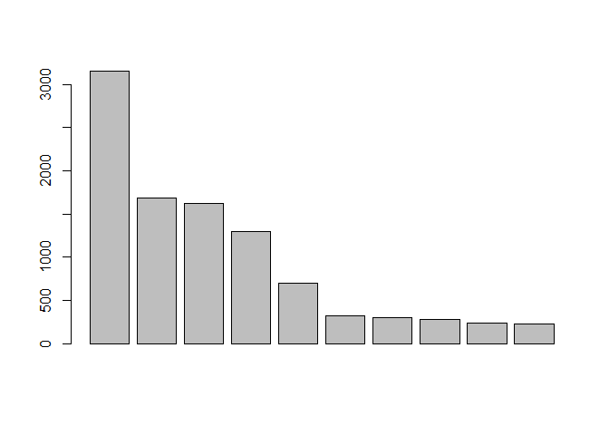<!-- -->

``` r
# Aprimorando...

# Alarga a margem da janela para o gráfico.
par(mar = c(7,10,4,2) + 0.1, family = "serif")

# Gráfico
barplot(head(tab_familia$f, 10), # Selecionamos as 10 famílias de maior frequência. 
        horiz = T, # Argumento para colocar as barras verticais ou horizontais. T e TRUE são equivalentes.
        xlab = "Frequências",  # Colocamos título do eixo x
        names.arg = c(head(tab_familia$Category, 10)), las = 2, # Colocamos os nomes das famílias em cada barra.
        cex = 0.8, cex.lab = 0.8, cex.axis = 0.8, col = heat.colors(10)) # Estabelecemos tamanho das letras
# e cores para as barras.

# Colocamos uma linha no eixo y.
abline(v = 0) 
```

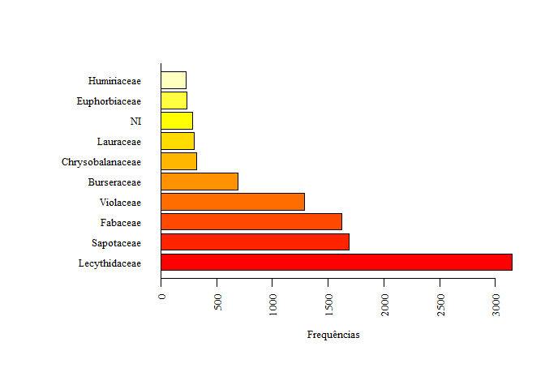<!-- -->

## 11.2. Variável quantitativa - diâmetro

``` r
### Histograma para as classes de diâmetro

# O mais simples
hist(dados_pp$dbh)
```

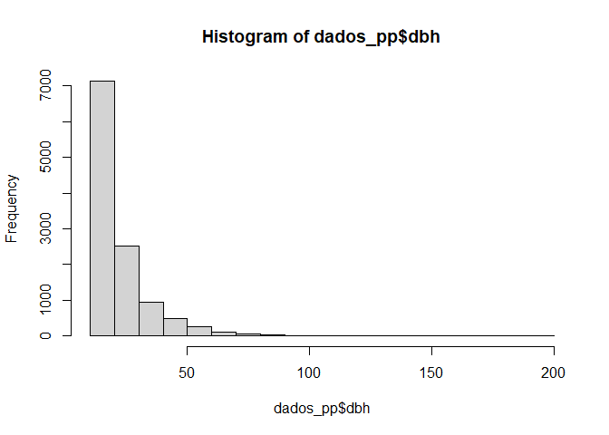<!-- -->

``` r
# Aprimorando...

# Gráfico
plot(tab_diametro, xlab = "Classes de diâmetro",ylab = "Frequências", # Determina a base de dados e títulos dos eixos 
     cex.axis = 0.4, cex.lab = 1, # Edita o tamanho das letras 
     col = c(rainbow(15))) # Edita as cores
```

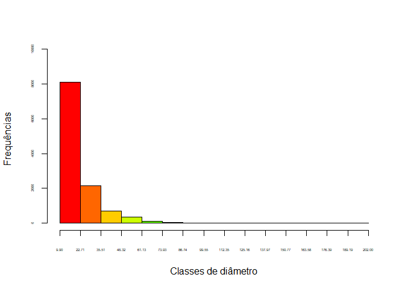<!-- -->

## 11.3. Prática

``` r
# Faça o mesmo gráfico de barras para as 10 principais espécies

# Alarga a margem da janela para o gráfico.
par(mar = c(7,10,4,2) + 0.1, family = "serif")

# Gráfico
barplot(head(tab_nome$f, 10), horiz = T, xlab = "Frequências",  names.arg = c(head(tab_nome$Category, 10)), las = 2, cex = 0.8, cex.lab = 0.8, cex.axis = 0.8, col = heat.colors(10)) 

# Colocamos uma linha no eixo y.
abline(v = 0) 
```

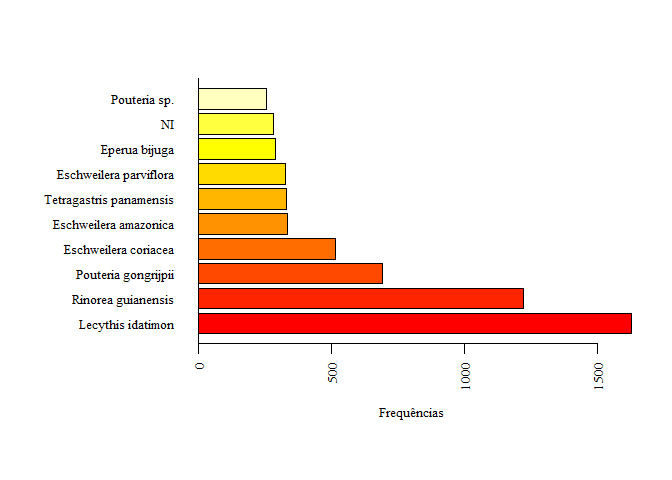<!-- -->

``` r
# Faça o histograma do diâmetro para Lecythis idatimon. Compare com o geral.
tab_lecythis <- fdt(lecythis_pp2$dbh)

# Gerando o histograma
plot(tab_lecythis, xlab = "Classes de diâmetro",ylab = "Frequências", cex.axis = 0.4, cex.lab = 1, col = c(rainbow(15)))
```

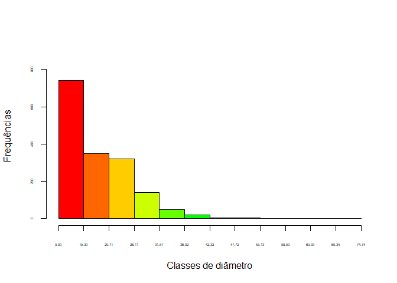<!-- -->

## 11.4. Boxplot

``` r
# O mais simples
boxplot(dados_pp2$dbh)
```

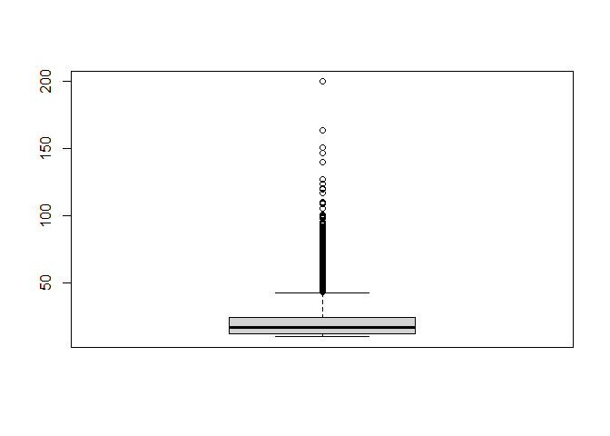<!-- -->

``` r
# Plotando os dados de diâmetro por transecto 
boxplot(data = dados_pp2, dbh ~ transect, xlab = "Transecto", ylab = "Diâmetro (cm)",col = terrain.colors(22))
```

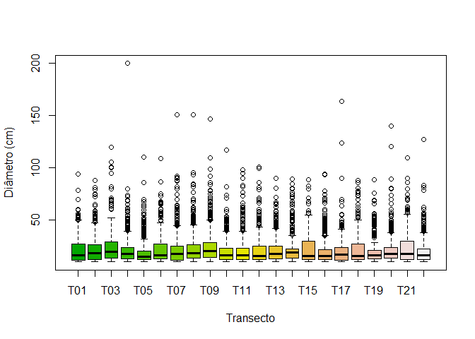<!-- -->

## 11.5. Prática 2

``` r
# Faça o boxplot para a altura nos transectos.
boxplot(data = dados_pp2, Htot ~ transect, xlab = "Transecto", ylab = "Diâmetro (cm)",col = terrain.colors(22))
```

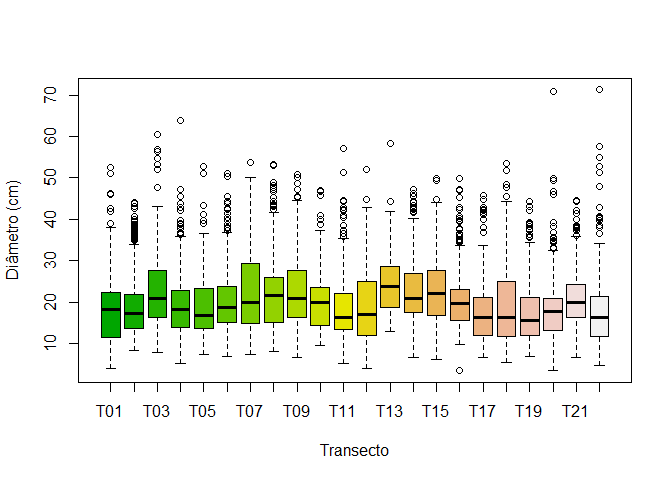<!-- -->

``` r
# Faça o boxplot do diâmetro para Lecythis idatimon nos transectos. Compare com o geral.
boxplot(data = lecythis_pp2, dbh ~ transect, xlab = "Transecto", ylab = "Diâmetro (cm)",col = terrain.colors(22))
```

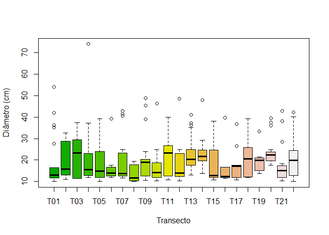<!-- -->

# 12. Associação entre variáveis

``` r
# Vamos explorar a associação entre diâmetro e altura

### Correlação linear
cor.test(dados_pp2$dbh, dados_pp2$Htot)
```

    ## 
    ##  Pearson's product-moment correlation
    ## 
    ## data:  dados_pp2$dbh and dados_pp2$Htot
    ## t = 103.54, df = 11515, p-value < 2.2e-16
    ## alternative hypothesis: true correlation is not equal to 0
    ## 95 percent confidence interval:
    ##  0.6847843 0.7037033
    ## sample estimates:
    ##       cor 
    ## 0.6943637

``` r
# Representação gráfica

# O mais simples
plot(data = dados_pp2, Htot ~ dbh)
```

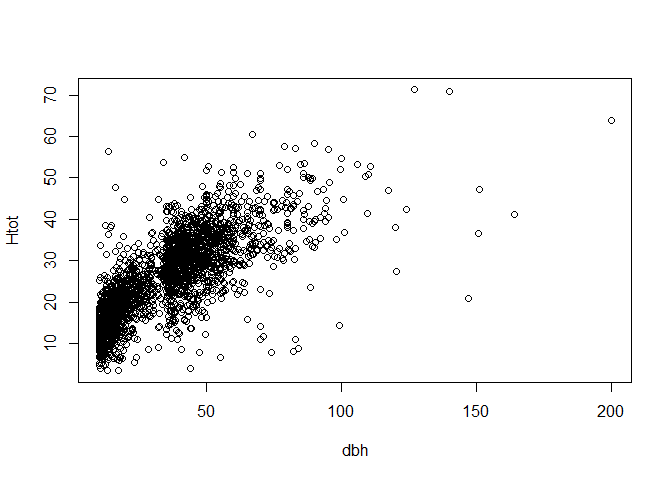<!-- -->

``` r
# Editando o gráfico
plot(data = dados_pp2, Htot ~ dbh, xlab = "Diâmetro (cm)", ylab = "Altura (m)")

# Adicionando linha de tendência
abline(lm(data = dados_pp, Htot ~ dbh), col="darkred", lwd=3.5)
```

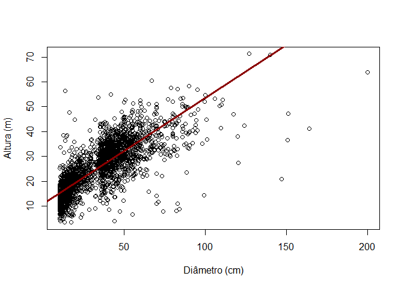<!-- -->

## 12.1. Prática

``` r
# Avalie a associação entre o diâmetro e o volume.
plot(data = dados_pp2, dbh ~ vol, ylab = "Diâmetro (cm)", xlab = "Volume (m³)")

# Adicionando linha de tendência
abline(lm(data = dados_pp, dbh ~ vol), col="darkred", lwd=3.5)
```

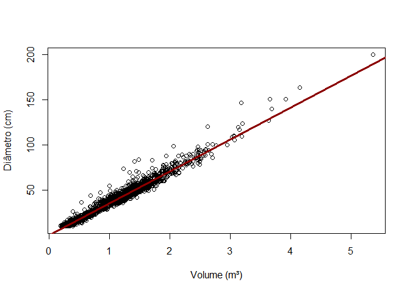<!-- -->
